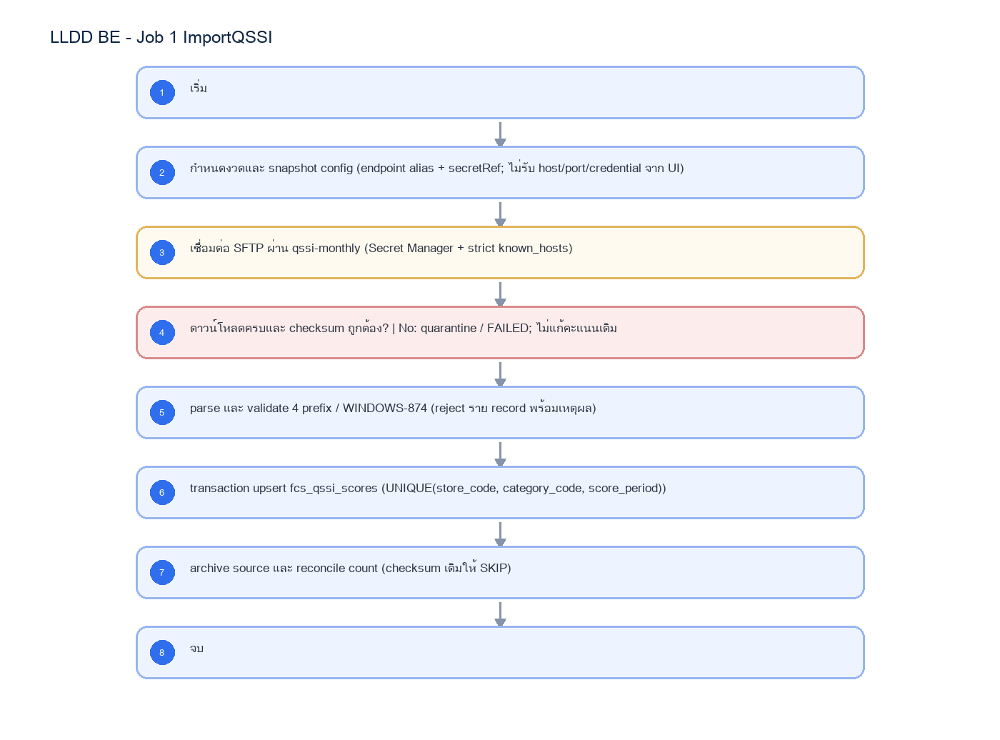

# LLDD BE - Job 1 ImportQSSI

SBP Mall - ระบบประกันรายได้ | Low Level Design Document

## 1. Overview

| รายการ | รายละเอียด |
| --- | --- |
| Track | BE |
| Estimate | 13 ชั่วโมง |
| Owner | Aphiwit <Bank> Khammoon |
| Objective | นำเข้าคะแนน QSSI รายเดือน: ดาวน์โหลดไฟล์คะแนน QSSI 4 ไฟล์ต่อเดือนผ่าน SFTP โหลดเข้าตารางพัก ทำ dedup และจับคู่หมวดคะแนนแบบ stateful แล้วลบงวดเดิมและ insert ลง fcs_qssi_scores เพื่อให้ Job 6 ใช้ตรวจความครบของคะแนน 6 หมวดก่อนปล่อยสถานะ INIT |

Common contract reference: ทุกหัวข้อ API/FE ต้องยึด LLDD-BE-API-Common-Contracts และ LLDD-FE-Integration-Contracts สำหรับ error/auth/format/pagination/action/RBAC ก่อนลงรายละเอียดเฉพาะหน้าหรือเฉพาะ endpoint

## 2. Screen / Functional Scope

- Main class/script: fcs.main.ImportQSSI / FCS_ImportQSSI.sh
- Phase: A
- Output: fcs_qssi_scores
- Estimate: 13 ชั่วโมง
- Runbook, rerun rule, risk และ history ต้องตามข้อมูลหน้า Batch Job

## 4. Implementation Flow Diagram (Reference)



_รูปที่ 1: Implementation flow reference: LLDD BE - Job 1 ImportQSSI_

## 5. Field, Format, and Validation

| Field / UI | Format | Validation | Behavior |
| --- | --- | --- | --- |
| กำหนดการรัน (Cron) | Monthly | แก้ไขได้ | ตั้งเวลาใน scheduler ผ่าน deployment config |
| งวดข้อมูล (เดือนที่รัน) | 07/2569 | แก้ไขได้ | ชื่อไฟล์ใช้เดือนปัจจุบัน แต่งวดใน DB คือเดือนก่อนหน้า |
| SFTP endpoint alias | qssi-monthly | ค่าคงที่/แก้ผ่านหน้าจอไม่ได้ | resolve host/port จาก environment; ไม่รับค่า host/port จาก request หรือ job_configs |
| Secret reference | secret/sbpgi/interfaces/qssi | ค่าคงที่/แก้ผ่านหน้าจอไม่ได้ | credential/private key อ่านจาก Secret Manager และบังคับ strict known_hosts |
| Remote Directory | /export/qssishare/onl/qssi/textfile/SBP/QSSI_Monthly/ | แก้ไขได้ | path เท่านั้น ไม่รวม credential |
| Local Directory | /appshare/SPS/FCS/interface_data/in/ | แก้ไขได้ | staging/quarantine path |
| File Prefix (4 ไฟล์) | mrs1trnf_, mrs2trnf_, mrs3trnf_, mrs5trnf_ | ค่าคงที่/แก้ผ่านหน้าจอไม่ได้ |  |
| Encoding | WINDOWS-874 | ค่าคงที่/แก้ผ่านหน้าจอไม่ได้ |  |
| Batch Insert Size | 10000 | แก้ไขได้ | จำนวนแถวต่อรอบ insert |

## 5.1 Input / Progress / Output Contract

| Stage | Contract for implementation |
| --- | --- |
| Input | QSSI score files from configured SFTP/import paths plus common-code category mapping. |
| Progress | download/find files, parse pipe-delimited records, stage temp rows, map category scores, delete existing period/category rows, insert final scores, backup source files, send status mail. |
| Output | FCS_QSSI_SCORE refreshed for the target period/category set; temp rows cleared; run summary contains file name, success/fail status, record count, and error detail. |

### 5.90 Job 1 Execution Stages

download/find files, parse pipe-delimited records, stage temp rows, map category scores, delete existing period/category rows, insert final scores, backup source files, send status mail.

| Order | Service step | Repository | Output / failure contract |
| --- | --- | --- | --- |
| 1 | downloadAndVerifyQssiFiles | qssiScoreRepository | คืน metrics และ throw typed error; transaction/rerun ใช้ contract ด้านล่าง |
| 2 | parseQssiFiles | qssiScoreRepository | คืน metrics และ throw typed error; transaction/rerun ใช้ contract ด้านล่าง |
| 3 | upsertScores | qssiScoreRepository | คืน metrics และ throw typed error; transaction/rerun ใช้ contract ด้านล่าง |
| 4 | archiveInboundFiles | qssiScoreRepository | คืน metrics และ throw typed error; transaction/rerun ใช้ contract ด้านล่าง |

### 5.91 Job 1 Run Evidence

| Evidence | Job-specific value | Acceptance |
| --- | --- | --- |
| Input identity | QSSI score files from configured SFTP/import paths plus common-code category mapping. | snapshot input file/business key/period in run record |
| Output identity | FCS_QSSI_SCORE refreshed for the target period/category set; temp rows cleared; run summary contains file name, success/fail status, record count, and error detail. | reconcile input, success, reject and skipped counts |
| Dedup proof | SHA-256 ของไฟล์ + UNIQUE(store_code, category_code, score_period); checksum เดิมให้ SKIP โดยไม่ลบข้อมูลเดิม | rerun fixture produces no duplicate target business key |
| Transaction proof | parse/validate นอก transaction; upsert คะแนนทั้งไฟล์และบันทึก interface tracking ใน transaction เดียว | injected failure leaves no partial committed state outside documented boundary |
| Security proof | credential อ่านด้วย secretRef=secret/sbpgi/interfaces/qssi; SFTP บังคับ strict host-key verification จาก known_hosts และห้ามเก็บ password/private key ใน job_configs | config/log/error contains no plaintext secret |

### 5.92 Legacy Java Source Reference

| Legacy file | Line range | Responsibility to carry forward |
| --- | --- | --- |
| fcsJar/src/th/co/gosoft/fcs/main/ImportQSSI.java | 31-246 | Legacy main entrypoint, SFTP/file orchestration, backup, and success/fail email. |
| fcsJar/src/th/co/gosoft/fcs/controller/ImportQSSIController.java | 55-212, 456-481 | Read QSSI files, map rows to score models, delete/insert score data in batches. |
| fcsJar/src/th/co/gosoft/fcs/dao/jdbc/ImportQSSIScoreJdbc.java | 17-77 | Insert/delete/query FCS_QSSI_SCORE and FCS_TMP_QSSI_SCORE. |

Line ranges refer to the legacy Java implementation under /Users/bank_mac/gosoft/java/SBP/fcsJar. Use these ranges to preserve business behavior while implementing the target Node job.

### 5.93 Target Repository and SQL Contract

| Contract | Target implementation |
| --- | --- |
| Repository | qssiScoreRepository |
| Idempotency / dedup | SHA-256 ของไฟล์ + UNIQUE(store_code, category_code, score_period); checksum เดิมให้ SKIP โดยไม่ลบข้อมูลเดิม |
| Transaction boundary | parse/validate นอก transaction; upsert คะแนนทั้งไฟล์และบันทึก interface tracking ใน transaction เดียว |
| Security | credential อ่านด้วย secretRef=secret/sbpgi/interfaces/qssi; SFTP บังคับ strict host-key verification จาก known_hosts และห้ามเก็บ password/private key ใน job_configs |

#### Input / candidate query

```sql
SELECT store_code, category_code, score_period, score_value, source_checksum
FROM fcs_qssi_scores
WHERE score_period = :score_period
ORDER BY store_code, category_code;
```

#### Write / upsert query

```sql
INSERT INTO fcs_qssi_scores
    (store_code, category_code, score_period, score_value, source_file_name, source_checksum, updated_at)
VALUES (:store_code, :category_code, :score_period, :score_value, :source_file_name, :source_checksum, CURRENT_TIMESTAMP)
ON CONFLICT (store_code, category_code, score_period)
DO UPDATE SET score_value = EXCLUDED.score_value,
              source_file_name = EXCLUDED.source_file_name,
              source_checksum = EXCLUDED.source_checksum,
              updated_at = CURRENT_TIMESTAMP;
```

### 5.94 Target Node Implementation

โครงสร้างนี้ระบุ service/repository เฉพาะงานและต้อง implement ตาม SQL, transaction, idempotency และ security contract ด้านบน โดยทุกขั้นต้องคืน metrics สำหรับ reconcile และ run history

```js
export async function runLlddBeJob1Importqssi(ctx, services) {
  const run = await services.jobRuns.acquire({
    jobNo: "1", period: ctx.period, triggeredBy: ctx.triggeredBy
  });

  try {
    ctx = { ...ctx, runId: run.id, repository: services.qssiScoreRepository };
    const step1 = await services.downloadAndVerifyQssiFiles(ctx, undefined);
    const step2 = await services.parseQssiFiles(ctx, step1);
    const step3 = await services.upsertScores(ctx, step2);
    const step4 = await services.archiveInboundFiles(ctx, step3);
    const result = step4;
    await services.jobRuns.finish(run.id, "SUCCESS", result.metrics);
    return { runId: run.id, status: "SUCCESS", ...result };
  } catch (error) {
    await services.jobRuns.finish(run.id, "FAILED", {
      errorCode: error.code ?? "JOB_FAILED",
      errorMessage: error.message
    });
    throw error;
  }
}
```

## 6. Button / User Action Mapping

| Action | Trigger | API / Service | Expected Result |
| --- | --- | --- | --- |
| เปิดดูรายละเอียด Job | GET | GET /api/v1/jobs/1 | คืน params/metadata ล่าสุด |
| บันทึกพารามิเตอร์ | PUT | PUT /api/v1/jobs/1/params | บันทึกเฉพาะ key ที่ editable และ audit |
| สั่งรันทันที | POST | POST /api/v1/jobs/1/run | สร้าง run history สถานะ RUNNING/QUEUED |
| เปิด/ปิดใช้งาน | PUT | PUT /api/v1/jobs/1/enabled | บันทึก enabled + audit พร้อม reason |

## 7. API Contract

### GET /api/v1/jobs/1

อ่าน metadata และพารามิเตอร์ของ Job

#### Query Params

```json
{
  "jobNo": "1"
}
```

#### Request Field Schema

| Field | Type | Required | Constraint / Meaning |
| --- | --- | --- | --- |
| jobNo | string | No | UTF-8; use value domain described by endpoint purpose |

#### Response

```json
{
  "jobNo": "1",
  "name": "ImportQSSI",
  "cron": "Monthly",
  "enabled": true,
  "params": [
    {
      "label": "กำหนดการรัน (Cron)",
      "value": "Monthly",
      "editable": true
    },
    {
      "label": "งวดข้อมูล (เดือนที่รัน)",
      "value": "07/2569",
      "editable": true
    },
    {
      "label": "SFTP endpoint alias",
      "value": "qssi-monthly",
      "editable": false
    },
    {
      "label": "Secret reference",
      "value": "secret/sbpgi/interfaces/qssi",
      "editable": false
    }
  ]
}
```

#### Response Field Schema

| Field | Type | Required | Constraint / Meaning |
| --- | --- | --- | --- |
| jobNo | string | Yes | UTF-8; use value domain described by endpoint purpose |
| name | string | Yes | UTF-8; use value domain described by endpoint purpose |
| cron | string | Yes | UTF-8; use value domain described by endpoint purpose |
| enabled | boolean | Yes | UTF-8; use value domain described by endpoint purpose |
| params | array<object> | Yes | JSON array; element type shown in Type column |
| params[].label | string | Yes | UTF-8; use value domain described by endpoint purpose |
| params[].value | string | Yes | UTF-8; use value domain described by endpoint purpose |
| params[].editable | boolean | Yes | UTF-8; use value domain described by endpoint purpose |

### PUT /api/v1/jobs/1/params

แก้ไขพารามิเตอร์ที่อนุญาตเท่านั้น

#### Request

```json
{
  "params": {
    "cron": "Monthly"
  },
  "reason": "ปรับรอบรันตาม Operations"
}
```

#### Request Field Schema

| Field | Type | Required | Constraint / Meaning |
| --- | --- | --- | --- |
| params | object | Yes | JSON object; nested fields listed below |
| params.cron | string | Yes | UTF-8; use value domain described by endpoint purpose |
| reason | string | Yes | trimmed UTF-8 Thai text; required by operation/business rule |

#### Response

```json
{
  "message": "saved"
}
```

#### Response Field Schema

| Field | Type | Required | Constraint / Meaning |
| --- | --- | --- | --- |
| message | string | Yes | UTF-8; use value domain described by endpoint purpose |

### POST /api/v1/jobs/1/run

สั่งรัน manual โดย guard ไม่ให้รันซ้อน

#### Request

```json
{
  "period": "2569-07"
}
```

#### Request Field Schema

| Field | Type | Required | Constraint / Meaning |
| --- | --- | --- | --- |
| period | string | Yes | UTF-8; use value domain described by endpoint purpose |

#### Response

```json
{
  "runId": "JOB1-RUN-001",
  "status": "RUNNING"
}
```

#### Response Field Schema

| Field | Type | Required | Constraint / Meaning |
| --- | --- | --- | --- |
| runId | string | Yes | UTF-8; use value domain described by endpoint purpose |
| status | string | Yes | UTF-8; use value domain described by endpoint purpose |

### GET /api/v1/jobs/1/runs

อ่านประวัติการรันล่าสุด

#### Query Params

```json
{
  "page": 1,
  "size": 20
}
```

#### Request Field Schema

| Field | Type | Required | Constraint / Meaning |
| --- | --- | --- | --- |
| page | integer | No | >= 1; default 1 |
| size | integer | No | 1..100; default 20 |

#### Response

```json
{
  "items": [
    {
      "startedAt": "01/07/2569 06:00",
      "status": "ok"
    }
  ]
}
```

#### Response Field Schema

| Field | Type | Required | Constraint / Meaning |
| --- | --- | --- | --- |
| items | array<object> | Yes | JSON array; element type shown in Type column |
| items[].startedAt | string | Yes | ISO-8601 ค.ศ.; nullable only when type includes null |
| items[].status | string | Yes | UTF-8; use value domain described by endpoint purpose |

## 8. Reference DB Mapping (No Database Page Work)

ส่วนนี้เป็นข้อมูลอ้างอิงสำหรับการ implement API/Job เท่านั้น ไม่ใช่งานสร้างหน้า Database, ไม่ใช่งานออกแบบ DB page และไม่ถูกนับเป็น deliverable แยกของ FE/BE

| Table / Object | R/W | Usage |
| --- | --- | --- |
| fcs_qssi_scores | W | ตารางคะแนนปลายทาง (ลบงวด/หมวดเดิมแล้ว insert ใหม่) โดยผ่านการ staging ข้อมูล |

## 9. Processing Flow

| Step | Description |
| --- | --- |
| 1 | เริ่ม |
| 2 | กำหนดงวดและ snapshot config (endpoint alias + secretRef; ไม่รับ host/port/credential จาก UI) |
| 3 | เชื่อมต่อ SFTP ผ่าน qssi-monthly (Secret Manager + strict known_hosts) |
| 4 | ดาวน์โหลดครบและ checksum ถูกต้อง? \| No: quarantine / FAILED; ไม่แก้คะแนนเดิม |
| 5 | parse และ validate 4 prefix / WINDOWS-874 (reject ราย record พร้อมเหตุผล) |
| 6 | transaction upsert fcs_qssi_scores (UNIQUE(store_code, category_code, score_period)) |
| 7 | archive source และ reconcile count (checksum เดิมให้ SKIP) |
| 8 | จบ |

## 10. Acceptance Criteria

- อ่าน/แก้พารามิเตอร์ได้ตาม editable flag เท่านั้น
- การสั่งรันต้องตรวจ enabled และไม่มีรอบ RUNNING เดิม
- ต้องบันทึก job_run_histories และ audit_logs สำหรับทุก mutation
- DB/table mapping ใช้เป็น reference สำหรับ implement Job เท่านั้น ไม่ใช่งานสร้างหน้า Database
- รองรับ rerun rule และ risk note ตาม runbook

## 11. Developer Test Checklist

| No | Test |
| --- | --- |
| 1 | GET job detail |
| 2 | PUT params with editable key |
| 3 | PUT params locked business key must fail |
| 4 | POST run while running must fail |
| 5 | GET run histories |
| 6 | ตรวจผลกระทบตารางตาม R/W mapping reference |
