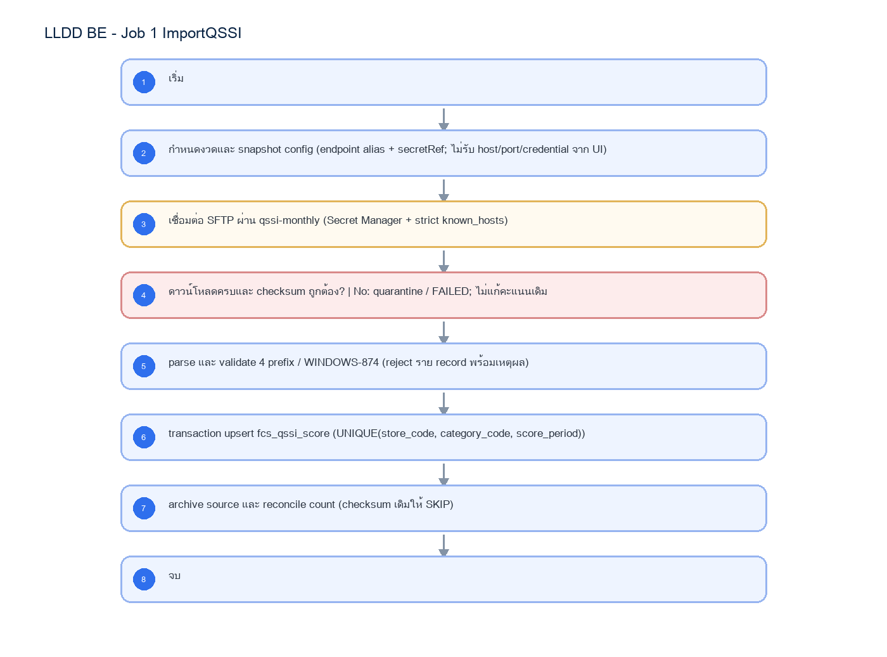

# LLDD BE - Job 1 ImportQSSI

SBP Mall - ระบบประกันรายได้ | Low Level Design Document

## 1. Overview

| รายการ | รายละเอียด |
| --- | --- |
| Track | BE |
| Estimate | **21 ชั่วโมง** = implementation 16 + unit test 5 (30%) |
| Owner | Aphiwit <Bank> Khammoon |
| Target repository | `SBP/srm-sps-spsap-store-backend` (NestJS + TypeORM · schema `sps_store`) — batch runner ฝั่ง backend **ไม่ผ่าน BFF** · cron/พารามิเตอร์อยู่ใน backend config (env/config file) |
| Objective | นำเข้าคะแนน QSSI รายเดือน: ดาวน์โหลดไฟล์คะแนน QSSI 4 ไฟล์ต่อเดือนผ่าน SFTP โหลดเข้าตารางพัก ทำ dedup และจับคู่หมวดคะแนนแบบ stateful แล้วลบงวดเดิมและ insert ลง fcs_qssi_score เพื่อให้ Job 6 ใช้ตรวจความครบของคะแนน 6 หมวดก่อนปล่อยสถานะ INIT |

Common contract reference: ทุกหัวข้อ API/FE ต้องยึด LLDD-BE-API-Common-Contracts และ LLDD-FE-Integration-Contracts สำหรับ error/auth/format/pagination/action/RBAC ก่อนลงรายละเอียดเฉพาะหน้าหรือเฉพาะ endpoint

## 2. Screen / Functional Scope

- Main class/script: fcs.main.ImportQSSI / FCS_ImportQSSI.sh
- Phase: A
- Output: fcs_qssi_score
- Estimate: 16 ชั่วโมง
- พารามิเตอร์/cron อ่านจาก backend config (config file/env) — ไม่มีตาราง job_configs และไม่มีหน้าจอควบคุม (หน้า Flow Batch Job ในกลุ่มเมนู Flow เหลือแค่ Flowchart + Database ที่ใช้ · 2026-08-06)
- Runbook, rerun rule, risk และ history ตามเอกสาร Batch v4.0 · ผลการรันเขียน application log แบบ structured

## 3. Screenshot Reference

ไม่มีภาพหน้าจอสำหรับหัวข้อนี้ — เป็นเอกสารฝั่ง Backend/Batch ที่ไม่มี UI (ภาพหน้าจอทั้งหมดอยู่ในเอกสารชุด FE)

## 4. Implementation Flow Diagram (Reference)



_รูปที่ 1: Implementation flow reference: LLDD BE - Job 1 ImportQSSI_

## 5. Field, Format, and Validation

| Field / UI | Format | Validation | Behavior |
| --- | --- | --- | --- |
| กำหนดการรัน (Cron) | Monthly | แก้ไขได้ | ตั้งเวลาใน scheduler ผ่าน deployment config |
| งวดข้อมูล (เดือนที่รัน) | 07/2026 | แก้ไขได้ | ชื่อไฟล์ใช้เดือนปัจจุบัน แต่งวดใน DB คือเดือนก่อนหน้า |
| SFTP endpoint alias | qssi-monthly | ค่าคงที่/แก้ผ่านหน้าจอไม่ได้ | resolve host/port จาก environment; ไม่รับค่า host/port จาก request — resolve จาก environment เท่านั้น |
| Secret reference | secret/sbpgi/interfaces/qssi | ค่าคงที่/แก้ผ่านหน้าจอไม่ได้ | credential/private key อ่านจาก Secret Manager และบังคับ strict known_hosts |
| Remote Directory | /export/qssishare/onl/qssi/textfile/SBP/QSSI_Monthly/ | แก้ไขได้ | path เท่านั้น ไม่รวม credential |
| Local Directory | /appshare/SPS/FCS/interface_data/in/ | แก้ไขได้ | staging/quarantine path |
| File Prefix (4 ไฟล์) | mrs1trnf_, mrs2trnf_, mrs3trnf_, mrs5trnf_ | ค่าคงที่/แก้ผ่านหน้าจอไม่ได้ |  |
| Encoding | WINDOWS-874 | ค่าคงที่/แก้ผ่านหน้าจอไม่ได้ |  |
| Batch Insert Size | 10000 | แก้ไขได้ | จำนวนแถวต่อรอบ insert |

### 5.9 Input / Progress / Output Contract

| Stage | Contract for implementation |
| --- | --- |
| Input | QSSI score files from configured SFTP/import paths plus common-code category mapping. |
| Progress | download/find files, parse pipe-delimited records, stage temp rows, map category scores, delete existing period/category rows, insert final scores, backup source files, send status mail. |
| Output | FCS_QSSI_SCORE refreshed for the target period/category set; temp rows cleared; run summary contains file name, success/fail status, record count, and error detail. |

### 5.90 Job 1 Execution Stages

download/find files, parse pipe-delimited records, stage temp rows, map category scores, delete existing period/category rows, insert final scores, backup source files, send status mail.

| Order | Service step | Repository | Output / failure contract |
| --- | --- | --- | --- |
| 1 | downloadAndVerifyQssiFiles | qssiScoreRepository | คืน metrics และ throw typed error; transaction/rerun ใช้ contract ด้านล่าง |
| 2 | parseQssiFiles | qssiScoreRepository | คืน metrics และ throw typed error; transaction/rerun ใช้ contract ด้านล่าง |
| 3 | upsertScores | qssiScoreRepository | คืน metrics และ throw typed error; transaction/rerun ใช้ contract ด้านล่าง |
| 4 | archiveInboundFiles | qssiScoreRepository | คืน metrics และ throw typed error; transaction/rerun ใช้ contract ด้านล่าง |

### 5.91 Job 1 Run Evidence

| Evidence | Job-specific value | Acceptance |
| --- | --- | --- |
| Input identity | QSSI score files from configured SFTP/import paths plus common-code category mapping. | snapshot input file/business key/period in run record |
| Output identity | FCS_QSSI_SCORE refreshed for the target period/category set; temp rows cleared; run summary contains file name, success/fail status, record count, and error detail. | reconcile input, success, reject and skipped counts |
| Dedup proof | ⚠️ ตารางจริงไม่มี UNIQUE และไม่มีคอลัมน์ checksum — เก็บ SHA-256 ของไฟล์ไว้ที่ interface_transactions.file_checksum แทน แล้ว SKIP ทั้งงวดถ้า checksum ซ้ำ · การเพิ่ม unique index บน fcs_qssi_score เป็นข้อค้าง DP-4 (ต้อง sign-off เจ้าของ performance.service.ts) | rerun fixture produces no duplicate target business key |
| Transaction proof | parse/validate นอก transaction; upsert คะแนนทั้งไฟล์และบันทึก interface tracking ใน transaction เดียว | injected failure leaves no partial committed state outside documented boundary |
| Security proof | credential อ่านด้วย secretRef=secret/sbpgi/interfaces/qssi; SFTP บังคับ strict host-key verification จาก known_hosts และห้ามเก็บ password/private key ในไฟล์ config หรือ env โดยตรง (อ่านจาก Secret Manager เท่านั้น) | config/log/error contains no plaintext secret |

### 5.92 Legacy Java Source Reference

| Legacy file | Line range | Responsibility to carry forward |
| --- | --- | --- |
| fcsJar/src/th/co/gosoft/fcs/main/ImportQSSI.java | 31-246 | Legacy main entrypoint, SFTP/file orchestration, backup, and success/fail email. |
| fcsJar/src/th/co/gosoft/fcs/controller/ImportQSSIController.java | 55-212, 456-481 | Read QSSI files, map rows to score models, delete/insert score data in batches. |
| fcsJar/src/th/co/gosoft/fcs/dao/jdbc/ImportQSSIScoreJdbc.java | 17-77 | Insert/delete/query FCS_QSSI_SCORE and FCS_TMP_QSSI_SCORE. |

Line ranges refer to the legacy Java implementation under /Users/bank_mac/gosoft/java/SBP/fcsJar. Use these ranges to preserve business behavior while implementing the target Node job.

### 5.93 Target Repository and SQL Contract

| Contract | Target implementation |
| --- | --- |
| Repository | qssiScoreRepository |
| Idempotency / dedup | ⚠️ ตารางจริงไม่มี UNIQUE และไม่มีคอลัมน์ checksum — เก็บ SHA-256 ของไฟล์ไว้ที่ interface_transactions.file_checksum แทน แล้ว SKIP ทั้งงวดถ้า checksum ซ้ำ · การเพิ่ม unique index บน fcs_qssi_score เป็นข้อค้าง DP-4 (ต้อง sign-off เจ้าของ performance.service.ts) |
| Transaction boundary | parse/validate นอก transaction; upsert คะแนนทั้งไฟล์และบันทึก interface tracking ใน transaction เดียว |
| Security | credential อ่านด้วย secretRef=secret/sbpgi/interfaces/qssi; SFTP บังคับ strict host-key verification จาก known_hosts และห้ามเก็บ password/private key ในไฟล์ config หรือ env โดยตรง (อ่านจาก Secret Manager เท่านั้น) |

#### Input / candidate query

```sql
-- ⚠️ คอลัมน์จริงของ sps_store.fcs_qssi_score มี 7 ตัวเท่านั้น:
--    id · store_id · category · month · year · score · create_date
--    ไม่มี source_file_name / source_checksum / updated_at และ "ไม่มี UNIQUE" (index เดียวคือ PK บน id)
SELECT store_id, category, month, year, score
FROM fcs_qssi_score
WHERE month = :month AND year = :year
ORDER BY store_id, category;
```

#### Write / upsert query

```sql
-- ⚠️ ON CONFLICT ใช้ไม่ได้กับตารางจริง — ไม่มี unique constraint บน (store_id, category, month, year)
--    ต้องปิดข้อค้าง DP-4 ก่อน (เพิ่ม unique index บนตารางเดิม ต้อง sign-off เจ้าของ performance.service.ts)
--    ระหว่างยังไม่ปิด: กันซ้ำที่ระดับงาน — ลบงวดเดิมก่อนแล้วค่อย insert ภายใน transaction เดียว
DELETE FROM fcs_qssi_score WHERE month = :month AND year = :year;
INSERT INTO fcs_qssi_score (store_id, category, month, year, score, create_date)
VALUES (:store_id, :category, :month, :year, :score, CURRENT_TIMESTAMP);
```

### 5.94 Target Node Implementation

โครงสร้างนี้ระบุ service/repository เฉพาะงานและต้อง implement ตาม SQL, transaction, idempotency และ security contract ด้านบน โดยทุกขั้นต้องคืน metrics สำหรับ reconcile และ run history

```js
export async function runLlddBeJob1Importqssi(ctx, services) {
  const run = await services.jobRuns.acquire({
    jobNo: "1", period: ctx.period, triggeredBy: ctx.triggeredBy
  });

  try {
    ctx = { ...ctx, runId: run.id, repository: services.qssiScoreRepository };
    const step1 = await services.downloadAndVerifyQssiFiles(ctx, undefined);
    const step2 = await services.parseQssiFiles(ctx, step1);
    const step3 = await services.upsertScores(ctx, step2);
    const step4 = await services.archiveInboundFiles(ctx, step3);
    const result = step4;
    await services.jobRuns.finish(run.id, "SUCCESS", result.metrics);
    return { runId: run.id, status: "SUCCESS", ...result };
  } catch (error) {
    await services.jobRuns.finish(run.id, "FAILED", {
      errorCode: error.code ?? "JOB_FAILED",
      errorMessage: error.message
    });
    throw error;
  }
}
```

## 6. Button / User Action Mapping

| Action | Trigger | API / Service | Expected Result |
| --- | --- | --- | --- |
| รันตามตารางเวลา | CRON | scheduler → runner (job 1) | อ่าน cron/พารามิเตอร์จาก backend config |
| รันนอกรอบ (manual/rerun) | CLI | CLI/ops runbook → runner (job 1) | guard ไม่ให้รันซ้อนด้วย distributed lock |
| แก้พารามิเตอร์/เปิด-ปิด job | CONFIG | แก้ backend config แล้ว deploy | ไม่มี endpoint และไม่มีหน้าจอควบคุม — หน้า Flow Batch Job เป็น reference อย่างเดียว (2026-08-06) |
| ตรวจผลการรัน | LOG | application log (structured) | ไม่มีตาราง job_run_histories แล้ว · ไฟล์/ACK ดูที่ interface_transactions |

## 7. API Contract

## 8. Reference DB Mapping (No Database Page Work)

ส่วนนี้เป็นข้อมูลอ้างอิงสำหรับการ implement API/Job เท่านั้น ไม่ใช่งานสร้างหน้า Database, ไม่ใช่งานออกแบบ DB page และไม่ถูกนับเป็น deliverable แยกของ FE/BE

| Table / Object | R/W | Usage |
| --- | --- | --- |
| fcs_qssi_score | W | ตารางคะแนนปลายทาง (ลบงวด/หมวดเดิมแล้ว insert ใหม่) โดยผ่านการ staging ข้อมูล |

## 9. Skeleton Code (Batch Job 1)

#### 9.1 ผังไฟล์ที่ต้องสร้าง (Job 1)

โครงไฟล์ของ Job 1 (fcs.main.ImportQSSI เดิม) วางใต้ `src/batch/sbpgi/` ของ store-backend โดยใช้ convention เดียวกับ module ธุรกิจอื่น: inject custom provider `DATA_SOURCE` แล้วยิง raw SQL, repository ประกาศเป็น factory provider ที่ใช้ token string, entity อยู่ใน `src/entitys/`

**หมายเหตุสำคัญ — `src/batch/*` ทั้งชุดเป็นของใหม่ที่ยังไม่มีใน store-backend**: ปัจจุบัน repo ไม่มีโฟลเดอร์ `src/batch` เลย และแม้จะติดตั้ง `@nestjs/schedule` ไว้แล้วก็ยัง**ไม่มี `@Cron`/`@Interval` แม้แต่จุดเดียว** ดังนั้น `runner.ts` / `scheduler.ts` / `cli.js` / `job-failure.notifier.ts` คือ **งานตั้งต้นของ Phase แรก** ที่ต้องสร้างเองทั้งหมด พร้อม register `ScheduleModule.forRoot()` ใน `app.module.ts` — ไม่ใช่ของเดิมที่ reuse ได้

| Path | หน้าที่ |
| --- | --- |
| src/batch/sbpgi/job-1-import-qssi/job-1-import-qssi.job.ts | คลาส `ImportQssiJob` — `run(ctx)` เรียงตาม flow ของ Job 1 ทีละขั้น, ครอบ transaction, จบด้วย structured log |
| src/batch/sbpgi/job-1-import-qssi/job-1-import-qssi.service.ts | คลาส `ImportQssiService` — logic ต่อขั้น (อ่าน/parse/คำนวณ/เขียน) + repository token ที่ inject จาก `DATA_SOURCE` |
| src/batch/sbpgi/job-1-import-qssi/job-1-import-qssi.config.ts | คลาส `SbpgiJob1Config` (แบบเดียวกับ `src/config/app.config.ts` — โปรเจกต์นี้ไม่ใช้ `registerAs`) — cron และพารามิเตอร์ทั้ง 9 ตัวของ Job 1 อ่านจาก env/config file (ไม่มีตาราง job_configs) |
| src/batch/sbpgi/job-1-import-qssi/job-1-import-qssi.module.ts | NestJS module ผูก job + service + repository provider (factory token string) เข้ากับ `DatabaseModule` |
| src/batch/runner.ts | ตัวรันกลาง: resolve job ตาม jobNo, กันรันซ้อนด้วย advisory lock, จับ error → แจ้งเตือน, เขียน structured log สรุป (ใช้ร่วมทั้ง 11 job) |
| src/batch/scheduler.ts | ลงทะเบียน cron จาก config (`SBPGI_JOB1_CRON` = `Monthly`) และรองรับสั่งรันนอกรอบผ่าน CLI/runbook |
| src/batch/job-failure.notifier.ts | ส่งอีเมลแจ้งผู้ดูแลเมื่อ job ล้มเหลว ผ่าน `EmailLibService` ของ `@gosoft-sbp/email-lib` (log ลง `email_sent` ให้อัตโนมัติ) |

#### 9.2 Config Schema ของ Job 1 (backend config / env)

cron ปัจจุบันของ Job 1 คือ `Monthly` (รายเดือน (ต้นเดือน)) — ประกาศเป็น `SBPGI_JOB1_CRON` และอ่านตอน bootstrap ของ `scheduler.ts`; ถ้า `enabled=false` scheduler ต้องไม่ลงทะเบียน cron ของ job นี้

```ts
// src/batch/sbpgi/job-1-import-qssi/job-1-import-qssi.config.ts
// convention จริงของ store-backend คือคลาส config (`src/config/app.config.ts` ที่ export ผ่าน
// `AppConfigModule` แบบ @Global แล้วอ่าน process.env ตรง ๆ) — โปรเจกต์นี้ **ไม่ได้ใช้ registerAs**
// แม้แต่จุดเดียว จึงประกาศเป็นคลาสให้รีวิว/ทดสอบเหมือน config ตัวอื่น
import { Injectable } from '@nestjs/common';

// TODO: Job 1 ไม่มีตาราง job_configs และไม่มี Job Admin API แล้ว (ตัดสินใจ 2026-08-06)
// TODO: ค่าทุกตัวอ่านจาก env/config file ของ backend เท่านั้น — เปลี่ยนค่า = แก้ config แล้ว deploy
export interface Job1Config {
  /** เปิด/ปิด job รอบถัดไปโดยไม่ต้อง deploy โค้ด */
  enabled: boolean;
  /** cron ของ job นี้ (อ่านตอน bootstrap ของ scheduler.ts) */
  cron: string;
  /** กำหนดการรัน (Cron) — ตั้งเวลาใน scheduler ผ่าน deployment config */
  cron: string;
  /** งวดข้อมูล (เดือนที่รัน) — ชื่อไฟล์ใช้เดือนปัจจุบัน แต่งวดใน DB คือเดือนก่อนหน้า */
  period: string;
  /** SFTP endpoint alias — resolve host/port จาก environment; ไม่รับค่า host/port จาก request — resolve จาก environment เท่านั้น */
  sftpEndpointAlias: string;
  /** Secret reference — credential/private key อ่านจาก Secret Manager และบังคับ strict known_hosts */
  secretReference: string;
  /** Remote Directory — path เท่านั้น ไม่รวม credential */
  remoteDirectory: string;
  /** Local Directory — staging/quarantine path */
  localDirectory: string;
  /** File Prefix (4 ไฟล์) */
  filePrefix: string;
  /** Encoding */
  encoding: string;
  /** Batch Insert Size — จำนวนแถวต่อรอบ insert */
  batchInsertSize: number;
  /** ผู้รับอีเมลเมื่อ job ล้มเหลว — เก็บเป็น string คั่น comma ให้ตรง signature ของ
      `EmailLibService.sendMail({ mailTo })` ที่รับ string ไม่ใช่ string[] */
  mailTo: string;
}

@Injectable()
export class SbpgiJob1Config implements Job1Config {
  // TODO: ยืนยันค่า default ทุกตัวกับ Ops ก่อนขึ้น production (ไม่มีหน้าจอแก้ค่าแล้ว)
  enabled = (process.env.SBPGI_JOB1_ENABLED ?? 'true') === 'true';
  cron = process.env.SBPGI_JOB1_CRON ?? 'Monthly';
  cron = process.env.SBPGI_JOB1_CRON ?? 'Monthly'; // TODO: แก้ผ่าน env/config file แล้ว deploy
  period = process.env.SBPGI_JOB1_PERIOD ?? '07/2026'; // TODO: แก้ผ่าน env/config file แล้ว deploy
  sftpEndpointAlias = process.env.SBPGI_JOB1_SFTP_ENDPOINT_ALIAS ?? 'qssi-monthly'; // TODO: ค่าคงที่ทางธุรกิจ — เปลี่ยนต้องผ่านการอนุมัติ
  secretReference = process.env.SBPGI_JOB1_SECRET_REFERENCE ?? 'secret/sbpgi/interfaces/qssi'; // TODO: ค่าคงที่ทางธุรกิจ — เปลี่ยนต้องผ่านการอนุมัติ
  remoteDirectory = process.env.SBPGI_JOB1_REMOTE_DIRECTORY ?? '/export/qssishare/onl/qssi/textfile/SBP/QSSI_Monthly/'; // TODO: แก้ผ่าน env/config file แล้ว deploy
  localDirectory = process.env.SBPGI_JOB1_LOCAL_DIRECTORY ?? '/appshare/SPS/FCS/interface_data/in/'; // TODO: แก้ผ่าน env/config file แล้ว deploy
  filePrefix = process.env.SBPGI_JOB1_FILE_PREFIX ?? 'mrs1trnf_, mrs2trnf_, mrs3trnf_, mrs5trnf_'; // TODO: ค่าคงที่ทางธุรกิจ — เปลี่ยนต้องผ่านการอนุมัติ
  encoding = process.env.SBPGI_JOB1_ENCODING ?? 'WINDOWS-874'; // TODO: ค่าคงที่ทางธุรกิจ — เปลี่ยนต้องผ่านการอนุมัติ
  batchInsertSize = Number(process.env.SBPGI_JOB1_BATCH_INSERT_SIZE ?? 10000); // TODO: แก้ผ่าน env/config file แล้ว deploy
  mailTo = process.env.SBPGI_JOB1_MAIL_TO ?? ''; // TODO: ผู้รับอีเมลแจ้ง error คั่นด้วย comma (เดิม: storeretention (Cc ว่าง))
}

// TODO: เพิ่ม SbpgiJob1Config ใน providers/exports ของ AppConfigModule (@Global) เหมือน AppConfig
```

#### 9.3 Job Class — `run(ctx)` ของ Job 1 ทีละขั้นตามผัง

##### 9.3.1 สัญญาของชั้นกลาง (`runner.ts`) + โครง service ของ Job 1

job class อ้าง `JobRunContext` / `JobRunResult` / `JobState` / `JobFailedError` — ทั้งหมดนิยาม ครั้งเดียวใน `src/batch/runner.ts` (ไฟล์ร่วมของทุก job ให้ merge ไม่ใช่เขียนทับ) และ service ต้องมี method ครบตามตารางขั้นตอนด้านล่าง มิฉะนั้น job class จะเรียก method ที่ไม่มีอยู่

```ts
// src/batch/runner.ts — สัญญากลางของทุก job (ประกาศครั้งเดียว ใช้ร่วมทั้ง 11 ฉบับ)

export interface JobRunContext {
  jobNo: string;
  period: string;        // YYYYMM ของงวดที่รัน
  triggeredBy: string;   // 'CRON' | userId ที่สั่งรันนอกรอบ
  params?: Record<string, string>;
}

export interface JobRunResult {
  event: 'job.finish';
  jobNo: string;
  jobName: string;
  status: 'SUCCESS' | 'SKIPPED' | 'SKIPPED_LOCKED' | 'FAILED';
  period: string;
  output: string;
  read: number; written: number; skipped: number; rejected: number;
  durationMs: number;
}

/** counter + ค่าที่ทุกขั้นของ job ใช้ร่วมกัน (service เป็นผู้สร้างผ่าน createState) */
export interface JobState {
  period: string;
  read: number; written: number; skipped: number; rejected: number;
  // TODO: เพิ่ม field เฉพาะของ job นี้ (เช่น rows ที่อ่านมา, path ไฟล์ที่เขียน)
  [key: string]: unknown;
}

/** error ที่ทำให้ job จบเป็น FAILED และส่งอีเมลแจ้งผู้ดูแล */
export class JobFailedError extends Error {
  constructor(public readonly code: string, message: string) { super(message); }
}

/** ใช้ออกจาก transaction เมื่อสาขา NO บอกให้ข้ามงวด/เรคคอร์ด — runner สรุปเป็น SKIPPED ไม่ใช่ FAILED */
export class JobSkippedError extends Error {}
```

```ts
// ImportQssiService — method ที่ job class เรียก (1 method ต่อ 1 ขั้นในตารางด้านบน)
import { Inject, Injectable } from '@nestjs/common';
import type { DataSource, EntityManager } from 'typeorm';
import type { JobRunContext, JobState } from '../../runner';
export type { JobState };

@Injectable()
export class ImportQssiService {
  constructor(@Inject('DATA_SOURCE') private readonly dataSource: DataSource) {}

  createState(ctx: JobRunContext): JobState {
    return { period: ctx.period, read: 0, written: 0, skipped: 0, rejected: 0 };
  }

  // กำหนดงวดและ snapshot config
  async step02ResolvePeriod(state: JobState, manager?: EntityManager): Promise<void> {
    // TODO: implement
  }

  // เชื่อมต่อ SFTP ผ่าน qssi-monthly
  async step03Connect(state: JobState, manager?: EntityManager): Promise<void> {
    // TODO: implement
  }

  // ดาวน์โหลดครบและ checksum ถูกต้อง?
  async check04Download(state: JobState): Promise<boolean> {
    return true; // TODO: เงื่อนไขจริงตามผัง
  }

  // parse และ validate 4 prefix / WINDOWS-874
  async step05Parse(state: JobState, manager?: EntityManager): Promise<void> {
    // TODO: implement
  }

  // transaction upsert fcs_qssi_score
  async step06Upsert(state: JobState, manager?: EntityManager): Promise<void> {
    // TODO: implement
  }

  // archive source และ reconcile count
  async step07Validate(state: JobState, manager?: EntityManager): Promise<void> {
    // TODO: implement
  }

}
```

##### 9.3.2 `run(ctx)` ของ Job 1

ทุกขั้นใน `run()` ตรงกับ flowchart ของ Job 1 หนึ่งต่อหนึ่ง (decision และ error path รวมอยู่ด้วย) — method ที่ต้อง implement ใน service ตามตารางนี้

| ลำดับ | ชนิด | ขั้นตอนจากผัง | Method ที่ต้อง implement | เส้นทาง NO / error |
| --- | --- | --- | --- | --- |
| 1 | start | เริ่ม | createState() | - |
| 2 | process | กำหนดงวดและ snapshot config | step02ResolvePeriod() | throw JobFailedError เมื่อทำไม่สำเร็จ |
| 3 | io | เชื่อมต่อ SFTP ผ่าน qssi-monthly | step03Connect() | throw JobFailedError เมื่อทำไม่สำเร็จ |
| 4 | decision | ดาวน์โหลดครบและ checksum ถูกต้อง? | check04Download() | [err] quarantine / FAILED; ไม่แก้คะแนนเดิม |
| 5 | process | parse และ validate 4 prefix / WINDOWS-874 | step05Parse() | throw JobFailedError เมื่อทำไม่สำเร็จ |
| 6 | process | transaction upsert fcs_qssi_score | step06Upsert() | throw JobFailedError เมื่อทำไม่สำเร็จ |
| 7 | process | archive source และ reconcile count | step07Validate() | throw JobFailedError เมื่อทำไม่สำเร็จ |
| 8 | end | จบ | summarize() | - |

```ts
// src/batch/sbpgi/job-1-import-qssi/job-1-import-qssi.job.ts
import { Inject, Injectable, Logger } from '@nestjs/common';
import type { DataSource, EntityManager } from 'typeorm';
import { ImportQssiService, type JobState } from './job-1-import-qssi.service';
// 4 symbol นี้นิยามใน src/batch/runner.ts (ดูหัวข้อ 9.3.1)
import { JobFailedError, JobSkippedError, JobRunContext, JobRunResult } from '../../runner';

@Injectable()
export class ImportQssiJob {
  static readonly jobNo = '1';
  private readonly logger = new Logger(ImportQssiJob.name);

  constructor(
    // TODO: DATA_SOURCE = custom provider ที่ route SELECT/WITH ไป slave pool และ write ไป master
    @Inject('DATA_SOURCE') private readonly dataSource: DataSource,
    private readonly service: ImportQssiService,
  ) {}

  async run(ctx: JobRunContext): Promise<JobRunResult> {
    const startedAt = Date.now();
    // TODO: state ถือ counter (read/written/skipped/rejected) และค่าจาก job1Config
    const state = this.service.createState(ctx);
    try {
      // ขั้นที่ 2: กำหนดงวดและ snapshot config · TODO: endpoint alias + secretRef; ไม่รับ host/port/credential จาก UI
      await this.service.step02ResolvePeriod(state);
      // ขั้นที่ 3: เชื่อมต่อ SFTP ผ่าน qssi-monthly · TODO: Secret Manager + strict known_hosts
      await this.service.step03Connect(state);
      // ขั้นที่ 4 (decision): ดาวน์โหลดครบและ checksum ถูกต้อง?
      const ok04 = await this.service.check04Download(state);
      if (!ok04) throw new JobFailedError('JOB1_STEP04', 'quarantine / FAILED; ไม่แก้คะแนนเดิม');
      // ขั้นที่ 5: parse และ validate 4 prefix / WINDOWS-874 · TODO: reject ราย record พร้อมเหตุผล
      await this.service.step05Parse(state);
      // === transaction boundary === TODO: ต่อไฟล์ (TransactionTemplate + savepoint)
      await this.dataSource.transaction(async (manager: EntityManager) => {
        // ขั้นที่ 6: transaction upsert fcs_qssi_score · TODO: UNIQUE(store_code, category_code, score_period)
        await this.service.step06Upsert(state, manager);
      });
      // ขั้นที่ 7: archive source และ reconcile count · TODO: checksum เดิมให้ SKIP
      await this.service.step07Validate(state);
      return this.summarize(state, 'SUCCESS', startedAt);
    } catch (error) {
      // TODO: error path ของ Job 1 — convertStrToDouble แปลงพลาดกลายเป็น 0.0 เงียบ ๆ / ห้ามรันพร้อมกัน (temp table ใช้ร่วมทั้งระบบ)
      this.logger.error(JSON.stringify({ event: 'job.failed', jobNo: '1', period: ctx.period,
        triggeredBy: ctx.triggeredBy, durationMs: Date.now() - startedAt, error: (error as Error).message }));
      // TODO: แจ้งผู้ดูแลผ่าน JobFailureNotifier (หัวข้อ 9.6.1) — runner เป็นผู้เรียกให้
      throw error;
    }
  }

  private summarize(state: JobState, status: JobRunResult['status'], startedAt = Date.now()): JobRunResult {
    // TODO: structured log บรรทัดเดียวจบ — ไม่มีตาราง job_run_histories แล้ว (2026-08-06)
    const summary = {
      event: 'job.finish', jobNo: '1', jobName: 'ImportQSSI', status,
      period: state.period, output: 'fcs_qssi_score',
      read: state.read, written: state.written, skipped: state.skipped,
      rejected: state.rejected, durationMs: Date.now() - startedAt,
    };
    this.logger.log(JSON.stringify(summary));
    return summary as JobRunResult;
  }
}
```

#### 9.4 การกันรันซ้อนของ Job 1 (PostgreSQL advisory lock)

Job 1 มีข้อควรระวังจาก legacy: convertStrToDouble แปลงพลาดกลายเป็น 0.0 เงียบ ๆ / ห้ามรันพร้อมกัน (temp table ใช้ร่วมทั้งระบบ) — runner ล็อกด้วย `pg_try_advisory_lock` ก่อนเริ่มขั้นแรกเสมอ และรอบที่ล็อกไม่ได้ให้จบด้วยสถานะ SKIPPED_LOCKED (ไม่ใช่ FAILED)

```ts
// src/batch/runner.ts (ส่วนกันรันซ้อน)
import { Inject, Injectable, Logger } from '@nestjs/common';
import type { DataSource } from 'typeorm';

// TODO: ห้ามใช้แถวสถานะ RUNNING ในตารางเป็นตัวกัน (ไม่มีตาราง job_run_histories แล้ว)
//       ใช้ PostgreSQL advisory lock ระดับ session แทน — ปลดอัตโนมัติเมื่อ connection หลุด
export const SBPGI_JOB_LOCK_CLASS_ID = 861000; // namespace ของระบบ SBPGI
export const JOB_LOCK_KEYS: Record<string, number> = { '1': 10 /* TODO: เพิ่มครบทั้ง 11 job */ };

@Injectable()
export class BatchRunner {
  private readonly logger = new Logger(BatchRunner.name);
  constructor(@Inject('DATA_SOURCE') private readonly dataSource: DataSource) {}

  async runExclusive<T>(jobNo: string, fn: () => Promise<T>): Promise<T | { status: 'SKIPPED_LOCKED' }> {
    // TODO: ต้องใช้ QueryRunner (connection เดียวบน master) — dataSource.query() ของโปรเจกต์นี้
    //       route SQL ที่ขึ้นต้นด้วย SELECT ไป slave pool ทำให้ lock ไปตกที่ replica คนละ connection
    const runner = this.dataSource.createQueryRunner('master');
    await runner.connect();
    const objectId = JOB_LOCK_KEYS[jobNo];
    try {
      const [{ locked }] = await runner.query(
        'SELECT pg_try_advisory_lock($1, $2) AS locked',
        [SBPGI_JOB_LOCK_CLASS_ID, objectId],
      );
      if (!locked) {
        // TODO: รอบนี้ข้ามไปเฉย ๆ ไม่ถือเป็น error และไม่ต้องส่งอีเมล
        this.logger.warn(JSON.stringify({ event: 'job.skipped.locked', jobNo }));
        return { status: 'SKIPPED_LOCKED' };
      }
      return await fn();
    } finally {
      // TODO: ปลด lock ทุกกรณี แล้วคืน connection เข้า pool
      await runner.query('SELECT pg_advisory_unlock($1, $2)', [SBPGI_JOB_LOCK_CLASS_ID, objectId]);
      await runner.release();
    }
  }
}
```

#### 9.5 Repository / SQL หลักของ Job 1

repository ของ Job 1 ประกาศเป็น factory provider (`{provide: 'IMPORT_QSSI_REPOSITORY', useFactory: (ds) => ds.getRepository(Entity), inject: ['DATA_SOURCE']}`) แล้วยิง raw SQL ตามแบบ module ธุรกิจอื่นของ store-backend (schema `sps_store` มาจาก search_path)

| ตาราง | R/W | การใช้งานตามผัง | หมายเหตุ target design |
| --- | --- | --- | --- |
| fcs_qssi_score | W | ตารางคะแนนปลายทาง (ลบงวด/หมวดเดิมแล้ว insert ใหม่) โดยผ่านการ staging ข้อมูล | เขียน SQL ตรงผ่าน DATA_SOURCE |

```sql
-- Job 1 ImportQSSI — query หลักที่ต้อง implement
-- TODO: ทุก statement รันผ่าน DATA_SOURCE (SELECT ไป slave, write ไป master) และ
--       write ทั้งหมดต้องอยู่ใน transaction เดียวกับที่ระบุใน 9.3

-- [W] fcs_qssi_score : ตารางคะแนนปลายทาง (ลบงวด/หมวดเดิมแล้ว insert ใหม่) โดยผ่านการ staging ข้อมูล
-- TODO: เติมคอลัมน์ payload จริงจาก database.md
INSERT INTO fcs_qssi_score
  (/* TODO: business key + payload + created_by, created_at */)
VALUES (/* TODO: bind params ตามลำดับคอลัมน์ด้านบน */)
-- ⚠️ ตารางนี้ไม่มี business unique key ใน DDL จริง — ON CONFLICT ใช้ไม่ได้
--    fcs_qssi_score: ข้อค้าง DP-4 (การเพิ่ม unique index ต้อง sign-off เจ้าของ performance.service.ts)
--    ระหว่างยังไม่ปิด: ลบงวดเดิมก่อนแล้ว INSERT ใหม่ใน transaction เดียว
ON CONFLICT (/* ยังใช้ไม่ได้ — ดูหมายเหตุด้านบน */)
DO UPDATE SET /* TODO: คอลัมน์ที่ยอมให้ทับ */
       updated_at = NOW(), updated_by = 'JOB1';
```

#### 9.6 การแจ้งเตือนและการรันซ้ำของ Job 1

##### 9.6.1 อีเมลแจ้งผู้ดูแลเมื่อ job ล้มเหลว

ใช้ `EmailLibService` จาก `@gosoft-sbp/email-lib` ตัวเดียวกับที่ระบบเดิมใช้ (inform-evaluate / external-audit / statement PTT) — ไม่สร้างกลไกส่งเมลใหม่

```ts
// src/batch/job-failure.notifier.ts
import { Injectable, Logger } from '@nestjs/common';
// ชื่อ method ของ lib ที่ store-backend เรียกจริงคือ `sendMail` (ไม่ใช่ sendEmail) และ
// `mailTo` / `mailCc` เป็น **string** คั่นด้วย comma — ดู evaluation-process.service.ts,
// external-audit.service.ts, statement.service.ts, inform-evaluate.service.ts, performance.service.ts
import { EmailLibService } from '@gosoft-sbp/email-lib';
import type { JobRunContext } from './runner';

@Injectable()
export class JobFailureNotifier {
  private readonly logger = new Logger(JobFailureNotifier.name);
  // TODO: ใช้ lib อีเมลของระบบเดิม — template อยู่ในตาราง email_template และ log ลง email_sent อัตโนมัติ
  //       (ตั้งชื่อ property ว่า mailService ตาม call site เดิมทุกที่ใน store-backend)
  constructor(private readonly mailService: EmailLibService) {}

  async notifyFailure(jobNo: string, ctx: JobRunContext, error: Error): Promise<void> {
    // TODO: ผู้รับของ Job 1 เดิมคือ storeretention (Cc ว่าง) — ย้ายมาเป็น env SBPGI_JOB1_MAIL_TO
    const recipients = (process.env.SBPGI_JOB1_MAIL_TO ?? '').split(',').map((s) => s.trim()).filter(Boolean);
    if (!recipients.length) {
      this.logger.warn(JSON.stringify({ event: 'job.mail.skipped', jobNo, reason: 'NO_RECIPIENT' }));
      return;
    }
    try {
      await this.mailService.sendMail({
        // TODO: emailId = id ของ template EM-07 (แจ้ง error batch) ในตาราง email_template
        emailId: Number(process.env.SBPGI_JOB_FAIL_EMAIL_TEMPLATE_ID),
        mailTo: recipients.join(','), // signature รับ string ไม่ใช่ string[]
        mailCc: '',
        param: {
          jobNo, jobName: 'ImportQSSI',
          jobTitle: 'นำเข้าคะแนน QSSI รายเดือน',
          period: ctx.period, triggeredBy: ctx.triggeredBy,
          output: 'fcs_qssi_score',
          errorMessage: error.message,
          rerunNote: 'ไฟล์ถูกย้าย backup แม้ล้มเหลว — ก่อนรันซ้ำต้องนำไฟล์กลับ ตรวจงวดปลายทาง และตารางพัก',
        },
      });
    } catch (mailError) {
      // TODO: ส่งเมลไม่สำเร็จห้ามกลบ error เดิมของ job — log แล้วปล่อยผ่าน
      this.logger.error(JSON.stringify({ event: 'job.mail.failed', jobNo, error: (mailError as Error).message }));
    }
  }
}
```

##### 9.6.2 Checklist การ rerun

- กติกา rerun ของ Job 1: ไฟล์ถูกย้าย backup แม้ล้มเหลว — ก่อนรันซ้ำต้องนำไฟล์กลับ ตรวจงวดปลายทาง และตารางพัก
- ขอบเขต transaction ที่ต้องรักษาเมื่อรันซ้ำ: ต่อไฟล์ (TransactionTemplate + savepoint)
- ความเสี่ยงที่ต้องตรวจก่อน/หลังรันซ้ำ: convertStrToDouble แปลงพลาดกลายเป็น 0.0 เงียบ ๆ / ห้ามรันพร้อมกัน (temp table ใช้ร่วมทั้งระบบ)
- ตรวจว่ารอบก่อนหน้าไม่ได้ค้าง lock อยู่ (`SELECT * FROM pg_locks WHERE locktype = 'advisory'`) ก่อนสั่งรันนอกรอบ
- สั่งรันนอกรอบผ่าน CLI/runbook เท่านั้น (ไม่มีหน้าจอและไม่มี Job Admin API): `node dist/batch/cli.js --job=1 --period=<YYYYMM>`
- หลังรันซ้ำ ตรวจ output `fcs_qssi_score` และ log บรรทัด `job.finish` ว่า read/written/skipped/rejected ตรงกับที่คาด
- ถ้ารอบก่อนล้มเหลวกลางทาง ตรวจ `interface_transactions` ของงวดนั้นว่ามีแถวค้างสถานะ READY/PENDING หรือไม่ ก่อนสั่งรันใหม่

## 10. Processing Flow

| Step | Description |
| --- | --- |
| 1 | เริ่ม |
| 2 | กำหนดงวดและ snapshot config (endpoint alias + secretRef; ไม่รับ host/port/credential จาก UI) |
| 3 | เชื่อมต่อ SFTP ผ่าน qssi-monthly (Secret Manager + strict known_hosts) |
| 4 | ดาวน์โหลดครบและ checksum ถูกต้อง? \| No: quarantine / FAILED; ไม่แก้คะแนนเดิม |
| 5 | parse และ validate 4 prefix / WINDOWS-874 (reject ราย record พร้อมเหตุผล) |
| 6 | transaction upsert fcs_qssi_score (UNIQUE(store_code, category_code, score_period)) |
| 7 | archive source และ reconcile count (checksum เดิมให้ SKIP) |
| 8 | จบ |

## 11. Acceptance Criteria

- พารามิเตอร์และ cron อ่านจาก backend config เท่านั้น — เปลี่ยนค่าโดย deploy config ไม่ใช่ผ่าน API/หน้าจอ
- การรันต้องตรวจ enabled flag ใน config และกันรันซ้อนด้วย distributed/advisory lock
- ทุกรอบต้องเขียน application log แบบ structured (เวลา/แถว/ไฟล์/ผล) และ error ต้องส่ง EM-07
- DB/table mapping ใช้เป็น reference สำหรับ implement Job เท่านั้น ไม่ใช่งานสร้างหน้า Database
- รองรับ rerun rule และ risk note ตาม runbook

## 12. Developer Test Checklist

| No | Test |
| --- | --- |
| 1 | รันตามตารางเวลาแล้วผลถูกต้องบน fixture |
| 2 | รันนอกรอบผ่าน CLI ได้ผลเดียวกับ cron |
| 3 | สั่งรันซ้อนขณะกำลังรัน → runner ปฏิเสธ (lock ทำงาน) |
| 4 | แก้ config แล้ว deploy → รอบถัดไปใช้ค่าใหม่ |
| 5 | job throw error → EM-07 ออก และ log มีบรรทัด error |
| 6 | ตรวจผลกระทบตารางตาม R/W mapping reference |

## 13. Unit Test Scope

**5 ชั่วโมง** (30% ของ implementation 16 ชั่วโมง) · เครื่องมือ: Jest + mock repository/DataSource (ไม่ต่อ DB จริง)

หัวข้อนี้คือ **unit test** ที่ต้องเขียนคู่กับโค้ด — ต่างจาก *Developer Test Checklist* ซึ่งเป็น scenario ระดับ end-to-end/manual ที่ใช้ตอนตรวจรับ · รายการด้านล่าง derive จาก field/validation, acceptance criteria, endpoint และตารางที่เอกสารนี้เขียน

| สิ่งที่ทดสอบ | ประเภท | เกณฑ์ผ่าน |
| --- | --- | --- |
| business rule | logic | พารามิเตอร์และ cron อ่านจาก backend config เท่านั้น — เปลี่ยนค่าโดย deploy config ไม่ใช่ผ่าน API/หน้าจอ |
| business rule | logic | การรันต้องตรวจ enabled flag ใน config และกันรันซ้อนด้วย distributed/advisory lock |
| business rule | logic | ทุกรอบต้องเขียน application log แบบ structured (เวลา/แถว/ไฟล์/ผล) และ error ต้องส่ง EM-07 |
| business rule | logic | DB/table mapping ใช้เป็น reference สำหรับ implement Job เท่านั้น ไม่ใช่งานสร้างหน้า Database |
| business rule | logic | รองรับ rerun rule และ risk note ตาม runbook |
| `fcs_qssi_score` | transaction | จำลอง error กลางทาง แล้วยืนยันว่า rollback ครบ ไม่เหลือแถวค้าง (mock DataSource/QueryRunner) |
| runner | idempotency | รันซ้ำด้วย fixture เดิมต้องไม่เกิดแถวซ้ำ (ON CONFLICT / business unique key ทำงาน) |
| runner | lock | เรียกซ้อนขณะกำลังรัน ต้องถูกปฏิเสธด้วย advisory lock |

- ทุกเคสต้องรันได้โดยไม่ต่อ DB/บริการภายนอกจริง — mock ที่ขอบ repository/client เสมอ
- ข้อความไทยที่ยืนยันในเทสต้องเป็น verbatim ตาม SRS ห้ามพิมพ์ใหม่
- เกณฑ์ผ่านของ CI: ทุกเคสในตารางนี้มี test จริงและผ่านทั้งหมด
