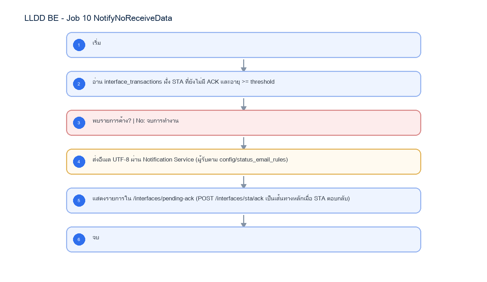

# LLDD BE - Job 10 NotifyNoReceiveData

SBP Mall - ระบบประกันรายได้ | Low Level Design Document

## 1. Overview

| รายการ | รายละเอียด |
| --- | --- |
| Track | BE |
| Estimate | 9 ชั่วโมง |
| Owner | Aphiwit <Bank> Khammoon |
| Objective | Watchdog เฝ้าระวัง ACK ค้าง: งาน safety net ตรวจ interface_transactions หา ACK จาก STA ที่ยังค้างเกิน 1 วัน หลังเพิ่ม POST /api/v1/interfaces/sta/ack ให้ STA callback ตรง; ส่งอีเมล UTF-8 ผ่าน Notification Service กลาง |

Common contract reference: ทุกหัวข้อ API/FE ต้องยึด LLDD-BE-API-Common-Contracts และ LLDD-FE-Integration-Contracts สำหรับ error/auth/format/pagination/action/RBAC ก่อนลงรายละเอียดเฉพาะหน้าหรือเฉพาะ endpoint

## 2. Screen / Functional Scope

- Main class/script: fgi.main.NotifyNoReceiveData / FGI_NotifyNoReceiveData.sh
- Phase: E
- Output: อีเมลเตือน UTF-8 + pending ACK dashboard
- Estimate: 9 ชั่วโมง
- Runbook, rerun rule, risk และ history ต้องตามข้อมูลหน้า Batch Job

## 4. Implementation Flow Diagram (Reference)



_รูปที่ 1: Implementation flow reference: LLDD BE - Job 10 NotifyNoReceiveData_

## 5. Field, Format, and Validation

| Field / UI | Format | Validation | Behavior |
| --- | --- | --- | --- |
| กำหนดการรัน (Cron) | 0 07 * * * | แก้ไขได้ | ทุกวัน 07:00; เป็น safety net หลัง STA callback |
| Pending threshold | >= 1 วัน | แก้ไขได้ | เตือนเมื่อยังไม่มี ACK หลังครบ threshold |
| data_name ที่เฝ้าดู | COMPENSATE_INIT_I, COMPENSATE_APPROVE_I | ค่าคงที่/แก้ผ่านหน้าจอไม่ได้ | เฉพาะฝั่ง STA - ไม่เฝ้า dataset ของ BPM |
| Encoding | UTF-8 | ค่าคงที่/แก้ผ่านหน้าจอไม่ได้ | แทน TIS-620 เดิมตาม Notification Service กลาง |

## 5.1 Input / Progress / Output Contract

| Stage | Contract for implementation |
| --- | --- |
| Input | FGI_CONFIRM_RECEIVE_DATA rows without return_code after the waiting threshold. |
| Progress | query missing receive data, group by data_name/interface_type, build notification message, send admin mail, close run. |
| Output | Notification sent for overdue receive confirmations; run status records grouped counts or no-data success. |

### 5.90 Job 10 Execution Stages

query missing receive data, group by data_name/interface_type, build notification message, send admin mail, close run.

| Order | Service step | Repository | Output / failure contract |
| --- | --- | --- | --- |
| 1 | loadOverdueAcknowledgements | pendingAckRepository | คืน metrics และ throw typed error; transaction/rerun ใช้ contract ด้านล่าง |
| 2 | reserveNotificationMarkers | pendingAckRepository | คืน metrics และ throw typed error; transaction/rerun ใช้ contract ด้านล่าง |
| 3 | sendPendingAckDigest | pendingAckRepository | คืน metrics และ throw typed error; transaction/rerun ใช้ contract ด้านล่าง |
| 4 | closeNotificationMarkers | pendingAckRepository | คืน metrics และ throw typed error; transaction/rerun ใช้ contract ด้านล่าง |

### 5.91 Job 10 Run Evidence

| Evidence | Job-specific value | Acceptance |
| --- | --- | --- |
| Input identity | FGI_CONFIRM_RECEIVE_DATA rows without return_code after the waiting threshold. | snapshot input file/business key/period in run record |
| Output identity | Notification sent for overdue receive confirmations; run status records grouped counts or no-data success. | reconcile input, success, reject and skipped counts |
| Dedup proof | notification marker ต่อ interface transaction ต่อวัน; rerun วันเดียวกันไม่ส่งอีเมลซ้ำ | rerun fixture produces no duplicate target business key |
| Transaction proof | อ่าน pending แบบ read-only; reserve notification marker ก่อนส่ง; ส่งล้มเหลว mark FAILED และ retry ด้วย marker เดิม | injected failure leaves no partial committed state outside documented boundary |
| Security proof | Notification Service ใช้ workload identity/secretRef; recipient อ่านจาก status_email_rules ไม่ hardcode | config/log/error contains no plaintext secret |

### 5.92 Legacy Java Source Reference

| Legacy file | Line range | Responsibility to carry forward |
| --- | --- | --- |
| fcsJar/src/th/co/gosoft/fgi/main/NotifyNoReceiveData.java | 16-37 | Legacy main entrypoint for missing-receive notification. |
| fcsJar/src/th/co/gosoft/fgi/controller/ManageCompensateController.java | 748-775 | Build and send notification content for missing receive data. |
| fcsJar/src/th/co/gosoft/fgi/dao/jdbc/ExportJdbc.java | 1894-1917 | Query confirm-receive rows without return_code. |

Line ranges refer to the legacy Java implementation under /Users/bank_mac/gosoft/java/SBP/fcsJar. Use these ranges to preserve business behavior while implementing the target Node job.

### 5.93 Target Repository and SQL Contract

| Contract | Target implementation |
| --- | --- |
| Repository | pendingAckRepository |
| Idempotency / dedup | notification marker ต่อ interface transaction ต่อวัน; rerun วันเดียวกันไม่ส่งอีเมลซ้ำ |
| Transaction boundary | อ่าน pending แบบ read-only; reserve notification marker ก่อนส่ง; ส่งล้มเหลว mark FAILED และ retry ด้วย marker เดิม |
| Security | Notification Service ใช้ workload identity/secretRef; recipient อ่านจาก status_email_rules ไม่ hardcode |

#### Input / candidate query

```sql
SELECT id, data_name, business_key, file_name, sent_at
FROM interface_transactions
WHERE direction = 'OUT'
  AND status = 'SENT'
  AND acked_at IS NULL
  AND sent_at < CURRENT_TIMESTAMP - (:threshold_hours * INTERVAL '1 hour')
ORDER BY sent_at;
```

#### Write / upsert query

```sql
INSERT INTO audit_logs (table_name, ref_key, action_type, new_value, updated_by, updated_at)
SELECT 'interface_transactions', CAST(id AS VARCHAR), 'PENDING_ACK_NOTIFIED',
       jsonb_build_object('notification_date', CURRENT_DATE, 'data_name', data_name),
       'JOB-10', CURRENT_TIMESTAMP
FROM interface_transactions i
WHERE i.id = ANY(:transaction_ids)
  AND NOT EXISTS (
      SELECT 1 FROM audit_logs a
      WHERE a.table_name = 'interface_transactions' AND a.ref_key = CAST(i.id AS VARCHAR)
        AND a.action_type = 'PENDING_ACK_NOTIFIED'
        AND (a.new_value ->> 'notification_date')::date = CURRENT_DATE);
```

### 5.94 Target Node Implementation

โครงสร้างนี้ระบุ service/repository เฉพาะงานและต้อง implement ตาม SQL, transaction, idempotency และ security contract ด้านบน โดยทุกขั้นต้องคืน metrics สำหรับ reconcile และ run history

```js
export async function runLlddBeJob10Notifynoreceivedata(ctx, services) {
  const run = await services.jobRuns.acquire({
    jobNo: "10", period: ctx.period, triggeredBy: ctx.triggeredBy
  });

  try {
    ctx = { ...ctx, runId: run.id, repository: services.pendingAckRepository };
    const step1 = await services.loadOverdueAcknowledgements(ctx, undefined);
    const step2 = await services.reserveNotificationMarkers(ctx, step1);
    const step3 = await services.sendPendingAckDigest(ctx, step2);
    const step4 = await services.closeNotificationMarkers(ctx, step3);
    const result = step4;
    await services.jobRuns.finish(run.id, "SUCCESS", result.metrics);
    return { runId: run.id, status: "SUCCESS", ...result };
  } catch (error) {
    await services.jobRuns.finish(run.id, "FAILED", {
      errorCode: error.code ?? "JOB_FAILED",
      errorMessage: error.message
    });
    throw error;
  }
}
```

## 6. Button / User Action Mapping

| Action | Trigger | API / Service | Expected Result |
| --- | --- | --- | --- |
| เปิดดูรายละเอียด Job | GET | GET /api/v1/jobs/10 | คืน params/metadata ล่าสุด |
| บันทึกพารามิเตอร์ | PUT | PUT /api/v1/jobs/10/params | บันทึกเฉพาะ key ที่ editable และ audit |
| สั่งรันทันที | POST | POST /api/v1/jobs/10/run | สร้าง run history สถานะ RUNNING/QUEUED |
| เปิด/ปิดใช้งาน | PUT | PUT /api/v1/jobs/10/enabled | บันทึก enabled + audit พร้อม reason |

## 7. API Contract

### GET /api/v1/jobs/10

อ่าน metadata และพารามิเตอร์ของ Job

#### Query Params

```json
{
  "jobNo": "10"
}
```

#### Request Field Schema

| Field | Type | Required | Constraint / Meaning |
| --- | --- | --- | --- |
| jobNo | string | No | UTF-8; use value domain described by endpoint purpose |

#### Response

```json
{
  "jobNo": "10",
  "name": "NotifyNoReceiveData",
  "cron": "0 07 * * *",
  "enabled": true,
  "params": [
    {
      "label": "กำหนดการรัน (Cron)",
      "value": "0 07 * * *",
      "editable": true
    },
    {
      "label": "Pending threshold",
      "value": ">= 1 วัน",
      "editable": true
    },
    {
      "label": "data_name ที่เฝ้าดู",
      "value": "COMPENSATE_INIT_I, COMPENSATE_APPROVE_I",
      "editable": false
    },
    {
      "label": "Encoding",
      "value": "UTF-8",
      "editable": false
    }
  ]
}
```

#### Response Field Schema

| Field | Type | Required | Constraint / Meaning |
| --- | --- | --- | --- |
| jobNo | string | Yes | UTF-8; use value domain described by endpoint purpose |
| name | string | Yes | UTF-8; use value domain described by endpoint purpose |
| cron | string | Yes | UTF-8; use value domain described by endpoint purpose |
| enabled | boolean | Yes | UTF-8; use value domain described by endpoint purpose |
| params | array<object> | Yes | JSON array; element type shown in Type column |
| params[].label | string | Yes | UTF-8; use value domain described by endpoint purpose |
| params[].value | string | Yes | UTF-8; use value domain described by endpoint purpose |
| params[].editable | boolean | Yes | UTF-8; use value domain described by endpoint purpose |

### PUT /api/v1/jobs/10/params

แก้ไขพารามิเตอร์ที่อนุญาตเท่านั้น

#### Request

```json
{
  "params": {
    "cron": "0 07 * * *"
  },
  "reason": "ปรับรอบรันตาม Operations"
}
```

#### Request Field Schema

| Field | Type | Required | Constraint / Meaning |
| --- | --- | --- | --- |
| params | object | Yes | JSON object; nested fields listed below |
| params.cron | string | Yes | UTF-8; use value domain described by endpoint purpose |
| reason | string | Yes | trimmed UTF-8 Thai text; required by operation/business rule |

#### Response

```json
{
  "message": "saved"
}
```

#### Response Field Schema

| Field | Type | Required | Constraint / Meaning |
| --- | --- | --- | --- |
| message | string | Yes | UTF-8; use value domain described by endpoint purpose |

### POST /api/v1/jobs/10/run

สั่งรัน manual โดย guard ไม่ให้รันซ้อน

#### Request

```json
{
  "period": "2569-07"
}
```

#### Request Field Schema

| Field | Type | Required | Constraint / Meaning |
| --- | --- | --- | --- |
| period | string | Yes | UTF-8; use value domain described by endpoint purpose |

#### Response

```json
{
  "runId": "JOB10-RUN-001",
  "status": "RUNNING"
}
```

#### Response Field Schema

| Field | Type | Required | Constraint / Meaning |
| --- | --- | --- | --- |
| runId | string | Yes | UTF-8; use value domain described by endpoint purpose |
| status | string | Yes | UTF-8; use value domain described by endpoint purpose |

### GET /api/v1/jobs/10/runs

อ่านประวัติการรันล่าสุด

#### Query Params

```json
{
  "page": 1,
  "size": 20
}
```

#### Request Field Schema

| Field | Type | Required | Constraint / Meaning |
| --- | --- | --- | --- |
| page | integer | No | >= 1; default 1 |
| size | integer | No | 1..100; default 20 |

#### Response

```json
{
  "items": [
    {
      "startedAt": "02/07/2569 07:00",
      "status": "fail"
    }
  ]
}
```

#### Response Field Schema

| Field | Type | Required | Constraint / Meaning |
| --- | --- | --- | --- |
| items | array<object> | Yes | JSON array; element type shown in Type column |
| items[].startedAt | string | Yes | ISO-8601 ค.ศ.; nullable only when type includes null |
| items[].status | string | Yes | UTF-8; use value domain described by endpoint purpose |

## 8. Reference DB Mapping (No Database Page Work)

ส่วนนี้เป็นข้อมูลอ้างอิงสำหรับการ implement API/Job เท่านั้น ไม่ใช่งานสร้างหน้า Database, ไม่ใช่งานออกแบบ DB page และไม่ถูกนับเป็น deliverable แยกของ FE/BE

| Table / Object | R/W | Usage |
| --- | --- | --- |
| interface_transactions | R | pending ACK จาก STA และสถานะล่าสุด |
| email_templates | R | template EM-08 watchdog ACK |
| status_email_rules | R | ผู้รับอีเมล |

## 9. Processing Flow

| Step | Description |
| --- | --- |
| 1 | เริ่ม |
| 2 | อ่าน interface_transactions ฝั่ง STA ที่ยังไม่มี ACK และอายุ >= threshold |
| 3 | พบรายการค้าง? \| No: จบการทำงาน |
| 4 | ส่งอีเมล UTF-8 ผ่าน Notification Service (ผู้รับตาม config/status_email_rules) |
| 5 | แสดงรายการใน /interfaces/pending-ack (POST /interfaces/sta/ack เป็นเส้นทางหลักเมื่อ STA ตอบกลับ) |
| 6 | จบ |

## 10. Acceptance Criteria

- อ่าน/แก้พารามิเตอร์ได้ตาม editable flag เท่านั้น
- การสั่งรันต้องตรวจ enabled และไม่มีรอบ RUNNING เดิม
- ต้องบันทึก job_run_histories และ audit_logs สำหรับทุก mutation
- DB/table mapping ใช้เป็น reference สำหรับ implement Job เท่านั้น ไม่ใช่งานสร้างหน้า Database
- รองรับ rerun rule และ risk note ตาม runbook

## 11. Developer Test Checklist

| No | Test |
| --- | --- |
| 1 | GET job detail |
| 2 | PUT params with editable key |
| 3 | PUT params locked business key must fail |
| 4 | POST run while running must fail |
| 5 | GET run histories |
| 6 | ตรวจผลกระทบตารางตาม R/W mapping reference |
