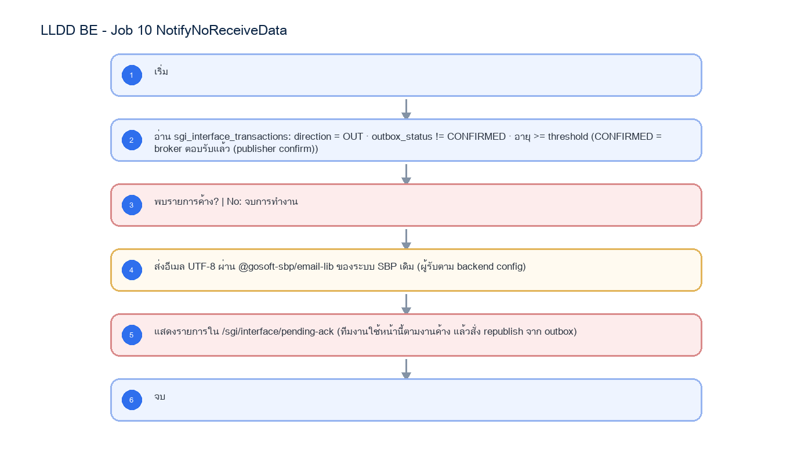

# LLDD BE - Job 10 NotifyNoReceiveData

SBP Mall - ระบบประกันรายได้ | Low Level Design Document

## 1. Overview

| รายการ | รายละเอียด |
| --- | --- |
| Track | BE |
| Estimate | **11 ชั่วโมง** = implementation 8 + unit test 3 (30%) |
| Owner | Peerakorn <Pete> Sakunkaewphithak |
| Target repository | `SBP/srm-sps-spsap-store-backend` (NestJS + TypeORM · schema `sps_store`) — batch runner ฝั่ง backend **ไม่ผ่าน BFF** · cron/พารามิเตอร์อยู่ใน backend config (env/config file) |
| Objective | Watchdog เฝ้าระวัง ACK ค้าง: งาน safety net ตรวจ interface_transactions หา ACK จาก STA ที่ยังค้างเกิน 1 วัน หลังเพิ่ม POST /api/v1/interfaces/sta/ack ให้ STA callback ตรง; ส่งอีเมล UTF-8 ผ่าน email-lib กลาง (sendEmail) |

Common contract reference: ทุกหัวข้อ API/FE ต้องยึด LLDD-BE-API-Common-Contracts และ LLDD-FE-Integration-Contracts สำหรับ error/auth/format/pagination/action/RBAC ก่อนลงรายละเอียดเฉพาะหน้าหรือเฉพาะ endpoint

## 2. Screen / Functional Scope

- Main class/script: fgi.main.NotifyNoReceiveData / FGI_NotifyNoReceiveData.sh
- Phase: E
- Output: อีเมลเตือน UTF-8 + pending ACK dashboard
- Estimate: 8 ชั่วโมง
- พารามิเตอร์/cron อ่านจาก backend config (config file/env) — ไม่มีตาราง job_configs และไม่มีหน้าจอควบคุม (หน้า Flow Batch Job ในกลุ่มเมนู Flow เหลือแค่ Flowchart + Database ที่ใช้ · 2026-08-06)
- Runbook, rerun rule, risk และ history ตามเอกสาร Batch v4.0 · ผลการรันเขียน application log แบบ structured

## 3. Screenshot Reference

ไม่มีภาพหน้าจอสำหรับหัวข้อนี้ — เป็นเอกสารฝั่ง Backend/Batch ที่ไม่มี UI (ภาพหน้าจอทั้งหมดอยู่ในเอกสารชุด FE)

## 4. Implementation Flow Diagram (Reference)



_รูปที่ 1: Implementation flow reference: LLDD BE - Job 10 NotifyNoReceiveData_

## 5. Field, Format, and Validation

| Field / UI | Format | Validation | Behavior |
| --- | --- | --- | --- |
| กำหนดการรัน (Cron) | 0 07 * * * | แก้ไขได้ | ทุกวัน 07:00; เป็น safety net หลัง STA callback |
| Pending threshold | >= 1 วัน | แก้ไขได้ | เตือนเมื่อยังไม่มี ACK หลังครบ threshold |
| ขอบเขตที่เฝ้าดู | direction = OUT · data_name = COMPENSATE_INIT_I, COMPENSATE_APPROVE_I | ค่าคงที่/แก้ผ่านหน้าจอไม่ได้ | เฉพาะฝั่ง STA - ไม่เฝ้า dataset ของ BPM |
| Encoding | UTF-8 | ค่าคงที่/แก้ผ่านหน้าจอไม่ได้ | แทน TIS-620 เดิมตาม email-lib กลาง (sendEmail) |

### 5.9 Input / Progress / Output Contract

| Stage | Contract for implementation |
| --- | --- |
| Input | FGI_CONFIRM_RECEIVE_DATA rows without return_code after the waiting threshold. |
| Progress | query missing receive data, group by data_name/direction (To-Be — เดิม Oracle ใช้ interface_type), build notification message, send admin mail, close run. |
| Output | Notification sent for overdue receive confirmations; run status records grouped counts or no-data success. |

### 5.90 Job 10 Execution Stages

query missing receive data, group by data_name/direction (To-Be — เดิม Oracle ใช้ interface_type), build notification message, send admin mail, close run.

| Order | Service step | Repository | Output / failure contract |
| --- | --- | --- | --- |
| 1 | loadOverdueAcknowledgements | pendingAckRepository | คืน metrics และ throw typed error; transaction/rerun ใช้ contract ด้านล่าง |
| 2 | reserveNotificationMarkers | pendingAckRepository | คืน metrics และ throw typed error; transaction/rerun ใช้ contract ด้านล่าง |
| 3 | sendPendingAckDigest | pendingAckRepository | คืน metrics และ throw typed error; transaction/rerun ใช้ contract ด้านล่าง |
| 4 | closeNotificationMarkers | pendingAckRepository | คืน metrics และ throw typed error; transaction/rerun ใช้ contract ด้านล่าง |

### 5.91 Job 10 Run Evidence

| Evidence | Job-specific value | Acceptance |
| --- | --- | --- |
| Input identity | FGI_CONFIRM_RECEIVE_DATA rows without return_code after the waiting threshold. | snapshot input file/business key/period in run record |
| Output identity | Notification sent for overdue receive confirmations; run status records grouped counts or no-data success. | reconcile input, success, reject and skipped counts |
| Dedup proof | คอลัมน์ last_ack_notified_on บน interface_transactions เป็น marker ต่อรายการต่อวัน; rerun วันเดียวกันไม่ส่งอีเมลซ้ำ (ย้ายมาจาก audit_logs ที่ถูกยกเลิก 2026-08-07) | rerun fixture produces no duplicate target business key |
| Transaction proof | อ่าน pending แบบ read-only; reserve notification marker ก่อนส่ง; ส่งล้มเหลว mark FAILED และ retry ด้วย marker เดิม | injected failure leaves no partial committed state outside documented boundary |
| Security proof | SBPGI เรียก sendEmail() ของ email-lib เอง (ปิด DP-5 · 2026-08-14) — เลข template มาจาก workflow_route.email_id · credential SMTP/SES และตาราง email_template/email_sent เป็นของระบบ SBP เดิม | config/log/error contains no plaintext secret |

### 5.92 Legacy Java Source Reference

| Legacy file | Line range | Responsibility to carry forward |
| --- | --- | --- |
| fcsJar/src/th/co/gosoft/fgi/main/NotifyNoReceiveData.java | 16-37 | Legacy main entrypoint for missing-receive notification. |
| fcsJar/src/th/co/gosoft/fgi/controller/ManageCompensateController.java | 748-775 | Build and send notification content for missing receive data. |
| fcsJar/src/th/co/gosoft/fgi/dao/jdbc/ExportJdbc.java | 1894-1917 | Query confirm-receive rows without return_code. |

Line ranges refer to the legacy Java implementation under /Users/bank_mac/gosoft/java/SBP/fcsJar. Use these ranges to preserve business behavior while implementing the target Node job.

### 5.93 Target Repository and SQL Contract

| Contract | Target implementation |
| --- | --- |
| Repository | pendingAckRepository |
| Idempotency / dedup | คอลัมน์ last_ack_notified_on บน interface_transactions เป็น marker ต่อรายการต่อวัน; rerun วันเดียวกันไม่ส่งอีเมลซ้ำ (ย้ายมาจาก audit_logs ที่ถูกยกเลิก 2026-08-07) |
| Transaction boundary | อ่าน pending แบบ read-only; reserve notification marker ก่อนส่ง; ส่งล้มเหลว mark FAILED และ retry ด้วย marker เดิม |
| Security | SBPGI เรียก sendEmail() ของ email-lib เอง (ปิด DP-5 · 2026-08-14) — เลข template มาจาก workflow_route.email_id · credential SMTP/SES และตาราง email_template/email_sent เป็นของระบบ SBP เดิม |

#### Input / candidate query

```sql
SELECT id, data_name, business_key, file_name, sent_at
FROM interface_transactions
WHERE direction = 'OUT'
  AND status = 'SENT'
  AND acked_at IS NULL
  AND sent_at < CURRENT_TIMESTAMP - (:threshold_hours * INTERVAL '1 hour')
  AND (last_ack_notified_on IS NULL OR last_ack_notified_on < CURRENT_DATE)
ORDER BY sent_at;
```

#### Write / upsert query

```sql
-- ยกเลิกตาราง audit_logs แล้ว (2026-08-07) — marker กันส่งซ้ำย้ายมาไว้บน interface_transactions เอง
-- คอลัมน์ last_ack_notified_on DATE มีอยู่ใน DDL ของ interface_transactions แล้ว (ดู LLDD-Database 5.x)
UPDATE interface_transactions
   SET last_ack_notified_on = CURRENT_DATE
 WHERE id = ANY(:transaction_ids)
   AND (last_ack_notified_on IS NULL OR last_ack_notified_on < CURRENT_DATE)
RETURNING id;
```

### 5.94 Target Node Implementation

โครงสร้างนี้ระบุ service/repository เฉพาะงานและต้อง implement ตาม SQL, transaction, idempotency และ security contract ด้านบน โดยทุกขั้นต้องคืน metrics สำหรับ reconcile และ run history

```js
export async function runLlddBeJob10Notifynoreceivedata(ctx, services) {
  const run = await services.jobRuns.acquire({
    jobNo: "10", period: ctx.period, triggeredBy: ctx.triggeredBy
  });

  try {
    ctx = { ...ctx, runId: run.id, repository: services.pendingAckRepository };
    const step1 = await services.loadOverdueAcknowledgements(ctx, undefined);
    const step2 = await services.reserveNotificationMarkers(ctx, step1);
    const step3 = await services.sendPendingAckDigest(ctx, step2);
    const step4 = await services.closeNotificationMarkers(ctx, step3);
    const result = step4;
    await services.jobRuns.finish(run.id, "SUCCESS", result.metrics);
    return { runId: run.id, status: "SUCCESS", ...result };
  } catch (error) {
    await services.jobRuns.finish(run.id, "FAILED", {
      errorCode: error.code ?? "JOB_FAILED",
      errorMessage: error.message
    });
    throw error;
  }
}
```

## 6. Button / User Action Mapping

| Action | Trigger | API / Service | Expected Result |
| --- | --- | --- | --- |
| รันตามตารางเวลา | CRON | scheduler → runner (job 10) | อ่าน cron/พารามิเตอร์จาก backend config |
| รันนอกรอบ (manual/rerun) | CLI | CLI/ops runbook → runner (job 10) | guard ไม่ให้รันซ้อนด้วย distributed lock |
| แก้พารามิเตอร์/เปิด-ปิด job | CONFIG | แก้ backend config แล้ว deploy | ไม่มี endpoint และไม่มีหน้าจอควบคุม — หน้า Flow Batch Job เป็น reference อย่างเดียว (2026-08-06) |
| ตรวจผลการรัน | LOG | application log (structured) | ไม่มีตาราง job_run_histories แล้ว · ไฟล์/ACK ดูที่ interface_transactions |

## 7. API Contract

## 8. Reference DB Mapping (No Database Page Work)

ส่วนนี้เป็นข้อมูลอ้างอิงสำหรับการ implement API/Job เท่านั้น ไม่ใช่งานสร้างหน้า Database, ไม่ใช่งานออกแบบ DB page และไม่ถูกนับเป็น deliverable แยกของ FE/BE

| Table / Object | R/W | Usage |
| --- | --- | --- |
| interface_transactions | R | pending ACK จาก STA และสถานะล่าสุด |
| email_template (ระบบ SBP เดิม) | R | template EM-08 watchdog ACK — อ่านอย่างเดียว |
| email_sent (ระบบ SBP เดิม) | W (โดย @gosoft-sbp/email-lib) | lib เขียน log ให้เอง · SBPGI ไม่ INSERT เอง |
| (backend config) | R | ผู้รับอีเมลของ job นี้ (EM-08 watchdog) — กำหนดใน config file/env |

## 9. Skeleton Code (Batch Job 10)

#### 9.1 ผังไฟล์ที่ต้องสร้าง (Job 10)

โครงไฟล์ของ Job 10 (fgi.main.NotifyNoReceiveData เดิม) วางใต้ `src/batch/sbpgi/` ของ store-backend โดยใช้ convention เดียวกับ module ธุรกิจอื่น: inject custom provider `DATA_SOURCE` แล้วยิง raw SQL, repository ประกาศเป็น factory provider ที่ใช้ token string, entity อยู่ใน `src/entitys/`

**หมายเหตุสำคัญ — `src/batch/*` ทั้งชุดเป็นของใหม่ที่ยังไม่มีใน store-backend**: ปัจจุบัน repo ไม่มีโฟลเดอร์ `src/batch` เลย และแม้จะติดตั้ง `@nestjs/schedule` ไว้แล้วก็ยัง**ไม่มี `@Cron`/`@Interval` แม้แต่จุดเดียว** ดังนั้น `runner.ts` / `scheduler.ts` / `cli.js` / `job-failure.notifier.ts` คือ **งานตั้งต้นของ Phase แรก** ที่ต้องสร้างเองทั้งหมด พร้อม register `ScheduleModule.forRoot()` ใน `app.module.ts` — ไม่ใช่ของเดิมที่ reuse ได้

| Path | หน้าที่ |
| --- | --- |
| src/batch/sbpgi/job-10-notify-no-receive-data/job-10-notify-no-receive-data.job.ts | คลาส `NotifyNoReceiveDataJob` — `run(ctx)` เรียงตาม flow ของ Job 10 ทีละขั้น, ครอบ transaction, จบด้วย structured log |
| src/batch/sbpgi/job-10-notify-no-receive-data/job-10-notify-no-receive-data.service.ts | คลาส `NotifyNoReceiveDataService` — logic ต่อขั้น (อ่าน/parse/คำนวณ/เขียน) + repository token ที่ inject จาก `DATA_SOURCE` |
| src/batch/sbpgi/job-10-notify-no-receive-data/job-10-notify-no-receive-data.config.ts | คลาส `SbpgiJob10Config` (แบบเดียวกับ `src/config/app.config.ts` — โปรเจกต์นี้ไม่ใช้ `registerAs`) — cron และพารามิเตอร์ทั้ง 4 ตัวของ Job 10 อ่านจาก env/config file (ไม่มีตาราง job_configs) |
| src/batch/sbpgi/job-10-notify-no-receive-data/job-10-notify-no-receive-data.module.ts | NestJS module ผูก job + service + repository provider (factory token string) เข้ากับ `DatabaseModule` |
| src/batch/runner.ts | ตัวรันกลาง: resolve job ตาม jobNo, กันรันซ้อนด้วย advisory lock, จับ error → แจ้งเตือน, เขียน structured log สรุป (ใช้ร่วมทั้ง 11 job) |
| src/batch/scheduler.ts | ลงทะเบียน cron จาก config (`SBPGI_JOB10_CRON` = `0 07 * * *`) และรองรับสั่งรันนอกรอบผ่าน CLI/runbook |
| src/batch/job-failure.notifier.ts | ส่งอีเมลแจ้งผู้ดูแลเมื่อ job ล้มเหลว ผ่าน `EmailLibService` ของ `@gosoft-sbp/email-lib` (log ลง `email_sent` ให้อัตโนมัติ) |

#### 9.2 Config Schema ของ Job 10 (backend config / env)

cron ปัจจุบันของ Job 10 คือ `0 07 * * *` (ทุกวัน 07:00) — ประกาศเป็น `SBPGI_JOB10_CRON` และอ่านตอน bootstrap ของ `scheduler.ts`; ถ้า `enabled=false` scheduler ต้องไม่ลงทะเบียน cron ของ job นี้

```ts
// src/batch/sbpgi/job-10-notify-no-receive-data/job-10-notify-no-receive-data.config.ts
// convention จริงของ store-backend คือคลาส config (`src/config/app.config.ts` ที่ export ผ่าน
// `AppConfigModule` แบบ @Global แล้วอ่าน process.env ตรง ๆ) — โปรเจกต์นี้ **ไม่ได้ใช้ registerAs**
// แม้แต่จุดเดียว จึงประกาศเป็นคลาสให้รีวิว/ทดสอบเหมือน config ตัวอื่น
import { Injectable } from '@nestjs/common';

// TODO: Job 10 ไม่มีตาราง job_configs และไม่มี Job Admin API แล้ว (ตัดสินใจ 2026-08-06)
// TODO: ค่าทุกตัวอ่านจาก env/config file ของ backend เท่านั้น — เปลี่ยนค่า = แก้ config แล้ว deploy
export interface Job10Config {
  /** เปิด/ปิด job รอบถัดไปโดยไม่ต้อง deploy โค้ด */
  enabled: boolean;
  /** cron ของ job นี้ (อ่านตอน bootstrap ของ scheduler.ts) */
  cron: string;
  /** กำหนดการรัน (Cron) — ทุกวัน 07:00; เป็น safety net หลัง STA callback */
  cron: string;
  /** Pending threshold — เตือนเมื่อยังไม่มี ACK หลังครบ threshold */
  pendingThreshold: string;
  /** ขอบเขตที่เฝ้าดู — เฉพาะฝั่ง STA - ไม่เฝ้า dataset ของ BPM */
  param3: string;
  /** Encoding — แทน TIS-620 เดิมตาม email-lib กลาง (sendEmail) */
  encoding: string;
  /** ผู้รับอีเมลเมื่อ job ล้มเหลว — เก็บเป็น string คั่น comma ให้ตรง signature ของ
      `EmailLibService.sendMail({ mailTo })` ที่รับ string ไม่ใช่ string[] */
  mailTo: string;
}

@Injectable()
export class SbpgiJob10Config implements Job10Config {
  // TODO: ยืนยันค่า default ทุกตัวกับ Ops ก่อนขึ้น production (ไม่มีหน้าจอแก้ค่าแล้ว)
  enabled = (process.env.SBPGI_JOB10_ENABLED ?? 'true') === 'true';
  cron = process.env.SBPGI_JOB10_CRON ?? '0 07 * * *';
  cron = process.env.SBPGI_JOB10_CRON ?? '0 07 * * *'; // TODO: แก้ผ่าน env/config file แล้ว deploy
  pendingThreshold = process.env.SBPGI_JOB10_PENDING_THRESHOLD ?? '>= 1 วัน'; // TODO: แก้ผ่าน env/config file แล้ว deploy
  param3 = process.env.SBPGI_JOB10_PARAM3 ?? 'direction = OUT · data_name = COMPENSATE_INIT_I, COMPENSATE_APPROVE_I'; // TODO: ค่าคงที่ทางธุรกิจ — เปลี่ยนต้องผ่านการอนุมัติ
  encoding = process.env.SBPGI_JOB10_ENCODING ?? 'UTF-8'; // TODO: ค่าคงที่ทางธุรกิจ — เปลี่ยนต้องผ่านการอนุมัติ
  mailTo = process.env.SBPGI_JOB10_MAIL_TO ?? ''; // TODO: ผู้รับอีเมลแจ้ง error คั่นด้วย comma (เดิม: email-lib (sendEmail · UTF-8))
}

// TODO: เพิ่ม SbpgiJob10Config ใน providers/exports ของ AppConfigModule (@Global) เหมือน AppConfig
```

#### 9.3 Job Class — `run(ctx)` ของ Job 10 ทีละขั้นตามผัง

##### 9.3.1 สัญญาของชั้นกลาง (`runner.ts`) + โครง service ของ Job 10

job class อ้าง `JobRunContext` / `JobRunResult` / `JobState` / `JobFailedError` — ทั้งหมดนิยาม ครั้งเดียวใน `src/batch/runner.ts` (ไฟล์ร่วมของทุก job ให้ merge ไม่ใช่เขียนทับ) และ service ต้องมี method ครบตามตารางขั้นตอนด้านล่าง มิฉะนั้น job class จะเรียก method ที่ไม่มีอยู่

```ts
// src/batch/runner.ts — สัญญากลางของทุก job (ประกาศครั้งเดียว ใช้ร่วมทั้ง 10 ฉบับ)

export interface JobRunContext {
  jobNo: string;
  period: string;        // YYYYMM ของงวดที่รัน
  triggeredBy: string;   // 'CRON' | userId ที่สั่งรันนอกรอบ
  params?: Record<string, string>;
}

export interface JobRunResult {
  event: 'job.finish';
  jobNo: string;
  jobName: string;
  status: 'SUCCESS' | 'SKIPPED' | 'SKIPPED_LOCKED' | 'FAILED';
  period: string;
  output: string;
  read: number; written: number; skipped: number; rejected: number;
  durationMs: number;
}

/** counter + ค่าที่ทุกขั้นของ job ใช้ร่วมกัน (service เป็นผู้สร้างผ่าน createState) */
export interface JobState {
  period: string;
  read: number; written: number; skipped: number; rejected: number;
  // TODO: เพิ่ม field เฉพาะของ job นี้ (เช่น rows ที่อ่านมา, path ไฟล์ที่เขียน)
  [key: string]: unknown;
}

/** error ที่ทำให้ job จบเป็น FAILED และส่งอีเมลแจ้งผู้ดูแล */
export class JobFailedError extends Error {
  constructor(public readonly code: string, message: string) { super(message); }
}

/** ใช้ออกจาก transaction เมื่อสาขา NO บอกให้ข้ามงวด/เรคคอร์ด — runner สรุปเป็น SKIPPED ไม่ใช่ FAILED */
export class JobSkippedError extends Error {}
```

```ts
// NotifyNoReceiveDataService — method ที่ job class เรียก (1 method ต่อ 1 ขั้นในตารางด้านบน)
import { Inject, Injectable } from '@nestjs/common';
import type { DataSource, EntityManager } from 'typeorm';
import type { JobRunContext, JobState } from '../../runner';
export type { JobState };

@Injectable()
export class NotifyNoReceiveDataService {
  constructor(@Inject('DATA_SOURCE') private readonly dataSource: DataSource) {}

  createState(ctx: JobRunContext): JobState {
    return { period: ctx.period, read: 0, written: 0, skipped: 0, rejected: 0 };
  }

  // อ่าน interface_transactions: direction = OUT · ยังไม่มี ACK · อายุ >= threshold
  async step02Read(state: JobState, manager?: EntityManager): Promise<void> {
    // TODO: implement
  }

  // พบรายการค้าง?
  async check03Condition(state: JobState): Promise<boolean> {
    return true; // TODO: เงื่อนไขจริงตามผัง
  }

  // ส่งอีเมล UTF-8 ผ่าน @gosoft-sbp/email-lib ของระบบ SBP เดิม
  async step04Notify(state: JobState, manager?: EntityManager): Promise<void> {
    // TODO: implement
  }

  // แสดงรายการใน /interfaces/pending-ack
  async step05Process(state: JobState, manager?: EntityManager): Promise<void> {
    // TODO: implement
  }

}
```

##### 9.3.2 `run(ctx)` ของ Job 10

ทุกขั้นใน `run()` ตรงกับ flowchart ของ Job 10 หนึ่งต่อหนึ่ง (decision และ error path รวมอยู่ด้วย) — method ที่ต้อง implement ใน service ตามตารางนี้

| ลำดับ | ชนิด | ขั้นตอนจากผัง | Method ที่ต้อง implement | เส้นทาง NO / error |
| --- | --- | --- | --- | --- |
| 1 | start | เริ่ม | createState() | - |
| 2 | process | อ่าน interface_transactions: direction = OUT · ยังไม่มี ACK · อายุ >= threshold | step02Read() | throw JobFailedError เมื่อทำไม่สำเร็จ |
| 3 | decision | พบรายการค้าง? | check03Condition() | [end] จบการทำงาน |
| 4 | io | ส่งอีเมล UTF-8 ผ่าน @gosoft-sbp/email-lib ของระบบ SBP เดิม | step04Notify() | throw JobFailedError เมื่อทำไม่สำเร็จ |
| 5 | process | แสดงรายการใน /interfaces/pending-ack | step05Process() | throw JobFailedError เมื่อทำไม่สำเร็จ |
| 6 | end | จบ | summarize() | - |

```ts
// src/batch/sbpgi/job-10-notify-no-receive-data/job-10-notify-no-receive-data.job.ts
import { Inject, Injectable, Logger } from '@nestjs/common';
import type { DataSource, EntityManager } from 'typeorm';
import { NotifyNoReceiveDataService, type JobState } from './job-10-notify-no-receive-data.service';
// 4 symbol นี้นิยามใน src/batch/runner.ts (ดูหัวข้อ 9.3.1)
import { JobFailedError, JobSkippedError, JobRunContext, JobRunResult } from '../../runner';

@Injectable()
export class NotifyNoReceiveDataJob {
  static readonly jobNo = '10';
  private readonly logger = new Logger(NotifyNoReceiveDataJob.name);

  constructor(
    // TODO: DATA_SOURCE = custom provider ที่ route SELECT/WITH ไป slave pool และ write ไป master
    @Inject('DATA_SOURCE') private readonly dataSource: DataSource,
    private readonly service: NotifyNoReceiveDataService,
  ) {}

  async run(ctx: JobRunContext): Promise<JobRunResult> {
    const startedAt = Date.now();
    // TODO: state ถือ counter (read/written/skipped/rejected) และค่าจาก job10Config
    const state = this.service.createState(ctx);
    try {
      // ขั้นที่ 2: อ่าน interface_transactions: direction = OUT · ยังไม่มี ACK · อายุ >= threshold
      await this.service.step02Read(state);
      // ขั้นที่ 3 (decision): พบรายการค้าง?
      const ok03 = await this.service.check03Condition(state);
      if (!ok03) { // NO → จบการทำงาน
        return this.summarize(state, 'SKIPPED', startedAt);
      }
      // ขั้นที่ 4: ส่งอีเมล UTF-8 ผ่าน @gosoft-sbp/email-lib ของระบบ SBP เดิม · TODO: ผู้รับตาม backend config
      await this.service.step04Notify(state);
      // ขั้นที่ 5: แสดงรายการใน /interfaces/pending-ack · TODO: POST /interfaces/sta/ack เป็นเส้นทางหลักเมื่อ STA ตอบกลับ
      await this.service.step05Process(state);
      return this.summarize(state, 'SUCCESS', startedAt);
    } catch (error) {
      // TODO: error path ของ Job 10 — ห้ามกลับไปใช้ TIS-620/hardcoded recipient; Job 10 เป็น safety net ไม่ใช่ primary ACK path
      this.logger.error(JSON.stringify({ event: 'job.failed', jobNo: '10', period: ctx.period,
        triggeredBy: ctx.triggeredBy, durationMs: Date.now() - startedAt, error: (error as Error).message }));
      // TODO: แจ้งผู้ดูแลผ่าน JobFailureNotifier (หัวข้อ 9.6.1) — runner เป็นผู้เรียกให้
      throw error;
    }
  }

  private summarize(state: JobState, status: JobRunResult['status'], startedAt = Date.now()): JobRunResult {
    // TODO: structured log บรรทัดเดียวจบ — ไม่มีตาราง job_run_histories แล้ว (2026-08-06)
    const summary = {
      event: 'job.finish', jobNo: '10', jobName: 'NotifyNoReceiveData', status,
      period: state.period, output: 'อีเมลเตือน UTF-8 + pending ACK dashboard',
      read: state.read, written: state.written, skipped: state.skipped,
      rejected: state.rejected, durationMs: Date.now() - startedAt,
    };
    this.logger.log(JSON.stringify(summary));
    return summary as JobRunResult;
  }
}
```

#### 9.4 การกันรันซ้อนของ Job 10 (PostgreSQL advisory lock)

Job 10 มีข้อควรระวังจาก legacy: ห้ามกลับไปใช้ TIS-620/hardcoded recipient; Job 10 เป็น safety net ไม่ใช่ primary ACK path — runner ล็อกด้วย `pg_try_advisory_lock` ก่อนเริ่มขั้นแรกเสมอ และรอบที่ล็อกไม่ได้ให้จบด้วยสถานะ SKIPPED_LOCKED (ไม่ใช่ FAILED)

```ts
// src/batch/runner.ts (ส่วนกันรันซ้อน)
import { Inject, Injectable, Logger } from '@nestjs/common';
import type { DataSource } from 'typeorm';

// TODO: ห้ามใช้แถวสถานะ RUNNING ในตารางเป็นตัวกัน (ไม่มีตาราง job_run_histories แล้ว)
//       ใช้ PostgreSQL advisory lock ระดับ session แทน — ปลดอัตโนมัติเมื่อ connection หลุด
export const SBPGI_JOB_LOCK_CLASS_ID = 861000; // namespace ของระบบ SBPGI
export const JOB_LOCK_KEYS: Record<string, number> = { '10': 100 /* TODO: เพิ่มครบทั้ง 11 job */ };

@Injectable()
export class BatchRunner {
  private readonly logger = new Logger(BatchRunner.name);
  constructor(@Inject('DATA_SOURCE') private readonly dataSource: DataSource) {}

  async runExclusive<T>(jobNo: string, fn: () => Promise<T>): Promise<T | { status: 'SKIPPED_LOCKED' }> {
    // TODO: ต้องใช้ QueryRunner (connection เดียวบน master) — dataSource.query() ของโปรเจกต์นี้
    //       route SQL ที่ขึ้นต้นด้วย SELECT ไป slave pool ทำให้ lock ไปตกที่ replica คนละ connection
    const runner = this.dataSource.createQueryRunner('master');
    await runner.connect();
    const objectId = JOB_LOCK_KEYS[jobNo];
    try {
      const [{ locked }] = await runner.query(
        'SELECT pg_try_advisory_lock($1, $2) AS locked',
        [SBPGI_JOB_LOCK_CLASS_ID, objectId],
      );
      if (!locked) {
        // TODO: รอบนี้ข้ามไปเฉย ๆ ไม่ถือเป็น error และไม่ต้องส่งอีเมล
        this.logger.warn(JSON.stringify({ event: 'job.skipped.locked', jobNo }));
        return { status: 'SKIPPED_LOCKED' };
      }
      return await fn();
    } finally {
      // TODO: ปลด lock ทุกกรณี แล้วคืน connection เข้า pool
      await runner.query('SELECT pg_advisory_unlock($1, $2)', [SBPGI_JOB_LOCK_CLASS_ID, objectId]);
      await runner.release();
    }
  }
}
```

#### 9.5 Repository / SQL หลักของ Job 10

repository ของ Job 10 ประกาศเป็น factory provider (`{provide: 'NOTIFY_NO_RECEIVE_DATA_REPOSITORY', useFactory: (ds) => ds.getRepository(Entity), inject: ['DATA_SOURCE']}`) แล้วยิง raw SQL ตามแบบ module ธุรกิจอื่นของ store-backend (schema `sps_store` มาจาก search_path)

| ตาราง | R/W | การใช้งานตามผัง | หมายเหตุ target design |
| --- | --- | --- | --- |
| interface_transactions | R | pending ACK จาก STA และสถานะล่าสุด | เขียน SQL ตรงผ่าน DATA_SOURCE |
| email_template (ระบบ SBP เดิม) | R | template EM-08 watchdog ACK — อ่านอย่างเดียว | เขียน SQL ตรงผ่าน DATA_SOURCE |
| email_sent (ระบบ SBP เดิม) | W (โดย @gosoft-sbp/email-lib) | lib เขียน log ให้เอง · SBPGI ไม่ INSERT เอง | เขียน SQL ตรงผ่าน DATA_SOURCE |
| (backend config) | R | ผู้รับอีเมลของ job นี้ (EM-08 watchdog) — กำหนดใน config file/env | เขียน SQL ตรงผ่าน DATA_SOURCE |

```sql
-- Job 10 NotifyNoReceiveData — query หลักที่ต้อง implement
-- TODO: ทุก statement รันผ่าน DATA_SOURCE (SELECT ไป slave, write ไป master) และ
--       write ทั้งหมดต้องอยู่ใน transaction เดียวกับที่ระบุใน 9.3

-- [R] interface_transactions : pending ACK จาก STA และสถานะล่าสุด
-- TODO: อ่านรายการที่ยังไม่ได้ ACK (safety net) — ยืนยันชื่อสถานะ/คอลัมน์เวลากับ database.md
SELECT id, data_name, direction, status, business_key, period_key, file_name, created_at
  FROM interface_transactions
 WHERE data_name = ANY($1)  -- TODO: รายการ interface ที่ Job 10 เฝ้าดู (ไม่ใช่ job_no ของตัวเอง)
   AND status IN ('READY', 'SENT')  -- TODO: สถานะที่ถือว่ายังไม่มี ACK
   AND created_at < NOW() - ($2 || ' hours')::interval  -- TODO: threshold จาก config
 ORDER BY created_at;

-- [R] email_template (ระบบ SBP เดิม) : template EM-08 watchdog ACK — อ่านอย่างเดียว
-- TODO: เติมเฉพาะคอลัมน์ที่ job ใช้จริง (ห้าม SELECT *) และตรวจว่ามี index รองรับ WHERE นี้
SELECT /* TODO: columns */
  FROM email_template (ระบบ SBP เดิม)
 WHERE /* TODO: เงื่อนไขงวด/สถานะที่ job นี้คัดแถว */ 1 = 1
 ORDER BY /* TODO: คีย์ที่ทำให้ลำดับคงที่ */
 LIMIT $1 OFFSET $2;  -- TODO: อ่านเป็น chunk กัน memory บวม

-- [W (โดย @GOSOFT-SBP/EMAIL-LIB)] email_sent (ระบบ SBP เดิม) : lib เขียน log ให้เอง · SBPGI ไม่ INSERT เอง
-- TODO: เติมคอลัมน์ payload จริงจาก database.md
INSERT INTO email_sent (ระบบ SBP เดิม)
  (/* TODO: business key + payload + created_by, created_at */)
VALUES (/* TODO: bind params ตามลำดับคอลัมน์ด้านบน */)
-- ⚠️ ตารางนี้ไม่มี business unique key ใน DDL จริง — ON CONFLICT ใช้ไม่ได้
--    fcs_qssi_score: ข้อค้าง DP-4 (การเพิ่ม unique index ต้อง sign-off เจ้าของ performance.service.ts)
--    ระหว่างยังไม่ปิด: ลบงวดเดิมก่อนแล้ว INSERT ใหม่ใน transaction เดียว
ON CONFLICT (/* ยังใช้ไม่ได้ — ดูหมายเหตุด้านบน */)
DO UPDATE SET /* TODO: คอลัมน์ที่ยอมให้ทับ */
       updated_at = NOW(), updated_by = 'JOB10';

-- [R] (backend config) : ผู้รับอีเมลของ job นี้ (EM-08 watchdog) — กำหนดใน config file/env
-- TODO: เติมเฉพาะคอลัมน์ที่ job ใช้จริง (ห้าม SELECT *) และตรวจว่ามี index รองรับ WHERE นี้
SELECT /* TODO: columns */
  FROM (backend config)
 WHERE /* TODO: เงื่อนไขงวด/สถานะที่ job นี้คัดแถว */ 1 = 1
 ORDER BY /* TODO: คีย์ที่ทำให้ลำดับคงที่ */
 LIMIT $1 OFFSET $2;  -- TODO: อ่านเป็น chunk กัน memory บวม
```

#### 9.6 การแจ้งเตือนและการรันซ้ำของ Job 10

##### 9.6.1 อีเมลแจ้งผู้ดูแลเมื่อ job ล้มเหลว

ใช้ `EmailLibService` จาก `@gosoft-sbp/email-lib` ตัวเดียวกับที่ระบบเดิมใช้ (inform-evaluate / external-audit / statement PTT) — ไม่สร้างกลไกส่งเมลใหม่

```ts
// src/batch/job-failure.notifier.ts
import { Injectable, Logger } from '@nestjs/common';
// ชื่อ method ของ lib ที่ store-backend เรียกจริงคือ `sendMail` (ไม่ใช่ sendEmail) และ
// `mailTo` / `mailCc` เป็น **string** คั่นด้วย comma — ดู evaluation-process.service.ts,
// external-audit.service.ts, statement.service.ts, inform-evaluate.service.ts, performance.service.ts
import { EmailLibService } from '@gosoft-sbp/email-lib';
import type { JobRunContext } from './runner';

@Injectable()
export class JobFailureNotifier {
  private readonly logger = new Logger(JobFailureNotifier.name);
  // TODO: ใช้ lib อีเมลของระบบเดิม — template อยู่ในตาราง email_template และ log ลง email_sent อัตโนมัติ
  //       (ตั้งชื่อ property ว่า mailService ตาม call site เดิมทุกที่ใน store-backend)
  constructor(private readonly mailService: EmailLibService) {}

  async notifyFailure(jobNo: string, ctx: JobRunContext, error: Error): Promise<void> {
    // TODO: ผู้รับของ Job 10 เดิมคือ email-lib (sendEmail · UTF-8) — ย้ายมาเป็น env SBPGI_JOB10_MAIL_TO
    const recipients = (process.env.SBPGI_JOB10_MAIL_TO ?? '').split(',').map((s) => s.trim()).filter(Boolean);
    if (!recipients.length) {
      this.logger.warn(JSON.stringify({ event: 'job.mail.skipped', jobNo, reason: 'NO_RECIPIENT' }));
      return;
    }
    try {
      await this.mailService.sendMail({
        // TODO: emailId = id ของ template EM-07 (แจ้ง error batch) ในตาราง email_template
        emailId: Number(process.env.SBPGI_JOB_FAIL_EMAIL_TEMPLATE_ID),
        mailTo: recipients.join(','), // signature รับ string ไม่ใช่ string[]
        mailCc: '',
        param: {
          jobNo, jobName: 'NotifyNoReceiveData',
          jobTitle: 'Watchdog เฝ้าระวัง ACK ค้าง',
          period: ctx.period, triggeredBy: ctx.triggeredBy,
          output: 'อีเมลเตือน UTF-8 + pending ACK dashboard',
          errorMessage: error.message,
          rerunNote: 'รันซ้ำได้; ต้องไม่ส่งอีเมลซ้ำถ้ามี sent marker ในรอบเดียวกัน',
        },
      });
    } catch (mailError) {
      // TODO: ส่งเมลไม่สำเร็จห้ามกลบ error เดิมของ job — log แล้วปล่อยผ่าน
      this.logger.error(JSON.stringify({ event: 'job.mail.failed', jobNo, error: (mailError as Error).message }));
    }
  }
}
```

##### 9.6.2 Checklist การ rerun

- กติกา rerun ของ Job 10: รันซ้ำได้; ต้องไม่ส่งอีเมลซ้ำถ้ามี sent marker ในรอบเดียวกัน
- ขอบเขต transaction ที่ต้องรักษาเมื่อรันซ้ำ: read-only; callback /interfaces/sta/ack เป็นผู้เขียน ACK หลัก
- ความเสี่ยงที่ต้องตรวจก่อน/หลังรันซ้ำ: ห้ามกลับไปใช้ TIS-620/hardcoded recipient; Job 10 เป็น safety net ไม่ใช่ primary ACK path
- ตรวจว่ารอบก่อนหน้าไม่ได้ค้าง lock อยู่ (`SELECT * FROM pg_locks WHERE locktype = 'advisory'`) ก่อนสั่งรันนอกรอบ
- สั่งรันนอกรอบผ่าน CLI/runbook เท่านั้น (ไม่มีหน้าจอและไม่มี Job Admin API): `node dist/batch/cli.js --job=10 --period=<YYYYMM>`
- หลังรันซ้ำ ตรวจ output `อีเมลเตือน UTF-8 + pending ACK dashboard` และ log บรรทัด `job.finish` ว่า read/written/skipped/rejected ตรงกับที่คาด
- ถ้ารอบก่อนล้มเหลวกลางทาง ตรวจ `interface_transactions` ของงวดนั้นว่ามีแถวค้างสถานะ READY/PENDING หรือไม่ ก่อนสั่งรันใหม่

## 10. Processing Flow

| Step | Description |
| --- | --- |
| 1 | เริ่ม |
| 2 | อ่าน interface_transactions: direction = OUT · ยังไม่มี ACK · อายุ >= threshold |
| 3 | พบรายการค้าง? \| No: จบการทำงาน |
| 4 | ส่งอีเมล UTF-8 ผ่าน @gosoft-sbp/email-lib ของระบบ SBP เดิม (ผู้รับตาม backend config) |
| 5 | แสดงรายการใน /interfaces/pending-ack (POST /interfaces/sta/ack เป็นเส้นทางหลักเมื่อ STA ตอบกลับ) |
| 6 | จบ |

## 11. Acceptance Criteria

- พารามิเตอร์และ cron อ่านจาก backend config เท่านั้น — เปลี่ยนค่าโดย deploy config ไม่ใช่ผ่าน API/หน้าจอ
- การรันต้องตรวจ enabled flag ใน config และกันรันซ้อนด้วย distributed/advisory lock
- ทุกรอบต้องเขียน application log แบบ structured (เวลา/แถว/ไฟล์/ผล) และ error ต้องส่ง EM-07
- DB/table mapping ใช้เป็น reference สำหรับ implement Job เท่านั้น ไม่ใช่งานสร้างหน้า Database
- รองรับ rerun rule และ risk note ตาม runbook

## 12. Developer Test Checklist

| No | Test |
| --- | --- |
| 1 | รันตามตารางเวลาแล้วผลถูกต้องบน fixture |
| 2 | รันนอกรอบผ่าน CLI ได้ผลเดียวกับ cron |
| 3 | สั่งรันซ้อนขณะกำลังรัน → runner ปฏิเสธ (lock ทำงาน) |
| 4 | แก้ config แล้ว deploy → รอบถัดไปใช้ค่าใหม่ |
| 5 | job throw error → EM-07 ออก และ log มีบรรทัด error |
| 6 | ตรวจผลกระทบตารางตาม R/W mapping reference |

## 13. Unit Test Scope

**3 ชั่วโมง** (30% ของ implementation 8 ชั่วโมง) · เครื่องมือ: Jest + mock repository/DataSource (ไม่ต่อ DB จริง)

หัวข้อนี้คือ **unit test** ที่ต้องเขียนคู่กับโค้ด — ต่างจาก *Developer Test Checklist* ซึ่งเป็น scenario ระดับ end-to-end/manual ที่ใช้ตอนตรวจรับ · รายการด้านล่าง derive จาก field/validation, acceptance criteria, endpoint และตารางที่เอกสารนี้เขียน

| สิ่งที่ทดสอบ | ประเภท | เกณฑ์ผ่าน |
| --- | --- | --- |
| business rule | logic | พารามิเตอร์และ cron อ่านจาก backend config เท่านั้น — เปลี่ยนค่าโดย deploy config ไม่ใช่ผ่าน API/หน้าจอ |
| business rule | logic | การรันต้องตรวจ enabled flag ใน config และกันรันซ้อนด้วย distributed/advisory lock |
| business rule | logic | ทุกรอบต้องเขียน application log แบบ structured (เวลา/แถว/ไฟล์/ผล) และ error ต้องส่ง EM-07 |
| business rule | logic | DB/table mapping ใช้เป็น reference สำหรับ implement Job เท่านั้น ไม่ใช่งานสร้างหน้า Database |
| business rule | logic | รองรับ rerun rule และ risk note ตาม runbook |
| `email_sent (ระบบ SBP เดิม)` | transaction | จำลอง error กลางทาง แล้วยืนยันว่า rollback ครบ ไม่เหลือแถวค้าง (mock DataSource/QueryRunner) |
| runner | idempotency | รันซ้ำด้วย fixture เดิมต้องไม่เกิดแถวซ้ำ (ON CONFLICT / business unique key ทำงาน) |
| runner | lock | เรียกซ้อนขณะกำลังรัน ต้องถูกปฏิเสธด้วย advisory lock |

- ทุกเคสต้องรันได้โดยไม่ต่อ DB/บริการภายนอกจริง — mock ที่ขอบ repository/client เสมอ
- ข้อความไทยที่ยืนยันในเทสต้องเป็น verbatim ตาม SRS ห้ามพิมพ์ใหม่
- เกณฑ์ผ่านของ CI: ทุกเคสในตารางนี้มี test จริงและผ่านทั้งหมด
