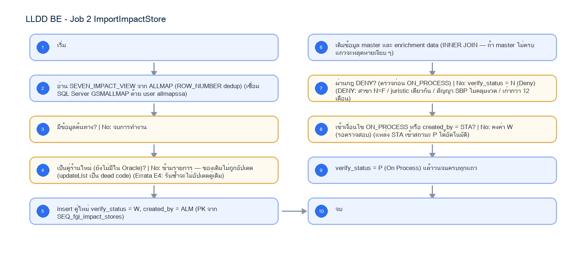

# LLDD BE - Job 2 ImportImpactStore

SBP Mall - ระบบประกันรายได้ | Low Level Design Document

## 1. Overview

| รายการ | รายละเอียด |
| --- | --- |
| Track | BE |
| Estimate | 13 ชั่วโมง |
| Owner | Aphiwit <Bank> Khammoon |
| Objective | นำเข้าคู่ร้านถูกกระทบจาก ALLMAP: นำคู่ร้านถูกกระทบ–ร้านเปิดใหม่จากวิว ALLMAP เข้า fgi_impact_stores เติมข้อมูลจากตาราง master แล้วใช้กฎ DENY และ ON_PROCESS ตั้งค่า verify_status เป็น W / N / P |

Common contract reference: ทุกหัวข้อ API/FE ต้องยึด LLDD-BE-API-Common-Contracts และ LLDD-FE-Integration-Contracts สำหรับ error/auth/format/pagination/action/RBAC ก่อนลงรายละเอียดเฉพาะหน้าหรือเฉพาะ endpoint

## 2. Screen / Functional Scope

- Main class/script: fgi.main.ImportImpactStore / FGI_ImportImpactStore.sh
- Phase: A
- Output: fgi_impact_stores
- Estimate: 13 ชั่วโมง
- Runbook, rerun rule, risk และ history ต้องตามข้อมูลหน้า Batch Job

## 4. Implementation Flow Diagram (Reference)



_รูปที่ 1: Implementation flow reference: LLDD BE - Job 2 ImportImpactStore_

## 5. Field, Format, and Validation

| Field / UI | Format | Validation | Behavior |
| --- | --- | --- | --- |
| กำหนดการรัน (Cron) | 0 07 7 * * | แก้ไขได้ | ทุกวันที่ 7 ของเดือน เวลา 07:00 |
| Argument (ขอบเขต\|งวด) | ALL\|2569\|06 | แก้ไขได้ | รูปแบบ ZONES\|YYYY\|MM หรือ ALL\|YYYY\|MM — ไม่ระบุจะใช้งวดตาม modifyDateToString |
| Source View | allmapssa.SEVEN_IMPACT_VIEW (SQL Server GSMALLMAP) | ค่าคงที่/แก้ผ่านหน้าจอไม่ได้ | dedup ด้วย ROW_NUMBER |
| Branch Type ที่เข้าเกณฑ์ | B, FAM, FB1, FB2, FC1, FVB, FVC, FPT1 | ค่าคงที่/แก้ผ่านหน้าจอไม่ได้ | FPT1 เข้าเกณฑ์เฉพาะเมื่อ SBP_CANCEL_TYPE_I = 06 |
| กฎ DENY (ตรวจก่อน ON_PROCESS) | สาขา N=F / juristic เดียวกัน / สัญญาไม่คลุมงวด / เก่ากว่า 12 เดือน | ค่าคงที่/แก้ผ่านหน้าจอไม่ได้ |  |
| PK Sequence | SEQ_fgi_impact_stores | ค่าคงที่/แก้ผ่านหน้าจอไม่ได้ |  |

## 5.1 Input / Progress / Output Contract

| Stage | Contract for implementation |
| --- | --- |
| Input | Period year/month, optional zone filter, and ALLMAP SEVEN_IMPACT_VIEW rows. |
| Progress | query candidate impacted stores, deduplicate by store/month, batch insert impact-store master data, derive related new-store/impact-store records, update verification flags. |
| Output | FGI_IMPACT_STORE and related impact/new-store tables contain imported candidates for the requested period with duplicate-safe status. |

### 5.90 Job 2 Execution Stages

query candidate impacted stores, deduplicate by store/month, batch insert impact-store master data, derive related new-store/impact-store records, update verification flags.

| Order | Service step | Repository | Output / failure contract |
| --- | --- | --- | --- |
| 1 | loadAllmapCandidates | impactStoreRepository | คืน metrics และ throw typed error; transaction/rerun ใช้ contract ด้านล่าง |
| 2 | resolveImpactProcesses | impactStoreRepository | คืน metrics และ throw typed error; transaction/rerun ใช้ contract ด้านล่าง |
| 3 | upsertImpactPairs | impactStoreRepository | คืน metrics และ throw typed error; transaction/rerun ใช้ contract ด้านล่าง |
| 4 | reconcileImportedPairs | impactStoreRepository | คืน metrics และ throw typed error; transaction/rerun ใช้ contract ด้านล่าง |

### 5.91 Job 2 Run Evidence

| Evidence | Job-specific value | Acceptance |
| --- | --- | --- |
| Input identity | Period year/month, optional zone filter, and ALLMAP SEVEN_IMPACT_VIEW rows. | snapshot input file/business key/period in run record |
| Output identity | FGI_IMPACT_STORE and related impact/new-store tables contain imported candidates for the requested period with duplicate-safe status. | reconcile input, success, reject and skipped counts |
| Dedup proof | UNIQUE(impacted_store_code, new_store_code, impact_month); rerun อัปเดตค่าที่เปลี่ยนแต่ไม่สร้างคู่ร้านซ้ำ | rerun fixture produces no duplicate target business key |
| Transaction proof | สร้าง/หา fgi_impact_processes และ upsert candidate ทีละ chunk ใน transaction; chunk fail rollback เฉพาะ chunk | injected failure leaves no partial committed state outside documented boundary |
| Security proof | ALLMAP connection ใช้ datasource secretRef และ TLS verify-full; job parameter เก็บได้เฉพาะ datasource alias ไม่เก็บ username/password | config/log/error contains no plaintext secret |

### 5.92 Legacy Java Source Reference

| Legacy file | Line range | Responsibility to carry forward |
| --- | --- | --- |
| fcsJar/src/th/co/gosoft/fgi/main/ImportImpactStore.java | 24-186 | Legacy main entrypoint for impacted-store import. |
| fcsJar/src/th/co/gosoft/fgi/dao/jdbc/ImportStoreJdbc.java | 30-84, 170-484 | Query SEVEN_IMPACT_VIEW and insert/update FGI impact/new-store records. |

Line ranges refer to the legacy Java implementation under /Users/bank_mac/gosoft/java/SBP/fcsJar. Use these ranges to preserve business behavior while implementing the target Node job.

### 5.93 Target Repository and SQL Contract

| Contract | Target implementation |
| --- | --- |
| Repository | impactStoreRepository |
| Idempotency / dedup | UNIQUE(impacted_store_code, new_store_code, impact_month); rerun อัปเดตค่าที่เปลี่ยนแต่ไม่สร้างคู่ร้านซ้ำ |
| Transaction boundary | สร้าง/หา fgi_impact_processes และ upsert candidate ทีละ chunk ใน transaction; chunk fail rollback เฉพาะ chunk |
| Security | ALLMAP connection ใช้ datasource secretRef และ TLS verify-full; job parameter เก็บได้เฉพาะ datasource alias ไม่เก็บ username/password |

#### Input / candidate query

```sql
SELECT impacted_store_code, new_store_code, impact_month, distance_km, region_code, zone_code, branch_type
FROM allmap_seven_impact_view
WHERE impact_month = :impact_month
  AND (:zone_code IS NULL OR zone_code = :zone_code)
  AND distance_km <= CASE
        WHEN region_code = ANY(:bangkok_metro_region_codes) THEN 1.000
        ELSE 2.000
      END;
```

#### Write / upsert query

```sql
INSERT INTO fgi_impact_stores
    (impact_process_id, impacted_store_code, new_store_code, impact_month, distance_km, updated_at)
VALUES (:impact_process_id, :impacted_store_code, :new_store_code, :impact_month, :distance_km, CURRENT_TIMESTAMP)
ON CONFLICT (impacted_store_code, new_store_code, impact_month)
DO UPDATE SET distance_km = EXCLUDED.distance_km,
              impact_process_id = EXCLUDED.impact_process_id,
              updated_at = CURRENT_TIMESTAMP;
```

### 5.94 Target Node Implementation

โครงสร้างนี้ระบุ service/repository เฉพาะงานและต้อง implement ตาม SQL, transaction, idempotency และ security contract ด้านบน โดยทุกขั้นต้องคืน metrics สำหรับ reconcile และ run history

```js
export async function runLlddBeJob2Importimpactstore(ctx, services) {
  const run = await services.jobRuns.acquire({
    jobNo: "2", period: ctx.period, triggeredBy: ctx.triggeredBy
  });

  try {
    ctx = { ...ctx, runId: run.id, repository: services.impactStoreRepository };
    const step1 = await services.loadAllmapCandidates(ctx, undefined);
    const step2 = await services.resolveImpactProcesses(ctx, step1);
    const step3 = await services.upsertImpactPairs(ctx, step2);
    const step4 = await services.reconcileImportedPairs(ctx, step3);
    const result = step4;
    await services.jobRuns.finish(run.id, "SUCCESS", result.metrics);
    return { runId: run.id, status: "SUCCESS", ...result };
  } catch (error) {
    await services.jobRuns.finish(run.id, "FAILED", {
      errorCode: error.code ?? "JOB_FAILED",
      errorMessage: error.message
    });
    throw error;
  }
}
```

## 6. Button / User Action Mapping

| Action | Trigger | API / Service | Expected Result |
| --- | --- | --- | --- |
| เปิดดูรายละเอียด Job | GET | GET /api/v1/jobs/2 | คืน params/metadata ล่าสุด |
| บันทึกพารามิเตอร์ | PUT | PUT /api/v1/jobs/2/params | บันทึกเฉพาะ key ที่ editable และ audit |
| สั่งรันทันที | POST | POST /api/v1/jobs/2/run | สร้าง run history สถานะ RUNNING/QUEUED |
| เปิด/ปิดใช้งาน | PUT | PUT /api/v1/jobs/2/enabled | บันทึก enabled + audit พร้อม reason |

## 7. API Contract

### GET /api/v1/jobs/2

อ่าน metadata และพารามิเตอร์ของ Job

#### Query Params

```json
{
  "jobNo": "2"
}
```

#### Request Field Schema

| Field | Type | Required | Constraint / Meaning |
| --- | --- | --- | --- |
| jobNo | string | No | UTF-8; use value domain described by endpoint purpose |

#### Response

```json
{
  "jobNo": "2",
  "name": "ImportImpactStore",
  "cron": "0 07 7 * *",
  "enabled": true,
  "params": [
    {
      "label": "กำหนดการรัน (Cron)",
      "value": "0 07 7 * *",
      "editable": true
    },
    {
      "label": "Argument (ขอบเขต|งวด)",
      "value": "ALL|2569|06",
      "editable": true
    },
    {
      "label": "Source View",
      "value": "allmapssa.SEVEN_IMPACT_VIEW (SQL Server GSMALLMAP)",
      "editable": false
    },
    {
      "label": "Branch Type ที่เข้าเกณฑ์",
      "value": "B, FAM, FB1, FB2, FC1, FVB, FVC, FPT1",
      "editable": false
    }
  ]
}
```

#### Response Field Schema

| Field | Type | Required | Constraint / Meaning |
| --- | --- | --- | --- |
| jobNo | string | Yes | UTF-8; use value domain described by endpoint purpose |
| name | string | Yes | UTF-8; use value domain described by endpoint purpose |
| cron | string | Yes | UTF-8; use value domain described by endpoint purpose |
| enabled | boolean | Yes | UTF-8; use value domain described by endpoint purpose |
| params | array<object> | Yes | JSON array; element type shown in Type column |
| params[].label | string | Yes | UTF-8; use value domain described by endpoint purpose |
| params[].value | string | Yes | UTF-8; use value domain described by endpoint purpose |
| params[].editable | boolean | Yes | UTF-8; use value domain described by endpoint purpose |

### PUT /api/v1/jobs/2/params

แก้ไขพารามิเตอร์ที่อนุญาตเท่านั้น

#### Request

```json
{
  "params": {
    "cron": "0 07 7 * *"
  },
  "reason": "ปรับรอบรันตาม Operations"
}
```

#### Request Field Schema

| Field | Type | Required | Constraint / Meaning |
| --- | --- | --- | --- |
| params | object | Yes | JSON object; nested fields listed below |
| params.cron | string | Yes | UTF-8; use value domain described by endpoint purpose |
| reason | string | Yes | trimmed UTF-8 Thai text; required by operation/business rule |

#### Response

```json
{
  "message": "saved"
}
```

#### Response Field Schema

| Field | Type | Required | Constraint / Meaning |
| --- | --- | --- | --- |
| message | string | Yes | UTF-8; use value domain described by endpoint purpose |

### POST /api/v1/jobs/2/run

สั่งรัน manual โดย guard ไม่ให้รันซ้อน

#### Request

```json
{
  "period": "2569-07"
}
```

#### Request Field Schema

| Field | Type | Required | Constraint / Meaning |
| --- | --- | --- | --- |
| period | string | Yes | UTF-8; use value domain described by endpoint purpose |

#### Response

```json
{
  "runId": "JOB2-RUN-001",
  "status": "RUNNING"
}
```

#### Response Field Schema

| Field | Type | Required | Constraint / Meaning |
| --- | --- | --- | --- |
| runId | string | Yes | UTF-8; use value domain described by endpoint purpose |
| status | string | Yes | UTF-8; use value domain described by endpoint purpose |

### GET /api/v1/jobs/2/runs

อ่านประวัติการรันล่าสุด

#### Query Params

```json
{
  "page": 1,
  "size": 20
}
```

#### Request Field Schema

| Field | Type | Required | Constraint / Meaning |
| --- | --- | --- | --- |
| page | integer | No | >= 1; default 1 |
| size | integer | No | 1..100; default 20 |

#### Response

```json
{
  "items": [
    {
      "startedAt": "07/06/2569 07:00",
      "status": "ok"
    }
  ]
}
```

#### Response Field Schema

| Field | Type | Required | Constraint / Meaning |
| --- | --- | --- | --- |
| items | array<object> | Yes | JSON array; element type shown in Type column |
| items[].startedAt | string | Yes | ISO-8601 ค.ศ.; nullable only when type includes null |
| items[].status | string | Yes | UTF-8; use value domain described by endpoint purpose |

## 8. Reference DB Mapping (No Database Page Work)

ส่วนนี้เป็นข้อมูลอ้างอิงสำหรับการ implement API/Job เท่านั้น ไม่ใช่งานสร้างหน้า Database, ไม่ใช่งานออกแบบ DB page และไม่ถูกนับเป็น deliverable แยกของ FE/BE

| Table / Object | R/W | Usage |
| --- | --- | --- |
| fgi_impact_stores | W | insert คู่ใหม่ / ตั้ง verify_status W-N-P / created_by=ALM รวมทั้งข้อมูล external |

## 9. Processing Flow

| Step | Description |
| --- | --- |
| 1 | เริ่ม |
| 2 | อ่าน SEVEN_IMPACT_VIEW จาก ALLMAP (ROW_NUMBER dedup) (เชื่อม SQL Server GSMALLMAP ด้วย user allmapssa) |
| 3 | มีข้อมูลต้นทาง? \| No: จบการทำงาน |
| 4 | เป็นคู่ร้านใหม่ (ยังไม่มีใน Oracle)? \| No: ข้ามรายการ — ของเดิมไม่ถูกอัปเดต (updateList เป็น dead code) (Errata E4: รันซ้ำจะไม่อัปเดตคู่เดิม) |
| 5 | insert คู่ใหม่ verify_status = W, created_by = ALM (PK จาก SEQ_fgi_impact_stores) |
| 6 | เติมข้อมูล master และ enrichment data (INNER JOIN — ถ้า master ไม่ครบ แถวจะหลุดหายเงียบ ๆ) |
| 7 | ผ่านกฎ DENY? (ตรวจก่อน ON_PROCESS) \| No: verify_status = N (Deny) (DENY: สาขา N=F / juristic เดียวกัน / สัญญา SBP ไม่คลุมงวด / เก่ากว่า 12 เดือน) |
| 8 | เข้าเงื่อนไข ON_PROCESS หรือ created_by = STA? \| No: คงค่า W (รอตรวจสอบ) (แหล่ง STA เข้าสถานะ P ได้อัตโนมัติ) |
| 9 | verify_status = P (On Process) แล้ววนจนครบทุกแถว |
| 10 | จบ |

## 10. Acceptance Criteria

- อ่าน/แก้พารามิเตอร์ได้ตาม editable flag เท่านั้น
- การสั่งรันต้องตรวจ enabled และไม่มีรอบ RUNNING เดิม
- ต้องบันทึก job_run_histories และ audit_logs สำหรับทุก mutation
- DB/table mapping ใช้เป็น reference สำหรับ implement Job เท่านั้น ไม่ใช่งานสร้างหน้า Database
- รองรับ rerun rule และ risk note ตาม runbook

## 11. Developer Test Checklist

| No | Test |
| --- | --- |
| 1 | GET job detail |
| 2 | PUT params with editable key |
| 3 | PUT params locked business key must fail |
| 4 | POST run while running must fail |
| 5 | GET run histories |
| 6 | ตรวจผลกระทบตารางตาม R/W mapping reference |
