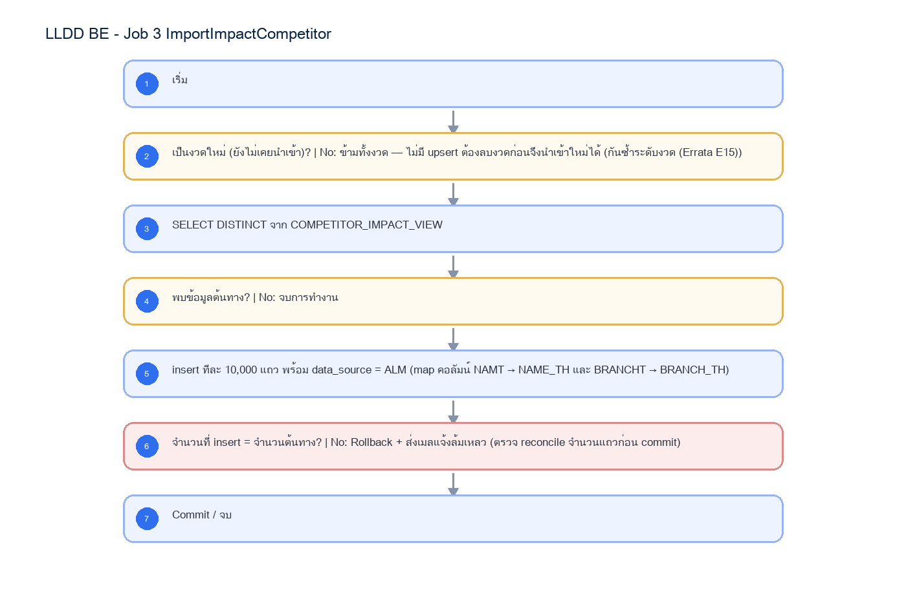

# LLDD BE - Job 3 ImportImpactCompetitor

SBP Mall - ระบบประกันรายได้ | Low Level Design Document

## 1. Overview

| รายการ | รายละเอียด |
| --- | --- |
| Track | BE |
| Estimate | 10 ชั่วโมง |
| Owner | Aphiwit <Bank> Khammoon |
| Objective | นำเข้าร้านคู่แข่งจาก ALLMAP: นำข้อมูลร้านคู่แข่งรายงวดจากวิว COMPETITOR_IMPACT_VIEW เข้า fgi_impact_competitors ทีละ 10,000 แถว กันซ้ำระดับงวด (ถ้างวดมีข้อมูลแล้วจะข้ามทั้งงวด ไม่มี upsert) |

Common contract reference: ทุกหัวข้อ API/FE ต้องยึด LLDD-BE-API-Common-Contracts และ LLDD-FE-Integration-Contracts สำหรับ error/auth/format/pagination/action/RBAC ก่อนลงรายละเอียดเฉพาะหน้าหรือเฉพาะ endpoint

## 2. Screen / Functional Scope

- Main class/script: th.co.gosoft.fgi.main.ImportImpactCompetitor / /appstore/SPS/FGI/schedule/FGI_ImportCompetitor.sh
- Phase: A
- Output: fgi_impact_competitors
- Estimate: 10 ชั่วโมง
- Runbook, rerun rule, risk และ history ต้องตามข้อมูลหน้า Batch Job

## 4. Implementation Flow Diagram (Reference)



_รูปที่ 1: Implementation flow reference: LLDD BE - Job 3 ImportImpactCompetitor_

## 5. Field, Format, and Validation

| Field / UI | Format | Validation | Behavior |
| --- | --- | --- | --- |
| กำหนดการรัน (Cron) | 0 07 7 * * | แก้ไขได้ | ใช้สคริปต์ /appstore/SPS/FGI/schedule/FGI_ImportCompetitor.sh; Operations ตรวจ deployment path และ owner permission ก่อนขึ้น production |
| Argument (งวด) | 2569\|06 | แก้ไขได้ | รูปแบบ YYYY\|MM |
| Chunk Size | 10000 | แก้ไขได้ | จำนวนแถวต่อรอบ insert |
| Source View | COMPETITOR_IMPACT_VIEW | ค่าคงที่/แก้ผ่านหน้าจอไม่ได้ | SELECT DISTINCT / map คอลัมน์ NAMT -> NAME_TH, BRANCHT -> BRANCH_TH |

## 5.1 Input / Progress / Output Contract

| Stage | Contract for implementation |
| --- | --- |
| Input | Period year/month and competitor impact data from ALLMAP COMPETITOR_IMPACT_VIEW. |
| Progress | validate period, skip when period already exists, query competitor view, insert in chunks inside a transaction, send status mail. |
| Output | FGI_IMPACT_COMPETITOR rows for the target period; run status is success/no-data/failed with inserted-count reconciliation. |

### 5.90 Job 3 Execution Stages

validate period, skip when period already exists, query competitor view, insert in chunks inside a transaction, send status mail.

| Order | Service step | Repository | Output / failure contract |
| --- | --- | --- | --- |
| 1 | loadCompetitorPeriod | impactCompetitorRepository | คืน metrics และ throw typed error; transaction/rerun ใช้ contract ด้านล่าง |
| 2 | deduplicateCompetitors | impactCompetitorRepository | คืน metrics และ throw typed error; transaction/rerun ใช้ contract ด้านล่าง |
| 3 | upsertCompetitors | impactCompetitorRepository | คืน metrics และ throw typed error; transaction/rerun ใช้ contract ด้านล่าง |
| 4 | reconcileCompetitorCount | impactCompetitorRepository | คืน metrics และ throw typed error; transaction/rerun ใช้ contract ด้านล่าง |

### 5.91 Job 3 Run Evidence

| Evidence | Job-specific value | Acceptance |
| --- | --- | --- |
| Input identity | Period year/month and competitor impact data from ALLMAP COMPETITOR_IMPACT_VIEW. | snapshot input file/business key/period in run record |
| Output identity | FGI_IMPACT_COMPETITOR rows for the target period; run status is success/no-data/failed with inserted-count reconciliation. | reconcile input, success, reject and skipped counts |
| Dedup proof | UNIQUE(impact_process_id, competitor_code, period_key); source row ซ้ำในไฟล์/วิวต้อง deduplicate ก่อน upsert | rerun fixture produces no duplicate target business key |
| Transaction proof | validate งวดก่อนอ่าน; upsert ทีละ chunk และ commit หลัง reconcile จำนวน input/success/reject ของ chunk ตรงกัน | injected failure leaves no partial committed state outside documented boundary |
| Security proof | ALLMAP datasource ใช้ secretRef และ TLS verify-full; จำกัด DB user เป็น SELECT เฉพาะ source view | config/log/error contains no plaintext secret |

### 5.92 Legacy Java Source Reference

| Legacy file | Line range | Responsibility to carry forward |
| --- | --- | --- |
| fcsJar/src/th/co/gosoft/fgi/main/ImportImpactCompetitor.java | 16-48 | Legacy main entrypoint and notification wrapper. |
| fcsJar/src/th/co/gosoft/fgi/controller/ImportController.java | 483-598 | Validate params, skip duplicates, query source, chunk insert competitors. |
| fcsJar/src/th/co/gosoft/fgi/dao/jdbc/ImportJdbc.java | 200-241 | Count existing period, query COMPETITOR_IMPACT_VIEW, insert FGI_IMPACT_COMPETITOR. |

Line ranges refer to the legacy Java implementation under /Users/bank_mac/gosoft/java/SBP/fcsJar. Use these ranges to preserve business behavior while implementing the target Node job.

### 5.93 Target Repository and SQL Contract

| Contract | Target implementation |
| --- | --- |
| Repository | impactCompetitorRepository |
| Idempotency / dedup | UNIQUE(impact_process_id, competitor_code, period_key); source row ซ้ำในไฟล์/วิวต้อง deduplicate ก่อน upsert |
| Transaction boundary | validate งวดก่อนอ่าน; upsert ทีละ chunk และ commit หลัง reconcile จำนวน input/success/reject ของ chunk ตรงกัน |
| Security | ALLMAP datasource ใช้ secretRef และ TLS verify-full; จำกัด DB user เป็น SELECT เฉพาะ source view |

#### Input / candidate query

```sql
SELECT impact_process_id, competitor_code, name_th, branch_th, opened_date, closed_date, period_key
FROM allmap_competitor_impact_view
WHERE period_key = :period_key;
```

#### Write / upsert query

```sql
INSERT INTO fgi_impact_competitors
    (impact_process_id, competitor_code, name_th, branch_th, opened_date, closed_date, period_key, updated_at)
VALUES (:impact_process_id, :competitor_code, :name_th, :branch_th, :opened_date, :closed_date, :period_key, CURRENT_TIMESTAMP)
ON CONFLICT (impact_process_id, competitor_code, period_key)
DO UPDATE SET name_th = EXCLUDED.name_th,
              branch_th = EXCLUDED.branch_th,
              opened_date = EXCLUDED.opened_date,
              closed_date = EXCLUDED.closed_date,
              updated_at = CURRENT_TIMESTAMP;
```

### 5.94 Target Node Implementation

โครงสร้างนี้ระบุ service/repository เฉพาะงานและต้อง implement ตาม SQL, transaction, idempotency และ security contract ด้านบน โดยทุกขั้นต้องคืน metrics สำหรับ reconcile และ run history

```js
export async function runLlddBeJob3Importimpactcompetitor(ctx, services) {
  const run = await services.jobRuns.acquire({
    jobNo: "3", period: ctx.period, triggeredBy: ctx.triggeredBy
  });

  try {
    ctx = { ...ctx, runId: run.id, repository: services.impactCompetitorRepository };
    const step1 = await services.loadCompetitorPeriod(ctx, undefined);
    const step2 = await services.deduplicateCompetitors(ctx, step1);
    const step3 = await services.upsertCompetitors(ctx, step2);
    const step4 = await services.reconcileCompetitorCount(ctx, step3);
    const result = step4;
    await services.jobRuns.finish(run.id, "SUCCESS", result.metrics);
    return { runId: run.id, status: "SUCCESS", ...result };
  } catch (error) {
    await services.jobRuns.finish(run.id, "FAILED", {
      errorCode: error.code ?? "JOB_FAILED",
      errorMessage: error.message
    });
    throw error;
  }
}
```

## 6. Button / User Action Mapping

| Action | Trigger | API / Service | Expected Result |
| --- | --- | --- | --- |
| เปิดดูรายละเอียด Job | GET | GET /api/v1/jobs/3 | คืน params/metadata ล่าสุด |
| บันทึกพารามิเตอร์ | PUT | PUT /api/v1/jobs/3/params | บันทึกเฉพาะ key ที่ editable และ audit |
| สั่งรันทันที | POST | POST /api/v1/jobs/3/run | สร้าง run history สถานะ RUNNING/QUEUED |
| เปิด/ปิดใช้งาน | PUT | PUT /api/v1/jobs/3/enabled | บันทึก enabled + audit พร้อม reason |

## 7. API Contract

### GET /api/v1/jobs/3

อ่าน metadata และพารามิเตอร์ของ Job

#### Query Params

```json
{
  "jobNo": "3"
}
```

#### Request Field Schema

| Field | Type | Required | Constraint / Meaning |
| --- | --- | --- | --- |
| jobNo | string | No | UTF-8; use value domain described by endpoint purpose |

#### Response

```json
{
  "jobNo": "3",
  "name": "ImportImpactCompetitor",
  "cron": "0 07 7 * *",
  "enabled": true,
  "params": [
    {
      "label": "กำหนดการรัน (Cron)",
      "value": "0 07 7 * *",
      "editable": true
    },
    {
      "label": "Argument (งวด)",
      "value": "2569|06",
      "editable": true
    },
    {
      "label": "Chunk Size",
      "value": "10000",
      "editable": true
    },
    {
      "label": "Source View",
      "value": "COMPETITOR_IMPACT_VIEW",
      "editable": false
    }
  ]
}
```

#### Response Field Schema

| Field | Type | Required | Constraint / Meaning |
| --- | --- | --- | --- |
| jobNo | string | Yes | UTF-8; use value domain described by endpoint purpose |
| name | string | Yes | UTF-8; use value domain described by endpoint purpose |
| cron | string | Yes | UTF-8; use value domain described by endpoint purpose |
| enabled | boolean | Yes | UTF-8; use value domain described by endpoint purpose |
| params | array<object> | Yes | JSON array; element type shown in Type column |
| params[].label | string | Yes | UTF-8; use value domain described by endpoint purpose |
| params[].value | string | Yes | UTF-8; use value domain described by endpoint purpose |
| params[].editable | boolean | Yes | UTF-8; use value domain described by endpoint purpose |

### PUT /api/v1/jobs/3/params

แก้ไขพารามิเตอร์ที่อนุญาตเท่านั้น

#### Request

```json
{
  "params": {
    "cron": "0 07 7 * *"
  },
  "reason": "ปรับรอบรันตาม Operations"
}
```

#### Request Field Schema

| Field | Type | Required | Constraint / Meaning |
| --- | --- | --- | --- |
| params | object | Yes | JSON object; nested fields listed below |
| params.cron | string | Yes | UTF-8; use value domain described by endpoint purpose |
| reason | string | Yes | trimmed UTF-8 Thai text; required by operation/business rule |

#### Response

```json
{
  "message": "saved"
}
```

#### Response Field Schema

| Field | Type | Required | Constraint / Meaning |
| --- | --- | --- | --- |
| message | string | Yes | UTF-8; use value domain described by endpoint purpose |

### POST /api/v1/jobs/3/run

สั่งรัน manual โดย guard ไม่ให้รันซ้อน

#### Request

```json
{
  "period": "2569-07"
}
```

#### Request Field Schema

| Field | Type | Required | Constraint / Meaning |
| --- | --- | --- | --- |
| period | string | Yes | UTF-8; use value domain described by endpoint purpose |

#### Response

```json
{
  "runId": "JOB3-RUN-001",
  "status": "RUNNING"
}
```

#### Response Field Schema

| Field | Type | Required | Constraint / Meaning |
| --- | --- | --- | --- |
| runId | string | Yes | UTF-8; use value domain described by endpoint purpose |
| status | string | Yes | UTF-8; use value domain described by endpoint purpose |

### GET /api/v1/jobs/3/runs

อ่านประวัติการรันล่าสุด

#### Query Params

```json
{
  "page": 1,
  "size": 20
}
```

#### Request Field Schema

| Field | Type | Required | Constraint / Meaning |
| --- | --- | --- | --- |
| page | integer | No | >= 1; default 1 |
| size | integer | No | 1..100; default 20 |

#### Response

```json
{
  "items": [
    {
      "startedAt": "07/06/2569 07:05",
      "status": "ok"
    }
  ]
}
```

#### Response Field Schema

| Field | Type | Required | Constraint / Meaning |
| --- | --- | --- | --- |
| items | array<object> | Yes | JSON array; element type shown in Type column |
| items[].startedAt | string | Yes | ISO-8601 ค.ศ.; nullable only when type includes null |
| items[].status | string | Yes | UTF-8; use value domain described by endpoint purpose |

## 8. Reference DB Mapping (No Database Page Work)

ส่วนนี้เป็นข้อมูลอ้างอิงสำหรับการ implement API/Job เท่านั้น ไม่ใช่งานสร้างหน้า Database, ไม่ใช่งานออกแบบ DB page และไม่ถูกนับเป็น deliverable แยกของ FE/BE

| Table / Object | R/W | Usage |
| --- | --- | --- |
| fgi_impact_competitors | W | insert รายงวด data_source=ALM (งวดล่าสุดต่อร้าน) ดึงจาก ALLMAP |

## 9. Processing Flow

| Step | Description |
| --- | --- |
| 1 | เริ่ม |
| 2 | เป็นงวดใหม่ (ยังไม่เคยนำเข้า)? \| No: ข้ามทั้งงวด — ไม่มี upsert ต้องลบงวดก่อนจึงนำเข้าใหม่ได้ (กันซ้ำระดับงวด (Errata E15)) |
| 3 | SELECT DISTINCT จาก COMPETITOR_IMPACT_VIEW |
| 4 | พบข้อมูลต้นทาง? \| No: จบการทำงาน |
| 5 | insert ทีละ 10,000 แถว พร้อม data_source = ALM (map คอลัมน์ NAMT → NAME_TH และ BRANCHT → BRANCH_TH) |
| 6 | จำนวนที่ insert = จำนวนต้นทาง? \| No: Rollback + ส่งเมลแจ้งล้มเหลว (ตรวจ reconcile จำนวนแถวก่อน commit) |
| 7 | Commit / จบ |

## 10. Acceptance Criteria

- อ่าน/แก้พารามิเตอร์ได้ตาม editable flag เท่านั้น
- การสั่งรันต้องตรวจ enabled และไม่มีรอบ RUNNING เดิม
- ต้องบันทึก job_run_histories และ audit_logs สำหรับทุก mutation
- DB/table mapping ใช้เป็น reference สำหรับ implement Job เท่านั้น ไม่ใช่งานสร้างหน้า Database
- รองรับ rerun rule และ risk note ตาม runbook

## 11. Developer Test Checklist

| No | Test |
| --- | --- |
| 1 | GET job detail |
| 2 | PUT params with editable key |
| 3 | PUT params locked business key must fail |
| 4 | POST run while running must fail |
| 5 | GET run histories |
| 6 | ตรวจผลกระทบตารางตาม R/W mapping reference |
