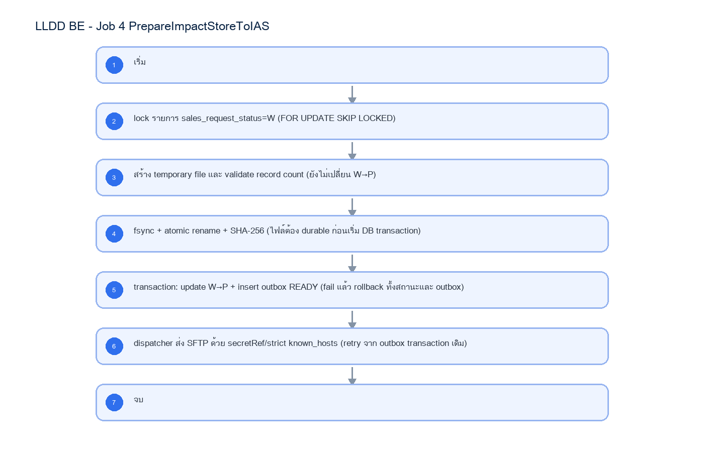

# LLDD BE - Job 4 PrepareImpactStoreToIAS

SBP Mall - ระบบประกันรายได้ | Low Level Design Document

## 1. Overview

| รายการ | รายละเอียด |
| --- | --- |
| Track | BE |
| Estimate | 13 ชั่วโมง |
| Owner | Aphiwit <Bank> Khammoon |
| Objective | เตรียมและส่งคำขอยอดขายไป IAS: สร้างไฟล์คำขอยอดขาย IAS/MIS แบบ durable ก่อนเปลี่ยนสถานะ W→P แล้วบันทึก transactional outbox เพื่อส่งซ้ำได้โดยไม่สร้างรายการซ้ำ |

Common contract reference: ทุกหัวข้อ API/FE ต้องยึด LLDD-BE-API-Common-Contracts และ LLDD-FE-Integration-Contracts สำหรับ error/auth/format/pagination/action/RBAC ก่อนลงรายละเอียดเฉพาะหน้าหรือเฉพาะ endpoint

## 2. Screen / Functional Scope

- Main class/script: fgi.main.PrepareImpactStoreToIAS / FGI_ExportImpactStoreToAMS.sh
- Phase: B
- Output: AMS06001O (UTF-8)
- Estimate: 13 ชั่วโมง
- Runbook, rerun rule, risk และ history ต้องตามข้อมูลหน้า Batch Job

## 4. Implementation Flow Diagram (Reference)



_รูปที่ 1: Implementation flow reference: LLDD BE - Job 4 PrepareImpactStoreToIAS_

## 5. Field, Format, and Validation

| Field / UI | Format | Validation | Behavior |
| --- | --- | --- | --- |
| กำหนดการรัน (Cron) | 0 16 7-16 * * | แก้ไขได้ | รันวันที่ 7-16 เวลา 16:00 |
| IAS SFTP endpoint alias | ias-sales-request | ค่าคงที่/แก้ผ่านหน้าจอไม่ได้ | host/port resolve จาก environment; credential ใช้ secretRef และ strict known_hosts |
| Secret reference | secret/sbpgi/interfaces/ias | ค่าคงที่/แก้ผ่านหน้าจอไม่ได้ | ห้ามเก็บ password/private key ใน job_configs |
| Output staging path | /data/sbpgi/outbox/ias | แก้ไขได้ | ต้องรองรับ temp file, fsync และ atomic rename |

## 5.1 Input / Progress / Output Contract

| Stage | Contract for implementation |
| --- | --- |
| Input | FGI_IMPACT_STORE_SALES rows waiting for IAS sales data and export file/SFTP parameters. |
| Progress | query eligible stores, write outbound IAS request file, upload to SFTP, backup file, record success/failure and notification. |
| Output | IAS request file containing store/open-date pairs; run history includes generated file name and exported row count. |

### 5.90 Job 4 Execution Stages

query eligible stores, write outbound IAS request file, upload to SFTP, backup file, record success/failure and notification.

| Order | Service step | Repository | Output / failure contract |
| --- | --- | --- | --- |
| 1 | lockWaitingSalesRequests | iasRequestRepository | คืน metrics และ throw typed error; transaction/rerun ใช้ contract ด้านล่าง |
| 2 | writeDurableIasFile | iasRequestRepository | คืน metrics และ throw typed error; transaction/rerun ใช้ contract ด้านล่าง |
| 3 | markPendingAndCreateOutbox | iasRequestRepository | คืน metrics และ throw typed error; transaction/rerun ใช้ contract ด้านล่าง |
| 4 | dispatchIasOutbox | iasRequestRepository | คืน metrics และ throw typed error; transaction/rerun ใช้ contract ด้านล่าง |

### 5.91 Job 4 Run Evidence

| Evidence | Job-specific value | Acceptance |
| --- | --- | --- |
| Input identity | FGI_IMPACT_STORE_SALES rows waiting for IAS sales data and export file/SFTP parameters. | snapshot input file/business key/period in run record |
| Output identity | IAS request file containing store/open-date pairs; run history includes generated file name and exported row count. | reconcile input, success, reject and skipped counts |
| Dedup proof | ชื่อไฟล์ deterministic จาก period+runId และ UNIQUE(data_name,direction,business_key,period_key); outbox retry ใช้ transaction เดิม ไม่สร้าง request ซ้ำ | rerun fixture produces no duplicate target business key |
| Transaction proof | สร้างไฟล์ temp, fsync, atomic rename และคำนวณ checksum ให้สำเร็จก่อน; จากนั้น transaction เดียว lock W, update W→P และ insert outbox READY; ห้าม commit W→P ก่อนมี durable file | injected failure leaves no partial committed state outside documented boundary |
| Security proof | IAS SFTP credential ใช้ secretRef=secret/sbpgi/interfaces/ias; strict known_hosts, modern cipher, timeout และห้าม editable password/private key | config/log/error contains no plaintext secret |

### 5.92 Legacy Java Source Reference

| Legacy file | Line range | Responsibility to carry forward |
| --- | --- | --- |
| fcsJar/src/th/co/gosoft/fgi/main/PrepareImpactStoreToIAS.java | 28-243 | Legacy main entrypoint, file generation, upload, backup, notification. |
| fcsJar/src/th/co/gosoft/fgi/dao/jdbc/ImportStoreJdbc.java | 99-115 | Query FGI_IMPACT_STORE_SALES rows eligible for IAS request. |

Line ranges refer to the legacy Java implementation under /Users/bank_mac/gosoft/java/SBP/fcsJar. Use these ranges to preserve business behavior while implementing the target Node job.

### 5.93 Target Repository and SQL Contract

| Contract | Target implementation |
| --- | --- |
| Repository | iasRequestRepository |
| Idempotency / dedup | ชื่อไฟล์ deterministic จาก period+runId และ UNIQUE(data_name,direction,business_key,period_key); outbox retry ใช้ transaction เดิม ไม่สร้าง request ซ้ำ |
| Transaction boundary | สร้างไฟล์ temp, fsync, atomic rename และคำนวณ checksum ให้สำเร็จก่อน; จากนั้น transaction เดียว lock W, update W→P และ insert outbox READY; ห้าม commit W→P ก่อนมี durable file |
| Security | IAS SFTP credential ใช้ secretRef=secret/sbpgi/interfaces/ias; strict known_hosts, modern cipher, timeout และห้าม editable password/private key |

#### Input / candidate query

```sql
SELECT s.id, s.impact_process_id, s.impacted_store_code, s.new_store_code, s.impact_month
FROM fgi_impact_stores s
WHERE s.verify_status = 'W'
ORDER BY s.id
FOR UPDATE SKIP LOCKED;
```

#### Write / upsert query

```sql
UPDATE fgi_impact_stores
SET verify_status = 'P', updated_at = CURRENT_TIMESTAMP
WHERE id = ANY(:impact_store_ids) AND verify_status = 'W';

INSERT INTO interface_transactions
    (run_id, data_name, direction, status, impact_process_id, business_key, period_key,
     file_name, file_checksum, outbox_status, purge_after)
SELECT :run_id, 'IAS_SALES_REQUEST', 'OUT', 'READY', impact_process_id,
       impacted_store_code || ':' || new_store_code, impact_month,
       :file_name, :file_checksum, 'READY', CURRENT_TIMESTAMP + INTERVAL '180 days'
FROM fgi_impact_stores
WHERE id = ANY(:impact_store_ids)
ON CONFLICT (data_name, direction, business_key, period_key) DO NOTHING;
```

### 5.94 Target Node Implementation

โครงสร้างนี้ระบุ service/repository เฉพาะงานและต้อง implement ตาม SQL, transaction, idempotency และ security contract ด้านบน โดยทุกขั้นต้องคืน metrics สำหรับ reconcile และ run history

```js
export async function runLlddBeJob4Prepareimpactstoretoias(ctx, services) {
  const run = await services.jobRuns.acquire({
    jobNo: "4", period: ctx.period, triggeredBy: ctx.triggeredBy
  });

  try {
    ctx = { ...ctx, runId: run.id, repository: services.iasRequestRepository };
    const step1 = await services.lockWaitingSalesRequests(ctx, undefined);
    const step2 = await services.writeDurableIasFile(ctx, step1);
    const step3 = await services.markPendingAndCreateOutbox(ctx, step2);
    const step4 = await services.dispatchIasOutbox(ctx, step3);
    const result = step4;
    await services.jobRuns.finish(run.id, "SUCCESS", result.metrics);
    return { runId: run.id, status: "SUCCESS", ...result };
  } catch (error) {
    await services.jobRuns.finish(run.id, "FAILED", {
      errorCode: error.code ?? "JOB_FAILED",
      errorMessage: error.message
    });
    throw error;
  }
}
```

### 5.95 Job 4 Atomic File / Outbox Sequence

| Order | Required action | Failure behavior |
| --- | --- | --- |
| 1 | lock candidate W ด้วย FOR UPDATE SKIP LOCKED และสร้าง payload ใน memory | validation fail: rollback lock; สถานะยัง W |
| 2 | เขียน temporary file, fsync, atomic rename และคำนวณ SHA-256 | write/rename/checksum fail: ลบ temp; สถานะยัง W; ไม่สร้าง outbox |
| 3 | transaction เดียว update W→P และ insert interface_transactions/outbox READY | DB fail: rollback W→P และ outbox; durable file คงไว้ให้ cleanup/reconcile โดย checksum |
| 4 | dispatcher อ่าน READY แล้วส่ง SFTP; compare checksum ก่อนส่ง | ส่ง fail: outbox ยัง READY/FAILED_RETRY; ห้ามเปลี่ยน candidate กลับ W เพื่อไม่ให้สร้างไฟล์ซ้ำ |
| 5 | ส่งสำเร็จ mark SENT; callback/import ที่สัมพันธ์กัน mark ACKED | ใช้ transaction id เดิมตลอด lifecycle |

## 6. Button / User Action Mapping

| Action | Trigger | API / Service | Expected Result |
| --- | --- | --- | --- |
| เปิดดูรายละเอียด Job | GET | GET /api/v1/jobs/4 | คืน params/metadata ล่าสุด |
| บันทึกพารามิเตอร์ | PUT | PUT /api/v1/jobs/4/params | บันทึกเฉพาะ key ที่ editable และ audit |
| สั่งรันทันที | POST | POST /api/v1/jobs/4/run | สร้าง run history สถานะ RUNNING/QUEUED |
| เปิด/ปิดใช้งาน | PUT | PUT /api/v1/jobs/4/enabled | บันทึก enabled + audit พร้อม reason |

## 7. API Contract

### GET /api/v1/jobs/4

อ่าน metadata และพารามิเตอร์ของ Job

#### Query Params

```json
{
  "jobNo": "4"
}
```

#### Request Field Schema

| Field | Type | Required | Constraint / Meaning |
| --- | --- | --- | --- |
| jobNo | string | No | UTF-8; use value domain described by endpoint purpose |

#### Response

```json
{
  "jobNo": "4",
  "name": "PrepareImpactStoreToIAS",
  "cron": "0 16 7-16 * *",
  "enabled": true,
  "params": [
    {
      "label": "กำหนดการรัน (Cron)",
      "value": "0 16 7-16 * *",
      "editable": true
    },
    {
      "label": "IAS SFTP endpoint alias",
      "value": "ias-sales-request",
      "editable": false
    },
    {
      "label": "Secret reference",
      "value": "secret/sbpgi/interfaces/ias",
      "editable": false
    },
    {
      "label": "Output staging path",
      "value": "/data/sbpgi/outbox/ias",
      "editable": true
    }
  ]
}
```

#### Response Field Schema

| Field | Type | Required | Constraint / Meaning |
| --- | --- | --- | --- |
| jobNo | string | Yes | UTF-8; use value domain described by endpoint purpose |
| name | string | Yes | UTF-8; use value domain described by endpoint purpose |
| cron | string | Yes | UTF-8; use value domain described by endpoint purpose |
| enabled | boolean | Yes | UTF-8; use value domain described by endpoint purpose |
| params | array<object> | Yes | JSON array; element type shown in Type column |
| params[].label | string | Yes | UTF-8; use value domain described by endpoint purpose |
| params[].value | string | Yes | UTF-8; use value domain described by endpoint purpose |
| params[].editable | boolean | Yes | UTF-8; use value domain described by endpoint purpose |

### PUT /api/v1/jobs/4/params

แก้ไขพารามิเตอร์ที่อนุญาตเท่านั้น

#### Request

```json
{
  "params": {
    "cron": "0 16 7-16 * *"
  },
  "reason": "ปรับรอบรันตาม Operations"
}
```

#### Request Field Schema

| Field | Type | Required | Constraint / Meaning |
| --- | --- | --- | --- |
| params | object | Yes | JSON object; nested fields listed below |
| params.cron | string | Yes | UTF-8; use value domain described by endpoint purpose |
| reason | string | Yes | trimmed UTF-8 Thai text; required by operation/business rule |

#### Response

```json
{
  "message": "saved"
}
```

#### Response Field Schema

| Field | Type | Required | Constraint / Meaning |
| --- | --- | --- | --- |
| message | string | Yes | UTF-8; use value domain described by endpoint purpose |

### POST /api/v1/jobs/4/run

สั่งรัน manual โดย guard ไม่ให้รันซ้อน

#### Request

```json
{
  "period": "2569-07"
}
```

#### Request Field Schema

| Field | Type | Required | Constraint / Meaning |
| --- | --- | --- | --- |
| period | string | Yes | UTF-8; use value domain described by endpoint purpose |

#### Response

```json
{
  "runId": "JOB4-RUN-001",
  "status": "RUNNING"
}
```

#### Response Field Schema

| Field | Type | Required | Constraint / Meaning |
| --- | --- | --- | --- |
| runId | string | Yes | UTF-8; use value domain described by endpoint purpose |
| status | string | Yes | UTF-8; use value domain described by endpoint purpose |

### GET /api/v1/jobs/4/runs

อ่านประวัติการรันล่าสุด

#### Query Params

```json
{
  "page": 1,
  "size": 20
}
```

#### Request Field Schema

| Field | Type | Required | Constraint / Meaning |
| --- | --- | --- | --- |
| page | integer | No | >= 1; default 1 |
| size | integer | No | 1..100; default 20 |

#### Response

```json
{
  "items": [
    {
      "startedAt": "16/06/2569 16:00",
      "status": "ok"
    }
  ]
}
```

#### Response Field Schema

| Field | Type | Required | Constraint / Meaning |
| --- | --- | --- | --- |
| items | array<object> | Yes | JSON array; element type shown in Type column |
| items[].startedAt | string | Yes | ISO-8601 ค.ศ.; nullable only when type includes null |
| items[].status | string | Yes | UTF-8; use value domain described by endpoint purpose |

## 8. Reference DB Mapping (No Database Page Work)

ส่วนนี้เป็นข้อมูลอ้างอิงสำหรับการ implement API/Job เท่านั้น ไม่ใช่งานสร้างหน้า Database, ไม่ใช่งานออกแบบ DB page และไม่ถูกนับเป็น deliverable แยกของ FE/BE

| Table / Object | R/W | Usage |
| --- | --- | --- |
| fgi_impact_stores | R/W | lock candidate W และเปลี่ยนเป็น P หลัง durable file สำเร็จเท่านั้น |
| fgi_impact_sales_summaries | R/W | สร้าง/ผูกหัวสรุปยอดขายใน transaction |
| interface_transactions | W | transactional outbox READY/SENT/ACKED พร้อม checksum และ idempotency key |
| job_run_histories | W | run status และ reconcile count |

## 9. Processing Flow

| Step | Description |
| --- | --- |
| 1 | เริ่ม |
| 2 | lock รายการ verify_status=W (FOR UPDATE SKIP LOCKED) |
| 3 | สร้าง temporary file และ validate record count (ยังไม่เปลี่ยน W→P) |
| 4 | fsync + atomic rename + SHA-256 (ไฟล์ต้อง durable ก่อนเริ่ม DB transaction) |
| 5 | transaction: update W→P + insert outbox READY (fail แล้ว rollback ทั้งสถานะและ outbox) |
| 6 | dispatcher ส่ง SFTP ด้วย secretRef/strict known_hosts (retry จาก outbox transaction เดิม) |
| 7 | จบ |

## 10. Acceptance Criteria

- อ่าน/แก้พารามิเตอร์ได้ตาม editable flag เท่านั้น
- การสั่งรันต้องตรวจ enabled และไม่มีรอบ RUNNING เดิม
- ต้องบันทึก job_run_histories และ audit_logs สำหรับทุก mutation
- DB/table mapping ใช้เป็น reference สำหรับ implement Job เท่านั้น ไม่ใช่งานสร้างหน้า Database
- รองรับ rerun rule และ risk note ตาม runbook

## 11. Developer Test Checklist

| No | Test |
| --- | --- |
| 1 | GET job detail |
| 2 | PUT params with editable key |
| 3 | PUT params locked business key must fail |
| 4 | POST run while running must fail |
| 5 | GET run histories |
| 6 | ตรวจผลกระทบตารางตาม R/W mapping reference |
