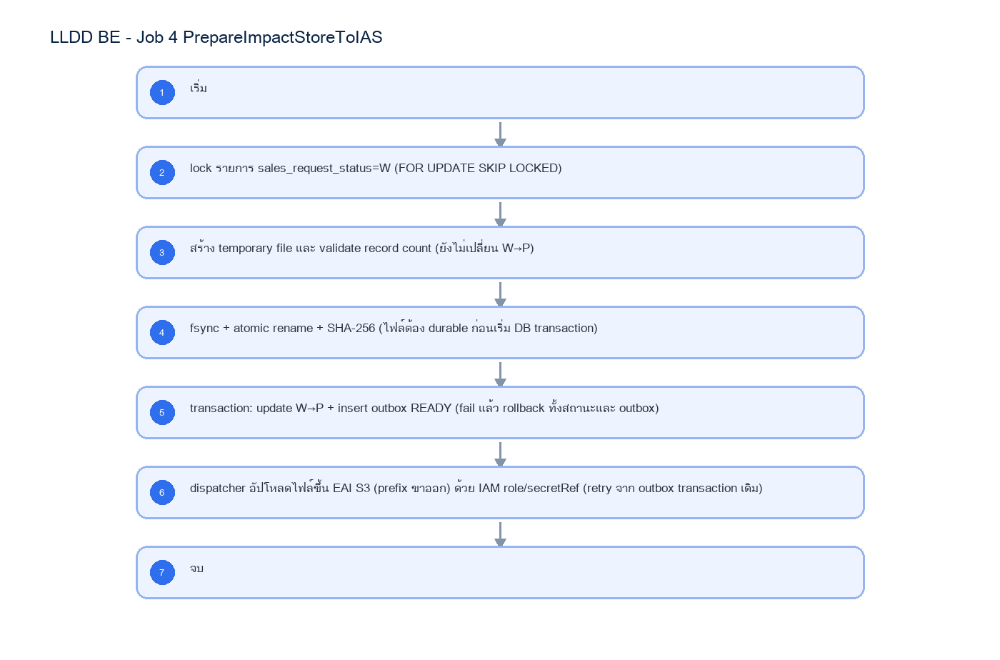

# LLDD BE - Job 4 PrepareImpactStoreToIAS

SBP Mall - ระบบประกันรายได้ | Low Level Design Document

## 1. Overview

| รายการ | รายละเอียด |
| --- | --- |
| Track | BE |
| Estimate | **19 ชั่วโมง** = implementation 14 + unit test 5 (30%) |
| Owner | Aphiwit <Bank> Khammoon |
| Target repository | `SBP/srm-sps-spsap-store-backend` (NestJS + TypeORM · schema `sps_store`) — batch runner ฝั่ง backend **ไม่ผ่าน BFF** · cron/พารามิเตอร์อยู่ใน backend config (env/config file) |
| Objective | เตรียมและส่งคำขอยอดขายไป IAS: สร้างไฟล์คำขอยอดขาย IAS/MIS แบบ durable ก่อนเปลี่ยนสถานะ W→P แล้วบันทึก transactional outbox เพื่อส่งซ้ำได้โดยไม่สร้างรายการซ้ำ |

Common contract reference: ทุกหัวข้อ API/FE ต้องยึด LLDD-BE-API-Common-Contracts และ LLDD-FE-Integration-Contracts สำหรับ error/auth/format/pagination/action/RBAC ก่อนลงรายละเอียดเฉพาะหน้าหรือเฉพาะ endpoint

## 2. Screen / Functional Scope

- Main class/script: fgi.main.PrepareImpactStoreToIAS / FGI_ExportImpactStoreToAMS.sh
- Phase: B
- Output: AMS06001O (UTF-8)
- Estimate: 14 ชั่วโมง
- พารามิเตอร์/cron อ่านจาก backend config (config file/env) — ไม่มีตาราง job_configs และไม่มีหน้าจอควบคุม (หน้า Flow Batch Job ในกลุ่มเมนู Flow เหลือแค่ Flowchart + Database ที่ใช้ · 2026-08-06)
- Runbook, rerun rule, risk และ history ตามเอกสาร Batch v4.0 · ผลการรันเขียน application log แบบ structured

## 3. Screenshot Reference

ไม่มีภาพหน้าจอสำหรับหัวข้อนี้ — เป็นเอกสารฝั่ง Backend/Batch ที่ไม่มี UI (ภาพหน้าจอทั้งหมดอยู่ในเอกสารชุด FE)

## 4. Implementation Flow Diagram (Reference)



_รูปที่ 1: Implementation flow reference: LLDD BE - Job 4 PrepareImpactStoreToIAS_

## 5. Field, Format, and Validation

| Field / UI | Format | Validation | Behavior |
| --- | --- | --- | --- |
| กำหนดการรัน (Cron) | 0 16 7-16 * * | แก้ไขได้ | รันวันที่ 7-16 เวลา 16:00 |
| IAS SFTP endpoint alias | ias-sales-request | ค่าคงที่/แก้ผ่านหน้าจอไม่ได้ | host/port resolve จาก environment; credential ใช้ secretRef และ strict known_hosts |
| Secret reference | secret/sbpgi/interfaces/ias | ค่าคงที่/แก้ผ่านหน้าจอไม่ได้ | ห้ามเก็บ password/private key ใน config/env ของ job |
| Output staging path | /data/sbpgi/outbox/ias | แก้ไขได้ | ต้องรองรับ temp file, fsync และ atomic rename |

### 5.9 Input / Progress / Output Contract

| Stage | Contract for implementation |
| --- | --- |
| Input | FGI_IMPACT_STORE_SALES rows waiting for IAS sales data and export file/SFTP parameters. |
| Progress | query eligible stores, write outbound IAS request file, upload to SFTP, backup file, record success/failure and notification. |
| Output | IAS request file containing store/open-date pairs; run history includes generated file name and exported row count. |

### 5.90 Job 4 Execution Stages

query eligible stores, write outbound IAS request file, upload to SFTP, backup file, record success/failure and notification.

| Order | Service step | Repository | Output / failure contract |
| --- | --- | --- | --- |
| 1 | lockWaitingSalesRequests | iasRequestRepository | คืน metrics และ throw typed error; transaction/rerun ใช้ contract ด้านล่าง |
| 2 | writeDurableIasFile | iasRequestRepository | คืน metrics และ throw typed error; transaction/rerun ใช้ contract ด้านล่าง |
| 3 | markPendingAndCreateOutbox | iasRequestRepository | คืน metrics และ throw typed error; transaction/rerun ใช้ contract ด้านล่าง |
| 4 | dispatchIasOutbox | iasRequestRepository | คืน metrics และ throw typed error; transaction/rerun ใช้ contract ด้านล่าง |

### 5.91 Job 4 Run Evidence

| Evidence | Job-specific value | Acceptance |
| --- | --- | --- |
| Input identity | FGI_IMPACT_STORE_SALES rows waiting for IAS sales data and export file/SFTP parameters. | snapshot input file/business key/period in run record |
| Output identity | IAS request file containing store/open-date pairs; run history includes generated file name and exported row count. | reconcile input, success, reject and skipped counts |
| Dedup proof | ชื่อไฟล์ deterministic จาก period+runId และ UNIQUE(data_name,direction,business_key,period_key); outbox retry ใช้ transaction เดิม ไม่สร้าง request ซ้ำ | rerun fixture produces no duplicate target business key |
| Transaction proof | สร้างไฟล์ temp, fsync, atomic rename และคำนวณ checksum ให้สำเร็จก่อน; จากนั้น transaction เดียว lock W, update W→P และ insert outbox READY; ห้าม commit W→P ก่อนมี durable file | injected failure leaves no partial committed state outside documented boundary |
| Security proof | IAS SFTP credential ใช้ secretRef=secret/sbpgi/interfaces/ias; strict known_hosts, modern cipher, timeout และห้าม editable password/private key | config/log/error contains no plaintext secret |

### 5.92 Legacy Java Source Reference

| Legacy file | Line range | Responsibility to carry forward |
| --- | --- | --- |
| fcsJar/src/th/co/gosoft/fgi/main/PrepareImpactStoreToIAS.java | 28-243 | Legacy main entrypoint, file generation, upload, backup, notification. |
| fcsJar/src/th/co/gosoft/fgi/dao/jdbc/ImportStoreJdbc.java | 99-115 | Query FGI_IMPACT_STORE_SALES rows eligible for IAS request. |

Line ranges refer to the legacy Java implementation under /Users/bank_mac/gosoft/java/SBP/fcsJar. Use these ranges to preserve business behavior while implementing the target Node job.

### 5.93 Target Repository and SQL Contract

| Contract | Target implementation |
| --- | --- |
| Repository | iasRequestRepository |
| Idempotency / dedup | ชื่อไฟล์ deterministic จาก period+runId และ UNIQUE(data_name,direction,business_key,period_key); outbox retry ใช้ transaction เดิม ไม่สร้าง request ซ้ำ |
| Transaction boundary | สร้างไฟล์ temp, fsync, atomic rename และคำนวณ checksum ให้สำเร็จก่อน; จากนั้น transaction เดียว lock W, update W→P และ insert outbox READY; ห้าม commit W→P ก่อนมี durable file |
| Security | IAS SFTP credential ใช้ secretRef=secret/sbpgi/interfaces/ias; strict known_hosts, modern cipher, timeout และห้าม editable password/private key |

#### Input / candidate query

```sql
SELECT s.id, s.impact_process_id, s.impacted_store_code, s.new_store_code, s.impact_month
FROM fgi_impact_stores s
WHERE s.sales_request_status = 'W'
ORDER BY s.id
FOR UPDATE SKIP LOCKED;
```

#### Write / upsert query

```sql
UPDATE fgi_impact_stores
SET sales_request_status = 'P', updated_at = CURRENT_TIMESTAMP
WHERE id = ANY(:impact_store_ids) AND sales_request_status = 'W';

INSERT INTO interface_transactions
    (run_id, data_name, direction, status, impact_process_id, business_key, period_key,
     file_name, file_checksum, outbox_status, purge_after)
SELECT :run_id, 'IAS_SALES_REQUEST', 'OUT', 'READY', impact_process_id,
       impacted_store_code || ':' || new_store_code, impact_month,
       :file_name, :file_checksum, 'READY', CURRENT_TIMESTAMP + INTERVAL '180 days'
FROM fgi_impact_stores
WHERE id = ANY(:impact_store_ids)
ON CONFLICT (data_name, direction, business_key, period_key) DO NOTHING;
```

### 5.94 Target Node Implementation

โครงสร้างนี้ระบุ service/repository เฉพาะงานและต้อง implement ตาม SQL, transaction, idempotency และ security contract ด้านบน โดยทุกขั้นต้องคืน metrics สำหรับ reconcile และ run history

```js
export async function runLlddBeJob4Prepareimpactstoretoias(ctx, services) {
  const run = await services.jobRuns.acquire({
    jobNo: "4", period: ctx.period, triggeredBy: ctx.triggeredBy
  });

  try {
    ctx = { ...ctx, runId: run.id, repository: services.iasRequestRepository };
    const step1 = await services.lockWaitingSalesRequests(ctx, undefined);
    const step2 = await services.writeDurableIasFile(ctx, step1);
    const step3 = await services.markPendingAndCreateOutbox(ctx, step2);
    const step4 = await services.dispatchIasOutbox(ctx, step3);
    const result = step4;
    await services.jobRuns.finish(run.id, "SUCCESS", result.metrics);
    return { runId: run.id, status: "SUCCESS", ...result };
  } catch (error) {
    await services.jobRuns.finish(run.id, "FAILED", {
      errorCode: error.code ?? "JOB_FAILED",
      errorMessage: error.message
    });
    throw error;
  }
}
```

### 5.95 Job 4 Atomic File / Outbox Sequence

| Order | Required action | Failure behavior |
| --- | --- | --- |
| 1 | lock candidate W ด้วย FOR UPDATE SKIP LOCKED และสร้าง payload ใน memory | validation fail: rollback lock; สถานะยัง W |
| 2 | เขียน temporary file, fsync, atomic rename และคำนวณ SHA-256 | write/rename/checksum fail: ลบ temp; สถานะยัง W; ไม่สร้าง outbox |
| 3 | transaction เดียว update W→P และ insert interface_transactions/outbox READY | DB fail: rollback W→P และ outbox; durable file คงไว้ให้ cleanup/reconcile โดย checksum |
| 4 | dispatcher อ่าน READY แล้วส่ง SFTP; compare checksum ก่อนส่ง | ส่ง fail: outbox ยัง READY/FAILED_RETRY; ห้ามเปลี่ยน candidate กลับ W เพื่อไม่ให้สร้างไฟล์ซ้ำ |
| 5 | ส่งสำเร็จ mark SENT; callback/import ที่สัมพันธ์กัน mark ACKED | ใช้ transaction id เดิมตลอด lifecycle |

## 6. Button / User Action Mapping

| Action | Trigger | API / Service | Expected Result |
| --- | --- | --- | --- |
| รันตามตารางเวลา | CRON | scheduler → runner (job 4) | อ่าน cron/พารามิเตอร์จาก backend config |
| รันนอกรอบ (manual/rerun) | CLI | CLI/ops runbook → runner (job 4) | guard ไม่ให้รันซ้อนด้วย distributed lock |
| แก้พารามิเตอร์/เปิด-ปิด job | CONFIG | แก้ backend config แล้ว deploy | ไม่มี endpoint และไม่มีหน้าจอควบคุม — หน้า Flow Batch Job เป็น reference อย่างเดียว (2026-08-06) |
| ตรวจผลการรัน | LOG | application log (structured) | ไม่มีตาราง job_run_histories แล้ว · ไฟล์/ACK ดูที่ interface_transactions |

## 7. API Contract

## 8. Reference DB Mapping (No Database Page Work)

ส่วนนี้เป็นข้อมูลอ้างอิงสำหรับการ implement API/Job เท่านั้น ไม่ใช่งานสร้างหน้า Database, ไม่ใช่งานออกแบบ DB page และไม่ถูกนับเป็น deliverable แยกของ FE/BE

| Table / Object | R/W | Usage |
| --- | --- | --- |
| fgi_impact_stores | R/W | lock candidate W และเปลี่ยนเป็น P หลัง durable file สำเร็จเท่านั้น |
| fgi_impact_sales_summaries | R/W | สร้าง/ผูกหัวสรุปยอดขายใน transaction |
| interface_transactions | W | transactional outbox READY/SENT/ACKED พร้อม checksum และ idempotency key |
| (application log แบบ structured) | W | run status และ reconcile count — ตาราง job_run_histories ถูกตัด 2026-08-06 |

## 9. Skeleton Code (Batch Job 4)

#### 9.1 ผังไฟล์ที่ต้องสร้าง (Job 4)

โครงไฟล์ของ Job 4 (fgi.main.PrepareImpactStoreToIAS เดิม) วางใต้ `src/batch/sbpgi/` ของ store-backend โดยใช้ convention เดียวกับ module ธุรกิจอื่น: inject custom provider `DATA_SOURCE` แล้วยิง raw SQL, repository ประกาศเป็น factory provider ที่ใช้ token string, entity อยู่ใน `src/entitys/`

**หมายเหตุสำคัญ — `src/batch/*` ทั้งชุดเป็นของใหม่ที่ยังไม่มีใน store-backend**: ปัจจุบัน repo ไม่มีโฟลเดอร์ `src/batch` เลย และแม้จะติดตั้ง `@nestjs/schedule` ไว้แล้วก็ยัง**ไม่มี `@Cron`/`@Interval` แม้แต่จุดเดียว** ดังนั้น `runner.ts` / `scheduler.ts` / `cli.js` / `job-failure.notifier.ts` คือ **งานตั้งต้นของ Phase แรก** ที่ต้องสร้างเองทั้งหมด พร้อม register `ScheduleModule.forRoot()` ใน `app.module.ts` — ไม่ใช่ของเดิมที่ reuse ได้

| Path | หน้าที่ |
| --- | --- |
| src/batch/sbpgi/job-4-prepare-impact-store-to-ias/job-4-prepare-impact-store-to-ias.job.ts | คลาส `PrepareImpactStoreToIasJob` — `run(ctx)` เรียงตาม flow ของ Job 4 ทีละขั้น, ครอบ transaction, จบด้วย structured log |
| src/batch/sbpgi/job-4-prepare-impact-store-to-ias/job-4-prepare-impact-store-to-ias.service.ts | คลาส `PrepareImpactStoreToIasService` — logic ต่อขั้น (อ่าน/parse/คำนวณ/เขียน) + repository token ที่ inject จาก `DATA_SOURCE` |
| src/batch/sbpgi/job-4-prepare-impact-store-to-ias/job-4-prepare-impact-store-to-ias.config.ts | คลาส `SbpgiJob4Config` (แบบเดียวกับ `src/config/app.config.ts` — โปรเจกต์นี้ไม่ใช้ `registerAs`) — cron และพารามิเตอร์ทั้ง 4 ตัวของ Job 4 อ่านจาก env/config file (ไม่มีตาราง job_configs) |
| src/batch/sbpgi/job-4-prepare-impact-store-to-ias/job-4-prepare-impact-store-to-ias.module.ts | NestJS module ผูก job + service + repository provider (factory token string) เข้ากับ `DatabaseModule` |
| src/batch/runner.ts | ตัวรันกลาง: resolve job ตาม jobNo, กันรันซ้อนด้วย advisory lock, จับ error → แจ้งเตือน, เขียน structured log สรุป (ใช้ร่วมทั้ง 11 job) |
| src/batch/scheduler.ts | ลงทะเบียน cron จาก config (`SBPGI_JOB4_CRON` = `0 16 7-16 * *`) และรองรับสั่งรันนอกรอบผ่าน CLI/runbook |
| src/batch/job-failure.notifier.ts | ส่งอีเมลแจ้งผู้ดูแลเมื่อ job ล้มเหลว ผ่าน `EmailLibService` ของ `@gosoft-sbp/email-lib` (log ลง `email_sent` ให้อัตโนมัติ) |

#### 9.2 Config Schema ของ Job 4 (backend config / env)

cron ปัจจุบันของ Job 4 คือ `0 16 7-16 * *` (วันที่ 7–16 เวลา 16:00) — ประกาศเป็น `SBPGI_JOB4_CRON` และอ่านตอน bootstrap ของ `scheduler.ts`; ถ้า `enabled=false` scheduler ต้องไม่ลงทะเบียน cron ของ job นี้

```ts
// src/batch/sbpgi/job-4-prepare-impact-store-to-ias/job-4-prepare-impact-store-to-ias.config.ts
// convention จริงของ store-backend คือคลาส config (`src/config/app.config.ts` ที่ export ผ่าน
// `AppConfigModule` แบบ @Global แล้วอ่าน process.env ตรง ๆ) — โปรเจกต์นี้ **ไม่ได้ใช้ registerAs**
// แม้แต่จุดเดียว จึงประกาศเป็นคลาสให้รีวิว/ทดสอบเหมือน config ตัวอื่น
import { Injectable } from '@nestjs/common';

// TODO: Job 4 ไม่มีตาราง job_configs และไม่มี Job Admin API แล้ว (ตัดสินใจ 2026-08-06)
// TODO: ค่าทุกตัวอ่านจาก env/config file ของ backend เท่านั้น — เปลี่ยนค่า = แก้ config แล้ว deploy
export interface Job4Config {
  /** เปิด/ปิด job รอบถัดไปโดยไม่ต้อง deploy โค้ด */
  enabled: boolean;
  /** cron ของ job นี้ (อ่านตอน bootstrap ของ scheduler.ts) */
  cron: string;
  /** กำหนดการรัน (Cron) — รันวันที่ 7-16 เวลา 16:00 */
  cron: string;
  /** IAS SFTP endpoint alias — host/port resolve จาก environment; credential ใช้ secretRef และ strict known_hosts */
  iasSftpEndpoint: string;
  /** Secret reference — ห้ามเก็บ password/private key ใน config/env ของ job */
  secretReference: string;
  /** Output staging path — ต้องรองรับ temp file, fsync และ atomic rename */
  outputStagingPath: string;
  /** ผู้รับอีเมลเมื่อ job ล้มเหลว — เก็บเป็น string คั่น comma ให้ตรง signature ของ
      `EmailLibService.sendMail({ mailTo })` ที่รับ string ไม่ใช่ string[] */
  mailTo: string;
}

@Injectable()
export class SbpgiJob4Config implements Job4Config {
  // TODO: ยืนยันค่า default ทุกตัวกับ Ops ก่อนขึ้น production (ไม่มีหน้าจอแก้ค่าแล้ว)
  enabled = (process.env.SBPGI_JOB4_ENABLED ?? 'true') === 'true';
  cron = process.env.SBPGI_JOB4_CRON ?? '0 16 7-16 * *';
  cron = process.env.SBPGI_JOB4_CRON ?? '0 16 7-16 * *'; // TODO: แก้ผ่าน env/config file แล้ว deploy
  iasSftpEndpoint = process.env.SBPGI_JOB4_IAS_SFTP_ENDPOINT ?? 'ias-sales-request'; // TODO: ค่าคงที่ทางธุรกิจ — เปลี่ยนต้องผ่านการอนุมัติ
  secretReference = process.env.SBPGI_JOB4_SECRET_REFERENCE ?? 'secret/sbpgi/interfaces/ias'; // TODO: ค่าคงที่ทางธุรกิจ — เปลี่ยนต้องผ่านการอนุมัติ
  outputStagingPath = process.env.SBPGI_JOB4_OUTPUT_STAGING_PATH ?? '/data/sbpgi/outbox/ias'; // TODO: แก้ผ่าน env/config file แล้ว deploy
  mailTo = process.env.SBPGI_JOB4_MAIL_TO ?? ''; // TODO: ผู้รับอีเมลแจ้ง error คั่นด้วย comma (เดิม: Notification Service แจ้งเมื่อ durable write, DB transaction หรือ SFTP retry เกิน threshold)
}

// TODO: เพิ่ม SbpgiJob4Config ใน providers/exports ของ AppConfigModule (@Global) เหมือน AppConfig
```

#### 9.3 Job Class — `run(ctx)` ของ Job 4 ทีละขั้นตามผัง

##### 9.3.1 สัญญาของชั้นกลาง (`runner.ts`) + โครง service ของ Job 4

job class อ้าง `JobRunContext` / `JobRunResult` / `JobState` / `JobFailedError` — ทั้งหมดนิยาม ครั้งเดียวใน `src/batch/runner.ts` (ไฟล์ร่วมของทุก job ให้ merge ไม่ใช่เขียนทับ) และ service ต้องมี method ครบตามตารางขั้นตอนด้านล่าง มิฉะนั้น job class จะเรียก method ที่ไม่มีอยู่

```ts
// src/batch/runner.ts — สัญญากลางของทุก job (ประกาศครั้งเดียว ใช้ร่วมทั้ง 11 ฉบับ)

export interface JobRunContext {
  jobNo: string;
  period: string;        // YYYYMM ของงวดที่รัน
  triggeredBy: string;   // 'CRON' | userId ที่สั่งรันนอกรอบ
  params?: Record<string, string>;
}

export interface JobRunResult {
  event: 'job.finish';
  jobNo: string;
  jobName: string;
  status: 'SUCCESS' | 'SKIPPED' | 'SKIPPED_LOCKED' | 'FAILED';
  period: string;
  output: string;
  read: number; written: number; skipped: number; rejected: number;
  durationMs: number;
}

/** counter + ค่าที่ทุกขั้นของ job ใช้ร่วมกัน (service เป็นผู้สร้างผ่าน createState) */
export interface JobState {
  period: string;
  read: number; written: number; skipped: number; rejected: number;
  // TODO: เพิ่ม field เฉพาะของ job นี้ (เช่น rows ที่อ่านมา, path ไฟล์ที่เขียน)
  [key: string]: unknown;
}

/** error ที่ทำให้ job จบเป็น FAILED และส่งอีเมลแจ้งผู้ดูแล */
export class JobFailedError extends Error {
  constructor(public readonly code: string, message: string) { super(message); }
}

/** ใช้ออกจาก transaction เมื่อสาขา NO บอกให้ข้ามงวด/เรคคอร์ด — runner สรุปเป็น SKIPPED ไม่ใช่ FAILED */
export class JobSkippedError extends Error {}
```

```ts
// PrepareImpactStoreToIasService — method ที่ job class เรียก (1 method ต่อ 1 ขั้นในตารางด้านบน)
import { Inject, Injectable } from '@nestjs/common';
import type { DataSource, EntityManager } from 'typeorm';
import type { JobRunContext, JobState } from '../../runner';
export type { JobState };

@Injectable()
export class PrepareImpactStoreToIasService {
  constructor(@Inject('DATA_SOURCE') private readonly dataSource: DataSource) {}

  createState(ctx: JobRunContext): JobState {
    return { period: ctx.period, read: 0, written: 0, skipped: 0, rejected: 0 };
  }

  // lock รายการ sales_request_status=W
  async step02Process(state: JobState, manager?: EntityManager): Promise<void> {
    // TODO: implement
  }

  // สร้าง temporary file และ validate record count
  async step03Validate(state: JobState, manager?: EntityManager): Promise<void> {
    // TODO: implement
  }

  // fsync + atomic rename + SHA-256
  async step04Process(state: JobState, manager?: EntityManager): Promise<void> {
    // TODO: implement
  }

  // transaction: update W→P + insert outbox READY
  async step05Insert(state: JobState, manager?: EntityManager): Promise<void> {
    // TODO: implement
  }

  // dispatcher ส่ง SFTP ด้วย secretRef/strict known_hosts
  async step06Connect(state: JobState, manager?: EntityManager): Promise<void> {
    // TODO: implement
  }

}
```

##### 9.3.2 `run(ctx)` ของ Job 4

ทุกขั้นใน `run()` ตรงกับ flowchart ของ Job 4 หนึ่งต่อหนึ่ง (decision และ error path รวมอยู่ด้วย) — method ที่ต้อง implement ใน service ตามตารางนี้

| ลำดับ | ชนิด | ขั้นตอนจากผัง | Method ที่ต้อง implement | เส้นทาง NO / error |
| --- | --- | --- | --- | --- |
| 1 | start | เริ่ม | createState() | - |
| 2 | process | lock รายการ sales_request_status=W | step02Process() | throw JobFailedError เมื่อทำไม่สำเร็จ |
| 3 | process | สร้าง temporary file และ validate record count | step03Validate() | throw JobFailedError เมื่อทำไม่สำเร็จ |
| 4 | process | fsync + atomic rename + SHA-256 | step04Process() | throw JobFailedError เมื่อทำไม่สำเร็จ |
| 5 | process | transaction: update W→P + insert outbox READY | step05Insert() | throw JobFailedError เมื่อทำไม่สำเร็จ |
| 6 | io | dispatcher ส่ง SFTP ด้วย secretRef/strict known_hosts | step06Connect() | throw JobFailedError เมื่อทำไม่สำเร็จ |
| 7 | end | จบ | summarize() | - |

```ts
// src/batch/sbpgi/job-4-prepare-impact-store-to-ias/job-4-prepare-impact-store-to-ias.job.ts
import { Inject, Injectable, Logger } from '@nestjs/common';
import type { DataSource, EntityManager } from 'typeorm';
import { PrepareImpactStoreToIasService, type JobState } from './job-4-prepare-impact-store-to-ias.service';
// 4 symbol นี้นิยามใน src/batch/runner.ts (ดูหัวข้อ 9.3.1)
import { JobFailedError, JobSkippedError, JobRunContext, JobRunResult } from '../../runner';

@Injectable()
export class PrepareImpactStoreToIasJob {
  static readonly jobNo = '4';
  private readonly logger = new Logger(PrepareImpactStoreToIasJob.name);

  constructor(
    // TODO: DATA_SOURCE = custom provider ที่ route SELECT/WITH ไป slave pool และ write ไป master
    @Inject('DATA_SOURCE') private readonly dataSource: DataSource,
    private readonly service: PrepareImpactStoreToIasService,
  ) {}

  async run(ctx: JobRunContext): Promise<JobRunResult> {
    const startedAt = Date.now();
    // TODO: state ถือ counter (read/written/skipped/rejected) และค่าจาก job4Config
    const state = this.service.createState(ctx);
    try {
      // ขั้นที่ 2: lock รายการ sales_request_status=W · TODO: FOR UPDATE SKIP LOCKED
      await this.service.step02Process(state);
      // === transaction boundary === TODO: durable file ก่อน; transaction เดียว update W→P + insert outbox READY; dispatcher ส่งภายหลัง
      await this.dataSource.transaction(async (manager: EntityManager) => {
        // ขั้นที่ 3: สร้าง temporary file และ validate record count · TODO: ยังไม่เปลี่ยน W→P
        await this.service.step03Validate(state, manager);
        // ขั้นที่ 4: fsync + atomic rename + SHA-256 · TODO: ไฟล์ต้อง durable ก่อนเริ่ม DB transaction
        await this.service.step04Process(state, manager);
        // ขั้นที่ 5: transaction: update W→P + insert outbox READY · TODO: fail แล้ว rollback ทั้งสถานะและ outbox
        await this.service.step05Insert(state, manager);
      });
      // ขั้นที่ 6: dispatcher ส่ง SFTP ด้วย secretRef/strict known_hosts · TODO: retry จาก outbox transaction เดิม
      await this.service.step06Connect(state);
      return this.summarize(state, 'SUCCESS', startedAt);
    } catch (error) {
      // TODO: error path ของ Job 4 — Target remediation: ห้าม commit W→P ก่อน fsync/atomic rename/checksum สำเร็จ และห้ามส่ง SFTP โดยไม่มี outbox
      this.logger.error(JSON.stringify({ event: 'job.failed', jobNo: '4', period: ctx.period,
        triggeredBy: ctx.triggeredBy, durationMs: Date.now() - startedAt, error: (error as Error).message }));
      // TODO: แจ้งผู้ดูแลผ่าน JobFailureNotifier (หัวข้อ 9.6.1) — runner เป็นผู้เรียกให้
      throw error;
    }
  }

  private summarize(state: JobState, status: JobRunResult['status'], startedAt = Date.now()): JobRunResult {
    // TODO: structured log บรรทัดเดียวจบ — ไม่มีตาราง job_run_histories แล้ว (2026-08-06)
    const summary = {
      event: 'job.finish', jobNo: '4', jobName: 'PrepareImpactStoreToIAS', status,
      period: state.period, output: 'AMS06001O (UTF-8)',
      read: state.read, written: state.written, skipped: state.skipped,
      rejected: state.rejected, durationMs: Date.now() - startedAt,
    };
    this.logger.log(JSON.stringify(summary));
    return summary as JobRunResult;
  }
}
```

#### 9.4 การกันรันซ้อนของ Job 4 (PostgreSQL advisory lock)

Job 4 มีข้อควรระวังจาก legacy: Target remediation: ห้าม commit W→P ก่อน fsync/atomic rename/checksum สำเร็จ และห้ามส่ง SFTP โดยไม่มี outbox — runner ล็อกด้วย `pg_try_advisory_lock` ก่อนเริ่มขั้นแรกเสมอ และรอบที่ล็อกไม่ได้ให้จบด้วยสถานะ SKIPPED_LOCKED (ไม่ใช่ FAILED)

```ts
// src/batch/runner.ts (ส่วนกันรันซ้อน)
import { Inject, Injectable, Logger } from '@nestjs/common';
import type { DataSource } from 'typeorm';

// TODO: ห้ามใช้แถวสถานะ RUNNING ในตารางเป็นตัวกัน (ไม่มีตาราง job_run_histories แล้ว)
//       ใช้ PostgreSQL advisory lock ระดับ session แทน — ปลดอัตโนมัติเมื่อ connection หลุด
export const SBPGI_JOB_LOCK_CLASS_ID = 861000; // namespace ของระบบ SBPGI
export const JOB_LOCK_KEYS: Record<string, number> = { '4': 40 /* TODO: เพิ่มครบทั้ง 11 job */ };

@Injectable()
export class BatchRunner {
  private readonly logger = new Logger(BatchRunner.name);
  constructor(@Inject('DATA_SOURCE') private readonly dataSource: DataSource) {}

  async runExclusive<T>(jobNo: string, fn: () => Promise<T>): Promise<T | { status: 'SKIPPED_LOCKED' }> {
    // TODO: ต้องใช้ QueryRunner (connection เดียวบน master) — dataSource.query() ของโปรเจกต์นี้
    //       route SQL ที่ขึ้นต้นด้วย SELECT ไป slave pool ทำให้ lock ไปตกที่ replica คนละ connection
    const runner = this.dataSource.createQueryRunner('master');
    await runner.connect();
    const objectId = JOB_LOCK_KEYS[jobNo];
    try {
      const [{ locked }] = await runner.query(
        'SELECT pg_try_advisory_lock($1, $2) AS locked',
        [SBPGI_JOB_LOCK_CLASS_ID, objectId],
      );
      if (!locked) {
        // TODO: รอบนี้ข้ามไปเฉย ๆ ไม่ถือเป็น error และไม่ต้องส่งอีเมล
        this.logger.warn(JSON.stringify({ event: 'job.skipped.locked', jobNo }));
        return { status: 'SKIPPED_LOCKED' };
      }
      return await fn();
    } finally {
      // TODO: ปลด lock ทุกกรณี แล้วคืน connection เข้า pool
      await runner.query('SELECT pg_advisory_unlock($1, $2)', [SBPGI_JOB_LOCK_CLASS_ID, objectId]);
      await runner.release();
    }
  }
}
```

#### 9.5 Repository / SQL หลักของ Job 4

repository ของ Job 4 ประกาศเป็น factory provider (`{provide: 'PREPARE_IMPACT_STORE_TO_IAS_REPOSITORY', useFactory: (ds) => ds.getRepository(Entity), inject: ['DATA_SOURCE']}`) แล้วยิง raw SQL ตามแบบ module ธุรกิจอื่นของ store-backend (schema `sps_store` มาจาก search_path)

| ตาราง | R/W | การใช้งานตามผัง | หมายเหตุ target design |
| --- | --- | --- | --- |
| fgi_impact_stores | R/W | lock candidate W และเปลี่ยนเป็น P หลัง durable file สำเร็จเท่านั้น | เขียน SQL ตรงผ่าน DATA_SOURCE |
| fgi_impact_sales_summaries | R/W | สร้าง/ผูกหัวสรุปยอดขายใน transaction | เขียน SQL ตรงผ่าน DATA_SOURCE |
| interface_transactions | W | transactional outbox READY/SENT/ACKED พร้อม checksum และ idempotency key | เขียน SQL ตรงผ่าน DATA_SOURCE |
| (application log แบบ structured) | W | run status และ reconcile count — ตาราง job_run_histories ถูกตัด 2026-08-06 | เขียน SQL ตรงผ่าน DATA_SOURCE |

```sql
-- Job 4 PrepareImpactStoreToIAS — query หลักที่ต้อง implement
-- TODO: ทุก statement รันผ่าน DATA_SOURCE (SELECT ไป slave, write ไป master) และ
--       write ทั้งหมดต้องอยู่ใน transaction เดียวกับที่ระบุใน 9.3

-- [R/W] fgi_impact_stores : lock candidate W และเปลี่ยนเป็น P หลัง durable file สำเร็จเท่านั้น
-- TODO: อ่าน candidate แบบล็อกแถว กันรอบอื่น/pod อื่นแย่งอัปเดตแถวเดียวกัน
SELECT /* TODO: PK + คอลัมน์ที่ต้องใช้ */
  FROM fgi_impact_stores
 WHERE impact_year = $1 AND impact_month = $2  -- TODO: ยืนยันชื่อคอลัมน์งวดกับ database.md
   FOR UPDATE SKIP LOCKED;

UPDATE fgi_impact_stores
   SET /* TODO: คอลัมน์สถานะ/ผลคำนวณที่ job นี้เขียน */
       updated_at = NOW(), updated_by = 'JOB4'
 WHERE /* TODO: PK ที่ล็อกไว้ */ id = ANY($1);

-- [R/W] fgi_impact_sales_summaries : สร้าง/ผูกหัวสรุปยอดขายใน transaction
-- TODO: อ่าน candidate แบบล็อกแถว กันรอบอื่น/pod อื่นแย่งอัปเดตแถวเดียวกัน
SELECT /* TODO: PK + คอลัมน์ที่ต้องใช้ */
  FROM fgi_impact_sales_summaries
 WHERE impact_year = $1 AND impact_month = $2  -- TODO: ยืนยันชื่อคอลัมน์งวดกับ database.md
   FOR UPDATE SKIP LOCKED;

UPDATE fgi_impact_sales_summaries
   SET /* TODO: คอลัมน์สถานะ/ผลคำนวณที่ job นี้เขียน */
       updated_at = NOW(), updated_by = 'JOB4'
 WHERE /* TODO: PK ที่ล็อกไว้ */ id = ANY($1);

-- [W] interface_transactions : transactional outbox READY/SENT/ACKED พร้อม checksum และ idempotency key
-- TODO: บันทึก ACK ระดับ record ของไฟล์ interface (แทน job_run_histories ที่ยกเลิกไปแล้ว)
INSERT INTO interface_transactions
  (run_id, data_name, direction, status, business_key, period_key,
   file_name, file_checksum, created_at)
VALUES ($1 /* run_id = correlation id ของรอบรัน Job 4 จาก application log */,
        $2 /* TODO: data_name ของ Job 4 */, $3 /* IN|OUT|INTERNAL */, 'READY',
        $4 /* business key ของแถว */, $5 /* YYYYMM */, $6, $7, NOW())
ON CONFLICT (data_name, direction, business_key, period_key) DO NOTHING;

-- [W] (application log แบบ structured) : run status และ reconcile count — ตาราง job_run_histories ถูกตัด 2026-08-06
-- (application log แบบ structured) ไม่ใช่ตารางในฐานข้อมูล — ไม่มี SQL
-- บันทึกผลการรันเป็น structured log บรรทัดเดียวจบ (jobNo · runId · period · counts · durationMs · outcome)
```

#### 9.6 การแจ้งเตือนและการรันซ้ำของ Job 4

##### 9.6.1 อีเมลแจ้งผู้ดูแลเมื่อ job ล้มเหลว

ใช้ `EmailLibService` จาก `@gosoft-sbp/email-lib` ตัวเดียวกับที่ระบบเดิมใช้ (inform-evaluate / external-audit / statement PTT) — ไม่สร้างกลไกส่งเมลใหม่

```ts
// src/batch/job-failure.notifier.ts
import { Injectable, Logger } from '@nestjs/common';
// ชื่อ method ของ lib ที่ store-backend เรียกจริงคือ `sendMail` (ไม่ใช่ sendEmail) และ
// `mailTo` / `mailCc` เป็น **string** คั่นด้วย comma — ดู evaluation-process.service.ts,
// external-audit.service.ts, statement.service.ts, inform-evaluate.service.ts, performance.service.ts
import { EmailLibService } from '@gosoft-sbp/email-lib';
import type { JobRunContext } from './runner';

@Injectable()
export class JobFailureNotifier {
  private readonly logger = new Logger(JobFailureNotifier.name);
  // TODO: ใช้ lib อีเมลของระบบเดิม — template อยู่ในตาราง email_template และ log ลง email_sent อัตโนมัติ
  //       (ตั้งชื่อ property ว่า mailService ตาม call site เดิมทุกที่ใน store-backend)
  constructor(private readonly mailService: EmailLibService) {}

  async notifyFailure(jobNo: string, ctx: JobRunContext, error: Error): Promise<void> {
    // TODO: ผู้รับของ Job 4 เดิมคือ Notification Service แจ้งเมื่อ durable write, DB transaction หรือ SFTP retry เกิน threshold — ย้ายมาเป็น env SBPGI_JOB4_MAIL_TO
    const recipients = (process.env.SBPGI_JOB4_MAIL_TO ?? '').split(',').map((s) => s.trim()).filter(Boolean);
    if (!recipients.length) {
      this.logger.warn(JSON.stringify({ event: 'job.mail.skipped', jobNo, reason: 'NO_RECIPIENT' }));
      return;
    }
    try {
      await this.mailService.sendMail({
        // TODO: emailId = id ของ template EM-07 (แจ้ง error batch) ในตาราง email_template
        emailId: Number(process.env.SBPGI_JOB_FAIL_EMAIL_TEMPLATE_ID),
        mailTo: recipients.join(','), // signature รับ string ไม่ใช่ string[]
        mailCc: '',
        param: {
          jobNo, jobName: 'PrepareImpactStoreToIAS',
          jobTitle: 'เตรียมและส่งคำขอยอดขายไป IAS',
          period: ctx.period, triggeredBy: ctx.triggeredBy,
          output: 'AMS06001O (UTF-8)',
          errorMessage: error.message,
          rerunNote: 'UNIQUE(data_name,direction,business_key,period_key) และ checksum เดิมไม่สร้าง request ซ้ำ',
        },
      });
    } catch (mailError) {
      // TODO: ส่งเมลไม่สำเร็จห้ามกลบ error เดิมของ job — log แล้วปล่อยผ่าน
      this.logger.error(JSON.stringify({ event: 'job.mail.failed', jobNo, error: (mailError as Error).message }));
    }
  }
}
```

##### 9.6.2 Checklist การ rerun

- กติกา rerun ของ Job 4: UNIQUE(data_name,direction,business_key,period_key) และ checksum เดิมไม่สร้าง request ซ้ำ
- ขอบเขต transaction ที่ต้องรักษาเมื่อรันซ้ำ: durable file ก่อน; transaction เดียว update W→P + insert outbox READY; dispatcher ส่งภายหลัง
- ความเสี่ยงที่ต้องตรวจก่อน/หลังรันซ้ำ: Target remediation: ห้าม commit W→P ก่อน fsync/atomic rename/checksum สำเร็จ และห้ามส่ง SFTP โดยไม่มี outbox
- ตรวจว่ารอบก่อนหน้าไม่ได้ค้าง lock อยู่ (`SELECT * FROM pg_locks WHERE locktype = 'advisory'`) ก่อนสั่งรันนอกรอบ
- สั่งรันนอกรอบผ่าน CLI/runbook เท่านั้น (ไม่มีหน้าจอและไม่มี Job Admin API): `node dist/batch/cli.js --job=4 --period=<YYYYMM>`
- หลังรันซ้ำ ตรวจ output `AMS06001O (UTF-8)` และ log บรรทัด `job.finish` ว่า read/written/skipped/rejected ตรงกับที่คาด
- ถ้ารอบก่อนล้มเหลวกลางทาง ตรวจ `interface_transactions` ของงวดนั้นว่ามีแถวค้างสถานะ READY/PENDING หรือไม่ ก่อนสั่งรันใหม่

## 10. Processing Flow

| Step | Description |
| --- | --- |
| 1 | เริ่ม |
| 2 | lock รายการ sales_request_status=W (FOR UPDATE SKIP LOCKED) |
| 3 | สร้าง temporary file และ validate record count (ยังไม่เปลี่ยน W→P) |
| 4 | fsync + atomic rename + SHA-256 (ไฟล์ต้อง durable ก่อนเริ่ม DB transaction) |
| 5 | transaction: update W→P + insert outbox READY (fail แล้ว rollback ทั้งสถานะและ outbox) |
| 6 | dispatcher ส่ง SFTP ด้วย secretRef/strict known_hosts (retry จาก outbox transaction เดิม) |
| 7 | จบ |

## 11. Acceptance Criteria

- พารามิเตอร์และ cron อ่านจาก backend config เท่านั้น — เปลี่ยนค่าโดย deploy config ไม่ใช่ผ่าน API/หน้าจอ
- การรันต้องตรวจ enabled flag ใน config และกันรันซ้อนด้วย distributed/advisory lock
- ทุกรอบต้องเขียน application log แบบ structured (เวลา/แถว/ไฟล์/ผล) และ error ต้องส่ง EM-07
- DB/table mapping ใช้เป็น reference สำหรับ implement Job เท่านั้น ไม่ใช่งานสร้างหน้า Database
- รองรับ rerun rule และ risk note ตาม runbook

## 12. Developer Test Checklist

| No | Test |
| --- | --- |
| 1 | รันตามตารางเวลาแล้วผลถูกต้องบน fixture |
| 2 | รันนอกรอบผ่าน CLI ได้ผลเดียวกับ cron |
| 3 | สั่งรันซ้อนขณะกำลังรัน → runner ปฏิเสธ (lock ทำงาน) |
| 4 | แก้ config แล้ว deploy → รอบถัดไปใช้ค่าใหม่ |
| 5 | job throw error → EM-07 ออก และ log มีบรรทัด error |
| 6 | ตรวจผลกระทบตารางตาม R/W mapping reference |

## 13. Unit Test Scope

**5 ชั่วโมง** (30% ของ implementation 14 ชั่วโมง) · เครื่องมือ: Jest + mock repository/DataSource (ไม่ต่อ DB จริง)

หัวข้อนี้คือ **unit test** ที่ต้องเขียนคู่กับโค้ด — ต่างจาก *Developer Test Checklist* ซึ่งเป็น scenario ระดับ end-to-end/manual ที่ใช้ตอนตรวจรับ · รายการด้านล่าง derive จาก field/validation, acceptance criteria, endpoint และตารางที่เอกสารนี้เขียน

| สิ่งที่ทดสอบ | ประเภท | เกณฑ์ผ่าน |
| --- | --- | --- |
| business rule | logic | พารามิเตอร์และ cron อ่านจาก backend config เท่านั้น — เปลี่ยนค่าโดย deploy config ไม่ใช่ผ่าน API/หน้าจอ |
| business rule | logic | การรันต้องตรวจ enabled flag ใน config และกันรันซ้อนด้วย distributed/advisory lock |
| business rule | logic | ทุกรอบต้องเขียน application log แบบ structured (เวลา/แถว/ไฟล์/ผล) และ error ต้องส่ง EM-07 |
| business rule | logic | DB/table mapping ใช้เป็น reference สำหรับ implement Job เท่านั้น ไม่ใช่งานสร้างหน้า Database |
| business rule | logic | รองรับ rerun rule และ risk note ตาม runbook |
| `fgi_impact_stores`, `fgi_impact_sales_summaries`, `interface_transactions` | transaction | จำลอง error กลางทาง แล้วยืนยันว่า rollback ครบ ไม่เหลือแถวค้าง (mock DataSource/QueryRunner) |
| runner | idempotency | รันซ้ำด้วย fixture เดิมต้องไม่เกิดแถวซ้ำ (ON CONFLICT / business unique key ทำงาน) |
| runner | lock | เรียกซ้อนขณะกำลังรัน ต้องถูกปฏิเสธด้วย advisory lock |

- ทุกเคสต้องรันได้โดยไม่ต่อ DB/บริการภายนอกจริง — mock ที่ขอบ repository/client เสมอ
- ข้อความไทยที่ยืนยันในเทสต้องเป็น verbatim ตาม SRS ห้ามพิมพ์ใหม่
- เกณฑ์ผ่านของ CI: ทุกเคสในตารางนี้มี test จริงและผ่านทั้งหมด
