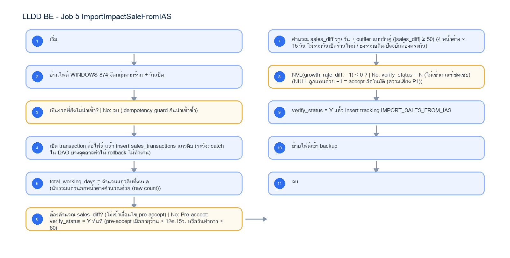

# LLDD BE - Job 5 ImportImpactSaleFromIAS

SBP Mall - ระบบประกันรายได้ | Low Level Design Document

## 1. Overview

| รายการ | รายละเอียด |
| --- | --- |
| Track | BE |
| Estimate | 13 ชั่วโมง |
| Owner | Aphiwit <Bank> Khammoon |
| Objective | รับยอดขายจาก IAS + คำนวณ Growth: อ่านไฟล์ตอบกลับยอดขาย AMS06001I จาก IAS บันทึกยอดขายรายวันลง sales_transactions คำนวณ sales_diff และ outlier ในหน้าต่าง 4 ช่วง × 15 วันรอบวันเปิดร้านใหม่ แล้วตัดสิน verify_status = Y / N จาก growth_rate_diff |

Common contract reference: ทุกหัวข้อ API/FE ต้องยึด LLDD-BE-API-Common-Contracts และ LLDD-FE-Integration-Contracts สำหรับ error/auth/format/pagination/action/RBAC ก่อนลงรายละเอียดเฉพาะหน้าหรือเฉพาะ endpoint

## 2. Screen / Functional Scope

- Main class/script: fgi.main.ImportImpactSaleFromIAS / FGI_ImportImpactStoreSale.sh
- Phase: B
- Output: AMS06001I (รับเข้า)
- Estimate: 13 ชั่วโมง
- Runbook, rerun rule, risk และ history ต้องตามข้อมูลหน้า Batch Job

## 4. Implementation Flow Diagram (Reference)



_รูปที่ 1: Implementation flow reference: LLDD BE - Job 5 ImportImpactSaleFromIAS_

## 5. Field, Format, and Validation

| Field / UI | Format | Validation | Behavior |
| --- | --- | --- | --- |
| กำหนดการรัน (Cron) | 30 16 7-16 * * | แก้ไขได้ | 30 นาทีหลัง Job 4 |
| Input File | AMS06001I_yyyyMMddHHmm.txt (WINDOWS-874, 4 ฟิลด์) | ค่าคงที่/แก้ผ่านหน้าจอไม่ได้ | impacted_store_code \| OPENDATE_N \| SALES_DATE \| SALES_AMOUNT |
| หน้าต่างคำนวณ | 4 ช่วง × 15 วัน รอบ OPENDATE_N (ไม่รวมวันเปิด) | ค่าคงที่/แก้ผ่านหน้าจอไม่ได้ |  |
| เกณฑ์ Outlier | \|sales_diff\| ≥ 50 | ค่าคงที่/แก้ผ่านหน้าจอไม่ได้ | literal ในโค้ด — เปลี่ยนต้องอนุมัติธุรกิจ (8.2) |
| วันทำการคาดหวัง | 60 | ค่าคงที่/แก้ผ่านหน้าจอไม่ได้ | ถ้าไม่เท่า 60 → pre-accept เป็น Y ทันที |
| กฎ Pre-accept | อายุร้าน < 12 เดือน 15 วัน หรือวันทำการ < 60 → Y | ค่าคงที่/แก้ผ่านหน้าจอไม่ได้ |  |

## 5.1 Input / Progress / Output Contract

| Stage | Contract for implementation |
| --- | --- |
| Input | IAS sales response files from configured source path; file name pattern and pipe-delimited daily sales records. |
| Progress | scan files, validate pattern, parse daily sales windows, derive before/after impact metrics, write transaction rows, update working-day counts and growth status, backup processed files. |
| Output | FGI_IMPACT_STORE_SALES_TRN and FGI_IMPACT_STORE_SALES updated; confirm-receive rows written; source file moved to backup or error recorded. |

### 5.90 Job 5 Execution Stages

scan files, validate pattern, parse daily sales windows, derive before/after impact metrics, write transaction rows, update working-day counts and growth status, backup processed files.

| Order | Service step | Repository | Output / failure contract |
| --- | --- | --- | --- |
| 1 | downloadAndStageIasSales | iasSalesRepository | คืน metrics และ throw typed error; transaction/rerun ใช้ contract ด้านล่าง |
| 2 | validateSalesWindows | iasSalesRepository | คืน metrics และ throw typed error; transaction/rerun ใช้ contract ด้านล่าง |
| 3 | upsertDailySales | iasSalesRepository | คืน metrics และ throw typed error; transaction/rerun ใช้ contract ด้านล่าง |
| 4 | recalculateSalesSummaries | iasSalesRepository | คืน metrics และ throw typed error; transaction/rerun ใช้ contract ด้านล่าง |

### 5.91 Job 5 Run Evidence

| Evidence | Job-specific value | Acceptance |
| --- | --- | --- |
| Input identity | IAS sales response files from configured source path; file name pattern and pipe-delimited daily sales records. | snapshot input file/business key/period in run record |
| Output identity | FGI_IMPACT_STORE_SALES_TRN and FGI_IMPACT_STORE_SALES updated; confirm-receive rows written; source file moved to backup or error recorded. | reconcile input, success, reject and skipped counts |
| Dedup proof | checksum กันไฟล์ซ้ำ + UNIQUE(sales_summary_id,txn_date,window_no); คำนวณ summary ใหม่จาก transaction rows ทุก rerun | rerun fixture produces no duplicate target business key |
| Transaction proof | upsert รายวันและ update summary ของ sales_summary_id เดียวกันใน transaction; checksum/file tracking commit พร้อมกัน | injected failure leaves no partial committed state outside documented boundary |
| Security proof | IAS inbound SFTP ใช้ secretRef, strict known_hosts และ quarantine ไฟล์ที่ checksum/รูปแบบไม่ผ่านก่อน parse | config/log/error contains no plaintext secret |

### 5.92 Legacy Java Source Reference

| Legacy file | Line range | Responsibility to carry forward |
| --- | --- | --- |
| fcsJar/src/th/co/gosoft/fgi/main/ImportImpactSaleFromIAS.java | 9-19 | Legacy main entrypoint that delegates to import controller. |
| fcsJar/src/th/co/gosoft/fgi/controller/ImportController.java | 101-411 | Parse IAS file, compute sales windows, prepare inserts/updates, backup and notify. |
| fcsJar/src/th/co/gosoft/fgi/dao/jdbc/ImportJdbc.java | 136-182, 517-804 | Update verification flags, working days, growth-rate calculations, cleanup old files. |

Line ranges refer to the legacy Java implementation under /Users/bank_mac/gosoft/java/SBP/fcsJar. Use these ranges to preserve business behavior while implementing the target Node job.

### 5.93 Target Repository and SQL Contract

| Contract | Target implementation |
| --- | --- |
| Repository | iasSalesRepository |
| Idempotency / dedup | checksum กันไฟล์ซ้ำ + UNIQUE(sales_summary_id,txn_date,window_no); คำนวณ summary ใหม่จาก transaction rows ทุก rerun |
| Transaction boundary | upsert รายวันและ update summary ของ sales_summary_id เดียวกันใน transaction; checksum/file tracking commit พร้อมกัน |
| Security | IAS inbound SFTP ใช้ secretRef, strict known_hosts และ quarantine ไฟล์ที่ checksum/รูปแบบไม่ผ่านก่อน parse |

#### Input / candidate query

```sql
SELECT t.sales_summary_id, t.txn_date, t.sales_amount, t.window_no, t.source_checksum
FROM sales_transactions t
JOIN fgi_impact_sales_summaries s ON s.id = t.sales_summary_id
WHERE s.impact_process_id = :impact_process_id
ORDER BY t.sales_summary_id, t.txn_date, t.window_no;
```

#### Write / upsert query

```sql
INSERT INTO sales_transactions
    (sales_summary_id, txn_date, window_no, sales_amount, sales_diff, is_outlier, source_checksum)
VALUES (:sales_summary_id, :txn_date, :window_no, :sales_amount, :sales_diff, :is_outlier, :source_checksum)
ON CONFLICT (sales_summary_id, txn_date, window_no)
DO UPDATE SET sales_amount = EXCLUDED.sales_amount,
              sales_diff = EXCLUDED.sales_diff,
              is_outlier = EXCLUDED.is_outlier,
              source_checksum = EXCLUDED.source_checksum;

UPDATE fgi_impact_sales_summaries
SET total_working_days = :total_working_days,
    growth_rate_before = :growth_rate_before,
    growth_rate_after = :growth_rate_after,
    growth_rate_diff = :growth_rate_diff,
    sales_status = :sales_status,
    updated_at = CURRENT_TIMESTAMP
WHERE id = :sales_summary_id;
```

### 5.94 Target Node Implementation

โครงสร้างนี้ระบุ service/repository เฉพาะงานและต้อง implement ตาม SQL, transaction, idempotency และ security contract ด้านบน โดยทุกขั้นต้องคืน metrics สำหรับ reconcile และ run history

```js
export async function runLlddBeJob5Importimpactsalefromias(ctx, services) {
  const run = await services.jobRuns.acquire({
    jobNo: "5", period: ctx.period, triggeredBy: ctx.triggeredBy
  });

  try {
    ctx = { ...ctx, runId: run.id, repository: services.iasSalesRepository };
    const step1 = await services.downloadAndStageIasSales(ctx, undefined);
    const step2 = await services.validateSalesWindows(ctx, step1);
    const step3 = await services.upsertDailySales(ctx, step2);
    const step4 = await services.recalculateSalesSummaries(ctx, step3);
    const result = step4;
    await services.jobRuns.finish(run.id, "SUCCESS", result.metrics);
    return { runId: run.id, status: "SUCCESS", ...result };
  } catch (error) {
    await services.jobRuns.finish(run.id, "FAILED", {
      errorCode: error.code ?? "JOB_FAILED",
      errorMessage: error.message
    });
    throw error;
  }
}
```

## 6. Button / User Action Mapping

| Action | Trigger | API / Service | Expected Result |
| --- | --- | --- | --- |
| เปิดดูรายละเอียด Job | GET | GET /api/v1/jobs/5 | คืน params/metadata ล่าสุด |
| บันทึกพารามิเตอร์ | PUT | PUT /api/v1/jobs/5/params | บันทึกเฉพาะ key ที่ editable และ audit |
| สั่งรันทันที | POST | POST /api/v1/jobs/5/run | สร้าง run history สถานะ RUNNING/QUEUED |
| เปิด/ปิดใช้งาน | PUT | PUT /api/v1/jobs/5/enabled | บันทึก enabled + audit พร้อม reason |

## 7. API Contract

### GET /api/v1/jobs/5

อ่าน metadata และพารามิเตอร์ของ Job

#### Query Params

```json
{
  "jobNo": "5"
}
```

#### Request Field Schema

| Field | Type | Required | Constraint / Meaning |
| --- | --- | --- | --- |
| jobNo | string | No | UTF-8; use value domain described by endpoint purpose |

#### Response

```json
{
  "jobNo": "5",
  "name": "ImportImpactSaleFromIAS",
  "cron": "30 16 7-16 * *",
  "enabled": true,
  "params": [
    {
      "label": "กำหนดการรัน (Cron)",
      "value": "30 16 7-16 * *",
      "editable": true
    },
    {
      "label": "Input File",
      "value": "AMS06001I_yyyyMMddHHmm.txt (WINDOWS-874, 4 ฟิลด์)",
      "editable": false
    },
    {
      "label": "หน้าต่างคำนวณ",
      "value": "4 ช่วง × 15 วัน รอบ OPENDATE_N (ไม่รวมวันเปิด)",
      "editable": false
    },
    {
      "label": "เกณฑ์ Outlier",
      "value": "|sales_diff| ≥ 50",
      "editable": false
    }
  ]
}
```

#### Response Field Schema

| Field | Type | Required | Constraint / Meaning |
| --- | --- | --- | --- |
| jobNo | string | Yes | UTF-8; use value domain described by endpoint purpose |
| name | string | Yes | UTF-8; use value domain described by endpoint purpose |
| cron | string | Yes | UTF-8; use value domain described by endpoint purpose |
| enabled | boolean | Yes | UTF-8; use value domain described by endpoint purpose |
| params | array<object> | Yes | JSON array; element type shown in Type column |
| params[].label | string | Yes | UTF-8; use value domain described by endpoint purpose |
| params[].value | string | Yes | UTF-8; use value domain described by endpoint purpose |
| params[].editable | boolean | Yes | UTF-8; use value domain described by endpoint purpose |

### PUT /api/v1/jobs/5/params

แก้ไขพารามิเตอร์ที่อนุญาตเท่านั้น

#### Request

```json
{
  "params": {
    "cron": "30 16 7-16 * *"
  },
  "reason": "ปรับรอบรันตาม Operations"
}
```

#### Request Field Schema

| Field | Type | Required | Constraint / Meaning |
| --- | --- | --- | --- |
| params | object | Yes | JSON object; nested fields listed below |
| params.cron | string | Yes | UTF-8; use value domain described by endpoint purpose |
| reason | string | Yes | trimmed UTF-8 Thai text; required by operation/business rule |

#### Response

```json
{
  "message": "saved"
}
```

#### Response Field Schema

| Field | Type | Required | Constraint / Meaning |
| --- | --- | --- | --- |
| message | string | Yes | UTF-8; use value domain described by endpoint purpose |

### POST /api/v1/jobs/5/run

สั่งรัน manual โดย guard ไม่ให้รันซ้อน

#### Request

```json
{
  "period": "2569-07"
}
```

#### Request Field Schema

| Field | Type | Required | Constraint / Meaning |
| --- | --- | --- | --- |
| period | string | Yes | UTF-8; use value domain described by endpoint purpose |

#### Response

```json
{
  "runId": "JOB5-RUN-001",
  "status": "RUNNING"
}
```

#### Response Field Schema

| Field | Type | Required | Constraint / Meaning |
| --- | --- | --- | --- |
| runId | string | Yes | UTF-8; use value domain described by endpoint purpose |
| status | string | Yes | UTF-8; use value domain described by endpoint purpose |

### GET /api/v1/jobs/5/runs

อ่านประวัติการรันล่าสุด

#### Query Params

```json
{
  "page": 1,
  "size": 20
}
```

#### Request Field Schema

| Field | Type | Required | Constraint / Meaning |
| --- | --- | --- | --- |
| page | integer | No | >= 1; default 1 |
| size | integer | No | 1..100; default 20 |

#### Response

```json
{
  "items": [
    {
      "startedAt": "16/06/2569 16:30",
      "status": "ok"
    }
  ]
}
```

#### Response Field Schema

| Field | Type | Required | Constraint / Meaning |
| --- | --- | --- | --- |
| items | array<object> | Yes | JSON array; element type shown in Type column |
| items[].startedAt | string | Yes | ISO-8601 ค.ศ.; nullable only when type includes null |
| items[].status | string | Yes | UTF-8; use value domain described by endpoint purpose |

## 8. Reference DB Mapping (No Database Page Work)

ส่วนนี้เป็นข้อมูลอ้างอิงสำหรับการ implement API/Job เท่านั้น ไม่ใช่งานสร้างหน้า Database, ไม่ใช่งานออกแบบ DB page และไม่ถูกนับเป็น deliverable แยกของ FE/BE

| Table / Object | R/W | Usage |
| --- | --- | --- |
| sales_transactions | W | ยอดขายรายวันดิบจากไฟล์ (4 หน้าต่างเวลา) |
| fgi_impact_sales_summaries | R/W | อัปเดต total_working_days, growth_rate_diff, verify_status Y/N |
| interface_transactions | W | tracking: data_name=IMPORT_SALES_FROM_IAS · typed FK = sales_summary_id |

## 9. Processing Flow

| Step | Description |
| --- | --- |
| 1 | เริ่ม |
| 2 | อ่านไฟล์ WINDOWS-874 จัดกลุ่มตามร้าน + วันเปิด |
| 3 | เป็นงวดที่ยังไม่นำเข้า? \| No: จบ (idempotency guard กันนำเข้าซ้ำ) |
| 4 | เปิด transaction ต่อไฟล์ แล้ว insert sales_transactions แถวดิบ (ระวัง: catch ใน DAO บางจุดอาจทำให้ rollback ไม่ทำงาน) |
| 5 | total_working_days = จำนวนแถวดิบทั้งหมด (นับรวมแถวนอกหน้าต่างคำนวณด้วย (raw count)) |
| 6 | ต้องคำนวณ sales_diff? (ไม่เข้าเงื่อนไข pre-accept) \| No: Pre-accept: verify_status = Y ทันที (pre-accept เมื่ออายุร้าน < 12ด.15ว. หรือวันทำการ < 60) |
| 7 | คำนวณ sales_diff รายวัน + outlier แบบจับคู่ (\|sales_diff\| ≥ 50) (4 หน้าต่าง × 15 วัน ไม่รวมวันเปิดร้านใหม่ / ธงรวมอดีต-ปัจจุบันต้องตรงกัน) |
| 8 | NVL(growth_rate_diff, −1) < 0 ? \| No: verify_status = N (ไม่เข้าเกณฑ์ชดเชย) (NULL ถูกแทนด้วย −1 = accept อัตโนมัติ (ความเสี่ยง P1)) |
| 9 | verify_status = Y แล้ว insert tracking IMPORT_SALES_FROM_IAS |
| 10 | ย้ายไฟล์เข้า backup |
| 11 | จบ |

## 10. Acceptance Criteria

- อ่าน/แก้พารามิเตอร์ได้ตาม editable flag เท่านั้น
- การสั่งรันต้องตรวจ enabled และไม่มีรอบ RUNNING เดิม
- ต้องบันทึก job_run_histories และ audit_logs สำหรับทุก mutation
- DB/table mapping ใช้เป็น reference สำหรับ implement Job เท่านั้น ไม่ใช่งานสร้างหน้า Database
- รองรับ rerun rule และ risk note ตาม runbook

## 11. Developer Test Checklist

| No | Test |
| --- | --- |
| 1 | GET job detail |
| 2 | PUT params with editable key |
| 3 | PUT params locked business key must fail |
| 4 | POST run while running must fail |
| 5 | GET run histories |
| 6 | ตรวจผลกระทบตารางตาม R/W mapping reference |
