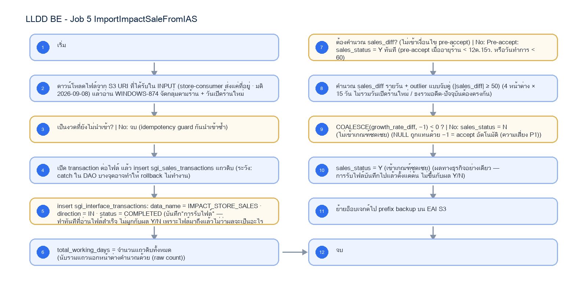

# LLDD BE - Job 5 ImportImpactSaleFromIAS

SBP Mall - ระบบประกันรายได้ | Low Level Design Document

## 1. Overview

| รายการ | รายละเอียด |
| --- | --- |
| Track | BE |
| Estimate | 16 ชั่วโมง |
| Owner | Peerakorn <Pete> Sakunkaewphithak |
| Objective | รับยอดขายจาก IAS + คำนวณ Growth: อ่านไฟล์ตอบกลับยอดขาย AMS06001I จาก IAS บันทึกยอดขายรายวันลง sales_transactions คำนวณ sales_diff และ outlier ในหน้าต่าง 4 ช่วง × 15 วันรอบวันเปิดร้านใหม่ แล้วกำหนด sales_status = Y / N จาก growth_rate_diff |

Common contract reference: ทุกหัวข้อ API/FE ต้องยึด LLDD-BE-API-Common-Contracts และ LLDD-FE-Integration-Contracts สำหรับ error/auth/format/pagination/action/RBAC ก่อนลงรายละเอียดเฉพาะหน้าหรือเฉพาะ endpoint

## 2. Screen / Functional Scope

- Main class/script: fgi.main.ImportImpactSaleFromIAS / FGI_ImportImpactStoreSale.sh
- Phase: B
- Output: AMS06001I (รับเข้า)
- Estimate: 16 ชั่วโมง
- พารามิเตอร์/cron อ่านจาก backend config (config file/env) — ไม่มีตาราง job_configs และไม่มีหน้าจอควบคุม (หน้า Flow Batch Job ในกลุ่มเมนู Flow เหลือแค่ Flowchart + Database ที่ใช้ · 2026-08-06)
- Runbook, rerun rule, risk และ history ตามเอกสาร Batch v4.0 · ผลการรันเขียน application log แบบ structured

## 4. Implementation Flow Diagram (Reference)



_รูปที่ 1: Implementation flow reference: LLDD BE - Job 5 ImportImpactSaleFromIAS_

## 5. Field, Format, and Validation

| Field / UI | Format | Validation | Behavior |
| --- | --- | --- | --- |
| กำหนดการรัน (Cron) | 30 16 7-16 * * | แก้ไขได้ | 30 นาทีหลัง Job 4 |
| Input File | AMS06001I_yyyyMMddHHmm.txt (WINDOWS-874, 4 ฟิลด์) | ค่าคงที่/แก้ผ่านหน้าจอไม่ได้ | impacted_store_code \| OPENDATE_N \| SALES_DATE \| SALES_AMOUNT |
| หน้าต่างคำนวณ | 4 ช่วง × 15 วัน รอบ OPENDATE_N (ไม่รวมวันเปิด) | ค่าคงที่/แก้ผ่านหน้าจอไม่ได้ |  |
| เกณฑ์ Outlier | \|sales_diff\| ≥ 50 | ค่าคงที่/แก้ผ่านหน้าจอไม่ได้ | literal ในโค้ด — เปลี่ยนต้องอนุมัติธุรกิจ (8.2) |
| วันทำการคาดหวัง | 60 | ค่าคงที่/แก้ผ่านหน้าจอไม่ได้ | ถ้าไม่เท่า 60 → pre-accept เป็น Y ทันที |
| กฎ Pre-accept | อายุร้าน < 12 เดือน 15 วัน หรือวันทำการ < 60 → Y | ค่าคงที่/แก้ผ่านหน้าจอไม่ได้ |  |

## 5.1 Input / Progress / Output Contract

| Stage | Contract for implementation |
| --- | --- |
| Input | IAS sales response files from configured source path; file name pattern and pipe-delimited daily sales records. |
| Progress | scan files, validate pattern, parse daily sales windows, derive before/after impact metrics, write transaction rows, update working-day counts and growth status, backup processed files. |
| Output | FGI_IMPACT_STORE_SALES_TRN and FGI_IMPACT_STORE_SALES updated; confirm-receive rows written; source file moved to backup or error recorded. |

### 5.90 Job 5 Execution Stages

scan files, validate pattern, parse daily sales windows, derive before/after impact metrics, write transaction rows, update working-day counts and growth status, backup processed files.

| Order | Service step | Repository | Output / failure contract |
| --- | --- | --- | --- |
| 1 | downloadAndStageIasSales | iasSalesRepository | คืน metrics และ throw typed error; transaction/rerun ใช้ contract ด้านล่าง |
| 2 | validateSalesWindows | iasSalesRepository | คืน metrics และ throw typed error; transaction/rerun ใช้ contract ด้านล่าง |
| 3 | upsertDailySales | iasSalesRepository | คืน metrics และ throw typed error; transaction/rerun ใช้ contract ด้านล่าง |
| 4 | recalculateSalesSummaries | iasSalesRepository | คืน metrics และ throw typed error; transaction/rerun ใช้ contract ด้านล่าง |

### 5.91 Job 5 Run Evidence

| Evidence | Job-specific value | Acceptance |
| --- | --- | --- |
| Input identity | IAS sales response files from configured source path; file name pattern and pipe-delimited daily sales records. | snapshot input file/business key/period in run record |
| Output identity | FGI_IMPACT_STORE_SALES_TRN and FGI_IMPACT_STORE_SALES updated; confirm-receive rows written; source file moved to backup or error recorded. | reconcile input, success, reject and skipped counts |
| Dedup proof | checksum กันไฟล์ซ้ำ + UNIQUE(sales_summary_id,txn_date,window_no); คำนวณ summary ใหม่จาก transaction rows ทุก rerun | rerun fixture produces no duplicate target business key |
| Transaction proof | upsert รายวันและ update summary ของ sales_summary_id เดียวกันใน transaction; checksum/file tracking commit พร้อมกัน | injected failure leaves no partial committed state outside documented boundary |
| Security proof | IAS inbound SFTP ใช้ secretRef, strict known_hosts และ quarantine ไฟล์ที่ checksum/รูปแบบไม่ผ่านก่อน parse | config/log/error contains no plaintext secret |

### 5.92 Legacy Java Source Reference

| Legacy file | Line range | Responsibility to carry forward |
| --- | --- | --- |
| fcsJar/src/th/co/gosoft/fgi/main/ImportImpactSaleFromIAS.java | 9-19 | Legacy main entrypoint that delegates to import controller. |
| fcsJar/src/th/co/gosoft/fgi/controller/ImportController.java | 101-411 | Parse IAS file, compute sales windows, prepare inserts/updates, backup and notify. |
| fcsJar/src/th/co/gosoft/fgi/dao/jdbc/ImportJdbc.java | 136-182, 517-804 | Update verification flags, working days, growth-rate calculations, cleanup old files. |

Line ranges refer to the legacy Java implementation under /Users/bank_mac/gosoft/java/SBP/fcsJar. Use these ranges to preserve business behavior while implementing the target Node job.

### 5.93 Target Repository and SQL Contract

| Contract | Target implementation |
| --- | --- |
| Repository | iasSalesRepository |
| Idempotency / dedup | checksum กันไฟล์ซ้ำ + UNIQUE(sales_summary_id,txn_date,window_no); คำนวณ summary ใหม่จาก transaction rows ทุก rerun |
| Transaction boundary | upsert รายวันและ update summary ของ sales_summary_id เดียวกันใน transaction; checksum/file tracking commit พร้อมกัน |
| Security | IAS inbound SFTP ใช้ secretRef, strict known_hosts และ quarantine ไฟล์ที่ checksum/รูปแบบไม่ผ่านก่อน parse |

#### Input / candidate query

```sql
SELECT t.sales_summary_id, t.txn_date, t.sales_amount, t.window_no, t.source_checksum
FROM sales_transactions t
JOIN fgi_impact_sales_summaries s ON s.id = t.sales_summary_id
WHERE s.impact_process_id = :impact_process_id
ORDER BY t.sales_summary_id, t.txn_date, t.window_no;
```

#### Write / upsert query

```sql
INSERT INTO sales_transactions
    (sales_summary_id, txn_date, window_no, sales_amount, sales_diff, is_outlier, source_checksum)
VALUES (:sales_summary_id, :txn_date, :window_no, :sales_amount, :sales_diff, :is_outlier, :source_checksum)
ON CONFLICT (sales_summary_id, txn_date, window_no)
DO UPDATE SET sales_amount = EXCLUDED.sales_amount,
              sales_diff = EXCLUDED.sales_diff,
              is_outlier = EXCLUDED.is_outlier,
              source_checksum = EXCLUDED.source_checksum;

UPDATE fgi_impact_sales_summaries
SET total_working_days = :total_working_days,
    growth_rate_before = :growth_rate_before,
    growth_rate_after = :growth_rate_after,
    growth_rate_diff = :growth_rate_diff,
    sales_status = :sales_status,
    updated_at = CURRENT_TIMESTAMP
WHERE id = :sales_summary_id;
```

### 5.94 Target Node Implementation

โครงสร้างนี้ระบุ service/repository เฉพาะงานและต้อง implement ตาม SQL, transaction, idempotency และ security contract ด้านบน โดยทุกขั้นต้องคืน metrics สำหรับ reconcile และ run history

```js
export async function runLlddBeJob5Importimpactsalefromias(ctx, services) {
  const run = await services.jobRuns.acquire({
    jobNo: "5", period: ctx.period, triggeredBy: ctx.triggeredBy
  });

  try {
    ctx = { ...ctx, runId: run.id, repository: services.iasSalesRepository };
    const step1 = await services.downloadAndStageIasSales(ctx, undefined);
    const step2 = await services.validateSalesWindows(ctx, step1);
    const step3 = await services.upsertDailySales(ctx, step2);
    const step4 = await services.recalculateSalesSummaries(ctx, step3);
    const result = step4;
    await services.jobRuns.finish(run.id, "SUCCESS", result.metrics);
    return { runId: run.id, status: "SUCCESS", ...result };
  } catch (error) {
    await services.jobRuns.finish(run.id, "FAILED", {
      errorCode: error.code ?? "JOB_FAILED",
      errorMessage: error.message
    });
    throw error;
  }
}
```

## 6. Button / User Action Mapping

| Action | Trigger | API / Service | Expected Result |
| --- | --- | --- | --- |
| รันตามตารางเวลา | CRON | scheduler → runner (job 5) | อ่าน cron/พารามิเตอร์จาก backend config |
| รันนอกรอบ (manual/rerun) | CLI | CLI/ops runbook → runner (job 5) | guard ไม่ให้รันซ้อนด้วย distributed lock |
| แก้พารามิเตอร์/เปิด-ปิด job | CONFIG | แก้ backend config แล้ว deploy | ไม่มี endpoint และไม่มีหน้าจอควบคุม — หน้า Flow Batch Job เป็น reference อย่างเดียว (2026-08-06) |
| ตรวจผลการรัน | LOG | application log (structured) | ไม่มีตาราง job_run_histories แล้ว · ไฟล์/ACK ดูที่ interface_transactions |

## 7. API Contract

## 8. Reference DB Mapping (No Database Page Work)

ส่วนนี้เป็นข้อมูลอ้างอิงสำหรับการ implement API/Job เท่านั้น ไม่ใช่งานสร้างหน้า Database, ไม่ใช่งานออกแบบ DB page และไม่ถูกนับเป็น deliverable แยกของ FE/BE

| Table / Object | R/W | Usage |
| --- | --- | --- |
| sales_transactions | W | ยอดขายรายวันดิบจากไฟล์ (4 หน้าต่างเวลา) |
| fgi_impact_sales_summaries | R/W | อัปเดต total_working_days, growth_rate_diff, sales_status Y/N |
| interface_transactions | W | tracking: data_name=IMPORT_SALES_FROM_IAS · typed FK = sales_summary_id |

## 9. Skeleton Code (Batch Job 5)

#### 9.1 ผังไฟล์ที่ต้องสร้าง (Job 5)

โครงไฟล์ของ Job 5 (fgi.main.ImportImpactSaleFromIAS เดิม) วางใต้ `src/batch/sbpgi/` ของ store-backend โดยใช้ convention เดียวกับ module ธุรกิจอื่น: inject custom provider `DATA_SOURCE` แล้วยิง raw SQL, repository ประกาศเป็น factory provider ที่ใช้ token string, entity อยู่ใน `src/entitys/`

**หมายเหตุสำคัญ — `src/batch/*` ทั้งชุดเป็นของใหม่ที่ยังไม่มีใน store-backend**: ปัจจุบัน repo ไม่มีโฟลเดอร์ `src/batch` เลย และแม้จะติดตั้ง `@nestjs/schedule` ไว้แล้วก็ยัง**ไม่มี `@Cron`/`@Interval` แม้แต่จุดเดียว** ดังนั้น `runner.ts` / `scheduler.ts` / `cli.js` / `job-failure.notifier.ts` คือ **งานตั้งต้นของ Phase แรก** ที่ต้องสร้างเองทั้งหมด พร้อม register `ScheduleModule.forRoot()` ใน `app.module.ts` — ไม่ใช่ของเดิมที่ reuse ได้

| Path | หน้าที่ |
| --- | --- |
| src/batch/sbpgi/job-5-import-impact-sale-from-ias/job-5-import-impact-sale-from-ias.job.ts | คลาส `ImportImpactSaleFromIasJob` — `run(ctx)` เรียงตาม flow ของ Job 5 ทีละขั้น, ครอบ transaction, จบด้วย structured log |
| src/batch/sbpgi/job-5-import-impact-sale-from-ias/job-5-import-impact-sale-from-ias.service.ts | คลาส `ImportImpactSaleFromIasService` — logic ต่อขั้น (อ่าน/parse/คำนวณ/เขียน) + repository token ที่ inject จาก `DATA_SOURCE` |
| src/batch/sbpgi/job-5-import-impact-sale-from-ias/job-5-import-impact-sale-from-ias.config.ts | คลาส `SbpgiJob5Config` (แบบเดียวกับ `src/config/app.config.ts` — โปรเจกต์นี้ไม่ใช้ `registerAs`) — cron และพารามิเตอร์ทั้ง 6 ตัวของ Job 5 อ่านจาก env/config file (ไม่มีตาราง job_configs) |
| src/batch/sbpgi/job-5-import-impact-sale-from-ias/job-5-import-impact-sale-from-ias.module.ts | NestJS module ผูก job + service + repository provider (factory token string) เข้ากับ `DatabaseModule` |
| src/batch/runner.ts | ตัวรันกลาง: resolve job ตาม jobNo, กันรันซ้อนด้วย advisory lock, จับ error → แจ้งเตือน, เขียน structured log สรุป (ใช้ร่วมทั้ง 11 job) |
| src/batch/scheduler.ts | ลงทะเบียน cron จาก config (`SBPGI_JOB5_CRON` = `30 16 7-16 * *`) และรองรับสั่งรันนอกรอบผ่าน CLI/runbook |
| src/batch/job-failure.notifier.ts | ส่งอีเมลแจ้งผู้ดูแลเมื่อ job ล้มเหลว ผ่าน `EmailLibService` ของ `@gosoft-sbp/email-lib` (log ลง `email_sent` ให้อัตโนมัติ) |

#### 9.2 Config Schema ของ Job 5 (backend config / env)

cron ปัจจุบันของ Job 5 คือ `30 16 7-16 * *` (วันที่ 7–16 เวลา 16:30) — ประกาศเป็น `SBPGI_JOB5_CRON` และอ่านตอน bootstrap ของ `scheduler.ts`; ถ้า `enabled=false` scheduler ต้องไม่ลงทะเบียน cron ของ job นี้

```ts
// src/batch/sbpgi/job-5-import-impact-sale-from-ias/job-5-import-impact-sale-from-ias.config.ts
// convention จริงของ store-backend คือคลาส config (`src/config/app.config.ts` ที่ export ผ่าน
// `AppConfigModule` แบบ @Global แล้วอ่าน process.env ตรง ๆ) — โปรเจกต์นี้ **ไม่ได้ใช้ registerAs**
// แม้แต่จุดเดียว จึงประกาศเป็นคลาสให้รีวิว/ทดสอบเหมือน config ตัวอื่น
import { Injectable } from '@nestjs/common';

// TODO: Job 5 ไม่มีตาราง job_configs และไม่มี Job Admin API แล้ว (ตัดสินใจ 2026-08-06)
// TODO: ค่าทุกตัวอ่านจาก env/config file ของ backend เท่านั้น — เปลี่ยนค่า = แก้ config แล้ว deploy
export interface Job5Config {
  /** เปิด/ปิด job รอบถัดไปโดยไม่ต้อง deploy โค้ด */
  enabled: boolean;
  /** cron ของ job นี้ (อ่านตอน bootstrap ของ scheduler.ts) */
  cron: string;
  /** กำหนดการรัน (Cron) — 30 นาทีหลัง Job 4 */
  cron: string;
  /** Input File — impacted_store_code | OPENDATE_N | SALES_DATE | SALES_AMOUNT */
  inputFile: string;
  /** หน้าต่างคำนวณ */
  calcWindow: string;
  /** เกณฑ์ Outlier — literal ในโค้ด — เปลี่ยนต้องอนุมัติธุรกิจ (8.2) */
  outlier: string;
  /** วันทำการคาดหวัง — ถ้าไม่เท่า 60 → pre-accept เป็น Y ทันที */
  workingDays: number;
  /** กฎ Pre-accept */
  preAccept: string;
  /** ผู้รับอีเมลเมื่อ job ล้มเหลว — เก็บเป็น string คั่น comma ให้ตรง signature ของ
      `EmailLibService.sendMail({ mailTo })` ที่รับ string ไม่ใช่ string[] */
  mailTo: string;
}

@Injectable()
export class SbpgiJob5Config implements Job5Config {
  // TODO: ยืนยันค่า default ทุกตัวกับ Ops ก่อนขึ้น production (ไม่มีหน้าจอแก้ค่าแล้ว)
  enabled = (process.env.SBPGI_JOB5_ENABLED ?? 'true') === 'true';
  cron = process.env.SBPGI_JOB5_CRON ?? '30 16 7-16 * *';
  cron = process.env.SBPGI_JOB5_CRON ?? '30 16 7-16 * *'; // TODO: แก้ผ่าน env/config file แล้ว deploy
  inputFile = process.env.SBPGI_JOB5_INPUT_FILE ?? 'AMS06001I_yyyyMMddHHmm.txt (WINDOWS-874, 4 ฟิลด์)'; // TODO: ค่าคงที่ทางธุรกิจ — เปลี่ยนต้องผ่านการอนุมัติ
  calcWindow = process.env.SBPGI_JOB5_CALC_WINDOW ?? '4 ช่วง × 15 วัน รอบ OPENDATE_N (ไม่รวมวันเปิด)'; // TODO: ค่าคงที่ทางธุรกิจ — เปลี่ยนต้องผ่านการอนุมัติ
  outlier = process.env.SBPGI_JOB5_OUTLIER ?? '|sales_diff| ≥ 50'; // TODO: ค่าคงที่ทางธุรกิจ — เปลี่ยนต้องผ่านการอนุมัติ
  workingDays = Number(process.env.SBPGI_JOB5_WORKING_DAYS ?? 60); // TODO: ค่าคงที่ทางธุรกิจ — เปลี่ยนต้องผ่านการอนุมัติ
  preAccept = process.env.SBPGI_JOB5_PRE_ACCEPT ?? 'อายุร้าน < 12 เดือน 15 วัน หรือวันทำการ < 60 → Y'; // TODO: ค่าคงที่ทางธุรกิจ — เปลี่ยนต้องผ่านการอนุมัติ
  mailTo = process.env.SBPGI_JOB5_MAIL_TO ?? ''; // TODO: ผู้รับอีเมลแจ้ง error คั่นด้วย comma (เดิม: go-sbp (ผ่าน shared helper))
}

// TODO: เพิ่ม SbpgiJob5Config ใน providers/exports ของ AppConfigModule (@Global) เหมือน AppConfig
```

#### 9.3 Job Class — `run(ctx)` ของ Job 5 ทีละขั้นตามผัง

##### 9.3.1 สัญญาของชั้นกลาง (`runner.ts`) + โครง service ของ Job 5

job class อ้าง `JobRunContext` / `JobRunResult` / `JobState` / `JobFailedError` — ทั้งหมดนิยาม ครั้งเดียวใน `src/batch/runner.ts` (ไฟล์ร่วมของทุก job ให้ merge ไม่ใช่เขียนทับ) และ service ต้องมี method ครบตามตารางขั้นตอนด้านล่าง มิฉะนั้น job class จะเรียก method ที่ไม่มีอยู่

```ts
// src/batch/runner.ts — สัญญากลางของทุก job (ประกาศครั้งเดียว ใช้ร่วมทั้ง 11 ฉบับ)

export interface JobRunContext {
  jobNo: string;
  period: string;        // YYYYMM ของงวดที่รัน
  triggeredBy: string;   // 'CRON' | userId ที่สั่งรันนอกรอบ
  params?: Record<string, string>;
}

export interface JobRunResult {
  event: 'job.finish';
  jobNo: string;
  jobName: string;
  status: 'SUCCESS' | 'SKIPPED' | 'SKIPPED_LOCKED' | 'FAILED';
  period: string;
  output: string;
  read: number; written: number; skipped: number; rejected: number;
  durationMs: number;
}

/** counter + ค่าที่ทุกขั้นของ job ใช้ร่วมกัน (service เป็นผู้สร้างผ่าน createState) */
export interface JobState {
  period: string;
  read: number; written: number; skipped: number; rejected: number;
  // TODO: เพิ่ม field เฉพาะของ job นี้ (เช่น rows ที่อ่านมา, path ไฟล์ที่เขียน)
  [key: string]: unknown;
}

/** error ที่ทำให้ job จบเป็น FAILED และส่งอีเมลแจ้งผู้ดูแล */
export class JobFailedError extends Error {
  constructor(public readonly code: string, message: string) { super(message); }
}

/** ใช้ออกจาก transaction เมื่อสาขา NO บอกให้ข้ามงวด/เรคคอร์ด — runner สรุปเป็น SKIPPED ไม่ใช่ FAILED */
export class JobSkippedError extends Error {}
```

```ts
// ImportImpactSaleFromIasService — method ที่ job class เรียก (1 method ต่อ 1 ขั้นในตารางด้านบน)
import { Inject, Injectable } from '@nestjs/common';
import type { DataSource, EntityManager } from 'typeorm';
import type { JobRunContext, JobState } from '../../runner';
export type { JobState };

@Injectable()
export class ImportImpactSaleFromIasService {
  constructor(@Inject('DATA_SOURCE') private readonly dataSource: DataSource) {}

  createState(ctx: JobRunContext): JobState {
    return { period: ctx.period, read: 0, written: 0, skipped: 0, rejected: 0 };
  }

  // อ่านไฟล์ WINDOWS-874 จัดกลุ่มตามร้าน + วันเปิด
  async step02ReadFile(state: JobState, manager?: EntityManager): Promise<void> {
    // TODO: implement
  }

  // เป็นงวดที่ยังไม่นำเข้า?
  async check03ResolvePeriod(state: JobState): Promise<boolean> {
    return true; // TODO: เงื่อนไขจริงตามผัง
  }

  // เปิด transaction ต่อไฟล์ แล้ว insert sales_transactions แถวดิบ
  async step04Insert(state: JobState, manager?: EntityManager): Promise<void> {
    // TODO: implement
  }

  // total_working_days = จำนวนแถวดิบทั้งหมด
  async step05Calculate(state: JobState, manager?: EntityManager): Promise<void> {
    // TODO: implement
  }

  // ต้องคำนวณ sales_diff? (ไม่เข้าเงื่อนไข pre-accept)
  async check06Calculate(state: JobState): Promise<boolean> {
    return true; // TODO: เงื่อนไขจริงตามผัง
  }

  // คำนวณ sales_diff รายวัน + outlier แบบจับคู่ (|sales_diff| ≥ 50)
  async step07Calculate(state: JobState, manager?: EntityManager): Promise<void> {
    // TODO: implement
  }

  // NVL(growth_rate_diff, −1) < 0 ?
  async check08Condition(state: JobState): Promise<boolean> {
    return true; // TODO: เงื่อนไขจริงตามผัง
  }

  // sales_status = Y แล้ว insert tracking IMPORT_SALES_FROM_IAS
  async step09Insert(state: JobState, manager?: EntityManager): Promise<void> {
    // TODO: implement
  }

  // ย้ายไฟล์เข้า backup
  async step10Archive(state: JobState, manager?: EntityManager): Promise<void> {
    // TODO: implement
  }

}
```

##### 9.3.2 `run(ctx)` ของ Job 5

ทุกขั้นใน `run()` ตรงกับ flowchart ของ Job 5 หนึ่งต่อหนึ่ง (decision และ error path รวมอยู่ด้วย) — method ที่ต้อง implement ใน service ตามตารางนี้

| ลำดับ | ชนิด | ขั้นตอนจากผัง | Method ที่ต้อง implement | เส้นทาง NO / error |
| --- | --- | --- | --- | --- |
| 1 | start | เริ่ม | createState() | - |
| 2 | io | อ่านไฟล์ WINDOWS-874 จัดกลุ่มตามร้าน + วันเปิด | step02ReadFile() | throw JobFailedError เมื่อทำไม่สำเร็จ |
| 3 | decision | เป็นงวดที่ยังไม่นำเข้า? | check03ResolvePeriod() | [end] จบ (idempotency guard กันนำเข้าซ้ำ) |
| 4 | process | เปิด transaction ต่อไฟล์ แล้ว insert sales_transactions แถวดิบ | step04Insert() | throw JobFailedError เมื่อทำไม่สำเร็จ |
| 5 | process | total_working_days = จำนวนแถวดิบทั้งหมด | step05Calculate() | throw JobFailedError เมื่อทำไม่สำเร็จ |
| 6 | decision | ต้องคำนวณ sales_diff? (ไม่เข้าเงื่อนไข pre-accept) | check06Calculate() | [branch] Pre-accept: sales_status = Y ทันที |
| 7 | process | คำนวณ sales_diff รายวัน + outlier แบบจับคู่ (\|sales_diff\| ≥ 50) | step07Calculate() | throw JobFailedError เมื่อทำไม่สำเร็จ |
| 8 | decision | NVL(growth_rate_diff, −1) < 0 ? | check08Condition() | [branch] sales_status = N (ไม่เข้าเกณฑ์ชดเชย) |
| 9 | process | sales_status = Y แล้ว insert tracking IMPORT_SALES_FROM_IAS | step09Insert() | throw JobFailedError เมื่อทำไม่สำเร็จ |
| 10 | io | ย้ายไฟล์เข้า backup | step10Archive() | throw JobFailedError เมื่อทำไม่สำเร็จ |
| 11 | end | จบ | summarize() | - |

```ts
// src/batch/sbpgi/job-5-import-impact-sale-from-ias/job-5-import-impact-sale-from-ias.job.ts
import { Inject, Injectable, Logger } from '@nestjs/common';
import type { DataSource, EntityManager } from 'typeorm';
import { ImportImpactSaleFromIasService, type JobState } from './job-5-import-impact-sale-from-ias.service';
// 4 symbol นี้นิยามใน src/batch/runner.ts (ดูหัวข้อ 9.3.1)
import { JobFailedError, JobSkippedError, JobRunContext, JobRunResult } from '../../runner';

@Injectable()
export class ImportImpactSaleFromIasJob {
  static readonly jobNo = '5';
  private readonly logger = new Logger(ImportImpactSaleFromIasJob.name);

  constructor(
    // TODO: DATA_SOURCE = custom provider ที่ route SELECT/WITH ไป slave pool และ write ไป master
    @Inject('DATA_SOURCE') private readonly dataSource: DataSource,
    private readonly service: ImportImpactSaleFromIasService,
  ) {}

  async run(ctx: JobRunContext): Promise<JobRunResult> {
    const startedAt = Date.now();
    // TODO: state ถือ counter (read/written/skipped/rejected) และค่าจาก job5Config
    const state = this.service.createState(ctx);
    try {
      // ขั้นที่ 2: อ่านไฟล์ WINDOWS-874 จัดกลุ่มตามร้าน + วันเปิด
      await this.service.step02ReadFile(state);
      // ขั้นที่ 3 (decision): เป็นงวดที่ยังไม่นำเข้า?
      const ok03 = await this.service.check03ResolvePeriod(state);
      if (!ok03) { // NO → จบ (idempotency guard กันนำเข้าซ้ำ)
        return this.summarize(state, 'SKIPPED', startedAt);
      }
      // === transaction boundary === TODO: ต่อไฟล์ + savepoint (ระวัง inner catch ทำให้ rollback ไม่ทำงาน)
      await this.dataSource.transaction(async (manager: EntityManager) => {
        // ขั้นที่ 4: เปิด transaction ต่อไฟล์ แล้ว insert sales_transactions แถวดิบ · TODO: ระวัง: catch ใน DAO บางจุดอาจทำให้ rollback ไม่ทำงาน
        await this.service.step04Insert(state, manager);
        // ขั้นที่ 5: total_working_days = จำนวนแถวดิบทั้งหมด · TODO: นับรวมแถวนอกหน้าต่างคำนวณด้วย (raw count)
        await this.service.step05Calculate(state, manager);
        // ขั้นที่ 6 (decision): ต้องคำนวณ sales_diff? (ไม่เข้าเงื่อนไข pre-accept) · TODO: pre-accept เมื่ออายุร้าน < 12ด.15ว. หรือวันทำการ < 60
        const ok06 = await this.service.check06Calculate(state);
        if (!ok06) { // NO → Pre-accept: sales_status = Y ทันที
          // TODO: เส้น NO ของขั้นนี้เป็น branch ระดับ record — ผังไม่ได้ระบุว่าหยุดหรือไปต่อ
          //   ถ้าเป็น 'ข้ามรายการ'      -> state.skipped += 1; แล้ว continue ในลูปของ record
          //   ถ้าเป็น 'ตั้งค่าแล้วไปต่อ' -> เรียก service ตั้งค่าสถานะ แล้วเดินขั้นถัดไป (ห้าม return)
          //   ถ้าเป็น 'คงสถานะเดิม/ไม่เปิดงาน' -> หยุดเฉพาะ record นี้ ห้ามไหลไปขั้นถัดไป
        }
        // ขั้นที่ 7: คำนวณ sales_diff รายวัน + outlier แบบจับคู่ (|sales_diff| ≥ 50) · TODO: 4 หน้าต่าง × 15 วัน ไม่รวมวันเปิดร้านใหม่ / ธงรวมอดีต-ปัจจุบันต้องตรงกัน
        await this.service.step07Calculate(state, manager);
        // ขั้นที่ 8 (decision): NVL(growth_rate_diff, −1) < 0 ? · TODO: NULL ถูกแทนด้วย −1 = accept อัตโนมัติ (ความเสี่ยง P1)
        const ok08 = await this.service.check08Condition(state);
        if (!ok08) { // NO → sales_status = N (ไม่เข้าเกณฑ์ชดเชย)
          // TODO: เส้น NO ของขั้นนี้เป็น branch ระดับ record — ผังไม่ได้ระบุว่าหยุดหรือไปต่อ
          //   ถ้าเป็น 'ข้ามรายการ'      -> state.skipped += 1; แล้ว continue ในลูปของ record
          //   ถ้าเป็น 'ตั้งค่าแล้วไปต่อ' -> เรียก service ตั้งค่าสถานะ แล้วเดินขั้นถัดไป (ห้าม return)
          //   ถ้าเป็น 'คงสถานะเดิม/ไม่เปิดงาน' -> หยุดเฉพาะ record นี้ ห้ามไหลไปขั้นถัดไป
        }
        // ขั้นที่ 9: sales_status = Y แล้ว insert tracking IMPORT_SALES_FROM_IAS
        await this.service.step09Insert(state, manager);
      });
      // ขั้นที่ 10: ย้ายไฟล์เข้า backup
      await this.service.step10Archive(state);
      return this.summarize(state, 'SUCCESS', startedAt);
    } catch (error) {
      // TODO: error path ของ Job 5 — P1: growth_rate_diff = NULL ถูก accept อัตโนมัติ / ต้องทดสอบ ก.พ. ปีอธิกสุรทิน และร้านไม่มียอดขาย
      this.logger.error(JSON.stringify({ event: 'job.failed', jobNo: '5', period: ctx.period,
        triggeredBy: ctx.triggeredBy, durationMs: Date.now() - startedAt, error: (error as Error).message }));
      // TODO: แจ้งผู้ดูแลผ่าน JobFailureNotifier (หัวข้อ 9.6.1) — runner เป็นผู้เรียกให้
      throw error;
    }
  }

  private summarize(state: JobState, status: JobRunResult['status'], startedAt = Date.now()): JobRunResult {
    // TODO: structured log บรรทัดเดียวจบ — ไม่มีตาราง job_run_histories แล้ว (2026-08-06)
    const summary = {
      event: 'job.finish', jobNo: '5', jobName: 'ImportImpactSaleFromIAS', status,
      period: state.period, output: 'AMS06001I (รับเข้า)',
      read: state.read, written: state.written, skipped: state.skipped,
      rejected: state.rejected, durationMs: Date.now() - startedAt,
    };
    this.logger.log(JSON.stringify(summary));
    return summary as JobRunResult;
  }
}
```

#### 9.4 การกันรันซ้อนของ Job 5 (PostgreSQL advisory lock)

Job 5 มีข้อควรระวังจาก legacy: P1: growth_rate_diff = NULL ถูก accept อัตโนมัติ / ต้องทดสอบ ก.พ. ปีอธิกสุรทิน และร้านไม่มียอดขาย — runner ล็อกด้วย `pg_try_advisory_lock` ก่อนเริ่มขั้นแรกเสมอ และรอบที่ล็อกไม่ได้ให้จบด้วยสถานะ SKIPPED_LOCKED (ไม่ใช่ FAILED)

```ts
// src/batch/runner.ts (ส่วนกันรันซ้อน)
import { Inject, Injectable, Logger } from '@nestjs/common';
import type { DataSource } from 'typeorm';

// TODO: ห้ามใช้แถวสถานะ RUNNING ในตารางเป็นตัวกัน (ไม่มีตาราง job_run_histories แล้ว)
//       ใช้ PostgreSQL advisory lock ระดับ session แทน — ปลดอัตโนมัติเมื่อ connection หลุด
export const SBPGI_JOB_LOCK_CLASS_ID = 861000; // namespace ของระบบ SBPGI
export const JOB_LOCK_KEYS: Record<string, number> = { '5': 50 /* TODO: เพิ่มครบทั้ง 11 job */ };

@Injectable()
export class BatchRunner {
  private readonly logger = new Logger(BatchRunner.name);
  constructor(@Inject('DATA_SOURCE') private readonly dataSource: DataSource) {}

  async runExclusive<T>(jobNo: string, fn: () => Promise<T>): Promise<T | { status: 'SKIPPED_LOCKED' }> {
    // TODO: ต้องใช้ QueryRunner (connection เดียวบน master) — dataSource.query() ของโปรเจกต์นี้
    //       route SQL ที่ขึ้นต้นด้วย SELECT ไป slave pool ทำให้ lock ไปตกที่ replica คนละ connection
    const runner = this.dataSource.createQueryRunner('master');
    await runner.connect();
    const objectId = JOB_LOCK_KEYS[jobNo];
    try {
      const [{ locked }] = await runner.query(
        'SELECT pg_try_advisory_lock($1, $2) AS locked',
        [SBPGI_JOB_LOCK_CLASS_ID, objectId],
      );
      if (!locked) {
        // TODO: รอบนี้ข้ามไปเฉย ๆ ไม่ถือเป็น error และไม่ต้องส่งอีเมล
        this.logger.warn(JSON.stringify({ event: 'job.skipped.locked', jobNo }));
        return { status: 'SKIPPED_LOCKED' };
      }
      return await fn();
    } finally {
      // TODO: ปลด lock ทุกกรณี แล้วคืน connection เข้า pool
      await runner.query('SELECT pg_advisory_unlock($1, $2)', [SBPGI_JOB_LOCK_CLASS_ID, objectId]);
      await runner.release();
    }
  }
}
```

#### 9.5 Repository / SQL หลักของ Job 5

repository ของ Job 5 ประกาศเป็น factory provider (`{provide: 'IMPORT_IMPACT_SALE_FROM_IAS_REPOSITORY', useFactory: (ds) => ds.getRepository(Entity), inject: ['DATA_SOURCE']}`) แล้วยิง raw SQL ตามแบบ module ธุรกิจอื่นของ store-backend (schema `sps_store` มาจาก search_path)

| ตาราง | R/W | การใช้งานตามผัง | หมายเหตุ target design |
| --- | --- | --- | --- |
| sales_transactions | W | ยอดขายรายวันดิบจากไฟล์ (4 หน้าต่างเวลา) | เขียน SQL ตรงผ่าน DATA_SOURCE |
| fgi_impact_sales_summaries | R/W | อัปเดต total_working_days, growth_rate_diff, sales_status Y/N | เขียน SQL ตรงผ่าน DATA_SOURCE |
| interface_transactions | W | tracking: data_name=IMPORT_SALES_FROM_IAS · typed FK = sales_summary_id | เขียน SQL ตรงผ่าน DATA_SOURCE |

```sql
-- Job 5 ImportImpactSaleFromIAS — query หลักที่ต้อง implement
-- TODO: ทุก statement รันผ่าน DATA_SOURCE (SELECT ไป slave, write ไป master) และ
--       write ทั้งหมดต้องอยู่ใน transaction เดียวกับที่ระบุใน 9.3

-- [W] sales_transactions : ยอดขายรายวันดิบจากไฟล์ (4 หน้าต่างเวลา)
-- TODO: เติมคอลัมน์ payload จริงจาก database.md
INSERT INTO sales_transactions
  (/* TODO: business key + payload + created_by, created_at */)
VALUES (/* TODO: bind params ตามลำดับคอลัมน์ด้านบน */)
ON CONFLICT (sales_summary_id, txn_date, window_no)   -- unique key จริงตาม DDL ของ sales_transactions (ห้ามเดา)
DO UPDATE SET /* TODO: คอลัมน์ที่ยอมให้ทับ */
       updated_at = NOW(), updated_by = 'JOB5';

-- [R/W] fgi_impact_sales_summaries : อัปเดต total_working_days, growth_rate_diff, sales_status Y/N
-- TODO: อ่าน candidate แบบล็อกแถว กันรอบอื่น/pod อื่นแย่งอัปเดตแถวเดียวกัน
SELECT /* TODO: PK + คอลัมน์ที่ต้องใช้ */
  FROM fgi_impact_sales_summaries
 WHERE impact_year = $1 AND impact_month = $2  -- TODO: ยืนยันชื่อคอลัมน์งวดกับ database.md
   FOR UPDATE SKIP LOCKED;

UPDATE fgi_impact_sales_summaries
   SET /* TODO: คอลัมน์สถานะ/ผลคำนวณที่ job นี้เขียน */
       updated_at = NOW(), updated_by = 'JOB5'
 WHERE /* TODO: PK ที่ล็อกไว้ */ id = ANY($1);

-- [W] interface_transactions : tracking: data_name=IMPORT_SALES_FROM_IAS · typed FK = sales_summary_id
-- TODO: บันทึก ACK ระดับ record ของไฟล์ interface (แทน job_run_histories ที่ยกเลิกไปแล้ว)
INSERT INTO interface_transactions
  (run_id, data_name, direction, status, business_key, period_key,
   file_name, file_checksum, created_at)
VALUES ($1 /* run_id = correlation id ของรอบรัน Job 5 จาก application log */,
        $2 /* TODO: data_name ของ Job 5 */, $3 /* IN|OUT|INTERNAL */, 'READY',
        $4 /* business key ของแถว */, $5 /* YYYYMM */, $6, $7, NOW())
ON CONFLICT (data_name, direction, business_key, period_key) DO NOTHING;
```

#### 9.6 การแจ้งเตือนและการรันซ้ำของ Job 5

##### 9.6.1 อีเมลแจ้งผู้ดูแลเมื่อ job ล้มเหลว

ใช้ `EmailLibService` จาก `@gosoft-sbp/email-lib` ตัวเดียวกับที่ระบบเดิมใช้ (inform-evaluate / external-audit / statement PTT) — ไม่สร้างกลไกส่งเมลใหม่

```ts
// src/batch/job-failure.notifier.ts
import { Injectable, Logger } from '@nestjs/common';
// ชื่อ method ของ lib ที่ store-backend เรียกจริงคือ `sendMail` (ไม่ใช่ sendEmail) และ
// `mailTo` / `mailCc` เป็น **string** คั่นด้วย comma — ดู evaluation-process.service.ts,
// external-audit.service.ts, statement.service.ts, inform-evaluate.service.ts, performance.service.ts
import { EmailLibService } from '@gosoft-sbp/email-lib';
import type { JobRunContext } from './runner';

@Injectable()
export class JobFailureNotifier {
  private readonly logger = new Logger(JobFailureNotifier.name);
  // TODO: ใช้ lib อีเมลของระบบเดิม — template อยู่ในตาราง email_template และ log ลง email_sent อัตโนมัติ
  //       (ตั้งชื่อ property ว่า mailService ตาม call site เดิมทุกที่ใน store-backend)
  constructor(private readonly mailService: EmailLibService) {}

  async notifyFailure(jobNo: string, ctx: JobRunContext, error: Error): Promise<void> {
    // TODO: ผู้รับของ Job 5 เดิมคือ go-sbp (ผ่าน shared helper) — ย้ายมาเป็น env SBPGI_JOB5_MAIL_TO
    const recipients = (process.env.SBPGI_JOB5_MAIL_TO ?? '').split(',').map((s) => s.trim()).filter(Boolean);
    if (!recipients.length) {
      this.logger.warn(JSON.stringify({ event: 'job.mail.skipped', jobNo, reason: 'NO_RECIPIENT' }));
      return;
    }
    try {
      await this.mailService.sendMail({
        // TODO: emailId = id ของ template EM-07 (แจ้ง error batch) ในตาราง email_template
        emailId: Number(process.env.SBPGI_JOB_FAIL_EMAIL_TEMPLATE_ID),
        mailTo: recipients.join(','), // signature รับ string ไม่ใช่ string[]
        mailCc: '',
        param: {
          jobNo, jobName: 'ImportImpactSaleFromIAS',
          jobTitle: 'รับยอดขายจาก IAS + คำนวณ Growth',
          period: ctx.period, triggeredBy: ctx.triggeredBy,
          output: 'AMS06001I (รับเข้า)',
          errorMessage: error.message,
          rerunNote: 'มี period guard — ถ้าจะซ้ำต้องลบ/แก้ sales_transactions อย่างระวังและคำนวณหัวตารางใหม่',
        },
      });
    } catch (mailError) {
      // TODO: ส่งเมลไม่สำเร็จห้ามกลบ error เดิมของ job — log แล้วปล่อยผ่าน
      this.logger.error(JSON.stringify({ event: 'job.mail.failed', jobNo, error: (mailError as Error).message }));
    }
  }
}
```

##### 9.6.2 Checklist การ rerun

- กติกา rerun ของ Job 5: มี period guard — ถ้าจะซ้ำต้องลบ/แก้ sales_transactions อย่างระวังและคำนวณหัวตารางใหม่
- ขอบเขต transaction ที่ต้องรักษาเมื่อรันซ้ำ: ต่อไฟล์ + savepoint (ระวัง inner catch ทำให้ rollback ไม่ทำงาน)
- ความเสี่ยงที่ต้องตรวจก่อน/หลังรันซ้ำ: P1: growth_rate_diff = NULL ถูก accept อัตโนมัติ / ต้องทดสอบ ก.พ. ปีอธิกสุรทิน และร้านไม่มียอดขาย
- ตรวจว่ารอบก่อนหน้าไม่ได้ค้าง lock อยู่ (`SELECT * FROM pg_locks WHERE locktype = 'advisory'`) ก่อนสั่งรันนอกรอบ
- สั่งรันนอกรอบผ่าน CLI/runbook เท่านั้น (ไม่มีหน้าจอและไม่มี Job Admin API): `node dist/batch/cli.js --job=5 --period=<YYYYMM>`
- หลังรันซ้ำ ตรวจ output `AMS06001I (รับเข้า)` และ log บรรทัด `job.finish` ว่า read/written/skipped/rejected ตรงกับที่คาด
- ถ้ารอบก่อนล้มเหลวกลางทาง ตรวจ `interface_transactions` ของงวดนั้นว่ามีแถวค้างสถานะ READY/PENDING หรือไม่ ก่อนสั่งรันใหม่

## 10. Processing Flow

| Step | Description |
| --- | --- |
| 1 | เริ่ม |
| 2 | อ่านไฟล์ WINDOWS-874 จัดกลุ่มตามร้าน + วันเปิด |
| 3 | เป็นงวดที่ยังไม่นำเข้า? \| No: จบ (idempotency guard กันนำเข้าซ้ำ) |
| 4 | เปิด transaction ต่อไฟล์ แล้ว insert sales_transactions แถวดิบ (ระวัง: catch ใน DAO บางจุดอาจทำให้ rollback ไม่ทำงาน) |
| 5 | total_working_days = จำนวนแถวดิบทั้งหมด (นับรวมแถวนอกหน้าต่างคำนวณด้วย (raw count)) |
| 6 | ต้องคำนวณ sales_diff? (ไม่เข้าเงื่อนไข pre-accept) \| No: Pre-accept: sales_status = Y ทันที (pre-accept เมื่ออายุร้าน < 12ด.15ว. หรือวันทำการ < 60) |
| 7 | คำนวณ sales_diff รายวัน + outlier แบบจับคู่ (\|sales_diff\| ≥ 50) (4 หน้าต่าง × 15 วัน ไม่รวมวันเปิดร้านใหม่ / ธงรวมอดีต-ปัจจุบันต้องตรงกัน) |
| 8 | NVL(growth_rate_diff, −1) < 0 ? \| No: sales_status = N (ไม่เข้าเกณฑ์ชดเชย) (NULL ถูกแทนด้วย −1 = accept อัตโนมัติ (ความเสี่ยง P1)) |
| 9 | sales_status = Y แล้ว insert tracking IMPORT_SALES_FROM_IAS |
| 10 | ย้ายไฟล์เข้า backup |
| 11 | จบ |

## 11. Acceptance Criteria

- พารามิเตอร์และ cron อ่านจาก backend config เท่านั้น — เปลี่ยนค่าโดย deploy config ไม่ใช่ผ่าน API/หน้าจอ
- การรันต้องตรวจ enabled flag ใน config และกันรันซ้อนด้วย distributed/advisory lock
- ทุกรอบต้องเขียน application log แบบ structured (เวลา/แถว/ไฟล์/ผล) และ error ต้องส่ง EM-07
- DB/table mapping ใช้เป็น reference สำหรับ implement Job เท่านั้น ไม่ใช่งานสร้างหน้า Database
- รองรับ rerun rule และ risk note ตาม runbook

## 12. Developer Test Checklist

| No | Test |
| --- | --- |
| 1 | รันตามตารางเวลาแล้วผลถูกต้องบน fixture |
| 2 | รันนอกรอบผ่าน CLI ได้ผลเดียวกับ cron |
| 3 | สั่งรันซ้อนขณะกำลังรัน → runner ปฏิเสธ (lock ทำงาน) |
| 4 | แก้ config แล้ว deploy → รอบถัดไปใช้ค่าใหม่ |
| 5 | job throw error → EM-07 ออก และ log มีบรรทัด error |
| 6 | ตรวจผลกระทบตารางตาม R/W mapping reference |
