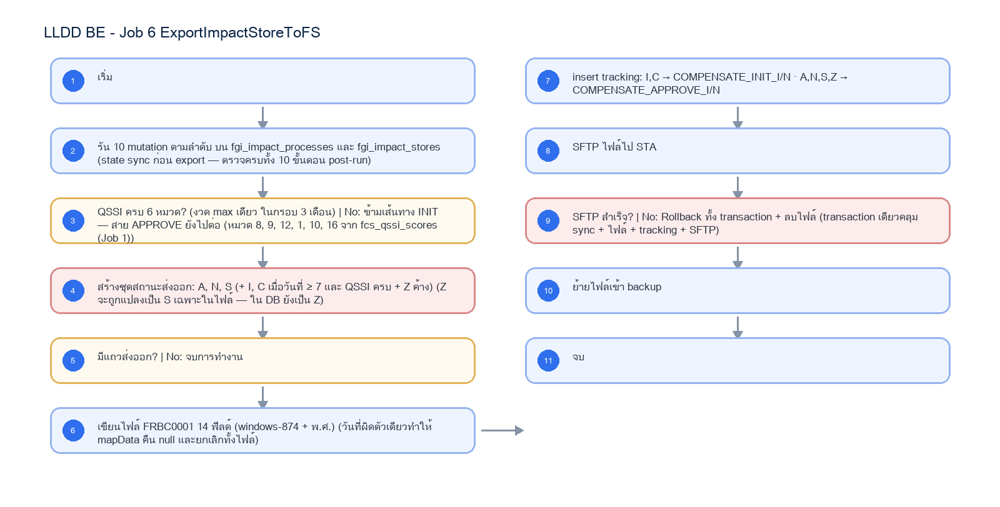

# LLDD BE - Job 6 ExportImpactStoreToFS

SBP Mall - ระบบประกันรายได้ | Low Level Design Document

## 1. Overview

| รายการ | รายละเอียด |
| --- | --- |
| Track | BE |
| Estimate | 15 ชั่วโมง |
| Owner | Aphiwit <Bank> Khammoon |
| Objective | ซิงก์สถานะ + ส่งค่าชดเชยไป STA: รัน 10 mutation ตามลำดับบนตารางสถานะ ตรวจความครบของคะแนน QSSI 6 หมวด สร้างชุดสถานะที่ส่งออกได้ แล้วเขียนไฟล์ FRBC0001 (14 ฟิลด์ ปี พ.ศ.) ส่งให้ระบบ Statement (STA) ภายใน transaction เดียว |

Common contract reference: ทุกหัวข้อ API/FE ต้องยึด LLDD-BE-API-Common-Contracts และ LLDD-FE-Integration-Contracts สำหรับ error/auth/format/pagination/action/RBAC ก่อนลงรายละเอียดเฉพาะหน้าหรือเฉพาะ endpoint

## 2. Screen / Functional Scope

- Main class/script: fgi.main.ExportImpactStoreToFS / FGI_ExportImpactStoreToSTA.sh
- Phase: D
- Output: FRBC0001 (windows-874)
- Estimate: 15 ชั่วโมง
- Runbook, rerun rule, risk และ history ต้องตามข้อมูลหน้า Batch Job

## 4. Implementation Flow Diagram (Reference)



_รูปที่ 1: Implementation flow reference: LLDD BE - Job 6 ExportImpactStoreToFS_

## 5. Field, Format, and Validation

| Field / UI | Format | Validation | Behavior |
| --- | --- | --- | --- |
| กำหนดการรัน (Cron) | 0 17 * * * | แก้ไขได้ | ทุกวัน 17:00 |
| dateStartInitToSTA | 7 | แก้ไขได้ | วันของเดือนที่เริ่มปล่อยสถานะ I, C |
| numWaitPay | 3 | แก้ไขได้ | จำนวนงวดรอจ่าย |
| หมวด QSSI ที่ตรวจ | 8, 9, 12, 1, 10, 16 | ค่าคงที่/แก้ผ่านหน้าจอไม่ได้ | ต้องครบทั้ง 6 หมวดจากงวด max เดียว ในกรอบ 3 เดือน |
| Output File | FRBC0001_yyyyMMddHHmmss.txt (windows-874, 14 ฟิลด์, พ.ศ.) | ค่าคงที่/แก้ผ่านหน้าจอไม่ได้ | ฟิลด์ 3/5/6 เป็นวันที่แบบไทย/พุทธศักราช |
| STA endpoint alias | sta-compensation | ค่าคงที่/แก้ผ่านหน้าจอไม่ได้ | resolve host/port/TLS policy จาก environment; ห้าม editable endpoint |
| Secret reference | secret/sbpgi/interfaces/sta | ค่าคงที่/แก้ผ่านหน้าจอไม่ได้ | credential/certificate/private key จาก Secret Manager; TLS verify-full หรือ strict known_hosts |

## 5.1 Input / Progress / Output Contract

| Stage | Contract for implementation |
| --- | --- |
| Input | Approved/initial compensation data from FGI impact/new-store tables plus QSSI score lookup and FS export configuration. |
| Progress | query rows for FS, generate compensation interface payload, insert/update compensate records, upload/export, backup, notify. |
| Output | FS outbound data and FGI compensation tables synchronized; run summary includes exported counts and file/status. |

### 5.90 Job 6 Execution Stages

query rows for FS, generate compensation interface payload, insert/update compensate records, upload/export, backup, notify.

| Order | Service step | Repository | Output / failure contract |
| --- | --- | --- | --- |
| 1 | loadApprovedCompensations | statementExportRepository | คืน metrics และ throw typed error; transaction/rerun ใช้ contract ด้านล่าง |
| 2 | buildStatementPayload | statementExportRepository | คืน metrics และ throw typed error; transaction/rerun ใช้ contract ด้านล่าง |
| 3 | enqueueStatementOutbox | statementExportRepository | คืน metrics และ throw typed error; transaction/rerun ใช้ contract ด้านล่าง |
| 4 | purgeAcknowledgedTracking | statementExportRepository | คืน metrics และ throw typed error; transaction/rerun ใช้ contract ด้านล่าง |

### 5.91 Job 6 Run Evidence

| Evidence | Job-specific value | Acceptance |
| --- | --- | --- |
| Input identity | Approved/initial compensation data from FGI impact/new-store tables plus QSSI score lookup and FS export configuration. | snapshot input file/business key/period in run record |
| Output identity | FS outbound data and FGI compensation tables synchronized; run summary includes exported counts and file/status. | reconcile input, success, reject and skipped counts |
| Dedup proof | UNIQUE(data_name,direction,business_key,period_key); STA ACK เปลี่ยน transaction เดิมเป็น ACKED ไม่ insert แถวใหม่ | rerun fixture produces no duplicate target business key |
| Transaction proof | สร้าง payload/checksum ก่อน แล้ว insert outbox READY; dispatcher ส่งและเปลี่ยน SENT แยก transaction; callback ACK เปลี่ยน ACKED แบบ compare-and-set | injected failure leaves no partial committed state outside documented boundary |
| Security proof | STA endpoint/SFTP ใช้ secretRef=secret/sbpgi/interfaces/sta, TLS 1.2+ verify-full หรือ strict known_hosts; certificate/key rotation ไม่ต้องแก้เอกสารหรือ job param | config/log/error contains no plaintext secret |

### 5.92 Legacy Java Source Reference

| Legacy file | Line range | Responsibility to carry forward |
| --- | --- | --- |
| fcsJar/src/th/co/gosoft/fgi/main/ExportImpactStoreToFS.java | 19-68 | Legacy main entrypoint for exporting impact-store compensation to FS. |
| fcsJar/src/th/co/gosoft/fgi/dao/jdbc/ExportJdbc.java | 119-180, 386-970 | Query FS export data and insert/update impact/new-store compensation records. |

Line ranges refer to the legacy Java implementation under /Users/bank_mac/gosoft/java/SBP/fcsJar. Use these ranges to preserve business behavior while implementing the target Node job.

### 5.93 Target Repository and SQL Contract

| Contract | Target implementation |
| --- | --- |
| Repository | statementExportRepository |
| Idempotency / dedup | UNIQUE(data_name,direction,business_key,period_key); STA ACK เปลี่ยน transaction เดิมเป็น ACKED ไม่ insert แถวใหม่ |
| Transaction boundary | สร้าง payload/checksum ก่อน แล้ว insert outbox READY; dispatcher ส่งและเปลี่ยน SENT แยก transaction; callback ACK เปลี่ยน ACKED แบบ compare-and-set |
| Security | STA endpoint/SFTP ใช้ secretRef=secret/sbpgi/interfaces/sta, TLS 1.2+ verify-full หรือ strict known_hosts; certificate/key rotation ไม่ต้องแก้เอกสารหรือ job param |

#### Input / candidate query

```sql
SELECT d.doc_no, d.impact_process_id, s.id AS sales_summary_id,
       d.total_compensation_amount, q.score_value
FROM compensation_documents d
JOIN fgi_impact_sales_summaries s ON s.impact_process_id = d.impact_process_id
LEFT JOIN fcs_qssi_scores q ON q.store_code = d.impacted_store_code AND q.score_period = d.impact_month
JOIN LATERAL (
    SELECT c.result_category
    FROM consideration_logs c
    WHERE c.doc_no = d.doc_no
    ORDER BY c.action_datetime DESC
    LIMIT 1
) latest_decision ON latest_decision.result_category = 'APPROVE'
WHERE d.status_code = '99'
  AND NOT EXISTS (
      SELECT 1 FROM interface_transactions i
      WHERE i.data_name = 'COMPENSATE_APPROVE_I' AND i.direction = 'OUT'
        AND i.doc_no = d.doc_no AND i.status IN ('READY','SENT','ACKED'));
```

#### Write / upsert query

```sql
INSERT INTO interface_transactions
    (run_id, data_name, direction, status, doc_no, impact_process_id, sales_summary_id,
     business_key, period_key, file_name, file_checksum, outbox_status, purge_after)
VALUES (:run_id, 'COMPENSATE_APPROVE_I', 'OUT', 'READY', :doc_no, :impact_process_id,
        :sales_summary_id, :doc_no, :period_key, :file_name, :file_checksum, 'READY',
        CURRENT_TIMESTAMP + INTERVAL '365 days')
ON CONFLICT (data_name, direction, business_key, period_key) DO NOTHING;

WITH purge_candidates AS (
    SELECT id
    FROM interface_transactions
    WHERE data_name = ANY(:purge_data_names)
      AND status IN ('ACKED','COMPLETED')
      AND purge_after < CURRENT_TIMESTAMP
      AND legal_hold = FALSE
    ORDER BY id
    LIMIT :purge_batch_size
    FOR UPDATE SKIP LOCKED
)
DELETE FROM interface_transactions i
USING purge_candidates p
WHERE i.id = p.id
RETURNING i.id, i.data_name, i.business_key;
```

### 5.94 Target Node Implementation

โครงสร้างนี้ระบุ service/repository เฉพาะงานและต้อง implement ตาม SQL, transaction, idempotency และ security contract ด้านบน โดยทุกขั้นต้องคืน metrics สำหรับ reconcile และ run history

```js
export async function runLlddBeJob6Exportimpactstoretofs(ctx, services) {
  const run = await services.jobRuns.acquire({
    jobNo: "6", period: ctx.period, triggeredBy: ctx.triggeredBy
  });

  try {
    ctx = { ...ctx, runId: run.id, repository: services.statementExportRepository };
    const step1 = await services.loadApprovedCompensations(ctx, undefined);
    const step2 = await services.buildStatementPayload(ctx, step1);
    const step3 = await services.enqueueStatementOutbox(ctx, step2);
    const step4 = await services.purgeAcknowledgedTracking(ctx, step3);
    const result = step4;
    await services.jobRuns.finish(run.id, "SUCCESS", result.metrics);
    return { runId: run.id, status: "SUCCESS", ...result };
  } catch (error) {
    await services.jobRuns.finish(run.id, "FAILED", {
      errorCode: error.code ?? "JOB_FAILED",
      errorMessage: error.message
    });
    throw error;
  }
}
```

### 5.95 Tracking Retention / Purge SQL

Purge ทำได้เฉพาะ ACKED/COMPLETED ที่ครบ purge_after และไม่อยู่ใน legal hold; ต้องรันเป็น batch จำกัดจำนวนเพื่อไม่ lock ตารางยาว

```sql
WITH purge_candidates AS (
    SELECT id
    FROM interface_transactions
    WHERE status IN ('ACKED', 'COMPLETED')
      AND purge_after < CURRENT_TIMESTAMP
      AND legal_hold = FALSE
      AND data_name = ANY(:sta_data_names)
    ORDER BY id
    LIMIT :batch_size
    FOR UPDATE SKIP LOCKED
)
DELETE FROM interface_transactions i
USING purge_candidates p
WHERE i.id = p.id
RETURNING i.id, i.data_name, i.business_key;
```

## 6. Button / User Action Mapping

| Action | Trigger | API / Service | Expected Result |
| --- | --- | --- | --- |
| เปิดดูรายละเอียด Job | GET | GET /api/v1/jobs/6 | คืน params/metadata ล่าสุด |
| บันทึกพารามิเตอร์ | PUT | PUT /api/v1/jobs/6/params | บันทึกเฉพาะ key ที่ editable และ audit |
| สั่งรันทันที | POST | POST /api/v1/jobs/6/run | สร้าง run history สถานะ RUNNING/QUEUED |
| เปิด/ปิดใช้งาน | PUT | PUT /api/v1/jobs/6/enabled | บันทึก enabled + audit พร้อม reason |

## 7. API Contract

### GET /api/v1/jobs/6

อ่าน metadata และพารามิเตอร์ของ Job

#### Query Params

```json
{
  "jobNo": "6"
}
```

#### Request Field Schema

| Field | Type | Required | Constraint / Meaning |
| --- | --- | --- | --- |
| jobNo | string | No | UTF-8; use value domain described by endpoint purpose |

#### Response

```json
{
  "jobNo": "6",
  "name": "ExportImpactStoreToFS",
  "cron": "0 17 * * *",
  "enabled": true,
  "params": [
    {
      "label": "กำหนดการรัน (Cron)",
      "value": "0 17 * * *",
      "editable": true
    },
    {
      "label": "dateStartInitToSTA",
      "value": "7",
      "editable": true
    },
    {
      "label": "numWaitPay",
      "value": "3",
      "editable": true
    },
    {
      "label": "หมวด QSSI ที่ตรวจ",
      "value": "8, 9, 12, 1, 10, 16",
      "editable": false
    }
  ]
}
```

#### Response Field Schema

| Field | Type | Required | Constraint / Meaning |
| --- | --- | --- | --- |
| jobNo | string | Yes | UTF-8; use value domain described by endpoint purpose |
| name | string | Yes | UTF-8; use value domain described by endpoint purpose |
| cron | string | Yes | UTF-8; use value domain described by endpoint purpose |
| enabled | boolean | Yes | UTF-8; use value domain described by endpoint purpose |
| params | array<object> | Yes | JSON array; element type shown in Type column |
| params[].label | string | Yes | UTF-8; use value domain described by endpoint purpose |
| params[].value | string | Yes | UTF-8; use value domain described by endpoint purpose |
| params[].editable | boolean | Yes | UTF-8; use value domain described by endpoint purpose |

### PUT /api/v1/jobs/6/params

แก้ไขพารามิเตอร์ที่อนุญาตเท่านั้น

#### Request

```json
{
  "params": {
    "cron": "0 17 * * *"
  },
  "reason": "ปรับรอบรันตาม Operations"
}
```

#### Request Field Schema

| Field | Type | Required | Constraint / Meaning |
| --- | --- | --- | --- |
| params | object | Yes | JSON object; nested fields listed below |
| params.cron | string | Yes | UTF-8; use value domain described by endpoint purpose |
| reason | string | Yes | trimmed UTF-8 Thai text; required by operation/business rule |

#### Response

```json
{
  "message": "saved"
}
```

#### Response Field Schema

| Field | Type | Required | Constraint / Meaning |
| --- | --- | --- | --- |
| message | string | Yes | UTF-8; use value domain described by endpoint purpose |

### POST /api/v1/jobs/6/run

สั่งรัน manual โดย guard ไม่ให้รันซ้อน

#### Request

```json
{
  "period": "2569-07"
}
```

#### Request Field Schema

| Field | Type | Required | Constraint / Meaning |
| --- | --- | --- | --- |
| period | string | Yes | UTF-8; use value domain described by endpoint purpose |

#### Response

```json
{
  "runId": "JOB6-RUN-001",
  "status": "RUNNING"
}
```

#### Response Field Schema

| Field | Type | Required | Constraint / Meaning |
| --- | --- | --- | --- |
| runId | string | Yes | UTF-8; use value domain described by endpoint purpose |
| status | string | Yes | UTF-8; use value domain described by endpoint purpose |

### GET /api/v1/jobs/6/runs

อ่านประวัติการรันล่าสุด

#### Query Params

```json
{
  "page": 1,
  "size": 20
}
```

#### Request Field Schema

| Field | Type | Required | Constraint / Meaning |
| --- | --- | --- | --- |
| page | integer | No | >= 1; default 1 |
| size | integer | No | 1..100; default 20 |

#### Response

```json
{
  "items": [
    {
      "startedAt": "01/07/2569 17:00",
      "status": "ok"
    }
  ]
}
```

#### Response Field Schema

| Field | Type | Required | Constraint / Meaning |
| --- | --- | --- | --- |
| items | array<object> | Yes | JSON array; element type shown in Type column |
| items[].startedAt | string | Yes | ISO-8601 ค.ศ.; nullable only when type includes null |
| items[].status | string | Yes | UTF-8; use value domain described by endpoint purpose |

## 8. Reference DB Mapping (No Database Page Work)

ส่วนนี้เป็นข้อมูลอ้างอิงสำหรับการ implement API/Job เท่านั้น ไม่ใช่งานสร้างหน้า Database, ไม่ใช่งานออกแบบ DB page และไม่ถูกนับเป็น deliverable แยกของ FE/BE

| Table / Object | R/W | Usage |
| --- | --- | --- |
| fgi_impact_processes | R/W | หนึ่งใน 10 mutation (สถานะ process / last_compensation_amount) |
| fgi_impact_stores | R/W | สถานะค่าชดเชย I/C/A/N/S/Z และข้อมูลร้าน/ผู้อนุมัติ/ค่าชดเชยร้านใหม่ |
| fcs_qssi_scores | R | ตรวจความครบคะแนน 6 หมวด (จาก Job 1) |
| interface_transactions | W | tracking COMPENSATE_INIT / APPROVE (I,N) · typed FK = impact_process_id |

## 9. Processing Flow

| Step | Description |
| --- | --- |
| 1 | เริ่ม |
| 2 | รัน 10 mutation ตามลำดับ บน fgi_impact_processes และ fgi_impact_stores (state sync ก่อน export — ตรวจครบทั้ง 10 ขั้นตอน post-run) |
| 3 | QSSI ครบ 6 หมวด? (งวด max เดียว ในกรอบ 3 เดือน) \| No: ข้ามเส้นทาง INIT — สาย APPROVE ยังไปต่อ (หมวด 8, 9, 12, 1, 10, 16 จาก fcs_qssi_scores (Job 1)) |
| 4 | สร้างชุดสถานะส่งออก: A, N, S (+ I, C เมื่อวันที่ ≥ 7 และ QSSI ครบ + Z ค้าง) (Z จะถูกแปลงเป็น S เฉพาะในไฟล์ — ใน DB ยังเป็น Z) |
| 5 | มีแถวส่งออก? \| No: จบการทำงาน |
| 6 | เขียนไฟล์ FRBC0001 14 ฟิลด์ (windows-874 + พ.ศ.) (วันที่ผิดตัวเดียวทำให้ mapData คืน null และยกเลิกทั้งไฟล์) |
| 7 | insert tracking: I,C → COMPENSATE_INIT_I/N · A,N,S,Z → COMPENSATE_APPROVE_I/N |
| 8 | SFTP ไฟล์ไป STA |
| 9 | SFTP สำเร็จ? \| No: Rollback ทั้ง transaction + ลบไฟล์ (transaction เดียวคลุม sync + ไฟล์ + tracking + SFTP) |
| 10 | ย้ายไฟล์เข้า backup |
| 11 | จบ |

## 10. Acceptance Criteria

- อ่าน/แก้พารามิเตอร์ได้ตาม editable flag เท่านั้น
- การสั่งรันต้องตรวจ enabled และไม่มีรอบ RUNNING เดิม
- ต้องบันทึก job_run_histories และ audit_logs สำหรับทุก mutation
- DB/table mapping ใช้เป็น reference สำหรับ implement Job เท่านั้น ไม่ใช่งานสร้างหน้า Database
- รองรับ rerun rule และ risk note ตาม runbook

## 11. Developer Test Checklist

| No | Test |
| --- | --- |
| 1 | GET job detail |
| 2 | PUT params with editable key |
| 3 | PUT params locked business key must fail |
| 4 | POST run while running must fail |
| 5 | GET run histories |
| 6 | ตรวจผลกระทบตารางตาม R/W mapping reference |
