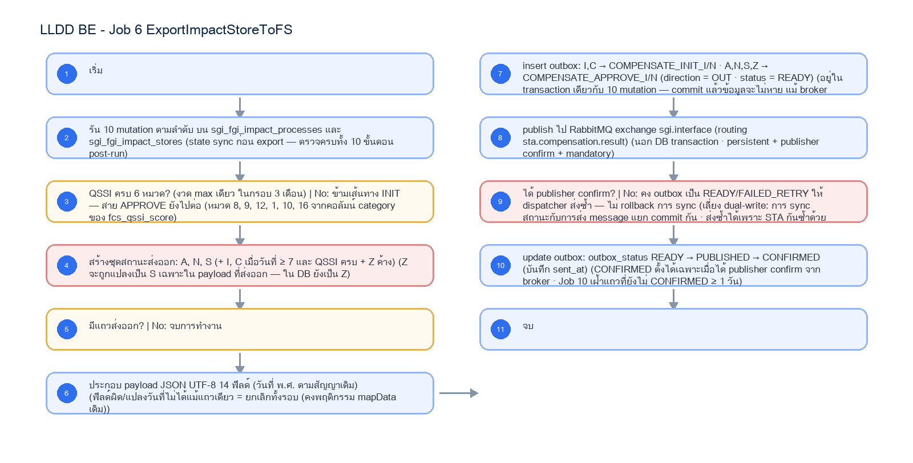
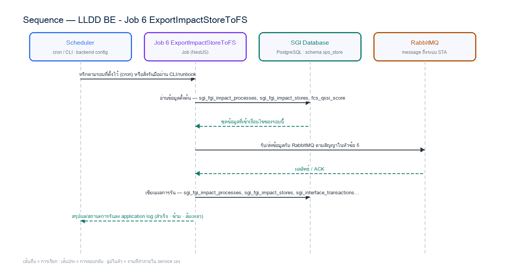

# LLDD BE - Job 6 ExportImpactStoreToFS

SBP Mall - ระบบประกันรายได้ | Low Level Design Document

## 1. Overview

| รายการ | รายละเอียด |
| --- | --- |
| Track | BE |
| Estimate | **34 ชั่วโมง** = implementation 26 + unit test 8 (30%) |
| Owner | Aphiwit <Bank> Khammoon |
| Target repository | `SBP/srm-sps-spsap-store-backend` (NestJS + TypeORM · schema `sps_store`) — batch runner ฝั่ง backend **ไม่ผ่าน BFF** · cron/พารามิเตอร์อยู่ใน backend config (env/config file) |
| Objective | ซิงก์สถานะ + ส่งค่าชดเชยไป STA: รัน 10 mutation ตามลำดับบนตารางสถานะ ตรวจความครบของคะแนน QSSI 6 หมวด สร้างชุดสถานะที่ส่งออกได้ แล้ว **publish message ไป RabbitMQ** ให้ระบบ Statement (STA) รับต่อ (มติ 2026-08-24 — เลิกเขียนไฟล์ FRBC0001 + SFTP) · เนื้อข้อมูลยังเป็นสัญญาเดิม 14 ฟิลด์ แต่เป็น JSON UTF-8 ไม่ใช่ text windows-874 · ใช้ **transactional outbox** แบบเดียวกับ Job 4 — DB transaction ครอบ sync + outbox แล้วค่อย publish นอก transaction |

Common contract reference: ทุกหัวข้อ API/FE ต้องยึด LLDD-BE-API-Common-Contracts และ LLDD-FE-Integration-Contracts สำหรับ error/auth/format/pagination/action/RBAC ก่อนลงรายละเอียดเฉพาะหน้าหรือเฉพาะ endpoint

### 1.1 เอกสาร LLDD ที่เกี่ยวข้อง

ตารางนี้สร้างจาก endpoint และตารางที่เอกสารฉบับนี้ประกาศไว้จริง — อ่านฉบับที่อยู่ในตารางก่อนลงมือ เพื่อไม่ให้สัญญา request/response หรือชื่อคอลัมน์หลุดจากกัน

| ความสัมพันธ์ | เอกสาร LLDD | เกี่ยวข้องตรงไหน |
| --- | --- | --- |
| สัญญากลาง | **LLDD-BE-API-Common-Contracts** | envelope `{success,data}` · error code · pagination · รูปแบบวันที่/เลขเอกสาร |
| โครงสร้างข้อมูล | **LLDD-BE-Database-Structure** | DDL ของตารางที่หัวข้อ Reference DB Mapping อ้างถึง |
| แพลตฟอร์มระบบเดิม | **LLDD-BE-Integration-SBP-Platform** | header จาก BFF (`x-api-key` / `x-user-*`) · การ reuse ตารางและ service ของระบบ SBP เดิม |
| ต้องจบก่อน (ลำดับงาน) | **LLDD-BE-API-Common-Contracts** | เป็นฉบับต้นทางของสัญญา/โครงที่ฉบับนี้อ้าง |
| ต้องจบก่อน (ลำดับงาน) | **LLDD-BE-Database-Structure** | เป็นฉบับต้นทางของสัญญา/โครงที่ฉบับนี้อ้าง |
| ต้องจบก่อน (ลำดับงาน) | **LLDD-BE-Job-2-ImportImpactStore** | เป็นฉบับต้นทางของสัญญา/โครงที่ฉบับนี้อ้าง |

## 2. Screen / Functional Scope

- Main class/script: fgi.main.ExportImpactStoreToFS / FGI_ExportImpactStoreToSTA.sh
- Phase: D
- Output: RabbitMQ message (sgi.interface / sta.compensation.result)
- Estimate: 26 ชั่วโมง
- พารามิเตอร์/cron อ่านจาก backend config (config file/env) — ไม่มีตาราง job_configs และไม่มีหน้าจอควบคุม (หน้า Flow Batch Job ในกลุ่มเมนู Flow เหลือแค่ Flowchart + Database ที่ใช้ · 2026-08-06)
- Runbook, rerun rule, risk และ history ตามเอกสาร Batch v4.0 · ผลการรันเขียน application log แบบ structured

## 3. Screenshot Reference

ไม่มีภาพหน้าจอสำหรับหัวข้อนี้ — เป็นเอกสารฝั่ง Backend/Batch ที่ไม่มี UI (ภาพหน้าจอทั้งหมดอยู่ในเอกสารชุด FE)

## 4. Implementation Flow & Sequence Diagram (Reference)

### 4.1 Implementation Flow (ลำดับขั้นการทำงาน)



_รูปที่ 1: Implementation flow reference: LLDD BE - Job 6 ExportImpactStoreToFS_

### 4.2 Sequence Diagram (ใครคุยกับใคร ลำดับไหน)

ผู้แสดงและลำดับข้อความในภาพนี้สร้างจาก endpoint ในหัวข้อ 7 และตารางในหัวข้อ Reference DB Mapping ของเอกสารฉบับนี้เอง จึงตรงกับสัญญาเสมอ



_รูปที่ 2: Sequence diagram: LLDD BE - Job 6 ExportImpactStoreToFS_

## 5. Field, Format, and Validation

| Field / UI | Format | Validation | Behavior |
| --- | --- | --- | --- |
| กำหนดการรัน (Cron) | 0 17 * * * | แก้ไขได้ | ทุกวัน 17:00 |
| dateStartInitToSTA | 7 | แก้ไขได้ | วันของเดือนที่เริ่มปล่อยสถานะ I, C |
| numWaitPay | 3 | แก้ไขได้ | จำนวนงวดรอจ่าย |
| หมวด QSSI ที่ตรวจ | 8, 9, 12, 1, 10, 16 | ค่าคงที่/แก้ผ่านหน้าจอไม่ได้ | ต้องครบทั้ง 6 หมวดจากงวด max เดียว ในกรอบ 3 เดือน |
| RabbitMQ exchange | sgi.interface (topic, durable) | ค่าคงที่/แก้ผ่านหน้าจอไม่ได้ | อ่านชื่อ exchange จาก backend config (`SGI_MQ_EXCHANGE`) ไม่ hardcode |
| Routing key | sta.compensation.result | ค่าคงที่/แก้ผ่านหน้าจอไม่ได้ | STA เป็นเจ้าของ queue ที่ bind มาที่ routing key นี้ |
| Message payload | JSON UTF-8 · 14 ฟิลด์ตามสัญญา FRBC0001 เดิม | ค่าคงที่/แก้ผ่านหน้าจอไม่ได้ | ฟิลด์ 3/5/6 คงเป็นวันที่ พ.ศ. ตามสัญญา 14 ฟิลด์เดิมของ STA — แปลงเฉพาะตอนประกอบ payload ห้ามให้ปนเข้า DB/API |
| Message properties | persistent (delivery_mode=2) · message_id = sgi_interface_transactions.id | ค่าคงที่/แก้ผ่านหน้าจอไม่ได้ | message_id เป็น idempotency key ให้ STA กันรับซ้ำ |
| Secret reference | secret/sgi/mq/sta | ค่าคงที่/แก้ผ่านหน้าจอไม่ได้ | user/password ของ broker จาก Secret Manager · เชื่อมด้วย AMQPS (TLS verify-full) |

### 5.9 Input / Progress / Output Contract

| Stage | Contract for implementation |
| --- | --- |
| Input | Approved/initial compensation data from FGI impact/new-store tables plus QSSI score lookup and FS export configuration. |
| Progress | query rows for FS, generate compensation interface payload, insert/update compensate records, upload/export, backup, notify. |
| Output | FS outbound data and FGI compensation tables synchronized; run summary includes exported counts and file/status. |

### 5.90 Job 6 Execution Stages

query rows for FS, generate compensation interface payload, insert/update compensate records, upload/export, backup, notify.

| Order | Service step | Repository | Output / failure contract |
| --- | --- | --- | --- |
| 1 | loadApprovedCompensations | statementExportRepository | คืน metrics และ throw typed error; transaction/rerun ใช้ contract ด้านล่าง |
| 2 | buildStatementPayload | statementExportRepository | คืน metrics และ throw typed error; transaction/rerun ใช้ contract ด้านล่าง |
| 3 | enqueueStatementOutbox | statementExportRepository | คืน metrics และ throw typed error; transaction/rerun ใช้ contract ด้านล่าง |
| 4 | purgeAcknowledgedTracking | statementExportRepository | คืน metrics และ throw typed error; transaction/rerun ใช้ contract ด้านล่าง |

### 5.91 Job 6 Run Evidence

| Evidence | Job-specific value | Acceptance |
| --- | --- | --- |
| Input identity | Approved/initial compensation data from FGI impact/new-store tables plus QSSI score lookup and FS export configuration. | snapshot input file/business key/period in run record |
| Output identity | FS outbound data and FGI compensation tables synchronized; run summary includes exported counts and file/status. | reconcile input, success, reject and skipped counts |
| Dedup proof | UNIQUE(data_name,direction,business_key,period_key); STA ACK เปลี่ยน transaction เดิมเป็น ACKED ไม่ insert แถวใหม่ | rerun fixture produces no duplicate target business key |
| Transaction proof | สร้าง payload/checksum ก่อน แล้ว insert outbox READY; dispatcher ส่งและเปลี่ยน SENT แยก transaction; callback ACK เปลี่ยน ACKED แบบ compare-and-set | injected failure leaves no partial committed state outside documented boundary |
| Security proof | RabbitMQ broker ใช้ secretRef=secret/sgi/mq/sta, เชื่อมด้วย AMQPS (TLS 1.2+ verify-full); exchange/routing key มาจาก config ไม่ใช่ค่าที่ผู้ใช้แก้ได้; credential rotation ไม่ต้องแก้เอกสารหรือ job param | config/log/error contains no plaintext secret |

### 5.92 Legacy Java Source Reference

| Legacy file | Line range | Responsibility to carry forward |
| --- | --- | --- |
| fcsJar/src/th/co/gosoft/fgi/main/ExportImpactStoreToFS.java | 19-68 | Legacy main entrypoint for exporting impact-store compensation to FS. |
| fcsJar/src/th/co/gosoft/fgi/dao/jdbc/ExportJdbc.java | 119-180, 386-970 | Query FS export data and insert/update impact/new-store compensation records. |

Line ranges refer to the legacy Java implementation under /Users/bank_mac/gosoft/java/SBP/fcsJar. Use these ranges to preserve business behavior while implementing the target Node job.

### 5.93 Target Repository and SQL Contract

| Contract | Target implementation |
| --- | --- |
| Repository | statementExportRepository |
| Idempotency / dedup | UNIQUE(data_name,direction,business_key,period_key); STA ACK เปลี่ยน transaction เดิมเป็น ACKED ไม่ insert แถวใหม่ |
| Transaction boundary | สร้าง payload/checksum ก่อน แล้ว insert outbox READY; dispatcher ส่งและเปลี่ยน SENT แยก transaction; callback ACK เปลี่ยน ACKED แบบ compare-and-set |
| Security | RabbitMQ broker ใช้ secretRef=secret/sgi/mq/sta, เชื่อมด้วย AMQPS (TLS 1.2+ verify-full); exchange/routing key มาจาก config ไม่ใช่ค่าที่ผู้ใช้แก้ได้; credential rotation ไม่ต้องแก้เอกสารหรือ job param |

#### Input / candidate query

```sql
SELECT d.doc_no, d.impact_process_id, s.id AS sales_summary_id,
       d.total_compensation_amount, q.score
FROM sgi_compensation_documents d
JOIN sgi_fgi_impact_sales_summaries s ON s.impact_process_id = d.impact_process_id
LEFT JOIN fcs_qssi_score q ON q.store_id = d.impacted_store_code AND q.month = d.impact_month
JOIN LATERAL (
    SELECT c.result_category
    FROM sgi_consideration_logs c
    WHERE c.doc_no = d.doc_no
    ORDER BY c.action_datetime DESC
    LIMIT 1
) latest_decision ON latest_decision.result_category = 'APPROVE'
WHERE d.status_code = '99'
  AND NOT EXISTS (
      SELECT 1 FROM sgi_interface_transactions i
      WHERE i.data_name = 'COMPENSATE_APPROVE_I' AND i.direction = 'OUT'
        AND i.doc_no = d.doc_no AND i.status IN ('READY','SENT','ACKED'));
```

#### Write / upsert query

```sql
INSERT INTO sgi_interface_transactions
    (run_id, data_name, direction, status, doc_no, impact_process_id, sales_summary_id,
     business_key, period_key, file_name, file_checksum, outbox_status, purge_after)
VALUES (:run_id, 'COMPENSATE_APPROVE_I', 'OUT', 'READY', :doc_no, :impact_process_id,
        :sales_summary_id, :doc_no, :period_key, :file_name, :file_checksum, 'READY',
        CURRENT_TIMESTAMP + INTERVAL '365 days')
ON CONFLICT (data_name, direction, business_key, period_key) DO NOTHING;

WITH purge_candidates AS (
    SELECT id
    FROM sgi_interface_transactions
    WHERE data_name = ANY(:purge_data_names)
      AND status IN ('ACKED','COMPLETED')
      AND purge_after < CURRENT_TIMESTAMP
      AND legal_hold = FALSE
    ORDER BY id
    LIMIT :purge_batch_size
    FOR UPDATE SKIP LOCKED
)
DELETE FROM sgi_interface_transactions i
USING purge_candidates p
WHERE i.id = p.id
RETURNING i.id, i.data_name, i.business_key;
```

### 5.94 Target Node Implementation

โครงสร้างนี้ระบุ service/repository เฉพาะงานและต้อง implement ตาม SQL, transaction, idempotency และ security contract ด้านบน โดยทุกขั้นต้องคืน metrics สำหรับ reconcile และ run history

```js
export async function runLlddBeJob6Exportimpactstoretofs(ctx, services) {
  const run = await services.jobRuns.acquire({
    jobNo: "6", period: ctx.period, triggeredBy: ctx.triggeredBy
  });

  try {
    ctx = { ...ctx, runId: run.id, repository: services.statementExportRepository };
    const step1 = await services.loadApprovedCompensations(ctx, undefined);
    const step2 = await services.buildStatementPayload(ctx, step1);
    const step3 = await services.enqueueStatementOutbox(ctx, step2);
    const step4 = await services.purgeAcknowledgedTracking(ctx, step3);
    const result = step4;
    await services.jobRuns.finish(run.id, "SUCCESS", result.metrics);
    return { runId: run.id, status: "SUCCESS", ...result };
  } catch (error) {
    await services.jobRuns.finish(run.id, "FAILED", {
      errorCode: error.code ?? "JOB_FAILED",
      errorMessage: error.message
    });
    throw error;
  }
}
```

### 5.96 เขียนข้อมูลรอบชดเชย (รับเข้าโครง 2026-08-21 · gap F8 + F1)

Job 6 คือ job เดียวที่เขียนตารางรอบชดเชยในระบบเดิม — `ExportService.manageDBToFs()` เรียก 5 คำสั่งต่อกันเป็นชุด ระบบใหม่ต้องทำครบเหมือนเดิม แต่เขียนลงตารางของ SGI

| ลำดับใน manageDBToFs() | ระบบเดิม (Oracle) | ระบบใหม่ (SGI) | ใช้ทำอะไรต่อ |
| --- | --- | --- | --- |
| updateFgiImpactStoreOnProcess(INITDATE) | FGI_IMPACT_STORE_ON_PROCESS · LAST_COMPENSATE_SEQ_NO + 1 เมื่อ FLAG_ACTION='Y' และเพิ่งชดเชยเดือนที่แล้ว | sgi_fgi_impact_processes.last_compensate_seq_no += 1 | **เคสต่อเนื่อง** (SEQ_NO > 1) |
| insertFgiImpactStoreOnProcess() | แถวใหม่ · LAST_COMPENSATE_SEQ = MAX+1 · SEQ_NO = 1 · FLAG_ACTION='Y' · DATASOURCE | sgi_fgi_impact_processes แถวใหม่ (last_compensate_seq · last_compensate_seq_no=1 · flag_action · datasource) | **เปิดเรื่องใหม่** (SEQ_NO = 1) |
| insertFgiImpactStoreCompensate(...) | FGI_IMPACT_STORE_COMPENSATE · COMPENSATE_FORECAST / COMPENSATE_ADJUST ต่องวด | **sgi_fgi_impact_compensations** (forecast_amount / adjust_amount) | **นับยอด 0 ติดกันกี่เดือน** (กติกาเดือน 1-3 / เดือนที่ 4) |
| insertFgiNewStoreCompensate(...) | FGI_NEW_STORE_COMPENSATE | sgi_document_new_stores.compensation_amount / compensate_percent | ยอดต่อร้านเปิดใหม่ |
| updateCompleteImpactStoreOnProcess / FlagYToW | FLAG_ACTION Y→N / Y→W | sgi_fgi_impact_processes.flag_action | ปิดรอบ / ส่งกลับรอตรวจ |

⚠️ `ImportJdbc.insertImpactStoreOnProcess()` / `updateImpactStoreOnProcess()` มี SQL ชุดเดียวกันอยู่ในไฟล์ Import แต่ตรวจทั้ง src แล้ว **ไม่มี call site จริง** — เป็นโค้ดตาย ให้ยึด `ExportJdbc` เป็นต้นแบบเท่านั้น

### 5.95 Tracking Retention / Purge SQL

Purge ทำได้เฉพาะ ACKED/COMPLETED ที่ครบ purge_after และไม่อยู่ใน legal hold; ต้องรันเป็น batch จำกัดจำนวนเพื่อไม่ lock ตารางยาว

```sql
WITH purge_candidates AS (
    SELECT id
    FROM sgi_interface_transactions
    WHERE status IN ('ACKED', 'COMPLETED')
      AND purge_after < CURRENT_TIMESTAMP
      AND legal_hold = FALSE
      AND data_name = ANY(:sta_data_names)
    ORDER BY id
    LIMIT :batch_size
    FOR UPDATE SKIP LOCKED
)
DELETE FROM sgi_interface_transactions i
USING purge_candidates p
WHERE i.id = p.id
RETURNING i.id, i.data_name, i.business_key;
```

## 6. Button / User Action Mapping

| Action | Trigger | API / Service | Expected Result |
| --- | --- | --- | --- |
| รันตามตารางเวลา | CRON | scheduler → runner (job 6) | อ่าน cron/พารามิเตอร์จาก backend config |
| รันนอกรอบ (manual/rerun) | CLI | CLI/ops runbook → runner (job 6) | guard ไม่ให้รันซ้อนด้วย distributed lock |
| แก้พารามิเตอร์/เปิด-ปิด job | CONFIG | แก้ backend config แล้ว deploy | ไม่มี endpoint และไม่มีหน้าจอควบคุม — หน้า Flow Batch Job เป็น reference อย่างเดียว (2026-08-06) |
| ตรวจผลการรัน | LOG | application log (structured) | ไม่มีตาราง job_run_histories แล้ว · ไฟล์/ACK ดูที่ sgi_interface_transactions |

## 7. API Contract

**เอกสารฉบับนี้ไม่มี endpoint ของตัวเอง** — เป็นสัญญา/งานภายในที่เอกสารอื่นเรียกใช้ (ดูขอบเขตใน 5.90 Endpoint Implementation Contract) · รายการ endpoint ทั้ง 29 เส้นของ SGI อยู่ที่ **LLDD-API** และ `api.md`

## 8. Reference DB Mapping (No Database Page Work)

ส่วนนี้เป็นข้อมูลอ้างอิงสำหรับการ implement API/Job เท่านั้น ไม่ใช่งานสร้างหน้า Database, ไม่ใช่งานออกแบบ DB page และไม่ถูกนับเป็น deliverable แยกของ FE/BE

| Table / Object | R/W | Usage |
| --- | --- | --- |
| sgi_fgi_impact_processes | R/W | หนึ่งใน 10 mutation (สถานะ process / last_compensation_amount) |
| sgi_fgi_impact_stores | R/W | สถานะค่าชดเชย I/C/A/N/S/Z และข้อมูลร้าน/ผู้อนุมัติ/ค่าชดเชยร้านใหม่ |
| fcs_qssi_score | R | ตรวจความครบคะแนน 6 หมวด — อ่านอย่างเดียว ระบบ SBP เดิมเป็นคนนำเข้า (คอลัมน์จริง: store_id · category · month · year · score) |
| sgi_interface_transactions | W | outbox + tracking COMPENSATE_INIT / APPROVE (I,N) · direction = OUT · READY → SENT → ACKED · typed FK = impact_process_id |

## 9. Skeleton Code (Batch Job 6)

#### 9.1 ผังไฟล์ที่ต้องสร้าง (Job 6)

โครงไฟล์ของ Job 6 (fgi.main.ExportImpactStoreToFS เดิม) วางใต้ `src/batch/sgi/` ของ store-backend โดยใช้ convention เดียวกับ module ธุรกิจอื่น: inject custom provider `DATA_SOURCE` แล้วยิง raw SQL, repository ประกาศเป็น factory provider ที่ใช้ token string, entity อยู่ใน `src/entitys/`

**หมายเหตุสำคัญ — `src/batch/*` ทั้งชุดเป็นของใหม่ที่ยังไม่มีใน store-backend**: ปัจจุบัน repo ไม่มีโฟลเดอร์ `src/batch` เลย และแม้จะติดตั้ง `@nestjs/schedule` ไว้แล้วก็ยัง**ไม่มี `@Cron`/`@Interval` แม้แต่จุดเดียว** ดังนั้น `runner.ts` / `scheduler.ts` / `cli.js` / `job-failure.notifier.ts` คือ **งานตั้งต้นของ Phase แรก** ที่ต้องสร้างเองทั้งหมด พร้อม register `ScheduleModule.forRoot()` ใน `app.module.ts` — ไม่ใช่ของเดิมที่ reuse ได้

| Path | หน้าที่ |
| --- | --- |
| src/batch/sgi/job-6-export-impact-store-to-fs/job-6-export-impact-store-to-fs.job.ts | คลาส `ExportImpactStoreToFsJob` — `run(ctx)` เรียงตาม flow ของ Job 6 ทีละขั้น, ครอบ transaction, จบด้วย structured log |
| src/batch/sgi/job-6-export-impact-store-to-fs/job-6-export-impact-store-to-fs.service.ts | คลาส `ExportImpactStoreToFsService` — logic ต่อขั้น (อ่าน/parse/คำนวณ/เขียน) + repository token ที่ inject จาก `DATA_SOURCE` |
| src/batch/sgi/job-6-export-impact-store-to-fs/job-6-export-impact-store-to-fs.config.ts | คลาส `SgiJob6Config` (แบบเดียวกับ `src/config/app.config.ts` — โปรเจกต์นี้ไม่ใช้ `registerAs`) — cron และพารามิเตอร์ทั้ง 9 ตัวของ Job 6 อ่านจาก env/config file (ไม่มีตาราง job_configs) |
| src/batch/sgi/job-6-export-impact-store-to-fs/job-6-export-impact-store-to-fs.module.ts | NestJS module ผูก job + service + repository provider (factory token string) เข้ากับ `DatabaseModule` |
| src/batch/runner.ts | ตัวรันกลาง: resolve job ตาม jobNo, กันรันซ้อนด้วย advisory lock, จับ error → แจ้งเตือน, เขียน structured log สรุป (ใช้ร่วมทั้ง 11 job) |
| src/batch/scheduler.ts | ลงทะเบียน cron จาก config (`SGI_JOB6_CRON` = `0 17 * * *`) และรองรับสั่งรันนอกรอบผ่าน CLI/runbook |
| src/batch/job-failure.notifier.ts | ส่งอีเมลแจ้งผู้ดูแลเมื่อ job ล้มเหลว ผ่าน `EmailLibService` ของ `@gosoft-sbp/email-lib` (log ลง `email_sent` ให้อัตโนมัติ) |

#### 9.2 Config Schema ของ Job 6 (backend config / env)

cron ปัจจุบันของ Job 6 คือ `0 17 * * *` (ทุกวัน 17:00) — ประกาศเป็น `SGI_JOB6_CRON` และอ่านตอน bootstrap ของ `scheduler.ts`; ถ้า `enabled=false` scheduler ต้องไม่ลงทะเบียน cron ของ job นี้

```ts
// src/batch/sgi/job-6-export-impact-store-to-fs/job-6-export-impact-store-to-fs.config.ts
// convention จริงของ store-backend คือคลาส config (`src/config/app.config.ts` ที่ export ผ่าน
// `AppConfigModule` แบบ @Global แล้วอ่าน process.env ตรง ๆ) — โปรเจกต์นี้ **ไม่ได้ใช้ registerAs**
// แม้แต่จุดเดียว จึงประกาศเป็นคลาสให้รีวิว/ทดสอบเหมือน config ตัวอื่น
import { Injectable } from '@nestjs/common';

// TODO: Job 6 ไม่มีตาราง job_configs และไม่มี Job Admin API แล้ว (ตัดสินใจ 2026-08-06)
// TODO: ค่าทุกตัวอ่านจาก env/config file ของ backend เท่านั้น — เปลี่ยนค่า = แก้ config แล้ว deploy
export interface Job6Config {
  /** เปิด/ปิด job รอบถัดไปโดยไม่ต้อง deploy โค้ด */
  enabled: boolean;
  /** cron ของ job นี้ (อ่านตอน bootstrap ของ scheduler.ts) */
  cron: string;
  /** กำหนดการรัน (Cron) — ทุกวัน 17:00 */
  cron: string;
  /** dateStartInitToSTA — วันของเดือนที่เริ่มปล่อยสถานะ I, C */
  dateStartInitToSta: number;
  /** numWaitPay — จำนวนงวดรอจ่าย */
  numWaitPay: number;
  /** หมวด QSSI ที่ตรวจ — ต้องครบทั้ง 6 หมวดจากงวด max เดียว ในกรอบ 3 เดือน */
  qssi: string;
  /** RabbitMQ exchange — อ่านชื่อ exchange จาก backend config (`SGI_MQ_EXCHANGE`) ไม่ hardcode */
  rabbitMqExchange: string;
  /** Routing key — STA เป็นเจ้าของ queue ที่ bind มาที่ routing key นี้ */
  routingKey: string;
  /** Message payload — ฟิลด์ 3/5/6 คงเป็นวันที่ พ.ศ. ตามสัญญา 14 ฟิลด์เดิมของ STA — แปลงเฉพาะตอนประกอบ payload ห้ามให้ปนเข้า DB/API */
  messagePayload: string;
  /** Message properties — message_id เป็น idempotency key ให้ STA กันรับซ้ำ */
  messageProperties: string;
  /** Secret reference — user/password ของ broker จาก Secret Manager · เชื่อมด้วย AMQPS (TLS verify-full) */
  secretReference: string;
  /** ผู้รับอีเมลเมื่อ job ล้มเหลว — เก็บเป็น string คั่น comma ให้ตรง signature ของ
      `EmailLibService.sendMail({ mailTo })` ที่รับ string ไม่ใช่ string[] */
  mailTo: string;
}

@Injectable()
export class SgiJob6Config implements Job6Config {
  // TODO: ยืนยันค่า default ทุกตัวกับ Ops ก่อนขึ้น production (ไม่มีหน้าจอแก้ค่าแล้ว)
  enabled = (process.env.SGI_JOB6_ENABLED ?? 'true') === 'true';
  cron = process.env.SGI_JOB6_CRON ?? '0 17 * * *';
  cron = process.env.SGI_JOB6_CRON ?? '0 17 * * *'; // TODO: แก้ผ่าน env/config file แล้ว deploy
  dateStartInitToSta = Number(process.env.SGI_JOB6_DATE_START_INIT_TO_STA ?? 7); // TODO: แก้ผ่าน env/config file แล้ว deploy
  numWaitPay = Number(process.env.SGI_JOB6_NUM_WAIT_PAY ?? 3); // TODO: แก้ผ่าน env/config file แล้ว deploy
  qssi = process.env.SGI_JOB6_QSSI ?? '8, 9, 12, 1, 10, 16'; // TODO: ค่าคงที่ทางธุรกิจ — เปลี่ยนต้องผ่านการอนุมัติ
  rabbitMqExchange = process.env.SGI_JOB6_RABBIT_MQ_EXCHANGE ?? 'sgi.interface (topic, durable)'; // TODO: ค่าคงที่ทางธุรกิจ — เปลี่ยนต้องผ่านการอนุมัติ
  routingKey = process.env.SGI_JOB6_ROUTING_KEY ?? 'sta.compensation.result'; // TODO: ค่าคงที่ทางธุรกิจ — เปลี่ยนต้องผ่านการอนุมัติ
  messagePayload = process.env.SGI_JOB6_MESSAGE_PAYLOAD ?? 'JSON UTF-8 · 14 ฟิลด์ตามสัญญา FRBC0001 เดิม'; // TODO: ค่าคงที่ทางธุรกิจ — เปลี่ยนต้องผ่านการอนุมัติ
  messageProperties = process.env.SGI_JOB6_MESSAGE_PROPERTIES ?? 'persistent (delivery_mode=2) · message_id = sgi_interface_transactions.id'; // TODO: ค่าคงที่ทางธุรกิจ — เปลี่ยนต้องผ่านการอนุมัติ
  secretReference = process.env.SGI_JOB6_SECRET_REFERENCE ?? 'secret/sgi/mq/sta'; // TODO: ค่าคงที่ทางธุรกิจ — เปลี่ยนต้องผ่านการอนุมัติ
  mailTo = process.env.SGI_JOB6_MAIL_TO ?? ''; // TODO: ผู้รับอีเมลแจ้ง error คั่นด้วย comma (เดิม: storeretention เมื่อ publish สำเร็จ (เลิกส่ง mailToBPM — ไม่มีไฟล์ BPM แล้ว))
}

// TODO: เพิ่ม SgiJob6Config ใน providers/exports ของ AppConfigModule (@Global) เหมือน AppConfig
```

#### 9.3 Job Class — `run(ctx)` ของ Job 6 ทีละขั้นตามผัง

##### 9.3.1 สัญญาของชั้นกลาง (`runner.ts`) + โครง service ของ Job 6

job class อ้าง `JobRunContext` / `JobRunResult` / `JobState` / `JobFailedError` — ทั้งหมดนิยาม ครั้งเดียวใน `src/batch/runner.ts` (ไฟล์ร่วมของทุก job ให้ merge ไม่ใช่เขียนทับ) และ service ต้องมี method ครบตามตารางขั้นตอนด้านล่าง มิฉะนั้น job class จะเรียก method ที่ไม่มีอยู่

```ts
// src/batch/runner.ts — สัญญากลางของทุก job (ประกาศครั้งเดียว ใช้ร่วมทั้ง 10 ฉบับ)

export interface JobRunContext {
  jobNo: string;
  period: string;        // YYYYMM ของงวดที่รัน
  triggeredBy: string;   // 'CRON' | userId ที่สั่งรันนอกรอบ
  params?: Record<string, string>;
}

export interface JobRunResult {
  event: 'job.finish';
  jobNo: string;
  jobName: string;
  status: 'SUCCESS' | 'SKIPPED' | 'SKIPPED_LOCKED' | 'FAILED';
  period: string;
  output: string;
  read: number; written: number; skipped: number; rejected: number;
  durationMs: number;
}

/** counter + ค่าที่ทุกขั้นของ job ใช้ร่วมกัน (service เป็นผู้สร้างผ่าน createState) */
export interface JobState {
  period: string;
  read: number; written: number; skipped: number; rejected: number;
  // TODO: เพิ่ม field เฉพาะของ job นี้ (เช่น rows ที่อ่านมา, path ไฟล์ที่เขียน)
  [key: string]: unknown;
}

/** error ที่ทำให้ job จบเป็น FAILED และส่งอีเมลแจ้งผู้ดูแล */
export class JobFailedError extends Error {
  constructor(public readonly code: string, message: string) { super(message); }
}

/** ใช้ออกจาก transaction เมื่อสาขา NO บอกให้ข้ามงวด/เรคคอร์ด — runner สรุปเป็น SKIPPED ไม่ใช่ FAILED */
export class JobSkippedError extends Error {}
```

```ts
// ExportImpactStoreToFsService — method ที่ job class เรียก (1 method ต่อ 1 ขั้นในตารางด้านบน)
import { Inject, Injectable } from '@nestjs/common';
import type { DataSource, EntityManager } from 'typeorm';
import type { JobRunContext, JobState } from '../../runner';
export type { JobState };

@Injectable()
export class ExportImpactStoreToFsService {
  constructor(@Inject('DATA_SOURCE') private readonly dataSource: DataSource) {}

  createState(ctx: JobRunContext): JobState {
    return { period: ctx.period, read: 0, written: 0, skipped: 0, rejected: 0 };
  }

  // รัน 10 mutation ตามลำดับ บน sgi_fgi_impact_processes และ sgi_fgi_impact_stores
  async step02Validate(state: JobState, manager?: EntityManager): Promise<void> {
    // TODO: implement
  }

  // QSSI ครบ 6 หมวด? (งวด max เดียว ในกรอบ 3 เดือน)
  async check03ResolvePeriod(state: JobState): Promise<boolean> {
    return true; // TODO: เงื่อนไขจริงตามผัง
  }

  // สร้างชุดสถานะส่งออก: A, N, S (+ I, C เมื่อวันที่ ≥ 7 และ QSSI ครบ + Z ค้าง)
  async step04Parse(state: JobState, manager?: EntityManager): Promise<void> {
    // TODO: implement
  }

  // มีแถวส่งออก?
  async check05Condition(state: JobState): Promise<boolean> {
    return true; // TODO: เงื่อนไขจริงตามผัง
  }

  // ประกอบ payload JSON UTF-8 14 ฟิลด์ (วันที่ พ.ศ. ตามสัญญาเดิม)
  async step06Parse(state: JobState, manager?: EntityManager): Promise<void> {
    // TODO: implement
  }

  // insert outbox: I,C → COMPENSATE_INIT_I/N · A,N,S,Z → COMPENSATE_APPROVE_I/N (direction = OUT · status = READY)
  async step07Insert(state: JobState, manager?: EntityManager): Promise<void> {
    // TODO: implement
  }

  // publish ไป RabbitMQ exchange sgi.interface (routing sta.compensation.result)
  async step08Publish(state: JobState, manager?: EntityManager): Promise<void> {
    // TODO: implement
  }

  // ได้ publisher confirm?
  async check09Publish(state: JobState): Promise<boolean> {
    return true; // TODO: เงื่อนไขจริงตามผัง
  }

  // update outbox: status READY → SENT (บันทึก sent_at)
  async step10Insert(state: JobState, manager?: EntityManager): Promise<void> {
    // TODO: implement
  }

}
```

##### 9.3.2 `run(ctx)` ของ Job 6

ทุกขั้นใน `run()` ตรงกับ flowchart ของ Job 6 หนึ่งต่อหนึ่ง (decision และ error path รวมอยู่ด้วย) — method ที่ต้อง implement ใน service ตามตารางนี้

| ลำดับ | ชนิด | ขั้นตอนจากผัง | Method ที่ต้อง implement | เส้นทาง NO / error |
| --- | --- | --- | --- | --- |
| 1 | start | เริ่ม | createState() | - |
| 2 | process | รัน 10 mutation ตามลำดับ บน sgi_fgi_impact_processes และ sgi_fgi_impact_stores | step02Validate() | throw JobFailedError เมื่อทำไม่สำเร็จ |
| 3 | decision | QSSI ครบ 6 หมวด? (งวด max เดียว ในกรอบ 3 เดือน) | check03ResolvePeriod() | [branch] ข้ามเส้นทาง INIT — สาย APPROVE ยังไปต่อ |
| 4 | process | สร้างชุดสถานะส่งออก: A, N, S (+ I, C เมื่อวันที่ ≥ 7 และ QSSI ครบ + Z ค้าง) | step04Parse() | throw JobFailedError เมื่อทำไม่สำเร็จ |
| 5 | decision | มีแถวส่งออก? | check05Condition() | [end] จบการทำงาน |
| 6 | process | ประกอบ payload JSON UTF-8 14 ฟิลด์ (วันที่ พ.ศ. ตามสัญญาเดิม) | step06Parse() | throw JobFailedError เมื่อทำไม่สำเร็จ |
| 7 | process | insert outbox: I,C → COMPENSATE_INIT_I/N · A,N,S,Z → COMPENSATE_APPROVE_I/N (direction = OUT · status = READY) | step07Insert() | throw JobFailedError เมื่อทำไม่สำเร็จ |
| 8 | io | publish ไป RabbitMQ exchange sgi.interface (routing sta.compensation.result) | step08Publish() | throw JobFailedError เมื่อทำไม่สำเร็จ |
| 9 | decision | ได้ publisher confirm? | check09Publish() | [err] คง outbox เป็น READY/FAILED_RETRY ให้ dispatcher ส่งซ้ำ — ไม่ rollback การ sync |
| 10 | process | update outbox: status READY → SENT (บันทึก sent_at) | step10Insert() | throw JobFailedError เมื่อทำไม่สำเร็จ |
| 11 | end | จบ | summarize() | - |

```ts
// src/batch/sgi/job-6-export-impact-store-to-fs/job-6-export-impact-store-to-fs.job.ts
import { Inject, Injectable, Logger } from '@nestjs/common';
import type { DataSource, EntityManager } from 'typeorm';
import { ExportImpactStoreToFsService, type JobState } from './job-6-export-impact-store-to-fs.service';
// 4 symbol นี้นิยามใน src/batch/runner.ts (ดูหัวข้อ 9.3.1)
import { JobFailedError, JobSkippedError, JobRunContext, JobRunResult } from '../../runner';

@Injectable()
export class ExportImpactStoreToFsJob {
  static readonly jobNo = '6';
  private readonly logger = new Logger(ExportImpactStoreToFsJob.name);

  constructor(
    // TODO: DATA_SOURCE = custom provider ที่ route SELECT/WITH ไป slave pool และ write ไป master
    @Inject('DATA_SOURCE') private readonly dataSource: DataSource,
    private readonly service: ExportImpactStoreToFsService,
  ) {}

  async run(ctx: JobRunContext): Promise<JobRunResult> {
    const startedAt = Date.now();
    // TODO: state ถือ counter (read/written/skipped/rejected) และค่าจาก job6Config
    const state = this.service.createState(ctx);
    try {
      // ขั้นที่ 2: รัน 10 mutation ตามลำดับ บน sgi_fgi_impact_processes และ sgi_fgi_impact_stores · TODO: state sync ก่อน export — ตรวจครบทั้ง 10 ขั้นตอน post-run
      await this.service.step02Validate(state);
      // ขั้นที่ 3 (decision): QSSI ครบ 6 หมวด? (งวด max เดียว ในกรอบ 3 เดือน) · TODO: หมวด 8, 9, 12, 1, 10, 16 จากคอลัมน์ category ของ fcs_qssi_score
      const ok03 = await this.service.check03ResolvePeriod(state);
      if (!ok03) { // NO → ข้ามเส้นทาง INIT — สาย APPROVE ยังไปต่อ
        // TODO: เส้น NO ของขั้นนี้เป็น branch ระดับ record — ผังไม่ได้ระบุว่าหยุดหรือไปต่อ
        //   ถ้าเป็น 'ข้ามรายการ'      -> state.skipped += 1; แล้ว continue ในลูปของ record
        //   ถ้าเป็น 'ตั้งค่าแล้วไปต่อ' -> เรียก service ตั้งค่าสถานะ แล้วเดินขั้นถัดไป (ห้าม return)
        //   ถ้าเป็น 'คงสถานะเดิม/ไม่เปิดงาน' -> หยุดเฉพาะ record นี้ ห้ามไหลไปขั้นถัดไป
      }
      // === transaction boundary === TODO: DB transaction คลุม 10 mutation + outbox (READY) เท่านั้น — publish อยู่นอก transaction แล้วค่อย update READY → SENT
      await this.dataSource.transaction(async (manager: EntityManager) => {
        // ขั้นที่ 4: สร้างชุดสถานะส่งออก: A, N, S (+ I, C เมื่อวันที่ ≥ 7 และ QSSI ครบ + Z ค้าง) · TODO: Z จะถูกแปลงเป็น S เฉพาะใน payload ที่ส่งออก — ใน DB ยังเป็น Z
        await this.service.step04Parse(state, manager);
        // ขั้นที่ 5 (decision): มีแถวส่งออก?
        const ok05 = await this.service.check05Condition(state);
        if (!ok05) { // NO → จบการทำงาน
          throw new JobSkippedError('NO branch'); // ใน transaction: โยนออกเพื่อ rollback
          // runner จับ JobSkippedError แล้วสรุปเป็น SKIPPED (ไม่ใช่ FAILED)
        }
        // ขั้นที่ 6: ประกอบ payload JSON UTF-8 14 ฟิลด์ (วันที่ พ.ศ. ตามสัญญาเดิม) · TODO: ฟิลด์ผิด/แปลงวันที่ไม่ได้แม้แถวเดียว = ยกเลิกทั้งรอบ (คงพฤติกรรม mapData เดิม)
        await this.service.step06Parse(state, manager);
        // ขั้นที่ 7: insert outbox: I,C → COMPENSATE_INIT_I/N · A,N,S,Z → COMPENSATE_APPROVE_I/N (direction = OUT · status = READY) · TODO: อยู่ใน transaction เดียวกับ 10 mutation — commit แล้วข้อมูลจะไม่หาย แม้ broker ล่ม
        await this.service.step07Insert(state, manager);
      });
      // ขั้นที่ 8: publish ไป RabbitMQ exchange sgi.interface (routing sta.compensation.result) · TODO: นอก DB transaction · persistent + publisher confirm + mandatory
      await this.service.step08Publish(state);
      // ขั้นที่ 9 (decision): ได้ publisher confirm? · TODO: เลี่ยง dual-write: การ sync สถานะกับการส่ง message แยก commit กัน · ส่งซ้ำได้เพราะ STA กันซ้ำด้วย message_id
      const ok09 = await this.service.check09Publish(state);
      if (!ok09) throw new JobFailedError('JOB6_STEP09', 'คง outbox เป็น READY/FAILED_RETRY ให้ dispatcher ส่งซ้ำ — ไม่ rollback การ sync');
      // ขั้นที่ 10: update outbox: status READY → SENT (บันทึก sent_at) · TODO: ACK เชิงธุรกิจมาทีหลังทาง POST /sgi/interface/sta/ack · Job 10 เฝ้าแถวที่ค้างไม่ ACK ≥ 1 วัน
      await this.service.step10Insert(state);
      return this.summarize(state, 'SUCCESS', startedAt);
    } catch (error) {
      // TODO: error path ของ Job 6 — บั๊กจริง E20 ของโค้ดเดิม: SQL purge ต่อ data_name สองค่าเป็น string เดียว — tracking ไม่เคยถูกลบ สะสมโตขึ้นเรื่อย ๆ
      this.logger.error(JSON.stringify({ event: 'job.failed', jobNo: '6', period: ctx.period,
        triggeredBy: ctx.triggeredBy, durationMs: Date.now() - startedAt, error: (error as Error).message }));
      // TODO: แจ้งผู้ดูแลผ่าน JobFailureNotifier (หัวข้อ 9.6.1) — runner เป็นผู้เรียกให้
      throw error;
    }
  }

  private summarize(state: JobState, status: JobRunResult['status'], startedAt = Date.now()): JobRunResult {
    // TODO: structured log บรรทัดเดียวจบ — ไม่มีตาราง job_run_histories แล้ว (2026-08-06)
    const summary = {
      event: 'job.finish', jobNo: '6', jobName: 'ExportImpactStoreToFS', status,
      period: state.period, output: 'RabbitMQ message (sgi.interface / sta.compensation.result)',
      read: state.read, written: state.written, skipped: state.skipped,
      rejected: state.rejected, durationMs: Date.now() - startedAt,
    };
    this.logger.log(JSON.stringify(summary));
    return summary as JobRunResult;
  }
}
```

#### 9.4 การกันรันซ้อนของ Job 6 (PostgreSQL advisory lock)

Job 6 มีข้อควรระวังจาก legacy: บั๊กจริง E20 ของโค้ดเดิม: SQL purge ต่อ data_name สองค่าเป็น string เดียว — tracking ไม่เคยถูกลบ สะสมโตขึ้นเรื่อย ๆ — runner ล็อกด้วย `pg_try_advisory_lock` ก่อนเริ่มขั้นแรกเสมอ และรอบที่ล็อกไม่ได้ให้จบด้วยสถานะ SKIPPED_LOCKED (ไม่ใช่ FAILED)

```ts
// src/batch/runner.ts (ส่วนกันรันซ้อน)
import { Inject, Injectable, Logger } from '@nestjs/common';
import type { DataSource } from 'typeorm';

// TODO: ห้ามใช้แถวสถานะ RUNNING ในตารางเป็นตัวกัน (ไม่มีตาราง job_run_histories แล้ว)
//       ใช้ PostgreSQL advisory lock ระดับ session แทน — ปลดอัตโนมัติเมื่อ connection หลุด
export const SGI_JOB_LOCK_CLASS_ID = 861000; // namespace ของระบบ SGI
export const JOB_LOCK_KEYS: Record<string, number> = { '6': 60 /* TODO: เพิ่มครบทั้ง 11 job */ };

@Injectable()
export class BatchRunner {
  private readonly logger = new Logger(BatchRunner.name);
  constructor(@Inject('DATA_SOURCE') private readonly dataSource: DataSource) {}

  async runExclusive<T>(jobNo: string, fn: () => Promise<T>): Promise<T | { status: 'SKIPPED_LOCKED' }> {
    // TODO: ต้องใช้ QueryRunner (connection เดียวบน master) — dataSource.query() ของโปรเจกต์นี้
    //       route SQL ที่ขึ้นต้นด้วย SELECT ไป slave pool ทำให้ lock ไปตกที่ replica คนละ connection
    const runner = this.dataSource.createQueryRunner('master');
    await runner.connect();
    const objectId = JOB_LOCK_KEYS[jobNo];
    try {
      const [{ locked }] = await runner.query(
        'SELECT pg_try_advisory_lock($1, $2) AS locked',
        [SGI_JOB_LOCK_CLASS_ID, objectId],
      );
      if (!locked) {
        // TODO: รอบนี้ข้ามไปเฉย ๆ ไม่ถือเป็น error และไม่ต้องส่งอีเมล
        this.logger.warn(JSON.stringify({ event: 'job.skipped.locked', jobNo }));
        return { status: 'SKIPPED_LOCKED' };
      }
      return await fn();
    } finally {
      // TODO: ปลด lock ทุกกรณี แล้วคืน connection เข้า pool
      await runner.query('SELECT pg_advisory_unlock($1, $2)', [SGI_JOB_LOCK_CLASS_ID, objectId]);
      await runner.release();
    }
  }
}
```

#### 9.5 Repository / SQL หลักของ Job 6

repository ของ Job 6 ประกาศเป็น factory provider (`{provide: 'EXPORT_IMPACT_STORE_TO_FS_REPOSITORY', useFactory: (ds) => ds.getRepository(Entity), inject: ['DATA_SOURCE']}`) แล้วยิง raw SQL ตามแบบ module ธุรกิจอื่นของ store-backend (schema `sps_store` มาจาก search_path)

| ตาราง | R/W | การใช้งานตามผัง | หมายเหตุ target design |
| --- | --- | --- | --- |
| sgi_fgi_impact_processes | R/W | หนึ่งใน 10 mutation (สถานะ process / last_compensation_amount) | เขียน SQL ตรงผ่าน DATA_SOURCE |
| sgi_fgi_impact_stores | R/W | สถานะค่าชดเชย I/C/A/N/S/Z และข้อมูลร้าน/ผู้อนุมัติ/ค่าชดเชยร้านใหม่ | เขียน SQL ตรงผ่าน DATA_SOURCE |
| fcs_qssi_score | R | ตรวจความครบคะแนน 6 หมวด — อ่านอย่างเดียว ระบบ SBP เดิมเป็นคนนำเข้า (คอลัมน์จริง: store_id · category · month · year · score) | เขียน SQL ตรงผ่าน DATA_SOURCE |
| sgi_interface_transactions | W | outbox + tracking COMPENSATE_INIT / APPROVE (I,N) · direction = OUT · READY → SENT → ACKED · typed FK = impact_process_id | เขียน SQL ตรงผ่าน DATA_SOURCE |

```sql
-- Job 6 ExportImpactStoreToFS — query หลักที่ต้อง implement
-- TODO: ทุก statement รันผ่าน DATA_SOURCE (SELECT ไป slave, write ไป master) และ
--       write ทั้งหมดต้องอยู่ใน transaction เดียวกับที่ระบุใน 9.3

-- [R/W] sgi_fgi_impact_processes : หนึ่งใน 10 mutation (สถานะ process / last_compensation_amount)
-- TODO: อ่าน candidate แบบล็อกแถว กันรอบอื่น/pod อื่นแย่งอัปเดตแถวเดียวกัน
SELECT /* TODO: PK + คอลัมน์ที่ต้องใช้ */
  FROM sgi_fgi_impact_processes
 WHERE impact_year = $1 AND impact_month = $2  -- TODO: ยืนยันชื่อคอลัมน์งวดกับ database.md
   FOR UPDATE SKIP LOCKED;

UPDATE sgi_fgi_impact_processes
   SET /* TODO: คอลัมน์สถานะ/ผลคำนวณที่ job นี้เขียน */
       updated_at = NOW(), updated_by = 'JOB6'
 WHERE /* TODO: PK ที่ล็อกไว้ */ id = ANY($1);

-- [R/W] sgi_fgi_impact_stores : สถานะค่าชดเชย I/C/A/N/S/Z และข้อมูลร้าน/ผู้อนุมัติ/ค่าชดเชยร้านใหม่
-- TODO: อ่าน candidate แบบล็อกแถว กันรอบอื่น/pod อื่นแย่งอัปเดตแถวเดียวกัน
SELECT /* TODO: PK + คอลัมน์ที่ต้องใช้ */
  FROM sgi_fgi_impact_stores
 WHERE impact_year = $1 AND impact_month = $2  -- TODO: ยืนยันชื่อคอลัมน์งวดกับ database.md
   FOR UPDATE SKIP LOCKED;

UPDATE sgi_fgi_impact_stores
   SET /* TODO: คอลัมน์สถานะ/ผลคำนวณที่ job นี้เขียน */
       updated_at = NOW(), updated_by = 'JOB6'
 WHERE /* TODO: PK ที่ล็อกไว้ */ id = ANY($1);

-- [R] fcs_qssi_score : ตรวจความครบคะแนน 6 หมวด — อ่านอย่างเดียว ระบบ SBP เดิมเป็นคนนำเข้า (คอลัมน์จริง: store_id · category · month · year · score)
-- TODO: เติมเฉพาะคอลัมน์ที่ job ใช้จริง (ห้าม SELECT *) และตรวจว่ามี index รองรับ WHERE นี้
SELECT /* TODO: columns */
  FROM fcs_qssi_score
 WHERE impact_year = $1 AND impact_month = $2  -- TODO: ยืนยันชื่อคอลัมน์งวดกับ database.md
 ORDER BY /* TODO: คีย์ที่ทำให้ลำดับคงที่ */
 LIMIT $3 OFFSET $4;  -- TODO: อ่านเป็น chunk กัน memory บวม

-- [W] sgi_interface_transactions : outbox + tracking COMPENSATE_INIT / APPROVE (I,N) · direction = OUT · READY → SENT → ACKED · typed FK = impact_process_id
-- TODO: บันทึก ACK ระดับ record ของไฟล์ interface (แทน job_run_histories ที่ยกเลิกไปแล้ว)
INSERT INTO sgi_interface_transactions
  (run_id, data_name, direction, status, business_key, period_key,
   file_name, file_checksum, created_at)
VALUES ($1 /* run_id = correlation id ของรอบรัน Job 6 จาก application log */,
        $2 /* TODO: data_name ของ Job 6 */, $3 /* IN|OUT|INTERNAL */, 'READY',
        $4 /* business key ของแถว */, $5 /* YYYYMM */, $6, $7, NOW())
ON CONFLICT (data_name, direction, business_key, period_key) DO NOTHING;
```

#### 9.6 การแจ้งเตือนและการรันซ้ำของ Job 6

##### 9.6.1 อีเมลแจ้งผู้ดูแลเมื่อ job ล้มเหลว

ใช้ `EmailLibService` จาก `@gosoft-sbp/email-lib` ตัวเดียวกับที่ระบบเดิมใช้ (inform-evaluate / external-audit / statement PTT) — ไม่สร้างกลไกส่งเมลใหม่

```ts
// src/batch/job-failure.notifier.ts
import { Injectable, Logger } from '@nestjs/common';
// ชื่อ method ของ lib ที่ store-backend เรียกจริงคือ `sendMail` (ไม่ใช่ sendEmail) และ
// `mailTo` / `mailCc` เป็น **string** คั่นด้วย comma — ดู evaluation-process.service.ts,
// external-audit.service.ts, statement.service.ts, inform-evaluate.service.ts, performance.service.ts
import { EmailLibService } from '@gosoft-sbp/email-lib';
import type { JobRunContext } from './runner';

@Injectable()
export class JobFailureNotifier {
  private readonly logger = new Logger(JobFailureNotifier.name);
  // TODO: ใช้ lib อีเมลของระบบเดิม — template อยู่ในตาราง email_template และ log ลง email_sent อัตโนมัติ
  //       (ตั้งชื่อ property ว่า mailService ตาม call site เดิมทุกที่ใน store-backend)
  constructor(private readonly mailService: EmailLibService) {}

  async notifyFailure(jobNo: string, ctx: JobRunContext, error: Error): Promise<void> {
    // TODO: ผู้รับของ Job 6 เดิมคือ storeretention เมื่อ publish สำเร็จ (เลิกส่ง mailToBPM — ไม่มีไฟล์ BPM แล้ว) — ย้ายมาเป็น env SGI_JOB6_MAIL_TO
    const recipients = (process.env.SGI_JOB6_MAIL_TO ?? '').split(',').map((s) => s.trim()).filter(Boolean);
    if (!recipients.length) {
      this.logger.warn(JSON.stringify({ event: 'job.mail.skipped', jobNo, reason: 'NO_RECIPIENT' }));
      return;
    }
    try {
      await this.mailService.sendMail({
        // TODO: emailId = id ของ template EM-07 (แจ้ง error batch) ในตาราง email_template
        emailId: Number(process.env.SGI_JOB_FAIL_EMAIL_TEMPLATE_ID),
        mailTo: recipients.join(','), // signature รับ string ไม่ใช่ string[]
        mailCc: '',
        param: {
          jobNo, jobName: 'ExportImpactStoreToFS',
          jobTitle: 'ซิงก์สถานะ + ส่งค่าชดเชยไป STA',
          period: ctx.period, triggeredBy: ctx.triggeredBy,
          output: 'RabbitMQ message (sgi.interface / sta.compensation.result)',
          errorMessage: error.message,
          rerunNote: 'transaction ป้องกันตามปกติ แต่ต้อง reconcile 10 mutation · ส่งซ้ำปลอดภัยเพราะ message_id = sgi_interface_transactions.id ให้ STA กันซ้ำได้',
        },
      });
    } catch (mailError) {
      // TODO: ส่งเมลไม่สำเร็จห้ามกลบ error เดิมของ job — log แล้วปล่อยผ่าน
      this.logger.error(JSON.stringify({ event: 'job.mail.failed', jobNo, error: (mailError as Error).message }));
    }
  }
}
```

##### 9.6.2 Checklist การ rerun

- กติกา rerun ของ Job 6: transaction ป้องกันตามปกติ แต่ต้อง reconcile 10 mutation · ส่งซ้ำปลอดภัยเพราะ message_id = sgi_interface_transactions.id ให้ STA กันซ้ำได้
- ขอบเขต transaction ที่ต้องรักษาเมื่อรันซ้ำ: DB transaction คลุม 10 mutation + outbox (READY) เท่านั้น — publish อยู่นอก transaction แล้วค่อย update READY → SENT
- ความเสี่ยงที่ต้องตรวจก่อน/หลังรันซ้ำ: บั๊กจริง E20 ของโค้ดเดิม: SQL purge ต่อ data_name สองค่าเป็น string เดียว — tracking ไม่เคยถูกลบ สะสมโตขึ้นเรื่อย ๆ
- ตรวจว่ารอบก่อนหน้าไม่ได้ค้าง lock อยู่ (`SELECT * FROM pg_locks WHERE locktype = 'advisory'`) ก่อนสั่งรันนอกรอบ
- สั่งรันนอกรอบผ่าน CLI/runbook เท่านั้น (ไม่มีหน้าจอและไม่มี Job Admin API): `node dist/batch/cli.js --job=6 --period=<YYYYMM>`
- หลังรันซ้ำ ตรวจ output `RabbitMQ message (sgi.interface / sta.compensation.result)` และ log บรรทัด `job.finish` ว่า read/written/skipped/rejected ตรงกับที่คาด
- ถ้ารอบก่อนล้มเหลวกลางทาง ตรวจ `sgi_interface_transactions` ของงวดนั้นว่ามีแถวค้างสถานะ READY/PENDING หรือไม่ ก่อนสั่งรันใหม่

## 10. Processing Flow

| Step | Description |
| --- | --- |
| 1 | เริ่ม |
| 2 | รัน 10 mutation ตามลำดับ บน sgi_fgi_impact_processes และ sgi_fgi_impact_stores (state sync ก่อน export — ตรวจครบทั้ง 10 ขั้นตอน post-run) |
| 3 | QSSI ครบ 6 หมวด? (งวด max เดียว ในกรอบ 3 เดือน) \| No: ข้ามเส้นทาง INIT — สาย APPROVE ยังไปต่อ (หมวด 8, 9, 12, 1, 10, 16 จากคอลัมน์ category ของ fcs_qssi_score) |
| 4 | สร้างชุดสถานะส่งออก: A, N, S (+ I, C เมื่อวันที่ ≥ 7 และ QSSI ครบ + Z ค้าง) (Z จะถูกแปลงเป็น S เฉพาะใน payload ที่ส่งออก — ใน DB ยังเป็น Z) |
| 5 | มีแถวส่งออก? \| No: จบการทำงาน |
| 6 | ประกอบ payload JSON UTF-8 14 ฟิลด์ (วันที่ พ.ศ. ตามสัญญาเดิม) (ฟิลด์ผิด/แปลงวันที่ไม่ได้แม้แถวเดียว = ยกเลิกทั้งรอบ (คงพฤติกรรม mapData เดิม)) |
| 7 | insert outbox: I,C → COMPENSATE_INIT_I/N · A,N,S,Z → COMPENSATE_APPROVE_I/N (direction = OUT · status = READY) (อยู่ใน transaction เดียวกับ 10 mutation — commit แล้วข้อมูลจะไม่หาย แม้ broker ล่ม) |
| 8 | publish ไป RabbitMQ exchange sgi.interface (routing sta.compensation.result) (นอก DB transaction · persistent + publisher confirm + mandatory) |
| 9 | ได้ publisher confirm? \| No: คง outbox เป็น READY/FAILED_RETRY ให้ dispatcher ส่งซ้ำ — ไม่ rollback การ sync (เลี่ยง dual-write: การ sync สถานะกับการส่ง message แยก commit กัน · ส่งซ้ำได้เพราะ STA กันซ้ำด้วย message_id) |
| 10 | update outbox: status READY → SENT (บันทึก sent_at) (ACK เชิงธุรกิจมาทีหลังทาง POST /sgi/interface/sta/ack · Job 10 เฝ้าแถวที่ค้างไม่ ACK ≥ 1 วัน) |
| 11 | จบ |

## 11. Acceptance Criteria

- พารามิเตอร์และ cron อ่านจาก backend config เท่านั้น — เปลี่ยนค่าโดย deploy config ไม่ใช่ผ่าน API/หน้าจอ
- การรันต้องตรวจ enabled flag ใน config และกันรันซ้อนด้วย distributed/advisory lock
- ทุกรอบต้องเขียน application log แบบ structured (เวลา/แถว/ไฟล์/ผล) และ error ต้องส่ง EM-07
- DB/table mapping ใช้เป็น reference สำหรับ implement Job เท่านั้น ไม่ใช่งานสร้างหน้า Database
- รองรับ rerun rule และ risk note ตาม runbook

## 12. Developer Test Checklist

| No | Test |
| --- | --- |
| 1 | รันตามตารางเวลาแล้วผลถูกต้องบน fixture |
| 2 | รันนอกรอบผ่าน CLI ได้ผลเดียวกับ cron |
| 3 | สั่งรันซ้อนขณะกำลังรัน → runner ปฏิเสธ (lock ทำงาน) |
| 4 | แก้ config แล้ว deploy → รอบถัดไปใช้ค่าใหม่ |
| 5 | job throw error → EM-07 ออก และ log มีบรรทัด error |
| 6 | ตรวจผลกระทบตารางตาม R/W mapping reference |

## 13. Unit Test Scope

**8 ชั่วโมง** (30% ของ implementation 26 ชั่วโมง) · เครื่องมือ: Jest + mock repository/DataSource (ไม่ต่อ DB จริง)

หัวข้อนี้คือ **unit test** ที่ต้องเขียนคู่กับโค้ด — ต่างจาก *Developer Test Checklist* ซึ่งเป็น scenario ระดับ end-to-end/manual ที่ใช้ตอนตรวจรับ · รายการด้านล่าง derive จาก field/validation, acceptance criteria, endpoint และตารางที่เอกสารนี้เขียน

| สิ่งที่ทดสอบ | ประเภท | เกณฑ์ผ่าน |
| --- | --- | --- |
| business rule | logic | พารามิเตอร์และ cron อ่านจาก backend config เท่านั้น — เปลี่ยนค่าโดย deploy config ไม่ใช่ผ่าน API/หน้าจอ |
| business rule | logic | การรันต้องตรวจ enabled flag ใน config และกันรันซ้อนด้วย distributed/advisory lock |
| business rule | logic | ทุกรอบต้องเขียน application log แบบ structured (เวลา/แถว/ไฟล์/ผล) และ error ต้องส่ง EM-07 |
| business rule | logic | DB/table mapping ใช้เป็น reference สำหรับ implement Job เท่านั้น ไม่ใช่งานสร้างหน้า Database |
| business rule | logic | รองรับ rerun rule และ risk note ตาม runbook |
| `sgi_fgi_impact_processes`, `sgi_fgi_impact_stores`, `sgi_interface_transactions` | transaction | จำลอง error กลางทาง แล้วยืนยันว่า rollback ครบ ไม่เหลือแถวค้าง (mock DataSource/QueryRunner) |
| runner | idempotency | รันซ้ำด้วย fixture เดิมต้องไม่เกิดแถวซ้ำ (ON CONFLICT / business unique key ทำงาน) |
| runner | lock | เรียกซ้อนขณะกำลังรัน ต้องถูกปฏิเสธด้วย advisory lock |

- ทุกเคสต้องรันได้โดยไม่ต่อ DB/บริการภายนอกจริง — mock ที่ขอบ repository/client เสมอ
- ข้อความไทยที่ยืนยันในเทสต้องเป็น verbatim ตาม SRS ห้ามพิมพ์ใหม่
- เกณฑ์ผ่านของ CI: ทุกเคสในตารางนี้มี test จริงและผ่านทั้งหมด
