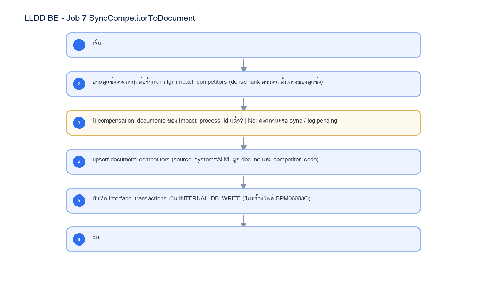

# LLDD BE - Job 7 SyncCompetitorToDocument

SBP Mall - ระบบประกันรายได้ | Low Level Design Document

## 1. Overview

| รายการ | รายละเอียด |
| --- | --- |
| Track | BE |
| Estimate | 10 ชั่วโมง |
| Owner | Aphiwit <Bank> Khammoon |
| Objective | บันทึกข้อมูลคู่แข่งเข้าเอกสาร: อ่านข้อมูลคู่แข่งล่าสุดจาก fgi_impact_competitors แล้วบันทึกเข้า document_competitors ผ่าน Document Service โดยตรง แทนการเขียนไฟล์ BPM06003O และ SFTP ไป BPM |

Common contract reference: ทุกหัวข้อ API/FE ต้องยึด LLDD-BE-API-Common-Contracts และ LLDD-FE-Integration-Contracts สำหรับ error/auth/format/pagination/action/RBAC ก่อนลงรายละเอียดเฉพาะหน้าหรือเฉพาะ endpoint

## 2. Screen / Functional Scope

- Main class/script: document.service.syncCompetitors / (internal scheduler / service)
- Phase: B
- Output: document_competitors (DB)
- Estimate: 10 ชั่วโมง
- Runbook, rerun rule, risk และ history ต้องตามข้อมูลหน้า Batch Job

## 4. Implementation Flow Diagram (Reference)



_รูปที่ 1: Implementation flow reference: LLDD BE - Job 7 SyncCompetitorToDocument_

## 5. Field, Format, and Validation

| Field / UI | Format | Validation | Behavior |
| --- | --- | --- | --- |
| กำหนดการรัน (Cron) | 30 17 7-31 * * | แก้ไขได้ | ใช้รอบเดิม แต่ปลายทางเป็น DB ภายใน |
| Target table | document_competitors | ค่าคงที่/แก้ผ่านหน้าจอไม่ได้ | upsert ด้วย doc_no / competitor_code / source_system=ALM |
| เงื่อนไขเลือกข้อมูล | งวดคู่แข่งล่าสุดต่อร้าน + forecast เริ่มต้น + ยังไม่ sync | ค่าคงที่/แก้ผ่านหน้าจอไม่ได้ | คง business rule เดิม |

## 5.1 Input / Progress / Output Contract

| Stage | Contract for implementation |
| --- | --- |
| Input | FGI_IMPACT_COMPETITOR rows linked to active impact-process records and BPM/export confirmation state. |
| Progress | query latest competitor rows, skip already-confirmed transactions, create outbound payload per competitor, upload/export, insert confirm-receive rows. |
| Output | Competitor sync payload/output for downstream workflow; confirm-receive rows prevent duplicate export. |

### 5.90 Job 7 Execution Stages

query latest competitor rows, skip already-confirmed transactions, create outbound payload per competitor, upload/export, insert confirm-receive rows.

| Order | Service step | Repository | Output / failure contract |
| --- | --- | --- | --- |
| 1 | loadLatestDocumentCompetitors | documentCompetitorRepository | คืน metrics และ throw typed error; transaction/rerun ใช้ contract ด้านล่าง |
| 2 | upsertDocumentCompetitors | documentCompetitorRepository | คืน metrics และ throw typed error; transaction/rerun ใช้ contract ด้านล่าง |
| 3 | recordInternalCompetitorSync | documentCompetitorRepository | คืน metrics และ throw typed error; transaction/rerun ใช้ contract ด้านล่าง |
| 4 | reconcileDocumentCompetitors | documentCompetitorRepository | คืน metrics และ throw typed error; transaction/rerun ใช้ contract ด้านล่าง |

### 5.91 Job 7 Run Evidence

| Evidence | Job-specific value | Acceptance |
| --- | --- | --- |
| Input identity | FGI_IMPACT_COMPETITOR rows linked to active impact-process records and BPM/export confirmation state. | snapshot input file/business key/period in run record |
| Output identity | Competitor sync payload/output for downstream workflow; confirm-receive rows prevent duplicate export. | reconcile input, success, reject and skipped counts |
| Dedup proof | UNIQUE(doc_no,competitor_code); upsert และ prune เฉพาะ source_system=ALLMAP ให้ target ตรง source ปัจจุบันโดยไม่ลบแถว USER | rerun fixture produces no duplicate target business key |
| Transaction proof | upsert + prune document_competitors และ tracking INTERNAL_DB_WRITE ใน transaction เดียวต่อ doc_no | injected failure leaves no partial committed state outside documented boundary |
| Security proof | service account ภายในมีสิทธิ์ SELECT source และ INSERT/UPDATE target เท่านั้น; ไม่มี external credential | config/log/error contains no plaintext secret |

### 5.92 Legacy Java Source Reference

| Legacy file | Line range | Responsibility to carry forward |
| --- | --- | --- |
| fcsJar/src/th/co/gosoft/fgi/main/ExportCompetitor.java | 9-20 | Legacy main entrypoint for competitor export. |
| fcsJar/src/th/co/gosoft/fgi/controller/ExportController.java | 659-760 | Query competitor data, generate file content, upload, backup, notification. |
| fcsJar/src/th/co/gosoft/fgi/dao/jdbc/ExportJdbc.java | 1596-1628 | Query latest competitor rows eligible for export. |

Line ranges refer to the legacy Java implementation under /Users/bank_mac/gosoft/java/SBP/fcsJar. Use these ranges to preserve business behavior while implementing the target Node job.

### 5.93 Target Repository and SQL Contract

| Contract | Target implementation |
| --- | --- |
| Repository | documentCompetitorRepository |
| Idempotency / dedup | UNIQUE(doc_no,competitor_code); upsert และ prune เฉพาะ source_system=ALLMAP ให้ target ตรง source ปัจจุบันโดยไม่ลบแถว USER |
| Transaction boundary | upsert + prune document_competitors และ tracking INTERNAL_DB_WRITE ใน transaction เดียวต่อ doc_no |
| Security | service account ภายในมีสิทธิ์ SELECT source และ INSERT/UPDATE target เท่านั้น; ไม่มี external credential |

#### Input / candidate query

```sql
SELECT d.doc_no, c.competitor_code, c.name_th, c.branch_th, c.opened_date, c.closed_date
FROM fgi_impact_competitors c
JOIN compensation_documents d ON d.impact_process_id = c.impact_process_id
WHERE c.period_key = :period_key;
```

#### Write / upsert query

```sql
INSERT INTO document_competitors
    (doc_no, competitor_code, name_th, branch_th, opened_date, closed_date, source_system, updated_at)
VALUES (:doc_no, :competitor_code, :name_th, :branch_th, :opened_date, :closed_date, 'ALLMAP', CURRENT_TIMESTAMP)
ON CONFLICT (doc_no, competitor_code)
DO UPDATE SET name_th = EXCLUDED.name_th, branch_th = EXCLUDED.branch_th,
              opened_date = EXCLUDED.opened_date, closed_date = EXCLUDED.closed_date,
              updated_at = CURRENT_TIMESTAMP;

DELETE FROM document_competitors dc
WHERE dc.doc_no = :doc_no
  AND dc.source_system = 'ALLMAP'
  AND NOT EXISTS (
      SELECT 1
      FROM fgi_impact_competitors src
      JOIN compensation_documents d ON d.impact_process_id = src.impact_process_id
      WHERE d.doc_no = dc.doc_no
        AND src.period_key = :period_key
        AND src.competitor_code = dc.competitor_code
  );
```

### 5.94 Target Node Implementation

โครงสร้างนี้ระบุ service/repository เฉพาะงานและต้อง implement ตาม SQL, transaction, idempotency และ security contract ด้านบน โดยทุกขั้นต้องคืน metrics สำหรับ reconcile และ run history

```js
export async function runLlddBeJob7Synccompetitortodocument(ctx, services) {
  const run = await services.jobRuns.acquire({
    jobNo: "7", period: ctx.period, triggeredBy: ctx.triggeredBy
  });

  try {
    ctx = { ...ctx, runId: run.id, repository: services.documentCompetitorRepository };
    const step1 = await services.loadLatestDocumentCompetitors(ctx, undefined);
    const step2 = await services.upsertDocumentCompetitors(ctx, step1);
    const step3 = await services.recordInternalCompetitorSync(ctx, step2);
    const step4 = await services.reconcileDocumentCompetitors(ctx, step3);
    const result = step4;
    await services.jobRuns.finish(run.id, "SUCCESS", result.metrics);
    return { runId: run.id, status: "SUCCESS", ...result };
  } catch (error) {
    await services.jobRuns.finish(run.id, "FAILED", {
      errorCode: error.code ?? "JOB_FAILED",
      errorMessage: error.message
    });
    throw error;
  }
}
```

## 6. Button / User Action Mapping

| Action | Trigger | API / Service | Expected Result |
| --- | --- | --- | --- |
| เปิดดูรายละเอียด Job | GET | GET /api/v1/jobs/7 | คืน params/metadata ล่าสุด |
| บันทึกพารามิเตอร์ | PUT | PUT /api/v1/jobs/7/params | บันทึกเฉพาะ key ที่ editable และ audit |
| สั่งรันทันที | POST | POST /api/v1/jobs/7/run | สร้าง run history สถานะ RUNNING/QUEUED |
| เปิด/ปิดใช้งาน | PUT | PUT /api/v1/jobs/7/enabled | บันทึก enabled + audit พร้อม reason |

## 7. API Contract

### GET /api/v1/jobs/7

อ่าน metadata และพารามิเตอร์ของ Job

#### Query Params

```json
{
  "jobNo": "7"
}
```

#### Request Field Schema

| Field | Type | Required | Constraint / Meaning |
| --- | --- | --- | --- |
| jobNo | string | No | UTF-8; use value domain described by endpoint purpose |

#### Response

```json
{
  "jobNo": "7",
  "name": "SyncCompetitorToDocument",
  "cron": "30 17 7-31 * *",
  "enabled": true,
  "params": [
    {
      "label": "กำหนดการรัน (Cron)",
      "value": "30 17 7-31 * *",
      "editable": true
    },
    {
      "label": "Target table",
      "value": "document_competitors",
      "editable": false
    },
    {
      "label": "เงื่อนไขเลือกข้อมูล",
      "value": "งวดคู่แข่งล่าสุดต่อร้าน + forecast เริ่มต้น + ยังไม่ sync",
      "editable": false
    }
  ]
}
```

#### Response Field Schema

| Field | Type | Required | Constraint / Meaning |
| --- | --- | --- | --- |
| jobNo | string | Yes | UTF-8; use value domain described by endpoint purpose |
| name | string | Yes | UTF-8; use value domain described by endpoint purpose |
| cron | string | Yes | UTF-8; use value domain described by endpoint purpose |
| enabled | boolean | Yes | UTF-8; use value domain described by endpoint purpose |
| params | array<object> | Yes | JSON array; element type shown in Type column |
| params[].label | string | Yes | UTF-8; use value domain described by endpoint purpose |
| params[].value | string | Yes | UTF-8; use value domain described by endpoint purpose |
| params[].editable | boolean | Yes | UTF-8; use value domain described by endpoint purpose |

### PUT /api/v1/jobs/7/params

แก้ไขพารามิเตอร์ที่อนุญาตเท่านั้น

#### Request

```json
{
  "params": {
    "cron": "30 17 7-31 * *"
  },
  "reason": "ปรับรอบรันตาม Operations"
}
```

#### Request Field Schema

| Field | Type | Required | Constraint / Meaning |
| --- | --- | --- | --- |
| params | object | Yes | JSON object; nested fields listed below |
| params.cron | string | Yes | UTF-8; use value domain described by endpoint purpose |
| reason | string | Yes | trimmed UTF-8 Thai text; required by operation/business rule |

#### Response

```json
{
  "message": "saved"
}
```

#### Response Field Schema

| Field | Type | Required | Constraint / Meaning |
| --- | --- | --- | --- |
| message | string | Yes | UTF-8; use value domain described by endpoint purpose |

### POST /api/v1/jobs/7/run

สั่งรัน manual โดย guard ไม่ให้รันซ้อน

#### Request

```json
{
  "period": "2569-07"
}
```

#### Request Field Schema

| Field | Type | Required | Constraint / Meaning |
| --- | --- | --- | --- |
| period | string | Yes | UTF-8; use value domain described by endpoint purpose |

#### Response

```json
{
  "runId": "JOB7-RUN-001",
  "status": "RUNNING"
}
```

#### Response Field Schema

| Field | Type | Required | Constraint / Meaning |
| --- | --- | --- | --- |
| runId | string | Yes | UTF-8; use value domain described by endpoint purpose |
| status | string | Yes | UTF-8; use value domain described by endpoint purpose |

### GET /api/v1/jobs/7/runs

อ่านประวัติการรันล่าสุด

#### Query Params

```json
{
  "page": 1,
  "size": 20
}
```

#### Request Field Schema

| Field | Type | Required | Constraint / Meaning |
| --- | --- | --- | --- |
| page | integer | No | >= 1; default 1 |
| size | integer | No | 1..100; default 20 |

#### Response

```json
{
  "items": [
    {
      "startedAt": "30/06/2569 17:30",
      "status": "ok"
    }
  ]
}
```

#### Response Field Schema

| Field | Type | Required | Constraint / Meaning |
| --- | --- | --- | --- |
| items | array<object> | Yes | JSON array; element type shown in Type column |
| items[].startedAt | string | Yes | ISO-8601 ค.ศ.; nullable only when type includes null |
| items[].status | string | Yes | UTF-8; use value domain described by endpoint purpose |

## 8. Reference DB Mapping (No Database Page Work)

ส่วนนี้เป็นข้อมูลอ้างอิงสำหรับการ implement API/Job เท่านั้น ไม่ใช่งานสร้างหน้า Database, ไม่ใช่งานออกแบบ DB page และไม่ถูกนับเป็น deliverable แยกของ FE/BE

| Table / Object | R/W | Usage |
| --- | --- | --- |
| fgi_impact_competitors | R | ข้อมูลคู่แข่งล่าสุดจาก Job 3 |
| compensation_documents | R | หา doc_no จาก impact_process_id |
| document_competitors | W | บันทึกคู่แข่งเข้าเอกสารโดยตรง |
| interface_transactions | W | tracking ภายใน type=INTERNAL_DB_WRITE |

## 9. Processing Flow

| Step | Description |
| --- | --- |
| 1 | เริ่ม |
| 2 | อ่านคู่แข่งงวดล่าสุดต่อร้านจาก fgi_impact_competitors (dense rank ตามงวดต้นทางของคู่แข่ง) |
| 3 | มี compensation_documents ของ impact_process_id แล้ว? \| No: คงสถานะรอ sync / log pending |
| 4 | upsert document_competitors (source_system=ALM, ผูก doc_no และ competitor_code) |
| 5 | บันทึก interface_transactions เป็น INTERNAL_DB_WRITE (ไม่สร้างไฟล์ BPM06003O) |
| 6 | จบ |

## 10. Acceptance Criteria

- อ่าน/แก้พารามิเตอร์ได้ตาม editable flag เท่านั้น
- การสั่งรันต้องตรวจ enabled และไม่มีรอบ RUNNING เดิม
- ต้องบันทึก job_run_histories และ audit_logs สำหรับทุก mutation
- DB/table mapping ใช้เป็น reference สำหรับ implement Job เท่านั้น ไม่ใช่งานสร้างหน้า Database
- รองรับ rerun rule และ risk note ตาม runbook

## 11. Developer Test Checklist

| No | Test |
| --- | --- |
| 1 | GET job detail |
| 2 | PUT params with editable key |
| 3 | PUT params locked business key must fail |
| 4 | POST run while running must fail |
| 5 | GET run histories |
| 6 | ตรวจผลกระทบตารางตาม R/W mapping reference |
