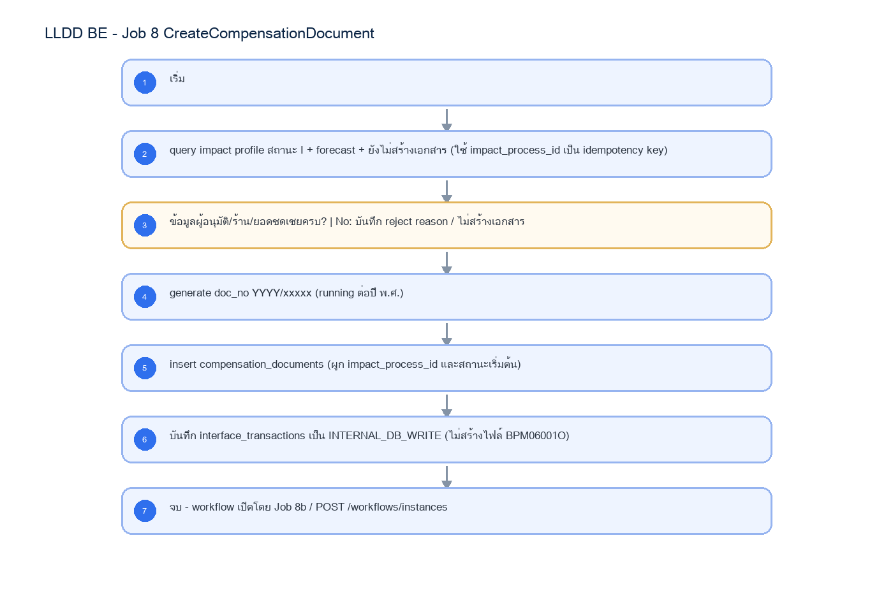

# LLDD BE - Job 8 CreateCompensationDocument

SBP Mall - ระบบประกันรายได้ | Low Level Design Document

## 1. Overview

| รายการ | รายละเอียด |
| --- | --- |
| Track | BE |
| Estimate | 13 ชั่วโมง |
| Owner | Aphiwit <Bank> Khammoon |
| Objective | สร้างเอกสารประกันรายได้อัตโนมัติ: สร้าง compensation_documents จาก impact profile และข้อมูลชดเชยในฐานข้อมูลเดียวกัน แทนการเขียนไฟล์ BPM06001O และ SFTP ไป compensateflow; ไม่เรียก workflow โดยตรง |

Common contract reference: ทุกหัวข้อ API/FE ต้องยึด LLDD-BE-API-Common-Contracts และ LLDD-FE-Integration-Contracts สำหรับ error/auth/format/pagination/action/RBAC ก่อนลงรายละเอียดเฉพาะหน้าหรือเฉพาะ endpoint

## 2. Screen / Functional Scope

- Main class/script: document.service.createFromImpact / (internal scheduler / service)
- Phase: B
- Output: compensation_documents (DB)
- Estimate: 13 ชั่วโมง
- Runbook, rerun rule, risk และ history ต้องตามข้อมูลหน้า Batch Job

## 4. Implementation Flow Diagram (Reference)



_รูปที่ 1: Implementation flow reference: LLDD BE - Job 8 CreateCompensationDocument_

## 5. Field, Format, and Validation

| Field / UI | Format | Validation | Behavior |
| --- | --- | --- | --- |
| กำหนดการรัน (Cron) | 30 17 7-31 * * | แก้ไขได้ | ใช้รอบเดิม แต่ปลายทางเป็น DB ภายใน |
| Target table | compensation_documents | ค่าคงที่/แก้ผ่านหน้าจอไม่ได้ | สร้าง doc_no YYYY/xxxxx และผูก impact_process_id |
| เงื่อนไขเลือกข้อมูล | สถานะ I + forecast + ยังไม่สร้างเอกสาร | ค่าคงที่/แก้ผ่านหน้าจอไม่ได้ | Gen Flow Gate อยู่ที่ Job 8b / Workflow Engine |
| ข้อห้ามเชิงสถาปัตยกรรม | ห้ามสร้างไฟล์ BPM06001O, ห้าม SFTP, ห้ามเรียก K2 REST | ค่าคงที่/แก้ผ่านหน้าจอไม่ได้ | ใช้ Document Service + DB transaction เท่านั้น |

## 5.1 Input / Progress / Output Contract

| Stage | Contract for implementation |
| --- | --- |
| Input | Impact-store compensation rows in initial status with workflow sequence values and no prior confirm-receive output. |
| Progress | update BPM sequence, query eligible impact-store rows, refresh not-OPT data, generate workflow payload, insert confirm-receive rows, upload/export, notify. |
| Output | Impact-store workflow create payload/output with generated sequence numbers and duplicate guard. |

### 5.90 Job 8 Execution Stages

update BPM sequence, query eligible impact-store rows, refresh not-OPT data, generate workflow payload, insert confirm-receive rows, upload/export, notify.

| Order | Service step | Repository | Output / failure contract |
| --- | --- | --- | --- |
| 1 | loadDocumentCandidates | compensationDocumentRepository | คืน metrics และ throw typed error; transaction/rerun ใช้ contract ด้านล่าง |
| 2 | allocateDocumentNumbers | compensationDocumentRepository | คืน metrics และ throw typed error; transaction/rerun ใช้ contract ด้านล่าง |
| 3 | createCompensationDocuments | compensationDocumentRepository | คืน metrics และ throw typed error; transaction/rerun ใช้ contract ด้านล่าง |
| 4 | recordDocumentCreation | compensationDocumentRepository | คืน metrics และ throw typed error; transaction/rerun ใช้ contract ด้านล่าง |

### 5.91 Job 8 Run Evidence

| Evidence | Job-specific value | Acceptance |
| --- | --- | --- |
| Input identity | Impact-store compensation rows in initial status with workflow sequence values and no prior confirm-receive output. | snapshot input file/business key/period in run record |
| Output identity | Impact-store workflow create payload/output with generated sequence numbers and duplicate guard. | reconcile input, success, reject and skipped counts |
| Dedup proof | UNIQUE(impact_process_id) และ UNIQUE(be_year,running_no); lock running number ต่อปีใน transaction; conflict ต้องคืน/อ้าง doc_no เดิม และยอมให้เลขที่จองกระโดดโดยห้าม reuse | rerun fixture produces no duplicate target business key |
| Transaction proof | lock เลขรัน + insert document + update process + INTERNAL_DB_WRITE tracking ใน transaction เดียว | injected failure leaves no partial committed state outside documented boundary |
| Security proof | internal service account เท่านั้น; ห้ามสร้างไฟล์ BPM06001O, ห้าม SFTP และห้ามเก็บ K2 credential | config/log/error contains no plaintext secret |

### 5.92 Legacy Java Source Reference

| Legacy file | Line range | Responsibility to carry forward |
| --- | --- | --- |
| fcsJar/src/th/co/gosoft/fgi/main/ExportImpactStoreFlowToBPM.java | 9-17 | Legacy main entrypoint for exporting impact-store flow data. |
| fcsJar/src/th/co/gosoft/fgi/controller/ExportController.java | 518-657 | Build impact-store BPM payload, write file, upload, backup, notification. |
| fcsJar/src/th/co/gosoft/fgi/dao/jdbc/ExportJdbc.java | 1654-1692 | Query impact-store rows eligible for workflow export. |

Line ranges refer to the legacy Java implementation under /Users/bank_mac/gosoft/java/SBP/fcsJar. Use these ranges to preserve business behavior while implementing the target Node job.

### 5.93 Target Repository and SQL Contract

| Contract | Target implementation |
| --- | --- |
| Repository | compensationDocumentRepository |
| Idempotency / dedup | UNIQUE(impact_process_id) และ UNIQUE(be_year,running_no); lock running number ต่อปีใน transaction; conflict ต้องคืน/อ้าง doc_no เดิม และยอมให้เลขที่จองกระโดดโดยห้าม reuse |
| Transaction boundary | lock เลขรัน + insert document + update process + INTERNAL_DB_WRITE tracking ใน transaction เดียว |
| Security | internal service account เท่านั้น; ห้ามสร้างไฟล์ BPM06001O, ห้าม SFTP และห้ามเก็บ K2 credential |

#### Input / candidate query

```sql
SELECT p.id AS impact_process_id, p.impacted_store_code, p.impact_month,
       SUM(COALESCE(s.adjust_compensation_amount, s.forecast_compensation_amount, 0)) AS total_compensation_amount
FROM fgi_impact_processes p
JOIN fgi_impact_stores s ON s.impact_process_id = p.id
WHERE p.process_status = 'READY_DOCUMENT'
GROUP BY p.id, p.impacted_store_code, p.impact_month;
```

#### Write / upsert query

```sql
INSERT INTO compensation_documents
    (doc_no, be_year, running_no, impact_process_id, impacted_store_code, impact_month,
     source, status_code, current_section_code, total_compensation_amount, created_by)
VALUES (:doc_no, :be_year, :running_no, :impact_process_id, :impacted_store_code, :impact_month,
        'FS', '06', '06', :total_compensation_amount, 'JOB-8')
ON CONFLICT (impact_process_id) DO NOTHING;

INSERT INTO interface_transactions
    (run_id, data_name, direction, status, impact_process_id, doc_no,
     business_key, period_key, outbox_status, purge_after, completed_at)
SELECT :run_id, 'DOCUMENT_CREATE', 'INTERNAL', 'COMPLETED', d.impact_process_id, d.doc_no,
       CAST(d.impact_process_id AS VARCHAR), d.impact_month, 'COMPLETED',
       CURRENT_TIMESTAMP + INTERVAL '365 days', CURRENT_TIMESTAMP
FROM compensation_documents d
WHERE d.impact_process_id = :impact_process_id
ON CONFLICT (data_name, direction, business_key, period_key) DO NOTHING;
```

### 5.94 Target Node Implementation

โครงสร้างนี้ระบุ service/repository เฉพาะงานและต้อง implement ตาม SQL, transaction, idempotency และ security contract ด้านบน โดยทุกขั้นต้องคืน metrics สำหรับ reconcile และ run history

```js
export async function runLlddBeJob8Createcompensationdocument(ctx, services) {
  const run = await services.jobRuns.acquire({
    jobNo: "8", period: ctx.period, triggeredBy: ctx.triggeredBy
  });

  try {
    ctx = { ...ctx, runId: run.id, repository: services.compensationDocumentRepository };
    const step1 = await services.loadDocumentCandidates(ctx, undefined);
    const step2 = await services.allocateDocumentNumbers(ctx, step1);
    const step3 = await services.createCompensationDocuments(ctx, step2);
    const step4 = await services.recordDocumentCreation(ctx, step3);
    const result = step4;
    await services.jobRuns.finish(run.id, "SUCCESS", result.metrics);
    return { runId: run.id, status: "SUCCESS", ...result };
  } catch (error) {
    await services.jobRuns.finish(run.id, "FAILED", {
      errorCode: error.code ?? "JOB_FAILED",
      errorMessage: error.message
    });
    throw error;
  }
}
```

### 5.95 Job 8 Document Number Gap and Rerun Policy

Job 8 ใช้ running number แบบ monotonic ต่อปี พ.ศ. ช่องว่างของเลขเอกสารจาก concurrent rerun หรือ ON CONFLICT เป็นพฤติกรรมที่ยอมรับได้ เพราะเลขที่มีหน้าที่รับประกัน uniqueness ไม่ได้รับประกันความต่อเนื่อง

| Case | Required behavior | Evidence / metric |
| --- | --- | --- |
| Rerun พบ impact_process_id เดิมก่อนจองเลข | คืน/ข้ามด้วย doc_no เดิมโดยไม่จอง running_no เพิ่มเมื่อ fast lookup พบข้อมูลแล้ว | duplicateExistingCount + existingDocNo |
| Concurrent worker ชน ON CONFLICT หลังจองเลข | ยอมให้ running_no ที่จองแล้วกลายเป็น gap; ห้ามลด sequence และห้ามนำเลขกลับมาใช้ | numberGapCount + conflictedImpactProcessId |
| Conflict path | อ่าน compensation_documents ด้วย impact_process_id แล้วใช้ d.doc_no เดิมสำหรับ tracking/reconcile | tracking.doc_no ตรงกับเอกสารที่ commit อยู่จริง |
| New document path | insert document และ INTERNAL_DB_WRITE tracking ใน transaction เดียว | createdCount และ trackingCount เพิ่มเท่ากัน |
| Audit/runbook | อธิบายว่าเลขอาจไม่ต่อเนื่องแต่ต้องไม่ซ้ำและตรวจสอบย้อนกลับได้ | ไม่มีขั้นตอน manual reuse หรือ renumber |

## 6. Button / User Action Mapping

| Action | Trigger | API / Service | Expected Result |
| --- | --- | --- | --- |
| เปิดดูรายละเอียด Job | GET | GET /api/v1/jobs/8 | คืน params/metadata ล่าสุด |
| บันทึกพารามิเตอร์ | PUT | PUT /api/v1/jobs/8/params | บันทึกเฉพาะ key ที่ editable และ audit |
| สั่งรันทันที | POST | POST /api/v1/jobs/8/run | สร้าง run history สถานะ RUNNING/QUEUED |
| เปิด/ปิดใช้งาน | PUT | PUT /api/v1/jobs/8/enabled | บันทึก enabled + audit พร้อม reason |

## 7. API Contract

### GET /api/v1/jobs/8

อ่าน metadata และพารามิเตอร์ของ Job

#### Query Params

```json
{
  "jobNo": "8"
}
```

#### Request Field Schema

| Field | Type | Required | Constraint / Meaning |
| --- | --- | --- | --- |
| jobNo | string | No | UTF-8; use value domain described by endpoint purpose |

#### Response

```json
{
  "jobNo": "8",
  "name": "CreateCompensationDocument",
  "cron": "30 17 7-31 * *",
  "enabled": true,
  "params": [
    {
      "label": "กำหนดการรัน (Cron)",
      "value": "30 17 7-31 * *",
      "editable": true
    },
    {
      "label": "Target table",
      "value": "compensation_documents",
      "editable": false
    },
    {
      "label": "เงื่อนไขเลือกข้อมูล",
      "value": "สถานะ I + forecast + ยังไม่สร้างเอกสาร",
      "editable": false
    },
    {
      "label": "ข้อห้ามเชิงสถาปัตยกรรม",
      "value": "ห้ามสร้างไฟล์ BPM06001O, ห้าม SFTP, ห้ามเรียก K2 REST",
      "editable": false
    }
  ]
}
```

#### Response Field Schema

| Field | Type | Required | Constraint / Meaning |
| --- | --- | --- | --- |
| jobNo | string | Yes | UTF-8; use value domain described by endpoint purpose |
| name | string | Yes | UTF-8; use value domain described by endpoint purpose |
| cron | string | Yes | UTF-8; use value domain described by endpoint purpose |
| enabled | boolean | Yes | UTF-8; use value domain described by endpoint purpose |
| params | array<object> | Yes | JSON array; element type shown in Type column |
| params[].label | string | Yes | UTF-8; use value domain described by endpoint purpose |
| params[].value | string | Yes | UTF-8; use value domain described by endpoint purpose |
| params[].editable | boolean | Yes | UTF-8; use value domain described by endpoint purpose |

### PUT /api/v1/jobs/8/params

แก้ไขพารามิเตอร์ที่อนุญาตเท่านั้น

#### Request

```json
{
  "params": {
    "cron": "30 17 7-31 * *"
  },
  "reason": "ปรับรอบรันตาม Operations"
}
```

#### Request Field Schema

| Field | Type | Required | Constraint / Meaning |
| --- | --- | --- | --- |
| params | object | Yes | JSON object; nested fields listed below |
| params.cron | string | Yes | UTF-8; use value domain described by endpoint purpose |
| reason | string | Yes | trimmed UTF-8 Thai text; required by operation/business rule |

#### Response

```json
{
  "message": "saved"
}
```

#### Response Field Schema

| Field | Type | Required | Constraint / Meaning |
| --- | --- | --- | --- |
| message | string | Yes | UTF-8; use value domain described by endpoint purpose |

### POST /api/v1/jobs/8/run

สั่งรัน manual โดย guard ไม่ให้รันซ้อน

#### Request

```json
{
  "period": "2569-07"
}
```

#### Request Field Schema

| Field | Type | Required | Constraint / Meaning |
| --- | --- | --- | --- |
| period | string | Yes | UTF-8; use value domain described by endpoint purpose |

#### Response

```json
{
  "runId": "JOB8-RUN-001",
  "status": "RUNNING"
}
```

#### Response Field Schema

| Field | Type | Required | Constraint / Meaning |
| --- | --- | --- | --- |
| runId | string | Yes | UTF-8; use value domain described by endpoint purpose |
| status | string | Yes | UTF-8; use value domain described by endpoint purpose |

### GET /api/v1/jobs/8/runs

อ่านประวัติการรันล่าสุด

#### Query Params

```json
{
  "page": 1,
  "size": 20
}
```

#### Request Field Schema

| Field | Type | Required | Constraint / Meaning |
| --- | --- | --- | --- |
| page | integer | No | >= 1; default 1 |
| size | integer | No | 1..100; default 20 |

#### Response

```json
{
  "items": [
    {
      "startedAt": "30/06/2569 17:30",
      "status": "ok"
    }
  ]
}
```

#### Response Field Schema

| Field | Type | Required | Constraint / Meaning |
| --- | --- | --- | --- |
| items | array<object> | Yes | JSON array; element type shown in Type column |
| items[].startedAt | string | Yes | ISO-8601 ค.ศ.; nullable only when type includes null |
| items[].status | string | Yes | UTF-8; use value domain described by endpoint purpose |

## 8. Reference DB Mapping (No Database Page Work)

ส่วนนี้เป็นข้อมูลอ้างอิงสำหรับการ implement API/Job เท่านั้น ไม่ใช่งานสร้างหน้า Database, ไม่ใช่งานออกแบบ DB page และไม่ถูกนับเป็น deliverable แยกของ FE/BE

| Table / Object | R/W | Usage |
| --- | --- | --- |
| fgi_impact_stores | R/W | อ่าน candidate และอัปเดตสถานะสร้างเอกสาร |
| fgi_impact_processes | R | hub รอบชดเชย |
| compensation_documents | W | สร้างหัวเอกสารแทนไฟล์ BPM06001O |
| interface_transactions | W | tracking ภายใน type=INTERNAL_DB_WRITE |

## 9. Processing Flow

| Step | Description |
| --- | --- |
| 1 | เริ่ม |
| 2 | query impact profile สถานะ I + forecast + ยังไม่สร้างเอกสาร (ใช้ impact_process_id เป็น idempotency key) |
| 3 | ข้อมูลผู้อนุมัติ/ร้าน/ยอดชดเชยครบ? \| No: บันทึก reject reason / ไม่สร้างเอกสาร |
| 4 | generate doc_no YYYY/xxxxx (running ต่อปี พ.ศ.) |
| 5 | insert compensation_documents (ผูก impact_process_id และสถานะเริ่มต้น) |
| 6 | บันทึก interface_transactions เป็น INTERNAL_DB_WRITE (ไม่สร้างไฟล์ BPM06001O) |
| 7 | จบ - workflow เปิดโดย Job 8b / POST /workflows/instances |

## 10. Acceptance Criteria

- อ่าน/แก้พารามิเตอร์ได้ตาม editable flag เท่านั้น
- การสั่งรันต้องตรวจ enabled และไม่มีรอบ RUNNING เดิม
- ต้องบันทึก job_run_histories และ audit_logs สำหรับทุก mutation
- DB/table mapping ใช้เป็น reference สำหรับ implement Job เท่านั้น ไม่ใช่งานสร้างหน้า Database
- รองรับ rerun rule และ risk note ตาม runbook

## 11. Developer Test Checklist

| No | Test |
| --- | --- |
| 1 | GET job detail |
| 2 | PUT params with editable key |
| 3 | PUT params locked business key must fail |
| 4 | POST run while running must fail |
| 5 | GET run histories |
| 6 | ตรวจผลกระทบตารางตาม R/W mapping reference |
