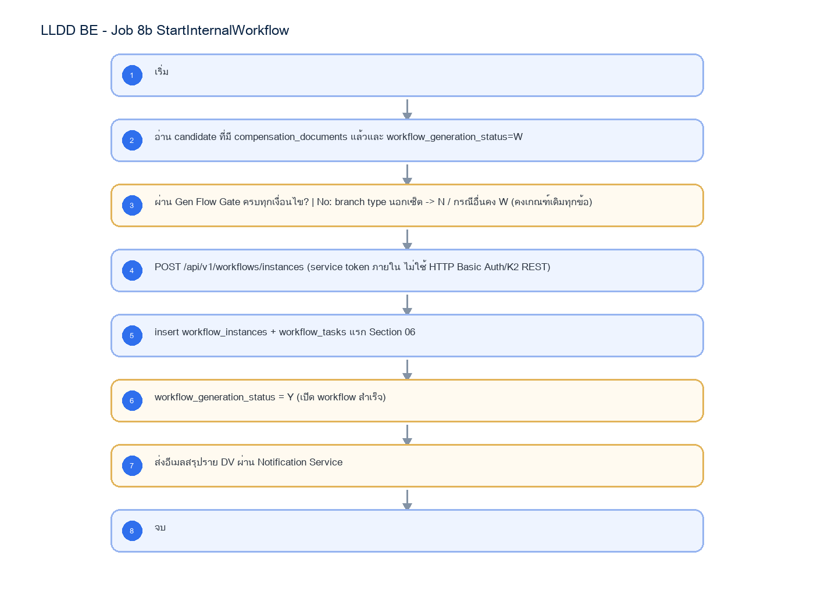

# LLDD BE - Job 8b StartInternalWorkflow

SBP Mall - ระบบประกันรายได้ | Low Level Design Document

## 1. Overview

| รายการ | รายละเอียด |
| --- | --- |
| Track | BE |
| Estimate | 10 ชั่วโมง |
| Owner | Aphiwit <Bank> Khammoon |
| Objective | เปิด Workflow ภายใน: คัดรายการที่ผ่าน Gen Flow Gate แล้วเรียก Workflow Engine ภายในผ่าน POST /api/v1/workflows/instances แทน K2 REST StartInstance; เกณฑ์ W/Y/N เดิมยังคงใช้สำหรับ reconcile |

Common contract reference: ทุกหัวข้อ API/FE ต้องยึด LLDD-BE-API-Common-Contracts และ LLDD-FE-Integration-Contracts สำหรับ error/auth/format/pagination/action/RBAC ก่อนลงรายละเอียดเฉพาะหน้าหรือเฉพาะ endpoint

## 2. Screen / Functional Scope

- Main class/script: workflow.service.startFromImpact / (internal scheduler / service token)
- Phase: B
- Output: workflow_instances / workflow_tasks (DB)
- Estimate: 10 ชั่วโมง
- Runbook, rerun rule, risk และ history ต้องตามข้อมูลหน้า Batch Job
- Depends on LLDD-BE-API-Workflow-Instances; Job 8b เรียก Workflow Engine ภายในและไม่ duplicate Gen Flow Gate logic

## 4. Implementation Flow Diagram (Reference)



_รูปที่ 1: Implementation flow reference: LLDD BE - Job 8b StartInternalWorkflow_

## 5. Field, Format, and Validation

| Field / UI | Format | Validation | Behavior |
| --- | --- | --- | --- |
| Scheduler | หลัง Job 8 สร้างเอกสารสำเร็จ; manual rerun ตาม period | แก้ไขได้ | แยกเพื่อ rerun ได้อิสระ; Operations ตรวจ deployment schedule/queue เท่านั้น |
| Workflow API | POST /api/v1/workflows/instances | ค่าคงที่/แก้ผ่านหน้าจอไม่ได้ | internal service token; ไม่ใช่ K2 REST |
| เกณฑ์ Growth Rate | growth_rate_diff <= -10 | ค่าคงที่/แก้ผ่านหน้าจอไม่ได้ | คง business rule เดิม |
| Branch Type ผ่าน Gate | FAM, FB1, FC1, FB2, FVB, FVC | ค่าคงที่/แก้ผ่านหน้าจอไม่ได้ | นอกเซ็ตนี้ตั้ง N |
| เงื่อนไข Gate อื่น | workflow_generation_status=W · DV ไม่ว่าง · juristic ต่างกัน · sales_status in {Y,N} | ค่าคงที่/แก้ผ่านหน้าจอไม่ได้ |  |

## 5.1 Input / Progress / Output Contract

| Stage | Contract for implementation |
| --- | --- |
| Input | Impact-store rows waiting to start workflow plus generated workflow/document identifiers. |
| Progress | select waiting rows, start workflow instance, update generated-flow flag per transaction, log success/failure. |
| Output | Workflow instances started and source rows marked generated; failed rows remain rerunnable with error detail. |

### 5.90 Job 8b Execution Stages

select waiting rows, start workflow instance, update generated-flow flag per transaction, log success/failure.

| Order | Service step | Repository | Output / failure contract |
| --- | --- | --- | --- |
| 1 | lockWorkflowCandidates | workflowRepository | คืน metrics และ throw typed error; transaction/rerun ใช้ contract ด้านล่าง |
| 2 | evaluateGenerationGate | workflowRepository | คืน metrics และ throw typed error; transaction/rerun ใช้ contract ด้านล่าง |
| 3 | startInternalWorkflows | workflowRepository | คืน metrics และ throw typed error; transaction/rerun ใช้ contract ด้านล่าง |
| 4 | notifyWorkflowOwners | workflowRepository | คืน metrics และ throw typed error; transaction/rerun ใช้ contract ด้านล่าง |

### 5.91 Job 8b Run Evidence

| Evidence | Job-specific value | Acceptance |
| --- | --- | --- |
| Input identity | Impact-store rows waiting to start workflow plus generated workflow/document identifiers. | snapshot input file/business key/period in run record |
| Output identity | Workflow instances started and source rows marked generated; failed rows remain rerunnable with error detail. | reconcile input, success, reject and skipped counts |
| Dedup proof | UNIQUE(workflow_instances.doc_no) และ OPEN-task partial unique index; instance เดิมให้ skip | rerun fixture produces no duplicate target business key |
| Transaction proof | lock process + evaluate gate + branch N/W/Y; เฉพาะ Y จึง create instance/task และ W→Y ใน transaction เดียว, N ต้อง persist ถาวร, W คงเดิมเพื่อ rerun | injected failure leaves no partial committed state outside documented boundary |
| Security proof | internal service token จาก workload identity/secretRef; ห้าม Basic Auth หรือ K2 REST credential เดิม | config/log/error contains no plaintext secret |

### 5.92 Legacy Java Source Reference

| Legacy file | Line range | Responsibility to carry forward |
| --- | --- | --- |
| fcsJar/src/th/co/gosoft/fgi/main/StartK2WorkFlow.java | 16-51 | Legacy main entrypoint for starting K2 workflow. |
| fcsJar/src/th/co/gosoft/fgi/dao/jdbc/StartFlowJdbc.java | 17-173 | Select rows for workflow start and update generated-flow flags. |

Line ranges refer to the legacy Java implementation under /Users/bank_mac/gosoft/java/SBP/fcsJar. Use these ranges to preserve business behavior while implementing the target Node job.

### 5.93 Target Repository and SQL Contract

| Contract | Target implementation |
| --- | --- |
| Repository | workflowRepository |
| Idempotency / dedup | UNIQUE(workflow_instances.doc_no) และ OPEN-task partial unique index; instance เดิมให้ skip |
| Transaction boundary | lock process + evaluate gate + branch N/W/Y; เฉพาะ Y จึง create instance/task และ W→Y ใน transaction เดียว, N ต้อง persist ถาวร, W คงเดิมเพื่อ rerun |
| Security | internal service token จาก workload identity/secretRef; ห้าม Basic Auth หรือ K2 REST credential เดิม |

#### Input / candidate query

```sql
WITH locked_process AS (
    SELECT p.id
    FROM fgi_impact_processes p
    JOIN compensation_documents d ON d.impact_process_id = p.id
    WHERE p.workflow_generation_status = 'W'
      AND NOT EXISTS (SELECT 1 FROM workflow_instances w WHERE w.doc_no = d.doc_no)
    ORDER BY p.id
    FOR UPDATE OF p SKIP LOCKED
), gate AS (
    SELECT p.id AS impact_process_id, d.doc_no, d.current_section_code,
           CASE
             WHEN BOOL_OR(ns.branch_type IS NULL OR ns.branch_type NOT IN ('FAM','FB1','FC1','FB2','FVB','FVC')) THEN 'N'
             WHEN BOOL_OR(pair.distance_km > CASE
                    WHEN impacted.region_code = ANY(:bangkok_metro_region_codes) THEN 1.000
                    ELSE 2.000
                  END) THEN 'N'
             WHEN ist.opt_dv_user_id IS NULL OR BTRIM(ist.opt_dv_user_id) = '' THEN 'W'
             WHEN impacted.juristic_name IS NULL OR BOOL_OR(ns.juristic_name IS NULL) THEN 'W'
             WHEN BOOL_OR(impacted.juristic_name = ns.juristic_name) THEN 'W'
             WHEN ss.growth_rate_diff IS NULL OR ss.growth_rate_diff > -10 THEN 'W'
             WHEN ss.sales_status NOT IN ('Y','N') THEN 'W'
             ELSE 'Y'
           END AS gate_decision
    FROM locked_process lp
    JOIN fgi_impact_processes p ON p.id = lp.id
    JOIN compensation_documents d ON d.impact_process_id = p.id
    JOIN impacted_stores ist ON ist.store_code = p.impacted_store_code
    JOIN stores impacted ON impacted.store_code = p.impacted_store_code
    JOIN fgi_impact_stores pair ON pair.impact_process_id = p.id
    JOIN stores ns ON ns.store_code = pair.new_store_code
    LEFT JOIN fgi_impact_sales_summaries ss ON ss.impact_process_id = p.id
    GROUP BY p.id, d.doc_no, d.current_section_code, ist.opt_dv_user_id,
             impacted.juristic_name, ss.growth_rate_diff, ss.sales_status
)
SELECT * FROM gate;
```

#### Write / upsert query

```sql
UPDATE fgi_impact_processes
SET workflow_generation_status = 'N', updated_at = CURRENT_TIMESTAMP
WHERE id = :impact_process_id
  AND workflow_generation_status = 'W'
  AND :gate_decision = 'N';

INSERT INTO workflow_instances (instance_id, doc_no, instance_status, started_at, started_by)
SELECT :instance_id, :doc_no, 'ACTIVE', CURRENT_TIMESTAMP, 'JOB-8B'
WHERE :gate_decision = 'Y';
INSERT INTO workflow_tasks (instance_id, doc_no, section_code, task_status, opened_at)
SELECT :instance_id, :doc_no, '06', 'OPEN', CURRENT_TIMESTAMP
WHERE :gate_decision = 'Y';
UPDATE fgi_impact_processes
SET workflow_generation_status = 'Y', updated_at = CURRENT_TIMESTAMP
WHERE id = :impact_process_id
  AND workflow_generation_status = 'W'
  AND :gate_decision = 'Y';

-- gate_decision='W' ไม่เปลี่ยนสถานะ; บันทึก reason ลง job_run_histories เพื่อ rerun.
```

### 5.94 Target Node Implementation

โครงสร้างนี้ระบุ service/repository เฉพาะงานและต้อง implement ตาม SQL, transaction, idempotency และ security contract ด้านบน โดยทุกขั้นต้องคืน metrics สำหรับ reconcile และ run history

```js
export async function runLlddBeJob8BStartinternalworkflow(ctx, services) {
  const run = await services.jobRuns.acquire({
    jobNo: "8b", period: ctx.period, triggeredBy: ctx.triggeredBy
  });

  try {
    ctx = { ...ctx, runId: run.id, repository: services.workflowRepository };
    const step1 = await services.lockWorkflowCandidates(ctx, undefined);
    const step2 = await services.evaluateGenerationGate(ctx, step1);
    const step3 = await services.startInternalWorkflows(ctx, step2);
    const step4 = await services.notifyWorkflowOwners(ctx, step3);
    const result = step4;
    await services.jobRuns.finish(run.id, "SUCCESS", result.metrics);
    return { runId: run.id, status: "SUCCESS", ...result };
  } catch (error) {
    await services.jobRuns.finish(run.id, "FAILED", {
      errorCode: error.code ?? "JOB_FAILED",
      errorMessage: error.message
    });
    throw error;
  }
}
```

## 6. Button / User Action Mapping

| Action | Trigger | API / Service | Expected Result |
| --- | --- | --- | --- |
| เปิดดูรายละเอียด Job | GET | GET /api/v1/jobs/8b | คืน params/metadata ล่าสุด |
| บันทึกพารามิเตอร์ | PUT | PUT /api/v1/jobs/8b/params | บันทึกเฉพาะ key ที่ editable และ audit |
| สั่งรันทันที | POST | POST /api/v1/jobs/8b/run | สร้าง run history สถานะ RUNNING/QUEUED |
| เปิด/ปิดใช้งาน | PUT | PUT /api/v1/jobs/8b/enabled | บันทึก enabled + audit พร้อม reason |

## 7. API Contract

### GET /api/v1/jobs/8b

อ่าน metadata และพารามิเตอร์ของ Job

#### Query Params

```json
{
  "jobNo": "8b"
}
```

#### Request Field Schema

| Field | Type | Required | Constraint / Meaning |
| --- | --- | --- | --- |
| jobNo | string | No | UTF-8; use value domain described by endpoint purpose |

#### Response

```json
{
  "jobNo": "8b",
  "name": "StartInternalWorkflow",
  "cron": "after-job-8",
  "enabled": true,
  "params": [
    {
      "label": "Scheduler",
      "value": "หลัง Job 8 สร้างเอกสารสำเร็จ; manual rerun ตาม period",
      "editable": true
    },
    {
      "label": "Workflow API",
      "value": "POST /api/v1/workflows/instances",
      "editable": false
    },
    {
      "label": "เกณฑ์ Growth Rate",
      "value": "growth_rate_diff <= -10",
      "editable": false
    },
    {
      "label": "Branch Type ผ่าน Gate",
      "value": "FAM, FB1, FC1, FB2, FVB, FVC",
      "editable": false
    }
  ]
}
```

#### Response Field Schema

| Field | Type | Required | Constraint / Meaning |
| --- | --- | --- | --- |
| jobNo | string | Yes | UTF-8; use value domain described by endpoint purpose |
| name | string | Yes | UTF-8; use value domain described by endpoint purpose |
| cron | string | Yes | UTF-8; use value domain described by endpoint purpose |
| enabled | boolean | Yes | UTF-8; use value domain described by endpoint purpose |
| params | array<object> | Yes | JSON array; element type shown in Type column |
| params[].label | string | Yes | UTF-8; use value domain described by endpoint purpose |
| params[].value | string | Yes | UTF-8; use value domain described by endpoint purpose |
| params[].editable | boolean | Yes | UTF-8; use value domain described by endpoint purpose |

### PUT /api/v1/jobs/8b/params

แก้ไขพารามิเตอร์ที่อนุญาตเท่านั้น

#### Request

```json
{
  "params": {
    "cron": "after-job-8"
  },
  "reason": "ปรับรอบรันตาม Operations"
}
```

#### Request Field Schema

| Field | Type | Required | Constraint / Meaning |
| --- | --- | --- | --- |
| params | object | Yes | JSON object; nested fields listed below |
| params.cron | string | Yes | UTF-8; use value domain described by endpoint purpose |
| reason | string | Yes | trimmed UTF-8 Thai text; required by operation/business rule |

#### Response

```json
{
  "message": "saved"
}
```

#### Response Field Schema

| Field | Type | Required | Constraint / Meaning |
| --- | --- | --- | --- |
| message | string | Yes | UTF-8; use value domain described by endpoint purpose |

### POST /api/v1/jobs/8b/run

สั่งรัน manual โดย guard ไม่ให้รันซ้อน

#### Request

```json
{
  "period": "2569-07"
}
```

#### Request Field Schema

| Field | Type | Required | Constraint / Meaning |
| --- | --- | --- | --- |
| period | string | Yes | UTF-8; use value domain described by endpoint purpose |

#### Response

```json
{
  "runId": "JOB8b-RUN-001",
  "status": "RUNNING"
}
```

#### Response Field Schema

| Field | Type | Required | Constraint / Meaning |
| --- | --- | --- | --- |
| runId | string | Yes | UTF-8; use value domain described by endpoint purpose |
| status | string | Yes | UTF-8; use value domain described by endpoint purpose |

### GET /api/v1/jobs/8b/runs

อ่านประวัติการรันล่าสุด

#### Query Params

```json
{
  "page": 1,
  "size": 20
}
```

#### Request Field Schema

| Field | Type | Required | Constraint / Meaning |
| --- | --- | --- | --- |
| page | integer | No | >= 1; default 1 |
| size | integer | No | 1..100; default 20 |

#### Response

```json
{
  "items": [
    {
      "startedAt": "30/06/2569 18:00",
      "status": "ok"
    }
  ]
}
```

#### Response Field Schema

| Field | Type | Required | Constraint / Meaning |
| --- | --- | --- | --- |
| items | array<object> | Yes | JSON array; element type shown in Type column |
| items[].startedAt | string | Yes | ISO-8601 ค.ศ.; nullable only when type includes null |
| items[].status | string | Yes | UTF-8; use value domain described by endpoint purpose |

## 8. Reference DB Mapping (No Database Page Work)

ส่วนนี้เป็นข้อมูลอ้างอิงสำหรับการ implement API/Job เท่านั้น ไม่ใช่งานสร้างหน้า Database, ไม่ใช่งานออกแบบ DB page และไม่ถูกนับเป็น deliverable แยกของ FE/BE

| Table / Object | R/W | Usage |
| --- | --- | --- |
| fgi_impact_stores | R/W | อ่าน candidate + เขียน W/Y/N |
| compensation_documents | R/W | ยืนยันเอกสารจาก Job 8 หรือสร้างถ้ายังไม่มีตาม idempotency |
| workflow_instances | W | เปิด instance ภายใน |
| workflow_tasks | W | สร้าง task แรก Section 06 |
| status_email_rules | R | ผู้รับอีเมลตามสถานะ |

## 9. Processing Flow

| Step | Description |
| --- | --- |
| 1 | เริ่ม |
| 2 | อ่าน candidate ที่มี compensation_documents แล้วและ workflow_generation_status=W |
| 3 | ผ่าน Gen Flow Gate ครบทุกเงื่อนไข? \| No: branch type นอกเซ็ต -> N / กรณีอื่นคง W (คงเกณฑ์เดิมทุกข้อ) |
| 4 | POST /api/v1/workflows/instances (service token ภายใน ไม่ใช้ HTTP Basic Auth/K2 REST) |
| 5 | insert workflow_instances + workflow_tasks แรก Section 06 |
| 6 | workflow_generation_status = Y (เปิด workflow สำเร็จ) |
| 7 | ส่งอีเมลสรุปราย DV ผ่าน Notification Service |
| 8 | จบ |

## 10. Acceptance Criteria

- อ่าน/แก้พารามิเตอร์ได้ตาม editable flag เท่านั้น
- การสั่งรันต้องตรวจ enabled และไม่มีรอบ RUNNING เดิม
- ต้องบันทึก job_run_histories และ audit_logs สำหรับทุก mutation
- DB/table mapping ใช้เป็น reference สำหรับ implement Job เท่านั้น ไม่ใช่งานสร้างหน้า Database
- รองรับ rerun rule และ risk note ตาม runbook

## 11. Developer Test Checklist

| No | Test |
| --- | --- |
| 1 | GET job detail |
| 2 | PUT params with editable key |
| 3 | PUT params locked business key must fail |
| 4 | POST run while running must fail |
| 5 | GET run histories |
| 6 | ตรวจผลกระทบตารางตาม R/W mapping reference |
