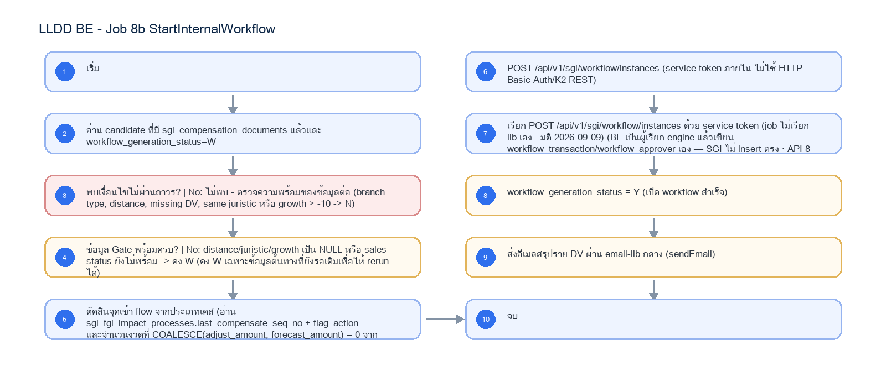

# LLDD BE - Job 8b StartInternalWorkflow

SBP Mall - ระบบประกันรายได้ | Low Level Design Document

## 1. Overview

| รายการ | รายละเอียด |
| --- | --- |
| Track | BE |
| Estimate | **29 ชั่วโมง** = implementation 22 + unit test 7 (30%) |
| Owner | Aphiwit <Bank> Khammoon |
| Target repository | `SBP/srm-sps-spsap-store-backend` (NestJS + TypeORM · schema `sps_store`) — batch runner ฝั่ง backend **ไม่ผ่าน BFF** · cron/พารามิเตอร์อยู่ใน backend config (env/config file) |
| Objective | เปิด Workflow ภายใน: คัดรายการที่ผ่าน Gen Flow Gate แล้วเรียก Workflow Engine ภายในผ่าน POST /api/v1/sbpgi/workflow/instances แทน K2 REST StartInstance; เกณฑ์ W/Y/N เดิมยังคงใช้สำหรับ reconcile |

Common contract reference: ทุกหัวข้อ API/FE ต้องยึด LLDD-BE-API-Common-Contracts และ LLDD-FE-Integration-Contracts สำหรับ error/auth/format/pagination/action/RBAC ก่อนลงรายละเอียดเฉพาะหน้าหรือเฉพาะ endpoint

## 2. Screen / Functional Scope

- Main class/script: workflow.service.startFromImpact / (internal scheduler / service token)
- Phase: D
- Output: sps_store.workflow_transaction / workflow_approver ของ @srm/glb-workflow (ไม่ใช่ตารางของ SBPGI)
- Estimate: 22 ชั่วโมง
- พารามิเตอร์/cron อ่านจาก backend config (config file/env) — ไม่มีตาราง job_configs และไม่มีหน้าจอควบคุม (หน้า Flow Batch Job ในกลุ่มเมนู Flow เหลือแค่ Flowchart + Database ที่ใช้ · 2026-08-06)
- Runbook, rerun rule, risk และ history ตามเอกสาร Batch v4.0 · ผลการรันเขียน application log แบบ structured
- Depends on LLDD-BE-API-Workflow-Instances; Job 8b เรียก Workflow Engine ภายในและไม่ duplicate Gen Flow Gate logic

## 3. Screenshot Reference

ไม่มีภาพหน้าจอสำหรับหัวข้อนี้ — เป็นเอกสารฝั่ง Backend/Batch ที่ไม่มี UI (ภาพหน้าจอทั้งหมดอยู่ในเอกสารชุด FE)

## 4. Implementation Flow Diagram (Reference)



_รูปที่ 1: Implementation flow reference: LLDD BE - Job 8b StartInternalWorkflow_

## 5. Field, Format, and Validation

| Field / UI | Format | Validation | Behavior |
| --- | --- | --- | --- |
| Scheduler | หลัง Job 8 สร้างเอกสารสำเร็จ; manual rerun ตาม period | แก้ไขได้ | แยกเพื่อ rerun ได้อิสระ; Operations ตรวจ deployment schedule/queue เท่านั้น |
| Workflow API | POST /api/v1/sbpgi/workflow/instances | ค่าคงที่/แก้ผ่านหน้าจอไม่ได้ | internal service token; ไม่ใช่ K2 REST |
| เกณฑ์ Growth Rate | growth_rate_diff <= -10 | ค่าคงที่/แก้ผ่านหน้าจอไม่ได้ | คง business rule เดิม |
| Branch Type ผ่าน Gate | FAM, FB1, FC1, FB2, FVB, FVC | ค่าคงที่/แก้ผ่านหน้าจอไม่ได้ | นอกเซ็ตหรือระยะทางเกินเกณฑ์ให้ตั้ง N |
| เงื่อนไข Gate อื่น | workflow_generation_status=W · DV ไม่ว่าง · juristic ต่างกัน · sales_status in {Y,N} | ค่าคงที่/แก้ผ่านหน้าจอไม่ได้ | DV หาย, นิติบุคคลเดียวกัน หรือ growth ไม่ถึงเกณฑ์เป็น N; distance/juristic/growth/sales status ที่ยังไม่มีค่าเท่านั้นจึงคง W |

## 4a. จุดเข้า flow ตามประเภทเคส — Job 8b เป็นคนตัดสินว่าเปิด workflow ที่ state ไหน

ผัง To-Be 12/02/2026 กำหนดว่า **เอกสารไม่ได้เริ่มที่ state 06 เสมอไป** · Job 8b ต้องอ่านข้อมูลรอบชดเชย (คอลัมน์ที่รับเข้าโครง 2026-08-21 · gap F8) แล้วเลือก state เริ่มต้นก่อนเรียก initializeWorkflow/addPreApprover

| เคส | เงื่อนไขที่ Job 8b ต้องอ่าน | เปิด workflow ที่ state | ผู้รับผิดชอบขั้นแรก |
| --- | --- | --- | --- |
| ① เปิดเรื่องใหม่ | fgi_impact_processes.last_compensate_seq_no = 1 | **06** | group ฝ่าย SBP DSA (ปกติ) |
| ② ชดเชยต่อเนื่อง | last_compensate_seq_no > 1 และ flag_action = 'Y' | **08** (Auto Approve — ข้ามขั้น 06) | **เจ้าหน้าที่ SBP DSA คนเดิม** ผ่าน addPreApprover |
| ③ ยอดชดเชย 0 ติดกัน <= 3 เดือน | COALESCE(adjust_amount, forecast_amount) = 0 ใน fgi_impact_compensations งวดที่ 1-3 | **01** (ข้ามทั้ง 06 และ 08) | group หน่วยงานส่งเสริมธุรกิจฯ |
| ③ ยอดชดเชย 0 ติดกัน > 3 เดือน | งวดที่ 4 ขึ้นไป | **ไม่เปิด workflow** — ปิดเอกสารเป็นเสร็จสิ้น (หยุดชดเชยประกันรายได้) | - |

**ที่มาของค่าที่ใช้ตัดสิน** — ทุกค่าอยู่ในโซน A (FGI/FCS) ที่ batch เขียนไว้ก่อนเปิดเอกสาร ไม่ใช่ค่าที่ Job 8b คำนวณเอง

| ค่าที่ใช้ในเงื่อนไข | ระบบเดิม (Oracle FCS_FRN) | ตาราง SBPGI | คอลัมน์ · ชนิด | เขียนโดย |
| --- | --- | --- | --- | --- |
| `LAST_COMPENSATE_SEQ_NO` | `FGI_IMPACT_STORE_ON_PROCESS.LAST_COMPENSATE_SEQ_NO` | `fgi_impact_processes` | `last_compensate_seq_no` · INTEGER | Job 2 — `ImportJdbc` (`SEQ_NO + 1` เมื่อเป็นรอบต่อเนื่อง) |
| `FLAG_ACTION` | `FGI_IMPACT_STORE_ON_PROCESS.FLAG_ACTION` (โดเมน Y/W/N) | `fgi_impact_processes` | `flag_action` · CHAR(1) | Job 2 เขียน `'Y'` · Job 6 ปิดรอบ `Y->N` / พัก `Y->W` |
| `DATASOURCE` | `FGI_IMPACT_STORE_ON_PROCESS.DATASOURCE` (เดิมมี ALM/STA/HRS) | `fgi_impact_processes` | `datasource` · VARCHAR(5) | Job 2/3 = `ALM` · Job 5 = `STA` · **`PRO` เชิงรุก / `REA` เชิงรับ = คนคีย์** (รหัสใหม่ 2026-08-24) |
| `forecast` | `FGI_IMPACT_STORE_COMPENSATE.COMPENSATE_FORECAST` | `fgi_impact_compensations` | `forecast_amount` · NUMERIC(14,2) | Job 5 — นำเข้ายอดจาก IAS/MIS |
| `adjust` | `FGI_IMPACT_STORE_COMPENSATE.COMPENSATE_ADJUST` | `fgi_impact_compensations` | `adjust_amount` · NUMERIC(14,2) | เจ้าหน้าที่ SBP DSA ปรับยอดในเอกสาร |

> ยอดที่ใช้จริงทุกที่คือ `COALESCE(adjust_amount, forecast_amount)` — ค่าที่คนปรับชนะค่าที่ระบบคำนวณเสมอ  
> `datasource` ไม่ได้เปลี่ยน state เริ่มต้นของ workflow — มันบอกแค่ว่า **ใครคีย์ข้อมูล** (`ALM`/`STA` = ระบบส่งงานมาให้เลือก · `PRO`/`REA` = เจ้าของงานคีย์เอง · SDD GI สไลด์ 17 · 47 · 49)  
> ⚠️ ทั้งสองตารางเป็น gap **F8/F1** ที่เพิ่งรับเข้าโครงเมื่อ 2026-08-21 — ต้อง migrate ครบก่อน Job 8b จึงทำงานตามผัง To-Be ได้

```sql
-- ตัดสินประเภทเคสก่อนเปิด workflow (Job 8b)
SELECT p.last_compensate_seq_no,
       p.flag_action,
       (SELECT COUNT(*) FROM fgi_impact_compensations c
         WHERE c.impact_process_id = p.id
           AND COALESCE(c.adjust_amount, c.forecast_amount) = 0
           AND c.compensate_seq = p.last_compensate_seq) AS zero_months
FROM fgi_impact_processes p
WHERE p.id = :impactProcessId;
-- zero_months >= 4            -> ไม่เปิด workflow · ปิดเอกสารเป็น 99 พร้อม result = หยุดชดเชยประกันรายได้
-- zero_months BETWEEN 1 AND 3 -> initializeWorkflow แล้ว addPreApprover ที่ state 01
-- seq_no > 1 AND flag_action='Y' -> state 08 + approver = เจ้าหน้าที่คนเดิม (จาก consideration_logs รอบก่อน)
-- นอกนั้น                      -> state 06 ตามปกติ
```

**ทุกเส้นทางอัตโนมัติต้องบันทึกลง `consideration_logs` ด้วยผู้ดำเนินการ `SYSTEM`** เพื่อไม่ให้ timeline ของเอกสารขาดช่วง · รายละเอียดกติกาเต็มดู `workflow.md` หัวข้อจุดเข้า flow ตามประเภทเคส

## 4b. ข้อค้างที่ต้องยืนยันก่อนเขียนโค้ด (workflow engine)

✅ **ชื่อ function ของ engine — ยึด LLDD ของ lib (ปิดข้อค้าง 2026-08-14)** · API จริงคือ 8 ตัวตามชีต `Detail` ของ `SBP/TSM-SRM-LLDD SBP workflow 1.2.xlsx` (เอกสารของ lib เอง): `initializeWorkflow` · `eventWorkflow` · `getPermissionEvents` · `getHistory` · `getTransaction` · `getPendingFlowByUser` · `getWorkflowsByUser` · `addPreApprover` · ชื่อที่เคยขัดกันไม่ใช่ชื่อ API — *Trigger Event* เป็นชื่อหัวข้อขั้นตอนภายใน `eventWorkflow` และ `*UseCase` เป็น class ที่ store-backend ห่อไว้ใช้เอง (ดู `LLDD-BE-Workflow-Engine-Definition` หัวข้อ 5.3)

| ข้อค้าง | ข้อเท็จจริงที่ตรวจแล้ว | ผลต่อ Job 8b | สถานะ |
| --- | --- | --- | --- |
| DP-1 · `referenceId` ของ workflow ✅ ปิดแล้ว 2026-08-17 | ระบบเดิม (cooperation-request · inform-evaluate) ใช้ surrogate id ทุกจุด | ค่าที่ส่งเข้า initialize และคีย์ที่ใช้เช็คซ้ำเปลี่ยนตามข้อนี้ | ✅ ปิดแล้ว 2026-08-17 — เลือก surrogate id (`compensation_documents.id` ส่งเป็น string) ตามที่ cooperation-request / inform-evaluate ทำจริง |
| DP-2 · `sps_store.workflow_transaction` ไม่มี PK/index | 19,283 แถว · ไม่มีทั้ง PK และ index (`SBP/db-schema-sps_store.md`) ต่างจาก `sps_auth` ที่มี PK ปกติ | กันซ้ำด้วย DB constraint ไม่ได้ ต้องกันที่ application · query ตาม reference_id เป็น seq-scan | ยังไม่ตัดสิน — ขอ sign-off เพิ่ม index กับทีมเจ้าของ library หรือยอมรับสภาพ |
| schema ของ engine | engine ตัวจริงมี **13 ตาราง** อยู่ใน schema **`sps_store`** — `sps_auth` มีชื่อตารางชุดเดียวกันแต่เป็นสำเนาของ auth-backend คนละเวอร์ชัน | ทุก SQL ในเอกสารนี้ต้อง prefix `sps_store.` | ข้อเท็จจริง ไม่ใช่ข้อค้าง |

### 5.9 Input / Progress / Output Contract

| Stage | Contract for implementation |
| --- | --- |
| Input | Impact-store rows waiting to start workflow plus generated workflow/document identifiers. |
| Progress | select waiting rows, start workflow instance, update generated-flow flag per transaction, log success/failure. |
| Output | Workflow instances started and source rows marked generated; failed rows remain rerunnable with error detail. |

### 5.90 Job 8b Execution Stages

select waiting rows, start workflow instance, update generated-flow flag per transaction, log success/failure.

| Order | Service step | Repository | Output / failure contract |
| --- | --- | --- | --- |
| 1 | lockWorkflowCandidates | workflowRepository | คืน metrics และ throw typed error; transaction/rerun ใช้ contract ด้านล่าง |
| 2 | evaluateGenerationGate | workflowRepository | คืน metrics และ throw typed error; transaction/rerun ใช้ contract ด้านล่าง |
| 3 | startInternalWorkflows | workflowRepository | คืน metrics และ throw typed error; transaction/rerun ใช้ contract ด้านล่าง |
| 4 | notifyWorkflowOwners | workflowRepository | คืน metrics และ throw typed error; transaction/rerun ใช้ contract ด้านล่าง |

### 5.91 Job 8b Run Evidence

| Evidence | Job-specific value | Acceptance |
| --- | --- | --- |
| Input identity | Impact-store rows waiting to start workflow plus generated workflow/document identifiers. | snapshot input file/business key/period in run record |
| Output identity | Workflow instances started and source rows marked generated; failed rows remain rerunnable with error detail. | reconcile input, success, reject and skipped counts |
| Dedup proof | กันซ้ำระดับ application — ตรวจว่ามี transaction เดิมของ reference นี้อยู่แล้วหรือไม่ ก่อนเรียก initialize แล้ว skip · ⚠️ **ไม่มี UNIQUE(version_id, reference_id) จริงใน `sps_store.workflow_transaction`** (ตารางนี้ไม่มีทั้ง PK และ index ทั้งที่มี 19,283 แถว — ตรวจแล้วที่ `SBP/db-schema-sps_store.md`) จึงพึ่ง constraint ฝั่ง DB ไม่ได้ และ query ตาม reference_id เป็น seq-scan · จะขอ sign-off เพิ่ม PK/index กับทีมเจ้าของ library หรือยอมรับสภาพ **ยังไม่ตัดสิน (DP-2)** | rerun fixture produces no duplicate target business key |
| Transaction proof | lock process + evaluate gate + branch N/W/Y; เฉพาะ Y จึงเรียก initializeWorkflow + addPreApprover ของ @srm/glb-workflow (ชื่อ function ตามชีต Detail ของ LLDD lib) และ W→Y ใน transaction เดียว, N ต้อง persist ถาวร, W คงเดิมเพื่อ rerun | injected failure leaves no partial committed state outside documented boundary |
| Security proof | internal service token จาก workload identity/secretRef; ห้าม Basic Auth หรือ K2 REST credential เดิม | config/log/error contains no plaintext secret |

### 5.92 Legacy Java Source Reference

| Legacy file | Line range | Responsibility to carry forward |
| --- | --- | --- |
| fcsJar/src/th/co/gosoft/fgi/main/StartK2WorkFlow.java | 16-51 | Legacy main entrypoint for starting K2 workflow. |
| fcsJar/src/th/co/gosoft/fgi/dao/jdbc/StartFlowJdbc.java | 17-173 | Select rows for workflow start and update generated-flow flags. |

Line ranges refer to the legacy Java implementation under /Users/bank_mac/gosoft/java/SBP/fcsJar. Use these ranges to preserve business behavior while implementing the target Node job.

### 5.93 Target Repository and SQL Contract

| Contract | Target implementation |
| --- | --- |
| Repository | workflowRepository |
| Idempotency / dedup | กันซ้ำระดับ application — ตรวจว่ามี transaction เดิมของ reference นี้อยู่แล้วหรือไม่ ก่อนเรียก initialize แล้ว skip · ⚠️ **ไม่มี UNIQUE(version_id, reference_id) จริงใน `sps_store.workflow_transaction`** (ตารางนี้ไม่มีทั้ง PK และ index ทั้งที่มี 19,283 แถว — ตรวจแล้วที่ `SBP/db-schema-sps_store.md`) จึงพึ่ง constraint ฝั่ง DB ไม่ได้ และ query ตาม reference_id เป็น seq-scan · จะขอ sign-off เพิ่ม PK/index กับทีมเจ้าของ library หรือยอมรับสภาพ **ยังไม่ตัดสิน (DP-2)** |
| Transaction boundary | lock process + evaluate gate + branch N/W/Y; เฉพาะ Y จึงเรียก initializeWorkflow + addPreApprover ของ @srm/glb-workflow (ชื่อ function ตามชีต Detail ของ LLDD lib) และ W→Y ใน transaction เดียว, N ต้อง persist ถาวร, W คงเดิมเพื่อ rerun |
| Security | internal service token จาก workload identity/secretRef; ห้าม Basic Auth หรือ K2 REST credential เดิม |

#### Input / candidate query

```sql
WITH locked_process AS (
    SELECT p.id
    FROM fgi_impact_processes p
    JOIN compensation_documents d ON d.impact_process_id = p.id
    WHERE p.workflow_generation_status = 'W'
      -- ⚠️ sps_store.workflow_transaction ไม่มี PK/index (19,283 แถว) → เงื่อนไขนี้เป็น seq-scan · DP-2 ยังไม่ตัดสิน
      -- ✅ DP-1 ปิดแล้ว: reference_id = compensation_documents.id (surrogate) แปลงเป็น text
      AND NOT EXISTS (SELECT 1 FROM sps_store.workflow_transaction w WHERE w.reference_id = d.id::text   -- DP-1 = surrogate id (reference_id เป็น varchar(255)) AND w.version_id = :sbpgi_version_id)   -- @srm/glb-workflow
    ORDER BY p.id
    FOR UPDATE OF p SKIP LOCKED
), gate AS (
    SELECT p.id AS impact_process_id, d.doc_no, d.current_section_code,
           CASE
             WHEN BOOL_OR(ns.store_type IS NULL OR ns.store_type NOT IN ('FAM','FB1','FC1','FB2','FVB','FVC')) THEN 'N'
             WHEN BOOL_OR(pair.distance_km > CASE
                    WHEN impacted.zone_cd = ANY(:bangkok_metro_region_codes) THEN 1.000
                    ELSE 2.000
                  END) THEN 'N'
             WHEN BOOL_OR(pair.distance_km IS NULL) THEN 'W'
             WHEN ist.opt_dv_user_id IS NULL OR BTRIM(ist.opt_dv_user_id) = '' THEN 'N'
             WHEN ij.juristic_name IS NULL OR BOOL_OR(nj.juristic_name IS NULL) THEN 'W'
             WHEN BOOL_OR(ij.juristic_name = nj.juristic_name) THEN 'N'
             WHEN ss.growth_rate_diff IS NULL THEN 'W'
             WHEN ss.growth_rate_diff > -10 THEN 'N'
             WHEN ss.sales_status IS NULL OR ss.sales_status NOT IN ('Y','N') THEN 'W'
             ELSE 'Y'
           END AS gate_decision
    FROM locked_process lp
    JOIN fgi_impact_processes p ON p.id = lp.id
    JOIN compensation_documents d ON d.impact_process_id = p.id
    JOIN impacted_stores ist ON ist.store_code = p.impacted_store_code
    JOIN store impacted ON impacted.store_id = p.impacted_store_code
    JOIN fgi_impact_stores pair ON pair.impact_process_id = p.id
    JOIN store ns ON ns.store_id = pair.new_store_code
    -- นิติบุคคลไม่ได้อยู่บน store — ต้องผ่าน fr_store.juristic_id -> juristic.juristic_name
    LEFT JOIN fr_store ifs ON ifs.store_id = impacted.store_id
    LEFT JOIN juristic ij  ON ij.juristic_id = ifs.juristic_id
    LEFT JOIN fr_store nfs ON nfs.store_id = ns.store_id
    LEFT JOIN juristic nj  ON nj.juristic_id = nfs.juristic_id
    LEFT JOIN fgi_impact_sales_summaries ss ON ss.impact_process_id = p.id
    GROUP BY p.id, d.doc_no, d.current_section_code, ist.opt_dv_user_id,
             ij.juristic_name, ss.growth_rate_diff, ss.sales_status
)
SELECT * FROM gate;
```

#### Write / upsert query

```sql
UPDATE fgi_impact_processes
SET workflow_generation_status = 'N', updated_at = CURRENT_TIMESTAMP
WHERE id = :impact_process_id
  AND workflow_generation_status = 'W'
  AND :gate_decision = 'N';

-- gate_decision='Y': เปิด workflow ผ่าน @srm/glb-workflow ของระบบ SBP เดิม (ไม่ INSERT ตารางเอง)
-- ✅ ชื่อ function ยึดชีต Detail ของ LLDD lib (ปิด 2026-08-14) — API 8 ตัว:
--    initializeWorkflow / eventWorkflow / getPermissionEvents / getHistory /
--    getTransaction / getPendingFlowByUser / getWorkflowsByUser / addPreApprover
--   initializeWorkflow({ versionId: :sbpgi_version_id, referenceId: :reference_id, userId: 'JOB-8B' })
--   addPreApprover({ versionId, referenceId: :reference_id, stateId: '06', approver, seq: 1 })
-- ✅ DP-1 ปิดแล้ว 2026-08-17: referenceId = compensation_documents.id (surrogate · ส่งเป็น string)
-- library จะเขียน sps_store.workflow_transaction / workflow_approver / workflow_history ให้เอง
UPDATE fgi_impact_processes
SET workflow_generation_status = 'Y', updated_at = CURRENT_TIMESTAMP
WHERE id = :impact_process_id
  AND workflow_generation_status = 'W'
  AND :gate_decision = 'Y';

-- gate_decision='W' ไม่เปลี่ยนสถานะ; บันทึก reason ลง application log (structured) เพื่อ rerun — ไม่มีตาราง job_run_histories แล้ว (2026-08-06).
```

### 5.94 Target Node Implementation

โครงสร้างนี้ระบุ service/repository เฉพาะงานและต้อง implement ตาม SQL, transaction, idempotency และ security contract ด้านบน โดยทุกขั้นต้องคืน metrics สำหรับ reconcile และ run history

```js
export async function runLlddBeJob8BStartinternalworkflow(ctx, services) {
  const run = await services.jobRuns.acquire({
    jobNo: "8b", period: ctx.period, triggeredBy: ctx.triggeredBy
  });

  try {
    ctx = { ...ctx, runId: run.id, repository: services.workflowRepository };
    const step1 = await services.lockWorkflowCandidates(ctx, undefined);
    const step2 = await services.evaluateGenerationGate(ctx, step1);
    const step3 = await services.startInternalWorkflows(ctx, step2);
    const step4 = await services.notifyWorkflowOwners(ctx, step3);
    const result = step4;
    await services.jobRuns.finish(run.id, "SUCCESS", result.metrics);
    return { runId: run.id, status: "SUCCESS", ...result };
  } catch (error) {
    await services.jobRuns.finish(run.id, "FAILED", {
      errorCode: error.code ?? "JOB_FAILED",
      errorMessage: error.message
    });
    throw error;
  }
}
```

### 5.95 Workflow Trigger Event Contract

งานชิ้นนี้ **ต้องเรียก workflow engine** ตามตารางด้านล่าง · ชื่อ function ยึด API 8 ตัวของ `@srm/glb-workflow` ตามชีต `Detail` ของ `SBP/TSM-SRM-LLDD-SBP-workflow-1.2.md` — รายละเอียด signature และตารางที่ engine เขียน ดู **LLDD-BE-Workflow-Engine-Definition** หัวข้อ 5.3

| จุดที่เรียก (call site) | Engine function | พารามิเตอร์หลัก | กติกา / transaction boundary |
| --- | --- | --- | --- |
| หลังผ่าน gate (เฉพาะเคส Y) | `initializeWorkflow` | versionId, userId = `JOB-8B`, referenceId = `compensation_documents.id` | 🔴 หัวใจของ job นี้ · เรียกใน transaction เดียวกับ update `fgi_impact_processes.workflow_generation_status = 'Y'` |
| เลือก state เริ่มต้นตามประเภทเคส | `addPreApprover` | stateId = `06` (เปิดเรื่องใหม่) / `08` (ชดเชยต่อเนื่อง) / `01` (ยอด 0 เดือน 1-3), approver, seq = 1 | เคสชดเชยต่อเนื่องต้องผูก **เจ้าหน้าที่ SBP DSA คนเดิม** — ดู 5.2 ของเอกสารนี้ |
| ดันเอกสารไปยัง state เริ่มต้นที่ไม่ใช่ state แรก | `eventWorkflow` | versionId, referenceId, event ตามผัง To-Be 12/02/2026 | เคส 08 / 01 ต้องเดิน event จาก state แรกจริง ๆ ห้าม INSERT `workflow_transaction` ให้เริ่มที่ state กลาง |
| rerun / กันเปิดซ้ำ | `initializeWorkflow` (idempotent) | referenceId เดิม | referenceId เดิมต้องไม่เกิด workflow_transaction ที่สอง · เคส N persist ถาวร เคส W คงเดิมเพื่อ rerun |

- 🔴 กติกาเหล็ก: ตาราง `sps_store.workflow_*` (13 ตาราง) เป็นของ lib — SBPGI **R เท่านั้น** ห้าม INSERT/UPDATE/DELETE ตรงในทุกกรณี
- ทุกการเรียก engine ต้องผ่านตัวห่อกลาง `WorkflowGateway` ที่นิยามใน **LLDD-BE-API-Common-Contracts** (timeout · retry · map error เข้า envelope) ห้าม import lib ตรงจาก service
- unit test ต้อง mock engine และครอบอย่างน้อย: เรียกสำเร็จ · engine โยน error แล้ว rollback ฝั่ง SBPGI ครบ · เรียกซ้ำด้วย referenceId เดิมไม่เกิดผลซ้ำ

## 6. Button / User Action Mapping

| Action | Trigger | API / Service | Expected Result |
| --- | --- | --- | --- |
| รันตามตารางเวลา | CRON | scheduler → runner (job 8b) | อ่าน cron/พารามิเตอร์จาก backend config |
| รันนอกรอบ (manual/rerun) | CLI | CLI/ops runbook → runner (job 8b) | guard ไม่ให้รันซ้อนด้วย distributed lock |
| แก้พารามิเตอร์/เปิด-ปิด job | CONFIG | แก้ backend config แล้ว deploy | ไม่มี endpoint และไม่มีหน้าจอควบคุม — หน้า Flow Batch Job เป็น reference อย่างเดียว (2026-08-06) |
| ตรวจผลการรัน | LOG | application log (structured) | ไม่มีตาราง job_run_histories แล้ว · ไฟล์/ACK ดูที่ interface_transactions |

## 7. API Contract

**เอกสารฉบับนี้ไม่มี endpoint ของตัวเอง** — เป็นสัญญา/งานภายในที่เอกสารอื่นเรียกใช้ (ดูขอบเขตใน 5.90 Endpoint Implementation Contract) · รายการ endpoint ทั้ง 29 เส้นของ SBPGI อยู่ที่ **LLDD-API** และ `api.md`

## 8. Reference DB Mapping (No Database Page Work)

ส่วนนี้เป็นข้อมูลอ้างอิงสำหรับการ implement API/Job เท่านั้น ไม่ใช่งานสร้างหน้า Database, ไม่ใช่งานออกแบบ DB page และไม่ถูกนับเป็น deliverable แยกของ FE/BE

| Table / Object | R/W | Usage |
| --- | --- | --- |
| fgi_impact_processes | R | last_compensate_seq_no + flag_action — ใช้ตัดสินจุดเข้า flow (คอลัมน์กลุ่ม F8) |
| fgi_impact_compensations | R | COALESCE(adjust_amount, forecast_amount) = 0 กี่งวดติดกัน — เกณฑ์ยอด 0 (ตาราง F1) |
| impacted_stores | R | opt_dv_user_id สำหรับ group อีเมลราย DV และเงื่อนไข Gate (ต้องไม่ว่าง) |
| fgi_impact_stores | R/W | อ่าน candidate + เขียน W/Y/N |
| compensation_documents | R/W | ยืนยันเอกสารจาก Job 8 หรือสร้างถ้ายังไม่มีตาม idempotency |
| workflow_transaction (@srm/glb-workflow · sps_store) | W (ผ่าน lib) | เปิด instance ด้วย initializeWorkflow() — ห้าม insert ตรง |
| workflow_approver (@srm/glb-workflow · sps_store) | W (ผ่าน lib) | prepared approver ขั้นแรก state 06 ด้วย addPreApprover() — ห้าม insert ตรง |
| (backend config) | R | ผู้รับอีเมลของ batch job — ไม่ใช่ workflow event · เลข template ของ workflow มาจาก workflow_route.email_id |

## 9. Skeleton Code (Batch Job 8b)

#### 9.1 ผังไฟล์ที่ต้องสร้าง (Job 8b)

โครงไฟล์ของ Job 8b (workflow.service.startFromImpact เดิม) วางใต้ `src/batch/sbpgi/` ของ store-backend โดยใช้ convention เดียวกับ module ธุรกิจอื่น: inject custom provider `DATA_SOURCE` แล้วยิง raw SQL, repository ประกาศเป็น factory provider ที่ใช้ token string, entity อยู่ใน `src/entitys/`

**หมายเหตุสำคัญ — `src/batch/*` ทั้งชุดเป็นของใหม่ที่ยังไม่มีใน store-backend**: ปัจจุบัน repo ไม่มีโฟลเดอร์ `src/batch` เลย และแม้จะติดตั้ง `@nestjs/schedule` ไว้แล้วก็ยัง**ไม่มี `@Cron`/`@Interval` แม้แต่จุดเดียว** ดังนั้น `runner.ts` / `scheduler.ts` / `cli.js` / `job-failure.notifier.ts` คือ **งานตั้งต้นของ Phase แรก** ที่ต้องสร้างเองทั้งหมด พร้อม register `ScheduleModule.forRoot()` ใน `app.module.ts` — ไม่ใช่ของเดิมที่ reuse ได้

| Path | หน้าที่ |
| --- | --- |
| src/batch/sbpgi/job-8b-start-internal-workflow/job-8b-start-internal-workflow.job.ts | คลาส `StartInternalWorkflowJob` — `run(ctx)` เรียงตาม flow ของ Job 8b ทีละขั้น, ครอบ transaction, จบด้วย structured log |
| src/batch/sbpgi/job-8b-start-internal-workflow/job-8b-start-internal-workflow.service.ts | คลาส `StartInternalWorkflowService` — logic ต่อขั้น (อ่าน/parse/คำนวณ/เขียน) + repository token ที่ inject จาก `DATA_SOURCE` |
| src/batch/sbpgi/job-8b-start-internal-workflow/job-8b-start-internal-workflow.config.ts | คลาส `SbpgiJob8BConfig` (แบบเดียวกับ `src/config/app.config.ts` — โปรเจกต์นี้ไม่ใช้ `registerAs`) — cron และพารามิเตอร์ทั้ง 5 ตัวของ Job 8b อ่านจาก env/config file (ไม่มีตาราง job_configs) |
| src/batch/sbpgi/job-8b-start-internal-workflow/job-8b-start-internal-workflow.module.ts | NestJS module ผูก job + service + repository provider (factory token string) เข้ากับ `DatabaseModule` |
| src/batch/runner.ts | ตัวรันกลาง: resolve job ตาม jobNo, กันรันซ้อนด้วย advisory lock, จับ error → แจ้งเตือน, เขียน structured log สรุป (ใช้ร่วมทั้ง 11 job) |
| src/batch/scheduler.ts | ลงทะเบียน cron จาก config (`SBPGI_JOB8B_CRON` = `after-job-8`) และรองรับสั่งรันนอกรอบผ่าน CLI/runbook |
| src/batch/job-failure.notifier.ts | ส่งอีเมลแจ้งผู้ดูแลเมื่อ job ล้มเหลว ผ่าน `EmailLibService` ของ `@gosoft-sbp/email-lib` (log ลง `email_sent` ให้อัตโนมัติ) |

#### 9.2 Config Schema ของ Job 8b (backend config / env)

cron ปัจจุบันของ Job 8b คือ `after-job-8` (trigger หลัง Job 8 สร้างเอกสารสำเร็จ; manual rerun ได้ตาม period) — ประกาศเป็น `SBPGI_JOB8B_CRON` และอ่านตอน bootstrap ของ `scheduler.ts`; ถ้า `enabled=false` scheduler ต้องไม่ลงทะเบียน cron ของ job นี้

```ts
// src/batch/sbpgi/job-8b-start-internal-workflow/job-8b-start-internal-workflow.config.ts
// convention จริงของ store-backend คือคลาส config (`src/config/app.config.ts` ที่ export ผ่าน
// `AppConfigModule` แบบ @Global แล้วอ่าน process.env ตรง ๆ) — โปรเจกต์นี้ **ไม่ได้ใช้ registerAs**
// แม้แต่จุดเดียว จึงประกาศเป็นคลาสให้รีวิว/ทดสอบเหมือน config ตัวอื่น
import { Injectable } from '@nestjs/common';

// TODO: Job 8b ไม่มีตาราง job_configs และไม่มี Job Admin API แล้ว (ตัดสินใจ 2026-08-06)
// TODO: ค่าทุกตัวอ่านจาก env/config file ของ backend เท่านั้น — เปลี่ยนค่า = แก้ config แล้ว deploy
export interface Job8BConfig {
  /** เปิด/ปิด job รอบถัดไปโดยไม่ต้อง deploy โค้ด */
  enabled: boolean;
  /** cron ของ job นี้ (อ่านตอน bootstrap ของ scheduler.ts) */
  cron: string;
  /** Scheduler — แยกเพื่อ rerun ได้อิสระ; Operations ตรวจ deployment schedule/queue เท่านั้น */
  scheduler: string;
  /** Workflow API — internal service token; ไม่ใช่ K2 REST */
  workflowApi: string;
  /** เกณฑ์ Growth Rate — คง business rule เดิม */
  growthRate: string;
  /** Branch Type ผ่าน Gate — นอกเซ็ตหรือระยะทางเกินเกณฑ์ให้ตั้ง N */
  branchTypeGate: string;
  /** เงื่อนไข Gate อื่น — DV หาย, นิติบุคคลเดียวกัน หรือ growth ไม่ถึงเกณฑ์เป็น N; distance/juristic/growth/sales status ที่ยังไม่มีค่าเท่านั้นจึงคง W */
  gate: string;
  /** ผู้รับอีเมลเมื่อ job ล้มเหลว — เก็บเป็น string คั่น comma ให้ตรง signature ของ
      `EmailLibService.sendMail({ mailTo })` ที่รับ string ไม่ใช่ string[] */
  mailTo: string;
}

@Injectable()
export class SbpgiJob8BConfig implements Job8BConfig {
  // TODO: ยืนยันค่า default ทุกตัวกับ Ops ก่อนขึ้น production (ไม่มีหน้าจอแก้ค่าแล้ว)
  enabled = (process.env.SBPGI_JOB8B_ENABLED ?? 'true') === 'true';
  cron = process.env.SBPGI_JOB8B_CRON ?? 'after-job-8';
  scheduler = process.env.SBPGI_JOB8B_SCHEDULER ?? 'หลัง Job 8 สร้างเอกสารสำเร็จ; manual rerun ตาม period'; // TODO: แก้ผ่าน env/config file แล้ว deploy
  workflowApi = process.env.SBPGI_JOB8B_WORKFLOW_API ?? 'POST /api/v1/sbpgi/workflow/instances'; // TODO: ค่าคงที่ทางธุรกิจ — เปลี่ยนต้องผ่านการอนุมัติ
  growthRate = process.env.SBPGI_JOB8B_GROWTH_RATE ?? 'growth_rate_diff <= -10'; // TODO: ค่าคงที่ทางธุรกิจ — เปลี่ยนต้องผ่านการอนุมัติ
  branchTypeGate = process.env.SBPGI_JOB8B_BRANCH_TYPE_GATE ?? 'FAM, FB1, FC1, FB2, FVB, FVC'; // TODO: ค่าคงที่ทางธุรกิจ — เปลี่ยนต้องผ่านการอนุมัติ
  gate = process.env.SBPGI_JOB8B_GATE ?? 'workflow_generation_status=W · DV ไม่ว่าง · juristic ต่างกัน · sales_status in {Y,N}'; // TODO: ค่าคงที่ทางธุรกิจ — เปลี่ยนต้องผ่านการอนุมัติ
  mailTo = process.env.SBPGI_JOB8B_MAIL_TO ?? ''; // TODO: ผู้รับอีเมลแจ้ง error คั่นด้วย comma (เดิม: อีเมลราย DV ผ่าน email-lib กลาง (sendEmail))
}

// TODO: เพิ่ม SbpgiJob8BConfig ใน providers/exports ของ AppConfigModule (@Global) เหมือน AppConfig
```

#### 9.3 Job Class — `run(ctx)` ของ Job 8b ทีละขั้นตามผัง

##### 9.3.1 สัญญาของชั้นกลาง (`runner.ts`) + โครง service ของ Job 8b

job class อ้าง `JobRunContext` / `JobRunResult` / `JobState` / `JobFailedError` — ทั้งหมดนิยาม ครั้งเดียวใน `src/batch/runner.ts` (ไฟล์ร่วมของทุก job ให้ merge ไม่ใช่เขียนทับ) และ service ต้องมี method ครบตามตารางขั้นตอนด้านล่าง มิฉะนั้น job class จะเรียก method ที่ไม่มีอยู่

```ts
// src/batch/runner.ts — สัญญากลางของทุก job (ประกาศครั้งเดียว ใช้ร่วมทั้ง 10 ฉบับ)

export interface JobRunContext {
  jobNo: string;
  period: string;        // YYYYMM ของงวดที่รัน
  triggeredBy: string;   // 'CRON' | userId ที่สั่งรันนอกรอบ
  params?: Record<string, string>;
}

export interface JobRunResult {
  event: 'job.finish';
  jobNo: string;
  jobName: string;
  status: 'SUCCESS' | 'SKIPPED' | 'SKIPPED_LOCKED' | 'FAILED';
  period: string;
  output: string;
  read: number; written: number; skipped: number; rejected: number;
  durationMs: number;
}

/** counter + ค่าที่ทุกขั้นของ job ใช้ร่วมกัน (service เป็นผู้สร้างผ่าน createState) */
export interface JobState {
  period: string;
  read: number; written: number; skipped: number; rejected: number;
  // TODO: เพิ่ม field เฉพาะของ job นี้ (เช่น rows ที่อ่านมา, path ไฟล์ที่เขียน)
  [key: string]: unknown;
}

/** error ที่ทำให้ job จบเป็น FAILED และส่งอีเมลแจ้งผู้ดูแล */
export class JobFailedError extends Error {
  constructor(public readonly code: string, message: string) { super(message); }
}

/** ใช้ออกจาก transaction เมื่อสาขา NO บอกให้ข้ามงวด/เรคคอร์ด — runner สรุปเป็น SKIPPED ไม่ใช่ FAILED */
export class JobSkippedError extends Error {}
```

```ts
// StartInternalWorkflowService — method ที่ job class เรียก (1 method ต่อ 1 ขั้นในตารางด้านบน)
import { Inject, Injectable } from '@nestjs/common';
import type { DataSource, EntityManager } from 'typeorm';
import type { JobRunContext, JobState } from '../../runner';
export type { JobState };

@Injectable()
export class StartInternalWorkflowService {
  constructor(@Inject('DATA_SOURCE') private readonly dataSource: DataSource) {}

  createState(ctx: JobRunContext): JobState {
    return { period: ctx.period, read: 0, written: 0, skipped: 0, rejected: 0 };
  }

  // อ่าน candidate ที่มี compensation_documents แล้วและ workflow_generation_status=W
  async step02Read(state: JobState, manager?: EntityManager): Promise<void> {
    // TODO: implement
  }

  // พบเงื่อนไขไม่ผ่านถาวร?
  async check03Condition(state: JobState): Promise<boolean> {
    return true; // TODO: เงื่อนไขจริงตามผัง
  }

  // ข้อมูล Gate พร้อมครบ?
  async check04Condition(state: JobState): Promise<boolean> {
    return true; // TODO: เงื่อนไขจริงตามผัง
  }

  // ตัดสินจุดเข้า flow จากประเภทเคส
  async step05Read(state: JobState, manager?: EntityManager): Promise<void> {
    // TODO: implement
  }

  // POST /api/v1/sbpgi/workflow/instances
  async step06Workflow(state: JobState, manager?: EntityManager): Promise<void> {
    // TODO: implement
  }

  // เรียก initializeWorkflow + addPreApprover ของ @srm/glb-workflow (state ตามประเภทเคส)
  async step07Insert(state: JobState, manager?: EntityManager): Promise<void> {
    // TODO: implement
  }

  // workflow_generation_status = Y
  async step08Workflow(state: JobState, manager?: EntityManager): Promise<void> {
    // TODO: implement
  }

  // ส่งอีเมลสรุปราย DV ผ่าน email-lib กลาง (sendEmail)
  async step09Notify(state: JobState, manager?: EntityManager): Promise<void> {
    // TODO: implement
  }

}
```

##### 9.3.2 `run(ctx)` ของ Job 8b

ทุกขั้นใน `run()` ตรงกับ flowchart ของ Job 8b หนึ่งต่อหนึ่ง (decision และ error path รวมอยู่ด้วย) — method ที่ต้อง implement ใน service ตามตารางนี้

| ลำดับ | ชนิด | ขั้นตอนจากผัง | Method ที่ต้อง implement | เส้นทาง NO / error |
| --- | --- | --- | --- | --- |
| 1 | start | เริ่ม | createState() | - |
| 2 | process | อ่าน candidate ที่มี compensation_documents แล้วและ workflow_generation_status=W | step02Read() | throw JobFailedError เมื่อทำไม่สำเร็จ |
| 3 | decision | พบเงื่อนไขไม่ผ่านถาวร? | check03Condition() | [branch] ไม่พบ - ตรวจความพร้อมของข้อมูลต่อ |
| 4 | decision | ข้อมูล Gate พร้อมครบ? | check04Condition() | [branch] distance/juristic/growth เป็น NULL หรือ sales status ยังไม่พร้อม -> คง W |
| 5 | process | ตัดสินจุดเข้า flow จากประเภทเคส | step05Read() | throw JobFailedError เมื่อทำไม่สำเร็จ |
| 6 | io | POST /api/v1/sbpgi/workflow/instances | step06Workflow() | throw JobFailedError เมื่อทำไม่สำเร็จ |
| 7 | process | เรียก initializeWorkflow + addPreApprover ของ @srm/glb-workflow (state ตามประเภทเคส) | step07Insert() | throw JobFailedError เมื่อทำไม่สำเร็จ |
| 8 | process | workflow_generation_status = Y | step08Workflow() | throw JobFailedError เมื่อทำไม่สำเร็จ |
| 9 | io | ส่งอีเมลสรุปราย DV ผ่าน email-lib กลาง (sendEmail) | step09Notify() | throw JobFailedError เมื่อทำไม่สำเร็จ |
| 10 | end | จบ | summarize() | - |

```ts
// src/batch/sbpgi/job-8b-start-internal-workflow/job-8b-start-internal-workflow.job.ts
import { Inject, Injectable, Logger } from '@nestjs/common';
import type { DataSource, EntityManager } from 'typeorm';
import { StartInternalWorkflowService, type JobState } from './job-8b-start-internal-workflow.service';
// 4 symbol นี้นิยามใน src/batch/runner.ts (ดูหัวข้อ 9.3.1)
import { JobFailedError, JobSkippedError, JobRunContext, JobRunResult } from '../../runner';

@Injectable()
export class StartInternalWorkflowJob {
  static readonly jobNo = '8b';
  private readonly logger = new Logger(StartInternalWorkflowJob.name);

  constructor(
    // TODO: DATA_SOURCE = custom provider ที่ route SELECT/WITH ไป slave pool และ write ไป master
    @Inject('DATA_SOURCE') private readonly dataSource: DataSource,
    private readonly service: StartInternalWorkflowService,
  ) {}

  async run(ctx: JobRunContext): Promise<JobRunResult> {
    const startedAt = Date.now();
    // TODO: state ถือ counter (read/written/skipped/rejected) และค่าจาก job8BConfig
    const state = this.service.createState(ctx);
    try {
      // ขั้นที่ 2: อ่าน candidate ที่มี compensation_documents แล้วและ workflow_generation_status=W
      await this.service.step02Read(state);
      // ขั้นที่ 3 (decision): พบเงื่อนไขไม่ผ่านถาวร? · TODO: branch type, distance, missing DV, same juristic หรือ growth > -10 -> N
      const ok03 = await this.service.check03Condition(state);
      if (!ok03) { // NO → ไม่พบ - ตรวจความพร้อมของข้อมูลต่อ
        // TODO: เส้น NO ของขั้นนี้เป็น branch ระดับ record — ผังไม่ได้ระบุว่าหยุดหรือไปต่อ
        //   ถ้าเป็น 'ข้ามรายการ'      -> state.skipped += 1; แล้ว continue ในลูปของ record
        //   ถ้าเป็น 'ตั้งค่าแล้วไปต่อ' -> เรียก service ตั้งค่าสถานะ แล้วเดินขั้นถัดไป (ห้าม return)
        //   ถ้าเป็น 'คงสถานะเดิม/ไม่เปิดงาน' -> หยุดเฉพาะ record นี้ ห้ามไหลไปขั้นถัดไป
      }
      // ขั้นที่ 4 (decision): ข้อมูล Gate พร้อมครบ? · TODO: คง W เฉพาะข้อมูลต้นทางที่ยังรอเติมเพื่อให้ rerun ได้
      const ok04 = await this.service.check04Condition(state);
      if (!ok04) { // NO → distance/juristic/growth เป็น NULL หรือ sales status ยังไม่พร้อม -> คง W
        // TODO: เส้น NO ของขั้นนี้เป็น branch ระดับ record — ผังไม่ได้ระบุว่าหยุดหรือไปต่อ
        //   ถ้าเป็น 'ข้ามรายการ'      -> state.skipped += 1; แล้ว continue ในลูปของ record
        //   ถ้าเป็น 'ตั้งค่าแล้วไปต่อ' -> เรียก service ตั้งค่าสถานะ แล้วเดินขั้นถัดไป (ห้าม return)
        //   ถ้าเป็น 'คงสถานะเดิม/ไม่เปิดงาน' -> หยุดเฉพาะ record นี้ ห้ามไหลไปขั้นถัดไป
      }
      // ขั้นที่ 5: ตัดสินจุดเข้า flow จากประเภทเคส · TODO: อ่าน fgi_impact_processes.last_compensate_seq_no + flag_action และจำนวนงวดที่ COALESCE(adjust_amount, forecast_amount) = 0 จาก fgi_impact_compensations → เปิดที่ state 06 (เปิดเรื่องใหม่) · 08 (ชดเชยต่อเนื่อง) · 01 (ยอด 0 ไม่เกิน 3 เดือน) หรือปิดเอกสารเป็นหยุดชดเชย (ยอด 0 เดือนที่ 4) — ดู LLDD Job 8b ข้อ 4a
      await this.service.step05Read(state);
      // === transaction boundary === TODO: DB transaction ครอบ create instance/task + update W/Y/N
      await this.dataSource.transaction(async (manager: EntityManager) => {
        // ขั้นที่ 6: POST /api/v1/sbpgi/workflow/instances · TODO: service token ภายใน ไม่ใช้ HTTP Basic Auth/K2 REST
        await this.service.step06Workflow(state, manager);
        // ขั้นที่ 7: เรียก initializeWorkflow + addPreApprover ของ @srm/glb-workflow (state ตามประเภทเคส) · TODO: engine เขียน workflow_transaction/workflow_approver เอง — SBPGI ไม่ insert ตรง · API 8 ตัวตามชีต Detail ของ LLDD lib — ดู LLDD-BE-Workflow-Engine-Definition 5.3
        await this.service.step07Insert(state, manager);
      });
      // ขั้นที่ 8: workflow_generation_status = Y · TODO: เปิด workflow สำเร็จ
      await this.service.step08Workflow(state);
      // ขั้นที่ 9: ส่งอีเมลสรุปราย DV ผ่าน email-lib กลาง (sendEmail)
      await this.service.step09Notify(state);
      return this.summarize(state, 'SUCCESS', startedAt);
    } catch (error) {
      // TODO: error path ของ Job 8b — ห้ามเรียก K2 REST endpoint legacy; เก็บไว้เป็น reference migration เท่านั้น
      this.logger.error(JSON.stringify({ event: 'job.failed', jobNo: '8b', period: ctx.period,
        triggeredBy: ctx.triggeredBy, durationMs: Date.now() - startedAt, error: (error as Error).message }));
      // TODO: แจ้งผู้ดูแลผ่าน JobFailureNotifier (หัวข้อ 9.6.1) — runner เป็นผู้เรียกให้
      throw error;
    }
  }

  private summarize(state: JobState, status: JobRunResult['status'], startedAt = Date.now()): JobRunResult {
    // TODO: structured log บรรทัดเดียวจบ — ไม่มีตาราง job_run_histories แล้ว (2026-08-06)
    const summary = {
      event: 'job.finish', jobNo: '8b', jobName: 'StartInternalWorkflow', status,
      period: state.period, output: 'sps_store.workflow_transaction / workflow_approver ของ @srm/glb-workflow (ไม่ใช่ตารางของ SBPGI)',
      read: state.read, written: state.written, skipped: state.skipped,
      rejected: state.rejected, durationMs: Date.now() - startedAt,
    };
    this.logger.log(JSON.stringify(summary));
    return summary as JobRunResult;
  }
}
```

#### 9.4 การกันรันซ้อนของ Job 8b (PostgreSQL advisory lock)

Job 8b มีข้อควรระวังจาก legacy: ห้ามเรียก K2 REST endpoint legacy; เก็บไว้เป็น reference migration เท่านั้น — runner ล็อกด้วย `pg_try_advisory_lock` ก่อนเริ่มขั้นแรกเสมอ และรอบที่ล็อกไม่ได้ให้จบด้วยสถานะ SKIPPED_LOCKED (ไม่ใช่ FAILED)

```ts
// src/batch/runner.ts (ส่วนกันรันซ้อน)
import { Inject, Injectable, Logger } from '@nestjs/common';
import type { DataSource } from 'typeorm';

// TODO: ห้ามใช้แถวสถานะ RUNNING ในตารางเป็นตัวกัน (ไม่มีตาราง job_run_histories แล้ว)
//       ใช้ PostgreSQL advisory lock ระดับ session แทน — ปลดอัตโนมัติเมื่อ connection หลุด
export const SBPGI_JOB_LOCK_CLASS_ID = 861000; // namespace ของระบบ SBPGI
export const JOB_LOCK_KEYS: Record<string, number> = { '8b': 81 /* TODO: เพิ่มครบทั้ง 11 job */ };

@Injectable()
export class BatchRunner {
  private readonly logger = new Logger(BatchRunner.name);
  constructor(@Inject('DATA_SOURCE') private readonly dataSource: DataSource) {}

  async runExclusive<T>(jobNo: string, fn: () => Promise<T>): Promise<T | { status: 'SKIPPED_LOCKED' }> {
    // TODO: ต้องใช้ QueryRunner (connection เดียวบน master) — dataSource.query() ของโปรเจกต์นี้
    //       route SQL ที่ขึ้นต้นด้วย SELECT ไป slave pool ทำให้ lock ไปตกที่ replica คนละ connection
    const runner = this.dataSource.createQueryRunner('master');
    await runner.connect();
    const objectId = JOB_LOCK_KEYS[jobNo];
    try {
      const [{ locked }] = await runner.query(
        'SELECT pg_try_advisory_lock($1, $2) AS locked',
        [SBPGI_JOB_LOCK_CLASS_ID, objectId],
      );
      if (!locked) {
        // TODO: รอบนี้ข้ามไปเฉย ๆ ไม่ถือเป็น error และไม่ต้องส่งอีเมล
        this.logger.warn(JSON.stringify({ event: 'job.skipped.locked', jobNo }));
        return { status: 'SKIPPED_LOCKED' };
      }
      return await fn();
    } finally {
      // TODO: ปลด lock ทุกกรณี แล้วคืน connection เข้า pool
      await runner.query('SELECT pg_advisory_unlock($1, $2)', [SBPGI_JOB_LOCK_CLASS_ID, objectId]);
      await runner.release();
    }
  }
}
```

#### 9.5 Repository / SQL หลักของ Job 8b

repository ของ Job 8b ประกาศเป็น factory provider (`{provide: 'START_INTERNAL_WORKFLOW_REPOSITORY', useFactory: (ds) => ds.getRepository(Entity), inject: ['DATA_SOURCE']}`) แล้วยิง raw SQL ตามแบบ module ธุรกิจอื่นของ store-backend (schema `sps_store` มาจาก search_path)

| ตาราง | R/W | การใช้งานตามผัง | หมายเหตุ target design |
| --- | --- | --- | --- |
| fgi_impact_processes | R | last_compensate_seq_no + flag_action — ใช้ตัดสินจุดเข้า flow (คอลัมน์กลุ่ม F8) | เขียน SQL ตรงผ่าน DATA_SOURCE |
| fgi_impact_compensations | R | COALESCE(adjust_amount, forecast_amount) = 0 กี่งวดติดกัน — เกณฑ์ยอด 0 (ตาราง F1) | เขียน SQL ตรงผ่าน DATA_SOURCE |
| impacted_stores | R | opt_dv_user_id สำหรับ group อีเมลราย DV และเงื่อนไข Gate (ต้องไม่ว่าง) | เขียน SQL ตรงผ่าน DATA_SOURCE |
| fgi_impact_stores | R/W | อ่าน candidate + เขียน W/Y/N | เขียน SQL ตรงผ่าน DATA_SOURCE |
| compensation_documents | R/W | ยืนยันเอกสารจาก Job 8 หรือสร้างถ้ายังไม่มีตาม idempotency | เขียน SQL ตรงผ่าน DATA_SOURCE |
| workflow_transaction (@srm/glb-workflow · sps_store) | W (ผ่าน lib) | เปิด instance ด้วย initializeWorkflow() — ห้าม insert ตรง | เขียน SQL ตรงผ่าน DATA_SOURCE |
| workflow_approver (@srm/glb-workflow · sps_store) | W (ผ่าน lib) | prepared approver ขั้นแรก state 06 ด้วย addPreApprover() — ห้าม insert ตรง | เขียน SQL ตรงผ่าน DATA_SOURCE |
| (backend config) | R | ผู้รับอีเมลของ batch job — ไม่ใช่ workflow event · เลข template ของ workflow มาจาก workflow_route.email_id | เขียน SQL ตรงผ่าน DATA_SOURCE |

```sql
-- Job 8b StartInternalWorkflow — query หลักที่ต้อง implement
-- TODO: ทุก statement รันผ่าน DATA_SOURCE (SELECT ไป slave, write ไป master) และ
--       write ทั้งหมดต้องอยู่ใน transaction เดียวกับที่ระบุใน 9.3

-- [R] fgi_impact_processes : last_compensate_seq_no + flag_action — ใช้ตัดสินจุดเข้า flow (คอลัมน์กลุ่ม F8)
-- TODO: เติมเฉพาะคอลัมน์ที่ job ใช้จริง (ห้าม SELECT *) และตรวจว่ามี index รองรับ WHERE นี้
SELECT /* TODO: columns */
  FROM fgi_impact_processes
 WHERE impact_year = $1 AND impact_month = $2  -- TODO: ยืนยันชื่อคอลัมน์งวดกับ database.md
 ORDER BY /* TODO: คีย์ที่ทำให้ลำดับคงที่ */
 LIMIT $3 OFFSET $4;  -- TODO: อ่านเป็น chunk กัน memory บวม

-- [R] fgi_impact_compensations : COALESCE(adjust_amount, forecast_amount) = 0 กี่งวดติดกัน — เกณฑ์ยอด 0 (ตาราง F1)
-- TODO: เติมเฉพาะคอลัมน์ที่ job ใช้จริง (ห้าม SELECT *) และตรวจว่ามี index รองรับ WHERE นี้
SELECT /* TODO: columns */
  FROM fgi_impact_compensations
 WHERE impact_year = $1 AND impact_month = $2  -- TODO: ยืนยันชื่อคอลัมน์งวดกับ database.md
 ORDER BY /* TODO: คีย์ที่ทำให้ลำดับคงที่ */
 LIMIT $3 OFFSET $4;  -- TODO: อ่านเป็น chunk กัน memory บวม

-- [R] impacted_stores : opt_dv_user_id สำหรับ group อีเมลราย DV และเงื่อนไข Gate (ต้องไม่ว่าง)
-- TODO: เติมเฉพาะคอลัมน์ที่ job ใช้จริง (ห้าม SELECT *) และตรวจว่ามี index รองรับ WHERE นี้
SELECT /* TODO: columns */
  FROM impacted_stores
 WHERE impact_year = $1 AND impact_month = $2  -- TODO: ยืนยันชื่อคอลัมน์งวดกับ database.md
 ORDER BY /* TODO: คีย์ที่ทำให้ลำดับคงที่ */
 LIMIT $3 OFFSET $4;  -- TODO: อ่านเป็น chunk กัน memory บวม

-- [R/W] fgi_impact_stores : อ่าน candidate + เขียน W/Y/N
-- TODO: อ่าน candidate แบบล็อกแถว กันรอบอื่น/pod อื่นแย่งอัปเดตแถวเดียวกัน
SELECT /* TODO: PK + คอลัมน์ที่ต้องใช้ */
  FROM fgi_impact_stores
 WHERE impact_year = $1 AND impact_month = $2  -- TODO: ยืนยันชื่อคอลัมน์งวดกับ database.md
   FOR UPDATE SKIP LOCKED;

UPDATE fgi_impact_stores
   SET /* TODO: คอลัมน์สถานะ/ผลคำนวณที่ job นี้เขียน */
       updated_at = NOW(), updated_by = 'JOB8B'
 WHERE /* TODO: PK ที่ล็อกไว้ */ id = ANY($1);
```

#### 9.6 การแจ้งเตือนและการรันซ้ำของ Job 8b

##### 9.6.1 อีเมลแจ้งผู้ดูแลเมื่อ job ล้มเหลว

ใช้ `EmailLibService` จาก `@gosoft-sbp/email-lib` ตัวเดียวกับที่ระบบเดิมใช้ (inform-evaluate / external-audit / statement PTT) — ไม่สร้างกลไกส่งเมลใหม่

```ts
// src/batch/job-failure.notifier.ts
import { Injectable, Logger } from '@nestjs/common';
// ชื่อ method ของ lib ที่ store-backend เรียกจริงคือ `sendMail` (ไม่ใช่ sendEmail) และ
// `mailTo` / `mailCc` เป็น **string** คั่นด้วย comma — ดู evaluation-process.service.ts,
// external-audit.service.ts, statement.service.ts, inform-evaluate.service.ts, performance.service.ts
import { EmailLibService } from '@gosoft-sbp/email-lib';
import type { JobRunContext } from './runner';

@Injectable()
export class JobFailureNotifier {
  private readonly logger = new Logger(JobFailureNotifier.name);
  // TODO: ใช้ lib อีเมลของระบบเดิม — template อยู่ในตาราง email_template และ log ลง email_sent อัตโนมัติ
  //       (ตั้งชื่อ property ว่า mailService ตาม call site เดิมทุกที่ใน store-backend)
  constructor(private readonly mailService: EmailLibService) {}

  async notifyFailure(jobNo: string, ctx: JobRunContext, error: Error): Promise<void> {
    // TODO: ผู้รับของ Job 8b เดิมคือ อีเมลราย DV ผ่าน email-lib กลาง (sendEmail) — ย้ายมาเป็น env SBPGI_JOB8B_MAIL_TO
    const recipients = (process.env.SBPGI_JOB8B_MAIL_TO ?? '').split(',').map((s) => s.trim()).filter(Boolean);
    if (!recipients.length) {
      this.logger.warn(JSON.stringify({ event: 'job.mail.skipped', jobNo, reason: 'NO_RECIPIENT' }));
      return;
    }
    try {
      await this.mailService.sendMail({
        // TODO: emailId = id ของ template EM-07 (แจ้ง error batch) ในตาราง email_template
        emailId: Number(process.env.SBPGI_JOB_FAIL_EMAIL_TEMPLATE_ID),
        mailTo: recipients.join(','), // signature รับ string ไม่ใช่ string[]
        mailCc: '',
        param: {
          jobNo, jobName: 'StartInternalWorkflow',
          jobTitle: 'เปิด Workflow ภายใน',
          period: ctx.period, triggeredBy: ctx.triggeredBy,
          output: 'sps_store.workflow_transaction / workflow_approver ของ @srm/glb-workflow (ไม่ใช่ตารางของ SBPGI)',
          errorMessage: error.message,
          rerunNote: 'idempotent ด้วย doc_no/impact_process_id; ตรวจ workflow_transaction เดิมของ engine ก่อนสร้างใหม่',
        },
      });
    } catch (mailError) {
      // TODO: ส่งเมลไม่สำเร็จห้ามกลบ error เดิมของ job — log แล้วปล่อยผ่าน
      this.logger.error(JSON.stringify({ event: 'job.mail.failed', jobNo, error: (mailError as Error).message }));
    }
  }
}
```

##### 9.6.2 Checklist การ rerun

- กติกา rerun ของ Job 8b: idempotent ด้วย doc_no/impact_process_id; ตรวจ workflow_transaction เดิมของ engine ก่อนสร้างใหม่
- ขอบเขต transaction ที่ต้องรักษาเมื่อรันซ้ำ: DB transaction ครอบ create instance/task + update W/Y/N
- ความเสี่ยงที่ต้องตรวจก่อน/หลังรันซ้ำ: ห้ามเรียก K2 REST endpoint legacy; เก็บไว้เป็น reference migration เท่านั้น
- ตรวจว่ารอบก่อนหน้าไม่ได้ค้าง lock อยู่ (`SELECT * FROM pg_locks WHERE locktype = 'advisory'`) ก่อนสั่งรันนอกรอบ
- สั่งรันนอกรอบผ่าน CLI/runbook เท่านั้น (ไม่มีหน้าจอและไม่มี Job Admin API): `node dist/batch/cli.js --job=8b --period=<YYYYMM>`
- หลังรันซ้ำ ตรวจ output `sps_store.workflow_transaction / workflow_approver ของ @srm/glb-workflow (ไม่ใช่ตารางของ SBPGI)` และ log บรรทัด `job.finish` ว่า read/written/skipped/rejected ตรงกับที่คาด
- ถ้ารอบก่อนล้มเหลวกลางทาง ตรวจ `interface_transactions` ของงวดนั้นว่ามีแถวค้างสถานะ READY/PENDING หรือไม่ ก่อนสั่งรันใหม่

## 10. Processing Flow

| Step | Description |
| --- | --- |
| 1 | เริ่ม |
| 2 | อ่าน candidate ที่มี compensation_documents แล้วและ workflow_generation_status=W |
| 3 | พบเงื่อนไขไม่ผ่านถาวร? \| No: ไม่พบ - ตรวจความพร้อมของข้อมูลต่อ (branch type, distance, missing DV, same juristic หรือ growth > -10 -> N) |
| 4 | ข้อมูล Gate พร้อมครบ? \| No: distance/juristic/growth เป็น NULL หรือ sales status ยังไม่พร้อม -> คง W (คง W เฉพาะข้อมูลต้นทางที่ยังรอเติมเพื่อให้ rerun ได้) |
| 5 | ตัดสินจุดเข้า flow จากประเภทเคส (อ่าน fgi_impact_processes.last_compensate_seq_no + flag_action และจำนวนงวดที่ COALESCE(adjust_amount, forecast_amount) = 0 จาก fgi_impact_compensations → เปิดที่ state 06 (เปิดเรื่องใหม่) · 08 (ชดเชยต่อเนื่อง) · 01 (ยอด 0 ไม่เกิน 3 เดือน) หรือปิดเอกสารเป็นหยุดชดเชย (ยอด 0 เดือนที่ 4) — ดู LLDD Job 8b ข้อ 4a) |
| 6 | POST /api/v1/sbpgi/workflow/instances (service token ภายใน ไม่ใช้ HTTP Basic Auth/K2 REST) |
| 7 | เรียก initializeWorkflow + addPreApprover ของ @srm/glb-workflow (state ตามประเภทเคส) (engine เขียน workflow_transaction/workflow_approver เอง — SBPGI ไม่ insert ตรง · API 8 ตัวตามชีต Detail ของ LLDD lib — ดู LLDD-BE-Workflow-Engine-Definition 5.3) |
| 8 | workflow_generation_status = Y (เปิด workflow สำเร็จ) |
| 9 | ส่งอีเมลสรุปราย DV ผ่าน email-lib กลาง (sendEmail) |
| 10 | จบ |

## 11. Acceptance Criteria

- พารามิเตอร์และ cron อ่านจาก backend config เท่านั้น — เปลี่ยนค่าโดย deploy config ไม่ใช่ผ่าน API/หน้าจอ
- การรันต้องตรวจ enabled flag ใน config และกันรันซ้อนด้วย distributed/advisory lock
- ทุกรอบต้องเขียน application log แบบ structured (เวลา/แถว/ไฟล์/ผล) และ error ต้องส่ง EM-07
- DB/table mapping ใช้เป็น reference สำหรับ implement Job เท่านั้น ไม่ใช่งานสร้างหน้า Database
- รองรับ rerun rule และ risk note ตาม runbook

## 12. Developer Test Checklist

| No | Test |
| --- | --- |
| 1 | รันตามตารางเวลาแล้วผลถูกต้องบน fixture |
| 2 | รันนอกรอบผ่าน CLI ได้ผลเดียวกับ cron |
| 3 | สั่งรันซ้อนขณะกำลังรัน → runner ปฏิเสธ (lock ทำงาน) |
| 4 | แก้ config แล้ว deploy → รอบถัดไปใช้ค่าใหม่ |
| 5 | job throw error → EM-07 ออก และ log มีบรรทัด error |
| 6 | ตรวจผลกระทบตารางตาม R/W mapping reference |

## 13. Unit Test Scope

**7 ชั่วโมง** (30% ของ implementation 22 ชั่วโมง) · เครื่องมือ: Jest + mock repository/DataSource (ไม่ต่อ DB จริง)

หัวข้อนี้คือ **unit test** ที่ต้องเขียนคู่กับโค้ด — ต่างจาก *Developer Test Checklist* ซึ่งเป็น scenario ระดับ end-to-end/manual ที่ใช้ตอนตรวจรับ · รายการด้านล่าง derive จาก field/validation, acceptance criteria, endpoint และตารางที่เอกสารนี้เขียน

| สิ่งที่ทดสอบ | ประเภท | เกณฑ์ผ่าน |
| --- | --- | --- |
| `เกณฑ์ Growth Rate` | rule | ใช้กฎกับข้อมูลตัวอย่างแล้วได้ผลตามที่ระบุ — growth_rate_diff <= -10 |
| `เงื่อนไข Gate อื่น` | rule | ใช้กฎกับข้อมูลตัวอย่างแล้วได้ผลตามที่ระบุ — workflow_generation_status=W · DV ไม่ว่าง · juristic ต่างกัน · sales_status in {Y,N} |
| business rule | logic | พารามิเตอร์และ cron อ่านจาก backend config เท่านั้น — เปลี่ยนค่าโดย deploy config ไม่ใช่ผ่าน API/หน้าจอ |
| business rule | logic | การรันต้องตรวจ enabled flag ใน config และกันรันซ้อนด้วย distributed/advisory lock |
| business rule | logic | ทุกรอบต้องเขียน application log แบบ structured (เวลา/แถว/ไฟล์/ผล) และ error ต้องส่ง EM-07 |
| business rule | logic | DB/table mapping ใช้เป็น reference สำหรับ implement Job เท่านั้น ไม่ใช่งานสร้างหน้า Database |
| business rule | logic | รองรับ rerun rule และ risk note ตาม runbook |
| `fgi_impact_stores`, `compensation_documents`, `workflow_transaction (@srm/glb-workflow · sps_store)` | transaction | จำลอง error กลางทาง แล้วยืนยันว่า rollback ครบ ไม่เหลือแถวค้าง (mock DataSource/QueryRunner) |
| runner | idempotency | รันซ้ำด้วย fixture เดิมต้องไม่เกิดแถวซ้ำ (ON CONFLICT / business unique key ทำงาน) |
| runner | lock | เรียกซ้อนขณะกำลังรัน ต้องถูกปฏิเสธด้วย advisory lock |

- ทุกเคสต้องรันได้โดยไม่ต่อ DB/บริการภายนอกจริง — mock ที่ขอบ repository/client เสมอ
- ข้อความไทยที่ยืนยันในเทสต้องเป็น verbatim ตาม SRS ห้ามพิมพ์ใหม่
- เกณฑ์ผ่านของ CI: ทุกเคสในตารางนี้มี test จริงและผ่านทั้งหมด
