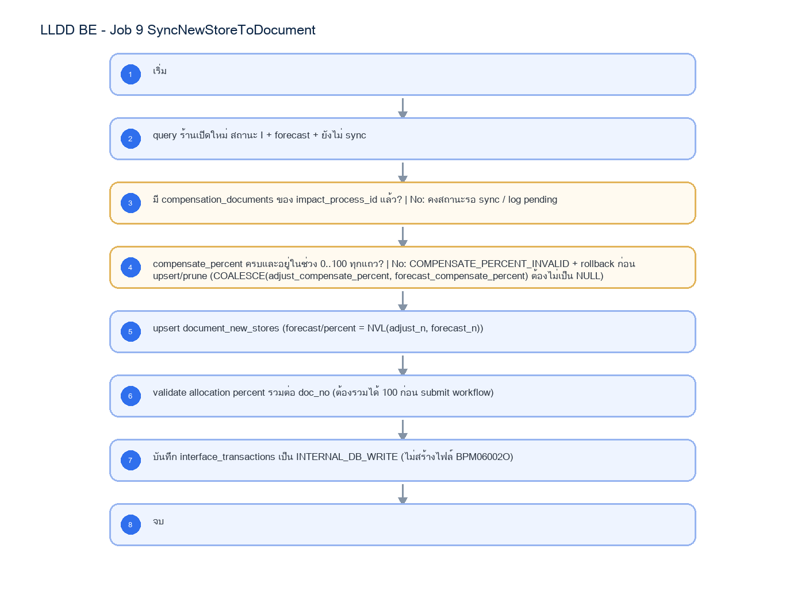

# LLDD BE - Job 9 SyncNewStoreToDocument

SBP Mall - ระบบประกันรายได้ | Low Level Design Document

## 1. Overview

| รายการ | รายละเอียด |
| --- | --- |
| Track | BE |
| Estimate | 10 ชั่วโมง |
| Owner | Aphiwit <Bank> Khammoon |
| Objective | บันทึกร้านเปิดใหม่เข้าเอกสาร: อ่านโปรไฟล์ร้านเปิดใหม่และค่า forecast/adjust แล้วบันทึกเข้า document_new_stores ผ่าน Document Service โดยตรง แทนการเขียนไฟล์ BPM06002O และ SFTP ไป impactprofile |

Common contract reference: ทุกหัวข้อ API/FE ต้องยึด LLDD-BE-API-Common-Contracts และ LLDD-FE-Integration-Contracts สำหรับ error/auth/format/pagination/action/RBAC ก่อนลงรายละเอียดเฉพาะหน้าหรือเฉพาะ endpoint

## 2. Screen / Functional Scope

- Main class/script: document.service.syncNewStores / (internal scheduler / service)
- Phase: B
- Output: document_new_stores (DB)
- Estimate: 10 ชั่วโมง
- Runbook, rerun rule, risk และ history ต้องตามข้อมูลหน้า Batch Job

## 4. Implementation Flow Diagram (Reference)



_รูปที่ 1: Implementation flow reference: LLDD BE - Job 9 SyncNewStoreToDocument_

## 5. Field, Format, and Validation

| Field / UI | Format | Validation | Behavior |
| --- | --- | --- | --- |
| กำหนดการรัน (Cron) | 30 17 7-31 * * | แก้ไขได้ | ใช้รอบเดิม แต่ปลายทางเป็น DB ภายใน |
| Target table | document_new_stores | ค่าคงที่/แก้ผ่านหน้าจอไม่ได้ | upsert ด้วย doc_no / new_store_code |
| กฎ Forecast / Percent | NVL(adjust_n, forecast_n) | ค่าคงที่/แก้ผ่านหน้าจอไม่ได้ | ค่า adjust มาก่อน forecast เสมอ; NULL หรือค่านอกช่วง 0..100 ต้อง reject ก่อน upsert |
| เงื่อนไขเลือกข้อมูล | ร้านเปิดใหม่ สถานะ I + forecast + ยังไม่ sync | ค่าคงที่/แก้ผ่านหน้าจอไม่ได้ |  |

## 5.1 Input / Progress / Output Contract

| Stage | Contract for implementation |
| --- | --- |
| Input | New-store compensation rows linked to active impact-process records, plus BPM/export SFTP parameters. |
| Progress | query eligible new-store rows, filter process errors, write outbound new-store payload, insert confirm-receive rows, upload/export, backup, notify. |
| Output | New-store sync payload/output and confirm-receive rows keyed by NEW_STORE_INFO_ID/month/year. |

### 5.90 Job 9 Execution Stages

query eligible new-store rows, filter process errors, write outbound new-store payload, insert confirm-receive rows, upload/export, backup, notify.

| Order | Service step | Repository | Output / failure contract |
| --- | --- | --- | --- |
| 1 | loadNewStoreAllocations | documentNewStoreRepository | คืน metrics และ throw typed error; transaction/rerun ใช้ contract ด้านล่าง |
| 2 | validateAllocationValues | documentNewStoreRepository | คืน metrics และ throw typed error; transaction/rerun ใช้ contract ด้านล่าง |
| 3 | upsertDocumentNewStores | documentNewStoreRepository | คืน metrics และ throw typed error; transaction/rerun ใช้ contract ด้านล่าง |
| 4 | reconcileAllocationTotals | documentNewStoreRepository | คืน metrics และ throw typed error; transaction/rerun ใช้ contract ด้านล่าง |

### 5.91 Job 9 Run Evidence

| Evidence | Job-specific value | Acceptance |
| --- | --- | --- |
| Input identity | New-store compensation rows linked to active impact-process records, plus BPM/export SFTP parameters. | snapshot input file/business key/period in run record |
| Output identity | New-store sync payload/output and confirm-receive rows keyed by NEW_STORE_INFO_ID/month/year. | reconcile input, success, reject and skipped counts |
| Dedup proof | UNIQUE(doc_no,new_store_code); upsert + prune เฉพาะ source_system=FGI ให้ target ตรง impact set ปัจจุบัน โดยไม่ลบแถว USER | rerun fixture produces no duplicate target business key |
| Transaction proof | validate source percent ต้องไม่เป็น NULL และอยู่ 0..100 ก่อน upsert; จากนั้น upsert + prune ร้านของ doc_no, validate ผลรวม 100% และ tracking INTERNAL_DB_WRITE ใน transaction เดียว; invalid/ไม่ครบให้ rollback ก่อน prune | injected failure leaves no partial committed state outside documented boundary |
| Security proof | internal service account least privilege; ไม่มี SFTP/BPM credential หรือ editable external endpoint | config/log/error contains no plaintext secret |

### 5.92 Legacy Java Source Reference

| Legacy file | Line range | Responsibility to carry forward |
| --- | --- | --- |
| fcsJar/src/th/co/gosoft/fgi/main/ExportOpenStore.java | 1-22 | Legacy main entrypoint; constant job name is ExportNewStoreToBPM. |
| fcsJar/src/th/co/gosoft/fgi/controller/ExportController.java | 404-516, 893-961 | Query new stores, create payload content, upload, backup, notification. |
| fcsJar/src/th/co/gosoft/fgi/dao/jdbc/ExportJdbc.java | 1558-1594 | Query new-store rows eligible for export. |

Line ranges refer to the legacy Java implementation under /Users/bank_mac/gosoft/java/SBP/fcsJar. Use these ranges to preserve business behavior while implementing the target Node job.

### 5.93 Target Repository and SQL Contract

| Contract | Target implementation |
| --- | --- |
| Repository | documentNewStoreRepository |
| Idempotency / dedup | UNIQUE(doc_no,new_store_code); upsert + prune เฉพาะ source_system=FGI ให้ target ตรง impact set ปัจจุบัน โดยไม่ลบแถว USER |
| Transaction boundary | validate source percent ต้องไม่เป็น NULL และอยู่ 0..100 ก่อน upsert; จากนั้น upsert + prune ร้านของ doc_no, validate ผลรวม 100% และ tracking INTERNAL_DB_WRITE ใน transaction เดียว; invalid/ไม่ครบให้ rollback ก่อน prune |
| Security | internal service account least privilege; ไม่มี SFTP/BPM credential หรือ editable external endpoint |

#### Input / candidate query

```sql
SELECT d.doc_no, s.new_store_code,
       COALESCE(s.adjust_compensate_percent, s.forecast_compensate_percent) AS compensate_percent,
       COALESCE(s.adjust_compensation_amount, s.forecast_compensation_amount) AS compensation_amount
FROM fgi_impact_stores s
JOIN compensation_documents d ON d.impact_process_id = s.impact_process_id
WHERE s.impact_month = :impact_month
  AND COALESCE(s.adjust_compensate_percent, s.forecast_compensate_percent) IS NOT NULL
  AND COALESCE(s.adjust_compensate_percent, s.forecast_compensate_percent) BETWEEN 0 AND 100;
```

#### Write / upsert query

```sql
-- validateAllocationValues ต้องยืนยัน source_row_count = valid_row_count ก่อนคำสั่งนี้;
-- ถ้าค่า percent เป็น NULL/นอกช่วง ให้ throw COMPENSATE_PERCENT_INVALID และ rollback ก่อน upsert/prune.
INSERT INTO document_new_stores
    (doc_no, new_store_code, compensate_percent, compensation_amount, source_system, updated_at)
SELECT :doc_no, :new_store_code, :compensate_percent, :compensation_amount, 'FGI', CURRENT_TIMESTAMP
WHERE :compensate_percent IS NOT NULL
  AND :compensate_percent BETWEEN 0 AND 100
ON CONFLICT (doc_no, new_store_code)
DO UPDATE SET compensate_percent = EXCLUDED.compensate_percent,
              compensation_amount = EXCLUDED.compensation_amount,
              updated_at = CURRENT_TIMESTAMP
RETURNING doc_no, new_store_code;

-- Service ต้องได้ RETURNING 1 แถวต่อ source row; ไม่ครบให้ rollback และห้าม prune.

DELETE FROM document_new_stores dns
WHERE dns.doc_no = :doc_no
  AND dns.source_system = 'FGI'
  AND NOT EXISTS (
      SELECT 1
      FROM fgi_impact_stores src
      JOIN compensation_documents d ON d.impact_process_id = src.impact_process_id
      WHERE d.doc_no = dns.doc_no
        AND src.impact_month = :impact_month
        AND src.new_store_code = dns.new_store_code
  );

SELECT CASE WHEN ABS(SUM(compensate_percent) - 100) <= 0.0001 THEN TRUE ELSE FALSE END AS allocation_valid
FROM document_new_stores
WHERE doc_no = :doc_no;
```

### 5.94 Target Node Implementation

โครงสร้างนี้ระบุ service/repository เฉพาะงานและต้อง implement ตาม SQL, transaction, idempotency และ security contract ด้านบน โดยทุกขั้นต้องคืน metrics สำหรับ reconcile และ run history

```js
export async function runLlddBeJob9Syncnewstoretodocument(ctx, services) {
  const run = await services.jobRuns.acquire({
    jobNo: "9", period: ctx.period, triggeredBy: ctx.triggeredBy
  });

  try {
    ctx = { ...ctx, runId: run.id, repository: services.documentNewStoreRepository };
    const step1 = await services.loadNewStoreAllocations(ctx, undefined);
    const step2 = await services.validateAllocationValues(ctx, step1);
    const step3 = await services.upsertDocumentNewStores(ctx, step2);
    const step4 = await services.reconcileAllocationTotals(ctx, step3);
    const result = step4;
    await services.jobRuns.finish(run.id, "SUCCESS", result.metrics);
    return { runId: run.id, status: "SUCCESS", ...result };
  } catch (error) {
    await services.jobRuns.finish(run.id, "FAILED", {
      errorCode: error.code ?? "JOB_FAILED",
      errorMessage: error.message
    });
    throw error;
  }
}
```

## 6. Button / User Action Mapping

| Action | Trigger | API / Service | Expected Result |
| --- | --- | --- | --- |
| เปิดดูรายละเอียด Job | GET | GET /api/v1/jobs/9 | คืน params/metadata ล่าสุด |
| บันทึกพารามิเตอร์ | PUT | PUT /api/v1/jobs/9/params | บันทึกเฉพาะ key ที่ editable และ audit |
| สั่งรันทันที | POST | POST /api/v1/jobs/9/run | สร้าง run history สถานะ RUNNING/QUEUED |
| เปิด/ปิดใช้งาน | PUT | PUT /api/v1/jobs/9/enabled | บันทึก enabled + audit พร้อม reason |

## 7. API Contract

### GET /api/v1/jobs/9

อ่าน metadata และพารามิเตอร์ของ Job

#### Query Params

```json
{
  "jobNo": "9"
}
```

#### Request Field Schema

| Field | Type | Required | Constraint / Meaning |
| --- | --- | --- | --- |
| jobNo | string | No | UTF-8; use value domain described by endpoint purpose |

#### Response

```json
{
  "jobNo": "9",
  "name": "SyncNewStoreToDocument",
  "cron": "30 17 7-31 * *",
  "enabled": true,
  "params": [
    {
      "label": "กำหนดการรัน (Cron)",
      "value": "30 17 7-31 * *",
      "editable": true
    },
    {
      "label": "Target table",
      "value": "document_new_stores",
      "editable": false
    },
    {
      "label": "กฎ Forecast / Percent",
      "value": "NVL(adjust_n, forecast_n)",
      "editable": false
    },
    {
      "label": "เงื่อนไขเลือกข้อมูล",
      "value": "ร้านเปิดใหม่ สถานะ I + forecast + ยังไม่ sync",
      "editable": false
    }
  ]
}
```

#### Response Field Schema

| Field | Type | Required | Constraint / Meaning |
| --- | --- | --- | --- |
| jobNo | string | Yes | UTF-8; use value domain described by endpoint purpose |
| name | string | Yes | UTF-8; use value domain described by endpoint purpose |
| cron | string | Yes | UTF-8; use value domain described by endpoint purpose |
| enabled | boolean | Yes | UTF-8; use value domain described by endpoint purpose |
| params | array<object> | Yes | JSON array; element type shown in Type column |
| params[].label | string | Yes | UTF-8; use value domain described by endpoint purpose |
| params[].value | string | Yes | UTF-8; use value domain described by endpoint purpose |
| params[].editable | boolean | Yes | UTF-8; use value domain described by endpoint purpose |

### PUT /api/v1/jobs/9/params

แก้ไขพารามิเตอร์ที่อนุญาตเท่านั้น

#### Request

```json
{
  "params": {
    "cron": "30 17 7-31 * *"
  },
  "reason": "ปรับรอบรันตาม Operations"
}
```

#### Request Field Schema

| Field | Type | Required | Constraint / Meaning |
| --- | --- | --- | --- |
| params | object | Yes | JSON object; nested fields listed below |
| params.cron | string | Yes | UTF-8; use value domain described by endpoint purpose |
| reason | string | Yes | trimmed UTF-8 Thai text; required by operation/business rule |

#### Response

```json
{
  "message": "saved"
}
```

#### Response Field Schema

| Field | Type | Required | Constraint / Meaning |
| --- | --- | --- | --- |
| message | string | Yes | UTF-8; use value domain described by endpoint purpose |

### POST /api/v1/jobs/9/run

สั่งรัน manual โดย guard ไม่ให้รันซ้อน

#### Request

```json
{
  "period": "2569-07"
}
```

#### Request Field Schema

| Field | Type | Required | Constraint / Meaning |
| --- | --- | --- | --- |
| period | string | Yes | UTF-8; use value domain described by endpoint purpose |

#### Response

```json
{
  "runId": "JOB9-RUN-001",
  "status": "RUNNING"
}
```

#### Response Field Schema

| Field | Type | Required | Constraint / Meaning |
| --- | --- | --- | --- |
| runId | string | Yes | UTF-8; use value domain described by endpoint purpose |
| status | string | Yes | UTF-8; use value domain described by endpoint purpose |

### GET /api/v1/jobs/9/runs

อ่านประวัติการรันล่าสุด

#### Query Params

```json
{
  "page": 1,
  "size": 20
}
```

#### Request Field Schema

| Field | Type | Required | Constraint / Meaning |
| --- | --- | --- | --- |
| page | integer | No | >= 1; default 1 |
| size | integer | No | 1..100; default 20 |

#### Response

```json
{
  "items": [
    {
      "startedAt": "30/06/2569 17:30",
      "status": "ok"
    }
  ]
}
```

#### Response Field Schema

| Field | Type | Required | Constraint / Meaning |
| --- | --- | --- | --- |
| items | array<object> | Yes | JSON array; element type shown in Type column |
| items[].startedAt | string | Yes | ISO-8601 ค.ศ.; nullable only when type includes null |
| items[].status | string | Yes | UTF-8; use value domain described by endpoint purpose |

## 8. Reference DB Mapping (No Database Page Work)

ส่วนนี้เป็นข้อมูลอ้างอิงสำหรับการ implement API/Job เท่านั้น ไม่ใช่งานสร้างหน้า Database, ไม่ใช่งานออกแบบ DB page และไม่ถูกนับเป็น deliverable แยกของ FE/BE

| Table / Object | R/W | Usage |
| --- | --- | --- |
| fgi_impact_stores | R | โปรไฟล์ร้านเปิดใหม่และค่า forecast/adjust รายงวด |
| compensation_documents | R | หา doc_no จาก impact_process_id |
| document_new_stores | W | บันทึกร้านเปิดใหม่เข้าเอกสารโดยตรง |
| interface_transactions | W | tracking ภายใน type=INTERNAL_DB_WRITE |

## 9. Processing Flow

| Step | Description |
| --- | --- |
| 1 | เริ่ม |
| 2 | query ร้านเปิดใหม่ สถานะ I + forecast + ยังไม่ sync |
| 3 | มี compensation_documents ของ impact_process_id แล้ว? \| No: คงสถานะรอ sync / log pending |
| 4 | compensate_percent ครบและอยู่ในช่วง 0..100 ทุกแถว? \| No: COMPENSATE_PERCENT_INVALID + rollback ก่อน upsert/prune (COALESCE(adjust_compensate_percent, forecast_compensate_percent) ต้องไม่เป็น NULL) |
| 5 | upsert document_new_stores (forecast/percent = NVL(adjust_n, forecast_n)) |
| 6 | validate allocation percent รวมต่อ doc_no (ต้องรวมได้ 100 ก่อน submit workflow) |
| 7 | บันทึก interface_transactions เป็น INTERNAL_DB_WRITE (ไม่สร้างไฟล์ BPM06002O) |
| 8 | จบ |

## 10. Acceptance Criteria

- อ่าน/แก้พารามิเตอร์ได้ตาม editable flag เท่านั้น
- การสั่งรันต้องตรวจ enabled และไม่มีรอบ RUNNING เดิม
- ต้องบันทึก job_run_histories และ audit_logs สำหรับทุก mutation
- DB/table mapping ใช้เป็น reference สำหรับ implement Job เท่านั้น ไม่ใช่งานสร้างหน้า Database
- รองรับ rerun rule และ risk note ตาม runbook

## 11. Developer Test Checklist

| No | Test |
| --- | --- |
| 1 | GET job detail |
| 2 | PUT params with editable key |
| 3 | PUT params locked business key must fail |
| 4 | POST run while running must fail |
| 5 | GET run histories |
| 6 | ตรวจผลกระทบตารางตาม R/W mapping reference |
