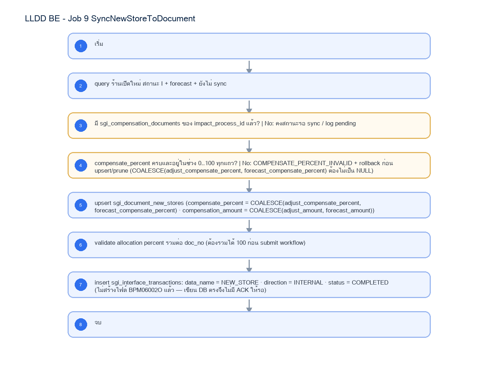

# LLDD BE - Job 9 SyncNewStoreToDocument

SBP Mall - ระบบประกันรายได้ | Low Level Design Document

## 1. Overview

| รายการ | รายละเอียด |
| --- | --- |
| Track | BE |
| Estimate | 11 ชั่วโมง |
| Owner | Peerakorn <Pete> Sakunkaewphithak |
| Objective | บันทึกร้านเปิดใหม่เข้าเอกสาร: อ่านโปรไฟล์ร้านเปิดใหม่และค่า forecast/adjust แล้วบันทึกเข้า document_new_stores ผ่าน Document Service โดยตรง แทนการเขียนไฟล์ BPM06002O และ SFTP ไป impactprofile |

Common contract reference: ทุกหัวข้อ API/FE ต้องยึด LLDD-BE-API-Common-Contracts และ LLDD-FE-Integration-Contracts สำหรับ error/auth/format/pagination/action/RBAC ก่อนลงรายละเอียดเฉพาะหน้าหรือเฉพาะ endpoint

## 2. Screen / Functional Scope

- Main class/script: document.service.syncNewStores / (internal scheduler / service)
- Phase: B
- Output: document_new_stores (DB)
- Estimate: 11 ชั่วโมง
- พารามิเตอร์/cron อ่านจาก backend config (config file/env) — ไม่มีตาราง job_configs และไม่มีหน้าจอควบคุม (หน้า Flow Batch Job ในกลุ่มเมนู Flow เหลือแค่ Flowchart + Database ที่ใช้ · 2026-08-06)
- Runbook, rerun rule, risk และ history ตามเอกสาร Batch v4.0 · ผลการรันเขียน application log แบบ structured

## 4. Implementation Flow Diagram (Reference)



_รูปที่ 1: Implementation flow reference: LLDD BE - Job 9 SyncNewStoreToDocument_

## 5. Field, Format, and Validation

| Field / UI | Format | Validation | Behavior |
| --- | --- | --- | --- |
| กำหนดการรัน (Cron) | 30 17 7-31 * * | แก้ไขได้ | ใช้รอบเดิม แต่ปลายทางเป็น DB ภายใน |
| Target table | document_new_stores | ค่าคงที่/แก้ผ่านหน้าจอไม่ได้ | upsert ด้วย doc_no / new_store_code |
| กฎ Forecast / Percent | NVL(adjust_n, forecast_n) | ค่าคงที่/แก้ผ่านหน้าจอไม่ได้ | ค่า adjust มาก่อน forecast เสมอ; NULL หรือค่านอกช่วง 0..100 ต้อง reject ก่อน upsert |
| เงื่อนไขเลือกข้อมูล | ร้านเปิดใหม่ สถานะ I + forecast + ยังไม่ sync | ค่าคงที่/แก้ผ่านหน้าจอไม่ได้ |  |

## 5.1 Input / Progress / Output Contract

| Stage | Contract for implementation |
| --- | --- |
| Input | New-store compensation rows linked to active impact-process records, plus BPM/export SFTP parameters. |
| Progress | query eligible new-store rows, filter process errors, write outbound new-store payload, insert confirm-receive rows, upload/export, backup, notify. |
| Output | New-store sync payload/output and confirm-receive rows keyed by NEW_STORE_INFO_ID/month/year. |

### 5.90 Job 9 Execution Stages

query eligible new-store rows, filter process errors, write outbound new-store payload, insert confirm-receive rows, upload/export, backup, notify.

| Order | Service step | Repository | Output / failure contract |
| --- | --- | --- | --- |
| 1 | loadNewStoreAllocations | documentNewStoreRepository | คืน metrics และ throw typed error; transaction/rerun ใช้ contract ด้านล่าง |
| 2 | validateAllocationValues | documentNewStoreRepository | คืน metrics และ throw typed error; transaction/rerun ใช้ contract ด้านล่าง |
| 3 | upsertDocumentNewStores | documentNewStoreRepository | คืน metrics และ throw typed error; transaction/rerun ใช้ contract ด้านล่าง |
| 4 | reconcileAllocationTotals | documentNewStoreRepository | คืน metrics และ throw typed error; transaction/rerun ใช้ contract ด้านล่าง |

### 5.91 Job 9 Run Evidence

| Evidence | Job-specific value | Acceptance |
| --- | --- | --- |
| Input identity | New-store compensation rows linked to active impact-process records, plus BPM/export SFTP parameters. | snapshot input file/business key/period in run record |
| Output identity | New-store sync payload/output and confirm-receive rows keyed by NEW_STORE_INFO_ID/month/year. | reconcile input, success, reject and skipped counts |
| Dedup proof | UNIQUE(doc_no,new_store_code); upsert + prune เฉพาะ source_system=FGI ให้ target ตรง impact set ปัจจุบัน โดยไม่ลบแถว USER | rerun fixture produces no duplicate target business key |
| Transaction proof | validate source percent ต้องไม่เป็น NULL และอยู่ 0..100 ก่อน upsert; จากนั้น upsert + prune ร้านของ doc_no, validate ผลรวม 100% และ tracking INTERNAL_DB_WRITE ใน transaction เดียว; invalid/ไม่ครบให้ rollback ก่อน prune | injected failure leaves no partial committed state outside documented boundary |
| Security proof | internal service account least privilege; ไม่มี SFTP/BPM credential หรือ editable external endpoint | config/log/error contains no plaintext secret |

### 5.92 Legacy Java Source Reference

| Legacy file | Line range | Responsibility to carry forward |
| --- | --- | --- |
| fcsJar/src/th/co/gosoft/fgi/main/ExportOpenStore.java | 1-22 | Legacy main entrypoint; constant job name is ExportNewStoreToBPM. |
| fcsJar/src/th/co/gosoft/fgi/controller/ExportController.java | 404-516, 893-961 | Query new stores, create payload content, upload, backup, notification. |
| fcsJar/src/th/co/gosoft/fgi/dao/jdbc/ExportJdbc.java | 1558-1594 | Query new-store rows eligible for export. |

Line ranges refer to the legacy Java implementation under /Users/bank_mac/gosoft/java/SBP/fcsJar. Use these ranges to preserve business behavior while implementing the target Node job.

### 5.93 Target Repository and SQL Contract

| Contract | Target implementation |
| --- | --- |
| Repository | documentNewStoreRepository |
| Idempotency / dedup | UNIQUE(doc_no,new_store_code); upsert + prune เฉพาะ source_system=FGI ให้ target ตรง impact set ปัจจุบัน โดยไม่ลบแถว USER |
| Transaction boundary | validate source percent ต้องไม่เป็น NULL และอยู่ 0..100 ก่อน upsert; จากนั้น upsert + prune ร้านของ doc_no, validate ผลรวม 100% และ tracking INTERNAL_DB_WRITE ใน transaction เดียว; invalid/ไม่ครบให้ rollback ก่อน prune |
| Security | internal service account least privilege; ไม่มี SFTP/BPM credential หรือ editable external endpoint |

#### Input / candidate query

```sql
SELECT d.doc_no, s.new_store_code,
       COALESCE(s.adjust_compensate_percent, s.forecast_compensate_percent) AS compensate_percent,
       COALESCE(s.adjust_compensation_amount, s.forecast_compensation_amount) AS compensation_amount
FROM fgi_impact_stores s
JOIN compensation_documents d ON d.impact_process_id = s.impact_process_id
WHERE s.impact_month = :impact_month
  AND COALESCE(s.adjust_compensate_percent, s.forecast_compensate_percent) IS NOT NULL
  AND COALESCE(s.adjust_compensate_percent, s.forecast_compensate_percent) BETWEEN 0 AND 100;
```

#### Write / upsert query

```sql
-- validateAllocationValues ต้องยืนยัน source_row_count = valid_row_count ก่อนคำสั่งนี้;
-- ถ้าค่า percent เป็น NULL/นอกช่วง ให้ throw COMPENSATE_PERCENT_INVALID และ rollback ก่อน upsert/prune.
INSERT INTO document_new_stores
    (doc_no, new_store_code, compensate_percent, compensation_amount, source_system, updated_at)
SELECT :doc_no, :new_store_code, :compensate_percent, :compensation_amount, 'FGI', CURRENT_TIMESTAMP
WHERE :compensate_percent IS NOT NULL
  AND :compensate_percent BETWEEN 0 AND 100
ON CONFLICT (doc_no, new_store_code)
DO UPDATE SET compensate_percent = EXCLUDED.compensate_percent,
              compensation_amount = EXCLUDED.compensation_amount,
              updated_at = CURRENT_TIMESTAMP
RETURNING doc_no, new_store_code;

-- Service ต้องได้ RETURNING 1 แถวต่อ source row; ไม่ครบให้ rollback และห้าม prune.

DELETE FROM document_new_stores dns
WHERE dns.doc_no = :doc_no
  AND dns.source_system = 'FGI'
  AND NOT EXISTS (
      SELECT 1
      FROM fgi_impact_stores src
      JOIN compensation_documents d ON d.impact_process_id = src.impact_process_id
      WHERE d.doc_no = dns.doc_no
        AND src.impact_month = :impact_month
        AND src.new_store_code = dns.new_store_code
  );

SELECT CASE WHEN ABS(SUM(compensate_percent) - 100) <= 0.0001 THEN TRUE ELSE FALSE END AS allocation_valid
FROM document_new_stores
WHERE doc_no = :doc_no;
```

### 5.94 Target Node Implementation

โครงสร้างนี้ระบุ service/repository เฉพาะงานและต้อง implement ตาม SQL, transaction, idempotency และ security contract ด้านบน โดยทุกขั้นต้องคืน metrics สำหรับ reconcile และ run history

```js
export async function runLlddBeJob9Syncnewstoretodocument(ctx, services) {
  const run = await services.jobRuns.acquire({
    jobNo: "9", period: ctx.period, triggeredBy: ctx.triggeredBy
  });

  try {
    ctx = { ...ctx, runId: run.id, repository: services.documentNewStoreRepository };
    const step1 = await services.loadNewStoreAllocations(ctx, undefined);
    const step2 = await services.validateAllocationValues(ctx, step1);
    const step3 = await services.upsertDocumentNewStores(ctx, step2);
    const step4 = await services.reconcileAllocationTotals(ctx, step3);
    const result = step4;
    await services.jobRuns.finish(run.id, "SUCCESS", result.metrics);
    return { runId: run.id, status: "SUCCESS", ...result };
  } catch (error) {
    await services.jobRuns.finish(run.id, "FAILED", {
      errorCode: error.code ?? "JOB_FAILED",
      errorMessage: error.message
    });
    throw error;
  }
}
```

## 6. Button / User Action Mapping

| Action | Trigger | API / Service | Expected Result |
| --- | --- | --- | --- |
| รันตามตารางเวลา | CRON | scheduler → runner (job 9) | อ่าน cron/พารามิเตอร์จาก backend config |
| รันนอกรอบ (manual/rerun) | CLI | CLI/ops runbook → runner (job 9) | guard ไม่ให้รันซ้อนด้วย distributed lock |
| แก้พารามิเตอร์/เปิด-ปิด job | CONFIG | แก้ backend config แล้ว deploy | ไม่มี endpoint และไม่มีหน้าจอควบคุม — หน้า Flow Batch Job เป็น reference อย่างเดียว (2026-08-06) |
| ตรวจผลการรัน | LOG | application log (structured) | ไม่มีตาราง job_run_histories แล้ว · ไฟล์/ACK ดูที่ interface_transactions |

## 7. API Contract

## 8. Reference DB Mapping (No Database Page Work)

ส่วนนี้เป็นข้อมูลอ้างอิงสำหรับการ implement API/Job เท่านั้น ไม่ใช่งานสร้างหน้า Database, ไม่ใช่งานออกแบบ DB page และไม่ถูกนับเป็น deliverable แยกของ FE/BE

| Table / Object | R/W | Usage |
| --- | --- | --- |
| fgi_impact_stores | R | โปรไฟล์ร้านเปิดใหม่และค่า forecast/adjust รายงวด |
| compensation_documents | R | หา doc_no จาก impact_process_id |
| document_new_stores | W | บันทึกร้านเปิดใหม่เข้าเอกสารโดยตรง |
| interface_transactions | W | tracking ภายใน type=INTERNAL_DB_WRITE |

## 9. Skeleton Code (Batch Job 9)

#### 9.1 ผังไฟล์ที่ต้องสร้าง (Job 9)

โครงไฟล์ของ Job 9 (document.service.syncNewStores เดิม) วางใต้ `src/batch/sbpgi/` ของ store-backend โดยใช้ convention เดียวกับ module ธุรกิจอื่น: inject custom provider `DATA_SOURCE` แล้วยิง raw SQL, repository ประกาศเป็น factory provider ที่ใช้ token string, entity อยู่ใน `src/entitys/`

**หมายเหตุสำคัญ — `src/batch/*` ทั้งชุดเป็นของใหม่ที่ยังไม่มีใน store-backend**: ปัจจุบัน repo ไม่มีโฟลเดอร์ `src/batch` เลย และแม้จะติดตั้ง `@nestjs/schedule` ไว้แล้วก็ยัง**ไม่มี `@Cron`/`@Interval` แม้แต่จุดเดียว** ดังนั้น `runner.ts` / `scheduler.ts` / `cli.js` / `job-failure.notifier.ts` คือ **งานตั้งต้นของ Phase แรก** ที่ต้องสร้างเองทั้งหมด พร้อม register `ScheduleModule.forRoot()` ใน `app.module.ts` — ไม่ใช่ของเดิมที่ reuse ได้

| Path | หน้าที่ |
| --- | --- |
| src/batch/sbpgi/job-9-sync-new-store-to-document/job-9-sync-new-store-to-document.job.ts | คลาส `SyncNewStoreToDocumentJob` — `run(ctx)` เรียงตาม flow ของ Job 9 ทีละขั้น, ครอบ transaction, จบด้วย structured log |
| src/batch/sbpgi/job-9-sync-new-store-to-document/job-9-sync-new-store-to-document.service.ts | คลาส `SyncNewStoreToDocumentService` — logic ต่อขั้น (อ่าน/parse/คำนวณ/เขียน) + repository token ที่ inject จาก `DATA_SOURCE` |
| src/batch/sbpgi/job-9-sync-new-store-to-document/job-9-sync-new-store-to-document.config.ts | คลาส `SbpgiJob9Config` (แบบเดียวกับ `src/config/app.config.ts` — โปรเจกต์นี้ไม่ใช้ `registerAs`) — cron และพารามิเตอร์ทั้ง 4 ตัวของ Job 9 อ่านจาก env/config file (ไม่มีตาราง job_configs) |
| src/batch/sbpgi/job-9-sync-new-store-to-document/job-9-sync-new-store-to-document.module.ts | NestJS module ผูก job + service + repository provider (factory token string) เข้ากับ `DatabaseModule` |
| src/batch/runner.ts | ตัวรันกลาง: resolve job ตาม jobNo, กันรันซ้อนด้วย advisory lock, จับ error → แจ้งเตือน, เขียน structured log สรุป (ใช้ร่วมทั้ง 11 job) |
| src/batch/scheduler.ts | ลงทะเบียน cron จาก config (`SBPGI_JOB9_CRON` = `30 17 7-31 * *`) และรองรับสั่งรันนอกรอบผ่าน CLI/runbook |
| src/batch/job-failure.notifier.ts | ส่งอีเมลแจ้งผู้ดูแลเมื่อ job ล้มเหลว ผ่าน `EmailLibService` ของ `@gosoft-sbp/email-lib` (log ลง `email_sent` ให้อัตโนมัติ) |

#### 9.2 Config Schema ของ Job 9 (backend config / env)

cron ปัจจุบันของ Job 9 คือ `30 17 7-31 * *` (วันที่ 7–31 เวลา 17:30) — ประกาศเป็น `SBPGI_JOB9_CRON` และอ่านตอน bootstrap ของ `scheduler.ts`; ถ้า `enabled=false` scheduler ต้องไม่ลงทะเบียน cron ของ job นี้

```ts
// src/batch/sbpgi/job-9-sync-new-store-to-document/job-9-sync-new-store-to-document.config.ts
// convention จริงของ store-backend คือคลาส config (`src/config/app.config.ts` ที่ export ผ่าน
// `AppConfigModule` แบบ @Global แล้วอ่าน process.env ตรง ๆ) — โปรเจกต์นี้ **ไม่ได้ใช้ registerAs**
// แม้แต่จุดเดียว จึงประกาศเป็นคลาสให้รีวิว/ทดสอบเหมือน config ตัวอื่น
import { Injectable } from '@nestjs/common';

// TODO: Job 9 ไม่มีตาราง job_configs และไม่มี Job Admin API แล้ว (ตัดสินใจ 2026-08-06)
// TODO: ค่าทุกตัวอ่านจาก env/config file ของ backend เท่านั้น — เปลี่ยนค่า = แก้ config แล้ว deploy
export interface Job9Config {
  /** เปิด/ปิด job รอบถัดไปโดยไม่ต้อง deploy โค้ด */
  enabled: boolean;
  /** cron ของ job นี้ (อ่านตอน bootstrap ของ scheduler.ts) */
  cron: string;
  /** กำหนดการรัน (Cron) — ใช้รอบเดิม แต่ปลายทางเป็น DB ภายใน */
  cron: string;
  /** Target table — upsert ด้วย doc_no / new_store_code */
  targetTable: string;
  /** กฎ Forecast / Percent — ค่า adjust มาก่อน forecast เสมอ; NULL หรือค่านอกช่วง 0..100 ต้อง reject ก่อน upsert */
  forecastPercent: string;
  /** เงื่อนไขเลือกข้อมูล */
  condition: string;
  /** ผู้รับอีเมลเมื่อ job ล้มเหลว — เก็บเป็น string คั่น comma ให้ตรง signature ของ
      `EmailLibService.sendMail({ mailTo })` ที่รับ string ไม่ใช่ string[] */
  mailTo: string;
}

@Injectable()
export class SbpgiJob9Config implements Job9Config {
  // TODO: ยืนยันค่า default ทุกตัวกับ Ops ก่อนขึ้น production (ไม่มีหน้าจอแก้ค่าแล้ว)
  enabled = (process.env.SBPGI_JOB9_ENABLED ?? 'true') === 'true';
  cron = process.env.SBPGI_JOB9_CRON ?? '30 17 7-31 * *';
  cron = process.env.SBPGI_JOB9_CRON ?? '30 17 7-31 * *'; // TODO: แก้ผ่าน env/config file แล้ว deploy
  targetTable = process.env.SBPGI_JOB9_TARGET_TABLE ?? 'document_new_stores'; // TODO: ค่าคงที่ทางธุรกิจ — เปลี่ยนต้องผ่านการอนุมัติ
  forecastPercent = process.env.SBPGI_JOB9_FORECAST_PERCENT ?? 'NVL(adjust_n, forecast_n)'; // TODO: ค่าคงที่ทางธุรกิจ — เปลี่ยนต้องผ่านการอนุมัติ
  condition = process.env.SBPGI_JOB9_CONDITION ?? 'ร้านเปิดใหม่ สถานะ I + forecast + ยังไม่ sync'; // TODO: ค่าคงที่ทางธุรกิจ — เปลี่ยนต้องผ่านการอนุมัติ
  mailTo = process.env.SBPGI_JOB9_MAIL_TO ?? ''; // TODO: ผู้รับอีเมลแจ้ง error คั่นด้วย comma (เดิม: ส่ง error ผ่าน Notification Service กลางเมื่อ sync ล้มเหลว)
}

// TODO: เพิ่ม SbpgiJob9Config ใน providers/exports ของ AppConfigModule (@Global) เหมือน AppConfig
```

#### 9.3 Job Class — `run(ctx)` ของ Job 9 ทีละขั้นตามผัง

##### 9.3.1 สัญญาของชั้นกลาง (`runner.ts`) + โครง service ของ Job 9

job class อ้าง `JobRunContext` / `JobRunResult` / `JobState` / `JobFailedError` — ทั้งหมดนิยาม ครั้งเดียวใน `src/batch/runner.ts` (ไฟล์ร่วมของทุก job ให้ merge ไม่ใช่เขียนทับ) และ service ต้องมี method ครบตามตารางขั้นตอนด้านล่าง มิฉะนั้น job class จะเรียก method ที่ไม่มีอยู่

```ts
// src/batch/runner.ts — สัญญากลางของทุก job (ประกาศครั้งเดียว ใช้ร่วมทั้ง 11 ฉบับ)

export interface JobRunContext {
  jobNo: string;
  period: string;        // YYYYMM ของงวดที่รัน
  triggeredBy: string;   // 'CRON' | userId ที่สั่งรันนอกรอบ
  params?: Record<string, string>;
}

export interface JobRunResult {
  event: 'job.finish';
  jobNo: string;
  jobName: string;
  status: 'SUCCESS' | 'SKIPPED' | 'SKIPPED_LOCKED' | 'FAILED';
  period: string;
  output: string;
  read: number; written: number; skipped: number; rejected: number;
  durationMs: number;
}

/** counter + ค่าที่ทุกขั้นของ job ใช้ร่วมกัน (service เป็นผู้สร้างผ่าน createState) */
export interface JobState {
  period: string;
  read: number; written: number; skipped: number; rejected: number;
  // TODO: เพิ่ม field เฉพาะของ job นี้ (เช่น rows ที่อ่านมา, path ไฟล์ที่เขียน)
  [key: string]: unknown;
}

/** error ที่ทำให้ job จบเป็น FAILED และส่งอีเมลแจ้งผู้ดูแล */
export class JobFailedError extends Error {
  constructor(public readonly code: string, message: string) { super(message); }
}

/** ใช้ออกจาก transaction เมื่อสาขา NO บอกให้ข้ามงวด/เรคคอร์ด — runner สรุปเป็น SKIPPED ไม่ใช่ FAILED */
export class JobSkippedError extends Error {}
```

```ts
// SyncNewStoreToDocumentService — method ที่ job class เรียก (1 method ต่อ 1 ขั้นในตารางด้านบน)
import { Inject, Injectable } from '@nestjs/common';
import type { DataSource, EntityManager } from 'typeorm';
import type { JobRunContext, JobState } from '../../runner';
export type { JobState };

@Injectable()
export class SyncNewStoreToDocumentService {
  constructor(@Inject('DATA_SOURCE') private readonly dataSource: DataSource) {}

  createState(ctx: JobRunContext): JobState {
    return { period: ctx.period, read: 0, written: 0, skipped: 0, rejected: 0 };
  }

  // query ร้านเปิดใหม่ สถานะ I + forecast + ยังไม่ sync
  async step02Query(state: JobState, manager?: EntityManager): Promise<void> {
    // TODO: implement
  }

  // มี compensation_documents ของ impact_process_id แล้ว?
  async check03Document(state: JobState): Promise<boolean> {
    return true; // TODO: เงื่อนไขจริงตามผัง
  }

  // compensate_percent ครบและอยู่ในช่วง 0..100 ทุกแถว?
  async check04Condition(state: JobState): Promise<boolean> {
    return true; // TODO: เงื่อนไขจริงตามผัง
  }

  // upsert document_new_stores
  async step05Upsert(state: JobState, manager?: EntityManager): Promise<void> {
    // TODO: implement
  }

  // validate allocation percent รวมต่อ doc_no
  async step06Workflow(state: JobState, manager?: EntityManager): Promise<void> {
    // TODO: implement
  }

  // บันทึก interface_transactions เป็น INTERNAL_DB_WRITE
  async step07WriteFile(state: JobState, manager?: EntityManager): Promise<void> {
    // TODO: implement
  }

}
```

##### 9.3.2 `run(ctx)` ของ Job 9

ทุกขั้นใน `run()` ตรงกับ flowchart ของ Job 9 หนึ่งต่อหนึ่ง (decision และ error path รวมอยู่ด้วย) — method ที่ต้อง implement ใน service ตามตารางนี้

| ลำดับ | ชนิด | ขั้นตอนจากผัง | Method ที่ต้อง implement | เส้นทาง NO / error |
| --- | --- | --- | --- | --- |
| 1 | start | เริ่ม | createState() | - |
| 2 | process | query ร้านเปิดใหม่ สถานะ I + forecast + ยังไม่ sync | step02Query() | throw JobFailedError เมื่อทำไม่สำเร็จ |
| 3 | decision | มี compensation_documents ของ impact_process_id แล้ว? | check03Document() | [err] คงสถานะรอ sync / log pending |
| 4 | decision | compensate_percent ครบและอยู่ในช่วง 0..100 ทุกแถว? | check04Condition() | [err] COMPENSATE_PERCENT_INVALID + rollback ก่อน upsert/prune |
| 5 | process | upsert document_new_stores | step05Upsert() | throw JobFailedError เมื่อทำไม่สำเร็จ |
| 6 | process | validate allocation percent รวมต่อ doc_no | step06Workflow() | throw JobFailedError เมื่อทำไม่สำเร็จ |
| 7 | process | บันทึก interface_transactions เป็น INTERNAL_DB_WRITE | step07WriteFile() | throw JobFailedError เมื่อทำไม่สำเร็จ |
| 8 | end | จบ | summarize() | - |

```ts
// src/batch/sbpgi/job-9-sync-new-store-to-document/job-9-sync-new-store-to-document.job.ts
import { Inject, Injectable, Logger } from '@nestjs/common';
import type { DataSource, EntityManager } from 'typeorm';
import { SyncNewStoreToDocumentService, type JobState } from './job-9-sync-new-store-to-document.service';
// 4 symbol นี้นิยามใน src/batch/runner.ts (ดูหัวข้อ 9.3.1)
import { JobFailedError, JobSkippedError, JobRunContext, JobRunResult } from '../../runner';

@Injectable()
export class SyncNewStoreToDocumentJob {
  static readonly jobNo = '9';
  private readonly logger = new Logger(SyncNewStoreToDocumentJob.name);

  constructor(
    // TODO: DATA_SOURCE = custom provider ที่ route SELECT/WITH ไป slave pool และ write ไป master
    @Inject('DATA_SOURCE') private readonly dataSource: DataSource,
    private readonly service: SyncNewStoreToDocumentService,
  ) {}

  async run(ctx: JobRunContext): Promise<JobRunResult> {
    const startedAt = Date.now();
    // TODO: state ถือ counter (read/written/skipped/rejected) และค่าจาก job9Config
    const state = this.service.createState(ctx);
    try {
      // ขั้นที่ 2: query ร้านเปิดใหม่ สถานะ I + forecast + ยังไม่ sync
      await this.service.step02Query(state);
      // ขั้นที่ 3 (decision): มี compensation_documents ของ impact_process_id แล้ว?
      const ok03 = await this.service.check03Document(state);
      if (!ok03) throw new JobFailedError('JOB9_STEP03', 'คงสถานะรอ sync / log pending');
      // ขั้นที่ 4 (decision): compensate_percent ครบและอยู่ในช่วง 0..100 ทุกแถว? · TODO: COALESCE(adjust_compensate_percent, forecast_compensate_percent) ต้องไม่เป็น NULL
      const ok04 = await this.service.check04Condition(state);
      if (!ok04) throw new JobFailedError('JOB9_STEP04', 'COMPENSATE_PERCENT_INVALID + rollback ก่อน upsert/prune');
      // === transaction boundary === TODO: validate percent ไม่เป็น NULL และอยู่ 0..100 ก่อน; DB transaction ครอบ upsert document_new_stores + tracking; พบค่าผิดให้ rollback ก่อน prune
      await this.dataSource.transaction(async (manager: EntityManager) => {
        // ขั้นที่ 5: upsert document_new_stores · TODO: forecast/percent = NVL(adjust_n, forecast_n)
        await this.service.step05Upsert(state, manager);
        // ขั้นที่ 6: validate allocation percent รวมต่อ doc_no · TODO: ต้องรวมได้ 100 ก่อน submit workflow
        await this.service.step06Workflow(state, manager);
        // ขั้นที่ 7: บันทึก interface_transactions เป็น INTERNAL_DB_WRITE · TODO: ไม่สร้างไฟล์ BPM06002O
        await this.service.step07WriteFile(state, manager);
      });
      return this.summarize(state, 'SUCCESS', startedAt);
    } catch (error) {
      // TODO: error path ของ Job 9 — ห้าม re-implement การเขียนไฟล์ BPM06002O หรือ SFTP ไป BPM; legacy file เป็น reference เท่านั้น
      this.logger.error(JSON.stringify({ event: 'job.failed', jobNo: '9', period: ctx.period,
        triggeredBy: ctx.triggeredBy, durationMs: Date.now() - startedAt, error: (error as Error).message }));
      // TODO: แจ้งผู้ดูแลผ่าน JobFailureNotifier (หัวข้อ 9.6.1) — runner เป็นผู้เรียกให้
      throw error;
    }
  }

  private summarize(state: JobState, status: JobRunResult['status'], startedAt = Date.now()): JobRunResult {
    // TODO: structured log บรรทัดเดียวจบ — ไม่มีตาราง job_run_histories แล้ว (2026-08-06)
    const summary = {
      event: 'job.finish', jobNo: '9', jobName: 'SyncNewStoreToDocument', status,
      period: state.period, output: 'document_new_stores (DB)',
      read: state.read, written: state.written, skipped: state.skipped,
      rejected: state.rejected, durationMs: Date.now() - startedAt,
    };
    this.logger.log(JSON.stringify(summary));
    return summary as JobRunResult;
  }
}
```

#### 9.4 การกันรันซ้อนของ Job 9 (PostgreSQL advisory lock)

Job 9 มีข้อควรระวังจาก legacy: ห้าม re-implement การเขียนไฟล์ BPM06002O หรือ SFTP ไป BPM; legacy file เป็น reference เท่านั้น — runner ล็อกด้วย `pg_try_advisory_lock` ก่อนเริ่มขั้นแรกเสมอ และรอบที่ล็อกไม่ได้ให้จบด้วยสถานะ SKIPPED_LOCKED (ไม่ใช่ FAILED)

```ts
// src/batch/runner.ts (ส่วนกันรันซ้อน)
import { Inject, Injectable, Logger } from '@nestjs/common';
import type { DataSource } from 'typeorm';

// TODO: ห้ามใช้แถวสถานะ RUNNING ในตารางเป็นตัวกัน (ไม่มีตาราง job_run_histories แล้ว)
//       ใช้ PostgreSQL advisory lock ระดับ session แทน — ปลดอัตโนมัติเมื่อ connection หลุด
export const SBPGI_JOB_LOCK_CLASS_ID = 861000; // namespace ของระบบ SBPGI
export const JOB_LOCK_KEYS: Record<string, number> = { '9': 90 /* TODO: เพิ่มครบทั้ง 11 job */ };

@Injectable()
export class BatchRunner {
  private readonly logger = new Logger(BatchRunner.name);
  constructor(@Inject('DATA_SOURCE') private readonly dataSource: DataSource) {}

  async runExclusive<T>(jobNo: string, fn: () => Promise<T>): Promise<T | { status: 'SKIPPED_LOCKED' }> {
    // TODO: ต้องใช้ QueryRunner (connection เดียวบน master) — dataSource.query() ของโปรเจกต์นี้
    //       route SQL ที่ขึ้นต้นด้วย SELECT ไป slave pool ทำให้ lock ไปตกที่ replica คนละ connection
    const runner = this.dataSource.createQueryRunner('master');
    await runner.connect();
    const objectId = JOB_LOCK_KEYS[jobNo];
    try {
      const [{ locked }] = await runner.query(
        'SELECT pg_try_advisory_lock($1, $2) AS locked',
        [SBPGI_JOB_LOCK_CLASS_ID, objectId],
      );
      if (!locked) {
        // TODO: รอบนี้ข้ามไปเฉย ๆ ไม่ถือเป็น error และไม่ต้องส่งอีเมล
        this.logger.warn(JSON.stringify({ event: 'job.skipped.locked', jobNo }));
        return { status: 'SKIPPED_LOCKED' };
      }
      return await fn();
    } finally {
      // TODO: ปลด lock ทุกกรณี แล้วคืน connection เข้า pool
      await runner.query('SELECT pg_advisory_unlock($1, $2)', [SBPGI_JOB_LOCK_CLASS_ID, objectId]);
      await runner.release();
    }
  }
}
```

#### 9.5 Repository / SQL หลักของ Job 9

repository ของ Job 9 ประกาศเป็น factory provider (`{provide: 'SYNC_NEW_STORE_TO_DOCUMENT_REPOSITORY', useFactory: (ds) => ds.getRepository(Entity), inject: ['DATA_SOURCE']}`) แล้วยิง raw SQL ตามแบบ module ธุรกิจอื่นของ store-backend (schema `sps_store` มาจาก search_path)

| ตาราง | R/W | การใช้งานตามผัง | หมายเหตุ target design |
| --- | --- | --- | --- |
| fgi_impact_stores | R | โปรไฟล์ร้านเปิดใหม่และค่า forecast/adjust รายงวด | เขียน SQL ตรงผ่าน DATA_SOURCE |
| compensation_documents | R | หา doc_no จาก impact_process_id | เขียน SQL ตรงผ่าน DATA_SOURCE |
| document_new_stores | W | บันทึกร้านเปิดใหม่เข้าเอกสารโดยตรง | เขียน SQL ตรงผ่าน DATA_SOURCE |
| interface_transactions | W | tracking ภายใน type=INTERNAL_DB_WRITE | เขียน SQL ตรงผ่าน DATA_SOURCE |

```sql
-- Job 9 SyncNewStoreToDocument — query หลักที่ต้อง implement
-- TODO: ทุก statement รันผ่าน DATA_SOURCE (SELECT ไป slave, write ไป master) และ
--       write ทั้งหมดต้องอยู่ใน transaction เดียวกับที่ระบุใน 9.3

-- [R] fgi_impact_stores : โปรไฟล์ร้านเปิดใหม่และค่า forecast/adjust รายงวด
-- TODO: เติมเฉพาะคอลัมน์ที่ job ใช้จริง (ห้าม SELECT *) และตรวจว่ามี index รองรับ WHERE นี้
SELECT /* TODO: columns */
  FROM fgi_impact_stores
 WHERE impact_year = $1 AND impact_month = $2  -- TODO: ยืนยันชื่อคอลัมน์งวดกับ database.md
 ORDER BY /* TODO: คีย์ที่ทำให้ลำดับคงที่ */
 LIMIT $3 OFFSET $4;  -- TODO: อ่านเป็น chunk กัน memory บวม

-- [R] compensation_documents : หา doc_no จาก impact_process_id
-- TODO: เติมเฉพาะคอลัมน์ที่ job ใช้จริง (ห้าม SELECT *) และตรวจว่ามี index รองรับ WHERE นี้
SELECT /* TODO: columns */
  FROM compensation_documents
 WHERE /* TODO: เงื่อนไขงวด/สถานะที่ job นี้คัดแถว */ 1 = 1
 ORDER BY /* TODO: คีย์ที่ทำให้ลำดับคงที่ */
 LIMIT $1 OFFSET $2;  -- TODO: อ่านเป็น chunk กัน memory บวม

-- [W] document_new_stores : บันทึกร้านเปิดใหม่เข้าเอกสารโดยตรง
-- TODO: เติมคอลัมน์จริงจาก database.md และยืนยัน unique key ที่กันข้อมูลซ้ำตอน rerun
INSERT INTO document_new_stores
  (/* TODO: business key + payload + created_by, created_at */)
VALUES (/* TODO: bind params ตามลำดับคอลัมน์ด้านบน */)
ON CONFLICT (/* TODO: unique key ที่ใช้กันซ้ำ */)
DO UPDATE SET /* TODO: คอลัมน์ที่ยอมให้ทับ */
       updated_at = NOW(), updated_by = 'JOB9';

-- [W] interface_transactions : tracking ภายใน type=INTERNAL_DB_WRITE
-- TODO: บันทึก ACK ระดับ record ของไฟล์ interface (แทน job_run_histories ที่ยกเลิกไปแล้ว)
INSERT INTO interface_transactions
  (job_no, data_name, direction, status, business_key, period_key,
   file_name, file_checksum, created_at)
VALUES ('9', $1 /* TODO: data_name ของ Job 9 */, $2 /* IN|OUT|INTERNAL */, 'READY',
        $3 /* business key ของแถว */, $4 /* YYYYMM */, $5, $6, NOW())
ON CONFLICT (data_name, direction, business_key, period_key) DO NOTHING;
```

#### 9.6 การแจ้งเตือนและการรันซ้ำของ Job 9

##### 9.6.1 อีเมลแจ้งผู้ดูแลเมื่อ job ล้มเหลว

ใช้ `EmailLibService` จาก `@gosoft-sbp/email-lib` ตัวเดียวกับที่ระบบเดิมใช้ (inform-evaluate / external-audit / statement PTT) — ไม่สร้างกลไกส่งเมลใหม่

```ts
// src/batch/job-failure.notifier.ts
import { Injectable, Logger } from '@nestjs/common';
// ชื่อ method ของ lib ที่ store-backend เรียกจริงคือ `sendMail` (ไม่ใช่ sendEmail) และ
// `mailTo` / `mailCc` เป็น **string** คั่นด้วย comma — ดู evaluation-process.service.ts,
// external-audit.service.ts, statement.service.ts, inform-evaluate.service.ts, performance.service.ts
import { EmailLibService } from '@gosoft-sbp/email-lib';
import type { JobRunContext } from './runner';

@Injectable()
export class JobFailureNotifier {
  private readonly logger = new Logger(JobFailureNotifier.name);
  // TODO: ใช้ lib อีเมลของระบบเดิม — template อยู่ในตาราง email_template และ log ลง email_sent อัตโนมัติ
  //       (ตั้งชื่อ property ว่า mailService ตาม call site เดิมทุกที่ใน store-backend)
  constructor(private readonly mailService: EmailLibService) {}

  async notifyFailure(jobNo: string, ctx: JobRunContext, error: Error): Promise<void> {
    // TODO: ผู้รับของ Job 9 เดิมคือ ส่ง error ผ่าน Notification Service กลางเมื่อ sync ล้มเหลว — ย้ายมาเป็น env SBPGI_JOB9_MAIL_TO
    const recipients = (process.env.SBPGI_JOB9_MAIL_TO ?? '').split(',').map((s) => s.trim()).filter(Boolean);
    if (!recipients.length) {
      this.logger.warn(JSON.stringify({ event: 'job.mail.skipped', jobNo, reason: 'NO_RECIPIENT' }));
      return;
    }
    try {
      await this.mailService.sendMail({
        // TODO: emailId = id ของ template EM-07 (แจ้ง error batch) ในตาราง email_template
        emailId: Number(process.env.SBPGI_JOB_FAIL_EMAIL_TEMPLATE_ID),
        mailTo: recipients.join(','), // signature รับ string ไม่ใช่ string[]
        mailCc: '',
        param: {
          jobNo, jobName: 'SyncNewStoreToDocument',
          jobTitle: 'บันทึกร้านเปิดใหม่เข้าเอกสาร',
          period: ctx.period, triggeredBy: ctx.triggeredBy,
          output: 'document_new_stores (DB)',
          errorMessage: error.message,
          rerunNote: 'idempotent ด้วย doc_no + new_store_code',
        },
      });
    } catch (mailError) {
      // TODO: ส่งเมลไม่สำเร็จห้ามกลบ error เดิมของ job — log แล้วปล่อยผ่าน
      this.logger.error(JSON.stringify({ event: 'job.mail.failed', jobNo, error: (mailError as Error).message }));
    }
  }
}
```

##### 9.6.2 Checklist การ rerun

- กติกา rerun ของ Job 9: idempotent ด้วย doc_no + new_store_code
- ขอบเขต transaction ที่ต้องรักษาเมื่อรันซ้ำ: validate percent ไม่เป็น NULL และอยู่ 0..100 ก่อน; DB transaction ครอบ upsert document_new_stores + tracking; พบค่าผิดให้ rollback ก่อน prune
- ความเสี่ยงที่ต้องตรวจก่อน/หลังรันซ้ำ: ห้าม re-implement การเขียนไฟล์ BPM06002O หรือ SFTP ไป BPM; legacy file เป็น reference เท่านั้น
- ตรวจว่ารอบก่อนหน้าไม่ได้ค้าง lock อยู่ (`SELECT * FROM pg_locks WHERE locktype = 'advisory'`) ก่อนสั่งรันนอกรอบ
- สั่งรันนอกรอบผ่าน CLI/runbook เท่านั้น (ไม่มีหน้าจอและไม่มี Job Admin API): `node dist/batch/cli.js --job=9 --period=<YYYYMM>`
- หลังรันซ้ำ ตรวจ output `document_new_stores (DB)` และ log บรรทัด `job.finish` ว่า read/written/skipped/rejected ตรงกับที่คาด
- ถ้ารอบก่อนล้มเหลวกลางทาง ตรวจ `interface_transactions` ของงวดนั้นว่ามีแถวค้างสถานะ READY/PENDING หรือไม่ ก่อนสั่งรันใหม่

## 10. Processing Flow

| Step | Description |
| --- | --- |
| 1 | เริ่ม |
| 2 | query ร้านเปิดใหม่ สถานะ I + forecast + ยังไม่ sync |
| 3 | มี compensation_documents ของ impact_process_id แล้ว? \| No: คงสถานะรอ sync / log pending |
| 4 | compensate_percent ครบและอยู่ในช่วง 0..100 ทุกแถว? \| No: COMPENSATE_PERCENT_INVALID + rollback ก่อน upsert/prune (COALESCE(adjust_compensate_percent, forecast_compensate_percent) ต้องไม่เป็น NULL) |
| 5 | upsert document_new_stores (forecast/percent = NVL(adjust_n, forecast_n)) |
| 6 | validate allocation percent รวมต่อ doc_no (ต้องรวมได้ 100 ก่อน submit workflow) |
| 7 | บันทึก interface_transactions เป็น INTERNAL_DB_WRITE (ไม่สร้างไฟล์ BPM06002O) |
| 8 | จบ |

## 11. Acceptance Criteria

- พารามิเตอร์และ cron อ่านจาก backend config เท่านั้น — เปลี่ยนค่าโดย deploy config ไม่ใช่ผ่าน API/หน้าจอ
- การรันต้องตรวจ enabled flag ใน config และกันรันซ้อนด้วย distributed/advisory lock
- ทุกรอบต้องเขียน application log แบบ structured (เวลา/แถว/ไฟล์/ผล) และ error ต้องส่ง EM-07
- DB/table mapping ใช้เป็น reference สำหรับ implement Job เท่านั้น ไม่ใช่งานสร้างหน้า Database
- รองรับ rerun rule และ risk note ตาม runbook

## 12. Developer Test Checklist

| No | Test |
| --- | --- |
| 1 | รันตามตารางเวลาแล้วผลถูกต้องบน fixture |
| 2 | รันนอกรอบผ่าน CLI ได้ผลเดียวกับ cron |
| 3 | สั่งรันซ้อนขณะกำลังรัน → runner ปฏิเสธ (lock ทำงาน) |
| 4 | แก้ config แล้ว deploy → รอบถัดไปใช้ค่าใหม่ |
| 5 | job throw error → EM-07 ออก และ log มีบรรทัด error |
| 6 | ตรวจผลกระทบตารางตาม R/W mapping reference |
