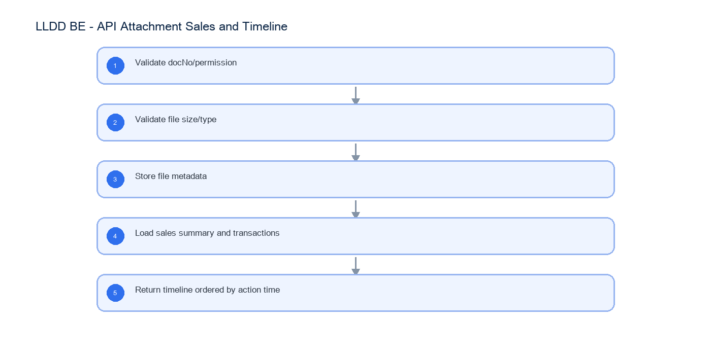

# LLDD BE - API Attachment Sales and Timeline

SBP Mall - ระบบประกันรายได้ | Low Level Design Document

## 1. Overview

| รายการ | รายละเอียด |
| --- | --- |
| Track | BE |
| Estimate | 21 ชั่วโมง |
| Owner | Tunyatorn <Vava> Kiatkongphongsa |
| Objective | ออกแบบ APIs สำหรับไฟล์แนบ ข้อมูลยอดขายเพิ่มเติม และ timeline/history |

Common contract reference: ทุกหัวข้อ API/FE ต้องยึด LLDD-BE-API-Common-Contracts และ LLDD-FE-Integration-Contracts สำหรับ error/auth/format/pagination/action/RBAC ก่อนลงรายละเอียดเฉพาะหน้าหรือเฉพาะ endpoint

## 2. Screen / Functional Scope

- Attachment metadata
- Upload/download adapter
- Sales 4 windows
- Timeline query
- File validation

## 4. Implementation Flow Diagram (Reference)



_รูปที่ 1: Implementation flow reference: LLDD BE - API Attachment Sales and Timeline_

## 5. Field, Format, and Validation

| Field / UI | Format | Validation | Behavior |
| --- | --- | --- | --- |
| docNo | YYYY/xxxxx | required when opening existing document | ใช้ปี พ.ศ. และ running 5 หลัก |
| storeCode | string 5 digits | numeric length = 5 | แสดง leading zero |
| amount | number, 2 decimals | >= 0 | format `#,##0.00` บาท |
| percent | number, 2 decimals | 0-100 | ใช้ `%` และรวม allocation ต้องเท่ากับ 100 |
| date | DD/MM/YYYY | valid date | FE แสดง พ.ศ. หาก source เป็น ISO ค.ศ. |
| attachment | file | <= 5 MB | รองรับ vsd, dwg, afp, pdf, mda, zip, wav, mp3, gif, jpg, tif, tiff, htm, html, txt, xml, mpg, mov, ivs, doc, docx, xls, xlsx, pps, ppt, pot, csv |
| file | multipart | <=5MB | validate extension and content type |
| sectionCode | string | required on upload | บันทึกว่าแนบในขั้นไหน |

### 5.1 Attachment Storage and Security Design

Attachment API ต้องจัดการ binary file จริง ไม่ใช่บันทึก metadata อย่างเดียว โดย BE เป็นเจ้าของ storage adapter, virus scan, authorization และ streaming response

| Item | Required value / convention | Developer note |
| --- | --- | --- |
| Storage provider | `OBJECT_STORAGE` ผ่าน adapter กลาง | รองรับ S3-compatible/MinIO/NAS ตาม env โดย service code ไม่ผูก vendor โดยตรง |
| Bucket/container | `sbpgi-{env}-attachments` | แยก dev/test/prod และกำหนด lifecycle/backup ที่ infra |
| Object key | `documents/{beYear}/{docNoSafe}/{attachId}/{sha256Prefix}-{safeFileName}` | `docNoSafe` แทน `/` ด้วย `-`; sanitize filename ก่อนใช้ใน key |
| Quarantine path | `quarantine/{runDate}/{uuid}` | ไฟล์ใหม่ต้องเข้า quarantine ก่อน scan; ยัง download ไม่ได้ |
| Allowed extension | vsd, dwg, afp, pdf, mda, zip, wav, mp3, gif, jpg, tif, tiff, htm, html, txt, xml, mpg, mov, ivs, doc, docx, xls, xlsx, pps, ppt, pot, csv | ตรวจทั้ง extension และ content type/magic bytes เท่าที่ platform รองรับ |
| AV scan status | PENDING -> CLEAN หรือ BLOCKED/FAILED | download อนุญาตเฉพาะ CLEAN; BLOCKED/FAILED คืน FILE_SCAN_BLOCKED |
| Max size | 5 MB ต่อไฟล์ | เกินให้คืน 413 FILE_TOO_LARGE ก่อน upload เข้า storage |

### 5.2 Attachment Metadata Fields

| Field | Meaning | Required behavior |
| --- | --- | --- |
| attachId | primary key/identifier | คืนให้ FE หลัง upload |
| docNo | เลขเอกสาร | attachment ต้อง belong กับ document นี้เท่านั้น |
| sectionCode | workflow section ตอน upload | บันทึกจาก request และ validate กับ current task/permission |
| originalFileName | ชื่อไฟล์จากผู้ใช้ | เก็บเพื่อแสดงผลและ Content-Disposition |
| contentType | MIME type | ใช้ร่วมกับ extension validation |
| fileSizeBytes | ขนาดไฟล์ | ต้อง <= 5 MB |
| storageProvider/bucketName/objectKey | ตำแหน่ง binary | ห้าม expose objectKey ตรงให้ FE |
| sha256 | checksum | ใช้ตรวจ duplicate/corruption |
| scanStatus/scannedAt/scanMessage | ผล AV scan | download ได้เฉพาะ CLEAN |
| uploadedBy/uploadedAt/deletedFlag | audit metadata | soft delete เท่านั้นเมื่อมีการลบภายหลัง |

### 5.3 Upload Flow

| Step | Backend behavior | Error / response |
| --- | --- | --- |
| 1. Authorize | ตรวจผู้ใช้มีสิทธิ์อ่านเอกสารและ canUploadAttachment/current task owner | ไม่มีสิทธิ์คืน 403 |
| 2. Validate multipart | ตรวจ file present, size, extension, content type, sectionCode | คืน 400/413/415 ตาม catalog |
| 3. Hash and quarantine | stream file คำนวณ sha256 และเขียน quarantine object | storage fail คืน 503 และไม่ insert metadata CLEAN |
| 4. Scan | เรียก AV scanner แบบ sync หรือ async ตาม platform; ระหว่าง PENDING ห้าม download | พบไวรัสตั้ง BLOCKED และคืน FILE_SCAN_BLOCKED |
| 5. Promote | เมื่อ CLEAN ให้ move/copy ไป objectKey ถาวรและ insert/update metadata | metadata ต้องมี objectKey และ scanStatus=CLEAN |
| 6. Respond | คืน attachId, fileName, fileSizeBytes, scanStatus, uploadedAt | ไม่คืน bucket/objectKey ให้ FE |

### 5.4 Download Flow and Authorization

| Step | Backend behavior | Error / response |
| --- | --- | --- |
| 1. Validate path | ตรวจ docNo/attachId และ attachment belongs to docNo | ไม่พบคืน 404 |
| 2. Authorize read | สิทธิ์เท่ากับ document read หรือ report/admin ที่ได้รับสิทธิ์ | ไม่มีสิทธิ์คืน 403 |
| 3. Check scan | อนุญาตเฉพาะ scanStatus=CLEAN และ deletedFlag=false | PENDING/BLOCKED/FAILED คืน 422 FILE_SCAN_BLOCKED |
| 4. Stream | stream binary ผ่าน BE หรือ signed internal stream ตาม platform | ตั้ง Content-Type และ Content-Disposition จาก metadata |
| 5. Audit | บันทึก download audit เมื่อ policy กำหนด | ต้อง trace userId/docNo/attachId/requestId ได้ |

### 5.5 Download Endpoint Contract

| Method | Path | Response |
| --- | --- | --- |
| GET | /api/v1/documents/{docNo}/attachments/{attachId}/download | binary stream; headers Content-Type, Content-Length, Content-Disposition |

### 5.6 Attachment Repository SQL Reference

```sql
-- Insert metadata after storage write and AV scan pass.
INSERT INTO document_attachments (
    doc_no, section_code, file_name, mime_type, file_size,
    storage_provider, bucket, object_key, sha256,
    scan_status, scanned_at, uploaded_by, uploaded_at, deleted_flag
) VALUES (
    :docNo, :sectionCode, :fileName, :mimeType, :fileSize,
    :storageProvider, :bucket, :objectKey, :sha256,
    'CLEAN', CURRENT_TIMESTAMP, :userId, CURRENT_TIMESTAMP, 'N'
)
RETURNING attach_id;

-- Load attachment for download. Authorization is checked in service before streaming.
SELECT
    attach_id, doc_no, file_name, mime_type, file_size,
    storage_provider, bucket, object_key, sha256, scan_status
FROM document_attachments
WHERE doc_no = :docNo
  AND attach_id = :attachId
  AND deleted_flag = 'N';
```

## 5.1 Input / Progress / Output Contract

| Stage | Contract for implementation |
| --- | --- |
| Input | POST /api/v1/documents/{docNo}/attachments; GET /api/v1/documents/{docNo}/sales; GET /api/v1/documents/{docNo}/timeline |
| Progress | Validate docNo/permission; Validate file size/type; Store file metadata; Load sales summary and transactions |
| Output | document_attachments |

### 5.90 Endpoint Implementation Contract

| Endpoint | Use-case owner | Service/repository behavior | Definition of done |
| --- | --- | --- | --- |
| POST /api/v1/documents/{docNo}/attachments | Upload attachment API | Validate docNo/permission | file >5MB returns 413 |
| GET /api/v1/documents/{docNo}/sales | Sales detail API | Validate file size/type | unsupported file type returns 415 |
| GET /api/v1/documents/{docNo}/timeline | Timeline/history API | Store file metadata | sales windows are ordered |

### 5.91 Backend Execution Sequence

| Step | Behavior specific to this LLDD | Failure/test evidence |
| --- | --- | --- |
| 1 | Validate docNo/permission | upload success |
| 2 | Validate file size/type | upload too large |
| 3 | Store file metadata | download missing file |
| 4 | Load sales summary and transactions | sales not found |
| 5 | Return timeline ordered by action time | timeline empty |

## 6. Button / User Action Mapping

| Action | Trigger | API / Service | Expected Result |
| --- | --- | --- | --- |
| Upload attachment | POST multipart | attachment.service.upload | store file and metadata |
| Download attachment | GET | attachment.service.download | stream file |
| Get sales | GET | sales.service.getDocumentSales | return sales windows |

## 7. API Contract

### POST /api/v1/documents/{docNo}/attachments

Upload attachment API

#### Request

```json
{
  "file": "multipart <= 5MB",
  "sectionCode": "06"
}
```

#### Request Field Schema

| Field | Type | Required | Constraint / Meaning |
| --- | --- | --- | --- |
| file | string | Yes | UTF-8; use value domain described by endpoint purpose |
| sectionCode | string | Yes | canonical code; do not replace with display label |

#### Response

```json
{
  "attachId": 771,
  "fileName": "evidence.pdf"
}
```

#### Response Field Schema

| Field | Type | Required | Constraint / Meaning |
| --- | --- | --- | --- |
| attachId | integer | Yes | UTF-8; use value domain described by endpoint purpose |
| fileName | string | Yes | UTF-8; use value domain described by endpoint purpose |

### GET /api/v1/documents/{docNo}/sales

Sales detail API

#### Query Params

```json
{
  "docNo": "2569/00123"
}
```

#### Request Field Schema

| Field | Type | Required | Constraint / Meaning |
| --- | --- | --- | --- |
| docNo | string | No | พ.ศ. YYYY/xxxxx |

#### Response

```json
{
  "growthRateDiff": -12.45,
  "totalWorkingDays": 60,
  "windows": [
    {
      "label": "ก่อนเปิด 15 วัน",
      "rows": []
    }
  ]
}
```

#### Response Field Schema

| Field | Type | Required | Constraint / Meaning |
| --- | --- | --- | --- |
| growthRateDiff | number | Yes | UTF-8; use value domain described by endpoint purpose |
| totalWorkingDays | integer | Yes | UTF-8; use value domain described by endpoint purpose |
| windows | array<object> | Yes | JSON array; element type shown in Type column |
| windows[].label | string | Yes | UTF-8; use value domain described by endpoint purpose |
| windows[].rows | array<object> | Yes | JSON array; element type shown in Type column |

### GET /api/v1/documents/{docNo}/timeline

Timeline/history API

#### Query Params

```json
{
  "docNo": "2569/00123"
}
```

#### Request Field Schema

| Field | Type | Required | Constraint / Meaning |
| --- | --- | --- | --- |
| docNo | string | No | พ.ศ. YYYY/xxxxx |

#### Response

```json
{
  "items": []
}
```

#### Response Field Schema

| Field | Type | Required | Constraint / Meaning |
| --- | --- | --- | --- |
| items | array<object> | Yes | JSON array; element type shown in Type column |

## 8. Reference DB Mapping (No Database Page Work)

ส่วนนี้เป็นข้อมูลอ้างอิงสำหรับการ implement API/Job เท่านั้น ไม่ใช่งานสร้างหน้า Database, ไม่ใช่งานออกแบบ DB page และไม่ถูกนับเป็น deliverable แยกของ FE/BE

| Table / Object | R/W | Usage |
| --- | --- | --- |
| document_attachments | R/W | metadata ไฟล์แนบและ section ที่แนบ |
| compensation_documents | R | ตรวจเอกสารและ impact_process_id |
| fgi_impact_sales_summaries | R | หัวข้อมูลยอดขาย growth_rate_diff/total_working_days |
| sales_transactions | R | ยอดขายรายวัน 4 windows |
| consideration_logs | R | timeline/history |

## 9. Processing Flow

| Step | Description |
| --- | --- |
| 1 | Validate docNo/permission |
| 2 | Validate file size/type |
| 3 | Store file metadata |
| 4 | Load sales summary and transactions |
| 5 | Return timeline ordered by action time |

## 10. Acceptance Criteria

- file >5MB returns 413
- unsupported file type returns 415
- sales windows are ordered
- timeline newest/oldest order matches FE expectation

## 11. Developer Test Checklist

| No | Test |
| --- | --- |
| 1 | upload success |
| 2 | upload too large |
| 3 | download missing file |
| 4 | sales not found |
| 5 | timeline empty |
