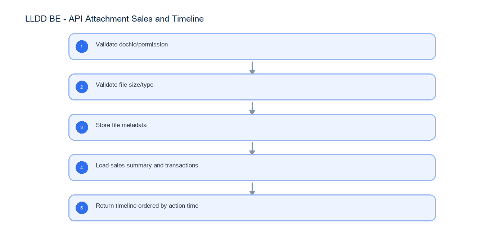

# LLDD BE - API Attachment Sales and Timeline

SBP Mall - ระบบประกันรายได้ | Low Level Design Document

## 1. Overview

| รายการ | รายละเอียด |
| --- | --- |
| Track | BE |
| Estimate | **34 ชั่วโมง** = implementation 26 + unit test 8 (30%) |
| Owner | Peerakorn <Pete> Sakunkaewphithak |
| Target repository | `SBP/srm-sps-spsap-store-backend` (NestJS + TypeORM · schema `sps_store`) + `SBP/srm-sps-spsap-sbp-bff` (forward ผ่าน client service · ไม่มี DB) สำหรับเส้นที่ FE เรียก |
| Objective | ออกแบบ APIs สำหรับไฟล์แนบ ข้อมูลยอดขายเพิ่มเติม และ timeline/history |

Common contract reference: ทุกหัวข้อ API/FE ต้องยึด LLDD-BE-API-Common-Contracts และ LLDD-FE-Integration-Contracts สำหรับ error/auth/format/pagination/action/RBAC ก่อนลงรายละเอียดเฉพาะหน้าหรือเฉพาะ endpoint

## 2. Screen / Functional Scope

- Attachment metadata
- Upload/download adapter
- Sales 4 windows
- Timeline query
- File validation

## 3. Screenshot Reference

ไม่มีภาพหน้าจอสำหรับหัวข้อนี้ — เป็นเอกสารฝั่ง Backend/Batch ที่ไม่มี UI (ภาพหน้าจอทั้งหมดอยู่ในเอกสารชุด FE)

## 4. Implementation Flow Diagram (Reference)



_รูปที่ 1: Implementation flow reference: LLDD BE - API Attachment Sales and Timeline_

## 5. Field, Format, and Validation

| Field / UI | Format | Validation | Behavior |
| --- | --- | --- | --- |
| docNo | YYYY/xxxxx | required when opening existing document | ใช้ปี **ค.ศ.** และ running 5 หลัก (มติ 2026-08-06) |
| storeCode | string 5 digits | numeric length = 5 | แสดง leading zero |
| amount | number, 2 decimals | >= 0 | format `#,##0.00` บาท |
| percent | number, 2 decimals | 0-100 | ใช้ `%` และรวม allocation ต้องเท่ากับ 100 |
| date | DD/MM/YYYY | valid date | payload เป็น ISO ค.ศ. · FE แสดง ค.ศ. เป็นค่าเริ่มต้น (DatePicker buddhistEra=false) แสดง พ.ศ. เฉพาะจุดที่เปิด flag |
| attachment | file | <= 5 MB | รองรับ vsd, dwg, afp, pdf, mda, zip, wav, mp3, gif, jpg, tif, tiff, htm, html, txt, xml, mpg, mov, ivs, doc, docx, xls, xlsx, pps, ppt, pot, csv |
| file | multipart | <=5MB | validate extension and content type |
| sectionCode | string | required on upload | บันทึกว่าแนบในขั้นไหน |

### 5.1 Attachment Storage and Security Design

Attachment API ต้องจัดการ binary file จริง ไม่ใช่บันทึก metadata อย่างเดียว โดย BE เป็นเจ้าของ storage adapter, virus scan, authorization และ streaming response

| Item | Required value / convention | Developer note |
| --- | --- | --- |
| Storage provider | `OBJECT_STORAGE` ผ่าน adapter กลาง | รองรับ S3-compatible/MinIO/NAS ตาม env โดย service code ไม่ผูก vendor โดยตรง |
| Bucket/container | `sbpgi-{env}-attachments` | แยก dev/test/prod และกำหนด lifecycle/backup ที่ infra |
| Object key | `documents/{year}/{docNoSafe}/{attachId}/{sha256Prefix}-{safeFileName}` | `docNoSafe` แทน `/` ด้วย `-`; sanitize filename ก่อนใช้ใน key |
| Quarantine path | `quarantine/{runDate}/{uuid}` | ไฟล์ใหม่ต้องเข้า quarantine ก่อน scan; ยัง download ไม่ได้ |
| Allowed extension | vsd, dwg, afp, pdf, mda, zip, wav, mp3, gif, jpg, tif, tiff, htm, html, txt, xml, mpg, mov, ivs, doc, docx, xls, xlsx, pps, ppt, pot, csv | ตรวจทั้ง extension และ content type/magic bytes เท่าที่ platform รองรับ |
| AV scan status | PENDING -> CLEAN หรือ BLOCKED/FAILED | download อนุญาตเฉพาะ CLEAN; BLOCKED/FAILED คืน FILE_SCAN_BLOCKED |
| Max size | 5 MB ต่อไฟล์ | เกินให้คืน 413 FILE_TOO_LARGE ก่อน upload เข้า storage |

### 5.2 Attachment Metadata Fields

| Field | Meaning | Required behavior |
| --- | --- | --- |
| attachId | primary key/identifier | คืนให้ FE หลัง upload |
| docNo | เลขเอกสาร | attachment ต้อง belong กับ document นี้เท่านั้น |
| sectionCode | workflow section ตอน upload | บันทึกจาก request และ validate กับ current task/permission |
| originalFileName | ชื่อไฟล์จากผู้ใช้ | เก็บเพื่อแสดงผลและ Content-Disposition |
| contentType | MIME type | ใช้ร่วมกับ extension validation |
| fileSizeBytes | ขนาดไฟล์ | ต้อง <= 5 MB |
| storageProvider/bucketName/objectKey | ตำแหน่ง binary | ห้าม expose objectKey ตรงให้ FE |
| sha256 | checksum | ใช้ตรวจ duplicate/corruption |
| scanStatus/scannedAt/scanMessage | ผล AV scan | download ได้เฉพาะ CLEAN |
| uploadedBy/uploadedAt/deletedFlag | audit metadata | soft delete เท่านั้นเมื่อมีการลบภายหลัง |

### 5.3 Upload Flow

| Step | Backend behavior | Error / response |
| --- | --- | --- |
| 1. Authorize | ตรวจผู้ใช้มีสิทธิ์อ่านเอกสารและ canUploadAttachment/current task owner | ไม่มีสิทธิ์คืน 403 |
| 2. Validate multipart | ตรวจ file present, size, extension, content type, sectionCode | คืน 400/413/415 ตาม catalog |
| 3. Hash and quarantine | stream file คำนวณ sha256 และเขียน quarantine object | storage fail คืน 503 และไม่ insert metadata CLEAN |
| 4. Scan | เรียก AV scanner แบบ sync หรือ async ตาม platform; ระหว่าง PENDING ห้าม download | พบไวรัสตั้ง BLOCKED และคืน FILE_SCAN_BLOCKED |
| 5. Promote | เมื่อ CLEAN ให้ move/copy ไป objectKey ถาวรและ insert/update metadata | metadata ต้องมี objectKey และ scanStatus=CLEAN |
| 6. Respond | คืน attachId, fileName, fileSizeBytes, scanStatus, uploadedAt | ไม่คืน bucket/objectKey ให้ FE |

### 5.4 Download Flow and Authorization

| Step | Backend behavior | Error / response |
| --- | --- | --- |
| 1. Validate path | ตรวจ docNo/attachId และ attachment belongs to docNo | ไม่พบคืน 404 |
| 2. Authorize read | สิทธิ์เท่ากับ document read หรือ report/admin ที่ได้รับสิทธิ์ | ไม่มีสิทธิ์คืน 403 |
| 3. Check scan | อนุญาตเฉพาะ scanStatus=CLEAN และ deletedFlag=false | PENDING/BLOCKED/FAILED คืน 422 FILE_SCAN_BLOCKED |
| 4. Stream | stream binary ผ่าน BE หรือ signed internal stream ตาม platform | ตั้ง Content-Type และ Content-Disposition จาก metadata |
| 5. Audit | บันทึก download audit เมื่อ policy กำหนด | ต้อง trace userId/docNo/attachId/requestId ได้ |

### 5.5 Download Endpoint Contract

| Method | Path | Response |
| --- | --- | --- |
| GET | /api/v1/documents/{docNo}/attachments/{attachId}/download | binary stream; headers Content-Type, Content-Length, Content-Disposition |

### 5.6 Attachment Repository SQL Reference

```sql
-- Insert metadata after storage write and AV scan pass.
INSERT INTO document_attachments (
    doc_no, section_code, file_name, mime_type, file_size,
    storage_provider, bucket, object_key, sha256,
    scan_status, scanned_at, uploaded_by, uploaded_at, deleted_flag
) VALUES (
    :docNo, :sectionCode, :fileName, :mimeType, :fileSize,
    :storageProvider, :bucket, :objectKey, :sha256,
    'CLEAN', CURRENT_TIMESTAMP, :userId, CURRENT_TIMESTAMP, 'N'
)
RETURNING attach_id;

-- Load attachment for download. Authorization is checked in service before streaming.
SELECT
    attach_id, doc_no, file_name, mime_type, file_size,
    storage_provider, bucket, object_key, sha256, scan_status
FROM document_attachments
WHERE doc_no = :docNo
  AND attach_id = :attachId
  AND deleted_flag = 'N';
```

### 5.9 Input / Progress / Output Contract

| Stage | Contract for implementation |
| --- | --- |
| Input | POST /api/v1/documents/{docNo}/attachments; GET /api/v1/documents/{docNo}/attachments/{attachId}/download; GET /api/v1/documents/{docNo}/attachments/download-all |
| Progress | Validate docNo/permission; Validate file size/type; Store file metadata; Load sales summary and transactions |
| Output | document_attachments |

### 5.90 Endpoint Implementation Contract

| Endpoint | Use-case owner | Service/repository behavior | Definition of done |
| --- | --- | --- | --- |
| POST /api/v1/documents/{docNo}/attachments | Upload attachment API | Validate docNo/permission | file >5MB returns 413 |
| GET /api/v1/documents/{docNo}/attachments/{attachId}/download | ดาวน์โหลดไฟล์แนบรายไฟล์ผ่าน BE — ตรวจสิทธิ์เอกสาร + attachment ต้องเป็นของ docNo + scan_status=CLEAN ก่อน stream | Validate file size/type | unsupported file type returns 415 |
| GET /api/v1/documents/{docNo}/attachments/download-all | ดาวน์โหลดไฟล์แนบทั้งหมดเป็น .zip — ไม่มีไฟล์ที่ผ่าน scan เลยตอบ 404 (ไม่คืน zip เปล่า) | Store file metadata | sales windows are ordered |
| GET /api/v1/documents/{docNo}/sales | Sales detail API | Load sales summary and transactions | timeline newest/oldest order matches FE expectation |
| GET /api/v1/documents/{docNo}/timeline | Timeline/history API | Return timeline ordered by action time | file >5MB returns 413 |

### 5.91 Backend Execution Sequence

| Step | Behavior specific to this LLDD | Failure/test evidence |
| --- | --- | --- |
| 1 | Validate docNo/permission | upload success |
| 2 | Validate file size/type | upload too large |
| 3 | Store file metadata | download missing file |
| 4 | Load sales summary and transactions | sales not found |
| 5 | Return timeline ordered by action time | timeline empty |

## 6. Button / User Action Mapping

| Action | Trigger | API / Service | Expected Result |
| --- | --- | --- | --- |
| Upload attachment | POST multipart | attachment.service.upload | store file and metadata |
| Download attachment | GET | attachment.service.download | stream file |
| Get sales | GET | sales.service.getDocumentSales | return sales windows |

## 7. API Contract

### POST /api/v1/documents/{docNo}/attachments

Upload attachment API

#### Request

```json
{
  "file": "multipart <= 5MB",
  "sectionCode": "06"
}
```

#### Request Field Schema

| Field | Type | Required | Constraint / Meaning |
| --- | --- | --- | --- |
| file | string | Yes | UTF-8; use value domain described by endpoint purpose |
| sectionCode | string | Yes | canonical code; do not replace with display label |

#### Response

```json
{
  "attachId": 771,
  "fileName": "evidence.pdf"
}
```

#### Response Field Schema

| Field | Type | Required | Constraint / Meaning |
| --- | --- | --- | --- |
| attachId | integer | Yes | UTF-8; use value domain described by endpoint purpose |
| fileName | string | Yes | UTF-8; use value domain described by endpoint purpose |

### GET /api/v1/documents/{docNo}/attachments/{attachId}/download

ดาวน์โหลดไฟล์แนบรายไฟล์ผ่าน BE — ตรวจสิทธิ์เอกสาร + attachment ต้องเป็นของ docNo + scan_status=CLEAN ก่อน stream

#### Query Params

```json
{}
```

#### Request Field Schema

| Field | Type | Required | Constraint / Meaning |
| --- | --- | --- | --- |
| - | none | No | No fields |

#### Response

```json
{
  "contentType": "application/pdf",
  "note": "binary stream · ไฟล์จริงอยู่บน S3 ผ่าน service ของระบบ SBP เดิม"
}
```

#### Response Field Schema

| Field | Type | Required | Constraint / Meaning |
| --- | --- | --- | --- |
| contentType | string | Yes | UTF-8; use value domain described by endpoint purpose |
| note | string | Yes | UTF-8; use value domain described by endpoint purpose |

### GET /api/v1/documents/{docNo}/attachments/download-all

ดาวน์โหลดไฟล์แนบทั้งหมดเป็น .zip — ไม่มีไฟล์ที่ผ่าน scan เลยตอบ 404 (ไม่คืน zip เปล่า)

#### Query Params

```json
{}
```

#### Request Field Schema

| Field | Type | Required | Constraint / Meaning |
| --- | --- | --- | --- |
| - | none | No | No fields |

#### Response

```json
{
  "contentType": "application/zip",
  "fileName": "2026-00123-attachments.zip"
}
```

#### Response Field Schema

| Field | Type | Required | Constraint / Meaning |
| --- | --- | --- | --- |
| contentType | string | Yes | UTF-8; use value domain described by endpoint purpose |
| fileName | string | Yes | UTF-8; use value domain described by endpoint purpose |

### GET /api/v1/documents/{docNo}/sales

Sales detail API

#### Query Params

```json
{
  "docNo": "2026/00123"
}
```

#### Request Field Schema

| Field | Type | Required | Constraint / Meaning |
| --- | --- | --- | --- |
| docNo | string | No | ค.ศ. YYYY/xxxxx |

#### Response

```json
{
  "growthRateDiff": -12.45,
  "totalWorkingDays": 60,
  "windows": [
    {
      "label": "ก่อนเปิด 15 วัน",
      "rows": []
    }
  ]
}
```

#### Response Field Schema

| Field | Type | Required | Constraint / Meaning |
| --- | --- | --- | --- |
| growthRateDiff | number | Yes | UTF-8; use value domain described by endpoint purpose |
| totalWorkingDays | integer | Yes | UTF-8; use value domain described by endpoint purpose |
| windows | array<object> | Yes | JSON array; element type shown in Type column |
| windows[].label | string | Yes | UTF-8; use value domain described by endpoint purpose |
| windows[].rows | array<object> | Yes | JSON array; element type shown in Type column |

### GET /api/v1/documents/{docNo}/timeline

Timeline/history API

#### Query Params

```json
{
  "docNo": "2026/00123"
}
```

#### Request Field Schema

| Field | Type | Required | Constraint / Meaning |
| --- | --- | --- | --- |
| docNo | string | No | ค.ศ. YYYY/xxxxx |

#### Response

```json
{
  "items": []
}
```

#### Response Field Schema

| Field | Type | Required | Constraint / Meaning |
| --- | --- | --- | --- |
| items | array<object> | Yes | JSON array; element type shown in Type column |

## 8. Reference DB Mapping (No Database Page Work)

ส่วนนี้เป็นข้อมูลอ้างอิงสำหรับการ implement API/Job เท่านั้น ไม่ใช่งานสร้างหน้า Database, ไม่ใช่งานออกแบบ DB page และไม่ถูกนับเป็น deliverable แยกของ FE/BE

| Table / Object | R/W | Usage |
| --- | --- | --- |
| document_attachments | R/W | metadata ไฟล์แนบและ section ที่แนบ |
| compensation_documents | R | ตรวจเอกสารและ impact_process_id |
| fgi_impact_sales_summaries | R | หัวข้อมูลยอดขาย growth_rate_diff/total_working_days |
| sales_transactions | R | ยอดขายรายวัน 4 windows |
| consideration_logs | R | timeline/history |

## 9. Skeleton Code (store-backend + BFF)

โครงโค้ดตั้งต้นของเอกสารฉบับนี้ ยึด convention จริงของ `srm-sps-spsap-store-backend` (NestJS 11 + TypeORM, schema `sps_store`, custom provider `DATA_SOURCE` ที่ route SELECT ไป slave pool) และ `srm-sps-spsap-sbp-bff` (ไม่มี DB, forward ผ่าน client service). ทุกจุดที่ต้องเติมกำกับด้วย `// TODO:` และ response ทุกเส้นถูกห่อเป็น `{success, data}` โดย ResponseInterceptor อยู่แล้ว จึงห้าม service ห่อซ้ำ

#### 9.1 ผังไฟล์ที่ต้องสร้าง

| Path | หน้าที่ |
| --- | --- |
| store-backend · src/modules/sbpgi-attachment-sales-timeline/sbpgi-attachment-sales-timeline.controller.ts | route ทั้งหมดของเอกสารนี้ (4 เส้น) + `@UseGuards(HttpHeaderGuard)` + `@UserId()` |
| store-backend · src/modules/sbpgi-attachment-sales-timeline/sbpgi-attachment-sales-timeline.service.ts | business logic — inject `'DATA_SOURCE'` แล้วยิง raw SQL, mutation ใช้ QueryRunner transaction |
| store-backend · src/modules/sbpgi-attachment-sales-timeline/sbpgi-attachment-sales-timeline.sql.ts | เก็บ SQL ต่อ endpoint (คัดจากหัวข้อ 10) แยกออกจาก service ให้ทดสอบ/รีวิวง่าย |
| store-backend · src/modules/sbpgi-attachment-sales-timeline/dto/sbpgi-attachment-sales-timeline.dto.ts | DTO + class-validator ตาม validation ในหัวข้อฟิลด์ของเอกสารนี้ |
| store-backend · src/modules/sbpgi-attachment-sales-timeline/sbpgi-attachment-sales-timeline.module.ts | ประกอบ controller/service/providers แล้ว register ที่ `app.module.ts` |
| store-backend · src/entitys/document-attachments.entity.ts | entity ของ `document_attachments` (`@Entity({schema: process.env.DB_SCHEMA})`, ไม่ประกาศ relation) — **entity ร่วมหลายเอกสาร: ประกาศครั้งเดียวแล้วอ้างอิง อย่าสร้างซ้ำ** |
| store-backend · src/entitys/compensation-documents.entity.ts | entity ของ `compensation_documents` (`@Entity({schema: process.env.DB_SCHEMA})`, ไม่ประกาศ relation) — **entity ร่วมหลายเอกสาร: ประกาศครั้งเดียวแล้วอ้างอิง อย่าสร้างซ้ำ** |
| store-backend · src/entitys/fgi-impact-sales-summaries.entity.ts | entity ของ `fgi_impact_sales_summaries` (`@Entity({schema: process.env.DB_SCHEMA})`, ไม่ประกาศ relation) |
| store-backend · src/providers/sbpgi/sbpgi.ts | repository provider แบบ factory ผูก token string กับ `DATA_SOURCE` — **ไฟล์ร่วมของทุกเอกสาร BE ให้ merge array เพิ่ม ห้ามเขียนทับ** |
| store-backend · sql/deploy-sbpgi-attachment-sales-timeline.sql | DDL production แบบ idempotent (ทีมนี้ไม่ใช้ migration เป็นหลัก) |
| BFF · src/common/client-services/sbpgi-client.service.ts | client ต่อจาก `BaseClientService` ตั้ง baseUrl + `x-api-key` ตอน `onModuleInit` |
| BFF · src/modules/sbpgi-attachment-sales-timeline/sbpgi-attachment-sales-timeline.controller.ts | route ฝั่ง BFF prefix `/bff/sbpgi/…` + `@UseGuards(AuthGuard('jwt'))` |
| BFF · src/modules/sbpgi-attachment-sales-timeline/sbpgi-attachment-sales-timeline.service.ts | แนบ `x-user-id` / `x-user-group-id` / `x-user-permissions` แล้ว forward ไป backend |

เส้นที่ไม่ต้อง implement ใหม่ในเอกสารนี้:

| Endpoint | จุดประสงค์ | เหตุผล |
| --- | --- | --- |
| GET /api/v1/documents/{docNo}/timeline | Timeline/history API | **reference — implement ที่เอกสาร `LLDD-BE-API-Document-Workflow-Actions`** (1 เส้น = 1 เจ้าของ ไม่ประกาศ controller ซ้ำ ไม่งั้น NestJS จะ register ทับกันเงียบ ๆ) |

#### 9.2 Controller (store-backend)

```ts
// src/modules/sbpgi-attachment-sales-timeline/sbpgi-attachment-sales-timeline.controller.ts
import { Body, Controller, Get, Param, Post, UseGuards } from '@nestjs/common';
import { HttpHeaderGuard } from '../../guards/http-header.guard';
import { UserId } from '../../common/decorators/user-id.decorator';
import { SbpgiAttachmentSalesTimelineService } from './sbpgi-attachment-sales-timeline.service';
import { CreateDocumentsAttachmentsBodyDto } from './dto/sbpgi-attachment-sales-timeline.dto';

// LLDD BE - API Attachment Sales and Timeline
// BFF เรียกด้วย x-api-key และแนบ x-user-id / x-user-group-id / x-user-permissions มาให้
@Controller('sbpgi/documents')
@UseGuards(HttpHeaderGuard)
export class SbpgiAttachmentSalesTimelineController {
  constructor(private readonly service: SbpgiAttachmentSalesTimelineService) {}

  // POST /api/v1/documents/{docNo}/attachments — Upload attachment API
  @Post(':docNo/attachments')
  createDocumentsAttachments(
    @Param('docNo') docNo: string,
    @Body() body: CreateDocumentsAttachmentsBodyDto,
    @UserId() userId: string,
  ) {
    // TODO: ตรวจ x-user-permissions ก่อนเรียก service ถ้า endpoint นี้จำกัดสิทธิ์เมนู
    return this.service.createDocumentsAttachments(docNo, body, userId);
  }

  // GET /api/v1/documents/{docNo}/attachments/{attachId}/download — ดาวน์โหลดไฟล์แนบรายไฟล์ผ่าน BE — ตรวจสิทธิ์เอกสาร + attachment ต้องเป…
  @Get(':docNo/attachments/:attachId/download')
  getDocumentsAttachmentsDownload(
    @Param('docNo') docNo: string,
    @Param('attachId') attachId: string,
    @UserId() userId: string,
  ) {
    // TODO: ตรวจ x-user-permissions ก่อนเรียก service ถ้า endpoint นี้จำกัดสิทธิ์เมนู
    return this.service.getDocumentsAttachmentsDownload(docNo, attachId, userId);
  }

  // GET /api/v1/documents/{docNo}/attachments/download-all — ดาวน์โหลดไฟล์แนบทั้งหมดเป็น .zip — ไม่มีไฟล์ที่ผ่าน scan เลยตอบ 404 (…
  @Get(':docNo/attachments/download-all')
  getDocumentsAttachmentsDownloadAll(@Param('docNo') docNo: string, @UserId() userId: string) {
    // TODO: ตรวจ x-user-permissions ก่อนเรียก service ถ้า endpoint นี้จำกัดสิทธิ์เมนู
    return this.service.getDocumentsAttachmentsDownloadAll(docNo, userId);
  }

  // GET /api/v1/documents/{docNo}/sales — Sales detail API
  @Get(':docNo/sales')
  getDocumentsSales(@Param('docNo') docNo: string, @UserId() userId: string) {
    // TODO: ตรวจ x-user-permissions ก่อนเรียก service ถ้า endpoint นี้จำกัดสิทธิ์เมนู
    return this.service.getDocumentsSales(docNo, userId);
  }
}
```

#### 9.3 DTO + Validation

```ts
// src/modules/sbpgi-attachment-sales-timeline/dto/sbpgi-attachment-sales-timeline.dto.ts
import { Type } from 'class-transformer';
import {
  IsArray, IsBoolean, IsIn, IsInt, IsNotEmpty, IsNumber, IsObject, IsOptional,
  IsString, Matches, Max, MaxLength, Min,
} from 'class-validator';

// ValidationPipe ระดับ global ตั้ง whitelist + forbidNonWhitelisted + transform ไว้แล้ว (main.ts)
// property ที่ไม่ประกาศที่นี่จะถูก reject เป็น 400 อัตโนมัติ

// body ของ POST /api/v1/documents/{docNo}/attachments
export class CreateDocumentsAttachmentsBodyDto {
  /** validate extension and content type */
  // TODO: ใช้ FileInterceptor + ValidationPipe แยก ไม่ผ่าน class-validator
  file: Express.Multer.File;

  /** บันทึกว่าแนบในขั้นไหน */
  @IsNotEmpty()
  @IsString()
  sectionCode: string;
}
```

#### 9.4 Service (inject `DATA_SOURCE` + raw SQL)

service ประกาศ method ครบทุกเส้นที่ controller เรียก และ **signature มาจากแหล่งเดียวกับ controller** (จำนวน/ลำดับพารามิเตอร์จึงตรงกันเสมอ) — เส้นที่ยังไม่ได้ implement เป็น stub ที่ `throw new NotImplementedException(...)` ให้ TypeScript compile ผ่านตั้งแต่วันแรก

```ts
// src/modules/sbpgi-attachment-sales-timeline/sbpgi-attachment-sales-timeline.service.ts
import { Inject, Injectable, Logger, NotFoundException, NotImplementedException } from '@nestjs/common';
import { DataSource } from 'typeorm';
import { SBPGI_SQL } from './sbpgi-attachment-sales-timeline.sql';

@Injectable()
export class SbpgiAttachmentSalesTimelineService {
  private readonly logger = new Logger(SbpgiAttachmentSalesTimelineService.name);

  constructor(
    // DATA_SOURCE override query(): SELECT/WITH ไป slave pool, write ไป master
    @Inject('DATA_SOURCE') private readonly dataSource: DataSource,
  ) {}

  // POST /api/v1/documents/{docNo}/attachments — Upload attachment API
  // mutation ต้องอยู่ใน transaction เดียว (ไม่มี audit ของ master แล้ว · 2026-08-07)
  async createDocumentsAttachments(docNo: string, body: CreateDocumentsAttachmentsBodyDto, userId: string) {
    const runner = this.dataSource.createQueryRunner();
    await runner.connect();
    await runner.startTransaction();
    try {
      // TODO: lock แถวเป้าหมายของ document_attachments ด้วย SELECT ... FOR UPDATE ก่อนเขียน
      const [current] = await runner.query(SBPGI_SQL.createDocumentsAttachmentsLock, [docNo]);
      if (!current) {
        throw new NotFoundException('ไม่พบข้อมูลที่ต้องการ');
      }
      await runner.query(SBPGI_SQL.createDocumentsAttachments, [/* TODO: ผูกค่าจาก body */]);
      await runner.commitTransaction();
      return { message: 'saved' };
    } catch (error) {
      await runner.rollbackTransaction();
      this.logger.error(error);
      throw error;
    } finally {
      await runner.release();
    }
  }

  // GET /api/v1/documents/{docNo}/attachments/{attachId}/download — ดาวน์โหลดไฟล์แนบรายไฟล์ผ่าน BE — ตรวจสิทธิ์เอกสาร + attachment ต้องเป…
  async getDocumentsAttachmentsDownload(docNo: string, attachId: string, userId: string) {
    const page = 1;
    const size = 100; // endpoint นี้ไม่มี query param — ไม่แบ่งหน้า
    // SQL เต็มอยู่ในหัวข้อ Database SQL ของเอกสารนี้ (คีย์ 'GET /api/v1/documents/{docNo}/attachments/{attachId}/download')
    // ⚠️ SQL ตัวอย่างบางเส้นเขียนด้วย named parameter (:size/:offset) แต่ dataSource.query()
    //    รับเฉพาะ positional $1..$n — ต้องแปลงชื่อเป็นลำดับก่อน หรือใช้ QueryBuilder แทน
    const rows = await this.dataSource.query(SBPGI_SQL.getDocumentsAttachmentsDownload, [
      // TODO: เรียงพารามิเตอร์ให้ตรงกับ $1..$n ของ SQL จริง
      userId, (page - 1) * size, size,
    ]);
    // TODO: total ต้องมาจาก COUNT(*) แยก query หรือ window function ไม่ใช่ rows.length
    return { page, size, total: rows.length, items: rows };
  }

  // GET /api/v1/documents/{docNo}/attachments/download-all — ดาวน์โหลดไฟล์แนบทั้งหมดเป็น .zip — ไม่มีไฟล์ที่ผ่าน scan เลยตอบ 404 (…
  async getDocumentsAttachmentsDownloadAll(docNo: string, userId: string) {
    // TODO: implement ตาม business rule ของ GET /api/v1/documents/{docNo}/attachments/download-all
    //       (SQL อยู่ในหัวข้อ Database SQL คีย์ 'GET /api/v1/documents/{docNo}/attachments/download-all')
    throw new NotImplementedException('getDocumentsAttachmentsDownloadAll ยังไม่ implement');
  }

  // GET /api/v1/documents/{docNo}/sales — Sales detail API
  async getDocumentsSales(docNo: string, userId: string) {
    // TODO: implement ตาม business rule ของ GET /api/v1/documents/{docNo}/sales
    //       (SQL อยู่ในหัวข้อ Database SQL คีย์ 'GET /api/v1/documents/{docNo}/sales')
    throw new NotImplementedException('getDocumentsSales ยังไม่ implement');
  }
}
```

#### 9.5 Entity (TypeORM)

```ts
// src/entitys/document-attachments.entity.ts
import { Column, Entity, PrimaryColumn } from 'typeorm';

@Entity({ name: 'document_attachments', schema: process.env.DB_SCHEMA })
export class DocumentAttachment {
  @PrimaryColumn({ name: 'id', type: 'bigint' })
  id: number;

  @Column({ name: 'doc_no', type: 'varchar', length: 12 })
  docNo: string;

  @Column({ name: 'section_code', type: 'varchar', length: 2 })
  sectionCode: string;

  @Column({ name: 'file_name', type: 'varchar', length: 255 })
  fileName: string;

  @Column({ name: 'file_path', type: 'varchar', length: 1000 })
  filePath: string;

  @Column({ name: 'file_size', type: 'int' })
  fileSize: number;

  @Column({ name: 'content_type', type: 'varchar', length: 100, nullable: true })
  contentType?: string;

  @Column({ name: 'upload_status', type: 'varchar', length: 1, nullable: true })
  uploadStatus?: string;

  @Column({ name: 'upload_message', type: 'varchar', length: 500, nullable: true })
  uploadMessage?: string;

  @Column({ name: 'purge_flag', type: 'char', length: 1, nullable: true })
  purgeFlag?: string;

  @Column({ name: 'uploaded_by', type: 'varchar', length: 50 })
  uploadedBy: string;

  @Column({ name: 'uploaded_at', type: 'timestamptz' })
  uploadedAt: Date;

  // TODO: ตรวจความยาว/precision กับ DDL จริงใน sql/deploy-sbpgi-*.sql ก่อน merge
  //       entity ชุดนี้ไม่ประกาศ relation ตาม convention (join ด้วย raw SQL)
}
```

```ts
// src/entitys/compensation-documents.entity.ts
import { Column, Entity, PrimaryColumn } from 'typeorm';

@Entity({ name: 'compensation_documents', schema: process.env.DB_SCHEMA })
export class CompensationDocument {
  @PrimaryColumn({ name: 'doc_no', type: 'varchar', length: 12 })
  docNo: string;

  @Column({ name: 'impact_process_id', type: 'bigint', nullable: true })
  impactProcessId?: number;

  @Column({ name: 'impacted_store_code', type: 'char', length: 5 })
  impactedStoreCode: string;

  @Column({ name: 'status_code', type: 'varchar', length: 2 })
  statusCode: string;

  @Column({ name: 'current_section_code', type: 'varchar', length: 2 })
  currentSectionCode: string;

  @Column({ name: 'round_no', type: 'int', nullable: true })
  roundNo?: number;

  @Column({ name: 'loop_no', type: 'int', nullable: true })
  loopNo?: number;

  @Column({ name: 'statement_id', type: 'varchar', length: 30, nullable: true })
  statementId?: string;

  @Column({ name: 'statement_date', type: 'date', nullable: true })
  statementDate?: Date;

  @Column({ name: 'account_year', type: 'int', nullable: true })
  accountYear?: number;

  @Column({ name: 'account_month', type: 'int', nullable: true })
  accountMonth?: number;

  @Column({ name: 'compensate_amount', type: 'numeric', precision: 15, scale: 2, nullable: true })
  compensateAmount?: string;

  @Column({ name: 'allmap_url', type: 'text', nullable: true })
  allmapUrl?: string;

  @Column({ name: 'approver_snapshot', type: 'jsonb', nullable: true })
  approverSnapshot?: Record<string, unknown>;

  @Column({ name: 'created_at', type: 'timestamptz', nullable: true })
  createdAt?: Date;

  @Column({ name: 'updated_at', type: 'timestamptz', nullable: true })
  updatedAt?: Date;

  // TODO: ตรวจความยาว/precision กับ DDL จริงใน sql/deploy-sbpgi-*.sql ก่อน merge
  //       entity ชุดนี้ไม่ประกาศ relation ตาม convention (join ด้วย raw SQL)
}
```

ตารางที่เหลือของเอกสารนี้ (`fgi_impact_sales_summaries`, `sales_transactions`, `consideration_logs`) ใช้รูปแบบ entity เดียวกัน — คอลัมน์อ้างจาก `database.md`

#### 9.6 Repository Providers + Module wiring

```ts
// src/providers/sbpgi/sbpgi.ts — repository provider แบบ factory (ไม่ใช้ TypeOrmModule.forFeature)
// convention ของโฟลเดอร์ providers คือ 1 ไฟล์ต่อโดเมน ตั้งชื่อตามโดเมน (business_user/business_user.ts,
// common_code/common_code.ts …) ไม่ใช่ index.ts
//
// ⚠️ ไฟล์นี้ใช้ร่วมกันทุกเอกสาร BE ของ SBPGI — ให้ **merge array เพิ่ม** เข้าไฟล์เดิม ห้ามเขียนทับ
//    (ชื่อ const แยกต่อเอกสารไว้แล้วเพื่อไม่ให้ชนกัน)
import { DataSource } from 'typeorm';
import { DocumentAttachment } from '../../entitys/document-attachments.entity';
import { CompensationDocument } from '../../entitys/compensation-documents.entity';
import { FgiImpactSalesSummary } from '../../entitys/fgi-impact-sales-summaries.entity';

export const sbpgiAttachmentSalesTimelineProviders = [
  {
    provide: 'DOCUMENT_ATTACHMENT_REPOSITORY',
    useFactory: (dataSource: DataSource) => dataSource.getRepository(DocumentAttachment),
    inject: ['DATA_SOURCE'],
  },
  {
    provide: 'COMPENSATION_DOCUMENT_REPOSITORY',
    useFactory: (dataSource: DataSource) => dataSource.getRepository(CompensationDocument),
    inject: ['DATA_SOURCE'],
  },
  {
    provide: 'FGI_IMPACT_SALES_SUMMARIES_REPOSITORY',
    useFactory: (dataSource: DataSource) => dataSource.getRepository(FgiImpactSalesSummary),
    inject: ['DATA_SOURCE'],
  },
];

// src/modules/sbpgi-attachment-sales-timeline/sbpgi-attachment-sales-timeline.module.ts
import { MiddlewareConsumer, Module, NestModule } from '@nestjs/common';
import { DatabaseModule } from '../../database/database.module';
// UserContextMiddleware อ่าน header x-user-id แล้วเซ็ต request.userId ที่ @UserId() ใช้
// — app.module.ts **ไม่ได้** apply แบบ global (มีแค่ HttpContext/LoggerContext) แต่ละโมดูลต้อง apply เอง
// (ดู evaluation-process.module.ts / inform-evaluate.module.ts / cooperation-request.module.ts)
import { UserContextMiddleware } from '../../common/middleware/user-context.middleware';
import { sbpgiAttachmentSalesTimelineProviders } from '../../providers/sbpgi/sbpgi';
import { SbpgiAttachmentSalesTimelineController } from './sbpgi-attachment-sales-timeline.controller';
import { SbpgiAttachmentSalesTimelineService } from './sbpgi-attachment-sales-timeline.service';

@Module({
  imports: [DatabaseModule],
  controllers: [SbpgiAttachmentSalesTimelineController],
  providers: [SbpgiAttachmentSalesTimelineService, ...sbpgiAttachmentSalesTimelineProviders],
  exports: [SbpgiAttachmentSalesTimelineService],
})
export class SbpgiAttachmentSalesTimelineModule implements NestModule {
  configure(consumer: MiddlewareConsumer) {
    // ถ้าไม่ apply ตรงนี้ userId จะเป็น undefined เงียบ ๆ ทุก endpoint
    consumer.apply(UserContextMiddleware).forRoutes(SbpgiAttachmentSalesTimelineController);
  }
}
// TODO: register module นี้ใน app.module.ts (imports) พร้อมกับโมดูล SBPGI ตัวอื่น
```

#### 9.7 BFF Proxy (module + controller + client service)

BFF ยังไม่มีฟีเจอร์ประกันรายได้เลย จึงต้องสร้าง module ใหม่ + client service ใหม่ทั้งชุด และเลือก prefix แบบเดียวทั้งโมดูล (ที่นี่ใช้ `/bff/sbpgi/…`) เพื่อไม่ให้ปนแบบที่มี/ไม่มี `/bff` เหมือนโมดูลเดิม

```ts
// src/common/client-services/sbpgi-client.service.ts
import { Injectable, Logger, OnModuleInit } from '@nestjs/common';
import { BaseClientService } from './base-client.service';

@Injectable()
export class SbpgiClientService extends BaseClientService implements OnModuleInit {
  protected logger: Logger = new Logger(SbpgiClientService.name);

  onModuleInit() {
    // TODO: ถ้า deploy SBPGI แยก service ให้เพิ่ม API_SBPGI_BACKEND_* ใน AppConfigService
    //       ตอนนี้ชี้ store backend ตัวเดียวกับ StoreClientService
    this.defaultHeaders[this.config.api.store.key.name] = this.config.api.store.key.value;
    this.baseUrl = this.config.api.store.url;
  }
}
// BaseClientService แกะ { success, data } ให้แล้ว — service ฝั่ง BFF จึงได้ data ตรง ๆ
// TODO: เพิ่ม SbpgiClientService ใน providers/exports ของ ClientServiceModule (@Global)
```

```ts
// src/modules/sbpgi-attachment-sales-timeline/sbpgi-attachment-sales-timeline.service.ts (BFF)
import { Injectable } from '@nestjs/common';
import { SbpgiClientService } from '@common/client-services/sbpgi-client.service';

@Injectable()
export class SbpgiAttachmentSalesTimelineBffService {
  constructor(private readonly client: SbpgiClientService) {}

  // BFF ไม่มี DB — หน้าที่เดียวคือแนบ user context แล้ว forward
  private userHeaders(user: any) {
    return {
      'x-user-id': user?.userId,
      'x-user-group-id': user?.groupId,
      'x-user-permissions': (user?.permissions ?? []).join(','),
    };
  }

  createDocumentsAttachments(docNo: string, body: any, user: any) {
    return this.client.post(`/api/v1/documents/${docNo}/attachments`, body, { headers: this.userHeaders(user) });
  }

  getDocumentsAttachmentsDownload(docNo: string, attachId: string, params: any, user: any) {
    return this.client.get(`/api/v1/documents/${docNo}/attachments/${attachId}/download`, { params, headers: this.userHeaders(user) });
  }

  getDocumentsAttachmentsDownloadAll(docNo: string, params: any, user: any) {
    return this.client.get(`/api/v1/documents/${docNo}/attachments/download-all`, { params, headers: this.userHeaders(user) });
  }
}

// ---------- src/modules/sbpgi-attachment-sales-timeline/sbpgi-attachment-sales-timeline.controller.ts (BFF) ----------
import { Body, Controller, Delete, Get, Param, Post, Put, Query, Req, UseGuards } from '@nestjs/common';
import { AuthGuard } from '@nestjs/passport';

// เลือก prefix แบบเดียวทั้งโมดูล: ใช้ '/bff/sbpgi/...' (ห้ามปนกับแบบไม่มี /bff)
@Controller('bff/sbpgi/attachment-sales-timeline')
@UseGuards(AuthGuard('jwt'))
export class SbpgiAttachmentSalesTimelineBffController {
  constructor(private readonly service: SbpgiAttachmentSalesTimelineBffService) {}

  // proxy ของ POST /api/v1/documents/{docNo}/attachments
  @Post('documents/:docNo/attachments')
  createDocumentsAttachments(@Param('docNo') docNo: string, @Body() body: any, @Req() req: any) {
    return this.service.createDocumentsAttachments(docNo, body, req.user);
  }

  // proxy ของ GET /api/v1/documents/{docNo}/attachments/{attachId}/download
  @Get('documents/:docNo/attachments/:attachId/download')
  getDocumentsAttachmentsDownload(@Param('docNo') docNo: string, @Param('attachId') attachId: string, @Query() query: any, @Req() req: any) {
    return this.service.getDocumentsAttachmentsDownload(docNo, attachId, query, req.user);
  }
}
// TODO: register module ใน app.module.ts ของ BFF และเพิ่ม SbpgiClientService ใน ClientServiceModule (@Global)
```

## 10. Database SQL

#### 10.1 ตารางที่อ่าน/เขียน

| Table / Object | R/W | Usage |
| --- | --- | --- |
| document_attachments | R/W | metadata ไฟล์แนบและ section ที่แนบ |
| compensation_documents | R | ตรวจเอกสารและ impact_process_id |
| fgi_impact_sales_summaries | R | หัวข้อมูลยอดขาย growth_rate_diff/total_working_days |
| sales_transactions | R | ยอดขายรายวัน 4 windows |
| consideration_logs | R | timeline/history |

#### 10.2 SQL จริงต่อ Endpoint

**POST /api/v1/documents/{docNo}/attachments** — Upload attachment API

```sql
-- ⚠️ SQL นี้ใช้ named parameter (:name) แต่ `dataSource.query()` ของ store-backend
--    รับเฉพาะ positional $1..$n — ต้องแปลงเป็นลำดับ หรือรันผ่าน QueryBuilder
-- ตรวจขนาด ≤ 5MB, sanitize filename, sha256, AV scan=CLEAN ก่อน commit metadata
INSERT INTO document_attachments (doc_no, section_code, file_name, mime_type, file_size, storage_provider, bucket, object_key, sha256, scan_status, uploaded_by, uploaded_at)
VALUES (:docNo, :sectionCode, :fileName, :mimeType, :fileSize, :storageProvider, :bucket, :objectKey, :sha256, :scanClean, :empId, :now);
```

**GET /api/v1/documents/{docNo}/attachments/{attachId}/download** — ดาวน์โหลดไฟล์แนบรายไฟล์ผ่าน BE — ตรวจสิทธิ์เอกสาร + attachment ต้องเป็นของ docNo + scan_status=CLEAN ก่อน str…

```sql
-- ⚠️ SQL นี้ใช้ named parameter (:name) แต่ `dataSource.query()` ของ store-backend
--    รับเฉพาะ positional $1..$n — ต้องแปลงเป็นลำดับ หรือรันผ่าน QueryBuilder
-- ตรวจสิทธิ์อ่านเอกสาร + attachment ต้องเป็นของ docNo + scan_status=CLEAN ก่อน stream ผ่าน BE
SELECT attach_id, bucket, object_key, file_name, mime_type, scan_status
FROM document_attachments
WHERE doc_no = :docNo AND attach_id = :attachId;
```

**GET /api/v1/documents/{docNo}/attachments/download-all** — ดาวน์โหลดไฟล์แนบทั้งหมดเป็น .zip — ไม่มีไฟล์ที่ผ่าน scan เลยตอบ 404 (ไม่คืน zip เปล่า)

```sql
-- ⚠️ SQL นี้ใช้ named parameter (:name) แต่ `dataSource.query()` ของ store-backend
--    รับเฉพาะ positional $1..$n — ต้องแปลงเป็นลำดับ หรือรันผ่าน QueryBuilder
-- รวมไฟล์แนบทั้งหมดเป็น .zip — ตรวจสิทธิ์อ่านเอกสารก่อน แล้วรวมเฉพาะไฟล์ที่ scan ผ่าน
-- ไม่มีไฟล์ที่ดาวน์โหลดได้เลย -> 404 (ไม่คืน zip เปล่า)
SELECT attach_id, bucket, object_key, file_name, mime_type, file_size
FROM document_attachments
WHERE doc_no = :docNo AND scan_status = 'CLEAN'
ORDER BY section_code, attach_id;
```

**GET /api/v1/documents/{docNo}/sales** — Sales detail API

```sql
-- ⚠️ SQL นี้ใช้ named parameter (:name) แต่ `dataSource.query()` ของ store-backend
--    รับเฉพาะ positional $1..$n — ต้องแปลงเป็นลำดับ หรือรันผ่าน QueryBuilder
-- หา impact_process_id ของเอกสาร แล้วอ่านยอดขาย 4 หน้าต่าง × 15 วัน
SELECT ss.id AS sales_summary_id, ss.growth_rate_diff, ss.total_working_days
FROM compensation_documents d
JOIN fgi_impact_sales_summaries ss ON ss.impact_process_id = d.impact_process_id
WHERE d.doc_no = :docNo;

SELECT window_no, txn_date, sales_amount, sales_diff, is_outlier
FROM sales_transactions
WHERE sales_summary_id = :salesSummaryId
ORDER BY window_no, txn_date;
```

#### 10.3 Index / Constraint ที่ควรมี (ข้อเสนอ)

| Table | DDL ที่เสนอ | ที่มา / หมายเหตุ |
| --- | --- | --- |
| fgi_impact_sales_summaries | CREATE INDEX idx_fgi_impact_sales_summaries_impact_process_id ON fgi_impact_sales_summaries (impact_process_id); | ข้อเสนอ — อนุมานจากคอลัมน์ที่ปรากฏใน WHERE/JOIN ของ SQL ด้านบน ต้องวัด EXPLAIN ก่อนใช้จริง |

ทั้งหมดเป็น **ข้อเสนอ** ไม่ใช่ข้อกำหนดจาก SRS — ให้ตรวจกับ `EXPLAIN ANALYZE` บนข้อมูลจริง และรวมเข้าไฟล์ `sql/deploy-sbpgi-*.sql` แบบ idempotent (`CREATE INDEX IF NOT EXISTS`) ตาม pattern ที่ทีมใช้อยู่

## 11. Processing Flow

| Step | Description |
| --- | --- |
| 1 | Validate docNo/permission |
| 2 | Validate file size/type |
| 3 | Store file metadata |
| 4 | Load sales summary and transactions |
| 5 | Return timeline ordered by action time |

## 12. Acceptance Criteria

- file >5MB returns 413
- unsupported file type returns 415
- sales windows are ordered
- timeline newest/oldest order matches FE expectation

## 13. Developer Test Checklist

| No | Test |
| --- | --- |
| 1 | upload success |
| 2 | upload too large |
| 3 | download missing file |
| 4 | sales not found |
| 5 | timeline empty |

## 14. Unit Test Scope

**8 ชั่วโมง** (30% ของ implementation 26 ชั่วโมง) · เครื่องมือ: Jest + mock repository/DataSource (ไม่ต่อ DB จริง)

หัวข้อนี้คือ **unit test** ที่ต้องเขียนคู่กับโค้ด — ต่างจาก *Developer Test Checklist* ซึ่งเป็น scenario ระดับ end-to-end/manual ที่ใช้ตอนตรวจรับ · รายการด้านล่าง derive จาก field/validation, acceptance criteria, endpoint และตารางที่เอกสารนี้เขียน

| สิ่งที่ทดสอบ | ประเภท | เกณฑ์ผ่าน |
| --- | --- | --- |
| `docNo` | validation | ผ่านเมื่อถูกกฎ / โยน error เมื่อผิด — กฎ: required when opening existing document · รูปแบบ: YYYY/xxxxx |
| `storeCode` | validation | ผ่านเมื่อถูกกฎ / โยน error เมื่อผิด — กฎ: numeric length = 5 · รูปแบบ: string 5 digits |
| `amount` | validation | ผ่านเมื่อถูกกฎ / โยน error เมื่อผิด — กฎ: >= 0 · รูปแบบ: number, 2 decimals |
| `percent` | validation | ผ่านเมื่อถูกกฎ / โยน error เมื่อผิด — กฎ: 0-100 · รูปแบบ: number, 2 decimals |
| `date` | validation | ผ่านเมื่อถูกกฎ / โยน error เมื่อผิด — กฎ: valid date · รูปแบบ: DD/MM/YYYY |
| `attachment` | validation | ผ่านเมื่อถูกกฎ / โยน error เมื่อผิด — กฎ: <= 5 MB · รูปแบบ: file |
| `file` | validation | ผ่านเมื่อถูกกฎ / โยน error เมื่อผิด — กฎ: <=5MB · รูปแบบ: multipart |
| `sectionCode` | validation | ผ่านเมื่อถูกกฎ / โยน error เมื่อผิด — กฎ: required on upload · รูปแบบ: string |
| business rule | logic | file >5MB returns 413 |
| business rule | logic | unsupported file type returns 415 |
| business rule | logic | sales windows are ordered |
| business rule | logic | timeline newest/oldest order matches FE expectation |
| `POST /api/v1/documents/{docNo}/attachments` | handler | คืน {success:true,data} ตามรูปแบบที่ระบุ และคืน {success:false,error:{code,message}} เมื่อ input ผิด — mock repository/lib ไม่แตะ DB จริง |
| `GET /api/v1/documents/{docNo}/attachments/{attachId}/download` | handler | คืน {success:true,data} ตามรูปแบบที่ระบุ และคืน {success:false,error:{code,message}} เมื่อ input ผิด — mock repository/lib ไม่แตะ DB จริง |
| `GET /api/v1/documents/{docNo}/attachments/download-all` | handler | คืน {success:true,data} ตามรูปแบบที่ระบุ และคืน {success:false,error:{code,message}} เมื่อ input ผิด — mock repository/lib ไม่แตะ DB จริง |
| `GET /api/v1/documents/{docNo}/sales` | handler | คืน {success:true,data} ตามรูปแบบที่ระบุ และคืน {success:false,error:{code,message}} เมื่อ input ผิด — mock repository/lib ไม่แตะ DB จริง |
| `GET /api/v1/documents/{docNo}/timeline` | handler | คืน {success:true,data} ตามรูปแบบที่ระบุ และคืน {success:false,error:{code,message}} เมื่อ input ผิด — mock repository/lib ไม่แตะ DB จริง |
| `document_attachments` | transaction | จำลอง error กลางทาง แล้วยืนยันว่า rollback ครบ ไม่เหลือแถวค้าง (mock DataSource/QueryRunner) |
| service | error mapping | แปลง error ของ repository/lib เป็น error code ตามสัญญากลาง (LLDD-BE-API-Common-Contracts) |

- ทุกเคสต้องรันได้โดยไม่ต่อ DB/บริการภายนอกจริง — mock ที่ขอบ repository/client เสมอ
- ข้อความไทยที่ยืนยันในเทสต้องเป็น verbatim ตาม SRS ห้ามพิมพ์ใหม่
- เกณฑ์ผ่านของ CI: ทุกเคสในตารางนี้มี test จริงและผ่านทั้งหมด
