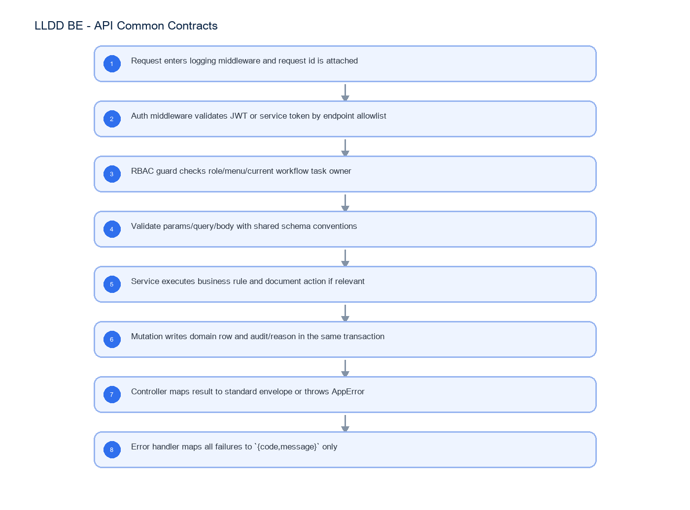

# LLDD BE - API Common Contracts

SBP Mall - ระบบประกันรายได้ | Low Level Design Document

## 1. Overview

| รายการ | รายละเอียด |
| --- | --- |
| Track | BE |
| Estimate | 15 ชั่วโมง |
| Owner | Butsaba <But> Podamrong |
| Objective | กำหนดสัญญากลางของ REST API ทุกเส้นเพื่อไม่ให้ endpoint รายตัวตีความต่างกัน: transport/auth/error/format/pagination/action/RBAC/audit/idempotency |

Common contract reference: ทุกหัวข้อ API/FE ต้องยึด LLDD-BE-API-Common-Contracts และ LLDD-FE-Integration-Contracts สำหรับ error/auth/format/pagination/action/RBAC ก่อนลงรายละเอียดเฉพาะหน้าหรือเฉพาะ endpoint

## 2. Screen / Functional Scope

- Base URL, content type, charset and request tracing
- Auth/JWT platform validation and service-token exception
- Standard success envelopes for list/detail/mutation
- Standard error envelope and HTTP status mapping
- Field format for date/month/docNo/storeCode/amount/percent
- Document action input/output contract
- RBAC/menu permission and editable section guard
- Audit/reason and idempotency rules

## 4. Implementation Flow Diagram (Reference)



_รูปที่ 1: Implementation flow reference: LLDD BE - API Common Contracts_

## 5. Field, Format, and Validation

| Field / UI | Format | Validation | Behavior |
| --- | --- | --- | --- |
| Base URL | /api/v1 | required | ทุก endpoint ใช้ prefix นี้ |
| Content-Type | application/json; charset=utf-8 | required for JSON | multipart เฉพาะ attachments |
| Authorization | Bearer <JWT> | required for user endpoints | validate signature/expiry/role; platform provides token |
| X-Service-Token | opaque service token | required for internal workflow/batch callbacks | ใช้กับ /workflows/instances และ external callback ที่ไม่ใช่ user JWT |
| X-Request-Id | uuid/string | optional but logged | ถ้าไม่ส่ง BE generate แล้วคืนใน log/trace |
| ErrorEnvelope | {code,message} | message Thai verbatim | ห้ามเพิ่ม error shape อื่นใน endpoint รายตัว |
| PageResponse<T> | {page,size,total,items} | page>=1 size<=100 | ใช้กับทุก GET list |
| MutationResponse | {message} | message optional for simple save | ถ้า workflow action ใช้ ActionResponse แทน |
| docNo | YYYY/xxxxx พ.ศ. | path/query | URL encode slash ตาม client/router; service ประกอบกลับเป็น docNo |
| storeCode/newStoreCode | string 5 digits | preserve leading zero | ห้ามใช้ numeric id แทนรหัสร้านใน payload |
| date/month | ISO-8601 ค.ศ. | YYYY-MM-DD / YYYY-MM | FE แปลง พ.ศ. เฉพาะ display |
| amount/percent | number | 2 decimal | format display อยู่ FE; BE validate precision/range |
| result | verbatim from actionOptions | required for /actions | ต้องเป็นค่าที่ BE ส่งมาใน role profile ของเอกสารนั้น |
| ActionResponse | {statusCode,nextSection,message} | required for /actions | FE resolve label จาก /document-statuses; mutation response ไม่คืน label ไทยซ้ำ |
| reason | text | required for master/config/email/RBAC mutation | write audit_logs ใน transaction เดียว |

### 5.1 Error and Popup Catalog

ทุก endpoint ต้องใช้ code และ message จาก catalog เดียวกันเมื่อเข้าเงื่อนไขเดียวกัน

| code | HTTP / Scope | Trigger | message |
| --- | --- | --- | --- |
| ACTION_RESULT_REQUIRED | 422 | submit action โดยไม่เลือกผลการพิจารณา | ท่านยังไม่เลือกผลการพิจารณา กรุณาเลือกข้อมูลก่อนกดส่งดำเนินการ |
| ACTION_COMMENT_REQUIRED | 422 | result ที่ต้องมี comment แต่ comment ว่าง | กรุณากรอกความคิดเห็นเพิ่มเติม (บังคับกรอกสำหรับผลการพิจารณานี้) ก่อนส่งดำเนินการ |
| COMPENSATE_PERCENT_INVALID | 422 | ผลรวม % ชดเชยร้านเปิดใหม่ไม่เท่ากับ 100 | โปรดตรวจสอบ %ชดเชย ของท่าน รวมกันแล้วไม่เท่ากับ 100% |
| COMPETITOR_REQUIRED | 422 | บันทึกร้านคู่แข่งโดยไม่เลือก competitorCode | กรุณาเลือกร้านคู่แข่งก่อนบันทึก |
| EXTERNAL_FACTOR_REQUIRED | 422 | บันทึกปัจจัยอื่นโดยไม่เลือก factorCode | กรุณาเลือกปัจจัยอื่นก่อนบันทึก |
| REPORT_DATE_RANGE_INVALID | 422 | impactMonthFrom มากกว่า impactMonthTo | เดือนเริ่มต้นต้องไม่มากกว่าเดือนสิ้นสุด |
| FILE_TOO_LARGE | 413 | attachment > 5 MB | ไฟล์แนบมีขนาดเกิน 5 MB |
| FILE_TYPE_UNSUPPORTED | 415 | extension/content type ไม่อยู่ใน allowlist | ชนิดไฟล์ไม่อนุญาตให้อัปโหลด |
| FILE_SCAN_BLOCKED | 422 | AV scan พบไวรัสหรือ scan failed | ไฟล์แนบไม่ผ่านการตรวจสอบความปลอดภัย |
| FORBIDDEN | 403 | ไม่มีสิทธิ์เมนู/เอกสาร/task | กรุณาติดต่อผู้ดูแลระบบ |
| DUPLICATE_DOCUMENT | 409 | business key ซ้ำตอนสร้างเอกสาร | ร้านนี้ในเดือนนี้มีเอกสารอยู่แล้ว |
| CONFLICT | 409 | resource/task ถูกเปลี่ยนหรือเงื่อนไขปัจจุบันไม่ตรงกับคำขอ | ข้อมูลมีการเปลี่ยนแปลง กรุณาโหลดข้อมูลล่าสุดแล้วดำเนินการใหม่ |
| STALE_VERSION | 409 | versionNo ที่ส่งมาไม่ตรงกับ compensation_documents.version_no | ข้อมูลถูกแก้ไขโดยผู้ใช้อื่น กรุณาโหลดข้อมูลล่าสุดแล้วลองอีกครั้ง |
| FS_BRIDGE_UNAVAILABLE | FE | hidden iframe ไม่ตอบ FS_FORM_READY ภายในเวลาที่กำหนด | ไม่สามารถเชื่อมต่อแบบฟอร์ม FS ได้ กรุณาลองอีกครั้ง |
| FS_BRIDGE_ORIGIN_INVALID | FE | event.origin ไม่ตรง allowlist | ไม่สามารถยืนยันแหล่งที่มาของแบบฟอร์ม FS ได้ |
| FS_BRIDGE_SCHEMA_INVALID | FE | FS_FIELD_SCHEMA ไม่ตรง message schema หรือมี field type ที่ไม่รองรับ | ข้อมูลแบบฟอร์ม FS ไม่ถูกต้อง กรุณาติดต่อผู้ดูแลระบบ |
| FS_BRIDGE_SUBMIT_FAILED | FE | FS_SUBMIT_RESULT ไม่สำเร็จหรือ FS_ERROR ตอน submit | ส่งแบบฟอร์ม FS ไม่สำเร็จ กรุณาตรวจสอบข้อมูลแล้วลองอีกครั้ง |

### 5.2 Endpoint Role Matrix

Matrix นี้เป็น baseline สำหรับ BE authorization guard; menu-level visibility ยังคงมาจาก menu_permissions

| Endpoint group | Endpoint pattern | Allowed roles / identity |
| --- | --- | --- |
| Current user/menu | /auth/me, /me/menus | authenticated user |
| Task inbox | GET /tasks | authenticated user with assigned task access |
| Document read/list/timeline/sales | GET /documents*, GET /documents/{docNo}/timeline, GET /documents/{docNo}/sales | document participant or report/admin role explicitly granted |
| Document create | POST /documents | 02 HQ, 03 User Admin, 01 Admin |
| Document update/action/attachment upload | PUT /documents/{docNo}, POST /documents/{docNo}/actions, POST /documents/{docNo}/attachments | current action owner; admin override only with policy and audit reason |
| Attachment download | GET /documents/{docNo}/attachments/{attachId}/download | same as document read; attachment belongs to doc and scanStatus=CLEAN |
| Lookup | /stores/search, /competitors, /document-statuses | authenticated user with related menu access |
| Master/RBAC/config | /operators*, /factors*, /menu-permissions*, /roles*, /menus*, /configs* | admin/HQ roles according to menu_permissions |
| Reports | /reports/status-summary* | admin/HQ/report roles and accounting service user |
| Internal workflow/interface | /workflows/instances, /interfaces/* callback | service token or API key only |

## 5.1 Input / Progress / Output Contract

| Stage | Contract for implementation |
| --- | --- |
| Input | ALL /api/v1/*; GET /api/v1/*; POST /api/v1/documents/{docNo}/actions |
| Progress | Request enters logging middleware and request id is attached; Auth middleware validates JWT or service token by endpoint allowlist; RBAC guard checks role/menu/current workflow task owner; Validate params/query/body with shared schema conventions |
| Output | Rendered UI state or normalized API response with status/message and audit-ready trace reference. |

### 5.90 Endpoint Implementation Contract

| Endpoint | Use-case owner | Service/repository behavior | Definition of done |
| --- | --- | --- | --- |
| ALL /api/v1/* | Standard error envelope | Request enters logging middleware and request id is attached | ทุก endpoint ต้องใช้ common contract นี้ |
| GET /api/v1/* | Standard list envelope เมื่อ endpoint เป็นรายการ | Auth middleware validates JWT or service token by endpoint allowlist | ไม่มี endpoint คืน error shape อื่นนอกจาก `{code,message}` |
| POST /api/v1/documents/{docNo}/actions | Document action contract กลาง; ตัวอย่าง currentSection=01 จึงเปลี่ยนไป 02 | RBAC guard checks role/menu/current workflow task owner | 401/403/404/409/422/413/415 mapping คงที่และ test ได้ |
| GET /api/v1/me/menus | RBAC/menu contract กลาง | Validate params/query/body with shared schema conventions | GET list ทุกเส้นคืน `{page,size,total,items}` |

### 5.91 Backend Execution Sequence

| Step | Behavior specific to this LLDD | Failure/test evidence |
| --- | --- | --- |
| 1 | Request enters logging middleware and request id is attached | missing JWT 401 |
| 2 | Auth middleware validates JWT or service token by endpoint allowlist | role forbidden 403 |
| 3 | RBAC guard checks role/menu/current workflow task owner | validation error 400 |
| 4 | Validate params/query/body with shared schema conventions | not found 404 |
| 5 | Service executes business rule and document action if relevant | duplicate conflict 409 |
| 6 | Mutation writes domain row and audit/reason in the same transaction | list envelope |
| 7 | Controller maps result to standard envelope or throws AppError | action transition envelope |
| 8 | Error handler maps all failures to `{code,message}` only | audit reason required |

## 6. Button / User Action Mapping

| Action | Trigger | API / Service | Expected Result |
| --- | --- | --- | --- |
| Authenticate user endpoint | middleware | auth.verifyJwt | req.user = employeeId/roleCode/sectionCode |
| Authorize menu/role | middleware/service | rbac.requireMenu/requireRole | 403 FORBIDDEN เมื่อไม่มีสิทธิ์ |
| Validate request | controller | zod schema | 400 VALIDATION envelope |
| Return list | repository/service | PageResponse<T> | pagination shape เดียวกัน |
| Submit document action | service | documentAction.service.submit | return ActionResponse |
| Write audit | transaction | audit.service.write | reason/updated_by/old_value/new_value |
| Handle idempotency | service | requestId/business key | duplicate returns existing result or 409 per endpoint rule |

## 7. API Contract

### ALL /api/v1/*

Standard error envelope

#### Request Field Schema

| Field | Type | Required | Constraint / Meaning |
| --- | --- | --- | --- |
| - | none | No | Endpoint has no JSON body/query object |

#### Response

```json
{
  "code": "VALIDATION",
  "message": "ข้อความภาษาไทยตรงตาม SRS"
}
```

#### Response Field Schema

| Field | Type | Required | Constraint / Meaning |
| --- | --- | --- | --- |
| code | string | Yes | UTF-8; use value domain described by endpoint purpose |
| message | string | Yes | UTF-8; use value domain described by endpoint purpose |

### GET /api/v1/*

Standard list envelope เมื่อ endpoint เป็นรายการ

#### Query Params

```json
{
  "page": 1,
  "size": 20
}
```

#### Request Field Schema

| Field | Type | Required | Constraint / Meaning |
| --- | --- | --- | --- |
| page | integer | No | >= 1; default 1 |
| size | integer | No | 1..100; default 20 |

#### Response

```json
{
  "page": 1,
  "size": 20,
  "total": 0,
  "items": []
}
```

#### Response Field Schema

| Field | Type | Required | Constraint / Meaning |
| --- | --- | --- | --- |
| page | integer | Yes | >= 1; default 1 |
| size | integer | Yes | 1..100; default 20 |
| total | integer | Yes | UTF-8; use value domain described by endpoint purpose |
| items | array<object> | Yes | JSON array; element type shown in Type column |

### POST /api/v1/documents/{docNo}/actions

Document action contract กลาง; ตัวอย่าง currentSection=01 จึงเปลี่ยนไป 02

#### Request

```json
{
  "result": "เห็นควรชดเชย",
  "comment": "เห็นควรชดเชยตามหลักเกณฑ์"
}
```

#### Request Field Schema

| Field | Type | Required | Constraint / Meaning |
| --- | --- | --- | --- |
| result | string | Yes | UTF-8; use value domain described by endpoint purpose |
| comment | string | Yes | trimmed UTF-8 Thai text; required by operation/business rule |

#### Response

```json
{
  "statusCode": "02",
  "nextSection": "02",
  "message": "submitted"
}
```

#### Response Field Schema

| Field | Type | Required | Constraint / Meaning |
| --- | --- | --- | --- |
| statusCode | string | Yes | canonical code; do not replace with display label |
| nextSection | string | Yes | canonical code; do not replace with display label |
| message | string | Yes | UTF-8; use value domain described by endpoint purpose |

### GET /api/v1/me/menus

RBAC/menu contract กลาง

#### Query Params

```json
{}
```

#### Request Field Schema

| Field | Type | Required | Constraint / Meaning |
| --- | --- | --- | --- |
| - | none | No | No fields |

#### Response

```json
{
  "menus": [
    {
      "menuCode": "k2-report",
      "label": "รายงานสรุปสถานะ",
      "route": "/reports/income-audit",
      "group": "ระบบประกันรายได้",
      "canAccess": true
    }
  ]
}
```

#### Response Field Schema

| Field | Type | Required | Constraint / Meaning |
| --- | --- | --- | --- |
| menus | array<object> | Yes | JSON array; element type shown in Type column |
| menus[].menuCode | string | Yes | UTF-8; use value domain described by endpoint purpose |
| menus[].label | string | Yes | UTF-8; use value domain described by endpoint purpose |
| menus[].route | string | Yes | UTF-8; use value domain described by endpoint purpose |
| menus[].group | string | Yes | UTF-8; use value domain described by endpoint purpose |
| menus[].canAccess | boolean | Yes | UTF-8; use value domain described by endpoint purpose |

## 9. Processing Flow

| Step | Description |
| --- | --- |
| 1 | Request enters logging middleware and request id is attached |
| 2 | Auth middleware validates JWT or service token by endpoint allowlist |
| 3 | RBAC guard checks role/menu/current workflow task owner |
| 4 | Validate params/query/body with shared schema conventions |
| 5 | Service executes business rule and document action if relevant |
| 6 | Mutation writes domain row and audit/reason in the same transaction |
| 7 | Controller maps result to standard envelope or throws AppError |
| 8 | Error handler maps all failures to `{code,message}` only |

## 10. Acceptance Criteria

- ทุก endpoint ต้องใช้ common contract นี้
- ไม่มี endpoint คืน error shape อื่นนอกจาก `{code,message}`
- 401/403/404/409/422/413/415 mapping คงที่และ test ได้
- GET list ทุกเส้นคืน `{page,size,total,items}`
- /actions รับ `{result,comment}` เท่านั้นและคืน `{statusCode,nextSection,message}`
- RBAC ใช้ role/menu/current task owner ฝั่ง BE เป็น source of truth
- mutation ที่ต้องมี reason ต้องเขียน audit_logs/consideration_logs/job_run_histories ตามโดเมน

## 11. Developer Test Checklist

| No | Test |
| --- | --- |
| 1 | missing JWT 401 |
| 2 | role forbidden 403 |
| 3 | validation error 400 |
| 4 | not found 404 |
| 5 | duplicate conflict 409 |
| 6 | list envelope |
| 7 | action transition envelope |
| 8 | audit reason required |
| 9 | service token endpoint |
