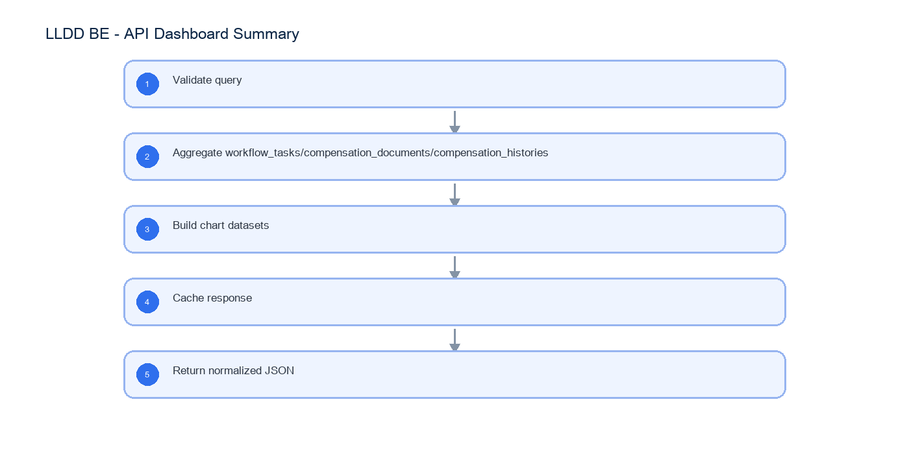

# LLDD BE - API Dashboard Summary

SBP Mall - ระบบประกันรายได้ | Low Level Design Document

## 1. Overview

| รายการ | รายละเอียด |
| --- | --- |
| Track | BE |
| Estimate | 18 ชั่วโมง |
| Owner | Butsaba <But> Podamrong |
| Objective | ออกแบบ Backend APIs สำหรับ Dashboard KPI, pending summary, monthly chart และ status chart |

Common contract reference: ทุกหัวข้อ API/FE ต้องยึด LLDD-BE-API-Common-Contracts และ LLDD-FE-Integration-Contracts สำหรับ error/auth/format/pagination/action/RBAC ก่อนลงรายละเอียดเฉพาะหน้าหรือเฉพาะ endpoint

## 2. Screen / Functional Scope

- Dashboard summary service
- KPI query
- Monthly compensation chart
- Status chart
- Cache 5 minutes

## 4. Implementation Flow Diagram (Reference)



_รูปที่ 1: Implementation flow reference: LLDD BE - API Dashboard Summary_

## 5. Field, Format, and Validation

| Field / UI | Format | Validation | Behavior |
| --- | --- | --- | --- |
| year | พ.ศ. YYYY | optional default current year | ใช้ filter summary |
| month | YYYY-MM | optional | ใช้คำนวณยอดชดเชยเดือนปัจจุบัน |
| sectionCode | string | optional | filter งานค้างตาม section |

## 5.1 Input / Progress / Output Contract

| Stage | Contract for implementation |
| --- | --- |
| Input | GET /api/v1/dashboard/summary |
| Progress | Validate query; Aggregate workflow_tasks/compensation_documents/compensation_histories; Build chart datasets; Cache response |
| Output | Rendered UI state or normalized API response with status/message and audit-ready trace reference. |

### 5.90 Endpoint Implementation Contract

| Endpoint | Use-case owner | Service/repository behavior | Definition of done |
| --- | --- | --- | --- |
| GET /api/v1/dashboard/summary | Dashboard summary API | Validate query | KPI ตรงกับ query |

### 5.91 Backend Execution Sequence

| Step | Behavior specific to this LLDD | Failure/test evidence |
| --- | --- | --- |
| 1 | Validate query | dashboard fixture |
| 2 | Aggregate workflow_tasks/compensation_documents/compensation_histories | empty dashboard |
| 3 | Build chart datasets | status chart count |
| 4 | Cache response | cache invalidation |
| 5 | Return normalized JSON | dashboard fixture |

## 6. Button / User Action Mapping

| Action | Trigger | API / Service | Expected Result |
| --- | --- | --- | --- |
| Dashboard summary | GET | dashboard.service.getSummary | return KPI/charts |
| Refresh cache | internal | cache.invalidateDashboard | refresh after document/status change |

## 7. API Contract

### GET /api/v1/dashboard/summary

Dashboard summary API

#### Query Params

```json
{
  "year": 2569
}
```

#### Request Field Schema

| Field | Type | Required | Constraint / Meaning |
| --- | --- | --- | --- |
| year | integer | No | UTF-8; use value domain described by endpoint purpose |

#### Response

```json
{
  "waitingTasks": 24,
  "storesThisMonth": 342,
  "compensationThisMonth": 8420000.0,
  "abnormalStores": 5,
  "monthlyChart": [],
  "statusChart": []
}
```

#### Response Field Schema

| Field | Type | Required | Constraint / Meaning |
| --- | --- | --- | --- |
| waitingTasks | integer | Yes | UTF-8; use value domain described by endpoint purpose |
| storesThisMonth | integer | Yes | ISO-8601 ค.ศ.; nullable only when type includes null |
| compensationThisMonth | number | Yes | ISO-8601 ค.ศ.; nullable only when type includes null |
| abnormalStores | integer | Yes | UTF-8; use value domain described by endpoint purpose |
| monthlyChart | array<object> | Yes | JSON array; element type shown in Type column |
| statusChart | array<object> | Yes | JSON array; element type shown in Type column |

## 8. Reference DB Mapping (No Database Page Work)

ส่วนนี้เป็นข้อมูลอ้างอิงสำหรับการ implement API/Job เท่านั้น ไม่ใช่งานสร้างหน้า Database, ไม่ใช่งานออกแบบ DB page และไม่ถูกนับเป็น deliverable แยกของ FE/BE

| Table / Object | R/W | Usage |
| --- | --- | --- |
| workflow_tasks | R | นับงานค้างและ pending queue |
| compensation_documents | R | นับเอกสาร/ร้านในงวด |
| compensation_histories | R | ยอดชดเชยรายเดือน |
| fgi_impact_sales_summaries | R | จำนวนข้อมูลผิดปกติ total_working_days < 60 |

## 9. Processing Flow

| Step | Description |
| --- | --- |
| 1 | Validate query |
| 2 | Aggregate workflow_tasks/compensation_documents/compensation_histories |
| 3 | Build chart datasets |
| 4 | Cache response |
| 5 | Return normalized JSON |

## 10. Acceptance Criteria

- KPI ตรงกับ query
- cache TTL ไม่เกิน 5 นาที
- empty data คืน 0 ไม่คืน null

## 11. Developer Test Checklist

| No | Test |
| --- | --- |
| 1 | dashboard fixture |
| 2 | empty dashboard |
| 3 | status chart count |
| 4 | cache invalidation |
