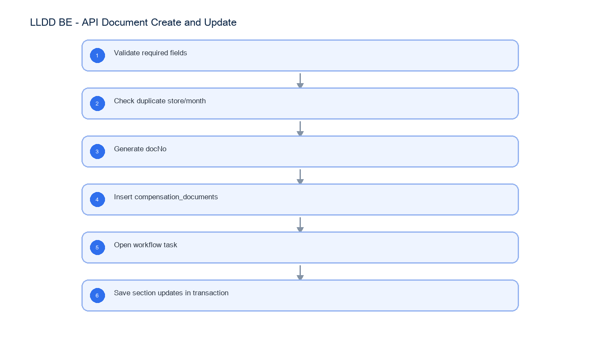

# LLDD BE - API Document Create and Update

SBP Mall - ระบบประกันรายได้ | Low Level Design Document

## 1. Overview

| รายการ | รายละเอียด |
| --- | --- |
| Track | BE |
| Estimate | 27 ชั่วโมง |
| Owner | Tunyatorn <Vava> Kiatkongphongsa |
| Objective | ออกแบบ APIs สำหรับสร้างเอกสารใหม่และบันทึกส่วนย่อยของเอกสาร |

Common contract reference: ทุกหัวข้อ API/FE ต้องยึด LLDD-BE-API-Common-Contracts และ LLDD-FE-Integration-Contracts สำหรับ error/auth/format/pagination/action/RBAC ก่อนลงรายละเอียดเฉพาะหน้าหรือเฉพาะ endpoint

## 2. Screen / Functional Scope

- Create document
- Duplicate guard
- Running doc number
- Partial update
- Business validation

## 4. Implementation Flow Diagram (Reference)



_รูปที่ 1: Implementation flow reference: LLDD BE - API Document Create and Update_

## 5. Field, Format, and Validation

| Field / UI | Format | Validation | Behavior |
| --- | --- | --- | --- |
| docNo | YYYY/xxxxx | required when opening existing document | ใช้ปี พ.ศ. และ running 5 หลัก |
| storeCode | string 5 digits | numeric length = 5 | แสดง leading zero |
| amount | number, 2 decimals | >= 0 | format `#,##0.00` บาท |
| percent | number, 2 decimals | 0-100 | ใช้ `%` และรวม allocation ต้องเท่ากับ 100 |
| date | DD/MM/YYYY | valid date | FE แสดง พ.ศ. หาก source เป็น ISO ค.ศ. |
| attachment | file | <= 5 MB | รองรับ vsd, dwg, afp, pdf, mda, zip, wav, mp3, gif, jpg, tif, tiff, htm, html, txt, xml, mpg, mov, ivs, doc, docx, xls, xlsx, pps, ppt, pot, csv |
| requestId | string | optional | ใช้ trace request; duplicate guard หลักเป็น business key |
| source | MANUAL\|FS | required | แยกแหล่งสร้างเอกสาร |

### 5.1 docNo Generator and Concurrency Rules

เลขเอกสารเป็น business identifier ของระบบ จึงต้อง generate ฝั่ง BE ใน transaction เดียวกับการสร้างเอกสาร และต้องไม่ให้ FE หรือ Job สร้างเลขเอง

| Rule | Required behavior | Implementation note |
| --- | --- | --- |
| Format | YYYY/xxxxx โดย YYYY เป็นปี พ.ศ. และ running 5 หลัก | ตัวอย่าง 2569/00124; เก็บ doc_no เป็น string และเก็บ be_year/running_no แยกเพื่อ index |
| Sequence scope | running reset ตามปี พ.ศ. | unique key `(be_year, running_no)` และ unique `doc_no` |
| Lock strategy | lock row sequence ด้วย `SELECT ... FOR UPDATE` หรือ database sequence ต่อปี | ห้ามอ่าน max(running_no)+1 แบบไม่มี lock |
| Transaction boundary | generate docNo, insert compensation_documents, insert first workflow task และ audit ใน transaction เดียว | ถ้าสร้าง task ไม่สำเร็จต้อง rollback ทั้งชุด |
| Gap policy | เลขที่ถูก commit แล้วห้าม reuse; rollback ก่อน commit ไม่ควรเผยแพร่ docNo ให้ client | ถ้าใช้ native sequence ที่เกิด gap ได้ต้องบันทึก policy นี้ใน runbook |
| Duplicate guard | business key ซ้ำต้องคืน 409 ก่อน generate docNo ใหม่เมื่อเป็นไปได้ | business key อย่างน้อย impactedStoreCode+impactMonth+newStoreCode+roundNo+source |
| Idempotency | requestId ใช้ trace/retry แต่ไม่แทน duplicate business key | ถ้า retry request เดิมหลัง success ให้คืน docNo เดิมเมื่อจับคู่ requestId ได้ |

### 5.2 Create Document Transaction Flow

| Step | Service behavior | Rollback / error rule |
| --- | --- | --- |
| 1. Validate input | ตรวจ required, format, store exists, period, source, roundNo | invalid คืน 400/422 ก่อน lock sequence |
| 2. Check duplicate | query business key บน compensation_documents | พบเอกสารเดิมคืน 409 DUPLICATE_DOCUMENT พร้อม docNo เดิมถ้าอนุญาตให้แสดง |
| 3. Start transaction | เปิด transaction และ lock sequence row ของปี พ.ศ. | lock timeout คืน 409/503 ตามมาตรฐาน platform |
| 4. Generate docNo | เพิ่ม running_no และประกอบ doc_no | ยังไม่ส่ง response จนกว่า commit สำเร็จ |
| 5. Insert document | insert compensation_documents และ child rows เริ่มต้น | fail ต้อง rollback sequence/document |
| 6. Open first task | insert workflow_instances/workflow_tasks section 06 หรือเรียก workflow service ภายใน transaction boundary ที่กำหนด | fail ต้อง rollback document |
| 7. Audit and commit | insert audit_logs แล้ว commit | หลัง commit จึง return docNo/statusCode |

### 5.3 Required Developer Tests for docNo

| Test | Expected result |
| --- | --- |
| ยิง POST /documents พร้อมกัน 20 request ในปีเดียวกัน | ได้ docNo ไม่ซ้ำ running เรียงตาม commit และไม่มี duplicate key error ที่หลุดเป็น 500 |
| สร้าง duplicate business key | คืน 409 DUPLICATE_DOCUMENT และไม่ consume docNo ใหม่ถ้า duplicate ถูกพบก่อน lock sequence |
| จำลอง error หลัง insert document ก่อน insert task | rollback แล้วไม่เหลือ compensation_documents/workflow_tasks/audit partial |
| เปลี่ยนปี พ.ศ. | running เริ่มที่ 00001 ของปีใหม่ |

### 5.4 docNo Generator SQL Reference

```sql
-- Lock sequence row for the Buddhist year before generating docNo.
SELECT be_year, next_running_no
FROM document_number_sequences
WHERE be_year = :beYear
FOR UPDATE;

-- Create sequence row when the year is first used.
INSERT INTO document_number_sequences (be_year, next_running_no, created_at, updated_at)
SELECT :beYear, 0, CURRENT_TIMESTAMP, CURRENT_TIMESTAMP
WHERE NOT EXISTS (
    SELECT 1 FROM document_number_sequences WHERE be_year = :beYear
);

-- Consume the next number inside the same transaction as document creation.
UPDATE document_number_sequences
SET next_running_no = next_running_no + 1,
    updated_at = CURRENT_TIMESTAMP
WHERE be_year = :beYear
RETURNING be_year, next_running_no;

INSERT INTO compensation_documents (
    doc_no, be_year, running_no, impacted_store_code, impact_month,
    new_store_code, round_no, source, status_code, created_by, created_at
) VALUES (
    :docNo, :beYear, :runningNo, :impactedStoreCode, :impactMonth,
    :newStoreCode, :roundNo, :source, '06', :userId, CURRENT_TIMESTAMP
);
```

## 5.1 Input / Progress / Output Contract

| Stage | Contract for implementation |
| --- | --- |
| Input | POST /api/v1/documents; PUT /api/v1/documents/{docNo} |
| Progress | Validate required fields; Check duplicate store/month; Generate docNo; Insert compensation_documents |
| Output | compensation_documents; workflow_instances / workflow_tasks; document_new_stores |

### 5.90 Endpoint Implementation Contract

| Endpoint | Use-case owner | Service/repository behavior | Definition of done |
| --- | --- | --- | --- |
| POST /api/v1/documents | Create document API | Validate required fields | duplicate business key returns 409 |
| PUT /api/v1/documents/{docNo} | Update document partial sections | Check duplicate store/month | docNo format YYYY/xxxxx |

### 5.91 Backend Execution Sequence

| Step | Behavior specific to this LLDD | Failure/test evidence |
| --- | --- | --- |
| 1 | Validate required fields | create success |
| 2 | Check duplicate store/month | create duplicate |
| 3 | Generate docNo | update allocation invalid |
| 4 | Insert compensation_documents | permission denied section |
| 5 | Open workflow task | create success |
| 6 | Save section updates in transaction | create duplicate |

## 6. Button / User Action Mapping

| Action | Trigger | API / Service | Expected Result |
| --- | --- | --- | --- |
| Create document | POST | document.service.create | create doc + first workflow task |
| Update document section | PUT | document.service.updateSections | save editable sections |

## 7. API Contract

### POST /api/v1/documents

Create document API

#### Request

```json
{
  "impactedStoreCode": "00788",
  "impactMonth": "2026-06",
  "source": "MANUAL",
  "newStoreCode": "00990",
  "roundNo": 1,
  "reason": "manual create",
  "requestId": "uuid"
}
```

#### Request Field Schema

| Field | Type | Required | Constraint / Meaning |
| --- | --- | --- | --- |
| impactedStoreCode | string | Yes | exactly 5 digits; preserve leading zero |
| impactMonth | string | Yes | ISO-8601 ค.ศ.; nullable only when type includes null |
| source | string | Yes | UTF-8; use value domain described by endpoint purpose |
| newStoreCode | string | Yes | exactly 5 digits; preserve leading zero |
| roundNo | integer | Yes | UTF-8; use value domain described by endpoint purpose |
| reason | string | Yes | trimmed UTF-8 Thai text; required by operation/business rule |
| requestId | string | Yes | UTF-8; use value domain described by endpoint purpose |

#### Response

```json
{
  "docNo": "2569/00124",
  "statusCode": "06"
}
```

#### Response Field Schema

| Field | Type | Required | Constraint / Meaning |
| --- | --- | --- | --- |
| docNo | string | Yes | พ.ศ. YYYY/xxxxx |
| statusCode | string | Yes | canonical code; do not replace with display label |

### PUT /api/v1/documents/{docNo}

Update document partial sections

#### Request

```json
{
  "newStores": [
    {
      "newStoreCode": "00990",
      "compensatePercent": 100
    }
  ]
}
```

#### Request Field Schema

| Field | Type | Required | Constraint / Meaning |
| --- | --- | --- | --- |
| newStores | array<object> | Yes | JSON array; element type shown in Type column |
| newStores[].newStoreCode | string | Yes | exactly 5 digits; preserve leading zero |
| newStores[].compensatePercent | integer | Yes | number 0..100 with 2 decimals |

#### Response

```json
{
  "message": "saved"
}
```

#### Response Field Schema

| Field | Type | Required | Constraint / Meaning |
| --- | --- | --- | --- |
| message | string | Yes | UTF-8; use value domain described by endpoint purpose |

## 8. Reference DB Mapping (No Database Page Work)

ส่วนนี้เป็นข้อมูลอ้างอิงสำหรับการ implement API/Job เท่านั้น ไม่ใช่งานสร้างหน้า Database, ไม่ใช่งานออกแบบ DB page และไม่ถูกนับเป็น deliverable แยกของ FE/BE

| Table / Object | R/W | Usage |
| --- | --- | --- |
| compensation_documents | R/W | สร้างหัวเอกสารและแก้ไข section หลัก |
| workflow_instances / workflow_tasks | W | เปิด workflow งานแรกตอนสร้างเอกสาร |
| document_new_stores | R/W | ร้านเปิดใหม่และ % ชดเชย |
| document_competitors | R/W | ร้านคู่แข่งในเอกสาร |
| document_external_factors | R/W | ปัจจัยภายนอกในเอกสาร |
| compensation_documents unique guard | R | กัน duplicate ด้วย business key: impact_process_id หรือ source + impacted_store_code + impact_month + new_store_code + round_no |

## 9. Processing Flow

| Step | Description |
| --- | --- |
| 1 | Validate required fields |
| 2 | Check duplicate store/month |
| 3 | Generate docNo |
| 4 | Insert compensation_documents |
| 5 | Open workflow task |
| 6 | Save section updates in transaction |

## 10. Acceptance Criteria

- duplicate business key returns 409
- docNo format YYYY/xxxxx
- compensatePercent sum=100
- requestId trace does not replace business duplicate guard

## 11. Developer Test Checklist

| No | Test |
| --- | --- |
| 1 | create success |
| 2 | create duplicate |
| 3 | update allocation invalid |
| 4 | permission denied section |
