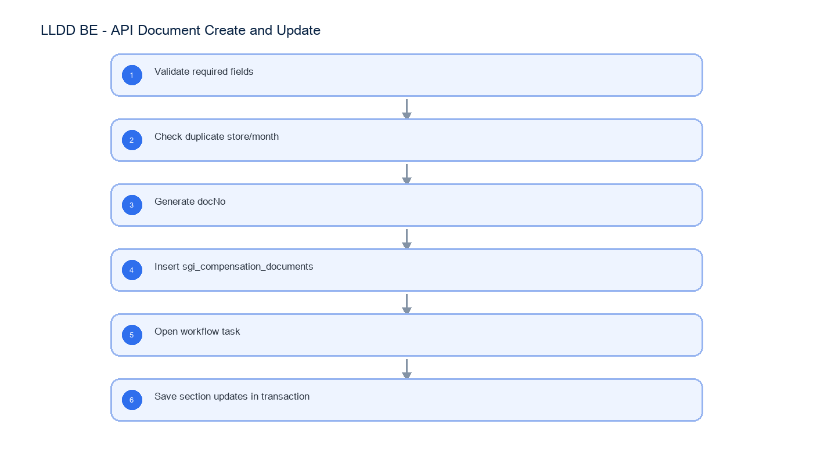

# LLDD BE - API Document Create and Update

SBP Mall - ระบบประกันรายได้ | Low Level Design Document

## 1. Overview

| รายการ | รายละเอียด |
| --- | --- |
| Track | BE |
| Estimate | **32 ชั่วโมง** = implementation 24 + unit test 8 (30%) |
| Owner | Butsaba <But> Podamrong |
| Target repository | `SBP/srm-sps-spsap-store-backend` (NestJS + TypeORM · schema `sps_store`) + `SBP/srm-sps-spsap-sbp-bff` (forward ผ่าน client service · ไม่มี DB) สำหรับเส้นที่ FE เรียก |
| Objective | ออกแบบ APIs สำหรับสร้างเอกสารใหม่และบันทึกส่วนย่อยของเอกสาร |

Common contract reference: ทุกหัวข้อ API/FE ต้องยึด LLDD-BE-API-Common-Contracts และ LLDD-FE-Integration-Contracts สำหรับ error/auth/format/pagination/action/RBAC ก่อนลงรายละเอียดเฉพาะหน้าหรือเฉพาะ endpoint

## 2. Screen / Functional Scope

- Create document
- Duplicate guard
- Running doc number
- Partial update
- Business validation

## 3. Screenshot Reference

ไม่มีภาพหน้าจอสำหรับหัวข้อนี้ — เป็นเอกสารฝั่ง Backend/Batch ที่ไม่มี UI (ภาพหน้าจอทั้งหมดอยู่ในเอกสารชุด FE)

## 4. Implementation Flow Diagram (Reference)



_รูปที่ 1: Implementation flow reference: LLDD BE - API Document Create and Update_

## 5. Field, Format, and Validation

| Field / UI | Format | Validation | Behavior |
| --- | --- | --- | --- |
| docNo | YYYY/xxxxx | required when opening existing document | ใช้ปี **ค.ศ.** และ running 5 หลัก (มติ 2026-08-06) |
| storeCode | string 5 digits | numeric length = 5 | แสดง leading zero |
| amount | number, 2 decimals | >= 0 | format `#,##0.00` บาท |
| percent | number, 2 decimals | 0-100 | ใช้ `%` และรวม allocation ต้องเท่ากับ 100 |
| date | DD/MM/YYYY | valid date | payload เป็น ISO ค.ศ. · FE แสดง ค.ศ. เป็นค่าเริ่มต้น (DatePicker buddhistEra=false) แสดง พ.ศ. เฉพาะจุดที่เปิด flag |
| attachment | file | <= 5 MB | รองรับ vsd, dwg, afp, pdf, mda, zip, wav, mp3, gif, jpg, tif, tiff, htm, html, txt, xml, mpg, mov, ivs, doc, docx, xls, xlsx, pps, ppt, pot, csv |
| requestId | string | optional | ใช้ trace request; duplicate guard หลักเป็น business key |
| source | MANUAL\|FS | required | แยกแหล่งสร้างเอกสาร |

### 5.1 docNo Generator and Concurrency Rules

เลขเอกสารเป็น business identifier ของระบบ จึงต้อง generate ฝั่ง BE ใน transaction เดียวกับการสร้างเอกสาร และต้องไม่ให้ FE หรือ Job สร้างเลขเอง

| Rule | Required behavior | Implementation note |
| --- | --- | --- |
| Format | YYYY/xxxxx โดย YYYY เป็นปี **ค.ศ.** และ running 5 หลัก (มติ 2026-08-06 · หน้าจอ K2 จริงใช้ ค.ศ. เช่น 2026/01870) | ตัวอย่าง 2026/00124; เก็บ doc_no เป็น string และเก็บ year/running_no แยกเพื่อ index |
| Sequence scope | running reset ตามปี ค.ศ. | unique key `(year, running_no)` และ unique `doc_no` |
| Lock strategy | lock row sequence ด้วย `SELECT ... FOR UPDATE` หรือ database sequence ต่อปี | ห้ามอ่าน max(running_no)+1 แบบไม่มี lock |
| Transaction boundary | generate docNo, insert compensation_documents, insert first workflow task และ audit ใน transaction เดียว | ถ้าสร้าง task ไม่สำเร็จต้อง rollback ทั้งชุด |
| Gap policy | เลขที่ถูก commit แล้วห้าม reuse; rollback ก่อน commit ไม่ควรเผยแพร่ docNo ให้ client | ถ้าใช้ native sequence ที่เกิด gap ได้ต้องบันทึก policy นี้ใน runbook |
| Duplicate guard | business key ซ้ำต้องคืน 409 ก่อน generate docNo ใหม่เมื่อเป็นไปได้ | business key อย่างน้อย impactedStoreCode+impactMonth+newStoreCode+roundNo+source |
| Idempotency | requestId ใช้ trace/retry แต่ไม่แทน duplicate business key | ถ้า retry request เดิมหลัง success ให้คืน docNo เดิมเมื่อจับคู่ requestId ได้ |

### 5.2 Create Document Transaction Flow

| Step | Service behavior | Rollback / error rule |
| --- | --- | --- |
| 1. Validate input | ตรวจ required, format, store exists, period, source, roundNo | invalid คืน 400/422 ก่อน lock sequence |
| 2. Check duplicate | query business key บน compensation_documents | พบเอกสารเดิมคืน 409 DUPLICATE_DOCUMENT พร้อม docNo เดิมถ้าอนุญาตให้แสดง |
| 3. Start transaction | เปิด transaction และ lock sequence row ของปี ค.ศ. | lock timeout คืน 409/503 ตามมาตรฐาน platform |
| 4. Generate docNo | เพิ่ม running_no และประกอบ doc_no | ยังไม่ส่ง response จนกว่า commit สำเร็จ |
| 5. Insert document | insert compensation_documents และ child rows เริ่มต้น | fail ต้อง rollback sequence/document |
| 6. Open first task | เรียก initializeWorkflow + addPreApprover (state 06) ของ @srm/glb-workflow ภายใน transaction boundary ที่กำหนด — ชื่อ function ตามชีต Detail ของ LLDD lib — ดู LLDD-BE-Workflow-Engine-Definition 5.3 | fail ต้อง rollback document |
| 7. Commit | commit transaction (ไม่มีการเขียน audit ของ master แล้ว · ยกเลิกระบบ audit ของ master 2026-08-07) | หลัง commit จึง return docNo/statusCode |

### 5.3 Required Developer Tests for docNo

| Test | Expected result |
| --- | --- |
| ยิง POST /documents พร้อมกัน 20 request ในปีเดียวกัน | ได้ docNo ไม่ซ้ำ running เรียงตาม commit และไม่มี duplicate key error ที่หลุดเป็น 500 |
| สร้าง duplicate business key | คืน 409 DUPLICATE_DOCUMENT และไม่ consume docNo ใหม่ถ้า duplicate ถูกพบก่อน lock sequence |
| จำลอง error หลัง insert document ก่อนเปิด workflow | rollback แล้วไม่เหลือ compensation_documents/workflow_transaction/audit partial |
| เปลี่ยนปี ค.ศ. | running เริ่มที่ 00001 ของปีใหม่ |

### 5.4 docNo Generator SQL Reference

```sql
-- ออกเลขเอกสาร YYYY/xxxxx แบบ atomic ต่อ "ปี ค.ศ." (ห้ามใช้ พ.ศ. — ดู api.md มติ 2026-08-06)
-- ตารางจริงคือ document_running_numbers (year · last_running_no · updated_at) ไม่มีคอลัมน์ created_at

-- 1) สร้างแถวของปีนี้ถ้ายังไม่มี (idempotent)
INSERT INTO document_running_numbers (year, last_running_no)
VALUES (:year, 0)
ON CONFLICT (year) DO NOTHING;

-- 2) กินเลขถัดไปในทรานแซกชันเดียวกับการสร้างเอกสาร — UPDATE ... RETURNING ล็อกแถวให้เอง
--    กัน batch (Job 8) กับผู้ใช้สร้างพร้อมกันแล้วได้เลขชนกัน
UPDATE document_running_numbers
SET last_running_no = last_running_no + 1,
    updated_at = CURRENT_TIMESTAMP
WHERE year = :year
RETURNING last_running_no;          -- → :runningNo

-- 3) docNo = :year || '/' || lpad(:runningNo::text, 5, '0')   เช่น 2026/00123
--    ⚠️ ต้องใส่ impact_process_id ทุกครั้ง — เป็น NOT NULL UNIQUE (หนึ่ง impact process = หนึ่งเอกสาร)
INSERT INTO compensation_documents (
    doc_no, year, running_no,
    impact_process_id, impacted_store_code, impact_month, new_store_code,
    round_no, source, status_code, current_section_code, created_by
) VALUES (
    :docNo, :year, :runningNo,
    :impactProcessId, :impactedStoreCode, :impactMonth, :newStoreCode,
    :roundNo, :source, :statusInit, '06', :userId
);
-- created_at / total_compensation_amount / version_no มี DEFAULT อยู่แล้ว ไม่ต้องส่ง
```

### 5.9 Input / Progress / Output Contract

| Stage | Contract for implementation |
| --- | --- |
| Input | POST /api/v1/documents; PUT /api/v1/documents/{docNo} |
| Progress | Validate required fields; Check duplicate store/month; Generate docNo; Insert compensation_documents |
| Output | compensation_documents; workflow_transaction / workflow_approver (@srm/glb-workflow); document_new_stores |

### 5.90 Endpoint Implementation Contract

| Endpoint | Use-case owner | Service/repository behavior | Definition of done |
| --- | --- | --- | --- |
| POST /api/v1/documents | Create document API | Validate required fields | duplicate business key returns 409 |
| PUT /api/v1/documents/{docNo} | Update document partial sections | Check duplicate store/month | docNo format YYYY/xxxxx |

### 5.91 Backend Execution Sequence

| Step | Behavior specific to this LLDD | Failure/test evidence |
| --- | --- | --- |
| 1 | Validate required fields | create success |
| 2 | Check duplicate store/month | create duplicate |
| 3 | Generate docNo | update allocation invalid |
| 4 | Insert compensation_documents | permission denied section |
| 5 | Open workflow task | create success |
| 6 | Save section updates in transaction | create duplicate |

## 6. Button / User Action Mapping

| Action | Trigger | API / Service | Expected Result |
| --- | --- | --- | --- |
| Create document | POST | document.service.create | create doc + first workflow task |
| Update document section | PUT | document.service.updateSections | save editable sections |

## 7. API Contract

### POST /api/v1/documents

Create document API

#### Request

```json
{
  "impactedStoreCode": "00788",
  "impactMonth": "2026-06",
  "source": "MANUAL",
  "newStoreCode": "00990",
  "roundNo": 1,
  "reason": "manual create",
  "requestId": "uuid"
}
```

#### Request Field Schema

| Field | Type | Required | Constraint / Meaning |
| --- | --- | --- | --- |
| impactedStoreCode | string | Yes | exactly 5 digits; preserve leading zero |
| impactMonth | string | Yes | ISO-8601 ค.ศ.; nullable only when type includes null |
| source | string | Yes | UTF-8; use value domain described by endpoint purpose |
| newStoreCode | string | Yes | exactly 5 digits; preserve leading zero |
| roundNo | integer | Yes | UTF-8; use value domain described by endpoint purpose |
| reason | string | Yes | trimmed UTF-8 Thai text; required by operation/business rule |
| requestId | string | Yes | UTF-8; use value domain described by endpoint purpose |

#### Response

```json
{
  "docNo": "2026/00124",
  "statusCode": "06"
}
```

#### Response Field Schema

| Field | Type | Required | Constraint / Meaning |
| --- | --- | --- | --- |
| docNo | string | Yes | ค.ศ. YYYY/xxxxx |
| statusCode | string | Yes | canonical code; do not replace with display label |

### PUT /api/v1/documents/{docNo}

Update document partial sections

#### Request

```json
{
  "newStores": [
    {
      "newStoreCode": "00990",
      "compensatePercent": 100
    }
  ]
}
```

#### Request Field Schema

| Field | Type | Required | Constraint / Meaning |
| --- | --- | --- | --- |
| newStores | array<object> | Yes | JSON array; element type shown in Type column |
| newStores[].newStoreCode | string | Yes | exactly 5 digits; preserve leading zero |
| newStores[].compensatePercent | integer | Yes | number 0..100 with 2 decimals |

#### Response

```json
{
  "message": "saved"
}
```

#### Response Field Schema

| Field | Type | Required | Constraint / Meaning |
| --- | --- | --- | --- |
| message | string | Yes | UTF-8; use value domain described by endpoint purpose |

## 8. Reference DB Mapping (No Database Page Work)

ส่วนนี้เป็นข้อมูลอ้างอิงสำหรับการ implement API/Job เท่านั้น ไม่ใช่งานสร้างหน้า Database, ไม่ใช่งานออกแบบ DB page และไม่ถูกนับเป็น deliverable แยกของ FE/BE

| Table / Object | R/W | Usage |
| --- | --- | --- |
| compensation_documents | R/W | สร้างหัวเอกสารและแก้ไข section หลัก |
| workflow_transaction / workflow_approver (@srm/glb-workflow) | W | เปิด workflow งานแรกตอนสร้างเอกสาร |
| document_new_stores | R/W | ร้านเปิดใหม่และ % ชดเชย |
| document_competitors | R/W | ร้านคู่แข่งในเอกสาร |
| document_running_numbers | R/W | ตัวนับเลขเอกสารต่อปี ค.ศ. — ออกเลข YYYY/xxxxx แบบ atomic (INSERT … ON CONFLICT DO UPDATE … RETURNING) |
| document_cost_details | R/W | ยอดชดเชยแยกรายเดือน/รายร้านเปิดใหม่ (cost_year/cost_month · cost_target · cost_amount · _n / _nc) |
| document_external_factors | R/W | ปัจจัยภายนอกในเอกสาร |
| compensation_documents unique guard | R | กัน duplicate ด้วย business key: impact_process_id หรือ source + impacted_store_code + impact_month + new_store_code + round_no |

## 9. Skeleton Code (store-backend + BFF)

โครงโค้ดตั้งต้นของเอกสารฉบับนี้ ยึด convention จริงของ `srm-sps-spsap-store-backend` (NestJS 11 + TypeORM, schema `sps_store`, custom provider `DATA_SOURCE` ที่ route SELECT ไป slave pool) และ `srm-sps-spsap-sbp-bff` (ไม่มี DB, forward ผ่าน client service). ทุกจุดที่ต้องเติมกำกับด้วย `// TODO:` และ response ทุกเส้นถูกห่อเป็น `{success, data}` โดย ResponseInterceptor อยู่แล้ว จึงห้าม service ห่อซ้ำ

#### 9.1 ผังไฟล์ที่ต้องสร้าง

| Path | หน้าที่ |
| --- | --- |
| store-backend · src/modules/sbpgi-document-create-update/sbpgi-document-create-update.controller.ts | route ทั้งหมดของเอกสารนี้ (2 เส้น) + `@UseGuards(HttpHeaderGuard)` + `@UserId()` |
| store-backend · src/modules/sbpgi-document-create-update/sbpgi-document-create-update.service.ts | business logic — inject `'DATA_SOURCE'` แล้วยิง raw SQL, mutation ใช้ QueryRunner transaction |
| store-backend · src/modules/sbpgi-document-create-update/sbpgi-document-create-update.sql.ts | เก็บ SQL ต่อ endpoint (คัดจากหัวข้อ 10) แยกออกจาก service ให้ทดสอบ/รีวิวง่าย |
| store-backend · src/modules/sbpgi-document-create-update/dto/sbpgi-document-create-update.dto.ts | DTO + class-validator ตาม validation ในหัวข้อฟิลด์ของเอกสารนี้ |
| store-backend · src/modules/sbpgi-document-create-update/sbpgi-document-create-update.module.ts | ประกอบ controller/service/providers แล้ว register ที่ `app.module.ts` |
| store-backend · src/entitys/compensation-documents.entity.ts | entity ของ `compensation_documents` (`@Entity({schema: process.env.DB_SCHEMA})`, ไม่ประกาศ relation) — **entity ร่วมหลายเอกสาร: ประกาศครั้งเดียวแล้วอ้างอิง อย่าสร้างซ้ำ** |
| store-backend · src/entitys/document-new-stores.entity.ts | entity ของ `document_new_stores` (`@Entity({schema: process.env.DB_SCHEMA})`, ไม่ประกาศ relation) |
| store-backend · src/entitys/document-competitors.entity.ts | entity ของ `document_competitors` (`@Entity({schema: process.env.DB_SCHEMA})`, ไม่ประกาศ relation) |
| store-backend · src/providers/sbpgi/sbpgi.ts | repository provider แบบ factory ผูก token string กับ `DATA_SOURCE` — **ไฟล์ร่วมของทุกเอกสาร BE ให้ merge array เพิ่ม ห้ามเขียนทับ** |
| store-backend · sql/deploy-sbpgi-document-create-update.sql | DDL production แบบ idempotent (ทีมนี้ไม่ใช้ migration เป็นหลัก) |
| BFF · src/common/client-services/sbpgi-client.service.ts | client ต่อจาก `BaseClientService` ตั้ง baseUrl + `x-api-key` ตอน `onModuleInit` |
| BFF · src/modules/sbpgi-document-create-update/sbpgi-document-create-update.controller.ts | route ฝั่ง BFF prefix `/bff/sbpgi/…` + `@UseGuards(AuthGuard('jwt'))` |
| BFF · src/modules/sbpgi-document-create-update/sbpgi-document-create-update.service.ts | แนบ `x-user-id` / `x-user-group-id` / `x-user-permissions` แล้ว forward ไป backend |

#### 9.2 Controller (store-backend)

```ts
// src/modules/sbpgi-document-create-update/sbpgi-document-create-update.controller.ts
import { Body, Controller, Param, Post, Put, UseGuards } from '@nestjs/common';
import { HttpHeaderGuard } from '../../guards/http-header.guard';
import { UserId } from '../../common/decorators/user-id.decorator';
import { SbpgiDocumentCreateUpdateService } from './sbpgi-document-create-update.service';
import { CreateDocumentsBodyDto, UpdateDocumentsByDocNoBodyDto } from './dto/sbpgi-document-create-update.dto';

// LLDD BE - API Document Create and Update
// BFF เรียกด้วย x-api-key และแนบ x-user-id / x-user-group-id / x-user-permissions มาให้
@Controller('sbpgi/documents')
@UseGuards(HttpHeaderGuard)
export class SbpgiDocumentCreateUpdateController {
  constructor(private readonly service: SbpgiDocumentCreateUpdateService) {}

  // POST /api/v1/documents — Create document API
  @Post()
  createDocuments(@Body() body: CreateDocumentsBodyDto, @UserId() userId: string) {
    // TODO: ตรวจ x-user-permissions ก่อนเรียก service ถ้า endpoint นี้จำกัดสิทธิ์เมนู
    return this.service.createDocuments(body, userId);
  }

  // PUT /api/v1/documents/{docNo} — Update document partial sections
  @Put(':docNo')
  updateDocumentsByDocNo(
    @Param('docNo') docNo: string,
    @Body() body: UpdateDocumentsByDocNoBodyDto,
    @UserId() userId: string,
  ) {
    // TODO: ตรวจ x-user-permissions ก่อนเรียก service ถ้า endpoint นี้จำกัดสิทธิ์เมนู
    return this.service.updateDocumentsByDocNo(docNo, body, userId);
  }
}
```

#### 9.3 DTO + Validation

```ts
// src/modules/sbpgi-document-create-update/dto/sbpgi-document-create-update.dto.ts
import { Type } from 'class-transformer';
import {
  IsArray, IsBoolean, IsIn, IsInt, IsNotEmpty, IsNumber, IsObject, IsOptional,
  IsString, Matches, Max, MaxLength, Min,
} from 'class-validator';

// ValidationPipe ระดับ global ตั้ง whitelist + forbidNonWhitelisted + transform ไว้แล้ว (main.ts)
// property ที่ไม่ประกาศที่นี่จะถูก reject เป็น 400 อัตโนมัติ

// body ของ POST /api/v1/documents
export class CreateDocumentsBodyDto {
  @IsNotEmpty()
  @IsString()
  impactedStoreCode: string;

  @IsNotEmpty()
  @IsString()
  impactMonth: string;

  /** แยกแหล่งสร้างเอกสาร */
  @IsNotEmpty()
  @IsString()
  @IsIn(['MANUAL', 'FS'])
  source: string;

  @IsNotEmpty()
  @IsString()
  newStoreCode: string;

  @IsNotEmpty()
  @Type(() => Number)
  @IsInt()
  roundNo: number;

  @IsNotEmpty()
  @IsString()
  @MaxLength(500)
  reason: string;

  // TODO: เพิ่ม property ที่เหลือของ payload นี้ให้ครบตามหัวข้อฟิลด์ของเอกสารนี้
}
```

```ts
// body ของ PUT /api/v1/documents/{docNo}
export class UpdateDocumentsByDocNoBodyDto {
  @IsNotEmpty()
  @IsArray()
  @IsString({ each: true })
  newStores: string[];
}
```

#### 9.4 Service (inject `DATA_SOURCE` + raw SQL)

service ประกาศ method ครบทุกเส้นที่ controller เรียก และ **signature มาจากแหล่งเดียวกับ controller** (จำนวน/ลำดับพารามิเตอร์จึงตรงกันเสมอ) — เส้นที่ยังไม่ได้ implement เป็น stub ที่ `throw new NotImplementedException(...)` ให้ TypeScript compile ผ่านตั้งแต่วันแรก

```ts
// src/modules/sbpgi-document-create-update/sbpgi-document-create-update.service.ts
import { Inject, Injectable, Logger, NotFoundException, NotImplementedException } from '@nestjs/common';
import { DataSource } from 'typeorm';
import { WorkflowService } from '../workflow/workflow.service';
import { SBPGI_SQL } from './sbpgi-document-create-update.sql';

@Injectable()
export class SbpgiDocumentCreateUpdateService {
  private readonly logger = new Logger(SbpgiDocumentCreateUpdateService.name);
  // versionId ของ workflow ประกันรายได้ (ตั้งใน env เหมือน COOPERATION_WORKFLOW_VERSION_ID)
  private readonly versionId = Number(process.env.SBPGI_WORKFLOW_VERSION_ID);

  constructor(
    // DATA_SOURCE override query(): SELECT/WITH ไป slave pool, write ไป master
    @Inject('DATA_SOURCE') private readonly dataSource: DataSource,
    private readonly workflow: WorkflowService,
  ) {}

  // POST /api/v1/documents — Create document API
  // mutation ต้องอยู่ใน transaction เดียว (ไม่มี audit ของ master แล้ว · 2026-08-07)
  async createDocuments(body: CreateDocumentsBodyDto, userId: string) {
    const runner = this.dataSource.createQueryRunner();
    await runner.connect();
    await runner.startTransaction();
    try {
      // TODO: lock แถวเป้าหมายของ compensation_documents ด้วย SELECT ... FOR UPDATE ก่อนเขียน
      const [current] = await runner.query(SBPGI_SQL.createDocumentsLock, [body.docNo]);
      if (!current) {
        throw new NotFoundException('ไม่พบข้อมูลที่ต้องการ');
      }
      await runner.query(SBPGI_SQL.createDocuments, [/* TODO: ผูกค่าจาก body */]);
      await runner.commitTransaction();
      // ⚠️ workflow engine อยู่คนละ DataSource ('workflow-connection' ของ @srm/glb-workflow)
      //    จึง **atomic ร่วมกับ transaction ข้างบนไม่ได้** — ต้อง commit ฝั่ง SBPGI ให้เสร็จก่อน
      //    แล้วค่อย eventWorkflow (idempotency key = referenceId = docNo)
      // TODO: เรียก workflow use case ตามตารางหัวข้อ Workflow ด้านล่าง + retry
      // TODO: ถ้า eventWorkflow ล้มเหลว ต้องมี compensating action และบันทึกผลลง
      //       consideration_logs เพื่อให้ job reconcile ตามเก็บได้
      return { message: 'saved' };
    } catch (error) {
      await runner.rollbackTransaction();
      this.logger.error(error);
      throw error;
    } finally {
      await runner.release();
    }
  }

  // PUT /api/v1/documents/{docNo} — Update document partial sections
  async updateDocumentsByDocNo(docNo: string, body: UpdateDocumentsByDocNoBodyDto, userId: string) {
    // TODO: implement ตาม business rule ของ PUT /api/v1/documents/{docNo}
    //       (SQL อยู่ในหัวข้อ Database SQL คีย์ 'PUT /api/v1/documents/{docNo}')
    throw new NotImplementedException('updateDocumentsByDocNo ยังไม่ implement');
  }
}
```

#### 9.5 Workflow (`@srm/glb-workflow`)

✅ **ชื่อ function ของ engine — ยึด LLDD ของ lib (ปิดข้อค้าง 2026-08-14)** · API จริงคือ 8 ตัวตามชีต `Detail` ของ `SBP/TSM-SRM-LLDD SBP workflow 1.2.xlsx` (เอกสารของ lib เอง): `initializeWorkflow` · `eventWorkflow` · `getPermissionEvents` · `getHistory` · `getTransaction` · `getPendingFlowByUser` · `getWorkflowsByUser` · `addPreApprover` · ชื่อที่เคยขัดกันไม่ใช่ชื่อ API — *Trigger Event* เป็นชื่อหัวข้อขั้นตอนภายใน `eventWorkflow` และ `*UseCase` เป็น class ที่ store-backend ห่อไว้ใช้เอง (ดู `LLDD-BE-Workflow-Engine-Definition` หัวข้อ 5.3)

| Endpoint | Use case ที่ต้องเรียก | เหตุผล |
| --- | --- | --- |
| (อ่านสถานะประกอบ) | getTransaction() | อ่านสถานะปัจจุบันของเอกสารเพื่อประกอบ response |

```ts
// src/modules/sbpgi-document-create-update/sbpgi-document-create-update.workflow.ts (หรือรวมไว้ใน service เดียวกัน)
// WorkflowService = wrapper ของ @srm/glb-workflow ที่ store-backend มีอยู่แล้ว
// (DataSource แยกชื่อ 'workflow-connection', ทุก use case ห่อด้วย TypeOrmUnitOfWork)

  // สถานะปัจจุบันของเอกสาร
  const trx = await this.workflow.getTransaction({ versionId: this.versionId, referenceId: docNo });
  // TODO: map currentState -> statusCode/statusName ที่ FE ใช้
```

#### 9.6 Entity (TypeORM)

```ts
// src/entitys/compensation-documents.entity.ts
import { Column, Entity, PrimaryColumn } from 'typeorm';

@Entity({ name: 'compensation_documents', schema: process.env.DB_SCHEMA })
export class CompensationDocument {
  @PrimaryColumn({ name: 'doc_no', type: 'varchar', length: 12 })
  docNo: string;

  @Column({ name: 'impact_process_id', type: 'bigint', nullable: true })
  impactProcessId?: number;

  @Column({ name: 'impacted_store_code', type: 'char', length: 5 })
  impactedStoreCode: string;

  @Column({ name: 'status_code', type: 'varchar', length: 2 })
  statusCode: string;

  @Column({ name: 'current_section_code', type: 'varchar', length: 2 })
  currentSectionCode: string;

  @Column({ name: 'round_no', type: 'int', nullable: true })
  roundNo?: number;

  @Column({ name: 'loop_no', type: 'int', nullable: true })
  loopNo?: number;

  @Column({ name: 'statement_id', type: 'varchar', length: 30, nullable: true })
  statementId?: string;

  @Column({ name: 'statement_date', type: 'date', nullable: true })
  statementDate?: Date;

  @Column({ name: 'account_year', type: 'int', nullable: true })
  accountYear?: number;

  @Column({ name: 'account_month', type: 'int', nullable: true })
  accountMonth?: number;

  @Column({ name: 'compensate_amount', type: 'numeric', precision: 15, scale: 2, nullable: true })
  compensateAmount?: string;

  @Column({ name: 'allmap_url', type: 'text', nullable: true })
  allmapUrl?: string;

  @Column({ name: 'approver_snapshot', type: 'jsonb', nullable: true })
  approverSnapshot?: Record<string, unknown>;

  @Column({ name: 'created_at', type: 'timestamptz', nullable: true })
  createdAt?: Date;

  @Column({ name: 'updated_at', type: 'timestamptz', nullable: true })
  updatedAt?: Date;

  // TODO: ตรวจความยาว/precision กับ DDL จริงใน sql/deploy-sbpgi-*.sql ก่อน merge
  //       entity ชุดนี้ไม่ประกาศ relation ตาม convention (join ด้วย raw SQL)
}
```

```ts
// src/entitys/document-new-stores.entity.ts
import { Column, Entity, PrimaryColumn } from 'typeorm';

@Entity({ name: 'document_new_stores', schema: process.env.DB_SCHEMA })
export class DocumentNewStore {
  @PrimaryColumn({ name: 'id', type: 'bigint' })
  id: number;

  @Column({ name: 'doc_no', type: 'varchar', length: 12 })
  docNo: string;

  @Column({ name: 'new_store_code', type: 'char', length: 5 })
  newStoreCode: string;

  @Column({ name: 'distance_km', type: 'numeric', precision: 6, scale: 2, nullable: true })
  distanceKm?: string;

  @Column({ name: 'compensate_percent', type: 'numeric', precision: 5, scale: 2 })
  compensatePercent: string;

  @Column({ name: 'compensate_amount', type: 'numeric', precision: 15, scale: 2, nullable: true })
  compensateAmount?: string;

  @Column({ name: 'open_date', type: 'date', nullable: true })
  openDate?: Date;

  // TODO: ตรวจความยาว/precision กับ DDL จริงใน sql/deploy-sbpgi-*.sql ก่อน merge
  //       entity ชุดนี้ไม่ประกาศ relation ตาม convention (join ด้วย raw SQL)
}
```

ตารางที่เหลือของเอกสารนี้ (`document_competitors`, `document_running_numbers`, `document_cost_details`, `document_external_factors`) ใช้รูปแบบ entity เดียวกัน — คอลัมน์อ้างจาก `database.md`

ตารางที่ **ไม่ต้องสร้าง entity** เพราะใช้ของระบบเดิม/workflow engine:

| Object | R/W | ใช้ของระบบเดิมตัวไหน |
| --- | --- | --- |
| workflow_transaction | W | workflow engine @srm/glb-workflow |
| workflow_approver | W | workflow engine @srm/glb-workflow |

#### 9.7 Repository Providers + Module wiring

```ts
// src/providers/sbpgi/sbpgi.ts — repository provider แบบ factory (ไม่ใช้ TypeOrmModule.forFeature)
// convention ของโฟลเดอร์ providers คือ 1 ไฟล์ต่อโดเมน ตั้งชื่อตามโดเมน (business_user/business_user.ts,
// common_code/common_code.ts …) ไม่ใช่ index.ts
//
// ⚠️ ไฟล์นี้ใช้ร่วมกันทุกเอกสาร BE ของ SBPGI — ให้ **merge array เพิ่ม** เข้าไฟล์เดิม ห้ามเขียนทับ
//    (ชื่อ const แยกต่อเอกสารไว้แล้วเพื่อไม่ให้ชนกัน)
import { DataSource } from 'typeorm';
import { CompensationDocument } from '../../entitys/compensation-documents.entity';
import { DocumentNewStore } from '../../entitys/document-new-stores.entity';
import { DocumentCompetitor } from '../../entitys/document-competitors.entity';

export const sbpgiDocumentCreateUpdateProviders = [
  {
    provide: 'COMPENSATION_DOCUMENT_REPOSITORY',
    useFactory: (dataSource: DataSource) => dataSource.getRepository(CompensationDocument),
    inject: ['DATA_SOURCE'],
  },
  {
    provide: 'DOCUMENT_NEW_STORE_REPOSITORY',
    useFactory: (dataSource: DataSource) => dataSource.getRepository(DocumentNewStore),
    inject: ['DATA_SOURCE'],
  },
  {
    provide: 'DOCUMENT_COMPETITOR_REPOSITORY',
    useFactory: (dataSource: DataSource) => dataSource.getRepository(DocumentCompetitor),
    inject: ['DATA_SOURCE'],
  },
];

// src/modules/sbpgi-document-create-update/sbpgi-document-create-update.module.ts
import { MiddlewareConsumer, Module, NestModule } from '@nestjs/common';
import { DatabaseModule } from '../../database/database.module';
// UserContextMiddleware อ่าน header x-user-id แล้วเซ็ต request.userId ที่ @UserId() ใช้
// — app.module.ts **ไม่ได้** apply แบบ global (มีแค่ HttpContext/LoggerContext) แต่ละโมดูลต้อง apply เอง
// (ดู evaluation-process.module.ts / inform-evaluate.module.ts / cooperation-request.module.ts)
import { UserContextMiddleware } from '../../common/middleware/user-context.middleware';
import { WorkflowModule } from '../workflow/workflow.module';
import { sbpgiDocumentCreateUpdateProviders } from '../../providers/sbpgi/sbpgi';
import { SbpgiDocumentCreateUpdateController } from './sbpgi-document-create-update.controller';
import { SbpgiDocumentCreateUpdateService } from './sbpgi-document-create-update.service';

@Module({
  imports: [DatabaseModule, WorkflowModule],
  controllers: [SbpgiDocumentCreateUpdateController],
  providers: [SbpgiDocumentCreateUpdateService, ...sbpgiDocumentCreateUpdateProviders],
  exports: [SbpgiDocumentCreateUpdateService],
})
export class SbpgiDocumentCreateUpdateModule implements NestModule {
  configure(consumer: MiddlewareConsumer) {
    // ถ้าไม่ apply ตรงนี้ userId จะเป็น undefined เงียบ ๆ ทุก endpoint
    consumer.apply(UserContextMiddleware).forRoutes(SbpgiDocumentCreateUpdateController);
  }
}
// TODO: register module นี้ใน app.module.ts (imports) พร้อมกับโมดูล SBPGI ตัวอื่น
```

#### 9.8 BFF Proxy (module + controller + client service)

BFF ยังไม่มีฟีเจอร์ประกันรายได้เลย จึงต้องสร้าง module ใหม่ + client service ใหม่ทั้งชุด และเลือก prefix แบบเดียวทั้งโมดูล (ที่นี่ใช้ `/bff/sbpgi/…`) เพื่อไม่ให้ปนแบบที่มี/ไม่มี `/bff` เหมือนโมดูลเดิม

```ts
// src/common/client-services/sbpgi-client.service.ts
import { Injectable, Logger, OnModuleInit } from '@nestjs/common';
import { BaseClientService } from './base-client.service';

@Injectable()
export class SbpgiClientService extends BaseClientService implements OnModuleInit {
  protected logger: Logger = new Logger(SbpgiClientService.name);

  onModuleInit() {
    // TODO: ถ้า deploy SBPGI แยก service ให้เพิ่ม API_SBPGI_BACKEND_* ใน AppConfigService
    //       ตอนนี้ชี้ store backend ตัวเดียวกับ StoreClientService
    this.defaultHeaders[this.config.api.store.key.name] = this.config.api.store.key.value;
    this.baseUrl = this.config.api.store.url;
  }
}
// BaseClientService แกะ { success, data } ให้แล้ว — service ฝั่ง BFF จึงได้ data ตรง ๆ
// TODO: เพิ่ม SbpgiClientService ใน providers/exports ของ ClientServiceModule (@Global)
```

```ts
// src/modules/sbpgi-document-create-update/sbpgi-document-create-update.service.ts (BFF)
import { Injectable } from '@nestjs/common';
import { SbpgiClientService } from '@common/client-services/sbpgi-client.service';

@Injectable()
export class SbpgiDocumentCreateUpdateBffService {
  constructor(private readonly client: SbpgiClientService) {}

  // BFF ไม่มี DB — หน้าที่เดียวคือแนบ user context แล้ว forward
  private userHeaders(user: any) {
    return {
      'x-user-id': user?.userId,
      'x-user-group-id': user?.groupId,
      'x-user-permissions': (user?.permissions ?? []).join(','),
    };
  }

  createDocuments(body: any, user: any) {
    return this.client.post('/api/v1/documents', body, { headers: this.userHeaders(user) });
  }

  updateDocumentsByDocNo(docNo: string, body: any, user: any) {
    return this.client.put(`/api/v1/documents/${docNo}`, body, { headers: this.userHeaders(user) });
  }
}

// ---------- src/modules/sbpgi-document-create-update/sbpgi-document-create-update.controller.ts (BFF) ----------
import { Body, Controller, Delete, Get, Param, Post, Put, Query, Req, UseGuards } from '@nestjs/common';
import { AuthGuard } from '@nestjs/passport';

// เลือก prefix แบบเดียวทั้งโมดูล: ใช้ '/bff/sbpgi/...' (ห้ามปนกับแบบไม่มี /bff)
@Controller('bff/sbpgi/document-create-update')
@UseGuards(AuthGuard('jwt'))
export class SbpgiDocumentCreateUpdateBffController {
  constructor(private readonly service: SbpgiDocumentCreateUpdateBffService) {}

  // proxy ของ POST /api/v1/documents
  @Post('documents')
  createDocuments(@Body() body: any, @Req() req: any) {
    return this.service.createDocuments(body, req.user);
  }

  // proxy ของ PUT /api/v1/documents/{docNo}
  @Put('documents/:docNo')
  updateDocumentsByDocNo(@Param('docNo') docNo: string, @Body() body: any, @Req() req: any) {
    return this.service.updateDocumentsByDocNo(docNo, body, req.user);
  }
}
// TODO: register module ใน app.module.ts ของ BFF และเพิ่ม SbpgiClientService ใน ClientServiceModule (@Global)
```

## 10. Database SQL

#### 10.1 ตารางที่อ่าน/เขียน

| Table / Object | R/W | Usage |
| --- | --- | --- |
| compensation_documents | R/W | สร้างหัวเอกสารและแก้ไข section หลัก |
| document_new_stores | R/W | ร้านเปิดใหม่และ % ชดเชย |
| document_competitors | R/W | ร้านคู่แข่งในเอกสาร |
| document_running_numbers | R/W | ตัวนับเลขเอกสารต่อปี ค.ศ. — ออกเลข YYYY/xxxxx แบบ atomic (INSERT … ON CONFLICT DO UPDATE … RETURNING) |
| document_cost_details | R/W | ยอดชดเชยแยกรายเดือน/รายร้านเปิดใหม่ (cost_year/cost_month · cost_target · cost_amount · _n / _nc) |
| document_external_factors | R/W | ปัจจัยภายนอกในเอกสาร |
| workflow_transaction | W | ใช้ของระบบเดิม: workflow engine @srm/glb-workflow |
| workflow_approver | W | ใช้ของระบบเดิม: workflow engine @srm/glb-workflow |

#### 10.2 SQL จริงต่อ Endpoint

**POST /api/v1/documents** — Create document API

```sql
-- ⚠️ SQL นี้ใช้ named parameter (:name) แต่ `dataSource.query()` ของ store-backend
--    รับเฉพาะ positional $1..$n — ต้องแปลงเป็นลำดับ หรือรันผ่าน QueryBuilder
-- กันซ้ำเฉพาะเอกสาร active (SDD GI): เอกสารเดิมที่จบด้วยหยุดชดเชย/เห็นควรไม่ชดเชย เปิดเรื่องใหม่ได้
SELECT 1 FROM compensation_documents
WHERE impact_process_id = :impactProcessId AND status_code <> :statusDone;

-- ออกเลขที่ YYYY/xxxxx (running ต่อปี) แล้วสร้างเอกสาร + เปิด workflow งานแรก (Section 06)
INSERT INTO compensation_documents (doc_no, year, running_no, impact_process_id, impacted_store_code, impact_month, status_code, current_section_code, created_by)
VALUES (:docNo, :year, :runningNo, :impactProcessId, :storeCode, :month, :statusInit, :section06, :empId);
-- ⚠️ ไม่ INSERT ตาราง workflow เอง — เรียก @srm/glb-workflow (schema sps_store) ให้ library เขียนให้
--    initialize(versionId=:sbpgiVersionId, referenceId=:referenceId, userId=:empId)
--    addPreApprover(versionId, referenceId, stateId=:section06, approver, seq=1)
--    library เขียน sps_store.workflow_transaction / workflow_approver / workflow_history ให้เอง
-- referenceId = compensation_documents.id (surrogate · DP-1 ปิดแล้ว 2026-08-17)
-- ⚠️ sps_store.workflow_transaction ไม่มี PK/index → กันซ้ำต้องทำที่ application (DP-2)
--    ดู SBP/SBPGI-vs-existing-system.md หัวข้อ 4
```

**PUT /api/v1/documents/{docNo}** — Update document partial sections

```sql
-- ⚠️ SQL นี้ใช้ named parameter (:name) แต่ `dataSource.query()` ของ store-backend
--    รับเฉพาะ positional $1..$n — ต้องแปลงเป็นลำดับ หรือรันผ่าน QueryBuilder
-- ตรวจสิทธิ์ตาม role + current_section ก่อน · %ชดเชยร้านใหม่รวมกันต้อง = 100% (ไม่งั้น 422)
-- optimistic concurrency: mutation ทุกชุดต้องส่ง versionNo ล่าสุด; ไม่ตรงคืน 409 STALE_VERSION
UPDATE compensation_documents SET version_no = version_no + 1, updated_at = :now, updated_by = :empId
WHERE doc_no = :docNo AND version_no = :versionNo;
UPDATE document_new_stores       SET compensate_percent = :pct, compensate_amount = :amount
WHERE new_store_code = :newStoreCode AND doc_no = :docNo;
UPDATE document_competitors      SET impact_date = :date         WHERE id = :competitorId AND doc_no = :docNo;
UPDATE document_external_factors SET date_from = :from, date_to = :to WHERE id = :factorId AND doc_no = :docNo;

-- ลบรายการที่ผู้ใช้เอาออก (ปุ่ม "ลบที่เลือก" ส่งอาร์เรย์ชุดใหม่มาแทนทั้งชุด)
DELETE FROM document_competitors      WHERE doc_no = :docNo AND id NOT IN (:keepCompetitorIds);
DELETE FROM document_external_factors WHERE doc_no = :docNo AND id NOT IN (:keepFactorIds);
```

#### 10.3 Index / Constraint ที่ควรมี (ข้อเสนอ)

| Table | DDL ที่เสนอ | ที่มา / หมายเหตุ |
| --- | --- | --- |
| compensation_documents | CREATE UNIQUE INDEX uk_compensation_documents_business ON compensation_documents (impacted_store_code, account_year, account_month, round_no); | ข้อเสนอ — อนุมานจากเงื่อนไข query ที่เอกสารนี้ระบุ ต้องยืนยันกับ DBA ก่อนใช้จริง |
| document_new_stores | CREATE INDEX idx_document_new_stores_doc_no ON document_new_stores (doc_no); | ข้อเสนอ — อนุมานจากเงื่อนไข query ที่เอกสารนี้ระบุ ต้องยืนยันกับ DBA ก่อนใช้จริง |
| document_competitors | CREATE INDEX idx_document_competitors_doc_no ON document_competitors (doc_no, source_system); | ข้อเสนอ — อนุมานจากเงื่อนไข query ที่เอกสารนี้ระบุ ต้องยืนยันกับ DBA ก่อนใช้จริง |
| document_external_factors | CREATE INDEX idx_document_external_factors_doc_no ON document_external_factors (doc_no); | ข้อเสนอ — อนุมานจากเงื่อนไข query ที่เอกสารนี้ระบุ ต้องยืนยันกับ DBA ก่อนใช้จริง |

ทั้งหมดเป็น **ข้อเสนอ** ไม่ใช่ข้อกำหนดจาก SRS — ให้ตรวจกับ `EXPLAIN ANALYZE` บนข้อมูลจริง และรวมเข้าไฟล์ `sql/deploy-sbpgi-*.sql` แบบ idempotent (`CREATE INDEX IF NOT EXISTS`) ตาม pattern ที่ทีมใช้อยู่

## 11. Processing Flow

| Step | Description |
| --- | --- |
| 1 | Validate required fields |
| 2 | Check duplicate store/month |
| 3 | Generate docNo |
| 4 | Insert compensation_documents |
| 5 | Open workflow task |
| 6 | Save section updates in transaction |

## 12. Acceptance Criteria

- duplicate business key returns 409
- docNo format YYYY/xxxxx
- compensatePercent sum=100
- requestId trace does not replace business duplicate guard

## 13. Developer Test Checklist

| No | Test |
| --- | --- |
| 1 | create success |
| 2 | create duplicate |
| 3 | update allocation invalid |
| 4 | permission denied section |

## 14. Unit Test Scope

**8 ชั่วโมง** (30% ของ implementation 24 ชั่วโมง) · เครื่องมือ: Jest + mock repository/DataSource (ไม่ต่อ DB จริง)

หัวข้อนี้คือ **unit test** ที่ต้องเขียนคู่กับโค้ด — ต่างจาก *Developer Test Checklist* ซึ่งเป็น scenario ระดับ end-to-end/manual ที่ใช้ตอนตรวจรับ · รายการด้านล่าง derive จาก field/validation, acceptance criteria, endpoint และตารางที่เอกสารนี้เขียน

| สิ่งที่ทดสอบ | ประเภท | เกณฑ์ผ่าน |
| --- | --- | --- |
| `docNo` | validation | ผ่านเมื่อถูกกฎ / โยน error เมื่อผิด — กฎ: required when opening existing document · รูปแบบ: YYYY/xxxxx |
| `storeCode` | validation | ผ่านเมื่อถูกกฎ / โยน error เมื่อผิด — กฎ: numeric length = 5 · รูปแบบ: string 5 digits |
| `amount` | validation | ผ่านเมื่อถูกกฎ / โยน error เมื่อผิด — กฎ: >= 0 · รูปแบบ: number, 2 decimals |
| `percent` | validation | ผ่านเมื่อถูกกฎ / โยน error เมื่อผิด — กฎ: 0-100 · รูปแบบ: number, 2 decimals |
| `date` | validation | ผ่านเมื่อถูกกฎ / โยน error เมื่อผิด — กฎ: valid date · รูปแบบ: DD/MM/YYYY |
| `attachment` | validation | ผ่านเมื่อถูกกฎ / โยน error เมื่อผิด — กฎ: <= 5 MB · รูปแบบ: file |
| `source` | validation | ผ่านเมื่อถูกกฎ / โยน error เมื่อผิด — กฎ: required · รูปแบบ: MANUAL\|FS |
| business rule | logic | duplicate business key returns 409 |
| business rule | logic | docNo format YYYY/xxxxx |
| business rule | logic | compensatePercent sum=100 |
| business rule | logic | requestId trace does not replace business duplicate guard |
| `POST /api/v1/documents` | handler | คืน {success:true,data} ตามรูปแบบที่ระบุ และคืน {success:false,error:{code,message}} เมื่อ input ผิด — mock repository/lib ไม่แตะ DB จริง |
| `PUT /api/v1/documents/{docNo}` | handler | คืน {success:true,data} ตามรูปแบบที่ระบุ และคืน {success:false,error:{code,message}} เมื่อ input ผิด — mock repository/lib ไม่แตะ DB จริง |
| `compensation_documents`, `workflow_transaction / workflow_approver (@srm/glb-workflow)`, `document_new_stores` | transaction | จำลอง error กลางทาง แล้วยืนยันว่า rollback ครบ ไม่เหลือแถวค้าง (mock DataSource/QueryRunner) |
| service | error mapping | แปลง error ของ repository/lib เป็น error code ตามสัญญากลาง (LLDD-BE-API-Common-Contracts) |

- ทุกเคสต้องรันได้โดยไม่ต่อ DB/บริการภายนอกจริง — mock ที่ขอบ repository/client เสมอ
- ข้อความไทยที่ยืนยันในเทสต้องเป็น verbatim ตาม SRS ห้ามพิมพ์ใหม่
- เกณฑ์ผ่านของ CI: ทุกเคสในตารางนี้มี test จริงและผ่านทั้งหมด
