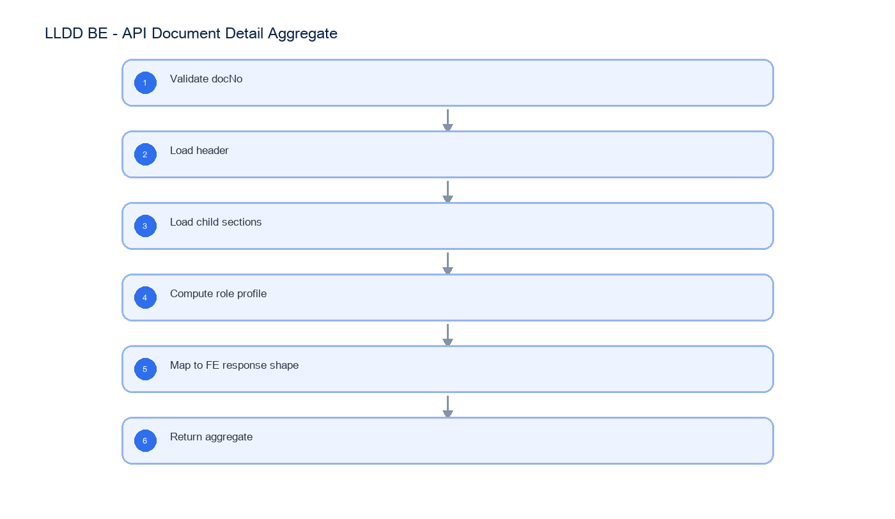

# LLDD BE - API Document Detail Aggregate

SBP Mall - ระบบประกันรายได้ | Low Level Design Document

## 1. Overview

| รายการ | รายละเอียด |
| --- | --- |
| Track | BE |
| Estimate | 27 ชั่วโมง |
| Owner | Butsaba <But> Podamrong |
| Objective | ออกแบบ aggregate API สำหรับโหลดรายละเอียดเอกสารครบทุก section ให้หน้า FE detail |

Common contract reference: ทุกหัวข้อ API/FE ต้องยึด LLDD-BE-API-Common-Contracts และ LLDD-FE-Integration-Contracts สำหรับ error/auth/format/pagination/action/RBAC ก่อนลงรายละเอียดเฉพาะหน้าหรือเฉพาะ endpoint

## 2. Screen / Functional Scope

- Document aggregate query
- Role profile output
- Store impact/new-store/factor mapping
- Compensation summary
- Related master lookup

## 4. Implementation Flow Diagram (Reference)



_รูปที่ 1: Implementation flow reference: LLDD BE - API Document Detail Aggregate_

## 5. Field, Format, and Validation

| Field / UI | Format | Validation | Behavior |
| --- | --- | --- | --- |
| docNo | YYYY/xxxxx | required when opening existing document | ใช้ปี พ.ศ. และ running 5 หลัก |
| storeCode | string 5 digits | numeric length = 5 | แสดง leading zero |
| amount | number, 2 decimals | >= 0 | format `#,##0.00` บาท |
| percent | number, 2 decimals | 0-100 | ใช้ `%` และรวม allocation ต้องเท่ากับ 100 |
| date | DD/MM/YYYY | valid date | FE แสดง พ.ศ. หาก source เป็น ISO ค.ศ. |
| attachment | file | <= 5 MB | รองรับ vsd, dwg, afp, pdf, mda, zip, wav, mp3, gif, jpg, tif, tiff, htm, html, txt, xml, mpg, mov, ivs, doc, docx, xls, xlsx, pps, ppt, pot, csv |
| docNo | YYYY/xxxxx | required path param | หาเอกสารและ section ทั้งหมด |
| visibleSections/editableSections | array | computed by BE | FE render ตาม key ที่ส่งมาเท่านั้น |
| actionOptions | array | computed by BE | radio options + requireComment สำหรับ action panel |

### 5.1 Document Section Keys

Aggregate API ต้องคืน key มาตรฐานให้ FE ใช้ render role profile โดยไม่ต้องคำนวณสิทธิ์จากรหัส workflow ใน client

| Section key | UI section | Render rule |
| --- | --- | --- |
| doc-header | ข้อมูลร้านถูกกระทบ / header | read-only ทุก role |
| sec-sales | แนวโน้มยอดขายรายวัน | read-only ทุก role |
| sec-map | แผนที่ AllMap | read-only ทุก role |
| sec-newstore | ร้านเปิดใหม่ | editable เมื่อ BE ส่งใน editableSections |
| sec-competitor | ร้านคู่แข่งเปิดกระทบ | editable เมื่อ BE ส่งใน editableSections |
| sec-factor | ปัจจัยอื่นๆ | editable เมื่อ BE ส่งใน editableSections |
| sec-attach | เอกสารแนบทั้งหมด | upload ได้เมื่อ canUploadAttachment=true |
| sec-calc | คำนวณเงินชดเชย | visible เมื่อ BE ส่งใน visibleSections |
| sec-comp-history | ประวัติการชดเชย | read-only ทุก role |
| sec-decision-history | ผลการพิจารณา (ประวัติ) | read-only ทุก role |
| sec-action | พิจารณา / ส่งดำเนินการ | visible เมื่อ canAction=true |

### 5.2 Role Profile Output

BE เป็น source of truth ของ role profile แต่เอกสารนี้ไม่ฝังตาราง route workflow; รายละเอียดการแสดงผลต่อบทบาทอยู่ใน LLDD-FE-Document-Detail

| Response field | Meaning | FE usage |
| --- | --- | --- |
| viewerRbacRoleCode | รหัส role/RBAC ของผู้ใช้ เช่น R-01/R-02/R-10 | แสดง/trace เท่านั้น ไม่ map เป็น section |
| roleProfileCode | profile สำหรับหน้า Document Detail เช่น P-06/P-08/P-01/P-02/P-03 | เลือกชุด visible/edit/action ที่ BE คำนวณแล้ว; แยก namespace จาก statusCode |
| visibleSections | section key ที่ต้องแสดง | ซ่อน section ที่ไม่อยู่ใน array |
| editableSections | section key ที่แก้ไขได้ | เปิด input/button เฉพาะ section เหล่านี้ |
| canUploadAttachment | boolean | เปิด/ปิด upload control |
| canAction | boolean | เปิด/ปิด action panel |
| actionOptions | array ของ label + requireComment | render radio โดยไม่คำนวณปลายทาง |

## 5.1 Input / Progress / Output Contract

| Stage | Contract for implementation |
| --- | --- |
| Input | GET /api/v1/documents/{docNo}; GET /api/v1/competitors |
| Progress | Validate docNo; Load header; Load child sections; Compute role profile |
| Output | Rendered UI state or normalized API response with status/message and audit-ready trace reference. |

### 5.90 Endpoint Implementation Contract

| Endpoint | Use-case owner | Service/repository behavior | Definition of done |
| --- | --- | --- | --- |
| GET /api/v1/documents/{docNo} | Document aggregate API | Validate docNo | 404 when doc not found |
| GET /api/v1/competitors | Competitor lookup | Load header | role profile output matches FE Document Detail spec |

### 5.91 Backend Execution Sequence

| Step | Behavior specific to this LLDD | Failure/test evidence |
| --- | --- | --- |
| 1 | Validate docNo | detail success |
| 2 | Load header | detail not found |
| 3 | Load child sections | role profile output |
| 4 | Compute role profile | empty child sections |
| 5 | Map to FE response shape | detail success |
| 6 | Return aggregate | detail not found |

## 6. Button / User Action Mapping

| Action | Trigger | API / Service | Expected Result |
| --- | --- | --- | --- |
| Get detail | GET | documentAggregate.service.getByDocNo | return 12 sections |
| Get lookup | GET | lookup service | return status/competitors/factors |

## 7. API Contract

### GET /api/v1/documents/{docNo}

Document aggregate API

#### Query Params

```json
{
  "docNo": "2569/00123"
}
```

#### Request Field Schema

| Field | Type | Required | Constraint / Meaning |
| --- | --- | --- | --- |
| docNo | string | No | พ.ศ. YYYY/xxxxx |

#### Response

```json
{
  "docNo": "2569/00123",
  "statusCode": "06",
  "viewerRbacRoleCode": "R-XX",
  "roleProfileCode": "P-06",
  "visibleSections": [
    "doc-header",
    "sec-sales",
    "sec-map",
    "sec-newstore",
    "sec-competitor",
    "sec-factor",
    "sec-attach",
    "sec-comp-history",
    "sec-decision-history",
    "sec-action"
  ],
  "editableSections": [],
  "canUploadAttachment": true,
  "canAction": true,
  "actionOptions": [
    {
      "label": "เห็นควรไม่ชดเชย",
      "requireComment": true
    }
  ],
  "impactedStore": {
    "storeCode": "00788"
  },
  "newStores": []
}
```

#### Response Field Schema

| Field | Type | Required | Constraint / Meaning |
| --- | --- | --- | --- |
| docNo | string | Yes | พ.ศ. YYYY/xxxxx |
| statusCode | string | Yes | canonical code; do not replace with display label |
| viewerRbacRoleCode | string | Yes | UTF-8; use value domain described by endpoint purpose |
| roleProfileCode | string | Yes | UTF-8; use value domain described by endpoint purpose |
| visibleSections | array<string> | Yes | JSON array; element type shown in Type column |
| editableSections | array<object> | Yes | JSON array; element type shown in Type column |
| canUploadAttachment | boolean | Yes | UTF-8; use value domain described by endpoint purpose |
| canAction | boolean | Yes | UTF-8; use value domain described by endpoint purpose |
| actionOptions | array<object> | Yes | JSON array; element type shown in Type column |
| actionOptions[].label | string | Yes | UTF-8; use value domain described by endpoint purpose |
| actionOptions[].requireComment | boolean | Yes | UTF-8; use value domain described by endpoint purpose |
| impactedStore | object | Yes | JSON object; nested fields listed below |
| impactedStore.storeCode | string | Yes | exactly 5 digits; preserve leading zero |
| newStores | array<object> | Yes | JSON array; element type shown in Type column |

### GET /api/v1/competitors

Competitor lookup

#### Query Params

```json
{
  "q": "lotus"
}
```

#### Request Field Schema

| Field | Type | Required | Constraint / Meaning |
| --- | --- | --- | --- |
| q | string | No | UTF-8; use value domain described by endpoint purpose |

#### Response

```json
{
  "items": [
    {
      "competitorCode": "C007",
      "competitorName": "Lotus Express"
    }
  ]
}
```

#### Response Field Schema

| Field | Type | Required | Constraint / Meaning |
| --- | --- | --- | --- |
| items | array<object> | Yes | JSON array; element type shown in Type column |
| items[].competitorCode | string | Yes | UTF-8; use value domain described by endpoint purpose |
| items[].competitorName | string | Yes | UTF-8; use value domain described by endpoint purpose |

## 8. Reference DB Mapping (No Database Page Work)

ส่วนนี้เป็นข้อมูลอ้างอิงสำหรับการ implement API/Job เท่านั้น ไม่ใช่งานสร้างหน้า Database, ไม่ใช่งานออกแบบ DB page และไม่ถูกนับเป็น deliverable แยกของ FE/BE

| Table / Object | R/W | Usage |
| --- | --- | --- |
| compensation_documents | R | หัวเอกสาร สถานะ และ section ปัจจุบัน |
| impacted_stores | R | ข้อมูลร้านถูกกระทบ |
| document_new_stores | R | ร้านเปิดใหม่และ compensate_percent |
| document_competitors | R | คู่แข่ง |
| document_external_factors | R | ปัจจัยภายนอก |
| document_attachments | R | metadata ไฟล์แนบ |
| consideration_logs | R | timeline/history |

## 9. Processing Flow

| Step | Description |
| --- | --- |
| 1 | Validate docNo |
| 2 | Load header |
| 3 | Load child sections |
| 4 | Compute role profile |
| 5 | Map to FE response shape |
| 6 | Return aggregate |

## 10. Acceptance Criteria

- 404 when doc not found
- role profile output matches FE Document Detail spec
- nullable section returns empty array
- amount/date formatting source consistent

## 11. Developer Test Checklist

| No | Test |
| --- | --- |
| 1 | detail success |
| 2 | detail not found |
| 3 | role profile output |
| 4 | empty child sections |
