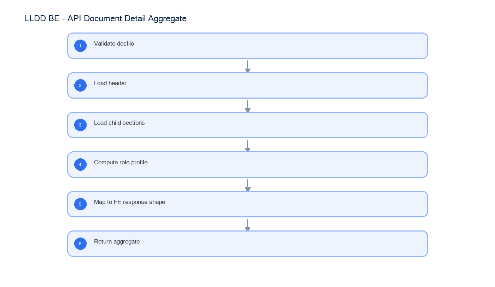
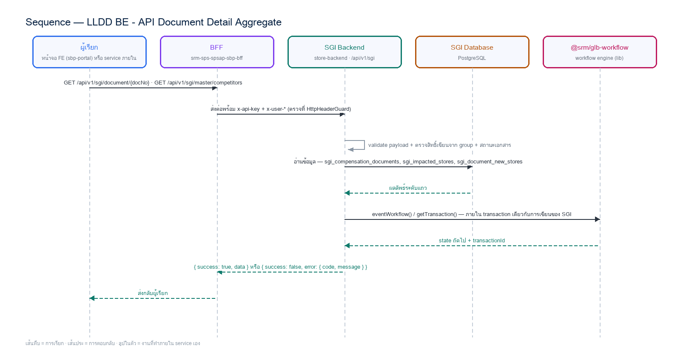

# LLDD BE - API Document Detail Aggregate

SBP Mall - ระบบประกันรายได้ | Low Level Design Document

## 1. Overview

| รายการ | รายละเอียด |
| --- | --- |
| Track | BE |
| Estimate | **32 ชั่วโมง** = implementation 24 + unit test 8 (30%) |
| Owner | Butsaba <But> Podamrong |
| Target repository | `SBP/srm-sps-spsap-store-backend` (NestJS + TypeORM · schema `sps_store`) + `SBP/srm-sps-spsap-sbp-bff` (forward ผ่าน client service · ไม่มี DB) สำหรับเส้นที่ FE เรียก |
| Objective | ออกแบบ aggregate API สำหรับโหลดรายละเอียดเอกสารครบทุก section ให้หน้า FE detail |

Common contract reference: ทุกหัวข้อ API/FE ต้องยึด LLDD-BE-API-Common-Contracts และ LLDD-FE-Integration-Contracts สำหรับ error/auth/format/pagination/action/RBAC ก่อนลงรายละเอียดเฉพาะหน้าหรือเฉพาะ endpoint

### 1.1 เอกสาร LLDD ที่เกี่ยวข้อง

ตารางนี้สร้างจาก endpoint และตารางที่เอกสารฉบับนี้ประกาศไว้จริง — อ่านฉบับที่อยู่ในตารางก่อนลงมือ เพื่อไม่ให้สัญญา request/response หรือชื่อคอลัมน์หลุดจากกัน

| ความสัมพันธ์ | เอกสาร LLDD | เกี่ยวข้องตรงไหน |
| --- | --- | --- |
| ใช้ endpoint ของ | **LLDD-BE-API-Report-and-Master-Data** | `GET /api/v1/sgi/master/competitors` |
| ถูกเรียกจาก | **LLDD-BE-API-Report-and-Master-Data** | `GET /api/v1/sgi/master/competitors` |
| ถูกเรียกจาก | **LLDD-FE-Document-Detail** | `GET /api/v1/sgi/document/{docNo}` |
| ถูกเรียกจาก | **LLDD-FE-Document-Detail-Role-01-Business-Promotion** | `GET /api/v1/sgi/document/{docNo}` |
| ถูกเรียกจาก | **LLDD-FE-Document-Detail-Role-02-GM-Business-Promotion** | `GET /api/v1/sgi/document/{docNo}` |
| ถูกเรียกจาก | **LLDD-FE-Document-Detail-Role-03-AVP-SBP** | `GET /api/v1/sgi/document/{docNo}` |
| ถูกเรียกจาก | **LLDD-FE-Document-Detail-Role-06-SBP-DSA** | `GET /api/v1/sgi/document/{docNo}` |
| ถูกเรียกจาก | **LLDD-FE-Document-Detail-Role-08-SBP-DSA-Officer** | `GET /api/v1/sgi/document/{docNo}` |
| ถูกเรียกจาก | **LLDD-FE-Master-Data** | `GET /api/v1/sgi/master/competitors` |
| สัญญากลาง | **LLDD-BE-API-Common-Contracts** | envelope `{success,data}` · error code · pagination · รูปแบบวันที่/เลขเอกสาร |
| โครงสร้างข้อมูล | **LLDD-BE-Database-Structure** | DDL ของตารางที่หัวข้อ Reference DB Mapping อ้างถึง |
| workflow engine | **LLDD-BE-Workflow-Engine-Definition** | นิยาม state/route/event ที่หัวข้อ Workflow Trigger Event Contract เรียกใช้ |
| แพลตฟอร์มระบบเดิม | **LLDD-BE-Integration-SBP-Platform** | header จาก BFF (`x-api-key` / `x-user-*`) · การ reuse ตารางและ service ของระบบ SBP เดิม |
| ต้องจบก่อน (ลำดับงาน) | **LLDD-BE-API-Common-Contracts** | เป็นฉบับต้นทางของสัญญา/โครงที่ฉบับนี้อ้าง |
| ต้องจบก่อน (ลำดับงาน) | **LLDD-BE-Database-Structure** | เป็นฉบับต้นทางของสัญญา/โครงที่ฉบับนี้อ้าง |

## 2. Screen / Functional Scope

- Document aggregate query
- Role profile output
- Store impact/new-store/factor mapping
- Compensation summary
- Related master lookup

## 3. Screenshot Reference

ไม่มีภาพหน้าจอสำหรับหัวข้อนี้ — เป็นเอกสารฝั่ง Backend/Batch ที่ไม่มี UI (ภาพหน้าจอทั้งหมดอยู่ในเอกสารชุด FE)

## 4. Implementation Flow & Sequence Diagram (Reference)

### 4.1 Implementation Flow (ลำดับขั้นการทำงาน)



_รูปที่ 1: Implementation flow reference: LLDD BE - API Document Detail Aggregate_

### 4.2 Sequence Diagram (ใครคุยกับใคร ลำดับไหน)

ผู้แสดงและลำดับข้อความในภาพนี้สร้างจาก endpoint ในหัวข้อ 7 และตารางในหัวข้อ Reference DB Mapping ของเอกสารฉบับนี้เอง จึงตรงกับสัญญาเสมอ



_รูปที่ 2: Sequence diagram: LLDD BE - API Document Detail Aggregate_

## 5. Field, Format, and Validation

| Field / UI | Format | Validation | Behavior |
| --- | --- | --- | --- |
| docNo | YYYY/xxxxx | required when opening existing document | ใช้ปี **ค.ศ.** และ running 5 หลัก (มติ 2026-08-06) |
| storeCode | string 5 digits | numeric length = 5 | แสดง leading zero |
| amount | number, 2 decimals | >= 0 | format `#,##0.00` บาท |
| percent | number, 2 decimals | 0-100 | ใช้ `%` และรวม allocation ต้องเท่ากับ 100 — **B5: เพิ่ม/ลบร้านที่กระทบเพิ่มเมื่อไร ต้องเกลี่ยใหม่ทั้งชุดแล้วคำนวณ `compensateAmount` ของทุกแถวใหม่ ไม่ใช่เฉพาะแถวที่เพิ่ม** |
| sourceSystem | enum | ALLMAP / USER | **B5** ที่มาของแถวร้านเปิดใหม่ — `ALLMAP` ระบบ default ให้อัตโนมัติ (Job 9) · `USER` เจ้าหน้าที่ SBP DSA คีย์เองจากเอกสารแจ้งของหน่วยงานส่งเสริม (ผัง To-Be · SDD สไลด์ 7) · ซ้ำ `(doc_no, new_store_code)` ให้คืน `409` |
| date | DD/MM/YYYY | valid date | payload เป็น ISO ค.ศ. · FE แสดง ค.ศ. เป็นค่าเริ่มต้น (DatePicker buddhistEra=false) แสดง พ.ศ. เฉพาะจุดที่เปิด flag |
| attachment | file | <= 5 MB | รองรับ vsd, dwg, afp, pdf, mda, zip, wav, mp3, gif, jpg, tif, tiff, htm, html, txt, xml, mpg, mov, ivs, doc, docx, xls, xlsx, pps, ppt, pot, csv |
| docNo | YYYY/xxxxx | required path param | หาเอกสารและ section ทั้งหมด |
| visibleSections/editableSections | array | computed by BE | FE render ตาม key ที่ส่งมาเท่านั้น |
| actionOptions | array | computed by BE | radio options + requireComment สำหรับ action panel |

### 5.1 Document Section Keys

Aggregate API ต้องคืน key มาตรฐานให้ FE ใช้ render role profile โดยไม่ต้องคำนวณสิทธิ์จากรหัส workflow ใน client

| Section key | UI section | Render rule |
| --- | --- | --- |
| doc-header | ข้อมูลร้านถูกกระทบ / header | read-only ทุก role |
| sec-sales | แนวโน้มยอดขายรายวัน | read-only ทุก role |
| sec-map | แผนที่ AllMap | read-only ทุก role |
| sec-newstore | ร้านเปิดใหม่ | editable เมื่อ BE ส่งใน editableSections |
| sec-competitor | ร้านคู่แข่งเปิดกระทบ | editable เมื่อ BE ส่งใน editableSections |
| sec-factor | ปัจจัยอื่นๆ | editable เมื่อ BE ส่งใน editableSections |
| sec-attach | เอกสารแนบทั้งหมด | upload ได้เมื่อ canUploadAttachment=true |
| sec-calc | คำนวณเงินชดเชย | visible เมื่อ BE ส่งใน visibleSections |
| sec-comp-history | ประวัติการชดเชย | read-only ทุก role |
| sec-decision-history | ผลการพิจารณา (ประวัติ) | read-only ทุก role |
| sec-action | พิจารณา / ส่งดำเนินการ | visible เมื่อ canAction=true |

### 5.2 Role Profile Output

BE เป็น source of truth ของ role profile แต่เอกสารนี้ไม่ฝังตาราง route workflow; รายละเอียดการแสดงผลต่อบทบาทอยู่ใน LLDD-FE-Document-Detail

| Response field | Meaning | FE usage |
| --- | --- | --- |
| viewerRbacRoleCode | รหัส role/RBAC ของผู้ใช้ เช่น R-01/R-02/R-10 | แสดง/trace เท่านั้น ไม่ map เป็น section |
| roleProfileCode | profile สำหรับหน้า Document Detail เช่น P-06/P-08/P-01/P-02/P-03 | เลือกชุด visible/edit/action ที่ BE คำนวณแล้ว; แยก namespace จาก statusCode |
| visibleSections | section key ที่ต้องแสดง | ซ่อน section ที่ไม่อยู่ใน array |
| editableSections | section key ที่แก้ไขได้ | เปิด input/button เฉพาะ section เหล่านี้ |
| canUploadAttachment | boolean | เปิด/ปิด upload control |
| canAction | boolean | เปิด/ปิด action panel |
| actionOptions | array ของ label + requireComment | render radio โดยไม่คำนวณปลายทาง |

### 5.9 Input / Progress / Output Contract

| Stage | Contract for implementation |
| --- | --- |
| Input | GET /api/v1/sgi/document/{docNo}; GET /api/v1/sgi/master/competitors |
| Progress | Validate docNo; Load header; Load child sections; Compute role profile |
| Output | ไม่มีตารางที่เอกสารนี้เขียนเอง — output คือ response ตาม envelope กลาง `{success, data}` และร่องรอยที่ตรวจย้อนได้ (log / sgi_consideration_logs / workflow_history ของ engine) |

### 5.90 Endpoint Implementation Contract

| Endpoint | Use-case owner | Service/repository behavior | Definition of done |
| --- | --- | --- | --- |
| GET /api/v1/sgi/document/{docNo} | Document aggregate API | Validate docNo | 404 when doc not found |
| GET /api/v1/sgi/master/competitors | **อ้างอิงเท่านั้น — เจ้าของ endpoint นี้คือ LLDD-BE-API-Report-and-Master-Data (Peerakorn)** · เอกสารนี้เป็นผู้ใช้: อ่าน master คู่แข่งมาทำ dropdown ในหน้าเอกสาร | Load header | role profile output matches FE Document Detail spec |

### 5.91 Backend Execution Sequence

| Step | Behavior specific to this LLDD | Failure/test evidence |
| --- | --- | --- |
| 1 | Validate docNo | detail success |
| 2 | Load header | detail not found |
| 3 | Load child sections | role profile output |
| 4 | Compute role profile | empty child sections |
| 5 | Map to FE response shape | — (ยังไม่มี test เฉพาะขั้นนี้ · ครอบด้วย test รวมของเอกสารในหัวข้อ 11) |
| 6 | Return aggregate | — (ยังไม่มี test เฉพาะขั้นนี้ · ครอบด้วย test รวมของเอกสารในหัวข้อ 11) |

### 5.92 Workflow Trigger Event Contract

งานชิ้นนี้ **ต้องเรียก workflow engine** ตามตารางด้านล่าง · ชื่อ function ยึด API 8 ตัวของ `@srm/glb-workflow` ตามชีต `Detail` ของ `SBP/TSM-SRM-LLDD-SBP-workflow-1.2.md` — รายละเอียด signature และตารางที่ engine เขียน ดู **LLDD-BE-Workflow-Engine-Definition** หัวข้อ 5.3

| จุดที่เรียก (call site) | Engine function | พารามิเตอร์หลัก | กติกา / transaction boundary |
| --- | --- | --- | --- |
| ประกอบหน้าเอกสาร | `getPermissionEvents` | versionId, referenceId, userData | คืน event[] เป็นปุ่ม และ display[] เป็น READ/WRITE ต่อ part — FE ห้ามคำนวณสิทธิ์เอง |
| สถานะ + ผู้ถืองานปัจจุบัน | `getTransaction` | versionId, referenceId | ใช้เป็นค่าอ้างอิงให้ FE ส่งกลับมาตอนกดปุ่ม (optimistic guard) |

- 🔴 กติกาเหล็ก: ตาราง `sps_store.workflow_*` (13 ตาราง) เป็นของ lib — SGI **R เท่านั้น** ห้าม INSERT/UPDATE/DELETE ตรงในทุกกรณี
- ทุกการเรียก engine ต้องผ่านตัวห่อกลาง `WorkflowGateway` ที่นิยามใน **LLDD-BE-API-Common-Contracts** (timeout · retry · map error เข้า envelope) ห้าม import lib ตรงจาก service
- unit test ต้อง mock engine และครอบอย่างน้อย: เรียกสำเร็จ · engine โยน error แล้ว rollback ฝั่ง SGI ครบ · เรียกซ้ำด้วย referenceId เดิมไม่เกิดผลซ้ำ

## 6. Button / User Action Mapping

| Action | Trigger | API / Service | Expected Result |
| --- | --- | --- | --- |
| Get detail | GET | documentAggregate.service.getByDocNo | return 12 sections |
| Get lookup | GET | lookup service | return status/competitors/factors |

## 7. API Contract

### GET /api/v1/sgi/document/{docNo}

Document aggregate API

#### Query Params

```json
{
  "docNo": "2026/00123"
}
```

#### Request Field Schema

| Field | Type | Required | Constraint / Meaning |
| --- | --- | --- | --- |
| docNo | string | No | ค.ศ. YYYY/xxxxx |

#### Response

```json
{
  "docNo": "2026/00123",
  "statusCode": "06",
  "viewerRbacRoleCode": "R-XX",
  "roleProfileCode": "P-06",
  "visibleSections": [
    "doc-header",
    "sec-sales",
    "sec-map",
    "sec-newstore",
    "sec-competitor",
    "sec-factor",
    "sec-attach",
    "sec-comp-history",
    "sec-decision-history",
    "sec-action"
  ],
  "editableSections": [],
  "canUploadAttachment": true,
  "canAction": true,
  "actionOptions": [
    {
      "label": "เห็นควรไม่ชดเชย",
      "requireComment": true
    }
  ],
  "impactedStore": {
    "storeCode": "00788"
  },
  "newStores": []
}
```

#### Response Field Schema

| Field | Type | Required | Constraint / Meaning |
| --- | --- | --- | --- |
| docNo | string | Yes | ค.ศ. YYYY/xxxxx |
| statusCode | string | Yes | canonical code; do not replace with display label |
| viewerRbacRoleCode | string | Yes | UTF-8; use value domain described by endpoint purpose |
| roleProfileCode | string | Yes | UTF-8; use value domain described by endpoint purpose |
| visibleSections | array<string> | Yes | JSON array; element type shown in Type column |
| editableSections | array<object> | Yes | JSON array; element type shown in Type column |
| canUploadAttachment | boolean | Yes | UTF-8; use value domain described by endpoint purpose |
| canAction | boolean | Yes | UTF-8; use value domain described by endpoint purpose |
| actionOptions | array<object> | Yes | JSON array; element type shown in Type column |
| actionOptions[].label | string | Yes | UTF-8; use value domain described by endpoint purpose |
| actionOptions[].requireComment | boolean | Yes | UTF-8; use value domain described by endpoint purpose |
| impactedStore | object | Yes | JSON object; nested fields listed below |
| impactedStore.storeCode | string | Yes | exactly 5 digits; preserve leading zero |
| newStores | array<object> | Yes | JSON array; element type shown in Type column |

### GET /api/v1/sgi/master/competitors

**อ้างอิงเท่านั้น — เจ้าของ endpoint นี้คือ LLDD-BE-API-Report-and-Master-Data (Peerakorn)** · เอกสารนี้เป็นผู้ใช้: อ่าน master คู่แข่งมาทำ dropdown ในหน้าเอกสาร

#### Query Params

```json
{
  "q": "lotus"
}
```

#### Request Field Schema

| Field | Type | Required | Constraint / Meaning |
| --- | --- | --- | --- |
| q | string | No | UTF-8; use value domain described by endpoint purpose |

#### Response

```json
{
  "items": [
    {
      "competitorCode": "C007",
      "competitorName": "Lotus Express"
    }
  ]
}
```

#### Response Field Schema

| Field | Type | Required | Constraint / Meaning |
| --- | --- | --- | --- |
| items | array<object> | Yes | JSON array; element type shown in Type column |
| items[].competitorCode | string | Yes | UTF-8; use value domain described by endpoint purpose |
| items[].competitorName | string | Yes | UTF-8; use value domain described by endpoint purpose |

## 8. Reference DB Mapping (No Database Page Work)

ส่วนนี้เป็นข้อมูลอ้างอิงสำหรับการ implement API/Job เท่านั้น ไม่ใช่งานสร้างหน้า Database, ไม่ใช่งานออกแบบ DB page และไม่ถูกนับเป็น deliverable แยกของ FE/BE

| Table / Object | R/W | Usage |
| --- | --- | --- |
| sgi_compensation_documents | R | หัวเอกสาร สถานะ และ section ปัจจุบัน |
| sgi_impacted_stores | R | ข้อมูลร้านถูกกระทบ |
| sgi_document_new_stores | R | ร้านเปิดใหม่และ compensate_percent |
| sgi_document_competitors | R | คู่แข่ง |
| sgi_document_external_factors | R | ปัจจัยภายนอก |
| sgi_document_attachments | R | metadata ไฟล์แนบ |
| sgi_consideration_logs | R | timeline/history |

## 9. Skeleton Code (store-backend + BFF)

โครงโค้ดตั้งต้นของเอกสารฉบับนี้ ยึด convention จริงของ `srm-sps-spsap-store-backend` (NestJS 11 + TypeORM, schema `sps_store`, custom provider `DATA_SOURCE` ที่ route SELECT ไป slave pool) และ `srm-sps-spsap-sbp-bff` (ไม่มี DB, forward ผ่าน client service). ทุกจุดที่ต้องเติมกำกับด้วย `// TODO:` และ response ทุกเส้นถูกห่อเป็น `{success, data}` โดย ResponseInterceptor อยู่แล้ว จึงห้าม service ห่อซ้ำ

#### 9.1 ผังไฟล์ที่ต้องสร้าง

| Path | หน้าที่ |
| --- | --- |
| store-backend · src/modules/sgi-document-detail-aggregate/sgi-document-detail-aggregate.controller.ts | route ทั้งหมดของเอกสารนี้ (2 เส้น) + `@UseGuards(HttpHeaderGuard)` + `@UserId()` |
| store-backend · src/modules/sgi-document-detail-aggregate/sgi-document-detail-aggregate.service.ts | business logic — inject `'DATA_SOURCE'` แล้วยิง raw SQL, mutation ใช้ QueryRunner transaction |
| store-backend · src/modules/sgi-document-detail-aggregate/sgi-document-detail-aggregate.sql.ts | เก็บ SQL ต่อ endpoint (คัดจากหัวข้อ 10) แยกออกจาก service ให้ทดสอบ/รีวิวง่าย |
| store-backend · src/modules/sgi-document-detail-aggregate/dto/sgi-document-detail-aggregate.dto.ts | DTO + class-validator ตาม validation ในหัวข้อฟิลด์ของเอกสารนี้ |
| store-backend · src/modules/sgi-document-detail-aggregate/sgi-document-detail-aggregate.module.ts | ประกอบ controller/service/providers แล้ว register ที่ `app.module.ts` |
| store-backend · src/entitys/sgi-compensation-documents.entity.ts | entity ของ `sgi_compensation_documents` (`@Entity({schema: process.env.DB_SCHEMA})`, ไม่ประกาศ relation) — **entity ร่วมหลายเอกสาร: ประกาศครั้งเดียวแล้วอ้างอิง อย่าสร้างซ้ำ** |
| store-backend · src/entitys/sgi-impacted-stores.entity.ts | entity ของ `sgi_impacted_stores` (`@Entity({schema: process.env.DB_SCHEMA})`, ไม่ประกาศ relation) |
| store-backend · src/entitys/sgi-document-new-stores.entity.ts | entity ของ `sgi_document_new_stores` (`@Entity({schema: process.env.DB_SCHEMA})`, ไม่ประกาศ relation) |
| store-backend · src/providers/sgi/sgi.ts | repository provider แบบ factory ผูก token string กับ `DATA_SOURCE` — **ไฟล์ร่วมของทุกเอกสาร BE ให้ merge array เพิ่ม ห้ามเขียนทับ** |
| store-backend · sql/deploy-sgi-document-detail-aggregate.sql | DDL production แบบ idempotent (ทีมนี้ไม่ใช้ migration เป็นหลัก) |
| BFF · src/common/client-services/sgi-client.service.ts | client ต่อจาก `BaseClientService` ตั้ง baseUrl + `x-api-key` ตอน `onModuleInit` |
| BFF · src/modules/sgi-document-detail-aggregate/sgi-document-detail-aggregate.controller.ts | route ฝั่ง BFF prefix `/bff/sgi/…` + `@UseGuards(AuthGuard('jwt'))` |
| BFF · src/modules/sgi-document-detail-aggregate/sgi-document-detail-aggregate.service.ts | แนบ `x-user-id` / `x-user-group-id` / `x-user-permissions` แล้ว forward ไป backend |

#### 9.2 Controller (store-backend)

```ts
// src/modules/sgi-document-detail-aggregate/sgi-document-detail-aggregate.controller.ts
import { Controller, Get, Param, Query, UseGuards } from '@nestjs/common';
import { HttpHeaderGuard } from '../../guards/http-header.guard';
import { UserId } from '../../common/decorators/user-id.decorator';
import { SgiDocumentDetailAggregateService } from './sgi-document-detail-aggregate.service';
import { DocumentDetailAggregateQueryDto } from './dto/sgi-document-detail-aggregate.dto';

// LLDD BE - API Document Detail Aggregate
// BFF เรียกด้วย x-api-key และแนบ x-user-id / x-user-group-id / x-user-permissions มาให้
@Controller('sgi/sgi')
@UseGuards(HttpHeaderGuard)
export class SgiDocumentDetailAggregateController {
  constructor(private readonly service: SgiDocumentDetailAggregateService) {}

  // GET /api/v1/sgi/document/{docNo} — Document aggregate API
  @Get('sgi/document/:docNo')
  getSgiDocumentByDocNo(@Param('docNo') docNo: string, @UserId() userId: string) {
    // TODO: ตรวจ x-user-permissions ก่อนเรียก service ถ้า endpoint นี้จำกัดสิทธิ์เมนู
    return this.service.getSgiDocumentByDocNo(docNo, userId);
  }

  // GET /api/v1/sgi/master/competitors — **อ้างอิงเท่านั้น — เจ้าของ endpoint นี้คือ LLDD-BE-API-Report-and-Ma…
  @Get('sgi/master/competitors')
  getSgiMasterCompetitors(
    @Query() query: DocumentDetailAggregateQueryDto,
    @UserId() userId: string,
  ) {
    // TODO: ตรวจ x-user-permissions ก่อนเรียก service ถ้า endpoint นี้จำกัดสิทธิ์เมนู
    return this.service.getSgiMasterCompetitors(query, userId);
  }
}
```

#### 9.3 DTO + Validation

```ts
// src/modules/sgi-document-detail-aggregate/dto/sgi-document-detail-aggregate.dto.ts
import { Type } from 'class-transformer';
import {
  IsArray, IsBoolean, IsIn, IsInt, IsNotEmpty, IsNumber, IsObject, IsOptional,
  IsString, Matches, Max, MaxLength, Min,
} from 'class-validator';

// ValidationPipe ระดับ global ตั้ง whitelist + forbidNonWhitelisted + transform ไว้แล้ว (main.ts)
// property ที่ไม่ประกาศที่นี่จะถูก reject เป็น 400 อัตโนมัติ

// query ร่วมของ GET ทุกเส้นในโมดูลนี้ (path param ใช้ @Param แยก)
export class DocumentDetailAggregateQueryDto {
  /** required เฉพาะบาง endpoint — ตรวจซ้ำใน service */
  @IsOptional()
  @IsString()
  q?: string;
}
```

#### 9.4 Service (inject `DATA_SOURCE` + raw SQL)

service ประกาศ method ครบทุกเส้นที่ controller เรียก และ **signature มาจากแหล่งเดียวกับ controller** (จำนวน/ลำดับพารามิเตอร์จึงตรงกันเสมอ) — เส้นที่ยังไม่ได้ implement เป็น stub ที่ `throw new NotImplementedException(...)` ให้ TypeScript compile ผ่านตั้งแต่วันแรก

```ts
// src/modules/sgi-document-detail-aggregate/sgi-document-detail-aggregate.service.ts
import { Inject, Injectable, Logger, NotFoundException, NotImplementedException } from '@nestjs/common';
import { DataSource } from 'typeorm';
import { SGI_SQL } from './sgi-document-detail-aggregate.sql';

@Injectable()
export class SgiDocumentDetailAggregateService {
  private readonly logger = new Logger(SgiDocumentDetailAggregateService.name);

  constructor(
    // DATA_SOURCE override query(): SELECT/WITH ไป slave pool, write ไป master
    @Inject('DATA_SOURCE') private readonly dataSource: DataSource,
  ) {}

  // GET /api/v1/sgi/document/{docNo} — Document aggregate API
  async getSgiDocumentByDocNo(docNo: string, userId: string) {
    const page = 1;
    const size = 100; // endpoint นี้ไม่มี query param — ไม่แบ่งหน้า
    // SQL เต็มอยู่ในหัวข้อ Database SQL ของเอกสารนี้ (คีย์ 'GET /api/v1/sgi/document/{docNo}')
    // ⚠️ SQL ตัวอย่างบางเส้นเขียนด้วย named parameter (:size/:offset) แต่ dataSource.query()
    //    รับเฉพาะ positional $1..$n — ต้องแปลงชื่อเป็นลำดับก่อน หรือใช้ QueryBuilder แทน
    const rows = await this.dataSource.query(SGI_SQL.getSgiDocumentByDocNo, [
      // TODO: เรียงพารามิเตอร์ให้ตรงกับ $1..$n ของ SQL จริง
      userId, (page - 1) * size, size,
    ]);
    // TODO: total ต้องมาจาก COUNT(*) แยก query หรือ window function ไม่ใช่ rows.length
    return { page, size, total: rows.length, items: rows };
  }

  // GET /api/v1/sgi/master/competitors — **อ้างอิงเท่านั้น — เจ้าของ endpoint นี้คือ LLDD-BE-API-Report-and-Ma…
  async getSgiMasterCompetitors(query: DocumentDetailAggregateQueryDto, userId: string) {
    // TODO: implement ตาม business rule ของ GET /api/v1/sgi/master/competitors
    //       (SQL อยู่ในหัวข้อ Database SQL คีย์ 'GET /api/v1/sgi/master/competitors')
    throw new NotImplementedException('getSgiMasterCompetitors ยังไม่ implement');
  }
}
```

#### 9.5 Entity (TypeORM)

```ts
// src/entitys/sgi-compensation-documents.entity.ts
import { Column, Entity, PrimaryColumn } from 'typeorm';

@Entity({ name: 'sgi_compensation_documents', schema: process.env.DB_SCHEMA })
export class CompensationDocument {
  @PrimaryColumn({ name: 'doc_no', type: 'varchar', length: 12 })
  docNo: string;

  @Column({ name: 'impact_process_id', type: 'bigint', nullable: true })
  impactProcessId?: number;

  @Column({ name: 'impacted_store_code', type: 'char', length: 5 })
  impactedStoreCode: string;

  @Column({ name: 'status_code', type: 'varchar', length: 2 })
  statusCode: string;

  @Column({ name: 'current_section_code', type: 'varchar', length: 2 })
  currentSectionCode: string;

  @Column({ name: 'round_no', type: 'int', nullable: true })
  roundNo?: number;

  @Column({ name: 'loop_no', type: 'int', nullable: true })
  loopNo?: number;

  @Column({ name: 'statement_id', type: 'varchar', length: 30, nullable: true })
  statementId?: string;

  @Column({ name: 'statement_date', type: 'date', nullable: true })
  statementDate?: Date;

  @Column({ name: 'account_year', type: 'int', nullable: true })
  accountYear?: number;

  @Column({ name: 'account_month', type: 'int', nullable: true })
  accountMonth?: number;

  @Column({ name: 'compensate_amount', type: 'numeric', precision: 15, scale: 2, nullable: true })
  compensateAmount?: string;

  @Column({ name: 'allmap_url', type: 'text', nullable: true })
  allmapUrl?: string;

  @Column({ name: 'approver_snapshot', type: 'jsonb', nullable: true })
  approverSnapshot?: Record<string, unknown>;

  @Column({ name: 'created_at', type: 'timestamptz', nullable: true })
  createdAt?: Date;

  @Column({ name: 'updated_at', type: 'timestamptz', nullable: true })
  updatedAt?: Date;

  // TODO: ตรวจความยาว/precision กับ DDL จริงใน sql/deploy-sgi-*.sql ก่อน merge
  //       entity ชุดนี้ไม่ประกาศ relation ตาม convention (join ด้วย raw SQL)
}
```

```ts
// src/entitys/sgi-impacted-stores.entity.ts
import { Column, Entity, PrimaryColumn } from 'typeorm';

@Entity({ name: 'sgi_impacted_stores', schema: process.env.DB_SCHEMA })
export class ImpactedStore {
  @PrimaryColumn({ name: 'store_code', type: 'char', length: 5 })
  storeCode: string;

  @Column({ name: 'store_name', type: 'varchar', length: 200 })
  storeName: string;

  @Column({ name: 'zone_code', type: 'varchar', length: 10, nullable: true })
  zoneCode?: string;

  @Column({ name: 'region_code', type: 'varchar', length: 10, nullable: true })
  regionCode?: string;

  @Column({ name: 'store_type', type: 'varchar', length: 5, nullable: true })
  storeType?: string;

  @Column({ name: 'transfer_sbp_date', type: 'date', nullable: true })
  transferSbpDate?: Date;

  @Column({ name: 'is_active', type: 'boolean', default: true })
  isActive: boolean;

  // TODO: ตรวจความยาว/precision กับ DDL จริงใน sql/deploy-sgi-*.sql ก่อน merge
  //       entity ชุดนี้ไม่ประกาศ relation ตาม convention (join ด้วย raw SQL)
}
```

ตารางที่เหลือของเอกสารนี้ (`sgi_document_new_stores`, `sgi_document_competitors`, `sgi_document_external_factors`, `sgi_document_attachments`, `sgi_consideration_logs`) ใช้รูปแบบ entity เดียวกัน — คอลัมน์อ้างจาก `database.md`

#### 9.6 Repository Providers + Module wiring

```ts
// src/providers/sgi/sgi.ts — repository provider แบบ factory (ไม่ใช้ TypeOrmModule.forFeature)
// convention ของโฟลเดอร์ providers คือ 1 ไฟล์ต่อโดเมน ตั้งชื่อตามโดเมน (business_user/business_user.ts,
// common_code/common_code.ts …) ไม่ใช่ index.ts
//
// ⚠️ ไฟล์นี้ใช้ร่วมกันทุกเอกสาร BE ของ SGI — ให้ **merge array เพิ่ม** เข้าไฟล์เดิม ห้ามเขียนทับ
//    (ชื่อ const แยกต่อเอกสารไว้แล้วเพื่อไม่ให้ชนกัน)
import { DataSource } from 'typeorm';
import { CompensationDocument } from '../../entitys/sgi-compensation-documents.entity';
import { ImpactedStore } from '../../entitys/sgi-impacted-stores.entity';
import { DocumentNewStore } from '../../entitys/sgi-document-new-stores.entity';

export const sgiDocumentDetailAggregateProviders = [
  {
    provide: 'SGI_COMPENSATION_DOCUMENT_REPOSITORY',
    useFactory: (dataSource: DataSource) => dataSource.getRepository(CompensationDocument),
    inject: ['DATA_SOURCE'],
  },
  {
    provide: 'SGI_IMPACTED_STORE_REPOSITORY',
    useFactory: (dataSource: DataSource) => dataSource.getRepository(ImpactedStore),
    inject: ['DATA_SOURCE'],
  },
  {
    provide: 'SGI_DOCUMENT_NEW_STORE_REPOSITORY',
    useFactory: (dataSource: DataSource) => dataSource.getRepository(DocumentNewStore),
    inject: ['DATA_SOURCE'],
  },
];

// src/modules/sgi-document-detail-aggregate/sgi-document-detail-aggregate.module.ts
import { MiddlewareConsumer, Module, NestModule } from '@nestjs/common';
import { DatabaseModule } from '../../database/database.module';
// UserContextMiddleware อ่าน header x-user-id แล้วเซ็ต request.userId ที่ @UserId() ใช้
// — app.module.ts **ไม่ได้** apply แบบ global (มีแค่ HttpContext/LoggerContext) แต่ละโมดูลต้อง apply เอง
// (ดู evaluation-process.module.ts / inform-evaluate.module.ts / cooperation-request.module.ts)
import { UserContextMiddleware } from '../../common/middleware/user-context.middleware';
import { sgiDocumentDetailAggregateProviders } from '../../providers/sgi/sgi';
import { SgiDocumentDetailAggregateController } from './sgi-document-detail-aggregate.controller';
import { SgiDocumentDetailAggregateService } from './sgi-document-detail-aggregate.service';

@Module({
  imports: [DatabaseModule],
  controllers: [SgiDocumentDetailAggregateController],
  providers: [SgiDocumentDetailAggregateService, ...sgiDocumentDetailAggregateProviders],
  exports: [SgiDocumentDetailAggregateService],
})
export class SgiDocumentDetailAggregateModule implements NestModule {
  configure(consumer: MiddlewareConsumer) {
    // ถ้าไม่ apply ตรงนี้ userId จะเป็น undefined เงียบ ๆ ทุก endpoint
    consumer.apply(UserContextMiddleware).forRoutes(SgiDocumentDetailAggregateController);
  }
}
// TODO: register module นี้ใน app.module.ts (imports) พร้อมกับโมดูล SGI ตัวอื่น
```

#### 9.7 BFF Proxy (module + controller + client service)

BFF ยังไม่มีฟีเจอร์ประกันรายได้เลย จึงต้องสร้าง module ใหม่ + client service ใหม่ทั้งชุด และเลือก prefix แบบเดียวทั้งโมดูล (ที่นี่ใช้ `/bff/sgi/…`) เพื่อไม่ให้ปนแบบที่มี/ไม่มี `/bff` เหมือนโมดูลเดิม

```ts
// src/common/client-services/sgi-client.service.ts
import { Injectable, Logger, OnModuleInit } from '@nestjs/common';
import { BaseClientService } from './base-client.service';

@Injectable()
export class SgiClientService extends BaseClientService implements OnModuleInit {
  protected logger: Logger = new Logger(SgiClientService.name);

  onModuleInit() {
    // TODO: ถ้า deploy SGI แยก service ให้เพิ่ม API_SGI_BACKEND_* ใน AppConfigService
    //       ตอนนี้ชี้ store backend ตัวเดียวกับ StoreClientService
    this.defaultHeaders[this.config.api.store.key.name] = this.config.api.store.key.value;
    this.baseUrl = this.config.api.store.url;
  }
}
// BaseClientService แกะ { success, data } ให้แล้ว — service ฝั่ง BFF จึงได้ data ตรง ๆ
// TODO: เพิ่ม SgiClientService ใน providers/exports ของ ClientServiceModule (@Global)
```

```ts
// src/modules/sgi-document-detail-aggregate/sgi-document-detail-aggregate.service.ts (BFF)
import { Injectable } from '@nestjs/common';
import { SgiClientService } from '@common/client-services/sgi-client.service';

@Injectable()
export class SgiDocumentDetailAggregateBffService {
  constructor(private readonly client: SgiClientService) {}

  // BFF ไม่มี DB — หน้าที่เดียวคือแนบ user context แล้ว forward
  private userHeaders(user: any) {
    return {
      'x-user-id': user?.userId,
      'x-user-group-id': user?.groupId,
      'x-user-permissions': (user?.permissions ?? []).join(','),
    };
  }

  getSgiDocumentByDocNo(docNo: string, params: any, user: any) {
    return this.client.get(`/api/v1/sgi/document/${docNo}`, { params, headers: this.userHeaders(user) });
  }

  getSgiMasterCompetitors(params: any, user: any) {
    return this.client.get('/api/v1/sgi/master/competitors', { params, headers: this.userHeaders(user) });
  }
}

// ---------- src/modules/sgi-document-detail-aggregate/sgi-document-detail-aggregate.controller.ts (BFF) ----------
import { Body, Controller, Delete, Get, Param, Post, Put, Query, Req, UseGuards } from '@nestjs/common';
import { AuthGuard } from '@nestjs/passport';

// เลือก prefix แบบเดียวทั้งโมดูล: ใช้ '/bff/sgi/...' (ห้ามปนกับแบบไม่มี /bff)
@Controller('bff/sgi/document-detail-aggregate')
@UseGuards(AuthGuard('jwt'))
export class SgiDocumentDetailAggregateBffController {
  constructor(private readonly service: SgiDocumentDetailAggregateBffService) {}

  // proxy ของ GET /api/v1/sgi/document/{docNo}
  @Get('sgi/document/:docNo')
  getSgiDocumentByDocNo(@Param('docNo') docNo: string, @Query() query: any, @Req() req: any) {
    return this.service.getSgiDocumentByDocNo(docNo, query, req.user);
  }

  // proxy ของ GET /api/v1/sgi/master/competitors
  @Get('sgi/master/competitors')
  getSgiMasterCompetitors(@Query() query: any, @Req() req: any) {
    return this.service.getSgiMasterCompetitors(query, req.user);
  }
}
// TODO: register module ใน app.module.ts ของ BFF และเพิ่ม SgiClientService ใน ClientServiceModule (@Global)
```

## 10. Database SQL

#### 10.1 ตารางที่อ่าน/เขียน

| Table / Object | R/W | Usage |
| --- | --- | --- |
| sgi_compensation_documents | R | หัวเอกสาร สถานะ และ section ปัจจุบัน |
| sgi_impacted_stores | R | ข้อมูลร้านถูกกระทบ |
| sgi_document_new_stores | R | ร้านเปิดใหม่และ compensate_percent |
| sgi_document_competitors | R | คู่แข่ง |
| sgi_document_external_factors | R | ปัจจัยภายนอก |
| sgi_document_attachments | R | metadata ไฟล์แนบ |
| sgi_consideration_logs | R | timeline/history |

#### 10.2 SQL จริงต่อ Endpoint

**GET /api/v1/sgi/document/{docNo}** — Document aggregate API

```sql
-- ⚠️ SQL นี้ใช้ named parameter (:name) แต่ `dataSource.query()` ของ store-backend
--    รับเฉพาะ positional $1..$n — ต้องแปลงเป็นลำดับ หรือรันผ่าน QueryBuilder
-- โหลดเอกสารฉบับเต็ม 12 ส่วนในคำขอเดียว
SELECT * FROM sgi_compensation_documents      WHERE doc_no = :docNo;
SELECT * FROM sgi_document_new_stores          WHERE doc_no = :docNo;
SELECT * FROM sgi_document_competitors         WHERE doc_no = :docNo;
SELECT * FROM sgi_document_external_factors    WHERE doc_no = :docNo;
SELECT * FROM sgi_document_attachments         WHERE doc_no = :docNo;
SELECT * FROM sgi_consideration_logs           WHERE doc_no = :docNo ORDER BY action_datetime;
```

**GET /api/v1/sgi/master/competitors** — **อ้างอิงเท่านั้น — เจ้าของ endpoint นี้คือ LLDD-BE-API-Report-and-Master-Data (Peerakorn)** · เอกสารนี้เป็นผ…

```sql
-- ⚠️ SQL นี้ใช้ named parameter (:name) แต่ `dataSource.query()` ของ store-backend
--    รับเฉพาะ positional $1..$n — ต้องแปลงเป็นลำดับ หรือรันผ่าน QueryBuilder
-- master แบรนด์คู่แข่ง 11 รายการ (รหัส 01-11) · ระบบเดิมเก็บชื่อไทยและอังกฤษ
SELECT competitor_code, name_th, name_en, remark, is_active
FROM sgi_competitors
WHERE (:q IS NULL OR name_th LIKE :q OR name_en LIKE :q)
ORDER BY competitor_code;
```

#### 10.3 Index / Constraint ที่ควรมี (ข้อเสนอ)

| Table | DDL ที่เสนอ | ที่มา / หมายเหตุ |
| --- | --- | --- |
| sgi_compensation_documents | CREATE UNIQUE INDEX uk_compensation_documents_business ON sgi_compensation_documents (impacted_store_code, account_year, account_month, round_no); | อนุมานจากเงื่อนไข query ที่เอกสารนี้ระบุ — สร้างพร้อมสคริปต์ deploy ของ SGI |
| sgi_document_new_stores | CREATE INDEX idx_document_new_stores_doc_no ON sgi_document_new_stores (doc_no); | อนุมานจากเงื่อนไข query ที่เอกสารนี้ระบุ — สร้างพร้อมสคริปต์ deploy ของ SGI |
| sgi_document_competitors | CREATE INDEX idx_document_competitors_doc_no ON sgi_document_competitors (doc_no, source_system); | อนุมานจากเงื่อนไข query ที่เอกสารนี้ระบุ — สร้างพร้อมสคริปต์ deploy ของ SGI |
| sgi_document_external_factors | CREATE INDEX idx_document_external_factors_doc_no ON sgi_document_external_factors (doc_no); | อนุมานจากเงื่อนไข query ที่เอกสารนี้ระบุ — สร้างพร้อมสคริปต์ deploy ของ SGI |
| sgi_document_attachments | CREATE INDEX idx_document_attachments_doc_no ON sgi_document_attachments (doc_no, section_code); | อนุมานจากเงื่อนไข query ที่เอกสารนี้ระบุ — สร้างพร้อมสคริปต์ deploy ของ SGI |
| sgi_consideration_logs | CREATE INDEX idx_consideration_logs_doc_no ON sgi_consideration_logs (doc_no, action_datetime DESC); | อนุมานจากเงื่อนไข query ที่เอกสารนี้ระบุ — สร้างพร้อมสคริปต์ deploy ของ SGI |

ทั้งหมดเป็น **ข้อเสนอ** ไม่ใช่ข้อกำหนดจาก SRS — ให้ตรวจกับ `EXPLAIN ANALYZE` บนข้อมูลจริง และรวมเข้าไฟล์ `sql/deploy-sgi-*.sql` แบบ idempotent (`CREATE INDEX IF NOT EXISTS`) ตาม pattern ที่ทีมใช้อยู่

## 11. Processing Flow

| Step | Description |
| --- | --- |
| 1 | Validate docNo |
| 2 | Load header |
| 3 | Load child sections |
| 4 | Compute role profile |
| 5 | Map to FE response shape |
| 6 | Return aggregate |

## 12. Acceptance Criteria

- 404 when doc not found
- role profile output matches FE Document Detail spec
- nullable section returns empty array
- amount/date formatting source consistent

## 13. Developer Test Checklist

| No | Test |
| --- | --- |
| 1 | detail success |
| 2 | detail not found |
| 3 | role profile output |
| 4 | empty child sections |

## 14. Unit Test Scope

**8 ชั่วโมง** (30% ของ implementation 24 ชั่วโมง) · เครื่องมือ: Jest + mock repository/DataSource (ไม่ต่อ DB จริง)

หัวข้อนี้คือ **unit test** ที่ต้องเขียนคู่กับโค้ด — ต่างจาก *Developer Test Checklist* ซึ่งเป็น scenario ระดับ end-to-end/manual ที่ใช้ตอนตรวจรับ · รายการด้านล่าง derive จาก field/validation, acceptance criteria, endpoint และตารางที่เอกสารนี้เขียน

| สิ่งที่ทดสอบ | ประเภท | เกณฑ์ผ่าน |
| --- | --- | --- |
| `docNo` | validation | ผ่านเมื่อถูกกฎ / โยน error เมื่อผิด — กฎ: required when opening existing document · รูปแบบ: YYYY/xxxxx |
| `storeCode` | validation | ผ่านเมื่อถูกกฎ / โยน error เมื่อผิด — กฎ: numeric length = 5 · รูปแบบ: string 5 digits |
| `amount` | validation | ผ่านเมื่อถูกกฎ / โยน error เมื่อผิด — กฎ: >= 0 · รูปแบบ: number, 2 decimals |
| `percent` | validation | ผ่านเมื่อถูกกฎ / โยน error เมื่อผิด — กฎ: 0-100 · รูปแบบ: number, 2 decimals |
| `sourceSystem` | validation | ผ่านเมื่อถูกกฎ / โยน error เมื่อผิด — กฎ: ALLMAP / USER · รูปแบบ: enum |
| `date` | validation | ผ่านเมื่อถูกกฎ / โยน error เมื่อผิด — กฎ: valid date · รูปแบบ: DD/MM/YYYY |
| `attachment` | validation | ผ่านเมื่อถูกกฎ / โยน error เมื่อผิด — กฎ: <= 5 MB · รูปแบบ: file |
| `docNo` | validation | ผ่านเมื่อถูกกฎ / โยน error เมื่อผิด — กฎ: required path param · รูปแบบ: YYYY/xxxxx |
| `visibleSections/editableSections` | validation | ผ่านเมื่อถูกกฎ / โยน error เมื่อผิด — กฎ: computed by BE · รูปแบบ: array |
| `actionOptions` | validation | ผ่านเมื่อถูกกฎ / โยน error เมื่อผิด — กฎ: computed by BE · รูปแบบ: array |
| business rule | logic | 404 when doc not found |
| business rule | logic | role profile output matches FE Document Detail spec |
| business rule | logic | nullable section returns empty array |
| business rule | logic | amount/date formatting source consistent |
| `GET /api/v1/sgi/document/{docNo}` | handler | คืน {success:true,data} ตามรูปแบบที่ระบุ และคืน {success:false,error:{code,message}} เมื่อ input ผิด — mock repository/lib ไม่แตะ DB จริง |
| `GET /api/v1/sgi/master/competitors` | handler | คืน {success:true,data} ตามรูปแบบที่ระบุ และคืน {success:false,error:{code,message}} เมื่อ input ผิด — mock repository/lib ไม่แตะ DB จริง |
| service | error mapping | แปลง error ของ repository/lib เป็น error code ตามสัญญากลาง (LLDD-BE-API-Common-Contracts) |

- ทุกเคสต้องรันได้โดยไม่ต่อ DB/บริการภายนอกจริง — mock ที่ขอบ repository/client เสมอ
- ข้อความไทยที่ยืนยันในเทสต้องเป็น verbatim ตาม SRS ห้ามพิมพ์ใหม่
- เกณฑ์ผ่านของ CI: ทุกเคสในตารางนี้มี test จริงและผ่านทั้งหมด
