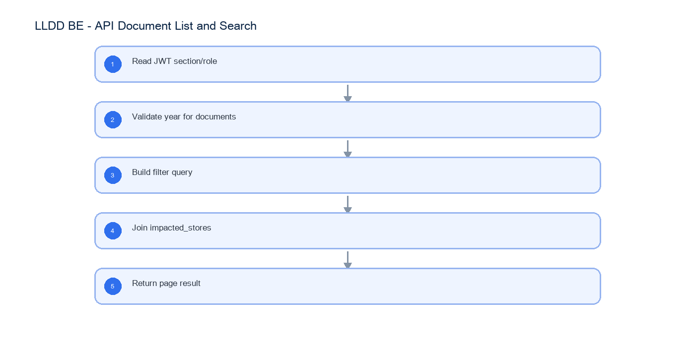

# LLDD BE - API Document List and Search

SBP Mall - ระบบประกันรายได้ | Low Level Design Document

## 1. Overview

| รายการ | รายละเอียด |
| --- | --- |
| Track | BE |
| Estimate | 21 ชั่วโมง |
| Owner | Butsaba <But> Podamrong |
| Objective | ออกแบบ APIs สำหรับงานรอดำเนินการและค้นหาเอกสารที่เกี่ยวข้อง |

Common contract reference: ทุกหัวข้อ API/FE ต้องยึด LLDD-BE-API-Common-Contracts และ LLDD-FE-Integration-Contracts สำหรับ error/auth/format/pagination/action/RBAC ก่อนลงรายละเอียดเฉพาะหน้าหรือเฉพาะ endpoint

## 2. Screen / Functional Scope

- Inbox tasks API
- Document search API
- Pagination
- Status/year filter
- Abnormal row support

## 4. Implementation Flow Diagram (Reference)



_รูปที่ 1: Implementation flow reference: LLDD BE - API Document List and Search_

## 5. Field, Format, and Validation

| Field / UI | Format | Validation | Behavior |
| --- | --- | --- | --- |
| docNo | YYYY/xxxxx | required when opening existing document | ใช้ปี พ.ศ. และ running 5 หลัก |
| storeCode | string 5 digits | numeric length = 5 | แสดง leading zero |
| amount | number, 2 decimals | >= 0 | format `#,##0.00` บาท |
| percent | number, 2 decimals | 0-100 | ใช้ `%` และรวม allocation ต้องเท่ากับ 100 |
| date | DD/MM/YYYY | valid date | FE แสดง พ.ศ. หาก source เป็น ISO ค.ศ. |
| attachment | file | <= 5 MB | รองรับ vsd, dwg, afp, pdf, mda, zip, wav, mp3, gif, jpg, tif, tiff, htm, html, txt, xml, mpg, mov, ivs, doc, docx, xls, xlsx, pps, ppt, pot, csv |
| year | พ.ศ. YYYY | required for /documents | ไม่ระบุคืน 400 ตาม SRS |
| page/size | integer | page>=1 size<=100 | pagination |

## 5.1 Input / Progress / Output Contract

| Stage | Contract for implementation |
| --- | --- |
| Input | GET /api/v1/tasks; GET /api/v1/documents |
| Progress | Read JWT section/role; Validate year for documents; Build filter query; Join impacted_stores |
| Output | Rendered UI state or normalized API response with status/message and audit-ready trace reference. |

### 5.90 Endpoint Implementation Contract

| Endpoint | Use-case owner | Service/repository behavior | Definition of done |
| --- | --- | --- | --- |
| GET /api/v1/tasks | Inbox tasks API | Read JWT section/role | year missing fails for /documents |
| GET /api/v1/documents | Document search API | Validate year for documents | leading zero storeCode preserved |

### 5.91 Backend Execution Sequence

| Step | Behavior specific to this LLDD | Failure/test evidence |
| --- | --- | --- |
| 1 | Read JWT section/role | tasks by section |
| 2 | Validate year for documents | documents missing year |
| 3 | Build filter query | store search |
| 4 | Join impacted_stores | empty result |
| 5 | Return page result | tasks by section |

## 6. Button / User Action Mapping

| Action | Trigger | API / Service | Expected Result |
| --- | --- | --- | --- |
| Inbox tasks | GET | task.service.searchOpenTasks | return waiting list |
| Document search | GET | document.service.search | return related list |

## 7. API Contract

### GET /api/v1/tasks

Inbox tasks API

#### Query Params

```json
{
  "sectionCode": "06",
  "page": 1,
  "size": 20
}
```

#### Request Field Schema

| Field | Type | Required | Constraint / Meaning |
| --- | --- | --- | --- |
| sectionCode | string | No | canonical code; do not replace with display label |
| page | integer | No | >= 1; default 1 |
| size | integer | No | 1..100; default 20 |

#### Response

```json
{
  "items": [
    {
      "docNo": "2569/00123",
      "waitingDays": 3
    }
  ]
}
```

#### Response Field Schema

| Field | Type | Required | Constraint / Meaning |
| --- | --- | --- | --- |
| items | array<object> | Yes | JSON array; element type shown in Type column |
| items[].docNo | string | Yes | พ.ศ. YYYY/xxxxx |
| items[].waitingDays | integer | Yes | UTF-8; use value domain described by endpoint purpose |

### GET /api/v1/documents

Document search API

#### Query Params

```json
{
  "year": 2569,
  "storeCode": "00788",
  "status": "06",
  "page": 1
}
```

#### Request Field Schema

| Field | Type | Required | Constraint / Meaning |
| --- | --- | --- | --- |
| year | integer | Yes | UTF-8; use value domain described by endpoint purpose |
| storeCode | string | No | exactly 5 digits; preserve leading zero |
| status | string | No | UTF-8; use value domain described by endpoint purpose |
| page | integer | No | >= 1; default 1 |

#### Response

```json
{
  "items": [
    {
      "docNo": "2569/00123",
      "statusCode": "06"
    }
  ]
}
```

#### Response Field Schema

| Field | Type | Required | Constraint / Meaning |
| --- | --- | --- | --- |
| items | array<object> | Yes | JSON array; element type shown in Type column |
| items[].docNo | string | Yes | พ.ศ. YYYY/xxxxx |
| items[].statusCode | string | Yes | canonical code; do not replace with display label |

## 8. Reference DB Mapping (No Database Page Work)

ส่วนนี้เป็นข้อมูลอ้างอิงสำหรับการ implement API/Job เท่านั้น ไม่ใช่งานสร้างหน้า Database, ไม่ใช่งานออกแบบ DB page และไม่ถูกนับเป็น deliverable แยกของ FE/BE

| Table / Object | R/W | Usage |
| --- | --- | --- |
| workflow_tasks | R | อ่าน inbox ตาม section/role |
| compensation_documents | R | ค้นเอกสารตาม year/status/store |
| impacted_stores | R | ชื่อร้าน ภาค และข้อมูลร้าน |
| fgi_impact_sales_summaries | R | flag ข้อมูลผิดปกติ/ยอดขายไม่ครบ 60 วัน |

## 9. Processing Flow

| Step | Description |
| --- | --- |
| 1 | Read JWT section/role |
| 2 | Validate year for documents |
| 3 | Build filter query |
| 4 | Join impacted_stores |
| 5 | Return page result |

## 10. Acceptance Criteria

- year missing fails for /documents
- leading zero storeCode preserved
- pagination returns total
- status filter works

## 11. Developer Test Checklist

| No | Test |
| --- | --- |
| 1 | tasks by section |
| 2 | documents missing year |
| 3 | store search |
| 4 | empty result |
