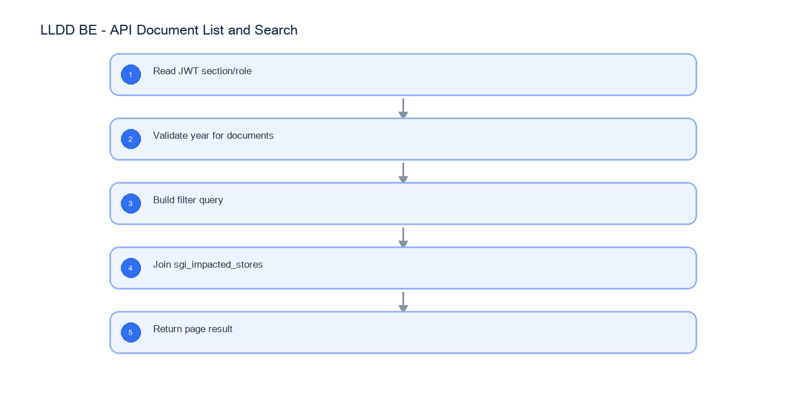

# LLDD BE - API Document List and Search

SBP Mall - ระบบประกันรายได้ | Low Level Design Document

## 1. Overview

| รายการ | รายละเอียด |
| --- | --- |
| Track | BE |
| Estimate | **26 ชั่วโมง** = implementation 20 + unit test 6 (30%) |
| Owner | Butsaba <But> Podamrong |
| Target repository | `SBP/srm-sps-spsap-store-backend` (NestJS + TypeORM · schema `sps_store`) + `SBP/srm-sps-spsap-sbp-bff` (forward ผ่าน client service · ไม่มี DB) สำหรับเส้นที่ FE เรียก |
| Objective | ออกแบบ APIs สำหรับงานรอดำเนินการและค้นหาเอกสารที่เกี่ยวข้อง |

Common contract reference: ทุกหัวข้อ API/FE ต้องยึด LLDD-BE-API-Common-Contracts และ LLDD-FE-Integration-Contracts สำหรับ error/auth/format/pagination/action/RBAC ก่อนลงรายละเอียดเฉพาะหน้าหรือเฉพาะ endpoint

## 2. Screen / Functional Scope

- Inbox tasks API
- Document search API
- Pagination
- Status/year filter
- Abnormal row support

## 3. Screenshot Reference

ไม่มีภาพหน้าจอสำหรับหัวข้อนี้ — เป็นเอกสารฝั่ง Backend/Batch ที่ไม่มี UI (ภาพหน้าจอทั้งหมดอยู่ในเอกสารชุด FE)

## 4. Implementation Flow Diagram (Reference)



_รูปที่ 1: Implementation flow reference: LLDD BE - API Document List and Search_

## 5. Field, Format, and Validation

| Field / UI | Format | Validation | Behavior |
| --- | --- | --- | --- |
| docNo | YYYY/xxxxx | required when opening existing document | ใช้ปี **ค.ศ.** และ running 5 หลัก (มติ 2026-08-06) |
| storeCode | string 5 digits | numeric length = 5 | แสดง leading zero |
| amount | number, 2 decimals | >= 0 | format `#,##0.00` บาท |
| percent | number, 2 decimals | 0-100 | ใช้ `%` และรวม allocation ต้องเท่ากับ 100 — **B5: เพิ่ม/ลบร้านที่กระทบเพิ่มเมื่อไร ต้องเกลี่ยใหม่ทั้งชุดแล้วคำนวณ `compensateAmount` ของทุกแถวใหม่ ไม่ใช่เฉพาะแถวที่เพิ่ม** |
| sourceSystem | enum | ALLMAP / USER | **B5** ที่มาของแถวร้านเปิดใหม่ — `ALLMAP` ระบบ default ให้อัตโนมัติ (Job 9) · `USER` เจ้าหน้าที่ SBP DSA คีย์เองจากเอกสารแจ้งของหน่วยงานส่งเสริม (ผัง To-Be · SDD สไลด์ 7) · ซ้ำ `(doc_no, new_store_code)` ให้คืน `409` |
| date | DD/MM/YYYY | valid date | payload เป็น ISO ค.ศ. · FE แสดง ค.ศ. เป็นค่าเริ่มต้น (DatePicker buddhistEra=false) แสดง พ.ศ. เฉพาะจุดที่เปิด flag |
| attachment | file | <= 5 MB | รองรับ vsd, dwg, afp, pdf, mda, zip, wav, mp3, gif, jpg, tif, tiff, htm, html, txt, xml, mpg, mov, ivs, doc, docx, xls, xlsx, pps, ppt, pot, csv |
| year | ค.ศ. YYYY | required for /documents | ไม่ระบุคืน 400 ตาม SRS · BE ผ่าน toAD() เผื่อ client ส่ง พ.ศ. |
| page/size | integer | page>=1 size<=100 | pagination |

### 5.9 Input / Progress / Output Contract

| Stage | Contract for implementation |
| --- | --- |
| Input | GET /api/v1/tasks; GET /api/v1/documents |
| Progress | Read JWT section/role; Validate year for documents; Build filter query; Join impacted_stores |
| Output | Rendered UI state or normalized API response with status/message and audit-ready trace reference. |

### 5.90 Endpoint Implementation Contract

| Endpoint | Use-case owner | Service/repository behavior | Definition of done |
| --- | --- | --- | --- |
| GET /api/v1/tasks | Inbox tasks API | Read JWT section/role | year missing fails for /documents |
| GET /api/v1/documents | Document search API | Validate year for documents | leading zero storeCode preserved |

### 5.91 Backend Execution Sequence

| Step | Behavior specific to this LLDD | Failure/test evidence |
| --- | --- | --- |
| 1 | Read JWT section/role | tasks by section |
| 2 | Validate year for documents | documents missing year |
| 3 | Build filter query | store search |
| 4 | Join impacted_stores | empty result |
| 5 | Return page result | tasks by section |

## 6. Button / User Action Mapping

| Action | Trigger | API / Service | Expected Result |
| --- | --- | --- | --- |
| Inbox tasks | GET | task.service.searchOpenTasks | return waiting list |
| Document search | GET | document.service.search | return related list |

## 7. API Contract

### GET /api/v1/tasks

Inbox tasks API

#### Query Params

```json
{
  "sectionCode": "06",
  "page": 1,
  "size": 20
}
```

#### Request Field Schema

| Field | Type | Required | Constraint / Meaning |
| --- | --- | --- | --- |
| sectionCode | string | No | canonical code; do not replace with display label |
| page | integer | No | >= 1; default 1 |
| size | integer | No | 1..100; default 20 |

#### Response

```json
{
  "items": [
    {
      "docNo": "2026/00123",
      "waitingDays": 3
    }
  ]
}
```

#### Response Field Schema

| Field | Type | Required | Constraint / Meaning |
| --- | --- | --- | --- |
| items | array<object> | Yes | JSON array; element type shown in Type column |
| items[].docNo | string | Yes | ค.ศ. YYYY/xxxxx |
| items[].waitingDays | integer | Yes | UTF-8; use value domain described by endpoint purpose |

### GET /api/v1/documents

Document search API

#### Query Params

```json
{
  "year": 2026,
  "storeCode": "00788",
  "status": "06",
  "page": 1
}
```

#### Request Field Schema

| Field | Type | Required | Constraint / Meaning |
| --- | --- | --- | --- |
| year | integer | Yes | UTF-8; use value domain described by endpoint purpose |
| storeCode | string | No | exactly 5 digits; preserve leading zero |
| status | string | No | UTF-8; use value domain described by endpoint purpose |
| page | integer | No | >= 1; default 1 |

#### Response

```json
{
  "items": [
    {
      "docNo": "2026/00123",
      "statusCode": "06"
    }
  ]
}
```

#### Response Field Schema

| Field | Type | Required | Constraint / Meaning |
| --- | --- | --- | --- |
| items | array<object> | Yes | JSON array; element type shown in Type column |
| items[].docNo | string | Yes | ค.ศ. YYYY/xxxxx |
| items[].statusCode | string | Yes | canonical code; do not replace with display label |

## 8. Reference DB Mapping (No Database Page Work)

ส่วนนี้เป็นข้อมูลอ้างอิงสำหรับการ implement API/Job เท่านั้น ไม่ใช่งานสร้างหน้า Database, ไม่ใช่งานออกแบบ DB page และไม่ถูกนับเป็น deliverable แยกของ FE/BE

| Table / Object | R/W | Usage |
| --- | --- | --- |
| workflow_transaction / workflow_approver (@srm/glb-workflow) | R | อ่าน inbox ผ่าน getPendingFlowByUser() · เฉพาะ section 06 ต้อง union เอกสารที่จบด้วย หยุดชดเชยประกันรายได้ เข้ามาด้วย (stoppedReopenable) |
| compensation_documents | R | ค้นเอกสารตาม year/status/store |
| impacted_stores | R | ชื่อร้าน ภาค และข้อมูลร้าน |
| fgi_impact_sales_summaries | R | flag ข้อมูลผิดปกติ/ยอดขายไม่ครบ 60 วัน |
| consideration_logs | R | ผลการพิจารณาสุดท้าย — คัดเอกสารที่จบด้วย หยุดชดเชยประกันรายได้ เข้าคิวของ section 06 (SDD สไลด์ 46 ข้อ 1.9) |

## 9. Skeleton Code (store-backend + BFF)

โครงโค้ดตั้งต้นของเอกสารฉบับนี้ ยึด convention จริงของ `srm-sps-spsap-store-backend` (NestJS 11 + TypeORM, schema `sps_store`, custom provider `DATA_SOURCE` ที่ route SELECT ไป slave pool) และ `srm-sps-spsap-sbp-bff` (ไม่มี DB, forward ผ่าน client service). ทุกจุดที่ต้องเติมกำกับด้วย `// TODO:` และ response ทุกเส้นถูกห่อเป็น `{success, data}` โดย ResponseInterceptor อยู่แล้ว จึงห้าม service ห่อซ้ำ

#### 9.1 ผังไฟล์ที่ต้องสร้าง

| Path | หน้าที่ |
| --- | --- |
| store-backend · src/modules/sbpgi-document-list-search/sbpgi-document-list-search.controller.ts | route ทั้งหมดของเอกสารนี้ (2 เส้น) + `@UseGuards(HttpHeaderGuard)` + `@UserId()` |
| store-backend · src/modules/sbpgi-document-list-search/sbpgi-document-list-search.service.ts | business logic — inject `'DATA_SOURCE'` แล้วยิง raw SQL, mutation ใช้ QueryRunner transaction |
| store-backend · src/modules/sbpgi-document-list-search/sbpgi-document-list-search.sql.ts | เก็บ SQL ต่อ endpoint (คัดจากหัวข้อ 10) แยกออกจาก service ให้ทดสอบ/รีวิวง่าย |
| store-backend · src/modules/sbpgi-document-list-search/dto/sbpgi-document-list-search.dto.ts | DTO + class-validator ตาม validation ในหัวข้อฟิลด์ของเอกสารนี้ |
| store-backend · src/modules/sbpgi-document-list-search/sbpgi-document-list-search.module.ts | ประกอบ controller/service/providers แล้ว register ที่ `app.module.ts` |
| store-backend · src/entitys/compensation-documents.entity.ts | entity ของ `compensation_documents` (`@Entity({schema: process.env.DB_SCHEMA})`, ไม่ประกาศ relation) — **entity ร่วมหลายเอกสาร: ประกาศครั้งเดียวแล้วอ้างอิง อย่าสร้างซ้ำ** |
| store-backend · src/entitys/impacted-stores.entity.ts | entity ของ `impacted_stores` (`@Entity({schema: process.env.DB_SCHEMA})`, ไม่ประกาศ relation) |
| store-backend · src/entitys/fgi-impact-sales-summaries.entity.ts | entity ของ `fgi_impact_sales_summaries` (`@Entity({schema: process.env.DB_SCHEMA})`, ไม่ประกาศ relation) |
| store-backend · src/providers/sbpgi/sbpgi.ts | repository provider แบบ factory ผูก token string กับ `DATA_SOURCE` — **ไฟล์ร่วมของทุกเอกสาร BE ให้ merge array เพิ่ม ห้ามเขียนทับ** |
| store-backend · sql/deploy-sbpgi-document-list-search.sql | DDL production แบบ idempotent (ทีมนี้ไม่ใช้ migration เป็นหลัก) |
| BFF · src/common/client-services/sbpgi-client.service.ts | client ต่อจาก `BaseClientService` ตั้ง baseUrl + `x-api-key` ตอน `onModuleInit` |
| BFF · src/modules/sbpgi-document-list-search/sbpgi-document-list-search.controller.ts | route ฝั่ง BFF prefix `/bff/sbpgi/…` + `@UseGuards(AuthGuard('jwt'))` |
| BFF · src/modules/sbpgi-document-list-search/sbpgi-document-list-search.service.ts | แนบ `x-user-id` / `x-user-group-id` / `x-user-permissions` แล้ว forward ไป backend |

#### 9.2 Controller (store-backend)

```ts
// src/modules/sbpgi-document-list-search/sbpgi-document-list-search.controller.ts
import { Controller, Get, Query, UseGuards } from '@nestjs/common';
import { HttpHeaderGuard } from '../../guards/http-header.guard';
import { UserId } from '../../common/decorators/user-id.decorator';
import { SbpgiDocumentListSearchService } from './sbpgi-document-list-search.service';
import { DocumentListSearchQueryDto } from './dto/sbpgi-document-list-search.dto';

// LLDD BE - API Document List and Search
// BFF เรียกด้วย x-api-key และแนบ x-user-id / x-user-group-id / x-user-permissions มาให้
@Controller('sbpgi')
@UseGuards(HttpHeaderGuard)
export class SbpgiDocumentListSearchController {
  constructor(private readonly service: SbpgiDocumentListSearchService) {}

  // GET /api/v1/tasks — Inbox tasks API
  @Get('tasks')
  getTasks(@Query() query: DocumentListSearchQueryDto, @UserId() userId: string) {
    // TODO: ตรวจ x-user-permissions ก่อนเรียก service ถ้า endpoint นี้จำกัดสิทธิ์เมนู
    return this.service.getTasks(query, userId);
  }

  // GET /api/v1/documents — Document search API
  @Get('documents')
  getDocuments(@Query() query: DocumentListSearchQueryDto, @UserId() userId: string) {
    // TODO: ตรวจ x-user-permissions ก่อนเรียก service ถ้า endpoint นี้จำกัดสิทธิ์เมนู
    return this.service.getDocuments(query, userId);
  }
}
```

#### 9.3 DTO + Validation

```ts
// src/modules/sbpgi-document-list-search/dto/sbpgi-document-list-search.dto.ts
import { Type } from 'class-transformer';
import {
  IsArray, IsBoolean, IsIn, IsInt, IsNotEmpty, IsNumber, IsObject, IsOptional,
  IsString, Matches, Max, MaxLength, Min,
} from 'class-validator';

// ValidationPipe ระดับ global ตั้ง whitelist + forbidNonWhitelisted + transform ไว้แล้ว (main.ts)
// property ที่ไม่ประกาศที่นี่จะถูก reject เป็น 400 อัตโนมัติ

// query ร่วมของ GET ทุกเส้นในโมดูลนี้ (path param ใช้ @Param แยก)
export class DocumentListSearchQueryDto {
  /** required เฉพาะบาง endpoint — ตรวจซ้ำใน service */
  @IsOptional()
  @IsString()
  sectionCode?: string;

  /** pagination */
  @IsOptional()
  @Type(() => Number)
  @IsInt()
  @Min(1)
  page?: number;

  /** pagination */
  @IsOptional()
  @Type(() => Number)
  @IsInt()
  @Min(1)
  @Max(100)
  size?: number;

  /** ไม่ระบุคืน 400 ตาม SRS · BE ผ่าน toAD() เผื่อ client ส่ง พ.ศ. · required เฉพาะบาง endpoin… */
  @IsOptional()
  @Type(() => Number)
  @IsInt()
  year?: number;

  /** แสดง leading zero · required เฉพาะบาง endpoint — ตรวจซ้ำใน service */
  @IsOptional()
  @IsString()
  @Matches(/^\d{5}$/, { message: 'รหัสร้านต้องเป็นตัวเลข 5 หลัก และคงเลขศูนย์นำหน้า' })
  storeCode?: string;

  /** required เฉพาะบาง endpoint — ตรวจซ้ำใน service */
  @IsOptional()
  @IsString()
  status?: string;
}
```

#### 9.4 Service (inject `DATA_SOURCE` + raw SQL)

service ประกาศ method ครบทุกเส้นที่ controller เรียก และ **signature มาจากแหล่งเดียวกับ controller** (จำนวน/ลำดับพารามิเตอร์จึงตรงกันเสมอ) — เส้นที่ยังไม่ได้ implement เป็น stub ที่ `throw new NotImplementedException(...)` ให้ TypeScript compile ผ่านตั้งแต่วันแรก

```ts
// src/modules/sbpgi-document-list-search/sbpgi-document-list-search.service.ts
import { Inject, Injectable, Logger, NotFoundException, NotImplementedException } from '@nestjs/common';
import { DataSource } from 'typeorm';
import { WorkflowService } from '../workflow/workflow.service';
import { SBPGI_SQL } from './sbpgi-document-list-search.sql';

@Injectable()
export class SbpgiDocumentListSearchService {
  private readonly logger = new Logger(SbpgiDocumentListSearchService.name);
  // versionId ของ workflow ประกันรายได้ (ตั้งใน env เหมือน COOPERATION_WORKFLOW_VERSION_ID)
  private readonly versionId = Number(process.env.SBPGI_WORKFLOW_VERSION_ID);

  constructor(
    // DATA_SOURCE override query(): SELECT/WITH ไป slave pool, write ไป master
    @Inject('DATA_SOURCE') private readonly dataSource: DataSource,
    private readonly workflow: WorkflowService,
  ) {}

  // GET /api/v1/tasks — Inbox tasks API
  async getTasks(query: DocumentListSearchQueryDto, userId: string) {
    const page = Number(query.page ?? 1);
    const size = Math.min(Number(query.size ?? 20), 100);
    // SQL เต็มอยู่ในหัวข้อ Database SQL ของเอกสารนี้ (คีย์ 'GET /api/v1/tasks')
    // ⚠️ SQL ตัวอย่างบางเส้นเขียนด้วย named parameter (:size/:offset) แต่ dataSource.query()
    //    รับเฉพาะ positional $1..$n — ต้องแปลงชื่อเป็นลำดับก่อน หรือใช้ QueryBuilder แทน
    const rows = await this.dataSource.query(SBPGI_SQL.getTasks, [
      // TODO: เรียงพารามิเตอร์ให้ตรงกับ $1..$n ของ SQL จริง
      userId, (page - 1) * size, size,
    ]);
    // TODO: total ต้องมาจาก COUNT(*) แยก query หรือ window function ไม่ใช่ rows.length
    return { page, size, total: rows.length, items: rows };
  }

  // GET /api/v1/documents — Document search API
  async getDocuments(query: DocumentListSearchQueryDto, userId: string) {
    // TODO: implement ตาม business rule ของ GET /api/v1/documents
    //       (SQL อยู่ในหัวข้อ Database SQL คีย์ 'GET /api/v1/documents')
    throw new NotImplementedException('getDocuments ยังไม่ implement');
  }
}
```

#### 9.5 Workflow (`@srm/glb-workflow`)

✅ **ชื่อ function ของ engine — ยึด LLDD ของ lib (ปิดข้อค้าง 2026-08-14)** · API จริงคือ 8 ตัวตามชีต `Detail` ของ `SBP/TSM-SRM-LLDD SBP workflow 1.2.xlsx` (เอกสารของ lib เอง): `initializeWorkflow` · `eventWorkflow` · `getPermissionEvents` · `getHistory` · `getTransaction` · `getPendingFlowByUser` · `getWorkflowsByUser` · `addPreApprover` · ชื่อที่เคยขัดกันไม่ใช่ชื่อ API — *Trigger Event* เป็นชื่อหัวข้อขั้นตอนภายใน `eventWorkflow` และ `*UseCase` เป็น class ที่ store-backend ห่อไว้ใช้เอง (ดู `LLDD-BE-Workflow-Engine-Definition` หัวข้อ 5.3)

| Endpoint | Use case ที่ต้องเรียก | เหตุผล |
| --- | --- | --- |
| GET /api/v1/tasks | getPendingFlowByUser() | inbox งานค้างของ userId/groupId ที่ BFF ส่งมาใน header |

```ts
// src/modules/sbpgi-document-list-search/sbpgi-document-list-search.workflow.ts (หรือรวมไว้ใน service เดียวกัน)
// WorkflowService = wrapper ของ @srm/glb-workflow ที่ store-backend มีอยู่แล้ว
// (DataSource แยกชื่อ 'workflow-connection', ทุก use case ห่อด้วย TypeOrmUnitOfWork)

  // inbox งานค้าง — ใช้ร่วมกับ /api/workflow/pending ของ backlog เดิมได้
  const pending = await this.workflow.getPendingFlowByUser({
    userData: { userId: Number(userId), groupId: Number(groupId) },
    versionId: this.versionId,
  });
  // TODO: join referenceId (= doc_no) กลับไปที่ compensation_documents เพื่อเติมข้อมูลเอกสาร
```

#### 9.6 Entity (TypeORM)

```ts
// src/entitys/compensation-documents.entity.ts
import { Column, Entity, PrimaryColumn } from 'typeorm';

@Entity({ name: 'compensation_documents', schema: process.env.DB_SCHEMA })
export class CompensationDocument {
  @PrimaryColumn({ name: 'doc_no', type: 'varchar', length: 12 })
  docNo: string;

  @Column({ name: 'impact_process_id', type: 'bigint', nullable: true })
  impactProcessId?: number;

  @Column({ name: 'impacted_store_code', type: 'char', length: 5 })
  impactedStoreCode: string;

  @Column({ name: 'status_code', type: 'varchar', length: 2 })
  statusCode: string;

  @Column({ name: 'current_section_code', type: 'varchar', length: 2 })
  currentSectionCode: string;

  @Column({ name: 'round_no', type: 'int', nullable: true })
  roundNo?: number;

  @Column({ name: 'loop_no', type: 'int', nullable: true })
  loopNo?: number;

  @Column({ name: 'statement_id', type: 'varchar', length: 30, nullable: true })
  statementId?: string;

  @Column({ name: 'statement_date', type: 'date', nullable: true })
  statementDate?: Date;

  @Column({ name: 'account_year', type: 'int', nullable: true })
  accountYear?: number;

  @Column({ name: 'account_month', type: 'int', nullable: true })
  accountMonth?: number;

  @Column({ name: 'compensate_amount', type: 'numeric', precision: 15, scale: 2, nullable: true })
  compensateAmount?: string;

  @Column({ name: 'allmap_url', type: 'text', nullable: true })
  allmapUrl?: string;

  @Column({ name: 'approver_snapshot', type: 'jsonb', nullable: true })
  approverSnapshot?: Record<string, unknown>;

  @Column({ name: 'created_at', type: 'timestamptz', nullable: true })
  createdAt?: Date;

  @Column({ name: 'updated_at', type: 'timestamptz', nullable: true })
  updatedAt?: Date;

  // TODO: ตรวจความยาว/precision กับ DDL จริงใน sql/deploy-sbpgi-*.sql ก่อน merge
  //       entity ชุดนี้ไม่ประกาศ relation ตาม convention (join ด้วย raw SQL)
}
```

```ts
// src/entitys/impacted-stores.entity.ts
import { Column, Entity, PrimaryColumn } from 'typeorm';

@Entity({ name: 'impacted_stores', schema: process.env.DB_SCHEMA })
export class ImpactedStore {
  @PrimaryColumn({ name: 'store_code', type: 'char', length: 5 })
  storeCode: string;

  @Column({ name: 'store_name', type: 'varchar', length: 200 })
  storeName: string;

  @Column({ name: 'zone_code', type: 'varchar', length: 10, nullable: true })
  zoneCode?: string;

  @Column({ name: 'region_code', type: 'varchar', length: 10, nullable: true })
  regionCode?: string;

  @Column({ name: 'store_type', type: 'varchar', length: 5, nullable: true })
  storeType?: string;

  @Column({ name: 'transfer_sbp_date', type: 'date', nullable: true })
  transferSbpDate?: Date;

  @Column({ name: 'is_active', type: 'boolean', default: true })
  isActive: boolean;

  // TODO: ตรวจความยาว/precision กับ DDL จริงใน sql/deploy-sbpgi-*.sql ก่อน merge
  //       entity ชุดนี้ไม่ประกาศ relation ตาม convention (join ด้วย raw SQL)
}
```

ตารางที่เหลือของเอกสารนี้ (`fgi_impact_sales_summaries`, `consideration_logs`) ใช้รูปแบบ entity เดียวกัน — คอลัมน์อ้างจาก `database.md`

ตารางที่ **ไม่ต้องสร้าง entity** เพราะใช้ของระบบเดิม/workflow engine:

| Object | R/W | ใช้ของระบบเดิมตัวไหน |
| --- | --- | --- |
| workflow_transaction | R | workflow engine @srm/glb-workflow |
| workflow_approver | R | workflow engine @srm/glb-workflow |

#### 9.7 Repository Providers + Module wiring

```ts
// src/providers/sbpgi/sbpgi.ts — repository provider แบบ factory (ไม่ใช้ TypeOrmModule.forFeature)
// convention ของโฟลเดอร์ providers คือ 1 ไฟล์ต่อโดเมน ตั้งชื่อตามโดเมน (business_user/business_user.ts,
// common_code/common_code.ts …) ไม่ใช่ index.ts
//
// ⚠️ ไฟล์นี้ใช้ร่วมกันทุกเอกสาร BE ของ SBPGI — ให้ **merge array เพิ่ม** เข้าไฟล์เดิม ห้ามเขียนทับ
//    (ชื่อ const แยกต่อเอกสารไว้แล้วเพื่อไม่ให้ชนกัน)
import { DataSource } from 'typeorm';
import { CompensationDocument } from '../../entitys/compensation-documents.entity';
import { ImpactedStore } from '../../entitys/impacted-stores.entity';
import { FgiImpactSalesSummary } from '../../entitys/fgi-impact-sales-summaries.entity';

export const sbpgiDocumentListSearchProviders = [
  {
    provide: 'COMPENSATION_DOCUMENT_REPOSITORY',
    useFactory: (dataSource: DataSource) => dataSource.getRepository(CompensationDocument),
    inject: ['DATA_SOURCE'],
  },
  {
    provide: 'IMPACTED_STORE_REPOSITORY',
    useFactory: (dataSource: DataSource) => dataSource.getRepository(ImpactedStore),
    inject: ['DATA_SOURCE'],
  },
  {
    provide: 'FGI_IMPACT_SALES_SUMMARIES_REPOSITORY',
    useFactory: (dataSource: DataSource) => dataSource.getRepository(FgiImpactSalesSummary),
    inject: ['DATA_SOURCE'],
  },
];

// src/modules/sbpgi-document-list-search/sbpgi-document-list-search.module.ts
import { MiddlewareConsumer, Module, NestModule } from '@nestjs/common';
import { DatabaseModule } from '../../database/database.module';
// UserContextMiddleware อ่าน header x-user-id แล้วเซ็ต request.userId ที่ @UserId() ใช้
// — app.module.ts **ไม่ได้** apply แบบ global (มีแค่ HttpContext/LoggerContext) แต่ละโมดูลต้อง apply เอง
// (ดู evaluation-process.module.ts / inform-evaluate.module.ts / cooperation-request.module.ts)
import { UserContextMiddleware } from '../../common/middleware/user-context.middleware';
import { WorkflowModule } from '../workflow/workflow.module';
import { sbpgiDocumentListSearchProviders } from '../../providers/sbpgi/sbpgi';
import { SbpgiDocumentListSearchController } from './sbpgi-document-list-search.controller';
import { SbpgiDocumentListSearchService } from './sbpgi-document-list-search.service';

@Module({
  imports: [DatabaseModule, WorkflowModule],
  controllers: [SbpgiDocumentListSearchController],
  providers: [SbpgiDocumentListSearchService, ...sbpgiDocumentListSearchProviders],
  exports: [SbpgiDocumentListSearchService],
})
export class SbpgiDocumentListSearchModule implements NestModule {
  configure(consumer: MiddlewareConsumer) {
    // ถ้าไม่ apply ตรงนี้ userId จะเป็น undefined เงียบ ๆ ทุก endpoint
    consumer.apply(UserContextMiddleware).forRoutes(SbpgiDocumentListSearchController);
  }
}
// TODO: register module นี้ใน app.module.ts (imports) พร้อมกับโมดูล SBPGI ตัวอื่น
```

#### 9.8 BFF Proxy (module + controller + client service)

BFF ยังไม่มีฟีเจอร์ประกันรายได้เลย จึงต้องสร้าง module ใหม่ + client service ใหม่ทั้งชุด และเลือก prefix แบบเดียวทั้งโมดูล (ที่นี่ใช้ `/bff/sbpgi/…`) เพื่อไม่ให้ปนแบบที่มี/ไม่มี `/bff` เหมือนโมดูลเดิม

```ts
// src/common/client-services/sbpgi-client.service.ts
import { Injectable, Logger, OnModuleInit } from '@nestjs/common';
import { BaseClientService } from './base-client.service';

@Injectable()
export class SbpgiClientService extends BaseClientService implements OnModuleInit {
  protected logger: Logger = new Logger(SbpgiClientService.name);

  onModuleInit() {
    // TODO: ถ้า deploy SBPGI แยก service ให้เพิ่ม API_SBPGI_BACKEND_* ใน AppConfigService
    //       ตอนนี้ชี้ store backend ตัวเดียวกับ StoreClientService
    this.defaultHeaders[this.config.api.store.key.name] = this.config.api.store.key.value;
    this.baseUrl = this.config.api.store.url;
  }
}
// BaseClientService แกะ { success, data } ให้แล้ว — service ฝั่ง BFF จึงได้ data ตรง ๆ
// TODO: เพิ่ม SbpgiClientService ใน providers/exports ของ ClientServiceModule (@Global)
```

```ts
// src/modules/sbpgi-document-list-search/sbpgi-document-list-search.service.ts (BFF)
import { Injectable } from '@nestjs/common';
import { SbpgiClientService } from '@common/client-services/sbpgi-client.service';

@Injectable()
export class SbpgiDocumentListSearchBffService {
  constructor(private readonly client: SbpgiClientService) {}

  // BFF ไม่มี DB — หน้าที่เดียวคือแนบ user context แล้ว forward
  private userHeaders(user: any) {
    return {
      'x-user-id': user?.userId,
      'x-user-group-id': user?.groupId,
      'x-user-permissions': (user?.permissions ?? []).join(','),
    };
  }

  getTasks(params: any, user: any) {
    return this.client.get('/api/v1/tasks', { params, headers: this.userHeaders(user) });
  }

  getDocuments(params: any, user: any) {
    return this.client.get('/api/v1/documents', { params, headers: this.userHeaders(user) });
  }
}

// ---------- src/modules/sbpgi-document-list-search/sbpgi-document-list-search.controller.ts (BFF) ----------
import { Body, Controller, Delete, Get, Param, Post, Put, Query, Req, UseGuards } from '@nestjs/common';
import { AuthGuard } from '@nestjs/passport';

// เลือก prefix แบบเดียวทั้งโมดูล: ใช้ '/bff/sbpgi/...' (ห้ามปนกับแบบไม่มี /bff)
@Controller('bff/sbpgi/document-list-search')
@UseGuards(AuthGuard('jwt'))
export class SbpgiDocumentListSearchBffController {
  constructor(private readonly service: SbpgiDocumentListSearchBffService) {}

  // proxy ของ GET /api/v1/tasks
  @Get('tasks')
  getTasks(@Query() query: any, @Req() req: any) {
    return this.service.getTasks(query, req.user);
  }

  // proxy ของ GET /api/v1/documents
  @Get('documents')
  getDocuments(@Query() query: any, @Req() req: any) {
    return this.service.getDocuments(query, req.user);
  }
}
// TODO: register module ใน app.module.ts ของ BFF และเพิ่ม SbpgiClientService ใน ClientServiceModule (@Global)
```

## 10. Database SQL

#### 10.1 ตารางที่อ่าน/เขียน

| Table / Object | R/W | Usage |
| --- | --- | --- |
| compensation_documents | R | ค้นเอกสารตาม year/status/store |
| impacted_stores | R | ชื่อร้าน ภาค และข้อมูลร้าน |
| fgi_impact_sales_summaries | R | flag ข้อมูลผิดปกติ/ยอดขายไม่ครบ 60 วัน |
| consideration_logs | R | ผลการพิจารณาสุดท้าย — คัดเอกสารที่จบด้วย หยุดชดเชยประกันรายได้ เข้าคิวของ section 06 (SDD สไลด์ 46 ข้อ 1.9) |
| workflow_transaction | R | ใช้ของระบบเดิม: workflow engine @srm/glb-workflow |
| workflow_approver | R | ใช้ของระบบเดิม: workflow engine @srm/glb-workflow |

#### 10.2 SQL จริงต่อ Endpoint

**GET /api/v1/tasks** — Inbox tasks API

```sql
-- ⚠️ ชื่อคอลัมน์ต่อไปนี้ไม่ตรงกับ entity ที่หัวข้อ Entity ของเอกสารนี้ประกาศไว้:
--      total_compensation_amount  ->  compensate_amount
-- ⚠️ SQL นี้ใช้ named parameter (:name) แต่ `dataSource.query()` ของ store-backend
--    รับเฉพาะ positional $1..$n — ต้องแปลงเป็นลำดับ หรือรันผ่าน QueryBuilder
-- ⚠️ ไม่มีตาราง workflow_tasks ของ SBPGI แล้ว — กล่องงานอ่านจาก engine กลาง (schema sps_store)
--    getPendingFlowByUser({userData}) 
-- ✅ DP-1 ปิดแล้ว: reference_id = compensation_documents.id (surrogate · varchar(255)) · ⚠️ DP-2 workflow_transaction ไม่มี PK/index (19,283 แถว → seq-scan) ยังไม่ตัดสิน
--    ยังไม่ตัดสิน — ดู SBP/SBPGI-vs-existing-system.md หัวข้อ 4
WITH wh AS (
  -- workflow_transaction ไม่มี created_date — ใช้เวลา event แรกจาก workflow_history แทน
  SELECT transaction_id, MIN(create_date) AS first_event_date
  FROM sps_store.workflow_history GROUP BY transaction_id
)
SELECT d.round_no AS "roundNo",
       d.doc_no AS "docNo",
       d.impacted_store_code AS "impactedStoreCode",
       s.store_name AS "impactedStoreName",
       s.zone_cd AS "regionCode",
       GREATEST(COALESCE(-ss.growth_rate_diff, 0), 0) AS "salesDeclinePercent",
       d.total_compensation_amount AS "totalCompensationAmount",
       d.status_code AS "statusCode",
       d.current_section_code AS "currentSection",
       GREATEST(CURRENT_DATE - wh.first_event_date::date, 0) AS "daysPending",
       ss.total_working_days AS "salesDataDays"
FROM sps_store.workflow_approver a
JOIN sps_store.workflow_transaction w ON w.transaction_id = a.transaction_id
JOIN compensation_documents d ON d.id::text = w.reference_id   -- DP-1 = surrogate id   -- DP-1
JOIN store s ON s.store_id = d.impacted_store_code
LEFT JOIN fgi_impact_sales_summaries ss ON ss.impact_process_id = d.impact_process_id
WHERE a.state_id = :sectionFromJwt AND a.state_id = w.current_state_id AND w.version_id = :sbpgiVersionId
ORDER BY w.update_date
LIMIT :size OFFSET :offset;
```

**GET /api/v1/documents** — Document search API

```sql
-- ⚠️ ชื่อคอลัมน์ต่อไปนี้ไม่ตรงกับ entity ที่หัวข้อ Entity ของเอกสารนี้ประกาศไว้:
--      total_compensation_amount  ->  compensate_amount
--      d.year  ->  d.account_year
-- ⚠️ SQL นี้ใช้ named parameter (:name) แต่ `dataSource.query()` ของ store-backend
--    รับเฉพาะ positional $1..$n — ต้องแปลงเป็นลำดับ หรือรันผ่าน QueryBuilder
-- ต้องระบุ :year เสมอ ไม่งั้นตอบ 400 (กติกา SRS)
SELECT d.round_no AS "roundNo",
       d.doc_no AS "docNo",
       d.impacted_store_code AS "impactedStoreCode",
       s.store_name AS "impactedStoreName",
       s.zone_cd AS "regionCode",
       GREATEST(COALESCE(-ss.growth_rate_diff, 0), 0) AS "salesDeclinePercent",
       d.total_compensation_amount AS "totalCompensationAmount",
       d.status_code AS "statusCode",
       d.current_section_code AS "currentSection",
       -- workflow_transaction ไม่มี created_date (มีแค่ update_date) — วันที่เริ่มงานเอาจาก workflow_history
       CASE WHEN w.current_status_id <> :statusDone THEN GREATEST(CURRENT_DATE - wh.first_event_date::date, 0) ELSE 0 END AS "daysPending",
       ss.total_working_days AS "salesDataDays"
FROM compensation_documents d
JOIN store s ON s.store_id = d.impacted_store_code
LEFT JOIN fgi_impact_sales_summaries ss ON ss.impact_process_id = d.impact_process_id
LEFT JOIN sps_store.workflow_transaction w ON w.reference_id = d.id::text   -- DP-1 = surrogate id (reference_id เป็น varchar(255)) AND w.version_id = :sbpgiVersionId   -- DP-1 · DP-2 (ไม่มี index → seq-scan)
WHERE d.year = :year
  AND (:impactedStoreCode IS NULL OR d.impacted_store_code = :impactedStoreCode)
  AND (:status            IS NULL OR d.status_code = :status)
ORDER BY d.doc_no DESC
LIMIT :size OFFSET :offset;
```

#### 10.3 Index / Constraint ที่ควรมี (ข้อเสนอ)

| Table | DDL ที่เสนอ | ที่มา / หมายเหตุ |
| --- | --- | --- |
| fgi_impact_sales_summaries | CREATE INDEX idx_fgi_impact_sales_summaries_impact_process_id ON fgi_impact_sales_summaries (impact_process_id); | ข้อเสนอ — อนุมานจากคอลัมน์ที่ปรากฏใน WHERE/JOIN ของ SQL ด้านบน ต้องวัด EXPLAIN ก่อนใช้จริง |
| compensation_documents | CREATE INDEX idx_compensation_documents_year_impacted_store_code_status_code ON compensation_documents (year, impacted_store_code, status_code); | ข้อเสนอ — อนุมานจากคอลัมน์ที่ปรากฏใน WHERE/JOIN ของ SQL ด้านบน ต้องวัด EXPLAIN ก่อนใช้จริง |

ทั้งหมดเป็น **ข้อเสนอ** ไม่ใช่ข้อกำหนดจาก SRS — ให้ตรวจกับ `EXPLAIN ANALYZE` บนข้อมูลจริง และรวมเข้าไฟล์ `sql/deploy-sbpgi-*.sql` แบบ idempotent (`CREATE INDEX IF NOT EXISTS`) ตาม pattern ที่ทีมใช้อยู่

## 11. Processing Flow

| Step | Description |
| --- | --- |
| 1 | Read JWT section/role |
| 2 | Validate year for documents |
| 3 | Build filter query |
| 4 | Join impacted_stores |
| 5 | Return page result |

## 12. Acceptance Criteria

- year missing fails for /documents
- leading zero storeCode preserved
- pagination returns total
- status filter works

## 13. Developer Test Checklist

| No | Test |
| --- | --- |
| 1 | tasks by section |
| 2 | documents missing year |
| 3 | store search |
| 4 | empty result |

## 14. Unit Test Scope

**6 ชั่วโมง** (30% ของ implementation 20 ชั่วโมง) · เครื่องมือ: Jest + mock repository/DataSource (ไม่ต่อ DB จริง)

หัวข้อนี้คือ **unit test** ที่ต้องเขียนคู่กับโค้ด — ต่างจาก *Developer Test Checklist* ซึ่งเป็น scenario ระดับ end-to-end/manual ที่ใช้ตอนตรวจรับ · รายการด้านล่าง derive จาก field/validation, acceptance criteria, endpoint และตารางที่เอกสารนี้เขียน

| สิ่งที่ทดสอบ | ประเภท | เกณฑ์ผ่าน |
| --- | --- | --- |
| `docNo` | validation | ผ่านเมื่อถูกกฎ / โยน error เมื่อผิด — กฎ: required when opening existing document · รูปแบบ: YYYY/xxxxx |
| `storeCode` | validation | ผ่านเมื่อถูกกฎ / โยน error เมื่อผิด — กฎ: numeric length = 5 · รูปแบบ: string 5 digits |
| `amount` | validation | ผ่านเมื่อถูกกฎ / โยน error เมื่อผิด — กฎ: >= 0 · รูปแบบ: number, 2 decimals |
| `percent` | validation | ผ่านเมื่อถูกกฎ / โยน error เมื่อผิด — กฎ: 0-100 · รูปแบบ: number, 2 decimals |
| `sourceSystem` | validation | ผ่านเมื่อถูกกฎ / โยน error เมื่อผิด — กฎ: ALLMAP / USER · รูปแบบ: enum |
| `date` | validation | ผ่านเมื่อถูกกฎ / โยน error เมื่อผิด — กฎ: valid date · รูปแบบ: DD/MM/YYYY |
| `attachment` | validation | ผ่านเมื่อถูกกฎ / โยน error เมื่อผิด — กฎ: <= 5 MB · รูปแบบ: file |
| `year` | validation | ผ่านเมื่อถูกกฎ / โยน error เมื่อผิด — กฎ: required for /documents · รูปแบบ: ค.ศ. YYYY |
| `page/size` | validation | ผ่านเมื่อถูกกฎ / โยน error เมื่อผิด — กฎ: page>=1 size<=100 · รูปแบบ: integer |
| business rule | logic | year missing fails for /documents |
| business rule | logic | leading zero storeCode preserved |
| business rule | logic | pagination returns total |
| business rule | logic | status filter works |
| `GET /api/v1/tasks` | handler | คืน {success:true,data} ตามรูปแบบที่ระบุ และคืน {success:false,error:{code,message}} เมื่อ input ผิด — mock repository/lib ไม่แตะ DB จริง |
| `GET /api/v1/documents` | handler | คืน {success:true,data} ตามรูปแบบที่ระบุ และคืน {success:false,error:{code,message}} เมื่อ input ผิด — mock repository/lib ไม่แตะ DB จริง |
| service | error mapping | แปลง error ของ repository/lib เป็น error code ตามสัญญากลาง (LLDD-BE-API-Common-Contracts) |

- ทุกเคสต้องรันได้โดยไม่ต่อ DB/บริการภายนอกจริง — mock ที่ขอบ repository/client เสมอ
- ข้อความไทยที่ยืนยันในเทสต้องเป็น verbatim ตาม SRS ห้ามพิมพ์ใหม่
- เกณฑ์ผ่านของ CI: ทุกเคสในตารางนี้มี test จริงและผ่านทั้งหมด
