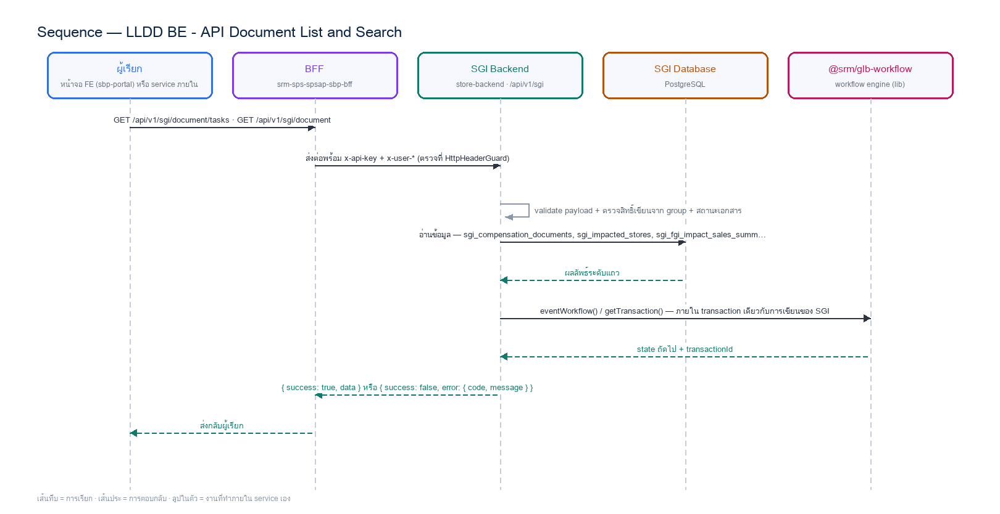

# LLDD BE - API Document List and Search

SBP Mall - ระบบประกันรายได้ | Low Level Design Document

## 1. Overview

| รายการ | รายละเอียด |
| --- | --- |
| Track | BE |
| Estimate | **26 ชั่วโมง** = implementation 20 + unit test 6 (30%) |
| Owner | Butsaba &lt;But&gt; Podamrong |
| Target repository | `SBP/srm-sps-spsap-store-backend` (NestJS + TypeORM · schema `sps_store`) + `SBP/srm-sps-spsap-sbp-bff` (forward ผ่าน client service · ไม่มี DB) สำหรับเส้นที่ FE เรียก |
| Objective | ออกแบบ APIs สำหรับงานรอดำเนินการและค้นหาเอกสารที่เกี่ยวข้อง |

Common contract reference: ทุกหัวข้อ API/FE ต้องยึด LLDD-BE-API-Common-Contracts และ LLDD-FE-Integration-Contracts สำหรับ error/auth/format/pagination/action/RBAC ก่อนลงรายละเอียดเฉพาะหน้าหรือเฉพาะ endpoint

### 1.1 เอกสาร LLDD ที่เกี่ยวข้อง

ตารางนี้สร้างจาก endpoint และตารางที่เอกสารฉบับนี้ประกาศไว้จริง — อ่านฉบับที่อยู่ในตารางก่อนลงมือ เพื่อไม่ให้สัญญา request/response หรือชื่อคอลัมน์หลุดจากกัน

| ความสัมพันธ์ | เอกสาร LLDD | เกี่ยวข้องตรงไหน |
| --- | --- | --- |
| ถูกเรียกจาก | **LLDD-FE-Document-Lists** | `GET /api/v1/sgi/document` · `GET /api/v1/sgi/document/tasks` |
| สัญญากลาง | **LLDD-BE-API-Common-Contracts** | envelope `{success,data}` · error code · pagination · รูปแบบวันที่/เลขเอกสาร |
| โครงสร้างข้อมูล | **LLDD-BE-Database-Structure** | DDL ของตารางที่หัวข้อ Reference DB Mapping อ้างถึง |
| workflow engine | **LLDD-BE-Workflow-Engine-Definition** | นิยาม state/route/event ที่หัวข้อ Workflow Trigger Event Contract เรียกใช้ |
| แพลตฟอร์มระบบเดิม | **LLDD-BE-Integration-SBP-Platform** | header จาก BFF (`x-api-key` / `x-user-*`) · การ reuse ตารางและ service ของระบบ SBP เดิม |
| ต้องจบก่อน (ลำดับงาน) | **LLDD-BE-API-Common-Contracts** | เป็นฉบับต้นทางของสัญญา/โครงที่ฉบับนี้อ้าง |
| ต้องจบก่อน (ลำดับงาน) | **LLDD-BE-Database-Structure** | เป็นฉบับต้นทางของสัญญา/โครงที่ฉบับนี้อ้าง |

## 2. Screen / Functional Scope

- Inbox tasks API
- Document search API
- Pagination
- Status/year filter
- Abnormal row support

## 3. Screenshot Reference

ไม่มีภาพหน้าจอสำหรับหัวข้อนี้ — เป็นเอกสารฝั่ง Backend/Batch ที่ไม่มี UI (ภาพหน้าจอทั้งหมดอยู่ในเอกสารชุด FE)

## 4. Implementation Flow & Sequence Diagram (Reference)

### 4.1 Implementation Flow (ลำดับขั้นการทำงาน)


_รูปที่ 1: Implementation flow reference: LLDD BE - API Document List and Search_

### 4.2 Sequence Diagram (ใครคุยกับใคร ลำดับไหน)

ผู้แสดงและลำดับข้อความในภาพนี้สร้างจาก endpoint ในหัวข้อ 7 และตารางในหัวข้อ Reference DB Mapping ของเอกสารฉบับนี้เอง จึงตรงกับสัญญาเสมอ



_รูปที่ 2: Sequence diagram: LLDD BE - API Document List and Search_

## 5. Field, Format, and Validation

| Field / UI | Format | Validation | Behavior |
| --- | --- | --- | --- |
| docNo | YYYY/xxxxx | required when opening existing document | ใช้ปี **ค.ศ.** และ running 5 หลัก (มติ 2026-08-06) |
| storeCode | string 5 digits | numeric length = 5 | แสดง leading zero |
| amount | number, 2 decimals | >= 0 | format `#,##0.00` บาท |
| percent | number, 2 decimals | 0-100 | ใช้ `%` และรวม allocation ต้องเท่ากับ 100 — **B5: เพิ่ม/ลบร้านที่กระทบเพิ่มเมื่อไร ต้องเกลี่ยใหม่ทั้งชุดแล้วคำนวณ `compensateAmount` ของทุกแถวใหม่ ไม่ใช่เฉพาะแถวที่เพิ่ม** |
| sourceSystem | enum | ALLMAP / USER | **B5** ที่มาของแถวร้านเปิดใหม่ — `ALLMAP` ระบบ default ให้อัตโนมัติ (Job 9) · `USER` เจ้าหน้าที่ SBP DSA คีย์เองจากเอกสารแจ้งของหน่วยงานส่งเสริม (ผัง To-Be · SDD สไลด์ 7) · ซ้ำ `(doc_no, new_store_code)` ให้คืน `409` |
| date | DD/MM/YYYY | valid date | payload เป็น ISO ค.ศ. · FE แสดง ค.ศ. เป็นค่าเริ่มต้น (DatePicker buddhistEra=false) แสดง พ.ศ. เฉพาะจุดที่เปิด flag |
| attachment | file | <= 5 MB | รองรับ vsd, dwg, afp, pdf, mda, zip, wav, mp3, gif, jpg, tif, tiff, htm, html, txt, xml, mpg, mov, ivs, doc, docx, xls, xlsx, pps, ppt, pot, csv |
| year | ค.ศ. YYYY | required for /sgi/document | ไม่ระบุคืน 400 ตาม SRS · BE ผ่าน toAD() เผื่อ client ส่ง พ.ศ. |
| page/size | integer | page>=1 size<=100 | pagination |

### 5.9 Input / Progress / Output Contract

| Stage | Contract for implementation |
| --- | --- |
| Input | GET /api/v1/sgi/document/tasks; GET /api/v1/sgi/document |
| Progress | Read JWT section/role; Validate year for documents; Build filter query; Join sgi_impacted_stores |
| Output | ไม่มีตารางที่เอกสารนี้เขียนเอง — output คือ response ตาม envelope กลาง `{success, data}` และร่องรอยที่ตรวจย้อนได้ (log / sgi_consideration_logs / workflow_history ของ engine) |

### 5.90 Endpoint Implementation Contract

| Endpoint | Use-case owner | Service/repository behavior | Definition of done |
| --- | --- | --- | --- |
| GET /api/v1/sgi/document/tasks | Inbox tasks API | Read JWT section/role | year missing fails for /sgi/document |
| GET /api/v1/sgi/document | Document search API | Validate year for documents | leading zero storeCode preserved |

### 5.91 Backend Execution Sequence

| Step | Behavior specific to this LLDD | Failure/test evidence |
| --- | --- | --- |
| 1 | Read JWT section/role | tasks by section |
| 2 | Validate year for documents | documents missing year |
| 3 | Build filter query | store search |
| 4 | Join sgi_impacted_stores | empty result |
| 5 | Return page result | — (ยังไม่มี test เฉพาะขั้นนี้ · ครอบด้วย test รวมของเอกสารในหัวข้อ 11) |

### 5.92 Workflow Trigger Event Contract

งานชิ้นนี้ **ต้องเรียก workflow engine** ตามตารางด้านล่าง · ชื่อ function ยึด API 8 ตัวของ `@srm/glb-workflow` ตามชีต `Detail` ของ `SBP/TSM-SRM-LLDD-SBP-workflow-1.2.md` — รายละเอียด signature และตารางที่ engine เขียน ดู **LLDD-BE-Workflow-Engine-Definition** หัวข้อ 5.3

| จุดที่เรียก (call site) | Engine function | พารามิเตอร์หลัก | กติกา / transaction boundary |
| --- | --- | --- | --- |
| กล่องงานรอดำเนินการ | `getPendingFlowByUser` | userData, versionId | เป็นแหล่งความจริงของรายการรอดำเนินการ · section 06 ต้อง union เอกสารที่จบด้วย หยุดชดเชยฯ (stoppedReopenable) เพิ่มเอง |

- 🔴 กติกาเหล็ก: ตาราง `sps_store.workflow_*` (13 ตาราง) เป็นของ lib — SGI **R เท่านั้น** ห้าม INSERT/UPDATE/DELETE ตรงในทุกกรณี
- ทุกการเรียก engine ต้องผ่านตัวห่อกลาง `WorkflowGateway` ที่นิยามใน **LLDD-BE-API-Common-Contracts** (timeout · retry · map error เข้า envelope) ห้าม import lib ตรงจาก service
- unit test ต้อง mock engine และครอบอย่างน้อย: เรียกสำเร็จ · engine โยน error แล้ว rollback ฝั่ง SGI ครบ · เรียกซ้ำด้วย referenceId เดิมไม่เกิดผลซ้ำ

## 6. Button / User Action Mapping

| Action | Trigger | API / Service | Expected Result |
| --- | --- | --- | --- |
| Inbox tasks | GET | task.service.searchOpenTasks | return waiting list |
| Document search | GET | document.service.search | return related list |

## 7. API Contract

### GET /api/v1/sgi/document/tasks

Inbox tasks API

#### Query Params

```json
{
  "status": "06",
  "keyword": "โลตัส",
  "regionCode": "BE",
  "storeType": "A",
  "createdFrom": "2026-06-01",
  "createdTo": "2026-06-30",
  "salesDeclineMin": 10,
  "salesDeclineMax": 80,
  "compensationMin": 0,
  "compensationMax": 500000,
  "daysPendingMin": 0,
  "daysPendingMax": 30,
  "page": 1,
  "size": 20
}
```

#### Request Field Schema

| Field | Type | Required | Constraint / Meaning |
| --- | --- | --- | --- |
| status | string | No | UTF-8; use value domain described by endpoint purpose |
| keyword | string | No | ช่อง **ค้นหา** — ค้นแบบ contains ใน เลขที่เอกสาร / ชื่อร้าน / รหัสร้าน (ไม่สนตัวพิมพ์) |
| regionCode | string | No | ช่อง **ภาค** — รหัสภาคของร้าน (`store.zone_cd`) · ค่าเดียวกับ `items[].regionCode` ใน response |
| storeType | string | No | ช่อง **ประเภทร้าน** — 7 ค่า `A B C D E PTT บริษัท` (`store.store_type`) ชุดเดียวกับตัวกรองในรายงาน |
| createdFrom | string | No | ช่อง **วันที่สร้าง (ตั้งแต่)** — ISO ค.ศ. · รวมวันที่ระบุ |
| createdTo | string | No | ช่อง **วันที่สร้าง (ถึง)** — ISO ค.ศ. · **รวมทั้งวัน** (SQL ใช้ `< :createdTo + 1`) |
| salesDeclineMin | integer | No | ช่อง **ยอดขายที่ลดลง (ต่ำสุด)** — % เทียบกับ `items[].salesDeclinePercent` |
| salesDeclineMax | integer | No | ช่อง **ยอดขายที่ลดลง (สูงสุด)** — % เทียบกับ `items[].salesDeclinePercent` |
| compensationMin | integer | No | ช่อง **เงินชดเชย (ต่ำสุด)** — บาท เทียบกับ `items[].totalCompensationAmount` |
| compensationMax | integer | No | ช่อง **เงินชดเชย (สูงสุด)** — บาท เทียบกับ `items[].totalCompensationAmount` |
| daysPendingMin | integer | No | ช่อง **รอ (วัน) ต่ำสุด** — เทียบกับ `items[].daysPending` · มีเฉพาะกล่องงาน `/tasks` |
| daysPendingMax | integer | No | ช่อง **รอ (วัน) สูงสุด** — เทียบกับ `items[].daysPending` · มีเฉพาะกล่องงาน `/tasks` |
| page | integer | No | >= 1; default 1 |
| size | integer | No | 1..100; default 20 |

#### Response

```json
{
  "page": 1,
  "size": 20,
  "total": 24,
  "items": [
    {
      "roundNo": 1,
      "docNo": "2026/00123",
      "impactedStoreCode": "01234",
      "impactedStoreName": "สาขาตัวอย่าง",
      "regionCode": "BE",
      "salesDeclinePercent": 12.5,
      "statusCode": "06",
      "currentOwner": "somchai.k",
      "statusName": "รอฝ่าย SBP DSA ดำเนินการ",
      "totalCompensationAmount": 48200.0,
      "daysPending": 3,
      "salesDataDays": 58
    }
  ]
}
```

#### Response Field Schema

| Field | Type | Required | Constraint / Meaning |
| --- | --- | --- | --- |
| page | integer | Yes | >= 1; default 1 |
| size | integer | Yes | 1..100; default 20 |
| total | integer | Yes | UTF-8; use value domain described by endpoint purpose |
| items | array&lt;object&gt; | Yes | JSON array; element type shown in Type column |
| items[].roundNo | integer | Yes | UTF-8; use value domain described by endpoint purpose |
| items[].docNo | string | Yes | ค.ศ. YYYY/xxxxx |
| items[].impactedStoreCode | string | Yes | exactly 5 digits; preserve leading zero |
| items[].impactedStoreName | string | Yes | UTF-8; use value domain described by endpoint purpose |
| items[].regionCode | string | Yes | UTF-8; use value domain described by endpoint purpose |
| items[].salesDeclinePercent | number | Yes | number 0..100 with 2 decimals |
| items[].statusCode | string | Yes | canonical code; do not replace with display label |
| items[].currentOwner | string | Yes | UTF-8; use value domain described by endpoint purpose |
| items[].statusName | string | Yes | UTF-8; use value domain described by endpoint purpose |
| items[].totalCompensationAmount | number | Yes | number >= 0 with 2 decimals |
| items[].daysPending | integer | Yes | UTF-8; use value domain described by endpoint purpose |
| items[].salesDataDays | integer | Yes | UTF-8; use value domain described by endpoint purpose |

### GET /api/v1/sgi/document

Document search API

#### Query Params

```json
{
  "year": 2026,
  "impactedStoreCode": "00788",
  "status": "06",
  "result": "APPROVE",
  "keyword": "โลตัส",
  "regionCode": "BE",
  "storeType": "A",
  "createdFrom": "2026-06-01",
  "createdTo": "2026-06-30",
  "salesDeclineMin": 10,
  "salesDeclineMax": 80,
  "compensationMin": 0,
  "compensationMax": 500000,
  "page": 1,
  "size": 20
}
```

#### Request Field Schema

| Field | Type | Required | Constraint / Meaning |
| --- | --- | --- | --- |
| year | integer | Yes | UTF-8; use value domain described by endpoint purpose |
| impactedStoreCode | string | No | exactly 5 digits; preserve leading zero |
| status | string | No | UTF-8; use value domain described by endpoint purpose |
| result | string | No | ช่อง **ผลการพิจารณา** (มีเฉพาะหน้า *ที่เกี่ยวข้อง*) — `APPROVE` / `REJECT` / `CANCELLED` / `NONE` · ดูจากผลพิจารณา **ล่าสุด** ของเอกสารใน `sgi_consideration_logs` ไม่ได้อยู่ที่หัวเอกสาร |
| keyword | string | No | ช่อง **ค้นหา** — ค้นแบบ contains ใน เลขที่เอกสาร / ชื่อร้าน / รหัสร้าน (ไม่สนตัวพิมพ์) |
| regionCode | string | No | ช่อง **ภาค** — รหัสภาคของร้าน (`store.zone_cd`) · ค่าเดียวกับ `items[].regionCode` ใน response |
| storeType | string | No | ช่อง **ประเภทร้าน** — 7 ค่า `A B C D E PTT บริษัท` (`store.store_type`) ชุดเดียวกับตัวกรองในรายงาน |
| createdFrom | string | No | ช่อง **วันที่สร้าง (ตั้งแต่)** — ISO ค.ศ. · รวมวันที่ระบุ |
| createdTo | string | No | ช่อง **วันที่สร้าง (ถึง)** — ISO ค.ศ. · **รวมทั้งวัน** (SQL ใช้ `< :createdTo + 1`) |
| salesDeclineMin | integer | No | ช่อง **ยอดขายที่ลดลง (ต่ำสุด)** — % เทียบกับ `items[].salesDeclinePercent` |
| salesDeclineMax | integer | No | ช่อง **ยอดขายที่ลดลง (สูงสุด)** — % เทียบกับ `items[].salesDeclinePercent` |
| compensationMin | integer | No | ช่อง **เงินชดเชย (ต่ำสุด)** — บาท เทียบกับ `items[].totalCompensationAmount` |
| compensationMax | integer | No | ช่อง **เงินชดเชย (สูงสุด)** — บาท เทียบกับ `items[].totalCompensationAmount` |
| page | integer | No | >= 1; default 1 |
| size | integer | No | 1..100; default 20 |

#### Response

```json
{
  "page": 1,
  "size": 20,
  "total": 342,
  "items": [
    {
      "roundNo": 2,
      "docNo": "2026/00124",
      "impactedStoreCode": "01235",
      "impactedStoreName": "สาขาตัวอย่าง 2",
      "regionCode": "BS",
      "salesDeclinePercent": 18.0,
      "statusCode": "99",
      "statusName": "เสร็จสิ้น",
      "totalCompensationAmount": 72500.0,
      "daysPending": 0,
      "salesDataDays": 60
    }
  ]
}
```

#### Response Field Schema

| Field | Type | Required | Constraint / Meaning |
| --- | --- | --- | --- |
| page | integer | Yes | >= 1; default 1 |
| size | integer | Yes | 1..100; default 20 |
| total | integer | Yes | UTF-8; use value domain described by endpoint purpose |
| items | array&lt;object&gt; | Yes | JSON array; element type shown in Type column |
| items[].roundNo | integer | Yes | UTF-8; use value domain described by endpoint purpose |
| items[].docNo | string | Yes | ค.ศ. YYYY/xxxxx |
| items[].impactedStoreCode | string | Yes | exactly 5 digits; preserve leading zero |
| items[].impactedStoreName | string | Yes | UTF-8; use value domain described by endpoint purpose |
| items[].regionCode | string | Yes | UTF-8; use value domain described by endpoint purpose |
| items[].salesDeclinePercent | number | Yes | number 0..100 with 2 decimals |
| items[].statusCode | string | Yes | canonical code; do not replace with display label |
| items[].statusName | string | Yes | UTF-8; use value domain described by endpoint purpose |
| items[].totalCompensationAmount | number | Yes | number >= 0 with 2 decimals |
| items[].daysPending | integer | Yes | UTF-8; use value domain described by endpoint purpose |
| items[].salesDataDays | integer | Yes | UTF-8; use value domain described by endpoint purpose |

## 8. Reference DB Mapping (No Database Page Work)

ส่วนนี้เป็นข้อมูลอ้างอิงสำหรับการ implement API/Job เท่านั้น ไม่ใช่งานสร้างหน้า Database, ไม่ใช่งานออกแบบ DB page และไม่ถูกนับเป็น deliverable แยกของ FE/BE

| Table / Object | R/W | Usage |
| --- | --- | --- |
| workflow_transaction / workflow_approver (@srm/glb-workflow) | R | อ่าน inbox ผ่าน getPendingFlowByUser() · เฉพาะ section 06 ต้อง union เอกสารที่จบด้วย หยุดชดเชยประกันรายได้ เข้ามาด้วย (stoppedReopenable) |
| sgi_compensation_documents | R | ค้นเอกสารตาม year/status/store |
| sgi_impacted_stores | R | ชื่อร้าน ภาค และข้อมูลร้าน |
| sgi_fgi_impact_sales_summaries | R | flag ข้อมูลผิดปกติ/ยอดขายไม่ครบ 60 วัน |
| workflow_history (@srm/glb-workflow · sps_store) | R | ประวัติการเดิน state ของ engine (อ้างอิงเสริม ห้ามเขียน) (เพิ่ม 2026-09-02 — SQL แตะอยู่แล้วแต่ไม่ได้ประกาศไว้) |
| sgi_consideration_logs | R | ผลการพิจารณาสุดท้าย — คัดเอกสารที่จบด้วย หยุดชดเชยประกันรายได้ เข้าคิวของ section 06 (SDD สไลด์ 46 ข้อ 1.9) |

## 9. Skeleton Code (store-backend + BFF)

โครงโค้ดตั้งต้นของเอกสารฉบับนี้ ยึด convention จริงของ `srm-sps-spsap-store-backend` (NestJS 11 + TypeORM, schema `sps_store`, custom provider `DATA_SOURCE` ที่ route SELECT ไป slave pool) และ `srm-sps-spsap-sbp-bff` (ไม่มี DB, forward ผ่าน client service). ทุกจุดที่ต้องเติมกำกับด้วย `// TODO:` และ response ทุกเส้นถูกห่อเป็น `{success, data}` โดย ResponseInterceptor อยู่แล้ว จึงห้าม service ห่อซ้ำ

### 9.1 ผังไฟล์ที่ต้องสร้าง

| Path | หน้าที่ |
| --- | --- |
| store-backend · src/modules/sgi-document-list-search/sgi-document-list-search.controller.ts | route ทั้งหมดของเอกสารนี้ (2 เส้น) + `@UseGuards(HttpHeaderGuard)` + `@UserId()` |
| store-backend · src/modules/sgi-document-list-search/sgi-document-list-search.service.ts | business logic — inject `'DATA_SOURCE'` แล้วยิง raw SQL, mutation ใช้ QueryRunner transaction |
| store-backend · src/modules/sgi-document-list-search/sgi-document-list-search.sql.ts | เก็บ SQL ต่อ endpoint (คัดจากหัวข้อ 10) แยกออกจาก service ให้ทดสอบ/รีวิวง่าย · **คีย์ = ชื่อ handler** เช่น `getSgiMasterFactors` · บล็อกที่มีหลาย statement ให้แยกเป็นหลายคีย์ โดยเติมท้ายชื่อให้สื่อความ เช่น DELETE master ที่มี 2 statement → `removeSgiMasterFactorsByCodeInUse` (SELECT ตรวจการใช้งาน) + `removeSgiMasterFactorsByCode` (DELETE) |
| store-backend · src/modules/sgi-document-list-search/dto/sgi-document-list-search.dto.ts | DTO + class-validator ตาม validation ในหัวข้อฟิลด์ของเอกสารนี้ |
| store-backend · src/modules/sgi-document-list-search/sgi-document-list-search.module.ts | ประกอบ controller/service/providers แล้ว register ที่ `app.module.ts` |
| store-backend · src/entitys/sgi-compensation-documents.entity.ts | entity ของ `sgi_compensation_documents` (`@Entity({schema: process.env.DB_SCHEMA})`, ไม่ประกาศ relation) — **entity ร่วมหลายเอกสาร: ประกาศครั้งเดียวแล้วอ้างอิง อย่าสร้างซ้ำ** |
| store-backend · src/entitys/sgi-impacted-stores.entity.ts | entity ของ `sgi_impacted_stores` (`@Entity({schema: process.env.DB_SCHEMA})`, ไม่ประกาศ relation) |
| store-backend · src/entitys/sgi-fgi-impact-sales-summaries.entity.ts | entity ของ `sgi_fgi_impact_sales_summaries` (`@Entity({schema: process.env.DB_SCHEMA})`, ไม่ประกาศ relation) |
| store-backend · src/providers/sgi/sgi.ts | repository provider แบบ factory ผูก token string กับ `DATA_SOURCE` — **ไฟล์ร่วมของทุกเอกสาร BE ให้ merge array เพิ่ม ห้ามเขียนทับ** |
| store-backend · sql/deploy-sgi-document-list-search.sql | DDL production แบบ idempotent (ทีมนี้ไม่ใช้ migration เป็นหลัก) |
| BFF · src/common/client-services/sgi-client.service.ts | client ต่อจาก `BaseClientService` ตั้ง baseUrl + `x-api-key` ตอน `onModuleInit` |
| BFF · src/modules/sgi-document-list-search/sgi-document-list-search.controller.ts | route ฝั่ง BFF prefix `/bff/sgi/…` + `@UseGuards(AuthGuard('jwt'))` |
| BFF · src/modules/sgi-document-list-search/sgi-document-list-search.service.ts | แนบ `x-user-id` / `x-user-group-id` / `x-user-permissions` แล้ว forward ไป backend |

### 9.2 Controller (store-backend)

```ts
// src/modules/sgi-document-list-search/sgi-document-list-search.controller.ts
import { Controller, Get, Query, UseGuards } from '@nestjs/common';
import { HttpHeaderGuard } from '../../guards/http-header.guard';
import { UserId } from '../../common/decorators/user-id.decorator';
import { SgiDocumentListSearchService } from './sgi-document-list-search.service';
import { DocumentListSearchQueryDto } from './dto/sgi-document-list-search.dto';

// LLDD BE - API Document List and Search
// BFF เรียกด้วย x-api-key และแนบ x-user-id / x-user-group-id / x-user-permissions มาให้
@Controller('document')
@UseGuards(HttpHeaderGuard)
export class SgiDocumentListSearchController {
  constructor(private readonly service: SgiDocumentListSearchService) {}

  // GET /api/v1/sgi/document/tasks — Inbox tasks API
  @Get('tasks')
  getSgiDocumentTasks(@Query() query: DocumentListSearchQueryDto, @UserId() userId: string) {
    // TODO: ตรวจ x-user-permissions ก่อนเรียก service ถ้า endpoint นี้จำกัดสิทธิ์เมนู
    return this.service.getSgiDocumentTasks(query, userId);
  }

  // GET /api/v1/sgi/document — Document search API
  @Get()
  getSgiDocument(@Query() query: DocumentListSearchQueryDto, @UserId() userId: string) {
    // TODO: ตรวจ x-user-permissions ก่อนเรียก service ถ้า endpoint นี้จำกัดสิทธิ์เมนู
    return this.service.getSgiDocument(query, userId);
  }
}
```

### 9.3 DTO + Validation

```ts
// src/modules/sgi-document-list-search/dto/sgi-document-list-search.dto.ts
import { Type } from 'class-transformer';
import {
  IsArray, IsBoolean, IsIn, IsInt, IsNotEmpty, IsNumber, IsObject, IsOptional,
  IsString, Matches, Max, MaxLength, Min, ValidateNested,
} from 'class-validator';

// ValidationPipe ระดับ global ตั้ง whitelist + forbidNonWhitelisted + transform ไว้แล้ว (main.ts)
// property ที่ไม่ประกาศที่นี่จะถูก reject เป็น 400 อัตโนมัติ

// query ร่วมของ GET ทุกเส้นในโมดูลนี้ (path param ใช้ @Param แยก)
export class DocumentListSearchQueryDto {
  @IsNotEmpty()
  @IsString()
  status: string;

  @IsNotEmpty()
  @IsString()
  keyword: string;

  @IsNotEmpty()
  @IsString()
  regionCode: string;

  @IsNotEmpty()
  @IsString()
  storeType: string;

  @IsNotEmpty()
  @IsString()
  createdFrom: string;

  @IsNotEmpty()
  @IsString()
  createdTo: string;

  // TODO: เพิ่ม property ที่เหลือของ payload นี้ให้ครบตามหัวข้อฟิลด์ของเอกสารนี้
}
```

### 9.4 Service (inject `DATA_SOURCE` + raw SQL)

service ประกาศ method ครบทุกเส้นที่ controller เรียก และ **signature มาจากแหล่งเดียวกับ controller** (จำนวน/ลำดับพารามิเตอร์จึงตรงกันเสมอ) — เส้นที่ยังไม่ได้ implement เป็น stub ที่ `throw new NotImplementedException(...)` ให้ TypeScript compile ผ่านตั้งแต่วันแรก

```ts
// src/modules/sgi-document-list-search/sgi-document-list-search.service.ts
import { BadRequestException, ConflictException, Inject, Injectable, Logger, NotFoundException, NotImplementedException } from '@nestjs/common';
import { DataSource } from 'typeorm';
import { WorkflowService } from '../workflow/workflow.service';
import { SGI_SQL } from './sgi-document-list-search.sql';

@Injectable()
export class SgiDocumentListSearchService {
  private readonly logger = new Logger(SgiDocumentListSearchService.name);
  // versionId ของ workflow ประกันรายได้ (ตั้งใน env เหมือน COOPERATION_WORKFLOW_VERSION_ID)
  private readonly versionId = Number(process.env.SGI_WORKFLOW_VERSION_ID);

  constructor(
    // DATA_SOURCE override query(): SELECT/WITH ไป slave pool, write ไป master
    @Inject('DATA_SOURCE') private readonly dataSource: DataSource,
    private readonly workflow: WorkflowService,
  ) {}

  // GET /api/v1/sgi/document/tasks — Inbox tasks API
  async getSgiDocumentTasks(query: DocumentListSearchQueryDto, userId: string) {
    const page = Number(query.page ?? 1);
    const size = Math.min(Number(query.size ?? 20), 100);
    // SQL เต็มอยู่ในหัวข้อ Database SQL ของเอกสารนี้ (คีย์ 'GET /api/v1/sgi/document/tasks')
    // SQL ในเอกสารเป็น positional $1..$n อยู่แล้ว (ตัวสร้างแปลงให้ตั้งแต่ 2026-09-04)
    //   บรรทัดแรกของบล็อก SQL คือ `-- bind ตามลำดับ: $1=... · $2=...` ให้เรียงอาร์กิวเมนต์ตามนั้น
    const rows = await this.dataSource.query(SGI_SQL.getSgiDocumentTasks, [
      // เรียงให้ตรงกับบรรทัด `-- bind ตามลำดับ:` ของ SQL เส้นนี้
      userId, (page - 1) * size, size,
    ]);
    // TODO: total ต้องมาจาก COUNT(*) แยก query หรือ window function ไม่ใช่ rows.length
    return { page, size, total: rows.length, items: rows };
  }

  // GET /api/v1/sgi/document — Document search API
  async getSgiDocument(query: DocumentListSearchQueryDto, userId: string) {
    // TODO: implement ตาม business rule ของ GET /api/v1/sgi/document
    //       (SQL อยู่ในหัวข้อ Database SQL คีย์ 'GET /api/v1/sgi/document')
    throw new NotImplementedException('getSgiDocument ยังไม่ implement');
  }
}
```

### 9.5 Workflow (`@srm/glb-workflow`)

✅ **ชื่อ function ของ engine — ยึด LLDD ของ lib (ยืนยันแล้ว 2026-08-14)** · API จริงคือ 8 ตัวตามชีต `Detail` ของ `SBP/TSM-SRM-LLDD SBP workflow 1.2.xlsx` (เอกสารของ lib เอง): `initializeWorkflow` · `eventWorkflow` · `getPermissionEvents` · `getHistory` · `getTransaction` · `getPendingFlowByUser` · `getWorkflowsByUser` · `addPreApprover` · ชื่อที่เคยขัดกันไม่ใช่ชื่อ API — *Trigger Event* เป็นชื่อหัวข้อขั้นตอนภายใน `eventWorkflow` และ `*UseCase` เป็น class ที่ store-backend ห่อไว้ใช้เอง (ดู `LLDD-BE-Workflow-Engine-Definition` หัวข้อ 5.3)

| Endpoint | Use case ที่ต้องเรียก | เหตุผล |
| --- | --- | --- |
| GET /api/v1/sgi/document/tasks | getPendingFlowByUser() | inbox งานค้างของ userId/groupId ที่ BFF ส่งมาใน header |

```ts
// src/modules/sgi-document-list-search/sgi-document-list-search.workflow.ts (หรือรวมไว้ใน service เดียวกัน)
// WorkflowService = wrapper ของ @srm/glb-workflow ที่ store-backend มีอยู่แล้ว
// (DataSource แยกชื่อ 'workflow-connection', ทุก use case ห่อด้วย TypeOrmUnitOfWork)

  // inbox งานค้าง — ใช้ร่วมกับ /api/workflow/pending ของ backlog เดิมได้
  const pending = await this.workflow.getPendingFlowByUser({
    userData: { userId: Number(userId), groupId: Number(groupId) },
    versionId: this.versionId,
  });
  // TODO: join referenceId (= doc_no) กลับไปที่ sgi_compensation_documents เพื่อเติมข้อมูลเอกสาร
```

### 9.6 Entity (TypeORM)

```ts
// src/entitys/sgi-compensation-documents.entity.ts
import { Column, Entity, PrimaryColumn } from 'typeorm';

@Entity({ name: 'sgi_compensation_documents', schema: process.env.DB_SCHEMA })
export class CompensationDocument {
  @PrimaryColumn({ name: 'id', type: 'bigint' })
  id: number;

  @Column({ name: 'doc_no', type: 'varchar', length: 10, nullable: true })
  docNo?: string;

  @Column({ name: 'year', type: 'int', nullable: true })
  year?: number;

  @Column({ name: 'running_no', type: 'int', nullable: true })
  runningNo?: number;

  @Column({ name: 'impact_process_id', type: 'bigint' })
  impactProcessId: number;

  @Column({ name: 'impact_compensation_id', type: 'bigint' })
  impactCompensationId: number;

  @Column({ name: 'impacted_store_code', type: 'varchar', length: 5 })
  impactedStoreCode: string;

  @Column({ name: 'impact_month', type: 'char', length: 7, nullable: true })
  impactMonth?: string;

  @Column({ name: 'new_store_code', type: 'varchar', length: 5, nullable: true })
  newStoreCode?: string;

  @Column({ name: 'round_no', type: 'int', nullable: true })
  roundNo?: number;

  @Column({ name: 'loop_no', type: 'int', nullable: true })
  loopNo?: number;

  @Column({ name: 'source', type: 'varchar', length: 20, default: 'FS' })
  source: string;

  @Column({ name: 'status_code', type: 'varchar', length: 2, default: '06' })
  statusCode: string;

  @Column({ name: 'current_section_code', type: 'varchar', length: 2, nullable: true })
  currentSectionCode?: string;

  @Column({ name: 'total_compensation_amount', type: 'numeric', precision: 14, scale: 2, default: 0 })
  totalCompensationAmount: string;

  @Column({ name: 'allmap_url', type: 'varchar', length: 500, nullable: true })
  allmapUrl?: string;

  @Column({ name: 'statement_id', type: 'varchar', length: 50, nullable: true })
  statementId?: string;

  @Column({ name: 'statement_date', type: 'date', nullable: true })
  statementDate?: Date;

  @Column({ name: 'account_year', type: 'int', nullable: true })
  accountYear?: number;

  @Column({ name: 'account_month', type: 'int', nullable: true })
  accountMonth?: number;

  @Column({ name: 'approver_snapshot', type: 'jsonb', nullable: true })
  approverSnapshot?: Record<string, unknown>;

  @Column({ name: 'version_no', type: 'int', default: 1 })
  versionNo: number;

  @Column({ name: 'created_by', type: 'varchar', length: 30 })
  createdBy: string;

  @Column({ name: 'created_at', type: 'timestamp' })
  createdAt: Date;

  @Column({ name: 'updated_by', type: 'varchar', length: 30, nullable: true })
  updatedBy?: string;

  @Column({ name: 'updated_at', type: 'timestamp', nullable: true })
  updatedAt?: Date;

  // entity ชุดนี้ generate จาก DDL ใน LLDD-Database §5.2–5.4 โดยตรง — คอลัมน์/ชนิด/nullable ตรงกันเสมอ
  // ไม่ประกาศ relation ตาม convention ของทีม (join ด้วย raw SQL)
}
```

```ts
// src/entitys/sgi-impacted-stores.entity.ts
import { Column, Entity, PrimaryColumn } from 'typeorm';

@Entity({ name: 'sgi_impacted_stores', schema: process.env.DB_SCHEMA })
export class ImpactedStore {
  @PrimaryColumn({ name: 'store_code', type: 'varchar', length: 5 })
  storeCode: string;

  @Column({ name: 'dv_code', type: 'varchar', length: 20, nullable: true })
  dvCode?: string;

  @Column({ name: 'opt_dv_user_id', type: 'varchar', length: 30, nullable: true })
  optDvUserId?: string;

  @Column({ name: 'latitude', type: 'numeric', precision: 10, scale: 7, nullable: true })
  latitude?: string;

  @Column({ name: 'longitude', type: 'numeric', precision: 10, scale: 7, nullable: true })
  longitude?: string;

  @Column({ name: 'transfer_sbp_date', type: 'date', nullable: true })
  transferSbpDate?: Date;

  @Column({ name: 'is_active', type: 'boolean', default: true })
  isActive: boolean;

  @Column({ name: 'updated_at', type: 'timestamp' })
  updatedAt: Date;

  // entity ชุดนี้ generate จาก DDL ใน LLDD-Database §5.2–5.4 โดยตรง — คอลัมน์/ชนิด/nullable ตรงกันเสมอ
  // ไม่ประกาศ relation ตาม convention ของทีม (join ด้วย raw SQL)
}
```

ตารางที่เหลือของเอกสารนี้ (`sgi_fgi_impact_sales_summaries`, `sgi_consideration_logs`) ใช้รูปแบบ entity เดียวกัน — คอลัมน์อ้างจาก `database.md`

ตารางที่ **ไม่ต้องสร้าง entity** เพราะใช้ของระบบเดิม/workflow engine:

| Object | R/W | ใช้ของระบบเดิมตัวไหน |
| --- | --- | --- |
| workflow_transaction | R | workflow engine @srm/glb-workflow |
| workflow_approver | R | workflow engine @srm/glb-workflow |
| workflow_history | R | workflow engine @srm/glb-workflow |

### 9.7 Repository Providers + Module wiring

```ts
// src/providers/sgi/sgi.ts — repository provider แบบ factory (ไม่ใช้ TypeOrmModule.forFeature)
// convention ของโฟลเดอร์ providers คือ 1 ไฟล์ต่อโดเมน ตั้งชื่อตามโดเมน (business_user/business_user.ts,
// common_code/common_code.ts …) ไม่ใช่ index.ts
//
// ⚠️ ไฟล์นี้ใช้ร่วมกันทุกเอกสาร BE ของ SGI — ให้ **merge array เพิ่ม** เข้าไฟล์เดิม ห้ามเขียนทับ
//    (ชื่อ const แยกต่อเอกสารไว้แล้วเพื่อไม่ให้ชนกัน)
import { DataSource } from 'typeorm';
import { CompensationDocument } from '../../entitys/sgi-compensation-documents.entity';
import { ImpactedStore } from '../../entitys/sgi-impacted-stores.entity';
import { FgiImpactSalesSummary } from '../../entitys/sgi-fgi-impact-sales-summaries.entity';

export const sgiDocumentListSearchProviders = [
  {
    provide: 'SGI_COMPENSATION_DOCUMENT_REPOSITORY',
    useFactory: (dataSource: DataSource) => dataSource.getRepository(CompensationDocument),
    inject: ['DATA_SOURCE'],
  },
  {
    provide: 'SGI_IMPACTED_STORE_REPOSITORY',
    useFactory: (dataSource: DataSource) => dataSource.getRepository(ImpactedStore),
    inject: ['DATA_SOURCE'],
  },
  {
    provide: 'SGI_FGI_IMPACT_SALES_SUMMARIES_REPOSITORY',
    useFactory: (dataSource: DataSource) => dataSource.getRepository(FgiImpactSalesSummary),
    inject: ['DATA_SOURCE'],
  },
];

// src/modules/sgi-document-list-search/sgi-document-list-search.module.ts
import { MiddlewareConsumer, Module, NestModule } from '@nestjs/common';
import { DatabaseModule } from '../../database/database.module';
// UserContextMiddleware อ่าน header x-user-id แล้วเซ็ต request.userId ที่ @UserId() ใช้
// — app.module.ts **ไม่ได้** apply แบบ global (มีแค่ HttpContext/LoggerContext) แต่ละโมดูลต้อง apply เอง
// (ดู evaluation-process.module.ts / inform-evaluate.module.ts / cooperation-request.module.ts)
import { UserContextMiddleware } from '../../common/middleware/user-context.middleware';
import { WorkflowModule } from '../workflow/workflow.module';
import { sgiDocumentListSearchProviders } from '../../providers/sgi/sgi';
import { SgiDocumentListSearchController } from './sgi-document-list-search.controller';
import { SgiDocumentListSearchService } from './sgi-document-list-search.service';

@Module({
  imports: [DatabaseModule, WorkflowModule],
  controllers: [SgiDocumentListSearchController],
  providers: [SgiDocumentListSearchService, ...sgiDocumentListSearchProviders],
  exports: [SgiDocumentListSearchService],
})
export class SgiDocumentListSearchModule implements NestModule {
  configure(consumer: MiddlewareConsumer) {
    // ถ้าไม่ apply ตรงนี้ userId จะเป็น undefined เงียบ ๆ ทุก endpoint
    consumer.apply(UserContextMiddleware).forRoutes(SgiDocumentListSearchController);
  }
}
// TODO: register module นี้ใน app.module.ts (imports) พร้อมกับโมดูล SGI ตัวอื่น
```

### 9.8 BFF Proxy (module + controller + client service)

BFF ยังไม่มีฟีเจอร์ประกันรายได้เลย จึงต้องสร้าง module ใหม่ + client service ใหม่ทั้งชุด และเลือก prefix แบบเดียวทั้งโมดูล (ที่นี่ใช้ `/bff/sgi/…`) เพื่อไม่ให้ปนแบบที่มี/ไม่มี `/bff` เหมือนโมดูลเดิม

```ts
// src/common/client-services/sgi-client.service.ts
import { Injectable, Logger, OnModuleInit } from '@nestjs/common';
import { BaseClientService } from './base-client.service';

@Injectable()
export class SgiClientService extends BaseClientService implements OnModuleInit {
  protected logger: Logger = new Logger(SgiClientService.name);

  onModuleInit() {
    // TODO: ถ้า deploy SGI แยก service ให้เพิ่ม API_SGI_BACKEND_* ใน AppConfigService
    //       ตอนนี้ชี้ store backend ตัวเดียวกับ StoreClientService
    this.defaultHeaders[this.config.api.store.key.name] = this.config.api.store.key.value;
    this.baseUrl = this.config.api.store.url;
  }
}
// BaseClientService แกะ { success, data } ให้แล้ว — service ฝั่ง BFF จึงได้ data ตรง ๆ
// TODO: เพิ่ม SgiClientService ใน providers/exports ของ ClientServiceModule (@Global)
```

```ts
// src/modules/sgi-document-list-search/sgi-document-list-search.service.ts (BFF)
import { Injectable } from '@nestjs/common';
import { SgiClientService } from '@common/client-services/sgi-client.service';

@Injectable()
export class SgiDocumentListSearchBffService {
  constructor(private readonly client: SgiClientService) {}

  // BFF ไม่มี DB — หน้าที่เดียวคือแนบ user context แล้ว forward
  // ⚠️ ต้อง unwrap envelope ของ store-backend 1 ชั้นก่อนคืน (ยืนยันจากโค้ดจริง 2026-09-04):
  //    ResponseInterceptor ระดับ global ของ BFF ห่อผลลัพธ์เป็น { success, data, requestId } อีกที
  //    ถ้าคืน { success, data } ดิบมา FE จะได้ data.data.data — SgiClientService จึงต้องคืน .data.data
  private userHeaders(user: any) {
    return {
      'x-user-id': user?.userId,
      'x-user-group-id': user?.groupId,
      'x-user-permissions': (user?.permissions ?? []).join(','),
    };
  }

  getSgiDocumentTasks(params: any, user: any) {
    return this.client.get('/api/v1/sgi/document/tasks', { params, headers: this.userHeaders(user) });
  }

  getSgiDocument(params: any, user: any) {
    return this.client.get('/api/v1/sgi/document', { params, headers: this.userHeaders(user) });
  }
}

// ---------- src/modules/sgi-document-list-search/sgi-document-list-search.controller.ts (BFF) ----------
import { Body, Controller, Delete, Get, Param, Post, Put, Query, Req, UseGuards } from '@nestjs/common';
import { AuthGuard } from '@nestjs/passport';

// path เดียวกับที่ FE เรียก (apiClient baseURL รวม /api/v1 แล้ว) — ห้ามตั้งตามชื่อเอกสาร LLDD
@Controller('sgi/document')
@UseGuards(AuthGuard('jwt'))
export class SgiDocumentListSearchBffController {
  constructor(private readonly service: SgiDocumentListSearchBffService) {}

  // proxy ของ GET /api/v1/sgi/document/tasks
  @Get('tasks')
  getSgiDocumentTasks(@Query() query: any, @Req() req: any) {
    return this.service.getSgiDocumentTasks(query, req.user);
  }

  // proxy ของ GET /api/v1/sgi/document
  @Get()
  getSgiDocument(@Query() query: any, @Req() req: any) {
    return this.service.getSgiDocument(query, req.user);
  }
}
// TODO: register module ใน app.module.ts ของ BFF และเพิ่ม SgiClientService ใน ClientServiceModule (@Global)
```

## 10. Database SQL

### 10.1 ตารางที่อ่าน/เขียน

| Table / Object | R/W | Usage |
| --- | --- | --- |
| sgi_compensation_documents | R | ค้นเอกสารตาม year/status/store |
| sgi_impacted_stores | R | ชื่อร้าน ภาค และข้อมูลร้าน |
| sgi_fgi_impact_sales_summaries | R | flag ข้อมูลผิดปกติ/ยอดขายไม่ครบ 60 วัน |
| sgi_consideration_logs | R | ผลการพิจารณาสุดท้าย — คัดเอกสารที่จบด้วย หยุดชดเชยประกันรายได้ เข้าคิวของ section 06 (SDD สไลด์ 46 ข้อ 1.9) |
| workflow_transaction | R | ใช้ของระบบเดิม: workflow engine @srm/glb-workflow |
| workflow_approver | R | ใช้ของระบบเดิม: workflow engine @srm/glb-workflow |
| workflow_history | R | ใช้ของระบบเดิม: workflow engine @srm/glb-workflow |

### 10.2 SQL จริงต่อ Endpoint

**GET /api/v1/sgi/document/tasks** — Inbox tasks API

```sql
-- bind ตามลำดับ: $1=sectionFromJwt · $2=sgiVersionId · $3=status · $4=keyword · $5=regionCode · $6=storeType · $7=createdFrom · $8=createdTo · $9=compensationMin · $10=compensationMax · $11=salesDeclineMin · $12=salesDeclineMax · $13=daysPendingMin · $14=daysPendingMax · $15=size · $16=offset
-- ⚠️ ไม่มีตาราง workflow_tasks ของ SGI แล้ว — กล่องงานอ่านจาก engine กลาง (schema sps_store)
--    getPendingFlowByUser({userData}) 
-- ✅ DP-1 ปิดแล้ว: reference_id = sgi_compensation_documents.id (surrogate · varchar(255)) · ⚠️ DP-2 workflow_transaction ไม่มี PK/index (19,327 แถว → seq-scan) ห้ามแก้ schema ของ library
--    ห้ามแก้ schema ของ library — กันซ้ำที่ระดับ application ของ SGI
WITH wh AS (
  -- workflow_transaction ไม่มี created_date — ใช้เวลา event แรกจาก workflow_history แทน
  SELECT transaction_id, MIN(create_date) AS first_event_date
  FROM sps_store.workflow_history GROUP BY transaction_id
)
SELECT d.round_no AS "roundNo",
       d.doc_no AS "docNo",
       d.impacted_store_code AS "impactedStoreCode",
       s.store_name AS "impactedStoreName",
       s.zone_cd AS "regionCode",
       GREATEST(COALESCE(-ss.growth_rate_diff, 0), 0) AS "salesDeclinePercent",
       d.total_compensation_amount AS "totalCompensationAmount",
       d.status_code AS "statusCode",
       d.current_section_code AS "currentSection",
       w.current_approver AS "currentOwner",   -- คอลัมน์ "ผู้ดำเนินการ (เจ้าของงาน)" บนหน้าจอ · เจ้าของงานอยู่ที่ engine ไม่ใช่ตารางของ SGI
       GREATEST(CURRENT_DATE - wh.first_event_date::date, 0) AS "daysPending",
       ss.total_working_days AS "salesDataDays"
FROM sps_store.workflow_approver a
JOIN sps_store.workflow_transaction w ON w.transaction_id = a.transaction_id
JOIN sgi_compensation_documents d ON d.id::text = w.reference_id   -- DP-1 = surrogate id   -- DP-1
JOIN store s ON s.store_id = d.impacted_store_code
LEFT JOIN sgi_fgi_impact_sales_summaries ss ON ss.impact_process_id = d.impact_process_id
-- ⚠️ ตัวกรองบนหน้าจอต้องส่งขึ้นมาที่นี่ด้วย ไม่ใช่กรองฝั่ง client (มี LIMIT/OFFSET · เพิ่ม 2026-09-09)
WHERE a.state_id = $1 /* sectionFromJwt */ AND a.state_id = w.current_state_id AND w.version_id = $2 /* sgiVersionId */
  AND ($3 /* status */           IS NULL OR d.status_code = $3 /* status */)
  AND ($4 /* keyword */          IS NULL OR d.doc_no ILIKE '%' || $4 /* keyword */ || '%'
                                 OR s.store_name ILIKE '%' || $4 /* keyword */ || '%'
                                 OR d.impacted_store_code ILIKE '%' || $4 /* keyword */ || '%')
  AND ($5 /* regionCode */       IS NULL OR s.zone_cd = $5 /* regionCode */)
  AND ($6 /* storeType */        IS NULL OR s.store_type = $6 /* storeType */)
  AND ($7 /* createdFrom */      IS NULL OR d.created_at >= $7 /* createdFrom */::date)
  AND ($8 /* createdTo */        IS NULL OR d.created_at <  $8 /* createdTo */::date + 1)
  AND ($9 /* compensationMin */  IS NULL OR d.total_compensation_amount >= $9 /* compensationMin */)
  AND ($10 /* compensationMax */  IS NULL OR d.total_compensation_amount <= $10 /* compensationMax */)
  AND ($11 /* salesDeclineMin */  IS NULL OR GREATEST(COALESCE(-ss.growth_rate_diff, 0), 0) >= $11 /* salesDeclineMin */)
  AND ($12 /* salesDeclineMax */  IS NULL OR GREATEST(COALESCE(-ss.growth_rate_diff, 0), 0) <= $12 /* salesDeclineMax */)
  AND ($13 /* daysPendingMin */   IS NULL OR GREATEST(CURRENT_DATE - wh.first_event_date::date, 0) >= $13 /* daysPendingMin */)
  AND ($14 /* daysPendingMax */   IS NULL OR GREATEST(CURRENT_DATE - wh.first_event_date::date, 0) <= $14 /* daysPendingMax */)
ORDER BY w.update_date
LIMIT $15 /* size */ OFFSET $16 /* offset */;
```

**GET /api/v1/sgi/document** — Document search API

```sql
-- bind ตามลำดับ: $1=statusDone · $2=year · $3=impactedStoreCode · $4=status · $5=result · $6=keyword · $7=regionCode · $8=storeType · $9=createdFrom · $10=createdTo · $11=compensationMin · $12=compensationMax · $13=salesDeclineMin · $14=salesDeclineMax · $15=size · $16=offset
-- ต้องระบุ :year เสมอ ไม่งั้นตอบ 400 (กติกา SRS)
SELECT d.round_no AS "roundNo",
       d.doc_no AS "docNo",
       d.impacted_store_code AS "impactedStoreCode",
       s.store_name AS "impactedStoreName",
       s.zone_cd AS "regionCode",
       GREATEST(COALESCE(-ss.growth_rate_diff, 0), 0) AS "salesDeclinePercent",
       d.total_compensation_amount AS "totalCompensationAmount",
       d.status_code AS "statusCode",
       d.current_section_code AS "currentSection",
       w.current_approver AS "currentOwner",   -- คอลัมน์ "ผู้ดำเนินการ (เจ้าของงาน)" บนหน้าจอ
       -- workflow_transaction ไม่มี created_date (มีแค่ update_date) — วันที่เริ่มงานเอาจาก workflow_history
       CASE WHEN w.current_status_id <> $1 /* statusDone */ THEN GREATEST(CURRENT_DATE - wh.first_event_date::date, 0) ELSE 0 END AS "daysPending",
       ss.total_working_days AS "salesDataDays"
FROM sgi_compensation_documents d
JOIN store s ON s.store_id = d.impacted_store_code
LEFT JOIN sgi_fgi_impact_sales_summaries ss ON ss.impact_process_id = d.impact_process_id
LEFT JOIN sps_store.workflow_transaction w ON w.reference_id = d.id::text   -- DP-1 = surrogate id (reference_id เป็น varchar(255)) AND w.version_id = :sgiVersionId   -- DP-1 · DP-2 (ไม่มี index → seq-scan)
-- ⚠️ ตัวกรองทุกตัวบนหน้าจอต้องมาที่นี่ ไม่ใช่กรองฝั่ง client — เพราะมี LIMIT/OFFSET
--    ถ้ากรองฝั่ง client ตัวกรองจะทำงานแค่แถวในหน้านั้น (เพิ่มครบ 2026-09-09)
WHERE d.year = $2 /* year */
  AND ($3 /* impactedStoreCode */ IS NULL OR d.impacted_store_code = $3 /* impactedStoreCode */)
  AND ($4 /* status */            IS NULL OR d.status_code = $4 /* status */)
  -- result ไม่ได้อยู่ที่หัวเอกสาร — ต้องดูผลพิจารณา *ล่าสุด* ของเอกสารจาก sgi_consideration_logs
  AND ($5 /* result */            IS NULL OR EXISTS (
        SELECT 1 FROM sgi_consideration_logs cl
         WHERE cl.doc_no = d.doc_no AND cl.result_category = $5 /* result */
           AND cl.action_datetime = (SELECT MAX(action_datetime) FROM sgi_consideration_logs
                                      WHERE doc_no = d.doc_no)))
  AND ($6 /* keyword */          IS NULL OR d.doc_no ILIKE '%' || $6 /* keyword */ || '%'
                                 OR s.store_name ILIKE '%' || $6 /* keyword */ || '%'
                                 OR d.impacted_store_code ILIKE '%' || $6 /* keyword */ || '%')
  AND ($7 /* regionCode */       IS NULL OR s.zone_cd = $7 /* regionCode */)
  AND ($8 /* storeType */        IS NULL OR s.store_type = $8 /* storeType */)   -- 7 ค่า A B C D E PTT บริษัท (เหมือนตัวกรองในรายงาน)
  AND ($9 /* createdFrom */      IS NULL OR d.created_at >= $9 /* createdFrom */::date)
  AND ($10 /* createdTo */        IS NULL OR d.created_at <  $10 /* createdTo */::date + 1)
  AND ($11 /* compensationMin */  IS NULL OR d.total_compensation_amount >= $11 /* compensationMin */)
  AND ($12 /* compensationMax */  IS NULL OR d.total_compensation_amount <= $12 /* compensationMax */)
  AND ($13 /* salesDeclineMin */  IS NULL OR GREATEST(COALESCE(-ss.growth_rate_diff, 0), 0) >= $13 /* salesDeclineMin */)
  AND ($14 /* salesDeclineMax */  IS NULL OR GREATEST(COALESCE(-ss.growth_rate_diff, 0), 0) <= $14 /* salesDeclineMax */)
ORDER BY d.doc_no DESC
LIMIT $15 /* size */ OFFSET $16 /* offset */;
```

### 10.3 Index / Constraint ที่ควรมี (ข้อเสนอ)

| Table | DDL ที่เสนอ | ที่มา / หมายเหตุ |
| --- | --- | --- |
| sgi_fgi_impact_sales_summaries | CREATE INDEX idx_sgi_fgi_impact_sales_summaries_impact_process_id ON sgi_fgi_impact_sales_summaries (impact_process_id); | ข้อเสนอ — อนุมานจากคอลัมน์ที่ปรากฏใน WHERE/JOIN ของ SQL ด้านบน ต้องวัด EXPLAIN ก่อนใช้จริง |
| sgi_compensation_documents | CREATE INDEX idx_sgi_compensation_documents_status_code_created_at_total_com ON sgi_compensation_documents (status_code, created_at, total_compensation_amount); | ข้อเสนอ — อนุมานจากคอลัมน์ที่ปรากฏใน WHERE/JOIN ของ SQL ด้านบน ต้องวัด EXPLAIN ก่อนใช้จริง |
| sgi_consideration_logs | CREATE INDEX idx_sgi_consideration_logs_doc_no_result_category_action_dateti ON sgi_consideration_logs (doc_no, result_category, action_datetime); | ข้อเสนอ — อนุมานจากคอลัมน์ที่ปรากฏใน WHERE/JOIN ของ SQL ด้านบน ต้องวัด EXPLAIN ก่อนใช้จริง |

ทั้งหมดเป็น **ข้อเสนอ** ไม่ใช่ข้อกำหนดจาก SRS — ให้ตรวจกับ `EXPLAIN ANALYZE` บนข้อมูลจริง และรวมเข้าไฟล์ `sql/deploy-sgi-*.sql` แบบ idempotent (`CREATE INDEX IF NOT EXISTS`) ตาม pattern ที่ทีมใช้อยู่

## 11. Processing Flow

| Step | Description |
| --- | --- |
| 1 | Read JWT section/role |
| 2 | Validate year for documents |
| 3 | Build filter query |
| 4 | Join sgi_impacted_stores |
| 5 | Return page result |

## 12. Acceptance Criteria

- year missing fails for /sgi/document
- leading zero storeCode preserved
- pagination returns total
- status filter works

## 13. Developer Test Checklist

| No | Test |
| --- | --- |
| 1 | tasks by section |
| 2 | documents missing year |
| 3 | store search |
| 4 | empty result |

## 14. Unit Test Scope

**6 ชั่วโมง** (30% ของ implementation 20 ชั่วโมง) · เครื่องมือ: Jest + mock repository/DataSource (ไม่ต่อ DB จริง)

หัวข้อนี้คือ **unit test** ที่ต้องเขียนคู่กับโค้ด — ต่างจาก *Developer Test Checklist* ซึ่งเป็น scenario ระดับ end-to-end/manual ที่ใช้ตอนตรวจรับ · รายการด้านล่าง derive จาก field/validation, acceptance criteria, endpoint และตารางที่เอกสารนี้เขียน

| สิ่งที่ทดสอบ | ประเภท | เกณฑ์ผ่าน |
| --- | --- | --- |
| `docNo` | validation | ผ่านเมื่อถูกกฎ / โยน error เมื่อผิด — กฎ: required when opening existing document · รูปแบบ: YYYY/xxxxx |
| `storeCode` | validation | ผ่านเมื่อถูกกฎ / โยน error เมื่อผิด — กฎ: numeric length = 5 · รูปแบบ: string 5 digits |
| `amount` | validation | ผ่านเมื่อถูกกฎ / โยน error เมื่อผิด — กฎ: >= 0 · รูปแบบ: number, 2 decimals |
| `percent` | validation | ผ่านเมื่อถูกกฎ / โยน error เมื่อผิด — กฎ: 0-100 · รูปแบบ: number, 2 decimals |
| `sourceSystem` | validation | ผ่านเมื่อถูกกฎ / โยน error เมื่อผิด — กฎ: ALLMAP / USER · รูปแบบ: enum |
| `date` | validation | ผ่านเมื่อถูกกฎ / โยน error เมื่อผิด — กฎ: valid date · รูปแบบ: DD/MM/YYYY |
| `attachment` | validation | ผ่านเมื่อถูกกฎ / โยน error เมื่อผิด — กฎ: <= 5 MB · รูปแบบ: file |
| `year` | validation | ผ่านเมื่อถูกกฎ / โยน error เมื่อผิด — กฎ: required for /sgi/document · รูปแบบ: ค.ศ. YYYY |
| `page/size` | validation | ผ่านเมื่อถูกกฎ / โยน error เมื่อผิด — กฎ: page>=1 size<=100 · รูปแบบ: integer |
| business rule | logic | year missing fails for /sgi/document |
| business rule | logic | leading zero storeCode preserved |
| business rule | logic | pagination returns total |
| business rule | logic | status filter works |
| `GET /api/v1/sgi/document/tasks` | handler | คืน {success:true,data} ตามรูปแบบที่ระบุ และคืน {success:false,error:{code,message}} เมื่อ input ผิด — mock repository/lib ไม่แตะ DB จริง |
| `GET /api/v1/sgi/document` | handler | คืน {success:true,data} ตามรูปแบบที่ระบุ และคืน {success:false,error:{code,message}} เมื่อ input ผิด — mock repository/lib ไม่แตะ DB จริง |
| service | error mapping | แปลง error ของ repository/lib เป็น error code ตามสัญญากลาง (LLDD-BE-API-Common-Contracts) |

- ทุกเคสต้องรันได้โดยไม่ต่อ DB/บริการภายนอกจริง — mock ที่ขอบ repository/client เสมอ
- ข้อความไทยที่ยืนยันในเทสต้องเป็น verbatim ตาม SRS ห้ามพิมพ์ใหม่
- เกณฑ์ผ่านของ CI: ทุกเคสในตารางนี้มี test จริงและผ่านทั้งหมด
