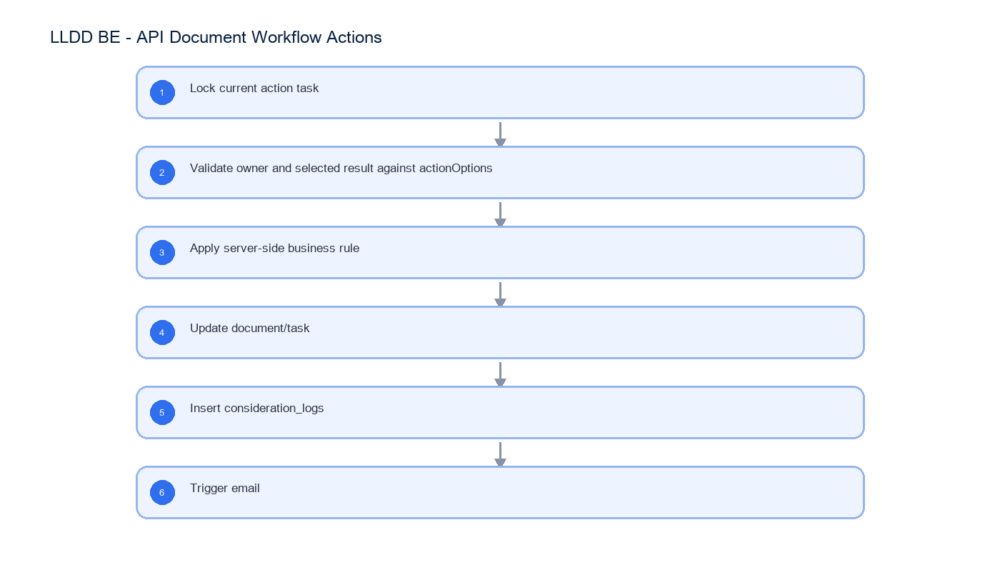

# LLDD BE - API Document Workflow Actions

SBP Mall - ระบบประกันรายได้ | Low Level Design Document

## 1. Overview

| รายการ | รายละเอียด |
| --- | --- |
| Track | BE |
| Estimate | 24 ชั่วโมง |
| Owner | Butsaba <But> Podamrong |
| Objective | ออกแบบ APIs สำหรับรับผลพิจารณา ตรวจสิทธิ์ action และบันทึก audit/consideration log |

Common contract reference: ทุกหัวข้อ API/FE ต้องยึด LLDD-BE-API-Common-Contracts และ LLDD-FE-Integration-Contracts สำหรับ error/auth/format/pagination/action/RBAC ก่อนลงรายละเอียดเฉพาะหน้าหรือเฉพาะ endpoint

## 2. Screen / Functional Scope

- Submit action
- Action owner guard
- Amount threshold reference
- Send back result
- Audit and email rule

## 4. Implementation Flow Diagram (Reference)



_รูปที่ 1: Implementation flow reference: LLDD BE - API Document Workflow Actions_

## 5. Field, Format, and Validation

| Field / UI | Format | Validation | Behavior |
| --- | --- | --- | --- |
| docNo | YYYY/xxxxx | required | path param |
| result | verbatim from actionOptions | required | ต้องเป็นค่าที่ API detail ส่งมาให้ผู้ใช้ในเอกสารนั้น |
| comment | text | required for return/reject | trim ก่อนบันทึก |

### 5.1 Canonical Workflow Transition Matrix

BE ต้องคำนวณ transition จาก currentSection, result และ totalCompensationAmount ภายใน transaction; FE ส่งเพียง result/comment และห้ามส่ง nextSection เอง

| Current | Result / condition | statusCode | nextSection | Task effect |
| --- | --- | --- | --- | --- |
| 06 | ส่งเจ้าหน้าที่ SBP DSA ดำเนินการ | 08 | 08 | close 06; open 08 |
| 08 | คำนวณเงินชดเชยเรียบร้อย | 01 | 01 | close 08; open 01 |
| 01 | เห็นควรชดเชย | 02 | 02 | close 01; open 02 |
| 02 | เห็นควรชดเชย และ totalCompensationAmount > 100000 | 03 | 03 | close 02; open 03 |
| 02 | เห็นควรชดเชย และ totalCompensationAmount <= 100000 | 99 | null | close 02; complete instance |
| 03 | เห็นควรชดเชย | 99 | null | close 03; complete instance |
| ทุก section ที่รองรับ | ส่งกลับ | รหัส section ปลายทางตาม action option | section ปลายทาง | close current; reopen target with new task id |
| 06 | เห็นควรไม่ชดเชย หรือ หยุดชดเชยประกันรายได้ | 99 | null | close 06; complete instance |

### 5.2 Action Response Type

| Field | Type | Required | Rule |
| --- | --- | --- | --- |
| statusCode | enum 06\|08\|01\|02\|03\|99 | Yes | ค่าหลัง commit; 99 = เสร็จสิ้น |
| nextSection | enum 06\|08\|01\|02\|03 \| null | Yes | null เมื่อ workflow จบ |
| message | string | Yes | ข้อความผล mutation สำหรับแสดงผู้ใช้ |

## 5.1 Input / Progress / Output Contract

| Stage | Contract for implementation |
| --- | --- |
| Input | POST /api/v1/documents/{docNo}/actions; GET /api/v1/documents/{docNo}/timeline |
| Progress | Lock current action task; Validate owner and selected result against actionOptions; Apply server-side business rule; Update document/task |
| Output | workflow_tasks; compensation_documents; consideration_logs |

### 5.90 Endpoint Implementation Contract

| Endpoint | Use-case owner | Service/repository behavior | Definition of done |
| --- | --- | --- | --- |
| POST /api/v1/documents/{docNo}/actions | Document action API ตัวอย่างเมื่อ currentSection=01 จึงเปลี่ยนไป 02 | Lock current action task | non-owner returns 403 |
| GET /api/v1/documents/{docNo}/timeline | Timeline API | Validate owner and selected result against actionOptions | missing result returns exact SRS message |

### 5.91 Backend Execution Sequence

| Step | Behavior specific to this LLDD | Failure/test evidence |
| --- | --- | --- |
| 1 | Lock current action task | submit compensate |
| 2 | Validate owner and selected result against actionOptions | submit not compensate |
| 3 | Apply server-side business rule | send back |
| 4 | Update document/task | invalid result |
| 5 | Insert consideration_logs | duplicate action |
| 6 | Trigger email | submit compensate |

## 6. Button / User Action Mapping

| Action | Trigger | API / Service | Expected Result |
| --- | --- | --- | --- |
| Submit action | POST | documentAction.service.submit | submit result and update status |
| Write audit | transaction | considerationLog.repository.insert | record action history |
| Send email | async | notification.service.sendByStatusRule | notify next owner |

## 7. API Contract

### POST /api/v1/documents/{docNo}/actions

Document action API ตัวอย่างเมื่อ currentSection=01 จึงเปลี่ยนไป 02

#### Request

```json
{
  "result": "เห็นควรชดเชย",
  "comment": "เห็นควรชดเชยตามหลักเกณฑ์"
}
```

#### Request Field Schema

| Field | Type | Required | Constraint / Meaning |
| --- | --- | --- | --- |
| result | string | Yes | UTF-8; use value domain described by endpoint purpose |
| comment | string | Yes | trimmed UTF-8 Thai text; required by operation/business rule |

#### Response

```json
{
  "statusCode": "02",
  "nextSection": "02",
  "message": "submitted"
}
```

#### Response Field Schema

| Field | Type | Required | Constraint / Meaning |
| --- | --- | --- | --- |
| statusCode | string | Yes | canonical code; do not replace with display label |
| nextSection | string | Yes | canonical code; do not replace with display label |
| message | string | Yes | UTF-8; use value domain described by endpoint purpose |

### GET /api/v1/documents/{docNo}/timeline

Timeline API

#### Query Params

```json
{
  "docNo": "2569/00123"
}
```

#### Request Field Schema

| Field | Type | Required | Constraint / Meaning |
| --- | --- | --- | --- |
| docNo | string | No | พ.ศ. YYYY/xxxxx |

#### Response

```json
{
  "items": [
    {
      "section": "06",
      "result": "ชดเชย"
    }
  ]
}
```

#### Response Field Schema

| Field | Type | Required | Constraint / Meaning |
| --- | --- | --- | --- |
| items | array<object> | Yes | JSON array; element type shown in Type column |
| items[].section | string | Yes | UTF-8; use value domain described by endpoint purpose |
| items[].result | string | Yes | UTF-8; use value domain described by endpoint purpose |

## 8. Reference DB Mapping (No Database Page Work)

ส่วนนี้เป็นข้อมูลอ้างอิงสำหรับการ implement API/Job เท่านั้น ไม่ใช่งานสร้างหน้า Database, ไม่ใช่งานออกแบบ DB page และไม่ถูกนับเป็น deliverable แยกของ FE/BE

| Table / Object | R/W | Usage |
| --- | --- | --- |
| workflow_tasks | R/W | lock/close/open task ตาม transition |
| compensation_documents | W | อัปเดต status/current_section/result |
| consideration_logs | W | บันทึกผลพิจารณาและ comment |
| status_email_rules | R | ผู้รับอีเมลตาม status |
| workflow_tasks current-open lock | R/W | กัน action ซ้ำด้วย lock task ปัจจุบัน + closed_at |

## 9. Processing Flow

| Step | Description |
| --- | --- |
| 1 | Lock current action task |
| 2 | Validate owner and selected result against actionOptions |
| 3 | Apply server-side business rule |
| 4 | Update document/task |
| 5 | Insert consideration_logs |
| 6 | Trigger email |

## 10. Acceptance Criteria

- non-owner returns 403
- missing result returns exact SRS message
- invalid result for this role profile returns 422
- duplicate submit blocked by current open task lock
- audit written in same transaction

## 11. Developer Test Checklist

| No | Test |
| --- | --- |
| 1 | submit compensate |
| 2 | submit not compensate |
| 3 | send back |
| 4 | invalid result |
| 5 | duplicate action |
