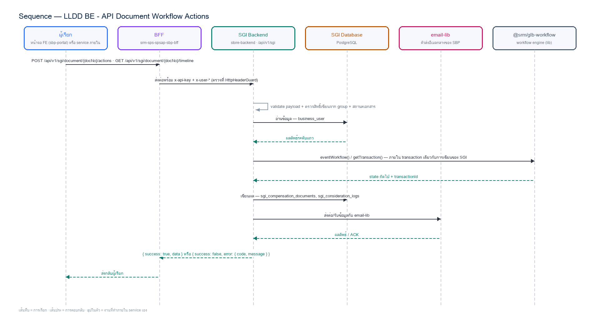

# LLDD BE - API Document Workflow Actions

SBP Mall - ระบบประกันรายได้ | Low Level Design Document

## 1. Overview

| รายการ | รายละเอียด |
| --- | --- |
| Track | BE |
| Estimate | **37 ชั่วโมง** = implementation 28 + unit test 9 (30%) |
| Owner | Tunyatorn <Vava> Kiatkongphongsa |
| Target repository | `SBP/srm-sps-spsap-store-backend` (NestJS + TypeORM · schema `sps_store`) + `SBP/srm-sps-spsap-sbp-bff` (forward ผ่าน client service · ไม่มี DB) สำหรับเส้นที่ FE เรียก |
| Objective | ออกแบบ APIs สำหรับรับผลพิจารณา ตรวจสิทธิ์ action และบันทึก audit/consideration log |

Common contract reference: ทุกหัวข้อ API/FE ต้องยึด LLDD-BE-API-Common-Contracts และ LLDD-FE-Integration-Contracts สำหรับ error/auth/format/pagination/action/RBAC ก่อนลงรายละเอียดเฉพาะหน้าหรือเฉพาะ endpoint

### 1.1 เอกสาร LLDD ที่เกี่ยวข้อง

ตารางนี้สร้างจาก endpoint และตารางที่เอกสารฉบับนี้ประกาศไว้จริง — อ่านฉบับที่อยู่ในตารางก่อนลงมือ เพื่อไม่ให้สัญญา request/response หรือชื่อคอลัมน์หลุดจากกัน

| ความสัมพันธ์ | เอกสาร LLDD | เกี่ยวข้องตรงไหน |
| --- | --- | --- |
| ใช้ endpoint ของ | **LLDD-BE-API-Attachment-Sales-Timeline** | `GET /api/v1/sgi/document/{docNo}/timeline` |
| ถูกเรียกจาก | **LLDD-BE-API-Attachment-Sales-Timeline** | `GET /api/v1/sgi/document/{docNo}/timeline` |
| ถูกเรียกจาก | **LLDD-FE-Document-Detail** | `POST /api/v1/sgi/document/{docNo}/actions` |
| ถูกเรียกจาก | **LLDD-FE-Document-Detail-Role-01-Business-Promotion** | `POST /api/v1/sgi/document/{docNo}/actions` |
| ถูกเรียกจาก | **LLDD-FE-Document-Detail-Role-02-GM-Business-Promotion** | `POST /api/v1/sgi/document/{docNo}/actions` |
| ถูกเรียกจาก | **LLDD-FE-Document-Detail-Role-03-AVP-SBP** | `POST /api/v1/sgi/document/{docNo}/actions` |
| ถูกเรียกจาก | **LLDD-FE-Document-Detail-Role-06-SBP-DSA** | `POST /api/v1/sgi/document/{docNo}/actions` |
| ถูกเรียกจาก | **LLDD-FE-Document-Detail-Role-08-SBP-DSA-Officer** | `POST /api/v1/sgi/document/{docNo}/actions` |
| ถูกเรียกจาก | **LLDD-FE-Integration-Contracts** | `POST /api/v1/sgi/document/{docNo}/actions` |
| สัญญากลาง | **LLDD-BE-API-Common-Contracts** | envelope `{success,data}` · error code · pagination · รูปแบบวันที่/เลขเอกสาร |
| โครงสร้างข้อมูล | **LLDD-BE-Database-Structure** | DDL ของตารางที่หัวข้อ Reference DB Mapping อ้างถึง |
| workflow engine | **LLDD-BE-Workflow-Engine-Definition** | นิยาม state/route/event ที่หัวข้อ Workflow Trigger Event Contract เรียกใช้ |
| แพลตฟอร์มระบบเดิม | **LLDD-BE-Integration-SBP-Platform** | header จาก BFF (`x-api-key` / `x-user-*`) · การ reuse ตารางและ service ของระบบ SBP เดิม |
| ต้องจบก่อน (ลำดับงาน) | **LLDD-BE-API-Common-Contracts** | เป็นฉบับต้นทางของสัญญา/โครงที่ฉบับนี้อ้าง |
| ต้องจบก่อน (ลำดับงาน) | **LLDD-BE-Database-Structure** | เป็นฉบับต้นทางของสัญญา/โครงที่ฉบับนี้อ้าง |

## 2. Screen / Functional Scope

- Submit action
- Action owner guard
- Amount threshold reference
- Send back result
- Audit and email rule

## 3. Screenshot Reference

ไม่มีภาพหน้าจอสำหรับหัวข้อนี้ — เป็นเอกสารฝั่ง Backend/Batch ที่ไม่มี UI (ภาพหน้าจอทั้งหมดอยู่ในเอกสารชุด FE)

## 4. Implementation Flow & Sequence Diagram (Reference)

### 4.1 Implementation Flow (ลำดับขั้นการทำงาน)


_รูปที่ 1: Implementation flow reference: LLDD BE - API Document Workflow Actions_

### 4.2 Sequence Diagram (ใครคุยกับใคร ลำดับไหน)

ผู้แสดงและลำดับข้อความในภาพนี้สร้างจาก endpoint ในหัวข้อ 7 และตารางในหัวข้อ Reference DB Mapping ของเอกสารฉบับนี้เอง จึงตรงกับสัญญาเสมอ



_รูปที่ 2: Sequence diagram: LLDD BE - API Document Workflow Actions_

## 5. Field, Format, and Validation

| Field / UI | Format | Validation | Behavior |
| --- | --- | --- | --- |
| docNo | YYYY/xxxxx | required | path param |
| result | verbatim from actionOptions | required | ต้องเป็นค่าที่ API detail ส่งมาให้ผู้ใช้ในเอกสารนั้น |
| comment | text | required for return/reject | trim ก่อนบันทึก |

### 5.1 Canonical Workflow Transition Matrix

BE ต้องคำนวณ transition จาก currentSection, result และ totalCompensationAmount ภายใน transaction; FE ส่งเพียง result/comment และห้ามส่ง nextSection เอง

| Current | Result / condition | statusCode | nextSection | Task effect |
| --- | --- | --- | --- | --- |
| 06 | ส่งเจ้าหน้าที่ SBP DSA ดำเนินการ (เส้นทางปกติ — ให้คำนวณยอดก่อน) | 08 | 08 | close 06; open 08 |
| 06 | ส่งหน่วยงานส่งเสริมธุรกิจ SBP (SDD GI · **เส้นทางข้ามขั้น 08**) | 01 | 01 | close 06; open 01 |
| 06 | เห็นควรไม่ชดเชย หรือ หยุดชดเชยประกันรายได้ | 99 | null | close 06; complete instance |
| 08 | คำนวณเงินชดเชยเรียบร้อย (**ปุ่มเดียวของขั้น 08** · มติ 2026-09-01 — ส่งยอดกลับให้ 06 ตัดสินใจส่งต่อ) | 06 | 06 | close 08; reopen 06 |
| 01 | เห็นควรชดเชย | 02 | 02 | close 01; open 02 |
| 01 | เห็นควรไม่ชดเชย (SDD GI — **จบ flow ทันที** ไม่ตีกลับให้ 06) | 99 | null | close 01; complete instance |
| 02 | เห็นควรชดเชย และ totalCompensationAmount >= 100,000 (มติ 2026-08-18) | 03 | 03 | close 02; open 03 |
| 02 | เห็นควรชดเชย และ totalCompensationAmount < 100,000 (มติ 2026-08-18) | 99 | null | close 02; complete instance |
| 02 | เห็นควรไม่ชดเชย (SDD GI — **จบ flow ทันที** ไม่ตีกลับเป็นทอด ๆ) | 99 | null | close 02; complete instance |
| 03 | เห็นควรชดเชย | 99 | null | close 03; complete instance |
| 03 | เห็นควรไม่ชดเชย | 06 | 06 | close 03; reopen 06 |
| ทุก section ที่รองรับ | ส่งกลับฝ่าย SBP DSA | **06 เสมอ** (มติ 2026-09-01 — เดิม 02→01 · 03→02 · ขั้น 08 ตัดปุ่มส่งกลับทิ้งเพราะปุ่มเดียวที่เหลือก็กลับ 06 อยู่แล้ว) | 06 | close current; reopen 06 with new task id |

### 5.1b Auto-assign เจ้าของงานคนเดิม (SDD สไลด์ 46 · 48 · 64)

สองปุ่มที่จบเอกสารเหมือนกันแต่พฤติกรรมหน้ารายการตรงข้ามกัน — BE ต้อง implement แยกกันให้ชัด ห้ามรวมเป็นเส้นเดียว

| ปุ่มที่กดที่ขั้น 06 | เดือนที่กด | เดือนถัดไป | ผู้ดำเนินการ (เจ้าของงาน) |
| --- | --- | --- | --- |
| เห็นควรไม่ชดเชยรายได้ | ปิดเอกสาร (99) และ GET /sgi/document/tasks ของ 06 ต้อง **ไม่คืน** เอกสารนี้ในเดือนนั้น | ระบบตั้งงานรอบเดือนถัดไปของร้านเดิมอัตโนมัติ | **คนเดิม** ที่พิจารณาเอกสารรอบก่อนในขั้นเดียวกัน |
| หยุดชดเชยประกันรายได้ | ปิดเอกสาร (99) แต่ GET /sgi/document/tasks ของ 06 **ต้องคืนทันที** พร้อม stoppedReopenable=true | ไม่มีการตั้งงานอัตโนมัติ | ฝ่าย SBP DSA (06) |
| เคสต่อเนื่อง (ไม่ใช่ปุ่ม — เงื่อนไขของงานรอบถัดไป) | ระบบสร้างงานให้เอง ไม่ต้องแจกงานด้วยมือ | เหมือนกันทุกเดือนที่ยังต่อเนื่อง | **คนเดิม** — เจ้าหน้าที่ SBP DSA รอบก่อนหน้า |

**วิธี resolve เจ้าของงานคนเดิม** — ไม่มีคอลัมน์ assignee ในตารางของ SGI (ตาราง workflow_tasks ถูกตัดออกจากโครง 20 ตารางแล้ว) ผู้รับผิดชอบเป็นข้อมูลของ engine

| ขั้น | การทำงาน |
| --- | --- |
| 1 | หาเอกสารรอบก่อนหน้าของร้านเดียวกัน (impacted_store_code เดิม · round_no/loop_no ก่อนหน้า) |
| 2 | อ่าน sgi_consideration_logs แถวล่าสุดของเอกสารนั้นที่ section_code = ขั้นที่จะมอบหมาย -> consider_by (คอลัมน์ผู้ดำเนินการ · อ้าง business_user ของระบบเดิม) |
| 3 | ผูกเป็นผู้รับผิดชอบผ่าน addPreApprover(versionId, referenceId, stateId, approver, seq) ของ @srm/glb-workflow |
| 4 | Fallback: รอบก่อนไม่เคยผ่านขั้นนั้น หรือพนักงานไม่อยู่ในกลุ่มแล้ว -> มอบหมายตาม group ของ auth-backend ตามปกติ |
| 5 | พนักงานลาออกยังต้องเปิด SR เพื่อแก้ชื่อผู้ดำเนินการ (ข้อจำกัดที่ SDD สไลด์ 48 ระบุ ไม่แก้ในเฟสนี้) |

```sql
-- resolve เจ้าของงานคนเดิมของขั้น :sectionCode จากเอกสารรอบก่อนของร้านเดียวกัน
SELECT cl.consider_by
FROM sgi_compensation_documents d
JOIN sgi_consideration_logs cl ON cl.doc_no = d.doc_no
WHERE d.impacted_store_code = :impactedStoreCode
  AND d.doc_no <> :currentDocNo
  AND cl.section_code = :sectionCode
ORDER BY d.round_no DESC, d.loop_no DESC, cl.action_datetime DESC
LIMIT 1;
-- ได้ค่าแล้วส่งเข้า addPreApprover(...) ตอนเปิดงานรอบใหม่ ห้าม INSERT sps_store.workflow_approver เอง
-- NULL -> fallback group ของ auth-backend
```

### 5.2 Action Response Type

| Field | Type | Required | Rule |
| --- | --- | --- | --- |
| statusCode | enum 06\|08\|01\|02\|03\|99 | Yes | ค่าหลัง commit; 99 = เสร็จสิ้น |
| nextSection | enum 06\|08\|01\|02\|03 \| null | Yes | null เมื่อ workflow จบ |
| message | string | Yes | ข้อความผล mutation สำหรับแสดงผู้ใช้ |

### 5.3 ข้อกำหนดที่ต้องยึดสำหรับ endpoint ของเอกสารนี้

ตารางนี้คือ**ข้อกำหนดที่ต้องทำตาม** ไม่ใช่ทางเลือก — ทุกข้อสอดคล้องกับ `database.md` / `workflow.md` / `api.md` ซึ่งเป็นแหล่งความจริงของระบบ

| เรื่อง | ข้อกำหนดที่ต้องทำตาม | ที่มา / เหตุผล |
| --- | --- | --- |
| แหล่งข้อมูลของ `GET /sgi/document/{docNo}/timeline` | อ่าน **`sgi_consideration_logs` ของ SGI** เป็น timeline เต็ม (ผูก `transaction_id` ของ engine) — ไม่เรียก `getHistory()` ของ engine | engine ไม่มีรหัสผลพิจารณาและไฟล์แนบใน history (ปิด 2026-08-24) |
| `referenceId` ที่ส่งเข้า engine | ส่ง **`sgi_compensation_documents.id`** (surrogate) เป็น string | `reference_id` เป็น varchar(255) · ระบบเดิมส่ง surrogate id ทุกจุด (ปิด 2026-08-17) |
| ตาราง `sps_store.workflow_transaction` | **ห้ามแก้ schema ของ library** — กันซ้ำระดับ application และประเมินต้นทุน query ก่อนเปิดใช้ทุกเส้นที่อ้างตารางนี้ | 19,283 แถวโดยไม่มี PK/index (ตรวจฐานจริง 2026-08-07) ทุก action จึงเป็น seq-scan |
| อีเมลหลังเปลี่ยนสถานะ | SGI เรียก `sendEmail()` ของ email-lib เอง โดยใช้ `emailId` จาก `workflow_route.email_id` ของ route ที่เพิ่งเดิน | `triggerEvent` ของ engine ไม่มี `mailTo`/`mailCc`/`param` (ปิด 2026-08-14) |

### 5.9 Input / Progress / Output Contract

| Stage | Contract for implementation |
| --- | --- |
| Input | POST /api/v1/sgi/document/{docNo}/actions; GET /api/v1/sgi/document/{docNo}/timeline |
| Progress | Lock current action task; Validate owner and selected result against actionOptions; Apply server-side business rule; Update document/task |
| Output | sgi_compensation_documents; sgi_consideration_logs |

### 5.90 Endpoint Implementation Contract

| Endpoint | Use-case owner | Service/repository behavior | Definition of done |
| --- | --- | --- | --- |
| POST /api/v1/sgi/document/{docNo}/actions | Document action API ตัวอย่างเมื่อ currentSection=01 จึงเปลี่ยนไป 02 | Lock current action task | non-owner returns 403 |
| GET /api/v1/sgi/document/{docNo}/timeline | **อ้างอิงเท่านั้น — เจ้าของ endpoint นี้คือ LLDD-BE-API-Attachment-Sales-Timeline (Peerakorn)** · เอกสารนี้อ้างเพราะ action ที่ส่งผลพิจารณาเป็นตัวเขียน sgi_consideration_logs ที่ timeline อ่าน | Validate owner and selected result against actionOptions | missing result returns exact SRS message |

### 5.91 Backend Execution Sequence

| Step | Behavior specific to this LLDD | Failure/test evidence |
| --- | --- | --- |
| 1 | Lock current action task | submit compensate |
| 2 | Validate owner and selected result against actionOptions | submit not compensate |
| 3 | Apply server-side business rule | send back |
| 4 | Update document/task | invalid result |
| 5 | Insert sgi_consideration_logs | duplicate action |
| 6 | Trigger email | — (ยังไม่มี test เฉพาะขั้นนี้ · ครอบด้วย test รวมของเอกสารในหัวข้อ 11) |

### 5.92 Workflow Trigger Event Contract

งานชิ้นนี้ **ต้องเรียก workflow engine** ตามตารางด้านล่าง · ชื่อ function ยึด API 8 ตัวของ `@srm/glb-workflow` ตามชีต `Detail` ของ `SBP/TSM-SRM-LLDD-SBP-workflow-1.2.md` — รายละเอียด signature และตารางที่ engine เขียน ดู **LLDD-BE-Workflow-Engine-Definition** หัวข้อ 5.3

| จุดที่เรียก (call site) | Engine function | พารามิเตอร์หลัก | กติกา / transaction boundary |
| --- | --- | --- | --- |
| ก่อนแสดงปุ่ม / ก่อนรับ action | `getPermissionEvents` | versionId, referenceId, userData | ถ้า event ที่ส่งมาไม่อยู่ใน event[] ที่คืนมา ต้องตอบ 403 ห้ามเรียก eventWorkflow ต่อ |
| กันกดซ้ำ / กันงานถูกคนอื่นเดินไปแล้ว | `getTransaction` | versionId, referenceId | เทียบ state ปัจจุบันกับ state ที่ FE ส่งมา ไม่ตรงตอบ 409 (optimistic guard) |
| กดผลพิจารณา (trigger event) | `eventWorkflow` | versionId, referenceId, userId, event, eventParam (amount สำหรับ route 100,000) | 🔴 หัวใจของเอกสารนี้ — เขียน sgi_consideration_logs + แนบไฟล์ + เรียก eventWorkflow ใน transaction เดียว; engine fail ต้อง rollback ฝั่ง SGI ทั้งหมด |
| ผูกผู้รับผิดชอบขั้นถัดไป | `addPreApprover` | versionId, referenceId, stateId, approver, seq | ใช้เมื่อ route ระบุตัวบุคคล (เช่น ตีกลับหาเจ้าของงานคนเดิม) — เรียกหลัง eventWorkflow สำเร็จ ใน transaction เดียวกัน |

- 🔴 กติกาเหล็ก: ตาราง `sps_store.workflow_*` (13 ตาราง) เป็นของ lib — SGI **R เท่านั้น** ห้าม INSERT/UPDATE/DELETE ตรงในทุกกรณี
- ทุกการเรียก engine ต้องผ่านตัวห่อกลาง `WorkflowGateway` ที่นิยามใน **LLDD-BE-API-Common-Contracts** (timeout · retry · map error เข้า envelope) ห้าม import lib ตรงจาก service
- unit test ต้อง mock engine และครอบอย่างน้อย: เรียกสำเร็จ · engine โยน error แล้ว rollback ฝั่ง SGI ครบ · เรียกซ้ำด้วย referenceId เดิมไม่เกิดผลซ้ำ

## 6. Button / User Action Mapping

| Action | Trigger | API / Service | Expected Result |
| --- | --- | --- | --- |
| Submit action | POST | documentAction.service.submit | submit result and update status |
| Write audit | transaction | considerationLog.repository.insert | record action history |
| Send email | async | notification.service.sendByStatusRule | notify next owner |

## 7. API Contract

### POST /api/v1/sgi/document/{docNo}/actions

Document action API ตัวอย่างเมื่อ currentSection=01 จึงเปลี่ยนไป 02

#### Request

```json
{
  "result": "เห็นควรชดเชย",
  "comment": "เห็นควรชดเชยตามหลักเกณฑ์"
}
```

#### Request Field Schema

| Field | Type | Required | Constraint / Meaning |
| --- | --- | --- | --- |
| result | string | Yes | UTF-8; use value domain described by endpoint purpose |
| comment | string | Yes | trimmed UTF-8 Thai text; required by operation/business rule |

#### Response

```json
{
  "statusCode": "02",
  "nextSection": "02",
  "message": "submitted"
}
```

#### Response Field Schema

| Field | Type | Required | Constraint / Meaning |
| --- | --- | --- | --- |
| statusCode | string | Yes | canonical code; do not replace with display label |
| nextSection | string | Yes | canonical code; do not replace with display label |
| message | string | Yes | UTF-8; use value domain described by endpoint purpose |

### GET /api/v1/sgi/document/{docNo}/timeline

**อ้างอิงเท่านั้น — เจ้าของ endpoint นี้คือ LLDD-BE-API-Attachment-Sales-Timeline (Peerakorn)** · เอกสารนี้อ้างเพราะ action ที่ส่งผลพิจารณาเป็นตัวเขียน sgi_consideration_logs ที่ timeline อ่าน

#### Query Params

```json
{
  "docNo": "2026/00123"
}
```

#### Request Field Schema

| Field | Type | Required | Constraint / Meaning |
| --- | --- | --- | --- |
| docNo | string | No | ค.ศ. YYYY/xxxxx |

#### Response

```json
{
  "items": [
    {
      "section": "06",
      "result": "ชดเชย"
    }
  ]
}
```

#### Response Field Schema

| Field | Type | Required | Constraint / Meaning |
| --- | --- | --- | --- |
| items | array<object> | Yes | JSON array; element type shown in Type column |
| items[].section | string | Yes | UTF-8; use value domain described by endpoint purpose |
| items[].result | string | Yes | UTF-8; use value domain described by endpoint purpose |

## 8. Reference DB Mapping (No Database Page Work)

ส่วนนี้เป็นข้อมูลอ้างอิงสำหรับการ implement API/Job เท่านั้น ไม่ใช่งานสร้างหน้า Database, ไม่ใช่งานออกแบบ DB page และไม่ถูกนับเป็น deliverable แยกของ FE/BE

| Table / Object | R/W | Usage |
| --- | --- | --- |
| workflow_transaction / workflow_history / workflow_approver (@srm/glb-workflow) | R (เขียนผ่าน lib) | eventWorkflow() เดิน state + บันทึก history |
| sgi_compensation_documents | W | อัปเดต status/current_section/result |
| sgi_consideration_logs | W | บันทึกผลพิจารณาและ comment |
| workflow_transaction (@srm/glb-workflow) | R (เขียนผ่าน lib) | กัน action ซ้ำด้วย getTransaction/getPermissionEvents ก่อน eventWorkflow — ห้าม UPDATE ตรง |

## 9. Skeleton Code (store-backend + BFF)

โครงโค้ดตั้งต้นของเอกสารฉบับนี้ ยึด convention จริงของ `srm-sps-spsap-store-backend` (NestJS 11 + TypeORM, schema `sps_store`, custom provider `DATA_SOURCE` ที่ route SELECT ไป slave pool) และ `srm-sps-spsap-sbp-bff` (ไม่มี DB, forward ผ่าน client service). ทุกจุดที่ต้องเติมกำกับด้วย `// TODO:` และ response ทุกเส้นถูกห่อเป็น `{success, data}` โดย ResponseInterceptor อยู่แล้ว จึงห้าม service ห่อซ้ำ

#### 9.1 ผังไฟล์ที่ต้องสร้าง

| Path | หน้าที่ |
| --- | --- |
| store-backend · src/modules/sgi-document-workflow-actions/sgi-document-workflow-actions.controller.ts | route ทั้งหมดของเอกสารนี้ (2 เส้น) + `@UseGuards(HttpHeaderGuard)` + `@UserId()` |
| store-backend · src/modules/sgi-document-workflow-actions/sgi-document-workflow-actions.service.ts | business logic — inject `'DATA_SOURCE'` แล้วยิง raw SQL, mutation ใช้ QueryRunner transaction |
| store-backend · src/modules/sgi-document-workflow-actions/sgi-document-workflow-actions.sql.ts | เก็บ SQL ต่อ endpoint (คัดจากหัวข้อ 10) แยกออกจาก service ให้ทดสอบ/รีวิวง่าย |
| store-backend · src/modules/sgi-document-workflow-actions/dto/sgi-document-workflow-actions.dto.ts | DTO + class-validator ตาม validation ในหัวข้อฟิลด์ของเอกสารนี้ |
| store-backend · src/modules/sgi-document-workflow-actions/sgi-document-workflow-actions.module.ts | ประกอบ controller/service/providers แล้ว register ที่ `app.module.ts` |
| store-backend · src/entitys/sgi-compensation-documents.entity.ts | entity ของ `sgi_compensation_documents` (`@Entity({schema: process.env.DB_SCHEMA})`, ไม่ประกาศ relation) — **entity ร่วมหลายเอกสาร: ประกาศครั้งเดียวแล้วอ้างอิง อย่าสร้างซ้ำ** |
| store-backend · src/entitys/sgi-consideration-logs.entity.ts | entity ของ `sgi_consideration_logs` (`@Entity({schema: process.env.DB_SCHEMA})`, ไม่ประกาศ relation) — **entity ร่วมหลายเอกสาร: ประกาศครั้งเดียวแล้วอ้างอิง อย่าสร้างซ้ำ** |
| store-backend · src/providers/sgi/sgi.ts | repository provider แบบ factory ผูก token string กับ `DATA_SOURCE` — **ไฟล์ร่วมของทุกเอกสาร BE ให้ merge array เพิ่ม ห้ามเขียนทับ** |
| store-backend · sql/deploy-sgi-document-workflow-actions.sql | DDL production แบบ idempotent (ทีมนี้ไม่ใช้ migration เป็นหลัก) |
| BFF · src/common/client-services/sgi-client.service.ts | client ต่อจาก `BaseClientService` ตั้ง baseUrl + `x-api-key` ตอน `onModuleInit` |
| BFF · src/modules/sgi-document-workflow-actions/sgi-document-workflow-actions.controller.ts | route ฝั่ง BFF prefix `/bff/sgi/…` + `@UseGuards(AuthGuard('jwt'))` |
| BFF · src/modules/sgi-document-workflow-actions/sgi-document-workflow-actions.service.ts | แนบ `x-user-id` / `x-user-group-id` / `x-user-permissions` แล้ว forward ไป backend |

#### 9.2 Controller (store-backend)

```ts
// src/modules/sgi-document-workflow-actions/sgi-document-workflow-actions.controller.ts
import { Body, Controller, Get, Param, Post, UseGuards } from '@nestjs/common';
import { HttpHeaderGuard } from '../../guards/http-header.guard';
import { UserId } from '../../common/decorators/user-id.decorator';
import { SgiDocumentWorkflowActionsService } from './sgi-document-workflow-actions.service';
import { SubmitActionBodyDto } from './dto/sgi-document-workflow-actions.dto';

// LLDD BE - API Document Workflow Actions
// BFF เรียกด้วย x-api-key และแนบ x-user-id / x-user-group-id / x-user-permissions มาให้
@Controller('sgi/sgi/document')
@UseGuards(HttpHeaderGuard)
export class SgiDocumentWorkflowActionsController {
  constructor(private readonly service: SgiDocumentWorkflowActionsService) {}

  // POST /api/v1/sgi/document/{docNo}/actions — Document action API ตัวอย่างเมื่อ currentSection=01 จึงเปลี่ยนไป 02
  @Post('document/:docNo/actions')
  submitAction(
    @Param('docNo') docNo: string,
    @Body() body: SubmitActionBodyDto,
    @UserId() userId: string,
  ) {
    // TODO: ตรวจ x-user-permissions ก่อนเรียก service ถ้า endpoint นี้จำกัดสิทธิ์เมนู
    return this.service.submitAction(docNo, body, userId);
  }

  // GET /api/v1/sgi/document/{docNo}/timeline — **อ้างอิงเท่านั้น — เจ้าของ endpoint นี้คือ LLDD-BE-API-Attachment-Sa…
  @Get('document/:docNo/timeline')
  getTimeline(@Param('docNo') docNo: string, @UserId() userId: string) {
    // TODO: ตรวจ x-user-permissions ก่อนเรียก service ถ้า endpoint นี้จำกัดสิทธิ์เมนู
    return this.service.getTimeline(docNo, userId);
  }
}
```

#### 9.3 DTO + Validation

```ts
// src/modules/sgi-document-workflow-actions/dto/sgi-document-workflow-actions.dto.ts
import { Type } from 'class-transformer';
import {
  IsArray, IsBoolean, IsIn, IsInt, IsNotEmpty, IsNumber, IsObject, IsOptional,
  IsString, Matches, Max, MaxLength, Min,
} from 'class-validator';

// ValidationPipe ระดับ global ตั้ง whitelist + forbidNonWhitelisted + transform ไว้แล้ว (main.ts)
// property ที่ไม่ประกาศที่นี่จะถูก reject เป็น 400 อัตโนมัติ

// body ของ POST /api/v1/sgi/document/{docNo}/actions
export class SubmitActionBodyDto {
  /** ต้องเป็นค่าที่ API detail ส่งมาให้ผู้ใช้ในเอกสารนั้น */
  @IsNotEmpty()
  @IsString()
  result: string;

  /** trim ก่อนบันทึก */
  @IsNotEmpty()
  @IsString()
  comment: string;
}
```

#### 9.4 Service (inject `DATA_SOURCE` + raw SQL)

service ประกาศ method ครบทุกเส้นที่ controller เรียก และ **signature มาจากแหล่งเดียวกับ controller** (จำนวน/ลำดับพารามิเตอร์จึงตรงกันเสมอ) — เส้นที่ยังไม่ได้ implement เป็น stub ที่ `throw new NotImplementedException(...)` ให้ TypeScript compile ผ่านตั้งแต่วันแรก

```ts
// src/modules/sgi-document-workflow-actions/sgi-document-workflow-actions.service.ts
import { Inject, Injectable, Logger, NotFoundException, NotImplementedException } from '@nestjs/common';
import { DataSource } from 'typeorm';
import { WorkflowService } from '../workflow/workflow.service';
import { SGI_SQL } from './sgi-document-workflow-actions.sql';

@Injectable()
export class SgiDocumentWorkflowActionsService {
  private readonly logger = new Logger(SgiDocumentWorkflowActionsService.name);
  // versionId ของ workflow ประกันรายได้ (ตั้งใน env เหมือน COOPERATION_WORKFLOW_VERSION_ID)
  private readonly versionId = Number(process.env.SGI_WORKFLOW_VERSION_ID);

  constructor(
    // DATA_SOURCE override query(): SELECT/WITH ไป slave pool, write ไป master
    @Inject('DATA_SOURCE') private readonly dataSource: DataSource,
    private readonly workflow: WorkflowService,
  ) {}

  // POST /api/v1/sgi/document/{docNo}/actions — Document action API ตัวอย่างเมื่อ currentSection=01 จึงเปลี่ยนไป 02
  // mutation ต้องอยู่ใน transaction เดียว (ไม่มี audit ของ master แล้ว · 2026-08-07)
  async submitAction(docNo: string, body: SubmitActionBodyDto, userId: string) {
    const runner = this.dataSource.createQueryRunner();
    await runner.connect();
    await runner.startTransaction();
    try {
      // TODO: lock แถวเป้าหมายของ sgi_compensation_documents ด้วย SELECT ... FOR UPDATE ก่อนเขียน
      const [current] = await runner.query(SGI_SQL.submitActionLock, [docNo]);
      if (!current) {
        throw new NotFoundException('ไม่พบข้อมูลที่ต้องการ');
      }
      await runner.query(SGI_SQL.submitAction, [/* TODO: ผูกค่าจาก body */]);
      await runner.commitTransaction();
      // ⚠️ workflow engine อยู่คนละ DataSource ('workflow-connection' ของ @srm/glb-workflow)
      //    จึง **atomic ร่วมกับ transaction ข้างบนไม่ได้** — ต้อง commit ฝั่ง SGI ให้เสร็จก่อน
      //    แล้วค่อย eventWorkflow (idempotency key = referenceId = docNo)
      // TODO: เรียก workflow use case ตามตารางหัวข้อ Workflow ด้านล่าง + retry
      // TODO: ถ้า eventWorkflow ล้มเหลว ต้องมี compensating action และบันทึกผลลง
      //       sgi_consideration_logs เพื่อให้ job reconcile ตามเก็บได้
      return { message: 'saved' };
    } catch (error) {
      await runner.rollbackTransaction();
      this.logger.error(error);
      throw error;
    } finally {
      await runner.release();
    }
  }

  // GET /api/v1/sgi/document/{docNo}/timeline — **อ้างอิงเท่านั้น — เจ้าของ endpoint นี้คือ LLDD-BE-API-Attachment-Sa…
  async getTimeline(docNo: string, userId: string) {
    const page = 1;
    const size = 100; // endpoint นี้ไม่มี query param — ไม่แบ่งหน้า
    // SQL เต็มอยู่ในหัวข้อ Database SQL ของเอกสารนี้ (คีย์ 'GET /api/v1/sgi/document/{docNo}/timeline')
    // ⚠️ SQL ตัวอย่างบางเส้นเขียนด้วย named parameter (:size/:offset) แต่ dataSource.query()
    //    รับเฉพาะ positional $1..$n — ต้องแปลงชื่อเป็นลำดับก่อน หรือใช้ QueryBuilder แทน
    const rows = await this.dataSource.query(SGI_SQL.getTimeline, [
      // TODO: เรียงพารามิเตอร์ให้ตรงกับ $1..$n ของ SQL จริง
      userId, (page - 1) * size, size,
    ]);
    // TODO: total ต้องมาจาก COUNT(*) แยก query หรือ window function ไม่ใช่ rows.length
    return { page, size, total: rows.length, items: rows };
  }
}
```

#### 9.5 Workflow (`@srm/glb-workflow`)

✅ **ชื่อ function ของ engine — ยึด LLDD ของ lib (ยืนยันแล้ว 2026-08-14)** · API จริงคือ 8 ตัวตามชีต `Detail` ของ `SBP/TSM-SRM-LLDD SBP workflow 1.2.xlsx` (เอกสารของ lib เอง): `initializeWorkflow` · `eventWorkflow` · `getPermissionEvents` · `getHistory` · `getTransaction` · `getPendingFlowByUser` · `getWorkflowsByUser` · `addPreApprover` · ชื่อที่เคยขัดกันไม่ใช่ชื่อ API — *Trigger Event* เป็นชื่อหัวข้อขั้นตอนภายใน `eventWorkflow` และ `*UseCase` เป็น class ที่ store-backend ห่อไว้ใช้เอง (ดู `LLDD-BE-Workflow-Engine-Definition` หัวข้อ 5.3)

| Endpoint | Use case ที่ต้องเรียก | เหตุผล |
| --- | --- | --- |
| POST /api/v1/sgi/document/{docNo}/actions | getPermissionEvents() → eventWorkflow() | ตรวจสิทธิ์ event ของผู้ใช้ก่อนเดิน state และบันทึก history |
| GET /api/v1/sgi/document/{docNo}/timeline | getHistory() | timeline การเปลี่ยน state (fromState/toState/event/remark) |

```ts
// src/modules/sgi-document-workflow-actions/sgi-document-workflow-actions.workflow.ts (หรือรวมไว้ใน service เดียวกัน)
// WorkflowService = wrapper ของ @srm/glb-workflow ที่ store-backend มีอยู่แล้ว
// (DataSource แยกชื่อ 'workflow-connection', ทุก use case ห่อด้วย TypeOrmUnitOfWork)

  // ตรวจก่อนว่า user มีสิทธิ์ยิง event นี้จริง (กันกดซ้ำ/กดข้ามคน)
  const permitted = await this.workflow.getPermissionEvents({
    versionId: this.versionId,
    referenceId: docNo,
    userData: { userId, userGroup: groupId },
  });
  // TODO: ตรวจว่า body.result map เป็น event ที่อยู่ใน permitted ก่อนเรียก eventWorkflow
  await this.workflow.eventWorkflow({
    versionId: this.versionId,
    referenceId: docNo,
    event, // TODO: map decision_code -> event ของ workflow definition
    remark: body.comment,
    userId: Number(userId),
    nextApproverId, // TODO: ผู้อนุมัติขั้นถัดไป (undefined ได้ถ้า definition กำหนดเอง)
  });

  // timeline การเปลี่ยน state
  const history = await this.workflow.getHistory({ versionId: this.versionId, referenceId: docNo });
  // TODO: merge กับ sgi_consideration_logs (engine history ไม่มี decision_code/ไฟล์แนบ)
```

#### 9.6 Entity (TypeORM)

```ts
// src/entitys/sgi-compensation-documents.entity.ts
import { Column, Entity, PrimaryColumn } from 'typeorm';

@Entity({ name: 'sgi_compensation_documents', schema: process.env.DB_SCHEMA })
export class CompensationDocument {
  @PrimaryColumn({ name: 'doc_no', type: 'varchar', length: 12 })
  docNo: string;

  @Column({ name: 'impact_process_id', type: 'bigint', nullable: true })
  impactProcessId?: number;

  @Column({ name: 'impacted_store_code', type: 'char', length: 5 })
  impactedStoreCode: string;

  @Column({ name: 'status_code', type: 'varchar', length: 2 })
  statusCode: string;

  @Column({ name: 'current_section_code', type: 'varchar', length: 2 })
  currentSectionCode: string;

  @Column({ name: 'round_no', type: 'int', nullable: true })
  roundNo?: number;

  @Column({ name: 'loop_no', type: 'int', nullable: true })
  loopNo?: number;

  @Column({ name: 'statement_id', type: 'varchar', length: 30, nullable: true })
  statementId?: string;

  @Column({ name: 'statement_date', type: 'date', nullable: true })
  statementDate?: Date;

  @Column({ name: 'account_year', type: 'int', nullable: true })
  accountYear?: number;

  @Column({ name: 'account_month', type: 'int', nullable: true })
  accountMonth?: number;

  @Column({ name: 'compensate_amount', type: 'numeric', precision: 15, scale: 2, nullable: true })
  compensateAmount?: string;

  @Column({ name: 'allmap_url', type: 'text', nullable: true })
  allmapUrl?: string;

  @Column({ name: 'approver_snapshot', type: 'jsonb', nullable: true })
  approverSnapshot?: Record<string, unknown>;

  @Column({ name: 'created_at', type: 'timestamptz', nullable: true })
  createdAt?: Date;

  @Column({ name: 'updated_at', type: 'timestamptz', nullable: true })
  updatedAt?: Date;

  // TODO: ตรวจความยาว/precision กับ DDL จริงใน sql/deploy-sgi-*.sql ก่อน merge
  //       entity ชุดนี้ไม่ประกาศ relation ตาม convention (join ด้วย raw SQL)
}
```

```ts
// src/entitys/sgi-consideration-logs.entity.ts
import { Column, Entity, PrimaryColumn } from 'typeorm';

@Entity({ name: 'sgi_consideration_logs', schema: process.env.DB_SCHEMA })
export class ConsiderationLog {
  @PrimaryColumn({ name: 'id', type: 'bigint' })
  id: number;

  @Column({ name: 'doc_no', type: 'varchar', length: 12 })
  docNo: string;

  @Column({ name: 'section_code', type: 'varchar', length: 2 })
  sectionCode: string;

  @Column({ name: 'decision_code', type: 'varchar', length: 10, nullable: true })
  decisionCode?: string;

  @Column({ name: 'result', type: 'varchar', length: 200 })
  result: string;

  @Column({ name: 'result_category', type: 'varchar', length: 10 })
  resultCategory: string;

  @Column({ name: 'detail', type: 'text', nullable: true })
  detail?: string;

  @Column({ name: 'consider_by', type: 'varchar', length: 50 })
  considerBy: string;

  @Column({ name: 'action_datetime', type: 'timestamptz' })
  actionDatetime: Date;

  // TODO: ตรวจความยาว/precision กับ DDL จริงใน sql/deploy-sgi-*.sql ก่อน merge
  //       entity ชุดนี้ไม่ประกาศ relation ตาม convention (join ด้วย raw SQL)
}
```

ตารางที่ **ไม่ต้องสร้าง entity** เพราะใช้ของระบบเดิม/workflow engine:

| Object | R/W | ใช้ของระบบเดิมตัวไหน |
| --- | --- | --- |
| workflow_transaction | R (เขียนผ่าน lib) | workflow engine @srm/glb-workflow |
| workflow_history | R (เขียนผ่าน lib) | workflow engine @srm/glb-workflow |
| workflow_approver | R (เขียนผ่าน lib) | workflow engine @srm/glb-workflow |

#### 9.7 Repository Providers + Module wiring

```ts
// src/providers/sgi/sgi.ts — repository provider แบบ factory (ไม่ใช้ TypeOrmModule.forFeature)
// convention ของโฟลเดอร์ providers คือ 1 ไฟล์ต่อโดเมน ตั้งชื่อตามโดเมน (business_user/business_user.ts,
// common_code/common_code.ts …) ไม่ใช่ index.ts
//
// ⚠️ ไฟล์นี้ใช้ร่วมกันทุกเอกสาร BE ของ SGI — ให้ **merge array เพิ่ม** เข้าไฟล์เดิม ห้ามเขียนทับ
//    (ชื่อ const แยกต่อเอกสารไว้แล้วเพื่อไม่ให้ชนกัน)
import { DataSource } from 'typeorm';
import { CompensationDocument } from '../../entitys/sgi-compensation-documents.entity';
import { ConsiderationLog } from '../../entitys/sgi-consideration-logs.entity';

export const sgiDocumentWorkflowActionsProviders = [
  {
    provide: 'SGI_COMPENSATION_DOCUMENT_REPOSITORY',
    useFactory: (dataSource: DataSource) => dataSource.getRepository(CompensationDocument),
    inject: ['DATA_SOURCE'],
  },
  {
    provide: 'SGI_CONSIDERATION_LOG_REPOSITORY',
    useFactory: (dataSource: DataSource) => dataSource.getRepository(ConsiderationLog),
    inject: ['DATA_SOURCE'],
  },
];

// src/modules/sgi-document-workflow-actions/sgi-document-workflow-actions.module.ts
import { MiddlewareConsumer, Module, NestModule } from '@nestjs/common';
import { DatabaseModule } from '../../database/database.module';
// UserContextMiddleware อ่าน header x-user-id แล้วเซ็ต request.userId ที่ @UserId() ใช้
// — app.module.ts **ไม่ได้** apply แบบ global (มีแค่ HttpContext/LoggerContext) แต่ละโมดูลต้อง apply เอง
// (ดู evaluation-process.module.ts / inform-evaluate.module.ts / cooperation-request.module.ts)
import { UserContextMiddleware } from '../../common/middleware/user-context.middleware';
import { WorkflowModule } from '../workflow/workflow.module';
import { sgiDocumentWorkflowActionsProviders } from '../../providers/sgi/sgi';
import { SgiDocumentWorkflowActionsController } from './sgi-document-workflow-actions.controller';
import { SgiDocumentWorkflowActionsService } from './sgi-document-workflow-actions.service';

@Module({
  imports: [DatabaseModule, WorkflowModule],
  controllers: [SgiDocumentWorkflowActionsController],
  providers: [SgiDocumentWorkflowActionsService, ...sgiDocumentWorkflowActionsProviders],
  exports: [SgiDocumentWorkflowActionsService],
})
export class SgiDocumentWorkflowActionsModule implements NestModule {
  configure(consumer: MiddlewareConsumer) {
    // ถ้าไม่ apply ตรงนี้ userId จะเป็น undefined เงียบ ๆ ทุก endpoint
    consumer.apply(UserContextMiddleware).forRoutes(SgiDocumentWorkflowActionsController);
  }
}
// TODO: register module นี้ใน app.module.ts (imports) พร้อมกับโมดูล SGI ตัวอื่น
```

#### 9.8 BFF Proxy (module + controller + client service)

BFF ยังไม่มีฟีเจอร์ประกันรายได้เลย จึงต้องสร้าง module ใหม่ + client service ใหม่ทั้งชุด และเลือก prefix แบบเดียวทั้งโมดูล (ที่นี่ใช้ `/bff/sgi/…`) เพื่อไม่ให้ปนแบบที่มี/ไม่มี `/bff` เหมือนโมดูลเดิม

```ts
// src/common/client-services/sgi-client.service.ts
import { Injectable, Logger, OnModuleInit } from '@nestjs/common';
import { BaseClientService } from './base-client.service';

@Injectable()
export class SgiClientService extends BaseClientService implements OnModuleInit {
  protected logger: Logger = new Logger(SgiClientService.name);

  onModuleInit() {
    // TODO: ถ้า deploy SGI แยก service ให้เพิ่ม API_SGI_BACKEND_* ใน AppConfigService
    //       ตอนนี้ชี้ store backend ตัวเดียวกับ StoreClientService
    this.defaultHeaders[this.config.api.store.key.name] = this.config.api.store.key.value;
    this.baseUrl = this.config.api.store.url;
  }
}
// BaseClientService แกะ { success, data } ให้แล้ว — service ฝั่ง BFF จึงได้ data ตรง ๆ
// TODO: เพิ่ม SgiClientService ใน providers/exports ของ ClientServiceModule (@Global)
```

```ts
// src/modules/sgi-document-workflow-actions/sgi-document-workflow-actions.service.ts (BFF)
import { Injectable } from '@nestjs/common';
import { SgiClientService } from '@common/client-services/sgi-client.service';

@Injectable()
export class SgiDocumentWorkflowActionsBffService {
  constructor(private readonly client: SgiClientService) {}

  // BFF ไม่มี DB — หน้าที่เดียวคือแนบ user context แล้ว forward
  private userHeaders(user: any) {
    return {
      'x-user-id': user?.userId,
      'x-user-group-id': user?.groupId,
      'x-user-permissions': (user?.permissions ?? []).join(','),
    };
  }

  submitAction(docNo: string, body: any, user: any) {
    return this.client.post(`/api/v1/sgi/document/${docNo}/actions`, body, { headers: this.userHeaders(user) });
  }

  getTimeline(docNo: string, params: any, user: any) {
    return this.client.get(`/api/v1/sgi/document/${docNo}/timeline`, { params, headers: this.userHeaders(user) });
  }
}

// ---------- src/modules/sgi-document-workflow-actions/sgi-document-workflow-actions.controller.ts (BFF) ----------
import { Body, Controller, Delete, Get, Param, Post, Put, Query, Req, UseGuards } from '@nestjs/common';
import { AuthGuard } from '@nestjs/passport';

// เลือก prefix แบบเดียวทั้งโมดูล: ใช้ '/bff/sgi/...' (ห้ามปนกับแบบไม่มี /bff)
@Controller('bff/sgi/document-workflow-actions')
@UseGuards(AuthGuard('jwt'))
export class SgiDocumentWorkflowActionsBffController {
  constructor(private readonly service: SgiDocumentWorkflowActionsBffService) {}

  // proxy ของ POST /api/v1/sgi/document/{docNo}/actions
  @Post('sgi/document/:docNo/actions')
  submitAction(@Param('docNo') docNo: string, @Body() body: any, @Req() req: any) {
    return this.service.submitAction(docNo, body, req.user);
  }

  // proxy ของ GET /api/v1/sgi/document/{docNo}/timeline
  @Get('sgi/document/:docNo/timeline')
  getTimeline(@Param('docNo') docNo: string, @Query() query: any, @Req() req: any) {
    return this.service.getTimeline(docNo, query, req.user);
  }
}
// TODO: register module ใน app.module.ts ของ BFF และเพิ่ม SgiClientService ใน ClientServiceModule (@Global)
```

## 10. Database SQL

#### 10.1 ตารางที่อ่าน/เขียน

| Table / Object | R/W | Usage |
| --- | --- | --- |
| sgi_compensation_documents | W | อัปเดต status/current_section/result |
| sgi_consideration_logs | W | บันทึกผลพิจารณาและ comment |
| workflow_transaction | R (เขียนผ่าน lib) | ใช้ของระบบเดิม: workflow engine @srm/glb-workflow |
| workflow_history | R (เขียนผ่าน lib) | ใช้ของระบบเดิม: workflow engine @srm/glb-workflow |
| workflow_approver | R (เขียนผ่าน lib) | ใช้ของระบบเดิม: workflow engine @srm/glb-workflow |

#### 10.2 SQL จริงต่อ Endpoint

**POST /api/v1/sgi/document/{docNo}/actions** — Document action API ตัวอย่างเมื่อ currentSection=01 จึงเปลี่ยนไป 02

```sql
-- ⚠️ SQL นี้ใช้ named parameter (:name) แต่ `dataSource.query()` ของ store-backend
--    รับเฉพาะ positional $1..$n — ต้องแปลงเป็นลำดับ หรือรันผ่าน QueryBuilder
-- ตรวจเป็นเจ้าของงานขั้นปัจจุบัน + ต้องเลือก result แล้ว (ไม่งั้น 422)
-- result รับ 7-enum verbatim เท่านั้น: เห็นควรชดเชย / เห็นควรไม่ชดเชย / หยุดชดเชยประกันรายได้ / ส่งหน่วยงานส่งเสริมธุรกิจ SBP (SDD GI) / ส่งเจ้าหน้าที่ SBP DSA / คำนวณเงินชดเชยเรียบร้อย (Section 08 · เพิ่ม 2026-09-01) / ส่งกลับ
-- มติ 2026-09-01: Section 08 คืน nextSection = 06 (เดิม 01) · ส่งกลับทุก Section คืน 06 (เดิม 02→01 · 03→02)
-- ⚠️ ไม่ UPDATE ตาราง workflow เอง — เดิน state ผ่าน @srm/glb-workflow (schema sps_store)
--    eventWorkflow({versionId, referenceId, event, eventParam:{amount}, remark, userId})
--    library ปิดงานขั้นเดิม เขียน sps_store.workflow_history และเปิด approver ขั้นถัดไปให้เอง
-- referenceId = sgi_compensation_documents.id (surrogate · DP-1 ปิดแล้ว 2026-08-17)

INSERT INTO sgi_consideration_logs (doc_no, section_code, consider_by, result, detail, action_datetime)
VALUES (:docNo, :curSection, :empId, :result, :comment, :now);

-- คำนวณขั้นถัดไป (วงเงิน เกณฑ์เดียว 100,000 · SDD GI) → เปิดงานใหม่ + อัปเดตสถานะเอกสารแบบ optimistic lock
UPDATE sgi_compensation_documents SET status_code = :nextStatus, current_section_code = :nextSection, version_no = version_no + 1, updated_at = :now, updated_by = :empId
WHERE doc_no = :docNo AND version_no = :versionNo;
-- งานขั้นถัดไปเปิดโดย engine (addPreApprover) ไม่ใช่ INSERT ของ SGI

-- ✅ ปิด DP-5 (แก้มติ 2026-08-14): workflow ให้ "เลข template" · SGI เรียก lib ส่งเอง (ไม่มีตาราง status_email_rules)
-- 1) เอาเลข template ของ route ที่เพิ่งเดิน (ถ้า NULL = ไม่ต้องส่งเมล)
-- ⚠️ ต้องระบุ to_state_id ด้วย! state 02 มี 2 route ตามวงเงิน (< 100,000 จบ · ≥ 100,000 ไป 03)
--    ถ้าใช้แค่ (from_state_id, event) แล้ว ORDER BY seq LIMIT 1 จะได้ template ผิดเสมอเมื่อเข้าเงื่อนไขที่สอง
--    :prevStateId เก็บจาก getTransaction() "ก่อน" เรียก eventWorkflow · :nextStateId อ่านจาก getTransaction() "หลัง" สำเร็จ
SELECT r.email_id
FROM sps_store.workflow_route r
WHERE r.version_id = :versionId
  AND r.from_state_id = :prevStateId
  AND r.event = :event
  AND r.to_state_id = :nextStateId;

-- 2) หาอีเมลผู้อนุมัติลำดับถัดไปที่ engine resolve ให้แล้ว
SELECT string_agg(DISTINCT u.email, ',') AS mail_to
FROM sps_store.workflow_approver a
JOIN sps_store.business_user u ON u.user_id = a.current_approver
WHERE a.transaction_id = :transactionId AND a.state_id = :nextStateId AND u.email IS NOT NULL;

-- 2b) ผู้รับ CC — ระบบเดิมมีกลไกอยู่แล้ว (fml_email_account.template_id)
SELECT string_agg(email, ',') AS mail_cc
FROM fml_email_account
WHERE template_id = :emailId;

-- 3) เรียก lib "นอก transaction" (อีเมลล้มต้องไม่ rollback การอนุมัติ · lib ไม่ retry ให้)
--    emailService.sendEmail({ emailId, mailTo, mailCc, param:{docNo, storeName, amount}, userId })
--    lib อ่าน email_template แล้ว INSERT email_sent (is_sent 'Y'/'N' + error) ให้เอง — return แค่ Success/Fail

-- 4) รายงานตามเก็บเมลที่ส่งไม่สำเร็จ (⚠️ คอลัมน์จริงคือ send_by ไม่ใช่ sent_by)
SELECT email_sent_id, email_id, mail_to, mail_cc, is_sent, error, sent_date, send_by
FROM email_sent
WHERE is_sent = 'N' AND sent_date >= :since
ORDER BY sent_date DESC;
```

**GET /api/v1/sgi/document/{docNo}/timeline** — **อ้างอิงเท่านั้น — เจ้าของ endpoint นี้คือ LLDD-BE-API-Attachment-Sales-Timeline (Peerakorn)** · เอกสารนี้อ้…

```sql
-- ⚠️ SQL นี้ใช้ named parameter (:name) แต่ `dataSource.query()` ของ store-backend
--    รับเฉพาะ positional $1..$n — ต้องแปลงเป็นลำดับ หรือรันผ่าน QueryBuilder
-- ✅ DP-7 ปิดแล้ว 2026-08-24: sgi_consideration_logs เป็น timeline เต็มของ SGI (ตารางของเราเอง)
--    engine เก็บ timeline แต่ไม่มีรหัสผลพิจารณา/ไฟล์แนบ จึงไม่ join getHistory() (DP-1 กำหนดคีย์ที่ใช้ค้น)
--    ดู SBP/SBPGI-vs-existing-system.md หัวข้อ 4
SELECT section_code, consider_by, result, detail, action_datetime
FROM sgi_consideration_logs
WHERE doc_no = :docNo
ORDER BY action_datetime;
```

#### 10.3 Index / Constraint ที่ควรมี (ข้อเสนอ)

| Table | DDL ที่เสนอ | ที่มา / หมายเหตุ |
| --- | --- | --- |
| sgi_compensation_documents | CREATE UNIQUE INDEX uk_compensation_documents_business ON sgi_compensation_documents (impacted_store_code, account_year, account_month, round_no); | อนุมานจากเงื่อนไข query ที่เอกสารนี้ระบุ — สร้างพร้อมสคริปต์ deploy ของ SGI |
| sgi_consideration_logs | CREATE INDEX idx_consideration_logs_doc_no ON sgi_consideration_logs (doc_no, action_datetime DESC); | อนุมานจากเงื่อนไข query ที่เอกสารนี้ระบุ — สร้างพร้อมสคริปต์ deploy ของ SGI |

ทั้งหมดเป็น **ข้อเสนอ** ไม่ใช่ข้อกำหนดจาก SRS — ให้ตรวจกับ `EXPLAIN ANALYZE` บนข้อมูลจริง และรวมเข้าไฟล์ `sql/deploy-sgi-*.sql` แบบ idempotent (`CREATE INDEX IF NOT EXISTS`) ตาม pattern ที่ทีมใช้อยู่

## 11. Processing Flow

| Step | Description |
| --- | --- |
| 1 | Lock current action task |
| 2 | Validate owner and selected result against actionOptions |
| 3 | Apply server-side business rule |
| 4 | Update document/task |
| 5 | Insert sgi_consideration_logs |
| 6 | Trigger email |

## 12. Acceptance Criteria

- non-owner returns 403
- missing result returns exact SRS message
- invalid result for this role profile returns 422
- duplicate submit blocked by current open task lock
- audit written in same transaction

## 13. Developer Test Checklist

| No | Test |
| --- | --- |
| 1 | submit compensate |
| 2 | submit not compensate |
| 3 | send back |
| 4 | invalid result |
| 5 | duplicate action |

## 14. Unit Test Scope

**9 ชั่วโมง** (30% ของ implementation 28 ชั่วโมง) · เครื่องมือ: Jest + mock repository/DataSource (ไม่ต่อ DB จริง)

หัวข้อนี้คือ **unit test** ที่ต้องเขียนคู่กับโค้ด — ต่างจาก *Developer Test Checklist* ซึ่งเป็น scenario ระดับ end-to-end/manual ที่ใช้ตอนตรวจรับ · รายการด้านล่าง derive จาก field/validation, acceptance criteria, endpoint และตารางที่เอกสารนี้เขียน

| สิ่งที่ทดสอบ | ประเภท | เกณฑ์ผ่าน |
| --- | --- | --- |
| `docNo` | validation | ผ่านเมื่อถูกกฎ / โยน error เมื่อผิด — กฎ: required · รูปแบบ: YYYY/xxxxx |
| `result` | validation | ผ่านเมื่อถูกกฎ / โยน error เมื่อผิด — กฎ: required · รูปแบบ: verbatim from actionOptions |
| `comment` | validation | ผ่านเมื่อถูกกฎ / โยน error เมื่อผิด — กฎ: required for return/reject · รูปแบบ: text |
| business rule | logic | non-owner returns 403 |
| business rule | logic | missing result returns exact SRS message |
| business rule | logic | invalid result for this role profile returns 422 |
| business rule | logic | duplicate submit blocked by current open task lock |
| business rule | logic | audit written in same transaction |
| `POST /api/v1/sgi/document/{docNo}/actions` | handler | คืน {success:true,data} ตามรูปแบบที่ระบุ และคืน {success:false,error:{code,message}} เมื่อ input ผิด — mock repository/lib ไม่แตะ DB จริง |
| `GET /api/v1/sgi/document/{docNo}/timeline` | handler | คืน {success:true,data} ตามรูปแบบที่ระบุ และคืน {success:false,error:{code,message}} เมื่อ input ผิด — mock repository/lib ไม่แตะ DB จริง |
| `sgi_compensation_documents`, `sgi_consideration_logs` | transaction | จำลอง error กลางทาง แล้วยืนยันว่า rollback ครบ ไม่เหลือแถวค้าง (mock DataSource/QueryRunner) |
| service | error mapping | แปลง error ของ repository/lib เป็น error code ตามสัญญากลาง (LLDD-BE-API-Common-Contracts) |

- ทุกเคสต้องรันได้โดยไม่ต่อ DB/บริการภายนอกจริง — mock ที่ขอบ repository/client เสมอ
- ข้อความไทยที่ยืนยันในเทสต้องเป็น verbatim ตาม SRS ห้ามพิมพ์ใหม่
- เกณฑ์ผ่านของ CI: ทุกเคสในตารางนี้มี test จริงและผ่านทั้งหมด
