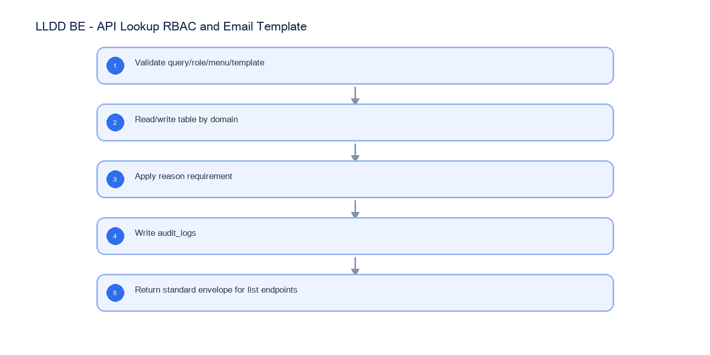

# LLDD BE - API Lookup RBAC and Email Template

SBP Mall - ระบบประกันรายได้ | Low Level Design Document

## 1. Overview

| รายการ | รายละเอียด |
| --- | --- |
| Track | BE |
| Estimate | 30 ชั่วโมง |
| Owner | Tunyatorn <Vava> Kiatkongphongsa |
| Objective | ออกแบบ APIs ที่ตกหล่นจาก shared lookup, RBAC/menu permission, audit log และ email template ของ SBP Mall |

Common contract reference: ทุกหัวข้อ API/FE ต้องยึด LLDD-BE-API-Common-Contracts และ LLDD-FE-Integration-Contracts สำหรับ error/auth/format/pagination/action/RBAC ก่อนลงรายละเอียดเฉพาะหน้าหรือเฉพาะ endpoint

## 2. Screen / Functional Scope

- Lookup APIs
- Employee search
- Role/menu/menu-permission CRUD
- Audit log search
- Email template CRUD/reset
- Auth endpoints are platform reference only

## 4. Implementation Flow Diagram (Reference)



_รูปที่ 1: Implementation flow reference: LLDD BE - API Lookup RBAC and Email Template_

## 5. Field, Format, and Validation

| Field / UI | Format | Validation | Behavior |
| --- | --- | --- | --- |
| q | string | optional | ใช้ค้นหา stores/employees/competitors |
| type | impacted\|new | required for stores/search | เลือกแหล่ง impacted_stores หรือ stores |
| roleCode | 00-10 | required for permission | อ้าง roles |
| menuCode | string | required for permission | อ้าง menus |
| templateCode | EM-01..EM-08 | required | email template key |
| reason | text | required mutation | บันทึก audit_logs |

## 5.1 Input / Progress / Output Contract

| Stage | Contract for implementation |
| --- | --- |
| Input | GET /api/v1/stores/search; GET /api/v1/document-statuses; GET /api/v1/workflow-sections |
| Progress | Validate query/role/menu/template; Read/write table by domain; Apply reason requirement; Write audit_logs |
| Output | roles / menus / menu_permissions; email_templates / status_email_rules; audit_logs |

### 5.90 Endpoint Implementation Contract

| Endpoint | Use-case owner | Service/repository behavior | Definition of done |
| --- | --- | --- | --- |
| GET /api/v1/stores/search | ค้นหาร้านสำหรับ popup | Validate query/role/menu/template | status label ต้องเป็น verbatim |
| GET /api/v1/document-statuses | รายการสถานะเอกสาร verbatim | Read/write table by domain | permission mutation ต้อง audit |
| GET /api/v1/workflow-sections | รายการ section 5 ขั้น | Apply reason requirement | email recipient From/To/Cc ล็อกจาก status_email_rules |
| GET /api/v1/employees/search | ค้นหาพนักงานสำหรับ master/operator | Write audit_logs | Auth Group 1 เป็น platform/external reference ไม่ใช่งาน implement ใน LLDD นี้ |
| GET /api/v1/menu-permissions | อ่าน matrix สิทธิ์เมนูทุก role | Return standard envelope for list endpoints | status label ต้องเป็น verbatim |
| PUT /api/v1/menu-permissions/{menuCode} | บันทึกสิทธิ์เมนูรายเมนู | Validate query/role/menu/template | permission mutation ต้อง audit |
| GET /api/v1/roles | อ่านรายการ role | Read/write table by domain | email recipient From/To/Cc ล็อกจาก status_email_rules |
| POST /api/v1/roles | สร้าง role | Apply reason requirement | Auth Group 1 เป็น platform/external reference ไม่ใช่งาน implement ใน LLDD นี้ |
| PUT /api/v1/roles/{roleCode} | แก้ role ที่ไม่ใช่ system role | Write audit_logs | status label ต้องเป็น verbatim |
| DELETE /api/v1/roles/{roleCode} | ลบ role ที่ไม่ถูกใช้งาน | Return standard envelope for list endpoints | permission mutation ต้อง audit |
| POST /api/v1/menus | สร้างเมนูและสิทธิ์เริ่มต้นทุก role | Validate query/role/menu/template | email recipient From/To/Cc ล็อกจาก status_email_rules |
| PUT /api/v1/menus/{menuCode} | แก้เมนู | Read/write table by domain | Auth Group 1 เป็น platform/external reference ไม่ใช่งาน implement ใน LLDD นี้ |
| DELETE /api/v1/menus/{menuCode} | ลบเมนูพร้อมสิทธิ์ที่เกี่ยวข้อง | Apply reason requirement | status label ต้องเป็น verbatim |
| GET /api/v1/audit-logs | ค้นประวัติการแก้ master | Write audit_logs | permission mutation ต้อง audit |
| GET /api/v1/email-templates | อ่านรายการ email template | Return standard envelope for list endpoints | email recipient From/To/Cc ล็อกจาก status_email_rules |
| GET /api/v1/email-templates/{code} | อ่าน email template รายตัว | Validate query/role/menu/template | Auth Group 1 เป็น platform/external reference ไม่ใช่งาน implement ใน LLDD นี้ |
| PUT /api/v1/email-templates/{code} | แก้ subject/body โดย recipient rule คงเดิม | Read/write table by domain | status label ต้องเป็น verbatim |
| POST /api/v1/email-templates/{code}/reset | รีเซ็ต template รายตัว | Apply reason requirement | permission mutation ต้อง audit |
| POST /api/v1/email-templates/reset-all | รีเซ็ต template ทั้งหมด | Write audit_logs | email recipient From/To/Cc ล็อกจาก status_email_rules |

### 5.91 Backend Execution Sequence

| Step | Behavior specific to this LLDD | Failure/test evidence |
| --- | --- | --- |
| 1 | Validate query/role/menu/template | store lookup |
| 2 | Read/write table by domain | status lookup |
| 3 | Apply reason requirement | permission save without reason |
| 4 | Write audit_logs | email template reset |
| 5 | Return standard envelope for list endpoints | audit log search |

## 6. Button / User Action Mapping

| Action | Trigger | API / Service | Expected Result |
| --- | --- | --- | --- |
| Store lookup | GET | lookup.service.searchStores | return impacted/new stores |
| Employee lookup | GET | employee.service.search | return employees for operator popup |
| Permission save | PUT | rbac.service.saveMenuPermission | update can_access and audit |
| Email template save/reset | PUT/POST | notificationTemplate.service | update/reset template and audit |

## 7. API Contract

### GET /api/v1/stores/search

ค้นหาร้านสำหรับ popup

#### Query Params

```json
{
  "q": "00788",
  "type": "impacted"
}
```

#### Request Field Schema

| Field | Type | Required | Constraint / Meaning |
| --- | --- | --- | --- |
| q | string | No | UTF-8; use value domain described by endpoint purpose |
| type | string | No | UTF-8; use value domain described by endpoint purpose |

#### Response

```json
{
  "items": [
    {
      "storeCode": "00788",
      "storeName": "รัตนอุทิศ ซ.13"
    }
  ]
}
```

#### Response Field Schema

| Field | Type | Required | Constraint / Meaning |
| --- | --- | --- | --- |
| items | array<object> | Yes | JSON array; element type shown in Type column |
| items[].storeCode | string | Yes | exactly 5 digits; preserve leading zero |
| items[].storeName | string | Yes | UTF-8; use value domain described by endpoint purpose |

### GET /api/v1/document-statuses

รายการสถานะเอกสาร verbatim

#### Query Params

```json
{}
```

#### Request Field Schema

| Field | Type | Required | Constraint / Meaning |
| --- | --- | --- | --- |
| - | none | No | No fields |

#### Response

```json
{
  "items": [
    {
      "statusCode": "06",
      "statusName": "รอฝ่าย SBP DSA ดำเนินการ"
    }
  ]
}
```

#### Response Field Schema

| Field | Type | Required | Constraint / Meaning |
| --- | --- | --- | --- |
| items | array<object> | Yes | JSON array; element type shown in Type column |
| items[].statusCode | string | Yes | canonical code; do not replace with display label |
| items[].statusName | string | Yes | UTF-8; use value domain described by endpoint purpose |

### GET /api/v1/workflow-sections

รายการ section 5 ขั้น

#### Query Params

```json
{}
```

#### Request Field Schema

| Field | Type | Required | Constraint / Meaning |
| --- | --- | --- | --- |
| - | none | No | No fields |

#### Response

```json
{
  "items": [
    {
      "sectionCode": "06",
      "sectionName": "ฝ่าย SBP DSA"
    }
  ]
}
```

#### Response Field Schema

| Field | Type | Required | Constraint / Meaning |
| --- | --- | --- | --- |
| items | array<object> | Yes | JSON array; element type shown in Type column |
| items[].sectionCode | string | Yes | canonical code; do not replace with display label |
| items[].sectionName | string | Yes | UTF-8; use value domain described by endpoint purpose |

### GET /api/v1/employees/search

ค้นหาพนักงานสำหรับ master/operator

#### Query Params

```json
{
  "q": "สมชาย"
}
```

#### Request Field Schema

| Field | Type | Required | Constraint / Meaning |
| --- | --- | --- | --- |
| q | string | No | UTF-8; use value domain described by endpoint purpose |

#### Response

```json
{
  "items": [
    {
      "employeeId": "E001",
      "employeeName": "สมชาย ใจดี"
    }
  ]
}
```

#### Response Field Schema

| Field | Type | Required | Constraint / Meaning |
| --- | --- | --- | --- |
| items | array<object> | Yes | JSON array; element type shown in Type column |
| items[].employeeId | string | Yes | UTF-8; use value domain described by endpoint purpose |
| items[].employeeName | string | Yes | UTF-8; use value domain described by endpoint purpose |

### GET /api/v1/menu-permissions

อ่าน matrix สิทธิ์เมนูทุก role

#### Query Params

```json
{
  "roleCode": "04"
}
```

#### Request Field Schema

| Field | Type | Required | Constraint / Meaning |
| --- | --- | --- | --- |
| roleCode | string | No | canonical code; do not replace with display label |

#### Response

```json
{
  "items": [
    {
      "menuCode": "k2-report",
      "roleCode": "04",
      "canAccess": true
    }
  ]
}
```

#### Response Field Schema

| Field | Type | Required | Constraint / Meaning |
| --- | --- | --- | --- |
| items | array<object> | Yes | JSON array; element type shown in Type column |
| items[].menuCode | string | Yes | UTF-8; use value domain described by endpoint purpose |
| items[].roleCode | string | Yes | canonical code; do not replace with display label |
| items[].canAccess | boolean | Yes | UTF-8; use value domain described by endpoint purpose |

### PUT /api/v1/menu-permissions/{menuCode}

บันทึกสิทธิ์เมนูรายเมนู

#### Request

```json
{
  "roleCode": "04",
  "canAccess": true,
  "reason": "ปรับสิทธิ์รายงาน"
}
```

#### Request Field Schema

| Field | Type | Required | Constraint / Meaning |
| --- | --- | --- | --- |
| roleCode | string | Yes | canonical code; do not replace with display label |
| canAccess | boolean | Yes | UTF-8; use value domain described by endpoint purpose |
| reason | string | Yes | trimmed UTF-8 Thai text; required by operation/business rule |

#### Response

```json
{
  "message": "saved"
}
```

#### Response Field Schema

| Field | Type | Required | Constraint / Meaning |
| --- | --- | --- | --- |
| message | string | Yes | UTF-8; use value domain described by endpoint purpose |

### GET /api/v1/roles

อ่านรายการ role

#### Query Params

```json
{
  "page": 1,
  "size": 20
}
```

#### Request Field Schema

| Field | Type | Required | Constraint / Meaning |
| --- | --- | --- | --- |
| page | integer | No | >= 1; default 1 |
| size | integer | No | 1..100; default 20 |

#### Response

```json
{
  "page": 1,
  "size": 20,
  "total": 11,
  "items": [
    {
      "roleCode": "04",
      "roleName": "ผู้ดูแลระบบ",
      "system": true,
      "active": true
    }
  ]
}
```

#### Response Field Schema

| Field | Type | Required | Constraint / Meaning |
| --- | --- | --- | --- |
| page | integer | Yes | >= 1; default 1 |
| size | integer | Yes | 1..100; default 20 |
| total | integer | Yes | UTF-8; use value domain described by endpoint purpose |
| items | array<object> | Yes | JSON array; element type shown in Type column |
| items[].roleCode | string | Yes | canonical code; do not replace with display label |
| items[].roleName | string | Yes | UTF-8; use value domain described by endpoint purpose |
| items[].system | boolean | Yes | UTF-8; use value domain described by endpoint purpose |
| items[].active | boolean | Yes | UTF-8; use value domain described by endpoint purpose |

### POST /api/v1/roles

สร้าง role

#### Request

```json
{
  "roleCode": "11",
  "roleName": "ผู้ตรวจสอบ",
  "active": true,
  "reason": "เพิ่มบทบาทผู้ตรวจสอบ"
}
```

#### Request Field Schema

| Field | Type | Required | Constraint / Meaning |
| --- | --- | --- | --- |
| roleCode | string | Yes | canonical code; do not replace with display label |
| roleName | string | Yes | UTF-8; use value domain described by endpoint purpose |
| active | boolean | Yes | UTF-8; use value domain described by endpoint purpose |
| reason | string | Yes | trimmed UTF-8 Thai text; required by operation/business rule |

#### Response

```json
{
  "roleCode": "11",
  "roleName": "ผู้ตรวจสอบ",
  "system": false,
  "active": true
}
```

#### Response Field Schema

| Field | Type | Required | Constraint / Meaning |
| --- | --- | --- | --- |
| roleCode | string | Yes | canonical code; do not replace with display label |
| roleName | string | Yes | UTF-8; use value domain described by endpoint purpose |
| system | boolean | Yes | UTF-8; use value domain described by endpoint purpose |
| active | boolean | Yes | UTF-8; use value domain described by endpoint purpose |

### PUT /api/v1/roles/{roleCode}

แก้ role ที่ไม่ใช่ system role

#### Request

```json
{
  "roleName": "ผู้ตรวจสอบอาวุโส",
  "active": true,
  "reason": "ปรับชื่อบทบาท"
}
```

#### Request Field Schema

| Field | Type | Required | Constraint / Meaning |
| --- | --- | --- | --- |
| roleName | string | Yes | UTF-8; use value domain described by endpoint purpose |
| active | boolean | Yes | UTF-8; use value domain described by endpoint purpose |
| reason | string | Yes | trimmed UTF-8 Thai text; required by operation/business rule |

#### Response

```json
{
  "roleCode": "11",
  "roleName": "ผู้ตรวจสอบอาวุโส",
  "system": false,
  "active": true
}
```

#### Response Field Schema

| Field | Type | Required | Constraint / Meaning |
| --- | --- | --- | --- |
| roleCode | string | Yes | canonical code; do not replace with display label |
| roleName | string | Yes | UTF-8; use value domain described by endpoint purpose |
| system | boolean | Yes | UTF-8; use value domain described by endpoint purpose |
| active | boolean | Yes | UTF-8; use value domain described by endpoint purpose |

### DELETE /api/v1/roles/{roleCode}

ลบ role ที่ไม่ถูกใช้งาน

#### Request

```json
{
  "reason": "ยกเลิกบทบาททดสอบ"
}
```

#### Request Field Schema

| Field | Type | Required | Constraint / Meaning |
| --- | --- | --- | --- |
| reason | string | Yes | trimmed UTF-8 Thai text; required by operation/business rule |

#### Response

```json
{
  "roleCode": "11",
  "deleted": true
}
```

#### Response Field Schema

| Field | Type | Required | Constraint / Meaning |
| --- | --- | --- | --- |
| roleCode | string | Yes | canonical code; do not replace with display label |
| deleted | boolean | Yes | UTF-8; use value domain described by endpoint purpose |

### POST /api/v1/menus

สร้างเมนูและสิทธิ์เริ่มต้นทุก role

#### Request

```json
{
  "menuCode": "k2-audit",
  "menuName": "ประวัติการแก้ไข",
  "route": "/audit",
  "sortOrder": 90,
  "active": true,
  "reason": "เพิ่มเมนูตรวจสอบ"
}
```

#### Request Field Schema

| Field | Type | Required | Constraint / Meaning |
| --- | --- | --- | --- |
| menuCode | string | Yes | UTF-8; use value domain described by endpoint purpose |
| menuName | string | Yes | UTF-8; use value domain described by endpoint purpose |
| route | string | Yes | UTF-8; use value domain described by endpoint purpose |
| sortOrder | integer | Yes | UTF-8; use value domain described by endpoint purpose |
| active | boolean | Yes | UTF-8; use value domain described by endpoint purpose |
| reason | string | Yes | trimmed UTF-8 Thai text; required by operation/business rule |

#### Response

```json
{
  "menuCode": "k2-audit",
  "created": true
}
```

#### Response Field Schema

| Field | Type | Required | Constraint / Meaning |
| --- | --- | --- | --- |
| menuCode | string | Yes | UTF-8; use value domain described by endpoint purpose |
| created | boolean | Yes | UTF-8; use value domain described by endpoint purpose |

### PUT /api/v1/menus/{menuCode}

แก้เมนู

#### Request

```json
{
  "menuName": "ประวัติการแก้ไขข้อมูล",
  "route": "/audit",
  "sortOrder": 90,
  "active": true,
  "reason": "ปรับชื่อเมนู"
}
```

#### Request Field Schema

| Field | Type | Required | Constraint / Meaning |
| --- | --- | --- | --- |
| menuName | string | Yes | UTF-8; use value domain described by endpoint purpose |
| route | string | Yes | UTF-8; use value domain described by endpoint purpose |
| sortOrder | integer | Yes | UTF-8; use value domain described by endpoint purpose |
| active | boolean | Yes | UTF-8; use value domain described by endpoint purpose |
| reason | string | Yes | trimmed UTF-8 Thai text; required by operation/business rule |

#### Response

```json
{
  "menuCode": "k2-audit",
  "updated": true
}
```

#### Response Field Schema

| Field | Type | Required | Constraint / Meaning |
| --- | --- | --- | --- |
| menuCode | string | Yes | UTF-8; use value domain described by endpoint purpose |
| updated | boolean | Yes | UTF-8; use value domain described by endpoint purpose |

### DELETE /api/v1/menus/{menuCode}

ลบเมนูพร้อมสิทธิ์ที่เกี่ยวข้อง

#### Request

```json
{
  "reason": "ยกเลิกเมนูทดสอบ"
}
```

#### Request Field Schema

| Field | Type | Required | Constraint / Meaning |
| --- | --- | --- | --- |
| reason | string | Yes | trimmed UTF-8 Thai text; required by operation/business rule |

#### Response

```json
{
  "menuCode": "k2-audit",
  "deleted": true
}
```

#### Response Field Schema

| Field | Type | Required | Constraint / Meaning |
| --- | --- | --- | --- |
| menuCode | string | Yes | UTF-8; use value domain described by endpoint purpose |
| deleted | boolean | Yes | UTF-8; use value domain described by endpoint purpose |

### GET /api/v1/audit-logs

ค้นประวัติการแก้ master

#### Query Params

```json
{
  "tableName": "roles",
  "refKey": "11",
  "action": "UPDATE",
  "page": 1,
  "size": 20
}
```

#### Request Field Schema

| Field | Type | Required | Constraint / Meaning |
| --- | --- | --- | --- |
| tableName | string | No | UTF-8; use value domain described by endpoint purpose |
| refKey | string | No | UTF-8; use value domain described by endpoint purpose |
| action | string | No | UTF-8; use value domain described by endpoint purpose |
| page | integer | No | >= 1; default 1 |
| size | integer | No | 1..100; default 20 |

#### Response

```json
{
  "page": 1,
  "size": 20,
  "total": 1,
  "items": [
    {
      "auditId": 9901,
      "tableName": "roles",
      "refKey": "11",
      "action": "UPDATE",
      "reason": "ปรับชื่อบทบาท",
      "changedBy": "E001",
      "changedAt": "2026-07-22T10:15:00+07:00"
    }
  ]
}
```

#### Response Field Schema

| Field | Type | Required | Constraint / Meaning |
| --- | --- | --- | --- |
| page | integer | Yes | >= 1; default 1 |
| size | integer | Yes | 1..100; default 20 |
| total | integer | Yes | UTF-8; use value domain described by endpoint purpose |
| items | array<object> | Yes | JSON array; element type shown in Type column |
| items[].auditId | integer | Yes | UTF-8; use value domain described by endpoint purpose |
| items[].tableName | string | Yes | UTF-8; use value domain described by endpoint purpose |
| items[].refKey | string | Yes | UTF-8; use value domain described by endpoint purpose |
| items[].action | string | Yes | UTF-8; use value domain described by endpoint purpose |
| items[].reason | string | Yes | trimmed UTF-8 Thai text; required by operation/business rule |
| items[].changedBy | string | Yes | UTF-8; use value domain described by endpoint purpose |
| items[].changedAt | string | Yes | ISO-8601 ค.ศ.; nullable only when type includes null |

### GET /api/v1/email-templates

อ่านรายการ email template

#### Query Params

```json
{
  "page": 1,
  "size": 20
}
```

#### Request Field Schema

| Field | Type | Required | Constraint / Meaning |
| --- | --- | --- | --- |
| page | integer | No | >= 1; default 1 |
| size | integer | No | 1..100; default 20 |

#### Response

```json
{
  "page": 1,
  "size": 20,
  "total": 8,
  "items": [
    {
      "code": "EM-01",
      "name": "แจ้งสร้างเอกสาร",
      "subject": "เอกสาร {{docNo}}",
      "updatedAt": "2026-07-22T09:00:00+07:00"
    }
  ]
}
```

#### Response Field Schema

| Field | Type | Required | Constraint / Meaning |
| --- | --- | --- | --- |
| page | integer | Yes | >= 1; default 1 |
| size | integer | Yes | 1..100; default 20 |
| total | integer | Yes | UTF-8; use value domain described by endpoint purpose |
| items | array<object> | Yes | JSON array; element type shown in Type column |
| items[].code | string | Yes | UTF-8; use value domain described by endpoint purpose |
| items[].name | string | Yes | UTF-8; use value domain described by endpoint purpose |
| items[].subject | string | Yes | UTF-8; use value domain described by endpoint purpose |
| items[].updatedAt | string | Yes | ISO-8601 ค.ศ.; nullable only when type includes null |

### GET /api/v1/email-templates/{code}

อ่าน email template รายตัว

#### Query Params

```json
{
  "code": "EM-01"
}
```

#### Request Field Schema

| Field | Type | Required | Constraint / Meaning |
| --- | --- | --- | --- |
| code | string | No | UTF-8; use value domain described by endpoint purpose |

#### Response

```json
{
  "code": "EM-01",
  "name": "แจ้งสร้างเอกสาร",
  "subject": "เอกสาร {{docNo}}",
  "body": "กรุณาตรวจสอบเอกสาร {{docNo}}",
  "variables": [
    "docNo"
  ],
  "fromRule": "SYSTEM",
  "toRule": "NEXT_SECTION",
  "ccRule": "NONE"
}
```

#### Response Field Schema

| Field | Type | Required | Constraint / Meaning |
| --- | --- | --- | --- |
| code | string | Yes | UTF-8; use value domain described by endpoint purpose |
| name | string | Yes | UTF-8; use value domain described by endpoint purpose |
| subject | string | Yes | UTF-8; use value domain described by endpoint purpose |
| body | string | Yes | UTF-8; use value domain described by endpoint purpose |
| variables | array<string> | Yes | JSON array; element type shown in Type column |
| fromRule | string | Yes | UTF-8; use value domain described by endpoint purpose |
| toRule | string | Yes | UTF-8; use value domain described by endpoint purpose |
| ccRule | string | Yes | UTF-8; use value domain described by endpoint purpose |

### PUT /api/v1/email-templates/{code}

แก้ subject/body โดย recipient rule คงเดิม

#### Request

```json
{
  "subject": "แจ้งเอกสาร {{docNo}}",
  "body": "กรุณาตรวจสอบเอกสาร {{docNo}}",
  "reason": "ปรับถ้อยคำ"
}
```

#### Request Field Schema

| Field | Type | Required | Constraint / Meaning |
| --- | --- | --- | --- |
| subject | string | Yes | UTF-8; use value domain described by endpoint purpose |
| body | string | Yes | UTF-8; use value domain described by endpoint purpose |
| reason | string | Yes | trimmed UTF-8 Thai text; required by operation/business rule |

#### Response

```json
{
  "code": "EM-01",
  "subject": "แจ้งเอกสาร {{docNo}}",
  "body": "กรุณาตรวจสอบเอกสาร {{docNo}}",
  "updatedAt": "2026-07-22T10:20:00+07:00"
}
```

#### Response Field Schema

| Field | Type | Required | Constraint / Meaning |
| --- | --- | --- | --- |
| code | string | Yes | UTF-8; use value domain described by endpoint purpose |
| subject | string | Yes | UTF-8; use value domain described by endpoint purpose |
| body | string | Yes | UTF-8; use value domain described by endpoint purpose |
| updatedAt | string | Yes | ISO-8601 ค.ศ.; nullable only when type includes null |

### POST /api/v1/email-templates/{code}/reset

รีเซ็ต template รายตัว

#### Request

```json
{
  "reason": "คืนค่าเริ่มต้น"
}
```

#### Request Field Schema

| Field | Type | Required | Constraint / Meaning |
| --- | --- | --- | --- |
| reason | string | Yes | trimmed UTF-8 Thai text; required by operation/business rule |

#### Response

```json
{
  "code": "EM-01",
  "reset": true
}
```

#### Response Field Schema

| Field | Type | Required | Constraint / Meaning |
| --- | --- | --- | --- |
| code | string | Yes | UTF-8; use value domain described by endpoint purpose |
| reset | boolean | Yes | UTF-8; use value domain described by endpoint purpose |

### POST /api/v1/email-templates/reset-all

รีเซ็ต template ทั้งหมด

#### Request

```json
{
  "reason": "คืนค่าเริ่มต้นก่อน UAT"
}
```

#### Request Field Schema

| Field | Type | Required | Constraint / Meaning |
| --- | --- | --- | --- |
| reason | string | Yes | trimmed UTF-8 Thai text; required by operation/business rule |

#### Response

```json
{
  "resetCount": 8
}
```

#### Response Field Schema

| Field | Type | Required | Constraint / Meaning |
| --- | --- | --- | --- |
| resetCount | integer | Yes | UTF-8; use value domain described by endpoint purpose |

## 8. Reference DB Mapping (No Database Page Work)

ส่วนนี้เป็นข้อมูลอ้างอิงสำหรับการ implement API/Job เท่านั้น ไม่ใช่งานสร้างหน้า Database, ไม่ใช่งานออกแบบ DB page และไม่ถูกนับเป็น deliverable แยกของ FE/BE

| Table / Object | R/W | Usage |
| --- | --- | --- |
| stores / impacted_stores | R | store picker สำหรับร้านถูกกระทบ/ร้านเปิดใหม่ |
| document_statuses / workflow_sections | R | lookup สถานะ verbatim และ section 5 ขั้น |
| employees | R | popup ค้นหาพนักงาน |
| roles / menus / menu_permissions | R/W | RBAC/menu matrix |
| email_templates / status_email_rules | R/W | เนื้อหา template และผู้รับที่ล็อกตามสถานะ |
| audit_logs | R/W | ประวัติ mutation ของ RBAC/email/master |

## 9. Processing Flow

| Step | Description |
| --- | --- |
| 1 | Validate query/role/menu/template |
| 2 | Read/write table by domain |
| 3 | Apply reason requirement |
| 4 | Write audit_logs |
| 5 | Return standard envelope for list endpoints |

## 10. Acceptance Criteria

- status label ต้องเป็น verbatim
- permission mutation ต้อง audit
- email recipient From/To/Cc ล็อกจาก status_email_rules
- Auth Group 1 เป็น platform/external reference ไม่ใช่งาน implement ใน LLDD นี้

## 11. Developer Test Checklist

| No | Test |
| --- | --- |
| 1 | store lookup |
| 2 | status lookup |
| 3 | permission save without reason |
| 4 | email template reset |
| 5 | audit log search |
