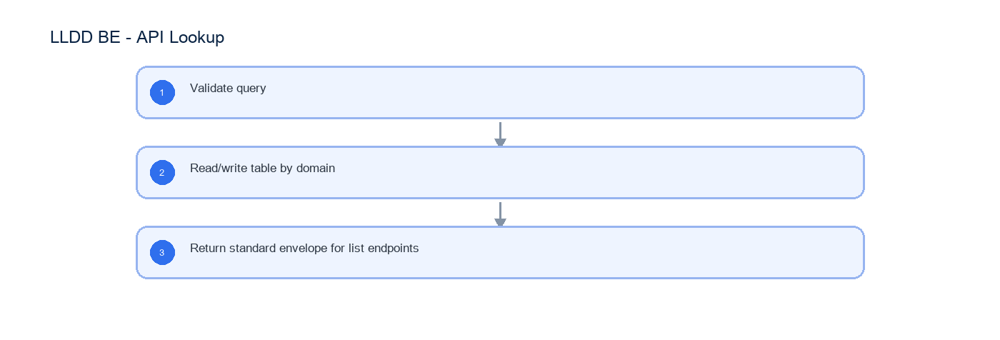

# LLDD BE - API Lookup

SBP Mall - ระบบประกันรายได้ | Low Level Design Document

## 1. Overview

| รายการ | รายละเอียด |
| --- | --- |
| Track | BE |
| Estimate | **13 ชั่วโมง** = implementation 10 + unit test 3 (30%) |
| Owner | Tunyatorn <Vava> Kiatkongphongsa |
| Target repository | `SBP/srm-sps-spsap-store-backend` (NestJS + TypeORM · schema `sps_store`) + `SBP/srm-sps-spsap-sbp-bff` (forward ผ่าน client service · ไม่มี DB) สำหรับเส้นที่ FE เรียก |
| Objective | ออกแบบ APIs กลุ่ม lookup ที่ใช้ร่วมทุกหน้าจอของ SBP Mall |

Common contract reference: ทุกหัวข้อ API/FE ต้องยึด LLDD-BE-API-Common-Contracts และ LLDD-FE-Integration-Contracts สำหรับ error/auth/format/pagination/action/RBAC ก่อนลงรายละเอียดเฉพาะหน้าหรือเฉพาะ endpoint

## 2. Screen / Functional Scope

- Lookup APIs
- Auth endpoints are platform reference only

## 3. Screenshot Reference

ไม่มีภาพหน้าจอสำหรับหัวข้อนี้ — เป็นเอกสารฝั่ง Backend/Batch ที่ไม่มี UI (ภาพหน้าจอทั้งหมดอยู่ในเอกสารชุด FE)

## 4. Implementation Flow Diagram (Reference)



_รูปที่ 1: Implementation flow reference: LLDD BE - API Lookup_

## 5. Field, Format, and Validation

| Field / UI | Format | Validation | Behavior |
| --- | --- | --- | --- |
| q | string | optional | ใช้ค้นหา ร้าน (store/mas_store ระบบเดิม) · พนักงาน (business_user ระบบเดิม) · คู่แข่ง (competitors ของ SBPGI) |
| type | impacted\|new | required for /store/search (ระบบ SBP เดิม) | เลือกแหล่งร้านถูกกระทบ/ร้านเปิดใหม่ |
| roleCode | 00-10 | required for permission | group ของ auth-backend (ระบบเดิม) — SBPGI ไม่มีตาราง roles |
| menuCode | string | required for permission | menu ของ auth-backend (ระบบเดิม) — SBPGI ไม่มีตาราง menus |
| templateCode | EM-01..EM-08 | required | email template key |
| reason | text | ไม่บังคับแล้ว | ไม่มีปลายทางเก็บ (ยกเลิกระบบ audit ของ master 2026-08-07) |

### 5.9 Input / Progress / Output Contract

| Stage | Contract for implementation |
| --- | --- |
| Input | GET /store/search (ระบบ SBP เดิม); GET /api/v1/document-statuses; GET /api/v1/workflow-sections |
| Progress | Validate query; Read/write table by domain; Return standard envelope for list endpoints |
| Output | Rendered UI state or normalized API response with status/message and audit-ready trace reference. |

### 5.90 Endpoint Implementation Contract

| Endpoint | Use-case owner | Service/repository behavior | Definition of done |
| --- | --- | --- | --- |
| GET /store/search (ระบบ SBP เดิม) | ค้นหาร้านสำหรับ popup | Validate query | status label ต้องเป็น verbatim |
| GET /api/v1/document-statuses | รายการสถานะเอกสาร verbatim | Read/write table by domain | permission mutation ต้อง audit |
| GET /api/v1/workflow-sections | รายการ section 5 ขั้น | Return standard envelope for list endpoints | SBPGI เรียก email-lib ส่งอีเมลเอง โดยใช้เลข template จาก workflow_route.email_id (ปิด DP-5 · 2026-08-14) |

### 5.91 Backend Execution Sequence

| Step | Behavior specific to this LLDD | Failure/test evidence |
| --- | --- | --- |
| 1 | Validate query | store lookup |
| 2 | Read/write table by domain | status lookup |
| 3 | Return standard envelope for list endpoints | permission save without reason |

## 6. Button / User Action Mapping

| Action | Trigger | API / Service | Expected Result |
| --- | --- | --- | --- |
| Store lookup | GET | lookup.service.searchStores | return impacted/new stores |
| Employee lookup | GET | employee backend เดิมของระบบ SBP (ไม่ใช่ endpoint ของ SBPGI) | return business_user for operator popup |
| Permission save | PUT | rbac.service.saveMenuPermission | update can_access and audit |
| Email template save/reset | PUT/POST | notificationTemplate.service | update/reset template and audit |

## 7. API Contract

### GET /store/search (ระบบ SBP เดิม)

ค้นหาร้านสำหรับ popup

#### Query Params

```json
{
  "q": "00788",
  "type": "impacted"
}
```

#### Request Field Schema

| Field | Type | Required | Constraint / Meaning |
| --- | --- | --- | --- |
| q | string | No | UTF-8; use value domain described by endpoint purpose |
| type | string | No | UTF-8; use value domain described by endpoint purpose |

#### Response

```json
{
  "items": [
    {
      "storeCode": "00788",
      "storeName": "รัตนอุทิศ ซ.13"
    }
  ]
}
```

#### Response Field Schema

| Field | Type | Required | Constraint / Meaning |
| --- | --- | --- | --- |
| items | array<object> | Yes | JSON array; element type shown in Type column |
| items[].storeCode | string | Yes | exactly 5 digits; preserve leading zero |
| items[].storeName | string | Yes | UTF-8; use value domain described by endpoint purpose |

### GET /api/v1/document-statuses

รายการสถานะเอกสาร verbatim

#### Query Params

```json
{}
```

#### Request Field Schema

| Field | Type | Required | Constraint / Meaning |
| --- | --- | --- | --- |
| - | none | No | No fields |

#### Response

```json
{
  "items": [
    {
      "statusCode": "06",
      "statusName": "รอฝ่าย SBP DSA ดำเนินการ"
    }
  ]
}
```

#### Response Field Schema

| Field | Type | Required | Constraint / Meaning |
| --- | --- | --- | --- |
| items | array<object> | Yes | JSON array; element type shown in Type column |
| items[].statusCode | string | Yes | canonical code; do not replace with display label |
| items[].statusName | string | Yes | UTF-8; use value domain described by endpoint purpose |

### GET /api/v1/workflow-sections

รายการ section 5 ขั้น

#### Query Params

```json
{}
```

#### Request Field Schema

| Field | Type | Required | Constraint / Meaning |
| --- | --- | --- | --- |
| - | none | No | No fields |

#### Response

```json
{
  "items": [
    {
      "sectionCode": "06",
      "sectionName": "ฝ่าย SBP DSA"
    }
  ]
}
```

#### Response Field Schema

| Field | Type | Required | Constraint / Meaning |
| --- | --- | --- | --- |
| items | array<object> | Yes | JSON array; element type shown in Type column |
| items[].sectionCode | string | Yes | canonical code; do not replace with display label |
| items[].sectionName | string | Yes | UTF-8; use value domain described by endpoint purpose |

## 8. Reference DB Mapping (No Database Page Work)

ส่วนนี้เป็นข้อมูลอ้างอิงสำหรับการ implement API/Job เท่านั้น ไม่ใช่งานสร้างหน้า Database, ไม่ใช่งานออกแบบ DB page และไม่ถูกนับเป็น deliverable แยกของ FE/BE

| Table / Object | R/W | Usage |
| --- | --- | --- |
| impacted_stores (SBPGI) / store · mas_store · sevenshop (SBP เดิม) | R | store picker — SBPGI ไม่มีตาราง stores ของตัวเอง |
| workflow_status / workflow_state (@srm/glb-workflow · sps_store) | R | lookup สถานะ verbatim และ 5 ขั้น 06/08/01/02/03 — ไม่สร้างตารางของ SBPGI เอง |
| business_user (SBP เดิม) | R | popup ค้นหาพนักงาน — SBPGI ไม่มีตาราง employees |
| auth-backend groups / menus / permissions (ระบบเดิม) | R | RBAC/menu matrix — จัดการที่หน้า /setting/manage-user-rights เดิม · SBPGI อ่านผ่าน header x-user-permissions เท่านั้น ไม่มีตารางของตัวเอง |
| email_template (SBP เดิม) | R | template — SBPGI อ่านผ่าน lib เท่านั้น ไม่แก้ของระบบเดิม |
| email_sent (SBP เดิม) | W (โดย email-lib) | log การส่ง — SBPGI เรียก sendEmail() ด้วยเลข template จาก workflow_route.email_id แล้ว lib เขียนแถวให้เอง (DP-5 · 2026-08-14) · ⚠️ คอลัมน์ผู้ส่งคือ send_by ไม่ใช่ sent_by |

## 9. Skeleton Code (store-backend + BFF)

โครงโค้ดตั้งต้นของเอกสารฉบับนี้ ยึด convention จริงของ `srm-sps-spsap-store-backend` (NestJS 11 + TypeORM, schema `sps_store`, custom provider `DATA_SOURCE` ที่ route SELECT ไป slave pool) และ `srm-sps-spsap-sbp-bff` (ไม่มี DB, forward ผ่าน client service). ทุกจุดที่ต้องเติมกำกับด้วย `// TODO:` และ response ทุกเส้นถูกห่อเป็น `{success, data}` โดย ResponseInterceptor อยู่แล้ว จึงห้าม service ห่อซ้ำ

#### 9.1 ผังไฟล์ที่ต้องสร้าง

| Path | หน้าที่ |
| --- | --- |
| store-backend · src/modules/sbpgi-lookup/sbpgi-lookup.controller.ts | route ทั้งหมดของเอกสารนี้ (2 เส้น) + `@UseGuards(HttpHeaderGuard)` + `@UserId()` |
| store-backend · src/modules/sbpgi-lookup/sbpgi-lookup.service.ts | business logic — inject `'DATA_SOURCE'` แล้วยิง raw SQL, mutation ใช้ QueryRunner transaction |
| store-backend · src/modules/sbpgi-lookup/sbpgi-lookup.sql.ts | เก็บ SQL ต่อ endpoint (คัดจากหัวข้อ 10) แยกออกจาก service ให้ทดสอบ/รีวิวง่าย |
| store-backend · src/modules/sbpgi-lookup/dto/sbpgi-lookup.dto.ts | DTO + class-validator ตาม validation ในหัวข้อฟิลด์ของเอกสารนี้ |
| store-backend · src/modules/sbpgi-lookup/sbpgi-lookup.module.ts | ประกอบ controller/service/providers แล้ว register ที่ `app.module.ts` |
| store-backend · src/entitys/impacted-stores.entity.ts | entity ของ `impacted_stores` (`@Entity({schema: process.env.DB_SCHEMA})`, ไม่ประกาศ relation) |
| store-backend · src/entitys/business-user.entity.ts | entity ของ `business_user` (`@Entity({schema: process.env.DB_SCHEMA})`, ไม่ประกาศ relation) |
| store-backend · src/entitys/permissions.entity.ts | entity ของ `permissions` (`@Entity({schema: process.env.DB_SCHEMA})`, ไม่ประกาศ relation) |
| store-backend · src/providers/sbpgi/sbpgi.ts | repository provider แบบ factory ผูก token string กับ `DATA_SOURCE` — **ไฟล์ร่วมของทุกเอกสาร BE ให้ merge array เพิ่ม ห้ามเขียนทับ** |
| store-backend · sql/deploy-sbpgi-lookup.sql | DDL production แบบ idempotent (ทีมนี้ไม่ใช้ migration เป็นหลัก) |
| BFF · src/common/client-services/sbpgi-client.service.ts | client ต่อจาก `BaseClientService` ตั้ง baseUrl + `x-api-key` ตอน `onModuleInit` |
| BFF · src/modules/sbpgi-lookup/sbpgi-lookup.controller.ts | route ฝั่ง BFF prefix `/bff/sbpgi/…` + `@UseGuards(AuthGuard('jwt'))` |
| BFF · src/modules/sbpgi-lookup/sbpgi-lookup.service.ts | แนบ `x-user-id` / `x-user-group-id` / `x-user-permissions` แล้ว forward ไป backend |

เส้นที่ไม่ต้อง implement ใหม่ในเอกสารนี้:

| Endpoint | จุดประสงค์ | เหตุผล |
| --- | --- | --- |
| GET /store/search (ระบบ SBP เดิม) | ค้นหาร้านสำหรับ popup | endpoint ของระบบ SBP เดิม — เรียกใช้ ไม่ต้อง implement ใหม่ |

#### 9.2 Controller (store-backend)

```ts
// src/modules/sbpgi-lookup/sbpgi-lookup.controller.ts
import { Controller, Get, UseGuards } from '@nestjs/common';
import { HttpHeaderGuard } from '../../guards/http-header.guard';
import { UserId } from '../../common/decorators/user-id.decorator';
import { SbpgiLookupService } from './sbpgi-lookup.service';

// LLDD BE - API Lookup
// BFF เรียกด้วย x-api-key และแนบ x-user-id / x-user-group-id / x-user-permissions มาให้
@Controller('sbpgi')
@UseGuards(HttpHeaderGuard)
export class SbpgiLookupController {
  constructor(private readonly service: SbpgiLookupService) {}

  // GET /api/v1/document-statuses — รายการสถานะเอกสาร verbatim
  @Get('document-statuses')
  getDocumentStatuses(@UserId() userId: string) {
    // TODO: ตรวจ x-user-permissions ก่อนเรียก service ถ้า endpoint นี้จำกัดสิทธิ์เมนู
    return this.service.getDocumentStatuses(userId);
  }

  // GET /api/v1/workflow-sections — รายการ section 5 ขั้น
  @Get('workflow-sections')
  getWorkflowSections(@UserId() userId: string) {
    // TODO: ตรวจ x-user-permissions ก่อนเรียก service ถ้า endpoint นี้จำกัดสิทธิ์เมนู
    return this.service.getWorkflowSections(userId);
  }
}
```

#### 9.3 DTO + Validation

```ts
// src/modules/sbpgi-lookup/dto/sbpgi-lookup.dto.ts
import { Type } from 'class-transformer';
import {
  IsArray, IsBoolean, IsIn, IsInt, IsNotEmpty, IsNumber, IsObject, IsOptional,
  IsString, Matches, Max, MaxLength, Min,
} from 'class-validator';

// ValidationPipe ระดับ global ตั้ง whitelist + forbidNonWhitelisted + transform ไว้แล้ว (main.ts)
// property ที่ไม่ประกาศที่นี่จะถูก reject เป็น 400 อัตโนมัติ

// payload ของโมดูลนี้
export class LookupRequestDto {
  // TODO: endpoint นี้ไม่มี body/query ใน LLDD — เพิ่ม property เมื่อสรุป payload แล้ว
}
```

#### 9.4 Service (inject `DATA_SOURCE` + raw SQL)

service ประกาศ method ครบทุกเส้นที่ controller เรียก และ **signature มาจากแหล่งเดียวกับ controller** (จำนวน/ลำดับพารามิเตอร์จึงตรงกันเสมอ) — เส้นที่ยังไม่ได้ implement เป็น stub ที่ `throw new NotImplementedException(...)` ให้ TypeScript compile ผ่านตั้งแต่วันแรก

```ts
// src/modules/sbpgi-lookup/sbpgi-lookup.service.ts
import { Inject, Injectable, Logger, NotFoundException, NotImplementedException } from '@nestjs/common';
import { DataSource } from 'typeorm';
import { WorkflowService } from '../workflow/workflow.service';
import { SBPGI_SQL } from './sbpgi-lookup.sql';

@Injectable()
export class SbpgiLookupService {
  private readonly logger = new Logger(SbpgiLookupService.name);
  // versionId ของ workflow ประกันรายได้ (ตั้งใน env เหมือน COOPERATION_WORKFLOW_VERSION_ID)
  private readonly versionId = Number(process.env.SBPGI_WORKFLOW_VERSION_ID);

  constructor(
    // DATA_SOURCE override query(): SELECT/WITH ไป slave pool, write ไป master
    @Inject('DATA_SOURCE') private readonly dataSource: DataSource,
    private readonly workflow: WorkflowService,
  ) {}

  // GET /api/v1/document-statuses — รายการสถานะเอกสาร verbatim
  async getDocumentStatuses(userId: string) {
    const page = 1;
    const size = 100; // endpoint นี้ไม่มี query param — ไม่แบ่งหน้า
    // SQL เต็มอยู่ในหัวข้อ Database SQL ของเอกสารนี้ (คีย์ 'GET /api/v1/document-statuses')
    // ⚠️ SQL ตัวอย่างบางเส้นเขียนด้วย named parameter (:size/:offset) แต่ dataSource.query()
    //    รับเฉพาะ positional $1..$n — ต้องแปลงชื่อเป็นลำดับก่อน หรือใช้ QueryBuilder แทน
    const rows = await this.dataSource.query(SBPGI_SQL.getDocumentStatuses, [
      // TODO: เรียงพารามิเตอร์ให้ตรงกับ $1..$n ของ SQL จริง
      userId, (page - 1) * size, size,
    ]);
    // TODO: total ต้องมาจาก COUNT(*) แยก query หรือ window function ไม่ใช่ rows.length
    return { page, size, total: rows.length, items: rows };
  }

  // GET /api/v1/workflow-sections — รายการ section 5 ขั้น
  async getWorkflowSections(userId: string) {
    // TODO: implement ตาม business rule ของ GET /api/v1/workflow-sections
    //       (SQL อยู่ในหัวข้อ Database SQL คีย์ 'GET /api/v1/workflow-sections')
    throw new NotImplementedException('getWorkflowSections ยังไม่ implement');
  }
}
```

#### 9.5 Workflow (`@srm/glb-workflow`)

✅ **ชื่อ function ของ engine — ยึด LLDD ของ lib (ปิดข้อค้าง 2026-08-14)** · API จริงคือ 8 ตัวตามชีต `Detail` ของ `SBP/TSM-SRM-LLDD SBP workflow 1.2.xlsx` (เอกสารของ lib เอง): `initializeWorkflow` · `eventWorkflow` · `getPermissionEvents` · `getHistory` · `getTransaction` · `getPendingFlowByUser` · `getWorkflowsByUser` · `addPreApprover` · ชื่อที่เคยขัดกันไม่ใช่ชื่อ API — *Trigger Event* เป็นชื่อหัวข้อขั้นตอนภายใน `eventWorkflow` และ `*UseCase` เป็น class ที่ store-backend ห่อไว้ใช้เอง (ดู `LLDD-BE-Workflow-Engine-Definition` หัวข้อ 5.3)

| Endpoint | Use case ที่ต้องเรียก | เหตุผล |
| --- | --- | --- |
| (อ่านสถานะประกอบ) | getTransaction() | อ่านสถานะปัจจุบันของเอกสารเพื่อประกอบ response |

```ts
// src/modules/sbpgi-lookup/sbpgi-lookup.workflow.ts (หรือรวมไว้ใน service เดียวกัน)
// WorkflowService = wrapper ของ @srm/glb-workflow ที่ store-backend มีอยู่แล้ว
// (DataSource แยกชื่อ 'workflow-connection', ทุก use case ห่อด้วย TypeOrmUnitOfWork)

  // สถานะปัจจุบันของเอกสาร
  const trx = await this.workflow.getTransaction({ versionId: this.versionId, referenceId: docNo });
  // TODO: map currentState -> statusCode/statusName ที่ FE ใช้
```

#### 9.6 Entity (TypeORM)

```ts
// src/entitys/impacted-stores.entity.ts
import { Column, Entity, PrimaryColumn } from 'typeorm';

@Entity({ name: 'impacted_stores', schema: process.env.DB_SCHEMA })
export class ImpactedStore {
  @PrimaryColumn({ name: 'store_code', type: 'char', length: 5 })
  storeCode: string;

  @Column({ name: 'store_name', type: 'varchar', length: 200 })
  storeName: string;

  @Column({ name: 'zone_code', type: 'varchar', length: 10, nullable: true })
  zoneCode?: string;

  @Column({ name: 'region_code', type: 'varchar', length: 10, nullable: true })
  regionCode?: string;

  @Column({ name: 'store_type', type: 'varchar', length: 5, nullable: true })
  storeType?: string;

  @Column({ name: 'transfer_sbp_date', type: 'date', nullable: true })
  transferSbpDate?: Date;

  @Column({ name: 'is_active', type: 'boolean', default: true })
  isActive: boolean;

  // TODO: ตรวจความยาว/precision กับ DDL จริงใน sql/deploy-sbpgi-*.sql ก่อน merge
  //       entity ชุดนี้ไม่ประกาศ relation ตาม convention (join ด้วย raw SQL)
}
```

```ts
// src/entitys/business-user.entity.ts
import { Column, Entity, PrimaryColumn } from 'typeorm';

@Entity({ name: 'business_user', schema: process.env.DB_SCHEMA })
export class BusinessUser {
  @PrimaryColumn({ name: 'id', type: 'bigint' })
  id: number;

  // TODO: เติมคอลัมน์ที่เหลือของ business_user ตาม database.md (Canonical Column Contract)
  //       และห้ามประกาศ relation — โมดูลนี้ join ด้วย raw SQL ตาม convention ของทีม
}
```

ตารางที่เหลือของเอกสารนี้ (`permissions`, `email_sent`) ใช้รูปแบบ entity เดียวกัน — คอลัมน์อ้างจาก `database.md`

ตารางที่ **ไม่ต้องสร้าง entity** เพราะใช้ของระบบเดิม/workflow engine:

| Object | R/W | ใช้ของระบบเดิมตัวไหน |
| --- | --- | --- |
| workflow_status | R | workflow engine @srm/glb-workflow |
| workflow_state | R | workflow engine @srm/glb-workflow |
| menus | R | auth-backend menus |
| email_template | R | email_template + email_sent + @gosoft-sbp/email-lib |

#### 9.7 Repository Providers + Module wiring

```ts
// src/providers/sbpgi/sbpgi.ts — repository provider แบบ factory (ไม่ใช้ TypeOrmModule.forFeature)
// convention ของโฟลเดอร์ providers คือ 1 ไฟล์ต่อโดเมน ตั้งชื่อตามโดเมน (business_user/business_user.ts,
// common_code/common_code.ts …) ไม่ใช่ index.ts
//
// ⚠️ ไฟล์นี้ใช้ร่วมกันทุกเอกสาร BE ของ SBPGI — ให้ **merge array เพิ่ม** เข้าไฟล์เดิม ห้ามเขียนทับ
//    (ชื่อ const แยกต่อเอกสารไว้แล้วเพื่อไม่ให้ชนกัน)
import { DataSource } from 'typeorm';
import { ImpactedStore } from '../../entitys/impacted-stores.entity';
import { BusinessUser } from '../../entitys/business-user.entity';
import { Permission } from '../../entitys/permissions.entity';

export const sbpgiLookupProviders = [
  {
    provide: 'IMPACTED_STORE_REPOSITORY',
    useFactory: (dataSource: DataSource) => dataSource.getRepository(ImpactedStore),
    inject: ['DATA_SOURCE'],
  },
  {
    provide: 'BUSINESS_USER_REPOSITORY',
    useFactory: (dataSource: DataSource) => dataSource.getRepository(BusinessUser),
    inject: ['DATA_SOURCE'],
  },
  {
    provide: 'PERMISSION_REPOSITORY',
    useFactory: (dataSource: DataSource) => dataSource.getRepository(Permission),
    inject: ['DATA_SOURCE'],
  },
];

// src/modules/sbpgi-lookup/sbpgi-lookup.module.ts
import { MiddlewareConsumer, Module, NestModule } from '@nestjs/common';
import { DatabaseModule } from '../../database/database.module';
// UserContextMiddleware อ่าน header x-user-id แล้วเซ็ต request.userId ที่ @UserId() ใช้
// — app.module.ts **ไม่ได้** apply แบบ global (มีแค่ HttpContext/LoggerContext) แต่ละโมดูลต้อง apply เอง
// (ดู evaluation-process.module.ts / inform-evaluate.module.ts / cooperation-request.module.ts)
import { UserContextMiddleware } from '../../common/middleware/user-context.middleware';
import { WorkflowModule } from '../workflow/workflow.module';
import { sbpgiLookupProviders } from '../../providers/sbpgi/sbpgi';
import { SbpgiLookupController } from './sbpgi-lookup.controller';
import { SbpgiLookupService } from './sbpgi-lookup.service';

@Module({
  imports: [DatabaseModule, WorkflowModule],
  controllers: [SbpgiLookupController],
  providers: [SbpgiLookupService, ...sbpgiLookupProviders],
  exports: [SbpgiLookupService],
})
export class SbpgiLookupModule implements NestModule {
  configure(consumer: MiddlewareConsumer) {
    // ถ้าไม่ apply ตรงนี้ userId จะเป็น undefined เงียบ ๆ ทุก endpoint
    consumer.apply(UserContextMiddleware).forRoutes(SbpgiLookupController);
  }
}
// TODO: register module นี้ใน app.module.ts (imports) พร้อมกับโมดูล SBPGI ตัวอื่น
```

#### 9.8 BFF Proxy (module + controller + client service)

BFF ยังไม่มีฟีเจอร์ประกันรายได้เลย จึงต้องสร้าง module ใหม่ + client service ใหม่ทั้งชุด และเลือก prefix แบบเดียวทั้งโมดูล (ที่นี่ใช้ `/bff/sbpgi/…`) เพื่อไม่ให้ปนแบบที่มี/ไม่มี `/bff` เหมือนโมดูลเดิม

```ts
// src/common/client-services/sbpgi-client.service.ts
import { Injectable, Logger, OnModuleInit } from '@nestjs/common';
import { BaseClientService } from './base-client.service';

@Injectable()
export class SbpgiClientService extends BaseClientService implements OnModuleInit {
  protected logger: Logger = new Logger(SbpgiClientService.name);

  onModuleInit() {
    // TODO: ถ้า deploy SBPGI แยก service ให้เพิ่ม API_SBPGI_BACKEND_* ใน AppConfigService
    //       ตอนนี้ชี้ store backend ตัวเดียวกับ StoreClientService
    this.defaultHeaders[this.config.api.store.key.name] = this.config.api.store.key.value;
    this.baseUrl = this.config.api.store.url;
  }
}
// BaseClientService แกะ { success, data } ให้แล้ว — service ฝั่ง BFF จึงได้ data ตรง ๆ
// TODO: เพิ่ม SbpgiClientService ใน providers/exports ของ ClientServiceModule (@Global)
```

```ts
// src/modules/sbpgi-lookup/sbpgi-lookup.service.ts (BFF)
import { Injectable } from '@nestjs/common';
import { SbpgiClientService } from '@common/client-services/sbpgi-client.service';

@Injectable()
export class SbpgiLookupBffService {
  constructor(private readonly client: SbpgiClientService) {}

  // BFF ไม่มี DB — หน้าที่เดียวคือแนบ user context แล้ว forward
  private userHeaders(user: any) {
    return {
      'x-user-id': user?.userId,
      'x-user-group-id': user?.groupId,
      'x-user-permissions': (user?.permissions ?? []).join(','),
    };
  }

  getDocumentStatuses(params: any, user: any) {
    return this.client.get('/api/v1/document-statuses', { params, headers: this.userHeaders(user) });
  }

  getWorkflowSections(params: any, user: any) {
    return this.client.get('/api/v1/workflow-sections', { params, headers: this.userHeaders(user) });
  }
}

// ---------- src/modules/sbpgi-lookup/sbpgi-lookup.controller.ts (BFF) ----------
import { Body, Controller, Delete, Get, Param, Post, Put, Query, Req, UseGuards } from '@nestjs/common';
import { AuthGuard } from '@nestjs/passport';

// เลือก prefix แบบเดียวทั้งโมดูล: ใช้ '/bff/sbpgi/...' (ห้ามปนกับแบบไม่มี /bff)
@Controller('bff/sbpgi/lookup')
@UseGuards(AuthGuard('jwt'))
export class SbpgiLookupBffController {
  constructor(private readonly service: SbpgiLookupBffService) {}

  // proxy ของ GET /api/v1/document-statuses
  @Get('document-statuses')
  getDocumentStatuses(@Query() query: any, @Req() req: any) {
    return this.service.getDocumentStatuses(query, req.user);
  }

  // proxy ของ GET /api/v1/workflow-sections
  @Get('workflow-sections')
  getWorkflowSections(@Query() query: any, @Req() req: any) {
    return this.service.getWorkflowSections(query, req.user);
  }
}
// TODO: register module ใน app.module.ts ของ BFF และเพิ่ม SbpgiClientService ใน ClientServiceModule (@Global)
```

## 10. Database SQL

#### 10.1 ตารางที่อ่าน/เขียน

| Table / Object | R/W | Usage |
| --- | --- | --- |
| impacted_stores | R | store picker — SBPGI ไม่มีตาราง stores ของตัวเอง |
| business_user | R | popup ค้นหาพนักงาน — SBPGI ไม่มีตาราง employees |
| permissions | R | RBAC/menu matrix — จัดการที่หน้า /setting/manage-user-rights เดิม · SBPGI อ่านผ่าน header x-user-permissions เท่านั้น ไม่มีตารางของตัวเอง |
| email_sent | W (โดย email-lib) | log การส่ง — SBPGI เรียก sendEmail() ด้วยเลข template จาก workflow_route.email_id แล้ว lib เขียนแถวให้เอง (DP-5 · 2026-08-14) · ⚠️ คอลัมน์ผู้ส่งคือ send_by ไม่ใช่ sent_by |
| workflow_status | R | ใช้ของระบบเดิม: workflow engine @srm/glb-workflow |
| workflow_state | R | ใช้ของระบบเดิม: workflow engine @srm/glb-workflow |
| menus | R | ใช้ของระบบเดิม: auth-backend menus |
| email_template | R | ใช้ของระบบเดิม: email_template + email_sent + @gosoft-sbp/email-lib |

#### 10.2 SQL จริงต่อ Endpoint

**GET /api/v1/document-statuses** — รายการสถานะเอกสาร verbatim

```sql
-- ⚠️ SQL นี้ใช้ named parameter (:name) แต่ `dataSource.query()` ของ store-backend
--    รับเฉพาะ positional $1..$n — ต้องแปลงเป็นลำดับ หรือรันผ่าน QueryBuilder
-- ตาราง document_statuses ของ SBPGI ถูกตัดแล้ว — อ่านจาก workflow_status ของ engine กลาง
SELECT status_id AS status_code, status_name, seq AS sort_order
FROM sps_store.workflow_status
WHERE version_id = :sbpgiVersionId
ORDER BY seq;
```

**GET /api/v1/workflow-sections** — รายการ section 5 ขั้น

```sql
-- ⚠️ SQL นี้ใช้ named parameter (:name) แต่ `dataSource.query()` ของ store-backend
--    รับเฉพาะ positional $1..$n — ต้องแปลงเป็นลำดับ หรือรันผ่าน QueryBuilder
-- ตาราง workflow_sections ของ SBPGI ถูกตัดแล้ว — อ่าน state จาก engine กลาง และวงเงินจาก common_code ของระบบเดิม
-- (approve_limit_amount = SectionLimitCost ของ K2 เดิม · เกณฑ์เดียว 100,000 ตามมติ 2026-08-18 — เป็น data ไม่ hardcode · ขั้น 03 เป็น null = ไม่มีเพดาน)
-- ⚠️ sps_store.workflow_state ไม่มีคอลัมน์ลำดับ (มีแค่ version_id · state_id · state_name · create_date)
--    ลำดับขั้นต้องเอาจาก workflow_route.seq · วงเงินจับคู่ด้วย common_code.code_value (ไม่มี code_id)
SELECT s.state_id AS section_code, s.state_name AS section_name,
       MIN(r.seq) AS sort_order,
       CAST(c.other_value AS NUMERIC) AS approve_limit_amount
FROM sps_store.workflow_state s
LEFT JOIN sps_store.workflow_route r ON r.version_id = s.version_id AND r.from_state_id = s.state_id
LEFT JOIN common_code c ON c.code_type = 'SBPGI_APPROVE_LIMIT' AND c.code_value = s.state_id
WHERE s.version_id = :sbpgiVersionId
GROUP BY s.state_id, s.state_name, c.other_value
ORDER BY sort_order;
```

#### 10.3 Index / Constraint ที่ควรมี (ข้อเสนอ)

ยังไม่มีข้อมูลเงื่อนไข query พอจะเสนอ index — รอ SQL ต่อ endpoint ครบก่อน

## 11. Processing Flow

| Step | Description |
| --- | --- |
| 1 | Validate query |
| 2 | Read/write table by domain |
| 3 | Return standard envelope for list endpoints |

## 12. Acceptance Criteria

- status label ต้องเป็น verbatim
- permission mutation ต้อง audit
- SBPGI เรียก email-lib ส่งอีเมลเอง โดยใช้เลข template จาก workflow_route.email_id (ปิด DP-5 · 2026-08-14)
- Auth Group 1 เป็น platform/external reference ไม่ใช่งาน implement ใน LLDD นี้

## 13. Developer Test Checklist

| No | Test |
| --- | --- |
| 1 | store lookup |
| 2 | status lookup |
| 3 | permission save without reason |
| 4 | email template reset |
| 5 | (ตัดออก) audit log search |

## 14. Unit Test Scope

**3 ชั่วโมง** (30% ของ implementation 10 ชั่วโมง) · เครื่องมือ: Jest + mock repository/DataSource (ไม่ต่อ DB จริง)

หัวข้อนี้คือ **unit test** ที่ต้องเขียนคู่กับโค้ด — ต่างจาก *Developer Test Checklist* ซึ่งเป็น scenario ระดับ end-to-end/manual ที่ใช้ตอนตรวจรับ · รายการด้านล่าง derive จาก field/validation, acceptance criteria, endpoint และตารางที่เอกสารนี้เขียน

| สิ่งที่ทดสอบ | ประเภท | เกณฑ์ผ่าน |
| --- | --- | --- |
| `type` | validation | ผ่านเมื่อถูกกฎ / โยน error เมื่อผิด — กฎ: required for /store/search (ระบบ SBP เดิม) · รูปแบบ: impacted\|new |
| `roleCode` | validation | ผ่านเมื่อถูกกฎ / โยน error เมื่อผิด — กฎ: required for permission · รูปแบบ: 00-10 |
| `menuCode` | validation | ผ่านเมื่อถูกกฎ / โยน error เมื่อผิด — กฎ: required for permission · รูปแบบ: string |
| `templateCode` | validation | ผ่านเมื่อถูกกฎ / โยน error เมื่อผิด — กฎ: required · รูปแบบ: EM-01..EM-08 |
| `reason` | validation | ผ่านเมื่อถูกกฎ / โยน error เมื่อผิด — กฎ: ไม่บังคับแล้ว · รูปแบบ: text |
| business rule | logic | status label ต้องเป็น verbatim |
| business rule | logic | permission mutation ต้อง audit |
| business rule | logic | SBPGI เรียก email-lib ส่งอีเมลเอง โดยใช้เลข template จาก workflow_route.email_id (ปิด DP-5 · 2026-08-14) |
| business rule | logic | Auth Group 1 เป็น platform/external reference ไม่ใช่งาน implement ใน LLDD นี้ |
| `GET /store/search (ระบบ SBP เดิม)` | handler | คืน {success:true,data} ตามรูปแบบที่ระบุ และคืน {success:false,error:{code,message}} เมื่อ input ผิด — mock repository/lib ไม่แตะ DB จริง |
| `GET /api/v1/document-statuses` | handler | คืน {success:true,data} ตามรูปแบบที่ระบุ และคืน {success:false,error:{code,message}} เมื่อ input ผิด — mock repository/lib ไม่แตะ DB จริง |
| `GET /api/v1/workflow-sections` | handler | คืน {success:true,data} ตามรูปแบบที่ระบุ และคืน {success:false,error:{code,message}} เมื่อ input ผิด — mock repository/lib ไม่แตะ DB จริง |
| `email_sent (SBP เดิม)` | transaction | จำลอง error กลางทาง แล้วยืนยันว่า rollback ครบ ไม่เหลือแถวค้าง (mock DataSource/QueryRunner) |
| service | error mapping | แปลง error ของ repository/lib เป็น error code ตามสัญญากลาง (LLDD-BE-API-Common-Contracts) |

- ทุกเคสต้องรันได้โดยไม่ต่อ DB/บริการภายนอกจริง — mock ที่ขอบ repository/client เสมอ
- ข้อความไทยที่ยืนยันในเทสต้องเป็น verbatim ตาม SRS ห้ามพิมพ์ใหม่
- เกณฑ์ผ่านของ CI: ทุกเคสในตารางนี้มี test จริงและผ่านทั้งหมด
