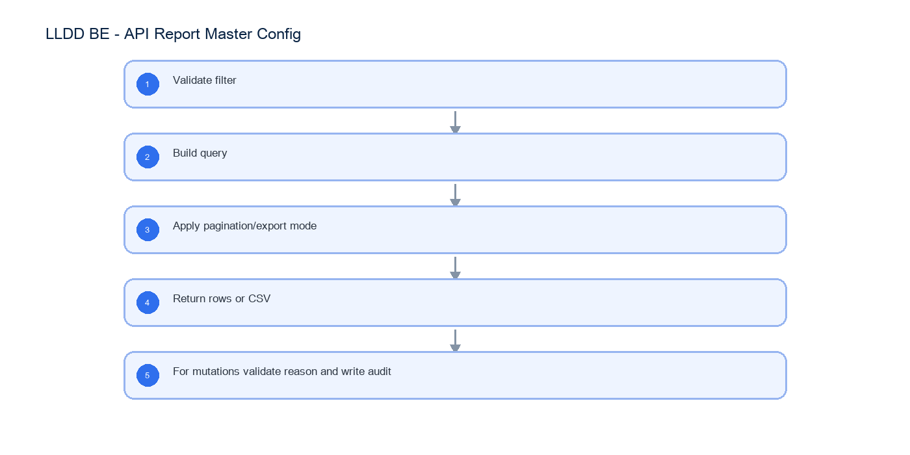

# LLDD BE - API Report Master Config

SBP Mall - ระบบประกันรายได้ | Low Level Design Document

## 1. Overview

| รายการ | รายละเอียด |
| --- | --- |
| Track | BE |
| Estimate | 30 ชั่วโมง |
| Owner | Tunyatorn <Vava> Kiatkongphongsa |
| Objective | ออกแบบ APIs สำหรับรายงาน Master Data และ System Config |

Common contract reference: ทุกหัวข้อ API/FE ต้องยึด LLDD-BE-API-Common-Contracts และ LLDD-FE-Integration-Contracts สำหรับ error/auth/format/pagination/action/RBAC ก่อนลงรายละเอียดเฉพาะหน้าหรือเฉพาะ endpoint

## 2. Screen / Functional Scope

- Report query service
- CSV export
- Operator/factor CRUD
- System/Global Config (SCR-11)
- Report filters

## 4. Implementation Flow Diagram (Reference)



_รูปที่ 1: Implementation flow reference: LLDD BE - API Report Master Config_

## 5. Field, Format, and Validation

| Field / UI | Format | Validation | Behavior |
| --- | --- | --- | --- |
| year | พ.ศ. YYYY | required for report | return 400 if missing |
| status | statusCode string | required | 6 สถานะเอกสาร; verbatim จาก document_statuses |
| result | APPROVE\|REJECT | required for report | maps to consideration latest result |
| region | array/string | optional | 13 region codes; multi-select |
| storeType | array/string | optional | A/B/C/D; multi-select |
| impactedStoreCode | string 5 digits | optional | คง leading zero |
| newStoreCode | string 5 digits | optional | คง leading zero |
| reason | text | required mutation | audit reason |
| page/size | integer | page>=1 size<=100 | pagination |

## 5.1 Input / Progress / Output Contract

| Stage | Contract for implementation |
| --- | --- |
| Input | GET /api/v1/reports/status-summary; GET /api/v1/reports/status-summary/export; GET /api/v1/operators |
| Progress | Validate filter; Build query; Apply pagination/export mode; Return rows or CSV |
| Output | operator_assignments; external_factors; system_configs |

### 5.90 Endpoint Implementation Contract

| Endpoint | Use-case owner | Service/repository behavior | Definition of done |
| --- | --- | --- | --- |
| GET /api/v1/reports/status-summary | รายงานตรวจสอบประกันรายได้ | Validate filter | missing year/status/result fails |
| GET /api/v1/reports/status-summary/export | Export CSV | Build query | export uses same filters as preview |
| GET /api/v1/operators | อ่าน operator assignments | Apply pagination/export mode | master edit requires reason |
| POST /api/v1/operators | สร้าง operator assignment | Return rows or CSV | config locked value cannot edit |
| PUT /api/v1/operators/{id} | แก้ operator assignment | For mutations validate reason and write audit | missing year/status/result fails |
| DELETE /api/v1/operators/{id} | ยกเลิก operator assignment | Validate filter | export uses same filters as preview |
| GET /api/v1/factors | อ่านปัจจัยภายนอก | Build query | master edit requires reason |
| POST /api/v1/factors | สร้างปัจจัยภายนอก | Apply pagination/export mode | config locked value cannot edit |
| PUT /api/v1/factors/{code} | แก้ปัจจัยภายนอก | Return rows or CSV | missing year/status/result fails |
| DELETE /api/v1/factors/{code} | ลบปัจจัยภายนอกที่ไม่ถูกใช้งาน | For mutations validate reason and write audit | export uses same filters as preview |
| GET /api/v1/configs | อ่าน system config | Validate filter | master edit requires reason |
| GET /api/v1/configs/{key} | อ่าน config ราย key | Build query | config locked value cannot edit |
| POST /api/v1/configs | สร้าง config ที่ไม่ใช่ secret | Apply pagination/export mode | missing year/status/result fails |
| PUT /api/v1/configs/{key} | แก้ config ที่ editable=true | Return rows or CSV | export uses same filters as preview |
| DELETE /api/v1/configs/{key} | ลบ config ที่ editable=true และไม่ถูกใช้งาน | For mutations validate reason and write audit | master edit requires reason |

### 5.91 Backend Execution Sequence

| Step | Behavior specific to this LLDD | Failure/test evidence |
| --- | --- | --- |
| 1 | Validate filter | report missing year |
| 2 | Build query | report export |
| 3 | Apply pagination/export mode | factor duplicate |
| 4 | Return rows or CSV | operator audit |
| 5 | For mutations validate reason and write audit | config locked |

## 6. Button / User Action Mapping

| Action | Trigger | API / Service | Expected Result |
| --- | --- | --- | --- |
| Report preview | GET | report.service.search | paginated rows |
| Report export | GET | report.service.exportCsv | csv stream |
| Master mutation | POST/PUT/DELETE | master.service.save | audit log |

## 7. API Contract

### GET /api/v1/reports/status-summary

รายงานตรวจสอบประกันรายได้

#### Query Params

```json
{
  "year": 2569,
  "status": "06",
  "result": "APPROVE",
  "region": [
    "RSU"
  ],
  "storeType": [
    "A"
  ],
  "impactedStoreCode": "00788",
  "newStoreCode": "00990",
  "page": 1,
  "size": 20
}
```

#### Request Field Schema

| Field | Type | Required | Constraint / Meaning |
| --- | --- | --- | --- |
| year | integer | Yes | UTF-8; use value domain described by endpoint purpose |
| status | string | Yes | UTF-8; use value domain described by endpoint purpose |
| result | string | Yes | UTF-8; use value domain described by endpoint purpose |
| region | array<string> | No | JSON array; element type shown in Type column |
| storeType | array<string> | No | JSON array; element type shown in Type column |
| impactedStoreCode | string | No | exactly 5 digits; preserve leading zero |
| newStoreCode | string | No | exactly 5 digits; preserve leading zero |
| page | integer | No | >= 1; default 1 |
| size | integer | No | 1..100; default 20 |

#### Response

```json
{
  "page": 1,
  "size": 20,
  "total": 0,
  "items": []
}
```

#### Response Field Schema

| Field | Type | Required | Constraint / Meaning |
| --- | --- | --- | --- |
| page | integer | Yes | >= 1; default 1 |
| size | integer | Yes | 1..100; default 20 |
| total | integer | Yes | UTF-8; use value domain described by endpoint purpose |
| items | array<object> | Yes | JSON array; element type shown in Type column |

### GET /api/v1/reports/status-summary/export

Export CSV

#### Query Params

```json
{
  "year": 2569,
  "status": "06",
  "result": "APPROVE",
  "region": [
    "RSU"
  ],
  "storeType": [
    "A"
  ],
  "impactedStoreCode": "00788",
  "newStoreCode": "00990"
}
```

#### Request Field Schema

| Field | Type | Required | Constraint / Meaning |
| --- | --- | --- | --- |
| year | integer | Yes | UTF-8; use value domain described by endpoint purpose |
| status | string | Yes | UTF-8; use value domain described by endpoint purpose |
| result | string | Yes | UTF-8; use value domain described by endpoint purpose |
| region | array<string> | No | JSON array; element type shown in Type column |
| storeType | array<string> | No | JSON array; element type shown in Type column |
| impactedStoreCode | string | No | exactly 5 digits; preserve leading zero |
| newStoreCode | string | No | exactly 5 digits; preserve leading zero |

#### Response

```json
{
  "fileName": "status-summary.csv"
}
```

#### Response Field Schema

| Field | Type | Required | Constraint / Meaning |
| --- | --- | --- | --- |
| fileName | string | Yes | UTF-8; use value domain described by endpoint purpose |

### GET /api/v1/operators

อ่าน operator assignments

#### Query Params

```json
{
  "employeeId": "E001",
  "positionCode": "06",
  "active": true,
  "page": 1,
  "size": 20
}
```

#### Request Field Schema

| Field | Type | Required | Constraint / Meaning |
| --- | --- | --- | --- |
| employeeId | string | No | UTF-8; use value domain described by endpoint purpose |
| positionCode | string | No | UTF-8; use value domain described by endpoint purpose |
| active | boolean | No | UTF-8; use value domain described by endpoint purpose |
| page | integer | No | >= 1; default 1 |
| size | integer | No | 1..100; default 20 |

#### Response

```json
{
  "page": 1,
  "size": 20,
  "total": 1,
  "items": [
    {
      "id": 101,
      "employeeId": "E001",
      "employeeName": "สมชาย ใจดี",
      "positionCode": "06",
      "zoneCode": "01",
      "active": true
    }
  ]
}
```

#### Response Field Schema

| Field | Type | Required | Constraint / Meaning |
| --- | --- | --- | --- |
| page | integer | Yes | >= 1; default 1 |
| size | integer | Yes | 1..100; default 20 |
| total | integer | Yes | UTF-8; use value domain described by endpoint purpose |
| items | array<object> | Yes | JSON array; element type shown in Type column |
| items[].id | integer | Yes | UTF-8; use value domain described by endpoint purpose |
| items[].employeeId | string | Yes | UTF-8; use value domain described by endpoint purpose |
| items[].employeeName | string | Yes | UTF-8; use value domain described by endpoint purpose |
| items[].positionCode | string | Yes | UTF-8; use value domain described by endpoint purpose |
| items[].zoneCode | string | Yes | UTF-8; use value domain described by endpoint purpose |
| items[].active | boolean | Yes | UTF-8; use value domain described by endpoint purpose |

### POST /api/v1/operators

สร้าง operator assignment

#### Request

```json
{
  "employeeId": "E001",
  "positionCode": "06",
  "zoneCode": "01",
  "active": true,
  "reason": "มอบหมายผู้ปฏิบัติงาน"
}
```

#### Request Field Schema

| Field | Type | Required | Constraint / Meaning |
| --- | --- | --- | --- |
| employeeId | string | Yes | UTF-8; use value domain described by endpoint purpose |
| positionCode | string | Yes | UTF-8; use value domain described by endpoint purpose |
| zoneCode | string | Yes | UTF-8; use value domain described by endpoint purpose |
| active | boolean | Yes | UTF-8; use value domain described by endpoint purpose |
| reason | string | Yes | trimmed UTF-8 Thai text; required by operation/business rule |

#### Response

```json
{
  "id": 101,
  "employeeId": "E001",
  "positionCode": "06",
  "zoneCode": "01",
  "active": true
}
```

#### Response Field Schema

| Field | Type | Required | Constraint / Meaning |
| --- | --- | --- | --- |
| id | integer | Yes | UTF-8; use value domain described by endpoint purpose |
| employeeId | string | Yes | UTF-8; use value domain described by endpoint purpose |
| positionCode | string | Yes | UTF-8; use value domain described by endpoint purpose |
| zoneCode | string | Yes | UTF-8; use value domain described by endpoint purpose |
| active | boolean | Yes | UTF-8; use value domain described by endpoint purpose |

### PUT /api/v1/operators/{id}

แก้ operator assignment

#### Request

```json
{
  "positionCode": "08",
  "zoneCode": "01",
  "active": true,
  "reason": "ย้ายหน้าที่"
}
```

#### Request Field Schema

| Field | Type | Required | Constraint / Meaning |
| --- | --- | --- | --- |
| positionCode | string | Yes | UTF-8; use value domain described by endpoint purpose |
| zoneCode | string | Yes | UTF-8; use value domain described by endpoint purpose |
| active | boolean | Yes | UTF-8; use value domain described by endpoint purpose |
| reason | string | Yes | trimmed UTF-8 Thai text; required by operation/business rule |

#### Response

```json
{
  "id": 101,
  "employeeId": "E001",
  "positionCode": "08",
  "zoneCode": "01",
  "active": true
}
```

#### Response Field Schema

| Field | Type | Required | Constraint / Meaning |
| --- | --- | --- | --- |
| id | integer | Yes | UTF-8; use value domain described by endpoint purpose |
| employeeId | string | Yes | UTF-8; use value domain described by endpoint purpose |
| positionCode | string | Yes | UTF-8; use value domain described by endpoint purpose |
| zoneCode | string | Yes | UTF-8; use value domain described by endpoint purpose |
| active | boolean | Yes | UTF-8; use value domain described by endpoint purpose |

### DELETE /api/v1/operators/{id}

ยกเลิก operator assignment

#### Request

```json
{
  "reason": "สิ้นสุดการมอบหมาย"
}
```

#### Request Field Schema

| Field | Type | Required | Constraint / Meaning |
| --- | --- | --- | --- |
| reason | string | Yes | trimmed UTF-8 Thai text; required by operation/business rule |

#### Response

```json
{
  "id": 101,
  "deleted": true
}
```

#### Response Field Schema

| Field | Type | Required | Constraint / Meaning |
| --- | --- | --- | --- |
| id | integer | Yes | UTF-8; use value domain described by endpoint purpose |
| deleted | boolean | Yes | UTF-8; use value domain described by endpoint purpose |

### GET /api/v1/factors

อ่านปัจจัยภายนอก

#### Query Params

```json
{
  "q": "ก่อสร้าง",
  "active": true,
  "page": 1,
  "size": 20
}
```

#### Request Field Schema

| Field | Type | Required | Constraint / Meaning |
| --- | --- | --- | --- |
| q | string | No | UTF-8; use value domain described by endpoint purpose |
| active | boolean | No | UTF-8; use value domain described by endpoint purpose |
| page | integer | No | >= 1; default 1 |
| size | integer | No | 1..100; default 20 |

#### Response

```json
{
  "page": 1,
  "size": 20,
  "total": 1,
  "items": [
    {
      "factorCode": "ROAD",
      "factorName": "ก่อสร้างถนน",
      "description": "ปิดช่องทางจราจร",
      "active": true
    }
  ]
}
```

#### Response Field Schema

| Field | Type | Required | Constraint / Meaning |
| --- | --- | --- | --- |
| page | integer | Yes | >= 1; default 1 |
| size | integer | Yes | 1..100; default 20 |
| total | integer | Yes | UTF-8; use value domain described by endpoint purpose |
| items | array<object> | Yes | JSON array; element type shown in Type column |
| items[].factorCode | string | Yes | UTF-8; use value domain described by endpoint purpose |
| items[].factorName | string | Yes | UTF-8; use value domain described by endpoint purpose |
| items[].description | string | Yes | UTF-8; use value domain described by endpoint purpose |
| items[].active | boolean | Yes | UTF-8; use value domain described by endpoint purpose |

### POST /api/v1/factors

สร้างปัจจัยภายนอก

#### Request

```json
{
  "factorCode": "ROAD",
  "factorName": "ก่อสร้างถนน",
  "description": "ปิดช่องทางจราจร",
  "active": true,
  "reason": "เพิ่มปัจจัยใหม่"
}
```

#### Request Field Schema

| Field | Type | Required | Constraint / Meaning |
| --- | --- | --- | --- |
| factorCode | string | Yes | UTF-8; use value domain described by endpoint purpose |
| factorName | string | Yes | UTF-8; use value domain described by endpoint purpose |
| description | string | Yes | UTF-8; use value domain described by endpoint purpose |
| active | boolean | Yes | UTF-8; use value domain described by endpoint purpose |
| reason | string | Yes | trimmed UTF-8 Thai text; required by operation/business rule |

#### Response

```json
{
  "factorCode": "ROAD",
  "factorName": "ก่อสร้างถนน",
  "active": true
}
```

#### Response Field Schema

| Field | Type | Required | Constraint / Meaning |
| --- | --- | --- | --- |
| factorCode | string | Yes | UTF-8; use value domain described by endpoint purpose |
| factorName | string | Yes | UTF-8; use value domain described by endpoint purpose |
| active | boolean | Yes | UTF-8; use value domain described by endpoint purpose |

### PUT /api/v1/factors/{code}

แก้ปัจจัยภายนอก

#### Request

```json
{
  "factorName": "ก่อสร้างและปิดถนน",
  "description": "ปิดช่องทางจราจรบางส่วน",
  "active": true,
  "reason": "ปรับคำอธิบาย"
}
```

#### Request Field Schema

| Field | Type | Required | Constraint / Meaning |
| --- | --- | --- | --- |
| factorName | string | Yes | UTF-8; use value domain described by endpoint purpose |
| description | string | Yes | UTF-8; use value domain described by endpoint purpose |
| active | boolean | Yes | UTF-8; use value domain described by endpoint purpose |
| reason | string | Yes | trimmed UTF-8 Thai text; required by operation/business rule |

#### Response

```json
{
  "factorCode": "ROAD",
  "factorName": "ก่อสร้างและปิดถนน",
  "active": true
}
```

#### Response Field Schema

| Field | Type | Required | Constraint / Meaning |
| --- | --- | --- | --- |
| factorCode | string | Yes | UTF-8; use value domain described by endpoint purpose |
| factorName | string | Yes | UTF-8; use value domain described by endpoint purpose |
| active | boolean | Yes | UTF-8; use value domain described by endpoint purpose |

### DELETE /api/v1/factors/{code}

ลบปัจจัยภายนอกที่ไม่ถูกใช้งาน

#### Request

```json
{
  "reason": "ยกเลิกค่าทดสอบ"
}
```

#### Request Field Schema

| Field | Type | Required | Constraint / Meaning |
| --- | --- | --- | --- |
| reason | string | Yes | trimmed UTF-8 Thai text; required by operation/business rule |

#### Response

```json
{
  "factorCode": "ROAD",
  "deleted": true
}
```

#### Response Field Schema

| Field | Type | Required | Constraint / Meaning |
| --- | --- | --- | --- |
| factorCode | string | Yes | UTF-8; use value domain described by endpoint purpose |
| deleted | boolean | Yes | UTF-8; use value domain described by endpoint purpose |

### GET /api/v1/configs

อ่าน system config

#### Query Params

```json
{
  "q": "UPLOAD",
  "page": 1,
  "size": 20
}
```

#### Request Field Schema

| Field | Type | Required | Constraint / Meaning |
| --- | --- | --- | --- |
| q | string | No | UTF-8; use value domain described by endpoint purpose |
| page | integer | No | >= 1; default 1 |
| size | integer | No | 1..100; default 20 |

#### Response

```json
{
  "page": 1,
  "size": 20,
  "total": 1,
  "items": [
    {
      "key": "UPLOAD_MAX_MB",
      "value": 5,
      "valueType": "NUMBER",
      "editable": true,
      "description": "ขนาดไฟล์สูงสุด"
    }
  ]
}
```

#### Response Field Schema

| Field | Type | Required | Constraint / Meaning |
| --- | --- | --- | --- |
| page | integer | Yes | >= 1; default 1 |
| size | integer | Yes | 1..100; default 20 |
| total | integer | Yes | UTF-8; use value domain described by endpoint purpose |
| items | array<object> | Yes | JSON array; element type shown in Type column |
| items[].key | string | Yes | UTF-8; use value domain described by endpoint purpose |
| items[].value | integer | Yes | UTF-8; use value domain described by endpoint purpose |
| items[].valueType | string | Yes | UTF-8; use value domain described by endpoint purpose |
| items[].editable | boolean | Yes | UTF-8; use value domain described by endpoint purpose |
| items[].description | string | Yes | UTF-8; use value domain described by endpoint purpose |

### GET /api/v1/configs/{key}

อ่าน config ราย key

#### Query Params

```json
{
  "key": "UPLOAD_MAX_MB"
}
```

#### Request Field Schema

| Field | Type | Required | Constraint / Meaning |
| --- | --- | --- | --- |
| key | string | No | UTF-8; use value domain described by endpoint purpose |

#### Response

```json
{
  "key": "UPLOAD_MAX_MB",
  "value": 5,
  "valueType": "NUMBER",
  "editable": true,
  "description": "ขนาดไฟล์สูงสุด"
}
```

#### Response Field Schema

| Field | Type | Required | Constraint / Meaning |
| --- | --- | --- | --- |
| key | string | Yes | UTF-8; use value domain described by endpoint purpose |
| value | integer | Yes | UTF-8; use value domain described by endpoint purpose |
| valueType | string | Yes | UTF-8; use value domain described by endpoint purpose |
| editable | boolean | Yes | UTF-8; use value domain described by endpoint purpose |
| description | string | Yes | UTF-8; use value domain described by endpoint purpose |

### POST /api/v1/configs

สร้าง config ที่ไม่ใช่ secret

#### Request

```json
{
  "key": "UPLOAD_WARN_MB",
  "value": 4,
  "valueType": "NUMBER",
  "editable": true,
  "description": "ระดับเตือนขนาดไฟล์",
  "reason": "เพิ่มค่าเตือน"
}
```

#### Request Field Schema

| Field | Type | Required | Constraint / Meaning |
| --- | --- | --- | --- |
| key | string | Yes | UTF-8; use value domain described by endpoint purpose |
| value | integer | Yes | UTF-8; use value domain described by endpoint purpose |
| valueType | string | Yes | UTF-8; use value domain described by endpoint purpose |
| editable | boolean | Yes | UTF-8; use value domain described by endpoint purpose |
| description | string | Yes | UTF-8; use value domain described by endpoint purpose |
| reason | string | Yes | trimmed UTF-8 Thai text; required by operation/business rule |

#### Response

```json
{
  "key": "UPLOAD_WARN_MB",
  "value": 4,
  "valueType": "NUMBER",
  "editable": true
}
```

#### Response Field Schema

| Field | Type | Required | Constraint / Meaning |
| --- | --- | --- | --- |
| key | string | Yes | UTF-8; use value domain described by endpoint purpose |
| value | integer | Yes | UTF-8; use value domain described by endpoint purpose |
| valueType | string | Yes | UTF-8; use value domain described by endpoint purpose |
| editable | boolean | Yes | UTF-8; use value domain described by endpoint purpose |

### PUT /api/v1/configs/{key}

แก้ config ที่ editable=true

#### Request

```json
{
  "value": 6,
  "description": "ขนาดไฟล์สูงสุด",
  "reason": "ปรับตามนโยบายไฟล์"
}
```

#### Request Field Schema

| Field | Type | Required | Constraint / Meaning |
| --- | --- | --- | --- |
| value | integer | Yes | UTF-8; use value domain described by endpoint purpose |
| description | string | Yes | UTF-8; use value domain described by endpoint purpose |
| reason | string | Yes | trimmed UTF-8 Thai text; required by operation/business rule |

#### Response

```json
{
  "key": "UPLOAD_MAX_MB",
  "value": 6,
  "valueType": "NUMBER",
  "editable": true
}
```

#### Response Field Schema

| Field | Type | Required | Constraint / Meaning |
| --- | --- | --- | --- |
| key | string | Yes | UTF-8; use value domain described by endpoint purpose |
| value | integer | Yes | UTF-8; use value domain described by endpoint purpose |
| valueType | string | Yes | UTF-8; use value domain described by endpoint purpose |
| editable | boolean | Yes | UTF-8; use value domain described by endpoint purpose |

### DELETE /api/v1/configs/{key}

ลบ config ที่ editable=true และไม่ถูกใช้งาน

#### Request

```json
{
  "reason": "ยกเลิกค่าทดสอบ"
}
```

#### Request Field Schema

| Field | Type | Required | Constraint / Meaning |
| --- | --- | --- | --- |
| reason | string | Yes | trimmed UTF-8 Thai text; required by operation/business rule |

#### Response

```json
{
  "key": "UPLOAD_WARN_MB",
  "deleted": true
}
```

#### Response Field Schema

| Field | Type | Required | Constraint / Meaning |
| --- | --- | --- | --- |
| key | string | Yes | UTF-8; use value domain described by endpoint purpose |
| deleted | boolean | Yes | UTF-8; use value domain described by endpoint purpose |

## 8. Reference DB Mapping (No Database Page Work)

ส่วนนี้เป็นข้อมูลอ้างอิงสำหรับการ implement API/Job เท่านั้น ไม่ใช่งานสร้างหน้า Database, ไม่ใช่งานออกแบบ DB page และไม่ถูกนับเป็น deliverable แยกของ FE/BE

| Table / Object | R/W | Usage |
| --- | --- | --- |
| compensation_documents | R | แหล่งข้อมูลรายงานและ filter status/year |
| compensation_histories | R | ยอดเงินชดเชยและงวด statement |
| consideration_logs | R | ผลพิจารณาล่าสุด APPROVE/REJECT |
| operator_assignments | R/W | ผู้ปฏิบัติงาน |
| external_factors | R/W | master ปัจจัยภายนอก |
| system_configs | R/W | ค่ากำหนดกลาง |
| audit_logs | W | ประวัติการแก้ไข operator/factor/config |

## 9. Processing Flow

| Step | Description |
| --- | --- |
| 1 | Validate filter |
| 2 | Build query |
| 3 | Apply pagination/export mode |
| 4 | Return rows or CSV |
| 5 | For mutations validate reason and write audit |

## 10. Acceptance Criteria

- missing year/status/result fails
- export uses same filters as preview
- master edit requires reason
- config locked value cannot edit

## 11. Developer Test Checklist

| No | Test |
| --- | --- |
| 1 | report missing year |
| 2 | report export |
| 3 | factor duplicate |
| 4 | operator audit |
| 5 | config locked |
