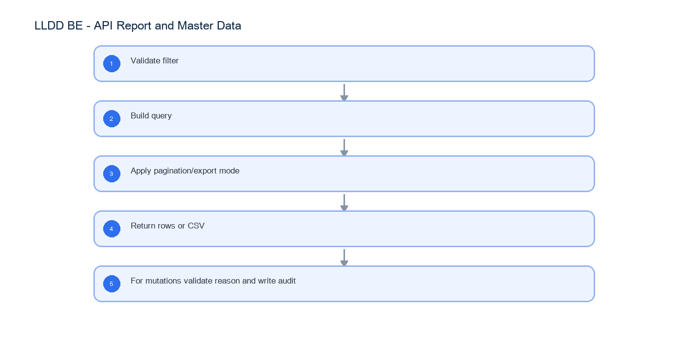

# LLDD BE - API Report and Master Data

SBP Mall - ระบบประกันรายได้ | Low Level Design Document

## 1. Overview

| รายการ | รายละเอียด |
| --- | --- |
| Track | BE |
| Estimate | 24 ชั่วโมง |
| Owner | Peerakorn <Pete> Sakunkaewphithak |
| Objective | ออกแบบ APIs สำหรับรายงานตรวจสอบประกันรายได้ และ Master Data ที่ SBPGI ดูแลเอง (ปัจจัยภายนอก + รายชื่อคู่แข่ง) |

Common contract reference: ทุกหัวข้อ API/FE ต้องยึด LLDD-BE-API-Common-Contracts และ LLDD-FE-Integration-Contracts สำหรับ error/auth/format/pagination/action/RBAC ก่อนลงรายละเอียดเฉพาะหน้าหรือเฉพาะ endpoint

## 2. Screen / Functional Scope

- Report query service
- Excel export (14 columns, SDD slide 60)
- Operator/factor CRUD
- Report filters

## 4. Implementation Flow Diagram (Reference)



_รูปที่ 1: Implementation flow reference: LLDD BE - API Report and Master Data_

## 5. Field, Format, and Validation

| Field / UI | Format | Validation | Behavior |
| --- | --- | --- | --- |
| year | พ.ศ. YYYY | required for report | return 400 if missing |
| status | statusCode string | required | 6 สถานะเอกสาร; verbatim จาก document_statuses |
| result | APPROVE\|REJECT | required for report | maps to consideration latest result |
| region | array/string | optional | 13 region codes; multi-select |
| storeType | array/string | optional | A/B/C/E; multi-select |
| impactedStoreCode | string 5 digits | optional | คง leading zero |
| newStoreCode | string 5 digits | optional | คง leading zero |
| reason | text | required mutation | audit reason |
| page/size | integer | page>=1 size<=100 | pagination |

## 5.1 Input / Progress / Output Contract

| Stage | Contract for implementation |
| --- | --- |
| Input | GET /api/v1/reports/status-summary; GET /api/v1/reports/status-summary/export; GET /api/v1/operators |
| Progress | Validate filter; Build query; Apply pagination/export mode; Return rows or CSV |
| Output | operator_assignments; external_factors; mas_param (SBP) |

### 5.90 Endpoint Implementation Contract

| Endpoint | Use-case owner | Service/repository behavior | Definition of done |
| --- | --- | --- | --- |
| GET /api/v1/reports/status-summary | รายงานตรวจสอบประกันรายได้ | Validate filter | missing year/status/result fails |
| GET /api/v1/reports/status-summary/export | Export Excel | Build query | export uses same filters as preview |
| GET /api/v1/operators | อ่าน operator assignments | Apply pagination/export mode | master edit requires reason |
| POST /api/v1/operators | สร้าง operator assignment | Return rows or CSV | config locked value cannot edit |
| PUT /api/v1/operators/{id} | แก้ operator assignment | For mutations validate reason and write audit | missing year/status/result fails |
| DELETE /api/v1/operators/{id} | ยกเลิก operator assignment | Validate filter | export uses same filters as preview |
| GET /api/v1/factors | อ่านปัจจัยภายนอก | Build query | master edit requires reason |
| POST /api/v1/factors | สร้างปัจจัยภายนอก | Apply pagination/export mode | config locked value cannot edit |
| PUT /api/v1/factors/{code} | แก้ปัจจัยภายนอก | Return rows or CSV | missing year/status/result fails |
| DELETE /api/v1/factors/{code} | ลบปัจจัยภายนอกที่ไม่ถูกใช้งาน | For mutations validate reason and write audit | export uses same filters as preview |

### 5.91 Backend Execution Sequence

| Step | Behavior specific to this LLDD | Failure/test evidence |
| --- | --- | --- |
| 1 | Validate filter | report missing year |
| 2 | Build query | report export |
| 3 | Apply pagination/export mode | factor duplicate |
| 4 | Return rows or CSV | operator audit |
| 5 | For mutations validate reason and write audit | config locked |

## 6. Button / User Action Mapping

| Action | Trigger | API / Service | Expected Result |
| --- | --- | --- | --- |
| Report preview | GET | report.service.search | paginated rows |
| Report export | GET | report.service.exportCsv | csv stream |
| Master mutation | POST/PUT/DELETE | master.service.save | อัปเดต row ของ master |

## 7. API Contract

### GET /api/v1/reports/status-summary

รายงานตรวจสอบประกันรายได้

#### Query Params

```json
{
  "year": 2026,
  "status": "06",
  "result": "APPROVE",
  "region": [
    "RSU"
  ],
  "storeType": [
    "A"
  ],
  "impactedStoreCode": "00788",
  "newStoreCode": "00990",
  "page": 1,
  "size": 20
}
```

#### Request Field Schema

| Field | Type | Required | Constraint / Meaning |
| --- | --- | --- | --- |
| year | integer | Yes | UTF-8; use value domain described by endpoint purpose |
| status | string | Yes | UTF-8; use value domain described by endpoint purpose |
| result | string | No | UTF-8; use value domain described by endpoint purpose |
| region | array<string> | No | JSON array; element type shown in Type column |
| storeType | array<string> | No | JSON array; element type shown in Type column |
| impactedStoreCode | string | No | exactly 5 digits; preserve leading zero |
| newStoreCode | string | No | exactly 5 digits; preserve leading zero |
| page | integer | No | >= 1; default 1 |
| size | integer | No | 1..100; default 20 |

#### Response

```json
{
  "page": 1,
  "size": 20,
  "total": 0,
  "items": []
}
```

#### Response Field Schema

| Field | Type | Required | Constraint / Meaning |
| --- | --- | --- | --- |
| page | integer | Yes | >= 1; default 1 |
| size | integer | Yes | 1..100; default 20 |
| total | integer | Yes | UTF-8; use value domain described by endpoint purpose |
| items | array<object> | Yes | JSON array; element type shown in Type column |

### GET /api/v1/reports/status-summary/export

Export Excel

#### Query Params

```json
{
  "year": 2026,
  "status": "06",
  "result": "APPROVE",
  "region": [
    "RSU"
  ],
  "storeType": [
    "A"
  ],
  "impactedStoreCode": "00788",
  "newStoreCode": "00990"
}
```

#### Request Field Schema

| Field | Type | Required | Constraint / Meaning |
| --- | --- | --- | --- |
| year | integer | Yes | UTF-8; use value domain described by endpoint purpose |
| status | string | Yes | UTF-8; use value domain described by endpoint purpose |
| result | string | No | UTF-8; use value domain described by endpoint purpose |
| region | array<string> | No | JSON array; element type shown in Type column |
| storeType | array<string> | No | JSON array; element type shown in Type column |
| impactedStoreCode | string | No | exactly 5 digits; preserve leading zero |
| newStoreCode | string | No | exactly 5 digits; preserve leading zero |

#### Response

```json
{
  "fileName": "insurance-verification-2026.xlsx"
}
```

#### Response Field Schema

| Field | Type | Required | Constraint / Meaning |
| --- | --- | --- | --- |
| fileName | string | Yes | UTF-8; use value domain described by endpoint purpose |

### GET /api/v1/operators

อ่าน operator assignments

#### Query Params

```json
{
  "employeeId": "E001",
  "positionCode": "06",
  "active": true,
  "page": 1,
  "size": 20
}
```

#### Request Field Schema

| Field | Type | Required | Constraint / Meaning |
| --- | --- | --- | --- |
| employeeId | string | No | UTF-8; use value domain described by endpoint purpose |
| positionCode | string | No | UTF-8; use value domain described by endpoint purpose |
| active | boolean | No | UTF-8; use value domain described by endpoint purpose |
| page | integer | No | >= 1; default 1 |
| size | integer | No | 1..100; default 20 |

#### Response

```json
{
  "page": 1,
  "size": 20,
  "total": 1,
  "items": [
    {
      "id": 101,
      "employeeId": "E001",
      "employeeName": "สมชาย ใจดี",
      "positionCode": "06",
      "zoneCode": "01",
      "active": true
    }
  ]
}
```

#### Response Field Schema

| Field | Type | Required | Constraint / Meaning |
| --- | --- | --- | --- |
| page | integer | Yes | >= 1; default 1 |
| size | integer | Yes | 1..100; default 20 |
| total | integer | Yes | UTF-8; use value domain described by endpoint purpose |
| items | array<object> | Yes | JSON array; element type shown in Type column |
| items[].id | integer | Yes | UTF-8; use value domain described by endpoint purpose |
| items[].employeeId | string | Yes | UTF-8; use value domain described by endpoint purpose |
| items[].employeeName | string | Yes | UTF-8; use value domain described by endpoint purpose |
| items[].positionCode | string | Yes | UTF-8; use value domain described by endpoint purpose |
| items[].zoneCode | string | Yes | UTF-8; use value domain described by endpoint purpose |
| items[].active | boolean | Yes | UTF-8; use value domain described by endpoint purpose |

### POST /api/v1/operators

สร้าง operator assignment

#### Request

```json
{
  "employeeId": "E001",
  "positionCode": "06",
  "zoneCode": "01",
  "active": true,
  "reason": "มอบหมายผู้ปฏิบัติงาน"
}
```

#### Request Field Schema

| Field | Type | Required | Constraint / Meaning |
| --- | --- | --- | --- |
| employeeId | string | Yes | UTF-8; use value domain described by endpoint purpose |
| positionCode | string | Yes | UTF-8; use value domain described by endpoint purpose |
| zoneCode | string | Yes | UTF-8; use value domain described by endpoint purpose |
| active | boolean | Yes | UTF-8; use value domain described by endpoint purpose |
| reason | string | Yes | trimmed UTF-8 Thai text; required by operation/business rule |

#### Response

```json
{
  "id": 101,
  "employeeId": "E001",
  "positionCode": "06",
  "zoneCode": "01",
  "active": true
}
```

#### Response Field Schema

| Field | Type | Required | Constraint / Meaning |
| --- | --- | --- | --- |
| id | integer | Yes | UTF-8; use value domain described by endpoint purpose |
| employeeId | string | Yes | UTF-8; use value domain described by endpoint purpose |
| positionCode | string | Yes | UTF-8; use value domain described by endpoint purpose |
| zoneCode | string | Yes | UTF-8; use value domain described by endpoint purpose |
| active | boolean | Yes | UTF-8; use value domain described by endpoint purpose |

### PUT /api/v1/operators/{id}

แก้ operator assignment

#### Request

```json
{
  "positionCode": "08",
  "zoneCode": "01",
  "active": true,
  "reason": "ย้ายหน้าที่"
}
```

#### Request Field Schema

| Field | Type | Required | Constraint / Meaning |
| --- | --- | --- | --- |
| positionCode | string | Yes | UTF-8; use value domain described by endpoint purpose |
| zoneCode | string | Yes | UTF-8; use value domain described by endpoint purpose |
| active | boolean | Yes | UTF-8; use value domain described by endpoint purpose |
| reason | string | Yes | trimmed UTF-8 Thai text; required by operation/business rule |

#### Response

```json
{
  "id": 101,
  "employeeId": "E001",
  "positionCode": "08",
  "zoneCode": "01",
  "active": true
}
```

#### Response Field Schema

| Field | Type | Required | Constraint / Meaning |
| --- | --- | --- | --- |
| id | integer | Yes | UTF-8; use value domain described by endpoint purpose |
| employeeId | string | Yes | UTF-8; use value domain described by endpoint purpose |
| positionCode | string | Yes | UTF-8; use value domain described by endpoint purpose |
| zoneCode | string | Yes | UTF-8; use value domain described by endpoint purpose |
| active | boolean | Yes | UTF-8; use value domain described by endpoint purpose |

### DELETE /api/v1/operators/{id}

ยกเลิก operator assignment

#### Request

```json
{
  "reason": "สิ้นสุดการมอบหมาย"
}
```

#### Request Field Schema

| Field | Type | Required | Constraint / Meaning |
| --- | --- | --- | --- |
| reason | string | Yes | trimmed UTF-8 Thai text; required by operation/business rule |

#### Response

```json
{
  "id": 101,
  "deleted": true
}
```

#### Response Field Schema

| Field | Type | Required | Constraint / Meaning |
| --- | --- | --- | --- |
| id | integer | Yes | UTF-8; use value domain described by endpoint purpose |
| deleted | boolean | Yes | UTF-8; use value domain described by endpoint purpose |

### GET /api/v1/factors

อ่านปัจจัยภายนอก

#### Query Params

```json
{
  "q": "ก่อสร้าง",
  "active": true,
  "page": 1,
  "size": 20
}
```

#### Request Field Schema

| Field | Type | Required | Constraint / Meaning |
| --- | --- | --- | --- |
| q | string | No | UTF-8; use value domain described by endpoint purpose |
| active | boolean | No | UTF-8; use value domain described by endpoint purpose |
| page | integer | No | >= 1; default 1 |
| size | integer | No | 1..100; default 20 |

#### Response

```json
{
  "page": 1,
  "size": 20,
  "total": 1,
  "items": [
    {
      "factorCode": "ROAD",
      "factorName": "ก่อสร้างถนน",
      "description": "ปิดช่องทางจราจร",
      "active": true
    }
  ]
}
```

#### Response Field Schema

| Field | Type | Required | Constraint / Meaning |
| --- | --- | --- | --- |
| page | integer | Yes | >= 1; default 1 |
| size | integer | Yes | 1..100; default 20 |
| total | integer | Yes | UTF-8; use value domain described by endpoint purpose |
| items | array<object> | Yes | JSON array; element type shown in Type column |
| items[].factorCode | string | Yes | UTF-8; use value domain described by endpoint purpose |
| items[].factorName | string | Yes | UTF-8; use value domain described by endpoint purpose |
| items[].description | string | Yes | UTF-8; use value domain described by endpoint purpose |
| items[].active | boolean | Yes | UTF-8; use value domain described by endpoint purpose |

### POST /api/v1/factors

สร้างปัจจัยภายนอก

#### Request

```json
{
  "factorCode": "ROAD",
  "factorName": "ก่อสร้างถนน",
  "description": "ปิดช่องทางจราจร",
  "active": true,
  "reason": "เพิ่มปัจจัยใหม่"
}
```

#### Request Field Schema

| Field | Type | Required | Constraint / Meaning |
| --- | --- | --- | --- |
| factorCode | string | Yes | UTF-8; use value domain described by endpoint purpose |
| factorName | string | Yes | UTF-8; use value domain described by endpoint purpose |
| description | string | Yes | UTF-8; use value domain described by endpoint purpose |
| active | boolean | Yes | UTF-8; use value domain described by endpoint purpose |
| reason | string | Yes | trimmed UTF-8 Thai text; required by operation/business rule |

#### Response

```json
{
  "factorCode": "ROAD",
  "factorName": "ก่อสร้างถนน",
  "active": true
}
```

#### Response Field Schema

| Field | Type | Required | Constraint / Meaning |
| --- | --- | --- | --- |
| factorCode | string | Yes | UTF-8; use value domain described by endpoint purpose |
| factorName | string | Yes | UTF-8; use value domain described by endpoint purpose |
| active | boolean | Yes | UTF-8; use value domain described by endpoint purpose |

### PUT /api/v1/factors/{code}

แก้ปัจจัยภายนอก

#### Request

```json
{
  "factorName": "ก่อสร้างและปิดถนน",
  "description": "ปิดช่องทางจราจรบางส่วน",
  "active": true,
  "reason": "ปรับคำอธิบาย"
}
```

#### Request Field Schema

| Field | Type | Required | Constraint / Meaning |
| --- | --- | --- | --- |
| factorName | string | Yes | UTF-8; use value domain described by endpoint purpose |
| description | string | Yes | UTF-8; use value domain described by endpoint purpose |
| active | boolean | Yes | UTF-8; use value domain described by endpoint purpose |
| reason | string | Yes | trimmed UTF-8 Thai text; required by operation/business rule |

#### Response

```json
{
  "factorCode": "ROAD",
  "factorName": "ก่อสร้างและปิดถนน",
  "active": true
}
```

#### Response Field Schema

| Field | Type | Required | Constraint / Meaning |
| --- | --- | --- | --- |
| factorCode | string | Yes | UTF-8; use value domain described by endpoint purpose |
| factorName | string | Yes | UTF-8; use value domain described by endpoint purpose |
| active | boolean | Yes | UTF-8; use value domain described by endpoint purpose |

### DELETE /api/v1/factors/{code}

ลบปัจจัยภายนอกที่ไม่ถูกใช้งาน

#### Request

```json
{
  "reason": "ยกเลิกค่าทดสอบ"
}
```

#### Request Field Schema

| Field | Type | Required | Constraint / Meaning |
| --- | --- | --- | --- |
| reason | string | Yes | trimmed UTF-8 Thai text; required by operation/business rule |

#### Response

```json
{
  "factorCode": "ROAD",
  "deleted": true
}
```

#### Response Field Schema

| Field | Type | Required | Constraint / Meaning |
| --- | --- | --- | --- |
| factorCode | string | Yes | UTF-8; use value domain described by endpoint purpose |
| deleted | boolean | Yes | UTF-8; use value domain described by endpoint purpose |

## 8. Reference DB Mapping (No Database Page Work)

ส่วนนี้เป็นข้อมูลอ้างอิงสำหรับการ implement API/Job เท่านั้น ไม่ใช่งานสร้างหน้า Database, ไม่ใช่งานออกแบบ DB page และไม่ถูกนับเป็น deliverable แยกของ FE/BE

| Table / Object | R/W | Usage |
| --- | --- | --- |
| compensation_documents | R | แหล่งข้อมูลรายงานและ filter status/year |
| compensation_histories | R | ยอดเงินชดเชยและงวด statement |
| consideration_logs | R | ผลพิจารณาล่าสุด APPROVE/REJECT |
| operator_assignments | R/W | ผู้ปฏิบัติงาน |
| external_factors | R/W | master ปัจจัยภายนอก |
| mas_param (SBP) | R/W | ค่ากำหนดกลางในตารางของระบบ SBP เดิม |

## 9. Skeleton Code (store-backend + BFF)

โครงโค้ดตั้งต้นของเอกสารฉบับนี้ ยึด convention จริงของ `srm-sps-spsap-store-backend` (NestJS 11 + TypeORM, schema `sps_store`, custom provider `DATA_SOURCE` ที่ route SELECT ไป slave pool) และ `srm-sps-spsap-sbp-bff` (ไม่มี DB, forward ผ่าน client service). ทุกจุดที่ต้องเติมกำกับด้วย `// TODO:` และ response ทุกเส้นถูกห่อเป็น `{success, data}` โดย ResponseInterceptor อยู่แล้ว จึงห้าม service ห่อซ้ำ

#### 9.1 ผังไฟล์ที่ต้องสร้าง

| Path | หน้าที่ |
| --- | --- |
| store-backend · src/modules/sbpgi-report-and-master-data/sbpgi-report-and-master-data.controller.ts | route ทั้งหมดของเอกสารนี้ (6 เส้น) + `@UseGuards(HttpHeaderGuard)` + `@UserId()` |
| store-backend · src/modules/sbpgi-report-and-master-data/sbpgi-report-and-master-data.service.ts | business logic — inject `'DATA_SOURCE'` แล้วยิง raw SQL, mutation ใช้ QueryRunner transaction |
| store-backend · src/modules/sbpgi-report-and-master-data/sbpgi-report-and-master-data.sql.ts | เก็บ SQL ต่อ endpoint (คัดจากหัวข้อ 10) แยกออกจาก service ให้ทดสอบ/รีวิวง่าย |
| store-backend · src/modules/sbpgi-report-and-master-data/dto/sbpgi-report-and-master-data.dto.ts | DTO + class-validator ตาม validation ในหัวข้อฟิลด์ของเอกสารนี้ |
| store-backend · src/modules/sbpgi-report-and-master-data/sbpgi-report-and-master-data.module.ts | ประกอบ controller/service/providers แล้ว register ที่ `app.module.ts` |
| store-backend · src/entitys/compensation-documents.entity.ts | entity ของ `compensation_documents` (`@Entity({schema: process.env.DB_SCHEMA})`, ไม่ประกาศ relation) — **entity ร่วมหลายเอกสาร: ประกาศครั้งเดียวแล้วอ้างอิง อย่าสร้างซ้ำ** |
| store-backend · src/entitys/compensation-histories.entity.ts | entity ของ `compensation_histories` (`@Entity({schema: process.env.DB_SCHEMA})`, ไม่ประกาศ relation) |
| store-backend · src/entitys/consideration-logs.entity.ts | entity ของ `consideration_logs` (`@Entity({schema: process.env.DB_SCHEMA})`, ไม่ประกาศ relation) — **entity ร่วมหลายเอกสาร: ประกาศครั้งเดียวแล้วอ้างอิง อย่าสร้างซ้ำ** |
| store-backend · src/providers/sbpgi/sbpgi.ts | repository provider แบบ factory ผูก token string กับ `DATA_SOURCE` — **ไฟล์ร่วมของทุกเอกสาร BE ให้ merge array เพิ่ม ห้ามเขียนทับ** |
| store-backend · sql/deploy-sbpgi-report-and-master-data.sql | DDL production แบบ idempotent (ทีมนี้ไม่ใช้ migration เป็นหลัก) |
| BFF · src/common/client-services/sbpgi-client.service.ts | client ต่อจาก `BaseClientService` ตั้ง baseUrl + `x-api-key` ตอน `onModuleInit` |
| BFF · src/modules/sbpgi-report-and-master-data/sbpgi-report-and-master-data.controller.ts | route ฝั่ง BFF prefix `/bff/sbpgi/…` + `@UseGuards(AuthGuard('jwt'))` |
| BFF · src/modules/sbpgi-report-and-master-data/sbpgi-report-and-master-data.service.ts | แนบ `x-user-id` / `x-user-group-id` / `x-user-permissions` แล้ว forward ไป backend |

เส้นที่ไม่ต้อง implement ใหม่ในเอกสารนี้:

| Endpoint | จุดประสงค์ | เหตุผล |
| --- | --- | --- |
| GET /api/v1/operators | อ่าน operator assignments | **ตัดออกจากดีไซน์แล้ว** (มติ 2026-08-05/06) — ใช้ auth-backend group + scope (จัดการที่หน้า /setting/manage-user-rights) |
| POST /api/v1/operators | สร้าง operator assignment | **ตัดออกจากดีไซน์แล้ว** (มติ 2026-08-05/06) — ใช้ auth-backend group + scope (จัดการที่หน้า /setting/manage-user-rights) |
| PUT /api/v1/operators/{id} | แก้ operator assignment | **ตัดออกจากดีไซน์แล้ว** (มติ 2026-08-05/06) — ใช้ auth-backend group + scope (จัดการที่หน้า /setting/manage-user-rights) |
| DELETE /api/v1/operators/{id} | ยกเลิก operator assignment | **ตัดออกจากดีไซน์แล้ว** (มติ 2026-08-05/06) — ใช้ auth-backend group + scope (จัดการที่หน้า /setting/manage-user-rights) |

#### 9.2 Controller (store-backend)

```ts
// src/modules/sbpgi-report-and-master-data/sbpgi-report-and-master-data.controller.ts  (ส่วนที่ 1/2 — คลาสเดียวกัน)
import { Body, Controller, Get, Post, Query, UseGuards } from '@nestjs/common';
import { HttpHeaderGuard } from '../../guards/http-header.guard';
import { UserId } from '../../common/decorators/user-id.decorator';
import { SbpgiReportAndMasterDataService } from './sbpgi-report-and-master-data.service';
import { ReportAndMasterDataQueryDto, CreateFactorsBodyDto } from './dto/sbpgi-report-and-master-data.dto';

// LLDD BE - API Report and Master Data
// BFF เรียกด้วย x-api-key และแนบ x-user-id / x-user-group-id / x-user-permissions มาให้
@Controller('sbpgi')
@UseGuards(HttpHeaderGuard)
export class SbpgiReportAndMasterDataController {
  constructor(private readonly service: SbpgiReportAndMasterDataService) {}

  // GET /api/v1/reports/status-summary — รายงานตรวจสอบประกันรายได้
  @Get('reports/status-summary')
  getReportsStatusSummary(@Query() query: ReportAndMasterDataQueryDto, @UserId() userId: string) {
    // TODO: ตรวจ x-user-permissions ก่อนเรียก service ถ้า endpoint นี้จำกัดสิทธิ์เมนู
    return this.service.getReportsStatusSummary(query, userId);
  }

  // GET /api/v1/reports/status-summary/export — Export Excel
  @Get('reports/status-summary/export')
  exportStatusSummary(@Query() query: ReportAndMasterDataQueryDto, @UserId() userId: string) {
    // TODO: ตรวจ x-user-permissions ก่อนเรียก service ถ้า endpoint นี้จำกัดสิทธิ์เมนู
    return this.service.exportStatusSummary(query, userId);
  }

  // GET /api/v1/factors — อ่านปัจจัยภายนอก
  @Get('factors')
  getFactors(@Query() query: ReportAndMasterDataQueryDto, @UserId() userId: string) {
    // TODO: ตรวจ x-user-permissions ก่อนเรียก service ถ้า endpoint นี้จำกัดสิทธิ์เมนู
    return this.service.getFactors(query, userId);
  }

  // POST /api/v1/factors — สร้างปัจจัยภายนอก
  @Post('factors')
  createFactors(@Body() body: CreateFactorsBodyDto, @UserId() userId: string) {
    // TODO: ตรวจ x-user-permissions ก่อนเรียก service ถ้า endpoint นี้จำกัดสิทธิ์เมนู
    return this.service.createFactors(body, userId);
  }
```

```ts
// src/modules/sbpgi-report-and-master-data/sbpgi-report-and-master-data.controller.ts  (ส่วนที่ 2/2 — คลาสเดียวกัน)
// import เพิ่ม: UpdateFactorsByCodeBodyDto, RemoveFactorsByCodeBodyDto
// (method ต่อไปนี้อยู่ในคลาส SbpgiReportAndMasterDataController เดียวกับส่วนที่ 1)

  // PUT /api/v1/factors/{code} — แก้ปัจจัยภายนอก
  @Put('factors/:code')
  updateFactorsByCode(
    @Param('code') code: string,
    @Body() body: UpdateFactorsByCodeBodyDto,
    @UserId() userId: string,
  ) {
    // TODO: ตรวจ x-user-permissions ก่อนเรียก service ถ้า endpoint นี้จำกัดสิทธิ์เมนู
    return this.service.updateFactorsByCode(code, body, userId);
  }

  // DELETE /api/v1/factors/{code} — ลบปัจจัยภายนอกที่ไม่ถูกใช้งาน
  @Delete('factors/:code')
  removeFactorsByCode(
    @Param('code') code: string,
    @Body() body: RemoveFactorsByCodeBodyDto,
    @UserId() userId: string,
  ) {
    // TODO: ตรวจ x-user-permissions ก่อนเรียก service ถ้า endpoint นี้จำกัดสิทธิ์เมนู
    return this.service.removeFactorsByCode(code, body, userId);
  }
}
```

#### 9.3 DTO + Validation

```ts
// src/modules/sbpgi-report-and-master-data/dto/sbpgi-report-and-master-data.dto.ts
import { Type } from 'class-transformer';
import {
  IsArray, IsBoolean, IsIn, IsInt, IsNotEmpty, IsNumber, IsObject, IsOptional,
  IsString, Matches, Max, MaxLength, Min,
} from 'class-validator';

// ValidationPipe ระดับ global ตั้ง whitelist + forbidNonWhitelisted + transform ไว้แล้ว (main.ts)
// property ที่ไม่ประกาศที่นี่จะถูก reject เป็น 400 อัตโนมัติ

// query ร่วมของ GET ทุกเส้นในโมดูลนี้ (path param ใช้ @Param แยก)
export class ReportAndMasterDataQueryDto {
  /** return 400 if missing · required เฉพาะบาง endpoint — ตรวจซ้ำใน service */
  @IsOptional()
  @Type(() => Number)
  @IsInt()
  @Min(2500)
  @Max(2600)
  year?: number;

  /** 6 สถานะเอกสาร; verbatim จาก document_statuses · required เฉพาะบาง endpoint — ตรวจซ้ำใน se… */
  @IsOptional()
  @IsString()
  status?: string;

  /** maps to consideration latest result · required เฉพาะบาง endpoint — ตรวจซ้ำใน service */
  @IsOptional()
  @IsString()
  @IsIn(['APPROVE', 'REJECT'])
  result?: string;

  /** 13 region codes; multi-select */
  @IsOptional()
  @IsArray()
  @IsString({ each: true })
  region?: string[];

  /** A/B/C/E; multi-select */
  @IsOptional()
  @IsArray()
  @IsString({ each: true })
  storeType?: string[];

  /** คง leading zero */
  @IsOptional()
  @IsString()
  @Matches(/^\d{5}$/, { message: 'รหัสร้านต้องเป็นตัวเลข 5 หลัก และคงเลขศูนย์นำหน้า' })
  impactedStoreCode?: string;

  // TODO: เพิ่ม property ที่เหลือของ payload นี้ให้ครบตามหัวข้อฟิลด์ของเอกสารนี้
}
```

```ts
// body ของ POST /api/v1/factors
export class CreateFactorsBodyDto {
  @IsNotEmpty()
  @IsString()
  factorCode: string;

  @IsNotEmpty()
  @IsString()
  factorName: string;

  @IsNotEmpty()
  @IsString()
  description: string;

  @IsNotEmpty()
  @Type(() => Boolean)
  @IsBoolean()
  active: boolean;

  /** audit reason */
  @IsNotEmpty()
  @IsString()
  @MaxLength(500)
  reason: string;
}
```

```ts
// body ของ PUT /api/v1/factors/{code}
export class UpdateFactorsByCodeBodyDto {
  @IsNotEmpty()
  @IsString()
  factorName: string;

  @IsNotEmpty()
  @IsString()
  description: string;

  @IsNotEmpty()
  @Type(() => Boolean)
  @IsBoolean()
  active: boolean;

  /** audit reason */
  @IsNotEmpty()
  @IsString()
  @MaxLength(500)
  reason: string;
}
```

```ts
// body ของ DELETE /api/v1/factors/{code}
export class RemoveFactorsByCodeBodyDto {
  /** audit reason */
  @IsNotEmpty()
  @IsString()
  @MaxLength(500)
  reason: string;
}
```

#### 9.4 Service (inject `DATA_SOURCE` + raw SQL)

service ประกาศ method ครบทุกเส้นที่ controller เรียก และ **signature มาจากแหล่งเดียวกับ controller** (จำนวน/ลำดับพารามิเตอร์จึงตรงกันเสมอ) — เส้นที่ยังไม่ได้ implement เป็น stub ที่ `throw new NotImplementedException(...)` ให้ TypeScript compile ผ่านตั้งแต่วันแรก

```ts
// src/modules/sbpgi-report-and-master-data/sbpgi-report-and-master-data.service.ts
import { Inject, Injectable, Logger, NotFoundException, NotImplementedException } from '@nestjs/common';
import { DataSource } from 'typeorm';
import { SBPGI_SQL } from './sbpgi-report-and-master-data.sql';

@Injectable()
export class SbpgiReportAndMasterDataService {
  private readonly logger = new Logger(SbpgiReportAndMasterDataService.name);

  constructor(
    // DATA_SOURCE override query(): SELECT/WITH ไป slave pool, write ไป master
    @Inject('DATA_SOURCE') private readonly dataSource: DataSource,
  ) {}

  // GET /api/v1/reports/status-summary — รายงานตรวจสอบประกันรายได้
  async getReportsStatusSummary(query: ReportAndMasterDataQueryDto, userId: string) {
    const page = Number(query.page ?? 1);
    const size = Math.min(Number(query.size ?? 20), 100);
    // SQL เต็มอยู่ในหัวข้อ Database SQL ของเอกสารนี้ (คีย์ 'GET /api/v1/reports/status-summary')
    // ⚠️ SQL ตัวอย่างบางเส้นเขียนด้วย named parameter (:size/:offset) แต่ dataSource.query()
    //    รับเฉพาะ positional $1..$n — ต้องแปลงชื่อเป็นลำดับก่อน หรือใช้ QueryBuilder แทน
    const rows = await this.dataSource.query(SBPGI_SQL.getReportsStatusSummary, [
      // TODO: เรียงพารามิเตอร์ให้ตรงกับ $1..$n ของ SQL จริง
      userId, (page - 1) * size, size,
    ]);
    // TODO: total ต้องมาจาก COUNT(*) แยก query หรือ window function ไม่ใช่ rows.length
    return { page, size, total: rows.length, items: rows };
  }

  // GET /api/v1/reports/status-summary/export — Export Excel
  async exportStatusSummary(query: ReportAndMasterDataQueryDto, userId: string) {
    // TODO: implement ตาม business rule ของ GET /api/v1/reports/status-summary/export
    //       (SQL อยู่ในหัวข้อ Database SQL คีย์ 'GET /api/v1/reports/status-summary/export')
    throw new NotImplementedException('exportStatusSummary ยังไม่ implement');
  }

  // GET /api/v1/factors — อ่านปัจจัยภายนอก
  async getFactors(query: ReportAndMasterDataQueryDto, userId: string) {
    // TODO: implement ตาม business rule ของ GET /api/v1/factors
    //       (SQL อยู่ในหัวข้อ Database SQL คีย์ 'GET /api/v1/factors')
    throw new NotImplementedException('getFactors ยังไม่ implement');
  }

  // POST /api/v1/factors — สร้างปัจจัยภายนอก
  // mutation ต้องอยู่ใน transaction เดียว (ไม่มี audit ของ master แล้ว · 2026-08-07)
  async createFactors(body: CreateFactorsBodyDto, userId: string) {
    const runner = this.dataSource.createQueryRunner();
    await runner.connect();
    await runner.startTransaction();
    try {
      // TODO: lock แถวเป้าหมายของ external_factors ด้วย SELECT ... FOR UPDATE ก่อนเขียน
      const [current] = await runner.query(SBPGI_SQL.createFactorsLock, [body.docNo]);
      if (!current) {
        throw new NotFoundException('ไม่พบข้อมูลที่ต้องการ');
      }
      await runner.query(SBPGI_SQL.createFactors, [/* TODO: ผูกค่าจาก body */]);
      await runner.commitTransaction();
      return { message: 'saved' };
    } catch (error) {
      await runner.rollbackTransaction();
      this.logger.error(error);
      throw error;
    } finally {
      await runner.release();
    }
  }

  // PUT /api/v1/factors/{code} — แก้ปัจจัยภายนอก
  async updateFactorsByCode(code: string, body: UpdateFactorsByCodeBodyDto, userId: string) {
    // TODO: implement ตาม business rule ของ PUT /api/v1/factors/{code}
    //       (SQL อยู่ในหัวข้อ Database SQL คีย์ 'PUT /api/v1/factors/{code}')
    throw new NotImplementedException('updateFactorsByCode ยังไม่ implement');
  }

  // DELETE /api/v1/factors/{code} — ลบปัจจัยภายนอกที่ไม่ถูกใช้งาน
  async removeFactorsByCode(code: string, body: RemoveFactorsByCodeBodyDto, userId: string) {
    // TODO: implement ตาม business rule ของ DELETE /api/v1/factors/{code}
    //       (SQL อยู่ในหัวข้อ Database SQL คีย์ 'DELETE /api/v1/factors/{code}')
    throw new NotImplementedException('removeFactorsByCode ยังไม่ implement');
  }
}
```

#### 9.5 Entity (TypeORM)

```ts
// src/entitys/compensation-documents.entity.ts
import { Column, Entity, PrimaryColumn } from 'typeorm';

@Entity({ name: 'compensation_documents', schema: process.env.DB_SCHEMA })
export class CompensationDocument {
  @PrimaryColumn({ name: 'doc_no', type: 'varchar', length: 12 })
  docNo: string;

  @Column({ name: 'impact_process_id', type: 'bigint', nullable: true })
  impactProcessId?: number;

  @Column({ name: 'impacted_store_code', type: 'char', length: 5 })
  impactedStoreCode: string;

  @Column({ name: 'status_code', type: 'varchar', length: 2 })
  statusCode: string;

  @Column({ name: 'current_section_code', type: 'varchar', length: 2 })
  currentSectionCode: string;

  @Column({ name: 'round_no', type: 'int', nullable: true })
  roundNo?: number;

  @Column({ name: 'loop_no', type: 'int', nullable: true })
  loopNo?: number;

  @Column({ name: 'statement_id', type: 'varchar', length: 30, nullable: true })
  statementId?: string;

  @Column({ name: 'statement_date', type: 'date', nullable: true })
  statementDate?: Date;

  @Column({ name: 'account_year', type: 'int', nullable: true })
  accountYear?: number;

  @Column({ name: 'account_month', type: 'int', nullable: true })
  accountMonth?: number;

  @Column({ name: 'compensate_amount', type: 'numeric', precision: 15, scale: 2, nullable: true })
  compensateAmount?: string;

  @Column({ name: 'allmap_url', type: 'text', nullable: true })
  allmapUrl?: string;

  @Column({ name: 'approver_snapshot', type: 'jsonb', nullable: true })
  approverSnapshot?: Record<string, unknown>;

  @Column({ name: 'created_at', type: 'timestamptz', nullable: true })
  createdAt?: Date;

  @Column({ name: 'updated_at', type: 'timestamptz', nullable: true })
  updatedAt?: Date;

  // TODO: ตรวจความยาว/precision กับ DDL จริงใน sql/deploy-sbpgi-*.sql ก่อน merge
  //       entity ชุดนี้ไม่ประกาศ relation ตาม convention (join ด้วย raw SQL)
}
```

```ts
// src/entitys/compensation-histories.entity.ts
import { Column, Entity, PrimaryColumn } from 'typeorm';

@Entity({ name: 'compensation_histories', schema: process.env.DB_SCHEMA })
export class CompensationHistory {
  @PrimaryColumn({ name: 'id', type: 'bigint' })
  id: number;

  @Column({ name: 'store_code', type: 'char', length: 5 })
  storeCode: string;

  @Column({ name: 'ref_doc_no', type: 'varchar', length: 12, nullable: true })
  refDocNo?: string;

  @Column({ name: 'compensate_year', type: 'int' })
  compensateYear: number;

  @Column({ name: 'compensate_month', type: 'int' })
  compensateMonth: number;

  @Column({ name: 'compensate_amount', type: 'numeric', precision: 15, scale: 2 })
  compensateAmount: string;

  @Column({ name: 'submit_account_month', type: 'varchar', length: 7, nullable: true })
  submitAccountMonth?: string;

  @Column({ name: 'submit_status', type: 'char', length: 1, nullable: true })
  submitStatus?: string;

  // TODO: ตรวจความยาว/precision กับ DDL จริงใน sql/deploy-sbpgi-*.sql ก่อน merge
  //       entity ชุดนี้ไม่ประกาศ relation ตาม convention (join ด้วย raw SQL)
}
```

ตารางที่เหลือของเอกสารนี้ (`consideration_logs`, `external_factors`) ใช้รูปแบบ entity เดียวกัน — คอลัมน์อ้างจาก `database.md`

ตารางที่ **ไม่ต้องสร้าง entity** เพราะใช้ของระบบเดิม/workflow engine:

| Object | R/W | ใช้ของระบบเดิมตัวไหน |
| --- | --- | --- |
| operator_assignments | R/W | auth-backend group + scope (business_user_group) |
| mas_param | R/W | mas_param (store-backend) |

#### 9.6 Repository Providers + Module wiring

```ts
// src/providers/sbpgi/sbpgi.ts — repository provider แบบ factory (ไม่ใช้ TypeOrmModule.forFeature)
// convention ของโฟลเดอร์ providers คือ 1 ไฟล์ต่อโดเมน ตั้งชื่อตามโดเมน (business_user/business_user.ts,
// common_code/common_code.ts …) ไม่ใช่ index.ts
//
// ⚠️ ไฟล์นี้ใช้ร่วมกันทุกเอกสาร BE ของ SBPGI — ให้ **merge array เพิ่ม** เข้าไฟล์เดิม ห้ามเขียนทับ
//    (ชื่อ const แยกต่อเอกสารไว้แล้วเพื่อไม่ให้ชนกัน)
import { DataSource } from 'typeorm';
import { CompensationDocument } from '../../entitys/compensation-documents.entity';
import { CompensationHistory } from '../../entitys/compensation-histories.entity';
import { ConsiderationLog } from '../../entitys/consideration-logs.entity';

export const sbpgiReportAndMasterDataProviders = [
  {
    provide: 'COMPENSATION_DOCUMENT_REPOSITORY',
    useFactory: (dataSource: DataSource) => dataSource.getRepository(CompensationDocument),
    inject: ['DATA_SOURCE'],
  },
  {
    provide: 'COMPENSATION_HISTORIES_REPOSITORY',
    useFactory: (dataSource: DataSource) => dataSource.getRepository(CompensationHistory),
    inject: ['DATA_SOURCE'],
  },
  {
    provide: 'CONSIDERATION_LOG_REPOSITORY',
    useFactory: (dataSource: DataSource) => dataSource.getRepository(ConsiderationLog),
    inject: ['DATA_SOURCE'],
  },
];

// src/modules/sbpgi-report-and-master-data/sbpgi-report-and-master-data.module.ts
import { MiddlewareConsumer, Module, NestModule } from '@nestjs/common';
import { DatabaseModule } from '../../database/database.module';
// UserContextMiddleware อ่าน header x-user-id แล้วเซ็ต request.userId ที่ @UserId() ใช้
// — app.module.ts **ไม่ได้** apply แบบ global (มีแค่ HttpContext/LoggerContext) แต่ละโมดูลต้อง apply เอง
// (ดู evaluation-process.module.ts / inform-evaluate.module.ts / cooperation-request.module.ts)
import { UserContextMiddleware } from '../../common/middleware/user-context.middleware';
import { sbpgiReportAndMasterDataProviders } from '../../providers/sbpgi/sbpgi';
import { SbpgiReportAndMasterDataController } from './sbpgi-report-and-master-data.controller';
import { SbpgiReportAndMasterDataService } from './sbpgi-report-and-master-data.service';

@Module({
  imports: [DatabaseModule],
  controllers: [SbpgiReportAndMasterDataController],
  providers: [SbpgiReportAndMasterDataService, ...sbpgiReportAndMasterDataProviders],
  exports: [SbpgiReportAndMasterDataService],
})
export class SbpgiReportAndMasterDataModule implements NestModule {
  configure(consumer: MiddlewareConsumer) {
    // ถ้าไม่ apply ตรงนี้ userId จะเป็น undefined เงียบ ๆ ทุก endpoint
    consumer.apply(UserContextMiddleware).forRoutes(SbpgiReportAndMasterDataController);
  }
}
// TODO: register module นี้ใน app.module.ts (imports) พร้อมกับโมดูล SBPGI ตัวอื่น
```

#### 9.7 BFF Proxy (module + controller + client service)

BFF ยังไม่มีฟีเจอร์ประกันรายได้เลย จึงต้องสร้าง module ใหม่ + client service ใหม่ทั้งชุด และเลือก prefix แบบเดียวทั้งโมดูล (ที่นี่ใช้ `/bff/sbpgi/…`) เพื่อไม่ให้ปนแบบที่มี/ไม่มี `/bff` เหมือนโมดูลเดิม

```ts
// src/common/client-services/sbpgi-client.service.ts
import { Injectable, Logger, OnModuleInit } from '@nestjs/common';
import { BaseClientService } from './base-client.service';

@Injectable()
export class SbpgiClientService extends BaseClientService implements OnModuleInit {
  protected logger: Logger = new Logger(SbpgiClientService.name);

  onModuleInit() {
    // TODO: ถ้า deploy SBPGI แยก service ให้เพิ่ม API_SBPGI_BACKEND_* ใน AppConfigService
    //       ตอนนี้ชี้ store backend ตัวเดียวกับ StoreClientService
    this.defaultHeaders[this.config.api.store.key.name] = this.config.api.store.key.value;
    this.baseUrl = this.config.api.store.url;
  }
}
// BaseClientService แกะ { success, data } ให้แล้ว — service ฝั่ง BFF จึงได้ data ตรง ๆ
// TODO: เพิ่ม SbpgiClientService ใน providers/exports ของ ClientServiceModule (@Global)
```

```ts
// src/modules/sbpgi-report-and-master-data/sbpgi-report-and-master-data.service.ts (BFF)
import { Injectable } from '@nestjs/common';
import { SbpgiClientService } from '@common/client-services/sbpgi-client.service';

@Injectable()
export class SbpgiReportAndMasterDataBffService {
  constructor(private readonly client: SbpgiClientService) {}

  // BFF ไม่มี DB — หน้าที่เดียวคือแนบ user context แล้ว forward
  private userHeaders(user: any) {
    return {
      'x-user-id': user?.userId,
      'x-user-group-id': user?.groupId,
      'x-user-permissions': (user?.permissions ?? []).join(','),
    };
  }

  getReportsStatusSummary(params: any, user: any) {
    return this.client.get('/api/v1/reports/status-summary', { params, headers: this.userHeaders(user) });
  }

  exportStatusSummary(params: any, user: any) {
    return this.client.get('/api/v1/reports/status-summary/export', { params, headers: this.userHeaders(user) });
  }

  getFactors(params: any, user: any) {
    return this.client.get('/api/v1/factors', { params, headers: this.userHeaders(user) });
  }
}

// ---------- src/modules/sbpgi-report-and-master-data/sbpgi-report-and-master-data.controller.ts (BFF) ----------
import { Body, Controller, Delete, Get, Param, Post, Put, Query, Req, UseGuards } from '@nestjs/common';
import { AuthGuard } from '@nestjs/passport';

// เลือก prefix แบบเดียวทั้งโมดูล: ใช้ '/bff/sbpgi/...' (ห้ามปนกับแบบไม่มี /bff)
@Controller('bff/sbpgi/report-and-master-data')
@UseGuards(AuthGuard('jwt'))
export class SbpgiReportAndMasterDataBffController {
  constructor(private readonly service: SbpgiReportAndMasterDataBffService) {}

  // proxy ของ GET /api/v1/reports/status-summary
  @Get('reports/status-summary')
  getReportsStatusSummary(@Query() query: any, @Req() req: any) {
    return this.service.getReportsStatusSummary(query, req.user);
  }

  // proxy ของ GET /api/v1/reports/status-summary/export
  @Get('reports/status-summary/export')
  exportStatusSummary(@Query() query: any, @Req() req: any) {
    return this.service.exportStatusSummary(query, req.user);
  }
}
// TODO: register module ใน app.module.ts ของ BFF และเพิ่ม SbpgiClientService ใน ClientServiceModule (@Global)
```

## 10. Database SQL

#### 10.1 ตารางที่อ่าน/เขียน

| Table / Object | R/W | Usage |
| --- | --- | --- |
| compensation_documents | R | แหล่งข้อมูลรายงานและ filter status/year |
| compensation_histories | R | ยอดเงินชดเชยและงวด statement |
| consideration_logs | R | ผลพิจารณาล่าสุด APPROVE/REJECT |
| external_factors | R/W | master ปัจจัยภายนอก |
| operator_assignments | R/W | ใช้ของระบบเดิม: auth-backend group + scope (business_user_group) |
| mas_param | R/W | ใช้ของระบบเดิม: mas_param (store-backend) |

#### 10.2 SQL จริงต่อ Endpoint

**GET /api/v1/reports/status-summary** — รายงานตรวจสอบประกันรายได้

```sql
-- ⚠️ SQL ตัวอย่างนี้ยังอ้างตารางที่ถูกตัดจาก target design 21 ตารางแล้ว
--    ห้าม implement ตามตัวอักษร ให้แทนที่ก่อนใช้งาน:
--      stores  ->  store / mas_store / sevenshop (store-backend) หรือ impacted_stores ของ SBPGI
-- ⚠️ ชื่อคอลัมน์ต่อไปนี้ไม่ตรงกับ entity ที่หัวข้อ Entity ของเอกสารนี้ประกาศไว้:
--      d.year  ->  d.account_year
-- ⚠️ SQL นี้ใช้ named parameter (:name) แต่ `dataSource.query()` ของ store-backend
--    รับเฉพาะ positional $1..$n — ต้องแปลงเป็นลำดับ หรือรันผ่าน QueryBuilder
-- 14 คอลัมน์ตาม SDD สไลด์ 60 ; ต้องระบุ :year และ :status เสมอ ; เอาเฉพาะเอกสารที่มีเลขที่แล้ว
SELECT si.store_code   AS impacted_store_code, si.store_name   AS impacted_store_name,
       si.region_code  AS impacted_region,     si.store_type   AS impacted_store_type,
       pr.impact_month, pr.impact_year, d.statement_date,   -- statement_date = ค.ศ. (คอลัมน์ใหม่คู่กับ statement_id)
       ns.store_code   AS new_store_code,      ns.store_name  AS new_store_name,
       ns.region_code  AS new_region,          ns.store_type  AS new_store_type,
       h.compensate_amount, d.loop_no AS round_no, d.created_at AS created_date, d.doc_no
FROM compensation_documents d
JOIN fgi_impact_processes pr ON pr.id = d.impact_process_id
JOIN stores si               ON si.store_code = d.impacted_store_code
LEFT JOIN compensation_histories h ON h.ref_doc_no = d.doc_no
LEFT JOIN document_new_stores dns  ON dns.doc_no = d.doc_no
LEFT JOIN stores ns                ON ns.store_code = dns.new_store_code
LEFT JOIN LATERAL (
  SELECT result_category FROM consideration_logs
  WHERE doc_no = d.doc_no ORDER BY action_datetime DESC LIMIT 1
) cl ON TRUE
WHERE d.year = :year
  AND d.status_code = :status                                   -- Drop-down บังคับ (SDD สไลด์ 60)
  AND (:impactedStoreCode IS NULL OR d.impacted_store_code = :impactedStoreCode)
  AND (:newStoreCode      IS NULL OR dns.new_store_code    = :newStoreCode)
  AND (:psFrom IS NULL OR d.statement_date BETWEEN :psFrom AND :psTo)  -- ค.ศ. ; บังคับเมื่อ status = เสร็จสิ้นดำเนินการ
  AND (:storeTypes IS NULL OR si.store_type  = ANY(:storeTypes))       -- A/B/C/E
  AND (:regions    IS NULL OR si.region_code = ANY(:regions))          -- 13 ภาค + ภาคใหม่อัตโนมัติ
  AND (:result     IS NULL OR cl.result_category = :result)            -- APPROVE / REJECT (ไม่บังคับ)
ORDER BY d.doc_no
LIMIT :size OFFSET :offset;
```

**GET /api/v1/reports/status-summary/export** — Export Excel

```sql
-- เงื่อนไขเดียวกับ status-summary ทุกตัว แล้ว stream 14 คอลัมน์เดิมออกเป็นไฟล์ .xlsx (Export Excel)
-- ใช้ SELECT ชุดเดียวกับ GET /reports/status-summary แต่ไม่ตัดหน้า (ไม่มี LIMIT/OFFSET)
ORDER BY d.doc_no;
```

**GET /api/v1/factors** — อ่านปัจจัยภายนอก

```sql
-- ⚠️ SQL นี้ใช้ named parameter (:name) แต่ `dataSource.query()` ของ store-backend
--    รับเฉพาะ positional $1..$n — ต้องแปลงเป็นลำดับ หรือรันผ่าน QueryBuilder
SELECT factor_code, factor_name, factor_remark
FROM external_factors
WHERE :q IS NULL OR factor_name LIKE :q
ORDER BY factor_code;
```

**POST /api/v1/factors** — สร้างปัจจัยภายนอก

```sql
-- ⚠️ SQL นี้ใช้ named parameter (:name) แต่ `dataSource.query()` ของ store-backend
--    รับเฉพาะ positional $1..$n — ต้องแปลงเป็นลำดับ หรือรันผ่าน QueryBuilder
-- factor_code ห้ามซ้ำ (ไม่งั้น 409)
INSERT INTO external_factors (factor_code, factor_name, factor_remark)
VALUES (:factorCode, :factorName, :factorRemark);
```

**PUT /api/v1/factors/{code}** — แก้ปัจจัยภายนอก

```sql
-- ⚠️ SQL นี้ใช้ named parameter (:name) แต่ `dataSource.query()` ของ store-backend
--    รับเฉพาะ positional $1..$n — ต้องแปลงเป็นลำดับ หรือรันผ่าน QueryBuilder
-- ไม่มี audit/เหตุผลแล้ว (ยกเลิก audit_logs 2026-08-07)
UPDATE external_factors SET factor_name = :factorName, factor_remark = :factorRemark
WHERE factor_code = :code;
```

**DELETE /api/v1/factors/{code}** — ลบปัจจัยภายนอกที่ไม่ถูกใช้งาน

```sql
-- ⚠️ SQL นี้ใช้ named parameter (:name) แต่ `dataSource.query()` ของ store-backend
--    รับเฉพาะ positional $1..$n — ต้องแปลงเป็นลำดับ หรือรันผ่าน QueryBuilder
-- ตรวจไม่ถูกอ้างในเอกสารก่อนลบ (ไม่งั้น 409)
SELECT 1 FROM document_external_factors WHERE factor_code = :code;

DELETE FROM external_factors WHERE factor_code = :code;
```

#### 10.3 Index / Constraint ที่ควรมี (ข้อเสนอ)

| Table | DDL ที่เสนอ | ที่มา / หมายเหตุ |
| --- | --- | --- |
| compensation_histories | CREATE INDEX idx_compensation_histories_ref_doc_no ON compensation_histories (ref_doc_no); | ข้อเสนอ — อนุมานจากคอลัมน์ที่ปรากฏใน WHERE/JOIN ของ SQL ด้านบน ต้องวัด EXPLAIN ก่อนใช้จริง |
| compensation_documents | CREATE INDEX idx_compensation_documents_year_status_code_impacted_store_code ON compensation_documents (year, status_code, impacted_store_code); | ข้อเสนอ — อนุมานจากคอลัมน์ที่ปรากฏใน WHERE/JOIN ของ SQL ด้านบน ต้องวัด EXPLAIN ก่อนใช้จริง |

ทั้งหมดเป็น **ข้อเสนอ** ไม่ใช่ข้อกำหนดจาก SRS — ให้ตรวจกับ `EXPLAIN ANALYZE` บนข้อมูลจริง และรวมเข้าไฟล์ `sql/deploy-sbpgi-*.sql` แบบ idempotent (`CREATE INDEX IF NOT EXISTS`) ตาม pattern ที่ทีมใช้อยู่

## 11. Processing Flow

| Step | Description |
| --- | --- |
| 1 | Validate filter |
| 2 | Build query |
| 3 | Apply pagination/export mode |
| 4 | Return rows or CSV |
| 5 | For mutations validate reason and write audit |

## 12. Acceptance Criteria

- missing year/status/result fails
- export uses same filters as preview
- master edit requires reason
- config locked value cannot edit

## 13. Developer Test Checklist

| No | Test |
| --- | --- |
| 1 | report missing year |
| 2 | report export |
| 3 | factor duplicate |
| 4 | operator audit |
| 5 | config locked |
