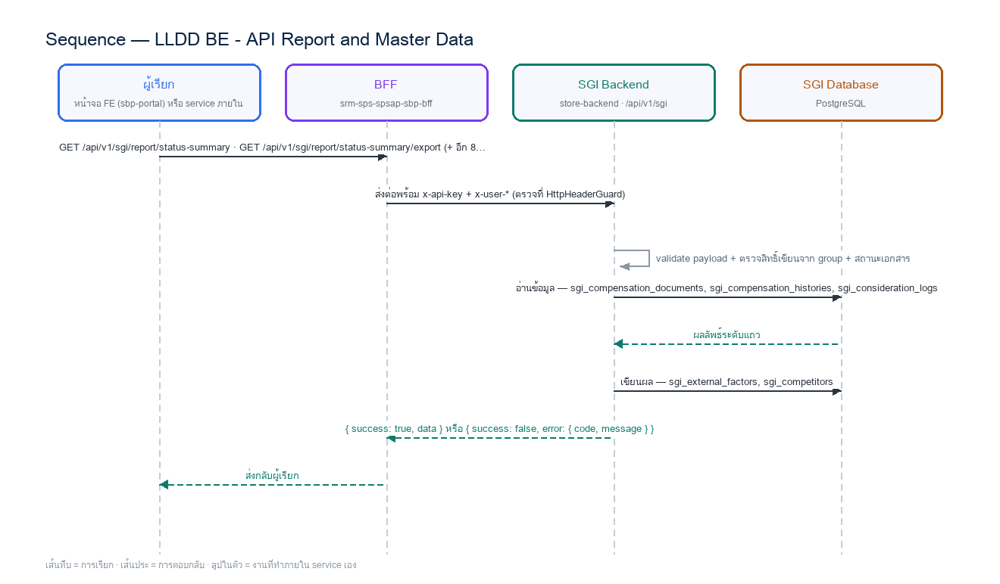

# LLDD BE - API Report and Master Data

SBP Mall - ระบบประกันรายได้ | Low Level Design Document

## 1. Overview

| รายการ | รายละเอียด |
| --- | --- |
| Track | BE |
| Estimate | **39 ชั่วโมง** = implementation 30 + unit test 9 (30%) |
| Owner | Peerakorn &lt;Pete&gt; Sakunkaewphithak |
| Target repository | `SBP/srm-sps-spsap-store-backend` (NestJS + TypeORM · schema `sps_store`) + `SBP/srm-sps-spsap-sbp-bff` (forward ผ่าน client service · ไม่มี DB) สำหรับเส้นที่ FE เรียก |
| Objective | ออกแบบ APIs สำหรับรายงานตรวจสอบประกันรายได้ และ Master Data ที่ SGI ดูแลเอง (ปัจจัยภายนอก + รายชื่อคู่แข่ง) |

Common contract reference: ทุกหัวข้อ API/FE ต้องยึด LLDD-BE-API-Common-Contracts และ LLDD-FE-Integration-Contracts สำหรับ error/auth/format/pagination/action/RBAC ก่อนลงรายละเอียดเฉพาะหน้าหรือเฉพาะ endpoint

### 1.1 เอกสาร LLDD ที่เกี่ยวข้อง

ตารางนี้สร้างจาก endpoint และตารางที่เอกสารฉบับนี้ประกาศไว้จริง — อ่านฉบับที่อยู่ในตารางก่อนลงมือ เพื่อไม่ให้สัญญา request/response หรือชื่อคอลัมน์หลุดจากกัน

| ความสัมพันธ์ | เอกสาร LLDD | เกี่ยวข้องตรงไหน |
| --- | --- | --- |
| ใช้ endpoint ของ | **LLDD-BE-API-Document-Detail-Aggregate** | `GET /api/v1/sgi/master/competitors` |
| ถูกเรียกจาก | **LLDD-BE-API-Document-Detail-Aggregate** | `GET /api/v1/sgi/master/competitors` |
| ถูกเรียกจาก | **LLDD-FE-Master-Data** | `DELETE /api/v1/sgi/master/competitors/{code}` · `DELETE /api/v1/sgi/master/factors/{code}` · `GET /api/v1/sgi/master/competitors` · `GET /api/v1/sgi/master/factors` · `POST /api/v1/sgi/master/competitors` · `POST /api/v1/sgi/master/factors` · `PUT /api/v1/sgi/master/competitors/{code}` · `PUT /api/v1/sgi/master/factors/{code}` |
| ถูกเรียกจาก | **LLDD-FE-Report** | `GET /api/v1/sgi/report/status-summary` · `GET /api/v1/sgi/report/status-summary/export` |
| สัญญากลาง | **LLDD-BE-API-Common-Contracts** | envelope `{success,data}` · error code · pagination · รูปแบบวันที่/เลขเอกสาร |
| โครงสร้างข้อมูล | **LLDD-BE-Database-Structure** | DDL ของตารางที่หัวข้อ Reference DB Mapping อ้างถึง |
| แพลตฟอร์มระบบเดิม | **LLDD-BE-Integration-SBP-Platform** | header จาก BFF (`x-api-key` / `x-user-*`) · การ reuse ตารางและ service ของระบบ SBP เดิม |
| ต้องจบก่อน (ลำดับงาน) | **LLDD-BE-API-Common-Contracts** | เป็นฉบับต้นทางของสัญญา/โครงที่ฉบับนี้อ้าง |
| ต้องจบก่อน (ลำดับงาน) | **LLDD-BE-Database-Structure** | เป็นฉบับต้นทางของสัญญา/โครงที่ฉบับนี้อ้าง |

## 2. Screen / Functional Scope

- Report query service
- Excel export (14 columns, SDD slide 60)
- Operator/factor CRUD
- Report filters

## 3. Screenshot Reference

ไม่มีภาพหน้าจอสำหรับหัวข้อนี้ — เป็นเอกสารฝั่ง Backend/Batch ที่ไม่มี UI (ภาพหน้าจอทั้งหมดอยู่ในเอกสารชุด FE)

## 4. Implementation Flow & Sequence Diagram (Reference)

### 4.1 Implementation Flow (ลำดับขั้นการทำงาน)


_รูปที่ 1: Implementation flow reference: LLDD BE - API Report and Master Data_

### 4.2 Sequence Diagram (ใครคุยกับใคร ลำดับไหน)

ผู้แสดงและลำดับข้อความในภาพนี้สร้างจาก endpoint ในหัวข้อ 7 และตารางในหัวข้อ Reference DB Mapping ของเอกสารฉบับนี้เอง จึงตรงกับสัญญาเสมอ



_รูปที่ 2: Sequence diagram: LLDD BE - API Report and Master Data_

## 5. Field, Format, and Validation

| Field / UI | Format | Validation | Behavior |
| --- | --- | --- | --- |
| year | ค.ศ. YYYY | required for report | return 400 if missing · BE ผ่าน toAD() เผื่อ client ส่ง พ.ศ. |
| status | statusCode string | required | 6 สถานะเอกสาร; verbatim จาก sps_store.workflow_status ของ @srm/glb-workflow |
| result | APPROVE\|REJECT\|CANCELLED\|PENDING | optional for report (บังคับเฉพาะ status) | maps to sgi_consideration_logs.result_category ล่าสุด · CANCELLED = ยกเลิกโดยระบบ (เพิ่ม 2026-08-10) |
| region | array/string | optional | 13 region codes; multi-select |
| storeType | array ของ BranchTypeFGIName | optional | **7 ค่า** `A B C D E PTT บริษัท` (ยืนยันจาก master `BranchTypeProfile` ของ `CPA_FRN_FGI` 2026-08-10) · multi-select · **ห้าม hardcode** ให้โหลดจาก `GET /common/common-code` ของระบบ SBP เดิม |
| impactedStoreCode | string 5 digits | optional | คง leading zero |
| newStoreCode | string 5 digits | optional | คง leading zero |
| reason | text | required mutation | audit reason |
| page/size | integer | page>=1 size<=100 | pagination |

### 5.9 Input / Progress / Output Contract

| Stage | Contract for implementation |
| --- | --- |
| Input | GET /api/v1/sgi/report/status-summary; GET /api/v1/sgi/report/status-summary/export; GET /api/v1/sgi/master/factors |
| Progress | Validate filter; Build query; Apply pagination/export mode; Return rows or CSV |
| Output | sgi_external_factors; sgi_competitors |

### 5.90 Endpoint Implementation Contract

| Endpoint | Use-case owner | Service/repository behavior | Definition of done |
| --- | --- | --- | --- |
| GET /api/v1/sgi/report/status-summary | รายงานตรวจสอบประกันรายได้ | Validate filter | missing year/status/result fails |
| GET /api/v1/sgi/report/status-summary/export | Export Excel | Build query | export uses same filters as preview |
| GET /api/v1/sgi/master/factors | อ่านปัจจัยภายนอก | Apply pagination/export mode | master edit requires reason |
| POST /api/v1/sgi/master/factors | สร้างปัจจัยภายนอก | Return rows or CSV | config locked value cannot edit |
| PUT /api/v1/sgi/master/factors/{code} | แก้ปัจจัยภายนอก | For mutations validate reason and write audit | missing year/status/result fails |
| GET /api/v1/sgi/master/competitors | master แบรนด์คู่แข่ง 11 รายการ (รหัส 01-11) — เป็นแหล่งของ dropdown ร้านคู่แข่งในหน้าเอกสารด้วย | Validate filter | export uses same filters as preview |
| POST /api/v1/sgi/master/competitors | เพิ่มแบรนด์คู่แข่ง — code/nameTh/nameEn บังคับ · รหัสซ้ำตอบ 409 | Build query | master edit requires reason |
| PUT /api/v1/sgi/master/competitors/{code} | แก้ชื่อ/สถานะ — ห้ามแก้ code เพราะถูกอ้างจาก sgi_document_competitors | Apply pagination/export mode | config locked value cannot edit |
| DELETE /api/v1/sgi/master/competitors/{code} | ลบแบรนด์คู่แข่ง — ถูกอ้างในเอกสารแล้วตอบ 409 | Return rows or CSV | missing year/status/result fails |
| DELETE /api/v1/sgi/master/factors/{code} | ลบปัจจัยภายนอกที่ไม่ถูกใช้งาน | For mutations validate reason and write audit | export uses same filters as preview |

### 5.91 Backend Execution Sequence

| Step | Behavior specific to this LLDD | Failure/test evidence |
| --- | --- | --- |
| 1 | Validate filter | report missing year |
| 2 | Build query | report export |
| 3 | Apply pagination/export mode | factor duplicate |
| 4 | Return rows or CSV | operator audit |
| 5 | For mutations validate reason and write audit | config locked |

## 6. Button / User Action Mapping

| Action | Trigger | API / Service | Expected Result |
| --- | --- | --- | --- |
| Report preview | GET | report.service.search | paginated rows |
| Report export | GET | report.service.exportCsv | csv stream |
| Master mutation | POST/PUT/DELETE | master.service.save | อัปเดต row ของ master |

## 7. API Contract

### GET /api/v1/sgi/report/status-summary

รายงานตรวจสอบประกันรายได้

#### Query Params

```json
{
  "status": "06",
  "impactedStoreCode": "00788",
  "newStoreCode": "00990",
  "periodStatementFrom": "2026-06-01",
  "periodStatementTo": "2026-06-30",
  "storeTypes": [
    "A",
    "B"
  ],
  "regions": [
    "RSU",
    "BN"
  ],
  "result": "APPROVE",
  "page": 1,
  "size": 20,
  "year": 2026,
  "region": [
    "RSU"
  ],
  "storeType": [
    "A"
  ]
}
```

#### Request Field Schema

| Field | Type | Required | Constraint / Meaning |
| --- | --- | --- | --- |
| status | string | Yes | UTF-8; use value domain described by endpoint purpose |
| impactedStoreCode | string | No | exactly 5 digits; preserve leading zero |
| newStoreCode | string | No | exactly 5 digits; preserve leading zero |
| periodStatementFrom | string | No | UTF-8; use value domain described by endpoint purpose |
| periodStatementTo | string | No | UTF-8; use value domain described by endpoint purpose |
| storeTypes | array&lt;string&gt; | No | JSON array; element type shown in Type column |
| regions | array&lt;string&gt; | No | JSON array; element type shown in Type column |
| result | string | No | UTF-8; use value domain described by endpoint purpose |
| page | integer | No | >= 1; default 1 |
| size | integer | No | 1..100; default 20 |
| year | integer | Yes | UTF-8; use value domain described by endpoint purpose |
| region | array&lt;string&gt; | No | JSON array; element type shown in Type column |
| storeType | array&lt;string&gt; | No | JSON array; element type shown in Type column |

#### Response

```json
{
  "page": 1,
  "size": 20,
  "total": 10,
  "summary": {
    "totalItems": 10,
    "totalCompensationAmount": 439100.0,
    "overThresholdItems": 3,
    "abnormalSalesItems": 2
  },
  "items": [
    {
      "impactedStoreCode": "00788",
      "impactedStoreName": "รัตนอุทิศ ซ.13",
      "impactedRegion": "RSU",
      "impactedStoreType": "B",
      "impactMonth": "2026-05",
      "periodStatement": "2026-06-07",
      "newStoreCode": "00990",
      "newStoreName": "เซเว่นฯ รัตนาธิเบศร์ 12",
      "newRegion": "RSU",
      "newStoreType": "A",
      "compensationAmount": 48200.0,
      "roundNo": 1,
      "createdDate": "2026-06-12",
      "docNo": "2026/00123"
    }
  ]
}
```

#### Response Field Schema

| Field | Type | Required | Constraint / Meaning |
| --- | --- | --- | --- |
| page | integer | Yes | >= 1; default 1 |
| size | integer | Yes | 1..100; default 20 |
| total | integer | Yes | UTF-8; use value domain described by endpoint purpose |
| summary | object | Yes | JSON object; nested fields listed below |
| summary.totalItems | integer | Yes | UTF-8; use value domain described by endpoint purpose |
| summary.totalCompensationAmount | number | Yes | number >= 0 with 2 decimals |
| summary.overThresholdItems | integer | Yes | UTF-8; use value domain described by endpoint purpose |
| summary.abnormalSalesItems | integer | Yes | UTF-8; use value domain described by endpoint purpose |
| items | array&lt;object&gt; | Yes | JSON array; element type shown in Type column |
| items[].impactedStoreCode | string | Yes | exactly 5 digits; preserve leading zero |
| items[].impactedStoreName | string | Yes | UTF-8; use value domain described by endpoint purpose |
| items[].impactedRegion | string | Yes | UTF-8; use value domain described by endpoint purpose |
| items[].impactedStoreType | string | Yes | UTF-8; use value domain described by endpoint purpose |
| items[].impactMonth | string | Yes | ISO-8601 ค.ศ.; nullable only when type includes null |
| items[].periodStatement | string | Yes | UTF-8; use value domain described by endpoint purpose |
| items[].newStoreCode | string | Yes | exactly 5 digits; preserve leading zero |
| items[].newStoreName | string | Yes | UTF-8; use value domain described by endpoint purpose |
| items[].newRegion | string | Yes | UTF-8; use value domain described by endpoint purpose |
| items[].newStoreType | string | Yes | UTF-8; use value domain described by endpoint purpose |
| items[].compensationAmount | number | Yes | number >= 0 with 2 decimals |
| items[].roundNo | integer | Yes | UTF-8; use value domain described by endpoint purpose |
| items[].createdDate | string | Yes | ISO-8601 ค.ศ.; nullable only when type includes null |
| items[].docNo | string | Yes | ค.ศ. YYYY/xxxxx |

### GET /api/v1/sgi/report/status-summary/export

Export Excel

#### Query Params

```json
{
  "year": 2026,
  "status": "06",
  "result": "APPROVE",
  "region": [
    "RSU"
  ],
  "storeType": [
    "A"
  ],
  "impactedStoreCode": "00788",
  "newStoreCode": "00990",
  "sameAsSearch": true,
  "format": "xlsx"
}
```

#### Request Field Schema

| Field | Type | Required | Constraint / Meaning |
| --- | --- | --- | --- |
| year | integer | Yes | UTF-8; use value domain described by endpoint purpose |
| status | string | Yes | UTF-8; use value domain described by endpoint purpose |
| result | string | No | UTF-8; use value domain described by endpoint purpose |
| region | array&lt;string&gt; | No | JSON array; element type shown in Type column |
| storeType | array&lt;string&gt; | No | JSON array; element type shown in Type column |
| impactedStoreCode | string | No | exactly 5 digits; preserve leading zero |
| newStoreCode | string | No | exactly 5 digits; preserve leading zero |
| sameAsSearch | boolean | No | UTF-8; use value domain described by endpoint purpose |
| format | string | No | ISO-8601 ค.ศ.; nullable only when type includes null |

#### Response

```json
{
  "contentType": "application/vnd.openxmlformats-officedocument.spreadsheetml.sheet",
  "fileName": "insurance-verification-2026.xlsx"
}
```

#### Response Field Schema

| Field | Type | Required | Constraint / Meaning |
| --- | --- | --- | --- |
| contentType | string | Yes | UTF-8; use value domain described by endpoint purpose |
| fileName | string | Yes | UTF-8; use value domain described by endpoint purpose |

### GET /api/v1/sgi/master/factors

อ่านปัจจัยภายนอก

#### Query Params

```json
{
  "q": "ถนน",
  "active": true,
  "page": 1,
  "size": 20
}
```

#### Request Field Schema

| Field | Type | Required | Constraint / Meaning |
| --- | --- | --- | --- |
| q | string | No | UTF-8; use value domain described by endpoint purpose |
| active | boolean | No | UTF-8; use value domain described by endpoint purpose |
| page | integer | No | >= 1; default 1 |
| size | integer | No | 1..100; default 20 |

#### Response

```json
{
  "page": 1,
  "size": 20,
  "total": 1,
  "items": [
    {
      "factorCode": "F001",
      "factorName": "ก่อสร้างถนน",
      "description": "ผลกระทบจากการก่อสร้าง",
      "active": true
    }
  ]
}
```

#### Response Field Schema

| Field | Type | Required | Constraint / Meaning |
| --- | --- | --- | --- |
| page | integer | Yes | >= 1; default 1 |
| size | integer | Yes | 1..100; default 20 |
| total | integer | Yes | UTF-8; use value domain described by endpoint purpose |
| items | array&lt;object&gt; | Yes | JSON array; element type shown in Type column |
| items[].factorCode | string | Yes | รหัสปัจจัยภายนอกจาก master (sgi_external_factors.factor_code) |
| items[].factorName | string | Yes | UTF-8; use value domain described by endpoint purpose |
| items[].description | string | Yes | UTF-8; use value domain described by endpoint purpose |
| items[].active | boolean | Yes | UTF-8; use value domain described by endpoint purpose |

### POST /api/v1/sgi/master/factors

สร้างปัจจัยภายนอก

#### Request

```json
{
  "factorCode": "ROAD",
  "factorName": "ก่อสร้างถนน",
  "description": "ปิดช่องทางจราจร",
  "active": true,
  "reason": "เพิ่มปัจจัยใหม่"
}
```

#### Request Field Schema

| Field | Type | Required | Constraint / Meaning |
| --- | --- | --- | --- |
| factorCode | string | Yes | รหัสปัจจัยภายนอกจาก master (sgi_external_factors.factor_code) |
| factorName | string | Yes | UTF-8; use value domain described by endpoint purpose |
| description | string | Yes | UTF-8; use value domain described by endpoint purpose |
| active | boolean | Yes | UTF-8; use value domain described by endpoint purpose |
| reason | string | Yes | trimmed UTF-8 Thai text; required by operation/business rule |

#### Response

```json
{
  "factorCode": "ROAD",
  "factorName": "ก่อสร้างถนน",
  "active": true,
  "created": true
}
```

#### Response Field Schema

| Field | Type | Required | Constraint / Meaning |
| --- | --- | --- | --- |
| factorCode | string | Yes | รหัสปัจจัยภายนอกจาก master (sgi_external_factors.factor_code) |
| factorName | string | Yes | UTF-8; use value domain described by endpoint purpose |
| active | boolean | Yes | UTF-8; use value domain described by endpoint purpose |
| created | boolean | Yes | UTF-8; use value domain described by endpoint purpose |

### PUT /api/v1/sgi/master/factors/{code}

แก้ปัจจัยภายนอก

#### Request

```json
{
  "factorName": "ก่อสร้างและปิดถนน",
  "description": "ปิดช่องทางจราจรบางส่วน",
  "active": true,
  "reason": "ปรับคำอธิบาย"
}
```

#### Request Field Schema

| Field | Type | Required | Constraint / Meaning |
| --- | --- | --- | --- |
| factorName | string | Yes | UTF-8; use value domain described by endpoint purpose |
| description | string | Yes | UTF-8; use value domain described by endpoint purpose |
| active | boolean | Yes | UTF-8; use value domain described by endpoint purpose |
| reason | string | Yes | trimmed UTF-8 Thai text; required by operation/business rule |

#### Response

```json
{
  "factorCode": "ROAD",
  "factorName": "ก่อสร้างและปิดถนน",
  "active": true,
  "updated": true
}
```

#### Response Field Schema

| Field | Type | Required | Constraint / Meaning |
| --- | --- | --- | --- |
| factorCode | string | Yes | รหัสปัจจัยภายนอกจาก master (sgi_external_factors.factor_code) |
| factorName | string | Yes | UTF-8; use value domain described by endpoint purpose |
| active | boolean | Yes | UTF-8; use value domain described by endpoint purpose |
| updated | boolean | Yes | UTF-8; use value domain described by endpoint purpose |

### GET /api/v1/sgi/master/competitors

master แบรนด์คู่แข่ง 11 รายการ (รหัส 01-11) — เป็นแหล่งของ dropdown ร้านคู่แข่งในหน้าเอกสารด้วย

#### Query Params

```json
{
  "active": true,
  "q": "lotus"
}
```

#### Request Field Schema

| Field | Type | Required | Constraint / Meaning |
| --- | --- | --- | --- |
| active | boolean | No | UTF-8; use value domain described by endpoint purpose |
| q | string | No | UTF-8; use value domain described by endpoint purpose |

#### Response

```json
{
  "total": 11,
  "items": [
    {
      "competitorCode": "01",
      "nameTh": "แฟมิลี่มาร์ท",
      "nameEn": "FamilyMart",
      "remark": "",
      "active": true,
      "competitorName": "Lotus Express",
      "code": "01",
      "isActive": true
    }
  ]
}
```

#### Response Field Schema

| Field | Type | Required | Constraint / Meaning |
| --- | --- | --- | --- |
| total | integer | Yes | UTF-8; use value domain described by endpoint purpose |
| items | array&lt;object&gt; | Yes | JSON array; element type shown in Type column |
| items[].competitorCode | string | Yes | รหัสแบรนด์คู่แข่งจาก master 01–11 เท่านั้น (ห้าม free text) |
| items[].nameTh | string | Yes | UTF-8; use value domain described by endpoint purpose |
| items[].nameEn | string | Yes | UTF-8; use value domain described by endpoint purpose |
| items[].remark | string | Yes | UTF-8; use value domain described by endpoint purpose |
| items[].active | boolean | Yes | UTF-8; use value domain described by endpoint purpose |
| items[].competitorName | string | Yes | UTF-8; use value domain described by endpoint purpose |
| items[].code | string | Yes | UTF-8; use value domain described by endpoint purpose |
| items[].isActive | boolean | Yes | UTF-8; use value domain described by endpoint purpose |

### POST /api/v1/sgi/master/competitors

เพิ่มแบรนด์คู่แข่ง — code/nameTh/nameEn บังคับ · รหัสซ้ำตอบ 409

#### Request

```json
{
  "competitorCode": "12",
  "nameTh": "ร้านตัวอย่าง",
  "nameEn": "Sample Shop",
  "remark": "",
  "active": true,
  "code": "12"
}
```

#### Request Field Schema

| Field | Type | Required | Constraint / Meaning |
| --- | --- | --- | --- |
| competitorCode | string | Yes | รหัสแบรนด์คู่แข่งจาก master 01–11 เท่านั้น (ห้าม free text) |
| nameTh | string | Yes | UTF-8; use value domain described by endpoint purpose |
| nameEn | string | Yes | UTF-8; use value domain described by endpoint purpose |
| remark | string | Yes | UTF-8; use value domain described by endpoint purpose |
| active | boolean | Yes | UTF-8; use value domain described by endpoint purpose |
| code | string | Yes | UTF-8; use value domain described by endpoint purpose |

#### Response

```json
{
  "competitorCode": "12",
  "created": true,
  "code": "12",
  "message": "saved"
}
```

#### Response Field Schema

| Field | Type | Required | Constraint / Meaning |
| --- | --- | --- | --- |
| competitorCode | string | Yes | รหัสแบรนด์คู่แข่งจาก master 01–11 เท่านั้น (ห้าม free text) |
| created | boolean | Yes | UTF-8; use value domain described by endpoint purpose |
| code | string | Yes | UTF-8; use value domain described by endpoint purpose |
| message | string | Yes | UTF-8; use value domain described by endpoint purpose |

### PUT /api/v1/sgi/master/competitors/{code}

แก้ชื่อ/สถานะ — ห้ามแก้ code เพราะถูกอ้างจาก sgi_document_competitors

#### Request

```json
{
  "nameTh": "แฟมิลี่มาร์ท",
  "nameEn": "FamilyMart",
  "remark": "ปรับชื่อ",
  "active": true,
  "isActive": true
}
```

#### Request Field Schema

| Field | Type | Required | Constraint / Meaning |
| --- | --- | --- | --- |
| nameTh | string | Yes | UTF-8; use value domain described by endpoint purpose |
| nameEn | string | Yes | UTF-8; use value domain described by endpoint purpose |
| remark | string | Yes | UTF-8; use value domain described by endpoint purpose |
| active | boolean | Yes | UTF-8; use value domain described by endpoint purpose |
| isActive | boolean | Yes | UTF-8; use value domain described by endpoint purpose |

#### Response

```json
{
  "competitorCode": "01",
  "updated": true,
  "message": "saved"
}
```

#### Response Field Schema

| Field | Type | Required | Constraint / Meaning |
| --- | --- | --- | --- |
| competitorCode | string | Yes | รหัสแบรนด์คู่แข่งจาก master 01–11 เท่านั้น (ห้าม free text) |
| updated | boolean | Yes | UTF-8; use value domain described by endpoint purpose |
| message | string | Yes | UTF-8; use value domain described by endpoint purpose |

### DELETE /api/v1/sgi/master/competitors/{code}

ลบแบรนด์คู่แข่ง — ถูกอ้างในเอกสารแล้วตอบ 409

#### Request

```json
{}
```

#### Request Field Schema

| Field | Type | Required | Constraint / Meaning |
| --- | --- | --- | --- |
| - | none | No | No fields |

#### Response

```json
{
  "competitorCode": "12",
  "deleted": true,
  "message": "deleted"
}
```

#### Response Field Schema

| Field | Type | Required | Constraint / Meaning |
| --- | --- | --- | --- |
| competitorCode | string | Yes | รหัสแบรนด์คู่แข่งจาก master 01–11 เท่านั้น (ห้าม free text) |
| deleted | boolean | Yes | UTF-8; use value domain described by endpoint purpose |
| message | string | Yes | UTF-8; use value domain described by endpoint purpose |

### DELETE /api/v1/sgi/master/factors/{code}

ลบปัจจัยภายนอกที่ไม่ถูกใช้งาน

#### Request

```json
{
  "reason": "ยกเลิกค่าทดสอบ"
}
```

#### Request Field Schema

| Field | Type | Required | Constraint / Meaning |
| --- | --- | --- | --- |
| reason | string | Yes | trimmed UTF-8 Thai text; required by operation/business rule |

#### Response

```json
{
  "factorCode": "F001",
  "deleted": true
}
```

#### Response Field Schema

| Field | Type | Required | Constraint / Meaning |
| --- | --- | --- | --- |
| factorCode | string | Yes | รหัสปัจจัยภายนอกจาก master (sgi_external_factors.factor_code) |
| deleted | boolean | Yes | UTF-8; use value domain described by endpoint purpose |

## 8. Reference DB Mapping (No Database Page Work)

ส่วนนี้เป็นข้อมูลอ้างอิงสำหรับการ implement API/Job เท่านั้น ไม่ใช่งานสร้างหน้า Database, ไม่ใช่งานออกแบบ DB page และไม่ถูกนับเป็น deliverable แยกของ FE/BE

| Table / Object | R/W | Usage |
| --- | --- | --- |
| sgi_compensation_documents | R | แหล่งข้อมูลรายงานและ filter status/year |
| sgi_compensation_histories | R | ยอดเงินชดเชยและงวด statement |
| sgi_consideration_logs | R | ผลพิจารณาล่าสุด APPROVE/REJECT |
| auth-backend group + scope (business_user_group) / prepared approver ของ @srm/glb-workflow | R | ผู้ปฏิบัติงาน — ตาราง operator_assignments ถูกตัด 2026-08-05 |
| sgi_external_factors | R/W | master ปัจจัยภายนอก |
| sgi_competitors | R/W | master แบรนด์คู่แข่ง 11 รายการ (code 01-11 · name_th · name_en · remark) — feed dropdown ร้านคู่แข่งของหน้าเอกสาร |
| sgi_document_competitors | R | ตรวจว่าแบรนด์ถูกอ้างในเอกสารก่อนลบ (409) |
| sgi_document_external_factors | R | ตรวจว่าปัจจัยภายนอกถูกอ้างในเอกสารก่อนลบ (409) (เพิ่ม 2026-09-02 — SQL แตะอยู่แล้วแต่ไม่ได้ประกาศไว้) |
| sgi_document_new_stores | R | ยอด/%ชดเชยต่อร้านเปิดใหม่ในรายงาน (เพิ่ม 2026-09-02 — SQL แตะอยู่แล้วแต่ไม่ได้ประกาศไว้) |
| sgi_fgi_impact_processes | R | รอบชดเชย (roundNo) และงวดในรายงาน (เพิ่ม 2026-09-02 — SQL แตะอยู่แล้วแต่ไม่ได้ประกาศไว้) |
| mas_param (SBP) | R | ค่ากำหนดกลางของระบบ SBP เดิม — **อ่านอย่างเดียว** (หน้า Global Config ของ SGI ถูกลบ 2026-08-06 · ระบบเดิมเป็นผู้แก้) |

## 9. Skeleton Code (store-backend + BFF)

โครงโค้ดตั้งต้นของเอกสารฉบับนี้ ยึด convention จริงของ `srm-sps-spsap-store-backend` (NestJS 11 + TypeORM, schema `sps_store`, custom provider `DATA_SOURCE` ที่ route SELECT ไป slave pool) และ `srm-sps-spsap-sbp-bff` (ไม่มี DB, forward ผ่าน client service). ทุกจุดที่ต้องเติมกำกับด้วย `// TODO:` และ response ทุกเส้นถูกห่อเป็น `{success, data}` โดย ResponseInterceptor อยู่แล้ว จึงห้าม service ห่อซ้ำ

### 9.1 ผังไฟล์ที่ต้องสร้าง

| Path | หน้าที่ |
| --- | --- |
| store-backend · src/modules/sgi-report-and-master-data/sgi-report-and-master-data.controller.ts | route ทั้งหมดของเอกสารนี้ (10 เส้น) + `@UseGuards(HttpHeaderGuard)` + `@UserId()` |
| store-backend · src/modules/sgi-report-and-master-data/sgi-report-and-master-data.service.ts | business logic — inject `'DATA_SOURCE'` แล้วยิง raw SQL, mutation ใช้ QueryRunner transaction |
| store-backend · src/modules/sgi-report-and-master-data/sgi-report-and-master-data.sql.ts | เก็บ SQL ต่อ endpoint (คัดจากหัวข้อ 10) แยกออกจาก service ให้ทดสอบ/รีวิวง่าย · **คีย์ = ชื่อ handler** เช่น `getSgiMasterFactors` · บล็อกที่มีหลาย statement ให้แยกเป็นหลายคีย์ โดยเติมท้ายชื่อให้สื่อความ เช่น DELETE master ที่มี 2 statement → `removeSgiMasterFactorsByCodeInUse` (SELECT ตรวจการใช้งาน) + `removeSgiMasterFactorsByCode` (DELETE) |
| store-backend · src/modules/sgi-report-and-master-data/dto/sgi-report-and-master-data.dto.ts | DTO + class-validator ตาม validation ในหัวข้อฟิลด์ของเอกสารนี้ |
| store-backend · src/modules/sgi-report-and-master-data/sgi-report-and-master-data.module.ts | ประกอบ controller/service/providers แล้ว register ที่ `app.module.ts` |
| store-backend · src/entitys/sgi-compensation-documents.entity.ts | entity ของ `sgi_compensation_documents` (`@Entity({schema: process.env.DB_SCHEMA})`, ไม่ประกาศ relation) — **entity ร่วมหลายเอกสาร: ประกาศครั้งเดียวแล้วอ้างอิง อย่าสร้างซ้ำ** |
| store-backend · src/entitys/sgi-compensation-histories.entity.ts | entity ของ `sgi_compensation_histories` (`@Entity({schema: process.env.DB_SCHEMA})`, ไม่ประกาศ relation) |
| store-backend · src/entitys/sgi-consideration-logs.entity.ts | entity ของ `sgi_consideration_logs` (`@Entity({schema: process.env.DB_SCHEMA})`, ไม่ประกาศ relation) — **entity ร่วมหลายเอกสาร: ประกาศครั้งเดียวแล้วอ้างอิง อย่าสร้างซ้ำ** |
| store-backend · src/providers/sgi/sgi.ts | repository provider แบบ factory ผูก token string กับ `DATA_SOURCE` — **ไฟล์ร่วมของทุกเอกสาร BE ให้ merge array เพิ่ม ห้ามเขียนทับ** |
| store-backend · sql/deploy-sgi-report-and-master-data.sql | DDL production แบบ idempotent (ทีมนี้ไม่ใช้ migration เป็นหลัก) |
| BFF · src/common/client-services/sgi-client.service.ts | client ต่อจาก `BaseClientService` ตั้ง baseUrl + `x-api-key` ตอน `onModuleInit` |
| BFF · src/modules/sgi-report-and-master-data/sgi-report-and-master-data.controller.ts | route ฝั่ง BFF prefix `/bff/sgi/…` + `@UseGuards(AuthGuard('jwt'))` |
| BFF · src/modules/sgi-report-and-master-data/sgi-report-and-master-data.service.ts | แนบ `x-user-id` / `x-user-group-id` / `x-user-permissions` แล้ว forward ไป backend |

### 9.2 Controller (store-backend)

```ts
// src/modules/sgi-report-and-master-data/sgi-report-and-master-data.controller.ts  (ส่วนที่ 1/3 — คลาสเดียวกัน)
import { Body, Controller, Get, Post, Query, UseGuards } from '@nestjs/common';
import { HttpHeaderGuard } from '../../guards/http-header.guard';
import { UserId } from '../../common/decorators/user-id.decorator';
import { SgiReportAndMasterDataService } from './sgi-report-and-master-data.service';
import { ReportAndMasterDataQueryDto, CreateSgiMasterFactorsBodyDto } from './dto/sgi-report-and-master-data.dto';

// LLDD BE - API Report and Master Data
// BFF เรียกด้วย x-api-key และแนบ x-user-id / x-user-group-id / x-user-permissions มาให้
@Controller('')
@UseGuards(HttpHeaderGuard)
export class SgiReportAndMasterDataController {
  constructor(private readonly service: SgiReportAndMasterDataService) {}

  // GET /api/v1/sgi/report/status-summary — รายงานตรวจสอบประกันรายได้
  @Get('report/status-summary')
  getSgiReportStatusSummary(@Query() query: ReportAndMasterDataQueryDto, @UserId() userId: string) {
    // TODO: ตรวจ x-user-permissions ก่อนเรียก service ถ้า endpoint นี้จำกัดสิทธิ์เมนู
    return this.service.getSgiReportStatusSummary(query, userId);
  }

  // GET /api/v1/sgi/report/status-summary/export — Export Excel
  @Get('report/status-summary/export')
  exportStatusSummary(@Query() query: ReportAndMasterDataQueryDto, @UserId() userId: string) {
    // TODO: ตรวจ x-user-permissions ก่อนเรียก service ถ้า endpoint นี้จำกัดสิทธิ์เมนู
    return this.service.exportStatusSummary(query, userId);
  }

  // GET /api/v1/sgi/master/factors — อ่านปัจจัยภายนอก
  @Get('master/factors')
  getSgiMasterFactors(@Query() query: ReportAndMasterDataQueryDto, @UserId() userId: string) {
    // TODO: ตรวจ x-user-permissions ก่อนเรียก service ถ้า endpoint นี้จำกัดสิทธิ์เมนู
    return this.service.getSgiMasterFactors(query, userId);
  }

  // POST /api/v1/sgi/master/factors — สร้างปัจจัยภายนอก
  @Post('master/factors')
  createSgiMasterFactors(@Body() body: CreateSgiMasterFactorsBodyDto, @UserId() userId: string) {
    // TODO: ตรวจ x-user-permissions ก่อนเรียก service ถ้า endpoint นี้จำกัดสิทธิ์เมนู
    return this.service.createSgiMasterFactors(body, userId);
  }
```

```ts
// src/modules/sgi-report-and-master-data/sgi-report-and-master-data.controller.ts  (ส่วนที่ 2/3 — คลาสเดียวกัน)
// import เพิ่ม: UpdateSgiMasterFactorsByCodeBodyDto, CreateSgiMasterCompetitorsBodyDto
// (method ต่อไปนี้อยู่ในคลาส SgiReportAndMasterDataController เดียวกับส่วนที่ 1)

  // PUT /api/v1/sgi/master/factors/{code} — แก้ปัจจัยภายนอก
  @Put('master/factors/:code')
  updateSgiMasterFactorsByCode(
    @Param('code') code: string,
    @Body() body: UpdateSgiMasterFactorsByCodeBodyDto,
    @UserId() userId: string,
  ) {
    // TODO: ตรวจ x-user-permissions ก่อนเรียก service ถ้า endpoint นี้จำกัดสิทธิ์เมนู
    return this.service.updateSgiMasterFactorsByCode(code, body, userId);
  }

  // GET /api/v1/sgi/master/competitors — master แบรนด์คู่แข่ง 11 รายการ (รหัส 01-11) — เป็นแหล่งของ dropdown ร…
  @Get('master/competitors')
  getSgiMasterCompetitors(@Query() query: ReportAndMasterDataQueryDto, @UserId() userId: string) {
    // TODO: ตรวจ x-user-permissions ก่อนเรียก service ถ้า endpoint นี้จำกัดสิทธิ์เมนู
    return this.service.getSgiMasterCompetitors(query, userId);
  }

  // POST /api/v1/sgi/master/competitors — เพิ่มแบรนด์คู่แข่ง — code/nameTh/nameEn บังคับ · รหัสซ้ำตอบ 409
  @Post('master/competitors')
  createSgiMasterCompetitors(
    @Body() body: CreateSgiMasterCompetitorsBodyDto,
    @UserId() userId: string,
  ) {
    // TODO: ตรวจ x-user-permissions ก่อนเรียก service ถ้า endpoint นี้จำกัดสิทธิ์เมนู
    return this.service.createSgiMasterCompetitors(body, userId);
  }

  // PUT /api/v1/sgi/master/competitors/{code} — แก้ชื่อ/สถานะ — ห้ามแก้ code เพราะถูกอ้างจาก sgi_document_competitors
  @Put('master/competitors/:code')
  updateSgiMasterCompetitorsByCode(
    @Param('code') code: string,
    @Body() body: Record<string, unknown>,
    @UserId() userId: string,
  ) {
    // TODO: ตรวจ x-user-permissions ก่อนเรียก service ถ้า endpoint นี้จำกัดสิทธิ์เมนู
    return this.service.updateSgiMasterCompetitorsByCode(code, body, userId);
  }
```

```ts
// src/modules/sgi-report-and-master-data/sgi-report-and-master-data.controller.ts  (ส่วนที่ 3/3 — คลาสเดียวกัน)
// (method ต่อไปนี้อยู่ในคลาส SgiReportAndMasterDataController เดียวกับส่วนที่ 1)

  // DELETE /api/v1/sgi/master/competitors/{code} — ลบแบรนด์คู่แข่ง — ถูกอ้างในเอกสารแล้วตอบ 409
  @Delete('master/competitors/:code')
  removeSgiMasterCompetitorsByCode(@Param('code') code: string, @UserId() userId: string) {
    // TODO: ตรวจ x-user-permissions ก่อนเรียก service ถ้า endpoint นี้จำกัดสิทธิ์เมนู
    return this.service.removeSgiMasterCompetitorsByCode(code, userId);
  }

  // DELETE /api/v1/sgi/master/factors/{code} — ลบปัจจัยภายนอกที่ไม่ถูกใช้งาน
  @Delete('master/factors/:code')
  removeSgiMasterFactorsByCode(
    @Param('code') code: string,
    @Body() body: Record<string, unknown>,
    @UserId() userId: string,
  ) {
    // TODO: ตรวจ x-user-permissions ก่อนเรียก service ถ้า endpoint นี้จำกัดสิทธิ์เมนู
    return this.service.removeSgiMasterFactorsByCode(code, body, userId);
  }
}
```

### 9.3 DTO + Validation

```ts
// src/modules/sgi-report-and-master-data/dto/sgi-report-and-master-data.dto.ts
import { Type } from 'class-transformer';
import {
  IsArray, IsBoolean, IsIn, IsInt, IsNotEmpty, IsNumber, IsObject, IsOptional,
  IsString, Matches, Max, MaxLength, Min, ValidateNested,
} from 'class-validator';

// ValidationPipe ระดับ global ตั้ง whitelist + forbidNonWhitelisted + transform ไว้แล้ว (main.ts)
// property ที่ไม่ประกาศที่นี่จะถูก reject เป็น 400 อัตโนมัติ

// query ร่วมของ GET ทุกเส้นในโมดูลนี้ (path param ใช้ @Param แยก)
export class ReportAndMasterDataQueryDto {
  /** 6 สถานะเอกสาร; verbatim จาก sps_store.workflow_status ของ @srm/glb-workflow · required เฉ… */
  @IsOptional()
  @IsString()
  status?: string;

  /** คง leading zero */
  @IsOptional()
  @IsString()
  @Matches(/^\d{5}$/, { message: 'รหัสร้านต้องเป็นตัวเลข 5 หลัก และคงเลขศูนย์นำหน้า' })
  impactedStoreCode?: string;

  /** คง leading zero */
  @IsOptional()
  @IsString()
  @Matches(/^\d{5}$/, { message: 'รหัสร้านต้องเป็นตัวเลข 5 หลัก และคงเลขศูนย์นำหน้า' })
  newStoreCode?: string;

  /** required เฉพาะบาง endpoint — ตรวจซ้ำใน service */
  @IsOptional()
  @IsString()
  periodStatementFrom?: string;

  /** required เฉพาะบาง endpoint — ตรวจซ้ำใน service */
  @IsOptional()
  @IsString()
  periodStatementTo?: string;

  /** required เฉพาะบาง endpoint — ตรวจซ้ำใน service */
  @IsOptional()
  @IsArray()
  @IsString({ each: true })
  storeTypes?: string[];

  // TODO: เพิ่ม property ที่เหลือของ payload นี้ให้ครบตามหัวข้อฟิลด์ของเอกสารนี้
}
```

```ts
// body ของ POST /api/v1/sgi/master/factors
export class CreateSgiMasterFactorsBodyDto {
  @IsNotEmpty()
  @IsString()
  factorCode: string;

  @IsNotEmpty()
  @IsString()
  factorName: string;

  @IsNotEmpty()
  @IsString()
  description: string;

  @IsNotEmpty()
  @Type(() => Boolean)
  @IsBoolean()
  active: boolean;

  /** audit reason */
  @IsNotEmpty()
  @IsString()
  @MaxLength(500)
  reason: string;
}
```

```ts
// body ของ PUT /api/v1/sgi/master/factors/{code}
export class UpdateSgiMasterFactorsByCodeBodyDto {
  @IsNotEmpty()
  @IsString()
  factorName: string;

  @IsNotEmpty()
  @IsString()
  description: string;

  @IsNotEmpty()
  @Type(() => Boolean)
  @IsBoolean()
  active: boolean;

  /** audit reason */
  @IsNotEmpty()
  @IsString()
  @MaxLength(500)
  reason: string;
}
```

```ts
// body ของ POST /api/v1/sgi/master/competitors
export class CreateSgiMasterCompetitorsBodyDto {
  @IsNotEmpty()
  @IsString()
  competitorCode: string;

  @IsNotEmpty()
  @IsString()
  nameTh: string;

  @IsNotEmpty()
  @IsString()
  nameEn: string;

  @IsNotEmpty()
  @IsString()
  remark: string;

  @IsNotEmpty()
  @Type(() => Boolean)
  @IsBoolean()
  active: boolean;

  @IsNotEmpty()
  @IsString()
  code: string;
}

// TODO: สร้าง BodyDto ของ endpoint ที่เหลือด้วยรูปแบบเดียวกัน: PUT /api/v1/sgi/master/competitors/{code}, DELETE /api/v1/sgi/master/factors/{code}
```

### 9.4 Service (inject `DATA_SOURCE` + raw SQL)

service ประกาศ method ครบทุกเส้นที่ controller เรียก และ **signature มาจากแหล่งเดียวกับ controller** (จำนวน/ลำดับพารามิเตอร์จึงตรงกันเสมอ) — เส้นที่ยังไม่ได้ implement เป็น stub ที่ `throw new NotImplementedException(...)` ให้ TypeScript compile ผ่านตั้งแต่วันแรก

```ts
// src/modules/sgi-report-and-master-data/sgi-report-and-master-data.service.ts
import { BadRequestException, ConflictException, Inject, Injectable, Logger, NotFoundException, NotImplementedException } from '@nestjs/common';
import { DataSource } from 'typeorm';
import { SGI_SQL } from './sgi-report-and-master-data.sql';

@Injectable()
export class SgiReportAndMasterDataService {
  private readonly logger = new Logger(SgiReportAndMasterDataService.name);

  constructor(
    // DATA_SOURCE override query(): SELECT/WITH ไป slave pool, write ไป master
    @Inject('DATA_SOURCE') private readonly dataSource: DataSource,
  ) {}

  // GET /api/v1/sgi/report/status-summary — รายงานตรวจสอบประกันรายได้
  async getSgiReportStatusSummary(query: ReportAndMasterDataQueryDto, userId: string) {
    const page = Number(query.page ?? 1);
    const size = Math.min(Number(query.size ?? 20), 100);
    // SQL เต็มอยู่ในหัวข้อ Database SQL ของเอกสารนี้ (คีย์ 'GET /api/v1/sgi/report/status-summary')
    // SQL ในเอกสารเป็น positional $1..$n อยู่แล้ว (ตัวสร้างแปลงให้ตั้งแต่ 2026-09-04)
    //   บรรทัดแรกของบล็อก SQL คือ `-- bind ตามลำดับ: $1=... · $2=...` ให้เรียงอาร์กิวเมนต์ตามนั้น
    const rows = await this.dataSource.query(SGI_SQL.getSgiReportStatusSummary, [
      // เรียงให้ตรงกับบรรทัด `-- bind ตามลำดับ:` ของ SQL เส้นนี้
      userId, (page - 1) * size, size,
    ]);
    // TODO: total ต้องมาจาก COUNT(*) แยก query หรือ window function ไม่ใช่ rows.length
    return { page, size, total: rows.length, items: rows };
  }

  // GET /api/v1/sgi/report/status-summary/export — Export Excel
  async exportStatusSummary(query: ReportAndMasterDataQueryDto, userId: string) {
    // ใช้ SELECT ชุดเดียวกับ status-summary แต่ **ไม่ตัดหน้า** (ไม่มี LIMIT/OFFSET) ตาม SQL ในเอกสาร
    // สถานะเป็น filter บังคับตัวเดียว (SDD สไลด์ 60) — ไม่ส่งมาให้ 400 REPORT_STATUS_REQUIRED
    if (!query.status) {
      throw new BadRequestException({ code: 'REPORT_STATUS_REQUIRED', message: 'กรุณาเลือกสถานะก่อนค้นหา' });
    }
    // bind ตามลำดับของ SQL: $1=year $2=status $3=impactedStoreCode $4=newStoreCode $5=psFrom $6=psTo $7=storeTypes
    // year แยกจาก Period Statement (ค.ศ.) — DTO ส่งเป็นช่วง `periodStatementFrom/To` รูปแบบ YYYY-MM
    const year = Number((query.periodStatementFrom ?? '').slice(0, 4)) || undefined;
    const rows = await this.dataSource.query(SGI_SQL.exportStatusSummary, [
      year, query.status, query.impactedStoreCode ?? null, query.newStoreCode ?? null,
      query.periodStatementFrom ?? null, query.periodStatementTo ?? null, query.storeTypes ?? null,
    ]);
    // 14 คอลัมน์ตาม SDD สไลด์ 60 — หัวคอลัมน์ใช้ชื่อบนหน้าจอรายงาน ไม่ใช่ชื่อคอลัมน์ DB
    // ไฟล์ .xlsx สร้างที่ชั้น controller (StreamableFile) — service คืนข้อมูลดิบเท่านั้น
    return { fileName: `sgi-report-${year ?? 'all'}-${query.status}.xlsx`, rows };
  }

  // GET /api/v1/sgi/master/factors — อ่านปัจจัยภายนอก
  async getSgiMasterFactors(query: ReportAndMasterDataQueryDto, userId: string) {
    // master ปัจจัยภายนอก — ไม่แบ่งหน้าเพราะเป็น master ขนาดเล็ก
    // SQL รับ $1=q (คำค้นชื่อ) · สัญญาปัจจุบันยังไม่มีช่องค้นหาในหน้าจอ จึงส่ง null = เอาทั้งหมด
    // ถ้าเพิ่มช่องค้นหาเมื่อไร ให้เพิ่มฟิลด์ใน DTO ก่อน แล้วค่อยส่ง `%${query.q}%` ที่นี่
    const items = await this.dataSource.query(SGI_SQL.getSgiMasterFactors, [null]);
    return { items, total: items.length };
  }

  // POST /api/v1/sgi/master/factors — สร้างปัจจัยภายนอก
  // mutation ต้องอยู่ใน transaction เดียว (ไม่มี audit ของ master แล้ว · 2026-08-07)
  async createSgiMasterFactors(body: CreateSgiMasterFactorsBodyDto, userId: string) {
    const runner = this.dataSource.createQueryRunner();
    await runner.connect();
    await runner.startTransaction();
    try {
      // TODO: lock แถวเป้าหมายของ sgi_external_factors ด้วย SELECT ... FOR UPDATE ก่อนเขียน
      const [current] = await runner.query(SGI_SQL.createSgiMasterFactorsLock, [body.reason]);
      if (!current) {
        throw new NotFoundException('ไม่พบข้อมูลที่ต้องการ');
      }
      await runner.query(SGI_SQL.createSgiMasterFactors, [/* TODO: ผูกค่าจาก body */]);
      await runner.commitTransaction();
      return { message: 'saved' };
    } catch (error) {
      await runner.rollbackTransaction();
      this.logger.error(error);
      throw error;
    } finally {
      await runner.release();
    }
  }

  // PUT /api/v1/sgi/master/factors/{code} — แก้ปัจจัยภายนอก
  async updateSgiMasterFactorsByCode(code: string, body: UpdateSgiMasterFactorsByCodeBodyDto, userId: string) {
    // ห้ามแก้ factor_code (เป็น PK และถูกอ้างจาก sgi_document_external_factors)
    // bind: $1=factorName $2=factorRemark $3=code
    //   ⚠️ ชื่อฟิลด์ต่างกันสองฝั่ง — DTO ใช้ `description` ส่วนคอลัมน์/พารามิเตอร์ SQL คือ factor_remark
    const result = await this.dataSource.query(SGI_SQL.updateSgiMasterFactorsByCode, [
      body.factorName, body.description ?? null, code,
    ]);
    // pg คืน [rows, affectedRows] สำหรับ UPDATE ที่ไม่มี RETURNING
    if (Number(result?.[1] ?? 0) === 0) {
      throw new NotFoundException('ไม่พบปัจจัยภายนอกรหัสนี้');
    }
    return { message: 'saved' };
  }

  // GET /api/v1/sgi/master/competitors — master แบรนด์คู่แข่ง 11 รายการ (รหัส 01-11) — เป็นแหล่งของ dropdown ร…
  async getSgiMasterCompetitors(query: ReportAndMasterDataQueryDto, userId: string) {
    // master แบรนด์คู่แข่ง 11 รายการ (รหัส 01-11) — SQL รับ $1=q เช่นเดียวกับฝั่งปัจจัย
    const items = await this.dataSource.query(SGI_SQL.getSgiMasterCompetitors, [null]);
    return { items, total: items.length };
  }

  // POST /api/v1/sgi/master/competitors — เพิ่มแบรนด์คู่แข่ง — code/nameTh/nameEn บังคับ · รหัสซ้ำตอบ 409
  async createSgiMasterCompetitors(body: CreateSgiMasterCompetitorsBodyDto, userId: string) {
    // bind: $1=code $2=nameTh $3=nameEn $4=remark · ชื่อไทย/อังกฤษบังคับทั้งคู่ (DTO ตรวจแล้วอีกชั้น)
    try {
      await this.dataSource.query(SGI_SQL.createSgiMasterCompetitors, [
        body.competitorCode, body.nameTh, body.nameEn, body.remark ?? null,
      ]);
    } catch (error: any) {
      // 23505 = unique_violation ของ PostgreSQL — รหัสซ้ำต้องเป็น 409 ไม่ใช่ 500
      if (error?.code === '23505') {
        throw new ConflictException({ code: 'CODE_DUPLICATE', message: 'รหัสคู่แข่งนี้มีอยู่แล้ว' });
      }
      throw error;
    }
    return { message: 'created', code: body.competitorCode };
  }

  // PUT /api/v1/sgi/master/competitors/{code} — แก้ชื่อ/สถานะ — ห้ามแก้ code เพราะถูกอ้างจาก sgi_document_competitors
  async updateSgiMasterCompetitorsByCode(code: string, body: Record<string, unknown>, userId: string) {
    // ห้ามแก้ competitor_code (เป็น PK และถูกอ้างจาก sgi_document_competitors)
    // bind: $1=nameTh $2=nameEn $3=remark $4=isActive $5=code
    const result = await this.dataSource.query(SGI_SQL.updateSgiMasterCompetitorsByCode, [
      body.nameTh, body.nameEn, body.remark ?? null, body.active ?? true, code,
    ]);
    if (Number(result?.[1] ?? 0) === 0) {
      throw new NotFoundException('ไม่พบคู่แข่งรหัสนี้');
    }
    return { message: 'saved' };
  }

  // DELETE /api/v1/sgi/master/competitors/{code} — ลบแบรนด์คู่แข่ง — ถูกอ้างในเอกสารแล้วตอบ 409
  async removeSgiMasterCompetitorsByCode(code: string, userId: string) {
    // เหมือนฝั่งปัจจัย — ถูกอ้างในเอกสารแล้วต้อง 409
    const runner = this.dataSource.createQueryRunner();
    await runner.connect();
    await runner.startTransaction();
    try {
      const used = await runner.query(SGI_SQL.removeSgiMasterCompetitorsByCodeInUse, [code]);
      if (used.length > 0) {
        throw new ConflictException({ code: 'MASTER_IN_USE', message: 'คู่แข่งรายนี้ถูกใช้ในเอกสารแล้ว ลบไม่ได้' });
      }
      const result = await runner.query(SGI_SQL.removeSgiMasterCompetitorsByCode, [code]);
      if (Number(result?.[1] ?? 0) === 0) {
        throw new NotFoundException('ไม่พบคู่แข่งรหัสนี้');
      }
      await runner.commitTransaction();
      return { message: 'deleted' };
    } catch (error) {
      await runner.rollbackTransaction();
      throw error;
    } finally {
      await runner.release();
    }
  }

  // DELETE /api/v1/sgi/master/factors/{code} — ลบปัจจัยภายนอกที่ไม่ถูกใช้งาน
  async removeSgiMasterFactorsByCode(code: string, body: Record<string, unknown>, userId: string) {
    // SQL ของเส้นนี้มี 2 statement → แยกเป็น 2 คีย์: ...InUse (SELECT ตรวจ) และตัวลบ
    // ถูกอ้างในเอกสารแล้วต้อง 409 ไม่ใช่ลบทิ้ง
    const runner = this.dataSource.createQueryRunner();
    await runner.connect();
    await runner.startTransaction();
    try {
      const used = await runner.query(SGI_SQL.removeSgiMasterFactorsByCodeInUse, [code]);
      if (used.length > 0) {
        throw new ConflictException({ code: 'MASTER_IN_USE', message: 'ปัจจัยนี้ถูกใช้ในเอกสารแล้ว ลบไม่ได้' });
      }
      const result = await runner.query(SGI_SQL.removeSgiMasterFactorsByCode, [code]);
      if (Number(result?.[1] ?? 0) === 0) {
        throw new NotFoundException('ไม่พบปัจจัยภายนอกรหัสนี้');
      }
      await runner.commitTransaction();
      return { message: 'deleted' };
    } catch (error) {
      await runner.rollbackTransaction();
      throw error;
    } finally {
      await runner.release();
    }
  }
}
```

### 9.5 Entity (TypeORM)

```ts
// src/entitys/sgi-compensation-documents.entity.ts
import { Column, Entity, PrimaryColumn } from 'typeorm';

@Entity({ name: 'sgi_compensation_documents', schema: process.env.DB_SCHEMA })
export class CompensationDocument {
  @PrimaryColumn({ name: 'id', type: 'bigint' })
  id: number;

  @Column({ name: 'doc_no', type: 'varchar', length: 10, nullable: true })
  docNo?: string;

  @Column({ name: 'year', type: 'int', nullable: true })
  year?: number;

  @Column({ name: 'running_no', type: 'int', nullable: true })
  runningNo?: number;

  @Column({ name: 'impact_process_id', type: 'bigint' })
  impactProcessId: number;

  @Column({ name: 'impacted_store_code', type: 'varchar', length: 5 })
  impactedStoreCode: string;

  @Column({ name: 'impact_month', type: 'char', length: 7, nullable: true })
  impactMonth?: string;

  @Column({ name: 'new_store_code', type: 'varchar', length: 5, nullable: true })
  newStoreCode?: string;

  @Column({ name: 'round_no', type: 'int', nullable: true })
  roundNo?: number;

  @Column({ name: 'loop_no', type: 'int', nullable: true })
  loopNo?: number;

  @Column({ name: 'source', type: 'varchar', length: 20, default: 'FS' })
  source: string;

  @Column({ name: 'status_code', type: 'varchar', length: 2 })
  statusCode: string;

  @Column({ name: 'current_section_code', type: 'varchar', length: 2, nullable: true })
  currentSectionCode?: string;

  @Column({ name: 'total_compensation_amount', type: 'numeric', precision: 14, scale: 2, default: 0 })
  totalCompensationAmount: string;

  @Column({ name: 'allmap_url', type: 'varchar', length: 500, nullable: true })
  allmapUrl?: string;

  @Column({ name: 'statement_id', type: 'varchar', length: 50, nullable: true })
  statementId?: string;

  @Column({ name: 'statement_date', type: 'date', nullable: true })
  statementDate?: Date;

  @Column({ name: 'account_year', type: 'int', nullable: true })
  accountYear?: number;

  @Column({ name: 'account_month', type: 'int', nullable: true })
  accountMonth?: number;

  @Column({ name: 'approver_snapshot', type: 'jsonb', nullable: true })
  approverSnapshot?: Record<string, unknown>;

  @Column({ name: 'version_no', type: 'int', default: 1 })
  versionNo: number;

  @Column({ name: 'created_by', type: 'varchar', length: 30 })
  createdBy: string;

  @Column({ name: 'created_at', type: 'timestamp' })
  createdAt: Date;

  @Column({ name: 'updated_by', type: 'varchar', length: 30, nullable: true })
  updatedBy?: string;

  @Column({ name: 'updated_at', type: 'timestamp', nullable: true })
  updatedAt?: Date;

  // entity ชุดนี้ generate จาก DDL ใน LLDD-Database §5.2–5.4 โดยตรง — คอลัมน์/ชนิด/nullable ตรงกันเสมอ
  // ไม่ประกาศ relation ตาม convention ของทีม (join ด้วย raw SQL)
}
```

```ts
// src/entitys/sgi-compensation-histories.entity.ts
import { Column, Entity, PrimaryColumn } from 'typeorm';

@Entity({ name: 'sgi_compensation_histories', schema: process.env.DB_SCHEMA })
export class CompensationHistory {
  @PrimaryColumn({ name: 'id', type: 'bigint' })
  id: number;

  @Column({ name: 'store_code', type: 'varchar', length: 5 })
  storeCode: string;

  @Column({ name: 'ref_doc_no', type: 'varchar', length: 10, nullable: true })
  refDocNo?: string;

  @Column({ name: 'submit_account_month', type: 'char', length: 7 })
  submitAccountMonth: string;

  @Column({ name: 'compensate_amount', type: 'numeric', precision: 14, scale: 2 })
  compensateAmount: string;

  @Column({ name: 'accounting_status', type: 'varchar', length: 30, nullable: true })
  accountingStatus?: string;

  @Column({ name: 'external_ref', type: 'varchar', length: 100, nullable: true })
  externalRef?: string;

  @Column({ name: 'created_at', type: 'timestamp' })
  createdAt: Date;

  // entity ชุดนี้ generate จาก DDL ใน LLDD-Database §5.2–5.4 โดยตรง — คอลัมน์/ชนิด/nullable ตรงกันเสมอ
  // ไม่ประกาศ relation ตาม convention ของทีม (join ด้วย raw SQL)
}
```

ตารางที่เหลือของเอกสารนี้ (`sgi_consideration_logs`, `glb-workflow`, `sgi_external_factors`, `sgi_competitors`, `sgi_document_competitors`, `sgi_document_external_factors`, `sgi_document_new_stores`, `sgi_fgi_impact_processes`) ใช้รูปแบบ entity เดียวกัน — คอลัมน์อ้างจาก `database.md`

ตารางที่ **ไม่ต้องสร้าง entity** เพราะใช้ของระบบเดิม/workflow engine:

| Object | R/W | ใช้ของระบบเดิมตัวไหน |
| --- | --- | --- |
| mas_param | R | mas_param (store-backend) |

### 9.6 Repository Providers + Module wiring

```ts
// src/providers/sgi/sgi.ts — repository provider แบบ factory (ไม่ใช้ TypeOrmModule.forFeature)
// convention ของโฟลเดอร์ providers คือ 1 ไฟล์ต่อโดเมน ตั้งชื่อตามโดเมน (business_user/business_user.ts,
// common_code/common_code.ts …) ไม่ใช่ index.ts
//
// ⚠️ ไฟล์นี้ใช้ร่วมกันทุกเอกสาร BE ของ SGI — ให้ **merge array เพิ่ม** เข้าไฟล์เดิม ห้ามเขียนทับ
//    (ชื่อ const แยกต่อเอกสารไว้แล้วเพื่อไม่ให้ชนกัน)
import { DataSource } from 'typeorm';
import { CompensationDocument } from '../../entitys/sgi-compensation-documents.entity';
import { CompensationHistory } from '../../entitys/sgi-compensation-histories.entity';
import { ConsiderationLog } from '../../entitys/sgi-consideration-logs.entity';

export const sgiReportAndMasterDataProviders = [
  {
    provide: 'SGI_COMPENSATION_DOCUMENT_REPOSITORY',
    useFactory: (dataSource: DataSource) => dataSource.getRepository(CompensationDocument),
    inject: ['DATA_SOURCE'],
  },
  {
    provide: 'SGI_COMPENSATION_HISTORIES_REPOSITORY',
    useFactory: (dataSource: DataSource) => dataSource.getRepository(CompensationHistory),
    inject: ['DATA_SOURCE'],
  },
  {
    provide: 'SGI_CONSIDERATION_LOG_REPOSITORY',
    useFactory: (dataSource: DataSource) => dataSource.getRepository(ConsiderationLog),
    inject: ['DATA_SOURCE'],
  },
];

// src/modules/sgi-report-and-master-data/sgi-report-and-master-data.module.ts
import { MiddlewareConsumer, Module, NestModule } from '@nestjs/common';
import { DatabaseModule } from '../../database/database.module';
// UserContextMiddleware อ่าน header x-user-id แล้วเซ็ต request.userId ที่ @UserId() ใช้
// — app.module.ts **ไม่ได้** apply แบบ global (มีแค่ HttpContext/LoggerContext) แต่ละโมดูลต้อง apply เอง
// (ดู evaluation-process.module.ts / inform-evaluate.module.ts / cooperation-request.module.ts)
import { UserContextMiddleware } from '../../common/middleware/user-context.middleware';
import { sgiReportAndMasterDataProviders } from '../../providers/sgi/sgi';
import { SgiReportAndMasterDataController } from './sgi-report-and-master-data.controller';
import { SgiReportAndMasterDataService } from './sgi-report-and-master-data.service';

@Module({
  imports: [DatabaseModule],
  controllers: [SgiReportAndMasterDataController],
  providers: [SgiReportAndMasterDataService, ...sgiReportAndMasterDataProviders],
  exports: [SgiReportAndMasterDataService],
})
export class SgiReportAndMasterDataModule implements NestModule {
  configure(consumer: MiddlewareConsumer) {
    // ถ้าไม่ apply ตรงนี้ userId จะเป็น undefined เงียบ ๆ ทุก endpoint
    consumer.apply(UserContextMiddleware).forRoutes(SgiReportAndMasterDataController);
  }
}
// TODO: register module นี้ใน app.module.ts (imports) พร้อมกับโมดูล SGI ตัวอื่น
```

### 9.7 BFF Proxy (module + controller + client service)

BFF ยังไม่มีฟีเจอร์ประกันรายได้เลย จึงต้องสร้าง module ใหม่ + client service ใหม่ทั้งชุด และเลือก prefix แบบเดียวทั้งโมดูล (ที่นี่ใช้ `/bff/sgi/…`) เพื่อไม่ให้ปนแบบที่มี/ไม่มี `/bff` เหมือนโมดูลเดิม

```ts
// src/common/client-services/sgi-client.service.ts
import { Injectable, Logger, OnModuleInit } from '@nestjs/common';
import { BaseClientService } from './base-client.service';

@Injectable()
export class SgiClientService extends BaseClientService implements OnModuleInit {
  protected logger: Logger = new Logger(SgiClientService.name);

  onModuleInit() {
    // TODO: ถ้า deploy SGI แยก service ให้เพิ่ม API_SGI_BACKEND_* ใน AppConfigService
    //       ตอนนี้ชี้ store backend ตัวเดียวกับ StoreClientService
    this.defaultHeaders[this.config.api.store.key.name] = this.config.api.store.key.value;
    this.baseUrl = this.config.api.store.url;
  }
}
// BaseClientService แกะ { success, data } ให้แล้ว — service ฝั่ง BFF จึงได้ data ตรง ๆ
// TODO: เพิ่ม SgiClientService ใน providers/exports ของ ClientServiceModule (@Global)
```

```ts
// src/modules/sgi-report-and-master-data/sgi-report-and-master-data.service.ts (BFF)
import { Injectable } from '@nestjs/common';
import { SgiClientService } from '@common/client-services/sgi-client.service';

@Injectable()
export class SgiReportAndMasterDataBffService {
  constructor(private readonly client: SgiClientService) {}

  // BFF ไม่มี DB — หน้าที่เดียวคือแนบ user context แล้ว forward
  // ⚠️ ต้อง unwrap envelope ของ store-backend 1 ชั้นก่อนคืน (ยืนยันจากโค้ดจริง 2026-09-04):
  //    ResponseInterceptor ระดับ global ของ BFF ห่อผลลัพธ์เป็น { success, data, requestId } อีกที
  //    ถ้าคืน { success, data } ดิบมา FE จะได้ data.data.data — SgiClientService จึงต้องคืน .data.data
  private userHeaders(user: any) {
    return {
      'x-user-id': user?.userId,
      'x-user-group-id': user?.groupId,
      'x-user-permissions': (user?.permissions ?? []).join(','),
    };
  }

  getSgiReportStatusSummary(params: any, user: any) {
    return this.client.get('/api/v1/sgi/report/status-summary', { params, headers: this.userHeaders(user) });
  }

  exportStatusSummary(params: any, user: any) {
    return this.client.get('/api/v1/sgi/report/status-summary/export', { params, headers: this.userHeaders(user) });
  }

  getSgiMasterFactors(params: any, user: any) {
    return this.client.get('/api/v1/sgi/master/factors', { params, headers: this.userHeaders(user) });
  }
}

// ---------- src/modules/sgi-report-and-master-data/sgi-report-and-master-data.controller.ts (BFF) ----------
import { Body, Controller, Delete, Get, Param, Post, Put, Query, Req, UseGuards } from '@nestjs/common';
import { AuthGuard } from '@nestjs/passport';

// path เดียวกับที่ FE เรียก (apiClient baseURL รวม /api/v1 แล้ว) — ห้ามตั้งตามชื่อเอกสาร LLDD
@Controller('sgi')
@UseGuards(AuthGuard('jwt'))
export class SgiReportAndMasterDataBffController {
  constructor(private readonly service: SgiReportAndMasterDataBffService) {}

  // proxy ของ GET /api/v1/sgi/report/status-summary
  @Get('report/status-summary')
  getSgiReportStatusSummary(@Query() query: any, @Req() req: any) {
    return this.service.getSgiReportStatusSummary(query, req.user);
  }

  // proxy ของ GET /api/v1/sgi/report/status-summary/export
  @Get('report/status-summary/export')
  exportStatusSummary(@Query() query: any, @Req() req: any) {
    return this.service.exportStatusSummary(query, req.user);
  }
}
// TODO: register module ใน app.module.ts ของ BFF และเพิ่ม SgiClientService ใน ClientServiceModule (@Global)
```

## 10. Database SQL

### 10.1 ตารางที่อ่าน/เขียน

| Table / Object | R/W | Usage |
| --- | --- | --- |
| sgi_compensation_documents | R | แหล่งข้อมูลรายงานและ filter status/year |
| sgi_compensation_histories | R | ยอดเงินชดเชยและงวด statement |
| sgi_consideration_logs | R | ผลพิจารณาล่าสุด APPROVE/REJECT |
| glb-workflow | R | ผู้ปฏิบัติงาน — ตาราง operator_assignments ถูกตัด 2026-08-05 |
| sgi_external_factors | R/W | master ปัจจัยภายนอก |
| sgi_competitors | R/W | master แบรนด์คู่แข่ง 11 รายการ (code 01-11 · name_th · name_en · remark) — feed dropdown ร้านคู่แข่งของหน้าเอกสาร |
| sgi_document_competitors | R | ตรวจว่าแบรนด์ถูกอ้างในเอกสารก่อนลบ (409) |
| sgi_document_external_factors | R | ตรวจว่าปัจจัยภายนอกถูกอ้างในเอกสารก่อนลบ (409) (เพิ่ม 2026-09-02 — SQL แตะอยู่แล้วแต่ไม่ได้ประกาศไว้) |
| sgi_document_new_stores | R | ยอด/%ชดเชยต่อร้านเปิดใหม่ในรายงาน (เพิ่ม 2026-09-02 — SQL แตะอยู่แล้วแต่ไม่ได้ประกาศไว้) |
| sgi_fgi_impact_processes | R | รอบชดเชย (roundNo) และงวดในรายงาน (เพิ่ม 2026-09-02 — SQL แตะอยู่แล้วแต่ไม่ได้ประกาศไว้) |
| mas_param | R | ใช้ของระบบเดิม: mas_param (store-backend) |

### 10.2 SQL จริงต่อ Endpoint

**GET /api/v1/sgi/report/status-summary** — รายงานตรวจสอบประกันรายได้

```sql
-- bind ตามลำดับ: $1=year · $2=status · $3=impactedStoreCode · $4=newStoreCode · $5=psFrom · $6=psTo · $7=storeTypes · $8=regions · $9=result · $10=size · $11=offset
-- 14 คอลัมน์ตาม SDD สไลด์ 60 ; ต้องระบุ :year และ :status เสมอ ; เอาเฉพาะเอกสารที่มีเลขที่แล้ว
-- ⚠️ ตาราง stores ของ SGI ถูกตัด 2026-08-06 — ใช้ store ของระบบ SBP เดิม (sps_store 19,402 แถว): คีย์ store_id · ภาค zone_cd
SELECT si.store_id   AS impacted_store_code, si.store_name   AS impacted_store_name,
       si.zone_cd  AS impacted_region,     si.store_type   AS impacted_store_type,
       pr.impact_month, pr.impact_year, d.statement_date,   -- statement_date = ค.ศ. (คอลัมน์ใหม่คู่กับ statement_id)
       ns.store_id   AS new_store_code,      ns.store_name  AS new_store_name,
       ns.zone_cd  AS new_region,          ns.store_type  AS new_store_type,
       h.compensate_amount, d.loop_no AS round_no, d.created_at AS created_date, d.doc_no
FROM sgi_compensation_documents d
JOIN sgi_fgi_impact_processes pr ON pr.id = d.impact_process_id
JOIN store si                ON si.store_id = d.impacted_store_code
LEFT JOIN sgi_compensation_histories h ON h.ref_doc_no = d.doc_no
LEFT JOIN sgi_document_new_stores dns  ON dns.doc_no = d.doc_no
LEFT JOIN store ns                 ON ns.store_id = dns.new_store_code
LEFT JOIN LATERAL (
  SELECT result_category FROM sgi_consideration_logs
  WHERE doc_no = d.doc_no ORDER BY action_datetime DESC LIMIT 1
) cl ON TRUE
WHERE d.year = $1 /* year */
  AND d.status_code = $2 /* status */                                   -- Drop-down บังคับ (SDD สไลด์ 60)
  AND ($3 /* impactedStoreCode */ IS NULL OR d.impacted_store_code = $3 /* impactedStoreCode */)
  AND ($4 /* newStoreCode */      IS NULL OR dns.new_store_code    = $4 /* newStoreCode */)
  AND ($5 /* psFrom */ IS NULL OR d.statement_date BETWEEN $5 /* psFrom */ AND $6 /* psTo */)  -- ค.ศ. ; บังคับเมื่อ status = เสร็จสิ้นดำเนินการ
  AND ($7 /* storeTypes */ IS NULL OR si.store_type  = ANY($7 /* storeTypes */))       -- 7 ค่า `A B C D E PTT บริษัท` (BranchTypeProfile.BranchTypeFGIName · ห้าม hardcode)
  AND ($8 /* regions */    IS NULL OR si.zone_cd = ANY($8 /* regions */))          -- 13 ภาค + ภาคใหม่อัตโนมัติ
  AND ($9 /* result */     IS NULL OR cl.result_category = $9 /* result */)            -- APPROVE / REJECT (ไม่บังคับ)
ORDER BY d.doc_no
LIMIT $10 /* size */ OFFSET $11 /* offset */;
```

**GET /api/v1/sgi/report/status-summary/export** — Export Excel

```sql
-- เงื่อนไขเดียวกับ status-summary ทุกตัว แล้ว stream 14 คอลัมน์เดิมออกเป็นไฟล์ .xlsx (Export Excel)
-- ใช้ SELECT ชุดเดียวกับ GET /sgi/report/status-summary แต่ไม่ตัดหน้า (ไม่มี LIMIT/OFFSET)
ORDER BY d.doc_no;
```

**GET /api/v1/sgi/master/factors** — อ่านปัจจัยภายนอก

```sql
-- bind ตามลำดับ: $1=q
SELECT factor_code, factor_name, factor_remark
FROM sgi_external_factors
WHERE $1 /* q */ IS NULL OR factor_name LIKE $1 /* q */
ORDER BY factor_code;
```

**POST /api/v1/sgi/master/factors** — สร้างปัจจัยภายนอก

```sql
-- bind ตามลำดับ: $1=factorCode · $2=factorName · $3=factorRemark
-- factor_code ห้ามซ้ำ (ไม่งั้น 409)
INSERT INTO sgi_external_factors (factor_code, factor_name, factor_remark)
VALUES ($1 /* factorCode */, $2 /* factorName */, $3 /* factorRemark */);
```

**PUT /api/v1/sgi/master/factors/{code}** — แก้ปัจจัยภายนอก

```sql
-- bind ตามลำดับ: $1=factorName · $2=factorRemark · $3=code
-- ไม่มี audit/เหตุผลแล้ว (ยกเลิก audit_logs 2026-08-07)
UPDATE sgi_external_factors SET factor_name = $1 /* factorName */, factor_remark = $2 /* factorRemark */
WHERE factor_code = $3 /* code */;
```

**GET /api/v1/sgi/master/competitors** — master แบรนด์คู่แข่ง 11 รายการ (รหัส 01-11) — เป็นแหล่งของ dropdown ร้านคู่แข่งในหน้าเอกสารด้วย

```sql
-- bind ตามลำดับ: $1=q
-- master แบรนด์คู่แข่ง 11 รายการ (รหัส 01-11) · ระบบเดิมเก็บชื่อไทยและอังกฤษ
SELECT competitor_code, name_th, name_en, remark, is_active
FROM sgi_competitors
WHERE ($1 /* q */ IS NULL OR name_th LIKE $1 /* q */ OR name_en LIKE $1 /* q */)
ORDER BY competitor_code;
```

**POST /api/v1/sgi/master/competitors** — เพิ่มแบรนด์คู่แข่ง — code/nameTh/nameEn บังคับ · รหัสซ้ำตอบ 409

```sql
-- bind ตามลำดับ: $1=code · $2=nameTh · $3=nameEn · $4=remark
-- competitor_code ห้ามซ้ำ (ไม่งั้น 409) · ชื่อไทยและอังกฤษบังคับทั้งคู่
INSERT INTO sgi_competitors (competitor_code, name_th, name_en, remark, is_active)
VALUES ($1 /* code */, $2 /* nameTh */, $3 /* nameEn */, $4 /* remark */, TRUE);
```

**PUT /api/v1/sgi/master/competitors/{code}** — แก้ชื่อ/สถานะ — ห้ามแก้ code เพราะถูกอ้างจาก sgi_document_competitors

```sql
-- bind ตามลำดับ: $1=nameTh · $2=nameEn · $3=remark · $4=isActive · $5=code
-- ห้ามแก้ competitor_code (เป็น PK และถูกอ้างจาก sgi_document_competitors)
UPDATE sgi_competitors
   SET name_th = $1 /* nameTh */, name_en = $2 /* nameEn */, remark = $3 /* remark */, is_active = $4 /* isActive */,
       updated_at = CURRENT_TIMESTAMP
 WHERE competitor_code = $5 /* code */;
```

**DELETE /api/v1/sgi/master/competitors/{code}** — ลบแบรนด์คู่แข่ง — ถูกอ้างในเอกสารแล้วตอบ 409

```sql
-- bind ตามลำดับ: $1=code
-- ตรวจไม่ถูกอ้างในเอกสารก่อนลบ (ไม่งั้น 409)
SELECT 1 FROM sgi_document_competitors WHERE competitor_code = $1 /* code */;

DELETE FROM sgi_competitors WHERE competitor_code = $1 /* code */;
```

**DELETE /api/v1/sgi/master/factors/{code}** — ลบปัจจัยภายนอกที่ไม่ถูกใช้งาน

```sql
-- bind ตามลำดับ: $1=code
-- ตรวจไม่ถูกอ้างในเอกสารก่อนลบ (ไม่งั้น 409)
SELECT 1 FROM sgi_document_external_factors WHERE factor_code = $1 /* code */;

DELETE FROM sgi_external_factors WHERE factor_code = $1 /* code */;
```

### 10.3 Index / Constraint ที่ควรมี (ข้อเสนอ)

| Table | DDL ที่เสนอ | ที่มา / หมายเหตุ |
| --- | --- | --- |
| sgi_compensation_histories | CREATE INDEX idx_sgi_compensation_histories_ref_doc_no ON sgi_compensation_histories (ref_doc_no); | ข้อเสนอ — อนุมานจากคอลัมน์ที่ปรากฏใน WHERE/JOIN ของ SQL ด้านบน ต้องวัด EXPLAIN ก่อนใช้จริง |
| sgi_document_new_stores | CREATE INDEX idx_sgi_document_new_stores_doc_no_new_store_code ON sgi_document_new_stores (doc_no, new_store_code); | ข้อเสนอ — อนุมานจากคอลัมน์ที่ปรากฏใน WHERE/JOIN ของ SQL ด้านบน ต้องวัด EXPLAIN ก่อนใช้จริง |
| sgi_compensation_documents | CREATE INDEX idx_sgi_compensation_documents_year_status_code_impacted_store_ ON sgi_compensation_documents (year, status_code, impacted_store_code); | ข้อเสนอ — อนุมานจากคอลัมน์ที่ปรากฏใน WHERE/JOIN ของ SQL ด้านบน ต้องวัด EXPLAIN ก่อนใช้จริง |

ทั้งหมดเป็น **ข้อเสนอ** ไม่ใช่ข้อกำหนดจาก SRS — ให้ตรวจกับ `EXPLAIN ANALYZE` บนข้อมูลจริง และรวมเข้าไฟล์ `sql/deploy-sgi-*.sql` แบบ idempotent (`CREATE INDEX IF NOT EXISTS`) ตาม pattern ที่ทีมใช้อยู่

## 11. Processing Flow

| Step | Description |
| --- | --- |
| 1 | Validate filter |
| 2 | Build query |
| 3 | Apply pagination/export mode |
| 4 | Return rows or CSV |
| 5 | For mutations validate reason and write audit |

## 12. Acceptance Criteria

- missing year/status/result fails
- export uses same filters as preview
- master edit requires reason
- config locked value cannot edit

## 13. Developer Test Checklist

| No | Test |
| --- | --- |
| 1 | report missing year |
| 2 | report export |
| 3 | factor duplicate |
| 4 | operator audit |
| 5 | config locked |

## 14. Unit Test Scope

**9 ชั่วโมง** (30% ของ implementation 30 ชั่วโมง) · เครื่องมือ: Jest + mock repository/DataSource (ไม่ต่อ DB จริง)

หัวข้อนี้คือ **unit test** ที่ต้องเขียนคู่กับโค้ด — ต่างจาก *Developer Test Checklist* ซึ่งเป็น scenario ระดับ end-to-end/manual ที่ใช้ตอนตรวจรับ · รายการด้านล่าง derive จาก field/validation, acceptance criteria, endpoint และตารางที่เอกสารนี้เขียน

| สิ่งที่ทดสอบ | ประเภท | เกณฑ์ผ่าน |
| --- | --- | --- |
| `year` | validation | ผ่านเมื่อถูกกฎ / โยน error เมื่อผิด — กฎ: required for report · รูปแบบ: ค.ศ. YYYY |
| `status` | validation | ผ่านเมื่อถูกกฎ / โยน error เมื่อผิด — กฎ: required · รูปแบบ: statusCode string |
| `result` | validation | ผ่านเมื่อถูกกฎ / โยน error เมื่อผิด — กฎ: optional for report (บังคับเฉพาะ status) · รูปแบบ: APPROVE\|REJECT\|CANCELLED\|PENDING |
| `reason` | validation | ผ่านเมื่อถูกกฎ / โยน error เมื่อผิด — กฎ: required mutation · รูปแบบ: text |
| `page/size` | validation | ผ่านเมื่อถูกกฎ / โยน error เมื่อผิด — กฎ: page>=1 size<=100 · รูปแบบ: integer |
| business rule | logic | missing year/status/result fails |
| business rule | logic | export uses same filters as preview |
| business rule | logic | master edit requires reason |
| business rule | logic | config locked value cannot edit |
| `GET /api/v1/sgi/report/status-summary` | handler | คืน {success:true,data} ตามรูปแบบที่ระบุ และคืน {success:false,error:{code,message}} เมื่อ input ผิด — mock repository/lib ไม่แตะ DB จริง |
| `GET /api/v1/sgi/report/status-summary/export` | handler | คืน {success:true,data} ตามรูปแบบที่ระบุ และคืน {success:false,error:{code,message}} เมื่อ input ผิด — mock repository/lib ไม่แตะ DB จริง |
| `GET /api/v1/sgi/master/factors` | handler | คืน {success:true,data} ตามรูปแบบที่ระบุ และคืน {success:false,error:{code,message}} เมื่อ input ผิด — mock repository/lib ไม่แตะ DB จริง |
| `POST /api/v1/sgi/master/factors` | handler | คืน {success:true,data} ตามรูปแบบที่ระบุ และคืน {success:false,error:{code,message}} เมื่อ input ผิด — mock repository/lib ไม่แตะ DB จริง |
| `PUT /api/v1/sgi/master/factors/{code}` | handler | คืน {success:true,data} ตามรูปแบบที่ระบุ และคืน {success:false,error:{code,message}} เมื่อ input ผิด — mock repository/lib ไม่แตะ DB จริง |
| `GET /api/v1/sgi/master/competitors` | handler | คืน {success:true,data} ตามรูปแบบที่ระบุ และคืน {success:false,error:{code,message}} เมื่อ input ผิด — mock repository/lib ไม่แตะ DB จริง |
| `POST /api/v1/sgi/master/competitors` | handler | คืน {success:true,data} ตามรูปแบบที่ระบุ และคืน {success:false,error:{code,message}} เมื่อ input ผิด — mock repository/lib ไม่แตะ DB จริง |
| `PUT /api/v1/sgi/master/competitors/{code}` | handler | คืน {success:true,data} ตามรูปแบบที่ระบุ และคืน {success:false,error:{code,message}} เมื่อ input ผิด — mock repository/lib ไม่แตะ DB จริง |
| `DELETE /api/v1/sgi/master/competitors/{code}` | handler | คืน {success:true,data} ตามรูปแบบที่ระบุ และคืน {success:false,error:{code,message}} เมื่อ input ผิด — mock repository/lib ไม่แตะ DB จริง |
| `DELETE /api/v1/sgi/master/factors/{code}` | handler | คืน {success:true,data} ตามรูปแบบที่ระบุ และคืน {success:false,error:{code,message}} เมื่อ input ผิด — mock repository/lib ไม่แตะ DB จริง |
| `sgi_external_factors`, `sgi_competitors` | transaction | จำลอง error กลางทาง แล้วยืนยันว่า rollback ครบ ไม่เหลือแถวค้าง (mock DataSource/QueryRunner) |
| service | error mapping | แปลง error ของ repository/lib เป็น error code ตามสัญญากลาง (LLDD-BE-API-Common-Contracts) |

- ทุกเคสต้องรันได้โดยไม่ต่อ DB/บริการภายนอกจริง — mock ที่ขอบ repository/client เสมอ
- ข้อความไทยที่ยืนยันในเทสต้องเป็น verbatim ตาม SRS ห้ามพิมพ์ใหม่
- เกณฑ์ผ่านของ CI: ทุกเคสในตารางนี้มี test จริงและผ่านทั้งหมด
