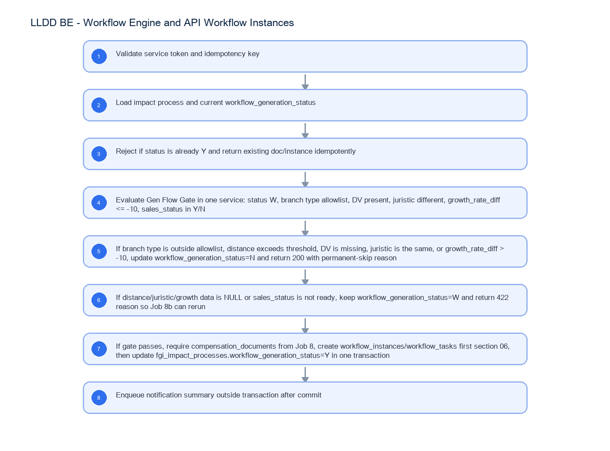

# LLDD BE - Workflow Engine and API Workflow Instances

SBP Mall - ระบบประกันรายได้ | Low Level Design Document

## 1. Overview

| รายการ | รายละเอียด |
| --- | --- |
| Track | BE |
| Estimate | 21 ชั่วโมง |
| Owner | Tunyatorn <Vava> Kiatkongphongsa |
| Objective | ออกแบบ Workflow Engine ภายในและ POST /api/v1/workflows/instances สำหรับเปิด workflow จาก Job 8b แทน K2 REST StartInstance โดยเป็นเจ้าของ Gen Flow Gate W/Y/N |

Common contract reference: ทุกหัวข้อ API/FE ต้องยึด LLDD-BE-API-Common-Contracts และ LLDD-FE-Integration-Contracts สำหรับ error/auth/format/pagination/action/RBAC ก่อนลงรายละเอียดเฉพาะหน้าหรือเฉพาะ endpoint

## 2. Screen / Functional Scope

- Internal Workflow Engine API only
- No FE screen and no Flow page work
- Gen Flow Gate W/Y/N owner
- Require compensation document created by Job 8
- Create workflow instance and first task section 06
- Idempotency and rerun behavior for Job 8b

## 4. Implementation Flow Diagram (Reference)



_รูปที่ 1: Implementation flow reference: LLDD BE - Workflow Engine and API Workflow Instances_

## 5. Field, Format, and Validation

| Field / UI | Format | Validation | Behavior |
| --- | --- | --- | --- |
| impactProcessId | integer/string | required | อ้าง fgi_impact_processes และ compensation_documents ที่ Job 8 สร้างแล้ว |
| sourceJobNo | string | required fixed 8b | ใช้ trace job_run_histories และ audit |
| requestId | uuid | required | idempotency key ต่อ impactProcessId + sourceJobNo |
| workflow_generation_status | W\|Y\|N | computed | W=ข้อมูลยังไม่พร้อมเพื่อ rerun, Y=เปิด workflow สำเร็จ, N=ไม่เข้าเกณฑ์ถาวร |
| branchType/distanceKm | enum/number\|null | required by gate | branch นอกเซ็ตหรือระยะเกินตั้ง N; ระยะยังไม่มีค่าคง W |
| growthRateDiff | number\|null | <= -10 required by gate | NULL คง W; ค่ามากกว่า -10 ตั้ง N แบบถาวร |
| dvUserId/juristic | string\|null | DV required; juristic must differ | DV ว่างหรือ juristic เดียวกันตั้ง N; juristic ยังไม่พร้อมคง W |
| salesStatus | Y\|N | required by gate | ค่าอื่นคง W และคืน 422 |

## 5.1 Input / Progress / Output Contract

| Stage | Contract for implementation |
| --- | --- |
| Input | POST /api/v1/workflows/instances; GET /api/v1/workflows/instances/{id}; GET /api/v1/workflows/summary |
| Progress | Validate service token and idempotency key; Load impact process and current workflow_generation_status; Reject if status is already Y and return existing doc/instance idempotently; Evaluate Gen Flow Gate in one service: status W, branch type allowlist, DV present, juristic different, growth_rate_diff <= -10, sales_status in Y/N |
| Output | fgi_impact_processes / fgi_impact_stores; compensation_documents; workflow_instances |

### 5.90 Endpoint Implementation Contract

| Endpoint | Use-case owner | Service/repository behavior | Definition of done |
| --- | --- | --- | --- |
| POST /api/v1/workflows/instances | เปิด workflow ภายในจาก impact process; เรียกโดย Job 8b ผ่าน service token ไม่ใช่ FE | Validate service token and idempotency key | ไม่มี FE screen หรือ Flow page deliverable เพิ่มจาก LLDD นี้ |
| GET /api/v1/workflows/instances/{id} | อ่านสถานะ workflow instance | Load impact process and current workflow_generation_status | Job 8b ต้องเรียก API/service นี้และไม่ duplicate Gen Flow Gate |
| GET /api/v1/workflows/summary | สรุป W/Y/N และงานค้างต่อ section สำหรับ monitor | Reject if status is already Y and return existing doc/instance idempotently | ไม่เรียก K2 REST StartInstance และไม่สร้างไฟล์ BPM06001O/2O/3O |

### 5.91 Backend Execution Sequence

| Step | Behavior specific to this LLDD | Failure/test evidence |
| --- | --- | --- |
| 1 | Validate service token and idempotency key | gate pass creates workflow |
| 2 | Load impact process and current workflow_generation_status | branch type/distance over threshold sets N |
| 3 | Reject if status is already Y and return existing doc/instance idempotently | distance NULL keeps W |
| 4 | Evaluate Gen Flow Gate in one service: status W, branch type allowlist, DV present, juristic different, growth_rate_diff <= -10, sales_status in Y/N | missing DV sets N |
| 5 | If branch type is outside allowlist, distance exceeds threshold, DV is missing, juristic is the same, or growth_rate_diff > -10, update workflow_generation_status=N and return 200 with permanent-skip reason | same juristic sets N |
| 6 | If distance/juristic/growth data is NULL or sales_status is not ready, keep workflow_generation_status=W and return 422 reason so Job 8b can rerun | growth NULL keeps W but growth > -10 sets N |
| 7 | If gate passes, require compensation_documents from Job 8, create workflow_instances/workflow_tasks first section 06, then update fgi_impact_processes.workflow_generation_status=Y in one transaction | sales status NULL keeps W |
| 8 | Enqueue notification summary outside transaction after commit | duplicate request returns existing instance |

## 6. Button / User Action Mapping

| Action | Trigger | API / Service | Expected Result |
| --- | --- | --- | --- |
| Open workflow | POST | workflowInstance.service.openFromImpact | ผ่าน gate แล้วสร้าง/คืน instance |
| Check status | GET | /api/v1/workflows/instances/{id} | อ่าน instance status |
| Summary | GET | /api/v1/workflows/summary | ตัวเลข W/Y/N และงานค้างต่อ section |

## 7. API Contract

### POST /api/v1/workflows/instances

เปิด workflow ภายในจาก impact process; เรียกโดย Job 8b ผ่าน service token ไม่ใช่ FE

#### Request

```json
{
  "impactProcessId": 901234,
  "sourceJobNo": "8b",
  "requestId": "job8b-901234-256907"
}
```

#### Request Field Schema

| Field | Type | Required | Constraint / Meaning |
| --- | --- | --- | --- |
| impactProcessId | integer | Yes | UTF-8; use value domain described by endpoint purpose |
| sourceJobNo | string | Yes | UTF-8; use value domain described by endpoint purpose |
| requestId | string | Yes | UTF-8; use value domain described by endpoint purpose |

#### Response

```json
{
  "docNo": "2569/00123",
  "instanceId": "WF-2569-00123",
  "workflowGenerationStatus": "Y",
  "firstSection": "06",
  "statusCode": "06",
  "status": "รอฝ่าย SBP DSA ดำเนินการ"
}
```

#### Response Field Schema

| Field | Type | Required | Constraint / Meaning |
| --- | --- | --- | --- |
| docNo | string | Yes | พ.ศ. YYYY/xxxxx |
| instanceId | string | Yes | UTF-8; use value domain described by endpoint purpose |
| workflowGenerationStatus | string | Yes | UTF-8; use value domain described by endpoint purpose |
| firstSection | string | Yes | UTF-8; use value domain described by endpoint purpose |
| statusCode | string | Yes | canonical code; do not replace with display label |
| status | string | Yes | UTF-8; use value domain described by endpoint purpose |

### GET /api/v1/workflows/instances/{id}

อ่านสถานะ workflow instance

#### Query Params

```json
{
  "id": "WF-2569-00123"
}
```

#### Request Field Schema

| Field | Type | Required | Constraint / Meaning |
| --- | --- | --- | --- |
| id | string | No | UTF-8; use value domain described by endpoint purpose |

#### Response

```json
{
  "instanceId": "WF-2569-00123",
  "docNo": "2569/00123",
  "status": "ACTIVE",
  "currentSection": "06"
}
```

#### Response Field Schema

| Field | Type | Required | Constraint / Meaning |
| --- | --- | --- | --- |
| instanceId | string | Yes | UTF-8; use value domain described by endpoint purpose |
| docNo | string | Yes | พ.ศ. YYYY/xxxxx |
| status | string | Yes | UTF-8; use value domain described by endpoint purpose |
| currentSection | string | Yes | UTF-8; use value domain described by endpoint purpose |

### GET /api/v1/workflows/summary

สรุป W/Y/N และงานค้างต่อ section สำหรับ monitor

#### Query Params

```json
{
  "period": "2569-07"
}
```

#### Request Field Schema

| Field | Type | Required | Constraint / Meaning |
| --- | --- | --- | --- |
| period | string | No | UTF-8; use value domain described by endpoint purpose |

#### Response

```json
{
  "workflowGeneration": {
    "W": 12,
    "Y": 342,
    "N": 8
  },
  "openTasksBySection": [
    {
      "sectionCode": "06",
      "count": 24
    }
  ]
}
```

#### Response Field Schema

| Field | Type | Required | Constraint / Meaning |
| --- | --- | --- | --- |
| workflowGeneration | object | Yes | JSON object; nested fields listed below |
| workflowGeneration.W | integer | Yes | UTF-8; use value domain described by endpoint purpose |
| workflowGeneration.Y | integer | Yes | UTF-8; use value domain described by endpoint purpose |
| workflowGeneration.N | integer | Yes | UTF-8; use value domain described by endpoint purpose |
| openTasksBySection | array<object> | Yes | JSON array; element type shown in Type column |
| openTasksBySection[].sectionCode | string | Yes | canonical code; do not replace with display label |
| openTasksBySection[].count | integer | Yes | UTF-8; use value domain described by endpoint purpose |

## 8. Reference DB Mapping (No Database Page Work)

ส่วนนี้เป็นข้อมูลอ้างอิงสำหรับการ implement API/Job เท่านั้น ไม่ใช่งานสร้างหน้า Database, ไม่ใช่งานออกแบบ DB page และไม่ถูกนับเป็น deliverable แยกของ FE/BE

| Table / Object | R/W | Usage |
| --- | --- | --- |
| fgi_impact_processes / fgi_impact_stores | R/W | อ่านข้อมูล impact และอัปเดต workflow_generation_status W/Y/N |
| compensation_documents | R/W | create-if-missing จาก impact process และผูก docNo |
| workflow_instances | R/W | สร้าง instance ACTIVE แทน K2 StartInstance |
| workflow_tasks | W | เปิด first task section 06 |
| document_statuses / workflow_sections | R | lookup statusCode/status และ section แรก |
| job_run_histories | W | บันทึกผลเรียกจาก Job 8b |
| audit_logs | W | audit permanent skip N และ manual rerun |

## 9. Processing Flow

| Step | Description |
| --- | --- |
| 1 | Validate service token and idempotency key |
| 2 | Load impact process and current workflow_generation_status |
| 3 | Reject if status is already Y and return existing doc/instance idempotently |
| 4 | Evaluate Gen Flow Gate in one service: status W, branch type allowlist, DV present, juristic different, growth_rate_diff <= -10, sales_status in Y/N |
| 5 | If branch type is outside allowlist, distance exceeds threshold, DV is missing, juristic is the same, or growth_rate_diff > -10, update workflow_generation_status=N and return 200 with permanent-skip reason |
| 6 | If distance/juristic/growth data is NULL or sales_status is not ready, keep workflow_generation_status=W and return 422 reason so Job 8b can rerun |
| 7 | If gate passes, require compensation_documents from Job 8, create workflow_instances/workflow_tasks first section 06, then update fgi_impact_processes.workflow_generation_status=Y in one transaction |
| 8 | Enqueue notification summary outside transaction after commit |

## 10. Acceptance Criteria

- ไม่มี FE screen หรือ Flow page deliverable เพิ่มจาก LLDD นี้
- Job 8b ต้องเรียก API/service นี้และไม่ duplicate Gen Flow Gate
- ไม่เรียก K2 REST StartInstance และไม่สร้างไฟล์ BPM06001O/2O/3O
- ผ่าน gate แล้ว transaction ต้องมี document + instance + first task + Y ครบ หรือ rollback ทั้งหมด
- fail ถาวร (branch type, distance over threshold, missing DV, same juristic, growth not met) ต้องตั้ง N; เฉพาะข้อมูล distance/juristic/growth/sales status ยังไม่พร้อมจึงคง W
- idempotent rerun ไม่สร้าง docNo/instance/task ซ้ำ

## 11. Developer Test Checklist

| No | Test |
| --- | --- |
| 1 | gate pass creates workflow |
| 2 | branch type/distance over threshold sets N |
| 3 | distance NULL keeps W |
| 4 | missing DV sets N |
| 5 | same juristic sets N |
| 6 | growth NULL keeps W but growth > -10 sets N |
| 7 | sales status NULL keeps W |
| 8 | duplicate request returns existing instance |
| 9 | transaction rollback on task insert failure |
| 10 | service token missing returns 401 |
