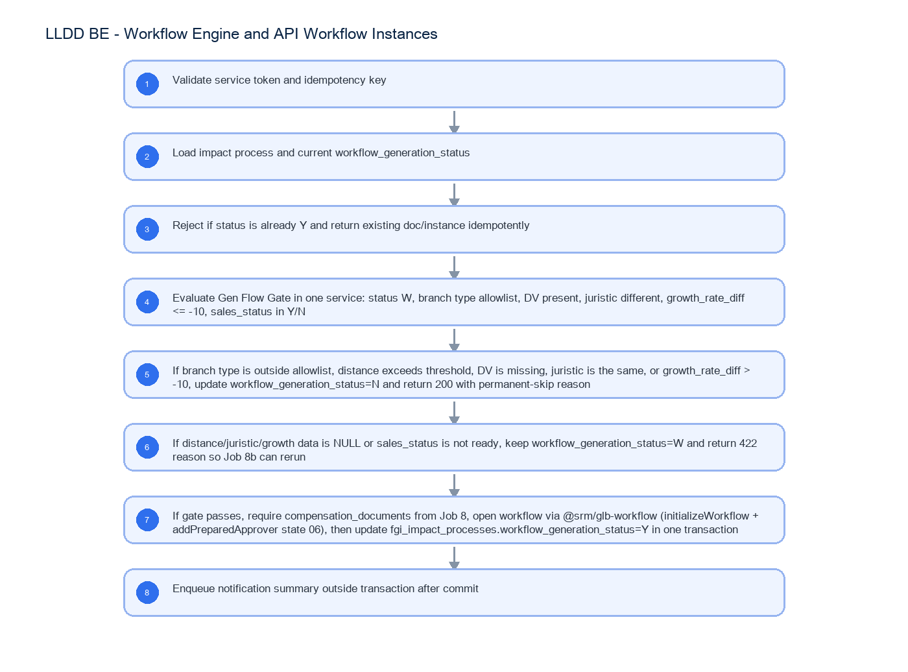

# LLDD BE - Workflow Engine and API Workflow Instances

SBP Mall - ระบบประกันรายได้ | Low Level Design Document

## 1. Overview

| รายการ | รายละเอียด |
| --- | --- |
| Track | BE |
| Estimate | **32 ชั่วโมง** = implementation 24 + unit test 8 (30%) |
| Owner | Tunyatorn <Vava> Kiatkongphongsa |
| Target repository | `SBP/srm-sps-spsap-store-backend` (NestJS + TypeORM · schema `sps_store`) + `SBP/srm-sps-spsap-sbp-bff` (forward ผ่าน client service · ไม่มี DB) สำหรับเส้นที่ FE เรียก |
| Objective | ออกแบบ Workflow Engine ภายในและ POST /api/v1/workflows/instances สำหรับเปิด workflow จาก Job 8b แทน K2 REST StartInstance โดยเป็นเจ้าของ Gen Flow Gate W/Y/N |

Common contract reference: ทุกหัวข้อ API/FE ต้องยึด LLDD-BE-API-Common-Contracts และ LLDD-FE-Integration-Contracts สำหรับ error/auth/format/pagination/action/RBAC ก่อนลงรายละเอียดเฉพาะหน้าหรือเฉพาะ endpoint

## 2. Screen / Functional Scope

- Internal Workflow Engine API only
- No FE screen and no Flow page work
- Gen Flow Gate W/Y/N owner
- Require compensation document created by Job 8
- Create workflow instance and first task section 06
- Idempotency and rerun behavior for Job 8b

## 3. Screenshot Reference

ไม่มีภาพหน้าจอสำหรับหัวข้อนี้ — เป็นเอกสารฝั่ง Backend/Batch ที่ไม่มี UI (ภาพหน้าจอทั้งหมดอยู่ในเอกสารชุด FE)

## 4. Implementation Flow Diagram (Reference)



_รูปที่ 1: Implementation flow reference: LLDD BE - Workflow Engine and API Workflow Instances_

## 5. Field, Format, and Validation

| Field / UI | Format | Validation | Behavior |
| --- | --- | --- | --- |
| impactProcessId | integer/string | required | อ้าง fgi_impact_processes และ compensation_documents ที่ Job 8 สร้างแล้ว |
| sourceJobNo | string | required fixed 8b | ใช้ trace รอบรันใน application log (structured) — ไม่มีตาราง job_run_histories แล้ว |
| requestId | uuid | required | idempotency key ต่อ impactProcessId + sourceJobNo |
| workflow_generation_status | W\|Y\|N | computed | W=ข้อมูลยังไม่พร้อมเพื่อ rerun, Y=เปิด workflow สำเร็จ, N=ไม่เข้าเกณฑ์ถาวร |
| branchType/distanceKm | enum/number\|null | required by gate | branch นอกเซ็ตหรือระยะเกินตั้ง N; ระยะยังไม่มีค่าคง W |
| growthRateDiff | number\|null | <= -10 required by gate | NULL คง W; ค่ามากกว่า -10 ตั้ง N แบบถาวร |
| dvUserId/juristic | string\|null | DV required; juristic must differ | DV ว่างหรือ juristic เดียวกันตั้ง N; juristic ยังไม่พร้อมคง W |
| salesStatus | Y\|N | required by gate | ค่าอื่นคง W และคืน 422 |

### 5.9 Input / Progress / Output Contract

| Stage | Contract for implementation |
| --- | --- |
| Input | POST /api/v1/workflows/instances; GET /api/v1/workflows/instances/{id}; GET /api/v1/workflows/summary |
| Progress | Validate service token and idempotency key; Load impact process and current workflow_generation_status; Reject if status is already Y and return existing doc/instance idempotently; Evaluate Gen Flow Gate in one service: status W, branch type allowlist, DV present, juristic different, growth_rate_diff <= -10, sales_status in Y/N |
| Output | fgi_impact_processes / fgi_impact_stores; compensation_documents; workflow_approver (@srm/glb-workflow) |

### 5.90 Endpoint Implementation Contract

| Endpoint | Use-case owner | Service/repository behavior | Definition of done |
| --- | --- | --- | --- |
| POST /api/v1/workflows/instances | เปิด workflow ภายในจาก impact process; เรียกโดย Job 8b ผ่าน service token ไม่ใช่ FE | Validate service token and idempotency key | ไม่มี FE screen หรือ Flow page deliverable เพิ่มจาก LLDD นี้ |
| GET /api/v1/workflows/instances/{id} | อ่านสถานะ workflow instance | Load impact process and current workflow_generation_status | Job 8b ต้องเรียก API/service นี้และไม่ duplicate Gen Flow Gate |
| GET /api/v1/workflows/summary | สรุป W/Y/N และงานค้างต่อ section สำหรับ monitor | Reject if status is already Y and return existing doc/instance idempotently | ไม่เรียก K2 REST StartInstance และไม่สร้างไฟล์ BPM06001O/2O/3O |

### 5.91 Backend Execution Sequence

| Step | Behavior specific to this LLDD | Failure/test evidence |
| --- | --- | --- |
| 1 | Validate service token and idempotency key | gate pass creates workflow |
| 2 | Load impact process and current workflow_generation_status | branch type/distance over threshold sets N |
| 3 | Reject if status is already Y and return existing doc/instance idempotently | distance NULL keeps W |
| 4 | Evaluate Gen Flow Gate in one service: status W, branch type allowlist, DV present, juristic different, growth_rate_diff <= -10, sales_status in Y/N | missing DV sets N |
| 5 | If branch type is outside allowlist, distance exceeds threshold, DV is missing, juristic is the same, or growth_rate_diff > -10, update workflow_generation_status=N and return 200 with permanent-skip reason | same juristic sets N |
| 6 | If distance/juristic/growth data is NULL or sales_status is not ready, keep workflow_generation_status=W and return 422 reason so Job 8b can rerun | growth NULL keeps W but growth > -10 sets N |
| 7 | If gate passes, require compensation_documents from Job 8, open workflow via @srm/glb-workflow (initializeWorkflow + addPreApprover at state 06 — function names confirmed 2026-08-14 from the library's own LLDD, sheet Detail), then update fgi_impact_processes.workflow_generation_status=Y in one transaction | sales status NULL keeps W |
| 8 | Enqueue notification summary outside transaction after commit | duplicate request returns existing instance |

## 6. Button / User Action Mapping

| Action | Trigger | API / Service | Expected Result |
| --- | --- | --- | --- |
| Open workflow | POST | workflowInstance.service.openFromImpact | ผ่าน gate แล้วสร้าง/คืน instance |
| Check status | GET | /api/v1/workflows/instances/{id} | อ่าน instance status |
| Summary | GET | /api/v1/workflows/summary | ตัวเลข W/Y/N และงานค้างต่อ section |

## 7. API Contract

### POST /api/v1/workflows/instances

เปิด workflow ภายในจาก impact process; เรียกโดย Job 8b ผ่าน service token ไม่ใช่ FE

#### Request

```json
{
  "impactProcessId": 901234,
  "sourceJobNo": "8b",
  "requestId": "job8b-901234-256907"
}
```

#### Request Field Schema

| Field | Type | Required | Constraint / Meaning |
| --- | --- | --- | --- |
| impactProcessId | integer | Yes | UTF-8; use value domain described by endpoint purpose |
| sourceJobNo | string | Yes | UTF-8; use value domain described by endpoint purpose |
| requestId | string | Yes | UTF-8; use value domain described by endpoint purpose |

#### Response

```json
{
  "docNo": "2026/00123",
  "instanceId": "WF-2026-00123",
  "workflowGenerationStatus": "Y",
  "firstSection": "06",
  "statusCode": "06",
  "status": "รอฝ่าย SBP DSA ดำเนินการ"
}
```

#### Response Field Schema

| Field | Type | Required | Constraint / Meaning |
| --- | --- | --- | --- |
| docNo | string | Yes | ค.ศ. YYYY/xxxxx |
| instanceId | string | Yes | UTF-8; use value domain described by endpoint purpose |
| workflowGenerationStatus | string | Yes | UTF-8; use value domain described by endpoint purpose |
| firstSection | string | Yes | UTF-8; use value domain described by endpoint purpose |
| statusCode | string | Yes | canonical code; do not replace with display label |
| status | string | Yes | UTF-8; use value domain described by endpoint purpose |

### GET /api/v1/workflows/instances/{id}

อ่านสถานะ workflow instance

#### Query Params

```json
{
  "id": "WF-2026-00123"
}
```

#### Request Field Schema

| Field | Type | Required | Constraint / Meaning |
| --- | --- | --- | --- |
| id | string | No | UTF-8; use value domain described by endpoint purpose |

#### Response

```json
{
  "instanceId": "WF-2026-00123",
  "docNo": "2026/00123",
  "status": "ACTIVE",
  "currentSection": "06"
}
```

#### Response Field Schema

| Field | Type | Required | Constraint / Meaning |
| --- | --- | --- | --- |
| instanceId | string | Yes | UTF-8; use value domain described by endpoint purpose |
| docNo | string | Yes | ค.ศ. YYYY/xxxxx |
| status | string | Yes | UTF-8; use value domain described by endpoint purpose |
| currentSection | string | Yes | UTF-8; use value domain described by endpoint purpose |

### GET /api/v1/workflows/summary

สรุป W/Y/N และงานค้างต่อ section สำหรับ monitor

#### Query Params

```json
{
  "period": "2026-07"
}
```

#### Request Field Schema

| Field | Type | Required | Constraint / Meaning |
| --- | --- | --- | --- |
| period | string | No | UTF-8; use value domain described by endpoint purpose |

#### Response

```json
{
  "workflowGeneration": {
    "W": 12,
    "Y": 342,
    "N": 8
  },
  "openTasksBySection": [
    {
      "sectionCode": "06",
      "count": 24
    }
  ]
}
```

#### Response Field Schema

| Field | Type | Required | Constraint / Meaning |
| --- | --- | --- | --- |
| workflowGeneration | object | Yes | JSON object; nested fields listed below |
| workflowGeneration.W | integer | Yes | UTF-8; use value domain described by endpoint purpose |
| workflowGeneration.Y | integer | Yes | UTF-8; use value domain described by endpoint purpose |
| workflowGeneration.N | integer | Yes | UTF-8; use value domain described by endpoint purpose |
| openTasksBySection | array<object> | Yes | JSON array; element type shown in Type column |
| openTasksBySection[].sectionCode | string | Yes | canonical code; do not replace with display label |
| openTasksBySection[].count | integer | Yes | UTF-8; use value domain described by endpoint purpose |

## 8. Reference DB Mapping (No Database Page Work)

ส่วนนี้เป็นข้อมูลอ้างอิงสำหรับการ implement API/Job เท่านั้น ไม่ใช่งานสร้างหน้า Database, ไม่ใช่งานออกแบบ DB page และไม่ถูกนับเป็น deliverable แยกของ FE/BE

| Table / Object | R/W | Usage |
| --- | --- | --- |
| fgi_impact_processes / fgi_impact_stores | R/W | อ่านข้อมูล impact และอัปเดต workflow_generation_status W/Y/N |
| compensation_documents | R/W | create-if-missing จาก impact process และผูก docNo |
| workflow_transaction (@srm/glb-workflow) | W (โดย lib) | initializeWorkflow() แทน K2 StartInstance — ห้าม INSERT ตรง |
| workflow_approver (@srm/glb-workflow) | W | addPreApprover state 06 |
| workflow_status / workflow_state (@srm/glb-workflow · sps_store) | R | lookup statusCode/status และ state แรก — ตาราง document_statuses/workflow_sections ของ SBPGI ถูกตัดแล้ว |
| interface_transactions | W | บันทึกผลเรียกจาก Job 8b · ตาราง job_run_histories ถูกตัด 2026-08-06 — ผลการรันไปที่ application log |

## 9. Skeleton Code (store-backend + BFF)

โครงโค้ดตั้งต้นของเอกสารฉบับนี้ ยึด convention จริงของ `srm-sps-spsap-store-backend` (NestJS 11 + TypeORM, schema `sps_store`, custom provider `DATA_SOURCE` ที่ route SELECT ไป slave pool) และ `srm-sps-spsap-sbp-bff` (ไม่มี DB, forward ผ่าน client service). ทุกจุดที่ต้องเติมกำกับด้วย `// TODO:` และ response ทุกเส้นถูกห่อเป็น `{success, data}` โดย ResponseInterceptor อยู่แล้ว จึงห้าม service ห่อซ้ำ

#### 9.1 ผังไฟล์ที่ต้องสร้าง

| Path | หน้าที่ |
| --- | --- |
| store-backend · src/modules/sbpgi-workflow-instances/sbpgi-workflow-instances.controller.ts | route ทั้งหมดของเอกสารนี้ (3 เส้น) + `@UseGuards(HttpHeaderGuard)` + `@UserId()` |
| store-backend · src/modules/sbpgi-workflow-instances/sbpgi-workflow-instances.service.ts | business logic — inject `'DATA_SOURCE'` แล้วยิง raw SQL, mutation ใช้ QueryRunner transaction |
| store-backend · src/modules/sbpgi-workflow-instances/sbpgi-workflow-instances.sql.ts | เก็บ SQL ต่อ endpoint (คัดจากหัวข้อ 10) แยกออกจาก service ให้ทดสอบ/รีวิวง่าย |
| store-backend · src/modules/sbpgi-workflow-instances/dto/sbpgi-workflow-instances.dto.ts | DTO + class-validator ตาม validation ในหัวข้อฟิลด์ของเอกสารนี้ |
| store-backend · src/modules/sbpgi-workflow-instances/sbpgi-workflow-instances.module.ts | ประกอบ controller/service/providers แล้ว register ที่ `app.module.ts` |
| store-backend · src/entitys/fgi-impact-processes.entity.ts | entity ของ `fgi_impact_processes` (`@Entity({schema: process.env.DB_SCHEMA})`, ไม่ประกาศ relation) |
| store-backend · src/entitys/fgi-impact-stores.entity.ts | entity ของ `fgi_impact_stores` (`@Entity({schema: process.env.DB_SCHEMA})`, ไม่ประกาศ relation) |
| store-backend · src/entitys/compensation-documents.entity.ts | entity ของ `compensation_documents` (`@Entity({schema: process.env.DB_SCHEMA})`, ไม่ประกาศ relation) — **entity ร่วมหลายเอกสาร: ประกาศครั้งเดียวแล้วอ้างอิง อย่าสร้างซ้ำ** |
| store-backend · src/providers/sbpgi/sbpgi.ts | repository provider แบบ factory ผูก token string กับ `DATA_SOURCE` — **ไฟล์ร่วมของทุกเอกสาร BE ให้ merge array เพิ่ม ห้ามเขียนทับ** |
| store-backend · sql/deploy-sbpgi-workflow-instances.sql | DDL production แบบ idempotent (ทีมนี้ไม่ใช้ migration เป็นหลัก) |
| BFF · src/common/client-services/sbpgi-client.service.ts | client ต่อจาก `BaseClientService` ตั้ง baseUrl + `x-api-key` ตอน `onModuleInit` |
| BFF · src/modules/sbpgi-workflow-instances/sbpgi-workflow-instances.controller.ts | route ฝั่ง BFF prefix `/bff/sbpgi/…` + `@UseGuards(AuthGuard('jwt'))` |
| BFF · src/modules/sbpgi-workflow-instances/sbpgi-workflow-instances.service.ts | แนบ `x-user-id` / `x-user-group-id` / `x-user-permissions` แล้ว forward ไป backend |

#### 9.2 Controller (store-backend)

```ts
// src/modules/sbpgi-workflow-instances/sbpgi-workflow-instances.controller.ts
import { Body, Controller, Get, Param, Post, Query, UseGuards } from '@nestjs/common';
import { HttpHeaderGuard } from '../../guards/http-header.guard';
import { UserId } from '../../common/decorators/user-id.decorator';
import { SbpgiWorkflowInstancesService } from './sbpgi-workflow-instances.service';
import { WorkflowInstancesQueryDto, CreateWorkflowsInstancesBodyDto } from './dto/sbpgi-workflow-instances.dto';

// LLDD BE - Workflow Engine and API Workflow Instances
// BFF เรียกด้วย x-api-key และแนบ x-user-id / x-user-group-id / x-user-permissions มาให้
@Controller('sbpgi/workflows')
@UseGuards(HttpHeaderGuard)
export class SbpgiWorkflowInstancesController {
  constructor(private readonly service: SbpgiWorkflowInstancesService) {}

  // POST /api/v1/workflows/instances — เปิด workflow ภายในจาก impact process; เรียกโดย Job 8b ผ่าน service t…
  @Post('instances')
  createWorkflowsInstances(
    @Body() body: CreateWorkflowsInstancesBodyDto,
    @UserId() userId: string,
  ) {
    // TODO: ตรวจ x-user-permissions ก่อนเรียก service ถ้า endpoint นี้จำกัดสิทธิ์เมนู
    return this.service.createWorkflowsInstances(body, userId);
  }

  // GET /api/v1/workflows/instances/{id} — อ่านสถานะ workflow instance
  @Get('instances/:id')
  getWorkflowsInstancesById(@Param('id') id: string, @UserId() userId: string) {
    // TODO: ตรวจ x-user-permissions ก่อนเรียก service ถ้า endpoint นี้จำกัดสิทธิ์เมนู
    return this.service.getWorkflowsInstancesById(id, userId);
  }

  // GET /api/v1/workflows/summary — สรุป W/Y/N และงานค้างต่อ section สำหรับ monitor
  @Get('summary')
  getWorkflowsSummary(@Query() query: WorkflowInstancesQueryDto, @UserId() userId: string) {
    // TODO: ตรวจ x-user-permissions ก่อนเรียก service ถ้า endpoint นี้จำกัดสิทธิ์เมนู
    return this.service.getWorkflowsSummary(query, userId);
  }
}
```

#### 9.3 DTO + Validation

```ts
// src/modules/sbpgi-workflow-instances/dto/sbpgi-workflow-instances.dto.ts
import { Type } from 'class-transformer';
import {
  IsArray, IsBoolean, IsIn, IsInt, IsNotEmpty, IsNumber, IsObject, IsOptional,
  IsString, Matches, Max, MaxLength, Min,
} from 'class-validator';

// ValidationPipe ระดับ global ตั้ง whitelist + forbidNonWhitelisted + transform ไว้แล้ว (main.ts)
// property ที่ไม่ประกาศที่นี่จะถูก reject เป็น 400 อัตโนมัติ

// query ร่วมของ GET ทุกเส้นในโมดูลนี้ (path param ใช้ @Param แยก)
export class WorkflowInstancesQueryDto {
  /** required เฉพาะบาง endpoint — ตรวจซ้ำใน service */
  @IsOptional()
  @IsString()
  period?: string;
}
```

```ts
// body ของ POST /api/v1/workflows/instances
export class CreateWorkflowsInstancesBodyDto {
  /** อ้าง fgi_impact_processes และ compensation_documents ที่ Job 8 สร้างแล้ว */
  @IsNotEmpty()
  @Type(() => Number)
  @IsInt()
  impactProcessId: number;

  /** ใช้ trace รอบรันใน application log (structured) — ไม่มีตาราง job_run_histories แล้ว */
  @IsNotEmpty()
  @IsString()
  sourceJobNo: string;

  /** idempotency key ต่อ impactProcessId + sourceJobNo */
  @IsNotEmpty()
  @IsString()
  requestId: string;
}
```

#### 9.4 Service (inject `DATA_SOURCE` + raw SQL)

service ประกาศ method ครบทุกเส้นที่ controller เรียก และ **signature มาจากแหล่งเดียวกับ controller** (จำนวน/ลำดับพารามิเตอร์จึงตรงกันเสมอ) — เส้นที่ยังไม่ได้ implement เป็น stub ที่ `throw new NotImplementedException(...)` ให้ TypeScript compile ผ่านตั้งแต่วันแรก

```ts
// src/modules/sbpgi-workflow-instances/sbpgi-workflow-instances.service.ts
import { Inject, Injectable, Logger, NotFoundException, NotImplementedException } from '@nestjs/common';
import { DataSource } from 'typeorm';
import { WorkflowService } from '../workflow/workflow.service';
import { SBPGI_SQL } from './sbpgi-workflow-instances.sql';

@Injectable()
export class SbpgiWorkflowInstancesService {
  private readonly logger = new Logger(SbpgiWorkflowInstancesService.name);
  // versionId ของ workflow ประกันรายได้ (ตั้งใน env เหมือน COOPERATION_WORKFLOW_VERSION_ID)
  private readonly versionId = Number(process.env.SBPGI_WORKFLOW_VERSION_ID);

  constructor(
    // DATA_SOURCE override query(): SELECT/WITH ไป slave pool, write ไป master
    @Inject('DATA_SOURCE') private readonly dataSource: DataSource,
    private readonly workflow: WorkflowService,
  ) {}

  // POST /api/v1/workflows/instances — เปิด workflow ภายในจาก impact process; เรียกโดย Job 8b ผ่าน service t…
  // mutation ต้องอยู่ใน transaction เดียว (ไม่มี audit ของ master แล้ว · 2026-08-07)
  async createWorkflowsInstances(body: CreateWorkflowsInstancesBodyDto, userId: string) {
    const runner = this.dataSource.createQueryRunner();
    await runner.connect();
    await runner.startTransaction();
    try {
      // TODO: lock แถวเป้าหมายของ fgi_impact_processes ด้วย SELECT ... FOR UPDATE ก่อนเขียน
      const [current] = await runner.query(SBPGI_SQL.createWorkflowsInstancesLock, [body.docNo]);
      if (!current) {
        throw new NotFoundException('ไม่พบข้อมูลที่ต้องการ');
      }
      await runner.query(SBPGI_SQL.createWorkflowsInstances, [/* TODO: ผูกค่าจาก body */]);
      await runner.commitTransaction();
      // ⚠️ workflow engine อยู่คนละ DataSource ('workflow-connection' ของ @srm/glb-workflow)
      //    จึง **atomic ร่วมกับ transaction ข้างบนไม่ได้** — ต้อง commit ฝั่ง SBPGI ให้เสร็จก่อน
      //    แล้วค่อย eventWorkflow (idempotency key = referenceId = docNo)
      // TODO: เรียก workflow use case ตามตารางหัวข้อ Workflow ด้านล่าง + retry
      // TODO: ถ้า eventWorkflow ล้มเหลว ต้องมี compensating action และบันทึกผลลง
      //       consideration_logs เพื่อให้ job reconcile ตามเก็บได้
      return { message: 'saved' };
    } catch (error) {
      await runner.rollbackTransaction();
      this.logger.error(error);
      throw error;
    } finally {
      await runner.release();
    }
  }

  // GET /api/v1/workflows/instances/{id} — อ่านสถานะ workflow instance
  async getWorkflowsInstancesById(id: string, userId: string) {
    const page = 1;
    const size = 100; // endpoint นี้ไม่มี query param — ไม่แบ่งหน้า
    // SQL เต็มอยู่ในหัวข้อ Database SQL ของเอกสารนี้ (คีย์ 'GET /api/v1/workflows/instances/{id}')
    // ⚠️ SQL ตัวอย่างบางเส้นเขียนด้วย named parameter (:size/:offset) แต่ dataSource.query()
    //    รับเฉพาะ positional $1..$n — ต้องแปลงชื่อเป็นลำดับก่อน หรือใช้ QueryBuilder แทน
    const rows = await this.dataSource.query(SBPGI_SQL.getWorkflowsInstancesById, [
      // TODO: เรียงพารามิเตอร์ให้ตรงกับ $1..$n ของ SQL จริง
      userId, (page - 1) * size, size,
    ]);
    // TODO: total ต้องมาจาก COUNT(*) แยก query หรือ window function ไม่ใช่ rows.length
    return { page, size, total: rows.length, items: rows };
  }

  // GET /api/v1/workflows/summary — สรุป W/Y/N และงานค้างต่อ section สำหรับ monitor
  async getWorkflowsSummary(query: WorkflowInstancesQueryDto, userId: string) {
    // TODO: implement ตาม business rule ของ GET /api/v1/workflows/summary
    //       (SQL อยู่ในหัวข้อ Database SQL คีย์ 'GET /api/v1/workflows/summary')
    throw new NotImplementedException('getWorkflowsSummary ยังไม่ implement');
  }
}
```

#### 9.5 Workflow (`@srm/glb-workflow`)

✅ **ชื่อ function ของ engine — ยึด LLDD ของ lib (ปิดข้อค้าง 2026-08-14)** · API จริงคือ 8 ตัวตามชีต `Detail` ของ `SBP/TSM-SRM-LLDD SBP workflow 1.2.xlsx` (เอกสารของ lib เอง): `initializeWorkflow` · `eventWorkflow` · `getPermissionEvents` · `getHistory` · `getTransaction` · `getPendingFlowByUser` · `getWorkflowsByUser` · `addPreApprover` · ชื่อที่เคยขัดกันไม่ใช่ชื่อ API — *Trigger Event* เป็นชื่อหัวข้อขั้นตอนภายใน `eventWorkflow` และ `*UseCase` เป็น class ที่ store-backend ห่อไว้ใช้เอง (ดู `LLDD-BE-Workflow-Engine-Definition` หัวข้อ 5.3)

| Endpoint | Use case ที่ต้องเรียก | เหตุผล |
| --- | --- | --- |
| POST /api/v1/workflows/instances | initializeWorkflow() → addPreApprover() | เปิด transaction ใหม่ (referenceId = docNo) แล้วผูกผู้อนุมัติ state 06 |
| GET /api/v1/workflows/instances/{id} | getTransaction() | อ่าน currentState ของ instance ตาม referenceId |
| GET /api/v1/workflows/summary | getPendingFlowByUser() (aggregate) | นับงานค้างต่อ state แล้วรวมกับ workflow_generation_status W/Y/N |

```ts
// src/modules/sbpgi-workflow-instances/sbpgi-workflow-instances.workflow.ts (หรือรวมไว้ใน service เดียวกัน)
// WorkflowService = wrapper ของ @srm/glb-workflow ที่ store-backend มีอยู่แล้ว
// (DataSource แยกชื่อ 'workflow-connection', ทุก use case ห่อด้วย TypeOrmUnitOfWork)

  // เปิด workflow ใหม่แทน K2 REST StartInstance — referenceId = docNo
  const transactionId = await this.workflow.initializeWorkflow({
    versionId: this.versionId,
    referenceId: docNo,
    userId: Number(userId),
  });
  // ผูกผู้อนุมัติล่วงหน้าของ section 06 (prepared approver)
  await this.workflow.addPreApprover({
    versionId: this.versionId,
    referenceId: docNo,
    stateId: SECTION_STATE_ID['06'], // TODO: map section 06/08/01/02/03 -> stateId ของ workflow version
    approver: Number(approverUserId), // TODO: resolve จาก auth-backend group ตามโซน/ฝ่าย
    seq: 1,
    userId: Number(userId),
  });

  // inbox งานค้าง — ใช้ร่วมกับ /api/workflow/pending ของ backlog เดิมได้
  const pending = await this.workflow.getPendingFlowByUser({
    userData: { userId: Number(userId), groupId: Number(groupId) },
    versionId: this.versionId,
  });
  // TODO: join referenceId (= doc_no) กลับไปที่ compensation_documents เพื่อเติมข้อมูลเอกสาร

  // สถานะปัจจุบันของเอกสาร
  const trx = await this.workflow.getTransaction({ versionId: this.versionId, referenceId: docNo });
  // TODO: map currentState -> statusCode/statusName ที่ FE ใช้
```

#### 9.6 Entity (TypeORM)

```ts
// src/entitys/fgi-impact-processes.entity.ts
import { Column, Entity, PrimaryColumn } from 'typeorm';

@Entity({ name: 'fgi_impact_processes', schema: process.env.DB_SCHEMA })
export class FgiImpactProcess {
  @PrimaryColumn({ name: 'id', type: 'bigint' })
  id: number;

  @Column({ name: 'impacted_store_code', type: 'char', length: 5 })
  impactedStoreCode: string;

  @Column({ name: 'period_year', type: 'int' })
  periodYear: number;

  @Column({ name: 'period_month', type: 'int' })
  periodMonth: number;

  @Column({ name: 'action_status', type: 'char', length: 1 })
  actionStatus: string;

  @Column({ name: 'workflow_generation_status', type: 'char', length: 1 })
  workflowGenerationStatus: string;

  @Column({ name: 'last_compensation_amount', type: 'numeric', precision: 15, scale: 2, nullable: true })
  lastCompensationAmount?: string;

  @Column({ name: 'created_at', type: 'timestamptz', nullable: true })
  createdAt?: Date;

  // TODO: ตรวจความยาว/precision กับ DDL จริงใน sql/deploy-sbpgi-*.sql ก่อน merge
  //       entity ชุดนี้ไม่ประกาศ relation ตาม convention (join ด้วย raw SQL)
}
```

```ts
// src/entitys/fgi-impact-stores.entity.ts
import { Column, Entity, PrimaryColumn } from 'typeorm';

@Entity({ name: 'fgi_impact_stores', schema: process.env.DB_SCHEMA })
export class FgiImpactStore {
  @PrimaryColumn({ name: 'id', type: 'bigint' })
  id: number;

  @Column({ name: 'impact_process_id', type: 'bigint' })
  impactProcessId: number;

  @Column({ name: 'impacted_store_code', type: 'char', length: 5 })
  impactedStoreCode: string;

  @Column({ name: 'new_store_code', type: 'char', length: 5 })
  newStoreCode: string;

  @Column({ name: 'verify_status', type: 'char', length: 1 })
  verifyStatus: string;

  @Column({ name: 'compensate_percent', type: 'numeric', precision: 5, scale: 2, nullable: true })
  compensatePercent?: string;

  @Column({ name: 'period_year', type: 'int' })
  periodYear: number;

  @Column({ name: 'period_month', type: 'int' })
  periodMonth: number;

  // TODO: ตรวจความยาว/precision กับ DDL จริงใน sql/deploy-sbpgi-*.sql ก่อน merge
  //       entity ชุดนี้ไม่ประกาศ relation ตาม convention (join ด้วย raw SQL)
}
```

ตารางที่เหลือของเอกสารนี้ (`compensation_documents`, `interface_transactions`) ใช้รูปแบบ entity เดียวกัน — คอลัมน์อ้างจาก `database.md`

ตารางที่ **ไม่ต้องสร้าง entity** เพราะใช้ของระบบเดิม/workflow engine:

| Object | R/W | ใช้ของระบบเดิมตัวไหน |
| --- | --- | --- |
| workflow_transaction | W (โดย lib) | workflow engine @srm/glb-workflow |
| workflow_approver | W | workflow engine @srm/glb-workflow |
| workflow_status | R | workflow engine @srm/glb-workflow |
| workflow_state | R | workflow engine @srm/glb-workflow |

#### 9.7 Repository Providers + Module wiring

```ts
// src/providers/sbpgi/sbpgi.ts — repository provider แบบ factory (ไม่ใช้ TypeOrmModule.forFeature)
// convention ของโฟลเดอร์ providers คือ 1 ไฟล์ต่อโดเมน ตั้งชื่อตามโดเมน (business_user/business_user.ts,
// common_code/common_code.ts …) ไม่ใช่ index.ts
//
// ⚠️ ไฟล์นี้ใช้ร่วมกันทุกเอกสาร BE ของ SBPGI — ให้ **merge array เพิ่ม** เข้าไฟล์เดิม ห้ามเขียนทับ
//    (ชื่อ const แยกต่อเอกสารไว้แล้วเพื่อไม่ให้ชนกัน)
import { DataSource } from 'typeorm';
import { FgiImpactProcess } from '../../entitys/fgi-impact-processes.entity';
import { FgiImpactStore } from '../../entitys/fgi-impact-stores.entity';
import { CompensationDocument } from '../../entitys/compensation-documents.entity';

export const sbpgiWorkflowInstancesProviders = [
  {
    provide: 'FGI_IMPACT_PROCESSE_REPOSITORY',
    useFactory: (dataSource: DataSource) => dataSource.getRepository(FgiImpactProcess),
    inject: ['DATA_SOURCE'],
  },
  {
    provide: 'FGI_IMPACT_STORE_REPOSITORY',
    useFactory: (dataSource: DataSource) => dataSource.getRepository(FgiImpactStore),
    inject: ['DATA_SOURCE'],
  },
  {
    provide: 'COMPENSATION_DOCUMENT_REPOSITORY',
    useFactory: (dataSource: DataSource) => dataSource.getRepository(CompensationDocument),
    inject: ['DATA_SOURCE'],
  },
];

// src/modules/sbpgi-workflow-instances/sbpgi-workflow-instances.module.ts
import { MiddlewareConsumer, Module, NestModule } from '@nestjs/common';
import { DatabaseModule } from '../../database/database.module';
// UserContextMiddleware อ่าน header x-user-id แล้วเซ็ต request.userId ที่ @UserId() ใช้
// — app.module.ts **ไม่ได้** apply แบบ global (มีแค่ HttpContext/LoggerContext) แต่ละโมดูลต้อง apply เอง
// (ดู evaluation-process.module.ts / inform-evaluate.module.ts / cooperation-request.module.ts)
import { UserContextMiddleware } from '../../common/middleware/user-context.middleware';
import { WorkflowModule } from '../workflow/workflow.module';
import { sbpgiWorkflowInstancesProviders } from '../../providers/sbpgi/sbpgi';
import { SbpgiWorkflowInstancesController } from './sbpgi-workflow-instances.controller';
import { SbpgiWorkflowInstancesService } from './sbpgi-workflow-instances.service';

@Module({
  imports: [DatabaseModule, WorkflowModule],
  controllers: [SbpgiWorkflowInstancesController],
  providers: [SbpgiWorkflowInstancesService, ...sbpgiWorkflowInstancesProviders],
  exports: [SbpgiWorkflowInstancesService],
})
export class SbpgiWorkflowInstancesModule implements NestModule {
  configure(consumer: MiddlewareConsumer) {
    // ถ้าไม่ apply ตรงนี้ userId จะเป็น undefined เงียบ ๆ ทุก endpoint
    consumer.apply(UserContextMiddleware).forRoutes(SbpgiWorkflowInstancesController);
  }
}
// TODO: register module นี้ใน app.module.ts (imports) พร้อมกับโมดูล SBPGI ตัวอื่น
```

#### 9.8 BFF Proxy (module + controller + client service)

BFF ยังไม่มีฟีเจอร์ประกันรายได้เลย จึงต้องสร้าง module ใหม่ + client service ใหม่ทั้งชุด และเลือก prefix แบบเดียวทั้งโมดูล (ที่นี่ใช้ `/bff/sbpgi/…`) เพื่อไม่ให้ปนแบบที่มี/ไม่มี `/bff` เหมือนโมดูลเดิม

```ts
// src/common/client-services/sbpgi-client.service.ts
import { Injectable, Logger, OnModuleInit } from '@nestjs/common';
import { BaseClientService } from './base-client.service';

@Injectable()
export class SbpgiClientService extends BaseClientService implements OnModuleInit {
  protected logger: Logger = new Logger(SbpgiClientService.name);

  onModuleInit() {
    // TODO: ถ้า deploy SBPGI แยก service ให้เพิ่ม API_SBPGI_BACKEND_* ใน AppConfigService
    //       ตอนนี้ชี้ store backend ตัวเดียวกับ StoreClientService
    this.defaultHeaders[this.config.api.store.key.name] = this.config.api.store.key.value;
    this.baseUrl = this.config.api.store.url;
  }
}
// BaseClientService แกะ { success, data } ให้แล้ว — service ฝั่ง BFF จึงได้ data ตรง ๆ
// TODO: เพิ่ม SbpgiClientService ใน providers/exports ของ ClientServiceModule (@Global)
```

```ts
// src/modules/sbpgi-workflow-instances/sbpgi-workflow-instances.service.ts (BFF)
import { Injectable } from '@nestjs/common';
import { SbpgiClientService } from '@common/client-services/sbpgi-client.service';

@Injectable()
export class SbpgiWorkflowInstancesBffService {
  constructor(private readonly client: SbpgiClientService) {}

  // BFF ไม่มี DB — หน้าที่เดียวคือแนบ user context แล้ว forward
  private userHeaders(user: any) {
    return {
      'x-user-id': user?.userId,
      'x-user-group-id': user?.groupId,
      'x-user-permissions': (user?.permissions ?? []).join(','),
    };
  }

  createWorkflowsInstances(body: any, user: any) {
    return this.client.post('/api/v1/workflows/instances', body, { headers: this.userHeaders(user) });
  }

  getWorkflowsInstancesById(id: string, params: any, user: any) {
    return this.client.get(`/api/v1/workflows/instances/${id}`, { params, headers: this.userHeaders(user) });
  }

  getWorkflowsSummary(params: any, user: any) {
    return this.client.get('/api/v1/workflows/summary', { params, headers: this.userHeaders(user) });
  }
}

// ---------- src/modules/sbpgi-workflow-instances/sbpgi-workflow-instances.controller.ts (BFF) ----------
import { Body, Controller, Delete, Get, Param, Post, Put, Query, Req, UseGuards } from '@nestjs/common';
import { AuthGuard } from '@nestjs/passport';

// เลือก prefix แบบเดียวทั้งโมดูล: ใช้ '/bff/sbpgi/...' (ห้ามปนกับแบบไม่มี /bff)
@Controller('bff/sbpgi/workflow-instances')
@UseGuards(AuthGuard('jwt'))
export class SbpgiWorkflowInstancesBffController {
  constructor(private readonly service: SbpgiWorkflowInstancesBffService) {}

  // proxy ของ POST /api/v1/workflows/instances
  @Post('workflows/instances')
  createWorkflowsInstances(@Body() body: any, @Req() req: any) {
    return this.service.createWorkflowsInstances(body, req.user);
  }

  // proxy ของ GET /api/v1/workflows/instances/{id}
  @Get('workflows/instances/:id')
  getWorkflowsInstancesById(@Param('id') id: string, @Query() query: any, @Req() req: any) {
    return this.service.getWorkflowsInstancesById(id, query, req.user);
  }
}
// TODO: register module ใน app.module.ts ของ BFF และเพิ่ม SbpgiClientService ใน ClientServiceModule (@Global)
```

## 10. Database SQL

#### 10.1 ตารางที่อ่าน/เขียน

| Table / Object | R/W | Usage |
| --- | --- | --- |
| fgi_impact_processes | R/W | อ่านข้อมูล impact และอัปเดต workflow_generation_status W/Y/N |
| fgi_impact_stores | R/W | อ่านข้อมูล impact และอัปเดต workflow_generation_status W/Y/N |
| compensation_documents | R/W | create-if-missing จาก impact process และผูก docNo |
| interface_transactions | W | บันทึกผลเรียกจาก Job 8b · ตาราง job_run_histories ถูกตัด 2026-08-06 — ผลการรันไปที่ application log |
| workflow_transaction | W (โดย lib) | ใช้ของระบบเดิม: workflow engine @srm/glb-workflow |
| workflow_approver | W | ใช้ของระบบเดิม: workflow engine @srm/glb-workflow |
| workflow_status | R | ใช้ของระบบเดิม: workflow engine @srm/glb-workflow |
| workflow_state | R | ใช้ของระบบเดิม: workflow engine @srm/glb-workflow |

#### 10.2 SQL จริงต่อ Endpoint

**POST /api/v1/workflows/instances** — เปิด workflow ภายในจาก impact process; เรียกโดย Job 8b ผ่าน service token ไม่ใช่ FE

```sql
-- ⚠️ SQL นี้ใช้ named parameter (:name) แต่ `dataSource.query()` ของ store-backend
--    รับเฉพาะ positional $1..$n — ต้องแปลงเป็นลำดับ หรือรันผ่าน QueryBuilder
-- Gen Flow Gate: workflow_generation_status มี source of truth ที่ fgi_impact_processes
SELECT p.id AS impact_process_id, p.workflow_generation_status, ist.opt_dv_user_id,
       -- ⚠️ store ของระบบเดิมไม่มี juristic_name — นิติบุคคลอยู่คนละตาราง (fr_store / franchisee / juristic)
       --    ชื่อตาราง/คีย์ยังไม่ยืนยัน ต้องถามทีมเจ้าของก่อนเขียนโค้ด
       ij.juristic_name AS impacted_store_juristic_name, nj.juristic_name AS new_store_juristic_name,
       ss.growth_rate_diff, ss.sales_status, ns.store_type, pair.distance_km, impacted.zone_cd
FROM fgi_impact_processes p
JOIN impacted_stores ist ON ist.store_code = p.impacted_store_code
JOIN store impacted ON impacted.store_id = p.impacted_store_code
JOIN fgi_impact_stores pair ON pair.impact_process_id = p.id
JOIN store ns ON ns.store_id = pair.new_store_code
-- นิติบุคคลต้องผ่าน fr_store: store.store_id -> fr_store.juristic_id -> juristic.juristic_name
LEFT JOIN fr_store ifs ON ifs.store_id = impacted.store_id
LEFT JOIN juristic ij  ON ij.juristic_id = ifs.juristic_id
LEFT JOIN fr_store nfs ON nfs.store_id = ns.store_id
LEFT JOIN juristic nj  ON nj.juristic_id = nfs.juristic_id
LEFT JOIN fgi_impact_sales_summaries ss ON ss.impact_process_id = p.id
WHERE p.id = :impactProcessId FOR UPDATE OF p;

-- fail ถาวร (branch/distance over/missing DV/same juristic/growth > -10) → N; เฉพาะ distance/juristic/growth NULL หรือ sales_status ยังไม่พร้อมจึงคง W
UPDATE fgi_impact_processes SET workflow_generation_status = :flagN
WHERE id = :impactProcessId AND workflow_generation_status = :flagW AND :gateDecision = :flagN;

-- ผ่าน gate → ใช้เอกสารที่ Job 8 สร้างแล้ว เปิด instance + งานแรกผ่าน @srm/glb-workflow แล้วตั้ง Y ใน transaction เดียว
-- ⚠️ ไม่ INSERT ตาราง workflow เอง (workflow_instances / workflow_tasks ถูกตัดออกจากโครง 20 ตารางแล้ว)
--    initialize(versionId=:sbpgiVersionId, referenceId=:referenceId, userId=:serviceActor)
--    addPreApprover(versionId, referenceId, stateId=:section06, approver, seq=1)
-- referenceId = compensation_documents.id (DP-1 ปิดแล้ว) · ไม่มี UNIQUE กันซ้ำจริงบน
--    sps_store.workflow_transaction (ไม่มี PK/index · 19,283 แถว) → กันซ้ำที่ application (DP-2)
--    ดู SBP/SBPGI-vs-existing-system.md หัวข้อ 4
SELECT d.doc_no FROM compensation_documents d
WHERE d.impact_process_id = :impactProcessId AND :gateDecision = :flagY;
UPDATE fgi_impact_processes SET workflow_generation_status = :flagY
WHERE id = :impactProcessId AND workflow_generation_status = :flagW AND :gateDecision = :flagY;
```

**GET /api/v1/workflows/instances/{id}** — อ่านสถานะ workflow instance

```sql
-- ⚠️ SQL นี้ใช้ named parameter (:name) แต่ `dataSource.query()` ของ store-backend
--    รับเฉพาะ positional $1..$n — ต้องแปลงเป็นลำดับ หรือรันผ่าน QueryBuilder
-- ✅ DP-1 ปิดแล้ว: referenceId = compensation_documents.id (surrogate) · ⚠️ DP-2 (sps_store.workflow_transaction ไม่มี PK/index · 19,283 แถว → seq-scan) ยังไม่ตัดสิน
--    ดู SBP/SBPGI-vs-existing-system.md หัวข้อ 4
SELECT w.transaction_id, w.reference_id, w.current_state_id, w.current_status_id, w.current_approver,
       a.state_id AS pending_state_id, a.approver_id, a.approve_seq
FROM sps_store.workflow_transaction w
LEFT JOIN sps_store.workflow_approver a ON a.transaction_id = w.transaction_id AND a.state_id = w.current_state_id
WHERE w.transaction_id = :id AND w.version_id = :sbpgiVersionId;

-- เอกสารที่ผูกกับ instance (join ด้วยcompensation_documents.id (DP-1 ปิดแล้ว))
SELECT doc_no, status_code, current_section_code FROM compensation_documents WHERE doc_no = :referenceId;
```

**GET /api/v1/workflows/summary** — สรุป W/Y/N และงานค้างต่อ section สำหรับ monitor

```sql
-- ⚠️ SQL นี้ใช้ named parameter (:name) แต่ `dataSource.query()` ของ store-backend
--    รับเฉพาะ positional $1..$n — ต้องแปลงเป็นลำดับ หรือรันผ่าน QueryBuilder
SELECT workflow_generation_status, COUNT(*) AS cnt
FROM fgi_impact_processes
GROUP BY workflow_generation_status;

-- ✅ DP-1 ปิดแล้ว: referenceId = compensation_documents.id (surrogate) · ⚠️ DP-2 (sps_store.workflow_transaction ไม่มี PK/index · 19,283 แถว → seq-scan) ยังไม่ตัดสิน
--    ดู SBP/SBPGI-vs-existing-system.md หัวข้อ 4
SELECT w.current_state_id AS section_code, COUNT(*) AS open_tasks
FROM sps_store.workflow_transaction w
WHERE w.version_id = :sbpgiVersionId AND w.current_status_id <> :statusDone
GROUP BY w.current_state_id;
```

#### 10.3 Index / Constraint ที่ควรมี (ข้อเสนอ)

| Table | DDL ที่เสนอ | ที่มา / หมายเหตุ |
| --- | --- | --- |
| fgi_impact_stores | CREATE INDEX idx_fgi_impact_stores_impact_process_id ON fgi_impact_stores (impact_process_id); | ข้อเสนอ — อนุมานจากคอลัมน์ที่ปรากฏใน WHERE/JOIN ของ SQL ด้านบน ต้องวัด EXPLAIN ก่อนใช้จริง |
| compensation_documents | CREATE INDEX idx_compensation_documents_impact_process_id ON compensation_documents (impact_process_id); | ข้อเสนอ — อนุมานจากคอลัมน์ที่ปรากฏใน WHERE/JOIN ของ SQL ด้านบน ต้องวัด EXPLAIN ก่อนใช้จริง |

ทั้งหมดเป็น **ข้อเสนอ** ไม่ใช่ข้อกำหนดจาก SRS — ให้ตรวจกับ `EXPLAIN ANALYZE` บนข้อมูลจริง และรวมเข้าไฟล์ `sql/deploy-sbpgi-*.sql` แบบ idempotent (`CREATE INDEX IF NOT EXISTS`) ตาม pattern ที่ทีมใช้อยู่

## 11. Processing Flow

| Step | Description |
| --- | --- |
| 1 | Validate service token and idempotency key |
| 2 | Load impact process and current workflow_generation_status |
| 3 | Reject if status is already Y and return existing doc/instance idempotently |
| 4 | Evaluate Gen Flow Gate in one service: status W, branch type allowlist, DV present, juristic different, growth_rate_diff <= -10, sales_status in Y/N |
| 5 | If branch type is outside allowlist, distance exceeds threshold, DV is missing, juristic is the same, or growth_rate_diff > -10, update workflow_generation_status=N and return 200 with permanent-skip reason |
| 6 | If distance/juristic/growth data is NULL or sales_status is not ready, keep workflow_generation_status=W and return 422 reason so Job 8b can rerun |
| 7 | If gate passes, require compensation_documents from Job 8, open workflow via @srm/glb-workflow (initializeWorkflow + addPreApprover at state 06 — function names confirmed 2026-08-14 from the library's own LLDD, sheet Detail), then update fgi_impact_processes.workflow_generation_status=Y in one transaction |
| 8 | Enqueue notification summary outside transaction after commit |

## 12. Acceptance Criteria

- ไม่มี FE screen หรือ Flow page deliverable เพิ่มจาก LLDD นี้
- Job 8b ต้องเรียก API/service นี้และไม่ duplicate Gen Flow Gate
- ไม่เรียก K2 REST StartInstance และไม่สร้างไฟล์ BPM06001O/2O/3O
- ผ่าน gate แล้ว transaction ต้องมี document + instance + first task + Y ครบ หรือ rollback ทั้งหมด
- fail ถาวร (branch type, distance over threshold, missing DV, same juristic, growth not met) ต้องตั้ง N; เฉพาะข้อมูล distance/juristic/growth/sales status ยังไม่พร้อมจึงคง W
- idempotent rerun ไม่สร้าง docNo/instance/task ซ้ำ

## 13. Developer Test Checklist

| No | Test |
| --- | --- |
| 1 | gate pass creates workflow |
| 2 | branch type/distance over threshold sets N |
| 3 | distance NULL keeps W |
| 4 | missing DV sets N |
| 5 | same juristic sets N |
| 6 | growth NULL keeps W but growth > -10 sets N |
| 7 | sales status NULL keeps W |
| 8 | duplicate request returns existing instance |
| 9 | transaction rollback on task insert failure |
| 10 | service token missing returns 401 |

## 14. Unit Test Scope

**8 ชั่วโมง** (30% ของ implementation 24 ชั่วโมง) · เครื่องมือ: Jest + mock repository/DataSource (ไม่ต่อ DB จริง)

หัวข้อนี้คือ **unit test** ที่ต้องเขียนคู่กับโค้ด — ต่างจาก *Developer Test Checklist* ซึ่งเป็น scenario ระดับ end-to-end/manual ที่ใช้ตอนตรวจรับ · รายการด้านล่าง derive จาก field/validation, acceptance criteria, endpoint และตารางที่เอกสารนี้เขียน

| สิ่งที่ทดสอบ | ประเภท | เกณฑ์ผ่าน |
| --- | --- | --- |
| `impactProcessId` | validation | ผ่านเมื่อถูกกฎ / โยน error เมื่อผิด — กฎ: required · รูปแบบ: integer/string |
| `sourceJobNo` | validation | ผ่านเมื่อถูกกฎ / โยน error เมื่อผิด — กฎ: required fixed 8b · รูปแบบ: string |
| `requestId` | validation | ผ่านเมื่อถูกกฎ / โยน error เมื่อผิด — กฎ: required · รูปแบบ: uuid |
| `workflow_generation_status` | validation | ผ่านเมื่อถูกกฎ / โยน error เมื่อผิด — กฎ: computed · รูปแบบ: W\|Y\|N |
| `branchType/distanceKm` | validation | ผ่านเมื่อถูกกฎ / โยน error เมื่อผิด — กฎ: required by gate · รูปแบบ: enum/number\|null |
| `growthRateDiff` | validation | ผ่านเมื่อถูกกฎ / โยน error เมื่อผิด — กฎ: <= -10 required by gate · รูปแบบ: number\|null |
| `dvUserId/juristic` | validation | ผ่านเมื่อถูกกฎ / โยน error เมื่อผิด — กฎ: DV required; juristic must differ · รูปแบบ: string\|null |
| `salesStatus` | validation | ผ่านเมื่อถูกกฎ / โยน error เมื่อผิด — กฎ: required by gate · รูปแบบ: Y\|N |
| business rule | logic | ไม่มี FE screen หรือ Flow page deliverable เพิ่มจาก LLDD นี้ |
| business rule | logic | Job 8b ต้องเรียก API/service นี้และไม่ duplicate Gen Flow Gate |
| business rule | logic | ไม่เรียก K2 REST StartInstance และไม่สร้างไฟล์ BPM06001O/2O/3O |
| business rule | logic | ผ่าน gate แล้ว transaction ต้องมี document + instance + first task + Y ครบ หรือ rollback ทั้งหมด |
| business rule | logic | fail ถาวร (branch type, distance over threshold, missing DV, same juristic, growth not met) ต้องตั้ง N; เฉพาะข้อมูล distance/juristic/growth/sales status ยังไม่พร้อมจึงคง W |
| business rule | logic | idempotent rerun ไม่สร้าง docNo/instance/task ซ้ำ |
| `POST /api/v1/workflows/instances` | handler | คืน {success:true,data} ตามรูปแบบที่ระบุ และคืน {success:false,error:{code,message}} เมื่อ input ผิด — mock repository/lib ไม่แตะ DB จริง |
| `GET /api/v1/workflows/instances/{id}` | handler | คืน {success:true,data} ตามรูปแบบที่ระบุ และคืน {success:false,error:{code,message}} เมื่อ input ผิด — mock repository/lib ไม่แตะ DB จริง |
| `GET /api/v1/workflows/summary` | handler | คืน {success:true,data} ตามรูปแบบที่ระบุ และคืน {success:false,error:{code,message}} เมื่อ input ผิด — mock repository/lib ไม่แตะ DB จริง |
| `fgi_impact_processes / fgi_impact_stores`, `compensation_documents`, `workflow_transaction (@srm/glb-workflow)` | transaction | จำลอง error กลางทาง แล้วยืนยันว่า rollback ครบ ไม่เหลือแถวค้าง (mock DataSource/QueryRunner) |
| service | error mapping | แปลง error ของ repository/lib เป็น error code ตามสัญญากลาง (LLDD-BE-API-Common-Contracts) |

- ทุกเคสต้องรันได้โดยไม่ต่อ DB/บริการภายนอกจริง — mock ที่ขอบ repository/client เสมอ
- ข้อความไทยที่ยืนยันในเทสต้องเป็น verbatim ตาม SRS ห้ามพิมพ์ใหม่
- เกณฑ์ผ่านของ CI: ทุกเคสในตารางนี้มี test จริงและผ่านทั้งหมด
