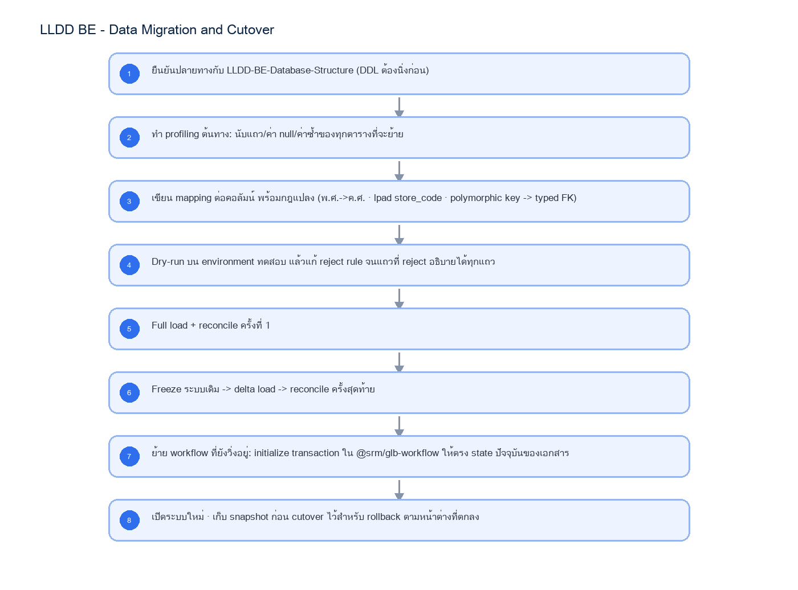

# LLDD BE - Data Migration and Cutover

SBP Mall - ระบบประกันรายได้ | Low Level Design Document

## 1. Overview

| รายการ | รายละเอียด |
| --- | --- |
| Track | BE |
| Estimate | 40 ชั่วโมง |
| Owner | Aphiwit <Bank> Khammoon |
| Objective | ออกแบบการย้ายข้อมูลจากระบบเดิม (Oracle FCS_FRN ฝั่ง FGI/FCS + SQL Server CPA_FRN_FGI ฝั่ง K2) เข้าสู่ target schema ของ SBPGI พร้อมแผน cutover, reconcile และ rollback |

Common contract reference: ทุกหัวข้อ API/FE ต้องยึด LLDD-BE-API-Common-Contracts และ LLDD-FE-Integration-Contracts สำหรับ error/auth/format/pagination/action/RBAC ก่อนลงรายละเอียดเฉพาะหน้าหรือเฉพาะ endpoint

## 2. Screen / Functional Scope

- Source-to-target mapping ระดับตาราง/คอลัมน์ (ORA FCS_FRN · MSSQL CPA_FRN_FGI -> 20 ตาราง)
- การแปลงคีย์: polymorphic TRANSACTION_PK -> typed FK · CompDocumentID -> doc_no · IMPACT_PROCESS_ID -> impact_process_id
- แผน cutover เป็นรอบ (dry-run -> delta -> freeze -> final) และ rollback
- Reconcile: นับแถว ยอดเงิน และ checksum ต่อโซน
- การย้าย workflow ที่ยังวิ่งอยู่เข้าสู่ @srm/glb-workflow
- บันทึกข้อค้างตัดสินใจด้าน migration — ยังไม่ตัดสิน

## 4. Implementation Flow Diagram (Reference)

_รูปที่ 1: Implementation flow reference: LLDD BE - Data Migration and Cutover_

## 5. Field, Format, and Validation

| Field / UI | Format | Validation | Behavior |
| --- | --- | --- | --- |
| source ORA | Oracle FCS_FRN | read-only ตอน migrate | ฝั่ง FGI/FCS pipeline (FGI_IMPACT_* · FCS_QSSI_SCORE · FGI_CONFIRM_RECEIVE_DATA) |
| source MSSQL | SQL Server CPA_FRN_FGI | read-only ตอน migrate | ฝั่ง K2 document (CompensateFlow · CompensateHistory · ImpactProfile · ImpactCostDetail · RunningNumber) |
| business key | impacted_store_code + month + year | ต้อง unique หลังแปลง | ใช้เป็นคีย์ dedup ตอน load โซน A |
| doc_no | YYYY/xxxxx (**ค.ศ.** · มติ 2026-08-06) | ต้อง unique | แปลงจาก CompDocumentID — ถ้าของเดิมเป็น พ.ศ. ต้องแปลงเป็น ค.ศ. ตอน migrate · ตั้งค่า document_running_numbers.last_running_no ต่อปี (ค.ศ.) ให้ตรงกับเลขสูงสุดที่ย้ายมา |
| date | เก็บเป็น ค.ศ. ใน DB | แปลงจาก พ.ศ. ของระบบเดิมด้วย toAD() | FE แสดง ค.ศ. เป็นค่าเริ่มต้น |
| store_code | VARCHAR(5) | lpad 5 หลัก | ระบบเดิมบางตารางเก็บเป็นตัวเลข ทำให้ leading zero หาย |

### 5.1 Source-to-Target Mapping ระดับตาราง

| ต้นทาง | ระบบ | ปลายทาง (SBPGI) | กฎแปลงที่ต้องระวัง |
| --- | --- | --- | --- |
| FGI_IMPACT_STORE_ON_PROCESS | ORA FCS_FRN | fgi_impact_processes | PK IMPACT_PROCESS_ID (seq SEQ_FGI_IMPACT_PROCESS) เป็น hub ของทั้งโซน A |
| FGI_IMPACT_STORE | ORA FCS_FRN | fgi_impact_stores + impacted_stores | แถวฝั่ง `_I` ทำ distinct เข้า impacted_stores · ที่เหลือเป็นคู่ร้าน |
| FGI_IMPACT_STORE_SALES | ORA FCS_FRN | fgi_impact_sales_summaries | key STORECODE_I + MONTH + YEAR |
| FGI_IMPACT_STORE_SALES_TRN | ORA FCS_FRN | sales_transactions | 4 หน้าต่าง × 15 วัน — ห้ามใช้ fcs_monthly_sales แทน (รายเดือน ย้อนกลับเป็นรายวันไม่ได้) |
| FGI_IMPACT_COMPETITOR | ORA FCS_FRN | fgi_impact_competitors | data_source = ALM |
| FGI_CONFIRM_RECEIVE_DATA | ORA FCS_FRN | interface_transactions | TRANSACTION_PK เป็น polymorphic — ต้องแตกตาม DATA_NAME เป็น typed FK |
| FCS_QSSI_SCORE | ORA FCS_FRN | fcs_qssi_score (sps_store) | ปลายทางมีข้อมูลอยู่แล้ว 23,958,780 แถว — ต้องเทียบก่อนว่าจะโหลดทับหรือไม่ (ผูกกับ DP-4) |
| CompensateFlow | MSSQL CPA_FRN_FGI | compensation_documents | CompDocumentID -> doc_no · เก็บ round_no/loop_no/allmap_url/statement_id/approver_snapshot |
| CompensateHistory | MSSQL CPA_FRN_FGI | consideration_logs | PK ActionID · เติม result_category (APPROVE/REJECT/CANCELLED/PENDING) |
| ImpactProfile | MSSQL CPA_FRN_FGI | document_new_stores | ฝั่ง `_N` + %ชดเชย/ยอดต่อร้าน |
| ImpactCostDetail | MSSQL CPA_FRN_FGI | document_cost_details | ยอดชดเชยแยกรายเดือน/รายร้านใหม่ |
| RunningNumber | MSSQL CPA_FRN_FGI | document_running_numbers | ตั้ง last_running_no ต่อปีให้ตรงกับเลขสูงสุดที่ย้ายมา |
| CompDocAttachment / CompTempAttachment / AttachFileProfile | MSSQL CPA_FRN_FGI | document_attachments | metadata เท่านั้น · ไฟล์จริงต้องย้ายขึ้น S3 ของระบบเดิม |
| FactorProfile / CompetitionProfile | MSSQL CPA_FRN_FGI | external_factors / competitors | เป็น master ที่ SBPGI เป็นเจ้าของ · **DecisionProfile ไม่ย้ายมาแล้ว** — มติ DP-9 (2026-08-10) ให้ seed ลง common_code ของระบบเดิม (code_type = SBPGI_DECISION) ไม่สร้างตาราง decisions |

### 5.2 กฎแปลงข้อมูลที่ผิดบ่อย

| เรื่อง | อาการถ้าไม่ทำ | กฎที่ต้องใช้ |
| --- | --- | --- |
| leading zero ของรหัสร้าน | ร้าน 00788 กลายเป็น 788 แล้ว join ไม่ติด | lpad(store_code, 5, '0') ทุกจุด · ปลายทางเป็น VARCHAR(5) |
| ปี พ.ศ./ค.ศ. | วันที่เพี้ยน 543 ปี | เก็บ ค.ศ. ใน DB และ `doc_no` เป็นปี **ค.ศ.** ด้วย (มติ 2026-08-06) · ถ้าของเดิมเป็น พ.ศ. ต้องแปลงตอน migrate ด้วย toAD() |
| polymorphic key | FK ชี้ผิดตาราง | แตก TRANSACTION_PK ตาม DATA_NAME เป็น impact_process_id / sales_summary_id / doc_no |
| เลขเอกสารซ้ำ | ออกเลขใหม่ทับของเก่า | หลังโหลด ตั้ง document_running_numbers.last_running_no = MAX(running) ต่อปี |
| ยอดขายรายวัน | ข้อมูล 60 วันไม่ครบ ทำให้ธงผิดปกติเพี้ยน | ต้องมาจาก FGI_IMPACT_STORE_SALES_TRN เท่านั้น · fcs_monthly_sales (711,384 แถว) ใช้ cross-check ได้อย่างเดียว |

### 5.3 แผน Cutover

| รอบ | กิจกรรม | เกณฑ์ผ่าน |
| --- | --- | --- |
| T-14 วัน | Profiling ต้นทาง + dry-run รอบที่ 1 | อธิบายแถวที่ reject ได้ทุก reason code |
| T-7 วัน | Full load บน staging + reconcile | จำนวนแถว/ยอดเงินตรง หรืออธิบายส่วนต่างได้ |
| T-2 วัน | ซ้อม cutover เต็มรูปแบบรวม rollback | rollback สำเร็จอย่างน้อย 1 ครั้ง |
| T-0 (freeze) | หยุดใช้ระบบเดิม -> delta load -> reconcile รอบสุดท้าย -> ย้าย workflow ที่ยังวิ่ง | ทุกเอกสารที่ยังไม่จบ flow เปิดในระบบใหม่ได้ที่ state เดิม |
| T+1..T+7 | เฝ้าระวัง · เก็บ snapshot ก่อน cutover ไว้ | ไม่มีเอกสารที่หาไม่เจอ/สถานะเพี้ยน |

### 5.4 การย้าย workflow ที่ยังวิ่งอยู่

เอกสารที่ยังไม่จบ flow ต้องถูกเปิด transaction ใหม่ใน `@srm/glb-workflow` ให้อยู่ state ปัจจุบัน — ไม่ใช่เริ่มต้นที่ state แรก ขั้นตอนที่ต้องทำต่อเอกสาร: `initializeWorkflow` -> เดิน event จนถึง state ปัจจุบัน หรือ set `current_state_id`/`current_status_id`/`current_approver` โดยตรง แล้วเติม `workflow_history` ย้อนหลังจาก `CompensateHistory` เพื่อให้ timeline ไม่ขาด · **วิธีที่จะใช้จริงต้องยืนยันกับทีมเจ้าของ library ก่อน** เพราะ engine ไม่มี API สำหรับ set state ตรง ๆ

### 5.5 ข้อค้างตัดสินใจที่กระทบ migration (ยังไม่ตัดสิน)

รายการต่อไปนี้ **ยังไม่ตัดสิน** ทั้งหมด · ทางเลือกและผลกระทบเต็มอยู่ที่ `SBP/SBPGI-vs-existing-system.md หัวข้อ 4` การตัดสินใจขั้นสุดท้ายเป็นของเจ้าของโครงการ — เอกสาร LLDD ฉบับนี้บันทึกไว้เป็นข้อค้าง และห้าม dev เลือกทางใดทางหนึ่งเองระหว่าง implement

| ข้อค้าง | ทางเลือก A | ทางเลือก B | สถานะ |
| --- | --- | --- | --- |
| DP-4 · `fcs_qssi_score` | reuse ตารางเดิม (ต้อง dedup + backfill 23.9M แถว ก่อนเพิ่ม constraint) | สร้างตารางของ SBPGI แล้วโหลดใหม่ | ยังไม่ตัดสิน |
| DP-3 ✅ ตัดสินแล้ว = ทางเลือกที่ 3 | view (ไม่มีอะไรให้ migrate) | ตาราง snapshot (ต้อง migrate + sync job) | ยังไม่ตัดสิน · กระทบขอบเขต migration โดยตรง |
| DP-1 · `reference_id` | `doc_no` (migrate ตรงไปตรงมา) | surrogate id (ต้องออก id แล้วเก็บ mapping) | ยังไม่ตัดสิน |
| DP-11 · ตัวเลขเงินประกันรายได้ | SBPGI เป็นต้นทาง | `fr_store_insure` ยังคีย์มือ | ยังไม่ตัดสิน (เป็นคำถามเชิงธุรกิจ) |
| retention/purge ของเอกสารเก่า | ย้ายทั้งหมด | ย้ายเฉพาะช่วงปีที่ตกลง แล้ว archive ที่เหลือ | ยังไม่ตัดสิน · ระบบเดิมมี ListDocumentsPendingRemoval แต่โครงใหม่ยังไม่มี data retention plan |

## 5.1 Input / Progress / Output Contract

| Stage | Contract for implementation |
| --- | --- |
| Input | User action, route/query state, form values, and permission context for this feature. |
| Progress | ยืนยันปลายทางกับ LLDD-BE-Database-Structure (DDL ต้องนิ่งก่อน); ทำ profiling ต้นทาง: นับแถว/ค่า null/ค่าซ้ำของทุกตารางที่จะย้าย; เขียน mapping ต่อคอลัมน์ พร้อมกฎแปลง (พ.ศ.->ค.ศ. · lpad store_code · polymorphic key -> typed FK); Dry-run บน environment ทดสอบ แล้วแก้ reject rule จนแถวที่ reject อธิบายได้ทุกแถว |
| Output | 19 target tables (โซน A/B/C); workflow_transaction / workflow_approver / workflow_history (sps_store) |

### 5.90 Endpoint Implementation Contract

| Endpoint | Use-case owner | Service/repository behavior | Definition of done |
| --- | --- | --- | --- |
| Internal service | ออกแบบการย้ายข้อมูลจากระบบเดิม (Oracle FCS_FRN ฝั่ง FGI/FCS + SQL Server CPA_FRN_FGI ฝั่ง K2) เข้าสู่ target schema ของ SBPGI พร้อมแผน cutover, reconcile และ rollback | เรียกจาก use case ภายในเท่านั้น | จำนวนแถวปลายทางเท่าต้นทางทุกตาราง หรืออธิบายส่วนต่างได้ทุกแถว |

### 5.91 Backend Execution Sequence

| Step | Behavior specific to this LLDD | Failure/test evidence |
| --- | --- | --- |
| 1 | ยืนยันปลายทางกับ LLDD-BE-Database-Structure (DDL ต้องนิ่งก่อน) | dry-run แล้วรายงาน reject อธิบายได้ครบทุก reason code |
| 2 | ทำ profiling ต้นทาง: นับแถว/ค่า null/ค่าซ้ำของทุกตารางที่จะย้าย | full load + reconcile ผ่านบน dataset จริงชุด staging |
| 3 | เขียน mapping ต่อคอลัมน์ พร้อมกฎแปลง (พ.ศ.->ค.ศ. · lpad store_code · polymorphic key -> typed FK) | delta load ซ้ำ 2 รอบต้อง idempotent (ไม่เกิดแถวซ้ำ) |
| 4 | Dry-run บน environment ทดสอบ แล้วแก้ reject rule จนแถวที่ reject อธิบายได้ทุกแถว | ทดสอบร้านที่ store_code ขึ้นต้นด้วย 0 |
| 5 | Full load + reconcile ครั้งที่ 1 | ทดสอบเอกสารที่มีหลายรอบ (round_no/loop_no) ว่าลำดับไม่สลับ |
| 6 | Freeze ระบบเดิม -> delta load -> reconcile ครั้งสุดท้าย | ทดสอบ rollback: restore snapshot แล้วระบบเดิมกลับมาใช้งานได้ |
| 7 | ย้าย workflow ที่ยังวิ่งอยู่: initialize transaction ใน @srm/glb-workflow ให้ตรง state ปัจจุบันของเอกสาร | dry-run แล้วรายงาน reject อธิบายได้ครบทุก reason code |
| 8 | เปิดระบบใหม่ · เก็บ snapshot ก่อน cutover ไว้สำหรับ rollback ตามหน้าต่างที่ตกลง | full load + reconcile ผ่านบน dataset จริงชุด staging |

## 6. Button / User Action Mapping

| Action | Trigger | API / Service | Expected Result |
| --- | --- | --- | --- |
| Dry-run migrate | runbook | สคริปต์ ETL โหมด --dry-run | ได้รายงานจำนวนแถว/แถวที่ reject โดยไม่เขียนปลายทาง |
| Full load | runbook | สคริปต์ ETL โหมด --full | โหลดข้อมูลย้อนหลังทั้งหมดเข้า target schema |
| Delta load | runbook | สคริปต์ ETL โหมด --delta --since | โหลดเฉพาะรายการที่เปลี่ยนหลัง full load |
| Reconcile | runbook | สคริปต์ reconcile | เทียบจำนวนแถว/ยอดเงินต้นทาง-ปลายทางต่อโซน |
| Rollback | runbook | restore snapshot ก่อน cutover | กลับไปใช้ระบบเดิมได้ภายในหน้าต่างที่ตกลง |

## 7. API Contract

## 8. Reference DB Mapping (No Database Page Work)

ส่วนนี้เป็นข้อมูลอ้างอิงสำหรับการ implement API/Job เท่านั้น ไม่ใช่งานสร้างหน้า Database, ไม่ใช่งานออกแบบ DB page และไม่ถูกนับเป็น deliverable แยกของ FE/BE

| Table / Object | R/W | Usage |
| --- | --- | --- |
| ORA FCS_FRN (FGI_IMPACT_* · FCS_QSSI_SCORE · FGI_CONFIRM_RECEIVE_DATA) | R | ต้นทางฝั่ง FGI/FCS |
| MSSQL CPA_FRN_FGI (CompensateFlow · CompensateHistory · ImpactProfile · ImpactCostDetail · RunningNumber) | R | ต้นทางฝั่ง K2 document |
| 19 target tables (โซน A/B/C) | W | ปลายทางตาม DDL ของ LLDD-BE-Database-Structure |
| workflow_transaction / workflow_approver / workflow_history (sps_store) | W | เปิด transaction ให้เอกสารที่ยังไม่จบ flow |
| fcs_monthly_sales (sps_store) | R | ใช้ cross-check ยอดขายรายเดือนเท่านั้น — แทนยอดขายรายวันไม่ได้ |

## 9. Processing Flow

| Step | Description |
| --- | --- |
| 1 | ยืนยันปลายทางกับ LLDD-BE-Database-Structure (DDL ต้องนิ่งก่อน) |
| 2 | ทำ profiling ต้นทาง: นับแถว/ค่า null/ค่าซ้ำของทุกตารางที่จะย้าย |
| 3 | เขียน mapping ต่อคอลัมน์ พร้อมกฎแปลง (พ.ศ.->ค.ศ. · lpad store_code · polymorphic key -> typed FK) |
| 4 | Dry-run บน environment ทดสอบ แล้วแก้ reject rule จนแถวที่ reject อธิบายได้ทุกแถว |
| 5 | Full load + reconcile ครั้งที่ 1 |
| 6 | Freeze ระบบเดิม -> delta load -> reconcile ครั้งสุดท้าย |
| 7 | ย้าย workflow ที่ยังวิ่งอยู่: initialize transaction ใน @srm/glb-workflow ให้ตรง state ปัจจุบันของเอกสาร |
| 8 | เปิดระบบใหม่ · เก็บ snapshot ก่อน cutover ไว้สำหรับ rollback ตามหน้าต่างที่ตกลง |

## 10. Acceptance Criteria

- จำนวนแถวปลายทางเท่าต้นทางทุกตาราง หรืออธิบายส่วนต่างได้ทุกแถว
- ยอดเงินชดเชยรวมต้นทาง = ปลายทาง (เทียบต่อปีและต่อร้าน)
- ไม่มี store_code ที่ leading zero หาย
- ไม่มี doc_no ซ้ำ และ document_running_numbers ต่อปีตรงกับเลขสูงสุดที่ย้ายมา
- เอกสารที่ยังไม่จบ flow เปิดในระบบใหม่แล้วอยู่ state เดิมและมีผู้อนุมัติปัจจุบันถูกคน
- มี rollback plan ที่ทดสอบแล้วอย่างน้อย 1 ครั้ง

## 11. Developer Test Checklist

| No | Test |
| --- | --- |
| 1 | dry-run แล้วรายงาน reject อธิบายได้ครบทุก reason code |
| 2 | full load + reconcile ผ่านบน dataset จริงชุด staging |
| 3 | delta load ซ้ำ 2 รอบต้อง idempotent (ไม่เกิดแถวซ้ำ) |
| 4 | ทดสอบร้านที่ store_code ขึ้นต้นด้วย 0 |
| 5 | ทดสอบเอกสารที่มีหลายรอบ (round_no/loop_no) ว่าลำดับไม่สลับ |
| 6 | ทดสอบ rollback: restore snapshot แล้วระบบเดิมกลับมาใช้งานได้ |
