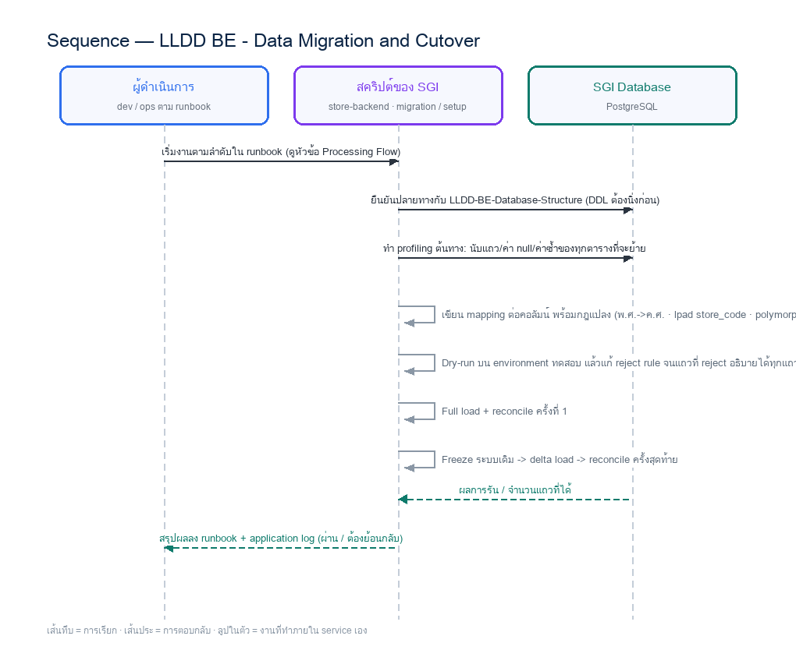

# LLDD BE - Data Migration and Cutover

SBP Mall - ระบบประกันรายได้ | Low Level Design Document

## 1. Overview

| รายการ | รายละเอียด |
| --- | --- |
| Track | BE |
| Estimate | 43 ชั่วโมง (ไม่มี unit test แยก — ดูเหตุผลใน NO_UNIT_TEST_DOCS) |
| Owner | Tunyatorn &lt;Vava&gt; Kiatkongphongsa |
| Target repository | `SBP/srm-sps-spsap-store-backend` (NestJS + TypeORM · schema `sps_store`) + `SBP/srm-sps-spsap-sbp-bff` (forward ผ่าน client service · ไม่มี DB) สำหรับเส้นที่ FE เรียก |
| Objective | ออกแบบการย้ายข้อมูลจากระบบเดิม (Oracle FCS_FRN ฝั่ง FGI/FCS + SQL Server CPA_FRN_FGI ฝั่ง K2) เข้าสู่ target schema ของ SGI พร้อมแผน cutover, reconcile และ rollback |

Common contract reference: ทุกหัวข้อ API/FE ต้องยึด LLDD-BE-API-Common-Contracts และ LLDD-FE-Integration-Contracts สำหรับ error/auth/format/pagination/action/RBAC ก่อนลงรายละเอียดเฉพาะหน้าหรือเฉพาะ endpoint

### 1.1 เอกสาร LLDD ที่เกี่ยวข้อง

ตารางนี้สร้างจาก endpoint และตารางที่เอกสารฉบับนี้ประกาศไว้จริง — อ่านฉบับที่อยู่ในตารางก่อนลงมือ เพื่อไม่ให้สัญญา request/response หรือชื่อคอลัมน์หลุดจากกัน

| ความสัมพันธ์ | เอกสาร LLDD | เกี่ยวข้องตรงไหน |
| --- | --- | --- |
| สัญญากลาง | **LLDD-BE-API-Common-Contracts** | envelope `{success,data}` · error code · pagination · รูปแบบวันที่/เลขเอกสาร |
| โครงสร้างข้อมูล | **LLDD-BE-Database-Structure** | DDL ของตารางที่หัวข้อ Reference DB Mapping อ้างถึง |
| workflow engine | **LLDD-BE-Workflow-Engine-Definition** | นิยาม state/route/event ที่หัวข้อ Workflow Trigger Event Contract เรียกใช้ |
| แพลตฟอร์มระบบเดิม | **LLDD-BE-Integration-SBP-Platform** | header จาก BFF (`x-api-key` / `x-user-*`) · การ reuse ตารางและ service ของระบบ SBP เดิม |
| ต้องจบก่อน (ลำดับงาน) | **LLDD-BE-Database-Structure** | เป็นฉบับต้นทางของสัญญา/โครงที่ฉบับนี้อ้าง |

## 2. Screen / Functional Scope

- Source-to-target mapping ระดับตาราง/คอลัมน์ (ORA FCS_FRN · MSSQL CPA_FRN_FGI -> 21 ตาราง)
- การแปลงคีย์: polymorphic TRANSACTION_PK -> typed FK · CompDocumentID -> doc_no · IMPACT_PROCESS_ID -> impact_process_id
- แผน cutover เป็นรอบ (dry-run -> delta -> freeze -> final) และ rollback
- Reconcile: นับแถว ยอดเงิน และ checksum ต่อโซน
- การย้าย workflow ที่ยังวิ่งอยู่เข้าสู่ @srm/glb-workflow
- ระบุข้อกำหนดด้าน migration ที่ต้องยึดตอนย้ายข้อมูลจริง

## 3. Screenshot Reference

ไม่มีภาพหน้าจอสำหรับหัวข้อนี้ — เป็นเอกสารฝั่ง Backend/Batch ที่ไม่มี UI (ภาพหน้าจอทั้งหมดอยู่ในเอกสารชุด FE)

## 4. Implementation Flow & Sequence Diagram (Reference)

### 4.1 Implementation Flow (ลำดับขั้นการทำงาน)

_รูปที่ 1: Implementation flow reference: LLDD BE - Data Migration and Cutover_

### 4.2 Sequence Diagram (ใครคุยกับใคร ลำดับไหน)

ผู้แสดงและลำดับข้อความในภาพนี้สร้างจาก endpoint ในหัวข้อ 7 และตารางในหัวข้อ Reference DB Mapping ของเอกสารฉบับนี้เอง จึงตรงกับสัญญาเสมอ

_รูปที่ 2: Sequence diagram: LLDD BE - Data Migration and Cutover_

## 5. Field, Format, and Validation

| Field / UI | Format | Validation | Behavior |
| --- | --- | --- | --- |
| source ORA | Oracle FCS_FRN | read-only ตอน migrate | ฝั่ง FGI/FCS pipeline (FGI_IMPACT_* · FCS_QSSI_SCORE · FGI_CONFIRM_RECEIVE_DATA) |
| source MSSQL | SQL Server CPA_FRN_FGI | read-only ตอน migrate | ฝั่ง K2 document (CompensateFlow · CompensateHistory · ImpactProfile · ImpactCostDetail · RunningNumber) |
| business key | impacted_store_code + month + year | ต้อง unique หลังแปลง | ใช้เป็นคีย์ dedup ตอน load โซน A |
| doc_no | YYYY/xxxxx (**ค.ศ.** · มติ 2026-08-06) | ต้อง unique | แปลงจาก CompDocumentID — ถ้าของเดิมเป็น พ.ศ. ต้องแปลงเป็น ค.ศ. ตอน migrate · ตั้งค่า sgi_document_running_numbers.last_running_no ต่อปี (ค.ศ.) ให้ตรงกับเลขสูงสุดที่ย้ายมา |
| date | เก็บเป็น ค.ศ. ใน DB | แปลงจาก พ.ศ. ของระบบเดิมด้วย toAD() | FE แสดง ค.ศ. เป็นค่าเริ่มต้น |
| store_code | VARCHAR(5) | lpad 5 หลัก | ระบบเดิมบางตารางเก็บเป็นตัวเลข ทำให้ leading zero หาย |

### 5.1 Source-to-Target Mapping ระดับตาราง

| ต้นทาง | ระบบ | ปลายทาง (SGI) | กฎแปลงที่ต้องระวัง |
| --- | --- | --- | --- |
| FGI_IMPACT_STORE_ON_PROCESS | ORA FCS_FRN | sgi_fgi_impact_processes | PK IMPACT_PROCESS_ID (seq SEQ_FGI_IMPACT_PROCESS) เป็น hub ของทั้งโซน A · **ต้อง migrate คอลัมน์รอบชดเชยด้วย (gap F8 · รับเข้าโครง 2026-08-21)**: `LAST_COMPENSATE_SEQ/_SEQ_NO -> last_compensate_seq/_seq_no` · `START/END_COMPENSATE_MONTH-YEAR -> start/end_compensate_month/year` · `FLAG_ACTION -> flag_action` · `DATASOURCE -> datasource` · ⚠️ `FLAG_ACTION` โดเมนจริงคือ **Y/W/N** (active = `IN ('Y','W')`) ไม่ใช่ Y/N — Job 6 เขียน `Y->W` ตอนพัก/รอจ่าย ถ้า CHECK ปลายทางรับแค่ Y/N แถวกลุ่มนี้จะ migrate ไม่ผ่าน · ทั้ง 4 กลุ่มนี้คือค่าที่ Job 8b ใช้ตัดสินจุดเข้า flow |
| FGI_IMPACT_STORE | ORA FCS_FRN | sgi_fgi_impact_stores + sgi_impacted_stores | แถวฝั่ง `_I` ทำ distinct เข้า sgi_impacted_stores · ที่เหลือเป็นคู่ร้าน · **คอลัมน์ที่รับเข้าโครง 2026-09-02**: `FLAG_VERIFY -> verify_status` (W/P/N ตรงตัว) · `CREATE_BY -> created_by` / `UPDATE_BY -> updated_by` (โดเมน `ALM`/`STA`/`USER` — ค่าอื่นในข้อมูลเดิมต้อง map เป็น `USER` และรายงานจำนวน) · `CREATE_DATE -> created_at` (กฎ "ตัดทิ้งเมื่อเก่ากว่า 12 เดือน" ของ Job 2 อ้างคอลัมน์นี้ — ห้ามใส่ค่า sysdate ตอน migrate ไม่งั้นแถวเก่าจะไม่ถูกตัดทิ้ง) |
| FGI_IMPACT_STORE_COMPENSATE | ORA FCS_FRN | **sgi_fgi_impact_compensations** (รับเข้าโครง 2026-08-21 · gap F1) | `COMPENSATE_FORECAST -> forecast_amount` · `COMPENSATE_ADJUST -> adjust_amount` · `COMPENSATE_SEQ/_SEQ_NO -> compensate_seq/_seq_no` · UK (impact_process_id, compensate_month) · ใช้นับยอด 0 ติดกันกี่งวดด้วย `COALESCE(adjust_amount, forecast_amount) = 0` — เป็น input ของ Job 8b ชั้นที่ 2 ของเคส ② ต่อเนื่อง |
| FGI_IMPACT_STORE_INFO | ORA FCS_FRN | sgi_compensation_documents (+ `approver_snapshot` JSONB) | **ตกหล่นจากตารางนี้จนถึง 2026-09-13** — ตรวจฐานจริงแล้วมี **429 แถว** · เก็บ snapshot ร้านที่ถูกกระทบ + ผู้อนุมัติ ณ เวลาเปิดเอกสาร · เอกสาร `batchjob/JOB-08` ระบุปลายทางไว้แล้วแต่ไม่เคยถูกยกมาที่แผน migration |
| FGI_NEW_STORE_INFO | ORA FCS_FRN | sgi_document_new_stores | **ตกหล่นจากตารางนี้จนถึง 2026-09-13** — ตรวจฐานจริงแล้วมี **492 แถว** · ร้านเปิดใหม่ที่ผูกกับเอกสาร (ดู `batchjob/JOB-09`) |
| FGI_NEW_STORE_COMPENSATE | ORA FCS_FRN | sgi_document_new_stores (`%ชดเชย` ต่อร้านใหม่) | **ตกหล่นจากตารางนี้จนถึง 2026-09-13** — ตรวจฐานจริงแล้วมี **473 แถว** · สัดส่วน %ชดเชยต่อร้านใหม่ ซึ่งกติกาบังคับว่ารวมกันต้องได้ 100% พอดี — **ต้อง reconcile หลัง load** |
| FGI_WS_LOG | ORA FCS_FRN | — **ไม่ migrate** (ตัดทิ้งโดยตั้งใจ) | ⚠️ **ตรวจฐานจริง 2026-09-13 พบ 20,704 แถว และถูกใช้ในโค้ด Java เดิม 4 ไฟล์** — ไม่ใช่ "ตารางที่เสนอไว้" อย่างที่เคยเขียนไว้ · ระบบใหม่ใช้ `integration_log` ของ SBP เดิม ทำหน้าที่นี้แทน (log payload ราย call) ส่วน ACK ระดับแถวอยู่ที่ `sgi_interface_transactions` · **log เดิมไม่ถูกยกมา** — ถ้าต้องสืบย้อนต้องเปิดฐานเดิมอ่านเอง ต้องยืนยันว่ารับได้ |
| FGI_IMPACT_STORE_SALES | ORA FCS_FRN | sgi_fgi_impact_sales_summaries | key STORECODE_I + MONTH + YEAR |
| FGI_IMPACT_STORE_SALES_TRN | ORA FCS_FRN | sgi_sales_transactions | 4 หน้าต่าง × 15 วัน — ห้ามใช้ fcs_monthly_sales แทน (รายเดือน ย้อนกลับเป็นรายวันไม่ได้) |
| FGI_IMPACT_COMPETITOR | ORA FCS_FRN | sgi_fgi_impact_competitors | data_source = ALM |
| FGI_CONFIRM_RECEIVE_DATA | ORA FCS_FRN | sgi_interface_transactions | TRANSACTION_PK เป็น polymorphic — ต้องแตกตาม DATA_NAME เป็น typed FK |
| FCS_QSSI_SCORE | ORA FCS_FRN | fcs_qssi_score (sps_store) | ปลายทางมีข้อมูลอยู่แล้ว 24,284,545 แถว — **ไม่ต้อง migrate** เพราะ SGI อ่านอย่างเดียว ห้ามโหลดทับ |
| CompensateFlow | MSSQL CPA_FRN_FGI | sgi_compensation_documents | CompDocumentID -> doc_no · เก็บ round_no/loop_no/allmap_url/statement_id/approver_snapshot |
| CompensateHistory | MSSQL CPA_FRN_FGI | sgi_consideration_logs | PK ActionID · เติม result_category (APPROVE/REJECT/CANCELLED/PENDING) |
| ImpactProfile | MSSQL CPA_FRN_FGI | sgi_document_new_stores | ฝั่ง `_N` + %ชดเชย/ยอดต่อร้าน |
| CompetInCompenProfile | MSSQL CPA_FRN_FGI | sgi_document_competitors | คู่แข่งที่ผูกกับเอกสาร · **competitor_store_code = รหัสสาขาจาก ALLMAP (ไม่มี FK)** · **brand_code อ้าง master sgi_competitors (11 รหัส 01-11)** · แถวที่มาจาก ALLMAP ตั้ง data_source = ALM |
| FactorInCompenProfile | MSSQL CPA_FRN_FGI | sgi_document_external_factors | ปัจจัยภายนอกที่ผูกกับเอกสาร · factor_code อ้าง master sgi_external_factors + ช่วงวันที่มีผล |
| FGI_IMPACT_STORE_COMPENSATE + CompensateFlow | ORA + MSSQL | sgi_compensation_histories | ประวัติชดเชยต่อร้าน/รอบ · submit_account_month (งวดที่ Job 6 ส่งไป STA ผ่าน RabbitMQ) · migrate เป็นข้อมูลอ้างอิงของ SGI — ไม่เขียนกลับ `fr_store_insure` ของระบบเดิม |
| ImpactCostDetail | MSSQL CPA_FRN_FGI | sgi_document_cost_details | ยอดชดเชยแยกรายเดือน/รายร้านใหม่ |
| RunningNumber | MSSQL CPA_FRN_FGI | sgi_document_running_numbers | ตั้ง last_running_no ต่อปีให้ตรงกับเลขสูงสุดที่ย้ายมา |
| CompDocAttachment / CompTempAttachment / AttachFileProfile | MSSQL CPA_FRN_FGI | sgi_document_attachments | metadata เท่านั้น · ไฟล์จริงต้องย้ายขึ้น S3 ของระบบเดิม |
| FactorProfile / CompetitionProfile | MSSQL CPA_FRN_FGI | sgi_external_factors / sgi_competitors | เป็น master ที่ SGI เป็นเจ้าของ · **DecisionProfile ไม่ย้ายมาแล้ว** — มติ DP-9 (2026-08-10) ให้ seed ลง common_code ของระบบเดิม (code_type = SGI_DECISION) ไม่สร้างตาราง decisions |

### 5.2 กฎแปลงข้อมูลที่ผิดบ่อย

| เรื่อง | อาการถ้าไม่ทำ | กฎที่ต้องใช้ |
| --- | --- | --- |
| **ค่าที่ติด CHECK constraint** | **load ล้มทั้ง batch** — DDL มี `CHECK` 26 จุด ถ้าข้อมูลเดิมมีค่านอกโดเมนแม้แถวเดียว INSERT จะถูกปฏิเสธ | **profile ค่าจริงของทุกคอลัมน์ที่มี CHECK ก่อน full load** (`SELECT DISTINCT col, COUNT(*) ... GROUP BY col`) แล้วเทียบกับโดเมนใน DDL · จุดที่เสี่ยงที่สุด: `compensate_status` · `verify_status` จาก `FLAG_VERIFY` · `sales_request_status` — **ทั้งสามยืนยันจากข้อมูลจริงแล้ว ดูตารางแมปในข้อ 5.2.1** · `created_by`/`updated_by` จาก `CREATE_BY`/`UPDATE_BY` (`ALM/STA/USER` — ค่าอื่นให้ map เป็น `USER` แล้วรายงานจำนวน) · `flag_action` (`Y/W/N`) · `data_name` (12 ค่า) · **ห้ามแก้ด้วยการถอด CHECK ออก** — ให้แก้ค่าหรือขยายโดเมนอย่างตั้งใจพร้อมอัปเดต `database.md` |
| leading zero ของรหัสร้าน | ร้าน 00788 กลายเป็น 788 แล้ว join ไม่ติด | lpad(store_code, 5, '0') ทุกจุด · ปลายทางเป็น VARCHAR(5) |
| ปี พ.ศ./ค.ศ. | วันที่เพี้ยน 543 ปี | เก็บ ค.ศ. ใน DB และ `doc_no` เป็นปี **ค.ศ.** ด้วย (มติ 2026-08-06) · ถ้าของเดิมเป็น พ.ศ. ต้องแปลงตอน migrate ด้วย toAD() |
| polymorphic key | FK ชี้ผิดตาราง | แตก TRANSACTION_PK ตาม DATA_NAME เป็น impact_process_id / sales_summary_id / doc_no |
| เลขเอกสารซ้ำ | ออกเลขใหม่ทับของเก่า | หลังโหลด ตั้ง sgi_document_running_numbers.last_running_no = MAX(running) ต่อปี |
| ยอดขายรายวัน | ข้อมูล 60 วันไม่ครบ ทำให้ธงผิดปกติเพี้ยน | ต้องมาจาก FGI_IMPACT_STORE_SALES_TRN เท่านั้น · fcs_monthly_sales (711,384 แถว) ใช้ cross-check ได้อย่างเดียว |

### 5.2.1 ตารางแมปค่าสถานะตอน migrate (ยืนยันจากฐานเดิมจริง)

ตัวเลขทั้งหมดมาจากการ profile ฐาน Oracle ของระบบเดิมเมื่อ **2026-09-12** (`tools/introspect_legacy_oracle.py` · ตาราง `FGI_IMPACT_STORE_BK_20250515` 26,264 แถว และ `FGI_IMPACT_STORE_SALES_BK_20250515` 8,730 แถว — ตาราง live ถูกรีเซ็ตเมื่อ 2025-05-15 จึงมีแค่ 728 แถว ใช้เป็นภาพแทนไม่ได้) · **แถวที่ยังไม่เคาะทำให้ load ล้มทั้ง batch** เพราะทั้งไฟล์อยู่ใน transaction เดียว

| ค่าเดิม | จำนวนแถวจริง | แมปเป็นอะไรในโครงใหม่ | สถานะ |
| --- | --- | --- | --- |
| `FGI_IMPACT_STORE.FLAG_VERIFY` = `N` | 14,424 | `verify_status = 'N'` | ✅ ตรงตัว |
| `FGI_IMPACT_STORE.FLAG_VERIFY` = `Y` | **8,556** | `verify_status = 'P'` **+** `sales_request_status = 'Y'` — ค่าเดียวของเดิมถือสองความหมาย (ผ่านการตรวจคู่ร้าน **และ** ยอดขายผ่านแล้ว) โครงใหม่แยกเป็นสองคอลัมน์ | 🔴 **ต้องเคาะ** — แมปตรงตัวจะติด CHECK ทันที 8,556 แถว |
| `FGI_IMPACT_STORE.FLAG_VERIFY` = `W` | 3,064 | `verify_status = 'W'` | ✅ ตรงตัว |
| `FGI_IMPACT_STORE.FLAG_VERIFY` = `P` | 220 | `verify_status = 'P'` | ✅ ตรงตัว |
| `FGI_IMPACT_STORE_SALES.FLAG_VERIFY` = `Y` | 6,029 | `sgi_fgi_impact_sales_summaries.sales_status = 'Y'` | ✅ ตรงตัว |
| `FGI_IMPACT_STORE_SALES.FLAG_VERIFY` = `N` | 2,549 | `sgi_fgi_impact_sales_summaries.sales_status = 'N'` — `N` = ประเมินแล้วยอดไม่ตก (`growth_rate_diff >= 0`) **ไม่ใช่ความผิดพลาด** จึงแมปเป็น `E` ไม่ได้ | ✅ **เคาะแล้ว** (ข้อ 2.37) — โดเมนเดิมมี `N` อยู่แล้ว |
| `FGI_IMPACT_STORE_SALES.FLAG_VERIFY` = `P` | **151** | `sgi_fgi_impact_sales_summaries.sales_status = 'P'` (ขอแล้วรอผล) — **โดเมนเดิมไม่มี `P` จึงเพิ่มเข้าไป** เป็น `W/P/Y/N/E` | ✅ **เคาะแล้ว** (ข้อ 2.37) |
| `FGI_IMPACT_STORE_SALES.FLAG_VERIFY` = `W` | 1 | `sales_status = 'W'` | ✅ ตรงตัว |
| `sgi_fgi_impact_stores.sales_request_status` | — | **ไม่มีต้นทางในระบบเดิม** — เป็นคอลัมน์ใหม่ที่ติดตาม *การขอ* ยอดขายระดับคู่ร้าน (W ยังไม่ขอ · P ขอแล้ว · Y ได้ข้อมูล · E ขอไม่สำเร็จ) คนละเรื่องกับ `sales_status` ที่เป็น *ผลทางธุรกิจ* จึงไม่มี `N` | ℹ️ ไม่เกี่ยวกับ migration |
| `sales_status` = `E` | 0 | ไม่เคยถูกใช้เลยในระบบเดิม — สงวนไว้สำหรับกรณีที่ Job 5 คำนวณไม่ได้จริง ๆ | ℹ️ ค่าใหม่ของโครงนี้ |
| `CREATE_BY` = `USER` | **0** | ไม่เคยถูกใช้เลย — ALM 23,126 · STA 3,138 | ℹ️ ค่าใหม่ของโครงนี้ |
| `UPDATE_BY` | NULL ทั้ง 26,264 แถว | `updated_by` เป็น NULL ได้อยู่แล้ว | ✅ ไม่มีปัญหา |
| `DATASOURCE` | ALM 4,670 · STA 2,877 | `datasource` ตรงตัว — **ไม่มี `HRS` จริง** | ✅ ไม่มีปัญหา |
| `FLAG_ACTION` | N 7,545 · Y 2 · W 1 | `flag_action` ตรงตัว (`Y/W/N`) | ✅ ไม่มีปัญหา |

### 5.2.2 คีย์กันซ้ำที่ทำให้ load ล้ม (ยืนยันจากฐานเดิมจริง)

| คีย์ของโครงใหม่ | ข้อมูลเดิมละเมิดกี่กลุ่ม | ต้องทำอะไรก่อน load |
| --- | --- | --- |
| `uq_impact_store_pair (impacted_store_code, new_store_code, impact_month)` | **67 กลุ่ม** ในข้อมูลประวัติ · **93 กลุ่ม** ในตาราง live | แถวซ้ำส่วนใหญ่เหมือนกันทุกค่า (`COUNT(DISTINCT distance) = 1`) ต่างแค่ `IMPACT_STORE_ID` → เลือกแถวเดียวด้วยกติกาเดียวกับ tie-breaker ของ Job 2 (`DISTANCE` น้อยสุด) แล้วรายงานจำนวนที่ตัดทิ้ง |
| `uq_impact_process (impacted_store_code, impact_month)` | **9 กลุ่ม** (ข้อมูลประวัติ) · **8 กลุ่ม** (live) | ✅ **เคาะครบแล้ว (ข้อ 2.38-2 · 2026-09-13)** — `impact_month` = `START_COMPENSATE_YEAR`+`MONTH` · กติกาเลือกแถวอยู่ในหัวข้อ 5.2.4 ด้านล่าง (ตัดสินครบ 9/9 กลุ่ม) · การเติม `datasource` เข้าคีย์ **ไม่ช่วยเลย** (ยังซ้ำ 9 กลุ่มเท่าเดิม) |
| `storecode_i` / `storecode_n` → `VARCHAR(5)` | 0 (ความยาวจริงสูงสุด = 5 ทั้งที่คอลัมน์เดิมเป็น `VARCHAR2(10)`) | ไม่ต้องทำอะไร — แต่ต้องคง `lpad(..., 5, '0')` ไว้ |
| `distance_km` → `NUMERIC(8,3)` | 0 (ของเดิมเป็น `NUMBER(3,2)` ค่าจริง 0.03–1.52 กม.) | ไม่ต้องแปลงหน่วย — ของเดิมเก็บเป็นกิโลเมตรอยู่แล้ว · ⚠️ แถว `CREATE_BY = 'STA'` 3,137 แถวมี `DISTANCE = 0` และหน่วยเป็น NULL |

### 5.2.3 การสร้างแถวแม่ `sgi_fgi_impact_processes` ตอน migrate

โครงใหม่บังคับให้**คู่ร้านทุกแถวต้องมีแถวแม่** (`impact_process_id BIGINT NOT NULL` + FK) แต่ระบบเดิมสร้าง `FGI_IMPACT_STORE_ON_PROCESS` **เฉพาะตอนที่รอบชดเชยเริ่มจริง** (`ExportJdbc` · หลังคู่ร้านผ่านเป็น `P` และยอดขายผ่านแล้ว) — **ไม่ใช่ตอนนำเข้า** ผลคือคู่ร้านส่วนใหญ่ไม่มีแถวแม่ในระบบเดิม และ migration ต้อง **สร้างขึ้นใหม่**

| ตัวเลขจากข้อมูลจริง | ค่า |
| --- | --- |
| คู่ร้านในระบบเดิม | 26,264 แถว |
| แถวแม่ที่โครงใหม่ต้องมี = `DISTINCT (storecode_i, year, month)` ของคู่ร้าน | **24,783 แถว** |
| แถวแม่ที่ระบบเดิมมีจริง | 7,548 แถว (3,143 ร้าน) |
| **แถวแม่ที่ต้องสร้างขึ้นใหม่ตอน migrate** | 🔴 **17,247 แถว (69.6%)** |
| แถวแม่ที่ไม่มีคู่ร้านรองรับเลย | **0** — สร้างจากคู่ร้านได้ครบ ไม่มีของตกหล่น |

**กติกาการสร้าง** — สองขั้น ห้ามสลับลำดับ

| ขั้น | ทำอะไร |
| --- | --- |
| 1 | สร้างแถวแม่จาก `SELECT DISTINCT storecode_i, year, month FROM FGI_IMPACT_STORE` → `impacted_store_code` · `impact_month = to_char(year)\|\|'-'\|\|lpad(month,2,'0')` · `impact_year = year` |
| 2 | `LEFT JOIN FGI_IMPACT_STORE_ON_PROCESS` ด้วย `(storecode_i, start_compensate_year, start_compensate_month)` แล้วขนคุณสมบัติของรอบมา: `flag_action` · `datasource` · `last_compensate_seq` · `last_compensate_seq_no` · `start/end_compensate_month\|year` |

🔴 **สองข้อที่ยังต้องเคาะและผูกกับข้อนี้โดยตรง** — 17,247 แถวที่สร้างใหม่จะได้ค่าอะไร:

| คอลัมน์ | ปัญหา | ผลถ้าตั้งผิด |
| --- | --- | --- |
| `flag_action` | ✅ เคาะแล้ว 2026-09-13 (ข้อ 2.38) — **17,247 แถวที่สร้างใหม่ใส่ `'N'`** (ยังไม่มีรอบชดเชย) · แถวที่มีต้นทางให้ขน `flag_action` เดิมมาตรง ๆ | ใช้กติกาเดียวกับ Job 2 ที่รันจริง (ใส่ `'N'` ชัดเจน ไม่พึ่ง `DEFAULT 'Y'`) — ตั้ง `Y` ผิด ๆ จะทำให้คิวรี "คู่ที่มีอยู่แล้ว" กันคู่ร้านใหม่ออกเงียบ ๆ |
| `process_status` | ✅ เคาะแล้ว (ข้อ 2.17) — `IMPORTED` / `SALES_READY` / `READY_DOCUMENT` / `DOCUMENT_CREATED` / `CLOSED` · DDL มี `DEFAULT 'IMPORTED'` แล้ว | ใช้กติกาอนุมานในตารางถัดไป — ห้ามใส่ `IMPORTED` ให้ทุกแถว เพราะ 8,114 แถวมีความคืบหน้าไปแล้วจริง |

**กติกาอนุมาน `process_status` ตอน migrate** — ไล่จากบนลงล่าง เจอข้อแรกที่จริงแล้วหยุด (ตัวเลขจากข้อมูลจริง 2026-09-12)

| ลำดับ | เงื่อนไข | process_status | แถว |
| --- | --- | --- | --- |
| 1 | แถวแม่เดิมมี `FLAG_ACTION = 'N'` (รอบปิดแล้ว) | `CLOSED` | **7,542** |
| 2 | มีแถวใน `FGI_IMPACT_STORE_COMPENSATE` ของงวดนั้น (เคยสร้างเอกสารแล้ว) | `DOCUMENT_CREATED` | **572** |
| 3 | มีแถวแม่เดิมอยู่ แต่ยังไม่เข้าข้อ 1-2 | `READY_DOCUMENT` | 0 |
| 4 | มี `FGI_IMPACT_STORE_SALES` ของงวดนั้นที่ `FLAG_VERIFY IN ('Y','N')` | `SALES_READY` | **2,498** |
| 5 | นอกนั้นทั้งหมด (ส่วนใหญ่คือคู่ร้านที่ถูกตัดทิ้งหรือค้าง `W`) | `IMPORTED` | **14,180** |

⚠️ ผลรวมของตารางนี้คือ **24,792** แต่แถวแม่ที่ต้องมีคือ **24,783** — ต่างกัน **9 แถว** พอดีกับ จำนวนกลุ่มแถวแม่ที่ซ้ำ การ `LEFT JOIN` จึงคืนแถวเกิน · ✅ **แก้ด้วยการตัดแถวซ้ำตามกติกาในข้อ 5.2.4 ก่อน แล้วจึงอนุมาน `process_status`** (ตัดแล้วได้ 24,783 พอดี)

### 5.2.4 กติกาตัดแถวแม่ที่ซ้ำ (`uq_impact_process`)

**มติ 2026-09-13 (DECISIONS ข้อ 2.38-2): เก็บแถวที่ `LAST_COMPENSATE` ใหม่สุด** แต่ข้อมูลจริงบอกว่าเกณฑ์เดียวไม่พอ — **ตัดสินได้แค่ 2 จาก 9 กลุ่ม** เพราะอีก 7 กลุ่ม เหมือนกันทุกคอลัมน์ จึงต้องมี tie-breaker ต่ออีก 2 ชั้น

| ชั้น | เกณฑ์ | เหตุผล |
| --- | --- | --- |
| 1 | `last_compensate_year DESC, last_compensate_month DESC` | **มติหลัก** — แถวที่ก้าวหน้ากว่าสะท้อนสถานะล่าสุดจริง · ตัดสินได้ 2 กลุ่ม |
| 2 | `create_date ASC` | ข้อมูลจริงจับคู่กันเป็น `00:00:00` (แถว backfill ที่ใส่ด้วยมือ/สคริปต์) กับ `17:00:xx` (แถวที่ job สร้างตามตาราง) · ทั้ง 2 กลุ่มที่ชั้น 1 ตัดสินได้ **แถว backfill เป็นผู้ชนะ** การเรียง `ASC` จึงสอดคล้องกัน · ตัดสินอีก 7 กลุ่ม |
| 3 | `impact_process_id ASC` | กันเสมอเด็ดขาด — ผลต้อง deterministic รันกี่ครั้งก็ได้แถวเดิม |

ยืนยันกับข้อมูลจริง: กติกา 3 ชั้นนี้ **ตัดสินครบทั้ง 9 กลุ่ม (9/9)** เหลือผู้ชนะกลุ่มละ 1 แถว และตัดทิ้ง **9 แถว** — ทำให้จำนวนแถวแม่ลงตัวที่ **24,783** พอดี (ก่อนหน้านี้ตารางอนุมาน `process_status` ในข้อ 5.2.3 รวมได้ 24,792 เพราะ `LEFT JOIN` คืนแถวเกิน 9)

**แถวลูกของแถวที่ถูกตัด — ลบทิ้งได้ ไม่ต้อง repoint**

| ตรวจ | ผล |
| --- | --- |
| แถวแม่ที่ถูกตัด | 9 แถว |
| แถวลูกใน `FGI_IMPACT_STORE_COMPENSATE` ของแถวที่ถูกตัด | 20 แถว |
| แถวลูกของแถวที่เก็บไว้ (เฉพาะกลุ่มที่ซ้ำ) | 20 แถว |
| ลูกของแถวที่ถูกตัด ที่**ไม่มี**คู่งวดเดียวกันฝั่งผู้ชนะ | **0 แถว** |
| คู่ที่ชนกัน 20 คู่ · `compensate_status` ตรงกัน | **20 จาก 20 คู่** |

→ ลูกของแถวที่ถูกตัดเป็น **สำเนาซ้ำของลูกฝั่งผู้ชนะทั้งหมด** (งวดตรงกัน สถานะตรงกัน) จึง **ลบทิ้งพร้อมแถวแม่ได้เลย ไม่เสียข้อมูล และไม่ต้องย้าย FK**

⚠️ **ผลข้างเคียงที่ต้องยอมรับ:** `last_compensate_seq_no` ของแถวที่เก็บไว้จะกระโดด (เช่น กลุ่ม `02985` งวด 2024-03 เก็บแถว `seq_no = 13` แล้วทิ้งแถว `seq_no = 4`) เลขลำดับในระบบใหม่จึงไม่ต่อเนื่อง — **ห้าม renumber** เพราะจะทำให้อ้างอิงย้อนหลังกับระบบเดิมไม่ตรง

### 5.3 แผน Cutover

| รอบ | กิจกรรม | เกณฑ์ผ่าน |
| --- | --- | --- |
| T-14 วัน | Profiling ต้นทาง + dry-run รอบที่ 1 | อธิบายแถวที่ reject ได้ทุก reason code |
| T-7 วัน | Full load บน staging + reconcile | จำนวนแถว/ยอดเงินตรง หรืออธิบายส่วนต่างได้ |
| T-2 วัน | ซ้อม cutover เต็มรูปแบบรวม rollback | rollback สำเร็จอย่างน้อย 1 ครั้ง |
| T-0 (freeze) | หยุดใช้ระบบเดิม -> delta load -> reconcile รอบสุดท้าย -> ย้าย workflow ที่ยังวิ่ง | ทุกเอกสารที่ยังไม่จบ flow เปิดในระบบใหม่ได้ที่ state เดิม |
| T+1..T+7 | เฝ้าระวัง · เก็บ snapshot ก่อน cutover ไว้ | ไม่มีเอกสารที่หาไม่เจอ/สถานะเพี้ยน |

### 5.4 การย้าย workflow ที่ยังวิ่งอยู่

เอกสารที่ยังไม่จบ flow ต้องถูกเปิด transaction ใหม่ใน `@srm/glb-workflow` ให้อยู่ state ปัจจุบัน — ไม่ใช่เริ่มต้นที่ state แรก ขั้นตอนที่ต้องทำต่อเอกสาร: `initializeWorkflow` -> เดิน event จนถึง state ปัจจุบัน หรือ set `current_state_id`/`current_status_id`/`current_approver` โดยตรง แล้วเติม `workflow_history` ย้อนหลังจาก `CompensateHistory` เพื่อให้ timeline ไม่ขาด · เขียนผ่าน API ของ library เท่านั้น ห้าม INSERT ตารางของ engine ตรง เพราะ engine ไม่มี API สำหรับ set state ตรง ๆ

### 5.5 ข้อกำหนดด้าน migration ที่ต้องยึด

ตารางนี้คือ**ข้อกำหนดที่ต้องทำตาม** ไม่ใช่ทางเลือก — ทุกข้อสอดคล้องกับ `database.md` / `workflow.md` / `api.md` ซึ่งเป็นแหล่งความจริงของระบบ

| เรื่อง | ข้อกำหนดที่ต้องทำตาม | ที่มา / เหตุผล |
| --- | --- | --- |
| `fcs_qssi_score` | **ไม่มีอะไรต้อง migrate** — SGI อ่านตารางเดิมอย่างเดียว ไม่ต้อง dedup/backfill | ระบบ SBP เดิมนำเข้าให้แล้ว (ปิด 2026-08-24 · ตัด Job 1) |
| ร้าน SP | migrate เฉพาะร้านที่เคยเข้ารอบชดเชยเข้ามาเป็น snapshot ใน `sgi_impacted_stores` | กันเอกสารย้อนหลังอ่านไม่ได้เมื่อร้านถูกยกเลิก (ตัดสิน 2026-08-10) |
| `reference_id` ของ workflow | ตอน backfill ให้ผูกด้วย **`sgi_compensation_documents.id`** (ส่งเป็น string) | ตรงกับสัญญาของ engine (varchar(255)) และแพตเทิร์นของระบบเดิม (ปิด 2026-08-17) |
| ลำดับการ import | master โซน C → โซน A (`sgi_fgi_impact_processes` ก่อนลูกทั้งหมด) → โซน B (`sgi_compensation_documents` ก่อน `sgi_document_*`) → เปิด workflow ผ่าน engine เป็นขั้นสุดท้าย | FK ของโซน B ชี้กลับโซน A และตารางลูกทั้ง 6 FK ไป `doc_no` แบบ NOT NULL |

### 5.9 Input / Progress / Output Contract

| Stage | Contract for implementation |
| --- | --- |
| Input | ไม่มี endpoint ของตัวเอง — input คือ request ที่เอกสารอื่นส่งเข้ามา พร้อม user context จาก BFF header (ดู 5.1) และค่ากำหนดกลางที่อ่านจากระบบเดิม |
| Progress | ยืนยันปลายทางกับ LLDD-BE-Database-Structure (DDL ต้องนิ่งก่อน); ทำ profiling ต้นทาง: นับแถว/ค่า null/ค่าซ้ำของทุกตารางที่จะย้าย; เขียน mapping ต่อคอลัมน์ พร้อมกฎแปลง (พ.ศ.->ค.ศ. · lpad store_code · polymorphic key -> typed FK); Dry-run บน environment ทดสอบ แล้วแก้ reject rule จนแถวที่ reject อธิบายได้ทุกแถว |
| Output | 20 target tables (โซน A/B/C) |

### 5.90 Endpoint Implementation Contract

| Endpoint | Use-case owner | Service/repository behavior | Definition of done |
| --- | --- | --- | --- |
| Internal service | ออกแบบการย้ายข้อมูลจากระบบเดิม (Oracle FCS_FRN ฝั่ง FGI/FCS + SQL Server CPA_FRN_FGI ฝั่ง K2) เข้าสู่ target schema ของ SGI พร้อมแผน cutover, reconcile และ rollback | เรียกจาก use case ภายในเท่านั้น | จำนวนแถวปลายทางเท่าต้นทางทุกตาราง หรืออธิบายส่วนต่างได้ทุกแถว |

### 5.91 Backend Execution Sequence

| Step | Behavior specific to this LLDD | Failure/test evidence |
| --- | --- | --- |
| 1 | ยืนยันปลายทางกับ LLDD-BE-Database-Structure (DDL ต้องนิ่งก่อน) | dry-run แล้วรายงาน reject อธิบายได้ครบทุก reason code |
| 2 | ทำ profiling ต้นทาง: นับแถว/ค่า null/ค่าซ้ำของทุกตารางที่จะย้าย | full load + reconcile ผ่านบน dataset จริงชุด staging |
| 3 | เขียน mapping ต่อคอลัมน์ พร้อมกฎแปลง (พ.ศ.->ค.ศ. · lpad store_code · polymorphic key -> typed FK) | delta load ซ้ำ 2 รอบต้อง idempotent (ไม่เกิดแถวซ้ำ) |
| 4 | Dry-run บน environment ทดสอบ แล้วแก้ reject rule จนแถวที่ reject อธิบายได้ทุกแถว | ทดสอบร้านที่ store_code ขึ้นต้นด้วย 0 |
| 5 | Full load + reconcile ครั้งที่ 1 | ทดสอบเอกสารที่มีหลายรอบ (round_no/loop_no) ว่าลำดับไม่สลับ |
| 6 | Freeze ระบบเดิม -> delta load -> reconcile ครั้งสุดท้าย | ทดสอบ rollback: restore snapshot แล้วระบบเดิมกลับมาใช้งานได้ |
| 7 | ย้าย workflow ที่ยังวิ่งอยู่: initialize transaction ใน @srm/glb-workflow ให้ตรง state ปัจจุบันของเอกสาร | — (ยังไม่มี test เฉพาะขั้นนี้ · ครอบด้วย test รวมของเอกสารในหัวข้อ 11) |
| 8 | เปิดระบบใหม่ · เก็บ snapshot ก่อน cutover ไว้สำหรับ rollback ตามหน้าต่างที่ตกลง | — (ยังไม่มี test เฉพาะขั้นนี้ · ครอบด้วย test รวมของเอกสารในหัวข้อ 11) |

### 5.92 Workflow Trigger Event Contract

งานชิ้นนี้ **ต้องเรียก workflow engine** ตามตารางด้านล่าง · ชื่อ function ยึด API 8 ตัวของ `@srm/glb-workflow` ตามชีต `Detail` ของ `SBP/TSM-SRM-LLDD-SBP-workflow-1.2.md` — รายละเอียด signature และตารางที่ engine เขียน ดู **LLDD-BE-Workflow-Engine-Definition** หัวข้อ 5.3

| จุดที่เรียก (call site) | Engine function | พารามิเตอร์หลัก | กติกา / transaction boundary |
| --- | --- | --- | --- |
| ย้ายเอกสารที่ค้างกลางทาง | `initializeWorkflow` แล้ว `eventWorkflow` ซ้ำจนถึง state ปัจจุบัน | versionId, referenceId, ลำดับ event ตามสถานะเดิมใน K2 | 🔴 ห้าม INSERT `workflow_transaction` ตรงเพื่อ 'ตั้ง state ให้ตรง' — ต้องเดิน event จริงเพื่อให้ history ครบ · ต้อง rerun ได้ (referenceId เดิมไม่สร้าง instance ซ้ำ) |

- 🔴 กติกาเหล็ก: ตาราง `sps_store.workflow_*` (13 ตาราง) เป็นของ lib — SGI **R เท่านั้น** ห้าม INSERT/UPDATE/DELETE ตรงในทุกกรณี
- ทุกการเรียก engine ต้องผ่านตัวห่อกลาง `WorkflowGateway` ที่นิยามใน **LLDD-BE-API-Common-Contracts** (timeout · retry · map error เข้า envelope) ห้าม import lib ตรงจาก service
- unit test ต้อง mock engine และครอบอย่างน้อย: เรียกสำเร็จ · engine โยน error แล้ว rollback ฝั่ง SGI ครบ · เรียกซ้ำด้วย referenceId เดิมไม่เกิดผลซ้ำ

## 6. Button / User Action Mapping

| Action | Trigger | API / Service | Expected Result |
| --- | --- | --- | --- |
| Dry-run migrate | runbook | สคริปต์ ETL โหมด --dry-run | ได้รายงานจำนวนแถว/แถวที่ reject โดยไม่เขียนปลายทาง |
| Full load | runbook | สคริปต์ ETL โหมด --full | โหลดข้อมูลย้อนหลังทั้งหมดเข้า target schema |
| Delta load | runbook | สคริปต์ ETL โหมด --delta --since | โหลดเฉพาะรายการที่เปลี่ยนหลัง full load |
| Reconcile | runbook | สคริปต์ reconcile | เทียบจำนวนแถว/ยอดเงินต้นทาง-ปลายทางต่อโซน |
| Rollback | runbook | restore snapshot ก่อน cutover | กลับไปใช้ระบบเดิมได้ภายในหน้าต่างที่ตกลง |

## 7. API Contract

**เอกสารฉบับนี้ไม่มี endpoint ของตัวเอง** — เป็นสัญญา/งานภายในที่เอกสารอื่นเรียกใช้ (ดูขอบเขตใน 5.90 Endpoint Implementation Contract) · รายการ endpoint ทั้ง 28 เส้นของ SGI อยู่ที่ **LLDD-API** และ `api.md`

## 8. Reference DB Mapping (No Database Page Work)

ส่วนนี้เป็นข้อมูลอ้างอิงสำหรับการ implement API/Job เท่านั้น ไม่ใช่งานสร้างหน้า Database, ไม่ใช่งานออกแบบ DB page และไม่ถูกนับเป็น deliverable แยกของ FE/BE

| Table / Object | R/W | Usage |
| --- | --- | --- |
| ORA FCS_FRN (FGI_IMPACT_* · FCS_QSSI_SCORE · FGI_CONFIRM_RECEIVE_DATA) | R | ต้นทางฝั่ง FGI/FCS |
| MSSQL CPA_FRN_FGI (CompensateFlow · CompensateHistory · ImpactProfile · ImpactCostDetail · RunningNumber) | R | ต้นทางฝั่ง K2 document |
| 20 target tables (โซน A/B/C) | W | ปลายทางตาม DDL ของ LLDD-BE-Database-Structure |
| workflow_transaction / workflow_approver / workflow_history (sps_store) | W (ผ่าน lib) | เปิด transaction ให้เอกสารที่ยังไม่จบ flow ด้วย initializeWorkflow() + addPreApprover() — **ห้าม INSERT ตรง** แม้เป็นสคริปต์ย้ายข้อมูล |
| fcs_monthly_sales (sps_store) | R | ใช้ cross-check ยอดขายรายเดือนเท่านั้น — แทนยอดขายรายวันไม่ได้ |

## 9. Processing Flow

| Step | Description |
| --- | --- |
| 1 | ยืนยันปลายทางกับ LLDD-BE-Database-Structure (DDL ต้องนิ่งก่อน) |
| 2 | ทำ profiling ต้นทาง: นับแถว/ค่า null/ค่าซ้ำของทุกตารางที่จะย้าย |
| 3 | เขียน mapping ต่อคอลัมน์ พร้อมกฎแปลง (พ.ศ.->ค.ศ. · lpad store_code · polymorphic key -> typed FK) |
| 4 | Dry-run บน environment ทดสอบ แล้วแก้ reject rule จนแถวที่ reject อธิบายได้ทุกแถว |
| 5 | Full load + reconcile ครั้งที่ 1 |
| 6 | Freeze ระบบเดิม -> delta load -> reconcile ครั้งสุดท้าย |
| 7 | ย้าย workflow ที่ยังวิ่งอยู่: initialize transaction ใน @srm/glb-workflow ให้ตรง state ปัจจุบันของเอกสาร |
| 8 | เปิดระบบใหม่ · เก็บ snapshot ก่อน cutover ไว้สำหรับ rollback ตามหน้าต่างที่ตกลง |

## 10. Acceptance Criteria

- จำนวนแถวปลายทางเท่าต้นทางทุกตาราง หรืออธิบายส่วนต่างได้ทุกแถว
- ยอดเงินชดเชยรวมต้นทาง = ปลายทาง (เทียบต่อปีและต่อร้าน)
- ไม่มี store_code ที่ leading zero หาย
- ไม่มี doc_no ซ้ำ และ sgi_document_running_numbers ต่อปีตรงกับเลขสูงสุดที่ย้ายมา
- เอกสารที่ยังไม่จบ flow เปิดในระบบใหม่แล้วอยู่ state เดิมและมีผู้อนุมัติปัจจุบันถูกคน
- มี rollback plan ที่ทดสอบแล้วอย่างน้อย 1 ครั้ง

## 11. Developer Test Checklist

| No | Test |
| --- | --- |
| 1 | dry-run แล้วรายงาน reject อธิบายได้ครบทุก reason code |
| 2 | full load + reconcile ผ่านบน dataset จริงชุด staging |
| 3 | delta load ซ้ำ 2 รอบต้อง idempotent (ไม่เกิดแถวซ้ำ) |
| 4 | ทดสอบร้านที่ store_code ขึ้นต้นด้วย 0 |
| 5 | ทดสอบเอกสารที่มีหลายรอบ (round_no/loop_no) ว่าลำดับไม่สลับ |
| 6 | ทดสอบ rollback: restore snapshot แล้วระบบเดิมกลับมาใช้งานได้ |
