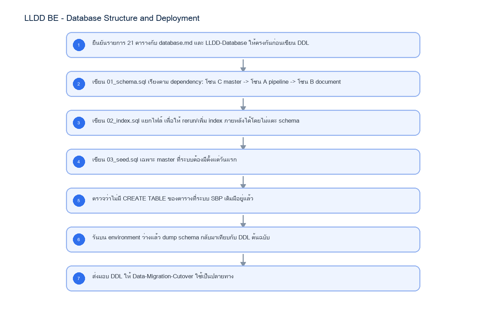
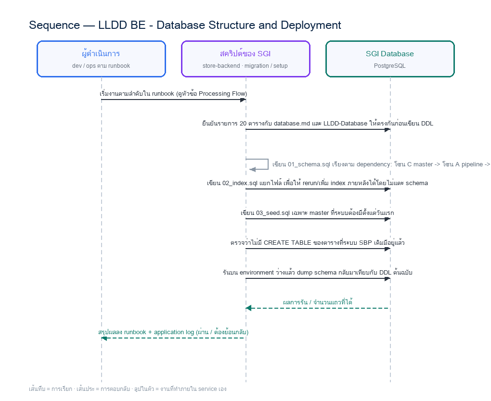

# LLDD BE - Database Structure and Deployment

SBP Mall - ระบบประกันรายได้ | Low Level Design Document

## 1. Overview

| รายการ | รายละเอียด |
| --- | --- |
| Track | BE |
| Estimate | 31 ชั่วโมง (ไม่มี unit test แยก — ดูเหตุผลใน NO_UNIT_TEST_DOCS) |
| Owner | Aphiwit <Bank> Khammoon |
| Target repository | `SBP/srm-sps-spsap-store-backend` (NestJS + TypeORM · schema `sps_store`) + `SBP/srm-sps-spsap-sbp-bff` (forward ผ่าน client service · ไม่มี DB) สำหรับเส้นที่ FE เรียก |
| Objective | กำหนด DDL ของ target schema 20 ตาราง พร้อม index/constraint/seed และสคริปต์ deploy ให้ทุกเอกสาร BE อ้างอิงโครงเดียวกัน — เป็น blocker ที่ต้องปิดในสัปดาห์แรก |

Common contract reference: ทุกหัวข้อ API/FE ต้องยึด LLDD-BE-API-Common-Contracts และ LLDD-FE-Integration-Contracts สำหรับ error/auth/format/pagination/action/RBAC ก่อนลงรายละเอียดเฉพาะหน้าหรือเฉพาะ endpoint

### 1.1 เอกสาร LLDD ที่เกี่ยวข้อง

ตารางนี้สร้างจาก endpoint และตารางที่เอกสารฉบับนี้ประกาศไว้จริง — อ่านฉบับที่อยู่ในตารางก่อนลงมือ เพื่อไม่ให้สัญญา request/response หรือชื่อคอลัมน์หลุดจากกัน

| ความสัมพันธ์ | เอกสาร LLDD | เกี่ยวข้องตรงไหน |
| --- | --- | --- |
| สัญญากลาง | **LLDD-BE-API-Common-Contracts** | envelope `{success,data}` · error code · pagination · รูปแบบวันที่/เลขเอกสาร |
| แพลตฟอร์มระบบเดิม | **LLDD-BE-Integration-SBP-Platform** | header จาก BFF (`x-api-key` / `x-user-*`) · การ reuse ตารางและ service ของระบบ SBP เดิม |

## 2. Screen / Functional Scope

- DDL ครบ 20 ตารางของ target schema (โซน A 8 · โซน B 9 · โซน C 3)
- Index, unique/partial index, check constraint และ FK ที่ต้องมีก่อน SIT
- Seed data ที่ต้องมีก่อนเปิดระบบ (sgi_external_factors · sgi_competitors) — decisions ไป seed ที่ common_code ของระบบเดิม (DP-9)
- สคริปต์ deploy/rollback ต่อ environment และลำดับการรันตาม dependency
- ตารางที่ห้ามสร้างซ้ำเพราะระบบ SBP เดิมมีอยู่แล้ว (workflow engine 13 ตาราง · store/mas_store · common_code · mas_param · business_user · email_template · fcs_qssi_score)
- ระบุข้อกำหนดด้านโครงสร้างข้อมูลที่ต้องยึดตอน implement

## 3. Screenshot Reference

ไม่มีภาพหน้าจอสำหรับหัวข้อนี้ — เป็นเอกสารฝั่ง Backend/Batch ที่ไม่มี UI (ภาพหน้าจอทั้งหมดอยู่ในเอกสารชุด FE)

## 4. Implementation Flow & Sequence Diagram (Reference)

### 4.1 Implementation Flow (ลำดับขั้นการทำงาน)



_รูปที่ 1: Implementation flow reference: LLDD BE - Database Structure and Deployment_

### 4.2 Sequence Diagram (ใครคุยกับใคร ลำดับไหน)

ผู้แสดงและลำดับข้อความในภาพนี้สร้างจาก endpoint ในหัวข้อ 7 และตารางในหัวข้อ Reference DB Mapping ของเอกสารฉบับนี้เอง จึงตรงกับสัญญาเสมอ



_รูปที่ 2: Sequence diagram: LLDD BE - Database Structure and Deployment_

## 5. Field, Format, and Validation

| Field / UI | Format | Validation | Behavior |
| --- | --- | --- | --- |
| naming | lower_snake_case | บังคับทุกตาราง/คอลัมน์ใหม่ | ห้ามใช้ชื่อไทย/CamelCase หรือชื่อ legacy แบบ FGI_/Comp* |
| store_code / new_store_code | VARCHAR(5) | ห้ามเก็บเป็น numeric | ต้องคง leading zero (00788) ทุกตาราง |
| doc_no | VARCHAR(12) รูปแบบ YYYY/xxxxx | unique ต่อปี | ออกเลขผ่าน sgi_document_running_numbers แบบ atomic |
| amount / percent | NUMERIC(15,2) / NUMERIC(5,2) | amount >= 0 · percent 0-100 | ผลรวม compensate_percent ต่อเอกสารต้อง = 100 |
| period key | CHAR(7) 'YYYY-MM' (ค.ศ.) | ค่าคงรูปแบบเดียวทั้ง schema | แสดงผลเป็น ค.ศ. เช่นกัน |
| fcs_qssi_score | ตารางเดิมของ sps_store | ห้าม CREATE TABLE ใหม่ | มีอยู่จริง 23,958,780 แถว + import pipeline ใช้งานอยู่ (POST /performance/import-qssi · staging fcs_tmp_qssi_score) |

### 5.1 ขอบเขตตารางในโครง SGI (20 ตาราง — CREATE จริง 19 + reuse 1)

DDL เต็มอยู่ที่เอกสาร `LLDD-Database` หัวข้อ Executable DDL · เอกสารฉบับนี้เป็นเจ้าของ **สคริปต์ deploy จริง** และกติกาว่าอะไรสร้างได้/สร้างไม่ได้

⚠️ **20 = จำนวนตารางในโครง ไม่ใช่จำนวนที่ต้อง CREATE** — `fcs_qssi_score` นับอยู่ในโครงโซน A แต่ใช้ตารางเดิมของ `sps_store` (23,958,780 แถว) จึง **ห้าม CREATE TABLE** ดูหัวข้อ 5.1.1 · จำนวนที่ต้อง CREATE จริงคือ **19 ตาราง** (20 ตารางในโครง ลบ fcs_qssi_score ที่ reuse) · **DP-4 ✅ ปิดแล้ว 2026-08-24** — reuse ตารางเดิมแบบ **อ่านอย่างเดียว** ไม่มีการเขียนจากฝั่ง SGI จึงไม่ต้องแก้ constraint/index ของตารางเดิมและไม่ต้องขอ sign-off (`SBP/SBPGI-vs-existing-system.md หัวข้อ 4`)

| โซน | จำนวน | ตาราง |
| --- | --- | --- |
| A — FGI/FCS pipeline | 8 (CREATE 7 + reuse 1) | sgi_fgi_impact_processes, **sgi_fgi_impact_compensations**, sgi_fgi_impact_stores, sgi_fgi_impact_sales_summaries, sgi_sales_transactions, sgi_fgi_impact_competitors, sgi_interface_transactions · **+ fcs_qssi_score = reuse ห้าม CREATE (ดู 5.1.1 · DP-4)** |
| B — เอกสาร/ประวัติ | 9 | sgi_compensation_documents, sgi_document_new_stores, sgi_document_competitors, sgi_document_external_factors, sgi_consideration_logs, sgi_document_attachments, sgi_compensation_histories, sgi_document_cost_details, sgi_document_running_numbers |
| C — master ที่ SGI เป็นเจ้าของ | 3 | sgi_impacted_stores, sgi_external_factors, sgi_competitors (decisions ย้ายไป common_code · DP-9 · status_email_rules ตัดตาม DP-5 — SGI เรียก email-lib เองโดยใช้เลข template จาก workflow_route.email_id) |
| รวม | **20 (CREATE 19 + reuse 1)** | ตรงกับ `database.md` และผลรวมของโซน A 8 + B 9 + C 3 · ประวัติ: 34 → 24 (2026-08-06 reuse ของระบบเดิม) → 22 (ตัดกลุ่ม batch) → 21 (ยกเลิก `audit_logs` 2026-08-07) → **20 (มติ DP-9 2026-08-10 ย้าย `decisions` ไป `common_code`)** → คงที่หลังรับ F8+F1 เข้าโครง 2026-08-21 (เพิ่ม `sgi_fgi_impact_compensations` แทน `status_email_rules` ที่ตัดตาม DP-5) |

#### 5.1.1 ตารางที่ระบบ SBP เดิมมีอยู่แล้ว — ห้าม CREATE TABLE

ตรวจฐานข้อมูลจริง 2026-08-07 (`SBP/db-schema-sps_store.md`) ทุกตารางในตารางนี้อยู่ใน schema **`sps_store`** และมีข้อมูลจริงใช้งานอยู่ การสร้างซ้ำใน SGI = ข้อมูลสองชุดที่ไม่มีวันตรงกัน

| ตาราง/กลุ่มตาราง | schema | จำนวนแถวจริง | หมายเหตุ |
| --- | --- | --- | --- |
| workflow engine 13 ตาราง | sps_store | workflow_transaction 19,283 · workflow_history 38,010 · workflow_approver 96,542 | ดู LLDD-BE-Workflow-Engine-Definition |
| fcs_qssi_score (เอกพจน์) | sps_store | 23,958,780 | มี import pipeline ใช้งานอยู่ (POST /performance/import-qssi · staging fcs_tmp_qssi_score) — ห้ามสร้างใหม่ |
| mas_param | sps_store | 93,752 | ค่ากำหนดกลาง |
| common_code / common_code_type | sps_store | 2,609 / 376 | วงเงินอนุมัติ code_type = SGI_APPROVE_LIMIT |
| email_template / email_sent | sps_store | 85 / 5,214 | เทมเพลตอีเมลและ log การส่ง |
| business_user | sps_store | 12,752 | ตัวตนผู้ใช้/ผู้อนุมัติ |
| store / mas_store | sps_store | 19,402 / 19,647 | master ร้าน |
| fcs_monthly_sales | sps_store | 711,384 | ยอดขาย**รายเดือน** (key store_id+year+month) — ใช้แทน sgi_sales_transactions รายวันไม่ได้ ย้อนกลับเป็นรายวันไม่ได้ · ใช้ cross-check ได้ |

#### 5.1.2 แกนธุรกิจที่ยืนยันแล้วว่าต้องสร้างเอง

ค้นทั้งฐาน 276 ตาราง / 4,396 คอลัมน์ ด้วยคำ `impact` · `compensat` · `guarantee` · `income` · `competitor` · `growth` · `outlier` · `distance` · `radius` · `latitude` · `longitude` · `window_no` ได้ **0 hit ทุกคำ** → ตารางโซน A และแกนเอกสารโซน B ไม่มีของเดิมให้ reuse ต้องสร้างเองทั้งหมด

### 5.2 ลำดับไฟล์ deploy

| ไฟล์ | เนื้อหา | รันเมื่อไร |
| --- | --- | --- |
| 01_schema.sql | CREATE TABLE 19 ตาราง เรียงตาม dependency (C master -> A pipeline -> B document) — ไม่รวม fcs_qssi_score ที่ reuse ของเดิม | ครั้งเดียวต่อ environment |
| 02_index.sql | index, unique/partial index, check constraint | หลัง 01 · rerun ได้เมื่อเพิ่ม index |
| 03_seed.sql | sgi_external_factors, sgi_competitors (01-11) — ไม่มี decisions แล้ว (DP-9 ย้ายไป common_code · seed ที่ระบบเดิม) | หลัง 02 |
| 04_grant.sql | GRANT ให้ role ของ application (แยก read/write) | หลัง 03 |
| 99_rollback.sql | DROP TABLE ย้อนลำดับ เฉพาะตารางของ SGI | เฉพาะกรณี rollback |

```sql
-- 01_schema.sql (ตัวอย่างส่วนหัว — DDL เต็มอยู่ที่ LLDD-Database)
-- ห้ามมี CREATE TABLE ของตาราง reuse: ตรวจด้วยคำสั่งนี้ก่อน commit
--   grep -nE 'CREATE TABLE (workflow_|fcs_qssi_score|mas_param|common_code|business_user|store|mas_store|email_template|decisions)' 01_schema.sql
BEGIN;
SET search_path TO sps_store;

-- โซน C: master ที่ SGI เป็นเจ้าของ (ต้องมาก่อนเพราะโซน A/B อ้างถึง)
-- ❌ ไม่มี CREATE TABLE decisions — มติ DP-9 (2026-08-10) ย้ายไป common_code ของระบบเดิม
--    (code_type = 'SGI_DECISION') · FE อ่านผ่าน GET /common/common-code?codeType=SGI_DECISION
CREATE TABLE sgi_external_factors (...);
CREATE TABLE sgi_competitors (...);
CREATE TABLE sgi_impacted_stores (...);
-- ❌ ไม่สร้างตาราง status_email_rules ใน SGI (ปิด DP-5 · แก้มติ 2026-08-14)
--    workflow ให้ 'เลข template' ผ่าน workflow_route.email_id → SGI เรียก sendEmail() ของ email-lib เอง
--    ผู้รับ resolve จาก workflow_approver → business_user.email · ⚠️ คอลัมน์จริงคือ email_sent.send_by ไม่ใช่ sent_by
--    SGI อ่าน workflow_route.email_id แล้วเรียก sendEmail() ของ email-lib · template อยู่ที่ email_template ของระบบ SBP เดิม (85 แถว)
--    lib เขียน log ให้เองที่ email_sent (5,214 แถว · mail_to/mail_cc/is_sent/error · ⚠️ คอลัมน์ผู้ส่งคือ send_by)


-- โซน A: pipeline
CREATE TABLE sgi_fgi_impact_processes (...);
-- ...

-- โซน B: เอกสาร
CREATE TABLE sgi_compensation_documents (...);
-- ...
COMMIT;
```

### 5.3 Seed ที่ต้องมีตั้งแต่วันแรก

| ตาราง | ข้อมูล seed | ที่มา |
| --- | --- | --- |
| (ไม่สร้าง) decisions | ย้ายไป common_code ของระบบเดิม (code_type = SGI_DECISION) — มติ DP-9 2026-08-10 | MSSQL DecisionProfile |
| sgi_competitors | แบรนด์คู่แข่ง 11 รายการ รหัส 01-11 (ไทย+อังกฤษ) | หน้าจอ K2 เดิม (k2-competitors.html) |
| sgi_external_factors | ปัจจัยภายนอกที่ใช้อยู่ | MSSQL FactorProfile |
| common_code (ระบบเดิม) | SGI_APPROVE_LIMIT: THRESHOLD=100000 (เกณฑ์เดียว) | มติประชุม 2026-08-18 — เขียนที่ common_code ของระบบเดิม ไม่ใช่ตารางของ SGI |
| common_code (ระบบเดิม) | SGI_DATASOURCE: ALM=ระบบ (ALLMAP) · STA=ระบบ (Statement) · PRO=เชิงรุก · REA=เชิงรับ | SDD GI สไลด์ 17 — 3 แหล่งข้อมูลร้านที่ต้องชดเชย · รหัส PRO/REA ตั้งใหม่ 2026-08-24 ตามแพตเทิร์น 3 ตัวอักษรของ DATASOURCE เดิม (ALM/STA/HRS) เพราะ SDD และระบบเดิมไม่ได้กำหนดไว้ |

### 5.4 ข้อกำหนดด้านโครงสร้างข้อมูลที่ต้องยึด

ตารางนี้คือ**ข้อกำหนดที่ต้องทำตาม** ไม่ใช่ทางเลือก — ทุกข้อสอดคล้องกับ `database.md` / `workflow.md` / `api.md` ซึ่งเป็นแหล่งความจริงของระบบ

| เรื่อง | ข้อกำหนดที่ต้องทำตาม | ที่มา / เหตุผล |
| --- | --- | --- |
| ร้าน SP ที่ใช้อ้างในเอกสาร | เก็บเป็น **snapshot เฉพาะร้านที่เคยเข้ารอบชดเชย** ใน `sgi_impacted_stores` — เติมตอนสร้าง `sgi_fgi_impact_processes` ห้ามอ่านผ่าน view ของระบบเดิม | ร้านที่ยกเลิกเกิน 1 เดือนหายจาก view ของระบบเดิม ทำให้เอกสารย้อนหลังอ่านไม่ได้ (ตัดสิน 2026-08-10) |
| `fcs_qssi_score` | **ห้าม CREATE TABLE** — reuse ตารางเดิมของ `sps_store` (23,958,780 แถว) แบบอ่านอย่างเดียว | ระบบ SBP เดิมนำเข้าให้แล้วผ่าน `POST /performance/import-qssi` (ปิด 2026-08-24 · ตัด Job 1 ออก) |
| ผลพิจารณา / ปัจจัย / คู่แข่ง | `decisions` ใช้ `common_code` ของระบบเดิม (`code_type = SGI_DECISION`) · `sgi_external_factors` และ `sgi_competitors` **เป็นตารางของ SGI** | สองตารางหลังมีหน้าจอ CRUD ของตัวเอง และ remark ของ `common_code` จำกัด 50 ตัวอักษร (ตัดสิน 2026-08-10) |
| `reference_id` ที่ส่งเข้า workflow engine | ส่ง **`sgi_compensation_documents.id`** (surrogate) เป็น string — ห้ามส่ง `doc_no` | `reference_id` ของ engine เป็น varchar(255) และระบบเดิม (cooperation-request / inform-evaluate) ส่ง surrogate id ทุกจุด (ปิด 2026-08-17) |
| ประวัติการพิจารณา | ใช้ **`sgi_consideration_logs` ของ SGI เอง** ผูก `transaction_id` ของ engine — ไม่ต่อยอดบน `sps_store.workflow_history` | engine เก็บ timeline แต่ไม่มีรหัสผลพิจารณาและไฟล์แนบ (ปิด 2026-08-24) |
| audit การแก้ master data | โครง SGI **ไม่มีตาราง audit ของตัวเอง** — การตรวจสอบการแก้ master ใช้กลไกของระบบ SBP เดิม | `audit_logs` ถูกตัดออกจากโครงเมื่อ 2026-08-07 · DDL ปัจจุบันไม่มีตารางนี้ |

### 5.9 Input / Progress / Output Contract

| Stage | Contract for implementation |
| --- | --- |
| Input | ไม่มี endpoint ของตัวเอง — input คือ request ที่เอกสารอื่นส่งเข้ามา พร้อม user context จาก BFF header (ดู 5.1) และค่ากำหนดกลางที่อ่านจากระบบเดิม |
| Progress | ยืนยันรายการ 20 ตารางกับ database.md และ LLDD-Database ให้ตรงกันก่อนเขียน DDL; เขียน 01_schema.sql เรียงตาม dependency: โซน C master -> โซน A pipeline -> โซน B document; เขียน 02_index.sql แยกไฟล์ เพื่อให้ rerun/เพิ่ม index ภายหลังได้โดยไม่แตะ schema; เขียน 03_seed.sql เฉพาะ master ที่ระบบต้องมีตั้งแต่วันแรก |
| Output | 20 target tables (โซน A/B/C) |

### 5.90 Endpoint Implementation Contract

| Endpoint | Use-case owner | Service/repository behavior | Definition of done |
| --- | --- | --- | --- |
| Internal service | กำหนด DDL ของ target schema 20 ตาราง พร้อม index/constraint/seed และสคริปต์ deploy ให้ทุกเอกสาร BE อ้างอิงโครงเดียวกัน — เป็น blocker ที่ต้องปิดในสัปดาห์แรก | เรียกจาก use case ภายในเท่านั้น | DDL รันบนฐานว่างได้ครบในครั้งเดียวโดยไม่มี error ลำดับ FK |

### 5.91 Backend Execution Sequence

| Step | Behavior specific to this LLDD | Failure/test evidence |
| --- | --- | --- |
| 1 | ยืนยันรายการ 20 ตารางกับ database.md และ LLDD-Database ให้ตรงกันก่อนเขียน DDL | รัน 01+02+03 บนฐานว่าง แล้ว dump schema เทียบกับต้นฉบับ |
| 2 | เขียน 01_schema.sql เรียงตาม dependency: โซน C master -> โซน A pipeline -> โซน B document | รัน 01 ซ้ำครั้งที่สอง ต้อง fail แบบชัดเจน ไม่สร้างของซ้ำเงียบ ๆ |
| 3 | เขียน 02_index.sql แยกไฟล์ เพื่อให้ rerun/เพิ่ม index ภายหลังได้โดยไม่แตะ schema | ทดสอบ insert เอกสารที่ compensate_percent รวมไม่ครบ 100 ต้องถูก block |
| 4 | เขียน 03_seed.sql เฉพาะ master ที่ระบบต้องมีตั้งแต่วันแรก | ทดสอบ insert store_code '00788' แล้วอ่านกลับได้ leading zero ครบ |
| 5 | ตรวจว่าไม่มี CREATE TABLE ของตารางที่ระบบ SBP เดิมมีอยู่แล้ว | ทดสอบออกเลข doc_no พร้อมกัน 20 request ต้องไม่ซ้ำ |
| 6 | รันบน environment ว่างแล้ว dump schema กลับมาเทียบกับ DDL ต้นฉบับ | grep หา CREATE TABLE ของตาราง reuse ต้องได้ 0 บรรทัด |
| 7 | ส่งมอบ DDL ให้ Data-Migration-Cutover ใช้เป็นปลายทาง | — (ยังไม่มี test เฉพาะขั้นนี้ · ครอบด้วย test รวมของเอกสารในหัวข้อ 11) |

## 6. Button / User Action Mapping

| Action | Trigger | API / Service | Expected Result |
| --- | --- | --- | --- |
| รัน DDL baseline | deploy script | psql -f 01_schema.sql | สร้าง 19 ตารางตามลำดับ dependency |
| รัน index/constraint | deploy script | psql -f 02_index.sql | index/unique/check ครบก่อนเปิด SIT |
| รัน seed | deploy script | psql -f 03_seed.sql | master ที่ระบบต้องมีตั้งแต่วันแรก |
| Rollback | deploy script | psql -f 99_rollback.sql | DROP ย้อนลำดับ · ห้ามแตะตารางของระบบ SBP เดิม |

## 7. API Contract

**เอกสารฉบับนี้ไม่มี endpoint ของตัวเอง** — เป็นสัญญา/งานภายในที่เอกสารอื่นเรียกใช้ (ดูขอบเขตใน 5.90 Endpoint Implementation Contract) · รายการ endpoint ทั้ง 29 เส้นของ SGI อยู่ที่ **LLDD-API** และ `api.md`

## 8. Reference DB Mapping (No Database Page Work)

ส่วนนี้เป็นข้อมูลอ้างอิงสำหรับการ implement API/Job เท่านั้น ไม่ใช่งานสร้างหน้า Database, ไม่ใช่งานออกแบบ DB page และไม่ถูกนับเป็น deliverable แยกของ FE/BE

| Table / Object | R/W | Usage |
| --- | --- | --- |
| 20 target tables (โซน A/B/C) | W | สร้างจาก DDL baseline ของเอกสารนี้ |
| workflow engine 13 ตาราง (sps_store) | R | ห้ามสร้างซ้ำ — ใช้ของ @srm/glb-workflow |
| fcs_qssi_score (sps_store) | R | ห้ามสร้างซ้ำ — 23,958,780 แถว + import pipeline ใช้งานอยู่ |
| mas_param / common_code / business_user / email_template (sps_store) | R | ค่ากำหนดกลาง/master/ตัวตน/เทมเพลตอีเมลของระบบ SBP เดิม |

## 9. Processing Flow

| Step | Description |
| --- | --- |
| 1 | ยืนยันรายการ 20 ตารางกับ database.md และ LLDD-Database ให้ตรงกันก่อนเขียน DDL |
| 2 | เขียน 01_schema.sql เรียงตาม dependency: โซน C master -> โซน A pipeline -> โซน B document |
| 3 | เขียน 02_index.sql แยกไฟล์ เพื่อให้ rerun/เพิ่ม index ภายหลังได้โดยไม่แตะ schema |
| 4 | เขียน 03_seed.sql เฉพาะ master ที่ระบบต้องมีตั้งแต่วันแรก |
| 5 | ตรวจว่าไม่มี CREATE TABLE ของตารางที่ระบบ SBP เดิมมีอยู่แล้ว |
| 6 | รันบน environment ว่างแล้ว dump schema กลับมาเทียบกับ DDL ต้นฉบับ |
| 7 | ส่งมอบ DDL ให้ Data-Migration-Cutover ใช้เป็นปลายทาง |

## 10. Acceptance Criteria

- DDL รันบนฐานว่างได้ครบในครั้งเดียวโดยไม่มี error ลำดับ FK
- จำนวนตารางที่สร้างจริง = 19 ตาราง (20 ในโครง ลบ fcs_qssi_score ที่ reuse) ตรงกับ database.md
- ไม่มี CREATE TABLE ของ workflow engine, store master, common_code, mas_param, business_user, email_template หรือ fcs_qssi_score
- ทุกตารางมี PK และทุก FK ชี้ไปตารางที่มีอยู่จริงในสคริปต์เดียวกัน
- rollback script ลบเฉพาะตารางของ SGI
- ข้อกำหนดด้านโครงสร้างข้อมูลทุกข้อในหัวข้อ 5.4 ระบุเป็นสิ่งที่ต้องทำ ไม่มีทางเลือกค้าง

## 11. Developer Test Checklist

| No | Test |
| --- | --- |
| 1 | รัน 01+02+03 บนฐานว่าง แล้ว dump schema เทียบกับต้นฉบับ |
| 2 | รัน 01 ซ้ำครั้งที่สอง ต้อง fail แบบชัดเจน ไม่สร้างของซ้ำเงียบ ๆ |
| 3 | ทดสอบ insert เอกสารที่ compensate_percent รวมไม่ครบ 100 ต้องถูก block |
| 4 | ทดสอบ insert store_code '00788' แล้วอ่านกลับได้ leading zero ครบ |
| 5 | ทดสอบออกเลข doc_no พร้อมกัน 20 request ต้องไม่ซ้ำ |
| 6 | grep หา CREATE TABLE ของตาราง reuse ต้องได้ 0 บรรทัด |
