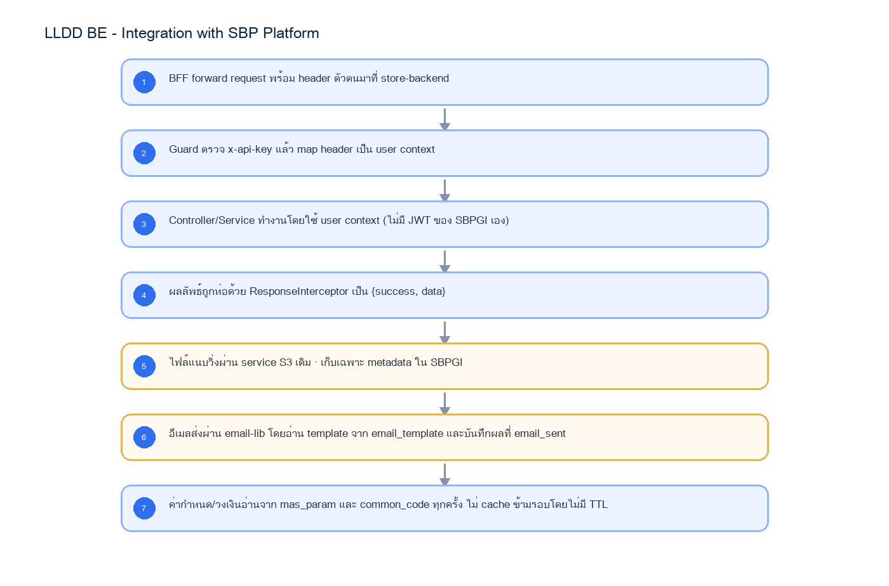

# LLDD BE - Integration with SBP Platform

SBP Mall - ระบบประกันรายได้ | Low Level Design Document

## 1. Overview

| รายการ | รายละเอียด |
| --- | --- |
| Track | BE |
| Estimate | 20 ชั่วโมง (ไม่มี unit test แยก — ดูเหตุผลใน NO_UNIT_TEST_DOCS) |
| Owner | Tunyatorn <Vava> Kiatkongphongsa |
| Target repository | `SBP/srm-sps-spsap-store-backend` (NestJS + TypeORM · schema `sps_store`) + `SBP/srm-sps-spsap-sbp-bff` (forward ผ่าน client service · ไม่มี DB) สำหรับเส้นที่ FE เรียก |
| Objective | กำหนดวิธีที่ SBPGI ต่อกับแพลตฟอร์ม SBP เดิม: BFF header/ตัวตน, response envelope, ไฟล์บน S3, อีเมลผ่าน @gosoft-sbp/email-lib และค่ากำหนดกลางใน mas_param/common_code — เป็น blocker ที่ต้องปิดในสัปดาห์แรก |

Common contract reference: ทุกหัวข้อ API/FE ต้องยึด LLDD-BE-API-Common-Contracts และ LLDD-FE-Integration-Contracts สำหรับ error/auth/format/pagination/action/RBAC ก่อนลงรายละเอียดเฉพาะหน้าหรือเฉพาะ endpoint

## 2. Screen / Functional Scope

- ตัวตนผู้ใช้จาก BFF header 6 ตัว (x-api-key · x-user-id · x-user-group-id · x-user-full-name · x-user-permissions · accept-language) — ดูค่าตัวอย่างจริงใน 5.1
- Response envelope ของ store-backend: {success, data} / {success:false, data:null, error:{code,message}}
- ไฟล์แนบผ่าน service S3 เดิม (POST /statement/upload-file-aws · download-file-aws)
- อีเมลผ่าน @gosoft-sbp/email-lib + ตาราง email_template / email_sent
- ค่ากำหนดกลางที่ sps_store.mas_param และ sps_store.common_code — 🔴 ค่าของ SBPGI (SBPGI_APPROVE_LIMIT ฯลฯ) ยังไม่มีในระบบจริง ต้อง seed เองตอน setup (ดู 5.5)
- การใช้ตาราง master ของระบบเดิม (store/mas_store · business_user · common_code) และปริมาณข้อมูลจริง

## 3. Screenshot Reference

ไม่มีภาพหน้าจอสำหรับหัวข้อนี้ — เป็นเอกสารฝั่ง Backend/Batch ที่ไม่มี UI (ภาพหน้าจอทั้งหมดอยู่ในเอกสารชุด FE)

## 4. Implementation Flow Diagram (Reference)



_รูปที่ 1: Implementation flow reference: LLDD BE - Integration with SBP Platform_

## 5. Field, Format, and Validation

| Field / UI | Format | Validation | Behavior |
| --- | --- | --- | --- |
| x-api-key | string | required ทุก request จาก BFF | ตรวจที่ guard ของ store-backend ก่อนเข้า controller |
| x-user-id | string เช่น `0000123456` | required ทุก endpoint ของผู้ใช้ — ไม่มี = 401 | created_by/updated_by ของ SBPGI + consideration_logs.actor_user_id + ส่งเป็น userId เข้า engine · 🔴 ห้ามเขียน current_approver เอง (engine เป็นคนเขียน) |
| x-user-group-id | string เช่น `08` | required เมื่อ endpoint ต้องรู้ section | map เป็น section_code ของ workflow (06/08/01/02/03) — เป็นด่านหลักในการตัดสินสิทธิ์เขียน |
| x-user-full-name | string · **%-encoded** | ไม่บังคับ | ชื่อผู้ทำรายการใน timeline/อีเมล · 🔴 ต้อง decodeURIComponent ก่อนใช้เสมอ · ไม่มีให้ fallback เป็น x-user-id |
| x-user-permissions | string (serialized) · ⚠️ รูปแบบยังไม่ยืนยัน | **ด่านเสริม ไม่ใช่ด่านเดียว** | สิทธิ์ต่อ URL จาก auth-backend — SBPGI ไม่คำนวณสิทธิ์เมนูเอง · parse ไม่ผ่านให้ตกไปใช้ x-user-group-id + สถานะเอกสาร (ดู 5.1.2) |
| accept-language | string เช่น `th` | ไม่บังคับ | ภาษาข้อความ error — default th (ไทย verbatim ตาม SRS) |
| envelope | {success, data} | บังคับทุก endpoint | ResponseInterceptor ห่อให้แล้ว — service ห้ามห่อซ้ำ |
| error | {success:false, data:null, error:{code,message}} | message ภาษาไทย verbatim ตาม SRS | โยนผ่าน HttpException เท่านั้น |
| sps_store.mas_param | key-value ของระบบเดิม | **runtime = read-only · เขียนเฉพาะตอน seed/cutover** | 93,752 แถว · ไม่มี PK/unique → อ่านต้อง WHERE active_flag='Y' + LIMIT 1 เสมอ · 🔴 ค่า SBPGI_* ยังไม่มี ต้อง seed (5.5.2) |
| sps_store.common_code / common_code_type | code master ของระบบเดิม | **runtime = read-only · เขียนเฉพาะตอน seed/cutover** | 2,609 / 376 แถว · code_type เป็น varchar(20) · ต้อง INSERT common_code_type ก่อน · 🔴 SBPGI_APPROVE_LIMIT ยังไม่มี ต้อง seed (5.5.2) |

### 5.1 User Context จาก BFF

SBPGI **ไม่มีระบบ login ของตัวเอง** — login จริงอยู่ที่ **AWS Cognito ฝั่ง BFF** · FE ไม่แตะ token · BFF ยืนยันตัวเองกับ backend ด้วย `x-api-key` แล้วส่งบริบทผู้ใช้ต่อเป็น header · guard ของ store-backend แปลง header เป็น user context แล้วส่งต่อให้ service ทุกชั้น (รูปแบบเดียวกับที่ `export-data.service.ts` / `relation.service.ts` / `backlog.service.ts` ของ BFF ใช้อยู่แล้ว)

#### 5.1.1 ตัวอย่าง request จริงที่ SBPGI ได้รับ

**HTTP request จาก BFF → store-backend (SBPGI)**

```http
POST /api/v1/sbpgi/document/2026%2F00123/actions HTTP/1.1
Host: store-backend:3004
Content-Type: application/json
accept-language: th

x-api-key: 8f2b1c94-6d5e-4a70-b1c3-9ee27a4f0d51
x-user-id: 0000123456
x-user-group-id: 08
x-user-full-name: %E0%B8%AA%E0%B8%A1%E0%B8%8A%E0%B8%B2%E0%B8%A2%20%E0%B9%83%E0%B8%88%E0%B8%94%E0%B8%B5
x-user-permissions: [{"url":"/sbpgi/document/waiting","canView":true,"canManage":true,"canExport":false,"canOther":false},{"url":"/sbpgi/report/status-summary","canView":true,"canManage":false,"canExport":true,"canOther":false}]

{"result":"ส่งหน่วยงานส่งเสริมธุรกิจ SBP","comment":"ตรวจยอดชดเชยแล้ว"}
```

#### 5.1.2 แต่ละ header คืออะไร ใช้ทำอะไร

| Header | ตัวอย่างค่า | มาจากไหน | SBPGI ใช้ทำอะไร | ถ้าไม่มี/ผิด |
| --- | --- | --- | --- | --- |
| `x-api-key` | `8f2b1c94-6d5e-4a70-b1c3-9ee27a4f0d51` | env ของ BFF ต่อ backend (`API_STORE_BACKEND_KEY_VALUE`) เทียบกับ `X_API_KEY` ของ store-backend | พิสูจน์ว่า request มาจาก BFF จริง ไม่ใช่ใครยิงตรง — **ไม่ใช่ตัวตนผู้ใช้** | **401** `ไม่พบสิทธิ์การเข้าใช้งาน` · `HttpHeaderGuard` ของระบบเดิมเทียบแบบ `===` ตรง ๆ |
| `x-user-id` | `0000123456` | `sub`/employee id จาก JWT ของ Cognito (BFF ถอดจาก cookie) | 🔴 **ตัวตนผู้ใช้** — ใส่ใน `created_by`/`updated_by`, `consideration_logs.actor_user_id`, และส่งเป็น `userId` เข้า `eventWorkflow` / `initializeWorkflow` ของ engine | **401** — ห้ามให้ผ่านโดยไม่มี userId เพราะ audit trail จะขาด |
| `x-user-group-id` | `08` | auth-backend (ABS) — กลุ่มสิทธิ์ของผู้ใช้ | map เป็น **section_code** ของ workflow (06/08/01/02/03) เพื่อกรองกล่องงานและตัดสินว่ากดปุ่มไหนได้ | **403** เมื่อ endpoint ต้องรู้ section · endpoint อ่านอย่างเดียวยอมให้ผ่านได้ |
| `x-user-full-name` | `%E0%B8%AA%E0%B8%A1%E0%B8%8A%E0%B8%B2%E0%B8%A2%20%E0%B9%83%E0%B8%88%E0%B8%94%E0%B8%B5`  → `สมชาย ใจดี` | employee backend (`/employees/{empId}/profile`) | แสดงชื่อผู้ทำรายการใน timeline/อีเมล · **ต้อง `decodeURIComponent` ก่อนใช้เสมอ** (BFF encode มา) | ไม่บล็อก — fallback เป็น `x-user-id` แล้วเติมชื่อทีหลังจาก `business_user` |
| `x-user-permissions` | `[{"url":"/sbpgi/document/waiting","canView":true,"canManage":true,"canExport":false,"canOther":false}]` | auth-backend `GET /groups/current-user/permissions` (ชุดเดียวกับที่ FE ใช้) | กันเรียก API ตรงโดยข้ามหน้าจอ — เทียบ `url` ของหน้าที่เป็นเจ้าของ endpoint นั้น + `canManage` ก่อนยอมให้เขียน | **403** สำหรับ endpoint ที่เขียนข้อมูล · ⚠️ ดูข้อควรระวังด้านล่าง |
| `accept-language` | `th` | BFF ส่งต่อจาก browser | เลือกภาษาข้อความ error — SBPGI ใช้ **ไทย verbatim ตาม SRS** เป็นค่าตั้งต้นเสมอ | ไม่บล็อก — default `th` |

⚠️ **ข้อควรระวัง `x-user-permissions` (ต้องยืนยันกับทีม BFF ก่อนลงมือ):** เอกสารวิเคราะห์ระบบเดิมยืนยันแค่ว่า *มี* header ตัวนี้และเนื้อหาคือชุดสิทธิ์ต่อ URL (`canView` / `canManage` / `canExport` / `canOther`) แต่**ยังไม่ยืนยัน 2 เรื่อง** — (1) รูปแบบที่ serialize มา (JSON ตรง ๆ · base64 · หรือย่อเป็น CSV) และ (2) พฤติกรรมเมื่อสิทธิ์เยอะจน header ยาวเกินลิมิตของ proxy (ปกติ ~8 KB) · **จนกว่าจะยืนยัน ห้ามใช้ header นี้เป็นด่านเดียว** — ให้ตัดสินสิทธิ์เขียนจาก `x-user-group-id` + สถานะเอกสาร + ผู้ถืองานจาก `getTransaction()` ของ engine เป็นหลัก แล้วใช้ `x-user-permissions` เป็นด่านเสริม

#### 5.1.3 Guard ที่ต้องเขียน

```ts
// src/common/guards/bff-user.guard.ts (ยึด convention ของ store-backend)
export interface SbpgiUser {
  userId: string;          // x-user-id            เช่น '0000123456'
  groupId: string;         // x-user-group-id      เช่น '08'
  fullName: string;        // x-user-full-name     decode แล้ว เช่น 'สมชาย ใจดี'
  permissions: UrlPermission[];   // x-user-permissions  (ดูข้อควรระวัง 5.1.2)
}

@Injectable()
export class BffUserGuard implements CanActivate {
  constructor(private readonly config: ConfigService) {}

  canActivate(ctx: ExecutionContext): boolean {
    const req = ctx.switchToHttp().getRequest();

    // 1) ยืนยันว่ามาจาก BFF จริง — เทียบกับ X_API_KEY (มาจาก Secret Manager ห้าม hardcode/commit)
    const apiKey = req.headers['x-api-key'];
    if (!apiKey || apiKey !== this.config.get('X_API_KEY')) {
      throw new UnauthorizedException('ไม่พบสิทธิ์การเข้าใช้งาน');
    }

    // 2) ตัวตนผู้ใช้ — ไม่มี userId = ไม่ให้ผ่าน เพราะ audit trail จะขาด
    const userId = req.headers['x-user-id'];
    if (!userId) throw new UnauthorizedException('ไม่พบสิทธิ์การเข้าใช้งาน');

    req.user = {
      userId,
      groupId: req.headers['x-user-group-id'] ?? '',
      // BFF encodeURIComponent มา -> ต้อง decode ก่อนใช้ ไม่งั้นชื่อไทยกลายเป็น %E0%B8...
      fullName: safeDecode(req.headers['x-user-full-name']),
      permissions: parsePermissions(req.headers['x-user-permissions']),
    } satisfies SbpgiUser;
    return true;
  }
}

/** header อาจว่าง/พัง — ห้ามให้ทั้ง request ล้มเพราะ decode ไม่ผ่าน */
function safeDecode(v?: string): string {
  if (!v) return '';
  try { return decodeURIComponent(v); } catch { return v; }
}

/** ⚠️ รูปแบบ serialize ยังไม่ยืนยัน (ดู 5.1.2) — parse ไม่ผ่านให้คืน [] แล้วตกไปใช้ด่าน group/สถานะแทน */
function parsePermissions(v?: string): UrlPermission[] {
  if (!v) return [];
  try { const j = JSON.parse(v); return Array.isArray(j) ? j : []; } catch { return []; }
}
```

#### 5.1.4 ใช้ใน controller / ทดสอบเอง

```ts
// controller — อ่าน user ที่ guard แปะไว้ ห้ามอ่าน header ตรงในทุก service
// ⚠️ ไม่มี 'sbpgi/' ใน @Controller() เพราะ prefix ผูกที่ระดับโมดูล:
//    RouterModule.register([{ path: 'sbpgi', module: SbpgiModule }])
//    -> URL จริงคือ /api/v1/sbpgi/document/... (ดู LLDD-BE-API-Common-Contracts 5.80)
@UseGuards(BffUserGuard)
@Controller('document')
export class SbpgiDocumentController {
  @Post(':docNo/actions')
  submit(@Param('docNo') docNo: string, @Body() dto: ActionDto, @Req() req: { user: SbpgiUser }) {
    // docNo มาเป็น '2026%2F00123' -> Nest decode ให้แล้วเป็น '2026/00123'
    return this.service.submit(docNo, dto, req.user);
  }
}
```

```bash
# ยิงทดสอบเองตอน dev (ไม่ผ่าน BFF) — ใส่ header ให้ครบเหมือนที่ BFF ส่งจริง
curl -X POST 'http://localhost:3004/api/v1/sbpgi/document/2026%2F00123/actions' \
  -H 'x-api-key: '"$X_API_KEY" \
  -H 'x-user-id: 0000123456' \
  -H 'x-user-group-id: 08' \
  -H 'x-user-full-name: %E0%B8%AA%E0%B8%A1%E0%B8%8A%E0%B8%B2%E0%B8%A2%20%E0%B9%83%E0%B8%88%E0%B8%94%E0%B8%B5' \
  -H 'accept-language: th' \
  -H 'Content-Type: application/json' \
  -d '{"result":"ส่งหน่วยงานส่งเสริมธุรกิจ SBP","comment":"ตรวจยอดชดเชยแล้ว"}'
```

- 🔴 **ห้ามให้ FE ส่ง header เหล่านี้เอง** — ต้องมาจาก BFF เท่านั้น · store-backend ต้องอยู่หลัง network layer ที่เปิดให้เฉพาะ BFF เข้าถึง
- 🔴 **ห้าม log ค่า `x-api-key`** ลง application log / error message ทุกกรณี
- `x-user-id` ที่ส่งเข้า engine ต้องเป็นตัวเดียวกับที่บันทึกใน `consideration_logs` — ไม่งั้น timeline ของ SBPGI กับ `workflow_history` ของ engine จะชี้คนละคน
- unit test ต้องครอบ: ไม่มี `x-api-key` → 401 · `x-api-key` ผิด → 401 · ไม่มี `x-user-id` → 401 · `x-user-full-name` เป็น %-encoded → decode ถูก · `x-user-permissions` พัง/ว่าง → ไม่ throw แต่ตกไปใช้ด่าน group

### 5.2 Response Envelope

```ts
// ResponseInterceptor ของ store-backend ห่อให้แล้ว — service ห้ามห่อซ้ำ
// success : { success: true,  data: <payload> }
// error   : { success: false, data: null, error: { code, message } }
// message ต้องเป็นภาษาไทย verbatim ตาม SRS และโยนผ่าน HttpException เท่านั้น
```

### 5.3 ไฟล์แนบผ่าน S3 ของระบบเดิม

| ขั้นตอน | ปลายทาง | สิ่งที่ SBPGI เก็บเอง |
| --- | --- | --- |
| อัปโหลด | POST /statement/upload-file-aws (ระบบ SBP เดิม) | objectKey + ชื่อไฟล์ + ขนาด + content type + section_code |
| ดาวน์โหลด | POST /statement/download-file-aws (ระบบ SBP เดิม) | SBPGI แปลงเป็น **binary stream** ก่อนคืนให้ FE · ห้ามคืน objectKey ให้ FE |
| ลบ/purge | lifecycle ของ S3 + flag ใน document_attachments | purge_flag / storage_delete_status |

🔴 **ข้อจำกัดที่ต้องรู้ก่อนเขียนโค้ด (ตรวจ `store-backend` 2026-08-26):** `AwsService` ของระบบเดิมเป็น **wrapper แบบ base64** ไม่ใช่ stream — `upload-file-aws` รับไฟล์เป็น base64 และ `download-file-aws` **คืนไฟล์เป็น base64 ใน JSON** สายส่งจริงจึงเป็น `FE ← binary stream ← SBPGI BE ← base64 JSON ← /statement/download-file-aws ← S3`

| ผลกระทบ | ตัวเลข | ต้องทำอย่างไร |
| --- | --- | --- |
| base64 ทำให้ payload โตขึ้น ~33% | ไฟล์ 5 MB → **~6.7 MB** ใน JSON | ยังไม่ชน body limit ของ store-backend (**100 MB** ที่ `main.ts:33`) แต่กิน memory ต่อ request จริง |
| ปุ่ม **ดาวน์โหลดทั้งหมด (.zip)** ต้องดึงหลายไฟล์ | n ไฟล์ × 1.33 พร้อมกัน | 🔴 ห้ามโหลดทุกไฟล์เข้า memory พร้อมกัน — ดึงทีละไฟล์แล้ว **stream เข้า zip ทันที** (archiver แบบ streaming) |
| FE ไม่ควรรู้ว่าใต้ท้องเป็น base64 | — | สัญญาฝั่ง FE ยังเป็น **binary stream + Content-Type / Content-Disposition** ตาม `LLDD-BE-API-Attachment-Sales-Timeline` — SBPGI เป็นคนแปลง |

⚠️ **ต้องยืนยันกับทีม store-backend:** wrapper รองรับ **range request / partial download** หรือไม่ · ถ้าไม่รองรับ ไฟล์ใหญ่จะ resume ไม่ได้ และปุ่มดาวน์โหลดทั้งหมดต้องกำหนดเพดานจำนวน/ขนาดรวม

**แก้ความเข้าใจผิดเดิม (ตรวจ schema จริง 2026-08-07):** เอกสารรุ่นก่อนเคยเขียนว่าถ้าใช้ตาราง `upload_general` ของระบบเดิมจะติด FK `job_id` — **ไม่จริง** `job_id` และ `audit_log_id` เป็น **nullable ทั้งคู่** · เหตุผลจริงที่ SBPGI ต้องมี `document_attachments` ของตัวเองคือ `upload_general` **ไม่มีคอลัมน์** `file_size` · `content_type` · `section_code` · `upload_status` · `purge_flag`

### 5.4 อีเมล

ส่งผ่าน `@gosoft-sbp/email-lib` โดยอ่านเนื้อหาจาก `email_template` (85 แถว) และบันทึกผลที่ `email_sent` (5,214 แถว)

**แก้ความเข้าใจผิดเดิม (ตรวจ schema จริง 2026-08-07):** เอกสารรุ่นก่อนเคยเขียนว่าระบบเดิม **ไม่มีที่เก็บ CC ของอีเมล** — **ไม่จริง** มีอยู่ 3 ที่: `email_sent.mail_cc` · `fcs_reminder_log.reminder_cc` · `fml_email_account`

### 5.5 ค่ากำหนดกลาง — `mas_param` กับ `common_code` คืออะไร

🔴 **สองตารางนี้เป็นของระบบ SBP เดิม อยู่ใน schema `sps_store` เท่านั้น** และ **ค่าของ SBPGI ยังไม่มีอยู่จริง — เป็นแถวที่เราต้อง seed เองตอน setup** (เอกสารรอบก่อนเขียนกำกวมจนอ่านเหมือนมีข้อมูลอยู่แล้ว · แก้ 2026-08-25)

| ตาราง | คืออะไร | โครงคีย์ | ของจริงตอนนี้ (ตรวจ 07/08/2026) |
| --- | --- | --- | --- |
| `sps_store.mas_param` | **ตาราง config กลางของ store-backend** — คู่ชื่อ/ค่าแบบอิสระ ที่ทั้งระบบเดิมใช้ร่วมกัน (เช่น `GROUP_ID_VIEW_ALL_STMT` คุมว่ากลุ่มไหนเห็นใบแจ้งยอดทั้งหมด · ช่วงวันที่ของไฟล์อากรแสตมป์) | `param_name` · `param_value`(4000) · `ref_name` · `description` · `is_config` · `active_flag` | **93,752 แถว** · ⚠️ **ไม่มี PK ไม่มี unique** มีแค่ btree `(param_name, param_value)` → ชื่อพารามิเตอร์ซ้ำได้ ต้องกันเองที่ระดับแอปและ `WHERE active_flag = 'Y'` เสมอ |
| `sps_store.common_code` | **lookup กลาง** ของทั้งระบบเดิม — ชุดรหัส/ชื่อที่ใช้ทำ dropdown | `code_type`(**20**) · `seq_no` · `code_value`(100) · `code_name`(1000) · `other_value`(50) · `code_mapping`(100) · `active_flag` | **2,609 แถว** · ⚠️ **ไม่มี PK ไม่มี unique** บน (`code_type`,`code_value`) · `code_type` ต้องลงทะเบียนที่ **`common_code_type`** (376 แถว) ก่อน |

#### 5.5.1 ทำไมค้นแล้วไม่เจอข้อมูล (2 กับดักที่เจอจริง)

| กับดัก | ข้อเท็จจริง | ต้องทำอย่างไร |
| --- | --- | --- |
| ค้นผิด schema | `mas_param` มี **เฉพาะ `sps_store`** — ใน `sps_auth` **ไม่มีตารางนี้เลย** · ส่วน `common_code` มี **ทั้งสอง schema แต่เป็นคนละตาราง**: `sps_store` 14 คอลัมน์ 2,609 แถว vs `sps_auth` **13 คอลัมน์ 2,594 แถว** (ชุดเก่าของ auth-backend) | 🔴 SBPGI ใช้ **`sps_store` เท่านั้น** · เขียน schema นำหน้าทุกครั้งใน SQL (กับดักเดียวกับตาราง `workflow_*` ที่มีสองชุด — ดู 5.4) |
| คิดว่าค่าของ SBPGI มีอยู่แล้ว | `SBPGI_APPROVE_LIMIT` · `SBPGI_DECISION` · `SBPGI_DATASOURCE` **ยังไม่มีสักแถวในระบบจริง** — เป็นค่าที่การออกแบบ *วางแผนจะเพิ่ม* ไม่ใช่ของเดิมที่ reuse ได้ทันที | ต้อง **seed เองตอน setup** (ดู 5.5.2) และนับเป็นงานของ `LLDD-BE-Data-Migration-Cutover` |

#### 5.5.2 ค่าที่ SBPGI ต้อง seed เอง

| ค่า | ลงที่ไหน | คีย์ที่ใช้ | สถานะ |
| --- | --- | --- | --- |
| วงเงินอนุมัติ เกณฑ์เดียว **100,000** | `sps_store.common_code` | `code_type = 'SBPGI_APPROVE_LIMIT'` · `code_value = 'THRESHOLD'` · `code_name = '100000'` | 🔴 **ยังไม่มี — ต้อง seed** |
| ผลการพิจารณา 6 ค่า (มติ DP-9) | `sps_store.common_code` | `code_type = 'SBPGI_DECISION'` | 🔴 **ยังไม่มี — ต้อง seed** |
| ต้นทาง `PRO` (เชิงรุก) · `REA` (เชิงรับ) | `sps_store.common_code` | `code_type = 'SBPGI_DATASOURCE'` | 🔴 **ยังไม่มี — ต้อง seed** (เพิ่มจากของเดิมที่มี `ALM`/`STA`) |
| รัศมีผลกระทบ 1 กม. (กทม./ปริมณฑล) · 2 กม. (ต่างจังหวัด) | `sps_store.mas_param` | `param_name = 'SBPGI_IMPACT_RADIUS_BKK' / '..._UPC'` | 🔴 **ยังไม่มี — ต้อง seed** · อ่านตอนคำนวณ ห้าม hardcode |
| เกณฑ์ยอดขายไม่ครบ **60 วัน** · growth rate **-10%** | `sps_store.mas_param` | `param_name = 'SBPGI_SALES_DAYS_MIN' / 'SBPGI_GROWTH_RATE_MAX'` | 🔴 **ยังไม่มี — ต้อง seed** · ใช้กับธงข้อมูลผิดปกติและ Gen Flow Gate |

```sql
-- seed ตอน setup (idempotent) — ⚠️ ทั้งสองตารางไม่มี unique จึงต้อง guard ด้วย NOT EXISTS เอง
-- 1) ลงทะเบียน code_type ก่อนเสมอ ไม่งั้น dropdown ของระบบเดิมจะไม่รู้จัก
INSERT INTO sps_store.common_code_type (code_type, code_type_name, active_flag, create_date, create_user)
SELECT 'SBPGI_APPROVE_LIMIT', 'วงเงินอนุมัติ ประกันรายได้', 'Y', CURRENT_TIMESTAMP, 'SBPGI-SETUP'
WHERE NOT EXISTS (SELECT 1 FROM sps_store.common_code_type WHERE code_type = 'SBPGI_APPROVE_LIMIT');

-- 2) ค่าจริง · code_type เป็น varchar(20) -> 'SBPGI_APPROVE_LIMIT' = 19 ตัว เหลือที่ว่าง 1 ตัวเท่านั้น
INSERT INTO sps_store.common_code (code_type, seq_no, code_value, code_name, active_flag, create_date, create_user)
SELECT 'SBPGI_APPROVE_LIMIT', 1, 'THRESHOLD', '100000', 'Y', CURRENT_TIMESTAMP, 'SBPGI-SETUP'
WHERE NOT EXISTS (SELECT 1 FROM sps_store.common_code
                  WHERE code_type = 'SBPGI_APPROVE_LIMIT' AND code_value = 'THRESHOLD');

-- 3) ค่ากำหนดกลางที่ไม่ใช่ lookup -> mas_param
INSERT INTO sps_store.mas_param (param_name, param_value, description, is_config, active_flag, create_by, create_date)
SELECT 'SBPGI_SALES_DAYS_MIN', '60', 'จำนวนวันยอดขายขั้นต่ำก่อนถือว่าข้อมูลครบ', 'Y', 'Y', 'SBPGI-SETUP', CURRENT_TIMESTAMP
WHERE NOT EXISTS (SELECT 1 FROM sps_store.mas_param
                  WHERE param_name = 'SBPGI_SALES_DAYS_MIN' AND active_flag = 'Y');

-- อ่านค่ากลับมาใช้ — ต้องกรอง active_flag เสมอ และ LIMIT 1 เพราะไม่มี unique กันซ้ำ
SELECT param_value FROM sps_store.mas_param
WHERE param_name = :name AND active_flag = 'Y'
ORDER BY update_date DESC NULLS LAST, create_date DESC LIMIT 1;
```

#### 5.5.3 ของเดิมอยู่ที่ไหน — ทำไมค้นใน `mas_param`/`common_code` แล้วไม่เจอ

🔴 **ข้อมูลของงานประกันรายได้เดิม ไม่เคยอยู่ใน `mas_param` หรือ `common_code` เลย** — สองตารางนั้นเป็นของ **store-backend (SBP Mall)** ส่วนของเดิมอยู่คนละฐานข้อมูล คือ **SQL Server `CPA_FRN_FGI`** (ฝั่ง K2 · 47 ตาราง) กับ **Oracle** (ฝั่ง FGI/FCS) · ที่เอกสารเขียนว่า *"ใช้ `common_code` แทน"* หมายถึง **ปลายทางที่จะย้ายไป** ไม่ใช่ที่ที่ข้อมูลอยู่ตอนนี้

| ค่า | ของเดิมอยู่ที่ (ฐานข้อมูลเดิม) | ปลายทางใหม่ | ต้องทำอะไร |
| --- | --- | --- | --- |
| วงเงินอนุมัติ | **MSSQL** `SectionProfile.SectionLimitCost` — มีค่าเดียวคือ section 02 (GM) = 100,000 · AVP เป็น NULL | `sps_store.common_code` `SBPGI_APPROVE_LIMIT` | 🔴 **ห้าม migrate ค่าเดิมมาตรง ๆ** — เกณฑ์เก่าไม่ตรง SDD GI · **seed ใหม่** เป็นเกณฑ์เดียว 100,000 |
| ผลการพิจารณา | **MSSQL** `DecisionProfile` | `sps_store.common_code` `SBPGI_DECISION` | แปลงชื่อ 3 ชุด (ปุ่ม/flow/ผลลัพธ์) ลง `code_name` / `code_mapping` / `other_value` แล้ว seed |
| ปัจจัยภายนอก | **MSSQL** `FactorProfile` | **ตาราง `external_factors` ของ SBPGI** (ไม่ได้ไป `common_code` · มติ DP-9) | migrate เข้าตารางของเราเอง เพราะมีหน้าจอ CRUD และช่องข้อความของ `common_code` ไม่พอ |
| ร้านคู่แข่ง 11 แบรนด์ | **MSSQL** `CompetitionProfile` + **ORA** `MAS_STORE_COMPETITOR` | **ตาราง `competitors` ของ SBPGI** (มติ DP-9) | migrate เข้าตารางของเราเอง |
| รัศมี/เกณฑ์คำนวณ (1-2 กม. · 60 วัน · -10%) | **hardcode อยู่ในโค้ด Java เดิม** ไม่ได้อยู่ในตารางไหน | `sps_store.mas_param` | 🔴 **ไม่มีของเดิมให้ migrate** — ยกค่าจากโค้ดมา seed เป็น data |

**สรุปสั้น ๆ:** ค้นใน `mas_param`/`common_code` แล้วไม่เจอเป็นเรื่อง**ปกติและถูกต้อง** — (1) ของเดิมอยู่คนละฐานข้อมูล (MSSQL/Oracle) · (2) ค่าของ SBPGI ยังไม่ถูก seed · (3) ถ้าเปิดผิด schema (`sps_auth`) จะยิ่งไม่เจอเพราะ `mas_param` ไม่มีในนั้นเลย

- 🔴 **`code_type` เป็น `varchar(20)`** (ขณะที่ `common_code_type.code_type` เป็น `varchar(50)`) — `SBPGI_APPROVE_LIMIT` ยาว 19 ตัว **เหลือที่ว่างแค่ 1 ตัวอักษร** · ตั้งชื่อ `code_type` ใหม่ห้ามเกิน 20
- ระบบเดิม**ไม่มี POST/PUT/DELETE ของ `common_code`** (module `common` มีแต่ GET) — SBPGI จะเขียนลง lookup กลางที่ทุกโมดูลใช้ร่วม ต้องทำผ่าน migration script ที่ review ได้ ไม่ใช่หน้าจอ
- SBPGI **อ่านอย่างเดียวในเวลาปกติ** — แก้ค่าทำที่ระบบ SBP เดิม (หน้าจอ Global Config ของ SBPGI ถูกลบไปแล้ว 2026-08-06) · การเขียนเกิดเฉพาะตอน **seed/cutover** เท่านั้น

### 5.6 ข้อค้างตัดสินใจที่กระทบ integration (ยังไม่ตัดสิน)

รายการต่อไปนี้ **ยังไม่ตัดสิน** ทั้งหมด · ทางเลือกและผลกระทบเต็มอยู่ที่ `SBP/SBPGI-vs-existing-system.md หัวข้อ 4` การตัดสินใจขั้นสุดท้ายเป็นของเจ้าของโครงการ — เอกสาร LLDD ฉบับนี้บันทึกไว้เป็นข้อค้าง และห้าม dev เลือกทางใดทางหนึ่งเองระหว่าง implement

| ข้อค้าง | ทางเลือก A | ทางเลือก B | สถานะ |
| --- | --- | --- | --- |
| DP-5 · อีเมล ✅ ปิดแล้ว 2026-08-14 | ให้ engine ส่งเอง — **ตกไป** เพราะ `triggerEvent` ไม่มี `mailTo`/`mailCc`/`param` ที่ `sendEmail` บังคับ | **เลือกทางนี้:** workflow ให้เลข template ผ่าน `workflow_route.email_id` แล้ว **SBPGI เรียก `sendEmail()` ของ email-lib เอง** · reminder/escalation ที่ไม่ใช่ transition เก็บเลข template ที่ `mas_param` | ปิดแล้ว · เหลือยืนยันกับทีม engine ว่าไม่ส่งซ้ำ |
| DP-8 ✅ ปิดแล้ว 2026-08-24 · `document_attachments` | **เลือกข้อนี้ — ตารางของ SBPGI เก็บ metadata เอง** แล้วใช้ service S3 ของระบบเดิม ไม่เขียน storage layer เอง | ต่อยอด `upload_general` ของระบบเดิม — ตกไป เพราะไม่มีคอลัมน์ `file_size` · `content_type` · `section_code` · `upload_status` · `purge_flag` | ✅ ปิดแล้ว 2026-08-24 — เหตุผลเต็มอยู่ที่ 5.3 |
| DP-10 ✅ ปิดแล้ว 2026-08-21 · ที่อยู่ของ SBPGI | **เลือกข้อนี้** — โมดูลใน `srm-sps-spsap-store-backend` เดิม | backend ใหม่แยกต่างหาก — ตกไป | ✅ ปิดแล้ว — ใช้ guard/interceptor/response envelope ของ store-backend เดิมได้ทันที ไม่ต้องเขียนใหม่ |
| DP-6 · `interface_transactions` | ออกแบบใหม่ตาม DDL ปัจจุบัน | ลอกแพตเทิร์น `statement_summary` ของระบบเดิม | ยังไม่ตัดสิน |

### 5.9 Input / Progress / Output Contract

| Stage | Contract for implementation |
| --- | --- |
| Input | ไม่มี endpoint ของตัวเอง — input คือ request ที่เอกสารอื่นส่งเข้ามา พร้อม user context จาก BFF header (ดู 5.1) และค่ากำหนดกลางที่อ่านจากระบบเดิม |
| Progress | BFF forward request พร้อม header ตัวตนมาที่ store-backend; Guard ตรวจ x-api-key แล้ว map header เป็น user context; Controller/Service ทำงานโดยใช้ user context (ไม่มี JWT ของ SBPGI เอง); ผลลัพธ์ถูกห่อด้วย ResponseInterceptor เป็น {success, data} |
| Output | document_attachments (SBPGI) |

### 5.90 Endpoint Implementation Contract

| Endpoint | Use-case owner | Service/repository behavior | Definition of done |
| --- | --- | --- | --- |
| Internal service | กำหนดวิธีที่ SBPGI ต่อกับแพลตฟอร์ม SBP เดิม: BFF header/ตัวตน, response envelope, ไฟล์บน S3, อีเมลผ่าน @gosoft-sbp/email-lib และค่ากำหนดกลางใน mas_param/common_code — เป็น blocker ที่ต้องปิดในสัปดาห์แรก | เรียกจาก use case ภายในเท่านั้น | ไม่มี endpoint ใดของ SBPGI ออก/ตรวจ JWT เอง |

### 5.91 Backend Execution Sequence

| Step | Behavior specific to this LLDD | Failure/test evidence |
| --- | --- | --- |
| 1 | BFF forward request พร้อม header ตัวตนมาที่ store-backend | ไม่ส่ง x-api-key ต้องได้ 401 ตาม envelope มาตรฐาน |
| 2 | Guard ตรวจ x-api-key แล้ว map header เป็น user context | ส่ง x-api-key ผิดค่า ต้องได้ 401 (เทียบ X_API_KEY ตรง ๆ) และ **ห้ามมีค่า key โผล่ใน log/error** |
| 3 | Controller/Service ทำงานโดยใช้ user context (ไม่มี JWT ของ SBPGI เอง) | ไม่ส่ง x-user-id ต้องได้ 401 · ส่ง x-user-group-id ที่ไม่ตรง section ของเอกสาร ต้องได้ 403 |
| 4 | ผลลัพธ์ถูกห่อด้วย ResponseInterceptor เป็น {success, data} | error ที่โยนออกมาต้องเป็น {success:false, data:null, error:{code,message}} และ message เป็นไทย verbatim |
| 5 | ไฟล์แนบวิ่งผ่าน service S3 เดิม · เก็บเฉพาะ metadata ใน SBPGI | upload ไฟล์ 6MB ต้องถูก block ก่อนขึ้น S3 · download ไฟล์ของเอกสารที่ผู้ใช้ไม่เกี่ยวข้องต้องถูก block |
| 6 | อีเมลส่งผ่าน email-lib โดยอ่าน template จาก email_template และบันทึกผลที่ email_sent | ส่งอีเมลสำเร็จแล้วมีแถวใน email_sent (คอลัมน์ผู้ส่งคือ send_by) |
| 7 | ค่ากำหนด/วงเงินอ่านจาก mas_param และ common_code ทุกครั้ง ไม่ cache ข้ามรอบโดยไม่มี TTL | เปลี่ยนค่า SBPGI_APPROVE_LIMIT ใน common_code แล้ว route อนุมัติเปลี่ยนตามโดยไม่ deploy |

### 5.92 Workflow Trigger Event Contract

งานชิ้นนี้ **ต้องเรียก workflow engine** ตามตารางด้านล่าง · ชื่อ function ยึด API 8 ตัวของ `@srm/glb-workflow` ตามชีต `Detail` ของ `SBP/TSM-SRM-LLDD-SBP-workflow-1.2.md` — รายละเอียด signature และตารางที่ engine เขียน ดู **LLDD-BE-Workflow-Engine-Definition** หัวข้อ 5.3

| จุดที่เรียก (call site) | Engine function | พารามิเตอร์หลัก | กติกา / transaction boundary |
| --- | --- | --- | --- |
| ส่ง identity ให้ engine | ทุก function ที่รับ `userData` | แปลง BFF header → userData ที่ lib ต้องการ | ถ้า mapping ผิด `getPermissionEvents` จะคืนปุ่มว่างทั้งหน้า — ต้องมี contract test ครอบ |

- 🔴 กติกาเหล็ก: ตาราง `sps_store.workflow_*` (13 ตาราง) เป็นของ lib — SBPGI **R เท่านั้น** ห้าม INSERT/UPDATE/DELETE ตรงในทุกกรณี
- ทุกการเรียก engine ต้องผ่านตัวห่อกลาง `WorkflowGateway` ที่นิยามใน **LLDD-BE-API-Common-Contracts** (timeout · retry · map error เข้า envelope) ห้าม import lib ตรงจาก service
- unit test ต้อง mock engine และครอบอย่างน้อย: เรียกสำเร็จ · engine โยน error แล้ว rollback ฝั่ง SBPGI ครบ · เรียกซ้ำด้วย referenceId เดิมไม่เกิดผลซ้ำ

## 6. Button / User Action Mapping

| Action | Trigger | API / Service | Expected Result |
| --- | --- | --- | --- |
| อ่านตัวตนผู้ใช้ | ทุก request | BffUserGuard อ่าน BFF header (5.1.3) | req.user = {userId, groupId, fullName, permissions} — fullName decode แล้ว |
| อัปโหลดไฟล์แนบ | ปุ่มแนบไฟล์ | POST /statement/upload-file-aws (ระบบ SBP เดิม) | ได้ objectKey กลับมาเก็บใน document_attachments |
| ดาวน์โหลดไฟล์แนบ | ปุ่มดาวน์โหลด | POST /statement/download-file-aws (ระบบ SBP เดิม) | stream ไฟล์ผ่าน BE · ห้ามคืน objectKey ให้ FE |
| ส่งอีเมล | หลัง action สำเร็จ | @gosoft-sbp/email-lib + email_template | บันทึกผลที่ email_sent |
| อ่านค่ากำหนดกลาง | ตอน bootstrap/ตอนใช้งาน | mas_param / common_code | ห้าม hardcode วงเงินอนุมัติในโค้ด |

## 7. API Contract

**เอกสารฉบับนี้ไม่มี endpoint ของตัวเอง** — เป็นสัญญา/งานภายในที่เอกสารอื่นเรียกใช้ (ดูขอบเขตใน 5.90 Endpoint Implementation Contract) · รายการ endpoint ทั้ง 29 เส้นของ SBPGI อยู่ที่ **LLDD-API** และ `api.md`

## 8. Reference DB Mapping (No Database Page Work)

ส่วนนี้เป็นข้อมูลอ้างอิงสำหรับการ implement API/Job เท่านั้น ไม่ใช่งานสร้างหน้า Database, ไม่ใช่งานออกแบบ DB page และไม่ถูกนับเป็น deliverable แยกของ FE/BE

| Table / Object | R/W | Usage |
| --- | --- | --- |
| mas_param (sps_store) | R (+ W ครั้งเดียวตอน seed) | ค่ากำหนดกลาง 93,752 แถว · runtime อ่านอย่างเดียว · 🔴 ค่า SBPGI_* ยังไม่มี ต้อง seed ตอน setup (5.5.2) |
| common_code / common_code_type (sps_store) | R (+ W ครั้งเดียวตอน seed) | 2,609 / 376 แถว · 🔴 `SBPGI_APPROVE_LIMIT` / `SBPGI_DECISION` / `SBPGI_DATASOURCE` **ยังไม่มีในระบบจริง** ต้อง seed ตอน setup (5.5.2) · code_type เป็น varchar(20) |
| email_template (sps_store) | R | 85 แถว · SBPGI/lib อ่านอย่างเดียว — seed 8 แถวของ SBPGI ทำครั้งเดียวตอน migration ไม่ใช่ runtime |
| email_sent (sps_store) | W (โดย email-lib) | 5,214 แถว · lib เขียน log ให้เอง SBPGI ไม่ INSERT เอง (⚠️ คอลัมน์ผู้ส่งคือ send_by) |
| business_user (sps_store) | R | 12,752 แถว · ข้อมูลผู้ใช้/ผู้อนุมัติ |
| store / mas_store (sps_store) | R | 19,402 / 19,647 แถว · master ร้าน |
| document_attachments (SBPGI) | R/W | metadata ไฟล์แนบ · ไฟล์จริงอยู่บน S3 ของระบบเดิม |

## 9. Processing Flow

| Step | Description |
| --- | --- |
| 1 | BFF forward request พร้อม header ตัวตนมาที่ store-backend |
| 2 | Guard ตรวจ x-api-key แล้ว map header เป็น user context |
| 3 | Controller/Service ทำงานโดยใช้ user context (ไม่มี JWT ของ SBPGI เอง) |
| 4 | ผลลัพธ์ถูกห่อด้วย ResponseInterceptor เป็น {success, data} |
| 5 | ไฟล์แนบวิ่งผ่าน service S3 เดิม · เก็บเฉพาะ metadata ใน SBPGI |
| 6 | อีเมลส่งผ่าน email-lib โดยอ่าน template จาก email_template และบันทึกผลที่ email_sent |
| 7 | ค่ากำหนด/วงเงินอ่านจาก mas_param และ common_code ทุกครั้ง ไม่ cache ข้ามรอบโดยไม่มี TTL |

## 10. Acceptance Criteria

- ไม่มี endpoint ใดของ SBPGI ออก/ตรวจ JWT เอง
- ทุก response ผ่าน envelope เดียวกับ store-backend
- ไม่มี credential ของ S3/SMTP อยู่ในโค้ดหรือ config ของ SBPGI
- วงเงินอนุมัติ เกณฑ์เดียว 100,000 อ่านจาก common_code (SBPGI_APPROVE_LIMIT) ไม่ hardcode
- objectKey ไม่ถูกส่งออกไปที่ FE
- x-user-full-name ถูก decodeURIComponent ก่อนใช้ทุกจุด — ไม่มี %E0%B8 หลุดไปที่ timeline/อีเมล
- สิทธิ์เขียนตัดสินจาก x-user-group-id + สถานะเอกสาร + getTransaction() ของ engine — ไม่ใช้ x-user-permissions เป็นด่านเดียว (รูปแบบยังไม่ยืนยัน)
- ค่า SBPGI_* ใน common_code/mas_param ถูก seed ด้วย script ที่ rerun ได้ (NOT EXISTS guard) ไม่ใช่ INSERT มือ
- ข้อค้างที่เหลือจริง (DP-6) ถูกบันทึกเป็นข้อค้าง ไม่ถูกตัดสินในเอกสารนี้ — DP-5/DP-8/DP-10 ปิดแล้ว

## 11. Developer Test Checklist

| No | Test |
| --- | --- |
| 1 | ไม่ส่ง x-api-key ต้องได้ 401 ตาม envelope มาตรฐาน |
| 2 | ส่ง x-api-key ผิดค่า ต้องได้ 401 (เทียบ X_API_KEY ตรง ๆ) และ **ห้ามมีค่า key โผล่ใน log/error** |
| 3 | ไม่ส่ง x-user-id ต้องได้ 401 · ส่ง x-user-group-id ที่ไม่ตรง section ของเอกสาร ต้องได้ 403 |
| 4 | error ที่โยนออกมาต้องเป็น {success:false, data:null, error:{code,message}} และ message เป็นไทย verbatim |
| 5 | upload ไฟล์ 6MB ต้องถูก block ก่อนขึ้น S3 · download ไฟล์ของเอกสารที่ผู้ใช้ไม่เกี่ยวข้องต้องถูก block |
| 6 | ส่งอีเมลสำเร็จแล้วมีแถวใน email_sent (คอลัมน์ผู้ส่งคือ send_by) |
| 7 | เปลี่ยนค่า SBPGI_APPROVE_LIMIT ใน common_code แล้ว route อนุมัติเปลี่ยนตามโดยไม่ deploy |
| 8 | x-user-full-name เป็น %-encoded ต้อง decode ถูก · ส่งค่าพัง decode ไม่ผ่านต้องไม่ throw |
| 9 | x-user-permissions ว่าง/parse ไม่ผ่าน ต้องไม่ throw แต่ตกไปใช้ด่าน group + สถานะเอกสาร |
| 10 | objectKey ต้องไม่โผล่ใน response ของทุก endpoint ที่ FE เรียก |
| 11 | รัน seed script ซ้ำ 2 ครั้ง ต้องไม่เกิดแถวซ้ำใน common_code/mas_param (ไม่มี unique กันให้) |
