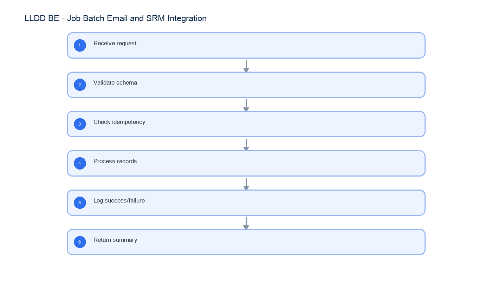

# LLDD BE - Job Batch Email and SRM Integration

SBP Mall - ระบบประกันรายได้ | Low Level Design Document

## 1. Overview

| รายการ | รายละเอียด |
| --- | --- |
| Track | BE |
| Estimate | 24 ชั่วโมง |
| Owner | Butsaba <But> Podamrong |
| Objective | ออกแบบ Backend contracts สำหรับ Batch Job Admin, interface tracking/pending ACK, Email Template Service และ SRM Integration Adapter |

Common contract reference: ทุกหัวข้อ API/FE ต้องยึด LLDD-BE-API-Common-Contracts และ LLDD-FE-Integration-Contracts สำหรับ error/auth/format/pagination/action/RBAC ก่อนลงรายละเอียดเฉพาะหน้าหรือเฉพาะ endpoint

## 2. Screen / Functional Scope

- Batch Job Admin APIs ครบ 6 endpoints
- Interface tracking และ pending ACK APIs
- Job runner guard/history
- Notification adapter
- STA ACK callback
- SRM integration inbound is optional/reference

## 4. Implementation Flow Diagram (Reference)



_รูปที่ 1: Implementation flow reference: LLDD BE - Job Batch Email and SRM Integration_

## 5. Field, Format, and Validation

| Field / UI | Format | Validation | Behavior |
| --- | --- | --- | --- |
| jobNo | string | required | maps to job registry |
| sourceRefNo | string | required for SRM | idempotency key |
| templateCode | EM-xx | required | email template key |
| transactionId | uuid | generated | integration log key |

## 5.1 Input / Progress / Output Contract

| Stage | Contract for implementation |
| --- | --- |
| Input | GET /api/v1/jobs; GET /api/v1/jobs/{jobNo}; PUT /api/v1/jobs/{jobNo}/params |
| Progress | Receive request; Validate schema; Check idempotency; Process records |
| Output | job_configs; job_run_histories; interface_transactions |

### 5.90 Endpoint Implementation Contract

| Endpoint | Use-case owner | Service/repository behavior | Definition of done |
| --- | --- | --- | --- |
| GET /api/v1/jobs | รายการ 11 job entry points พร้อมสถานะล่าสุด | Receive request | job run guard prevents duplicate running job |
| GET /api/v1/jobs/{jobNo} | รายละเอียด job และ typed parameter metadata | Validate schema | SRM duplicate skipped |
| PUT /api/v1/jobs/{jobNo}/params | บันทึกเฉพาะ parameter key ที่ metadata ระบุ editable | Check idempotency | email preview renders variables |
| PUT /api/v1/jobs/{jobNo}/enabled | เปิด/ปิด job พร้อม audit reason | Process records | failed records include detail |
| POST /api/v1/jobs/{jobNo}/run | สั่ง manual run/retry โดยตรวจ enabled และ concurrent run | Log success/failure | job run guard prevents duplicate running job |
| GET /api/v1/jobs/{jobNo}/runs | ประวัติการรันแบบแบ่งหน้า | Return summary | SRM duplicate skipped |
| GET /api/v1/interfaces/tracking | ค้นสถานะ interface ตาม dataset/business key/status/ช่วงเวลา | Receive request | email preview renders variables |
| GET /api/v1/interfaces/pending-ack | รายการ ACK ค้างตาม watchdog rule อายุอย่างน้อย 1 วัน | Validate schema | failed records include detail |
| GET /api/v1/email-templates/{code} | อ่าน template และ merge-variable metadata | Check idempotency | job run guard prevents duplicate running job |
| PUT /api/v1/email-templates/{code} | บันทึก subject/body | Process records | SRM duplicate skipped |
| POST /api/v1/email-templates/{code}/preview | render template โดยไม่บันทึก | Log success/failure | email preview renders variables |
| POST /api/v1/email-templates/{code}/reset | รีเซ็ต template รายตัว | Return summary | failed records include detail |
| POST /api/v1/interfaces/sta/ack | STA ACK callback ให้ Job 10 เป็น safety net | Receive request | job run guard prevents duplicate running job |
| POST /api/v1/integrations/srm/income-guarantee | รับข้อมูลประกันรายได้จาก SRM | Validate schema | SRM duplicate skipped |

### 5.91 Backend Execution Sequence

| Step | Behavior specific to this LLDD | Failure/test evidence |
| --- | --- | --- |
| 1 | Receive request | run job |
| 2 | Validate schema | run duplicate |
| 3 | Check idempotency | SRM missing field |
| 4 | Process records | SRM duplicate |
| 5 | Log success/failure | email preview |
| 6 | Return summary | template save |

## 6. Button / User Action Mapping

| Action | Trigger | API / Service | Expected Result |
| --- | --- | --- | --- |
| Run job | POST | jobRunner.run | queued/run history |
| Receive SRM | POST | srmIntegration.ingest | transaction result |
| Preview email | POST | emailTemplate.render | merged subject/body |

## 7. API Contract

### GET /api/v1/jobs

รายการ 11 job entry points พร้อมสถานะล่าสุด

#### Query Params

```json
{
  "page": 1,
  "size": 20
}
```

#### Request Field Schema

| Field | Type | Required | Constraint / Meaning |
| --- | --- | --- | --- |
| page | integer | No | >= 1; default 1 |
| size | integer | No | 1..100; default 20 |

#### Response

```json
{
  "page": 1,
  "size": 20,
  "total": 11,
  "items": [
    {
      "jobNo": "8b",
      "name": "StartInternalWorkflow",
      "enabled": true,
      "scheduleMode": "AFTER_JOB",
      "scheduleExpression": "8",
      "currentStatus": "SUCCESS",
      "lastRunId": 4451,
      "lastRunAt": "2026-07-22T05:35:00+07:00"
    }
  ]
}
```

#### Response Field Schema

| Field | Type | Required | Constraint / Meaning |
| --- | --- | --- | --- |
| page | integer | Yes | >= 1; default 1 |
| size | integer | Yes | 1..100; default 20 |
| total | integer | Yes | UTF-8; use value domain described by endpoint purpose |
| items | array<object> | Yes | JSON array; element type shown in Type column |
| items[].jobNo | string | Yes | UTF-8; use value domain described by endpoint purpose |
| items[].name | string | Yes | UTF-8; use value domain described by endpoint purpose |
| items[].enabled | boolean | Yes | UTF-8; use value domain described by endpoint purpose |
| items[].scheduleMode | string | Yes | UTF-8; use value domain described by endpoint purpose |
| items[].scheduleExpression | string | Yes | UTF-8; use value domain described by endpoint purpose |
| items[].currentStatus | string | Yes | UTF-8; use value domain described by endpoint purpose |
| items[].lastRunId | integer | Yes | UTF-8; use value domain described by endpoint purpose |
| items[].lastRunAt | string | Yes | ISO-8601 ค.ศ.; nullable only when type includes null |

### GET /api/v1/jobs/{jobNo}

รายละเอียด job และ typed parameter metadata

#### Query Params

```json
{
  "jobNo": "8b"
}
```

#### Request Field Schema

| Field | Type | Required | Constraint / Meaning |
| --- | --- | --- | --- |
| jobNo | string | No | UTF-8; use value domain described by endpoint purpose |

#### Response

```json
{
  "jobNo": "8b",
  "name": "StartInternalWorkflow",
  "enabled": true,
  "scheduleMode": "AFTER_JOB",
  "scheduleExpression": "8",
  "parameters": [
    {
      "key": "period",
      "label": "งวดข้อมูล",
      "type": "MONTH",
      "value": "2026-07",
      "editable": true,
      "required": true
    }
  ]
}
```

#### Response Field Schema

| Field | Type | Required | Constraint / Meaning |
| --- | --- | --- | --- |
| jobNo | string | Yes | UTF-8; use value domain described by endpoint purpose |
| name | string | Yes | UTF-8; use value domain described by endpoint purpose |
| enabled | boolean | Yes | UTF-8; use value domain described by endpoint purpose |
| scheduleMode | string | Yes | UTF-8; use value domain described by endpoint purpose |
| scheduleExpression | string | Yes | UTF-8; use value domain described by endpoint purpose |
| parameters | array<object> | Yes | JSON array; element type shown in Type column |
| parameters[].key | string | Yes | UTF-8; use value domain described by endpoint purpose |
| parameters[].label | string | Yes | UTF-8; use value domain described by endpoint purpose |
| parameters[].type | string | Yes | UTF-8; use value domain described by endpoint purpose |
| parameters[].value | string | Yes | UTF-8; use value domain described by endpoint purpose |
| parameters[].editable | boolean | Yes | UTF-8; use value domain described by endpoint purpose |
| parameters[].required | boolean | Yes | UTF-8; use value domain described by endpoint purpose |

### PUT /api/v1/jobs/{jobNo}/params

บันทึกเฉพาะ parameter key ที่ metadata ระบุ editable

#### Request

```json
{
  "params": {
    "period": "2026-07"
  },
  "reason": "ปรับงวด rerun"
}
```

#### Request Field Schema

| Field | Type | Required | Constraint / Meaning |
| --- | --- | --- | --- |
| params | object | Yes | JSON object; nested fields listed below |
| params.period | string | Yes | UTF-8; use value domain described by endpoint purpose |
| reason | string | Yes | trimmed UTF-8 Thai text; required by operation/business rule |

#### Response

```json
{
  "jobNo": "8b",
  "configVersion": 12,
  "updatedKeys": [
    "period"
  ],
  "message": "saved"
}
```

#### Response Field Schema

| Field | Type | Required | Constraint / Meaning |
| --- | --- | --- | --- |
| jobNo | string | Yes | UTF-8; use value domain described by endpoint purpose |
| configVersion | integer | Yes | UTF-8; use value domain described by endpoint purpose |
| updatedKeys | array<string> | Yes | JSON array; element type shown in Type column |
| message | string | Yes | UTF-8; use value domain described by endpoint purpose |

### PUT /api/v1/jobs/{jobNo}/enabled

เปิด/ปิด job พร้อม audit reason

#### Request

```json
{
  "enabled": false,
  "reason": "ปิดชั่วคราวช่วงปิดงบ"
}
```

#### Request Field Schema

| Field | Type | Required | Constraint / Meaning |
| --- | --- | --- | --- |
| enabled | boolean | Yes | UTF-8; use value domain described by endpoint purpose |
| reason | string | Yes | trimmed UTF-8 Thai text; required by operation/business rule |

#### Response

```json
{
  "jobNo": "8b",
  "enabled": false,
  "message": "saved"
}
```

#### Response Field Schema

| Field | Type | Required | Constraint / Meaning |
| --- | --- | --- | --- |
| jobNo | string | Yes | UTF-8; use value domain described by endpoint purpose |
| enabled | boolean | Yes | UTF-8; use value domain described by endpoint purpose |
| message | string | Yes | UTF-8; use value domain described by endpoint purpose |

### POST /api/v1/jobs/{jobNo}/run

สั่ง manual run/retry โดยตรวจ enabled และ concurrent run

#### Request

```json
{
  "params": {
    "period": "2026-07"
  },
  "reason": "rerun หลังแก้ข้อมูล"
}
```

#### Request Field Schema

| Field | Type | Required | Constraint / Meaning |
| --- | --- | --- | --- |
| params | object | Yes | JSON object; nested fields listed below |
| params.period | string | Yes | UTF-8; use value domain described by endpoint purpose |
| reason | string | Yes | trimmed UTF-8 Thai text; required by operation/business rule |

#### Response

```json
{
  "runId": 4452,
  "jobNo": "8b",
  "status": "QUEUED",
  "queuedAt": "2026-07-22T11:00:00+07:00"
}
```

#### Response Field Schema

| Field | Type | Required | Constraint / Meaning |
| --- | --- | --- | --- |
| runId | integer | Yes | UTF-8; use value domain described by endpoint purpose |
| jobNo | string | Yes | UTF-8; use value domain described by endpoint purpose |
| status | string | Yes | UTF-8; use value domain described by endpoint purpose |
| queuedAt | string | Yes | ISO-8601 ค.ศ.; nullable only when type includes null |

### GET /api/v1/jobs/{jobNo}/runs

ประวัติการรันแบบแบ่งหน้า

#### Query Params

```json
{
  "status": "FAILED",
  "page": 1,
  "size": 20
}
```

#### Request Field Schema

| Field | Type | Required | Constraint / Meaning |
| --- | --- | --- | --- |
| status | string | No | UTF-8; use value domain described by endpoint purpose |
| page | integer | No | >= 1; default 1 |
| size | integer | No | 1..100; default 20 |

#### Response

```json
{
  "page": 1,
  "size": 20,
  "total": 1,
  "items": [
    {
      "runId": 4450,
      "jobNo": "8b",
      "status": "FAILED",
      "triggerType": "MANUAL",
      "triggeredBy": "E001",
      "startedAt": "2026-07-22T05:20:00+07:00",
      "endedAt": "2026-07-22T05:21:30+07:00",
      "durationSec": 90,
      "readCount": 10,
      "successCount": 9,
      "rejectCount": 1,
      "errorCode": "GEN_FLOW_GATE_NOT_READY",
      "errorMessage": "ข้อมูลผู้อนุมัติยังไม่ครบ"
    }
  ]
}
```

#### Response Field Schema

| Field | Type | Required | Constraint / Meaning |
| --- | --- | --- | --- |
| page | integer | Yes | >= 1; default 1 |
| size | integer | Yes | 1..100; default 20 |
| total | integer | Yes | UTF-8; use value domain described by endpoint purpose |
| items | array<object> | Yes | JSON array; element type shown in Type column |
| items[].runId | integer | Yes | UTF-8; use value domain described by endpoint purpose |
| items[].jobNo | string | Yes | UTF-8; use value domain described by endpoint purpose |
| items[].status | string | Yes | UTF-8; use value domain described by endpoint purpose |
| items[].triggerType | string | Yes | UTF-8; use value domain described by endpoint purpose |
| items[].triggeredBy | string | Yes | UTF-8; use value domain described by endpoint purpose |
| items[].startedAt | string | Yes | ISO-8601 ค.ศ.; nullable only when type includes null |
| items[].endedAt | string | Yes | ISO-8601 ค.ศ.; nullable only when type includes null |
| items[].durationSec | integer | Yes | UTF-8; use value domain described by endpoint purpose |
| items[].readCount | integer | Yes | UTF-8; use value domain described by endpoint purpose |
| items[].successCount | integer | Yes | UTF-8; use value domain described by endpoint purpose |
| items[].rejectCount | integer | Yes | UTF-8; use value domain described by endpoint purpose |
| items[].errorCode | string | Yes | UTF-8; use value domain described by endpoint purpose |
| items[].errorMessage | string | Yes | UTF-8; use value domain described by endpoint purpose |

### GET /api/v1/interfaces/tracking

ค้นสถานะ interface ตาม dataset/business key/status/ช่วงเวลา

#### Query Params

```json
{
  "dataName": "COMPENSATE_INIT_I",
  "status": "SENT",
  "pending": true,
  "sentFrom": "2026-07-01T00:00:00+07:00",
  "sentTo": "2026-07-22T23:59:59+07:00",
  "page": 1,
  "size": 20
}
```

#### Request Field Schema

| Field | Type | Required | Constraint / Meaning |
| --- | --- | --- | --- |
| dataName | string | No | UTF-8; use value domain described by endpoint purpose |
| status | string | No | UTF-8; use value domain described by endpoint purpose |
| pending | boolean | No | UTF-8; use value domain described by endpoint purpose |
| sentFrom | string | No | UTF-8; use value domain described by endpoint purpose |
| sentTo | string | No | UTF-8; use value domain described by endpoint purpose |
| page | integer | No | >= 1; default 1 |
| size | integer | No | 1..100; default 20 |

#### Response

```json
{
  "page": 1,
  "size": 20,
  "total": 1,
  "items": [
    {
      "trackingId": 9912,
      "dataName": "COMPENSATE_INIT_I",
      "direction": "OUT",
      "businessKey": "2569/00098",
      "docNo": "2569/00098",
      "fileName": "COMPENSATE_INIT_I_25690722.dat",
      "status": "SENT",
      "sentAt": "2026-07-20T17:02:00+07:00",
      "ackedAt": null,
      "returnCode": null,
      "ageHours": 41
    }
  ]
}
```

#### Response Field Schema

| Field | Type | Required | Constraint / Meaning |
| --- | --- | --- | --- |
| page | integer | Yes | >= 1; default 1 |
| size | integer | Yes | 1..100; default 20 |
| total | integer | Yes | UTF-8; use value domain described by endpoint purpose |
| items | array<object> | Yes | JSON array; element type shown in Type column |
| items[].trackingId | integer | Yes | UTF-8; use value domain described by endpoint purpose |
| items[].dataName | string | Yes | UTF-8; use value domain described by endpoint purpose |
| items[].direction | string | Yes | UTF-8; use value domain described by endpoint purpose |
| items[].businessKey | string | Yes | UTF-8; use value domain described by endpoint purpose |
| items[].docNo | string | Yes | พ.ศ. YYYY/xxxxx |
| items[].fileName | string | Yes | UTF-8; use value domain described by endpoint purpose |
| items[].status | string | Yes | UTF-8; use value domain described by endpoint purpose |
| items[].sentAt | string | Yes | ISO-8601 ค.ศ.; nullable only when type includes null |
| items[].ackedAt | string \| null | No | ISO-8601 ค.ศ.; nullable only when type includes null |
| items[].returnCode | string \| null | No | UTF-8; use value domain described by endpoint purpose |
| items[].ageHours | integer | Yes | UTF-8; use value domain described by endpoint purpose |

### GET /api/v1/interfaces/pending-ack

รายการ ACK ค้างตาม watchdog rule อายุอย่างน้อย 1 วัน

#### Query Params

```json
{
  "thresholdHours": 24,
  "dataName": "COMPENSATE_INIT_I",
  "page": 1,
  "size": 20
}
```

#### Request Field Schema

| Field | Type | Required | Constraint / Meaning |
| --- | --- | --- | --- |
| thresholdHours | integer | No | UTF-8; use value domain described by endpoint purpose |
| dataName | string | No | UTF-8; use value domain described by endpoint purpose |
| page | integer | No | >= 1; default 1 |
| size | integer | No | 1..100; default 20 |

#### Response

```json
{
  "page": 1,
  "size": 20,
  "total": 1,
  "count": 1,
  "items": [
    {
      "trackingId": 9912,
      "dataName": "COMPENSATE_INIT_I",
      "businessKey": "2569/00098",
      "docNo": "2569/00098",
      "fileName": "COMPENSATE_INIT_I_25690722.dat",
      "sentAt": "2026-07-20T17:02:00+07:00",
      "ageHours": 41,
      "returnCode": null
    }
  ]
}
```

#### Response Field Schema

| Field | Type | Required | Constraint / Meaning |
| --- | --- | --- | --- |
| page | integer | Yes | >= 1; default 1 |
| size | integer | Yes | 1..100; default 20 |
| total | integer | Yes | UTF-8; use value domain described by endpoint purpose |
| count | integer | Yes | UTF-8; use value domain described by endpoint purpose |
| items | array<object> | Yes | JSON array; element type shown in Type column |
| items[].trackingId | integer | Yes | UTF-8; use value domain described by endpoint purpose |
| items[].dataName | string | Yes | UTF-8; use value domain described by endpoint purpose |
| items[].businessKey | string | Yes | UTF-8; use value domain described by endpoint purpose |
| items[].docNo | string | Yes | พ.ศ. YYYY/xxxxx |
| items[].fileName | string | Yes | UTF-8; use value domain described by endpoint purpose |
| items[].sentAt | string | Yes | ISO-8601 ค.ศ.; nullable only when type includes null |
| items[].ageHours | integer | Yes | UTF-8; use value domain described by endpoint purpose |
| items[].returnCode | string \| null | No | UTF-8; use value domain described by endpoint purpose |

### GET /api/v1/email-templates/{code}

อ่าน template และ merge-variable metadata

#### Query Params

```json
{
  "code": "EM-01"
}
```

#### Request Field Schema

| Field | Type | Required | Constraint / Meaning |
| --- | --- | --- | --- |
| code | string | No | UTF-8; use value domain described by endpoint purpose |

#### Response

```json
{
  "code": "EM-01",
  "name": "แจ้งสร้างเอกสาร",
  "subject": "เอกสาร {{docNo}}",
  "body": "กรุณาตรวจสอบเอกสาร {{docNo}}",
  "variables": [
    "docNo"
  ],
  "fromRule": "SYSTEM",
  "toRule": "NEXT_SECTION",
  "ccRule": "NONE"
}
```

#### Response Field Schema

| Field | Type | Required | Constraint / Meaning |
| --- | --- | --- | --- |
| code | string | Yes | UTF-8; use value domain described by endpoint purpose |
| name | string | Yes | UTF-8; use value domain described by endpoint purpose |
| subject | string | Yes | UTF-8; use value domain described by endpoint purpose |
| body | string | Yes | UTF-8; use value domain described by endpoint purpose |
| variables | array<string> | Yes | JSON array; element type shown in Type column |
| fromRule | string | Yes | UTF-8; use value domain described by endpoint purpose |
| toRule | string | Yes | UTF-8; use value domain described by endpoint purpose |
| ccRule | string | Yes | UTF-8; use value domain described by endpoint purpose |

### PUT /api/v1/email-templates/{code}

บันทึก subject/body

#### Request

```json
{
  "subject": "แจ้งเอกสาร {{docNo}}",
  "body": "กรุณาตรวจสอบเอกสาร {{docNo}}",
  "reason": "ปรับถ้อยคำ"
}
```

#### Request Field Schema

| Field | Type | Required | Constraint / Meaning |
| --- | --- | --- | --- |
| subject | string | Yes | UTF-8; use value domain described by endpoint purpose |
| body | string | Yes | UTF-8; use value domain described by endpoint purpose |
| reason | string | Yes | trimmed UTF-8 Thai text; required by operation/business rule |

#### Response

```json
{
  "code": "EM-01",
  "subject": "แจ้งเอกสาร {{docNo}}",
  "body": "กรุณาตรวจสอบเอกสาร {{docNo}}",
  "updatedAt": "2026-07-22T10:20:00+07:00"
}
```

#### Response Field Schema

| Field | Type | Required | Constraint / Meaning |
| --- | --- | --- | --- |
| code | string | Yes | UTF-8; use value domain described by endpoint purpose |
| subject | string | Yes | UTF-8; use value domain described by endpoint purpose |
| body | string | Yes | UTF-8; use value domain described by endpoint purpose |
| updatedAt | string | Yes | ISO-8601 ค.ศ.; nullable only when type includes null |

### POST /api/v1/email-templates/{code}/preview

render template โดยไม่บันทึก

#### Request

```json
{
  "variables": {
    "docNo": "2569/00123"
  }
}
```

#### Request Field Schema

| Field | Type | Required | Constraint / Meaning |
| --- | --- | --- | --- |
| variables | object | Yes | JSON object; nested fields listed below |
| variables.docNo | string | Yes | พ.ศ. YYYY/xxxxx |

#### Response

```json
{
  "subject": "แจ้งเอกสาร 2569/00123",
  "body": "กรุณาตรวจสอบเอกสาร 2569/00123"
}
```

#### Response Field Schema

| Field | Type | Required | Constraint / Meaning |
| --- | --- | --- | --- |
| subject | string | Yes | UTF-8; use value domain described by endpoint purpose |
| body | string | Yes | UTF-8; use value domain described by endpoint purpose |

### POST /api/v1/email-templates/{code}/reset

รีเซ็ต template รายตัว

#### Request

```json
{
  "reason": "คืนค่าเริ่มต้น"
}
```

#### Request Field Schema

| Field | Type | Required | Constraint / Meaning |
| --- | --- | --- | --- |
| reason | string | Yes | trimmed UTF-8 Thai text; required by operation/business rule |

#### Response

```json
{
  "code": "EM-01",
  "reset": true
}
```

#### Response Field Schema

| Field | Type | Required | Constraint / Meaning |
| --- | --- | --- | --- |
| code | string | Yes | UTF-8; use value domain described by endpoint purpose |
| reset | boolean | Yes | UTF-8; use value domain described by endpoint purpose |

### POST /api/v1/interfaces/sta/ack

STA ACK callback ให้ Job 10 เป็น safety net

#### Request

```json
{
  "transactionId": "TX-001",
  "returnCode": "A",
  "receivedAt": "2026-07-20T10:00:00+07:00"
}
```

#### Request Field Schema

| Field | Type | Required | Constraint / Meaning |
| --- | --- | --- | --- |
| transactionId | string | Yes | UTF-8; use value domain described by endpoint purpose |
| returnCode | string | Yes | UTF-8; use value domain described by endpoint purpose |
| receivedAt | string | Yes | ISO-8601 ค.ศ.; nullable only when type includes null |

#### Response

```json
{
  "message": "acknowledged"
}
```

#### Response Field Schema

| Field | Type | Required | Constraint / Meaning |
| --- | --- | --- | --- |
| message | string | Yes | UTF-8; use value domain described by endpoint purpose |

### POST /api/v1/integrations/srm/income-guarantee

รับข้อมูลประกันรายได้จาก SRM

#### Request

```json
{
  "sourceSystem": "SRM",
  "sourceRefNo": "SRM-001",
  "impactedStoreCode": "01234",
  "periodMonth": "2569-07"
}
```

#### Request Field Schema

| Field | Type | Required | Constraint / Meaning |
| --- | --- | --- | --- |
| sourceSystem | string | Yes | UTF-8; use value domain described by endpoint purpose |
| sourceRefNo | string | Yes | UTF-8; use value domain described by endpoint purpose |
| impactedStoreCode | string | Yes | exactly 5 digits; preserve leading zero |
| periodMonth | string | Yes | ISO-8601 ค.ศ.; nullable only when type includes null |

#### Response

```json
{
  "transactionId": "TX-001",
  "successRecords": 1,
  "failedRecords": 0
}
```

#### Response Field Schema

| Field | Type | Required | Constraint / Meaning |
| --- | --- | --- | --- |
| transactionId | string | Yes | UTF-8; use value domain described by endpoint purpose |
| successRecords | integer | Yes | UTF-8; use value domain described by endpoint purpose |
| failedRecords | integer | Yes | UTF-8; use value domain described by endpoint purpose |

## 8. Reference DB Mapping (No Database Page Work)

ส่วนนี้เป็นข้อมูลอ้างอิงสำหรับการ implement API/Job เท่านั้น ไม่ใช่งานสร้างหน้า Database, ไม่ใช่งานออกแบบ DB page และไม่ถูกนับเป็น deliverable แยกของ FE/BE

| Table / Object | R/W | Usage |
| --- | --- | --- |
| job_configs | R/W | enabled, cron, params ของ batch |
| job_run_histories | R/W | ประวัติการรันและสถานะล่าสุด |
| interface_transactions | R/W | tracking file/API interface และ ACK |
| email_templates | R/W | subject/body template |
| status_email_rules | R | TO/CC ตามสถานะ |
| audit_logs | R/W | audit การแก้ job/email |

## 9. Processing Flow

| Step | Description |
| --- | --- |
| 1 | Receive request |
| 2 | Validate schema |
| 3 | Check idempotency |
| 4 | Process records |
| 5 | Log success/failure |
| 6 | Return summary |

## 10. Acceptance Criteria

- job run guard prevents duplicate running job
- SRM duplicate skipped
- email preview renders variables
- failed records include detail

## 11. Developer Test Checklist

| No | Test |
| --- | --- |
| 1 | run job |
| 2 | run duplicate |
| 3 | SRM missing field |
| 4 | SRM duplicate |
| 5 | email preview |
| 6 | template save |
