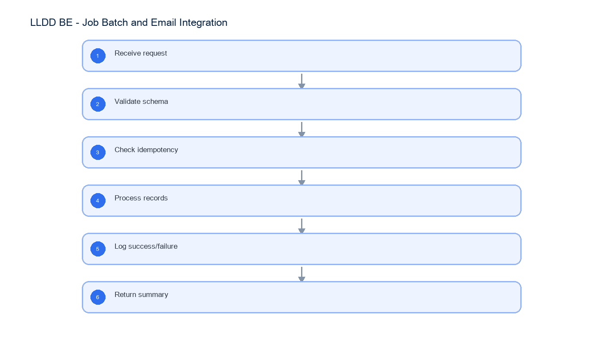

# LLDD BE - Job Batch and Email Integration

SBP Mall - ระบบประกันรายได้ | Low Level Design Document

## 1. Overview

| รายการ | รายละเอียด |
| --- | --- |
| Track | BE |
| Estimate | **19 ชั่วโมง** = implementation 14 + unit test 5 (30%) |
| Owner | Peerakorn <Pete> Sakunkaewphithak |
| Target repository | `SBP/srm-sps-spsap-store-backend` (NestJS + TypeORM · schema `sps_store`) + `SBP/srm-sps-spsap-sbp-bff` (forward ผ่าน client service · ไม่มี DB) สำหรับเส้นที่ FE เรียก |
| Objective | ออกแบบ Backend contracts สำหรับ batch runner (อ่าน config จาก backend), interface tracking/pending ACK และ Notification Service (ส่งผ่าน @gosoft-sbp/email-lib) — ไม่มี Job Admin API, Email Template API (2026-08-06) และไม่มี SRM inbound adapter แล้ว (2026-08-07) |

Common contract reference: ทุกหัวข้อ API/FE ต้องยึด LLDD-BE-API-Common-Contracts และ LLDD-FE-Integration-Contracts สำหรับ error/auth/format/pagination/action/RBAC ก่อนลงรายละเอียดเฉพาะหน้าหรือเฉพาะ endpoint

## 2. Screen / Functional Scope

- Interface tracking และ pending ACK APIs (3 เส้น)
- Job runner guard และ application log
- Notification adapter ผ่าน @gosoft-sbp/email-lib
- STA ACK callback
- ไม่มี Batch Job Admin API และไม่มี inbound endpoint ของ SRM

## 3. Screenshot Reference

ไม่มีภาพหน้าจอสำหรับหัวข้อนี้ — เป็นเอกสารฝั่ง Backend/Batch ที่ไม่มี UI (ภาพหน้าจอทั้งหมดอยู่ในเอกสารชุด FE)

## 4. Implementation Flow Diagram (Reference)



_รูปที่ 1: Implementation flow reference: LLDD BE - Job Batch and Email Integration_

## 5. Field, Format, and Validation

| Field / UI | Format | Validation | Behavior |
| --- | --- | --- | --- |
| jobNo | string | required | maps to job registry |
| sourceRefNo | string | required for SRM | idempotency key |
| templateCode | EM-xx | required | email template key |
| transactionId | uuid | generated | integration log key |

### 5.9 Input / Progress / Output Contract

| Stage | Contract for implementation |
| --- | --- |
| Input | GET /api/v1/interfaces/tracking; GET /api/v1/interfaces/pending-ack; POST /api/v1/interfaces/sta/ack |
| Progress | Receive request; Validate schema; Check idempotency; Process records |
| Output | (application log แบบ structured); interface_transactions |

### 5.90 Endpoint Implementation Contract

| Endpoint | Use-case owner | Service/repository behavior | Definition of done |
| --- | --- | --- | --- |
| GET /api/v1/interfaces/tracking | ค้นสถานะ interface ตาม dataset/business key/status/ช่วงเวลา | Receive request | job run guard prevents duplicate running job |
| GET /api/v1/interfaces/pending-ack | รายการ ACK ค้างตาม watchdog rule อายุอย่างน้อย 1 วัน | Validate schema | email preview renders variables |
| POST /api/v1/interfaces/sta/ack | STA ACK callback ให้ Job 10 เป็น safety net | Check idempotency | failed records include detail |

### 5.91 Backend Execution Sequence

| Step | Behavior specific to this LLDD | Failure/test evidence |
| --- | --- | --- |
| 1 | Receive request | run job |
| 2 | Validate schema | run duplicate |
| 3 | Check idempotency | interface tracking filter |
| 4 | Process records | pending ACK watchdog |
| 5 | Log success/failure | STA ACK callback |
| 6 | Return summary | email preview |

## 6. Button / User Action Mapping

| Action | Trigger | API / Service | Expected Result |
| --- | --- | --- | --- |
| Run job | POST | jobRunner.run | queued/run history |
| Receive SRM | POST | srmIntegration.ingest | transaction result |
| Preview email | POST | emailTemplate.render | merged subject/body |

## 7. API Contract

### GET /api/v1/interfaces/tracking

ค้นสถานะ interface ตาม dataset/business key/status/ช่วงเวลา

#### Query Params

```json
{
  "dataName": "COMPENSATE_INIT_I",
  "status": "SENT",
  "pending": true,
  "sentFrom": "2026-07-01T00:00:00+07:00",
  "sentTo": "2026-07-22T23:59:59+07:00",
  "page": 1,
  "size": 20
}
```

#### Request Field Schema

| Field | Type | Required | Constraint / Meaning |
| --- | --- | --- | --- |
| dataName | string | No | UTF-8; use value domain described by endpoint purpose |
| status | string | No | UTF-8; use value domain described by endpoint purpose |
| pending | boolean | No | UTF-8; use value domain described by endpoint purpose |
| sentFrom | string | No | UTF-8; use value domain described by endpoint purpose |
| sentTo | string | No | UTF-8; use value domain described by endpoint purpose |
| page | integer | No | >= 1; default 1 |
| size | integer | No | 1..100; default 20 |

#### Response

```json
{
  "page": 1,
  "size": 20,
  "total": 1,
  "items": [
    {
      "trackingId": 9912,
      "dataName": "COMPENSATE_INIT_I",
      "direction": "OUT",
      "businessKey": "2026/00098",
      "docNo": "2026/00098",
      "fileName": "COMPENSATE_INIT_I_25690722.dat",
      "status": "SENT",
      "sentAt": "2026-07-20T17:02:00+07:00",
      "ackedAt": null,
      "returnCode": null,
      "ageHours": 41
    }
  ]
}
```

#### Response Field Schema

| Field | Type | Required | Constraint / Meaning |
| --- | --- | --- | --- |
| page | integer | Yes | >= 1; default 1 |
| size | integer | Yes | 1..100; default 20 |
| total | integer | Yes | UTF-8; use value domain described by endpoint purpose |
| items | array<object> | Yes | JSON array; element type shown in Type column |
| items[].trackingId | integer | Yes | UTF-8; use value domain described by endpoint purpose |
| items[].dataName | string | Yes | UTF-8; use value domain described by endpoint purpose |
| items[].direction | string | Yes | UTF-8; use value domain described by endpoint purpose |
| items[].businessKey | string | Yes | UTF-8; use value domain described by endpoint purpose |
| items[].docNo | string | Yes | ค.ศ. YYYY/xxxxx |
| items[].fileName | string | Yes | UTF-8; use value domain described by endpoint purpose |
| items[].status | string | Yes | UTF-8; use value domain described by endpoint purpose |
| items[].sentAt | string | Yes | ISO-8601 ค.ศ.; nullable only when type includes null |
| items[].ackedAt | string \| null | No | ISO-8601 ค.ศ.; nullable only when type includes null |
| items[].returnCode | string \| null | No | UTF-8; use value domain described by endpoint purpose |
| items[].ageHours | integer | Yes | UTF-8; use value domain described by endpoint purpose |

### GET /api/v1/interfaces/pending-ack

รายการ ACK ค้างตาม watchdog rule อายุอย่างน้อย 1 วัน

#### Query Params

```json
{
  "thresholdHours": 24,
  "dataName": "COMPENSATE_INIT_I",
  "page": 1,
  "size": 20
}
```

#### Request Field Schema

| Field | Type | Required | Constraint / Meaning |
| --- | --- | --- | --- |
| thresholdHours | integer | No | UTF-8; use value domain described by endpoint purpose |
| dataName | string | No | UTF-8; use value domain described by endpoint purpose |
| page | integer | No | >= 1; default 1 |
| size | integer | No | 1..100; default 20 |

#### Response

```json
{
  "page": 1,
  "size": 20,
  "total": 1,
  "count": 1,
  "items": [
    {
      "trackingId": 9912,
      "dataName": "COMPENSATE_INIT_I",
      "businessKey": "2026/00098",
      "docNo": "2026/00098",
      "fileName": "COMPENSATE_INIT_I_25690722.dat",
      "sentAt": "2026-07-20T17:02:00+07:00",
      "ageHours": 41,
      "returnCode": null
    }
  ]
}
```

#### Response Field Schema

| Field | Type | Required | Constraint / Meaning |
| --- | --- | --- | --- |
| page | integer | Yes | >= 1; default 1 |
| size | integer | Yes | 1..100; default 20 |
| total | integer | Yes | UTF-8; use value domain described by endpoint purpose |
| count | integer | Yes | UTF-8; use value domain described by endpoint purpose |
| items | array<object> | Yes | JSON array; element type shown in Type column |
| items[].trackingId | integer | Yes | UTF-8; use value domain described by endpoint purpose |
| items[].dataName | string | Yes | UTF-8; use value domain described by endpoint purpose |
| items[].businessKey | string | Yes | UTF-8; use value domain described by endpoint purpose |
| items[].docNo | string | Yes | ค.ศ. YYYY/xxxxx |
| items[].fileName | string | Yes | UTF-8; use value domain described by endpoint purpose |
| items[].sentAt | string | Yes | ISO-8601 ค.ศ.; nullable only when type includes null |
| items[].ageHours | integer | Yes | UTF-8; use value domain described by endpoint purpose |
| items[].returnCode | string \| null | No | UTF-8; use value domain described by endpoint purpose |

### POST /api/v1/interfaces/sta/ack

STA ACK callback ให้ Job 10 เป็น safety net

#### Request

```json
{
  "transactionId": "TX-001",
  "returnCode": "A",
  "receivedAt": "2026-07-20T10:00:00+07:00"
}
```

#### Request Field Schema

| Field | Type | Required | Constraint / Meaning |
| --- | --- | --- | --- |
| transactionId | string | Yes | UTF-8; use value domain described by endpoint purpose |
| returnCode | string | Yes | UTF-8; use value domain described by endpoint purpose |
| receivedAt | string | Yes | ISO-8601 ค.ศ.; nullable only when type includes null |

#### Response

```json
{
  "message": "acknowledged"
}
```

#### Response Field Schema

| Field | Type | Required | Constraint / Meaning |
| --- | --- | --- | --- |
| message | string | Yes | UTF-8; use value domain described by endpoint purpose |

## 8. Reference DB Mapping (No Database Page Work)

ส่วนนี้เป็นข้อมูลอ้างอิงสำหรับการ implement API/Job เท่านั้น ไม่ใช่งานสร้างหน้า Database, ไม่ใช่งานออกแบบ DB page และไม่ถูกนับเป็น deliverable แยกของ FE/BE

| Table / Object | R/W | Usage |
| --- | --- | --- |
| (backend config: config file/env) | R | enabled, cron, params ของ batch — ตาราง job_configs ถูกตัด 2026-08-06 ไม่มีหน้าจอควบคุม |
| (application log แบบ structured) | W | ประวัติการรันและสถานะล่าสุด — ตาราง job_run_histories ถูกตัด 2026-08-06 |
| interface_transactions | R/W | tracking file/API interface และ ACK |
| email_template (SBP) | R | subject_format/body_format ของระบบ SBP เดิม — อ่านอย่างเดียว |
| email_sent (SBP) | W (โดย email-lib) | log การส่งของ batch — lib เขียนให้เอง |

## 9. Skeleton Code (store-backend + BFF)

โครงโค้ดตั้งต้นของเอกสารฉบับนี้ ยึด convention จริงของ `srm-sps-spsap-store-backend` (NestJS 11 + TypeORM, schema `sps_store`, custom provider `DATA_SOURCE` ที่ route SELECT ไป slave pool) และ `srm-sps-spsap-sbp-bff` (ไม่มี DB, forward ผ่าน client service). ทุกจุดที่ต้องเติมกำกับด้วย `// TODO:` และ response ทุกเส้นถูกห่อเป็น `{success, data}` โดย ResponseInterceptor อยู่แล้ว จึงห้าม service ห่อซ้ำ

#### 9.1 ผังไฟล์ที่ต้องสร้าง

| Path | หน้าที่ |
| --- | --- |
| store-backend · src/modules/sbpgi-job-batch-email-srm/sbpgi-job-batch-email-srm.controller.ts | route ทั้งหมดของเอกสารนี้ (3 เส้น) + `@UseGuards(HttpHeaderGuard)` + `@UserId()` |
| store-backend · src/modules/sbpgi-job-batch-email-srm/sbpgi-job-batch-email-srm.service.ts | business logic — inject `'DATA_SOURCE'` แล้วยิง raw SQL, mutation ใช้ QueryRunner transaction |
| store-backend · src/modules/sbpgi-job-batch-email-srm/sbpgi-job-batch-email-srm.sql.ts | เก็บ SQL ต่อ endpoint (คัดจากหัวข้อ 10) แยกออกจาก service ให้ทดสอบ/รีวิวง่าย |
| store-backend · src/modules/sbpgi-job-batch-email-srm/dto/sbpgi-job-batch-email-srm.dto.ts | DTO + class-validator ตาม validation ในหัวข้อฟิลด์ของเอกสารนี้ |
| store-backend · src/modules/sbpgi-job-batch-email-srm/sbpgi-job-batch-email-srm.module.ts | ประกอบ controller/service/providers แล้ว register ที่ `app.module.ts` |
| store-backend · src/entitys/interface-transactions.entity.ts | entity ของ `interface_transactions` (`@Entity({schema: process.env.DB_SCHEMA})`, ไม่ประกาศ relation) |
| store-backend · src/entitys/email-sent.entity.ts | entity ของ `email_sent` (`@Entity({schema: process.env.DB_SCHEMA})`, ไม่ประกาศ relation) |
| store-backend · src/providers/sbpgi/sbpgi.ts | repository provider แบบ factory ผูก token string กับ `DATA_SOURCE` — **ไฟล์ร่วมของทุกเอกสาร BE ให้ merge array เพิ่ม ห้ามเขียนทับ** |
| store-backend · sql/deploy-sbpgi-job-batch-email-srm.sql | DDL production แบบ idempotent (ทีมนี้ไม่ใช้ migration เป็นหลัก) |
| BFF · src/common/client-services/sbpgi-client.service.ts | client ต่อจาก `BaseClientService` ตั้ง baseUrl + `x-api-key` ตอน `onModuleInit` |
| BFF · src/modules/sbpgi-job-batch-email-srm/sbpgi-job-batch-email-srm.controller.ts | route ฝั่ง BFF prefix `/bff/sbpgi/…` + `@UseGuards(AuthGuard('jwt'))` |
| BFF · src/modules/sbpgi-job-batch-email-srm/sbpgi-job-batch-email-srm.service.ts | แนบ `x-user-id` / `x-user-group-id` / `x-user-permissions` แล้ว forward ไป backend |

#### 9.2 Controller (store-backend)

```ts
// src/modules/sbpgi-job-batch-email-srm/sbpgi-job-batch-email-srm.controller.ts
import { Body, Controller, Get, Post, Query, UseGuards } from '@nestjs/common';
import { HttpHeaderGuard } from '../../guards/http-header.guard';
import { UserId } from '../../common/decorators/user-id.decorator';
import { SbpgiJobBatchEmailSRMService } from './sbpgi-job-batch-email-srm.service';
import { JobBatchEmailSRMQueryDto, ReceiveAckStaBodyDto } from './dto/sbpgi-job-batch-email-srm.dto';

// LLDD BE - Job Batch and Email Integration
// BFF เรียกด้วย x-api-key และแนบ x-user-id / x-user-group-id / x-user-permissions มาให้
@Controller('sbpgi/interfaces')
@UseGuards(HttpHeaderGuard)
export class SbpgiJobBatchEmailSRMController {
  constructor(private readonly service: SbpgiJobBatchEmailSRMService) {}

  // GET /api/v1/interfaces/tracking — ค้นสถานะ interface ตาม dataset/business key/status/ช่วงเวลา
  @Get('tracking')
  getInterfacesTracking(@Query() query: JobBatchEmailSRMQueryDto, @UserId() userId: string) {
    // TODO: ตรวจ x-user-permissions ก่อนเรียก service ถ้า endpoint นี้จำกัดสิทธิ์เมนู
    return this.service.getInterfacesTracking(query, userId);
  }

  // GET /api/v1/interfaces/pending-ack — รายการ ACK ค้างตาม watchdog rule อายุอย่างน้อย 1 วัน
  @Get('pending-ack')
  getInterfacesPendingAck(@Query() query: JobBatchEmailSRMQueryDto, @UserId() userId: string) {
    // TODO: ตรวจ x-user-permissions ก่อนเรียก service ถ้า endpoint นี้จำกัดสิทธิ์เมนู
    return this.service.getInterfacesPendingAck(query, userId);
  }

  // POST /api/v1/interfaces/sta/ack — STA ACK callback ให้ Job 10 เป็น safety net
  @Post('sta/ack')
  receiveAckSta(@Body() body: ReceiveAckStaBodyDto, @UserId() userId: string) {
    // TODO: ตรวจ x-user-permissions ก่อนเรียก service ถ้า endpoint นี้จำกัดสิทธิ์เมนู
    return this.service.receiveAckSta(body, userId);
  }
}
```

#### 9.3 DTO + Validation

```ts
// src/modules/sbpgi-job-batch-email-srm/dto/sbpgi-job-batch-email-srm.dto.ts
import { Type } from 'class-transformer';
import {
  IsArray, IsBoolean, IsIn, IsInt, IsNotEmpty, IsNumber, IsObject, IsOptional,
  IsString, Matches, Max, MaxLength, Min,
} from 'class-validator';

// ValidationPipe ระดับ global ตั้ง whitelist + forbidNonWhitelisted + transform ไว้แล้ว (main.ts)
// property ที่ไม่ประกาศที่นี่จะถูก reject เป็น 400 อัตโนมัติ

// query ร่วมของ GET ทุกเส้นในโมดูลนี้ (path param ใช้ @Param แยก)
export class JobBatchEmailSRMQueryDto {
  @IsNotEmpty()
  @IsString()
  dataName: string;

  /** required เฉพาะบาง endpoint — ตรวจซ้ำใน service */
  @IsOptional()
  @IsString()
  status?: string;

  /** required เฉพาะบาง endpoint — ตรวจซ้ำใน service */
  @IsOptional()
  @Type(() => Boolean)
  @IsBoolean()
  pending?: boolean;

  /** required เฉพาะบาง endpoint — ตรวจซ้ำใน service */
  @IsOptional()
  @IsString()
  sentFrom?: string;

  /** required เฉพาะบาง endpoint — ตรวจซ้ำใน service */
  @IsOptional()
  @IsString()
  sentTo?: string;

  @IsOptional()
  @Type(() => Number)
  @IsInt()
  @Min(1)
  page?: number;

  // TODO: เพิ่ม property ที่เหลือของ payload นี้ให้ครบตามหัวข้อฟิลด์ของเอกสารนี้
}
```

```ts
// body ของ POST /api/v1/interfaces/sta/ack
export class ReceiveAckStaBodyDto {
  /** integration log key */
  @IsNotEmpty()
  @IsString()
  transactionId: string;

  @IsNotEmpty()
  @IsString()
  returnCode: string;

  @IsNotEmpty()
  @IsString()
  receivedAt: string;
}
```

#### 9.4 Service (inject `DATA_SOURCE` + raw SQL)

service ประกาศ method ครบทุกเส้นที่ controller เรียก และ **signature มาจากแหล่งเดียวกับ controller** (จำนวน/ลำดับพารามิเตอร์จึงตรงกันเสมอ) — เส้นที่ยังไม่ได้ implement เป็น stub ที่ `throw new NotImplementedException(...)` ให้ TypeScript compile ผ่านตั้งแต่วันแรก

```ts
// src/modules/sbpgi-job-batch-email-srm/sbpgi-job-batch-email-srm.service.ts
import { Inject, Injectable, Logger, NotFoundException, NotImplementedException } from '@nestjs/common';
import { DataSource } from 'typeorm';
import { SBPGI_SQL } from './sbpgi-job-batch-email-srm.sql';

@Injectable()
export class SbpgiJobBatchEmailSRMService {
  private readonly logger = new Logger(SbpgiJobBatchEmailSRMService.name);

  constructor(
    // DATA_SOURCE override query(): SELECT/WITH ไป slave pool, write ไป master
    @Inject('DATA_SOURCE') private readonly dataSource: DataSource,
  ) {}

  // GET /api/v1/interfaces/tracking — ค้นสถานะ interface ตาม dataset/business key/status/ช่วงเวลา
  async getInterfacesTracking(query: JobBatchEmailSRMQueryDto, userId: string) {
    const page = Number(query.page ?? 1);
    const size = Math.min(Number(query.size ?? 20), 100);
    // SQL เต็มอยู่ในหัวข้อ Database SQL ของเอกสารนี้ (คีย์ 'GET /api/v1/interfaces/tracking')
    // ⚠️ SQL ตัวอย่างบางเส้นเขียนด้วย named parameter (:size/:offset) แต่ dataSource.query()
    //    รับเฉพาะ positional $1..$n — ต้องแปลงชื่อเป็นลำดับก่อน หรือใช้ QueryBuilder แทน
    const rows = await this.dataSource.query(SBPGI_SQL.getInterfacesTracking, [
      // TODO: เรียงพารามิเตอร์ให้ตรงกับ $1..$n ของ SQL จริง
      userId, (page - 1) * size, size,
    ]);
    // TODO: total ต้องมาจาก COUNT(*) แยก query หรือ window function ไม่ใช่ rows.length
    return { page, size, total: rows.length, items: rows };
  }

  // GET /api/v1/interfaces/pending-ack — รายการ ACK ค้างตาม watchdog rule อายุอย่างน้อย 1 วัน
  async getInterfacesPendingAck(query: JobBatchEmailSRMQueryDto, userId: string) {
    // TODO: implement ตาม business rule ของ GET /api/v1/interfaces/pending-ack
    //       (SQL อยู่ในหัวข้อ Database SQL คีย์ 'GET /api/v1/interfaces/pending-ack')
    throw new NotImplementedException('getInterfacesPendingAck ยังไม่ implement');
  }

  // POST /api/v1/interfaces/sta/ack — STA ACK callback ให้ Job 10 เป็น safety net
  // mutation ต้องอยู่ใน transaction เดียว (ไม่มี audit ของ master แล้ว · 2026-08-07)
  async receiveAckSta(body: ReceiveAckStaBodyDto, userId: string) {
    const runner = this.dataSource.createQueryRunner();
    await runner.connect();
    await runner.startTransaction();
    try {
      // TODO: lock แถวเป้าหมายของ interface_transactions ด้วย SELECT ... FOR UPDATE ก่อนเขียน
      const [current] = await runner.query(SBPGI_SQL.receiveAckStaLock, [body.docNo]);
      if (!current) {
        throw new NotFoundException('ไม่พบข้อมูลที่ต้องการ');
      }
      await runner.query(SBPGI_SQL.receiveAckSta, [/* TODO: ผูกค่าจาก body */]);
      await runner.commitTransaction();
      return { message: 'saved' };
    } catch (error) {
      await runner.rollbackTransaction();
      this.logger.error(error);
      throw error;
    } finally {
      await runner.release();
    }
  }
}
```

#### 9.5 Entity (TypeORM)

```ts
// src/entitys/interface-transactions.entity.ts
import { Column, Entity, PrimaryColumn } from 'typeorm';

@Entity({ name: 'interface_transactions', schema: process.env.DB_SCHEMA })
export class InterfaceTransaction {
  @PrimaryColumn({ name: 'id', type: 'bigint' })
  id: number;

  @Column({ name: 'data_name', type: 'varchar', length: 50 })
  dataName: string;

  @Column({ name: 'direction', type: 'varchar', length: 3 })
  direction: string;

  @Column({ name: 'business_key', type: 'varchar', length: 100, nullable: true })
  businessKey?: string;

  @Column({ name: 'doc_no', type: 'varchar', length: 12, nullable: true })
  docNo?: string;

  @Column({ name: 'impact_process_id', type: 'bigint', nullable: true })
  impactProcessId?: number;

  @Column({ name: 'sales_summary_id', type: 'bigint', nullable: true })
  salesSummaryId?: number;

  @Column({ name: 'file_name', type: 'varchar', length: 255, nullable: true })
  fileName?: string;

  @Column({ name: 'status', type: 'varchar', length: 20 })
  status: string;

  @Column({ name: 'sent_at', type: 'timestamptz', nullable: true })
  sentAt?: Date;

  @Column({ name: 'acked_at', type: 'timestamptz', nullable: true })
  ackedAt?: Date;

  @Column({ name: 'return_code', type: 'varchar', length: 10, nullable: true })
  returnCode?: string;

  // TODO: ตรวจความยาว/precision กับ DDL จริงใน sql/deploy-sbpgi-*.sql ก่อน merge
  //       entity ชุดนี้ไม่ประกาศ relation ตาม convention (join ด้วย raw SQL)
}
```

```ts
// src/entitys/email-sent.entity.ts
import { Column, Entity, PrimaryColumn } from 'typeorm';

@Entity({ name: 'email_sent', schema: process.env.DB_SCHEMA })
export class EmailSent {
  @PrimaryColumn({ name: 'id', type: 'bigint' })
  id: number;

  // TODO: เติมคอลัมน์ที่เหลือของ email_sent ตาม database.md (Canonical Column Contract)
  //       และห้ามประกาศ relation — โมดูลนี้ join ด้วย raw SQL ตาม convention ของทีม
}
```

ตารางที่ **ไม่ต้องสร้าง entity** เพราะใช้ของระบบเดิม/workflow engine:

| Object | R/W | ใช้ของระบบเดิมตัวไหน |
| --- | --- | --- |
| email_template | R | email_template + email_sent + @gosoft-sbp/email-lib |

#### 9.6 Repository Providers + Module wiring

```ts
// src/providers/sbpgi/sbpgi.ts — repository provider แบบ factory (ไม่ใช้ TypeOrmModule.forFeature)
// convention ของโฟลเดอร์ providers คือ 1 ไฟล์ต่อโดเมน ตั้งชื่อตามโดเมน (business_user/business_user.ts,
// common_code/common_code.ts …) ไม่ใช่ index.ts
//
// ⚠️ ไฟล์นี้ใช้ร่วมกันทุกเอกสาร BE ของ SBPGI — ให้ **merge array เพิ่ม** เข้าไฟล์เดิม ห้ามเขียนทับ
//    (ชื่อ const แยกต่อเอกสารไว้แล้วเพื่อไม่ให้ชนกัน)
import { DataSource } from 'typeorm';
import { InterfaceTransaction } from '../../entitys/interface-transactions.entity';
import { EmailSent } from '../../entitys/email-sent.entity';

export const sbpgiJobBatchEmailSRMProviders = [
  {
    provide: 'INTERFACE_TRANSACTION_REPOSITORY',
    useFactory: (dataSource: DataSource) => dataSource.getRepository(InterfaceTransaction),
    inject: ['DATA_SOURCE'],
  },
  {
    provide: 'EMAIL_SENT_REPOSITORY',
    useFactory: (dataSource: DataSource) => dataSource.getRepository(EmailSent),
    inject: ['DATA_SOURCE'],
  },
];

// src/modules/sbpgi-job-batch-email-srm/sbpgi-job-batch-email-srm.module.ts
import { MiddlewareConsumer, Module, NestModule } from '@nestjs/common';
import { DatabaseModule } from '../../database/database.module';
// UserContextMiddleware อ่าน header x-user-id แล้วเซ็ต request.userId ที่ @UserId() ใช้
// — app.module.ts **ไม่ได้** apply แบบ global (มีแค่ HttpContext/LoggerContext) แต่ละโมดูลต้อง apply เอง
// (ดู evaluation-process.module.ts / inform-evaluate.module.ts / cooperation-request.module.ts)
import { UserContextMiddleware } from '../../common/middleware/user-context.middleware';
import { sbpgiJobBatchEmailSRMProviders } from '../../providers/sbpgi/sbpgi';
import { SbpgiJobBatchEmailSRMController } from './sbpgi-job-batch-email-srm.controller';
import { SbpgiJobBatchEmailSRMService } from './sbpgi-job-batch-email-srm.service';

@Module({
  imports: [DatabaseModule],
  controllers: [SbpgiJobBatchEmailSRMController],
  providers: [SbpgiJobBatchEmailSRMService, ...sbpgiJobBatchEmailSRMProviders],
  exports: [SbpgiJobBatchEmailSRMService],
})
export class SbpgiJobBatchEmailSRMModule implements NestModule {
  configure(consumer: MiddlewareConsumer) {
    // ถ้าไม่ apply ตรงนี้ userId จะเป็น undefined เงียบ ๆ ทุก endpoint
    consumer.apply(UserContextMiddleware).forRoutes(SbpgiJobBatchEmailSRMController);
  }
}
// TODO: register module นี้ใน app.module.ts (imports) พร้อมกับโมดูล SBPGI ตัวอื่น
```

#### 9.7 BFF Proxy (module + controller + client service)

BFF ยังไม่มีฟีเจอร์ประกันรายได้เลย จึงต้องสร้าง module ใหม่ + client service ใหม่ทั้งชุด และเลือก prefix แบบเดียวทั้งโมดูล (ที่นี่ใช้ `/bff/sbpgi/…`) เพื่อไม่ให้ปนแบบที่มี/ไม่มี `/bff` เหมือนโมดูลเดิม

```ts
// src/common/client-services/sbpgi-client.service.ts
import { Injectable, Logger, OnModuleInit } from '@nestjs/common';
import { BaseClientService } from './base-client.service';

@Injectable()
export class SbpgiClientService extends BaseClientService implements OnModuleInit {
  protected logger: Logger = new Logger(SbpgiClientService.name);

  onModuleInit() {
    // TODO: ถ้า deploy SBPGI แยก service ให้เพิ่ม API_SBPGI_BACKEND_* ใน AppConfigService
    //       ตอนนี้ชี้ store backend ตัวเดียวกับ StoreClientService
    this.defaultHeaders[this.config.api.store.key.name] = this.config.api.store.key.value;
    this.baseUrl = this.config.api.store.url;
  }
}
// BaseClientService แกะ { success, data } ให้แล้ว — service ฝั่ง BFF จึงได้ data ตรง ๆ
// TODO: เพิ่ม SbpgiClientService ใน providers/exports ของ ClientServiceModule (@Global)
```

```ts
// src/modules/sbpgi-job-batch-email-srm/sbpgi-job-batch-email-srm.service.ts (BFF)
import { Injectable } from '@nestjs/common';
import { SbpgiClientService } from '@common/client-services/sbpgi-client.service';

@Injectable()
export class SbpgiJobBatchEmailSRMBffService {
  constructor(private readonly client: SbpgiClientService) {}

  // BFF ไม่มี DB — หน้าที่เดียวคือแนบ user context แล้ว forward
  private userHeaders(user: any) {
    return {
      'x-user-id': user?.userId,
      'x-user-group-id': user?.groupId,
      'x-user-permissions': (user?.permissions ?? []).join(','),
    };
  }

  getInterfacesTracking(params: any, user: any) {
    return this.client.get('/api/v1/interfaces/tracking', { params, headers: this.userHeaders(user) });
  }

  getInterfacesPendingAck(params: any, user: any) {
    return this.client.get('/api/v1/interfaces/pending-ack', { params, headers: this.userHeaders(user) });
  }

  receiveAckSta(body: any, user: any) {
    return this.client.post('/api/v1/interfaces/sta/ack', body, { headers: this.userHeaders(user) });
  }
}

// ---------- src/modules/sbpgi-job-batch-email-srm/sbpgi-job-batch-email-srm.controller.ts (BFF) ----------
import { Body, Controller, Delete, Get, Param, Post, Put, Query, Req, UseGuards } from '@nestjs/common';
import { AuthGuard } from '@nestjs/passport';

// เลือก prefix แบบเดียวทั้งโมดูล: ใช้ '/bff/sbpgi/...' (ห้ามปนกับแบบไม่มี /bff)
@Controller('bff/sbpgi/job-batch-email-srm')
@UseGuards(AuthGuard('jwt'))
export class SbpgiJobBatchEmailSRMBffController {
  constructor(private readonly service: SbpgiJobBatchEmailSRMBffService) {}

  // proxy ของ GET /api/v1/interfaces/tracking
  @Get('interfaces/tracking')
  getInterfacesTracking(@Query() query: any, @Req() req: any) {
    return this.service.getInterfacesTracking(query, req.user);
  }

  // proxy ของ GET /api/v1/interfaces/pending-ack
  @Get('interfaces/pending-ack')
  getInterfacesPendingAck(@Query() query: any, @Req() req: any) {
    return this.service.getInterfacesPendingAck(query, req.user);
  }
}
// TODO: register module ใน app.module.ts ของ BFF และเพิ่ม SbpgiClientService ใน ClientServiceModule (@Global)
```

## 10. Database SQL

#### 10.1 ตารางที่อ่าน/เขียน

| Table / Object | R/W | Usage |
| --- | --- | --- |
| interface_transactions | R/W | tracking file/API interface และ ACK |
| email_sent | W (โดย email-lib) | log การส่งของ batch — lib เขียนให้เอง |
| email_template | R | ใช้ของระบบเดิม: email_template + email_sent + @gosoft-sbp/email-lib |

#### 10.2 SQL จริงต่อ Endpoint

**GET /api/v1/interfaces/tracking** — ค้นสถานะ interface ตาม dataset/business key/status/ช่วงเวลา

```sql
-- ⚠️ SQL นี้ใช้ named parameter (:name) แต่ `dataSource.query()` ของ store-backend
--    รับเฉพาะ positional $1..$n — ต้องแปลงเป็นลำดับ หรือรันผ่าน QueryBuilder
SELECT id AS tracking_id, data_name, doc_no, sent_at, return_code, acked_at AS receive_date
FROM interface_transactions
WHERE (:dataName IS NULL OR data_name = :dataName)
  AND (:pending  IS NULL OR return_code IS NULL)
ORDER BY sent_at DESC
LIMIT :size OFFSET :offset;
```

**GET /api/v1/interfaces/pending-ack** — รายการ ACK ค้างตาม watchdog rule อายุอย่างน้อย 1 วัน

```sql
-- ⚠️ SQL นี้ใช้ named parameter (:name) แต่ `dataSource.query()` ของ store-backend
--    รับเฉพาะ positional $1..$n — ต้องแปลงเป็นลำดับ หรือรันผ่าน QueryBuilder
-- เกณฑ์ watchdog Job 10: เฉพาะขาส่งออกที่ยังไม่มี ACK และอายุ ≥ 1 วัน
--   direction = OUT เท่านั้น — แถว INTERNAL ของ Jobs 7/8/9 จบที่ COMPLETED ทันที ไม่มี ACK ให้รอ
--   (ตรงเจตนาเดิมของ Java: interface_type != 'WS' = เฝ้าเฉพาะ interface แบบไฟล์)
SELECT data_name, doc_no, sent_at, (CURRENT_DATE - sent_at::date) AS age_days
FROM interface_transactions
WHERE direction = 'OUT'
  AND status NOT IN ('ACKED','COMPLETED')
  AND return_code IS NULL
  AND data_name IN (:staDatasets)
  AND sent_at < CURRENT_DATE - 1
ORDER BY sent_at;
```

**POST /api/v1/interfaces/sta/ack** — STA ACK callback ให้ Job 10 เป็น safety net

```sql
-- ⚠️ SQL นี้ใช้ named parameter (:name) แต่ `dataSource.query()` ของ store-backend
--    รับเฉพาะ positional $1..$n — ต้องแปลงเป็นลำดับ หรือรันผ่าน QueryBuilder
-- callback จากระบบ STA (API key) → บันทึก ACK
UPDATE interface_transactions
SET return_code = :returnCode, acked_at = :receiveDate, status = :statusAcked, completed_at = :receiveDate
WHERE id = :trackingId;
```

#### 10.3 Index / Constraint ที่ควรมี (ข้อเสนอ)

| Table | DDL ที่เสนอ | ที่มา / หมายเหตุ |
| --- | --- | --- |
| interface_transactions | CREATE INDEX idx_interface_transactions_pending ON interface_transactions (data_name, status, sent_at); | ข้อเสนอ — อนุมานจากเงื่อนไข query ที่เอกสารนี้ระบุ ต้องยืนยันกับ DBA ก่อนใช้จริง |

ทั้งหมดเป็น **ข้อเสนอ** ไม่ใช่ข้อกำหนดจาก SRS — ให้ตรวจกับ `EXPLAIN ANALYZE` บนข้อมูลจริง และรวมเข้าไฟล์ `sql/deploy-sbpgi-*.sql` แบบ idempotent (`CREATE INDEX IF NOT EXISTS`) ตาม pattern ที่ทีมใช้อยู่

## 11. Processing Flow

| Step | Description |
| --- | --- |
| 1 | Receive request |
| 2 | Validate schema |
| 3 | Check idempotency |
| 4 | Process records |
| 5 | Log success/failure |
| 6 | Return summary |

## 12. Acceptance Criteria

- job run guard prevents duplicate running job
- email preview renders variables
- failed records include detail
- ไม่มี inbound endpoint ของ SRM แล้ว (ตัด 2026-08-07) — เอกสารต้องไม่อ้างถึงอีก

## 13. Developer Test Checklist

| No | Test |
| --- | --- |
| 1 | run job |
| 2 | run duplicate |
| 3 | interface tracking filter |
| 4 | pending ACK watchdog |
| 5 | STA ACK callback |
| 6 | email preview |

## 14. Unit Test Scope

**5 ชั่วโมง** (30% ของ implementation 14 ชั่วโมง) · เครื่องมือ: Jest + mock repository/DataSource (ไม่ต่อ DB จริง)

หัวข้อนี้คือ **unit test** ที่ต้องเขียนคู่กับโค้ด — ต่างจาก *Developer Test Checklist* ซึ่งเป็น scenario ระดับ end-to-end/manual ที่ใช้ตอนตรวจรับ · รายการด้านล่าง derive จาก field/validation, acceptance criteria, endpoint และตารางที่เอกสารนี้เขียน

| สิ่งที่ทดสอบ | ประเภท | เกณฑ์ผ่าน |
| --- | --- | --- |
| `jobNo` | validation | ผ่านเมื่อถูกกฎ / โยน error เมื่อผิด — กฎ: required · รูปแบบ: string |
| `sourceRefNo` | validation | ผ่านเมื่อถูกกฎ / โยน error เมื่อผิด — กฎ: required for SRM · รูปแบบ: string |
| `templateCode` | validation | ผ่านเมื่อถูกกฎ / โยน error เมื่อผิด — กฎ: required · รูปแบบ: EM-xx |
| `transactionId` | validation | ผ่านเมื่อถูกกฎ / โยน error เมื่อผิด — กฎ: generated · รูปแบบ: uuid |
| business rule | logic | job run guard prevents duplicate running job |
| business rule | logic | email preview renders variables |
| business rule | logic | failed records include detail |
| business rule | logic | ไม่มี inbound endpoint ของ SRM แล้ว (ตัด 2026-08-07) — เอกสารต้องไม่อ้างถึงอีก |
| `GET /api/v1/interfaces/tracking` | handler | คืน {success:true,data} ตามรูปแบบที่ระบุ และคืน {success:false,error:{code,message}} เมื่อ input ผิด — mock repository/lib ไม่แตะ DB จริง |
| `GET /api/v1/interfaces/pending-ack` | handler | คืน {success:true,data} ตามรูปแบบที่ระบุ และคืน {success:false,error:{code,message}} เมื่อ input ผิด — mock repository/lib ไม่แตะ DB จริง |
| `POST /api/v1/interfaces/sta/ack` | handler | คืน {success:true,data} ตามรูปแบบที่ระบุ และคืน {success:false,error:{code,message}} เมื่อ input ผิด — mock repository/lib ไม่แตะ DB จริง |
| `(application log แบบ structured)`, `interface_transactions`, `email_sent (SBP)` | transaction | จำลอง error กลางทาง แล้วยืนยันว่า rollback ครบ ไม่เหลือแถวค้าง (mock DataSource/QueryRunner) |
| service | error mapping | แปลง error ของ repository/lib เป็น error code ตามสัญญากลาง (LLDD-BE-API-Common-Contracts) |

- ทุกเคสต้องรันได้โดยไม่ต่อ DB/บริการภายนอกจริง — mock ที่ขอบ repository/client เสมอ
- ข้อความไทยที่ยืนยันในเทสต้องเป็น verbatim ตาม SRS ห้ามพิมพ์ใหม่
- เกณฑ์ผ่านของ CI: ทุกเคสในตารางนี้มี test จริงและผ่านทั้งหมด
