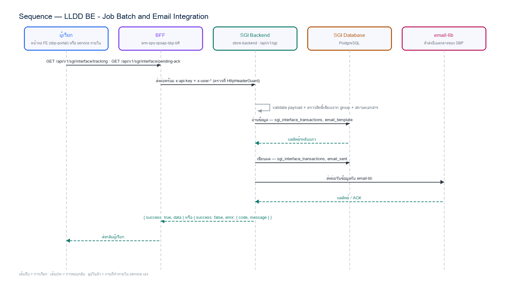

# LLDD BE - Job Batch and Email Integration

SBP Mall - ระบบประกันรายได้ | Low Level Design Document

## 1. Overview

| รายการ | รายละเอียด |
| --- | --- |
| Track | BE |
| Estimate | **11 ชั่วโมง** = implementation 8 + unit test 3 (30%) |
| Owner | Peerakorn &lt;Pete&gt; Sakunkaewphithak |
| Target repository | `SBP/srm-sps-spsap-store-backend` (NestJS + TypeORM · schema `sps_store`) + `SBP/srm-sps-spsap-sbp-bff` (forward ผ่าน client service · ไม่มี DB) สำหรับเส้นที่ FE เรียก |
| Objective | ออกแบบ Backend contracts ฝั่ง **store-backend** สำหรับ interface tracking / รายการข้อความขาออกที่ยังไม่ได้ publisher confirm (2 เส้น · `POST /sgi/interface/sta/ack` ถูกตัด 2026-09-08 ตามมติข้อ 2.13) และ Notification Service (ส่งผ่าน @gosoft-sbp/email-lib) — ไม่มี Job Admin API, Email Template API (2026-08-06) และไม่มี SRM inbound adapter แล้ว (2026-08-07) · **⚠️ มติ 2026-09-02: งานสร้าง batch runner / scheduler / cli / job-failure notifier ถูกตัดออกจากเอกสารฉบับนี้** — batch job ทั้ง 12 ตัวย้ายไปรันบน `SBP/srm-sps-spsap-sop-sgi-batch` ที่มี dispatcher + `integration_log` + structured log พร้อมแล้ว เอกสารฉบับนี้เหลือเฉพาะ **ฝั่ง API ที่ยังอยู่ใน store-backend** |

Common contract reference: ทุกหัวข้อ API/FE ต้องยึด LLDD-BE-API-Common-Contracts และ LLDD-FE-Integration-Contracts สำหรับ error/auth/format/pagination/action/RBAC ก่อนลงรายละเอียดเฉพาะหน้าหรือเฉพาะ endpoint

### 1.1 เอกสาร LLDD ที่เกี่ยวข้อง

ตารางนี้สร้างจาก endpoint และตารางที่เอกสารฉบับนี้ประกาศไว้จริง — อ่านฉบับที่อยู่ในตารางก่อนลงมือ เพื่อไม่ให้สัญญา request/response หรือชื่อคอลัมน์หลุดจากกัน

| ความสัมพันธ์ | เอกสาร LLDD | เกี่ยวข้องตรงไหน |
| --- | --- | --- |
| สัญญากลาง | **LLDD-BE-API-Common-Contracts** | envelope `{success,data}` · error code · pagination · รูปแบบวันที่/เลขเอกสาร |
| โครงสร้างข้อมูล | **LLDD-BE-Database-Structure** | DDL ของตารางที่หัวข้อ Reference DB Mapping อ้างถึง |
| แพลตฟอร์มระบบเดิม | **LLDD-BE-Integration-SBP-Platform** | header จาก BFF (`x-api-key` / `x-user-*`) · การ reuse ตารางและ service ของระบบ SBP เดิม |
| ต้องจบก่อน (ลำดับงาน) | **LLDD-BE-Database-Structure** | เป็นฉบับต้นทางของสัญญา/โครงที่ฉบับนี้อ้าง |

## 2. Screen / Functional Scope

- Interface tracking และรายการค้างส่ง APIs (2 เส้น · `/tracking` · `/pending-ack`)
- Notification adapter ผ่าน @gosoft-sbp/email-lib
- **ไม่มี STA ACK callback** — ตัดเมื่อ 2026-09-08 (ข้อ 2.13) เพราะสเปก STA ไม่มี ACK แบบ HTTP
- ไม่มี Batch Job Admin API และไม่มี inbound endpoint ของ SRM
- **ไม่รวม batch runner/scheduler** — อยู่ที่ sop-sgi-batch (มติ 2026-09-02)

## 3. Screenshot Reference

ไม่มีภาพหน้าจอสำหรับหัวข้อนี้ — เป็นเอกสารฝั่ง Backend/Batch ที่ไม่มี UI (ภาพหน้าจอทั้งหมดอยู่ในเอกสารชุด FE)

## 4. Implementation Flow & Sequence Diagram (Reference)

### 4.1 Implementation Flow (ลำดับขั้นการทำงาน)


_รูปที่ 1: Implementation flow reference: LLDD BE - Job Batch and Email Integration_

### 4.2 Sequence Diagram (ใครคุยกับใคร ลำดับไหน)

ผู้แสดงและลำดับข้อความในภาพนี้สร้างจาก endpoint ในหัวข้อ 7 และตารางในหัวข้อ Reference DB Mapping ของเอกสารฉบับนี้เอง จึงตรงกับสัญญาเสมอ



_รูปที่ 2: Sequence diagram: LLDD BE - Job Batch and Email Integration_

## 5. Field, Format, and Validation

| Field / UI | Format | Validation | Behavior |
| --- | --- | --- | --- |
| jobNo | string | required | maps to job registry |
| sourceRefNo | string | required for SRM | idempotency key |
| templateCode | EM-xx | required | email template key |
| transactionId | uuid | generated | integration log key |

### 5.9 Input / Progress / Output Contract

| Stage | Contract for implementation |
| --- | --- |
| Input | GET /api/v1/sgi/interface/tracking; GET /api/v1/sgi/interface/pending-ack |
| Progress | Receive request; Validate schema; Check idempotency; Process records |
| Output | (application log แบบ structured); sgi_interface_transactions |

### 5.90 Endpoint Implementation Contract

| Endpoint | Use-case owner | Service/repository behavior | Definition of done |
| --- | --- | --- | --- |
| GET /api/v1/sgi/interface/tracking | ค้นสถานะ interface ตาม dataset/business key/status/ช่วงเวลา | Receive request | job run guard prevents duplicate running job |
| GET /api/v1/sgi/interface/pending-ack | รายการข้อความขาออกที่ยังไม่ได้ publisher confirm ตาม watchdog rule อายุอย่างน้อย 1 วัน (path คงชื่อเดิม) | Validate schema | email preview renders variables |

### 5.91 Backend Execution Sequence

| Step | Behavior specific to this LLDD | Failure/test evidence |
| --- | --- | --- |
| 1 | Receive request | run job |
| 2 | Validate schema | run duplicate |
| 3 | Check idempotency | interface tracking filter |
| 4 | Process records | watchdog ข้อความค้างส่ง (ยังไม่ publisher confirm) |
| 5 | Log success/failure | email preview |
| 6 | Return summary | — (ยังไม่มี test เฉพาะขั้นนี้ · ครอบด้วย test รวมของเอกสารในหัวข้อ 11) |

## 6. Button / User Action Mapping

| Action | Trigger | API / Service | Expected Result |
| --- | --- | --- | --- |
| Run job | POST | jobRunner.run | queued/run history |
| Receive SRM | POST | srmIntegration.ingest | transaction result |
| Preview email | POST | emailTemplate.render | merged subject/body |

## 7. API Contract

### GET /api/v1/sgi/interface/tracking

ค้นสถานะ interface ตาม dataset/business key/status/ช่วงเวลา

#### Query Params

```json
{
  "dataName": "COMPENSATE_INIT_I",
  "status": "SENT",
  "pending": true,
  "sentFrom": "2026-07-01T00:00:00+07:00",
  "sentTo": "2026-07-22T23:59:59+07:00",
  "page": 1,
  "size": 20
}
```

#### Request Field Schema

| Field | Type | Required | Constraint / Meaning |
| --- | --- | --- | --- |
| dataName | string | No | UTF-8; use value domain described by endpoint purpose |
| status | string | No | UTF-8; use value domain described by endpoint purpose |
| pending | boolean | No | UTF-8; use value domain described by endpoint purpose |
| sentFrom | string | No | UTF-8; use value domain described by endpoint purpose |
| sentTo | string | No | UTF-8; use value domain described by endpoint purpose |
| page | integer | No | >= 1; default 1 |
| size | integer | No | 1..100; default 20 |

#### Response

```json
{
  "page": 1,
  "size": 20,
  "total": 1,
  "items": [
    {
      "trackingId": 9912,
      "dataName": "COMPENSATE_INIT_I",
      "direction": "OUT",
      "businessKey": "2026/00098",
      "docNo": "2026/00098",
      "fileName": "COMPENSATE_INIT_I_25690722.dat",
      "status": "SENT",
      "sentAt": "2026-07-20T17:02:00+07:00",
      "ackedAt": null,
      "returnCode": null,
      "ageHours": 41
    }
  ]
}
```

#### Response Field Schema

| Field | Type | Required | Constraint / Meaning |
| --- | --- | --- | --- |
| page | integer | Yes | >= 1; default 1 |
| size | integer | Yes | 1..100; default 20 |
| total | integer | Yes | UTF-8; use value domain described by endpoint purpose |
| items | array&lt;object&gt; | Yes | JSON array; element type shown in Type column |
| items[].trackingId | integer | Yes | UTF-8; use value domain described by endpoint purpose |
| items[].dataName | string | Yes | UTF-8; use value domain described by endpoint purpose |
| items[].direction | string | Yes | UTF-8; use value domain described by endpoint purpose |
| items[].businessKey | string | Yes | UTF-8; use value domain described by endpoint purpose |
| items[].docNo | string | Yes | ค.ศ. YYYY/xxxxx |
| items[].fileName | string | Yes | UTF-8; use value domain described by endpoint purpose |
| items[].status | string | Yes | UTF-8; use value domain described by endpoint purpose |
| items[].sentAt | string | Yes | ISO-8601 ค.ศ.; nullable only when type includes null |
| items[].ackedAt | string \| null | No | ISO-8601 ค.ศ.; nullable only when type includes null |
| items[].returnCode | string \| null | No | UTF-8; use value domain described by endpoint purpose |
| items[].ageHours | integer | Yes | UTF-8; use value domain described by endpoint purpose |

### GET /api/v1/sgi/interface/pending-ack

รายการข้อความขาออกที่ยังไม่ได้ publisher confirm ตาม watchdog rule อายุอย่างน้อย 1 วัน (path คงชื่อเดิม)

#### Query Params

```json
{
  "thresholdHours": 24,
  "dataName": "COMPENSATE_INIT_I",
  "page": 1,
  "size": 20
}
```

#### Request Field Schema

| Field | Type | Required | Constraint / Meaning |
| --- | --- | --- | --- |
| thresholdHours | integer | No | UTF-8; use value domain described by endpoint purpose |
| dataName | string | No | UTF-8; use value domain described by endpoint purpose |
| page | integer | No | >= 1; default 1 |
| size | integer | No | 1..100; default 20 |

#### Response

```json
{
  "page": 1,
  "size": 20,
  "total": 1,
  "count": 1,
  "items": [
    {
      "trackingId": 9912,
      "dataName": "COMPENSATE_INIT_I",
      "businessKey": "2026/00098",
      "docNo": "2026/00098",
      "fileName": "COMPENSATE_INIT_I_25690722.dat",
      "sentAt": "2026-07-20T17:02:00+07:00",
      "ageHours": 41,
      "returnCode": null
    }
  ]
}
```

#### Response Field Schema

| Field | Type | Required | Constraint / Meaning |
| --- | --- | --- | --- |
| page | integer | Yes | >= 1; default 1 |
| size | integer | Yes | 1..100; default 20 |
| total | integer | Yes | UTF-8; use value domain described by endpoint purpose |
| count | integer | Yes | UTF-8; use value domain described by endpoint purpose |
| items | array&lt;object&gt; | Yes | JSON array; element type shown in Type column |
| items[].trackingId | integer | Yes | UTF-8; use value domain described by endpoint purpose |
| items[].dataName | string | Yes | UTF-8; use value domain described by endpoint purpose |
| items[].businessKey | string | Yes | UTF-8; use value domain described by endpoint purpose |
| items[].docNo | string | Yes | ค.ศ. YYYY/xxxxx |
| items[].fileName | string | Yes | UTF-8; use value domain described by endpoint purpose |
| items[].sentAt | string | Yes | ISO-8601 ค.ศ.; nullable only when type includes null |
| items[].ageHours | integer | Yes | UTF-8; use value domain described by endpoint purpose |
| items[].returnCode | string \| null | No | UTF-8; use value domain described by endpoint purpose |

## 8. Reference DB Mapping (No Database Page Work)

ส่วนนี้เป็นข้อมูลอ้างอิงสำหรับการ implement API/Job เท่านั้น ไม่ใช่งานสร้างหน้า Database, ไม่ใช่งานออกแบบ DB page และไม่ถูกนับเป็น deliverable แยกของ FE/BE

| Table / Object | R/W | Usage |
| --- | --- | --- |
| (backend config: config file/env) | R | enabled, cron, params ของ batch — ตาราง job_configs ถูกตัด 2026-08-06 ไม่มีหน้าจอควบคุม · **cron จริงตั้งที่ AWS Batch scheduled event ของ sop-sgi-batch ไม่ใช่ที่ store-backend** |
| (application log แบบ structured) | W | ประวัติการรันและสถานะล่าสุด — ตาราง job_run_histories ถูกตัด 2026-08-06 |
| sgi_interface_transactions | R/W | tracking การรับส่งไฟล์/ข้อความ + outbox (สถานะจบที่ outbox_status = CONFIRMED) |
| email_template (SBP) | R | subject_format/body_format ของระบบ SBP เดิม — อ่านอย่างเดียว |
| email_sent (SBP) | W (โดย email-lib) | log การส่งของ batch — lib เขียนให้เอง |

## 9. Skeleton Code (store-backend + BFF)

โครงโค้ดตั้งต้นของเอกสารฉบับนี้ ยึด convention จริงของ `srm-sps-spsap-store-backend` (NestJS 11 + TypeORM, schema `sps_store`, custom provider `DATA_SOURCE` ที่ route SELECT ไป slave pool) และ `srm-sps-spsap-sbp-bff` (ไม่มี DB, forward ผ่าน client service). ทุกจุดที่ต้องเติมกำกับด้วย `// TODO:` และ response ทุกเส้นถูกห่อเป็น `{success, data}` โดย ResponseInterceptor อยู่แล้ว จึงห้าม service ห่อซ้ำ

### 9.1 ผังไฟล์ที่ต้องสร้าง

| Path | หน้าที่ |
| --- | --- |
| store-backend · src/modules/sgi-job-batch-email-srm/sgi-job-batch-email-srm.controller.ts | route ทั้งหมดของเอกสารนี้ (2 เส้น) + `@UseGuards(HttpHeaderGuard)` + `@UserId()` |
| store-backend · src/modules/sgi-job-batch-email-srm/sgi-job-batch-email-srm.service.ts | business logic — inject `'DATA_SOURCE'` แล้วยิง raw SQL, mutation ใช้ QueryRunner transaction |
| store-backend · src/modules/sgi-job-batch-email-srm/sgi-job-batch-email-srm.sql.ts | เก็บ SQL ต่อ endpoint (คัดจากหัวข้อ 10) แยกออกจาก service ให้ทดสอบ/รีวิวง่าย · **คีย์ = ชื่อ handler** เช่น `getSgiMasterFactors` · บล็อกที่มีหลาย statement ให้แยกเป็นหลายคีย์ โดยเติมท้ายชื่อให้สื่อความ เช่น DELETE master ที่มี 2 statement → `removeSgiMasterFactorsByCodeInUse` (SELECT ตรวจการใช้งาน) + `removeSgiMasterFactorsByCode` (DELETE) |
| store-backend · src/modules/sgi-job-batch-email-srm/dto/sgi-job-batch-email-srm.dto.ts | DTO + class-validator ตาม validation ในหัวข้อฟิลด์ของเอกสารนี้ |
| store-backend · src/modules/sgi-job-batch-email-srm/sgi-job-batch-email-srm.module.ts | ประกอบ controller/service/providers แล้ว register ที่ `app.module.ts` |
| store-backend · src/entitys/sgi-interface-transactions.entity.ts | entity ของ `sgi_interface_transactions` (`@Entity({schema: process.env.DB_SCHEMA})`, ไม่ประกาศ relation) |
| store-backend · src/entitys/email-sent.entity.ts | entity ของ `email_sent` (`@Entity({schema: process.env.DB_SCHEMA})`, ไม่ประกาศ relation) |
| store-backend · src/providers/sgi/sgi.ts | repository provider แบบ factory ผูก token string กับ `DATA_SOURCE` — **ไฟล์ร่วมของทุกเอกสาร BE ให้ merge array เพิ่ม ห้ามเขียนทับ** |
| store-backend · sql/deploy-sgi-job-batch-email-srm.sql | DDL production แบบ idempotent (ทีมนี้ไม่ใช้ migration เป็นหลัก) |
| BFF · src/common/client-services/sgi-client.service.ts | client ต่อจาก `BaseClientService` ตั้ง baseUrl + `x-api-key` ตอน `onModuleInit` |
| BFF · src/modules/sgi-job-batch-email-srm/sgi-job-batch-email-srm.controller.ts | route ฝั่ง BFF prefix `/bff/sgi/…` + `@UseGuards(AuthGuard('jwt'))` |
| BFF · src/modules/sgi-job-batch-email-srm/sgi-job-batch-email-srm.service.ts | แนบ `x-user-id` / `x-user-group-id` / `x-user-permissions` แล้ว forward ไป backend |

### 9.2 Controller (store-backend)

```ts
// src/modules/sgi-job-batch-email-srm/sgi-job-batch-email-srm.controller.ts
import { Controller, Get, Query, UseGuards } from '@nestjs/common';
import { HttpHeaderGuard } from '../../guards/http-header.guard';
import { UserId } from '../../common/decorators/user-id.decorator';
import { SgiJobBatchEmailSRMService } from './sgi-job-batch-email-srm.service';
import { JobBatchEmailSRMQueryDto } from './dto/sgi-job-batch-email-srm.dto';

// LLDD BE - Job Batch and Email Integration
// BFF เรียกด้วย x-api-key และแนบ x-user-id / x-user-group-id / x-user-permissions มาให้
@Controller('interface')
@UseGuards(HttpHeaderGuard)
export class SgiJobBatchEmailSRMController {
  constructor(private readonly service: SgiJobBatchEmailSRMService) {}

  // GET /api/v1/sgi/interface/tracking — ค้นสถานะ interface ตาม dataset/business key/status/ช่วงเวลา
  @Get('tracking')
  getSgiInterfaceTracking(@Query() query: JobBatchEmailSRMQueryDto, @UserId() userId: string) {
    // TODO: ตรวจ x-user-permissions ก่อนเรียก service ถ้า endpoint นี้จำกัดสิทธิ์เมนู
    return this.service.getSgiInterfaceTracking(query, userId);
  }

  // GET /api/v1/sgi/interface/pending-ack — รายการข้อความขาออกที่ยังไม่ได้ publisher confirm ตาม watchdog rule อา…
  @Get('pending-ack')
  getSgiInterfacePendingAck(@Query() query: JobBatchEmailSRMQueryDto, @UserId() userId: string) {
    // TODO: ตรวจ x-user-permissions ก่อนเรียก service ถ้า endpoint นี้จำกัดสิทธิ์เมนู
    return this.service.getSgiInterfacePendingAck(query, userId);
  }
}
```

### 9.3 DTO + Validation

```ts
// src/modules/sgi-job-batch-email-srm/dto/sgi-job-batch-email-srm.dto.ts
import { Type } from 'class-transformer';
import {
  IsArray, IsBoolean, IsIn, IsInt, IsNotEmpty, IsNumber, IsObject, IsOptional,
  IsString, Matches, Max, MaxLength, Min, ValidateNested,
} from 'class-validator';

// ValidationPipe ระดับ global ตั้ง whitelist + forbidNonWhitelisted + transform ไว้แล้ว (main.ts)
// property ที่ไม่ประกาศที่นี่จะถูก reject เป็น 400 อัตโนมัติ

// query ร่วมของ GET ทุกเส้นในโมดูลนี้ (path param ใช้ @Param แยก)
export class JobBatchEmailSRMQueryDto {
  @IsNotEmpty()
  @IsString()
  dataName: string;

  /** required เฉพาะบาง endpoint — ตรวจซ้ำใน service */
  @IsOptional()
  @IsString()
  status?: string;

  /** required เฉพาะบาง endpoint — ตรวจซ้ำใน service */
  @IsOptional()
  @Type(() => Boolean)
  @IsBoolean()
  pending?: boolean;

  /** required เฉพาะบาง endpoint — ตรวจซ้ำใน service */
  @IsOptional()
  @IsString()
  sentFrom?: string;

  /** required เฉพาะบาง endpoint — ตรวจซ้ำใน service */
  @IsOptional()
  @IsString()
  sentTo?: string;

  @IsOptional()
  @Type(() => Number)
  @IsInt()
  @Min(1)
  page?: number;

  // TODO: เพิ่ม property ที่เหลือของ payload นี้ให้ครบตามหัวข้อฟิลด์ของเอกสารนี้
}
```

### 9.4 Service (inject `DATA_SOURCE` + raw SQL)

service ประกาศ method ครบทุกเส้นที่ controller เรียก และ **signature มาจากแหล่งเดียวกับ controller** (จำนวน/ลำดับพารามิเตอร์จึงตรงกันเสมอ) — เส้นที่ยังไม่ได้ implement เป็น stub ที่ `throw new NotImplementedException(...)` ให้ TypeScript compile ผ่านตั้งแต่วันแรก

```ts
// src/modules/sgi-job-batch-email-srm/sgi-job-batch-email-srm.service.ts
import { BadRequestException, ConflictException, Inject, Injectable, Logger, NotFoundException, NotImplementedException } from '@nestjs/common';
import { DataSource } from 'typeorm';
import { SGI_SQL } from './sgi-job-batch-email-srm.sql';

@Injectable()
export class SgiJobBatchEmailSRMService {
  private readonly logger = new Logger(SgiJobBatchEmailSRMService.name);

  constructor(
    // DATA_SOURCE override query(): SELECT/WITH ไป slave pool, write ไป master
    @Inject('DATA_SOURCE') private readonly dataSource: DataSource,
  ) {}

  // GET /api/v1/sgi/interface/tracking — ค้นสถานะ interface ตาม dataset/business key/status/ช่วงเวลา
  async getSgiInterfaceTracking(query: JobBatchEmailSRMQueryDto, userId: string) {
    const page = Number(query.page ?? 1);
    const size = Math.min(Number(query.size ?? 20), 100);
    // SQL เต็มอยู่ในหัวข้อ Database SQL ของเอกสารนี้ (คีย์ 'GET /api/v1/sgi/interface/tracking')
    // SQL ในเอกสารเป็น positional $1..$n อยู่แล้ว (ตัวสร้างแปลงให้ตั้งแต่ 2026-09-04)
    //   บรรทัดแรกของบล็อก SQL คือ `-- bind ตามลำดับ: $1=... · $2=...` ให้เรียงอาร์กิวเมนต์ตามนั้น
    const rows = await this.dataSource.query(SGI_SQL.getSgiInterfaceTracking, [
      // เรียงให้ตรงกับบรรทัด `-- bind ตามลำดับ:` ของ SQL เส้นนี้
      userId, (page - 1) * size, size,
    ]);
    // TODO: total ต้องมาจาก COUNT(*) แยก query หรือ window function ไม่ใช่ rows.length
    return { page, size, total: rows.length, items: rows };
  }

  // GET /api/v1/sgi/interface/pending-ack — รายการข้อความขาออกที่ยังไม่ได้ publisher confirm ตาม watchdog rule อา…
  async getSgiInterfacePendingAck(query: JobBatchEmailSRMQueryDto, userId: string) {
    // TODO: implement ตาม business rule ของ GET /api/v1/sgi/interface/pending-ack
    //       (SQL อยู่ในหัวข้อ Database SQL คีย์ 'GET /api/v1/sgi/interface/pending-ack')
    throw new NotImplementedException('getSgiInterfacePendingAck ยังไม่ implement');
  }
}
```

### 9.5 Entity (TypeORM)

```ts
// src/entitys/sgi-interface-transactions.entity.ts
import { Column, Entity, PrimaryColumn } from 'typeorm';

@Entity({ name: 'sgi_interface_transactions', schema: process.env.DB_SCHEMA })
export class InterfaceTransaction {
  @PrimaryColumn({ name: 'id', type: 'bigint' })
  id: number;

  @Column({ name: 'run_id', type: 'varchar', length: 50, nullable: true })
  runId?: string;

  @Column({ name: 'data_name', type: 'varchar', length: 80 })
  dataName: string;

  @Column({ name: 'direction', type: 'varchar', length: 10 })
  direction: string;

  @Column({ name: 'status', type: 'varchar', length: 20 })
  status: string;

  @Column({ name: 'impact_process_id', type: 'bigint', nullable: true })
  impactProcessId?: number;

  @Column({ name: 'sales_summary_id', type: 'bigint', nullable: true })
  salesSummaryId?: number;

  @Column({ name: 'doc_no', type: 'varchar', length: 10, nullable: true })
  docNo?: string;

  @Column({ name: 'business_key', type: 'varchar', length: 200 })
  businessKey: string;

  @Column({ name: 'period_key', type: 'varchar', length: 20 })
  periodKey: string;

  @Column({ name: 'correlation_id', type: 'varchar', length: 100, nullable: true })
  correlationId?: string;

  @Column({ name: 'file_name', type: 'varchar', length: 255, nullable: true })
  fileName?: string;

  @Column({ name: 'file_checksum', type: 'varchar', length: 64, nullable: true })
  fileChecksum?: string;

  @Column({ name: 'outbox_status', type: 'varchar', length: 20, nullable: true })
  outboxStatus?: string;

  @Column({ name: 'return_code', type: 'varchar', length: 50, nullable: true })
  returnCode?: string;

  @Column({ name: 'return_message', type: 'varchar', length: 500, nullable: true })
  returnMessage?: string;

  @Column({ name: 'payload', type: 'jsonb', nullable: true })
  payload?: Record<string, unknown>;

  @Column({ name: 'payload_version', type: 'smallint', default: 1 })
  payloadVersion: number;

  @Column({ name: 'retry_count', type: 'int', default: 0 })
  retryCount: number;

  @Column({ name: 'sent_at', type: 'timestamp', nullable: true })
  sentAt?: Date;

  @Column({ name: 'acked_at', type: 'timestamp', nullable: true })
  ackedAt?: Date;

  @Column({ name: 'last_ack_notified_on', type: 'date', nullable: true })
  lastAckNotifiedOn?: Date;

  @Column({ name: 'purge_after', type: 'timestamp', nullable: true })
  purgeAfter?: Date;

  @Column({ name: 'legal_hold', type: 'boolean', default: false })
  legalHold: boolean;

  @Column({ name: 'created_at', type: 'timestamp' })
  createdAt: Date;

  @Column({ name: 'completed_at', type: 'timestamp', nullable: true })
  completedAt?: Date;

  // entity ชุดนี้ generate จาก DDL ใน LLDD-Database §5.2–5.4 โดยตรง — คอลัมน์/ชนิด/nullable ตรงกันเสมอ
  // ไม่ประกาศ relation ตาม convention ของทีม (join ด้วย raw SQL)
}
```

```ts
// src/entitys/email-sent.entity.ts
import { Column, Entity, PrimaryColumn } from 'typeorm';

@Entity({ name: 'email_sent', schema: process.env.DB_SCHEMA })
export class EmailSent {
  @PrimaryColumn({ name: 'id', type: 'bigint' })
  id: number;

  // TODO: เติมคอลัมน์ที่เหลือของ email_sent ตาม database.md (Canonical Column Contract)
  //       และห้ามประกาศ relation — โมดูลนี้ join ด้วย raw SQL ตาม convention ของทีม
}
```

ตารางที่ **ไม่ต้องสร้าง entity** เพราะใช้ของระบบเดิม/workflow engine:

| Object | R/W | ใช้ของระบบเดิมตัวไหน |
| --- | --- | --- |
| email_template | R | email_template + email_sent + @gosoft-sbp/email-lib |

### 9.6 Repository Providers + Module wiring

```ts
// src/providers/sgi/sgi.ts — repository provider แบบ factory (ไม่ใช้ TypeOrmModule.forFeature)
// convention ของโฟลเดอร์ providers คือ 1 ไฟล์ต่อโดเมน ตั้งชื่อตามโดเมน (business_user/business_user.ts,
// common_code/common_code.ts …) ไม่ใช่ index.ts
//
// ⚠️ ไฟล์นี้ใช้ร่วมกันทุกเอกสาร BE ของ SGI — ให้ **merge array เพิ่ม** เข้าไฟล์เดิม ห้ามเขียนทับ
//    (ชื่อ const แยกต่อเอกสารไว้แล้วเพื่อไม่ให้ชนกัน)
import { DataSource } from 'typeorm';
import { InterfaceTransaction } from '../../entitys/sgi-interface-transactions.entity';
import { EmailSent } from '../../entitys/email-sent.entity';

export const sgiJobBatchEmailSRMProviders = [
  {
    provide: 'SGI_INTERFACE_TRANSACTION_REPOSITORY',
    useFactory: (dataSource: DataSource) => dataSource.getRepository(InterfaceTransaction),
    inject: ['DATA_SOURCE'],
  },
  {
    provide: 'EMAIL_SENT_REPOSITORY',
    useFactory: (dataSource: DataSource) => dataSource.getRepository(EmailSent),
    inject: ['DATA_SOURCE'],
  },
];

// src/modules/sgi-job-batch-email-srm/sgi-job-batch-email-srm.module.ts
import { MiddlewareConsumer, Module, NestModule } from '@nestjs/common';
import { DatabaseModule } from '../../database/database.module';
// UserContextMiddleware อ่าน header x-user-id แล้วเซ็ต request.userId ที่ @UserId() ใช้
// — app.module.ts **ไม่ได้** apply แบบ global (มีแค่ HttpContext/LoggerContext) แต่ละโมดูลต้อง apply เอง
// (ดู evaluation-process.module.ts / inform-evaluate.module.ts / cooperation-request.module.ts)
import { UserContextMiddleware } from '../../common/middleware/user-context.middleware';
import { sgiJobBatchEmailSRMProviders } from '../../providers/sgi/sgi';
import { SgiJobBatchEmailSRMController } from './sgi-job-batch-email-srm.controller';
import { SgiJobBatchEmailSRMService } from './sgi-job-batch-email-srm.service';

@Module({
  imports: [DatabaseModule],
  controllers: [SgiJobBatchEmailSRMController],
  providers: [SgiJobBatchEmailSRMService, ...sgiJobBatchEmailSRMProviders],
  exports: [SgiJobBatchEmailSRMService],
})
export class SgiJobBatchEmailSRMModule implements NestModule {
  configure(consumer: MiddlewareConsumer) {
    // ถ้าไม่ apply ตรงนี้ userId จะเป็น undefined เงียบ ๆ ทุก endpoint
    consumer.apply(UserContextMiddleware).forRoutes(SgiJobBatchEmailSRMController);
  }
}
// TODO: register module นี้ใน app.module.ts (imports) พร้อมกับโมดูล SGI ตัวอื่น
```

### 9.7 BFF Proxy (module + controller + client service)

BFF ยังไม่มีฟีเจอร์ประกันรายได้เลย จึงต้องสร้าง module ใหม่ + client service ใหม่ทั้งชุด และเลือก prefix แบบเดียวทั้งโมดูล (ที่นี่ใช้ `/bff/sgi/…`) เพื่อไม่ให้ปนแบบที่มี/ไม่มี `/bff` เหมือนโมดูลเดิม

```ts
// src/common/client-services/sgi-client.service.ts
import { Injectable, Logger, OnModuleInit } from '@nestjs/common';
import { BaseClientService } from './base-client.service';

@Injectable()
export class SgiClientService extends BaseClientService implements OnModuleInit {
  protected logger: Logger = new Logger(SgiClientService.name);

  onModuleInit() {
    // TODO: ถ้า deploy SGI แยก service ให้เพิ่ม API_SGI_BACKEND_* ใน AppConfigService
    //       ตอนนี้ชี้ store backend ตัวเดียวกับ StoreClientService
    this.defaultHeaders[this.config.api.store.key.name] = this.config.api.store.key.value;
    this.baseUrl = this.config.api.store.url;
  }
}
// BaseClientService แกะ { success, data } ให้แล้ว — service ฝั่ง BFF จึงได้ data ตรง ๆ
// TODO: เพิ่ม SgiClientService ใน providers/exports ของ ClientServiceModule (@Global)
```

```ts
// src/modules/sgi-job-batch-email-srm/sgi-job-batch-email-srm.service.ts (BFF)
import { Injectable } from '@nestjs/common';
import { SgiClientService } from '@common/client-services/sgi-client.service';

@Injectable()
export class SgiJobBatchEmailSRMBffService {
  constructor(private readonly client: SgiClientService) {}

  // BFF ไม่มี DB — หน้าที่เดียวคือแนบ user context แล้ว forward
  // ⚠️ ต้อง unwrap envelope ของ store-backend 1 ชั้นก่อนคืน (ยืนยันจากโค้ดจริง 2026-09-04):
  //    ResponseInterceptor ระดับ global ของ BFF ห่อผลลัพธ์เป็น { success, data, requestId } อีกที
  //    ถ้าคืน { success, data } ดิบมา FE จะได้ data.data.data — SgiClientService จึงต้องคืน .data.data
  private userHeaders(user: any) {
    return {
      'x-user-id': user?.userId,
      'x-user-group-id': user?.groupId,
      'x-user-permissions': (user?.permissions ?? []).join(','),
    };
  }

  getSgiInterfaceTracking(params: any, user: any) {
    return this.client.get('/api/v1/sgi/interface/tracking', { params, headers: this.userHeaders(user) });
  }

  getSgiInterfacePendingAck(params: any, user: any) {
    return this.client.get('/api/v1/sgi/interface/pending-ack', { params, headers: this.userHeaders(user) });
  }
}

// ---------- src/modules/sgi-job-batch-email-srm/sgi-job-batch-email-srm.controller.ts (BFF) ----------
import { Body, Controller, Delete, Get, Param, Post, Put, Query, Req, UseGuards } from '@nestjs/common';
import { AuthGuard } from '@nestjs/passport';

// path เดียวกับที่ FE เรียก (apiClient baseURL รวม /api/v1 แล้ว) — ห้ามตั้งตามชื่อเอกสาร LLDD
@Controller('sgi/interface')
@UseGuards(AuthGuard('jwt'))
export class SgiJobBatchEmailSRMBffController {
  constructor(private readonly service: SgiJobBatchEmailSRMBffService) {}

  // proxy ของ GET /api/v1/sgi/interface/tracking
  @Get('tracking')
  getSgiInterfaceTracking(@Query() query: any, @Req() req: any) {
    return this.service.getSgiInterfaceTracking(query, req.user);
  }

  // proxy ของ GET /api/v1/sgi/interface/pending-ack
  @Get('pending-ack')
  getSgiInterfacePendingAck(@Query() query: any, @Req() req: any) {
    return this.service.getSgiInterfacePendingAck(query, req.user);
  }
}
// TODO: register module ใน app.module.ts ของ BFF และเพิ่ม SgiClientService ใน ClientServiceModule (@Global)
```

## 10. Database SQL

### 10.1 ตารางที่อ่าน/เขียน

| Table / Object | R/W | Usage |
| --- | --- | --- |
| sgi_interface_transactions | R/W | tracking การรับส่งไฟล์/ข้อความ + outbox (สถานะจบที่ outbox_status = CONFIRMED) |
| email_sent | W (โดย email-lib) | log การส่งของ batch — lib เขียนให้เอง |
| email_template | R | ใช้ของระบบเดิม: email_template + email_sent + @gosoft-sbp/email-lib |

### 10.2 SQL จริงต่อ Endpoint

**GET /api/v1/sgi/interface/tracking** — ค้นสถานะ interface ตาม dataset/business key/status/ช่วงเวลา

```sql
-- bind ตามลำดับ: $1=dataName · $2=pending · $3=status · $4=sentFrom · $5=sentTo · $6=size · $7=offset
-- pending = ยังไม่ได้ publisher confirm (มติ 2026-09-08 ข้อ 2.13) — ไม่ใช่ "รอ return_code จาก STA"
SELECT id AS tracking_id, data_name, doc_no, sent_at, outbox_status, acked_at AS confirmed_date
FROM sgi_interface_transactions
WHERE ($1 /* dataName */ IS NULL OR data_name = $1 /* dataName */)
  AND ($2 /* pending */  IS NULL OR outbox_status IS DISTINCT FROM 'CONFIRMED')
  AND ($3 /* status */   IS NULL OR outbox_status = $3 /* status */)   -- READY / PUBLISHED / CONFIRMED / FAILED
  AND ($4 /* sentFrom */ IS NULL OR sent_at >= $4 /* sentFrom */)
  AND ($5 /* sentTo */   IS NULL OR sent_at <  $5 /* sentTo */ + INTERVAL '1 day')
ORDER BY sent_at DESC
LIMIT $6 /* size */ OFFSET $7 /* offset */;
```

**GET /api/v1/sgi/interface/pending-ack** — รายการข้อความขาออกที่ยังไม่ได้ publisher confirm ตาม watchdog rule อายุอย่างน้อย 1 วัน (path คงชื่อเดิม)

```sql
-- bind ตามลำดับ: $1=thresholdHours · $2=dataName
-- เกณฑ์ watchdog Job 10 (มติ 2026-09-08 ข้อ 2.13): ขาส่งออกที่ broker ยังไม่ publisher confirm และอายุ >= 1 วัน
--   "ค้าง" = ยังไม่ได้ publisher confirm ไม่ใช่ "STA ยังไม่ ACK" — สเปก STA มีแค่ 3 ข้อความบน RabbitMQ ไม่มี ACK กลับมา
--   direction = OUT เท่านั้น — แถว INTERNAL ของ Jobs 7/8/9 จบที่ COMPLETED ทันที ไม่มีอะไรให้รอ
--   (ตรงเจตนาเดิมของ Java: interface_type != 'WS' = เฝ้าเฉพาะ interface แบบไฟล์)
SELECT data_name, doc_no, created_at, (CURRENT_DATE - created_at::date) AS age_days
FROM sgi_interface_transactions
WHERE direction = 'OUT'
  AND (outbox_status IS NULL OR outbox_status <> 'CONFIRMED')
  AND created_at < CURRENT_TIMESTAMP - ($1 /* thresholdHours */ * INTERVAL '1 hour')
  AND ($2 /* dataName */ IS NULL OR data_name = $2 /* dataName */)   -- จำกัดชุดข้อมูลที่เฝ้า (ไม่ระบุ = ทุกชุดขาออก)
ORDER BY created_at;
```

### 10.3 Index / Constraint ที่ควรมี (ข้อเสนอ)

| Table | DDL ที่เสนอ | ที่มา / หมายเหตุ |
| --- | --- | --- |
| sgi_interface_transactions | CREATE INDEX idx_interface_transactions_pending ON sgi_interface_transactions (data_name, status, sent_at); | อนุมานจากเงื่อนไข query ที่เอกสารนี้ระบุ — สร้างพร้อมสคริปต์ deploy ของ SGI |

ทั้งหมดเป็น **ข้อเสนอ** ไม่ใช่ข้อกำหนดจาก SRS — ให้ตรวจกับ `EXPLAIN ANALYZE` บนข้อมูลจริง และรวมเข้าไฟล์ `sql/deploy-sgi-*.sql` แบบ idempotent (`CREATE INDEX IF NOT EXISTS`) ตาม pattern ที่ทีมใช้อยู่

## 11. Processing Flow

| Step | Description |
| --- | --- |
| 1 | Receive request |
| 2 | Validate schema |
| 3 | Check idempotency |
| 4 | Process records |
| 5 | Log success/failure |
| 6 | Return summary |

## 12. Acceptance Criteria

- job run guard prevents duplicate running job
- email preview renders variables
- failed records include detail
- ไม่มี inbound endpoint ของ SRM แล้ว (ตัด 2026-08-07) — เอกสารต้องไม่อ้างถึงอีก

## 13. Developer Test Checklist

| No | Test |
| --- | --- |
| 1 | run job |
| 2 | run duplicate |
| 3 | interface tracking filter |
| 4 | watchdog ข้อความค้างส่ง (ยังไม่ publisher confirm) |
| 5 | email preview |

## 14. Unit Test Scope

**3 ชั่วโมง** (30% ของ implementation 8 ชั่วโมง) · เครื่องมือ: Jest + mock repository/DataSource (ไม่ต่อ DB จริง)

หัวข้อนี้คือ **unit test** ที่ต้องเขียนคู่กับโค้ด — ต่างจาก *Developer Test Checklist* ซึ่งเป็น scenario ระดับ end-to-end/manual ที่ใช้ตอนตรวจรับ · รายการด้านล่าง derive จาก field/validation, acceptance criteria, endpoint และตารางที่เอกสารนี้เขียน

| สิ่งที่ทดสอบ | ประเภท | เกณฑ์ผ่าน |
| --- | --- | --- |
| `jobNo` | validation | ผ่านเมื่อถูกกฎ / โยน error เมื่อผิด — กฎ: required · รูปแบบ: string |
| `sourceRefNo` | validation | ผ่านเมื่อถูกกฎ / โยน error เมื่อผิด — กฎ: required for SRM · รูปแบบ: string |
| `templateCode` | validation | ผ่านเมื่อถูกกฎ / โยน error เมื่อผิด — กฎ: required · รูปแบบ: EM-xx |
| `transactionId` | validation | ผ่านเมื่อถูกกฎ / โยน error เมื่อผิด — กฎ: generated · รูปแบบ: uuid |
| business rule | logic | job run guard prevents duplicate running job |
| business rule | logic | email preview renders variables |
| business rule | logic | failed records include detail |
| business rule | logic | ไม่มี inbound endpoint ของ SRM แล้ว (ตัด 2026-08-07) — เอกสารต้องไม่อ้างถึงอีก |
| `GET /api/v1/sgi/interface/tracking` | handler | คืน {success:true,data} ตามรูปแบบที่ระบุ และคืน {success:false,error:{code,message}} เมื่อ input ผิด — mock repository/lib ไม่แตะ DB จริง |
| `GET /api/v1/sgi/interface/pending-ack` | handler | คืน {success:true,data} ตามรูปแบบที่ระบุ และคืน {success:false,error:{code,message}} เมื่อ input ผิด — mock repository/lib ไม่แตะ DB จริง |
| `(application log แบบ structured)`, `sgi_interface_transactions`, `email_sent (SBP)` | transaction | จำลอง error กลางทาง แล้วยืนยันว่า rollback ครบ ไม่เหลือแถวค้าง (mock DataSource/QueryRunner) |
| service | error mapping | แปลง error ของ repository/lib เป็น error code ตามสัญญากลาง (LLDD-BE-API-Common-Contracts) |

- ทุกเคสต้องรันได้โดยไม่ต่อ DB/บริการภายนอกจริง — mock ที่ขอบ repository/client เสมอ
- ข้อความไทยที่ยืนยันในเทสต้องเป็น verbatim ตาม SRS ห้ามพิมพ์ใหม่
- เกณฑ์ผ่านของ CI: ทุกเคสในตารางนี้มี test จริงและผ่านทั้งหมด
