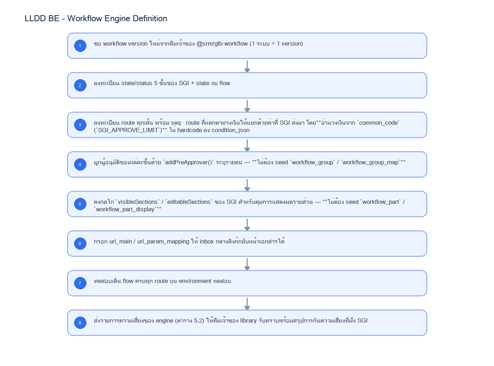
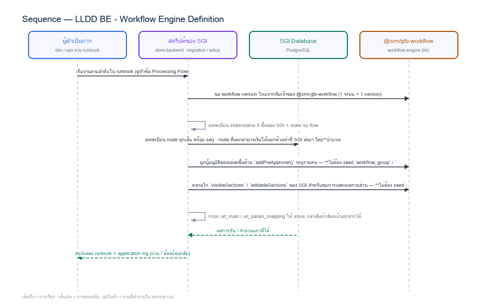

# LLDD BE - Workflow Engine Definition

SBP Mall - ระบบประกันรายได้ | Low Level Design Document

## 1. Overview

| รายการ | รายละเอียด |
| --- | --- |
| Track | BE |
| Estimate | 24 ชั่วโมง (ไม่มี unit test แยก — ดูเหตุผลใน NO_UNIT_TEST_DOCS) |
| Owner | Aphiwit <Bank> Khammoon |
| Target repository | `SBP/srm-sps-spsap-store-backend` (NestJS + TypeORM · schema `sps_store`) + `SBP/srm-sps-spsap-sbp-bff` (forward ผ่าน client service · ไม่มี DB) สำหรับเส้นที่ FE เรียก |
| Objective | **สร้างข้อมูลนิยาม workflow ลงฐานข้อมูลของ engine** — ระบุว่า flow ของ SGI มีกี่ step แต่ละ step ทำอะไร ใครทำได้ กดปุ่มไหนแล้วไป state ใด โดย register version/state/status/event/route/group/part ของ `@srm/glb-workflow` ตามสัญญาในเอกสารของ lib เอง (`docs/TSM-SRM-LLDD-SBP-workflow-1.2-full.md` — แปลงจาก `SBP/TSM-SRM-LLDD SBP workflow 1.2.xlsx`) · **เป็นงานตั้งต้นที่ต้องเสร็จก่อน** ฝั่ง BE คนอื่นจึงจะเรียก `initializeWorkflow` และ `eventWorkflow` (trigger event) ได้ — blocker ของสัปดาห์แรก |

Common contract reference: ทุกหัวข้อ API/FE ต้องยึด LLDD-BE-API-Common-Contracts และ LLDD-FE-Integration-Contracts สำหรับ error/auth/format/pagination/action/RBAC ก่อนลงรายละเอียดเฉพาะหน้าหรือเฉพาะ endpoint

### 1.1 เอกสาร LLDD ที่เกี่ยวข้อง

ตารางนี้สร้างจาก endpoint และตารางที่เอกสารฉบับนี้ประกาศไว้จริง — อ่านฉบับที่อยู่ในตารางก่อนลงมือ เพื่อไม่ให้สัญญา request/response หรือชื่อคอลัมน์หลุดจากกัน

| ความสัมพันธ์ | เอกสาร LLDD | เกี่ยวข้องตรงไหน |
| --- | --- | --- |
| สัญญากลาง | **LLDD-BE-API-Common-Contracts** | envelope `{success,data}` · error code · pagination · รูปแบบวันที่/เลขเอกสาร |
| โครงสร้างข้อมูล | **LLDD-BE-Database-Structure** | DDL ของตารางที่หัวข้อ Reference DB Mapping อ้างถึง |
| แพลตฟอร์มระบบเดิม | **LLDD-BE-Integration-SBP-Platform** | header จาก BFF (`x-api-key` / `x-user-*`) · การ reuse ตารางและ service ของระบบ SBP เดิม |

## 2. Screen / Functional Scope

- ลงทะเบียน workflow version ของ SGI 1 version (url_main + url_param_mapping)
- **ผลลัพธ์ที่ส่งมอบคือ seed script/มัยเกรชันของข้อมูลนิยาม** ไม่ใช่โค้ดเรียก engine — ทีมอื่นเรียก engine ต่อจากนิยามชุดนี้
- **จำนวน step ที่ต้องสร้าง = 6 state** — 5 ขั้นทำงาน (`06` รอฝ่าย SBP DSA → `08` รอเจ้าหน้าที่ SBP DSA → `01` รอหน่วยงานส่งเสริมธุรกิจ SBP → `02` รอ GM → `03` รอ AVP) + **1 state จบ** (`99` เสร็จสิ้นดำเนินการ) · `state_id` เป็น running ตาม version ตามกติกาของ engine (v1 → 10001+)
- **จำนวน route ที่ต้องสร้าง = 12 เส้น** ตาม Canonical Workflow Transition Matrix ใน `LLDD-BE-API-Document-Workflow-Actions` §5.1 (รวมเส้นข้ามขั้น 06→01 · เส้นจบทันทีเมื่อ เห็นควรไม่ชดเชย ที่ 01/02 · เส้นแตกตามวงเงิน 100,000 ที่ 02 และเส้นส่งกลับ)
- **ตารางที่ต้อง seed = 10 ตาราง** จาก 13 ตารางของ engine (`sps_store`) ตาม `SBP/TSM-SRM-LLDD-SBP-workflow-1.2.md` §4 — อีก 3 ตารางเป็นรันไทม์ที่ engine เขียนเอง
- ขอบเขตหยุดที่ข้อมูลนิยาม: **ไม่รวม** `initializeWorkflow` (เปิด instance · อยู่ใน LLDD-BE-API-Workflow-Instances) และ **ไม่รวม** `eventWorkflow`/trigger event (อยู่ใน LLDD-BE-API-Document-Workflow-Actions)
- นิยาม state/status 5 ขั้น 06 -> 08 -> 01 -> 02 -> 03 และปลายทางจบ flow
- นิยาม route ของทุกปุ่ม · วงเงินอนุมัติ เกณฑ์เดียว 100,000 **อ่านจาก `common_code` (`SGI_APPROVE_LIMIT`) ที่เดียว** — ตัวอย่าง `condition_json` ในเอกสารนี้แสดงรูปแบบเท่านั้น
- ผู้อนุมัติของแต่ละขั้นผูกด้วย **`addPreApprover()` รายคน** — ไม่ใช้ workflow_group / workflow_group_map (ดูหัวข้อ 5.6)
- การคุมการแสดงผล/แก้ไขรายส่วนใช้ **`visibleSections` / `editableSections` ของ SGI** — ไม่ใช้ workflow_part / workflow_part_display ของ engine (ดูหัวข้อ 5.6)
- ความเสี่ยงของ engine ที่ต้องออกแบบเผื่อ — ยึด 8 API ตามชีต Detail ของ LLDD ฝั่ง lib · `workflow_transaction` ไม่มี PK/index จึงต้องกันซ้ำที่ฝั่ง SGI

## 3. Screenshot Reference

ไม่มีภาพหน้าจอสำหรับหัวข้อนี้ — เป็นเอกสารฝั่ง Backend/Batch ที่ไม่มี UI (ภาพหน้าจอทั้งหมดอยู่ในเอกสารชุด FE)

## 4. Implementation Flow & Sequence Diagram (Reference)

### 4.1 Implementation Flow (ลำดับขั้นการทำงาน)



_รูปที่ 1: Implementation flow reference: LLDD BE - Workflow Engine Definition_

### 4.2 Sequence Diagram (ใครคุยกับใคร ลำดับไหน)

ผู้แสดงและลำดับข้อความในภาพนี้สร้างจาก endpoint ในหัวข้อ 7 และตารางในหัวข้อ Reference DB Mapping ของเอกสารฉบับนี้เอง จึงตรงกับสัญญาเสมอ



_รูปที่ 2: Sequence diagram: LLDD BE - Workflow Engine Definition_

## 5. Field, Format, and Validation

| Field / UI | Format | Validation | Behavior |
| --- | --- | --- | --- |
| versionId | integer | 1 ระบบ = 1 version | SGI ขอ version ใหม่จากทีมเจ้าของ library |
| referenceId | string unique | required ตอน initializeWorkflow | ✅ DP-1 ปิดแล้ว 2026-08-17 = `sgi_compensation_documents.id` (surrogate) แปลงเป็น string — `reference_id` ของ engine เป็น varchar(255) |
| state_id | integer running ตาม version | 1 state มีได้หลาย status | map 5 ขั้นของ SGI: 06/08/01/02/03 + state จบ |
| event | save\|submit\|approve\|reject\|cancel\|sendback | ค่าเริ่มต้นของ engine | ปุ่มไทยของ SGI map ลง event เหล่านี้ผ่าน common_code (code_type=SGI_DECISION) — ตาราง decisions ถูกตัดตามมติ DP-9 (2026-08-10) |
| condition_json | {"field","operator","value"} | operator: == != > < >= <= | ใช้ {"field":"amount","operator":"<","value":100000} แยก route GM/AVP |
| eventParam | object | ส่งมาพร้อม event | SGI ส่ง {"amount": ยอดชดเชยรวม} ให้ engine เลือก route เอง |
| part_display_type | READ \| WRITE | SGI ไม่ใช้ตารางนี้ — บันทึกไว้เพื่อความครบถ้วนของนิยาม engine | ไฟล์ต้นฉบับสะกดว่า WRTIE ทุกแถวของชีต sample data |
| url_main / url_param_mapping | string | required ตอน register version | ทำให้ inbox กลาง (GET /api/workflow/pending) ลิงก์กลับหน้าเอกสารของ SGI ได้ |

### 5.0 ทำไมเอกสารฉบับนี้ต้องปิดเป็นฉบับแรก

เอกสารฉบับนี้ **ไม่มี endpoint ของตัวเอง** — ผลลัพธ์คือชุดนิยาม state/status/route/part ที่เอกสารอื่น เอาไปใช้ต่อ จึงต้องจบก่อนผู้บริโภคทั้งหมดเริ่ม (ปรับลำดับ 2026-08-10: เดิมถูกจัดไว้ท้ายกลุ่ม API ทำให้ `BE-API-Document-Workflow-Actions` และ `BE-API-Workflow-Instances` เริ่มก่อนเอกสารที่นิยาม สิ่งที่มันต้องใช้)

| เอกสารที่รอ | รออะไรจากฉบับนี้ |
| --- | --- |
| BE-API-Document-Workflow-Actions | รหัส event ต่อปุ่ม · route ของแต่ละ state · เงื่อนไขแตกสายตามวงเงิน |
| BE-API-Workflow-Instances | โครง version/state/status ที่จะ query และรูปแบบ payload ของ engine |
| BE-Job-8b-StartInternalWorkflow | ลำดับเรียก initialize -> addPreApprover และค่า `referenceId` |
| FE-Document-Detail (5 ฉบับ role) | `workflow_part_display` READ/WRITE ต่อ state ที่คุมการแสดงผลรายส่วน |

### 5.1 Engine คือของกลาง 13 ตาราง ใน schema `sps_store`

`@srm/glb-workflow` เป็น library กลางที่ทุกระบบใน SBP platform import ไปใช้ (ต้นฉบับ: `SBP/TSM-SRM-LLDD-SBP-workflow-1.2.md` v1.2 ลงวันที่ 29/04/2026) · SGI ใช้ engine ตัวนี้ตามมติ 2026-08-06 ที่ตัดตาราง workflow ของตัวเองทิ้งทั้งหมด

**ตัวเลขที่เอกสารรุ่นก่อนเขียนผิด 2 จุด (แก้แล้ว 2026-08-07):** (1) engine มี **13 ตาราง ไม่ใช่ 10** · (2) engine ตัวที่ใช้งานจริงอยู่ schema **`sps_store` ไม่ใช่ `sps_auth`** — ทั้งสอง schema มีครบ 13 ตารางเหมือนกันแต่เป็นคนละชุดและคนละเวอร์ชัน (`workflow_state` ของ `sps_auth` มี 3 คอลัมน์ · ของ `sps_store` มี 4 คอลัมน์) · `sps_auth.workflow_transaction` มีแค่ 55 แถว (route 41 · state 10) ซึ่งเป็นชุดของ auth-backend คนละเรื่องกัน

| กลุ่ม | ตาราง | หน้าที่ |
| --- | --- | --- |
| นิยาม flow (config) | workflow · workflow_version · workflow_state · workflow_status · workflow_event · workflow_route | ตั้งครั้งเดียวต่อระบบ · `workflow_version.url_main` / `url_param_mapping` ทำให้ inbox กลางลิงก์กลับหน้าเอกสารของ SGI ได้ |
| กลุ่มผู้อนุมัติ | workflow_group · workflow_group_map | `map_table` ว่าง = เทียบกับ field ของ user ตรง ๆ · ระบุ map_table = ต้องเป็น view ที่ where ด้วย user_id/group_id ได้ |
| ข้อมูลรันไทม์ | workflow_transaction · workflow_history · workflow_approver | 19,283 / 38,010 / 96,542 แถวใน sps_store (ตรวจ 2026-08-07) |
| คุมการแสดงผล | workflow_part · workflow_part_display | `part_display_type` = READ / WRITE ต่อ state — คืนมากับ getPermissionEvents |

### 5.2 ความเสี่ยงที่ต้องคุยกับทีมเจ้าของ library

| ความเสี่ยง | ข้อเท็จจริงที่ตรวจแล้ว | ผลกระทบต่อ SGI | สิ่งที่ต้องทำ |
| --- | --- | --- | --- |
| `sps_store.workflow_transaction` ไม่มี PK และไม่มี index เลย | มี 19,283 แถวแต่ schema dump ไม่พบ PK/index ใด ๆ (ตารางชื่อเดียวกันใน `sps_auth` มี PK `transaction_id` ปกติ) · `workflow_state` / `workflow_event` / `workflow_part_display` ของ `sps_store` ก็ไม่มี PK เช่นกัน | ทุกครั้งที่เปิดเอกสารหรือกด action ต้อง seq-scan 19,283 แถวเพื่อหา `reference_id` · ไม่มีอะไรกัน initialize ซ้ำแม้ระดับ application · จะแย่ลงเมื่อ SGI เพิ่มอีกราวหมื่นแถวต่อปี | **ห้ามแก้ schema ของ `@srm/glb-workflow`** — กันซ้ำและเก็บ mapping ที่ฝั่ง SGI เอง แล้วประเมินต้นทุน query ทุกเส้นที่อ้างตารางนี้ |
| `part_display_type` สะกดว่า `WRTIE` ในไฟล์ต้นฉบับ | สะกดผิดทุกแถวของชีต `sample data` | ถ้า SGI เขียนค่า `WRITE` แล้ว engine เทียบกับ `WRTIE` การแสดงผลจะเพี้ยนทั้งหน้า | ยืนยันค่าจริงในระบบกับทีม library ก่อนลงทะเบียน part |
| `workflow_route` มี 2 นิยามในไฟล์เดียวกัน | ชีต `sample data` มีคอลัมน์ `group_id` แต่ entity ที่แนบมาใช้ `approver` และตั้งชื่อ property ว่า `approverRoleId` | เขียนโค้ดผูกผู้อนุมัติผิดคอลัมน์ | ยืนยัน schema จริงของ route กับทีม library |
| ไม่มี API ถอน/แก้ผู้อนุมัติล่วงหน้า | มีแต่ `addPreApprover` | เคสเปลี่ยนตัวผู้อนุมัติ (ลาออก/รักษาการ) ทำไม่ได้ผ่าน library | ถามทีม library ว่าจะเพิ่มให้หรือให้ SGI แก้ตารางตรง |

### 5.3 API ของ engine — 8 function (ยึด LLDD ของ lib · ยืนยันแล้ว 2026-08-14)

แหล่งความจริงคือชีต `Detail` ของ `SBP/TSM-SRM-LLDD SBP workflow 1.2.xlsx` ซึ่งเป็น **เอกสารของ lib เอง** · ชื่อที่เคยนับว่าขัดกันไม่ใช่ชื่อ API: *Trigger Event* เป็น**ชื่อหัวข้อของขั้นตอนภายใน** `eventWorkflow` ในชีต 2 ส่วน `TriggerEventUseCase` / `AddPreparedApproverUseCase` / `GetPendingFlowUseCase` เป็น **UseCase class ที่ store-backend ห่อไว้ใช้เอง** ไม่ใช่ API ของ lib

| # | function | พารามิเตอร์ (ชีต Detail) | SGI ใช้ที่ไหน |
| --- | --- | --- | --- |
| 1 | `initializeWorkflow` | version, userId, referenceId | เปิด flow ให้เอกสารใหม่ (Job 8b · `POST /sgi/workflow/instances`) |
| 2 | `eventWorkflow` | version, referenceId, event, eventParam, remark, userId **+ userData · userFullname · nextApproverId** (ส่วนขยาย 29/04 · 20/05 · 16/06/2026 — ยึดชุดนี้เวลาเขียนโค้ด) | `POST /sgi/document/{docNo}/actions` |
| 3 | `getPermissionEvents` | version, referenceId, userData | ปุ่ม/ผลพิจารณาที่ user กดได้ในหน้าเอกสาร |
| 4 | `getHistory` | version, referenceId | `GET /sgi/document/{docNo}/timeline` |
| 5 | `getTransaction` | version, referenceId | สถานะ + ผู้ถืองานปัจจุบันของเอกสาร |
| 6 | `getPendingFlowByUser` | userData | **หน้า เอกสาร → รอดำเนินการ** + reminder รายสัปดาห์ |
| 7 | `getWorkflowsByUser` | userData | **หน้า เอกสาร → ที่เกี่ยวข้อง** (รวมที่ยังไม่ถึงคิวและที่อนุมัติไปแล้ว) |
| 8 | `addPreApprover` | version, userId, referenceId, state_id, approver, seq | ตั้งผู้อนุมัติล่วงหน้าของขั้นถัดไป |

### 5.4 นิยาม flow ของ SGI ที่ต้อง register

| state | ชื่อสถานะเอกสาร | event ที่ทำได้ | ปลายทาง |
| --- | --- | --- | --- |
| 06 | รอฝ่าย SBP DSA ดำเนินการ | submit (ส่งเจ้าหน้าที่ SBP DSA) · reject (เห็นควรไม่ชดเชย) · cancel (หยุดชดเชย) · submit (ส่งหน่วยงานส่งเสริมธุรกิจ SBP) | 08 หรือ 01 หรือจบ flow |
| 08 | รอเจ้าหน้าที่ SBP DSA ดำเนินการ | submit (คำนวณเงินชดเชยเรียบร้อย) — **ปุ่มเดียวของขั้นนี้ (มติ 2026-09-01)** | **06** (ส่งยอดกลับฝ่าย SBP DSA · เดิม 01) |
| 01 | รอหน่วยงานส่งเสริมธุรกิจ SBP ดำเนินการ | approve (เห็นควรชดเชย) · reject (เห็นควรไม่ชดเชย → จบ flow ทันที) · sendback (ฝ่าย SBP DSA ดำเนินการ) | 02 · จบ flow · 06 |
| 02 | รอ GM ส่งเสริมธุรกิจ SBP ดำเนินการ | approve (เห็นควรชดเชย) · reject (เห็นควรไม่ชดเชย → จบ flow ทันที) · sendback (ส่งกลับฝ่าย SBP DSA) | จบ flow เมื่อยอด < 100,000 · ไป 03 เมื่อ ≥ 100,000 · **06** (มติ 2026-09-01 · เดิม 01) |
| 03 | รอผู้บริหารสำนักบริหาร SBP ดำเนินการ | approve (เห็นควรชดเชย) · sendback (ส่งกลับฝ่าย SBP DSA) | จบ flow · **06** (มติ 2026-09-01 · เดิม 02) |

```sql
-- ⚠️ ตัวอย่างนี้แสดง "รูปแบบ" ของ condition_json เท่านั้น — วงเงินอนุมัติของจริงเก็บที่ common_code
-- วงเงินเก็บที่ `common_code` (code_type = SGI_APPROVE_LIMIT) ที่เดียว แล้ว "อ่านทุกครั้ง ห้าม hardcode"
-- ตามที่ LLDD-BE-Integration-SBP-Platform / LLDD-Database ระบุไว้ · **ห้ามเก็บสองที่**
-- วิธีที่ใช้: SGI เทียบยอดกับ common_code เอง แล้วส่งผลลัพธ์ให้ engine เลือก route
--   เช่น eventParam = {"limitTier":"GM"|"AVP"} โดยไม่ฝังตัวเลขวงเงินลง condition_json
--
-- ด้านล่างเป็นรูปแบบ condition_json ที่ engine รองรับ (แสดงไว้เพื่อความครบถ้วนของนิยาม route):
-- seq = ลำดับที่ engine ใช้ไล่ตรวจ condition_json (ตัวแรกที่ตรงชนะ)
-- ตัวเลข 100000 ด้านล่างเป็นค่า **ตัวอย่าง** ของเกณฑ์เดียว (มติ 2026-08-18) ไม่ใช่ค่าที่ตกลงให้ hardcode
INSERT INTO sps_store.workflow_route
  (version_id, from_state_id, event, to_state_id, to_status_id, seq, condition_json, approver_type, group_id)
VALUES
  (:v, :state_02, 'approve', :state_end, :status_done, 1,
   '{"field":"amount","operator":"<","value":100000}', 'group', :group_none),
  (:v, :state_02, 'approve', :state_03,  :status_wait_avp, 2,
   '{"field":"amount","operator":">=","value":100000}', 'group', :group_avp);
-- ✅ เกณฑ์เดียวจึงไม่มีช่องโหว่ปลายบน: ทุกยอดตั้งแต่ 100,000 ขึ้นไปวิ่งเข้า AVP เส้นเดียว
```

### 5.5 `workflow_part_display` ทับซ้อนกับกลไกของ prototype

หน้า `k2-document.html` ของ prototype คุมสิทธิ์แก้ไขรายส่วนด้วย `data-editrole` / `data-roleonly` / `.edit-only` ฝั่ง client เอง · engine มีกลไกเดียวกันให้อยู่แล้วผ่าน `workflow_part` + `workflow_part_display` ที่คืนมาใน `display[]` ของ `getPermissionEvents` (รูปแบบ `{partId, partName, stateId, partDisplayType, partSeq}`)

**SGI ไม่ใช้กลไกนี้** — บันทึกไว้เป็นข้อสังเกตว่า engine รองรับการลงทะเบียน part แล้วให้ FE อ่าน `display[]` แทนการ hardcode สิทธิ์ต่อ role หรือไม่ · ถ้าเลือกทางนี้จะกระทบ `LLDD-FE-Document-Detail` + role pack 5 ฉบับ ที่ปัจจุบันอ่าน `visibleSections`/`editableSections` จาก API ของ SGI เอง · ทางเลือกเต็มอยู่ที่ `SBP/SBPGI-vs-existing-system.md หัวข้อ 4`

### 5.6 ข้อกำหนดที่ต้องยึดตอนต่อกับ engine

ตารางนี้คือ**ข้อกำหนดที่ต้องทำตาม** ไม่ใช่ทางเลือก — ทุกข้อสอดคล้องกับ `database.md` / `workflow.md` / `api.md` ซึ่งเป็นแหล่งความจริงของระบบ

| เรื่อง | ข้อกำหนดที่ต้องทำตาม | ที่มา / เหตุผล |
| --- | --- | --- |
| `reference_id` | ส่ง **`sgi_compensation_documents.id`** (surrogate) เป็น string ทุกครั้งที่เรียก engine | `reference_id` เป็น varchar(255) และระบบเดิมส่ง surrogate id ทุกจุด (ปิด 2026-08-17) |
| ตารางของ engine | **ห้ามแก้ schema และห้าม INSERT/UPDATE `sps_store.workflow_*` ตรง** — SGI ต้องกันซ้ำระดับ application ก่อนเรียก `initializeWorkflow()` และประเมินต้นทุน query ที่อ้าง `workflow_transaction` เอง | ตารางเป็นของ `@srm/glb-workflow` · `workflow_transaction` มี 19,283 แถวโดยไม่มี PK/index (ตรวจฐานจริง 2026-08-07) ทุกเงื่อนไขจึงเป็น seq-scan |
| วงเงินอนุมัติ | เก็บที่ **`common_code` (`code_type = SGI_APPROVE_LIMIT`) ที่เดียว** — ห้ามเก็บซ้ำใน `workflow_route.condition_json` | เป็น data ไม่ hardcode · เก็บสองที่แล้วแก้ไม่ครบคือความเสี่ยงหลัก (`database.md` §วงเงินอนุมัติ) |
| อีเมล | SGI เรียก `sendEmail()` เอง โดยใช้เลข template จาก `workflow_route.email_id` | `triggerEvent` ไม่มี `mailTo`/`param` (ปิด 2026-08-14) |
| ผู้อนุมัติของแต่ละขั้น | ผูกด้วย **`addPreApprover()` รายคน** ตอนเปิด/เดิน flow — ไม่ใช้ `workflow_group_map` | ตรงกับที่ Job 8b และทุก endpoint ของ SGI ทำจริง และรองรับกติกา auto-assign เจ้าของงานคนเดิม |
| การคุมสิทธิ์แสดง/แก้รายส่วนของหน้าเอกสาร | ใช้ **`visibleSections` / `editableSections`** ที่ API ของ SGI คืนมา — ไม่ใช้ `workflow_part_display` ของ engine | role pack 5 ฉบับและ `data-editrole` ของ prototype ยึดกลไกนี้ทั้งหมด |

### 5.9 Input / Progress / Output Contract

| Stage | Contract for implementation |
| --- | --- |
| Input | ไม่มี endpoint ของตัวเอง — input คือ request ที่เอกสารอื่นส่งเข้ามา พร้อม user context จาก BFF header (ดู 5.1) และค่ากำหนดกลางที่อ่านจากระบบเดิม |
| Progress | ขอ workflow version ใหม่จากทีมเจ้าของ @srm/glb-workflow (1 ระบบ = 1 version); ลงทะเบียน state/status 5 ขั้นของ SGI + state จบ flow; ลงทะเบียน route ทุกเส้น พร้อม seq · route ที่แตกตามวงเงินให้แยกด้วยค่าที่ SGI ส่งมา โดย**อ่านวงเงินจาก `common_code` (`SGI_APPROVE_LIMIT`)** ไม่ hardcode ลง condition_json; ผูกผู้อนุมัติของแต่ละขั้นด้วย `addPreApprover()` ระบุรายคน — **ไม่ต้อง seed `workflow_group` / `workflow_group_map`** |
| Output | ไม่มีตารางที่เอกสารนี้เขียนเอง — output คือ response ตาม envelope กลาง `{success, data}` และร่องรอยที่ตรวจย้อนได้ (log / sgi_consideration_logs / workflow_history ของ engine) |

### 5.90 Endpoint Implementation Contract

| Endpoint | Use-case owner | Service/repository behavior | Definition of done |
| --- | --- | --- | --- |
| Internal service | **สร้างข้อมูลนิยาม workflow ลงฐานข้อมูลของ engine** — ระบุว่า flow ของ SGI มีกี่ step แต่ละ step ทำอะไร ใครทำได้ กดปุ่มไหนแล้วไป state ใด โดย register version/state/status/event/route/group/part ของ `@srm/glb-workflow` ตามสัญญาในเอกสารของ lib เอง (`docs/TSM-SRM-LLDD-SBP-workflow-1.2-full.md` — แปลงจาก `SBP/TSM-SRM-LLDD SBP workflow 1.2.xlsx`) · **เป็นงานตั้งต้นที่ต้องเสร็จก่อน** ฝั่ง BE คนอื่นจึงจะเรียก `initializeWorkflow` และ `eventWorkflow` (trigger event) ได้ — blocker ของสัปดาห์แรก | เรียกจาก use case ภายในเท่านั้น | SGI ไม่สร้างตาราง workflow ของตัวเองเลย — ใช้ engine 13 ตารางใน schema sps_store |

### 5.91 Backend Execution Sequence

| Step | Behavior specific to this LLDD | Failure/test evidence |
| --- | --- | --- |
| 1 | ขอ workflow version ใหม่จากทีมเจ้าของ @srm/glb-workflow (1 ระบบ = 1 version) | initializeWorkflow ซ้ำด้วย referenceId เดิมต้องไม่เกิด transaction ที่สอง |
| 2 | ลงทะเบียน state/status 5 ขั้นของ SGI + state จบ flow | ยอดชดเชย 99,999 ต้องจบที่ GM · 100,000 ต้องวิ่งต่อ AVP (เกณฑ์เดียว · มติ 2026-08-18) |
| 3 | ลงทะเบียน route ทุกเส้น พร้อม seq · route ที่แตกตามวงเงินให้แยกด้วยค่าที่ SGI ส่งมา โดย**อ่านวงเงินจาก `common_code` (`SGI_APPROVE_LIMIT`)** ไม่ hardcode ลง condition_json | ผู้ใช้ที่ไม่ใช่ current_approver ต้องไม่ได้ปุ่มใด ๆ จาก getPermissionEvents |
| 4 | ผูกผู้อนุมัติของแต่ละขั้นด้วย `addPreApprover()` ระบุรายคน — **ไม่ต้อง seed `workflow_group` / `workflow_group_map`** | editableSections ที่ API คืนตอน state 01 ต้องมีเฉพาะส่วนที่ section 01 แก้ได้ (ร้านเปิดใหม่ · คู่แข่ง · ปัจจัย) |
| 5 | คงกลไก `visibleSections` / `editableSections` ของ SGI สำหรับคุมการแสดงผลรายส่วน — **ไม่ต้อง seed `workflow_part` / `workflow_part_display`** | getPendingFlowByUser ต้องคืน url_main ที่เปิดกลับหน้าเอกสารได้จริง |
| 6 | กรอก url_main / url_param_mapping ให้ inbox กลางลิงก์กลับหน้าเอกสารได้ | เดิน flow จนจบแล้ว workflow_history มีครบทุกขั้น |
| 7 | ทดสอบเดิน flow ครบทุก route บน environment ทดสอบ | — (ยังไม่มี test เฉพาะขั้นนี้ · ครอบด้วย test รวมของเอกสารในหัวข้อ 11) |
| 8 | ส่งรายการความเสี่ยงของ engine (ตาราง 5.2) ให้ทีมเจ้าของ library รับทราบพร้อมสรุปการกันความเสี่ยงที่ฝั่ง SGI | — (ยังไม่มี test เฉพาะขั้นนี้ · ครอบด้วย test รวมของเอกสารในหัวข้อ 11) |

## 6. Button / User Action Mapping

| Action | Trigger | API / Service | Expected Result |
| --- | --- | --- | --- |
| เปิด workflow | Job 8b / สร้างเอกสาร | initializeWorkflow(versionId, userId, referenceId) | สร้าง workflow_transaction ที่ initial state/status |
| ระบุผู้อนุมัติล่วงหน้า | หลังเปิด workflow | addPreApprover(versionId, referenceId, stateId, approver, seq, userId) | insert workflow_approver (approver_type = user เสมอ) |
| กดผลพิจารณา | ปุ่มบนหน้าเอกสาร | eventWorkflow(... event, eventParam ...) | เดิน state ตาม route ที่ตรง condition_json แล้วบันทึก workflow_history |
| อ่านปุ่ม/สิทธิ์แสดงผล | เปิดหน้าเอกสาร | getPermissionEvents(versionId, referenceId, userData) | คืน event[] + display[] (partId/partDisplayType ต่อ state) |
| อ่านกล่องงาน | หน้ารายการรอดำเนินการ | getPendingFlowByUser(userData, versionId) | คืนงานที่รอ user คนนั้น + url_main |
| อ่านประวัติ | แท็บประวัติ | getHistory(versionId, referenceId) | คืน timeline ต่อแถว |

## 7. API Contract

**เอกสารฉบับนี้ไม่มี endpoint ของตัวเอง** — เป็นสัญญา/งานภายในที่เอกสารอื่นเรียกใช้ (ดูขอบเขตใน 5.90 Endpoint Implementation Contract) · รายการ endpoint ทั้ง 29 เส้นของ SGI อยู่ที่ **LLDD-API** และ `api.md`

## 8. Reference DB Mapping (No Database Page Work)

ส่วนนี้เป็นข้อมูลอ้างอิงสำหรับการ implement API/Job เท่านั้น ไม่ใช่งานสร้างหน้า Database, ไม่ใช่งานออกแบบ DB page และไม่ถูกนับเป็น deliverable แยกของ FE/BE

| Table / Object | R/W | Usage |
| --- | --- | --- |
| workflow (sps_store) | W ครั้งเดียวตอน setup | **1 แถว** — `workflow_name` = ระบบประกันรายได้ (SGI) |
| workflow_version (sps_store) | W ครั้งเดียวตอน setup | **1 แถว** — 1 ระบบ = 1 version · ต้องมี `initial_state_id` (= ขั้น 06), `end_state_id` (= 99), `url_main`, `url_param_mapping` เพื่อให้ inbox กลางลิงก์กลับหน้าเอกสารได้ · **ขอเลข version จากทีมเจ้าของ library** |
| workflow_state (sps_store) | W ครั้งเดียวตอน setup | **6 แถว = จำนวน step ของ flow** — 5 ขั้นทำงาน (06 · 08 · 01 · 02 · 03) + 1 ขั้นจบ (99) · `state_id` running ตาม version (v1 → 10001+) |
| workflow_status (sps_store) | W ครั้งเดียวตอน setup | **6 แถว** — ชื่อสถานะเอกสารที่ผู้ใช้เห็น 1:1 กับ state (รอฝ่าย SBP DSA ดำเนินการ / รอเจ้าหน้าที่ SBP DSA ดำเนินการ / รอหน่วยงานส่งเสริมธุรกิจ SBP ดำเนินการ / รอ GM ส่งเสริมธุรกิจ SBP ดำเนินการ / รอผู้บริหารสำนักบริหาร SBP ดำเนินการ / เสร็จสิ้นดำเนินการ) · engine รองรับ 1 state หลาย status |
| workflow_event (sps_store) | R (ใช้ค่า default ของ engine) | `save` `submit` `approve` `reject` `cancel` `sendback` — ปุ่มไทยของ SGI map ลง 6 event นี้ผ่าน `common_code` (`code_type = SGI_DECISION`) · **ไม่ต้องเพิ่ม event ใหม่** |
| workflow_route (sps_store) | W ครั้งเดียวตอน setup | **12 แถว = ทุกเส้นทางของ flow** ตาม Canonical Workflow Transition Matrix (`LLDD-BE-API-Document-Workflow-Actions` §5.1) — รวมเส้นข้ามขั้น 06→01 · เส้นจบทันทีเมื่อ *เห็นควรไม่ชดเชย* ที่ 01/02 · เส้นแตกตามวงเงิน 100,000 ที่ 02 (`condition_json`) และเส้นส่งกลับทุกขั้น · `seq` ห้ามชนกันภายใน from_state เดียวกัน |
| workflow_group (sps_store) | — ไม่ใช้ | กลุ่มผู้อนุมัติต่อขั้น — **SGI ไม่ seed ตารางนี้** เพราะผูกผู้อนุมัติรายคนด้วย `addPreApprover` (หัวข้อ 5.6) |
| workflow_group_map (sps_store) | — ไม่ใช้ | map กลุ่ม → ผู้ใช้ · **SGI ไม่ seed ตารางนี้** (บันทึกไว้เพื่อความครบถ้วนของนิยาม engine) |
| workflow_part (sps_store) | — ไม่ใช้ | ชื่อ component ของหน้าเอกสาร + `part_seq` — **SGI ไม่ seed ตารางนี้** เพราะคุมการแสดงผลด้วย visibleSections/editableSections |
| workflow_part_display (sps_store) | — ไม่ใช้ | `part_display_type` = READ / WRITE ต่อ (state, part) — **SGI ไม่ seed ตารางนี้** |
| workflow_transaction / workflow_history / workflow_approver (sps_store) | R เท่านั้น (engine เขียนเอง) | ข้อมูลรันไทม์ 19,283 / 38,010 / 96,542 แถว (ตรวจ 2026-08-07) — 🔴 **ห้าม INSERT/UPDATE ตรง** ต้องผ่าน `initializeWorkflow` / `eventWorkflow` / `addPreApprover` ของ lib เท่านั้น · DP-2: `workflow_transaction` ไม่มี PK และไม่มี index |

## 9. Processing Flow

| Step | Description |
| --- | --- |
| 1 | ขอ workflow version ใหม่จากทีมเจ้าของ @srm/glb-workflow (1 ระบบ = 1 version) |
| 2 | ลงทะเบียน state/status 5 ขั้นของ SGI + state จบ flow |
| 3 | ลงทะเบียน route ทุกเส้น พร้อม seq · route ที่แตกตามวงเงินให้แยกด้วยค่าที่ SGI ส่งมา โดย**อ่านวงเงินจาก `common_code` (`SGI_APPROVE_LIMIT`)** ไม่ hardcode ลง condition_json |
| 4 | ผูกผู้อนุมัติของแต่ละขั้นด้วย `addPreApprover()` ระบุรายคน — **ไม่ต้อง seed `workflow_group` / `workflow_group_map`** |
| 5 | คงกลไก `visibleSections` / `editableSections` ของ SGI สำหรับคุมการแสดงผลรายส่วน — **ไม่ต้อง seed `workflow_part` / `workflow_part_display`** |
| 6 | กรอก url_main / url_param_mapping ให้ inbox กลางลิงก์กลับหน้าเอกสารได้ |
| 7 | ทดสอบเดิน flow ครบทุก route บน environment ทดสอบ |
| 8 | ส่งรายการความเสี่ยงของ engine (ตาราง 5.2) ให้ทีมเจ้าของ library รับทราบพร้อมสรุปการกันความเสี่ยงที่ฝั่ง SGI |

## 10. Acceptance Criteria

- SGI ไม่สร้างตาราง workflow ของตัวเองเลย — ใช้ engine 13 ตารางใน schema sps_store
- route ครอบคลุมทุกปุ่มบนหน้าเอกสาร และทุก route มี seq ที่ไม่ชนกัน
- วงเงินอนุมัติอยู่ที่ `common_code` (`SGI_APPROVE_LIMIT`) ที่เดียว — ห้ามเก็บซ้ำใน condition_json
- การแสดงผล/แก้ไขรายส่วนของหน้าเอกสารมาจาก visibleSections / editableSections ที่ API ของ SGI คืนมา ไม่ใช่จาก engine
- ทุก query ที่อ้าง workflow_transaction มีการกันซ้ำระดับ application และผ่านการประเมินต้นทุนแล้ว
- โค้ดเรียกเฉพาะ 8 function ตามชีต Detail ของ LLDD ฝั่ง lib ไม่มีชื่อ function นอกรายการ

## 11. Developer Test Checklist

| No | Test |
| --- | --- |
| 1 | initializeWorkflow ซ้ำด้วย referenceId เดิมต้องไม่เกิด transaction ที่สอง |
| 2 | ยอดชดเชย 99,999 ต้องจบที่ GM · 100,000 ต้องวิ่งต่อ AVP (เกณฑ์เดียว · มติ 2026-08-18) |
| 3 | ผู้ใช้ที่ไม่ใช่ current_approver ต้องไม่ได้ปุ่มใด ๆ จาก getPermissionEvents |
| 4 | editableSections ที่ API คืนตอน state 01 ต้องมีเฉพาะส่วนที่ section 01 แก้ได้ (ร้านเปิดใหม่ · คู่แข่ง · ปัจจัย) |
| 5 | getPendingFlowByUser ต้องคืน url_main ที่เปิดกลับหน้าเอกสารได้จริง |
| 6 | เดิน flow จนจบแล้ว workflow_history มีครบทุกขั้น |
