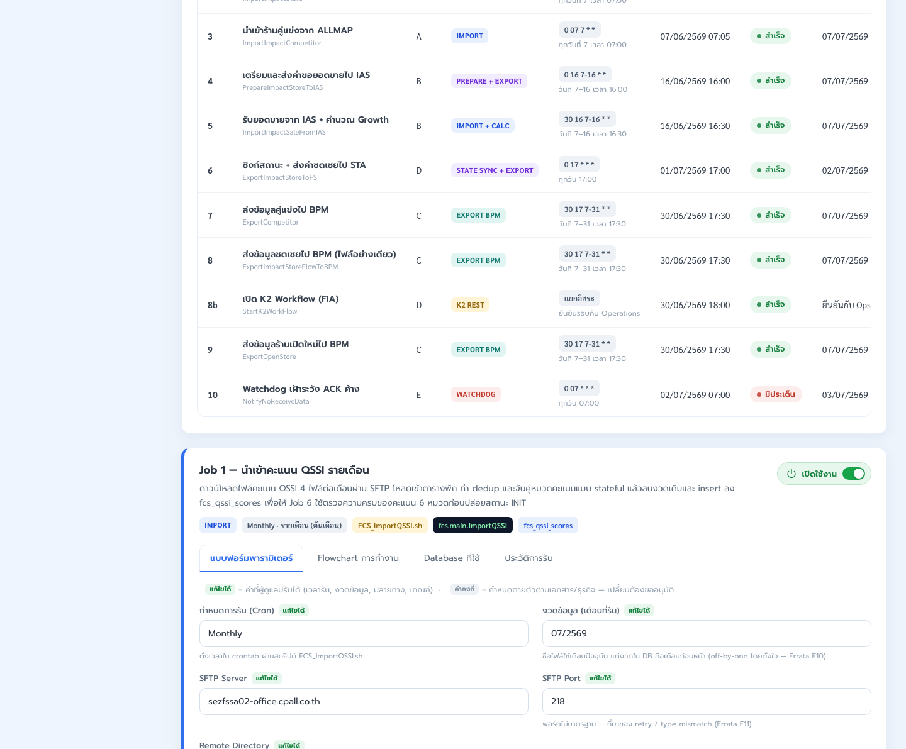
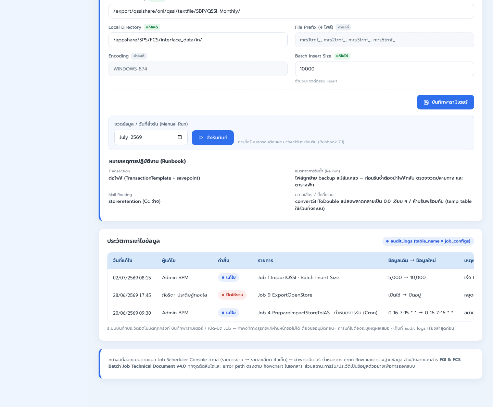

# LLDD FE - Batch Job Monitor

SBP Mall - ระบบประกันรายได้ | Low Level Design Document

## 1. Overview

| รายการ | รายละเอียด |
| --- | --- |
| Track | FE |
| Estimate | 24 ชั่วโมง |
| Owner | Kittisak <New> Kaeowika |
| Objective | สร้างหน้า Batch Job Monitor เฉพาะ 2 tab คือ แบบฟอร์มพารามิเตอร์ และประวัติการรัน สำหรับดู/แก้ค่าพารามิเตอร์ที่อนุญาตและตรวจสอบ run history ของ job |

## 2. Screen / Functional Scope

- Job selector/list สำหรับเลือก job ที่ต้องดูรายละเอียด
- Tab: แบบฟอร์มพารามิเตอร์
- Tab: ประวัติการรัน
- Editable parameter form ตาม metadata ของ job
- Locked parameter display สำหรับค่าที่แก้ไม่ได้
- Run history table และ run log/detail drawer

## 3. Screenshot Reference



_รูปที่ 1: Screenshot: job-batch-02.png_



_รูปที่ 2: Screenshot: job-batch-03.png_

## 4. Field, Format, and Validation

| Field / UI | Format | Validation | Behavior |
| --- | --- | --- | --- |
| selectedJobNo | string | required after selecting job | รหัส job เช่น 1, 8b, 10 |
| activeTab | enum | formParameter หรือ historyRun | default เป็น formParameter เมื่อเลือก job |
| editableParams | object/list | editable=true เท่านั้น | แสดง input/select/date ตาม field metadata และบันทึกเฉพาะ field ที่แก้ได้ |
| lockedParams | object/list | read-only | แสดงเป็น disabled/read-only พร้อม badge ค่าคงที่หรือแก้ไม่ได้ |
| runHistory | array | read-only | แสดง runId, status, start/end time, duration, trigger, operator, summary/error |
| runStatus | enum | SUCCESS, FAILED, RUNNING, QUEUED | ใช้ status badge สีตาม dictionary และ resolve label จาก statusCode |

### 4.93 Input / Progress / Output Contract

| Stage | Contract for implementation |
| --- | --- |
| Input | Selected jobNo, editable parameter form values, run-history filters, and current operator permission. |
| Progress | Load job list, select job, render params/history tabs, validate changed params, save with audit, refresh history after manual run. |
| Output | Updated job parameter snapshot, visible run-history status, validation messages, and audit reference for saved changes. |

### 4.90 Developer Implementation Scope

| Area | Implementation detail | Definition of done |
| --- | --- | --- |
| Page shell | แสดงรายการ job เพื่อเลือก job ที่ต้องดูรายละเอียด และเปิด detail panel ของ job ที่เลือก | เลือก job แล้ว panel แสดงชื่อ job, คำอธิบาย, tags และ tab default เป็นแบบฟอร์มพารามิเตอร์ |
| Tab set | สร้างเฉพาะ 2 tab ที่ต้องใช้งานจริง: แบบฟอร์มพารามิเตอร์ และประวัติการรัน | ไม่มี requirement ให้ dev ทำ tab Flowchart การทำงาน หรือ Database ที่ใช้ใน scope นี้ |
| Form parameter | render field ตาม metadata ของแต่ละ job โดยแยก editable/read-only ให้ชัด | field ที่ read-only แก้ไม่ได้, editable field validate ก่อนบันทึก และส่งเฉพาะค่าที่แก้ได้ |
| History run | แสดงประวัติ run ของ job ที่เลือก พร้อม status, เวลาเริ่ม, เวลาจบ, duration, trigger, ผู้สั่ง และ summary/error | sort ล่าสุดก่อน, filter status ได้ถ้ามี control บนหน้า, เปิด row เพื่อดู log/detail ได้ |
| Reference material | flowchart การทำงานและฐานข้อมูลที่ใช้เป็นเอกสารอ้างอิงสำหรับ dev เท่านั้น | ไม่ถูกนับเป็น UI deliverable ของ Batch Monitor และไม่ต้องทำรายละเอียดเทคนิค backend/storage ในเอกสารนี้ |

### 4.91 Two-tab Behavior

| Tab | Visible content | Editable / Action rule |
| --- | --- | --- |
| แบบฟอร์มพารามิเตอร์ | ข้อมูลรอบการรัน, cron/schedule, source/target path, file prefix, encoding, batch size, manual run period และ note/runbook ที่เกี่ยวข้อง | แก้ได้เฉพาะ field ที่ metadata ระบุ editable; save button disabled จนกว่าจะมีการแก้ไขและ validate ผ่าน |
| ประวัติการรัน | ตาราง run history, status badge, start/end time, duration, trigger type, operator, result summary และปุ่มดูรายละเอียด log | เป็น read-only; action หลักคือเปิดรายละเอียด run/log จาก row ที่เลือก |

### 4.92 UI States and Error Handling

| State | Trigger | UI behavior |
| --- | --- | --- |
| No selected job | เปิดหน้าครั้งแรกก่อนเลือก job | แสดง placeholder ให้เลือก job จากรายการ และไม่แสดง form/history ของ job ใด |
| Loading selected job | เลือก job หรือ refresh detail | แสดง loading placeholder เฉพาะ detail panel โดยไม่ clear รายการ job ด้านบน |
| Dirty parameter form | แก้ editable field แล้ว | แสดง unsaved indicator, เปิดปุ่มบันทึก และเตือนเมื่อเปลี่ยน job/tab ออกจาก form หากยังไม่บันทึก |
| Validation error | required/format/range ไม่ผ่าน | แสดง inline error ใต้ field และไม่บันทึกค่า |
| Empty history | job ยังไม่มี run history ใน filter ปัจจุบัน | แสดง empty state ใน tab ประวัติการรัน โดยไม่ซ่อน tab |

## 5. Button / User Action Mapping

| Action | Trigger | UI Area | Expected Result |
| --- | --- | --- | --- |
| Select job | click job row | Job selector/list | โหลด detail panel ของ job ที่เลือกและเปิด tab แบบฟอร์มพารามิเตอร์ |
| Open Form Parameter tab | click tab | แบบฟอร์มพารามิเตอร์ | แสดง editable/read-only parameter fields ของ job ที่เลือก |
| Edit parameter | change input/select/date | แบบฟอร์มพารามิเตอร์ | validate field, mark form dirty และเปิดปุ่มบันทึกเมื่อข้อมูลถูกต้อง |
| Save parameter form | click save | แบบฟอร์มพารามิเตอร์ | บันทึกเฉพาะ editable parameter values และแสดง saved state |
| Open History Run tab | click tab | ประวัติการรัน | แสดง run history ล่าสุดของ job ที่เลือก |
| Open run detail | click history row/detail | ประวัติการรัน | เปิด drawer/modal รายละเอียด run log แบบ read-only |

## 6. API Contract

### GET /api/v1/jobs

โหลดรายการ job และสถานะล่าสุด

#### Query Params

```json
{
  "page": 1,
  "size": 20
}
```

#### Request Field Schema

| Field | Type | Required | Constraint / Meaning |
| --- | --- | --- | --- |
| page | integer | No | >= 1; default 1 |
| size | integer | No | 1..100; default 20 |

#### Response

```json
{
  "page": 1,
  "size": 20,
  "total": 11,
  "items": [
    {
      "jobNo": "8b",
      "name": "StartInternalWorkflow",
      "enabled": true,
      "scheduleMode": "AFTER_JOB",
      "scheduleExpression": "8",
      "currentStatus": "SUCCESS",
      "lastRunId": 4451,
      "lastRunAt": "2026-07-22T05:35:00+07:00"
    }
  ]
}
```

#### Response Field Schema

| Field | Type | Required | Constraint / Meaning |
| --- | --- | --- | --- |
| page | integer | Yes | >= 1; default 1 |
| size | integer | Yes | 1..100; default 20 |
| total | integer | Yes | UTF-8; use value domain described by endpoint purpose |
| items | array<object> | Yes | JSON array; element type shown in Type column |
| items[].jobNo | string | Yes | UTF-8; use value domain described by endpoint purpose |
| items[].name | string | Yes | UTF-8; use value domain described by endpoint purpose |
| items[].enabled | boolean | Yes | UTF-8; use value domain described by endpoint purpose |
| items[].scheduleMode | string | Yes | UTF-8; use value domain described by endpoint purpose |
| items[].scheduleExpression | string | Yes | UTF-8; use value domain described by endpoint purpose |
| items[].currentStatus | string | Yes | UTF-8; use value domain described by endpoint purpose |
| items[].lastRunId | integer | Yes | UTF-8; use value domain described by endpoint purpose |
| items[].lastRunAt | string | Yes | ISO-8601 ค.ศ.; nullable only when type includes null |

### GET /api/v1/jobs/{jobNo}

โหลด metadata/parameter schema ของ job ที่เลือก

#### Query Params

```json
{
  "jobNo": "8b"
}
```

#### Request Field Schema

| Field | Type | Required | Constraint / Meaning |
| --- | --- | --- | --- |
| jobNo | string | No | UTF-8; use value domain described by endpoint purpose |

#### Response

```json
{
  "jobNo": "8b",
  "name": "StartInternalWorkflow",
  "enabled": true,
  "scheduleMode": "AFTER_JOB",
  "scheduleExpression": "8",
  "parameters": [
    {
      "key": "period",
      "label": "งวดข้อมูล",
      "type": "MONTH",
      "value": "2026-07",
      "editable": true,
      "required": true
    },
    {
      "key": "workflowApi",
      "label": "Workflow API",
      "type": "STRING",
      "value": "/api/v1/workflows/instances",
      "editable": false,
      "required": true
    }
  ]
}
```

#### Response Field Schema

| Field | Type | Required | Constraint / Meaning |
| --- | --- | --- | --- |
| jobNo | string | Yes | UTF-8; use value domain described by endpoint purpose |
| name | string | Yes | UTF-8; use value domain described by endpoint purpose |
| enabled | boolean | Yes | UTF-8; use value domain described by endpoint purpose |
| scheduleMode | string | Yes | UTF-8; use value domain described by endpoint purpose |
| scheduleExpression | string | Yes | UTF-8; use value domain described by endpoint purpose |
| parameters | array<object> | Yes | JSON array; element type shown in Type column |
| parameters[].key | string | Yes | UTF-8; use value domain described by endpoint purpose |
| parameters[].label | string | Yes | UTF-8; use value domain described by endpoint purpose |
| parameters[].type | string | Yes | UTF-8; use value domain described by endpoint purpose |
| parameters[].value | string | Yes | UTF-8; use value domain described by endpoint purpose |
| parameters[].editable | boolean | Yes | UTF-8; use value domain described by endpoint purpose |
| parameters[].required | boolean | Yes | UTF-8; use value domain described by endpoint purpose |

### PUT /api/v1/jobs/{jobNo}/params

บันทึกเฉพาะ parameter ที่ editable

#### Request

```json
{
  "params": {
    "period": "2026-07"
  },
  "reason": "ปรับงวด manual run"
}
```

#### Request Field Schema

| Field | Type | Required | Constraint / Meaning |
| --- | --- | --- | --- |
| params | object | Yes | JSON object; nested fields listed below |
| params.period | string | Yes | UTF-8; use value domain described by endpoint purpose |
| reason | string | Yes | trimmed UTF-8 Thai text; required by operation/business rule |

#### Response

```json
{
  "jobNo": "8b",
  "configVersion": 12,
  "updatedKeys": [
    "period"
  ],
  "message": "saved"
}
```

#### Response Field Schema

| Field | Type | Required | Constraint / Meaning |
| --- | --- | --- | --- |
| jobNo | string | Yes | UTF-8; use value domain described by endpoint purpose |
| configVersion | integer | Yes | UTF-8; use value domain described by endpoint purpose |
| updatedKeys | array<string> | Yes | JSON array; element type shown in Type column |
| message | string | Yes | UTF-8; use value domain described by endpoint purpose |

### PUT /api/v1/jobs/{jobNo}/enabled

เปิด/ปิด job

#### Request

```json
{
  "enabled": false,
  "reason": "ปิดชั่วคราวช่วงปิดงบ"
}
```

#### Request Field Schema

| Field | Type | Required | Constraint / Meaning |
| --- | --- | --- | --- |
| enabled | boolean | Yes | UTF-8; use value domain described by endpoint purpose |
| reason | string | Yes | trimmed UTF-8 Thai text; required by operation/business rule |

#### Response

```json
{
  "jobNo": "8b",
  "enabled": false,
  "message": "saved"
}
```

#### Response Field Schema

| Field | Type | Required | Constraint / Meaning |
| --- | --- | --- | --- |
| jobNo | string | Yes | UTF-8; use value domain described by endpoint purpose |
| enabled | boolean | Yes | UTF-8; use value domain described by endpoint purpose |
| message | string | Yes | UTF-8; use value domain described by endpoint purpose |

### POST /api/v1/jobs/{jobNo}/run

สั่ง manual run โดยกัน run ซ้อน

#### Request

```json
{
  "params": {
    "period": "2026-07"
  },
  "reason": "rerun หลังแก้ข้อมูลต้นทาง"
}
```

#### Request Field Schema

| Field | Type | Required | Constraint / Meaning |
| --- | --- | --- | --- |
| params | object | Yes | JSON object; nested fields listed below |
| params.period | string | Yes | UTF-8; use value domain described by endpoint purpose |
| reason | string | Yes | trimmed UTF-8 Thai text; required by operation/business rule |

#### Response

```json
{
  "runId": 4452,
  "jobNo": "8b",
  "status": "QUEUED",
  "queuedAt": "2026-07-22T11:00:00+07:00"
}
```

#### Response Field Schema

| Field | Type | Required | Constraint / Meaning |
| --- | --- | --- | --- |
| runId | integer | Yes | UTF-8; use value domain described by endpoint purpose |
| jobNo | string | Yes | UTF-8; use value domain described by endpoint purpose |
| status | string | Yes | UTF-8; use value domain described by endpoint purpose |
| queuedAt | string | Yes | ISO-8601 ค.ศ.; nullable only when type includes null |

### GET /api/v1/jobs/{jobNo}/runs

โหลดประวัติการรันล่าสุดก่อน

#### Query Params

```json
{
  "status": "FAILED",
  "page": 1,
  "size": 20
}
```

#### Request Field Schema

| Field | Type | Required | Constraint / Meaning |
| --- | --- | --- | --- |
| status | string | No | UTF-8; use value domain described by endpoint purpose |
| page | integer | No | >= 1; default 1 |
| size | integer | No | 1..100; default 20 |

#### Response

```json
{
  "page": 1,
  "size": 20,
  "total": 1,
  "items": [
    {
      "runId": 4450,
      "jobNo": "8b",
      "status": "FAILED",
      "triggerType": "MANUAL",
      "triggeredBy": "E001",
      "startedAt": "2026-07-22T05:20:00+07:00",
      "endedAt": "2026-07-22T05:21:30+07:00",
      "durationSec": 90,
      "readCount": 10,
      "successCount": 9,
      "rejectCount": 1,
      "errorCode": "GEN_FLOW_GATE_NOT_READY",
      "errorMessage": "ข้อมูลผู้อนุมัติยังไม่ครบ"
    }
  ]
}
```

#### Response Field Schema

| Field | Type | Required | Constraint / Meaning |
| --- | --- | --- | --- |
| page | integer | Yes | >= 1; default 1 |
| size | integer | Yes | 1..100; default 20 |
| total | integer | Yes | UTF-8; use value domain described by endpoint purpose |
| items | array<object> | Yes | JSON array; element type shown in Type column |
| items[].runId | integer | Yes | UTF-8; use value domain described by endpoint purpose |
| items[].jobNo | string | Yes | UTF-8; use value domain described by endpoint purpose |
| items[].status | string | Yes | UTF-8; use value domain described by endpoint purpose |
| items[].triggerType | string | Yes | UTF-8; use value domain described by endpoint purpose |
| items[].triggeredBy | string | Yes | UTF-8; use value domain described by endpoint purpose |
| items[].startedAt | string | Yes | ISO-8601 ค.ศ.; nullable only when type includes null |
| items[].endedAt | string | Yes | ISO-8601 ค.ศ.; nullable only when type includes null |
| items[].durationSec | integer | Yes | UTF-8; use value domain described by endpoint purpose |
| items[].readCount | integer | Yes | UTF-8; use value domain described by endpoint purpose |
| items[].successCount | integer | Yes | UTF-8; use value domain described by endpoint purpose |
| items[].rejectCount | integer | Yes | UTF-8; use value domain described by endpoint purpose |
| items[].errorCode | string | Yes | UTF-8; use value domain described by endpoint purpose |
| items[].errorMessage | string | Yes | UTF-8; use value domain described by endpoint purpose |

## 7. Tab Interaction Flow

| Step | Description |
| --- | --- |
| 1 | Open Batch Monitor |
| 2 | Select job from job selector/list |
| 3 | Render detail panel with Form Parameter tab as default |
| 4 | Edit editable parameter fields and save valid changes |
| 5 | Switch to History Run tab |
| 6 | Open a run history row to inspect log/detail |

## 8. Acceptance Criteria

- เอกสารนี้กำหนด UI ที่ต้องทำเพียง 2 tab: แบบฟอร์มพารามิเตอร์ และประวัติการรัน
- flowchart การทำงานและฐานข้อมูลที่ใช้เป็น reference/dev lookup เท่านั้น ไม่ใช่ implementation scope ของเอกสารนี้
- รายละเอียดเทคนิค backend/storage ของ batch ไม่อยู่ในเอกสาร FE Batch Monitor
- locked parameter ต้องแก้ไม่ได้และต้องไม่ถูกส่งเป็นค่าที่ user แก้ไข
- history run เป็น read-only และเปิดรายละเอียด log ได้จาก row ที่เลือก

## 9. Developer Test Checklist

| No | Test |
| --- | --- |
| 1 | select job and default to form parameter tab |
| 2 | edit editable parameter and validate required/range |
| 3 | confirm locked parameter remains read-only |
| 4 | save parameter form sends editable values only |
| 5 | switch to history run tab and sort latest first |
| 6 | open run detail/log from history row |
| 7 | verify flowchart/database tabs are not required deliverables |
