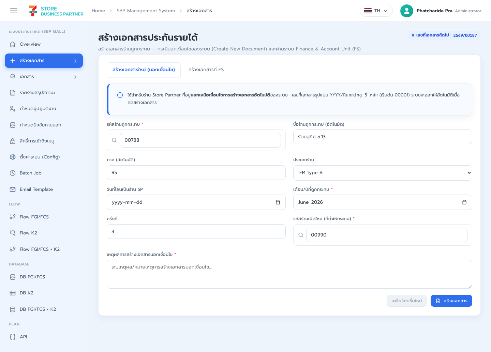
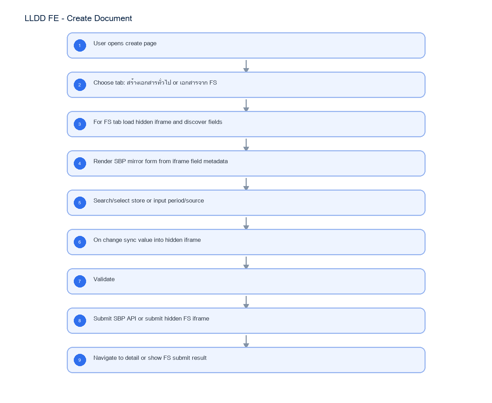

# LLDD FE - Create Document

SBP Mall - ระบบประกันรายได้ | Low Level Design Document

## 1. Overview

| รายการ | รายละเอียด |
| --- | --- |
| Track | FE |
| Estimate | 30 ชั่วโมง |
| Owner | Kittisak <New> Kaeowika |
| Objective | สร้างหน้าสร้างเอกสารประกันรายได้แบบ Manual และแบบเอกสารจาก FS โดยใช้ SBP mirror form sync เข้า hidden FS iframe |

Common contract reference: ทุกหัวข้อ API/FE ต้องยึด LLDD-BE-API-Common-Contracts และ LLDD-FE-Integration-Contracts สำหรับ error/auth/format/pagination/action/RBAC ก่อนลงรายละเอียดเฉพาะหน้าหรือเฉพาะ endpoint

## 2. Screen / Functional Scope

- Create form shell
- Tab: สร้างเอกสารทั่วไป
- Tab: เอกสารจาก FS ผ่าน hidden iframe
- Store selector
- Period/source fields
- FS field discovery/mirror form
- Validation
- Draft/save/submit UI

## 3. Screenshot Reference



_รูปที่ 1: Screenshot: k2-create-01.png_

## 4. Implementation Flow Diagram (Reference)



_รูปที่ 2: Implementation flow reference: LLDD FE - Create Document_

## 5. Field, Format, and Validation

| Field / UI | Format | Validation | Behavior |
| --- | --- | --- | --- |
| source | MANUAL\|FS | required | แสดง section ตาม source; payload ใช้ชื่อ field `source` |
| activeTab | MANUAL\|FS_IFRAME | required UI state | เลือก tab สร้างเอกสารทั่วไปหรือเอกสารจาก FS |
| fsIframeUrl | URL | required for FS tab | อ่านจาก config; ใช้โหลด hidden iframe ของ FS |
| fsFieldMap | array | required after iframe load | metadata ของ input/select/textarea ที่อ่านจาก iframe เพื่อ render SBP mirror form |
| fsMirrorValues | object | required for FS tab | state ของ form ฝั่ง SBP ที่ sync เข้า hidden iframe เมื่อ change/submit |
| impactedStoreCode | string 5 digits | required | ค้นหาด้วย popup ร้านถูกกระทบ; คง leading zero |
| impactedStoreName | string | readonly after select | เติมอัตโนมัติหลังเลือกร้าน |
| newStoreCode | string 5 digits | required | เลือกร้านเปิดใหม่จาก popup; ส่งรหัสร้านและคง leading zero |
| impactMonth | YYYY-MM | required | month picker; FE แสดง พ.ศ. แต่ส่ง ค.ศ. |
| statementPeriod | YYYY-MM | required for FS | Period Statement จาก SRS SCR-02 |
| roundNo | integer >= 1 | required/default 1 | ครั้งที่ของเอกสาร/งวดชดเชย |
| reason | text | required for MANUAL/out-of-condition | เหตุผลการสร้างเอกสารนอกเงื่อนไข; trim ก่อนส่ง |

### 5.1 Tab Structure

หน้า Create Document ต้องมี tab แยกสำหรับสร้างเอกสารจาก FS โดย UI หลักยังเป็น form ของ SBP Mall แต่มี hidden iframe ของ FS เป็น source/submit target จริง

| Tab | Purpose | Render behavior |
| --- | --- | --- |
| สร้างเอกสารทั่วไป | สร้างเอกสาร MANUAL/out-of-condition ผ่าน API ของ SBPGI | ใช้ form ปกติและ submit POST /api/v1/documents |
| เอกสารจาก FS | สร้างเอกสารโดยอ้าง field/form ของ FS เดิม | โหลด FS iframe แบบ hidden แล้วสร้าง SBP form mirror ตาม field ที่พบใน iframe |

### 5.2 FS iframe Integration Contract

| Item | Required behavior | Dev note |
| --- | --- | --- |
| iframe element | `<iframe id="fsCreateFrame" hidden>` อยู่ในหน้า Create Document | iframe ต้อง load ก่อน render field mirror; แสดง loading state ระหว่างรอ |
| iframe source | URL มาจาก config เช่น `fs.createDocumentUrl` | ห้าม hardcode URL ใน component |
| Access model | ถ้า same-origin ให้ใช้ DOM adapter; ถ้า cross-origin ให้ใช้ SBP-FS Bridge Protocol v1 ด้านล่างเท่านั้น | ตรวจ event.origin และ event.source ทุกข้อความ; protocol ไม่พร้อมให้ fail closed พร้อม code FS_BRIDGE_UNAVAILABLE |
| Field discovery | อ่าน input/select/textarea ใน FS form แล้ว map เป็น SBP field model | ใช้ name/id/data-label/required/type/options จาก FS เป็น metadata |
| Hidden source of truth | FS iframe เป็น submit target จริง; SBP form เป็น mirror สำหรับ UX/validation | ห้าม submit API โดยตรงแทน FS ใน tab นี้ เว้นแต่ FS callback ระบุให้ทำ |
| Submit target | เมื่อ user กดส่ง ให้ sync values ทั้งหมดเข้า iframe แล้ว trigger submit ของ FS form | ป้องกัน double submit และรอ iframe load/callback หลัง submit |

### 5.3 FS Field Mapping

| SBP mirror field | FS iframe field source | Mapping rule |
| --- | --- | --- |
| impactedStoreCode | input[name=impactedStoreCode] หรือ field ที่ FS ระบุเป็นร้านถูกกระทบ | คง string 5 digits; leading zero ต้องไม่หาย |
| newStoreCode | input[name=newStoreCode] หรือ field ร้านเปิดใหม่ของ FS | คง string 5 digits; validate ก่อน sync |
| impactMonth | month/date field ของ FS | SBP แสดง พ.ศ. ได้ แต่ sync เป็น format ที่ FS field ต้องการ |
| statementPeriod | period field ของ FS | required สำหรับ FS tab |
| roundNo | round/sequence field ของ FS | default 1 ถ้า FS field ว่างและ metadata อนุญาต |
| reason/remark | textarea/input remark ของ FS | trim ก่อน sync; preserve Thai text |
| dynamicFields[] | field เพิ่มเติมที่พบใน FS form | render ตาม type/options/required จาก FS และเก็บ mapping ไว้ใน form state |

### 5.4 Change and Submit Flow

| Step | FE behavior | Failure handling |
| --- | --- | --- |
| 1. Open FS tab | โหลด hidden iframe จาก config และรอ iframe load | timeout แสดง error พร้อม retry; ไม่ render empty form |
| 2. Discover fields | อ่าน field metadata จาก iframe form แล้วสร้าง SBP mirror form | field required แต่ไม่รู้ label ให้ใช้ name/id เป็น fallback |
| 3. User changes value | update SBP state แล้ว sync ค่าเข้า iframe field ทันที | ถ้า sync field ไม่พบ ให้ mark fieldMappingError และห้าม submit |
| 4. Client validate | validate required/type/range ตาม metadata จาก FS และ validation กลางของ SBP | แสดง inline error ใน SBP form |
| 5. Submit | sync all values อีกครั้ง, dispatch input/change event ใน iframe, แล้ว submit FS form | disable submit จนกว่า iframe submit result/callback กลับมา |
| 6. Handle result | รับ FS_SUBMIT_RESULT ที่ requestId ตรงกับคำขอ; success navigate ไป detail เมื่อมี docNo | timeout หรือ schema ไม่ถูกต้องให้ปลด submitting state และแสดง error ที่ retry ได้; ห้ามเดาสถานะสำเร็จ |

### 5.5 SBP-FS Bridge Protocol v1

| Envelope field | Type | Required | Rule |
| --- | --- | --- | --- |
| protocolVersion | literal `1.0` | Yes | reject version อื่นด้วย FS_PROTOCOL_VERSION_UNSUPPORTED |
| type | message enum | Yes | FS_FORM_READY \| SBP_FIELD_DISCOVERY_REQUEST \| FS_FIELD_SCHEMA \| SBP_SET_VALUES \| SBP_SUBMIT \| FS_SUBMIT_RESULT \| FS_ERROR |
| requestId | UUID string | Yes | สร้างใหม่ต่อ request และใช้ correlate response |
| correlationId | UUID string \| null | Response only | ต้องเท่ากับ requestId ของ message ที่ตอบ |
| timestamp | ISO-8601 string | Yes | ใช้ตรวจ stale message; ไม่ใช้เป็น authorization |
| source | literal `SBP` \| `FS` | Yes | ต้องสอดคล้องกับ window ฝั่งผู้ส่ง |
| payload | object | Yes | validate ตาม type ก่อนใช้ |

#### Message payload schemas

| Message type | Payload fields | Response / rule |
| --- | --- | --- |
| FS_FORM_READY | formId:string, capabilities:string[], schemaVersion:string | SBP ส่ง SBP_FIELD_DISCOVERY_REQUEST เมื่อ capabilities มี FIELD_SCHEMA |
| SBP_FIELD_DISCOVERY_REQUEST | formId:string | FS ตอบ FS_FIELD_SCHEMA ด้วย correlationId |
| FS_FIELD_SCHEMA | formId:string, fields:FsFieldDescriptor[] | descriptor ทุกตัวต้องผ่าน schema ด้านล่าง |
| SBP_SET_VALUES | formId:string, values:Record<string,string\|number\|boolean\|null> | FS validate key ที่รู้จักและตอบ FS_ERROR เมื่อ map ไม่ได้ |
| SBP_SUBMIT | formId:string, values:Record<...>, clientReference:string | idempotent ต่อ requestId; ห้าม submit ซ้ำ |
| FS_SUBMIT_RESULT | success:boolean, fsReference:string\|null, docNo:string\|null, fieldErrors:FieldError[] | success=true ต้องมี fsReference; docNo เป็น optional |
| FS_ERROR | code:string, message:string, retryable:boolean, field:string\|null | FE แสดง message และเปิด retry เฉพาะ retryable=true |

| FsFieldDescriptor field | Type | Required | Constraint |
| --- | --- | --- | --- |
| name | string | Yes | unique within form; key used by values map |
| label | string | Yes | UTF-8 display label |
| type | enum text\|number\|date\|month\|select\|radio\|checkbox\|textarea\|hidden | Yes | unknown type is rejected |
| required | boolean | Yes | drives client validation |
| readOnly | boolean | Yes | read-only field is never overwritten by SBP |
| value | string\|number\|boolean\|null | Yes | initial value |
| options | array<{value:string,label:string}>\|null | For select/radio | selected value must exist in options |
| constraints | {min,max,minLength,maxLength,pattern}\|null | No | FE and FS both validate |

#### Handshake, security and timeout

| Phase | Required behavior | Timeout / failure |
| --- | --- | --- |
| Origin setup | allowlist มาจาก config และ targetOrigin ต้องเป็น origin เฉพาะ ห้ามใช้ `*` | origin ไม่ตรงให้ ignore และ security log โดยไม่ log payload |
| Ready | รอ FS_FORM_READY จาก iframe window เดียวกัน | 10s -> FS_BRIDGE_TIMEOUT; retry reload iframe ได้ 1 ครั้ง |
| Schema | ส่ง discovery และ validate FS_FIELD_SCHEMA | 5s หรือ schema invalid -> FS_FIELD_SCHEMA_INVALID |
| Value sync | ส่ง SBP_SET_VALUES พร้อม requestId ใหม่และ debounce 150ms | FS_ERROR ผูก correlationId กลับ field |
| Submit | ส่ง SBP_SUBMIT หนึ่งครั้งและ disable submit | 30s -> FS_SUBMIT_TIMEOUT; user retry สร้าง requestId ใหม่ |
| Result | ยอมรับเฉพาะ correlationId ที่ pending และ source/origin ถูกต้อง | late/duplicate result ถูก ignore แบบ idempotent |

#### Protocol example

#### FS_FIELD_SCHEMA

```json
{
  "protocolVersion": "1.0",
  "type": "FS_FIELD_SCHEMA",
  "requestId": "6f6c8cf0-7df1-4a1a-9e7f-4d953667a824",
  "correlationId": "a8e88f2a-e83b-47ce-99f5-fdcad1876095",
  "timestamp": "2026-07-22T10:15:00+07:00",
  "source": "FS",
  "payload": {
    "formId": "income-guarantee-create",
    "fields": [
      {
        "name": "impactedStoreCode",
        "label": "รหัสร้านถูกกระทบ",
        "type": "text",
        "required": true,
        "readOnly": false,
        "value": "00788",
        "options": null,
        "constraints": {
          "pattern": "^[0-9]{5}$"
        }
      }
    ]
  }
}
```

### 5.6 Acceptance Criteria for FS Tab

- tab เอกสารจาก FS ต้องโหลด hidden iframe และสร้าง mirror form จาก field metadata ได้
- เมื่อ user เปลี่ยนค่าใน SBP form ค่าเดียวกันต้องถูก sync เข้า iframe field ที่ map ไว้
- กด submit ต้อง sync ทุก field อีกครั้งก่อน submit FS iframe form
- field ที่ required ใน FS ต้องแสดง required ใน SBP mirror form
- store code 5 หลักต้องไม่สูญเสีย leading zero ระหว่าง SBP form -> iframe
- cross-origin ต้อง handshake, discover schema, sync, submit และรับผลผ่าน SBP-FS Bridge Protocol v1 ครบ
- message ที่ origin/source/version/correlationId ไม่ถูกต้องต้องถูก ignore หรือ reject แบบ fail closed
- timeout และ FS_ERROR ต้องออกจาก loading/submitting state และ retry ได้ตาม retryable flag

## 5.1 Input / Progress / Output Contract

| Stage | Contract for implementation |
| --- | --- |
| Input | GET /api/v1/stores/search; GET /api/v1/configs/fs.createDocumentUrl; POST /api/v1/documents |
| Progress | User opens create page; Choose tab: สร้างเอกสารทั่วไป or เอกสารจาก FS; For FS tab load hidden iframe and discover fields; Render SBP mirror form from iframe field metadata |
| Output | Rendered UI state or normalized API response with status/message and audit-ready trace reference. |

### 5.90 Create Document Component Contract

| ID | Component / Scope | Single responsibility | Definition of done |
| --- | --- | --- | --- |
| C01 | Create form shell | เป็นเจ้าของ source/activeTab, draft state และ unsaved-change guard ของหน้า create | สลับ MANUAL/FS แล้ว field ที่ไม่เกี่ยวข้องไม่รั่วเข้า payload |
| C02 | Tab: สร้างเอกสารทั่วไป | render manual form, store selectors, period, roundNo และ reason สำหรับเอกสารนอกเงื่อนไข | required/format ผ่านก่อน POST และ docNo จาก response ใช้เปิด detail |
| C03 | Tab: เอกสารจาก FS ผ่าน hidden iframe | โหลด hidden FS iframe ด้วย config URL และจัด lifecycle timeout/origin/callback | iframe load/error/timeout มี state ชัดเจนและไม่ submit ก่อน bridge พร้อม |
| C04 | Store selector | ค้นหา impacted/new store, คง leading zero และเติมชื่อ/ภาคจากรายการที่เลือก | เลือกผิด type ไม่ได้และ clear selection ล้าง dependent fields ครบ |
| C05 | Period/source fields | แปลงเดือน/ปีที่แสดงเป็น พ.ศ. ไป payload YYYY-MM ค.ศ. พร้อม source-specific validation | period/statementPeriod/roundNo ส่ง type และ format ตรง API |
| C06 | FS field discovery/mirror form | สร้าง mirror field registry จาก FS metadata และ sync input/select/textarea เข้า iframe | ทุก field มี mapping/type/event และ missing mapping block submit ด้วย FS_FIELD_MAPPING_MISSING |
| C07 | Validation | รวม client validation, API fieldErrors และ FS bridge errors ใต้ control ที่เกี่ยวข้อง | focus ไป error แรกและข้อความเดิมคงอยู่จนผู้ใช้แก้ field นั้น |
| C08 | Draft/save/submit UI | แยก Save Draft, Submit MANUAL และ Submit FS พร้อม disable/confirm/dedup ระหว่าง request | double click ไม่สร้างซ้ำและ success/error แสดงผลตาม channel ที่ส่งจริง |

### 5.91 Create Document API Adapter Map

| Endpoint | Typed adapter purpose | Invoked by |
| --- | --- | --- |
| GET /api/v1/stores/search | ค้นหาร้านสำหรับ popup | Search store (แว่นขยาย) |
| GET /api/v1/configs/fs.createDocumentUrl | อ่าน URL สำหรับโหลด FS iframe ใน tab เอกสารจาก FS | Open FS tab (tab เอกสารจาก FS) |
| POST /api/v1/documents | สร้างเอกสาร | Save draft (ปุ่มบันทึก); Submit (ปุ่มส่งดำเนินการ) |

### 5.92 Create Document Interaction State Machine

| Action | Trigger | API / State transition | Expected visible result |
| --- | --- | --- | --- |
| Search store | แว่นขยาย | GET /api/v1/stores/search | เลือก impacted/new store |
| Open FS tab | tab เอกสารจาก FS | Load hidden iframe from fsIframeUrl | discover FS fields and render SBP mirror form |
| Change FS mirror value | input/select ใน SBP mirror form | iframe value sync service | ส่งค่าเข้า field ใน hidden iframe และ dispatch input/change |
| Save draft | ปุ่มบันทึก | POST /api/v1/documents | สร้าง draft |
| Submit | ปุ่มส่งดำเนินการ | POST /api/v1/documents | สร้างเอกสารและเริ่ม workflow |
| Submit FS iframe | ปุ่มส่งใน tab เอกสารจาก FS | sync all mirror values + submit iframe form | submit form ของ FS ใน hidden iframe |

### 5.93 Create Document Feature Failure Checks

| Case | Feature-specific scenario | Expected evidence |
| --- | --- | --- |
| FE-01 | ไม่เลือก store | required fields ทำงาน |
| FE-02 | period format ผิด | docNo ได้จาก API for MANUAL |
| FE-03 | submit success | FS tab loads iframe and renders mirror form |
| FE-04 | API duplicate error | changing SBP mirror field updates hidden iframe field |
| FE-05 | FS iframe load timeout | FS submit syncs all values before iframe submit |
| FE-06 | FS field mapping missing | validation message ชัดเจน |

## 6. Button / User Action Mapping

| Action | Trigger | API / Service | Expected Result |
| --- | --- | --- | --- |
| Search store | แว่นขยาย | GET /api/v1/stores/search | เลือก impacted/new store |
| Open FS tab | tab เอกสารจาก FS | Load hidden iframe from fsIframeUrl | discover FS fields and render SBP mirror form |
| Change FS mirror value | input/select ใน SBP mirror form | iframe value sync service | ส่งค่าเข้า field ใน hidden iframe และ dispatch input/change |
| Save draft | ปุ่มบันทึก | POST /api/v1/documents | สร้าง draft |
| Submit | ปุ่มส่งดำเนินการ | POST /api/v1/documents | สร้างเอกสารและเริ่ม workflow |
| Submit FS iframe | ปุ่มส่งใน tab เอกสารจาก FS | sync all mirror values + submit iframe form | submit form ของ FS ใน hidden iframe |

## 7. API Contract

### GET /api/v1/stores/search

ค้นหาร้านสำหรับ popup

#### Query Params

```json
{
  "q": "012",
  "type": "impacted"
}
```

#### Request Field Schema

| Field | Type | Required | Constraint / Meaning |
| --- | --- | --- | --- |
| q | string | No | UTF-8; use value domain described by endpoint purpose |
| type | string | No | UTF-8; use value domain described by endpoint purpose |

#### Response

```json
{
  "items": [
    {
      "storeCode": "01234",
      "storeName": "สาขาตัวอย่าง",
      "regionCode": "RS"
    }
  ]
}
```

#### Response Field Schema

| Field | Type | Required | Constraint / Meaning |
| --- | --- | --- | --- |
| items | array<object> | Yes | JSON array; element type shown in Type column |
| items[].storeCode | string | Yes | exactly 5 digits; preserve leading zero |
| items[].storeName | string | Yes | UTF-8; use value domain described by endpoint purpose |
| items[].regionCode | string | Yes | UTF-8; use value domain described by endpoint purpose |

### GET /api/v1/configs/fs.createDocumentUrl

อ่าน URL สำหรับโหลด FS iframe ใน tab เอกสารจาก FS

#### Query Params

```json
{}
```

#### Request Field Schema

| Field | Type | Required | Constraint / Meaning |
| --- | --- | --- | --- |
| - | none | No | No fields |

#### Response

```json
{
  "configKey": "fs.createDocumentUrl",
  "value": "https://fs.example/create-document"
}
```

#### Response Field Schema

| Field | Type | Required | Constraint / Meaning |
| --- | --- | --- | --- |
| configKey | string | Yes | UTF-8; use value domain described by endpoint purpose |
| value | string | Yes | UTF-8; use value domain described by endpoint purpose |

### POST /api/v1/documents

สร้างเอกสาร

#### Request

```json
{
  "source": "MANUAL",
  "impactMonth": "2026-07",
  "statementPeriod": "2026-07",
  "impactedStoreCode": "01234",
  "newStoreCode": "22864",
  "roundNo": 1,
  "reason": "สร้างเอกสารนอกเงื่อนไข"
}
```

#### Request Field Schema

| Field | Type | Required | Constraint / Meaning |
| --- | --- | --- | --- |
| source | string | Yes | UTF-8; use value domain described by endpoint purpose |
| impactMonth | string | Yes | ISO-8601 ค.ศ.; nullable only when type includes null |
| statementPeriod | string | Yes | UTF-8; use value domain described by endpoint purpose |
| impactedStoreCode | string | Yes | exactly 5 digits; preserve leading zero |
| newStoreCode | string | Yes | exactly 5 digits; preserve leading zero |
| roundNo | integer | Yes | UTF-8; use value domain described by endpoint purpose |
| reason | string | Yes | trimmed UTF-8 Thai text; required by operation/business rule |

#### Response

```json
{
  "docNo": "2569/00001",
  "statusCode": "06",
  "message": "created"
}
```

#### Response Field Schema

| Field | Type | Required | Constraint / Meaning |
| --- | --- | --- | --- |
| docNo | string | Yes | พ.ศ. YYYY/xxxxx |
| statusCode | string | Yes | canonical code; do not replace with display label |
| message | string | Yes | UTF-8; use value domain described by endpoint purpose |

## 9. Processing Flow

| Step | Description |
| --- | --- |
| 1 | User opens create page |
| 2 | Choose tab: สร้างเอกสารทั่วไป or เอกสารจาก FS |
| 3 | For FS tab load hidden iframe and discover fields |
| 4 | Render SBP mirror form from iframe field metadata |
| 5 | Search/select store or input period/source |
| 6 | On change sync value into hidden iframe |
| 7 | Validate |
| 8 | Submit SBP API or submit hidden FS iframe |
| 9 | Navigate to detail or show FS submit result |

## 10. Acceptance Criteria

- required fields ทำงาน
- docNo ได้จาก API for MANUAL
- FS tab loads iframe and renders mirror form
- changing SBP mirror field updates hidden iframe field
- FS submit syncs all values before iframe submit
- validation message ชัดเจน

## 11. Developer Test Checklist

| No | Test |
| --- | --- |
| 1 | ไม่เลือก store |
| 2 | period format ผิด |
| 3 | submit success |
| 4 | API duplicate error |
| 5 | FS iframe load timeout |
| 6 | FS field mapping missing |
| 7 | FS submit callback success/error |
