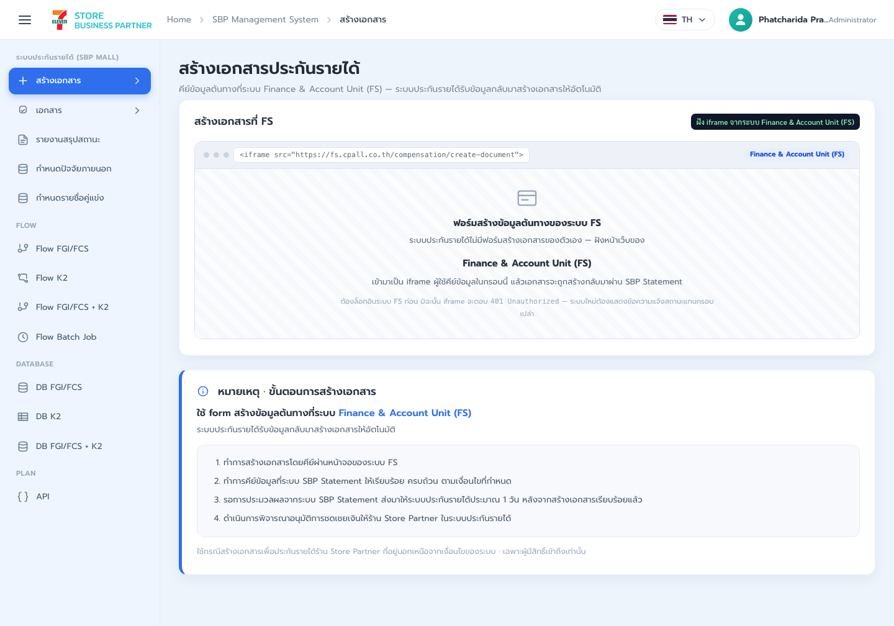
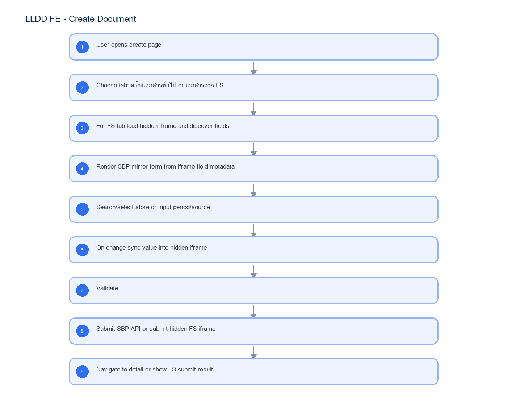

# LLDD FE - Create Document

SBP Mall - ระบบประกันรายได้ | Low Level Design Document

## 1. Overview

| รายการ | รายละเอียด |
| --- | --- |
| Track | FE |
| Estimate | **8 ชั่วโมง** = implementation 6 + unit test 2 (25%) |
| Owner | Kittisak <New> Kaeowika |
| Target repository | `SBP/srm-sps-spsap-web-frontend` (sbp-portal · Next.js · `NEXT_PUBLIC_APP_TARGET=sbpm`) — เรียก API ผ่าน `SBP/srm-sps-spsap-sbp-bff` เท่านั้น ห้ามยิง store-backend ตรง |
| Objective | หน้าสร้างเอกสารประกันรายได้ — **มติ 2026-08-06: ไม่มีฟอร์มฝั่ง SBP** main card เป็น iframe ของหน้าสร้างเอกสารระบบ FS ตรง ๆ + หมายเหตุ 4 ขั้นตอนใต้ iframe · `POST /sbpgi/document` เรียกโดย pipeline/service token |

Common contract reference: ทุกหัวข้อ API/FE ต้องยึด LLDD-BE-API-Common-Contracts และ LLDD-FE-Integration-Contracts สำหรับ error/auth/format/pagination/action/RBAC ก่อนลงรายละเอียดเฉพาะหน้าหรือเฉพาะ endpoint

## 2. Screen / Functional Scope

- 🔴 **มติ 2026-08-06 — หน้านี้ไม่มีฟอร์มและไม่มีแท็บฝั่ง SBP**
- main card = iframe ของหน้าสร้างเอกสารระบบ FS ตรง ๆ (เหมือน `k2-create.html`)
- หมายเหตุ 4 ขั้นตอน (verbatim จากหน้าจอ K2 เดิม) อยู่ใต้ iframe นอกกรอบ
- `POST /sbpgi/document` เป็น pipeline/service-token ไม่ใช่ฟอร์ม FE — ต้นทางสร้างที่ FS แล้วรอ SBP Statement ส่งกลับ (~1 วัน)
- การคีย์/ปรับข้อมูลร้านตาม SDD GI ทำที่หน้าเอกสาร (`PUT /sbpgi/document/{docNo}`) ไม่ใช่หน้านี้
- ⚠️ หัวข้อ 5.1-5.6 (SBP mirror form + FS bridge) เป็นดีไซน์ก่อนมติ — เก็บไว้เป็นทางเลือกสำรอง **ไม่อยู่ในขอบเขต 8 ชม.**

## 3. Screenshot Reference



_รูปที่ 1: Screenshot: k2-create-01.png_

## 4. Implementation Flow Diagram (Reference)



_รูปที่ 2: Implementation flow reference: LLDD FE - Create Document_

## 5. Field, Format, and Validation

| Field / UI | Format | Validation | Behavior |
| --- | --- | --- | --- |
| source | MANUAL\|FS | required | แสดง section ตาม source; payload ใช้ชื่อ field `source` |
| activeTab | MANUAL\|FS_IFRAME | required UI state | เลือก tab สร้างเอกสารทั่วไปหรือเอกสารจาก FS |
| fsIframeUrl | URL | required for FS tab | อ่านจาก config; ใช้โหลด hidden iframe ของ FS |
| fsFieldMap | array | required after iframe load | metadata ของ input/select/textarea ที่อ่านจาก iframe เพื่อ render SBP mirror form |
| fsMirrorValues | object | required for FS tab | state ของ form ฝั่ง SBP ที่ sync เข้า hidden iframe เมื่อ change/submit |
| impactedStoreCode | string 5 digits | required | ค้นหาด้วย popup ร้านถูกกระทบ; คง leading zero |
| impactedStoreName | string | readonly after select | เติมอัตโนมัติหลังเลือกร้าน |
| newStoreCode | string 5 digits | required | เลือกร้านเปิดใหม่จาก popup; ส่งรหัสร้านและคง leading zero |
| impactMonth | YYYY-MM | required | month picker; ทั้งแสดงและส่งเป็น ค.ศ. |
| statementPeriod | YYYY-MM | required for FS | Period Statement จาก SRS SCR-02 |
| roundNo | integer >= 1 | required/default 1 | ครั้งที่ของเอกสาร/งวดชดเชย |
| reason | text | required for MANUAL/out-of-condition | เหตุผลการสร้างเอกสารนอกเงื่อนไข; trim ก่อนส่ง |

🔴 **หัวข้อ 5.1-5.6 ต่อจากนี้เป็นดีไซน์ *ก่อน* มติ 2026-08-06 — ยังไม่อยู่ในขอบเขตที่ประเมินไว้ 8 ชั่วโมง** · ของจริงที่ต้องทำคือ **iframe ของหน้าสร้างเอกสารระบบ FS ตรง ๆ + หมายเหตุ 4 ขั้นตอนใต้ iframe** (ดูโครงไฟล์ในหัวข้อ 8) · เก็บ SBP mirror form + FS bridge ไว้เป็น **ทางเลือกสำรอง** เผื่อ FS ไม่ยอมให้ฝัง iframe หรือ origin ไม่ผ่าน — ถ้าจะทำจริงต้องตั้งงบใหม่ ไม่ใช่ 6 ชม. · error code `FS_BRIDGE_*` ใน `LLDD-BE-API-Common-Contracts` ผูกกับทางเลือกสำรองนี้เท่านั้น

### 5.1 Tab Structure *(ทางเลือกสำรอง — ไม่อยู่ในขอบเขตปัจจุบัน)*

หน้า Create Document ต้องมี tab แยกสำหรับสร้างเอกสารจาก FS โดย UI หลักยังเป็น form ของ SBP Mall แต่มี hidden iframe ของ FS เป็น source/submit target จริง

| Tab | Purpose | Render behavior |
| --- | --- | --- |
| สร้างเอกสารทั่วไป | สร้างเอกสาร MANUAL/out-of-condition ผ่าน API ของ SBPGI | ใช้ form ปกติและ submit POST /api/v1/sbpgi/document |
| เอกสารจาก FS | สร้างเอกสารโดยอ้าง field/form ของ FS เดิม | โหลด FS iframe แบบ hidden แล้วสร้าง SBP form mirror ตาม field ที่พบใน iframe |

### 5.2 FS iframe Integration Contract

| Item | Required behavior | Dev note |
| --- | --- | --- |
| iframe element | `<iframe id="fsCreateFrame" hidden>` อยู่ในหน้า Create Document | iframe ต้อง load ก่อน render field mirror; แสดง loading state ระหว่างรอ |
| iframe source | URL มาจาก config เช่น `fs.createDocumentUrl` | ห้าม hardcode URL ใน component |
| Access model | ถ้า same-origin ให้ใช้ DOM adapter; ถ้า cross-origin ให้ใช้ SBP-FS Bridge Protocol v1 ด้านล่างเท่านั้น | ตรวจ event.origin และ event.source ทุกข้อความ; protocol ไม่พร้อมให้ fail closed พร้อม code FS_BRIDGE_UNAVAILABLE |
| Field discovery | อ่าน input/select/textarea ใน FS form แล้ว map เป็น SBP field model | ใช้ name/id/data-label/required/type/options จาก FS เป็น metadata |
| Hidden source of truth | FS iframe เป็น submit target จริง; SBP form เป็น mirror สำหรับ UX/validation | ห้าม submit API โดยตรงแทน FS ใน tab นี้ เว้นแต่ FS callback ระบุให้ทำ |
| Submit target | เมื่อ user กดส่ง ให้ sync values ทั้งหมดเข้า iframe แล้ว trigger submit ของ FS form | ป้องกัน double submit และรอ iframe load/callback หลัง submit |

### 5.3 FS Field Mapping

| SBP mirror field | FS iframe field source | Mapping rule |
| --- | --- | --- |
| impactedStoreCode | input[name=impactedStoreCode] หรือ field ที่ FS ระบุเป็นร้านถูกกระทบ | คง string 5 digits; leading zero ต้องไม่หาย |
| newStoreCode | input[name=newStoreCode] หรือ field ร้านเปิดใหม่ของ FS | คง string 5 digits; validate ก่อน sync |
| impactMonth | month/date field ของ FS | SBP ใช้ ค.ศ. · sync เป็น format ที่ FS field ต้องการ |
| statementPeriod | period field ของ FS | required สำหรับ FS tab |
| roundNo | round/sequence field ของ FS | default 1 ถ้า FS field ว่างและ metadata อนุญาต |
| reason/remark | textarea/input remark ของ FS | trim ก่อน sync; preserve Thai text |
| dynamicFields[] | field เพิ่มเติมที่พบใน FS form | render ตาม type/options/required จาก FS และเก็บ mapping ไว้ใน form state |

### 5.4 Change and Submit Flow

| Step | FE behavior | Failure handling |
| --- | --- | --- |
| 1. Open FS tab | โหลด hidden iframe จาก config และรอ iframe load | timeout แสดง error พร้อม retry; ไม่ render empty form |
| 2. Discover fields | อ่าน field metadata จาก iframe form แล้วสร้าง SBP mirror form | field required แต่ไม่รู้ label ให้ใช้ name/id เป็น fallback |
| 3. User changes value | update SBP state แล้ว sync ค่าเข้า iframe field ทันที | ถ้า sync field ไม่พบ ให้ mark fieldMappingError และห้าม submit |
| 4. Client validate | validate required/type/range ตาม metadata จาก FS และ validation กลางของ SBP | แสดง inline error ใน SBP form |
| 5. Submit | sync all values อีกครั้ง, dispatch input/change event ใน iframe, แล้ว submit FS form | disable submit จนกว่า iframe submit result/callback กลับมา |
| 6. Handle result | รับ FS_SUBMIT_RESULT ที่ requestId ตรงกับคำขอ; success navigate ไป detail เมื่อมี docNo | timeout หรือ schema ไม่ถูกต้องให้ปลด submitting state และแสดง error ที่ retry ได้; ห้ามเดาสถานะสำเร็จ |

### 5.5 SBP-FS Bridge Protocol v1

| Envelope field | Type | Required | Rule |
| --- | --- | --- | --- |
| protocolVersion | literal `1.0` | Yes | reject version อื่นด้วย FS_PROTOCOL_VERSION_UNSUPPORTED |
| type | message enum | Yes | FS_FORM_READY \| SBP_FIELD_DISCOVERY_REQUEST \| FS_FIELD_SCHEMA \| SBP_SET_VALUES \| SBP_SUBMIT \| FS_SUBMIT_RESULT \| FS_ERROR |
| requestId | UUID string | Yes | สร้างใหม่ต่อ request และใช้ correlate response |
| correlationId | UUID string \| null | Response only | ต้องเท่ากับ requestId ของ message ที่ตอบ |
| timestamp | ISO-8601 string | Yes | ใช้ตรวจ stale message; ไม่ใช้เป็น authorization |
| source | literal `SBP` \| `FS` | Yes | ต้องสอดคล้องกับ window ฝั่งผู้ส่ง |
| payload | object | Yes | validate ตาม type ก่อนใช้ |

#### Message payload schemas

| Message type | Payload fields | Response / rule |
| --- | --- | --- |
| FS_FORM_READY | formId:string, capabilities:string[], schemaVersion:string | SBP ส่ง SBP_FIELD_DISCOVERY_REQUEST เมื่อ capabilities มี FIELD_SCHEMA |
| SBP_FIELD_DISCOVERY_REQUEST | formId:string | FS ตอบ FS_FIELD_SCHEMA ด้วย correlationId |
| FS_FIELD_SCHEMA | formId:string, fields:FsFieldDescriptor[] | descriptor ทุกตัวต้องผ่าน schema ด้านล่าง |
| SBP_SET_VALUES | formId:string, values:Record<string,string\|number\|boolean\|null> | FS validate key ที่รู้จักและตอบ FS_ERROR เมื่อ map ไม่ได้ |
| SBP_SUBMIT | formId:string, values:Record<...>, clientReference:string | idempotent ต่อ requestId; ห้าม submit ซ้ำ |
| FS_SUBMIT_RESULT | success:boolean, fsReference:string\|null, docNo:string\|null, fieldErrors:FieldError[] | success=true ต้องมี fsReference; docNo เป็น optional |
| FS_ERROR | code:string, message:string, retryable:boolean, field:string\|null | FE แสดง message และเปิด retry เฉพาะ retryable=true |

| FsFieldDescriptor field | Type | Required | Constraint |
| --- | --- | --- | --- |
| name | string | Yes | unique within form; key used by values map |
| label | string | Yes | UTF-8 display label |
| type | enum text\|number\|date\|month\|select\|radio\|checkbox\|textarea\|hidden | Yes | unknown type is rejected |
| required | boolean | Yes | drives client validation |
| readOnly | boolean | Yes | read-only field is never overwritten by SBP |
| value | string\|number\|boolean\|null | Yes | initial value |
| options | array<{value:string,label:string}>\|null | For select/radio | selected value must exist in options |
| constraints | {min,max,minLength,maxLength,pattern}\|null | No | FE and FS both validate |

#### Handshake, security and timeout

| Phase | Required behavior | Timeout / failure |
| --- | --- | --- |
| Origin setup | allowlist มาจาก config และ targetOrigin ต้องเป็น origin เฉพาะ ห้ามใช้ `*` | origin ไม่ตรงให้ ignore และ security log โดยไม่ log payload |
| Ready | รอ FS_FORM_READY จาก iframe window เดียวกัน | 10s -> FS_BRIDGE_TIMEOUT; retry reload iframe ได้ 1 ครั้ง |
| Schema | ส่ง discovery และ validate FS_FIELD_SCHEMA | 5s หรือ schema invalid -> FS_FIELD_SCHEMA_INVALID |
| Value sync | ส่ง SBP_SET_VALUES พร้อม requestId ใหม่และ debounce 150ms | FS_ERROR ผูก correlationId กลับ field |
| Submit | ส่ง SBP_SUBMIT หนึ่งครั้งและ disable submit | 30s -> FS_SUBMIT_TIMEOUT; user retry สร้าง requestId ใหม่ |
| Result | ยอมรับเฉพาะ correlationId ที่ pending และ source/origin ถูกต้อง | late/duplicate result ถูก ignore แบบ idempotent |

#### Protocol example

#### FS_FIELD_SCHEMA

```json
{
  "protocolVersion": "1.0",
  "type": "FS_FIELD_SCHEMA",
  "requestId": "6f6c8cf0-7df1-4a1a-9e7f-4d953667a824",
  "correlationId": "a8e88f2a-e83b-47ce-99f5-fdcad1876095",
  "timestamp": "2026-07-22T10:15:00+07:00",
  "source": "FS",
  "payload": {
    "formId": "income-guarantee-create",
    "fields": [
      {
        "name": "impactedStoreCode",
        "label": "รหัสร้านถูกกระทบ",
        "type": "text",
        "required": true,
        "readOnly": false,
        "value": "00788",
        "options": null,
        "constraints": {
          "pattern": "^[0-9]{5}$"
        }
      }
    ]
  }
}
```

### 5.6 Acceptance Criteria for FS Tab

- tab เอกสารจาก FS ต้องโหลด hidden iframe และสร้าง mirror form จาก field metadata ได้
- เมื่อ user เปลี่ยนค่าใน SBP form ค่าเดียวกันต้องถูก sync เข้า iframe field ที่ map ไว้
- กด submit ต้อง sync ทุก field อีกครั้งก่อน submit FS iframe form
- field ที่ required ใน FS ต้องแสดง required ใน SBP mirror form
- store code 5 หลักต้องไม่สูญเสีย leading zero ระหว่าง SBP form -> iframe
- cross-origin ต้อง handshake, discover schema, sync, submit และรับผลผ่าน SBP-FS Bridge Protocol v1 ครบ
- message ที่ origin/source/version/correlationId ไม่ถูกต้องต้องถูก ignore หรือ reject แบบ fail closed
- timeout และ FS_ERROR ต้องออกจาก loading/submitting state และ retry ได้ตาม retryable flag

### 5.9 Input / Progress / Output Contract

| Stage | Contract for implementation |
| --- | --- |
| Input | GET /store/search (ระบบ SBP เดิม); POST /api/v1/sbpgi/document |
| Progress | User opens create page; Choose tab: สร้างเอกสารทั่วไป or เอกสารจาก FS; For FS tab load hidden iframe and discover fields; Render SBP mirror form from iframe field metadata |
| Output | ไม่มีตารางที่เอกสารนี้เขียนเอง — output คือ response ตาม envelope กลาง `{success, data}` และร่องรอยที่ตรวจย้อนได้ (log / consideration_logs / workflow_history ของ engine) |

### 5.90 Create Document Component Contract

| ID | Component / Scope | Single responsibility | Definition of done |
| --- | --- | --- | --- |
| C01 | 🔴 **มติ 2026-08-06 — หน้านี้ไม่มีฟอร์มและไม่มีแท็บฝั่ง SBP** | หน้าเดียว ไม่มี state ของฟอร์ม — ถือแค่ config URL ของ FS และสถานะโหลด iframe | ไม่มี draft/unsaved-change guard เพราะไม่มีฟอร์มฝั่ง SBP |
| C02 | main card = iframe ของหน้าสร้างเอกสารระบบ FS ตรง ๆ (เหมือน `k2-create.html`) | render กรอบ iframe ของหน้าสร้างเอกสารระบบ FS (สไตล์ `.fs-frame` เดียวกับ k2-document) | iframe load/error/timeout มี state ชัดเจนและมีข้อความบอกผู้ใช้เมื่อโหลดไม่ขึ้น |
| C03 | หมายเหตุ 4 ขั้นตอน (verbatim จากหน้าจอ K2 เดิม) อยู่ใต้ iframe นอกกรอบ | render การ์ดหมายเหตุ 4 ขั้นตอน **verbatim จากหน้าจอ K2 เดิม** ใต้ iframe (นอกกรอบ) | ข้อความตรงต้นฉบับทุกตัวอักษร ห้าม paraphrase |
| C04 | `POST /sbpgi/document` เป็น pipeline/service-token ไม่ใช่ฟอร์ม FE — ต้นทางสร้างที่ FS แล้วรอ SBP Statement ส่งกลับ (~1 วัน) | ลิงก์กลับไปหน้ารายการเอกสารและหน้าเอกสารเมื่อ SBP Statement ส่งข้อมูลกลับแล้ว (~1 วัน) | ผู้ใช้เข้าใจว่าเอกสารจะมาเองไม่ต้องกดสร้างซ้ำ |
| C05 | การคีย์/ปรับข้อมูลร้านตาม SDD GI ทำที่หน้าเอกสาร (`PUT /sbpgi/document/{docNo}`) ไม่ใช่หน้านี้ | route guard/เมนูของหน้านี้มาจาก `GET /menus` ของระบบเดิม ไม่ hardcode | ผู้ใช้ที่ไม่มีสิทธิ์เมนูเข้าหน้านี้ไม่ได้ |
| C06 | ⚠️ หัวข้อ 5.1-5.6 (SBP mirror form + FS bridge) เป็นดีไซน์ก่อนมติ — เก็บไว้เป็นทางเลือกสำรอง **ไม่อยู่ในขอบเขต 8 ชม.** | ⚠️ *(ทางเลือกสำรอง — ไม่อยู่ในขอบเขต 8 ชม.)* SBP mirror form + FS bridge ตามหัวข้อ 5.1-5.6 | ใช้เมื่อ FS ไม่ยอมให้ฝัง iframe หรือ origin ไม่ผ่าน — ต้องตั้งงบใหม่ก่อนทำ |

### 5.91 Create Document API Adapter Map

| Endpoint | Typed adapter purpose | Invoked by |
| --- | --- | --- |
| GET /store/search (ระบบ SBP เดิม) | ค้นหาร้านสำหรับ popup | Search store (แว่นขยาย) |
| POST /api/v1/sbpgi/document | สร้างเอกสาร | Save draft (ปุ่มบันทึก); Submit (ปุ่มส่งดำเนินการ) |

### 5.92 Create Document Interaction State Machine

| Action | Trigger | API / State transition | Expected visible result |
| --- | --- | --- | --- |
| Search store | แว่นขยาย | GET /store/search (ระบบ SBP เดิม) | เลือก impacted/new store |
| Open FS tab | tab เอกสารจาก FS | Load hidden iframe from fsIframeUrl | discover FS fields and render SBP mirror form |
| Change FS mirror value | input/select ใน SBP mirror form | iframe value sync service | ส่งค่าเข้า field ใน hidden iframe และ dispatch input/change |
| Save draft | ปุ่มบันทึก | POST /api/v1/sbpgi/document | สร้าง draft |
| Submit | ปุ่มส่งดำเนินการ | POST /api/v1/sbpgi/document | สร้างเอกสารและเริ่ม workflow |
| Submit FS iframe | ปุ่มส่งใน tab เอกสารจาก FS | sync all mirror values + submit iframe form | submit form ของ FS ใน hidden iframe |

### 5.93 Create Document Feature Failure Checks

| Case | Feature-specific scenario | Expected evidence |
| --- | --- | --- |
| FE-01 | ไม่เลือก store | required fields ทำงาน |
| FE-02 | period format ผิด | docNo ได้จาก API for MANUAL |
| FE-03 | submit success | FS tab loads iframe and renders mirror form |
| FE-04 | API duplicate error | changing SBP mirror field updates hidden iframe field |
| FE-05 | FS iframe load timeout | FS submit syncs all values before iframe submit |
| FE-06 | FS field mapping missing | validation message ชัดเจน |

## 6. Button / User Action Mapping

| Action | Trigger | API / Service | Expected Result |
| --- | --- | --- | --- |
| Search store | แว่นขยาย | GET /store/search (ระบบ SBP เดิม) | เลือก impacted/new store |
| Open FS tab | tab เอกสารจาก FS | Load hidden iframe from fsIframeUrl | discover FS fields and render SBP mirror form |
| Change FS mirror value | input/select ใน SBP mirror form | iframe value sync service | ส่งค่าเข้า field ใน hidden iframe และ dispatch input/change |
| Save draft | ปุ่มบันทึก | POST /api/v1/sbpgi/document | สร้าง draft |
| Submit | ปุ่มส่งดำเนินการ | POST /api/v1/sbpgi/document | สร้างเอกสารและเริ่ม workflow |
| Submit FS iframe | ปุ่มส่งใน tab เอกสารจาก FS | sync all mirror values + submit iframe form | submit form ของ FS ใน hidden iframe |

## 7. API Contract

### GET /store/search (ระบบ SBP เดิม)

ค้นหาร้านสำหรับ popup

#### Query Params

```json
{
  "q": "012",
  "type": "impacted"
}
```

#### Request Field Schema

| Field | Type | Required | Constraint / Meaning |
| --- | --- | --- | --- |
| q | string | No | UTF-8; use value domain described by endpoint purpose |
| type | string | No | UTF-8; use value domain described by endpoint purpose |

#### Response

```json
{
  "items": [
    {
      "storeCode": "01234",
      "storeName": "สาขาตัวอย่าง",
      "regionCode": "BN"
    }
  ]
}
```

#### Response Field Schema

| Field | Type | Required | Constraint / Meaning |
| --- | --- | --- | --- |
| items | array<object> | Yes | JSON array; element type shown in Type column |
| items[].storeCode | string | Yes | exactly 5 digits; preserve leading zero |
| items[].storeName | string | Yes | UTF-8; use value domain described by endpoint purpose |
| items[].regionCode | string | Yes | UTF-8; use value domain described by endpoint purpose |

### POST /api/v1/sbpgi/document

สร้างเอกสาร

#### Request

```json
{
  "source": "MANUAL",
  "impactMonth": "2026-07",
  "statementPeriod": "2026-07",
  "impactedStoreCode": "01234",
  "newStoreCode": "22864",
  "roundNo": 1,
  "reason": "สร้างเอกสารนอกเงื่อนไข"
}
```

#### Request Field Schema

| Field | Type | Required | Constraint / Meaning |
| --- | --- | --- | --- |
| source | string | Yes | UTF-8; use value domain described by endpoint purpose |
| impactMonth | string | Yes | ISO-8601 ค.ศ.; nullable only when type includes null |
| statementPeriod | string | Yes | UTF-8; use value domain described by endpoint purpose |
| impactedStoreCode | string | Yes | exactly 5 digits; preserve leading zero |
| newStoreCode | string | Yes | exactly 5 digits; preserve leading zero |
| roundNo | integer | Yes | UTF-8; use value domain described by endpoint purpose |
| reason | string | Yes | trimmed UTF-8 Thai text; required by operation/business rule |

#### Response

```json
{
  "docNo": "2026/00001",
  "statusCode": "06",
  "message": "created"
}
```

#### Response Field Schema

| Field | Type | Required | Constraint / Meaning |
| --- | --- | --- | --- |
| docNo | string | Yes | ค.ศ. YYYY/xxxxx |
| statusCode | string | Yes | canonical code; do not replace with display label |
| message | string | Yes | UTF-8; use value domain described by endpoint purpose |

## 8. Skeleton Code (โครงโค้ดตั้งต้นของหน้าจอนี้)

โค้ดชุดนี้อิง convention ของ portal เดิม `srm-sps-spsap-web-frontend` (build target `sbpm`): Next.js App Router + `'use client'`, PrimeReact ที่ห่อไว้แล้วใน `@/components/Form` และ `@/components/Table`, react-hook-form + yup, Zustand `permissionStore`, axios instance กลาง `@/lib/apiClient` และ react-query 5 — **โปรเจกต์ไม่มี chart library** จึงไม่มีโค้ดกราฟในเอกสารนี้ คัดลอกไปตั้งต้นได้ทันที แล้วเติมจุดที่กำกับ `TODO:`

#### 8.1 ผังไฟล์ที่ต้องสร้าง

โครงไฟล์อิง portal เดิม (`srm-sps-spsap-web-frontend`, target `sbpm`) — โมดูล SBPGI อยู่ใต้ `src/app/(main)/sbpgi/*` และ import ผ่าน alias `@/*` ทุกจุด

| Path ไฟล์ | หน้าที่ |
| --- | --- |
| src/app/(main)/sbpgi/document/create/page.tsx | route page — หน้าสร้างเอกสาร: tab ทั่วไป + tab เอกสารจาก FS (hidden iframe) |
| (ไม่มี component ฟอร์ม) | หน้านี้เป็น iframe ของหน้าสร้างเอกสารระบบ FS ล้วน ๆ (มติ 2026-08-06) — ไม่มีฟอร์ม/ตารางฝั่ง SBP |
| src/services/sbpgi/document.service.ts | service — เรียก BFF ผ่าน apiClient (GET, POST) |
| src/hooks/sbpgi/document.query.ts | hook — query key factory + useQuery/useMutation + invalidate |
| src/types/sbpgi/document.ts | types — request/response ตาม API contract ของเอกสารนี้ |

#### 8.2 page.tsx — หน้าสร้างเอกสาร (iframe ของหน้า FS + postMessage)

```tsx
'use client';
// หน้าสร้างเอกสาร: tab ทั่วไป + tab เอกสารจาก FS (hidden iframe)
//   (scope ไม่ได้ระบุ tab)
//
// ⚠️ มติ 2026-08-06: หน้านี้ **ไม่มีฟอร์มฝั่ง SBP** — main card คือ iframe ของหน้าสร้างเอกสาร
//    ของระบบ FS ตรง ๆ (เหมือน k2-create.html) และ `POST /sbpgi/document` เป็น pipeline/service-token
//    endpoint (Job 8) ไม่ใช่ฟอร์มที่ FE ยิงเอง
// ⚠️ ห้ามอ่าน/เขียน DOM ข้าม iframe (`contentDocument`) — FS อยู่คนละ origin เบราว์เซอร์บล็อกทันที
//    ช่องทางสื่อสารเดียวที่ใช้ได้คือ `postMessage` และต้องตรวจ `event.origin` ทุกครั้ง

import { useEffect, useRef, useState } from 'react';
import AccessDenied from '@/components/Permission/AccessDenied';
import { permissionStore } from '@/stores/permissionStore';

const PAGE_URL = '/sbpgi/document/create';
// TODO: ตั้งใน .env.sbpm.<env> — ต้องเป็น origin ของ FS ที่ยืนยันกับทีม FS แล้ว
const FS_IFRAME_URL = process.env.NEXT_PUBLIC_FS_CREATE_DOCUMENT_URL ?? '';
const FS_ORIGIN = process.env.NEXT_PUBLIC_FS_ORIGIN ?? '';

type FsMessage = { type: 'FS_DOC_CREATED' | 'FS_DOC_ERROR'; docNo?: string; message?: string };

export default function CreateDocumentPage() {
  const { hasPermission, isPermissionLoaded } = permissionStore();
  const fsFrame = useRef<HTMLIFrameElement | null>(null);
  const [result, setResult] = useState<FsMessage | null>(null);

  // รับผลลัพธ์จากหน้า FS ผ่าน postMessage เท่านั้น
  useEffect(() => {
    const onMessage = (event: MessageEvent<FsMessage>) => {
      // TODO: ยืนยัน contract ของ message (type/field) กับทีม FS ก่อน UAT
      if (!FS_ORIGIN || event.origin !== FS_ORIGIN) return; // กัน message จาก origin อื่น
      if (event.data?.type === 'FS_DOC_CREATED' || event.data?.type === 'FS_DOC_ERROR') setResult(event.data);
    };
    window.addEventListener('message', onMessage);
    return () => window.removeEventListener('message', onMessage);
  }, []);

  if (!isPermissionLoaded) return null;
  if (!hasPermission(PAGE_URL, 'canManage')) return <AccessDenied />;

  return (
    <div className="flex flex-col gap-4 p-4">
      {/* main card = iframe ของหน้า FS (สัดส่วนเดียวกับ .fs-frame ใน prototype) */}
      <iframe
        ref={fsFrame}
        src={FS_IFRAME_URL}
        title="fs-create-document"
        className="w-full min-h-[720px] border rounded"
      />
      {result?.type === 'FS_DOC_ERROR' && <p className="text-red-600">{result.message}</p>}
      {/* หมายเหตุ 4 ขั้นตอน (verbatim จากหน้าจอเดิม) อยู่นอกกรอบ iframe — ดูหัวข้อ Screen Design */}
    </div>
  );
}
```

#### 8.3 service — `src/services/sbpgi/document.service.ts`

⚠️ `src/services/sbpgi/document.service.ts` เป็น **ไฟล์ร่วมของโมดูล SBPGI** (เอกสาร FE หลายฉบับที่ใช้ domain `document` ประกาศไฟล์นี้เหมือนกัน) — เวลา implement ให้ **merge เพิ่ม** เข้าไฟล์เดิม ห้ามเขียนทับทั้งไฟล์ มิฉะนั้น type/function ของเอกสารฉบับก่อนหน้าจะหายไปเงียบ ๆ

```ts
// src/services/sbpgi/document.service.ts
// apiClient = axios instance กลาง (baseURL = bffUrl ซึ่งรวม /api/v1 แล้ว, withCredentials, refresh-token interceptor, global loading)
// ห้ามสร้าง axios instance ใหม่ และห้าม set Authorization header เอง — session อยู่ใน httpOnly cookie ของ BFF

import apiClient from '@/lib/apiClient';
import type { ApiResponse } from '@/types/sbpgi/common';
import type * as T from '@/types/sbpgi/document';

/** GET /store/search (ระบบ SBP เดิม) — ค้นหาร้านสำหรับ popup */
export async function getStoreSearch(params: T.StoreSearchParams): Promise<T.StoreSearchResponse> {
  const { data } = await apiClient.get<ApiResponse<T.StoreSearchResponse>>('/store/search', { params });
  return data.data;
}

/** POST /api/v1/sbpgi/document — สร้างเอกสาร */
export async function createSbpgiDocument(body: T.CreateSbpgiDocumentRequest): Promise<T.CreateSbpgiDocumentResponse> {
  const { data } = await apiClient.post<ApiResponse<T.CreateSbpgiDocumentResponse>>('/sbpgi/document', body);
  return data.data;
}

// TODO: ยืนยันกับทีม BFF ว่า unwrap envelope { success, data } ที่ชั้นไหน (BFF หรือ FE)
```

#### 8.4 types — `src/types/sbpgi/document.ts`

⚠️ `src/types/sbpgi/document.ts` เป็น **ไฟล์ร่วมของโมดูล SBPGI** (เอกสาร FE หลายฉบับที่ใช้ domain `document` ประกาศไฟล์นี้เหมือนกัน) — เวลา implement ให้ **merge เพิ่ม** เข้าไฟล์เดิม ห้ามเขียนทับทั้งไฟล์ มิฉะนั้น type/function ของเอกสารฉบับก่อนหน้าจะหายไปเงียบ ๆ

```ts
// src/types/sbpgi/document.ts — ตรงกับตาราง API ในเอกสารนี้
// วันที่/เดือนเป็น ค.ศ. ทั้ง payload (ISO) และ display — ไม่แปลงเป็น พ.ศ. (มติ 2026-08-06)

/** GET /store/search (ระบบ SBP เดิม) — request */
export interface StoreSearchParams {
  q?: string;
  type?: string;
}

/** GET /store/search (ระบบ SBP เดิม) — 1 แถวในตาราง */
export interface StoreSearchItem {
  storeCode: string;
  storeName: string;
  regionCode: string;
}
export interface StoreSearchResponse { items: StoreSearchItem[]; }

/** POST /api/v1/sbpgi/document — request */
export interface CreateSbpgiDocumentRequest {
  source: string;
  impactMonth: string;
  statementPeriod: string;
  impactedStoreCode: string;
  newStoreCode: string;
  roundNo: number;
  reason: string;
}

/** POST /api/v1/sbpgi/document — response */
export interface CreateSbpgiDocumentResponse {
  docNo: string;
  statusCode: string;
  message: string;
}

// TODO: ใส่ nullable / required ให้ตรงกับ contract ฉบับล่าสุดของ BE
```

#### 8.5 react-query keys + hooks — `src/hooks/sbpgi/document.query.ts`

⚠️ `src/hooks/sbpgi/document.query.ts` เป็น **ไฟล์ร่วมของโมดูล SBPGI** (เอกสาร FE หลายฉบับที่ใช้ domain `document` ประกาศไฟล์นี้เหมือนกัน) — เวลา implement ให้ **merge เพิ่ม** เข้าไฟล์เดิม ห้ามเขียนทับทั้งไฟล์ มิฉะนั้น type/function ของเอกสารฉบับก่อนหน้าจะหายไปเงียบ ๆ

```ts
// src/hooks/sbpgi/document.query.ts
import { useMutation, useQuery, useQueryClient } from '@tanstack/react-query';
import * as api from '@/services/sbpgi/document.service';
import type * as T from '@/types/sbpgi/document';

export const documentKeys = {
  all: ['sbpgi', 'document'] as const,
  storeSearch: (params?: T.StoreSearchParams | null) => [...documentKeys.all, 'storeSearch', params] as const,
};

export function useStoreSearchQuery(params?: T.StoreSearchParams | null) {
  return useQuery({
    queryKey: documentKeys.storeSearch(params),
    queryFn: () => api.getStoreSearch(params!),
    enabled: !!params, // ยังไม่ยิงจนกว่าจะมีพารามิเตอร์ครบ
    staleTime: 30_000, // TODO: ปรับตามความถี่ของข้อมูลหน้านี้
  });
}

export function useCreateSbpgiDocumentMutation() {
  const qc = useQueryClient();
  return useMutation({
    mutationFn: (body: T.CreateSbpgiDocumentRequest) => api.createSbpgiDocument(body),
    onSuccess: () => {
      qc.invalidateQueries({ queryKey: documentKeys.all }); // reload list/detail/timeline
    },
    // TODO: onError -> แสดง apiErrorMessage(error) ผ่าน Toast กลาง
  });
}
```

- ทุกหน้าเช็คสิทธิ์ด้วย `permissionStore.hasPermission(url, 'canView'|'canManage'|'canExport'|'canOther')` แล้ว render `<AccessDenied />` เมื่อไม่มีสิทธิ์
- เมนู/สิทธิ์มาจาก `GET /menus` และ `GET /groups/current-user/permissions` — ห้าม hardcode role หรือรายการเมนูใน FE
- session อยู่ใน httpOnly cookie ของ BFF (`withCredentials: true`) — FE ไม่เก็บและไม่แนบ token เอง
- payload และการแสดงผลใช้วันที่ ค.ศ. เสมอ ผ่าน formatter กลางจุดเดียว — ไม่แปลงเป็น พ.ศ. (มติ 2026-08-06)
- ข้อความ error แสดงจาก `error.message` ของ BE ตรง ๆ (ห้าม paraphrase) — fallback ใช้เฉพาะกรณี network error

## 9. Processing Flow

| Step | Description |
| --- | --- |
| 1 | User opens create page |
| 2 | Choose tab: สร้างเอกสารทั่วไป or เอกสารจาก FS |
| 3 | For FS tab load hidden iframe and discover fields |
| 4 | Render SBP mirror form from iframe field metadata |
| 5 | Search/select store or input period/source |
| 6 | On change sync value into hidden iframe |
| 7 | Validate |
| 8 | Submit SBP API or submit hidden FS iframe |
| 9 | Navigate to detail or show FS submit result |

## 10. Acceptance Criteria

- required fields ทำงาน
- docNo ได้จาก API for MANUAL
- FS tab loads iframe and renders mirror form
- changing SBP mirror field updates hidden iframe field
- FS submit syncs all values before iframe submit
- validation message ชัดเจน

## 11. Developer Test Checklist

| No | Test |
| --- | --- |
| 1 | ไม่เลือก store |
| 2 | period format ผิด |
| 3 | submit success |
| 4 | API duplicate error |
| 5 | FS iframe load timeout |
| 6 | FS field mapping missing |
| 7 | FS submit callback success/error |

## 12. Unit Test Scope

**2 ชั่วโมง** (25% ของ implementation 6 ชั่วโมง) · เครื่องมือ: Jest + React Testing Library + msw (mock API layer)

หัวข้อนี้คือ **unit test** ที่ต้องเขียนคู่กับโค้ด — ต่างจาก *Developer Test Checklist* ซึ่งเป็น scenario ระดับ end-to-end/manual ที่ใช้ตอนตรวจรับ · รายการด้านล่าง derive จาก field/validation, acceptance criteria, endpoint และตารางที่เอกสารนี้เขียน

| สิ่งที่ทดสอบ | ประเภท | เกณฑ์ผ่าน |
| --- | --- | --- |
| `source` | validation | ผ่านเมื่อถูกกฎ / โยน error เมื่อผิด — กฎ: required · รูปแบบ: MANUAL\|FS |
| `activeTab` | validation | ผ่านเมื่อถูกกฎ / โยน error เมื่อผิด — กฎ: required UI state · รูปแบบ: MANUAL\|FS_IFRAME |
| `fsIframeUrl` | validation | ผ่านเมื่อถูกกฎ / โยน error เมื่อผิด — กฎ: required for FS tab · รูปแบบ: URL |
| `fsFieldMap` | validation | ผ่านเมื่อถูกกฎ / โยน error เมื่อผิด — กฎ: required after iframe load · รูปแบบ: array |
| `fsMirrorValues` | validation | ผ่านเมื่อถูกกฎ / โยน error เมื่อผิด — กฎ: required for FS tab · รูปแบบ: object |
| `impactedStoreCode` | validation | ผ่านเมื่อถูกกฎ / โยน error เมื่อผิด — กฎ: required · รูปแบบ: string 5 digits |
| `impactedStoreName` | validation | ผ่านเมื่อถูกกฎ / โยน error เมื่อผิด — กฎ: readonly after select · รูปแบบ: string |
| `newStoreCode` | validation | ผ่านเมื่อถูกกฎ / โยน error เมื่อผิด — กฎ: required · รูปแบบ: string 5 digits |
| `impactMonth` | validation | ผ่านเมื่อถูกกฎ / โยน error เมื่อผิด — กฎ: required · รูปแบบ: YYYY-MM |
| `statementPeriod` | validation | ผ่านเมื่อถูกกฎ / โยน error เมื่อผิด — กฎ: required for FS · รูปแบบ: YYYY-MM |
| `roundNo` | validation | ผ่านเมื่อถูกกฎ / โยน error เมื่อผิด — กฎ: required/default 1 · รูปแบบ: integer >= 1 |
| `reason` | validation | ผ่านเมื่อถูกกฎ / โยน error เมื่อผิด — กฎ: required for MANUAL/out-of-condition · รูปแบบ: text |
| business rule | logic | required fields ทำงาน |
| business rule | logic | docNo ได้จาก API for MANUAL |
| business rule | logic | FS tab loads iframe and renders mirror form |
| business rule | logic | changing SBP mirror field updates hidden iframe field |
| business rule | logic | FS submit syncs all values before iframe submit |
| business rule | logic | validation message ชัดเจน |
| `GET /store/search (ระบบ SBP เดิม)` | api client | hook/service เรียกเส้นนี้ด้วยพารามิเตอร์ถูกต้อง · map {success:true,data} เป็น state ที่หน้าจอใช้ · เจอ {success:false,error} แล้วแสดงข้อความไทย verbatim (mock ด้วย msw) |
| `POST /api/v1/sbpgi/document` | api client | hook/service เรียกเส้นนี้ด้วยพารามิเตอร์ถูกต้อง · map {success:true,data} เป็น state ที่หน้าจอใช้ · เจอ {success:false,error} แล้วแสดงข้อความไทย verbatim (mock ด้วย msw) |
| component | render | render ด้วย React Testing Library แล้วเห็น element ตาม field/action contract ของเอกสารนี้ |
| hook/state | interaction | ยิง action แล้ว state เปลี่ยนตามที่ระบุ และเรียก API layer ที่ mock ไว้ด้วยพารามิเตอร์ถูกต้อง |
| error path | ui | API ตอบ error envelope แล้วหน้าจอต้องแสดงข้อความไทย verbatim ไม่ crash |

- ทุกเคสต้องรันได้โดยไม่ต่อ DB/บริการภายนอกจริง — mock ที่ขอบ repository/client เสมอ
- ข้อความไทยที่ยืนยันในเทสต้องเป็น verbatim ตาม SRS ห้ามพิมพ์ใหม่
- เกณฑ์ผ่านของ CI: ทุกเคสในตารางนี้มี test จริงและผ่านทั้งหมด
