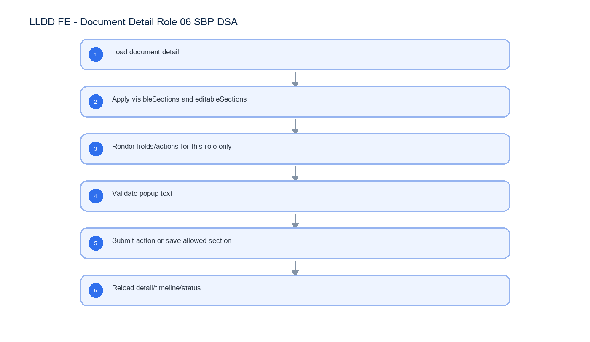

# LLDD FE - Document Detail Role 06 SBP DSA

SBP Mall - ระบบประกันรายได้ | Low Level Design Document

## 1. Overview

| รายการ | รายละเอียด |
| --- | --- |
| Track | FE |
| Estimate | 10 ชั่วโมง |
| Owner | Kittisak <New> Kaeowika |
| Objective | อธิบายหน้าจอ Document Detail สำหรับ role 06 - ฝ่าย SBP DSA |

Common contract reference: ทุกหัวข้อ API/FE ต้องยึด LLDD-BE-API-Common-Contracts และ LLDD-FE-Integration-Contracts สำหรับ error/auth/format/pagination/action/RBAC ก่อนลงรายละเอียดเฉพาะหน้าหรือเฉพาะ endpoint

## 2. Screen / Functional Scope

- Role profile P-06 - ฝ่าย SBP DSA
- Visible/read-only/hidden section behavior
- Editable field and validation behavior
- Attachment upload behavior
- Action panel options and API response sample

## 4. Implementation Flow Diagram (Reference)



_รูปที่ 1: Implementation flow reference: LLDD FE - Document Detail Role 06 SBP DSA_

## 5. Field, Format, and Validation

| Field / UI | Format | Validation | Behavior |
| --- | --- | --- | --- |
| roleProfileCode | P-06 | must match API response | ใช้เลือก view profile เฉพาะบทบาทนี้; แยก namespace จาก workflow section code |
| statusCode | 06 | from API | workflow status/section code ปัจจุบัน ไม่ใช่ role profile |
| visibleSections | string[] | from API | FE แสดงเฉพาะ section ใน array |
| editableSections | string[] | from API | FE เปิด input/button เฉพาะ section ใน array |
| actionOptions | array | from API | FE render radio จาก array โดยไม่ hardcode |

### 5.1 Role View Summary

| Item | Value |
| --- | --- |
| Role profile | P-06 - ฝ่าย SBP DSA |
| Workflow section/status code | 06 |
| Document status shown | รอฝ่าย SBP DSA ดำเนินการ |
| Purpose on this page | ตรวจความครบถ้วนเบื้องต้นและเลือกส่งต่อ/ยุติตามผลพิจารณา |
| Editable sections | - |
| Hidden sections | sec-calc |
| Attachment upload | Allowed |

### 5.2 What This Role Sees

- เห็นข้อมูลเอกสารครบสำหรับตรวจสอบ แต่ทุก section เนื้อหาเป็น read-only
- เพิ่มเอกสารแนบประกอบการพิจารณาได้
- ไม่เห็น section คำนวณเงินชดเชย

### 5.3 Section-by-section Behavior

| Section key | UI section | State for this role | Control behavior |
| --- | --- | --- | --- |
| doc-header | ข้อมูลร้านถูกกระทบ | Read-only | แสดงข้อมูลและปิด input/editor |
| sec-sales | แนวโน้มยอดขายรายวัน | Read-only | แสดงข้อมูลและปิด input/editor |
| sec-map | แผนที่ AllMap | Read-only | แสดงข้อมูลและปิด input/editor |
| sec-newstore | ร้านเปิดใหม่ | Read-only | แสดงข้อมูลและปิด input/editor |
| sec-competitor | ร้านคู่แข่งเปิดกระทบ | Read-only | แสดงข้อมูลและปิด input/editor |
| sec-factor | ปัจจัยอื่นๆ | Read-only | แสดงข้อมูลและปิด input/editor |
| sec-attach | เอกสารแนบทั้งหมด | Read-only + Upload | ดูรายการไฟล์และเพิ่มไฟล์แนบได้ |
| sec-calc | คำนวณเงินชดเชย | Hidden | ไม่ render section |
| sec-comp-history | ประวัติการชดเชย | Read-only | แสดงข้อมูลและปิด input/editor |
| sec-decision-history | ผลการพิจารณา (ประวัติ) | Read-only | แสดงข้อมูลและปิด input/editor |
| sec-action | พิจารณา / ส่งดำเนินการ | Action | แสดง radio result, textarea comment, ปุ่มส่งดำเนินการ |

### 5.4 Editable Form Fields

| Area | Fields | Validation / Behavior |
| --- | --- | --- |
| เอกสารแนบ | file, fileName, attachmentType, remark | เพิ่มไฟล์ได้; ขนาด <= 5 MB; extension ต้องอยู่ใน allowlist |
| แผงพิจารณา | result, comment | result required; comment required เมื่อเลือก เห็นควรไม่ชดเชย |

### 5.5 Action Panel

FE ต้อง render ตัวเลือกจาก `actionOptions` ที่ API ส่งมาเท่านั้น และส่ง payload `{result,comment}` โดยไม่คำนวณปลายทาง action เอง

| Radio option | Comment rule |
| --- | --- |
| เห็นควรไม่ชดเชย | ต้องกรอก comment |
| หยุดชดเชยประกันรายได้ | comment optional |
| ส่งฝ่ายส่งเสริมธุรกิจ SBP | comment optional |
| ส่งเจ้าหน้าที่ SBP DSA ดำเนินการ | comment optional |

### 5.6 API Response Example

#### GET /api/v1/documents/{docNo} response

```json
{
  "docNo": "2569/00123",
  "statusCode": "06",
  "viewerRbacRoleCode": "R-XX",
  "roleProfileCode": "P-06",
  "visibleSections": [
    "doc-header",
    "sec-sales",
    "sec-map",
    "sec-newstore",
    "sec-competitor",
    "sec-factor",
    "sec-attach",
    "sec-comp-history",
    "sec-decision-history",
    "sec-action"
  ],
  "editableSections": [],
  "canUploadAttachment": true,
  "canAction": true,
  "actionOptions": [
    {
      "label": "เห็นควรไม่ชดเชย",
      "requireComment": true
    },
    {
      "label": "หยุดชดเชยประกันรายได้",
      "requireComment": false
    },
    {
      "label": "ส่งฝ่ายส่งเสริมธุรกิจ SBP",
      "requireComment": false
    },
    {
      "label": "ส่งเจ้าหน้าที่ SBP DSA ดำเนินการ",
      "requireComment": false
    }
  ]
}
```

### 5.7 Validation Popup Text

| Condition | Popup message |
| --- | --- |
| กดส่งดำเนินการโดยไม่เลือกผลการพิจารณา | ท่านยังไม่เลือกผลการพิจารณา กรุณาเลือกข้อมูลก่อนกดส่งดำเนินการ |
| result ที่ requireComment=true แต่ comment ว่าง | กรุณากรอกความคิดเห็นเพิ่มเติม (บังคับกรอกสำหรับผลการพิจารณานี้) ก่อนส่งดำเนินการ |
| ผลรวม %ชดเชยร้านเปิดใหม่ไม่เท่ากับ 100 | โปรดตรวจสอบ %ชดเชย ของท่าน รวมกันแล้วไม่เท่ากับ 100% |

### 5.8 Role-specific Test Checklist

| No | Test |
| --- | --- |
| 1 | เปิดด้วย roleProfileCode=P-06 แล้ว sec-calc ต้องไม่ render |
| 2 | section ร้านเปิดใหม่/คู่แข่ง/ปัจจัยต้องไม่มี input/edit/delete/save |
| 3 | ไม่เลือก result แล้วกดส่ง ต้องแสดง popup verbatim |
| 4 | เลือก เห็นควรไม่ชดเชย โดยไม่กรอก comment ต้อง error ACTION_COMMENT_REQUIRED |
| 5 | upload ไฟล์เกิน 5 MB ต้อง error FILE_TOO_LARGE |

## 5.1 Input / Progress / Output Contract

| Stage | Contract for implementation |
| --- | --- |
| Input | GET /api/v1/documents/{docNo}; POST /api/v1/documents/{docNo}/actions |
| Progress | Load document detail; Apply visibleSections and editableSections; Render fields/actions for this role only; Validate popup text |
| Output | Rendered UI state or normalized API response with status/message and audit-ready trace reference. |

### 5.90 Document Detail Role 06 SBP DSA Implementation Steps

| Step | Implementation detail | Check |
| --- | --- | --- |
| Load exact profile | เรียก GET /api/v1/documents/{docNo} และยืนยัน roleProfileCode=P-06, statusCode=06 ก่อน render action state | profile mismatch ต้อง fail closed; ไม่ใช้ role switcher เพื่อจำลอง P-06 |
| Render profile sections | render เฉพาะ visibleSections ของ P-06: doc-header, sec-sales, sec-map, sec-newstore, sec-competitor, sec-factor, sec-attach, sec-comp-history, sec-decision-history, sec-action; ซ่อน: sec-calc | section ที่ซ่อนต้องไม่อยู่ใน DOM และ section key ที่ไม่รู้จักต้อง log/ignore แบบ fail closed |
| Apply edit boundary | เปิด mutation control เฉพาะ editableSections ของ P-06: ไม่มี; business section ทั้งหมด read-only | read-only section ไม่มี focusable input/save/add/delete และ payload ต้องไม่มี field นอก editableSections |
| Attachment control | canUploadAttachment=true สำหรับ SBP DSA; ใช้ allowlist, 5 MB และ scan-status contract | ปุ่ม upload ตรง flag, FILE_TOO_LARGE/FILE_SCAN_BLOCKED แสดงที่ attachment section |
| Render exact action set | แสดง actionOptions ของ P-06 เท่านั้น: เห็นควรไม่ชดเชย; หยุดชดเชยประกันรายได้; ส่งฝ่ายส่งเสริมธุรกิจ SBP; ส่งเจ้าหน้าที่ SBP DSA ดำเนินการ; comment rules: เห็นควรไม่ชดเชย: ต้องกรอก comment; หยุดชดเชยประกันรายได้: comment optional; ส่งฝ่ายส่งเสริมธุรกิจ SBP: comment optional; ส่งเจ้าหน้าที่ SBP DSA ดำเนินการ: comment optional | radio label/requireComment มาจาก API และ FE ไม่คำนวณ nextSection |
| Submit and reload | ส่ง result/comment สำหรับ P-06 แล้ว invalidate detail, timeline, task/list cache | หลัง submit ต้องโหลด status/actionOptions ใหม่และไม่คง action set ของ P-06 เมื่อ workflow เปลี่ยนขั้น |

## 6. Button / User Action Mapping

| Action | Trigger | API / Service | Expected Result |
| --- | --- | --- | --- |
| Load detail | เปิดเอกสาร | GET /api/v1/documents/{docNo} | render role profile |
| Save editable section | ปุ่มบันทึก | PUT /api/v1/documents/{docNo} | ใช้เฉพาะ role ที่มี editableSections |
| Upload attachment | เลือกไฟล์ | POST /api/v1/documents/{docNo}/attachments | append attachment when allowed |
| Submit action | ปุ่มส่งดำเนินการ | POST /api/v1/documents/{docNo}/actions | submit selected result |

## 7. API Contract

### GET /api/v1/documents/{docNo}

โหลด role profile P-06 สำหรับหน้า detail

#### Query Params

```json
{
  "docNo": "2569/00123"
}
```

#### Request Field Schema

| Field | Type | Required | Constraint / Meaning |
| --- | --- | --- | --- |
| docNo | string | No | พ.ศ. YYYY/xxxxx |

#### Response

```json
{
  "docNo": "2569/00123",
  "statusCode": "06",
  "viewerRbacRoleCode": "R-XX",
  "roleProfileCode": "P-06",
  "visibleSections": [
    "doc-header",
    "sec-sales",
    "sec-map",
    "sec-newstore",
    "sec-competitor",
    "sec-factor",
    "sec-attach",
    "sec-comp-history",
    "sec-decision-history",
    "sec-action"
  ],
  "editableSections": [],
  "actionOptions": [
    {
      "label": "เห็นควรไม่ชดเชย",
      "requireComment": true
    },
    {
      "label": "หยุดชดเชยประกันรายได้",
      "requireComment": false
    },
    {
      "label": "ส่งฝ่ายส่งเสริมธุรกิจ SBP",
      "requireComment": false
    },
    {
      "label": "ส่งเจ้าหน้าที่ SBP DSA ดำเนินการ",
      "requireComment": false
    }
  ]
}
```

#### Response Field Schema

| Field | Type | Required | Constraint / Meaning |
| --- | --- | --- | --- |
| docNo | string | Yes | พ.ศ. YYYY/xxxxx |
| statusCode | string | Yes | canonical code; do not replace with display label |
| viewerRbacRoleCode | string | Yes | UTF-8; use value domain described by endpoint purpose |
| roleProfileCode | string | Yes | UTF-8; use value domain described by endpoint purpose |
| visibleSections | array<string> | Yes | JSON array; element type shown in Type column |
| editableSections | array<object> | Yes | JSON array; element type shown in Type column |
| actionOptions | array<object> | Yes | JSON array; element type shown in Type column |
| actionOptions[].label | string | Yes | UTF-8; use value domain described by endpoint purpose |
| actionOptions[].requireComment | boolean | Yes | UTF-8; use value domain described by endpoint purpose |

### POST /api/v1/documents/{docNo}/actions

ตัวอย่าง positive-path จาก section 06; Section 02 ใช้กรณียอดรวมมากกว่า 100,000 บาท

#### Request

```json
{
  "result": "ส่งเจ้าหน้าที่ SBP DSA ดำเนินการ",
  "comment": "ส่งดำเนินการตามลำดับ"
}
```

#### Request Field Schema

| Field | Type | Required | Constraint / Meaning |
| --- | --- | --- | --- |
| result | string | Yes | UTF-8; use value domain described by endpoint purpose |
| comment | string | Yes | trimmed UTF-8 Thai text; required by operation/business rule |

#### Response

```json
{
  "statusCode": "08",
  "nextSection": "08",
  "message": "submitted"
}
```

#### Response Field Schema

| Field | Type | Required | Constraint / Meaning |
| --- | --- | --- | --- |
| statusCode | string | Yes | canonical code; do not replace with display label |
| nextSection | string | Yes | canonical code; do not replace with display label |
| message | string | Yes | UTF-8; use value domain described by endpoint purpose |

## 9. Processing Flow

| Step | Description |
| --- | --- |
| 1 | Load document detail |
| 2 | Apply visibleSections and editableSections |
| 3 | Render fields/actions for this role only |
| 4 | Validate popup text |
| 5 | Submit action or save allowed section |
| 6 | Reload detail/timeline/status |

## 10. Acceptance Criteria

- ไม่แสดง role switcher ใน production
- section ที่ hidden ต้องไม่ render
- section ที่ read-only ต้องไม่มี editable control
- action panel ตรงกับ actionOptions จาก API

## 11. Developer Test Checklist

| No | Test |
| --- | --- |
| 1 | เปิดด้วย roleProfileCode=P-06 แล้ว sec-calc ต้องไม่ render |
| 2 | section ร้านเปิดใหม่/คู่แข่ง/ปัจจัยต้องไม่มี input/edit/delete/save |
| 3 | ไม่เลือก result แล้วกดส่ง ต้องแสดง popup verbatim |
| 4 | เลือก เห็นควรไม่ชดเชย โดยไม่กรอก comment ต้อง error ACTION_COMMENT_REQUIRED |
| 5 | upload ไฟล์เกิน 5 MB ต้อง error FILE_TOO_LARGE |
